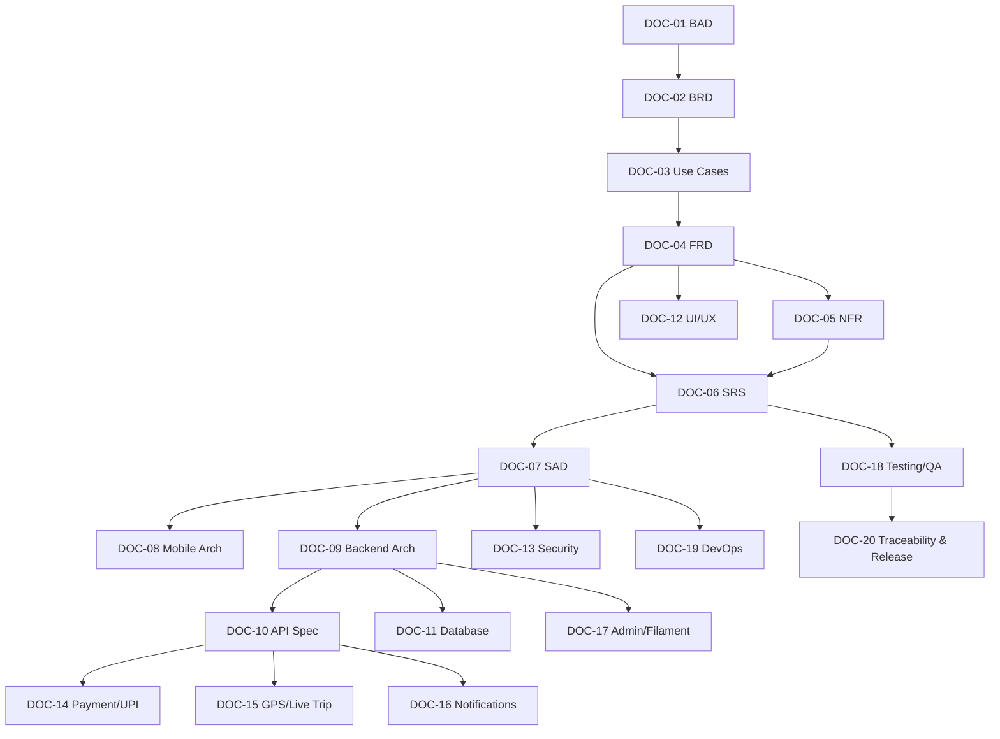

# Documentation Status — Carpool Mobility Platform (CMP)

**Control Document — Lifecycle Status Tracking**

| Field | Value |
|---|---|
| Document ID | CMP-CTRL-STATUS |
| Document Name | Documentation Status |
| Project Name | Carpool Mobility Platform |
| Project Code | CMP |
| Version | 5.1 |
| Status | Draft |
| Date | 2026-08-20 |
| Author | Documentation Manager (AI-assisted) |
| Reviewer | [TBD] |
| Approver | Project Owner |
| Classification | Internal |
| Brand | TBD |
| Previous Version | 5.0 (2026-08-21) |
| Related Documents | README.md, Documentation_Index.md, Document_Change_Log.md, Glossary.md, Master_Traceability_Matrix.md |

---

## 1. Purpose

This document tracks the lifecycle status of every planned document in the CMP
documentation repository, together with prerequisites and readiness. It is the
authoritative answer to *"where are we in the documentation programme?"*

## 2. Status Definitions

| Status | Meaning |
|---|---|
| Not Started | Document has not been created. No file exists. |
| Draft | Document exists and is being authored/iterated. Versions 0.x. |
| Under Review | Document is complete enough for Project Owner / stakeholder review. |
| Approved | Explicitly approved by the Project Owner. Version 1.0 or later. |
| Superseded | Replaced by a newer version or a different document. Retained for history. |
| Deprecated | No longer applicable. Retained for history. |

> **RULE.** No document may be marked `Approved` unless the Project Owner explicitly
> approves it.

## 3. Overall Programme Status

| Metric | Value |
|---|---|
| Reporting date | 2026-08-19 |
| Repository initialized | Yes |
| Project Control files created | 6 of 6 |
| Formal documents planned | 20 |
| Not Started | **0** |
| Draft | **20** (CMP-DOC-01 … CMP-DOC-20) |
| Under Review | 0 |
| Approved | 0 |
| Superseded | 0 |
| Deprecated | 0 |
| Overall documentation completion | **100% drafted, 0% approved** |
| Traceable IDs issued | 3,822 (78 `BAD-BR` + 188 `BRD-REQ` + 83 `UC` + 260 `FRD-FR` + 162 `NFR` + 184 `SRS-REQ` + 148 `ARCH` + 168 `MOB` + 218 `BE` + 219 `API` + 232 `DB` + 244 `SEC` + 224 `UX` + 208 `PAY` + 196 `GPS` + 188 `NOTIF` + 204 `ADM` + 216 `TC` + 210 `OPS` + 192 `TR`) |
| All statements issued | 1,992 |
| Planning artefacts issued | **2** (§5A) — outside the formal chain |
| Planning identifiers issued | 562 `CMP-IMP-` (507 live, 55 withdrawn) + 45 `FEAT-` — **not counted in the 3,822** |

> **The two counts are separate on purpose.** `CMP-IMP-` and `FEAT-` are planning
> identifiers, not chain identifiers; folding them into the 3,813 would overstate the
> specification. See `Documentation_Index.md` §5.21.

## 4. Project Control File Status

| ID | File | Version | Status | Last Updated |
|---|---|---|---|---|
| CMP-CTRL-README | README.md | **0.4** | Draft | **2026-08-19** |
| CMP-CTRL-INDEX | Documentation_Index.md | **4.4** | Draft | **2026-08-20** |
| CMP-CTRL-STATUS | Documentation_Status.md | **4.4** | Draft | **2026-08-20** |
| CMP-CTRL-CHANGELOG | Document_Change_Log.md | **4.4** | Draft | **2026-08-20** |
| CMP-CTRL-GLOSSARY | Glossary.md | 3.1 | Draft | 2026-08-17 |
| CMP-CTRL-RTM | Master_Traceability_Matrix.md | **3.8** | Draft | **2026-08-20** |

## 5. Documentation Roadmap Status

| ID | Short Name | Document | Version | Status | Owner Role |
|---|---|---|---|---|---|
| DOC-01 | BAD | Business Analysis Document | **0.2** | **Draft — awaiting Project Owner review** | Business Analyst |
| DOC-02 | BRD | Business Requirements Document | **0.1** | **Draft — awaiting Project Owner review** | Business Analyst |
| DOC-03 | USE CASE | Stakeholder & Use Case Specification | **0.1** | **Draft — awaiting Project Owner review** | Business / Product Analyst |
| DOC-04 | FRD | Functional Requirements Document | **0.3** | **Draft — awaiting Project Owner review** | Product Analyst |
| DOC-05 | NFR | Non-Functional Requirements / Quality Attributes | **0.1** | **Draft — awaiting Project Owner review** | Solution Architect |
| DOC-06 | SRS | Software Requirements Specification | **0.1** | **Draft — awaiting Project Owner review** | Solution Architect |
| DOC-07 | SAD | System Architecture Document | **0.1** | **Draft — awaiting Project Owner review** | Solution Architect |
| DOC-08 | MOBILE | Mobile Architecture Document | **0.1** | **Draft — awaiting Project Owner review** | Software Architect (Android) |
| DOC-09 | BACKEND | Backend Architecture Document | **0.2** | **Draft — awaiting Project Owner review** | Software Architect (Laravel) |
| DOC-10 | API | API Specification | **0.3** | **Draft — awaiting Project Owner review** | Software Architect / Backend Lead |
| DOC-11 | DATABASE | Database Design Document | **0.1** | **Draft — awaiting Project Owner review** | Software Architect / Backend Lead |
| DOC-12 | UI/UX | UI/UX Specification | **0.1** | **Draft — awaiting Project Owner review** | UI/UX Designer |
| DOC-13 | SECURITY | Security Design | **0.5** | **Draft — awaiting Project Owner review** | Security Analyst |
| DOC-14 | PAYMENT | Payment & UPI Specification | **0.1** | **Draft — awaiting Project Owner review** | Solution Architect / Payments |
| DOC-15 | GPS | GPS / Live Trip Specification | **0.1** | **Draft — awaiting Project Owner review** | Software Architect |
| DOC-16 | NOTIFICATION | Communication & Notification Specification | **0.1** | **Draft — awaiting Project Owner review** | Software Architect |
| DOC-17 | ADMIN | Admin / Filament Specification | **0.1** | **Draft — awaiting Project Owner review** | Backend Lead / Product Analyst |
| DOC-18 | TESTING | Testing & QA Documentation | **0.1** | **Draft — awaiting Project Owner review** | QA Analyst |
| DOC-19 | DEVOPS | DevOps / Deployment Documentation | **0.2** | **Draft — awaiting Project Owner review** | DevOps Engineer |
| DOC-20 | TRACEABILITY | Requirements Traceability & Release Documentation | **0.2** | **Draft — awaiting Project Owner review** | Documentation Manager |
| DOC-20A | TRACEABILITY | Review of the 37 Uncited Integrity-Critical Requirements (annex) | **0.1** | **Draft — awaiting Project Owner review** | Documentation Manager |

> **ASSUMPTION.** The Owner Role column records the *discipline* expected to own each
> document. Named individuals are `[TBD – Business Decision Required]`.

## 5A. Planning Artefact Status — Outside the Formal Chain

Parallel to §5, and registered in `Documentation_Index.md` §3A. These are **planning
artefacts, not specification documents**: they decompose the chain into implementation work
and report what that decomposition found. They create no requirement, take no business
decision and close no gap.

Section 5A is lettered rather than numbered so that existing cross-references to §6, §7 and
§8 remain valid.

| ID | Short Name | Artefact | Version | Status | Owner Role |
|---|---|---|---|---|---|
| CMP-PLAN-IMPL-TRACKER | TRACKER | Implementation Work Register | **0.1** | **Draft — awaiting Project Owner review** | Technical Project Manager |
| CMP-PLAN-IMPL-ANALYSIS | ANALYSIS | Implementation Analysis | **0.1** | **Draft — awaiting Project Owner review** | Technical Project Manager |

### 5A.1 Lifecycle differences from §5

The status vocabulary of §2 applies unchanged, but three lifecycle rules do **not** carry
over from the formal chain:

| Rule for the formal chain | Position for planning artefacts |
|---|---|
| Baselining proceeds in chain order, CMP-DOC-01 first (`TRDR-13`) | **Does not apply.** These sit outside the chain and have no position in the baselining order. |
| A document is `Approved` only at version 1.0 or later | Applies. Neither is approved, and approval here means the Project Owner accepts the work breakdown — **not** that any work is complete. |
| A revision to a predecessor requires the successor to be reissued | **Weaker.** A change to the chain does not oblige a reissue; it makes the artefact **stale**, which is recorded here rather than forced. |

> **A planning artefact is not evidence of progress.** The register is issued with **496 work
> items at `Not Started` and 11 at `Blocked`, and nothing at any other status**. No code
> exists. `Draft` here describes the maturity of the *plan*, not of the platform.

### 5A.2 Current position

| Measure | Value |
|---|---|
| Implementation work items | **507**, across 39 features |
| Estimated effort | 3,802 hours |
| Allocated to the 15-day window | 336 items, 2,540 hours — **dependency-ordered, not capacity-fitted** |
| Blocked on an unset value or unselected supplier | 11 |
| Work IDs issued / withdrawn | 562 / **55** |
| Staleness against the chain | **Current** as at 2026-08-19. Any revision to CMP-DOC-01 … CMP-DOC-20 makes both artefacts stale; record it here. |
| Register corrections outstanding | **2.** `CC-026` — `CMP-IMP-047` named an *"evidential-write account"* the design does not define; corrected 2026-08-19 on Project Owner instruction. `CC-027` — `CMP-IMP-025` describes the table in the singular where `DB-015` requires the plural; **correction outstanding**. |

> **Both artefacts were produced from twenty unapproved predecessors.** Recorded as `CC-024`
> in `Document_Change_Log.md`, rated **High** impact. **The register must not be treated as a
> construction baseline until the chain is approved.**

> **Status columns are the Project Owner's.** Implementation began on 2026-08-19 under the
> technical decisions ratified in `Document_Change_Log.md` entry 087, and work items
> `CMP-IMP-021` … `CMP-IMP-025`, `034`, `038`, `039`, `044` … `047` have been implemented,
> tested and committed. **No status column in the register has been changed**, so the counts
> above still read as at issue. What has actually been built is recorded in the Git history
> of `https://github.com/arindamuaguria/carpool-mobility-platform.git`, not here.

## 6. Prerequisite / Dependency View

Documents must not be produced in isolation. The intended controlled chain is:

| ID | Prerequisite Documents | Prerequisites Satisfied? | Ready to Author? |
|---|---|---|---|
| DOC-01 | None (entry document) | Yes | **Drafted at v0.1 — awaiting review** |
| DOC-02 | DOC-01 | Partially — DOC-01 exists but is not approved | **Drafted at v0.1 on Project Owner instruction.** See §7.1 |
| DOC-03 | DOC-02 | Partially — DOC-02 exists but is not approved, and 79 of its 188 requirements are blocked | **Partially.** Only the 109 Ready requirements could be elaborated. See §7.1 |
| DOC-04 | DOC-03 | Partially — DOC-03 exists but is not approved, and 33 of its 83 use cases are Outlined | **Partially.** Only the 44 Specified and 6 Partial use cases could be decomposed. |
| DOC-05 | DOC-04 | Partially — DOC-04 exists but is not approved | **Yes.** NFR is largely independent of the open business decisions and is the recommended next document. |
| DOC-06 | DOC-04, DOC-05 | Partially — both exist but neither is approved | **Yes.** Both prerequisites now exist; the SRS may allocate the ~180 unblocked functional requirements and the 93 enforceable quality requirements. |
| DOC-07 | DOC-06 | Partially — DOC-06 exists but is not approved | **Yes.** Allocation is complete; 8 technical decisions are routed to it. Sizing is limited by the 69 unset quality targets. |
| DOC-08 | DOC-07 | Partially — DOC-07 exists but is not approved | **Yes.** Client component architecture and runtime views are specified. May proceed in parallel with DOC-09. |
| DOC-09 | DOC-07 | Partially — DOC-07 exists but is not approved | **Yes.** Platform, persistence, integration and work-subsystem architecture are specified. May proceed in parallel with DOC-08. |
| DOC-10 | DOC-09 | Partially — DOC-09 exists but is not approved | **Yes.** The four interface surfaces, versioning, idempotency handling and the four error branches are specified. |
| DOC-11 | DOC-09 | Partially — DOC-09 exists but is not approved | **Yes**, subject to launch-scale (`BE-OQ-01`), which index and partitioning strategy depend on. |
| DOC-12 | DOC-04 | Partially — DOC-04 and DOC-08 exist but neither is approved | **Yes.** 44 Specified use cases plus the state, navigation and error model from CMP-DOC-08 §17.5. Accessibility standard still unchosen. |
| DOC-13 | DOC-07 | Partially — DOC-07 exists but is not approved | **Yes, and recommended early** (CMP-DOC-07 `AR-09`). Four security properties are stated but unmechanised, two of which the evidential log depends on. |
| DOC-14 | DOC-10 | No | No |
| DOC-15 | DOC-10 | No — DOC-10 not started | No. Client-side tracking architecture is now specified (CMP-DOC-08 §8.1), but the telemetry interface awaits DOC-10. |
| DOC-16 | DOC-10 | No | No |
| DOC-17 | DOC-09 | Partially — DOC-09 exists but is not approved | **Yes.** `BE-074`–`BE-082` bind it absolutely. |
| DOC-18 | DOC-06 | No | No |
| DOC-19 | DOC-07 | No | No |
| DOC-20 | DOC-18 | No | No |

> **RECOMMENDATION.** The dependency graph above expresses the *preferred* authoring
> order. It does not prevent the Project Owner from requesting any document at any
> time; where a prerequisite is missing, the resulting document will contain a larger
> number of `ASSUMPTION` and `TBD` entries, and this will be stated explicitly in that
> document.

## 7. Next Action

| Item | Value |
|---|---|
| Last document produced | **CMP-DOC-20A TRACEABILITY annex v0.1 (Draft)** — 2026-08-17 |
| Immediate next action | **Project Owner review of CMP-DOC-01 … CMP-DOC-09.** No further document is to be generated until explicitly requested. |
| Next document in sequence | **None — the chain is complete.** The next action is approval, not authoring. |
| Target location | — |
| Trigger | Explicit Project Owner command |
| Current state | Not Started |

### 7.1 Readiness Position After DOC-10

**The contract layer is complete.** System, client and backend architecture are specified
and the interface between them is now written. Ten documents are drafted and none is
approved. Every remaining design document is unblocked except DevOps.

| Document | Readiness | Note |
|---|---|---|
| **DOC-11 Database Design** | **Ready — the natural next step** | Nine aggregates, exact monetary representation (`BE-095`, `API-016`), the allocation record and the evidential chain are specified, plus three obligations from CMP-DOC-10 §17.7 (opaque non-enumerable identifiers, stable cursors). **Index and partitioning strategy still depend on launch scale (`GAP-016`), which is unset.** |
| **DOC-13 Security Design** | **Ready, and now overdue** (`AR-09`) | Four system security properties unmechanised, 8 on-device properties, authorisation placement from CMP-DOC-09 §14, **and the two requirement-chain gaps at `API-053` and `API-109` that no other document is the right home for**. |
| **DOC-12 UI/UX** | **Ready** | 44 Specified use cases, the client state and navigation model, and now four concrete error treatments and an as-of marking on every value to design for (CMP-DOC-10 §17.7). |
| **DOC-14 Payment & UPI** | **Ready** | The payment resources (§11.8) and the callback shape (§13) are specified. Provider still `[TBD]` (`BE-161`). |
| **DOC-15 GPS / Live Trip** | **Ready** | Unblocked by DOC-10. Position operations (§11.9) and the cadence and staleness values (§14.2) are specified. |
| **DOC-16 Communication & Notification** | **Ready** | Notification resources (§11.11) specified. |
| **DOC-17 Admin / Filament** | **Ready** | `BE-074`–`BE-082` bind it. Projection inventory (`BE-129`) to be settled there. `API-OQ-03` asks whether it consumes this interface or only Filament. |
| **DOC-18 Testing** | **Ready** | 606-requirement baseline, 62 system structural verifications, the client's negative tests, 9 backend test obligations, and 3 API contract test obligations (`API-213`–`API-215`). |
| **DOC-19 DevOps** | **Blocked for sizing** | 11 sizing decisions (`GAP-014`) and launch scale (`GAP-016`), plus the safety deployment form (`BE-198`) and the safety prefix routing obligation (CMP-DOC-10 §17.7). |

| # | Constraint | Effect |
|---|---|---|
| 1 | **No predecessor is approved.** Ten documents rest on an unapproved baseline, and **the tenth is the first that will be implemented literally**. | Conflicts `CC-002` … `CC-010`. An error in CMP-DOC-10 becomes running code rather than a misunderstanding. |
| 2 | **69 unset quality targets** (`GAP-012`) and **launch scale unknown** (`GAP-016`). | **The binding constraint.** Nine API tuning values, three backend assumptions and CMP-DOC-11's entire index strategy all wait on figures nobody has supplied. |
| 3 | **Fraud remains unowned** (`GAP-013`). | Passed through **ten** documents. CMP-DOC-10 `API-206` had to state explicitly that the interface takes no fraud decision — an odd thing for a specification to have to say. |
| 4 | **Two live product defects** (`GAP-008`, `GAP-009`), now compounded by **four further money decisions**. | CMP-DOC-14 §15 records six unresolved money decisions. **Money arrives from day one and there is no specified way to pay anyone** (`PAY-RISK-06`, severity 20), and the seat-versus-payment case (`PAY-175`) is reachable today through fully specified behaviour with no defined resolution. |
| 5 | **Device range and accessibility standard unchosen** (`MOB-OQ-001`, `MOB-OQ-002`). | Blocks the lowest-class targets and constrains CMP-DOC-12; both are free to decide now. |
| 6 | ~~Two requirement-chain gaps~~ | **CLOSED.** CMP-DOC-13 §11 and §12 adopt both, closing `BE-OQ-08`, `BE-OQ-09`, `API-OQ-05` and `DB-OQ-08`. |
| 7 | **Eleven API resources withheld** (CMP-DOC-10 §11.14). | Wallet, rewards, refunds, disputes, referrals, recurring commute and fraud have no interface because they have no decided behaviour. `API-RISK-07` is that developers will build them ad hoc. |
| 8 | **The administrative role set does not exist** (`SEC-063`, `ADM-166`). | **Blocks deployment of the administrative surface**, not merely a feature: deny-by-default means an operator with no role can do nothing (`ADM-168`). CMP-DOC-17 §13.3 reduces the work to selecting from twelve capabilities. |
| 9 | **Five operator capabilities withheld** (CMP-DOC-17 §15). | Two are operationally serious: **no operator can adjudicate a verification submission** (`BAD-DEC-005`) and **no operator can change an account state** (`BAD-DEC-006`), so a safety responder can close an incident and take no action against the account involved. |
| 10 | **99 verification obligations against 1,164 integrity-critical statements** (CMP-DOC-18 §4.4). | The statement-by-statement mapping (`TC-017`) has not been done, and `TC-020` forbids reporting a coverage figure until it has. This is the largest single piece of work the documentation chain creates. |
| 11 | **21 sizing decisions and no figure to take one with** (CMP-DOC-19 §4). | Deployment is the first place where structure and quantity stop being separable. `OPS-014` records that the document specifies a deployment's properties and cannot specify a deployment; **nothing can be provisioned until the 21 are resolved**, and 11 of them fall out of `BAD-DEC-018` alone. |
| 12 | **Two owed procedures cannot be completed** (CMP-DOC-19 §15.2). | Restore-versus-retention is blocked on eight unset retention periods (`BAD-DEC-021`); incident response is blocked on having no owner (`SEC-OQ-07`) and no notification position (`SEC-OQ-02`). Both are specified structurally and **neither can be executed**. |
| 13 | **177 requirements carry no downstream citation, 31 of them integrity-critical** (CMP-DOC-20 §5.2 at v0.2). | The chain anchors design statements to business rules rather than to the requirements derived from them (`TR-034`). **All 31 are now reviewed** (CMP-DOC-20A): 27 are realised and need 72 citations added across 11 documents; three need a gap; one is superseded. The remaining 146 non-integrity-critical are unreviewed. |
| 15 | **`NFR-138` is realised nowhere in the chain** (`GAP-018`, CMP-DOC-20A §2.4). | Recording each user's agreement to the rules of participation, with the version agreed, is required by `BRD-CMP-008` and integrity-critical at `NFR-138`. **No table, no operation, no screen, no backend statement exists.** It is not withheld and it is not one of the 29 functional gaps — it was simply not carried forward. |
| 14 | **One of twelve release criteria is met** (CMP-DOC-20 §11.1). | Eight are not met and three are not started. **Seven of the eleven unmet are blocked on a Project Owner decision, not on delivery capacity** (`TR-125`). Approving CMP-DOC-01 unblocks the approval of all nineteen others (`TR-156`). |

**RECOMMENDATION (CMP-DOC-07 `AR-01`, `AR-09`; CMP-DOC-09 `R-1`–`R-6`; CMP-DOC-10
`R-1`–`R-6`).**

1. **Build the structural and contract enforcement first** — the 8 backend static analysis
   rules (CMP-DOC-09 §17.2) and the 3 API contract tests (`API-213`–`API-215`). The
   four-branch test is the one that matters most: `API-RISK-02` is severity 20, and the
   four branches quietly collapse into two under deadline pressure.
2. **Write the concurrency test (`BE-208`) before the booking service.**
3. **Obtain a launch-scale figure before DOC-11.**
4. **Bring DOC-13 forward and give it the two chain gaps explicitly.**
5. **Resolve `GAP-008` and `GAP-009` before any payment endpoint is built.**
6. **Assign fraud to a component and an interface position** — overdue by ten documents.
7. **Commission DOC-11 next**, subject to constraint 2.

This is advice; the Project Owner may direct otherwise.

## 7.2 Outstanding Items Across the Documentation Chain

| Category | Count | Reference |
|---|---|---|
| Business decisions required | 24 (0 resolved) | CMP-DOC-01 §27 |
| — of which block requirements | 17 | CMP-DOC-02 §18.1 |
| Open questions — CMP-DOC-01 / 02 / 03 | 31 + 12 + 10 = 53 | §26.1 / §17 / §14 |
| Assumptions requiring validation | 15 + 10 + 7 = 32 | §26.2 / §13 / §12 |
| Risks scoring 9 | 3 + 2 + 2 = 7 | `BAD-RISK-001/002/005`, `BRD-RISK-002/009`, `UC-RISK-003/004` |
| Business rules undecided | 11 of 42 | CMP-DOC-01 §14.9, CMP-DOC-02 §10.3, CMP-DOC-03 §9.2 |
| Business requirements blocked | 79 of 188 (42%) | CMP-DOC-02 §20.2 |
| **Use cases Outlined (behaviour unwritten)** | **33 of 83 (40%)** | CMP-DOC-03 §10.1 |
| Use cases fully specified | 44 of 83 (53%) | CMP-DOC-03 §16.2 |
| Functional requirements issued | 260 | CMP-DOC-04 §16.1 |
| — integrity-critical (‡, non-negotiable) | 81 | CMP-DOC-04 Appendix A.2 |
| — buildable with no open dependency | ~180 (69%) | CMP-DOC-04 §16.2 |
| **Functional gaps (behaviour unspecifiable)** | **29, of which 11 Critical** | CMP-DOC-04 §9.3 |
| Functional areas with zero requirements | 3 | CMP-DOC-04 §9.2 |
| Quality requirements issued | 162 | CMP-DOC-05 §24.1 |
| — enforceable without further decision | 93 (57%) | CMP-DOC-05 §0.8.3 |
| — Absolute, rule-derived (‡) | 44 | CMP-DOC-05 Appendix B |
| — awaiting a numeric target from `BAD-DEC-018` | 47 | CMP-DOC-05 §22 |
| Quality trade-offs requiring an owner's decision | 4 | CMP-DOC-05 §4.3 |
| Software requirements issued | 184 | CMP-DOC-06 §15.1 |
| Software elements defined | 6 | CMP-DOC-06 §3 |
| Requirements allocated to an accountable element | 422 of 422 (100%) | CMP-DOC-06 §11.4 |
| Trust boundaries identified | 4 | CMP-DOC-06 §3.4 |
| State models required / defined | 10 / 4 | CMP-DOC-06 §7.2 |
| **Total verifiable requirements in the chain** | **606** | CMP-DOC-06 §9.1 |
| — integrity-critical across the chain | 209 | CMP-DOC-06 §9.3 |
| Technical decisions routed to architecture | 8 — **all 8 resolved** | CMP-DOC-07 §4.19 |
| Architecture statements issued | 148 | CMP-DOC-07 §18.1 |
| Architecture Decision Records | 24 | CMP-DOC-07 Appendix B |
| Architectural drivers / principles | 12 / 10 | CMP-DOC-07 §2, §3 |
| Absolute rules with an architectural guarantee | 10 of 10 | CMP-DOC-07 §14.2 |
| **Sizing decisions deferred to CMP-DOC-19** | **11** | CMP-DOC-07 §11.2 |
| Structural exceptions to the single-deployable decision | 1 (`ADR-24`, safety) | CMP-DOC-07 §4.18 |
| Mobile architecture statements issued | 168 | CMP-DOC-08 §20.1 |
| Mobile Architecture Decision Records | 16 | CMP-DOC-08 Appendix B |
| SAD client obligations realised | 14 of 14 | CMP-DOC-08 §17.3 |
| Measurement points named for unset mobile budgets | 9 | CMP-DOC-08 §13.1 |
| **Obligations placed on CMP-DOC-12 and CMP-DOC-10** | **7** | CMP-DOC-08 §17.5 |
| Backend architecture statements issued | 218 | CMP-DOC-09 §21.1 |
| Backend Architecture Decision Records | 18 | CMP-DOC-09 Appendix B |
| — integrity-critical (‡) | 76 | CMP-DOC-09 Appendix A.1 |
| SAD backend obligations realised | 24 of 24 | CMP-DOC-09 §18.2 |
| Absolute rules with a named backend owner | 10 of 10 | CMP-DOC-09 §18.3 |
| **Structural enforcement rules failing the build** | **8** (3 non-suppressible) | CMP-DOC-09 §17.2 |
| Backend test obligations | 9 | CMP-DOC-09 §17.1 |
| API specification statements issued | 219 (216 at v0.1; `API-217`–`API-219` at v0.2) | CMP-DOC-10 §20.1 |
| API Decision Records | 14 | CMP-DOC-10 Appendix B |
| — integrity-critical (‡) | **100 — 46%, the highest proportion in the chain** | CMP-DOC-10 §20.2 |
| Operations specified / resource groups | 59 / 13 | CMP-DOC-10 Appendix C |
| **Resources withheld for undecided behaviour** | **11** | CMP-DOC-10 §11.14 |
| CMP-DOC-08 §17.5 obligations discharged | 3 of 3 | CMP-DOC-10 §17.2 |
| SAD interface statements realised | 16 of 16 | CMP-DOC-10 §17.4 |
| Database design statements issued | 232 | CMP-DOC-11 §21.1 |
| Database Decision Records | 16 | CMP-DOC-11 Appendix B |
| — integrity-critical (‡) | 103 | CMP-DOC-11 §21.1 |
| Tables specified / withheld | 34 / 7 | CMP-DOC-11 Appendix C, §6.11 |
| **Database-enforced integrity constraints** | **21** | CMP-DOC-11 §15 |
| Persistence requirements realised | 20 of 20 (4 as mechanism without value) | CMP-DOC-11 §18.3 |
| Absolute rules enforced by the database | 7 of 10; the other 3 are behavioural | CMP-DOC-11 §18.4 |
| **Sizing decisions blocked by `GAP-016`** | **7** | CMP-DOC-11 §14.5 |
| **Retention periods set** | **1 of 9** | CMP-DOC-11 §13.2 |
| Security design statements issued | 244 (240 at v0.1; `SEC-241`–`SEC-242` at v0.2; `SEC-243`–`SEC-244` at v0.5) | CMP-DOC-13 §23.1 |
| Security Decision Records | 16 | CMP-DOC-13 Appendix B |
| — integrity-critical (‡) | **137 — 56%, the highest proportion in the chain** | CMP-DOC-13 §23.2 |
| Security quality requirements mechanised | 18 of 18; **16 verifiable, 2 not** | CMP-DOC-13 §20.2 |
| `AR-09` unmechanised properties closed | **3 of 4** — fraud remains | CMP-DOC-13 §20.3 |
| **Requirement-chain gaps closed** | **2** — payment credentials, injection | CMP-DOC-13 §20.4 |
| Automated security checks | 14 (7 non-suppressible) | CMP-DOC-13 §19.1 |
| Properties recorded as unverifiable | 3 | CMP-DOC-13 §19.4 |
| **Compliance or certification claims made** | **0** | CMP-DOC-13 §0.6.2 |
| UI/UX specification statements issued | 224 | CMP-DOC-12 §21.1 |
| UI/UX Decision Records | 16 | CMP-DOC-12 Appendix B |
| — integrity-critical (‡) | 84 | CMP-DOC-12 §21.1 |
| Screens specified / withheld / partial | 32 / **14** / 4 | CMP-DOC-12 §4.1, §17 |
| CMP-DOC-08 and CMP-DOC-10 obligations discharged | 5 of 5 | CMP-DOC-12 §18.2 |
| Usability and accessibility requirements realised | 14 of 14; **9 measurable, 5 without a target** | CMP-DOC-12 §18.3 |
| **Brand elements specified** | **0** — brand is TBD | CMP-DOC-12 §0.6.1 |
| **Accessibility conformance claims** | **0** — standard unchosen | CMP-DOC-12 §0.6.2 |
| **Safety controls designable** | **2 of 5** — SOS, non-emergency reporting and trip sharing are all Outlined | CMP-DOC-12 §13.1 |
| Payment specification statements issued | 208 | CMP-DOC-14 §20.1 |
| Payment Decision Records | 14 | CMP-DOC-14 Appendix B |
| — integrity-critical (‡) | 119 | CMP-DOC-14 §20.1 |
| Payment functional requirements realised | 24 of 24 | CMP-DOC-14 §17.2 |
| **Zero-tolerance requirements achieved by construction** | **3 of 3** (`NFR-027`, `029`, `032`) | CMP-DOC-14 §17.3 |
| **Money decisions unresolved** | **6** — fee, settlement, refund, cancellation, fare basis, seat hold | CMP-DOC-14 §15 |
| Provider selection gates | 7 | CMP-DOC-14 §14.1 |
| **Providers named / scheme positions asserted** | **0 / 0** | CMP-DOC-14 §0.6 |
| Live trip specification statements issued | 196 | CMP-DOC-15 §19.1 |
| Tracking Decision Records | 14 | CMP-DOC-15 Appendix B |
| — integrity-critical (‡) | 96 | CMP-DOC-15 §19.1 |
| Trip execution requirements realised | 27 of 28; 1 is Release R2 | CMP-DOC-15 §16.2 |
| Mapping plausibility rules | 6 | CMP-DOC-15 §11.2 |
| **Tracking configuration values named but unset** | **11** | CMP-DOC-15 §15.2 |
| **New gap identified — pickup and drop sequencing** | **`GAP-017`** | CMP-DOC-15 §12.4 |
| Communication specification statements issued | 188 | CMP-DOC-16 §18.1 |
| Communication Decision Records | 14 | CMP-DOC-16 Appendix B |
| — integrity-critical (‡) | 100 | CMP-DOC-16 §18.1 |
| Communication and notification requirements realised | 24 of 24 | CMP-DOC-16 §15.2 |
| Notification categories / mandatory | 8 / 2 | CMP-DOC-16 §7.1 |
| **Business values placed in a notification** | **0** | CMP-DOC-16 `NOTIF-133` |
| **Delivery channels specified** | **1** — push only; `NOTIF-176` names this as the safety path's weakest point | CMP-DOC-16 §12.3 |
| **Messaging requirements realised as mechanism without a boundary rule** | **4** — `BAD-DEC-022` | CMP-DOC-16 §12.1 |
| Administrative specification statements issued | 204 | CMP-DOC-17 §20.1 |
| Administrative Decision Records | 14 | CMP-DOC-17 Appendix B |
| — integrity-critical (‡) | 118 | CMP-DOC-17 §20.1 |
| Administration requirements realised | 28 of 28 | CMP-DOC-17 §17.2 |
| Administrative Application requirements realised | 14 of 14 | CMP-DOC-17 §17.3 |
| **Projection inventory settled** | **9** — `DB-139` closed | CMP-DOC-17 §6.1 |
| **Filament resources bound to an Eloquent model** | **0** | CMP-DOC-17 `ADM-002` |
| **Operator capabilities withheld** | **5 of 12** | CMP-DOC-17 §15 |
| Role capabilities defined / roles named | 12 / **0** | CMP-DOC-17 §13.3, §13.4 |
| **`TB-2` status** | **Partially defended → defended** | CMP-DOC-17 §17.4 |
| Testing specification statements issued | 216 | CMP-DOC-18 §20.1 |
| Testing Decision Records | 14 | CMP-DOC-18 Appendix B |
| — integrity-critical (‡) | 129 | CMP-DOC-18 §20.1 |
| **Verification obligations consolidated** | **99**, from 9 documents | CMP-DOC-18 §4.1 |
| — non-suppressible | 25 | CMP-DOC-18 §4.5 |
| Structural rules | 13 (8 non-suppressible) | CMP-DOC-18 §6.1 |
| Verification levels / build gates | 6 / 4 | CMP-DOC-18 §5.1, §6.3 |
| **Integrity-critical statements chain-wide** | **1,164 of 3,114** | CMP-DOC-18 §4.3 |
| **Coverage of the ‡ set** | **Not yet mapped — `TC-017`** | CMP-DOC-18 §4.4 |
| **Categories that cannot be pass-or-fail** | **5** | CMP-DOC-18 §15.3 |
| Deployment specification statements issued | 210 (208 at v0.1; `OPS-209`–`OPS-210` at v0.2) | CMP-DOC-19 §20.1 |
| Deployment Decision Records | 14 | CMP-DOC-19 Appendix B |
| — integrity-critical (‡) | 120 | CMP-DOC-19 §20.1 |
| **Obligations on CMP-DOC-19 discharged** | **16**, from 9 documents | CMP-DOC-19 §17.2 |
| **Sizing register entries** | **21** (18 inherited, 3 added) | CMP-DOC-19 §4 |
| Environments / deployment units / build gates | 4 / 5 / 4 | CMP-DOC-19 §5, §6, §9 |
| Provider-selection constraints | 8 | CMP-DOC-19 §16.1 |
| Instrumentation points required at first release | 18 | CMP-DOC-19 §12.2 |
| **Procedures owed that cannot be completed** | **2** | CMP-DOC-19 §15.2 |
| **Providers or products named** | **0** | CMP-DOC-19 §0.6.1 |
| Traceability and release statements issued | 192 | CMP-DOC-20 §19.1 |
| Traceability Decision Records | 14 | CMP-DOC-20 Appendix B |
| — integrity-critical (‡) | 92 | CMP-DOC-20 §19.1 |
| **Chain totals, measured** | **3,621 statements, 1,412 ‡** | CMP-DOC-20 §4.1 |
| Upstream requirements measured | 955 | CMP-DOC-20 §5.2 |
| **— not cited by any downstream document** | **177** | CMP-DOC-20 §5.2 (v0.2) |
| **— integrity-critical and not cited** | **31** | CMP-DOC-20 §5.2 (v0.2) |
| **— of those, reviewed and resolved** | **31 of 31** | CMP-DOC-20A |
| — realised, citation to add | 27 (72 citations, 55 statements, 11 documents) | CMP-DOC-20A §3.3 |
| **— requiring a new gap** | **3 — `GAP-018`, `GAP-019`, `GAP-020`** | CMP-DOC-20A §3.2 |
| — superseded | 1 (`FRD-FR-243`) | CMP-DOC-20A §2.5 |
| Citations that do not resolve | **0** | CMP-DOC-20 §7.1 |
| Obligations ledgered chain-wide | 84 | CMP-DOC-20 §9.1 |
| Open decisions and withheld items consolidated | 128, in 6 classes | CMP-DOC-20 §8.1 |
| Risks at severity 20 or above | 36 | CMP-DOC-20 §8.5 |
| **Release readiness criteria met** | **1 of 12** | CMP-DOC-20 §11.1 |
| **Traceability links created by CMP-DOC-20** | **0** | CMP-DOC-20 §19.1 |
| **Backend citations corrected at v0.2** | **92 of 163** | CMP-DOC-09 §0.2 |
| **Statements with no upstream counterpart** | **7**, of which **2 are requirement-chain gaps** | CMP-DOC-09 §18.7 |
| **Tuning values held as configuration pending a decision** | **11** | CMP-DOC-09 §13.2 |
| **Obligations placed on CMP-DOC-10, 11, 12, 14, 17, 18** | **7** | CMP-DOC-09 §18.5 |
| Absolute-rule requirements (non-negotiable) | 24 | CMP-DOC-02 §10.2 |
| Absolute rules enforced by specified use cases | 10 of 10 | CMP-DOC-03 §9.1 |
| Glossary terms pending addition | 0 | CMP-DOC-03 Appendix C — **added in Glossary v0.4** |
| Known requirement gap | Fraud detection & response | `BRD-OQ-010`, `BAD-OQ-014`, `GAP-005` |
| **Known product gaps in the core journey** | **2** | `GAP-008` driver cancellation · `GAP-009` return of value |
| **Formal documents whose `.docx` rendering is not regenerated** | **2** — CMP-DOC-13, CMP-DOC-19 at v0.2. **`CC-028` is held Open by Project Owner instruction; no `.docx` is to be generated or modified until authorised.** | README §8.2, Index §4, `CC-028` |

> **NOTE (2026-08-20).** *Chain totals, measured* above is **CMP-DOC-20's measurement at its
> own issue** and is not recalculated here. CMP-DOC-13 v0.2 and CMP-DOC-19 v0.2 have since
> added four statements, one of them ‡; the chain now holds 3,625 statements and 1,413 ‡.
> CMP-DOC-20 is not revised by this change.

## 8. Status Maintenance Rules

1. This file is updated in Step 13 of the Document Generation Workflow, on every
   document creation or revision.
2. Section 3 counters must be recalculated on each update.
3. Status values here must always agree with `Documentation_Index.md` — §5 against Index §3
   and §5A against Index §3A.
4. A status change to `Approved` requires a corresponding entry in
   `Document_Change_Log.md` recording the Project Owner's explicit approval.
5. Planning artefacts are tracked in §5A, never in §5, and their identifiers are never
   added to the traceable-ID count in §3.
6. When any document in §5 is revised, the planning artefacts in §5A are marked **stale** in
   §5A.2 until they are reissued. Staleness is recorded, not silently corrected.

---

*End of Documentation Status — CMP*
