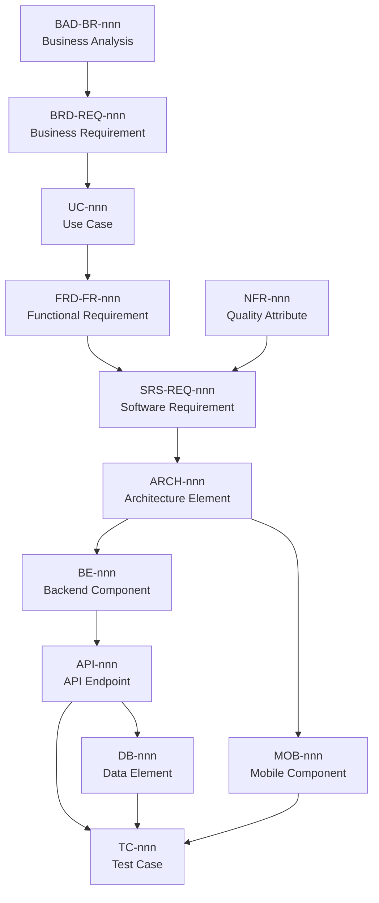

# Master Traceability Matrix — Carpool Mobility Platform (CMP)

**Control Document — End-to-End Requirement Traceability**

| Field | Value |
|---|---|
| Document ID | CMP-CTRL-RTM |
| Document Name | Master Traceability Matrix |
| Project Name | Carpool Mobility Platform |
| Project Code | CMP |
| Version | 3.7 |
| Status | Draft |
| Date | 2026-08-20 |
| Author | Documentation Manager (AI-assisted) |
| Reviewer | [TBD] |
| Approver | Project Owner |
| Classification | Internal |
| Brand | TBD |
| Previous Version | 3.6 (2026-08-20) |
| Related Documents | README.md, Documentation_Index.md, Documentation_Status.md, Document_Change_Log.md, Glossary.md |

---

## 1. Purpose

This matrix maintains the traceable chain from business need through to verification,
so that every implemented element can be traced back to an approved business
requirement, and every approved business requirement can be traced forward to design,
implementation, and test.

## 2. Governing Rule

> **Do not fabricate traceability.** A link is recorded only when it is justified by
> the content of both documents involved. Where a relationship is expected but not yet
> established, record `TRACEABILITY: TBD`.

## 3. Trace Chain Model

Cross-cutting specifications (`SEC-nnn`, `PAY-nnn`, `GPS-nnn`, `NOTIF-nnn`, `ADM-nnn`)
attach to the chain at the architecture and API levels and are traced to test cases in
the same way.

## 4. Traceability Coverage Summary

| Trace Level | ID Prefix | Source Document | Items Defined | Items Traced Forward | Coverage |
|---|---|---|---|---|---|
| Business Analysis | `BAD-BR-` | DOC-01 | **78** | **78** | **100%** |
| Business Requirement | `BRD-REQ-` | DOC-02 | **188** | **184** | **98% + 4 justified = 100%** |
| Use Case | `UC-` | DOC-03 | **83** | **50** | **60% — 33 withheld pending decisions** |
| Functional Requirement | `FRD-FR-` | DOC-04 | **260** | **260** | **100% — allocated by CMP-DOC-06** |
| Non-Functional Requirement | `NFR-` | DOC-05 | **162** | **162** | **100% — allocated by CMP-DOC-06** |

| Software Requirement | `SRS-REQ-` | DOC-06 | **184** | **0** | **0% — `TRACEABILITY: TBD`** |
| Architecture | `ARCH-` | DOC-07 | **148** | **0** | **0% — `TRACEABILITY: TBD`** |
| Mobile Component | `MOB-` | DOC-08 | **168** | **0** | **0% — `TRACEABILITY: TBD`** |
| Backend Component | `BE-` | DOC-09 | **218** | **0** | **0% — `TRACEABILITY: TBD`** |
| API | `API-` | DOC-10 | **216** | **0** | **0% — `TRACEABILITY: TBD`** |
| Database | `DB-` | DOC-11 | **232** | **0** | **0% — `TRACEABILITY: TBD`** |
| Security | `SEC-` | DOC-13 | **240** | **0** | **0% — `TRACEABILITY: TBD`** |
| Payment | `PAY-` | DOC-14 | **208** | **0** | **0% — `TRACEABILITY: TBD`** |
| GPS / Live Trip | `GPS-` | DOC-15 | **196** | **0** | **0% — `TRACEABILITY: TBD`** |
| Notification | `NOTIF-` | DOC-16 | **188** | **0** | **0% — `TRACEABILITY: TBD`** |
| Admin | `ADM-` | DOC-17 | **204** | **0** | **0% — `TRACEABILITY: TBD`** |
| Test Case | `TC-` | DOC-18 | **216** | **0** | **0% — `TRACEABILITY: TBD`** |

> **FACT.** As of 2026-08-17 nine formal documents exist: **CMP-DOC-01 (BAD)** through
> **CMP-DOC-09 (BACKEND)**, all v0.1 Draft, none approved. The chain is:
> 78 `BAD-BR` → 188 `BRD-REQ` → 83 `UC` → 260 `FRD-FR` → allocated by 184 `SRS-REQ`
> → 148 `ARCH` → 168 `MOB` and 218 `BE`, with 162 `NFR` forming a parallel branch that
> qualifies the functional baseline and is likewise fully allocated.
>
> The third link is **deliberately partial**: 50 of 83 use cases are decomposed and 33 are
> withheld because their behaviour is undecided. CMP-DOC-07 realises 96 of the 184 software
> requirements as named architecture statements; the remainder are satisfied within the
> structures those statements establish. Of the 148 architecture statements, **70 are now
> realised by a named component statement** — 46 by CMP-DOC-08 and 24 by CMP-DOC-09 —
> including **14 of 14 client obligations** and **24 of 24 backend obligations**.
>
> **CMP-DOC-10, CMP-DOC-11, CMP-DOC-17 and CMP-DOC-18 do not exist**, so no link beyond the
> component architectures can yet be justified, and none has been fabricated.
>
> **CORRECTION (v1.0).** Versions 0.7–0.9 of this matrix carried two stale sentences in
> this block asserting that CMP-DOC-06 and CMP-DOC-07 did not exist, after both had been
> created. Both are removed here. No traceability link was affected.

### 4.1 Requirement IDs Issued to Date

| Source | ID range | Count | Traced forward | Note |
|---|---|---|---|---|
| CMP-DOC-01 BAD v0.2 | `BAD-BR-001` … `BAD-BR-078` | 78 | **78 (100%)** | Contiguous, no gaps, no duplicates. **v0.2 issued no `BAD-BR-`**; it issued `BAD-RULE-043`, an auxiliary prefix that Index §5.1 records as outside the forward traceability chain. |
| CMP-DOC-02 BRD v0.1 | `BRD-REQ-001` … `BRD-REQ-188` | 188 | **184 (98%) + 4 justified** | Contiguous, no gaps, no duplicates. |
| CMP-DOC-03 USECASE v0.1 | `UC-001` … `UC-083` | 83 | **50 (60%)** | 33 withheld — behaviour undecided, not a traceability failure. |
| CMP-DOC-04 FRD v0.3 | `FRD-FR-001` … `FRD-FR-260` | 260 | 0 | Contiguous, no gaps, no duplicates. `TRACEABILITY: TBD`. **Neither v0.2 nor v0.3 issued an identifier** — v0.2 partially closed two rows of the §9.3 gap register, and v0.3 recorded an interpretation of `FRD-FR-013` and opened `CC-031`. |
| CMP-DOC-05 NFR v0.1 | `NFR-001` … `NFR-162` | 162 | **162 (100%)** | All allocated to an accountable software element by CMP-DOC-06. |
| CMP-DOC-06 SRS v0.1 | `SRS-REQ-001` … `SRS-REQ-184` | 184 | **96** | 96 architecture statements derive from a software requirement. |
| CMP-DOC-07 SAD v0.1 | `ARCH-001` … `ARCH-148` | 148 | **70** | 46 realised by CMP-DOC-08 (14 of 14 client obligations) and 24 by CMP-DOC-09 (24 of 24 backend obligations). |
| CMP-DOC-08 MOBILE v0.1 | `MOB-001` … `MOB-168` | 168 | 0 | Contiguous, no gaps, no duplicates. `TRACEABILITY: TBD` |
| CMP-DOC-20 TRACEABILITY v0.1 | `TR-001` … `TR-192` | 192 | 0 | Contiguous, no gaps, no duplicates. **No successor exists**; `TRACEABILITY: n/a — final document.** Measures the chain: 3,621 statements, 1,412 ‡, 208 uncited requirements of which 37 integrity-critical. **Creates no traceability link.** |
| CMP-DOC-19 DEVOPS v0.2 | `OPS-001` … `OPS-210` | 210 | 0 | Unique, no duplicates. `TRACEABILITY: TBD` — CMP-DOC-20 does not exist. Discharges 16 obligations from 9 documents; consolidates 21 sizing decisions, none resolved. **v0.2 adds `OPS-209`–`OPS-210` to §11**, so §11 is `OPS-121`–`OPS-138` plus `OPS-209`–`OPS-210` and the section is no longer one contiguous block; identifiers are never renumbered (Index §6). |
| CMP-DOC-18 TESTING v0.1 | `TC-001` … `TC-216` | 216 | 0 | Contiguous, no gaps, no duplicates. `TRACEABILITY: TBD` — CMP-DOC-19 and CMP-DOC-20 do not exist. Consolidates 99 verification obligations from 9 documents; the ‡ mapping (`TC-017`) is outstanding. |
| CMP-DOC-17 ADMIN v0.1 | `ADM-001` … `ADM-204` | 204 | 0 | Contiguous, no gaps, no duplicates. `TRACEABILITY: TBD` — CMP-DOC-18 and CMP-DOC-19 do not exist. Citations resolved against source text at issue. |
| CMP-DOC-16 NOTIFICATION v0.1 | `NOTIF-001` … `NOTIF-188` | 188 | 0 | Contiguous, no gaps, no duplicates. `TRACEABILITY: TBD` — CMP-DOC-17, 18 and 19 do not exist. Citations resolved against source text at issue. |
| CMP-DOC-15 GPS v0.1 | `GPS-001` … `GPS-196` | 196 | 0 | Contiguous, no gaps, no duplicates. `TRACEABILITY: TBD` — CMP-DOC-16, 17, 18 and 19 do not exist. Citations resolved against source text at issue. |
| CMP-DOC-14 PAYMENT v0.1 | `PAY-001` … `PAY-208` | 208 | 0 | Contiguous, no gaps, no duplicates. `TRACEABILITY: TBD` — CMP-DOC-17, 18 and 19 do not exist. Citations resolved against source text at issue. |
| CMP-DOC-12 UIUX v0.1 | `UX-001` … `UX-224` | 224 | 0 | Contiguous, no gaps, no duplicates. `TRACEABILITY: TBD` — CMP-DOC-18 does not exist. Use case tiers and citations resolved against source text at issue. |
| CMP-DOC-13 SECURITY v0.4 |
| CMP-DOC-11 DATABASE v0.1 | `DB-001` … `DB-232` | 232 | 0 | Contiguous, no gaps, no duplicates. `TRACEABILITY: TBD` — CMP-DOC-13 … CMP-DOC-19 do not exist. Citations resolved against source text at issue. |
| CMP-DOC-10 API v0.3 |
| CMP-DOC-09 BACKEND v0.2 | `BE-001` … `BE-218` | 218 | 0 | Contiguous, no gaps, no duplicates. `TRACEABILITY: TBD` — CMP-DOC-10, 11, 17 and 18 do not exist. **Upward citations re-resolved against source text at v0.2**; 7 statements with no upstream counterpart disclosed in §18.7. |

> **NOTE (2026-08-20).** The chain totals recorded in the CMP-DOC-20 row above — 3,621
> statements and 1,412 ‡ — are **CMP-DOC-20's measurement at its own issue** and are not
> recalculated here. Since that measurement three documents have reached v0.2 and added
> seven statements, one of them ‡ — four at CMP-DOC-13 v0.2 and CMP-DOC-19 v0.2, three at
> CMP-DOC-10 v0.2 — so the chain now holds 3,628 statements and 1,413 ‡.
> CMP-DOC-20 is **not** revised by this change; its figures continue to read as at issue.

**Distribution by domain** (per CMP-DOC-01 §28):

| Domain | ID range | Count |
|---|---|---|
| User & Authentication | `BAD-BR-001`–`006` | 6 |
| Vehicle Management | `BAD-BR-007`–`010` | 4 |
| Ride Publishing | `BAD-BR-011`–`015` | 5 |
| Ride Search & Route Matching | `BAD-BR-016`–`021` | 6 |
| Ride Request & Booking | `BAD-BR-022`–`028` | 7 |
| Payments | `BAD-BR-029`–`034` | 6 |
| Trip Execution & Live Tracking | `BAD-BR-035`–`040` | 6 |
| Communication | `BAD-BR-041`–`043` | 3 |
| Safety | `BAD-BR-044`–`048` | 5 |
| Ratings & Reviews | `BAD-BR-049`–`051` | 3 |
| Wallet & Rewards | `BAD-BR-052`–`057` | 6 |
| Notifications | `BAD-BR-058`–`060` | 3 |
| Recurring Commute | `BAD-BR-061`–`064` | 4 |
| Platform Administration | `BAD-BR-065`–`072` | 8 |
| Cross-Cutting Governance | `BAD-BR-073`–`078` | 6 |
| **Total** | | **78** |

## 5. Forward Traceability Matrix

*Business need → verification.*

| BAD-BR | BRD-REQ | UC | FRD-FR | NFR | SRS-REQ | ARCH | MOB / BE | API | DB | TC |
|---|---|---|---|---|---|---|---|---|---|---|
| `BAD-BR-001` … `BAD-BR-078` (78 requirements) | **`BRD-REQ-001` … `BRD-REQ-188` — linked, see CMP-DOC-02 §12.2** | **`UC-001` … `UC-083` — linked, see CMP-DOC-03 §11.2** | **`FRD-FR-001` … `FRD-FR-260` — linked for 50 of 83 UCs, see CMP-DOC-04 §10.2** | TBD | TBD | TBD | TBD | TBD | TBD |

**Status:** Two links are **complete and justified**. The row-level mappings are held in
**CMP-DOC-02 §12.2** (`BAD-BR → BRD-REQ`) and **CMP-DOC-03 §11.2** (`BRD-REQ → UC`) and
are not duplicated here; this matrix records their completeness and integrity.

| Check | Result |
|---|---|
| `BAD-BR` elaborated into at least one `BRD-REQ` | **78 of 78 (100%)** |
| `BRD-REQ` naming at least one `BAD-BR` source | **188 of 188 (100%)** |
| `BRD-REQ` realised by at least one `UC` | **184 of 188 (98%)** |
| `BRD-REQ` justified as constraints, not interactions | 4 — CMP-DOC-03 §11.4 |
| **`BRD-REQ` fully accounted for** | **188 of 188 (100%)** |
| `UC` naming at least one `BRD-REQ` source | **83 of 83 (100%)** |
| Orphaned `BRD-REQ` or `UC` | **0** |
| Absolute business rules enforced by a named use case | **10 of 10** |
| Author-derived requirements flagged for confirmation | 4 — CMP-DOC-02 §12.4 |
| Links beyond `UC` | **0 — `TRACEABILITY: TBD`** |

All remaining columns stay `TBD` until CMP-DOC-04 is produced. Per §2, no link is
recorded before it is justified.

### 5.1 Specification Depth Behind the Links

A traceability link records that a requirement is *addressed*, not that its behaviour is
*settled*. At v0.1 the depth behind the `BRD-REQ → UC` link is:

| Depth | Use cases | Meaning |
|---|---|---|
| Fully specified | 44 | Behaviour complete; may be decomposed, designed and tested. |
| Partially specified | 6 | Complete except named steps a decision governs. |
| Outlined | 33 | Scope recorded; **behaviour deliberately not written** pending a decision. |

> **Reading the matrix honestly:** 100% of business requirements are accounted for, but
> only 53% of the use cases realising them carry complete behaviour. Coverage and
> readiness are different measures and must not be conflated in reporting.

## 6. Backward Traceability Matrix

*Implementation/verification → originating business need. Used to detect orphaned
elements — anything built or tested that no approved requirement asked for.*

| TC | DB | API | MOB / BE | ARCH | SRS-REQ | FRD-FR | UC | BRD-REQ | BAD-BR |
|---|---|---|---|---|---|---|---|---|---|
| — | — | — | — | — | — | — | — | — | — |

**Status:** Empty — awaiting DOC-18 (Testing & QA) and upstream documents.

## 7. Cross-Cutting Traceability

| Cross-Cutting ID | Source Document | Attaches To | Traced Requirements | Test Cases |
|---|---|---|---|---|
| `SEC-` | DOC-13 Security Design | ARCH / API / DB | — | — |
| `PAY-` | DOC-14 Payment & UPI | ARCH / API / DB | — | — |
| `GPS-` | DOC-15 GPS / Live Trip | ARCH / API / MOB | — | — |
| `ADM-` | DOC-17 Admin / Filament | `BE-074`–`BE-082` bind it absolutely | — | — |
| `NOTIF-` | DOC-16 Communication & Notifications | ARCH / API | — | — |
| `ADM-` | DOC-17 Admin / Filament | BE / API / DB | — | — |

**Status:** Empty — awaiting the corresponding documents.

## 8. Gap Register

Records requirements that do not yet trace forward, and elements that do not trace back.

| # | Gap Type | Element | Description | Owner | Status |
|---|---|---|---|---|---|
| GAP-001 | Missing Prerequisite Document | `BAD-BR-001` … `BAD-BR-078` | No downstream document existed, so no business requirement traced forward. | Documentation Manager | **CLOSED** 2026-08-16 — CMP-DOC-02 provides 100% forward coverage of the BAD level. |
| GAP-002 | Unimplementable Requirement (blocked) | 32 of 78 `BAD-BR` | CMP-DOC-01 §28.16 records 32 requirements blocked by the 24 business decisions in §27. | Project Owner | **SUPERSEDED** by GAP-003 — the BRD restates this at finer granularity. |
| GAP-003 | Unimplementable Requirement (blocked) | **79 of 188 `BRD-REQ` (42%)** | CMP-DOC-02 §20.2 records 79 requirements blocked by 17 unresolved business decisions. They cannot be elaborated into CMP-DOC-03 use cases without fabricating the missing parameters. Two domains (Wallet & Rewards, Recurring Commute) are 100% blocked. | Project Owner | Open — **blocking DOC-03 for 42% of the requirement set** |
| GAP-004 | Missing Prerequisite Document | `BRD-REQ-001` … `BRD-REQ-188` | CMP-DOC-03 did not exist, so no business requirement traced forward beyond the BRD. | Documentation Manager | **CLOSED** 2026-08-16 — CMP-DOC-03 realises 184 and justifies 4. |
| GAP-006 | Unspecified Behaviour | **33 of 83 `UC` (40%)** | CMP-DOC-03 records 33 use cases as Outlined: scope and actors are known, but behaviour cannot be written because a named business decision does not exist. Three packages — Ratings & Reviews, Wallet & Rewards, Recurring Commute — are entirely Outlined. **These use cases must not be decomposed, designed or tested until their decision is taken.** | Project Owner | Open — **blocking DOC-04 and DOC-12 for 40% of the use case set** |
| GAP-007 | Missing Prerequisite Document | `UC-001` … `UC-083` | CMP-DOC-04 did not exist, so no use case traced forward. | Documentation Manager | **CLOSED** 2026-08-16 — CMP-DOC-04 decomposes the 50 use cases that carry written flows. |
| GAP-010 | Unspecified Behaviour | **29 functional gaps, 11 Critical** | CMP-DOC-04 §9.3 records 29 points at which behaviour cannot be specified because a named business decision does not exist. **No behaviour was invented to close one.** Eleven are Critical, including fare establishment, the whole request-to-booking transition, refunds, SOS response, and data retention. | Project Owner | Open — **blocking construction of the affected behaviour** |
| GAP-011 | Missing Prerequisite Document | `FRD-FR-001` … `FRD-FR-260` | CMP-DOC-05 and CMP-DOC-06 did not exist, so no functional requirement traced forward. | Documentation Manager | **CLOSED** 2026-08-16 — CMP-DOC-06 allocates all 260 to an accountable element. |
| GAP-008 | Missing Behaviour (product gap) | Driver cancellation of a ride with confirmed bookings | CMP-DOC-03 `UC-016` E1 routes to `UC-027`, which is Outlined pending `BAD-DEC-009`. **A driver with confirmed bookings therefore has no specified way to cancel.** This is a gap in the core MVP journey, not a deferred enhancement. Recorded as `UC-RISK-003` (severity 9) and `UC-OQ-003`. | Project Owner | Open — **resolve before any real passenger books** |
| GAP-009 | Missing Behaviour (product gap) | Return of value to a passenger | CMP-DOC-03 `UC-025` E1 and `UC-033` E2 both terminate in `UC-034`, which is Outlined pending `BAD-DEC-010`. **The platform can reach a state where it holds a passenger's money with no specified means of returning it.** Recorded as `UC-RISK-002`. | Project Owner | Open — **resolve alongside `BAD-DEC-007`** |
| GAP-005 | Unrequirement (known coverage gap) | Fraud detection and response | Neither CMP-DOC-01 nor CMP-DOC-02 contains fraud detection or response requirements, yet `BAD-RISK-011` scores 6. Recorded as `BAD-OQ-014` and `BRD-OQ-010`. **This is a genuine gap in the requirement baseline, not a traceability artefact.** | Security Analyst | Open — **carry into CMP-DOC-13** |

Gap types in use: `Unimplemented Requirement`, `Untested Requirement`, `Orphaned
Implementation`, `Orphaned Test`, `Broken Link`, `Missing Prerequisite Document`.

| GAP-012 | Unset Target | **69 of 162 `NFR` requirements** | CMP-DOC-05 records 47 quality targets awaiting `BAD-DEC-018` and 22 awaiting a technical decision. **No target was invented to fill the gap.** 93 of 162 are enforceable today. CMP-DOC-05 §19 supplies a route to setting each of the remaining 69. | Project Owner / Solution Architect | Open — **quality cannot be assessed for the affected requirements until set** |

| GAP-013 | Unowned Obligation | **Fraud detection and response** | Recorded at `GAP-005` as absent from the requirement baseline. CMP-DOC-06 §10.3 confirms it has **no requirement, no software element and no reservation** — unlike the three reserved areas, nothing in the baseline implies its shape. `BAD-RISK-011` scores fraud at severity 6. Carried as `SRS-OQ-006`. | Security Analyst | Open — **still unowned after CMP-DOC-07**; no architectural component provides for it (`ARCH-OQ-007`). Must be owned before CMP-DOC-13. |

| GAP-014 | Deferred Sizing | **11 sizing decisions** | CMP-DOC-07 §11.2 defers instance counts, worker pools, database tier, redundancy topology, backup regime, read-replica strategy, evidential-log provisioning, cost thresholds, environment count, hosting provider and safety-surface infrastructure. **All eleven trace to `BAD-DEC-018` or an unselected supplier.** Structure is decided; sizing is not, and the architecture cannot be validated against any performance, availability or cost target until they are set. | Project Owner / DevOps | Open — **blocking CMP-DOC-19 and architecture validation** |

| GAP-015 | Unset Budget | **Mobile resource budgets** — `NFR-151`–`158` | CMP-DOC-08 §13 specifies the structures that make battery, data, memory and start-up consumption controllable, and names **9 measurement points**, but **no budget figure is stated** because every target is `[TBD-BUS]` pending `BAD-DEC-018`. Two further mobile decisions are held elsewhere: the supported device range (`MOB-OQ-001`) and the accessibility standard (`MOB-OQ-002`), the latter also recorded at `NFR-088`. | Project Owner / Product Owner | Open — **instrument in R1 so budgets can be set from observation** |
| GAP-016 | Unset Sizing Input | **Launch scale** — concurrent bookings, rides per day, active users | CMP-DOC-09 records three architectural assumptions (`BE-ASM-01` single relational store, `BE-ASM-02` pessimistic locking throughput, `BE-ASM-03` database-backed queues) that each hold only "at launch scale," and **no launch-scale figure has been supplied**. CMP-DOC-11's index and partitioning strategy needs the same figure. This is distinct from `GAP-012`: those are quality *targets*, this is a volume *input*. | Project Owner / Product Owner | Open — **required before CMP-DOC-11** (`BE-OQ-01`) |
| GAP-017 | Undecided Behaviour | **Pickup and drop sequencing on a multi-passenger trip** | **Identified by CMP-DOC-15 §12.4 and not previously recorded anywhere.** `FRD-FR-159` requires a driver to be shown the estimate to their **next pickup or drop**; `FRD-FR-162` tracks each booking's pickup and drop independently. Neither states in what order the points are visited. `BAD-RULE-022` and `BAD-RULE-023` govern route **matching** at search time, not point **sequencing** during a trip, so **no upstream rule, decision, requirement or gap entry covers this**. Until decided, `FRD-FR-159` is unimplementable for a multi-passenger trip — which is the product's premise. | Project Owner / Product Owner | Open — **new**; escalated at CMP-DOC-15 §19.4 R-3 |
| GAP-018 | Unrealised Requirement | **No user agreement to the rules of participation is recorded** — `NFR-138` ‡, `BRD-CMP-008` | CMP-DOC-20A §2.4 searched CMP-DOC-06 … CMP-DOC-19 for *agreement*, *consent*, *accepted*, *terms* and *rules of participation*. `SRS-REQ-179` holds the policy **text** as versioned configuration; **nothing records that a user agreed to a version of it.** No table in CMP-DOC-11, no operation in CMP-DOC-10, no screen in CMP-DOC-12, no statement in CMP-DOC-09, CMP-DOC-13 or CMP-DOC-17. The requirement is integrity-critical and carries a compliance character. **It is not withheld and it is not one of the 29 functional gaps — it was not carried forward.** | Product Analyst / Solution Architect | Open — **blocking baselining of CMP-DOC-05**; needs a functional requirement, an operation and a table |
| GAP-019 | Partially Realised Requirement | **The originating element is absent from the evidential record** — `SRS-REQ-128` ‡ | `SRS-REQ-128` requires every audit record attributed to *the actor **and element** responsible*. `BE-107` specifies the record's content as actor, action, subject, time, outcome and reason; CMP-DOC-11 §9.1 gives the same column set. **Neither carries the originating element.** Either the record gains an originating-element attribute or `SRS-REQ-128` is amended to require actor attribution only; CMP-DOC-20A §2.3 declines to choose. | Solution Architect | Open — **blocking baselining of CMP-DOC-06** |
| GAP-020 | Unspecified Criterion | **The search coarse filter's non-spatial criteria are specified in no statement** — `FRD-FR-083` ‡ | `ADR-03` decides two-phase matching and its decision text narrows candidates by *"geographic proximity, direction, date and time window, and available seats"*. The numbered statements carrying it forward — `ARCH-052`, `DB-053`, `DB-194` — specify only the spatial dimension. **No statement anywhere states that a ride with fewer available seats than requested is excluded from results.** A decision record's prose is not a specification. | Solution Architect / Backend Lead | Open — **blocking baselining of CMP-DOC-04** |

## 9. Maintenance Rules

1. This matrix is updated in Step 16 of the Document Generation Workflow, whenever a
   document introduces or modifies requirement IDs.
2. Requirement IDs are stable. Approved IDs are never renumbered without change control
   recorded in `Document_Change_Log.md`.
3. Every new requirement ID must be added to the coverage summary (Section 4) when
   defined, even if it has no forward link yet.
4. A requirement with no forward link is recorded in the Gap Register (Section 8), not
   silently omitted.
5. Superseded requirements remain in the matrix marked as such; they are never deleted.
6. Where a relationship is expected but not established, record `TRACEABILITY: TBD`
   rather than inferring a link.

---

*End of Master Traceability Matrix — CMP*
