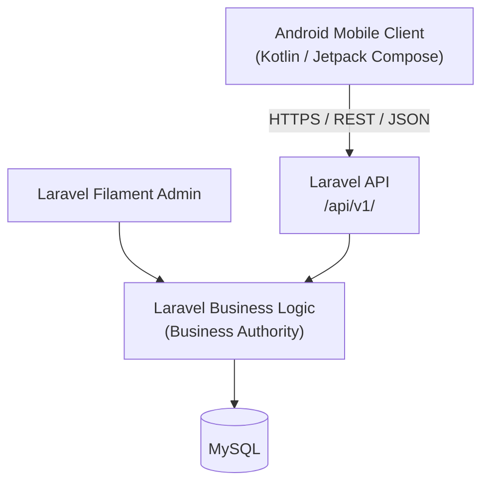

# Carpool Mobility Platform (CMP) — Documentation Repository

**Control Document — Project Control**

| Field | Value |
|---|---|
| Document ID | CMP-CTRL-README |
| Document Name | Documentation Repository README |
| Project Name | Carpool Mobility Platform |
| Project Code | CMP |
| Version | 0.3 |
| Status | Draft |
| Date | 2026-08-19 |
| Author | Documentation Manager (AI-assisted) |
| Reviewer | [TBD] |
| Approver | Project Owner |
| Classification | Internal |
| Brand | TBD |
| Previous Version | 0.2 (2026-08-19) |
| Related Documents | Documentation_Index.md, Documentation_Status.md, Document_Change_Log.md, Glossary.md, Master_Traceability_Matrix.md |

---

## 1. Purpose

This directory tree is the **controlled software documentation repository** for the
Carpool Mobility Platform (CMP). It is an engineering artifact, not a marketing
artifact. Its purpose is to provide a traceable chain from business analysis through
to release, usable by product, business, architecture, engineering, QA, design,
DevOps, and security roles.

## 2. Project Identity

| Attribute | Value |
|---|---|
| Project Name | Carpool Mobility Platform |
| Project Code | CMP |
| Project Type | Peer-to-Peer Carpooling and Daily Commute Platform |
| Brand Name | **NOT FINAL / TBD** |
| Initial Market | India (Indian payment ecosystem) |
| Initial Client Platform | Android |

> **NAMING RULE.** The project is referred to as *Carpool Mobility Platform* or *CMP*
> in all documentation until the Project Owner supplies a final product/brand name.
> No commercial brand name is to be invented or selected by the documentation process.
> The physical repository folder name (`carpool-mobility-platform`, and `bikeride-app`
> before it) is **not** a brand decision and carries no product-naming authority. The
> same applies to any name used informally in conversation. `BAD-DEC-023` remains open.

## 3. Approved Technology Direction (Summary)

This is a summary for orientation only. Authoritative technology statements live in
the architecture documents (DOC-07 onward) once produced.

| Layer | Technology |
|---|---|
| Mobile | Android, Kotlin, Jetpack Compose |
| Mobile Architecture | MVVM + Clean Architecture |
| Mobile State | StateFlow |
| Mobile Concurrency | Kotlin Coroutines |
| Mobile Persistence | Room (local cache only) |
| Backend | Laravel |
| Admin | Laravel Filament (part of the Laravel ecosystem — not a separate backend) |
| Database | MySQL |
| API | REST / JSON, versioned (`/api/v1/`) |
| Maps & Location | Google Maps Platform, Google Places, Google Routes, Android Fused Location Provider |
| Mobile Services | Firebase Cloud Messaging, Crashlytics, Performance Monitoring, Analytics |
| Payments | Indian UPI ecosystem |
| Email | Transactional email provider [TBD – Technical Decision Required] |

### 3.1 Explicitly Excluded Technologies

The following are **NOT** part of the current architecture:

- Supabase
- PostgreSQL
- Spring Boot

### 3.2 External Provider Status

Specific external providers (payment gateway/PSP, transactional email provider, SMS/OTP
provider, hosting provider) are **not finalized**. No document may state that a provider
is selected unless the Project Owner has explicitly approved it.

## 4. Core Architectural Relationship



**Rules:**

1. Android is a **client**.
2. Laravel is the **business authority**.
3. The REST API is the **communication contract**.
4. MySQL is the **backend persistence layer**.
5. The Android application **MUST NOT** connect directly to MySQL.

## 5. Business Authority Principle

The Android application must never be treated as the final authority for critical
business decisions. The backend controls authoritative business state, including but
not limited to: seat availability, booking confirmation, fare calculation, payment
status, driver earnings, platform fees, wallet balance, reward calculation,
cancellation rules, refund decisions, authorization, verification status, booking
status, and server-authoritative trip state.

The mobile application may hold temporary UI state or cached state; server state is
authoritative for shared business data.

## 6. Repository Structure

```
Document/
├── 00_Project_Control/            Repository governance and control files
├── 01_Business_Analysis/          DOC-01 BAD
├── 02_Business_Requirements/      DOC-02 BRD
├── 03_Stakeholders_Use_Cases/     DOC-03 Use Case Specification
├── 04_Functional_Requirements/    DOC-04 FRD
├── 05_Non_Functional_Requirements/DOC-05 NFR
├── 06_Software_Requirements/      DOC-06 SRS
├── 07_System_Architecture/        DOC-07 SAD
├── 08_Mobile_Architecture/        DOC-08 Mobile Architecture
├── 09_Backend_Architecture/       DOC-09 Backend Architecture
├── 10_API_Specification/          DOC-10 API Specification
├── 11_Database_Design/            DOC-11 Database Design
├── 12_UI_UX_Specification/        DOC-12 UI/UX Specification
├── 13_Security/                   DOC-13 Security Design
├── 14_Payment_UPI/                DOC-14 Payment & UPI Specification
├── 15_GPS_Live_Trip/              DOC-15 GPS / Live Trip Specification
├── 16_Communication_Notifications/DOC-16 Communication & Notification Specification
├── 17_Admin_Filament/             DOC-17 Admin / Filament Specification
├── 18_Testing_QA/                 DOC-18 Testing & QA Documentation
├── 19_DevOps_Deployment/          DOC-19 DevOps / Deployment Documentation
└── 20_Traceability_Release/       DOC-20 Traceability & Release Documentation
```

No documentation is to be created outside `Document/` unless explicitly requested.

## 7. Project Control Files

| File | Purpose |
|---|---|
| `README.md` | This file. Repository purpose, rules, and governance overview. |
| `Documentation_Index.md` | Master register of all documents (ID, name, version, status, location). |
| `Documentation_Status.md` | Lifecycle status tracking and readiness/dependency view. |
| `Document_Change_Log.md` | Chronological change record for all documents. |
| `Glossary.md` | Controlled vocabulary and domain terminology. |
| `Master_Traceability_Matrix.md` | End-to-end requirement traceability chain. |

## 8. Document Generation Rules

### 8.1 Strict Sequential Generation

Documents are created **one at a time**, and **only** when explicitly requested by the
Project Owner. Requesting one document never authorizes the creation of any other.

Example: the command *"Create BAD"* authorizes **DOC-01 only**.

### 8.2 Dual Format Requirement

Every formal document is produced in **both**:

1. Markdown (`.md`) — repository/source-of-truth-friendly representation
2. Microsoft Word (`.docx`) — professionally formatted presentation representation

Both must carry equivalent information.

### 8.3 File Naming Standard

`DOC-<NN>-<SHORTNAME>-CMP-<Descriptive-Name>.<ext>`

Examples:

- `DOC-01-BAD-CMP-Business-Analysis.md` / `.docx`
- `DOC-02-BRD-CMP-Business-Requirements.md` / `.docx`
- `DOC-03-USECASE-CMP-Stakeholders-UseCases.md` / `.docx`

No spaces in filenames.

### 8.4 Mandatory Document Control Metadata

Every formal document must contain: Document ID, Document Name, Project Name, Project
Code, Version, Status, Date, Author, Reviewer, Approver, Classification, Previous
Version, Related Documents.

### 8.5 Status Values

`Not Started` · `Draft` · `Under Review` · `Approved` · `Superseded` · `Deprecated`

A document is **never** marked `Approved` without explicit Project Owner approval.

### 8.6 Versioning

| Stage | Version |
|---|---|
| Draft iterations | 0.1, 0.2, 0.3 … |
| First approved version | 1.0 |
| Minor approved revision | 1.1, 1.2 … |
| Major revision | 2.0 |

Approved versions are never silently overwritten. All changes are recorded in
`Document_Change_Log.md`.

## 9. Content Integrity Rules

### 9.1 Fact / Assumption / Decision Classification

Every uncertain statement must be explicitly classified using one of:

`FACT` · `ASSUMPTION` · `BUSINESS DECISION REQUIRED` · `TECHNICAL DECISION REQUIRED` ·
`OPEN QUESTION` · `TBD` · `FUTURE CONSIDERATION` · `RECOMMENDATION`

Recommendations must never be presented as approved requirements.

### 9.2 No-Invention Rule

The following must **never** be invented: pricing, commission percentages, revenue
targets, refund policies, cancellation percentages, legal requirements, insurance
coverage, government approvals, regulatory certifications, security certifications, SLA
commitments, user counts, market share, financial projections, business contracts.

Where such a value is required but unknown, use:

`[TBD – Business Decision Required]` or `[TBD – Technical Decision Required]`

### 9.3 Requirement ID Standard

| Domain | ID Format |
|---|---|
| Business Analysis | `BAD-BR-001` |
| Business Requirements | `BRD-REQ-001` |
| Use Cases | `UC-001` |
| Functional Requirements | `FRD-FR-001` |
| Non-Functional Requirements | `NFR-001` |
| Software Requirements | `SRS-REQ-001` |
| Architecture | `ARCH-001` |
| Mobile | `MOB-001` |
| Backend | `BE-001` |
| API | `API-001` |
| Database | `DB-001` |
| Security | `SEC-001` |
| Payment | `PAY-001` |
| GPS | `GPS-001` |
| Notification | `NOTIF-001` |
| Admin | `ADM-001` |
| Test | `TC-001` |

IDs are stable. Approved requirement IDs are never renumbered without explicit change
control.

### 9.4 Traceability

Traceability links are created only where justified. Fabricated traceability is
prohibited. Where a link is not yet known, record `TRACEABILITY: TBD`.

## 10. Change Control

If a new requirement conflicts with an approved document, the previous document is
**not** silently modified. The process is:

1. Identify the conflict.
2. Explain the impact.
3. Record it in `Document_Change_Log.md`.
4. Request a Project Owner decision.
5. Update affected documents **only after approval**.

## 11. Definition of Developer-Ready

A document is developer-ready — regardless of length — when:

- Requirements are unambiguous
- Scope is clear
- Terminology is consistent
- IDs are stable
- Dependencies are identified
- Business rules are explicit
- Assumptions are visible
- Open questions are documented
- Technical decisions are traceable
- Acceptance criteria can be derived
- Cross-document relationships are maintained

## 12. Current Repository State

**As at 2026-08-19.** This section is restated on each material change; the historical
record of what changed and when is `Document_Change_Log.md`, not this table.

| Item | State |
|---|---|
| Project root | `carpool-mobility-platform` — single root, matching the GitHub repository |
| Directory structure | Created — `Document/` (21 subdirectories), `backend/`, `Mobile/` |
| Project Control files | 6 of 6 created; see `Documentation_Index.md` §2 for current versions |
| Formal documents (DOC-01 … DOC-20) | **All 20 created**, v0.1 except CMP-DOC-09 and CMP-DOC-20 at v0.2, plus annex CMP-DOC-20A. **None approved.** |
| Planning artefacts | Implementation Work Register and Implementation Analysis — `Documentation_Index.md` §3A |
| Application source code | **None.** `backend/` and `Mobile/` exist and are empty, awaiting Laravel and Android tooling. |
| Version control | **Not initialised.** No repository, no commits. No Git policy exists in the documentation — see `CLAUDE-READINESS-ANALYSIS.md` §14. |
| Development gate | **NO** — see `CLAUDE-READINESS-ANALYSIS.md` §23 |
| Next expected action | Project Owner review and approval of CMP-DOC-01 … CMP-DOC-20 in chain order, and the technical decisions recorded in `CLAUDE-READINESS-ANALYSIS.md` §22.1 |

> **FACT — historical, retained.** At initialization (2026-08-16) the project root was
> `F:\Workspace-2026\Application - 2026\bikeride-app` and it contained no files or
> subdirectories. The `Document/` tree was the first content created. No application
> source code was created or modified.
>
> **FACT — 2026-08-19.** The repository root was relocated to `carpool-mobility-platform`
> and the `Document/` tree moved intact, verified file-by-file. See `Document_Change_Log.md`
> entry 085. The statement above is preserved because it was accurate on the date it records.

---

*End of README — CMP Documentation Repository*
