# Business Analysis Document (BAD)
## Carpool Mobility Platform (CMP)

---

# 0. Document Control

## 0.1 Document Control Table

| Field | Value |
|---|---|
| Document ID | CMP-DOC-01 |
| Document Name | Business Analysis Document |
| Short Name | BAD |
| Project Name | Carpool Mobility Platform |
| Project Code | CMP |
| Version | 0.2 |
| Status | Draft |
| Date | 2026-08-20 |
| Author | Business Analyst (AI-assisted) |
| Reviewer | [TBD] |
| Approver | Project Owner |
| Classification | Internal |
| Brand | TBD |
| Previous Version | 0.1 (2026-08-16) |
| Related Documents | `00_Project_Control/README.md`, `Documentation_Index.md`, `Documentation_Status.md`, `Document_Change_Log.md`, `Glossary.md`, `Master_Traceability_Matrix.md` |
| Successor Documents | CMP-DOC-02 (BRD) — Not Started |

## 0.2 Revision History

| Version | Date | Author | Change | Status |
|---|---|---|---|---|
| 0.1 | 2026-08-16 | Business Analyst (AI-assisted) | Initial issue. Full business analysis baseline derived from the approved product concept. 78 preliminary business requirements issued (BAD-BR-001 … BAD-BR-078). | Draft |
| 0.2 | 2026-08-20 | Business Analyst (AI-assisted) | **Three account decisions taken by the Project Owner.** `BAD-RULE-006` gains the verification standing vocabulary — `UNVERIFIED` and `VERIFIED`, where `VERIFIED` means control of the registered phone number has been demonstrated. `BAD-RULE-010` moves out of `[TBD – BAD-DEC-006]`: the permitted account states are `ACTIVE`, `SUSPENDED` and `DEACTIVATED`, only `ACTIVE` permits authenticated use, and neither of the other two regains an active session except through a defined transition. **`BAD-RULE-043` is issued**, fixing the mandatory identifying detail for registration at the **verified phone number and nothing else**. `BAD-DEC-005` and `BAD-DEC-006` are **partially resolved** and both remain open for what each still does not answer — verification levels and evidence beyond phone possession (`BAD-RULE-008`), and who may transition an account state and on what grounds (`FRD-GAP-024`). **No other rule was altered, and §14.9’s bucket counts were not recomputed — see the note there.** | Draft |

## 0.3 Distribution List

| Role | Purpose |
|---|---|
| Project Owner | Approval authority |
| Product Owner | Scope and prioritisation |
| Business Analyst | Authoring and maintenance |
| Solution Architect | Downstream architecture input |
| Software Architect (Mobile / Backend) | Downstream design input |
| UI/UX Designer | Persona and journey input |
| QA Analyst | Requirement testability review |
| Security Analyst | Risk and trust-model input |
| Project Manager | Planning and dependency management |

## 0.4 Approval

| Role | Name | Signature | Date |
|---|---|---|---|
| Author | Business Analyst (AI-assisted) | — | 2026-08-16 |
| Reviewer | [TBD] | — | — |
| Approver | Project Owner | — | — |

> **This document is NOT approved.** It is issued at version 0.1 with status `Draft`
> for Project Owner review.

## 0.5 Purpose of This Document

This Business Analysis Document establishes the **business baseline** for the Carpool
Mobility Platform. It defines the business problem, the intended business outcome, the
stakeholders, the business processes, the business rules, the scope boundary, the risks,
and the decisions that the Project Owner must make before requirements engineering can
proceed.

It is the entry document of the CMP documentation chain:

```
BAD (this document) → BRD → Use Cases → FRD → NFR → SRS → Architecture → … → Traceability
```

## 0.6 Scope and Boundary of This Document

**This document contains:** business problem definition, business objectives, business
value, stakeholders, personas, business processes, business rules, business domain
model, business capability map, scope boundary, risks, constraints, dependencies,
opportunities, KPIs, proposed MVP scope, business roadmap, open questions, required
business decisions, preliminary business requirement IDs, and executive recommendations.

**This document deliberately excludes:** API specifications, database schemas, Kotlin or
Laravel implementation detail, screen designs, infrastructure design, and detailed
technical architecture. These belong to CMP-DOC-07 onward.

Where a technology statement appears in this document, it appears only as an approved
*constraint* on the business solution (see Section 20), not as a design decision.

## 0.7 Intended Audience

Product Owners · Business Stakeholders · Business Analysts · Solution Architects ·
Software Architects · Android Developers · Backend Developers · QA Engineers · UI/UX
Designers · DevOps Engineers · Security Engineers · Technical Leads · Project Managers ·
Future Engineering Teams.

## 0.8 Basis of Analysis

> **FACT.** This analysis is derived from a single source: the approved CMP product
> concept and technology direction recorded in the Master Documentation Control Prompt
> and reproduced in `00_Project_Control/README.md`.

> **ASSUMPTION (BAD-ASM-001).** No user research, market study, competitor analysis,
> financial model, or legal opinion was available to the author at the time of writing.
> Every statement in this document that would ordinarily rest on such evidence is marked
> as an assumption or hypothesis requiring validation. **No such evidence has been
> invented.**

This is the single most important qualification in this document. Readers must not treat
hypothesis-level statements — particularly in Sections 4, 5, 12, 17, 18 and 23 — as
validated findings.

## 0.9 Statement Classification Convention

Every non-trivial statement in this document carries one of the following markers, per
`README.md` §9.1:

| Marker | Meaning | Reader action |
|---|---|---|
| **FACT** | Established by the approved product concept or an approved document. | Rely on it. |
| **ASSUMPTION** | Working position adopted so analysis can proceed. Not confirmed. | Validate before committing cost. |
| **BUSINESS DECISION REQUIRED** | Cannot be resolved by analysis. The Project Owner must decide. | Decide. |
| **TECHNICAL DECISION REQUIRED** | Requires an architecture or engineering decision. | Route to DOC-07+. |
| **OPEN QUESTION** | Question raised, owner not yet assigned. | Assign and answer. |
| **TBD** | Value not yet known. | Supply. |
| **FUTURE CONSIDERATION** | Explicitly deferred beyond current scope. | Do not build now. |
| **RECOMMENDATION** | Author's professional advice. **Not an approved requirement.** | Accept, reject or amend. |

## 0.10 Identifier Conventions Used in This Document

> **ASSUMPTION (BAD-ASM-002).** The Requirement ID Standard (`README.md` §9.3) allocates
> the prefix `BAD-BR-` to this document without distinguishing business *requirements*
> from business *rules*. To keep the traceability chain unambiguous
> (`BAD-BR-nnn → BRD-REQ-nnn → …`), this document reserves `BAD-BR-` exclusively for
> **business requirements** and introduces the auxiliary prefixes below for other
> element types. These auxiliary prefixes are internal to the BAD and are not part of
> the forward traceability chain. Subject to Project Owner correction.

| Prefix | Element | Section |
|---|---|---|
| `BAD-BR-nnn` | Business Requirement (**traceable**) | 28 |
| `BAD-OBJ-nnn` | Business Objective | 7 |
| `BAD-SC-nnn` | Success Criterion | 9 |
| `BAD-SH-nnn` | Stakeholder | 11 |
| `BAD-PER-nnn` | Persona | 12 |
| `BAD-BP-nnn` | Business Process | 13 |
| `BAD-RULE-nnn` | Business Rule | 14 |
| `BAD-CAP-nnn` | Business Capability | 16 |
| `BAD-RISK-nnn` | Risk | 19 |
| `BAD-CON-nnn` | Constraint | 20 |
| `BAD-DEP-nnn` | Dependency | 21 |
| `BAD-OPP-nnn` | Opportunity | 22 |
| `BAD-KPI-nnn` | Key Performance Indicator | 23 |
| `BAD-ASM-nnn` | Assumption | throughout, consolidated in 26.2 |
| `BAD-OQ-nnn` | Open Question | 26 |
| `BAD-DEC-nnn` | Business Decision Required | 27 |

Identifiers are **stable**. Once issued they are never reused or renumbered without
change control recorded in `Document_Change_Log.md`.

## 0.11 Table of Contents

| § | Section |
|---|---|
| 0 | Document Control |
| 1 | Executive Summary |
| 2 | Business Vision |
| 3 | Business Mission |
| 4 | Business Problem |
| 5 | Existing Pain Points |
| 6 | Proposed Solution |
| 7 | Business Objectives |
| 8 | Business Goals |
| 9 | Success Criteria |
| 10 | Product Scope (In / Out / Future) |
| 11 | Stakeholders |
| 12 | Personas |
| 13 | Business Processes |
| 14 | Business Rules |
| 15 | Business Domain Model |
| 16 | Business Capability Map |
| 17 | Business Value |
| 18 | Business Model |
| 19 | Risks |
| 20 | Constraints |
| 21 | Dependencies |
| 22 | Opportunities |
| 23 | Key Performance Indicators |
| 24 | MVP Scope (Proposed) |
| 25 | Business Roadmap |
| 26 | Open Questions & Assumptions |
| 27 | Business Decisions Required |
| 28 | Preliminary Business Requirement Register |
| 29 | Executive Recommendations |
| A | Appendix A — Traceability Position |
| B | Appendix B — Terminology Reference |

---

# 1. Executive Summary

## 1.1 What CMP Is

**FACT.** The Carpool Mobility Platform (CMP) is a peer-to-peer carpooling and daily
commute platform. It connects two categories of private individual: a **Driver** who is
already travelling a route in their own vehicle and has spare seats, and a **Passenger**
who needs to travel a substantially overlapping route at a substantially compatible
time.

CMP is **not** a taxi service, a fleet operator, or a professional transport provider.
The Driver is a peer making a journey they were making anyway — not a hired professional
carrying out a job assigned by the platform. This distinction governs the entire
business design and is restated as a controlling business rule in Section 14
(`BAD-RULE-001`).

## 1.2 The Core Business Problem

**ASSUMPTION (BAD-ASM-003).** Daily commuting in the target market is characterised by a
structural inefficiency: a very large number of private vehicles travel similar
corridors at similar times carrying a single occupant, while a very large number of
commuters on those same corridors lack a comfortable, predictable, affordable option.
Existing informal arrangements (workplace groups, messaging groups, word of mouth) are
unstructured, do not scale, offer no verification of who you are travelling with, no
payment mechanism, no accountability, and no safety net.

CMP addresses the coordination, trust, payment, and safety gaps that prevent that spare
capacity from being used. Section 4 develops this in full. **This problem statement is a
hypothesis and requires validation research before significant investment.**

## 1.3 The Proposed Solution in One Paragraph

CMP is an Android application backed by a server-authoritative platform. Drivers publish
rides. Passengers search by origin, destination, date and seat count. The platform
identifies rides whose routes overlap the passenger's required segment and presents them
with the information a commuter needs to make a trust decision — verification status,
vehicle, fare, timing, seats, preferences. The passenger requests a seat; the booking is
confirmed under backend control; payment is taken through the Indian UPI ecosystem and
verified by the backend, never by the client; the trip is executed with live tracking,
in-app communication and safety functions; and the trip closes with ratings, reviews and
reward accrual. A recurring-commute capability turns a one-off transaction into a
habitual daily arrangement — which is the commercial heart of the concept.

## 1.4 What Makes This Concept Distinctive

| # | Differentiator | Basis |
|---|---|---|
| 1 | **Route-overlap matching**, not point-to-point matching. A passenger can join part of a longer journey rather than needing an identical origin and destination. | FACT (approved concept) |
| 2 | **Recurring commute as a first-class object**, not a repeated one-off booking. The daily commute is the retention engine. | FACT (approved concept) |
| 3 | **Server-authoritative business state.** Seat counts, fares, payment status and balances are decided by the backend, never asserted by a phone. | FACT (approved concept) |
| 4 | **Safety and verification treated as core product**, not as a bolt-on. | FACT (approved concept) |
| 5 | **Reward and wallet mechanics** to reinforce habitual use. | FACT (approved concept) |

## 1.5 Scope Position

**FACT.** Initial focus: **Android**, **Indian market and payment ecosystem**. The
platform is designed to permit later expansion. iOS, web passenger clients, intercity
long-distance travel, corporate contracts, and logistics are **not** in current scope
(Section 10.2 and 10.3).

## 1.6 State of Readiness — Honest Assessment

| Dimension | Readiness | Comment |
|---|---|---|
| Product concept | **Strong** | Feature domains are coherent and comprehensive. |
| Technology direction | **Decided** | Android/Kotlin/Compose, Laravel, Filament, MySQL, REST. |
| Business rules | **Weak** | Almost all commercial rules are undecided (see Section 27). |
| Commercial model | **Undecided** | No monetisation mechanism has been selected. |
| Market evidence | **Absent** | No research, sizing, or competitor analysis exists. |
| Legal/regulatory position | **Unknown** | No legal opinion obtained. Material risk — `BAD-RISK-001`. |
| Trust & safety policy | **Undefined** | Verification levels and incident handling undefined. |

**RECOMMENDATION (see Section 29).** The concept is sufficiently well formed to proceed
to a Business Requirements Document. It is **not** sufficiently well formed to proceed to
build. Twenty-four business decisions (Section 27) and one legal opinion
(`BAD-DEC-001`) stand between this document and a safe implementation baseline.

## 1.7 Headline Numbers From This Analysis

| Item | Count |
|---|---|
| Business requirements issued | 78 (`BAD-BR-001` … `BAD-BR-078`) |
| Business objectives | 10 |
| Stakeholder groups identified | 14 |
| Personas defined | 7 |
| Business processes modelled | 12 |
| Business rules stated | 42 |
| Business capabilities mapped | 32 |
| Risks registered | 24 |
| Constraints registered | 18 |
| Dependencies registered | 14 |
| KPIs defined (targets TBD) | 26 |
| Open questions | 31 |
| Business decisions required | 24 |

> **No financial figure, user-count target, market-size estimate, commission rate,
> pricing point, SLA commitment, or legal assertion appears anywhere in this document.**
> Where such a value would ordinarily appear, it is marked
> `[TBD – Business Decision Required]`. This is deliberate and complies with the
> No-Invention Rule (`README.md` §9.2).

---

# 2. Business Vision

## 2.1 Vision Statement

> **To make the everyday commute a shared, trusted, and efficient act — so that the
> empty seat travelling beside a driver becomes the default way a neighbour gets to
> work.**

**Classification:** RECOMMENDATION. This vision statement is proposed by the author for
Project Owner adoption. It is not an approved corporate vision.

## 2.2 Vision Decomposition

| Element | Meaning for CMP |
|---|---|
| *Everyday commute* | The platform's centre of gravity is the repeated, predictable, short-to-medium daily journey — not occasional intercity travel. |
| *Shared* | Capacity that already exists on the road is used, rather than new capacity being created. |
| *Trusted* | A commuter can assess who they will travel with before committing, and has recourse if something goes wrong. |
| *Efficient* | Matching, booking, payment and coordination happen in seconds, without negotiation. |
| *Default* | Success is habit formation, not one-off transactions. |

## 2.3 Vision Horizon

**ASSUMPTION (BAD-ASM-004).** The vision is expressed without a time horizon because no
business plan, funding position, or delivery timeline has been supplied.
`[TBD – Business Decision Required]` — see `BAD-DEC-002`.

## 2.4 What the Vision Explicitly Rejects

| Rejected framing | Why |
|---|---|
| "A cheaper taxi app." | CMP does not dispatch professional drivers. Framing it as a taxi substitute would invite a regulatory and operational model the platform is not designed for. See `BAD-RULE-001`, `BAD-RISK-001`. |
| "A social network for travellers." | Social features exist to serve trust and coordination, not engagement for its own sake. |
| "A logistics/parcel platform." | Out of scope (Section 10.2). |

---

# 3. Business Mission

## 3.1 Mission Statement

> **CMP exists to connect commuters travelling the same way at the same time, and to
> supply the four things that informal carpooling cannot: reliable matching, verified
> identity, settled payment, and accountable safety.**

**Classification:** RECOMMENDATION.

## 3.2 Mission Pillars

| # | Pillar | Mission commitment | Primary capability (§16) |
|---|---|---|---|
| M1 | **Match reliably** | Find the genuinely compatible ride, including partial-route overlaps, and express *why* it is a match. | `BAD-CAP-007`, `BAD-CAP-008` |
| M2 | **Establish trust** | Let a commuter know who they are travelling with, and make identity and vehicle verification visible. | `BAD-CAP-004`, `BAD-CAP-005` |
| M3 | **Settle money cleanly** | Remove cash negotiation from the journey; make payment status unambiguous and backend-verified. | `BAD-CAP-014`, `BAD-CAP-015` |
| M4 | **Be accountable for safety** | Provide live sharing, emergency signalling, and an operational response path. | `BAD-CAP-021`, `BAD-CAP-022` |
| M5 | **Make it a habit** | Support recurring commutes so the arrangement survives beyond a single trip. | `BAD-CAP-011` |

## 3.3 Mission Boundaries

**FACT.** The mission is delivered under the Business Authority Principle: the platform —
not the mobile client — determines authoritative shared business state (see
`BAD-RULE-002` and Section 20, `BAD-CON-004`).

---

# 4. Business Problem

## 4.1 Problem Statement

> Private vehicle capacity on daily commuter corridors is systematically under-used,
> while commuters on those same corridors are under-served. The two sides cannot find
> each other reliably, cannot establish trust quickly, cannot settle payment cleanly,
> and have no safety recourse — so the spare capacity stays empty.

**Classification:** ASSUMPTION (`BAD-ASM-005`) — a structural hypothesis requiring
validation.

## 4.2 The Problem Decomposed

CMP treats the problem as **four distinct failures**, each of which must be solved for
the platform to work. Solving only some of them produces a product that does not
convert.

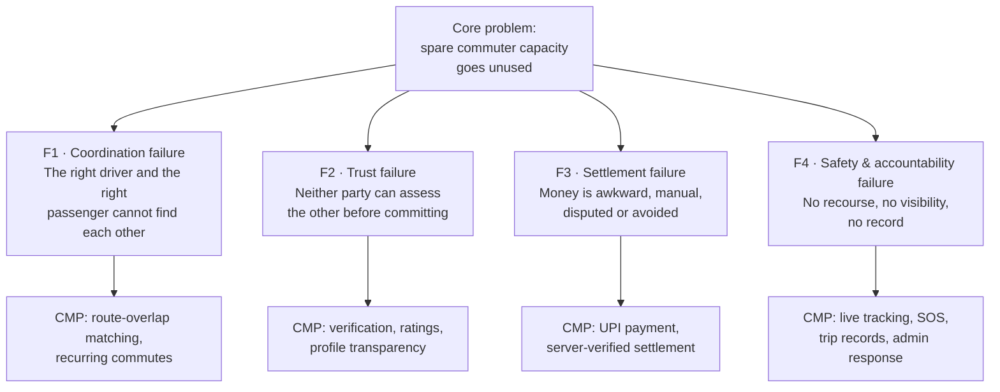

### 4.2.1 F1 — Coordination Failure

| Aspect | Description |
|---|---|
| Symptom | Willing drivers and willing passengers exist on the same corridor at the same time and never connect. |
| Why informal channels fail | Workplace and neighbourhood messaging groups require the passenger to broadcast and hope; they carry no structured route, time, seat or price data; they cannot express partial-route compatibility; and they degrade as group size grows. |
| Why point-to-point apps under-serve it | A commuter whose destination lies part-way along a driver's route is invisible to a system that matches only identical endpoints. |
| CMP response | Structured ride objects + route-overlap matching + recurring commute schedules. |
| Classification | ASSUMPTION (`BAD-ASM-006`) |

### 4.2.2 F2 — Trust Failure

| Aspect | Description |
|---|---|
| Symptom | A commuter will not enter a stranger's private vehicle, or accept a stranger into their own, without some basis for confidence. |
| Why informal channels fail | Trust is borrowed from the group context ("someone from my office"), which does not extend beyond it and cannot be verified. |
| CMP response | Identity and vehicle verification, visible verification indicators, ratings and reviews, profile transparency, and a verified-peer concept for recurring arrangements. |
| Critical dependency | The *strength* of verification is undecided — `BAD-DEC-005`. A weak verification policy invalidates this entire response. |
| Classification | ASSUMPTION (`BAD-ASM-007`) |

### 4.2.3 F3 — Settlement Failure

| Aspect | Description |
|---|---|
| Symptom | Cost sharing between peers is socially awkward, frequently unpaid, disputed after the fact, or avoided entirely by not offering the seat. |
| Why informal channels fail | No agreed amount, no agreed time to pay, no record, no enforcement, and change/cash friction. |
| CMP response | Fare stated up front at search time; payment through the UPI ecosystem; payment status determined and held by the backend; wallet ledger and records. |
| Critical dependency | Whether the platform takes a fee, and how driver funds are settled, is undecided — `BAD-DEC-003`, `BAD-DEC-004`. |
| Classification | ASSUMPTION (`BAD-ASM-008`) |

### 4.2.4 F4 — Safety and Accountability Failure

| Aspect | Description |
|---|---|
| Symptom | If something goes wrong during an informal shared journey, there is no record of who was in the vehicle, no live visibility for anyone outside it, and no party responsible for responding. |
| CMP response | Recorded trips with identified participants, live trip sharing, in-app SOS, nominated emergency contacts, a safety centre, and an administrative incident-handling function. |
| Critical dependency | What actually happens when SOS is raised is undecided — `BAD-DEC-011`. An SOS button with no defined response is a liability, not a feature. |
| Classification | ASSUMPTION (`BAD-ASM-009`) |

## 4.3 Why the Problem Persists

| # | Root cause | Consequence |
|---|---|---|
| RC1 | The two sides of the market are **latent, not organised**. | Neither side searches, because neither expects to find. |
| RC2 | **Trust cannot be established at the speed of a commute decision.** | The decision is made in seconds; verification takes longer than the decision window unless pre-computed. |
| RC3 | **Cost sharing lacks a settlement rail** in informal use. | The transaction is abandoned rather than negotiated. |
| RC4 | **No party is accountable** for an informal journey. | Risk is borne entirely by the individual, so risk-averse commuters abstain. |
| RC5 | **Liquidity is corridor-specific and time-specific.** | A platform that is thinly used on a given corridor at a given hour offers nothing, even if it is large overall. RC5 is the single greatest execution risk — see `BAD-RISK-002`. |

**Classification:** ASSUMPTION (`BAD-ASM-010`) for RC1–RC4; RC5 is an **analytical
observation** the author considers structurally certain for any two-sided marketplace and
recommends treating as a planning constraint.

## 4.4 Problem Ownership — Who Actually Feels It

| Party | How the problem presents to them |
|---|---|
| Commuting passenger | Cost, unpredictability, discomfort, poor last-mile options. |
| Commuting driver | Cost borne alone for a journey with unused capacity. |
| Employer / campus | Parking pressure, staff travel cost and reliability. **FUTURE CONSIDERATION** — not in current scope. |
| City / environment | Congestion and emissions from single-occupancy vehicles. Societal, not a paying stakeholder. |

## 4.5 What Is NOT the Problem CMP Solves

Explicitly out of the problem definition, to prevent scope drift:

- On-demand point-to-point transport for a passenger with no matching driver (that is a taxi problem).
- Intercity long-distance travel (`FUTURE CONSIDERATION`, Section 10.3).
- Goods and parcel movement (Section 10.2).
- Vehicle rental or driver-for-hire supply (Section 10.2).

---

# 5. Existing Pain Points

> **Classification note.** Every pain point in this section is a **hypothesis derived
> from the product concept**, not a validated research finding. No quantification is
> given because none exists and none may be invented. Validation is required —
> `BAD-OQ-001`, `BAD-DEC-002`.

## 5.1 Passenger Pain Points

| # | Pain point | Consequence | CMP response | Class |
|---|---|---|---|---|
| PP-01 | Cannot discover who is driving their route today. | Falls back to a worse travel mode. | Structured search + route-overlap matching | ASSUMPTION |
| PP-02 | Cannot judge whether an offered ride is safe to take. | Declines, or accepts with anxiety. | Verification indicators, ratings, profile data | ASSUMPTION |
| PP-03 | Does not know the cost until the journey is underway. | Avoids the arrangement. | Fare shown before request | ASSUMPTION |
| PP-04 | Payment is cash-awkward between acquaintances. | Under-payment, resentment, arrangement collapses. | UPI settlement through the platform | ASSUMPTION |
| PP-05 | No certainty the ride will actually happen tomorrow. | Cannot rely on it for work attendance. | Recurring commute + confirmed bookings + notifications | ASSUMPTION |
| PP-06 | No one outside the vehicle knows where they are. | Personal safety exposure, especially at night. | Live trip sharing, SOS, emergency contacts | ASSUMPTION |
| PP-07 | Cannot reach the driver to coordinate pickup. | Missed pickups, disputes. | In-app chat + trip notifications | ASSUMPTION |
| PP-08 | Pickup point is ambiguous. | Delay and abandonment. | Pickup compatibility in matching; map-based points | ASSUMPTION |
| PP-09 | No recourse after a bad experience. | Does not return. | Ratings, reviews, admin moderation, incident handling | ASSUMPTION |
| PP-10 | No incentive to persist through early low-liquidity period. | Churn before the network is useful. | Rewards, points, coupons | ASSUMPTION |

## 5.2 Driver Pain Points

| # | Pain point | Consequence | CMP response | Class |
|---|---|---|---|---|
| DP-01 | Bears full journey cost while carrying empty seats. | Financial waste. | Seat monetisation via fare | ASSUMPTION |
| DP-02 | Cannot advertise spare seats to anyone beyond their own contacts. | Seats stay empty. | Ride publishing to the platform | ASSUMPTION |
| DP-03 | Reluctant to admit an unknown passenger. | Declines to offer. | Passenger verification and ratings | ASSUMPTION |
| DP-04 | Detours destroy the value of sharing. | Abandons the arrangement. | Route-overlap matching favouring on-route pickups | ASSUMPTION |
| DP-05 | Chasing payment is unpleasant. | Stops offering seats. | Platform-settled payment | ASSUMPTION |
| DP-06 | Passenger no-shows waste time. | Departure delays, lost trust. | Booking confirmation, notifications, cancellation rules `[TBD]` | ASSUMPTION |
| DP-07 | Re-advertising the same commute daily is tedious. | Publishes inconsistently. | Recurring commute schedules | ASSUMPTION |
| DP-08 | Uncertain what may be offered without becoming a commercial operator. | Avoids the platform, or over-extends into risk. | **Not yet answered — `BAD-DEC-001` (legal opinion required)** | OPEN QUESTION |
| DP-09 | No visibility of earnings. | Cannot judge whether it is worthwhile. | Earnings/wallet ledger | ASSUMPTION |

## 5.3 Shared / Platform-Level Pain Points

| # | Pain point | CMP response | Class |
|---|---|---|---|
| SP-01 | Coordination happens across scattered channels (calls, messaging, memory). | Single in-app flow: search → book → pay → travel → rate | ASSUMPTION |
| SP-02 | Plans change and nobody is informed in time. | Notification domain | ASSUMPTION |
| SP-03 | Disputes have no evidence base. | Trip records, chat history, payment records | ASSUMPTION |
| SP-04 | Bad actors can re-enter freely after removal. | Verification + admin user management | ASSUMPTION |
| SP-05 | No operational view of what is happening on the platform. | Admin (Filament) operations domain | FACT (a design requirement of the concept) |

## 5.4 Pain Point → Requirement Coverage Check

Every pain point above traces to at least one business requirement in Section 28. Two do
not trace to a *solution* and are instead escalated as decisions:

| Unresolved pain point | Escalated as |
|---|---|
| DP-08 (regulatory uncertainty for drivers) | `BAD-DEC-001` — obtain qualified legal opinion |
| PP-10 / early-liquidity churn | `BAD-RISK-002` — corridor liquidity; `BAD-DEC-014` — launch strategy |

---

# 6. Proposed Solution

## 6.1 Solution Statement

**FACT (approved concept).** CMP is an Android-first, server-authoritative peer-to-peer
carpooling platform in which drivers publish rides, passengers discover them through
route-overlap matching, seats are booked and paid for through the platform, trips are
executed with live tracking and safety cover, and repeat arrangements are sustained
through recurring commutes and reward mechanics.

## 6.2 Solution Concept Overview

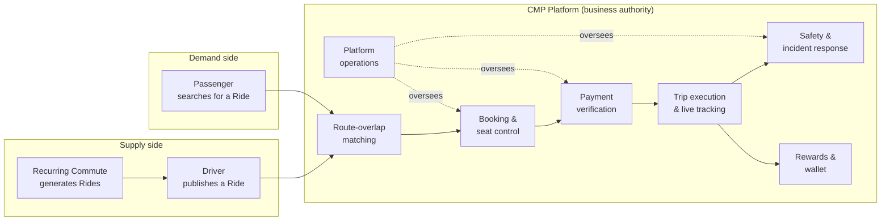

## 6.3 Solution Components (Business View)

| # | Component | Business purpose | Addresses |
|---|---|---|---|
| SC-01 | **Account & verification** | Establish who a participant is and how much confidence others may place in them. | F2 |
| SC-02 | **Vehicle registry** | Establish what the passenger will be travelling in. | F2 |
| SC-03 | **Ride publishing** | Convert a driver's intended journey into a discoverable offer. | F1 |
| SC-04 | **Route-overlap matching & search** | Connect compatible demand and supply, including partial-route matches. | F1 |
| SC-05 | **Ride request & booking** | Convert interest into a committed, seat-controlled agreement. | F1, F3 |
| SC-06 | **Payment & settlement (UPI)** | Remove money friction; establish an unambiguous, backend-verified payment state. | F3 |
| SC-07 | **Trip execution & live tracking** | Coordinate the journey and provide visibility. | F1, F4 |
| SC-08 | **Communication (chat & notifications)** | Keep both parties informed and coordinated. | F1, F4 |
| SC-09 | **Safety (SOS, sharing, safety centre)** | Provide protection and an accountable response path. | F4 |
| SC-10 | **Ratings & reviews** | Convert past behaviour into future trust signal. | F2, F4 |
| SC-11 | **Recurring commute** | Convert transactions into habits. | F1 |
| SC-12 | **Wallet & rewards** | Reinforce retention and offset early-stage low liquidity. | F1 |
| SC-13 | **Platform operations (Admin)** | Verify, moderate, support, investigate, and report. | F2, F4 |

## 6.4 How the Solution Resolves Each Failure

| Failure | Mechanism | Residual gap |
|---|---|---|
| F1 Coordination | Structured rides + route-overlap matching + recurring schedules + notifications. | Matching is only as good as corridor liquidity — `BAD-RISK-002`. |
| F2 Trust | Verification + visible indicators + ratings + reviews + vehicle data. | Verification strength undecided — `BAD-DEC-005`. |
| F3 Settlement | Up-front fare + UPI payment + backend verification + wallet ledger. | Fee model and driver payout undecided — `BAD-DEC-003`, `BAD-DEC-004`. |
| F4 Safety | Trip records + live sharing + SOS + emergency contacts + admin incident response. | Response protocol undecided — `BAD-DEC-011`. |

## 6.5 Solution Principles

| # | Principle | Statement | Class |
|---|---|---|---|
| SP-1 | **Backend is the business authority.** | Shared business state is decided by the platform, never asserted by a client. | FACT |
| SP-2 | **Peer, not professional.** | The platform coordinates private individuals sharing a journey. | FACT |
| SP-3 | **Trust is earned and displayed.** | Verification and reputation are visible at the point of decision. | RECOMMENDATION |
| SP-4 | **The commute is the product.** | Design for the repeated journey first, the one-off second. | RECOMMENDATION |
| SP-5 | **Safety is not optional scope.** | Safety capability ships with the first release that carries real passengers. | RECOMMENDATION |
| SP-6 | **No silent money.** | Every value movement is recorded, attributable and visible to its owner. | RECOMMENDATION |

## 6.6 Solution Constraints Acknowledged Up Front

**FACT.** The solution must be delivered within the approved technology direction
(Section 20): Android/Kotlin/Jetpack Compose client; Laravel backend as business
authority; Laravel Filament admin; MySQL persistence; versioned REST/JSON API; Google
Maps Platform; Firebase services; Indian UPI payment ecosystem. Supabase, PostgreSQL and
Spring Boot are excluded.

---

# 7. Business Objectives

Objectives are **outcome statements**. They carry no numeric target here, because no
target has been supplied and none may be invented. Measurement is defined in Section 23;
targets are `[TBD – Business Decision Required]` (`BAD-DEC-018`).

| ID | Objective | Rationale | Measured by | Class |
|---|---|---|---|---|
| `BAD-OBJ-001` | Enable a commuter to find and book a compatible shared ride on their corridor without leaving the application. | Directly resolves F1. | `BAD-KPI-004`, `BAD-KPI-005` | RECOMMENDATION |
| `BAD-OBJ-002` | Enable a driver to convert spare seats into settled value with minimal effort per journey. | Directly resolves DP-01, DP-02. | `BAD-KPI-008`, `BAD-KPI-009` | RECOMMENDATION |
| `BAD-OBJ-003` | Establish sufficient mutual trust for strangers to share a private vehicle. | Resolves F2; precondition for all conversion. | `BAD-KPI-011`, `BAD-KPI-012` | RECOMMENDATION |
| `BAD-OBJ-004` | Remove payment friction and payment ambiguity from shared travel. | Resolves F3. | `BAD-KPI-014`, `BAD-KPI-015` | RECOMMENDATION |
| `BAD-OBJ-005` | Provide credible safety cover and an accountable response to safety events. | Resolves F4; also a licence-to-operate concern. | `BAD-KPI-017`, `BAD-KPI-018` | RECOMMENDATION |
| `BAD-OBJ-006` | Convert one-off usage into habitual recurring commuting. | Retention is the commercial engine of the concept. | `BAD-KPI-006`, `BAD-KPI-007` | RECOMMENDATION |
| `BAD-OBJ-007` | Achieve sufficient supply and demand density on targeted corridors for search to reliably return usable results. | Without corridor liquidity nothing else matters. | `BAD-KPI-002`, `BAD-KPI-003` | RECOMMENDATION |
| `BAD-OBJ-008` | Maintain a single authoritative record of every ride, booking, payment and trip. | Dispute resolution, operations, and trust all depend on it. | `BAD-KPI-021` | RECOMMENDATION |
| `BAD-OBJ-009` | Give platform operators the tools to verify, moderate, support and investigate. | Operability is a business requirement, not an afterthought. | `BAD-KPI-022`, `BAD-KPI-023` | RECOMMENDATION |
| `BAD-OBJ-010` | Establish a lawful and defensible operating position in the target market. | Currently unknown and the largest single business risk. | `BAD-KPI-026` | RECOMMENDATION |

## 7.1 Objective Dependency

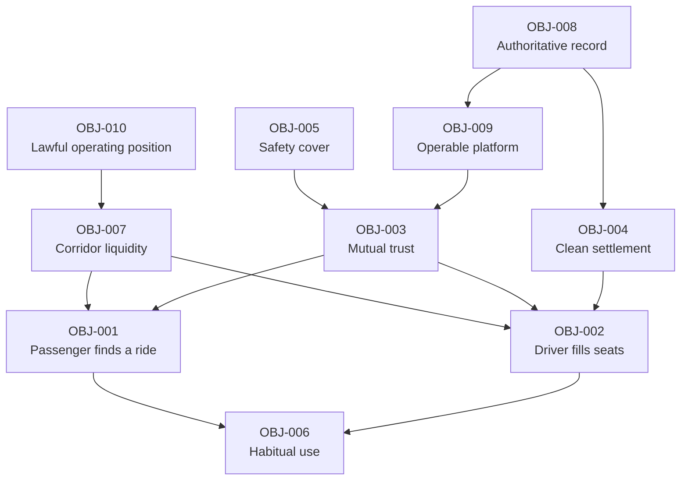

**Reading:** OBJ-010 and OBJ-007 are upstream of everything. A legally exposed or
liquidity-starved platform cannot deliver any other objective.

---

# 8. Business Goals

Goals express *direction of travel* over defined horizons. Horizons are expressed as
phases, not dates, because no delivery timeline has been supplied (`BAD-DEC-002`).

| ID | Horizon | Goal | Supports |
|---|---|---|---|
| G-01 | Phase 0 — Foundation | Resolve the 24 business decisions in Section 27 and obtain a legal opinion. | OBJ-010 |
| G-02 | Phase 0 — Foundation | Validate the problem hypotheses in Sections 4 and 5 with real commuters on real corridors. | All |
| G-03 | Phase 1 — MVP | Deliver a working single-corridor commute loop: publish → search → book → pay → travel → rate. | OBJ-001, OBJ-002, OBJ-004 |
| G-04 | Phase 1 — MVP | Ship verification and core safety with the first release that carries passengers. | OBJ-003, OBJ-005 |
| G-05 | Phase 2 — Habit | Deliver recurring commutes and make the daily arrangement self-sustaining. | OBJ-006 |
| G-06 | Phase 2 — Habit | Deliver wallet and rewards to counter early-stage churn. | OBJ-006, OBJ-007 |
| G-07 | Phase 3 — Density | Expand corridor by corridor rather than city-wide, protecting match quality. | OBJ-007 |
| G-08 | Phase 3 — Density | Mature platform operations: moderation, support, incident handling, reporting. | OBJ-009 |
| G-09 | Phase 4 — Scale | Extend beyond the initial platform and market once the unit model is proven. | FUTURE CONSIDERATION |

**Classification:** RECOMMENDATION. Goal set and phasing are proposed, not approved.

---

# 9. Success Criteria

Success criteria are the conditions under which the Project Owner may declare the
business objectives met. **Thresholds are deliberately absent** — see `BAD-DEC-018`.

## 9.1 Product Success Criteria

| ID | Criterion | Objective | Threshold |
|---|---|---|---|
| `BAD-SC-001` | A passenger searching a covered corridor at a covered time receives at least one genuinely compatible ride result. | OBJ-001, OBJ-007 | `[TBD – Business Decision Required]` |
| `BAD-SC-002` | A passenger can complete search → confirmed booking → paid, in one uninterrupted session. | OBJ-001, OBJ-004 | `[TBD]` |
| `BAD-SC-003` | A driver can publish a ride in a single short interaction, and re-publish a recurring commute without re-entering details. | OBJ-002, OBJ-006 | `[TBD]` |
| `BAD-SC-004` | Payment state for every booking is unambiguous and backend-determined; no booking is ever confirmed on unverified client-side payment evidence. | OBJ-004, OBJ-008 | **Absolute — no tolerance** |
| `BAD-SC-005` | Seat availability is never over-allocated. | OBJ-008 | **Absolute — no tolerance** |
| `BAD-SC-006` | Every completed trip produces a durable record of participants, route, payment and outcome. | OBJ-008 | **Absolute — no tolerance** |

## 9.2 Trust & Safety Success Criteria

| ID | Criterion | Objective | Threshold |
|---|---|---|---|
| `BAD-SC-007` | A user can determine another party's verification status before committing to travel with them. | OBJ-003 | **Absolute** |
| `BAD-SC-008` | An SOS raised during a trip results in a defined, executed operational response. | OBJ-005 | Response protocol `[TBD – BAD-DEC-011]` |
| `BAD-SC-009` | A user can share a live trip with a nominated contact without leaving the trip screen. | OBJ-005 | **Absolute** |
| `BAD-SC-010` | A reported user or incident reaches an operator queue and is actioned. | OBJ-009 | Time target `[TBD]` |

## 9.3 Business Success Criteria

| ID | Criterion | Objective | Threshold |
|---|---|---|---|
| `BAD-SC-011` | Recurring commutes account for a meaningful and growing share of completed trips. | OBJ-006 | `[TBD]` |
| `BAD-SC-012` | Corridor-level match rate is sustained as the user base grows. | OBJ-007 | `[TBD]` |
| `BAD-SC-013` | A selected and approved monetisation mechanism is operating and measurable. | OBJ-002 | Mechanism `[TBD – BAD-DEC-003]` |
| `BAD-SC-014` | The platform operates within a legal position confirmed by qualified advice. | OBJ-010 | **Absolute — precondition to launch** |

## 9.4 Criteria the Author Recommends Treating as Non-Negotiable

`BAD-SC-004`, `BAD-SC-005`, `BAD-SC-006`, `BAD-SC-007`, `BAD-SC-009`, `BAD-SC-014`.

**RECOMMENDATION.** These six should be treated as release gates rather than targets.
Each protects either the integrity of money and seats, or the safety and legality of the
service.

---

# 10. Product Scope

## 10.1 Scope Statement

**FACT.** The current product scope is the **Android application and its supporting
platform**, serving **peer-to-peer daily commuting** in the **Indian market and payment
ecosystem**, administered through a Laravel Filament back office.

Scope is expressed at business-capability level. Feature-level scope is settled in the
BRD and FRD.

## 10.2 In Scope

### 10.2.1 In Scope — User & Account

| # | In-scope capability | Note |
|---|---|---|
| IS-01 | User registration and login | FACT |
| IS-02 | Logout and session termination | FACT |
| IS-03 | User profile creation and maintenance | FACT |
| IS-04 | Phone verification | FACT — mechanism `[TBD – Technical Decision Required]` |
| IS-05 | Identity verification | FACT — accepted evidence `[TBD – BAD-DEC-005]` |
| IS-06 | User account status lifecycle | FACT — permitted states `[TBD – BAD-DEC-006]` |
| IS-07 | Role management (passenger / driver / admin) | FACT |

### 10.2.2 In Scope — Vehicle

| # | In-scope capability | Note |
|---|---|---|
| IS-08 | Add, edit and remove a vehicle | FACT |
| IS-09 | Vehicle verification | FACT — evidence `[TBD – BAD-DEC-005]` |
| IS-10 | Vehicle detail display to passengers | FACT |
| IS-11 | Association of a vehicle with a published ride | FACT |

### 10.2.3 In Scope — Ride Supply and Discovery

| # | In-scope capability | Note |
|---|---|---|
| IS-12 | Ride publishing (origin, destination, date, time, seats, fare, vehicle, preferences) | FACT |
| IS-13 | Ride preferences (AC, smoking, music, luggage, pets) | FACT |
| IS-14 | Ride search by origin, destination, date and seat count | FACT |
| IS-15 | Route-overlap matching, including partial-segment matches | FACT — algorithm not finalised |
| IS-16 | Presentation of match quality, fare, timing, seats, driver, vehicle and verification indicators | FACT |
| IS-17 | Recurring commute schedules (daily / weekly / working-day), with activation, pause and removal | FACT — rules `[TBD – BAD-DEC-008]` |
| IS-18 | Automatic ride generation from a recurring schedule | FACT — rules `[TBD – BAD-DEC-008]` |

### 10.2.4 In Scope — Transaction

| # | In-scope capability | Note |
|---|---|---|
| IS-19 | Ride request by a passenger | FACT — acceptance model `[TBD – BAD-DEC-007]` |
| IS-20 | Seat booking and backend-controlled seat allocation | FACT |
| IS-21 | Booking confirmation under backend authority | FACT |
| IS-22 | Payment via the Indian UPI ecosystem | FACT — PSP `[TBD – Technical Decision Required]` |
| IS-23 | Backend payment verification | FACT |
| IS-24 | Fare calculation under backend authority | FACT — fare model `[TBD – BAD-DEC-003]` |
| IS-25 | Cancellation of rides, requests and bookings | FACT — rules `[TBD – BAD-DEC-009]` |
| IS-26 | Refund handling | FACT — policy `[TBD – BAD-DEC-010]` |

### 10.2.5 In Scope — Trip Execution

| # | In-scope capability | Note |
|---|---|---|
| IS-27 | Active trip lifecycle management | FACT — final state model `[TBD]` |
| IS-28 | Live vehicle position and trip tracking | FACT |
| IS-29 | Trip telemetry (speed, ETA, remaining distance, landmark, navigation instruction) | FACT |
| IS-30 | Trip completion | FACT |
| IS-31 | Historical trip records | FACT |
| IS-32 | Ratings and reviews | FACT — scale and rules `[TBD – BAD-DEC-012]` |

### 10.2.6 In Scope — Communication, Safety, Value

| # | In-scope capability | Note |
|---|---|---|
| IS-33 | In-app driver/passenger chat with persistence and offline viewing | FACT |
| IS-34 | Push notifications across ride, booking, payment, trip, chat, reward, safety and system categories | FACT |
| IS-35 | SOS signalling | FACT — response protocol `[TBD – BAD-DEC-011]` |
| IS-36 | Emergency contacts | FACT |
| IS-37 | Live trip sharing | FACT |
| IS-38 | Safety centre and safety information | FACT |
| IS-39 | Wallet and wallet ledger | FACT — nature of wallet `[TBD – BAD-DEC-013]` |
| IS-40 | Points earning and redemption | FACT — economics `[TBD – BAD-DEC-013]` |
| IS-41 | Coupons | FACT — economics `[TBD – BAD-DEC-013]` |
| IS-42 | Ride-based, referral and milestone rewards | FACT — economics `[TBD – BAD-DEC-013]` |

### 10.2.7 In Scope — Platform Operations

| # | In-scope capability | Note |
|---|---|---|
| IS-43 | Admin management of users, drivers, vehicles and verification | FACT |
| IS-44 | Admin oversight of rides, requests, bookings and trips | FACT |
| IS-45 | Admin payment, wallet, reward and coupon operations | FACT |
| IS-46 | Review moderation | FACT |
| IS-47 | Safety incident operations | FACT |
| IS-48 | Notification administration | FACT |
| IS-49 | Support operations | FACT |
| IS-50 | Reporting | FACT — report set `[TBD]` |

## 10.3 Out of Scope

The following are **explicitly excluded from current scope**. Anything listed here that
later becomes desirable must enter through change control.

| # | Excluded | Reason |
|---|---|---|
| OS-01 | iOS application | Initial focus is Android (FACT). |
| OS-02 | Web application for passengers or drivers | Not part of the approved concept. |
| OS-03 | Professional / commercial driver supply, dispatch, or driver-for-hire | Contradicts `BAD-RULE-001`. |
| OS-04 | Vehicle rental or leasing | Different business. |
| OS-05 | Goods, parcel or freight movement | Different business and different regulatory position. |
| OS-06 | Intercity long-distance travel as a primary use case | Concept centre of gravity is the daily commute. See 10.4. |
| OS-07 | Public transport ticketing or integration | Not in the approved concept. |
| OS-08 | Insurance products issued or brokered by the platform | Would require claims that cannot be made — see `BAD-RISK-006`. |
| OS-09 | In-app cash handling | Payment direction is UPI. |
| OS-10 | Direct client-to-database access from the mobile app | Prohibited by the approved architecture (FACT). |
| OS-11 | Autonomous fare negotiation or bidding between users | Not in the approved concept. |
| OS-12 | Social feed, follower graph, or non-travel social features | Contradicts vision boundary 2.4. |
| OS-13 | Multi-currency or non-INR settlement | Initial market is India. |
| OS-14 | Corporate / employer commute contracts and billing | See 10.4 Future Scope. |
| OS-15 | Loyalty partnerships with third-party merchants | Not decided; would extend the reward economy materially. |
| OS-16 | Non-Google mapping providers | Approved direction is Google Maps Platform. |

## 10.4 Future Scope

Recorded so that current design does not preclude them. **FUTURE CONSIDERATION — none of
these are commitments.**

| # | Future item | Why it is plausible | Design implication now |
|---|---|---|---|
| FS-01 | iOS client | Market coverage. | Keep business logic server-side (already required). |
| FS-02 | Web experience for ride management | Driver convenience; admin-adjacent. | Keep the API client-agnostic. |
| FS-03 | Corporate / campus commute programmes | Concentrated, predictable corridors — a natural liquidity solution. | Do not hard-code a purely individual account model. |
| FS-04 | Intercity ride sharing | Adjacent, well-proven model. | Do not assume short distances in the domain model. |
| FS-05 | Multi-city expansion | Growth. | Avoid single-city assumptions in matching and configuration. |
| FS-06 | Additional payment rails beyond UPI | Market and regulatory flexibility. | Keep payment method abstracted at the business level. |
| FS-07 | Third-party reward partnerships | Reward economy depth. | Keep the wallet ledger extensible. |
| FS-08 | Carbon / sustainability reporting to users or employers | Trip records already contain the raw data. | Retain route and occupancy data. |
| FS-09 | Advanced trust signals (verified employer, verified campus) | Strengthens F2. | Keep verification a multi-level concept, not a boolean. |

## 10.5 Scope Boundary Diagram

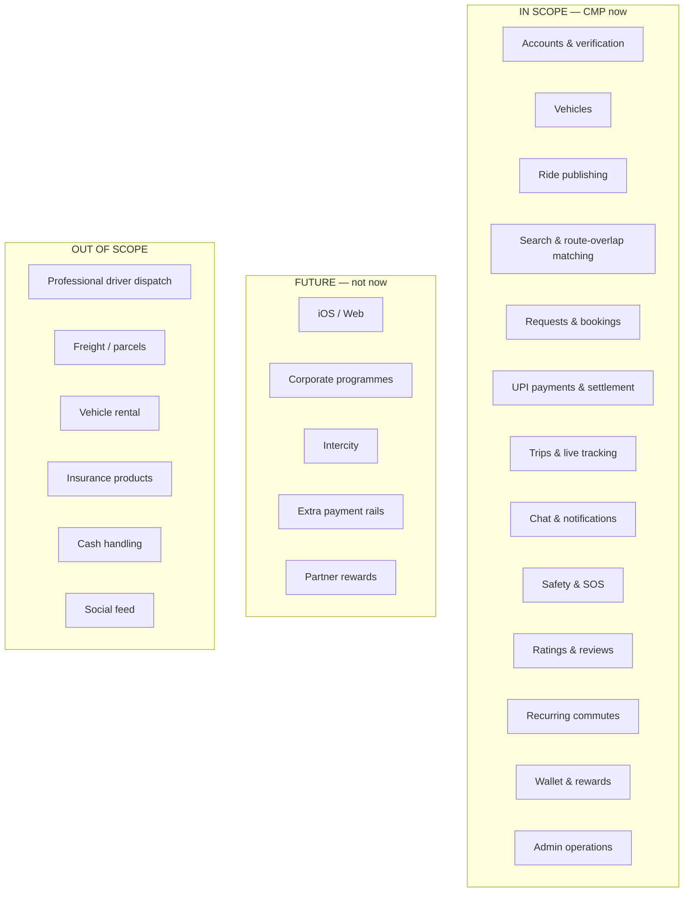

## 10.6 Scope Risks

| Risk to scope | Reference |
|---|---|
| Pressure to add professional drivers to solve liquidity | `BAD-RISK-003` |
| Pressure to launch without safety or verification | `BAD-RISK-004` |
| Reward economics expanding without a decided budget | `BAD-RISK-010` |

---

# 11. Stakeholders

## 11.1 Stakeholder Register

| ID | Stakeholder | Category | Interest in CMP | Influence | Impact on them | Engagement |
|---|---|---|---|---|---|---|
| `BAD-SH-001` | **Project Owner** | Internal — decision | Owns product outcome; sole approval authority. | Very High | Very High | Approve documents, resolve the 24 decisions |
| `BAD-SH-002` | **Product Owner** | Internal — decision | Scope, prioritisation, backlog. | High | High | Continuous |
| `BAD-SH-003` | **Business Stakeholders / Sponsors** | Internal — decision | Commercial viability and funding. | Very High | High | Milestone review |
| `BAD-SH-004` | **Passenger (end user)** | External — primary | Affordable, safe, predictable commuting. | Low individually | Very High | Research, testing, feedback |
| `BAD-SH-005` | **Driver (end user)** | External — primary | Offsetting journey cost; convenience; safety. | Low individually | Very High | Research, testing, feedback |
| `BAD-SH-006` | **Emergency Contact** | External — secondary | Welfare of the traveller they are nominated by. | None | Medium | Consider in safety design |
| `BAD-SH-007` | **Platform Operations / Admin staff** | Internal — operational | Workable tools; manageable workload. | Medium | High | Requirements input for DOC-17 |
| `BAD-SH-008` | **Support staff** | Internal — operational | Resolvable cases, evidence access. | Medium | High | Requirements input |
| `BAD-SH-009` | **Trust & Safety function** | Internal — operational | Incident response capability. | Medium | Very High | Requirements input; `BAD-DEC-011` |
| `BAD-SH-010` | **Engineering (Mobile, Backend, QA, DevOps, Security)** | Internal — delivery | Unambiguous, testable requirements. | Medium | High | Consumers of this chain |
| `BAD-SH-011` | **UI/UX Design** | Internal — delivery | Persona clarity, journey clarity. | Medium | High | DOC-12 input |
| `BAD-SH-012` | **Payment Service Provider / UPI ecosystem** | External — supplier | Compliance with their integration and rules. | High | Medium | `BAD-DEP-004`; selection pending |
| `BAD-SH-013` | **Google (Maps Platform) / Firebase** | External — supplier | Terms of service and quota compliance. | High | Medium | `BAD-DEP-002`, `BAD-DEP-003` |
| `BAD-SH-014` | **Regulators / legal authorities** | External — governing | Lawful operation of shared private transport. | Very High | Very High | **Unengaged — `BAD-DEC-001`** |

## 11.2 Influence / Impact Positioning

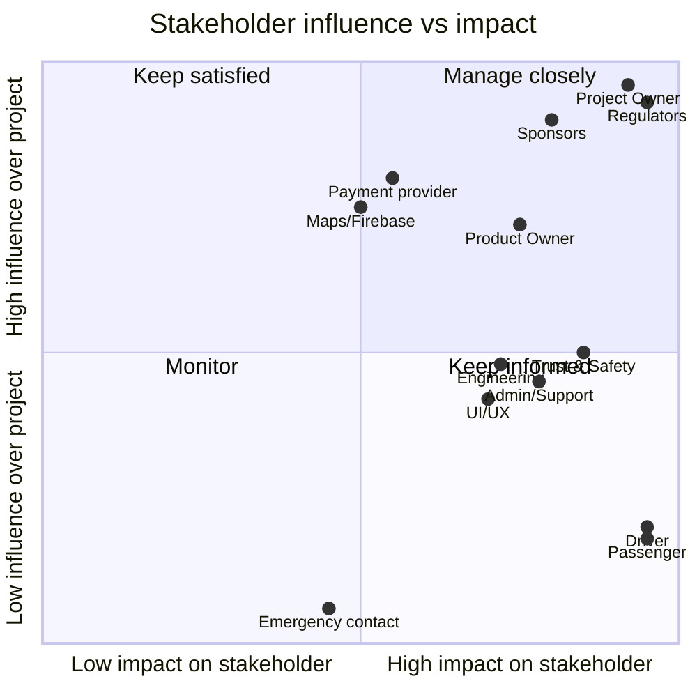

## 11.3 Stakeholder Notes of Consequence

| Observation | Implication |
|---|---|
| Passengers and drivers carry the **highest impact and the lowest individual influence**. | The Project Owner must act as their proxy. Validation research (`BAD-DEC-002`) is the mechanism. |
| **Regulators are high-influence, high-impact, and entirely unengaged.** | This is the most serious governance gap in the project. `BAD-DEC-001`. |
| **Trust & Safety has high impact but only medium influence** as currently framed. | RECOMMENDATION: give Trust & Safety a formal veto over launch readiness. |
| Payment provider and Google are **unselected suppliers with high influence**. | Do not let architecture assume a specific provider before selection — `BAD-DEP-004`. |

## 11.4 RACI — Documentation and Decision Chain

| Activity | Project Owner | Product Owner | BA | Architect | Trust & Safety | Engineering |
|---|---|---|---|---|---|---|
| Approve BAD | **A** | C | R | I | C | I |
| Resolve business decisions (§27) | **A/R** | C | C | I | C | I |
| Obtain legal opinion | **A** | I | I | I | C | I |
| Author BRD | A | C | **R** | C | C | I |
| Define verification policy | **A** | C | C | I | **R** | I |
| Define safety response protocol | **A** | C | C | I | **R** | C |
| Select payment provider | **A** | C | I | **R** | I | C |

*R = Responsible · A = Accountable · C = Consulted · I = Informed*

---

# 12. Personas

> **Classification: ASSUMPTION (`BAD-ASM-011`).** These personas are **concept-derived
> archetypes**, constructed to give design and requirements work a consistent frame. They
> are **not** research outputs. No demographic, income, behavioural or attitudinal claim
> here has been validated. Persona validation is `BAD-OQ-002` and forms part of
> `BAD-DEC-002`.

## 12.1 Persona Summary

| ID | Persona | Side | Core need | Primary risk to CMP |
|---|---|---|---|---|
| `BAD-PER-001` | The Routine Commuter (passenger) | Demand | A dependable daily seat | Abandons if match rate is unreliable |
| `BAD-PER-002` | The Cost-Sharing Driver | Supply | Offset journey cost with no hassle | Stops publishing if requests are erratic |
| `BAD-PER-003` | The Safety-First Traveller | Demand | Confidence in who they travel with | Never converts without strong verification |
| `BAD-PER-004` | The Occasional Passenger | Demand | An option for a one-off trip | Low retention; high support cost |
| `BAD-PER-005` | The Reluctant Driver | Supply (latent) | Reassurance before offering a seat | Never activates; supply stays thin |
| `BAD-PER-006` | The Platform Operator | Internal | Control and evidence | Cannot run the platform without tooling |
| `BAD-PER-007` | The Safety Responder | Internal | Fast, complete situational information | Cannot act on an SOS without protocol and data |

## 12.2 Persona Detail

### `BAD-PER-001` — The Routine Commuter (Passenger)

| Attribute | Description |
|---|---|
| Context | Travels a fixed corridor on working days, at broadly fixed times. |
| Goal | Secure a reliable seat, ideally the same arrangement repeatedly. |
| Behaviour | Plans ahead; values predictability far above novelty; will tolerate a short walk to a good pickup point. |
| Decision drivers | Reliability > cost > comfort > speed. |
| Frustrations | Searching and finding nothing; last-minute cancellation; unclear pickup; unclear cost. |
| What CMP must do | Deliver `BAD-BR-016`…`BAD-BR-021` (search/matching), `BAD-BR-061`…`BAD-BR-064` (recurring), `BAD-BR-058`…`BAD-BR-060` (notifications). |
| Success feels like | "I have a seat tomorrow and I did not have to think about it." |
| Class | ASSUMPTION |

### `BAD-PER-002` — The Cost-Sharing Driver

| Attribute | Description |
|---|---|
| Context | Drives their own vehicle on a fixed commute with 1–3 empty seats. |
| Goal | Recover part of the journey cost without changing their journey. |
| Behaviour | Will not accept meaningful detours; wants publishing to take seconds; wants payment handled without conversation. |
| Decision drivers | Zero-detour > effort > money > sociability. |
| Frustrations | No-shows; haggling; chasing payment; re-entering the same ride daily. |
| What CMP must do | `BAD-BR-011`…`BAD-BR-015` (publishing), `BAD-BR-029`…`BAD-BR-034` (payment), `BAD-BR-061`+ (recurring). |
| Success feels like | "My commute costs me less and I did nothing extra." |
| Class | ASSUMPTION |

### `BAD-PER-003` — The Safety-First Traveller

| Attribute | Description |
|---|---|
| Context | Would benefit from carpooling but treats travelling with strangers as a genuine risk. |
| Goal | Travel only with verified people, with someone informed of their whereabouts. |
| Behaviour | Reads profiles, checks verification badges, checks ratings, shares trips by default. |
| Decision drivers | Verification > visibility > recourse > cost. |
| Frustrations | Unverified counterparties; no way to tell anyone where they are; no clear escalation path. |
| What CMP must do | `BAD-BR-004`…`BAD-BR-006` (verification), `BAD-BR-044`…`BAD-BR-048` (safety), `BAD-BR-049`…`BAD-BR-051` (reputation). |
| Success feels like | "I know who they are, and my sister can see where I am." |
| Class | ASSUMPTION |
| Note | **This persona is the acceptance test for the trust model.** If the product does not convert `BAD-PER-003`, the verification design has failed. |

### `BAD-PER-004` — The Occasional Passenger

| Attribute | Description |
|---|---|
| Context | Needs a ride sporadically — a one-off appointment, a broken-down vehicle. |
| Goal | Get a seat today. |
| Behaviour | Low familiarity with the app; high need for a self-explanatory flow; unlikely to configure anything. |
| Decision drivers | Availability now > everything else. |
| What CMP must do | Keep the one-off path complete and simple; not force recurring setup. |
| Class | ASSUMPTION |

### `BAD-PER-005` — The Reluctant Driver

| Attribute | Description |
|---|---|
| Context | Has empty seats and has considered sharing, but has not. |
| Goal | Reassurance that a stranger in their car is safe and lawful. |
| Barrier | Uncertainty about who will get in, about liability, and about whether this makes them a "commercial operator". |
| What CMP must do | Passenger verification visibility; clear conduct rules; **and a resolved legal position (`BAD-DEC-001`)**. |
| Why this persona matters | **Supply, not demand, is the harder side to build.** This persona is the untapped supply pool and directly serves OBJ-007. |
| Class | ASSUMPTION |

### `BAD-PER-006` — The Platform Operator (Admin)

| Attribute | Description |
|---|---|
| Context | Works in the Filament back office; verifies users and vehicles, moderates content, investigates disputes. |
| Goal | Resolve each case correctly with the evidence available. |
| Needs | Searchable records; verification queues; the ability to change user status; payment and wallet visibility; an audit trail of their own actions. |
| What CMP must do | `BAD-BR-065`…`BAD-BR-072`, `BAD-BR-073`…`BAD-BR-078`. |
| Class | ASSUMPTION (role exists as FACT; working practice assumed) |

### `BAD-PER-007` — The Safety Responder

| Attribute | Description |
|---|---|
| Context | Handles an SOS or a reported incident. |
| Goal | Understand the situation in seconds and act. |
| Needs | Who, where, which trip, which vehicle, which co-travellers, contact routes, and a defined protocol. |
| Blocker | **The protocol does not exist yet — `BAD-DEC-011`.** |
| Class | ASSUMPTION |

## 12.3 Persona Coverage Against Scope

| Persona | Well served by current scope? | Gap |
|---|---|---|
| `BAD-PER-001` Routine Commuter | Yes | Depends entirely on corridor liquidity. |
| `BAD-PER-002` Cost-Sharing Driver | Yes | No-show handling undecided (`BAD-DEC-009`). |
| `BAD-PER-003` Safety-First Traveller | Partially | Verification strength undecided (`BAD-DEC-005`). |
| `BAD-PER-004` Occasional Passenger | Yes | — |
| `BAD-PER-005` Reluctant Driver | **No** | Requires the legal position (`BAD-DEC-001`) and conduct rules. |
| `BAD-PER-006` Platform Operator | Yes | Report set undefined. |
| `BAD-PER-007` Safety Responder | **No** | No response protocol exists (`BAD-DEC-011`). |

**Two of seven personas are not currently served.** Both gaps are decision gaps, not
design gaps.

---

# 13. Business Processes

Twelve business processes are modelled. Each carries an ID, a trigger, participants,
steps, outcome, and the business rules that govern it.

## 13.1 Process Inventory

| ID | Process | Primary actor | Criticality |
|---|---|---|---|
| `BAD-BP-001` | User onboarding and verification | Passenger / Driver | High |
| `BAD-BP-002` | Vehicle registration and verification | Driver | High |
| `BAD-BP-003` | Ride publishing | Driver | High |
| `BAD-BP-004` | Ride search and route-overlap matching | Passenger | Critical |
| `BAD-BP-005` | Ride request and booking | Passenger + Driver | Critical |
| `BAD-BP-006` | Payment and settlement | Passenger + Platform | Critical |
| `BAD-BP-007` | Trip execution | Driver + Passenger | Critical |
| `BAD-BP-008` | Trip completion, rating and reward | Both | High |
| `BAD-BP-009` | Recurring commute management | Driver / Passenger | High |
| `BAD-BP-010` | Cancellation and refund | Either party | High |
| `BAD-BP-011` | Safety event / SOS handling | Passenger / Driver + Operator | Critical |
| `BAD-BP-012` | Dispute, report and moderation | Either party + Operator | High |

## 13.2 End-to-End Value Chain

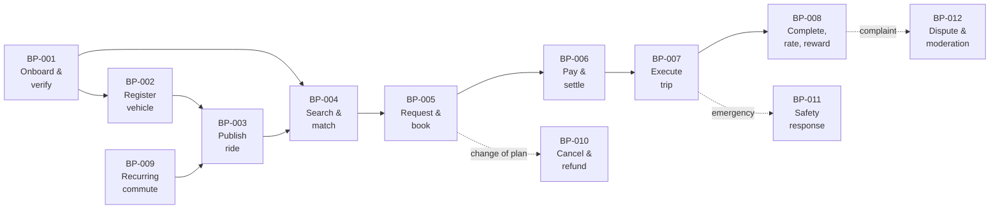

## 13.3 `BAD-BP-001` — User Onboarding and Verification

| Field | Value |
|---|---|
| Trigger | A prospective user installs the application. |
| Participants | Prospective user; Platform; Operator (for manual verification steps). |
| Pre-condition | None. |
| Outcome | A user account exists with a known verification level and status. |
| Governing rules | `BAD-RULE-003`, `BAD-RULE-004`, `BAD-RULE-005`, `BAD-RULE-006` |
| Requirements | `BAD-BR-001`…`BAD-BR-006` |

**Steps**

1. User registers with the required identifying details.
2. Platform verifies control of the phone number.
3. User completes their profile.
4. User optionally submits identity evidence.
5. Platform (automatically and/or via Operator) assesses the evidence.
6. Platform records the resulting verification level.
7. Verification indicators become visible to counterparties.

**Open points:** what evidence is accepted, what levels exist, and what each level
permits — `BAD-DEC-005`.

## 13.4 `BAD-BP-003` — Ride Publishing

| Field | Value |
|---|---|
| Trigger | A driver intends to travel a route with spare seats. |
| Participants | Driver; Platform. |
| Pre-condition | Driver has an account and at least one vehicle; verification prerequisites `[TBD – BAD-DEC-005]`. |
| Outcome | A discoverable Ride exists with seats available. |
| Governing rules | `BAD-RULE-007`…`BAD-RULE-012` |
| Requirements | `BAD-BR-011`…`BAD-BR-015` |

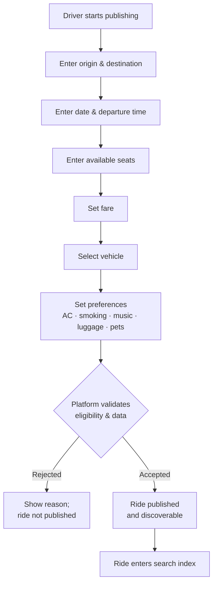

**Note.** Whether the driver freely sets the fare, or the platform constrains it, is
**undecided** and has direct regulatory implications — `BAD-DEC-003`, `BAD-RISK-001`.

## 13.5 `BAD-BP-004` — Ride Search and Route-Overlap Matching

| Field | Value |
|---|---|
| Trigger | Passenger needs to travel. |
| Participants | Passenger; Platform. |
| Outcome | A ranked set of compatible rides, or an empty result. |
| Governing rules | `BAD-RULE-013`…`BAD-RULE-017` |
| Requirements | `BAD-BR-016`…`BAD-BR-021` |

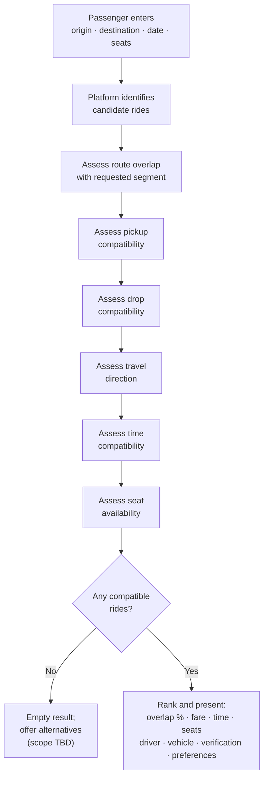

**The matching algorithm is not finalised** and must not be treated as specified —
`TECHNICAL DECISION REQUIRED`, routed to DOC-07/DOC-09.

## 13.6 `BAD-BP-005` — Ride Request and Booking

| Field | Value |
|---|---|
| Trigger | Passenger selects a ride. |
| Participants | Passenger; Driver; Platform. |
| Outcome | A confirmed booking with allocated seats, or a rejected/expired request. |
| Governing rules | `BAD-RULE-018`…`BAD-RULE-024` |
| Requirements | `BAD-BR-022`…`BAD-BR-028` |

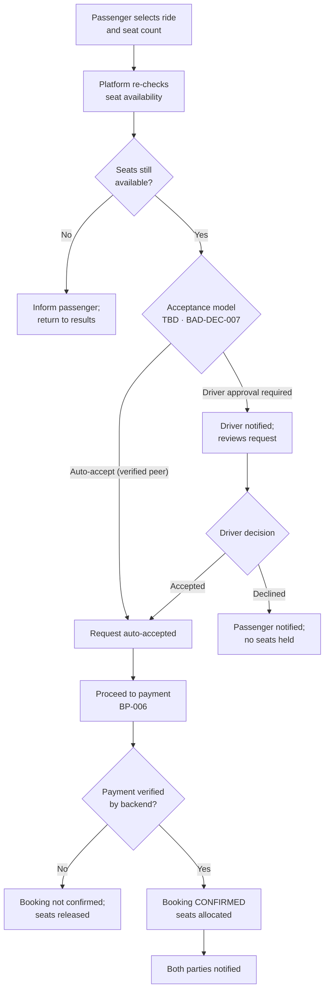

**Critical unresolved point.** Whether seats are *held* between request and payment, and
for how long, is undecided — `BAD-DEC-007`. This directly determines whether a driver's
seats can be blocked by non-paying requesters.

## 13.7 `BAD-BP-006` — Payment and Settlement

| Field | Value |
|---|---|
| Trigger | A booking requires payment. |
| Participants | Passenger; Platform; UPI ecosystem; Driver (as payee). |
| Outcome | A backend-verified payment status. |
| Governing rules | `BAD-RULE-025`…`BAD-RULE-030` — **the most safety-critical rule set in this document** |
| Requirements | `BAD-BR-029`…`BAD-BR-034` |

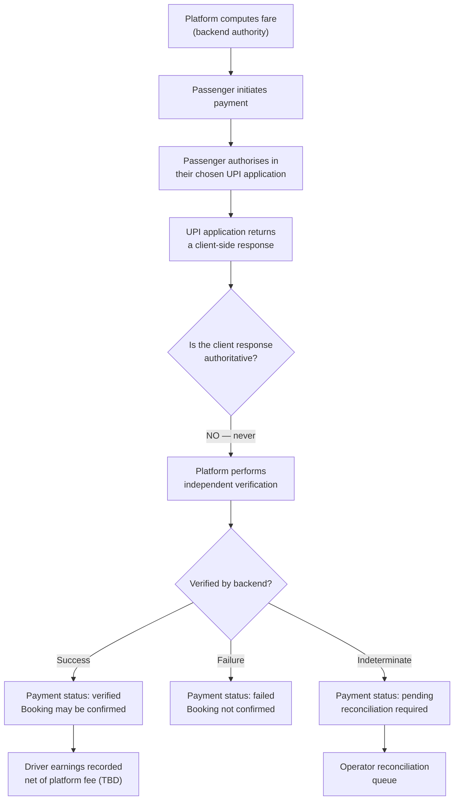

> **`BAD-RULE-025` (absolute).** A response from a client-side UPI application is
> **never** authoritative evidence of payment. Only backend verification may set payment
> status. Violating this rule creates direct financial loss exposure.

**Undecided:** the PSP/integration model (`TECHNICAL DECISION REQUIRED`), the platform fee
(`BAD-DEC-003`), and how and when driver funds are settled (`BAD-DEC-004`).

## 13.8 `BAD-BP-007` — Trip Execution

| Field | Value |
|---|---|
| Trigger | Departure time approaches for a confirmed booking. |
| Participants | Driver; Passenger(s); Platform. |
| Outcome | A completed trip record. |
| Governing rules | `BAD-RULE-031`…`BAD-RULE-034` |
| Requirements | `BAD-BR-035`…`BAD-BR-040` |

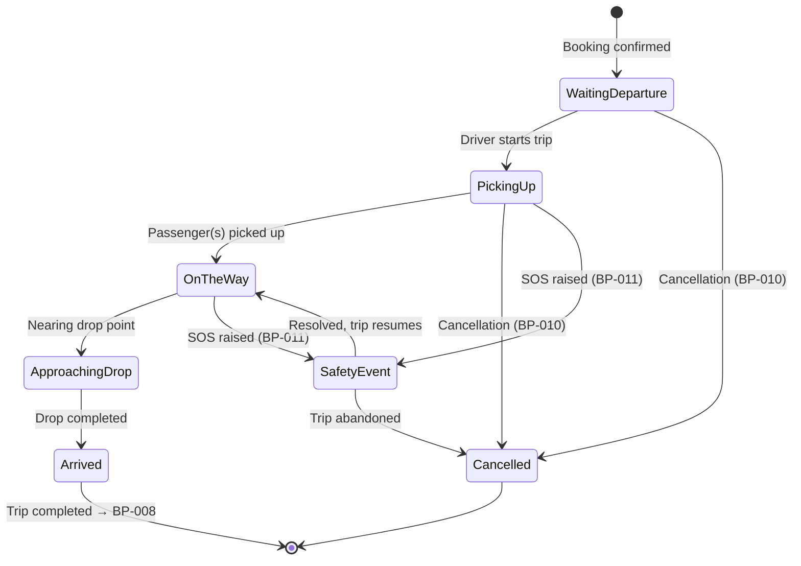

> **ASSUMPTION (`BAD-ASM-012`).** The five-state progression is taken from the approved
> concept. `Cancelled` and `SafetyEvent` are **author-added** states required for the
> model to be complete. The final state model is not approved — `BAD-DEC-015`.

Telemetry surfaced during the trip: speed, ETA, remaining distance, current landmark,
navigation instruction, vehicle position (FACT, from the concept).

## 13.9 `BAD-BP-009` — Recurring Commute Management

| Field | Value |
|---|---|
| Trigger | A user has a repeating travel pattern. |
| Outcome | Rides generated on a schedule without manual re-entry. |
| Governing rules | `BAD-RULE-035`…`BAD-RULE-038` |
| Requirements | `BAD-BR-061`…`BAD-BR-064` |

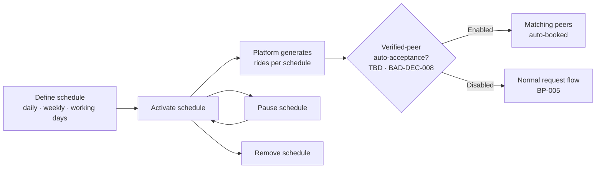

**Undecided:** generation horizon, what happens to already-generated rides when a
schedule is paused, holiday handling, and the auto-acceptance rule — `BAD-DEC-008`.

## 13.10 `BAD-BP-010` — Cancellation and Refund

| Field | Value |
|---|---|
| Trigger | Either party cancels, or the platform cancels. |
| Outcome | Released seats, a decided refund position, and a recorded reason. |
| Governing rules | `BAD-RULE-039`, `BAD-RULE-040` |
| Requirements | `BAD-BR-025`…`BAD-BR-026`, `BAD-BR-033` |

> **This process cannot be specified further.** Cancellation windows, penalties,
> no-show treatment and refund entitlement are **entirely undecided** — `BAD-DEC-009`,
> `BAD-DEC-010`. The only firm statements available are that the decision is
> backend-authoritative and that every cancellation must be recorded with a reason.

## 13.11 `BAD-BP-011` — Safety Event / SOS Handling

| Field | Value |
|---|---|
| Trigger | A user raises SOS, or a safety concern is detected/reported. |
| Participants | User; Emergency contacts; Platform; Safety Responder. |
| Outcome | A recorded safety incident with an executed response. |
| Governing rules | `BAD-RULE-041` |
| Requirements | `BAD-BR-044`…`BAD-BR-048`, `BAD-BR-070` |

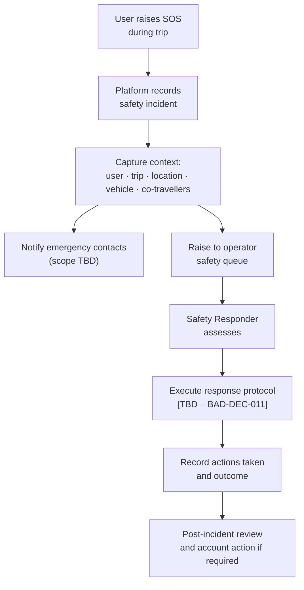

> **WARNING.** Step G is undefined. **RECOMMENDATION:** SOS functionality must not ship
> to real users until `BAD-DEC-011` is resolved. An emergency control with no defined
> response behind it creates user harm exposure and reputational exposure — see
> `BAD-RISK-005`.

## 13.12 `BAD-BP-012` — Dispute, Report and Moderation

| Field | Value |
|---|---|
| Trigger | A user reports another user, a review, a payment or a trip. |
| Outcome | An adjudicated case with a recorded decision and any account action. |
| Requirements | `BAD-BR-069`, `BAD-BR-071`, `BAD-BR-076` |
| Evidence available | Trip records, chat history, payment records, ratings, prior cases. |
| Undecided | Escalation tiers, penalties, appeal rights — `BAD-DEC-016`. |

## 13.13 Processes Not Yet Modelled

| Gap | Reason | Action |
|---|---|---|
| Account closure / data deletion | Not present in the source concept; likely to be required. | `BAD-OQ-012` |
| Driver payout / withdrawal operations | Depends on `BAD-DEC-004`. | Model after decision |
| Chargeback / payment reversal handling | Depends on PSP selection. | Model in DOC-14 |
| Fraud detection and response | Not in the source concept. | `BAD-OQ-014`, `BAD-RISK-011` |

---

# 14. Business Rules

Rules marked **absolute** are non-negotiable; they protect money integrity, seat
integrity, safety, or the legal position. Rules marked `[TBD]` state only what is known.

## 14.1 Foundational Rules

| ID | Rule | Class |
|---|---|---|
| `BAD-RULE-001` | CMP coordinates **private individuals sharing a journey they were already making**. The platform does not supply, employ, dispatch or direct professional drivers. | **Absolute** — FACT |
| `BAD-RULE-002` | The **backend is the authority** for all shared business state. The mobile client may hold temporary UI or cached state only. | **Absolute** — FACT |
| `BAD-RULE-003` | The mobile application must **never** connect directly to the database. | **Absolute** — FACT |

## 14.2 Account, Identity and Verification Rules

| ID | Rule | Class |
|---|---|---|
| `BAD-RULE-004` | A user must have a registered account before publishing, requesting or booking. | FACT |
| `BAD-RULE-005` | Control of the registered phone number must be verified. | FACT — mechanism TBD |
| `BAD-RULE-006` | Verification status is determined and held by the backend; it is never asserted by a client. **The verification standing vocabulary is `UNVERIFIED` and `VERIFIED`**; an account is `VERIFIED` when control of its registered phone number has been demonstrated, and `UNVERIFIED` until then. An `UNVERIFIED` account follows the verification flow of `FRD-FR-007`, `FRD-FR-008` and `FRD-FR-018`. | **Absolute** — FACT (vocabulary decided 2026-08-20) |
| `BAD-RULE-007` | Verification status must be visible to a counterparty **before** they commit to travel. | RECOMMENDATION (proposed absolute) |
| `BAD-RULE-008` | What verification levels **beyond phone-number standing** exist, what evidence each requires, and what each level permits. Phone-number standing is `BAD-RULE-006` and is decided; identity and vehicle verification evidence (`IS-05`, `IS-09`) and driver eligibility are not. | `[TBD – BAD-DEC-005]` |
| `BAD-RULE-009` | A user may hold both passenger and driver roles on one account. | ASSUMPTION |
| `BAD-RULE-010` | The permitted user account states are **`ACTIVE`, `SUSPENDED` and `DEACTIVATED`**. `ACTIVE` permits normal authenticated use; `SUSPENDED` and `DEACTIVATED` each prevent it. A `SUSPENDED` or `DEACTIVATED` account **shall not regain an active session** other than through a defined account-state transition. **Who may perform such a transition, on what grounds, and with what appeal remains undecided** — `FRD-GAP-024`, `BAD-DEC-006` / `BAD-DEC-016`. | **Absolute** — FACT (states decided 2026-08-20; transition authority still `[TBD]`) |
| `BAD-RULE-011` | A suspended user may not publish, request, book, or travel. **Subsumed in effect by `BAD-RULE-010`**, which prevents authenticated use entirely and therefore prevents all four. Retained because it states the business intent at a level that survives a change to the state model. | RECOMMENDATION |
| `BAD-RULE-043` | **The mandatory identifying detail for account registration is the verified phone number, and no other attribute is mandatory.** Name, email address, date of birth, address and other profile attributes are **not collected at registration**. This answers the deferral in `FRD-FR-002` (*"the identifying details the business defines as mandatory"*). A later decision may add an attribute; none may be added on the ground that it may be useful. | **Absolute** — FACT (decided 2026-08-20) |

## 14.3 Vehicle Rules

| ID | Rule | Class |
|---|---|---|
| `BAD-RULE-012` | A published ride must be associated with exactly one registered vehicle. | ASSUMPTION |
| `BAD-RULE-013` | Vehicle details shown to passengers must correspond to the vehicle recorded against the ride. | RECOMMENDATION (proposed absolute) |
| `BAD-RULE-014` | Whether an unverified vehicle may be used to publish a ride. | `[TBD – BAD-DEC-005]` |
| `BAD-RULE-015` | A vehicle may not be removed while it is associated with an active ride, booking or trip. | RECOMMENDATION |

## 14.4 Ride Publishing Rules

| ID | Rule | Class |
|---|---|---|
| `BAD-RULE-016` | A ride must state origin, destination, date, departure time, seat count, fare, vehicle and preferences. | FACT |
| `BAD-RULE-017` | Seats offered may not exceed the lawful passenger capacity of the vehicle. | RECOMMENDATION — capacity source `[TBD]` |
| `BAD-RULE-018` | Who sets the fare, and any constraint upon it. | `[TBD – BAD-DEC-003]` |
| `BAD-RULE-019` | A ride may not be published with a departure time in the past. | RECOMMENDATION |
| `BAD-RULE-020` | Whether a driver may edit a ride after bookings exist, and which fields. | `[TBD – BAD-DEC-017]` |
| `BAD-RULE-021` | Ride preferences (AC, smoking, music, luggage, pets) are declarative and must be shown to passengers before booking. | ASSUMPTION |

## 14.5 Matching Rules

| ID | Rule | Class |
|---|---|---|
| `BAD-RULE-022` | A ride is a candidate only if its route overlaps the passenger's requested segment, direction is compatible, timing is compatible, and seats are available. | FACT |
| `BAD-RULE-023` | The overlap calculation and any minimum overlap threshold. | `[TBD – Technical Decision Required]` |
| `BAD-RULE-024` | Result ranking must be explainable to the passenger (why this ride matched). | RECOMMENDATION |
| `BAD-RULE-025` | Search results must not expose a counterparty's precise home or personal location beyond what is required to coordinate pickup. | RECOMMENDATION (privacy) — detail `BAD-OQ-018` |

## 14.6 Request, Booking and Seat Rules

| ID | Rule | Class |
|---|---|---|
| `BAD-RULE-026` | Seat availability is calculated and enforced **solely** by the backend. | **Absolute** — FACT |
| `BAD-RULE-027` | Total confirmed seats on a ride may never exceed the seats offered. | **Absolute** |
| `BAD-RULE-028` | A booking is confirmed **only** by the backend. | **Absolute** — FACT |
| `BAD-RULE-029` | Whether a request requires driver acceptance, and whether verified peers may be auto-accepted. | `[TBD – BAD-DEC-007]` |
| `BAD-RULE-030` | Whether seats are held during request/payment, and for how long. | `[TBD – BAD-DEC-007]` |
| `BAD-RULE-031` | Permitted booking states and transitions. | `[TBD – BAD-DEC-015]` |

## 14.7 Payment Rules

| ID | Rule | Class |
|---|---|---|
| `BAD-RULE-032` | A client-side UPI application response is **never** authoritative evidence of payment. | **Absolute** — FACT |
| `BAD-RULE-033` | Payment status is set **only** by backend verification. | **Absolute** — FACT |
| `BAD-RULE-034` | Fare is computed by the backend. | **Absolute** — FACT |
| `BAD-RULE-035` | Whether a platform fee exists, its basis and its value. | `[TBD – BAD-DEC-003]` |
| `BAD-RULE-036` | How and when driver earnings are settled and withdrawn. | `[TBD – BAD-DEC-004]` |
| `BAD-RULE-037` | Every value movement must produce a durable, attributable ledger record. | RECOMMENDATION (proposed absolute) |
| `BAD-RULE-038` | Refund entitlement and calculation. | `[TBD – BAD-DEC-010]` |

## 14.8 Trip, Safety and Reputation Rules

| ID | Rule | Class |
|---|---|---|
| `BAD-RULE-039` | A trip may only proceed from a confirmed booking. | ASSUMPTION |
| `BAD-RULE-040` | Cancellation windows, penalties and no-show treatment. | `[TBD – BAD-DEC-009]` |
| `BAD-RULE-041` | Every SOS event must be recorded as a safety incident and routed to an operator queue. | RECOMMENDATION (proposed absolute) |
| `BAD-RULE-042` | Ratings and reviews may only be submitted by participants in the completed trip they concern. | RECOMMENDATION |

## 14.9 Rule Status Summary

| Status | Count | Meaning |
|---|---|---|
| Absolute (established) | 10 | Enforceable now; carry into BRD unchanged. |
| Recommendation | 15 | Author's proposal; require approval. |
| Assumption | 6 | Working position; require confirmation. |
| `[TBD]` — decision required | 11 | **Blocking for the BRD.** |

**Twenty-six per cent of the rule set is undecided.** These eleven gaps are consolidated
in Section 27.

> **NOTE (2026-08-20).** The rule set is now **43** rules: `BAD-RULE-010` moved out of
> `[TBD]` and `BAD-RULE-043` was issued. **The four bucket counts above have not been
> recomputed**, because they do not sum to the rule set as issued: the class column carries
> six distinct forms (`Absolute`, `FACT`, `FACT — mechanism TBD`, `RECOMMENDATION`,
> `ASSUMPTION`, `[TBD – …]`) and the summary has four buckets, so which bucket the plain
> `FACT` rows belong to cannot be read off the register. **A mechanical count of rows whose
> class is a `[TBD]` marker gives 13 at v0.1, not 11.** The discrepancy predates this
> revision and is reported rather than silently corrected — recomputing it would require
> the author’s intent for the four buckets, which is not recorded.

---

# 15. Business Domain Model

> **Scope note.** This is a **business** domain model: the concepts the business reasons
> about and their relationships. It is **not** a database design. Attributes, keys,
> normalisation and physical structure belong to CMP-DOC-11.

## 15.1 Domain Model Diagram

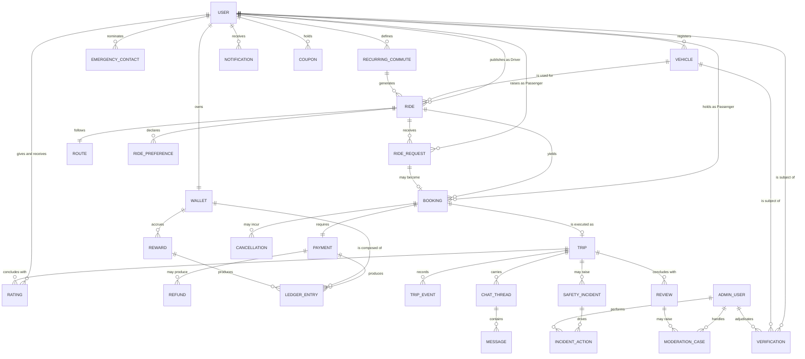

## 15.2 Core Business Entities

| Entity | Business definition | Owner of truth |
|---|---|---|
| **User** | A registered participant. May act as Passenger, Driver, or both. | Backend |
| **Verification** | An assessed claim about a User or Vehicle, producing a verification level. | Backend |
| **Vehicle** | A conveyance registered by a Driver and usable on rides. | Backend |
| **Route** | The path a Ride follows, against which passenger segments are overlapped. | Backend |
| **Ride** | A Driver's published journey offer: origin, destination, date, time, seats, fare, vehicle, preferences. | Backend |
| **Ride Preference** | A declared condition of travel (AC, smoking, music, luggage, pets). | Backend |
| **Recurring Commute** | A repeating travel pattern from which Rides are generated. | Backend |
| **Ride Request** | A Passenger's request for seats on a specific Ride. | Backend |
| **Booking** | A confirmed seat allocation. | **Backend — absolute** |
| **Payment** | A settlement of fare. | **Backend — absolute** |
| **Refund** | A reversal of value to a Passenger. | Backend |
| **Cancellation** | A recorded termination of a Ride, Request or Booking, with reason. | Backend |
| **Trip** | The execution of a Ride. | Backend |
| **Trip Event** | A recorded occurrence during a Trip (state change, telemetry milestone). | Backend |
| **Chat Thread / Message** | Communication between co-travellers. | Backend |
| **Rating / Review** | Post-trip reputation signals. | Backend |
| **Wallet / Ledger Entry** | A User's balance and the entries that constitute it. | **Backend — absolute** |
| **Reward / Coupon** | Value granted or redeemable. | Backend |
| **Emergency Contact** | A person nominated to be informed in a safety event. | Backend |
| **Safety Incident / Incident Action** | A recorded safety event and the operator actions taken. | Backend |
| **Notification** | A message pushed to a User. | Backend |
| **Admin User** | An operator of the platform back office. | Backend |
| **Moderation Case** | An adjudication of reported content or conduct. | Backend |

## 15.3 Entity Lifecycle Ownership

```mermaid
flowchart LR
    subgraph SA["Server-authoritative — absolute"]
        S1["Seat availability"]
        S2["Booking status"]
        S3["Payment status"]
        S4["Fare"]
        S5["Wallet balance"]
        S6["Verification status"]
        S7["Reward accrual"]
        S8["Refund decision"]
    end
    subgraph CL["Client-side — permitted"]
        C1["UI state"]
        C2["Cached ride lists"]
        C3["Draft inputs"]
        C4["Offline message viewing"]
        C5["Device location capture"]
    end
    CL -->|"submits, never asserts"| SA
    SA -->|"authoritative values"| CL
```

## 15.4 Domain Modelling Observations

| # | Observation | Implication |
|---|---|---|
| DM-1 | **Ride and Trip are distinct.** A Ride is an offer; a Trip is its execution. | Do not collapse them downstream — many concepts (cancellation, ratings, telemetry) attach to only one. |
| DM-2 | **Ride Request and Booking are distinct.** A request may never become a booking. | Seat-holding semantics depend on this (`BAD-DEC-007`). |
| DM-3 | **A Recurring Commute is a generator, not a Ride.** | Pausing a schedule and cancelling a generated ride are different acts (`BAD-DEC-008`). |
| DM-4 | **Wallet is a ledger, not a number.** | Balance is derived from entries; this is what makes disputes resolvable (`BAD-RULE-037`). |
| DM-5 | **Verification attaches to both User and Vehicle.** | A verified user may drive an unverified vehicle unless prohibited (`BAD-RULE-014`). |
| DM-6 | A Trip may carry **multiple passengers** with independent bookings. | Ratings, chat, safety context and drop sequencing are all multi-party. `BAD-OQ-008`. |
| DM-7 | Nothing in the model currently represents **account closure or data erasure**. | Gap — `BAD-OQ-012`. |

---

# 16. Business Capability Map

Capabilities describe **what the business must be able to do**, independent of how.

## 16.1 Capability Map

```mermaid
flowchart TB
    subgraph L1["Identity & Trust"]
        C1["CAP-001 Register & authenticate"]
        C2["CAP-002 Manage profile"]
        C3["CAP-003 Manage roles"]
        C4["CAP-004 Verify identity"]
        C5["CAP-005 Verify vehicle"]
        C6["CAP-006 Present trust signals"]
    end
    subgraph L2["Supply & Discovery"]
        C7["CAP-007 Publish rides"]
        C8["CAP-008 Match by route overlap"]
        C9["CAP-009 Search rides"]
        C10["CAP-010 Manage vehicles"]
        C11["CAP-011 Manage recurring commutes"]
        C12["CAP-012 Generate scheduled rides"]
    end
    subgraph L3["Transaction"]
        C13["CAP-013 Request & accept seats"]
        C14["CAP-014 Confirm bookings & control seats"]
        C15["CAP-015 Calculate fare"]
        C16["CAP-016 Collect payment (UPI)"]
        C17["CAP-017 Verify payment"]
        C18["CAP-018 Cancel & refund"]
    end
    subgraph L4["Journey"]
        C19["CAP-019 Execute trips"]
        C20["CAP-020 Track live position & telemetry"]
        C21["CAP-021 Enable co-traveller communication"]
        C22["CAP-022 Provide safety cover & SOS"]
        C23["CAP-023 Share live trips"]
        C24["CAP-024 Complete & record trips"]
    end
    subgraph L5["Value & Loyalty"]
        C25["CAP-025 Operate wallet & ledger"]
        C26["CAP-026 Accrue & redeem rewards"]
        C27["CAP-027 Issue & apply coupons"]
        C28["CAP-028 Capture ratings & reviews"]
    end
    subgraph L6["Operate the Platform"]
        C29["CAP-029 Administer users, rides & bookings"]
        C30["CAP-030 Moderate content & conduct"]
        C31["CAP-031 Respond to safety incidents"]
        C32["CAP-032 Report & analyse"]
    end
    L1 --> L2 --> L3 --> L4 --> L5
    L6 -.governs.-> L1
    L6 -.governs.-> L3
    L6 -.governs.-> L4
```

## 16.2 Capability Register

| ID | Capability | Layer | Maturity required at MVP | Requirements |
|---|---|---|---|---|
| `BAD-CAP-001` | Register & authenticate users | Identity | Full | `BAD-BR-001`–`003` |
| `BAD-CAP-002` | Manage user profile | Identity | Full | `BAD-BR-004` |
| `BAD-CAP-003` | Manage roles | Identity | Basic | `BAD-BR-006` |
| `BAD-CAP-004` | Verify identity | Identity | **Full — gating** | `BAD-BR-005` |
| `BAD-CAP-005` | Verify vehicle | Identity | **Full — gating** | `BAD-BR-009` |
| `BAD-CAP-006` | Present trust signals at point of decision | Identity | Full | `BAD-BR-020` |
| `BAD-CAP-007` | Publish rides | Supply | Full | `BAD-BR-011`–`015` |
| `BAD-CAP-008` | Match by route overlap | Discovery | **Full — differentiator** | `BAD-BR-017`–`019` |
| `BAD-CAP-009` | Search rides | Discovery | Full | `BAD-BR-016`, `021` |
| `BAD-CAP-010` | Manage vehicles | Supply | Full | `BAD-BR-007`–`010` |
| `BAD-CAP-011` | Manage recurring commutes | Supply | Phase 2 | `BAD-BR-061`–`063` |
| `BAD-CAP-012` | Generate scheduled rides | Supply | Phase 2 | `BAD-BR-064` |
| `BAD-CAP-013` | Request & accept seats | Transaction | Full | `BAD-BR-022`–`024` |
| `BAD-CAP-014` | Confirm bookings & control seats | Transaction | **Full — absolute integrity** | `BAD-BR-027`–`028` |
| `BAD-CAP-015` | Calculate fare | Transaction | Full | `BAD-BR-029` |
| `BAD-CAP-016` | Collect payment via UPI | Transaction | Full | `BAD-BR-030`–`031` |
| `BAD-CAP-017` | Verify payment server-side | Transaction | **Full — absolute integrity** | `BAD-BR-032` |
| `BAD-CAP-018` | Cancel & refund | Transaction | Basic (rules TBD) | `BAD-BR-025`–`026`, `033` |
| `BAD-CAP-019` | Execute trips | Journey | Full | `BAD-BR-035`–`036` |
| `BAD-CAP-020` | Track live position & telemetry | Journey | Full | `BAD-BR-037`–`039` |
| `BAD-CAP-021` | Co-traveller communication | Journey | Full | `BAD-BR-041`–`043` |
| `BAD-CAP-022` | Safety cover & SOS | Journey | **Full — gating** | `BAD-BR-044`–`046` |
| `BAD-CAP-023` | Share live trips | Journey | Full | `BAD-BR-047` |
| `BAD-CAP-024` | Complete & record trips | Journey | Full | `BAD-BR-040` |
| `BAD-CAP-025` | Operate wallet & ledger | Value | Phase 2 | `BAD-BR-052`–`054` |
| `BAD-CAP-026` | Accrue & redeem rewards | Value | Phase 2 | `BAD-BR-055`–`056` |
| `BAD-CAP-027` | Issue & apply coupons | Value | Phase 2 | `BAD-BR-057` |
| `BAD-CAP-028` | Capture ratings & reviews | Value | Full | `BAD-BR-049`–`051` |
| `BAD-CAP-029` | Administer users, rides, bookings | Operate | Full | `BAD-BR-065`–`068` |
| `BAD-CAP-030` | Moderate content & conduct | Operate | Full | `BAD-BR-069`, `071` |
| `BAD-CAP-031` | Respond to safety incidents | Operate | **Full — gating** | `BAD-BR-070` |
| `BAD-CAP-032` | Report & analyse | Operate | Basic | `BAD-BR-072` |

## 16.3 Capability Heat — Where the Business Differentiates

| Band | Capabilities | Treatment |
|---|---|---|
| **Differentiating** | `CAP-008` route-overlap matching, `CAP-011`/`CAP-012` recurring commute, `CAP-006` trust signals | Invest disproportionately. These are the reasons to choose CMP. |
| **Integrity-critical** | `CAP-014` seat control, `CAP-017` payment verification, `CAP-025` ledger | Zero-defect expectation. Failures here are financial and reputational. |
| **Licence to operate** | `CAP-004`, `CAP-005`, `CAP-022`, `CAP-031` | Must be present and credible before carrying real passengers. |
| **Table stakes** | `CAP-001`–`003`, `CAP-009`, `CAP-019`–`021`, `CAP-024`, `CAP-028` | Build competently; do not over-invest. |
| **Supporting** | `CAP-026`, `CAP-027`, `CAP-032` | Defer where necessary. |

---

# 17. Business Value

> **Classification: ASSUMPTION.** Value statements below are qualitative. **No monetary
> value, saving, revenue or return figure is stated**, because none has been supplied and
> none may be invented (`README.md` §9.2).

## 17.1 Value by Stakeholder

| Stakeholder | Value delivered | Value evidence required |
|---|---|---|
| **Passenger** | Access to a commute option that is cheaper than travelling alone, more predictable than informal arrangement, and safer than an unverified private arrangement. | `BAD-KPI-004`, `BAD-KPI-011` |
| **Driver** | Recovery of part of a cost already being incurred, with no route change and no payment friction. | `BAD-KPI-008`, `BAD-KPI-009` |
| **Both** | Removal of coordination effort; a record and a recourse path if something goes wrong. | `BAD-KPI-019`, `BAD-KPI-023` |
| **Platform owner** | A repeat-usage marketplace with a monetisable transaction and a defensible matching asset. | `BAD-KPI-013`, `BAD-KPI-024` |
| **Operations** | Controlled, evidenced operations rather than ad-hoc intervention. | `BAD-KPI-022` |
| **Society / city** | Reduced single-occupancy vehicle movement on commuter corridors. | `BAD-KPI-025` |

## 17.2 Value Chain

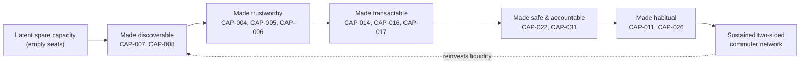

**Reading.** Each link is necessary. Break any one and the chain stops converting: a
discoverable but untrusted seat is not taken; a trusted but unpayable seat creates
disputes; a paid but unsafe trip destroys the network faster than growth builds it.

## 17.3 Value Realisation Preconditions

| # | Precondition | Status |
|---|---|---|
| VP-1 | Corridor liquidity sufficient for search to succeed | Not achieved — `BAD-RISK-002` |
| VP-2 | Verification credible enough to convert `BAD-PER-003` | Undecided — `BAD-DEC-005` |
| VP-3 | Payment settlement working end to end | Undecided PSP |
| VP-4 | Safety response protocol operational | Undecided — `BAD-DEC-011` |
| VP-5 | Lawful operating position established | **Unknown — `BAD-DEC-001`** |

**None of the five preconditions is currently satisfied.** This is the central finding of
Section 17 and drives Recommendation `R-01`.

## 17.4 Value NOT Claimed

The author explicitly does **not** claim, and this document must not be cited as
claiming: cost savings of any magnitude; emissions reductions of any magnitude; revenue
of any magnitude; time savings of any magnitude; market size; user adoption; or any
comparative claim against a named competitor.

---

# 18. Business Model

> **Classification: BUSINESS DECISION REQUIRED (`BAD-DEC-003`).** **No monetisation
> mechanism has been selected.** The options below are presented as candidates for
> Project Owner decision. No rate, percentage, price or projection is stated.

## 18.1 Current Position

**FACT.** The approved concept establishes that the platform handles fare payment, may
retain a *Platform Fee*, records *Driver Earnings*, and operates a *Wallet* and a
*Reward* economy. It does **not** state whether a fee is charged, on what basis, or at
what value.

## 18.2 Candidate Revenue Mechanisms

| # | Mechanism | How it works | Fit with concept | Principal concern |
|---|---|---|---|---|
| RM-1 | **Transaction fee on bookings** | Platform retains a portion of each fare. | Direct — the concept already names a Platform Fee. | May affect the cost-sharing characterisation; see `BAD-RISK-001`. Reduces driver benefit. |
| RM-2 | **Passenger service charge** | A charge added to the passenger's payment. | Direct. | Raises the passenger price at the point of comparison. |
| RM-3 | **Driver subscription** | Periodic fee for publishing privileges. | Compatible. | Suppresses supply — the scarcer side. Not recommended early. |
| RM-4 | **Passenger subscription / commuter pass** | Periodic fee for a bundle of commutes. | Strong fit with the recurring-commute concept. | Requires reliable liquidity first. |
| RM-5 | **Corporate / campus programmes** | Organisation pays for a managed commute programme. | Solves liquidity and revenue together. | Out of current scope (`FS-03`); would need scope change. |
| RM-6 | **Promoted placement** | Paid prominence in results. | Poor fit. | Corrupts match quality, which is the core asset. **Author advises against.** |
| RM-7 | **Advertising** | Third-party advertising in-app. | Poor fit at current scale. | Degrades trust-sensitive surfaces. |
| RM-8 | **Float / interest on wallet balances** | Return on held balances. | Only if the wallet holds real money. | Regulatory implications; depends on `BAD-DEC-013`. **Requires legal advice.** |

## 18.3 Cost Structure (Categories Only)

**No amounts are given.** These are the categories the Project Owner must budget.

| # | Cost category | Driver of cost | Note |
|---|---|---|---|
| CC-1 | Maps & routing platform usage | Search volume, route computation, live tracking | Usage-metered — scales with success. `BAD-DEP-002` |
| CC-2 | Payment processing | Transaction count/value | Depends on PSP selection |
| CC-3 | Identity verification | Verification volume | Depends on `BAD-DEC-005` |
| CC-4 | Messaging (push, SMS/OTP, email) | User and event volume | `BAD-DEP-003` |
| CC-5 | Hosting & infrastructure | Traffic, live tracking, data retention | |
| CC-6 | Engineering & maintenance | Team size | |
| CC-7 | Trust & safety operations | Incident and case volume | **Frequently underestimated.** Scales with users, not revenue. |
| CC-8 | Support operations | Contact rate | |
| CC-9 | Reward and coupon funding | Reward economics | `BAD-DEC-013` — an uncapped liability if undesigned. `BAD-RISK-010` |
| CC-10 | Legal & compliance | Jurisdictions, regulatory position | `BAD-DEC-001` |

## 18.4 Structural Observations the Project Owner Should Weigh

| # | Observation |
|---|---|
| BM-1 | **Live tracking is a metered cost, not a free feature.** Continuous position and routing on every trip converts directly into third-party platform charges. Design must consider cost per trip. |
| BM-2 | **Trust & safety cost scales with user count, not with revenue.** A fee-free launch still incurs it. |
| BM-3 | **Rewards without a designed budget are an uncapped liability.** `BAD-DEC-013` should be resolved before any reward is issued. |
| BM-4 | **The scarcer side is supply.** Any mechanism that taxes drivers works against OBJ-007. |
| BM-5 | **Fee design and legal characterisation interact.** How the platform takes money may influence how the service is characterised. This must not be decided without `BAD-DEC-001`. |

## 18.5 Author's Position

**RECOMMENDATION (`R-06`).** Do not select a monetisation mechanism before the legal
opinion (`BAD-DEC-001`) is in hand, and do not launch reward mechanics before the reward
budget (`BAD-DEC-013`) is set. Of the eight candidates, RM-1, RM-4 and RM-5 warrant
serious evaluation; RM-6 should be rejected outright as it damages the platform's core
asset. **This is advice, not an approved business model.**

---

# 19. Risks

## 19.1 Scoring Convention

Likelihood and Impact: `1 Low` · `2 Medium` · `3 High`. Severity = Likelihood × Impact.
`≥6` is treated as a **major risk** requiring an owned response before build.

## 19.2 Risk Register

| ID | Risk | Cat | L | I | Sev | Response strategy | Owner |
|---|---|---|---|---|---|---|---|
| `BAD-RISK-001` | **Regulatory characterisation is unknown.** The platform may be treated differently from a private cost-sharing arrangement, particularly if it sets fares or takes a fee. | Legal | 3 | 3 | **9** | **Mitigate — obtain qualified legal opinion before build (`BAD-DEC-001`).** Do not finalise fare or fee design until then. | Project Owner |
| `BAD-RISK-002` | **Corridor liquidity failure.** Too few rides on a corridor at a given time; search returns nothing; both sides churn. | Market | 3 | 3 | **9** | Mitigate — corridor-by-corridor launch, seed supply, reward-supported early phase (`BAD-DEC-014`). | Product Owner |
| `BAD-RISK-003` | **Pressure to introduce professional drivers** to solve liquidity, breaking `BAD-RULE-001`. | Strategic | 2 | 3 | **6** | Avoid — treat `BAD-RULE-001` as absolute; any change via formal change control. | Project Owner |
| `BAD-RISK-004` | **Launch without adequate verification or safety response.** | Safety | 2 | 3 | **6** | Avoid — make `BAD-SC-007`, `BAD-SC-009`, `BAD-SC-014` release gates. | Trust & Safety |
| `BAD-RISK-005` | **SOS exists with no defined response.** Users rely on a control that does nothing. | Safety | 3 | 3 | **9** | Avoid — do not ship SOS until `BAD-DEC-011` resolved. | Trust & Safety |
| `BAD-RISK-006` | **Users assume the platform provides insurance cover.** | Legal | 2 | 3 | **6** | Mitigate — explicit user communication; no coverage claim anywhere. `BAD-DEC-019`. | Project Owner |
| `BAD-RISK-007` | **Payment treated as confirmed on client evidence**, causing free rides or false confirmations. | Financial | 2 | 3 | **6** | Avoid — `BAD-RULE-032`/`033` absolute; verify in QA (DOC-18). | Solution Architect |
| `BAD-RISK-008` | **Seat over-allocation** through concurrent bookings. | Operational | 2 | 3 | **6** | Avoid — backend-only seat control (`BAD-RULE-026`/`027`); concurrency tests. | Backend Lead |
| `BAD-RISK-009` | **Personal safety incident during a trip.** | Safety | 2 | 3 | **6** | Mitigate — verification, sharing, SOS, incident response, conduct rules. Cannot be eliminated. | Trust & Safety |
| `BAD-RISK-010` | **Reward liability runs away** without designed economics. | Financial | 2 | 3 | **6** | Mitigate — set reward budget and caps (`BAD-DEC-013`) before issuing rewards. | Project Owner |
| `BAD-RISK-011` | **Fraud and abuse** — fake accounts, collusive ride/reward farming, payment abuse. | Financial | 3 | 2 | **6** | Mitigate — verification strength, ledger auditability, admin tooling. Detection design is a gap (`BAD-OQ-014`). | Security Analyst |
| `BAD-RISK-012` | **Personal data exposure** — location history, contacts, identity documents. | Privacy | 2 | 3 | **6** | Mitigate — minimise, protect, and define retention (`BAD-OQ-013`); route to DOC-13. | Security Analyst |
| `BAD-RISK-013` | **Third-party platform cost escalation** with usage growth (maps, routing, tracking). | Financial | 3 | 2 | **6** | Mitigate — measure cost per trip from day one; design for call efficiency. | Solution Architect |
| `BAD-RISK-014` | **Dependence on unselected suppliers** (PSP, verification, email/SMS). | Delivery | 3 | 2 | **6** | Mitigate — abstract at business level; select early (`BAD-DEP-004`). | Solution Architect |
| `BAD-RISK-015` | **Requirements built on unvalidated personas and pain points.** | Delivery | 3 | 2 | **6** | Mitigate — validation research before BRD sign-off (`BAD-DEC-002`). | Product Owner |
| `BAD-RISK-016` | **Eleven undecided business rules block requirements engineering.** | Delivery | 3 | 2 | **6** | Mitigate — resolve Section 27 decisions before BRD. | Project Owner |
| `BAD-RISK-017` | **Driver no-shows and passenger no-shows** erode trust on both sides. | Operational | 3 | 2 | **6** | Mitigate — cancellation and no-show rules (`BAD-DEC-009`); reputation effects. | Product Owner |
| `BAD-RISK-018` | **Location accuracy and battery cost** degrade live tracking usefulness. | Technical | 2 | 2 | 4 | Mitigate — route to DOC-15; set expectations in UX. | Software Architect |
| `BAD-RISK-019` | **Android background/location restrictions** limit tracking continuity. | Technical | 2 | 2 | 4 | Mitigate — design within platform constraints; DOC-08/DOC-15. | Mobile Lead |
| `BAD-RISK-020` | **Dispute volume exceeds operational capacity.** | Operational | 2 | 2 | 4 | Mitigate — evidence-rich records; triage tooling in DOC-17. | Operations |
| `BAD-RISK-021` | **Rating system gamed or weaponised** (retaliatory ratings). | Operational | 2 | 2 | 4 | Mitigate — rating rules (`BAD-DEC-012`), moderation. | Product Owner |
| `BAD-RISK-022` | **Brand name undecided**, causing rework in user-facing assets. | Delivery | 2 | 1 | 2 | Accept — keep brand strings externalised; documentation already brand-neutral. | Project Owner |
| `BAD-RISK-023` | **Scope expansion into out-of-scope domains** (freight, rental, intercity) before the core loop works. | Strategic | 2 | 2 | 4 | Avoid — Section 10 boundary + change control. | Project Owner |
| `BAD-RISK-024` | **Single-platform (Android-only) reach limit** constrains corridor density. | Market | 2 | 2 | 4 | Accept for now — revisit with `FS-01`. | Product Owner |

## 19.3 Major Risk Concentration

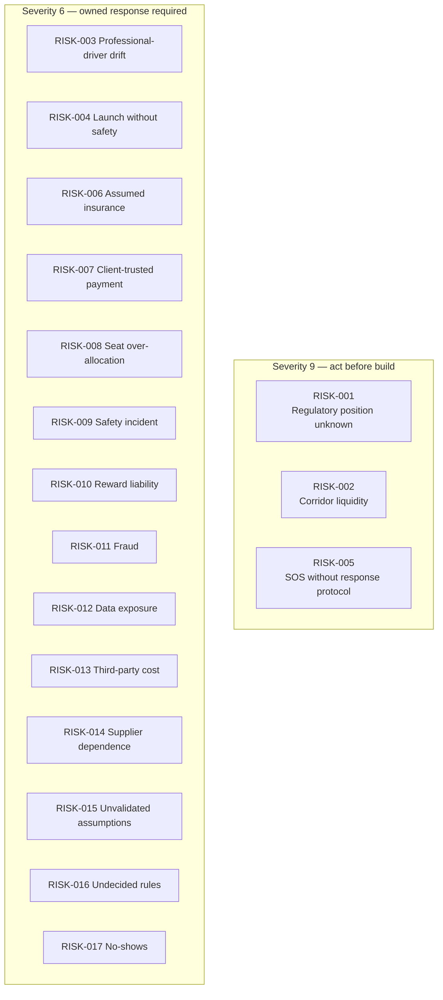

**Three risks score 9.** All three are **decision or evidence gaps, not engineering
problems** — which means they can be closed by the Project Owner without writing code,
and cannot be closed by engineering at all.

## 19.4 Risks the Author Considers Under-Appreciated

| Risk | Why it is under-appreciated |
|---|---|
| `BAD-RISK-002` liquidity | Feature completeness feels like progress; liquidity is what actually determines whether the product works. A perfect app on an empty corridor returns nothing. |
| `BAD-RISK-005` SOS | A safety control is usually treated as a feature to build. Until the *response* exists, shipping the button is worse than not shipping it. |
| `BAD-RISK-013` metered cost | Live tracking and routing feel free during development and become a material per-trip cost at scale. |

---

# 20. Constraints

| ID | Constraint | Type | Source | Consequence |
|---|---|---|---|---|
| `BAD-CON-001` | Mobile client is **Android only**; Kotlin and Jetpack Compose. | Technology | Approved direction (FACT) | No iOS/web reach in current scope. |
| `BAD-CON-002` | Backend must be **Laravel**. | Technology | Approved direction (FACT) | Architecture must fit the Laravel ecosystem. |
| `BAD-CON-003` | Admin must be **Laravel Filament**, treated as part of Laravel — not a separate backend. | Technology | Approved direction (FACT) | Admin shares the backend's business logic and authority. |
| `BAD-CON-004` | **Backend is the business authority**; the client may never be authoritative for shared business state. | Architecture | Approved direction (FACT) | Constrains offline behaviour and optimistic UI. |
| `BAD-CON-005` | Database must be **MySQL**. | Technology | Approved direction (FACT) | — |
| `BAD-CON-006` | The Android app **must not** connect directly to the database. | Architecture | Approved direction (FACT) | All access via the API. |
| `BAD-CON-007` | API must be **REST/JSON and versioned** (`/api/v1/`). | Technology | Approved direction (FACT) | — |
| `BAD-CON-008` | **Supabase, PostgreSQL and Spring Boot are excluded.** | Technology | Approved direction (FACT) | — |
| `BAD-CON-009` | Mapping and routing via **Google Maps Platform** (Places, Routes). | Technology | Approved direction (FACT) | Third-party terms and metered cost apply. |
| `BAD-CON-010` | Location via **Android Fused Location Provider**. | Technology | Approved direction (FACT) | Subject to Android platform behaviour. |
| `BAD-CON-011` | Messaging/analytics via **Firebase** (FCM, Crashlytics, Performance, Analytics). | Technology | Approved direction (FACT) | — |
| `BAD-CON-012` | Payments via the **Indian UPI ecosystem**. | Commercial | Approved direction (FACT) | INR only; UPI rules apply. |
| `BAD-CON-013` | Initial market is **India**. | Commercial | Approved direction (FACT) | Local regulatory and payment context governs. |
| `BAD-CON-014` | **Brand name is not final.** Documentation uses "Carpool Mobility Platform"/"CMP". | Project | Master prompt (FACT) | User-facing naming deferred; keep strings externalised. |
| `BAD-CON-015` | Documents are produced **one at a time**, on explicit request, in Markdown **and** Word. | Process | Master prompt (FACT) | Governs this documentation programme. |
| `BAD-CON-016` | **No invention** of pricing, legal, financial, certification or market facts. | Process | Master prompt (FACT) | Explains the density of `[TBD]` in this document. |
| `BAD-CON-017` | No approved budget, timeline, or team composition has been supplied. | Project | Absence of input | Roadmap is phase-based, not date-based. `BAD-DEC-002`. |
| `BAD-CON-018` | No user research, market data, or legal opinion is available. | Evidence | Absence of input | Sections 4, 5, 12, 17, 18 are hypothesis-level. |

---

# 21. Dependencies

| ID | Dependency | Type | Depends on | Status | Risk if unmet |
|---|---|---|---|---|---|
| `BAD-DEP-001` | Qualified legal opinion on the operating model in the target market. | External / Legal | External counsel | **Not started** | `BAD-RISK-001` — blocks launch |
| `BAD-DEP-002` | Google Maps Platform (Maps, Places, Routes) availability, terms and quota. | External / Supplier | Google | Direction approved; commercial terms not established | `BAD-RISK-013` |
| `BAD-DEP-003` | Firebase services (FCM, Crashlytics, Performance, Analytics). | External / Supplier | Google | Direction approved | Notification capability degraded |
| `BAD-DEP-004` | UPI payment integration and PSP selection. | External / Supplier | **Unselected** | **Not started** | `BAD-RISK-014` — blocks payment build |
| `BAD-DEP-005` | Identity verification method/provider. | External / Supplier | **Unselected** | Blocked by `BAD-DEC-005` | Trust model undeliverable |
| `BAD-DEP-006` | Phone verification (OTP/SMS) provider. | External / Supplier | **Unselected** | Not started | Onboarding blocked |
| `BAD-DEP-007` | Transactional email provider. | External / Supplier | **Unselected** | Not started | Limited impact |
| `BAD-DEP-008` | Google Play distribution and policy compliance. | External / Platform | Google | Not started | Distribution blocked |
| `BAD-DEP-009` | Hosting/infrastructure for Laravel + MySQL. | External / Supplier | **Unselected** | Not started | Routed to DOC-19 |
| `BAD-DEP-010` | Project Owner resolution of the 24 business decisions. | Internal | Project Owner | **Outstanding** | `BAD-RISK-016` — blocks BRD |
| `BAD-DEP-011` | Validation research with real commuters. | Internal | Product Owner | **Not started** | `BAD-RISK-015` |
| `BAD-DEP-012` | Trust & safety operating capability (people and protocol). | Internal | Project Owner | **Not started** | `BAD-RISK-005` — blocks safety launch |
| `BAD-DEP-013` | Support and moderation operating capability. | Internal | Project Owner | Not started | `BAD-RISK-020` |
| `BAD-DEP-014` | Approval of this BAD, then sequential production of DOC-02 onward. | Internal / Process | Project Owner | In progress | Documentation chain stalls |

## 21.1 Critical Path

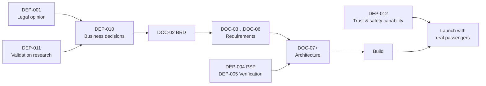

**The critical path to a Business Requirements Document runs through legal advice and
Project Owner decisions — not through engineering.**

---

# 22. Opportunities

| ID | Opportunity | Basis | Value | Action |
|---|---|---|---|---|
| `BAD-OPP-001` | **Route-overlap matching as a defensible asset.** Partial-segment matching is harder to copy well than point-to-point matching and directly increases match rate. | Concept differentiator | High | Invest disproportionately in `CAP-008`. |
| `BAD-OPP-002` | **Recurring commute as a retention moat.** A locked-in daily arrangement is far stickier than transactional ride-hailing. | Concept differentiator | High | Bring `CAP-011` forward if MVP evidence supports it. |
| `BAD-OPP-003` | **Corridor-first launch strategy.** Concentrating on a small number of dense corridors converts a national liquidity problem into a solvable local one. | Analysis (`BAD-RISK-002`) | High | Adopt in `BAD-DEC-014`. |
| `BAD-OPP-004` | **Verified-community trust tiers** (e.g. verified workplace or campus cohorts) as a future trust accelerant. | Extension of `CAP-004`/`CAP-006` | Medium | Keep verification multi-level, not boolean. `FS-09`. |
| `BAD-OPP-005` | **Corporate/campus programmes** solve liquidity and revenue simultaneously. | `FS-03`, `RM-5` | High | Evaluate after core loop proven; requires scope change. |
| `BAD-OPP-006` | **Trip data as an operational asset** — corridor demand, timing patterns, match failures. | By-product of `CAP-024` | Medium | Instrument from day one (`BAD-KPI-002`, `003`). |
| `BAD-OPP-007` | **Sustainability reporting** to users or organisations from existing trip data. | `FS-08` | Low–Medium | Retain occupancy and distance data. Make no unverified environmental claim. |
| `BAD-OPP-008` | **Reward mechanics as a liquidity instrument**, not just loyalty — targeted at thin corridors and times. | `CAP-026` + `BAD-RISK-002` | Medium–High | Design rewards to be corridor-targetable in `BAD-DEC-013`. |
| `BAD-OPP-009` | **Server-authoritative design enables multi-client expansion** cheaply (iOS, web) because business logic is not in the client. | `BAD-CON-004` | Medium | Already secured by architecture direction. Preserve it. |
| `BAD-OPP-010` | **Safety leadership as market positioning** in a category where safety anxiety suppresses adoption. | `BAD-PER-003`, `BAD-PER-005` | Medium–High | Only pursue once `BAD-DEC-011` is real. Never market safety you cannot deliver. |

---

# 23. Key Performance Indicators

> **All targets are `[TBD – Business Decision Required]` (`BAD-DEC-018`).** Definitions
> are given so that measurement can be designed now and thresholds set later. No target
> value is invented.

## 23.1 Liquidity & Marketplace Health

| ID | KPI | Definition | Target |
|---|---|---|---|
| `BAD-KPI-001` | Active corridors | Distinct commuter corridors with published supply and searched demand in a period. | `[TBD]` |
| `BAD-KPI-002` | Search success rate | Share of searches returning at least one compatible ride. **Primary liquidity indicator.** | `[TBD]` |
| `BAD-KPI-003` | Zero-result search rate by corridor and time band | Inverse of above, segmented — shows *where* liquidity fails. | `[TBD]` |
| `BAD-KPI-004` | Search-to-booking conversion | Confirmed bookings ÷ searches. | `[TBD]` |
| `BAD-KPI-005` | Time from search to confirmed booking | Elapsed time for the passenger. | `[TBD]` |
| `BAD-KPI-006` | Recurring commute adoption | Share of active users with an active recurring schedule. | `[TBD]` |
| `BAD-KPI-007` | Repeat-pairing rate | Share of trips between a driver–passenger pair who have travelled together before. **Habit indicator.** | `[TBD]` |

## 23.2 Supply Health

| ID | KPI | Definition | Target |
|---|---|---|---|
| `BAD-KPI-008` | Seat fill rate | Booked seats ÷ published seats. | `[TBD]` |
| `BAD-KPI-009` | Driver publishing frequency | Rides published per active driver per period. | `[TBD]` |
| `BAD-KPI-010` | Driver retention | Share of drivers publishing again after their first completed ride. | `[TBD]` |

## 23.3 Trust & Safety

| ID | KPI | Definition | Target |
|---|---|---|---|
| `BAD-KPI-011` | Verification completion rate | Share of active users reaching each verification level. | `[TBD]` |
| `BAD-KPI-012` | Verified-counterparty trip share | Share of trips where both parties are verified. | `[TBD]` |
| `BAD-KPI-017` | SOS activation rate | SOS events per 1,000 trips. | Monitor only |
| `BAD-KPI-018` | SOS response execution rate | Share of SOS events with a completed protocol response. | **`[TBD]` — should be 100%** |
| `BAD-KPI-019` | Trip completion rate | Completed trips ÷ confirmed bookings. | `[TBD]` |
| `BAD-KPI-020` | No-show rate (driver and passenger, separately) | No-shows ÷ confirmed bookings. | `[TBD]` |

## 23.4 Money Integrity

| ID | KPI | Definition | Target |
|---|---|---|---|
| `BAD-KPI-013` | Monetised transaction share | Share of bookings on which the approved mechanism applies. | Mechanism `[TBD]` |
| `BAD-KPI-014` | Payment success rate | Verified payments ÷ payment attempts. | `[TBD]` |
| `BAD-KPI-015` | Payment reconciliation exception rate | Payments left indeterminate and requiring operator action. | `[TBD]` — should trend to zero |
| `BAD-KPI-016` | Refund rate | Refunds ÷ payments. | `[TBD]` |
| `BAD-KPI-024` | Cost per completed trip (third-party services) | Maps, routing, messaging and payment cost per trip. **Directly addresses `BAD-RISK-013`.** | `[TBD]` |

## 23.5 Operations & Quality

| ID | KPI | Definition | Target |
|---|---|---|---|
| `BAD-KPI-021` | Record completeness | Share of completed trips with a full participant, route, payment and outcome record. | **Should be 100%** |
| `BAD-KPI-022` | Operator case throughput | Verification, moderation and support cases closed per period. | `[TBD]` |
| `BAD-KPI-023` | Dispute resolution time | Time from report to adjudicated outcome. | `[TBD]` |
| `BAD-KPI-025` | Occupancy uplift | Average occupants per vehicle-journey on platform trips vs. single occupancy. **Reported as measured data only — no environmental claim derived without validation.** | `[TBD]` |
| `BAD-KPI-026` | Compliance posture | Presence of a current legal opinion and adherence to its conditions. | **Binary — must be satisfied** |

## 23.6 KPI Design Note

**RECOMMENDATION.** `BAD-KPI-002` and `BAD-KPI-003` should be instrumented in the very
first release that has real users. They are the earliest reliable signal of whether the
business hypothesis is holding, and they are cheap to capture. Most other KPIs can wait.

---

# 24. MVP Scope (Proposed)

> **Classification: RECOMMENDATION.** This is the author's proposed MVP. It is **not an
> approved scope**. Approval is `BAD-DEC-020`.

## 24.1 MVP Definition Principle

The MVP must prove **one complete commute loop on one corridor**, safely and lawfully. It
must not attempt breadth. Every element below is included because removing it either
breaks the loop, breaks money integrity, or breaks safety.

## 24.2 MVP — Included

| # | Included capability | Why it cannot be removed |
|---|---|---|
| 1 | Registration, login, profile, phone verification | No participation without identity. |
| 2 | Identity verification (at the level set by `BAD-DEC-005`) | Without it, `BAD-PER-003` never converts and `BAD-RISK-004` materialises. |
| 3 | Vehicle registration and vehicle verification | The passenger must know what they are getting into. |
| 4 | Ride publishing with seats, fare, vehicle, preferences | The supply side of the loop. |
| 5 | Ride search with route-overlap matching | **The differentiator.** A point-to-point-only MVP tests the wrong hypothesis. |
| 6 | Trust signals in results (verification, ratings once available, vehicle, preferences) | The trust decision happens here. |
| 7 | Ride request and booking with backend seat control | The transaction. |
| 8 | UPI payment with backend verification | Money must work correctly from the first real trip. |
| 9 | Trip execution with live tracking and telemetry | The journey itself. |
| 10 | In-app chat | Pickup coordination fails without it. |
| 11 | Core notifications (booking, payment, trip, chat, safety) | The loop is time-critical. |
| 12 | SOS, emergency contacts, live trip sharing — **with an operating response protocol** | Safety is not deferrable once real passengers travel. |
| 13 | Trip completion, ratings and reviews | Reputation must start accumulating from trip one. |
| 14 | Admin: verification queues, user management, ride/booking oversight, payment visibility, incident handling, moderation | You cannot operate a passenger-carrying service without these. |

## 24.3 MVP — Deliberately Deferred

| # | Deferred | To | Rationale |
|---|---|---|---|
| 1 | Recurring commute and scheduled ride generation | Phase 2 | High value, but the one-off loop must work first. |
| 2 | Wallet, points, coupons, referral and milestone rewards | Phase 2 | Reward economics undecided (`BAD-DEC-013`); an uncapped liability if rushed. |
| 3 | Advanced telemetry (landmark, turn-by-turn instruction) | Phase 2 | Position + ETA + remaining distance are sufficient for the loop. |
| 4 | Extended reporting and analytics | Phase 2 | Beyond the core KPIs. |
| 5 | Full preference matrix as a matching filter | Phase 2 | Display in MVP; filter later. |
| 6 | Multi-corridor / multi-city expansion | Phase 3 | Protect match quality. |

## 24.4 MVP Exclusion the Author Advises Against

**Do not defer:** identity verification, safety response, or backend payment
verification. Each is regularly cut from an MVP to save time, and each converts the MVP
from "small" to "unsafe". See `BAD-RISK-004`, `BAD-RISK-005`, `BAD-RISK-007`.

## 24.5 MVP Entry Preconditions

| # | Precondition | Reference |
|---|---|---|
| 1 | Legal opinion obtained and its conditions understood | `BAD-DEC-001` |
| 2 | The eleven `[TBD]` business rules resolved | Section 27 |
| 3 | Verification policy defined | `BAD-DEC-005` |
| 4 | Safety response protocol defined and staffed | `BAD-DEC-011`, `BAD-DEP-012` |
| 5 | PSP selected | `BAD-DEP-004` |
| 6 | Target corridor(s) selected | `BAD-DEC-014` |

**None is currently satisfied.**

---

# 25. Business Roadmap

> Phases, not dates. No timeline has been supplied (`BAD-CON-017`, `BAD-DEC-002`).
> **Classification: RECOMMENDATION.**

## 25.1 Phase Model

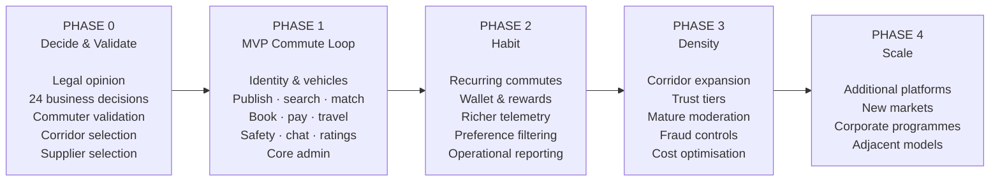

## 25.2 Phase Detail

| Phase | Objective | Key outputs | Exit criteria | Supports |
|---|---|---|---|---|
| **0 — Decide & Validate** | Remove the decision and evidence gaps that block responsible engineering. | Legal opinion; resolved decisions; validated personas/pain points; selected corridor; selected suppliers; approved BRD. | All Section 27 decisions closed; `BAD-DEC-001` complete; BRD approved. | G-01, G-02 |
| **1 — MVP Commute Loop** | Prove one complete, safe, lawful commute loop on one corridor. | Android app + Laravel platform + Filament admin delivering §24.2. | `BAD-SC-001`…`BAD-SC-010` demonstrated; release gates in §9.4 passed. | G-03, G-04 |
| **2 — Habit** | Convert transactions into recurring commutes. | Recurring commutes; wallet & rewards; richer telemetry; reporting. | `BAD-KPI-006`, `BAD-KPI-007` trending to target. | G-05, G-06 |
| **3 — Density** | Grow corridor by corridor without degrading match quality. | Expansion playbook; trust tiers; mature moderation; fraud controls; cost per trip under control. | `BAD-KPI-002` sustained while `BAD-KPI-001` grows; `BAD-KPI-024` within budget. | G-07, G-08 |
| **4 — Scale** | Extend platform and market reach. | Per `FS-01`…`FS-09`, subject to change control. | `[TBD]` | G-09 |

## 25.3 Documentation Alignment

| Phase | Documents expected |
|---|---|
| 0 | DOC-01 (this) → DOC-02 → DOC-03 → DOC-04 → DOC-05 → DOC-06 |
| 0→1 | DOC-07 … DOC-13; DOC-14 … DOC-17; DOC-18; DOC-19 |
| 1+ | DOC-20 maintained continuously |

**Reminder (`BAD-CON-015`).** Documents are produced one at a time, only on explicit
request.

---

# 26. Open Questions & Assumptions

## 26.1 Open Questions

| ID | Question | Type | Owner | Blocks |
|---|---|---|---|---|
| `BAD-OQ-001` | Are the pain points in Section 5 real and material for target commuters? | Validation | Product Owner | BRD confidence |
| `BAD-OQ-002` | Are the personas in Section 12 representative? | Validation | Product Owner | DOC-12 |
| `BAD-OQ-003` | Which corridors have sufficient latent supply and demand? | Validation | Product Owner | `BAD-DEC-014` |
| `BAD-OQ-004` | What minimum route overlap makes a match useful to a passenger? | Product/Technical | Product Owner + Architect | `CAP-008` |
| `BAD-OQ-005` | How much detour, if any, will a driver tolerate for a pickup? | Validation | Product Owner | Matching design |
| `BAD-OQ-006` | How far will a passenger walk to a pickup point? | Validation | Product Owner | Matching design |
| `BAD-OQ-007` | Should search results ever be shown when no ride matches (alternatives, nearby times)? | Product | Product Owner | Empty-state design |
| `BAD-OQ-008` | How are multi-passenger trips sequenced, chatted and rated? | Product | Product Owner | DM-6 |
| `BAD-OQ-009` | May a driver also be a passenger on someone else's ride the same day? | Product | Product Owner | Role model |
| `BAD-OQ-010` | What happens to a confirmed booking if the driver cancels the ride? | Product | Project Owner | `BAD-DEC-009` |
| `BAD-OQ-011` | Are ride preferences advisory or enforceable? | Product | Product Owner | `BAD-RULE-021` |
| `BAD-OQ-012` | How does a user close their account, and what happens to their data and history? | Legal/Product | Project Owner | DM-7; DOC-13 |
| `BAD-OQ-013` | What are the retention periods for location, chat, identity and payment data? | Legal/Security | Project Owner | `BAD-RISK-012`; DOC-13 |
| `BAD-OQ-014` | How is fraud detected and acted upon? | Security | Security Analyst | `BAD-RISK-011` |
| `BAD-OQ-015` | Is chat available before booking confirmation, or only after? | Product | Product Owner | Privacy vs. coordination |
| `BAD-OQ-016` | Are phone numbers ever exposed between users? | Privacy | Project Owner | `BAD-RULE-025` |
| `BAD-OQ-017` | What location precision is shown to a counterparty before pickup? | Privacy | Project Owner | `BAD-RULE-025` |
| `BAD-OQ-018` | How is a user's home location protected in search and history? | Privacy | Security Analyst | `BAD-RISK-012` |
| `BAD-OQ-019` | Who may see a live shared trip, and for how long? | Privacy/Safety | Trust & Safety | `CAP-023` |
| `BAD-OQ-020` | Are emergency contacts notified automatically on SOS, or by an operator? | Safety | Trust & Safety | `BAD-DEC-011` |
| `BAD-OQ-021` | What operating hours does safety response cover? | Safety/Ops | Project Owner | `BAD-DEP-012` |
| `BAD-OQ-022` | Can a trip be started without the passenger present (no-show)? | Product | Product Owner | `BAD-DEC-009` |
| `BAD-OQ-023` | Is the fare per seat or per booking? | Commercial | Project Owner | `BAD-DEC-003` |
| `BAD-OQ-024` | Can a passenger book multiple seats for other people, and who are they? | Product/Safety | Product Owner | Safety identity model |
| `BAD-OQ-025` | Is payment taken at booking or at trip completion? | Commercial | Project Owner | `BAD-DEC-007`, `BAD-BP-006` |
| `BAD-OQ-026` | How and when do drivers receive their money? | Commercial | Project Owner | `BAD-DEC-004` |
| `BAD-OQ-027` | Do points have monetary value, and can they be withdrawn? | Commercial/Legal | Project Owner | `BAD-DEC-013` |
| `BAD-OQ-028` | Do ratings affect matching, ranking, or platform access? | Product | Product Owner | `BAD-DEC-012` |
| `BAD-OQ-029` | Can a user respond to or dispute a review? | Product | Product Owner | `BAD-DEC-016` |
| `BAD-OQ-030` | What is the appeal path for a suspended account? | Legal/Ops | Project Owner | `BAD-DEC-016` |
| `BAD-OQ-031` | What is the final product/brand name? | Business | Project Owner | User-facing assets |

## 26.2 Consolidated Assumption Register

| ID | Assumption | Impact if wrong | Validation route |
|---|---|---|---|
| `BAD-ASM-001` | No research, market, financial or legal evidence was available; all such statements are hypotheses. | The document's confidence framing changes. | Supply the evidence. |
| `BAD-ASM-002` | `BAD-BR-` denotes business *requirements*; auxiliary prefixes used for other elements. | Renumbering under change control. | Project Owner confirmation. |
| `BAD-ASM-003` | The structural inefficiency described in 1.2 exists in the target market. | **The premise of the product fails.** | `BAD-DEC-002` |
| `BAD-ASM-004` | No time horizon is set for the vision. | Planning changes. | `BAD-DEC-002` |
| `BAD-ASM-005` | The four-failure problem model is correct and complete. | Solution addresses the wrong problem. | `BAD-DEC-002` |
| `BAD-ASM-006` | Coordination failure is a genuine barrier. | F1 response is wasted effort. | Research |
| `BAD-ASM-007` | Trust failure is a genuine barrier. | Verification investment is misdirected. | Research |
| `BAD-ASM-008` | Settlement failure is a genuine barrier. | Payment emphasis is misplaced. | Research |
| `BAD-ASM-009` | Safety failure is a genuine barrier. | Safety scope could be reduced (**author advises against regardless**). | Research |
| `BAD-ASM-010` | Root causes RC1–RC4 hold. | Strategy changes. | Research |
| `BAD-ASM-011` | Personas are representative. | Requirements target the wrong users. | `BAD-OQ-002` |
| `BAD-ASM-012` | Trip state model extends the concept's five states with `Cancelled` and `SafetyEvent`. | State model reworked. | `BAD-DEC-015` |
| `BAD-ASM-013` | A single account may hold both passenger and driver roles. | Account model reworked. | `BAD-OQ-009` |
| `BAD-ASM-014` | One ride uses exactly one vehicle. | Domain model reworked. | Project Owner |
| `BAD-ASM-015` | Ride preferences are declarative, not enforced. | Matching and dispute rules change. | `BAD-OQ-011` |

---

# 27. Business Decisions Required

**These twenty-four decisions are the gate between this document and the BRD.** Each is
owned by the Project Owner unless stated. None may be resolved by analysis alone.

| ID | Decision required | Impact if unresolved | Blocks | Priority |
|---|---|---|---|---|
| `BAD-DEC-001` | **Obtain a qualified legal opinion on the operating model** in the target market — including the effect of platform-set fares and platform fees on how the service is characterised. | The entire venture carries unquantified legal exposure. | Launch, `BAD-DEC-003`, `BAD-DEC-004`, `BAD-DEC-013` | **Critical** |
| `BAD-DEC-002` | Commission validation research with real commuters, and set a delivery horizon. | Requirements rest on unvalidated hypotheses. | BRD confidence, roadmap dates | **Critical** |
| `BAD-DEC-003` | Fare model: who sets the fare, any platform constraint, per-seat vs per-booking, and whether a platform fee exists and on what basis. | Payment, wallet, earnings and matching design all stall. | `BAD-RULE-018`, `BAD-RULE-035`, DOC-14 | **Critical** |
| `BAD-DEC-004` | Driver settlement: how and when drivers receive funds. | Payment architecture cannot be completed. | `BAD-RULE-036`, DOC-14 | **Critical** |
| `BAD-DEC-005` | **PARTIALLY RESOLVED 2026-08-20** — the verification **standing vocabulary** is decided at `BAD-RULE-006` (`UNVERIFIED`, `VERIFIED`). Still required: verification **levels beyond phone possession**, the evidence accepted for each, and what each permits for users and vehicles. | Trust model still undefined above phone possession; `BAD-PER-003` unserved. | `BAD-RULE-008`, `BAD-RULE-014`, DOC-13 | **Critical** |
| `BAD-DEC-006` | **PARTIALLY RESOLVED 2026-08-20** — the permitted **states** are decided at `BAD-RULE-010` (`ACTIVE`, `SUSPENDED`, `DEACTIVATED`). Still required: **who may transition an account between them, on what grounds, and with what appeal** (`FRD-GAP-024`, with `BAD-DEC-016`). | An account can be suspended or deactivated with no specified way back, and a suspended user cannot authenticate to learn why. | `BAD-RULE-010`, `FRD-GAP-024` | High |
| `BAD-DEC-007` | Booking model: does a request require driver acceptance; are seats held during payment and for how long; is payment taken at booking or completion. | Booking flow cannot be specified. | `BAD-RULE-029`, `030`, `BAD-BP-005` | **Critical** |
| `BAD-DEC-008` | Recurring commute rules: generation horizon, pause semantics, holiday handling, verified-peer auto-acceptance. | Phase 2 cannot be specified. | `BAD-BP-009` | High |
| `BAD-DEC-009` | Cancellation rules: windows, permitted parties, penalties, no-show treatment. | `BAD-BP-010` unspecifiable; `BAD-RISK-017` unmitigated. | `BAD-RULE-040` | **Critical** |
| `BAD-DEC-010` | Refund policy and entitlement. | Money flows incomplete. | `BAD-RULE-038` | **Critical** |
| `BAD-DEC-011` | **Safety response protocol**: what happens on SOS, who acts, in what time, with what authority, and whether emergency contacts are notified automatically. | **SOS cannot ship.** `BAD-RISK-005`. | `BAD-BP-011`, `CAP-031` | **Critical** |
| `BAD-DEC-012` | Rating and review rules: scale, who may rate whom, visibility, and whether ratings affect access or ranking. | Reputation system unspecifiable. | `CAP-028` | High |
| `BAD-DEC-013` | Reward economics: nature of the wallet (real money vs points vs both), earning rules, redemption rules, caps, expiry, and total budget. | Uncapped financial liability. `BAD-RISK-010`. | `CAP-025`–`027`, DOC-14 | **Critical** |
| `BAD-DEC-014` | Launch strategy: target corridor(s) and how initial supply is seeded. | `BAD-RISK-002` unmitigated. | Phase 1 | **Critical** |
| `BAD-DEC-015` | Final booking and trip state models. | Downstream state machines unspecifiable. | `BAD-RULE-031`, DOC-15 | High |
| `BAD-DEC-016` | Moderation and enforcement policy: escalation tiers, penalties, appeal rights. | `BAD-BP-012` unspecifiable. | DOC-17 | High |
| `BAD-DEC-017` | Whether and how a driver may edit a ride after bookings exist. | Booking integrity ambiguity. | `BAD-RULE-020` | Medium |
| `BAD-DEC-018` | Set KPI targets for Section 23. | Success cannot be judged. | `BAD-SC-*` | High |
| `BAD-DEC-019` | Position on insurance: what the platform does and does not provide, and how this is communicated. | `BAD-RISK-006`. **Requires legal input.** | User terms | **Critical** |
| `BAD-DEC-020` | Approve or amend the proposed MVP scope in Section 24. | Phase 1 undefined. | Phase 1 | High |
| `BAD-DEC-021` | Data retention and deletion policy, and the account-closure path. | `BAD-OQ-012`, `BAD-OQ-013`; privacy exposure. | DOC-13 | High |
| `BAD-DEC-022` | Privacy boundaries between users: phone numbers, precise locations, home locations, live-share audience. | `BAD-RULE-025`, `BAD-OQ-016`–`019`. | DOC-12, DOC-13 | High |
| `BAD-DEC-023` | Final product/brand name, and whether it replaces the *Points* / *Beride Points* terminology. | User-facing asset rework. | Branding | Medium |
| `BAD-DEC-024` | Confirm the identifier convention in §0.10 (`BAD-BR-` for requirements; auxiliary prefixes for other elements). | Potential renumbering under change control. | Traceability | Medium |

## 27.1 Decision Dependency

```mermaid
flowchart TD
    D1["DEC-001<br/>Legal opinion"] --> D3["DEC-003 Fare & fee"]
    D1 --> D4["DEC-004 Driver settlement"]
    D1 --> D13["DEC-013 Reward economics"]
    D1 --> D19["DEC-019 Insurance position"]
    D3 --> D7["DEC-007 Booking & payment timing"]
    D7 --> D9["DEC-009 Cancellation"]
    D9 --> D10["DEC-010 Refunds"]
    D5["DEC-005 Verification policy"] --> D8["DEC-008 Recurring auto-accept"]
    D11["DEC-011 Safety protocol"] --> D20["DEC-020 MVP approval"]
    D5 --> D20
    D14["DEC-014 Launch corridor"] --> D20
    D2["DEC-002 Validation research"] --> D14
    D2 --> D18["DEC-018 KPI targets"]
```

**`BAD-DEC-001` and `BAD-DEC-002` are upstream of almost everything.** They should be
started immediately and in parallel; neither requires engineering capacity.

---

# 28. Preliminary Business Requirement Register

**78 business requirements, `BAD-BR-001` … `BAD-BR-078`.**

These are **business** requirements — statements of what the business must be able to
do. They are deliberately solution-independent. They are the source rows of the
traceability chain and will be elaborated in CMP-DOC-02 (BRD).

**Priority key:** `M` = proposed MVP · `2` = Phase 2 · `3` = Phase 3
**Status key:** `Ready` = can be elaborated now · `Blocked` = requires a Section 27 decision first

## 28.1 User & Authentication

| ID | Business requirement | Pri | Status | Blocking decision |
|---|---|---|---|---|
| `BAD-BR-001` | The business must allow a commuter to register for an account. | M | Ready | — |
| `BAD-BR-002` | The business must allow a registered user to authenticate and access their account. | M | Ready | — |
| `BAD-BR-003` | The business must allow a user to end their authenticated session. | M | Ready | — |
| `BAD-BR-004` | The business must allow a user to create and maintain a profile that supports a counterparty's trust decision. | M | Ready | — |
| `BAD-BR-005` | The business must verify a user's control of their phone number, and must be able to verify a user's identity. | M | Blocked | `BAD-DEC-005` |
| `BAD-BR-006` | The business must distinguish user roles (passenger, driver, administrator) and govern what each may do. | M | Ready | — |

## 28.2 Vehicle Management

| ID | Business requirement | Pri | Status | Blocking decision |
|---|---|---|---|---|
| `BAD-BR-007` | The business must allow a driver to register a vehicle. | M | Ready | — |
| `BAD-BR-008` | The business must allow a driver to amend or remove a registered vehicle, subject to it not being in active use. | M | Ready | — |
| `BAD-BR-009` | The business must be able to verify a registered vehicle. | M | Blocked | `BAD-DEC-005` |
| `BAD-BR-010` | The business must present vehicle information to a passenger before they commit to travel. | M | Ready | — |

## 28.3 Ride Publishing

| ID | Business requirement | Pri | Status | Blocking decision |
|---|---|---|---|---|
| `BAD-BR-011` | The business must allow a driver to publish a ride stating origin, destination, date and departure time. | M | Ready | — |
| `BAD-BR-012` | The business must allow a driver to state the number of seats offered, not exceeding lawful vehicle capacity. | M | Ready | — |
| `BAD-BR-013` | The business must establish the fare applicable to a published ride. | M | Blocked | `BAD-DEC-003` |
| `BAD-BR-014` | The business must associate each published ride with a registered vehicle. | M | Ready | — |
| `BAD-BR-015` | The business must allow a driver to declare travel preferences (AC, smoking, music, luggage, pets) and must display them to passengers. | M | Ready | — |

## 28.4 Ride Search & Route Matching

| ID | Business requirement | Pri | Status | Blocking decision |
|---|---|---|---|---|
| `BAD-BR-016` | The business must allow a passenger to search for rides by origin, destination, date and required seats. | M | Ready | — |
| `BAD-BR-017` | The business must identify rides whose route overlaps the passenger's requested travel segment, including partial-route matches. | M | Ready | — |
| `BAD-BR-018` | The business must assess pickup compatibility, drop compatibility, travel direction and time compatibility when matching. | M | Ready | — |
| `BAD-BR-019` | The business must express the degree of route overlap for each matched ride. | M | Ready | — |
| `BAD-BR-020` | The business must present, for each result, the fare, departure time, available seats, driver information, vehicle information, verification indicators and ride preferences. | M | Ready | — |
| `BAD-BR-021` | The business must exclude rides with no available seats from bookable results. | M | Ready | — |

## 28.5 Ride Request & Booking

| ID | Business requirement | Pri | Status | Blocking decision |
|---|---|---|---|---|
| `BAD-BR-022` | The business must allow a passenger to request one or more seats on a specific ride. | M | Ready | — |
| `BAD-BR-023` | The business must determine whether a request requires driver acceptance, and must allow a driver to accept or decline. | M | Blocked | `BAD-DEC-007` |
| `BAD-BR-024` | The business must inform both parties of the outcome of a request. | M | Ready | — |
| `BAD-BR-025` | The business must allow a ride, request or booking to be cancelled, and must record the reason. | M | Blocked | `BAD-DEC-009` |
| `BAD-BR-026` | The business must determine the consequences of cancellation and no-show for each party. | M | Blocked | `BAD-DEC-009` |
| `BAD-BR-027` | **The business must control seat availability centrally and must never allow confirmed seats to exceed seats offered.** | M | Ready | — |
| `BAD-BR-028` | **The business must confirm a booking only under its own authority, and only when payment has been verified.** | M | Ready | — |

## 28.6 Payments

| ID | Business requirement | Pri | Status | Blocking decision |
|---|---|---|---|---|
| `BAD-BR-029` | **The business must calculate the fare payable under its own authority.** | M | Blocked | `BAD-DEC-003` |
| `BAD-BR-030` | The business must allow a passenger to pay through the Indian UPI ecosystem. | M | Ready | — |
| `BAD-BR-031` | The business must support payment via commonly used UPI applications. | M | Ready | — |
| `BAD-BR-032` | **The business must determine payment status by its own verification, and must never treat a client-side payment application response as authoritative.** | M | Ready | — |
| `BAD-BR-033` | The business must be able to refund a passenger where entitlement exists. | M | Blocked | `BAD-DEC-010` |
| `BAD-BR-034` | The business must record driver earnings and any platform fee, and must settle funds to drivers. | M | Blocked | `BAD-DEC-003`, `BAD-DEC-004` |

## 28.7 Trip Execution & Live Tracking

| ID | Business requirement | Pri | Status | Blocking decision |
|---|---|---|---|---|
| `BAD-BR-035` | The business must execute a confirmed booking as a trip and manage its lifecycle. | M | Blocked | `BAD-DEC-015` |
| `BAD-BR-036` | The business must make the current trip state visible to its participants. | M | Ready | — |
| `BAD-BR-037` | The business must track the vehicle's position during an active trip. | M | Ready | — |
| `BAD-BR-038` | The business must provide estimated time of arrival and remaining distance during an active trip. | M | Ready | — |
| `BAD-BR-039` | The business must provide navigation-supporting information during an active trip (speed, current landmark, navigation instruction). | 2 | Ready | — |
| `BAD-BR-040` | The business must record the completion of a trip and retain a durable record of it. | M | Ready | — |

## 28.8 Communication

| ID | Business requirement | Pri | Status | Blocking decision |
|---|---|---|---|---|
| `BAD-BR-041` | The business must allow a driver and passenger associated with a ride to exchange messages. | M | Blocked | `BAD-OQ-015` |
| `BAD-BR-042` | The business must retain message history and make it viewable offline. | M | Ready | — |
| `BAD-BR-043` | The business must alert a user to new messages. | M | Ready | — |

## 28.9 Safety

| ID | Business requirement | Pri | Status | Blocking decision |
|---|---|---|---|---|
| `BAD-BR-044` | The business must allow a user to raise an emergency signal (SOS) during a trip. | M | Blocked | `BAD-DEC-011` |
| `BAD-BR-045` | **The business must respond to every emergency signal according to a defined protocol, and must record the actions taken.** | M | Blocked | `BAD-DEC-011` |
| `BAD-BR-046` | The business must allow a user to nominate emergency contacts. | M | Ready | — |
| `BAD-BR-047` | The business must allow a user to share their live trip with a nominated recipient. | M | Blocked | `BAD-OQ-019` |
| `BAD-BR-048` | The business must provide users with safety information and access to safety controls in one place. | M | Ready | — |

## 28.10 Ratings & Reviews

| ID | Business requirement | Pri | Status | Blocking decision |
|---|---|---|---|---|
| `BAD-BR-049` | The business must allow participants in a completed trip to rate one another. | M | Blocked | `BAD-DEC-012` |
| `BAD-BR-050` | The business must allow participants to submit written reviews, subject to moderation. | M | Blocked | `BAD-DEC-012` |
| `BAD-BR-051` | The business must make reputation information available to support trust decisions. | M | Blocked | `BAD-DEC-012` |

## 28.11 Wallet & Rewards

| ID | Business requirement | Pri | Status | Blocking decision |
|---|---|---|---|---|
| `BAD-BR-052` | The business must maintain a wallet for each user. | 2 | Blocked | `BAD-DEC-013` |
| `BAD-BR-053` | **The business must record every value movement as a durable, attributable ledger entry.** | 2 | Ready | — |
| `BAD-BR-054` | The business must make a user's balance and history visible to them. | 2 | Blocked | `BAD-DEC-013` |
| `BAD-BR-055` | The business must grant points for qualifying activity, including rides, referrals and milestones. | 2 | Blocked | `BAD-DEC-013` |
| `BAD-BR-056` | The business must allow points to be redeemed. | 2 | Blocked | `BAD-DEC-013` |
| `BAD-BR-057` | The business must be able to issue coupons and apply them to eligible transactions. | 2 | Blocked | `BAD-DEC-013` |

## 28.12 Notifications

| ID | Business requirement | Pri | Status | Blocking decision |
|---|---|---|---|---|
| `BAD-BR-058` | The business must notify users of events affecting them across ride, booking, payment, trip, chat, reward, safety and system categories. | M | Ready | — |
| `BAD-BR-059` | The business must deliver time-critical notifications reliably enough to support coordination of an imminent journey. | M | Ready | — |
| `BAD-BR-060` | The business must allow a user to review notifications they have received. | M | Ready | — |

## 28.13 Recurring Commute

| ID | Business requirement | Pri | Status | Blocking decision |
|---|---|---|---|---|
| `BAD-BR-061` | The business must allow a user to define a recurring commute schedule (daily, weekly or working-day). | 2 | Blocked | `BAD-DEC-008` |
| `BAD-BR-062` | The business must allow a schedule to be activated, paused and removed. | 2 | Blocked | `BAD-DEC-008` |
| `BAD-BR-063` | The business must make clear what happens to already-generated rides when a schedule is paused or removed. | 2 | Blocked | `BAD-DEC-008` |
| `BAD-BR-064` | The business must generate rides automatically from an active schedule, and may auto-accept requests from verified peers where permitted. | 2 | Blocked | `BAD-DEC-008` |

## 28.14 Platform Administration

| ID | Business requirement | Pri | Status | Blocking decision |
|---|---|---|---|---|
| `BAD-BR-065` | The business must allow operators to manage users, including status changes. | M | Blocked | `BAD-DEC-006` |
| `BAD-BR-066` | The business must allow operators to adjudicate user and vehicle verification. | M | Blocked | `BAD-DEC-005` |
| `BAD-BR-067` | The business must allow operators to view and act upon rides, requests, bookings and trips. | M | Ready | — |
| `BAD-BR-068` | The business must allow operators to monitor payments, refunds, wallets, rewards and coupons. | M | Ready | — |
| `BAD-BR-069` | The business must allow operators to moderate reviews and reported content. | M | Blocked | `BAD-DEC-016` |
| `BAD-BR-070` | The business must allow operators to manage safety incidents from report to closure. | M | Blocked | `BAD-DEC-011` |
| `BAD-BR-071` | The business must allow operators to handle support cases with access to the relevant evidence. | M | Ready | — |
| `BAD-BR-072` | The business must produce operational reporting on platform activity. | 2 | Ready | — |

## 28.15 Cross-Cutting Business Governance

| ID | Business requirement | Pri | Status | Blocking decision |
|---|---|---|---|---|
| `BAD-BR-073` | **The business must hold authoritative state for all shared business data, and must not rely on a client application to assert it.** | M | Ready | — |
| `BAD-BR-074` | The business must maintain a durable, auditable record of every ride, request, booking, payment, trip, safety incident and operator action. | M | Ready | — |
| `BAD-BR-075` | The business must present verification and reputation information at the point where a trust decision is made. | M | Ready | — |
| `BAD-BR-076` | The business must be able to restrict or remove a user's access where conduct requires it, and must record the basis. | M | Blocked | `BAD-DEC-016` |
| `BAD-BR-077` | The business must protect users' personal data, define what is shared between users, and define retention. | M | Blocked | `BAD-DEC-021`, `BAD-DEC-022` |
| `BAD-BR-078` | The business must operate within a legal position established by qualified advice for the target market. | M | Blocked | `BAD-DEC-001` |

## 28.16 Register Analysis

| Metric | Value |
|---|---|
| Total business requirements | 78 |
| Proposed for MVP (`M`) | 63 |
| Phase 2 | 15 |
| Ready to elaborate | 46 (59%) |
| **Blocked by a business decision** | **32 (41%)** |
| Requirements marked absolute-integrity | 6 (`BR-027`, `BR-028`, `BR-032`, `BR-045`, `BR-053`, `BR-073`) |

> **Finding.** Two in five business requirements cannot be elaborated into the BRD until
> the Project Owner resolves the decisions in Section 27. This is the single most
> actionable output of this analysis.

## 28.17 Domain Coverage Check

| Concept domain (source) | Covered by |
|---|---|
| User & Authentication | `BAD-BR-001`–`006` |
| Vehicle Management | `BAD-BR-007`–`010` |
| Ride Search | `BAD-BR-016`–`021` |
| Route Matching | `BAD-BR-017`–`019` |
| Ride Publishing | `BAD-BR-011`–`015` |
| Recurring Commute | `BAD-BR-061`–`064` |
| Booking | `BAD-BR-022`–`028` |
| Active Trip | `BAD-BR-035`–`040` |
| Chat | `BAD-BR-041`–`043` |
| Safety | `BAD-BR-044`–`048` |
| Payments | `BAD-BR-029`–`034` |
| Wallet & Rewards | `BAD-BR-052`–`057` |
| Trips | `BAD-BR-035`–`040`, `049`–`051` |
| Notifications | `BAD-BR-058`–`060` |
| Admin | `BAD-BR-065`–`072` |

**All fifteen source feature domains are covered.** Six additional cross-cutting
governance requirements (`BAD-BR-073`–`078`) were added by the author because the source
concept implies them without stating them.

---

# 29. Executive Recommendations

## 29.1 Recommendations

| ID | Recommendation | Rationale | Owner | Urgency |
|---|---|---|---|---|
| `R-01` | **Obtain a qualified legal opinion before any further commitment.** Include the effect of platform-set fares and platform fees on how the service is characterised. | `BAD-RISK-001` scores 9 and sits upstream of the commercial model, the payment design and the launch decision. No engineering can retire it. | Project Owner | **Immediate** |
| `R-02` | **Run validation research with real commuters on candidate corridors.** | Sections 4, 5 and 12 are hypotheses. Building a BRD on unvalidated hypotheses is the most expensive error available here. `BAD-RISK-015`. | Product Owner | **Immediate** |
| `R-03` | **Resolve the eleven `[TBD]` business rules and the 24 decisions in Section 27 before authorising DOC-02 (BRD).** | 41% of business requirements are blocked. A BRD written now would be 41% speculation. | Project Owner | **Immediate** |
| `R-04` | **Do not ship SOS until the response protocol exists and is staffed.** | An emergency control with nothing behind it is worse than no control. `BAD-RISK-005`, `BAD-DEC-011`. | Trust & Safety | **Before build** |
| `R-05` | **Treat the six criteria in §9.4 as release gates, not targets.** | They protect seat integrity, money integrity, safety and legality. | Project Owner | Before Phase 1 |
| `R-06` | **Do not select a monetisation mechanism before `R-01`, and do not issue rewards before the reward budget is set.** | Fee design interacts with legal characterisation; undesigned rewards are an uncapped liability. `BAD-RISK-010`. | Project Owner | Before Phase 1 |
| `R-07` | **Adopt a corridor-first launch strategy.** | Converts a national liquidity problem into a solvable local one. `BAD-RISK-002`, `BAD-OPP-003`. | Product Owner | Before Phase 1 |
| `R-08` | **Instrument `BAD-KPI-002` and `BAD-KPI-003` (search success and zero-result rate) in the first release with real users.** | Cheapest, earliest signal of whether the business hypothesis holds. | Product Owner | Phase 1 |
| `R-09` | **Give Trust & Safety a formal veto over launch readiness.** | Currently high-impact but only medium-influence. `BAD-SH-009`. | Project Owner | Immediate |
| `R-10` | **Protect `BAD-RULE-001` (peer, not professional) under change control.** | The most likely response to a liquidity shortfall is to add professional drivers, which changes the business, the legal position and the product. `BAD-RISK-003`. | Project Owner | Standing |
| `R-11` | **Invest disproportionately in route-overlap matching.** | It is the differentiator and it directly drives the liquidity KPI. `BAD-OPP-001`. | Product Owner | Phase 1 |
| `R-12` | **Measure third-party cost per completed trip from the first release.** | Maps, routing and live tracking are metered and scale with success. `BAD-RISK-013`, `BAD-KPI-024`. | Solution Architect | Phase 1 |

## 29.2 What the Author Recommends Against

| # | Advised against | Why |
|---|---|---|
| A-1 | Proceeding to DOC-02 (BRD) before the Section 27 decisions. | 41% of requirements would be speculative, and correcting them later means renumbering under change control. |
| A-2 | Cutting identity verification, safety response, or backend payment verification from the MVP. | Each converts "minimal" into "unsafe". |
| A-3 | Solving a liquidity shortfall by introducing professional drivers. | Breaks `BAD-RULE-001` and changes the venture. |
| A-4 | Promoted placement in search results (`RM-6`). | Corrupts match quality — the platform's core asset. |
| A-5 | Making any safety, insurance, environmental or savings claim to users before it can be substantiated. | `BAD-RISK-006`; also prohibited by `README.md` §9.2. |

## 29.3 Overall Assessment

The CMP product concept is **coherent, well-bounded and internally consistent**. The
feature domains cover the commute loop end to end; the architectural direction is sound,
particularly the Business Authority Principle, which will keep the platform correct under
concurrency and extensible to future clients; and the two differentiators —
route-overlap matching and recurring commutes — are genuine and defensible.

The concept is **not yet ready for engineering**. The obstacles are not technical. They
are twenty-four unresolved business decisions, one missing legal opinion, and a complete
absence of market validation. All three can be addressed in parallel, without engineering
capacity, and none of them will be cheaper to address later.

**Recommended next step:** initiate `R-01` and `R-02` immediately; work through Section
27; then commission CMP-DOC-02 (BRD).

---

# Appendix A — Traceability Position

## A.1 Position in the Chain

```mermaid
flowchart LR
    A["CMP-DOC-01 BAD<br/>BAD-BR-001…078<br/>Draft v0.1"] --> B["CMP-DOC-02 BRD<br/>BRD-REQ-nnn<br/>Not Started"]
    B --> C["CMP-DOC-03 Use Cases<br/>UC-nnn"]
    C --> D["CMP-DOC-04 FRD<br/>FRD-FR-nnn"]
    D --> E["CMP-DOC-06 SRS<br/>SRS-REQ-nnn"]
    E --> F["CMP-DOC-07 SAD<br/>ARCH-nnn"]
    F --> G["API-nnn · DB-nnn"]
    G --> H["TC-nnn"]
```

## A.2 Forward Traceability Status

| Element | Count | Traced forward |
|---|---|---|
| `BAD-BR-001` … `BAD-BR-078` | 78 | **0 — `TRACEABILITY: TBD`** |

**FACT.** No downstream document exists. Forward links will be created when CMP-DOC-02 is
produced. No traceability has been fabricated.

## A.3 Backward Traceability

`BAD-BR-001`…`BAD-BR-078` derive from the approved CMP product concept (see §0.8). Six
requirements (`BAD-BR-073`–`078`) are author-derived from principles the concept implies
but does not state, and are flagged as such in §28.17.

---

# Appendix B — Terminology Reference

This document uses the controlled vocabulary in
`Document/00_Project_Control/Glossary.md`. Terms introduced or sharpened by this analysis:

| Term | Use in this document | Glossary action |
|---|---|---|
| **Corridor** | A commuter route segment along which supply and demand are measured and liquidity is judged. | **New — add to Glossary** |
| **Corridor liquidity** | Sufficiency of supply and demand on a corridor at a time band for search to succeed. | **New — add to Glossary** |
| **Commute loop** | The end-to-end cycle: publish → search → book → pay → travel → rate. | **New — add to Glossary** |
| **Business Authority Principle** | The rule that the backend, not the client, owns shared business state. | Already present |
| **Verified Peer** | A user whose verification level qualifies them for reserved behaviours. | Already present; criteria still `BAD-DEC-005` |
| **Points** | Neutral term for the reward unit pending the brand decision. | Already present; `BAD-DEC-023` |
| **Platform Fee** | A fee retained by the platform. Existence, basis and value undecided. | Already present; `BAD-DEC-003` |

---

**END OF DOCUMENT**

*CMP-DOC-01 · Business Analysis Document · Version 0.1 · Draft · 2026-08-16*
*Carpool Mobility Platform · Project Code CMP · Brand TBD · Classification: Internal*
*This document is NOT approved. It is issued for Project Owner review.*


