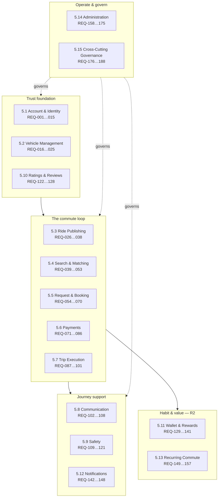
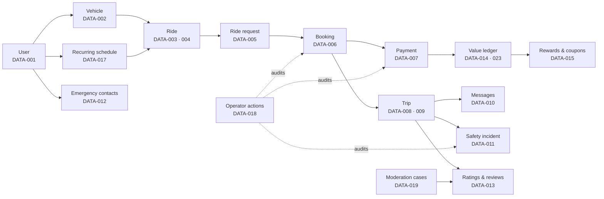
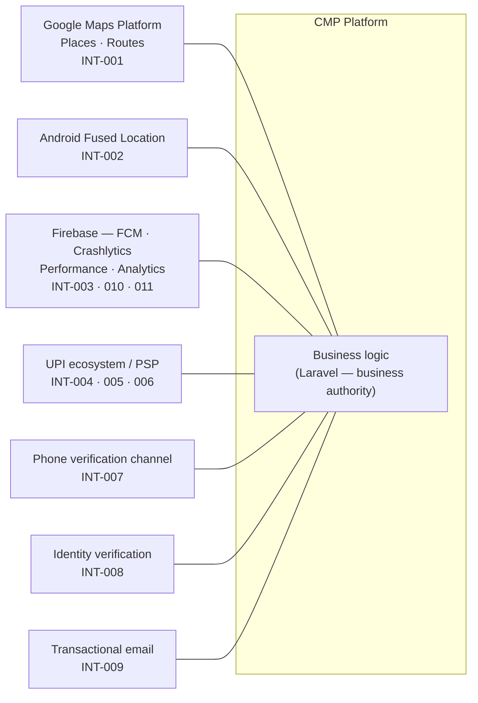
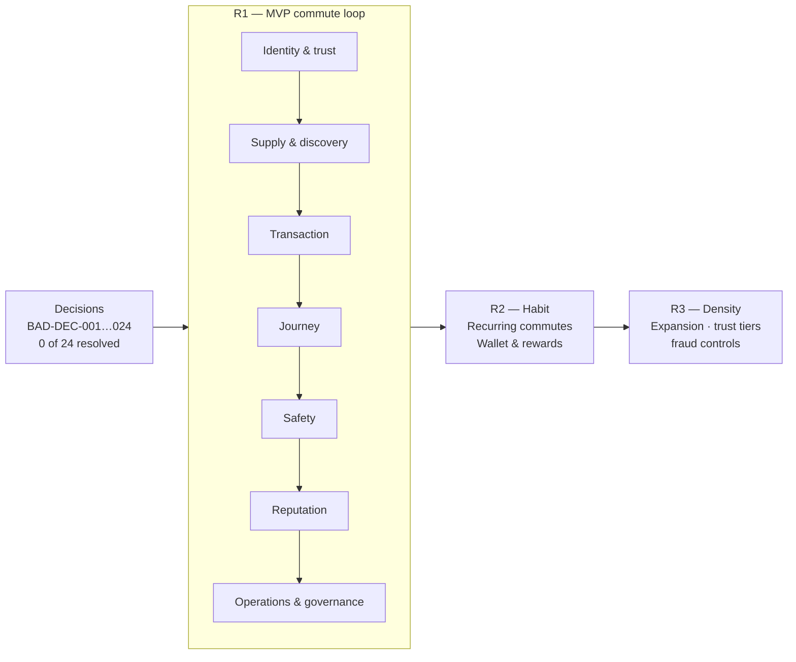
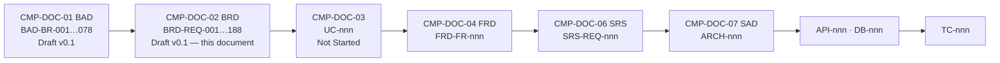
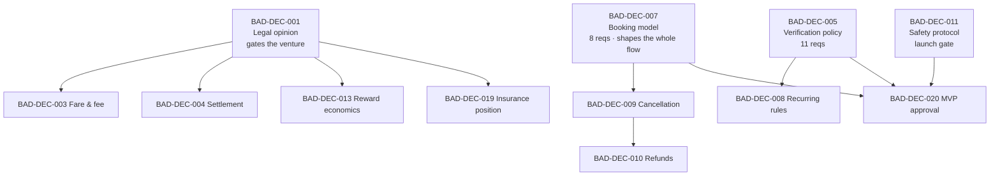

# Business Requirements Document (BRD)
## Carpool Mobility Platform (CMP)

---

# 0. Document Control

## 0.1 Document Control Table

| Field | Value |
|---|---|
| Document ID | CMP-DOC-02 |
| Document Name | Business Requirements Document |
| Short Name | BRD |
| Project Name | Carpool Mobility Platform |
| Project Code | CMP |
| Version | 0.1 |
| Status | Draft |
| Date | 2026-08-16 |
| Author | Business Analyst (AI-assisted) |
| Reviewer | [TBD] |
| Approver | Project Owner |
| Classification | Internal |
| Brand | TBD |
| Previous Version | None (initial issue) |
| Predecessor Document | CMP-DOC-01 Business Analysis Document (BAD) v0.1 — **Draft, not approved** |
| Related Documents | `00_Project_Control/README.md`, `Documentation_Index.md`, `Documentation_Status.md`, `Document_Change_Log.md`, `Glossary.md`, `Master_Traceability_Matrix.md` |
| Successor Documents | CMP-DOC-03 (Stakeholder & Use Case Specification) — Not Started |

## 0.2 Revision History

| Version | Date | Author | Change | Status |
|---|---|---|---|---|
| 0.1 | 2026-08-16 | Business Analyst (AI-assisted) | Initial issue. Elaborates the 78 business requirements of CMP-DOC-01 into 188 business requirements (`BRD-REQ-001` … `BRD-REQ-188`) with source traceability, MoSCoW priority, release allocation, verification intent and blocking-decision status. | Draft |

## 0.3 Distribution List

| Role | Purpose |
|---|---|
| Project Owner | Approval authority |
| Product Owner | Prioritisation and release allocation |
| Business Analyst | Authoring and maintenance |
| Solution Architect | Input to CMP-DOC-06 / CMP-DOC-07 |
| Software Architect (Mobile / Backend) | Input to CMP-DOC-08 / CMP-DOC-09 |
| UI/UX Designer | Input to CMP-DOC-12 |
| QA Analyst | Requirement testability review; basis for CMP-DOC-18 |
| Security Analyst | Input to CMP-DOC-13 |
| Trust & Safety | Review of safety requirement set |
| Project Manager | Planning, dependency and release management |

## 0.4 Approval

| Role | Name | Signature | Date |
|---|---|---|---|
| Author | Business Analyst (AI-assisted) | — | 2026-08-16 |
| Reviewer | [TBD] | — | — |
| Approver | Project Owner | — | — |

> **This document is NOT approved.** It is issued at version 0.1 with status `Draft`
> for Project Owner review.

## 0.5 Purpose of This Document

This Business Requirements Document states **what the business requires the Carpool
Mobility Platform to do**, in a form that can be prioritised, agreed, traced and
verified.

It converts the business analysis baseline (CMP-DOC-01) into an addressable requirement
set. Each requirement:

- carries a stable identifier (`BRD-REQ-nnn`);
- traces back to at least one business requirement in CMP-DOC-01 (`BAD-BR-nnn`);
- carries a MoSCoW priority and a proposed release;
- carries a verification intent, so that acceptance criteria can be derived downstream;
- declares explicitly whether it is **Ready** or **Blocked** by an unresolved business
  decision.

## 0.6 Scope and Boundary of This Document

**This document contains:** requirement conventions; stakeholder requirements; the
business requirement register across fifteen domains; business data, reporting,
interface and compliance requirements; applied business rules; release and prioritisation
plan; traceability; assumptions, constraints, dependencies and risks specific to
requirements delivery; open questions; required decisions; document acceptance criteria;
and requirement statistics.

**This document deliberately excludes:**

| Excluded | Belongs to |
|---|---|
| Use case narratives, actors, main/alternate flows | CMP-DOC-03 |
| Functional decomposition, screen-level behaviour, field-level rules | CMP-DOC-04 |
| Quality attributes, performance, availability, scalability targets | CMP-DOC-05 |
| System-level software requirements | CMP-DOC-06 |
| Architecture, components, deployment topology | CMP-DOC-07 … CMP-DOC-09 |
| API contracts, endpoints, payloads | CMP-DOC-10 |
| Database schema, tables, keys, indexes | CMP-DOC-11 |
| Screen designs, interaction and visual specification | CMP-DOC-12 |
| Security controls and threat model | CMP-DOC-13 |
| Payment integration mechanics | CMP-DOC-14 |
| Test cases | CMP-DOC-18 |

Where this document names a technology, it does so only as an **approved constraint**
inherited from CMP-DOC-01 §20 — never as a design decision.

## 0.7 Intended Audience

Product Owners · Business Stakeholders · Business Analysts · Solution Architects ·
Software Architects · Android Developers · Backend Developers · QA Engineers · UI/UX
Designers · DevOps Engineers · Security Engineers · Technical Leads · Project Managers ·
Future Engineering Teams.

## 0.8 Basis of This Document — and a Material Qualification

### 0.8.1 Source

**FACT.** This document is derived from **CMP-DOC-01 Business Analysis Document v0.1**
and from no other source. No new market evidence, research, legal advice or financial
information became available between the two documents.

### 0.8.2 Prerequisite Status — Read This Before Relying on the Document

> **WARNING — the prerequisite document is not approved.**
>
> The CMP documentation workflow (`README.md` §8, Master Documentation Control Prompt
> §27 Step 5) expects a BRD to be produced from an **approved** predecessor.
> **CMP-DOC-01 is at status `Draft`, version 0.1.** It has been issued for review but
> has not been reviewed or approved by the Project Owner.
>
> This BRD was produced on the Project Owner's explicit instruction to proceed. The
> consequence is recorded here, not hidden:
>
> 1. Every requirement in this document inherits the confidence level of its source
>    statement in CMP-DOC-01. Where that source was an `ASSUMPTION`, the requirement is
>    an assumption-based requirement.
> 2. If CMP-DOC-01 changes during review, **this document must be revised**, and any
>    requirement whose source statement changed must be re-examined.
> 3. This document must not be baselined before CMP-DOC-01 is approved.
>
> This is recorded as `BRD-RISK-001` and in `Document_Change_Log.md` conflict entry
> **CC-002**.

### 0.8.3 Consequence of the Unresolved Business Decisions

**FACT.** CMP-DOC-01 §27 records **24 required business decisions**, of which none has
been resolved. CMP-DOC-01 §28.16 records that **32 of its 78 business requirements are
blocked** by those decisions.

This BRD does **not** guess at the answers. Instead:

- Requirements that can be stated without the decision are stated in full and marked
  **Ready**.
- Requirements that depend on a decision are stated **as far as the business obligation
  is known**, and marked **Blocked** with the specific decision identifier.
- Where the decision determines a value, the value is written
  `[TBD – Business Decision Required: BAD-DEC-nnn]`.

A blocked requirement is still a real requirement. It tells the reader that the business
*must* do this, and that *how* it does it is not yet decided. It is not a placeholder.

> **RECOMMENDATION (carried forward from CMP-DOC-01 `R-03`).** This document should not
> be baselined for construction until the blocking decisions are resolved. It is
> nonetheless usable now for review, estimation, architecture shaping and identifying
> what must be decided.

## 0.9 Statement Classification Convention

As `README.md` §9.1 and CMP-DOC-01 §0.9:

| Marker | Meaning |
|---|---|
| **FACT** | Established by the approved product concept or a predecessor document. |
| **ASSUMPTION** | Working position adopted so work can proceed. Not confirmed. |
| **BUSINESS DECISION REQUIRED** | Project Owner must decide. |
| **TECHNICAL DECISION REQUIRED** | Architecture or engineering decision. |
| **OPEN QUESTION** | Raised, owner not yet assigned. |
| **TBD** | Value not yet known. |
| **FUTURE CONSIDERATION** | Explicitly deferred. |
| **RECOMMENDATION** | Author's advice. **Not an approved requirement.** |

## 0.10 Requirement Conventions

### 0.10.1 Identifier

`BRD-REQ-nnn` — a **business requirement of the Carpool Mobility Platform**. Identifiers
are stable, contiguous, allocated once, and never reused or renumbered without change
control recorded in `Document_Change_Log.md`.

Auxiliary identifiers introduced by this document:

| Prefix | Element | Section |
|---|---|---|
| `BRD-REQ-nnn` | Business Requirement (**traceable**) | 5–9 |
| `BRD-SR-nnn` | Stakeholder Requirement | 4 |
| `BRD-DATA-nnn` | Business Data Requirement | 6 |
| `BRD-RPT-nnn` | Business Reporting Requirement | 7 |
| `BRD-INT-nnn` | Business Interface Requirement | 8 |
| `BRD-CMP-nnn` | Business Compliance Requirement | 9 |
| `BRD-ASM-nnn` | Assumption | 13 |
| `BRD-CON-nnn` | Constraint | 14 |
| `BRD-DEP-nnn` | Dependency | 15 |
| `BRD-RISK-nnn` | Risk to requirements delivery | 16 |
| `BRD-OQ-nnn` | Open Question | 17 |

> **ASSUMPTION (`BRD-ASM-001`).** As with CMP-DOC-01 §0.10, `README.md` §9.3 allocates a
> single prefix (`BRD-REQ-`) to this document. The auxiliary prefixes above follow the
> convention already recorded as conflict **CC-001** and pending confirmation under
> `BAD-DEC-024`. Only `BRD-REQ-` participates in the forward traceability chain.

### 0.10.2 Requirement Statement Form

Every requirement is written as:

> *The platform shall …* (an obligation on the system and the business operating it)

Requirements are written to be **singular** (one obligation each), **verifiable** (a
verification intent is stated for every domain), and **solution-independent** (they say
what, not how).

### 0.10.3 Priority — MoSCoW

| Code | Meaning | Applied when |
|---|---|---|
| **M** | Must have | The business objective fails without it, or it protects money integrity, seat integrity, safety or legality. |
| **S** | Should have | Important and expected, but the objective can be met without it in the first release. |
| **C** | Could have | Desirable; included if capacity allows. |
| **W** | Won't have (this release) | Agreed as out of the current release; retained for future consideration. |

> **RECOMMENDATION.** Priorities in this document are proposed by the author from the
> analysis in CMP-DOC-01. Prioritisation is a Project Owner decision — see
> `BRD-OQ-001`.

### 0.10.4 Release Allocation

| Code | Release | Basis |
|---|---|---|
| **R1** | MVP — the single-corridor commute loop | CMP-DOC-01 §24 (proposed MVP) |
| **R2** | Habit — recurring commutes, wallet and rewards | CMP-DOC-01 §25 Phase 2 |
| **R3** | Density — expansion, maturity, controls | CMP-DOC-01 §25 Phase 3 |

> **Release allocation is proposed, not approved.** CMP-DOC-01 §24 is a
> `RECOMMENDATION`, and its approval is tracked as `BAD-DEC-020`. Until that decision is
> taken, every R1/R2/R3 value in this document is provisional.

### 0.10.5 Requirement Status

| Status | Meaning |
|---|---|
| **Ready** | The requirement can be elaborated into use cases and functional requirements now. |
| **Blocked** | A named business decision must be resolved before the requirement can be elaborated. The obligation is real; its parameters are not yet set. |

### 0.10.6 Register Column Definitions

| Column | Meaning |
|---|---|
| ID | `BRD-REQ-nnn` |
| Business Requirement | The obligation, in *shall* form |
| Source | Originating `BAD-BR-nnn` in CMP-DOC-01 |
| Pri | MoSCoW priority (§0.10.3) |
| Rel | Proposed release (§0.10.4) |
| Status | Ready, or Blocked by a named `BAD-DEC-nnn` |

## 0.11 Table of Contents

| § | Section |
|---|---|
| 0 | Document Control |
| 1 | Executive Summary |
| 2 | Business Context |
| 3 | Scope of Requirements |
| 4 | Stakeholder Requirements |
| 5 | Business Requirement Register |
| 6 | Business Data Requirements |
| 7 | Business Reporting Requirements |
| 8 | Business Interface & Integration Requirements |
| 9 | Business Compliance & Regulatory Requirements |
| 10 | Business Rules Applied |
| 11 | Release & Prioritisation Plan |
| 12 | Requirements Traceability |
| 13 | Assumptions |
| 14 | Constraints |
| 15 | Dependencies |
| 16 | Risks to Requirements Delivery |
| 17 | Open Questions |
| 18 | Business Decisions Required |
| 19 | Acceptance Criteria for This Document |
| 20 | Requirements Summary & Statistics |
| 21 | Recommendations |
| A | Appendix A — Requirement Index |
| B | Appendix B — Terminology Reference |

---

# 1. Executive Summary

## 1.1 What This Document Delivers

This BRD elaborates the **78 business requirements** of CMP-DOC-01 into **188 business
requirements** (`BRD-REQ-001` … `BRD-REQ-188`) across fifteen domains, plus:

| Requirement class | Prefix | Count |
|---|---|---|
| Business requirements | `BRD-REQ-` | 188 |
| Stakeholder requirements | `BRD-SR-` | 32 |
| Business data requirements | `BRD-DATA-` | 26 |
| Business reporting requirements | `BRD-RPT-` | 18 |
| Business interface requirements | `BRD-INT-` | 14 |
| Business compliance requirements | `BRD-CMP-` | 12 |

Every `BRD-REQ` traces to at least one `BAD-BR`. **All 78 `BAD-BR` requirements are
covered** — see §12.2 for the coverage proof.

## 1.2 The Headline Finding

| Metric | Value |
|---|---|
| Business requirements stated | 188 |
| **Ready to elaborate into use cases and functional requirements** | **109 (58%)** |
| **Blocked by an unresolved business decision** | **79 (42%)** |
| Distinct decisions doing the blocking | 17 of the 24 in CMP-DOC-01 §27 |
| Requirements implementing an absolute business rule | 24 |
| Proposed for R1 (MVP) | 158 |
| Proposed for R2 | 30 |

**Forty-two per cent of this document cannot proceed to CMP-DOC-03 or CMP-DOC-04
without Project Owner decisions.** This is not a defect in the analysis; it is the
accurate current state, and it is the most useful thing this document tells you.

## 1.3 Where the Blocking Is Concentrated

| Domain | Requirements | Blocked | % | Principal blocking decision |
|---|---|---|---|---|
| Wallet & Rewards | 13 | 13 | **100%** | `BAD-DEC-013` |
| Recurring Commute | 9 | 9 | **100%** | `BAD-DEC-008` |
| Ratings & Reviews | 7 | 6 | 86% | `BAD-DEC-012` |
| Safety | 13 | 7 | 54% | `BAD-DEC-011` |
| Ride Request & Booking | 17 | 8 | 47% | `BAD-DEC-007`, `BAD-DEC-009` |
| Cross-Cutting Governance | 13 | 6 | 46% | `BAD-DEC-021`, `BAD-DEC-022`, `BAD-DEC-001` |
| Payments & Settlement | 16 | 7 | 44% | `BAD-DEC-003`, `BAD-DEC-004`, `BAD-DEC-010` |
| Platform Administration | 18 | 7 | 39% | `BAD-DEC-005`, `BAD-DEC-016` |
| Account & Identity | 15 | 5 | 33% | `BAD-DEC-005`, `BAD-DEC-006` |
| Vehicle Management | 10 | 3 | 30% | `BAD-DEC-005` |
| Ride Publishing | 13 | 3 | 23% | `BAD-DEC-003`, `BAD-DEC-017` |
| Search & Route Matching | 15 | 2 | 13% | `BAD-DEC-022` |
| Trip Execution | 15 | 2 | 13% | `BAD-DEC-015` |
| Communication | 7 | 1 | 14% | `BAD-DEC-022` |
| Notifications | 7 | 0 | **0%** | — |

**Two domains are 100% blocked.** Wallet & Rewards and Recurring Commute cannot be
specified at all until `BAD-DEC-013` and `BAD-DEC-008` are taken. Both are R2, so this
does not block the MVP — but it does block R2 planning entirely.

## 1.4 What Is Ready Now

The following are stated in full and can proceed immediately to CMP-DOC-03:

| Domain | Ready | Comment |
|---|---|---|
| Search & Route Matching | 13 of 15 | **The differentiating capability is unblocked.** |
| Trip Execution & Live Tracking | 13 of 15 | Largest unblocked body of journey work. |
| Platform Administration | 11 of 18 | Case handling and audit are ready; policy is not. |
| Account & Identity | 10 of 15 | Registration, authentication and profile are ready. |
| Ride Publishing | 10 of 13 | Only fare and post-booking amendment are blocked. |
| Vehicle Management | 7 of 10 | |
| Cross-Cutting Governance | 7 of 13 | All four authority requirements are ready. |
| Notifications | 7 of 7 | **Fully ready.** |
| Communication | 6 of 7 | |
| Safety | 6 of 13 | Incident recording and routing are ready; the response is not. |

**RECOMMENDATION.** If work must begin before the decisions are resolved, begin with
**Search & Route Matching** and **Trip Execution**. They are the largest unblocked
bodies of work, and Search & Route Matching is the platform's differentiator
(CMP-DOC-01 `BAD-OPP-001`).

## 1.5 Requirements That Must Not Be Compromised

Twenty-one requirements implement the ten **absolute** business rules of CMP-DOC-01
§14. They are listed in §10.2 and flagged in the register. In summary, the platform
shall never: confirm a booking on unverified payment evidence; allow confirmed seats to
exceed offered seats; permit a client to assert authoritative business state; treat a
UPI application response as proof of payment; or leave an SOS event without a recorded
response.

**RECOMMENDATION.** These twenty-one requirements should be treated as non-negotiable
scope in every release conversation.

## 1.6 What This Document Does Not Do

It does not resolve any of the 24 business decisions; it does not invent any value,
policy, rate, threshold or legal position; it does not define functional behaviour,
screens, data structures or APIs; and it does not baseline anything, because its own
predecessor is not approved (§0.8.2).

---

# 2. Business Context

> This section is a **short orientation**, not a restatement. CMP-DOC-01 is the
> authoritative business baseline; readers requiring the analysis should read it.

## 2.1 The Business in One Paragraph

**FACT.** CMP is a peer-to-peer carpooling and daily commute platform for the Indian
market, delivered initially on Android and backed by a server-authoritative Laravel
platform with a Laravel Filament back office. Drivers publish rides on journeys they are
already making; passengers discover them through route-overlap matching; seats are
booked and paid for through the platform via UPI; trips are executed with live tracking
and safety cover; and repeat arrangements are sustained through recurring commutes and
reward mechanics.

## 2.2 The Four Business Failures the Requirements Must Address

Requirements in this document exist to close the four failures identified in CMP-DOC-01
§4.2.

| Failure | Requirement domains that address it |
|---|---|
| **F1 Coordination** — the right driver and passenger cannot find each other | Ride Publishing · Search & Route Matching · Recurring Commute · Notifications |
| **F2 Trust** — neither party can assess the other before committing | Account & Identity · Vehicle Management · Ratings & Reviews · Cross-Cutting Governance |
| **F3 Settlement** — money is awkward, manual, disputed or avoided | Payments & Settlement · Wallet & Rewards |
| **F4 Safety & accountability** — no recourse, no visibility, no record | Safety · Trip Execution · Administration · Cross-Cutting Governance |

## 2.3 Controlling Principles Inherited by Every Requirement

| # | Principle | Source | Effect on requirements |
|---|---|---|---|
| P1 | **Backend is the business authority.** | `BAD-RULE-002` | No requirement may be satisfied by client-side state alone. |
| P2 | **Peer, not professional.** | `BAD-RULE-001` | No requirement may imply dispatch, employment or direction of drivers. |
| P3 | **No silent money.** | `BAD-RULE-037` | Every value movement produces a durable, attributable record. |
| P4 | **Trust is displayed at the point of decision.** | `BAD-RULE-007` | Verification and reputation must be visible before commitment. |
| P5 | **Safety is not deferrable scope.** | CMP-DOC-01 §6.5 SP-5 | Safety requirements are R1, not R2. |

## 2.4 Business Objectives This Document Serves

| Objective (CMP-DOC-01 §7) | Requirement coverage |
|---|---|
| `BAD-OBJ-001` Passenger finds and books a compatible ride | §5.4, §5.5 |
| `BAD-OBJ-002` Driver converts spare seats into settled value | §5.3, §5.6 |
| `BAD-OBJ-003` Mutual trust between strangers | §5.1, §5.2, §5.10 |
| `BAD-OBJ-004` Payment friction and ambiguity removed | §5.6 |
| `BAD-OBJ-005` Credible safety cover and accountable response | §5.9, §5.14 |
| `BAD-OBJ-006` One-off usage becomes habitual | §5.13, §5.11 |
| `BAD-OBJ-007` Corridor liquidity | §5.4, §5.13, §5.11 |
| `BAD-OBJ-008` Single authoritative record | §5.15, §6 |
| `BAD-OBJ-009` Operable platform | §5.14, §7 |
| `BAD-OBJ-010` Lawful operating position | §9 |

---

# 3. Scope of Requirements

## 3.1 Scope Position

**FACT.** The scope boundary is inherited unchanged from CMP-DOC-01 §10. This document
does not widen, narrow or reinterpret it. Any change to scope requires change control
per `README.md` §10.

## 3.2 In Scope — Requirement Domains

| § | Domain | Requirements | Source `BAD-BR` |
|---|---|---|---|
| 5.1 | Account & Identity | `BRD-REQ-001`–`015` | `BAD-BR-001`–`006` |
| 5.2 | Vehicle Management | `BRD-REQ-016`–`025` | `BAD-BR-007`–`010` |
| 5.3 | Ride Publishing | `BRD-REQ-026`–`038` | `BAD-BR-011`–`015` |
| 5.4 | Search & Route Matching | `BRD-REQ-039`–`053` | `BAD-BR-016`–`021` |
| 5.5 | Ride Request & Booking | `BRD-REQ-054`–`070` | `BAD-BR-022`–`028` |
| 5.6 | Payments & Settlement | `BRD-REQ-071`–`086` | `BAD-BR-029`–`034` |
| 5.7 | Trip Execution & Live Tracking | `BRD-REQ-087`–`101` | `BAD-BR-035`–`040` |
| 5.8 | Communication | `BRD-REQ-102`–`108` | `BAD-BR-041`–`043` |
| 5.9 | Safety | `BRD-REQ-109`–`121` | `BAD-BR-044`–`048` |
| 5.10 | Ratings & Reviews | `BRD-REQ-122`–`128` | `BAD-BR-049`–`051` |
| 5.11 | Wallet & Rewards | `BRD-REQ-129`–`141` | `BAD-BR-052`–`057` |
| 5.12 | Notifications | `BRD-REQ-142`–`148` | `BAD-BR-058`–`060` |
| 5.13 | Recurring Commute | `BRD-REQ-149`–`157` | `BAD-BR-061`–`064` |
| 5.14 | Platform Administration | `BRD-REQ-158`–`175` | `BAD-BR-065`–`072` |
| 5.15 | Cross-Cutting Governance | `BRD-REQ-176`–`188` | `BAD-BR-073`–`078` |

## 3.3 Out of Scope

Inherited from CMP-DOC-01 §10.3 without amendment. No requirement in this document
addresses any of the following, and none may be added without change control:

iOS application · web application for passengers or drivers · professional or
commercial driver supply, dispatch or driver-for-hire · vehicle rental or leasing ·
goods, parcel or freight movement · intercity long-distance travel as a primary use case
· public transport ticketing or integration · insurance products issued or brokered by
the platform · in-app cash handling · direct client-to-database access · fare
negotiation or bidding between users · social feed or follower graph · multi-currency or
non-INR settlement · corporate or employer commute contracts and billing · third-party
merchant loyalty partnerships · non-Google mapping providers.

## 3.4 Future Scope

Inherited from CMP-DOC-01 §10.4 (`FS-01` … `FS-09`). **FUTURE CONSIDERATION — none is a
commitment.** No requirement in this document depends on any of them. Two requirements
(`BRD-REQ-184`, `BRD-REQ-185`) exist specifically to keep future options open without
committing to them.

## 3.5 Requirement Scope Diagram

---

# 4. Stakeholder Requirements

Stakeholder requirements express **what each stakeholder group needs from the
platform**, ahead of how the platform delivers it. They are the bridge between
CMP-DOC-01 §11 (stakeholder register) and the business requirement register in §5.

## 4.1 Passenger — `BAD-SH-004`

| ID | Stakeholder requirement | Realised by |
|---|---|---|
| `BRD-SR-001` | As a passenger, I need to find rides that genuinely fit my journey, including where my trip is only part of the driver's route. | `BRD-REQ-039`–`047` |
| `BRD-SR-002` | As a passenger, I need to know who I would be travelling with, and how far they have been verified, before I commit. | `BRD-REQ-048`, `BRD-REQ-176`–`178` |
| `BRD-SR-003` | As a passenger, I need to know the exact cost before I request a seat. | `BRD-REQ-049`, `BRD-REQ-071` |
| `BRD-SR-004` | As a passenger, I need to secure my seat with certainty, not an informal promise. | `BRD-REQ-063`–`066` |
| `BRD-SR-005` | As a passenger, I need to pay without cash, negotiation or later chasing. | `BRD-REQ-074`–`079` |
| `BRD-SR-006` | As a passenger, I need to know where the driver is and when they will reach me. | `BRD-REQ-092`–`096` |
| `BRD-SR-007` | As a passenger, I need to reach my driver to coordinate the pickup. | `BRD-REQ-102`–`105` |
| `BRD-SR-008` | As a passenger, I need someone I trust to be able to see where I am during the journey. | `BRD-REQ-116`–`118` |
| `BRD-SR-009` | As a passenger, I need a way to signal an emergency and have someone respond. | `BRD-REQ-109`–`113` |
| `BRD-SR-010` | As a passenger, I need recourse and a record if the journey goes wrong. | `BRD-REQ-122`, `BRD-REQ-166`, `BRD-REQ-179` |
| `BRD-SR-011` | As a passenger, I need the same arrangement to work again tomorrow without re-arranging it. | `BRD-REQ-149`–`155` |

## 4.2 Driver — `BAD-SH-005`

| ID | Stakeholder requirement | Realised by |
|---|---|---|
| `BRD-SR-012` | As a driver, I need to offer my spare seats in seconds, not minutes. | `BRD-REQ-026`–`033` |
| `BRD-SR-013` | As a driver, I need passengers who are on my route, so I do not have to detour. | `BRD-REQ-042`–`044` |
| `BRD-SR-014` | As a driver, I need to know who is getting into my vehicle. | `BRD-REQ-057`, `BRD-REQ-176` |
| `BRD-SR-015` | As a driver, I need to control who I accept, or to have that decision governed by rules I understand. | `BRD-REQ-058`–`060` |
| `BRD-SR-016` | As a driver, I need the money to arrive without me asking for it. | `BRD-REQ-083`–`086` |
| `BRD-SR-017` | As a driver, I need to know what I have earned. | `BRD-REQ-085`, `BRD-REQ-172` |
| `BRD-SR-018` | As a driver, I need protection from passengers who do not turn up. | `BRD-REQ-067`–`069` |
| `BRD-SR-019` | As a driver, I need to republish my daily commute without re-entering it. | `BRD-REQ-149`–`152` |
| `BRD-SR-020` | As a driver, I need to understand what I may and may not do on the platform. | `BRD-REQ-186`–`188` |

## 4.3 Emergency Contact — `BAD-SH-006`

| ID | Stakeholder requirement | Realised by |
|---|---|---|
| `BRD-SR-021` | As a nominated contact, I need to be able to follow a journey I have been given visibility of. | `BRD-REQ-116`–`118` |
| `BRD-SR-022` | As a nominated contact, I need to be informed when the person who nominated me raises an emergency. | `BRD-REQ-113`, `BRD-REQ-114` |

## 4.4 Platform Operator & Support — `BAD-SH-007`, `BAD-SH-008`

| ID | Stakeholder requirement | Realised by |
|---|---|---|
| `BRD-SR-023` | As an operator, I need to verify users and vehicles through a managed queue. | `BRD-REQ-159`, `BRD-REQ-160` |
| `BRD-SR-024` | As an operator, I need to find any ride, booking, payment or trip and see its full history. | `BRD-REQ-161`–`164`, `BRD-REQ-179` |
| `BRD-SR-025` | As an operator, I need to change a user's access when their conduct requires it. | `BRD-REQ-158`, `BRD-REQ-180` |
| `BRD-SR-026` | As a support agent, I need the evidence to resolve a case without asking engineering. | `BRD-REQ-167`, `BRD-REQ-179` |
| `BRD-SR-027` | As an operator, I need my own actions to be recorded. | `BRD-REQ-174`, `BRD-REQ-179` |

## 4.5 Trust & Safety — `BAD-SH-009`

| ID | Stakeholder requirement | Realised by |
|---|---|---|
| `BRD-SR-028` | As a safety responder, I need to see instantly who raised an alarm, where they are, which trip they are on, and who they are with. | `BRD-REQ-110`–`112`, `BRD-REQ-166` |
| `BRD-SR-029` | As a safety responder, I need a defined protocol to execute, and a record of what I did. | `BRD-REQ-113`, `BRD-REQ-115`, `BRD-REQ-166` |
| `BRD-SR-030` | As a safety responder, I need to be able to act on the accounts involved. | `BRD-REQ-158`, `BRD-REQ-180` |

## 4.6 Business Owner — `BAD-SH-001`, `BAD-SH-003`

| ID | Stakeholder requirement | Realised by |
|---|---|---|
| `BRD-SR-031` | As the business, I need every transaction, movement of value and operational action to be recorded and reportable. | §6, §7, `BRD-REQ-179` |
| `BRD-SR-032` | As the business, I need to operate within a legal position established by qualified advice. | §9, `BRD-REQ-188` |

## 4.7 Stakeholder Requirement Coverage

**All 32 stakeholder requirements are realised by at least one business requirement.**
No stakeholder requirement is unaddressed. Two are realised only by blocked
requirements — `BRD-SR-009` (emergency response, blocked by `BAD-DEC-011`) and
`BRD-SR-016` (driver settlement, blocked by `BAD-DEC-004`) — and are therefore
**stated but not yet deliverable**.

---

# 5. Business Requirement Register

**188 business requirements, `BRD-REQ-001` … `BRD-REQ-188`, across fifteen domains.**

Column definitions are in §0.10.6. Priority key: **M** Must · **S** Should · **C** Could
· **W** Won't (this release). Release key: **R1** MVP · **R2** Habit · **R3** Density.

> Requirements marked **‡** implement an *absolute* business rule from CMP-DOC-01 §14
> and are listed together in §10.2. They are not subject to descoping.

## 5.1 Account & Identity

**Serves:** `BAD-OBJ-003` · **Source:** `BAD-BR-001`–`006` · **Addresses:** F2 Trust
**Capabilities:** `BAD-CAP-001`–`006`

| ID | Business Requirement | Source | Pri | Rel | Status |
|---|---|---|---|---|---|
| `BRD-REQ-001` | The platform shall allow a prospective user to register an account. | `BAD-BR-001` | M | R1 | Ready |
| `BRD-REQ-002` | The platform shall uniquely and persistently identify each registered user. | `BAD-BR-001` | M | R1 | Ready |
| `BRD-REQ-003` | The platform shall authenticate a registered user before granting access to their account. | `BAD-BR-002` | M | R1 | Ready |
| `BRD-REQ-004` | The platform shall allow a user to terminate their authenticated session. | `BAD-BR-003` | M | R1 | Ready |
| `BRD-REQ-005` | The platform shall allow a user to create and maintain a personal profile. | `BAD-BR-004` | M | R1 | Ready |
| `BRD-REQ-006` | The platform shall determine what profile information is disclosed to a counterparty, and at which stage of the journey it is disclosed. | `BAD-BR-004` | M | R1 | **Blocked — `BAD-DEC-022`** |
| `BRD-REQ-007` | The platform shall verify that a user controls the phone number registered to their account. | `BAD-BR-005` | M | R1 | Ready |
| `BRD-REQ-008` | The platform shall be able to verify a user's identity against evidence the business accepts. | `BAD-BR-005` | M | R1 | **Blocked — `BAD-DEC-005`** |
| `BRD-REQ-009` | The platform shall support a defined set of verification levels, and shall determine what each level permits a user to do. | `BAD-BR-005` | M | R1 | **Blocked — `BAD-DEC-005`** |
| `BRD-REQ-010` ‡ | The platform shall hold verification status as backend-authoritative state, and shall never accept a verification status asserted by a client. | `BAD-BR-005`, `BAD-BR-073` | M | R1 | Ready |
| `BRD-REQ-011` ‡ | The platform shall make a counterparty's verification status visible to a user before that user commits to travel with them. | `BAD-BR-005`, `BAD-BR-075` | M | R1 | Ready |
| `BRD-REQ-012` | The platform shall distinguish the roles of passenger, driver and administrator, and shall govern what each role may do. | `BAD-BR-006` | M | R1 | Ready |
| `BRD-REQ-013` | The platform shall allow a single user account to hold both the passenger and the driver role. | `BAD-BR-006` | S | R1 | Ready |
| `BRD-REQ-014` | The platform shall maintain a defined lifecycle of account states for every user. | `BAD-BR-006` | M | R1 | **Blocked — `BAD-DEC-006`** |
| `BRD-REQ-015` | The platform shall prevent a user whose account state does not permit participation from publishing, requesting, booking or travelling. | `BAD-BR-006` | M | R1 | **Blocked — `BAD-DEC-006`** |

**Business rules applied:** `BAD-RULE-004`, `005`, `006`, `007`, `008`, `009`, `010`, `011`

**Verification intent.** Verified by demonstrating that: an account cannot be used before
phone control is proven; verification status displayed to a counterparty always matches
the backend record; a client-supplied verification claim is rejected; and a
non-participating account state blocks every participation path.

> **Blocked items.** `BRD-REQ-008`, `009` cannot be elaborated until the verification
> policy (`BAD-DEC-005`) defines the levels and accepted evidence. `BRD-REQ-014`, `015`
> await the account state model (`BAD-DEC-006`). `BRD-REQ-006` awaits the privacy
> boundary decision (`BAD-DEC-022`). The **obligation** in each case is settled; only its
> parameters are open.

## 5.2 Vehicle Management

**Serves:** `BAD-OBJ-003` · **Source:** `BAD-BR-007`–`010` · **Addresses:** F2 Trust
**Capabilities:** `BAD-CAP-005`, `BAD-CAP-010`

| ID | Business Requirement | Source | Pri | Rel | Status |
|---|---|---|---|---|---|
| `BRD-REQ-016` | The platform shall allow a driver to register a vehicle against their account. | `BAD-BR-007` | M | R1 | Ready |
| `BRD-REQ-017` | The platform shall record the vehicle attributes a passenger needs in order to identify and assess the vehicle. | `BAD-BR-007`, `BAD-BR-010` | M | R1 | Ready |
| `BRD-REQ-018` | The platform shall allow a driver to amend the details of a registered vehicle. | `BAD-BR-008` | S | R1 | Ready |
| `BRD-REQ-019` | The platform shall allow a driver to remove a registered vehicle. | `BAD-BR-008` | S | R1 | Ready |
| `BRD-REQ-020` | The platform shall prevent removal or disqualifying amendment of a vehicle while it is associated with an active ride, booking or trip. | `BAD-BR-008` | M | R1 | Ready |
| `BRD-REQ-021` | The platform shall be able to verify a registered vehicle against evidence the business accepts. | `BAD-BR-009` | M | R1 | **Blocked — `BAD-DEC-005`** |
| `BRD-REQ-022` | The platform shall determine whether an unverified vehicle may be used to publish a ride. | `BAD-BR-009` | M | R1 | **Blocked — `BAD-DEC-005`** |
| `BRD-REQ-023` | The platform shall record the lawful passenger capacity of a registered vehicle. | `BAD-BR-007` | M | R1 | **Blocked — `BAD-DEC-005`** |
| `BRD-REQ-024` ‡ | The platform shall present vehicle information to a passenger before that passenger commits to travel. | `BAD-BR-010`, `BAD-BR-075` | M | R1 | Ready |
| `BRD-REQ-025` ‡ | The platform shall ensure the vehicle information presented for a ride corresponds to the vehicle recorded against that ride. | `BAD-BR-010` | M | R1 | Ready |

**Business rules applied:** `BAD-RULE-012`, `013`, `014`, `015`, `017`

**Verification intent.** Verified by demonstrating that a vehicle in active use cannot be
removed; that vehicle data shown in search, booking and trip contexts is identical to
the registered record; and that the capacity recorded constrains the seats a driver may
offer (`BRD-REQ-028`).

> **Blocked items.** `BRD-REQ-021`, `022`, `023` all await `BAD-DEC-005`. `BRD-REQ-023`
> is blocked because the *source* of lawful capacity — self-declaration, document
> evidence, or an external reference — is a verification-policy question, not a
> technical one.

## 5.3 Ride Publishing

**Serves:** `BAD-OBJ-002` · **Source:** `BAD-BR-011`–`015` · **Addresses:** F1 Coordination
**Capabilities:** `BAD-CAP-007`

| ID | Business Requirement | Source | Pri | Rel | Status |
|---|---|---|---|---|---|
| `BRD-REQ-026` | The platform shall allow a driver to publish a ride stating its origin and destination. | `BAD-BR-011` | M | R1 | Ready |
| `BRD-REQ-027` | The platform shall allow a driver to state the date and departure time of a published ride. | `BAD-BR-011` | M | R1 | Ready |
| `BRD-REQ-028` | The platform shall allow a driver to state the number of seats offered, and shall not permit that number to exceed the lawful passenger capacity of the associated vehicle. | `BAD-BR-012` | M | R1 | Ready |
| `BRD-REQ-029` | The platform shall require every published ride to be associated with exactly one registered vehicle. | `BAD-BR-014` | M | R1 | Ready |
| `BRD-REQ-030` | The platform shall determine the fare applicable to a published ride. | `BAD-BR-013` | M | R1 | **Blocked — `BAD-DEC-003`** |
| `BRD-REQ-031` | The platform shall determine whether the driver sets the fare, and shall enforce any constraint the business places upon it. | `BAD-BR-013` | M | R1 | **Blocked — `BAD-DEC-003`** |
| `BRD-REQ-032` | The platform shall allow a driver to declare travel preferences for a ride, covering at minimum air conditioning, smoking, music, luggage and pets. | `BAD-BR-015` | M | R1 | Ready |
| `BRD-REQ-033` | The platform shall display a ride's declared preferences to a passenger before that passenger commits to travel. | `BAD-BR-015` | M | R1 | Ready |
| `BRD-REQ-034` | The platform shall reject a ride whose departure time has already passed. | `BAD-BR-011` | M | R1 | Ready |
| `BRD-REQ-035` | The platform shall validate a driver's eligibility to publish before accepting a ride, and shall state the reason where publication is refused. | `BAD-BR-011` | M | R1 | Ready |
| `BRD-REQ-036` | The platform shall make a successfully published ride discoverable to passengers searching a compatible journey. | `BAD-BR-011` | M | R1 | Ready |
| `BRD-REQ-037` | The platform shall allow a driver to withdraw a published ride. | `BAD-BR-011`, `BAD-BR-025` | M | R1 | Ready |
| `BRD-REQ-038` | The platform shall determine whether, and in what respects, a driver may amend a ride after bookings exist against it. | `BAD-BR-011` | S | R1 | **Blocked — `BAD-DEC-017`** |

**Business rules applied:** `BAD-RULE-012`, `016`, `017`, `018`, `019`, `020`, `021`

**Verification intent.** Verified by demonstrating that a ride cannot be published
without every mandatory attribute; that seats offered never exceed recorded vehicle
capacity; that a past departure time is rejected; that a published ride appears in a
compatible search; and that withdrawal removes it from discovery while preserving the
record.

> **Blocked items.** `BRD-REQ-030` and `031` are the fare requirements and await
> `BAD-DEC-003`. Note the interaction recorded in CMP-DOC-01 `BAD-RISK-001`: **who sets
> the fare may affect how the service is legally characterised**, so these two
> requirements should not be resolved ahead of `BAD-DEC-001`.

## 5.4 Search & Route Matching

**Serves:** `BAD-OBJ-001`, `BAD-OBJ-007` · **Source:** `BAD-BR-016`–`021`
**Addresses:** F1 Coordination · **Capabilities:** `BAD-CAP-008`, `BAD-CAP-009`
**This domain contains the platform's principal differentiator (`BAD-OPP-001`).**

| ID | Business Requirement | Source | Pri | Rel | Status |
|---|---|---|---|---|---|
| `BRD-REQ-039` | The platform shall allow a passenger to search for rides by origin, destination, date and number of seats required. | `BAD-BR-016` | M | R1 | Ready |
| `BRD-REQ-040` | The platform shall identify published rides whose route overlaps the passenger's requested travel segment. | `BAD-BR-017` | M | R1 | Ready |
| `BRD-REQ-041` | The platform shall include rides where the passenger's segment forms only part of the driver's route. | `BAD-BR-017` | M | R1 | Ready |
| `BRD-REQ-042` | The platform shall assess pickup compatibility between the passenger's origin and the ride's route. | `BAD-BR-018` | M | R1 | Ready |
| `BRD-REQ-043` | The platform shall assess drop compatibility between the passenger's destination and the ride's route. | `BAD-BR-018` | M | R1 | Ready |
| `BRD-REQ-044` | The platform shall assess whether the direction of travel of the ride is compatible with the passenger's journey. | `BAD-BR-018` | M | R1 | Ready |
| `BRD-REQ-045` | The platform shall assess whether the ride's departure time is compatible with the passenger's requested travel time. | `BAD-BR-018` | M | R1 | Ready |
| `BRD-REQ-046` | The platform shall express, for each matched ride, the degree to which its route overlaps the passenger's requested segment. | `BAD-BR-019` | M | R1 | Ready |
| `BRD-REQ-047` | The platform shall rank matched rides, and the basis of the ranking shall be explainable to the passenger. | `BAD-BR-019`, `BAD-BR-020` | S | R1 | Ready |
| `BRD-REQ-048` ‡ | The platform shall present, for each matched ride, the driver information, vehicle information and verification indicators required for a trust decision. | `BAD-BR-020`, `BAD-BR-075` | M | R1 | Ready |
| `BRD-REQ-049` | The platform shall present, for each matched ride, the fare, departure time and number of available seats. | `BAD-BR-020` | M | R1 | Ready |
| `BRD-REQ-050` | The platform shall present, for each matched ride, the declared travel preferences. | `BAD-BR-020` | M | R1 | Ready |
| `BRD-REQ-051` ‡ | The platform shall exclude from bookable results any ride with insufficient available seats for the passenger's request. | `BAD-BR-021`, `BAD-BR-027` | M | R1 | Ready |
| `BRD-REQ-052` | The platform shall inform a passenger clearly when no compatible ride is available, and shall determine what alternatives, if any, are offered. | `BAD-BR-016` | S | R1 | **Blocked — `BAD-OQ-007`** |
| `BRD-REQ-053` | The platform shall limit the precision of location information disclosed about a counterparty in search results to what is required to coordinate the journey. | `BAD-BR-020`, `BAD-BR-077` | M | R1 | **Blocked — `BAD-DEC-022`** |

**Business rules applied:** `BAD-RULE-022`, `023`, `024`, `025`

**Verification intent.** Verified by demonstrating that a partial-segment ride is
returned where a point-to-point match would not be; that direction, timing, pickup, drop
and seat filters each independently exclude incompatible rides; that the stated overlap
corresponds to the actual route relationship; and that no result exposes location detail
beyond the agreed boundary.

> **Note on the matching algorithm.** CMP-DOC-01 `BAD-RULE-023` records that the overlap
> calculation and any minimum overlap threshold are a `TECHNICAL DECISION REQUIRED`,
> routed to CMP-DOC-07 / CMP-DOC-09. The requirements above are deliberately written to
> state the **business obligation** without constraining the algorithm.
>
> `BRD-REQ-052` is marked Blocked against an open question rather than a formal decision;
> if the Project Owner rules that an empty result requires no alternatives, it becomes
> Ready immediately.

## 5.5 Ride Request & Booking

**Serves:** `BAD-OBJ-001` · **Source:** `BAD-BR-022`–`028` · **Addresses:** F1, F3
**Capabilities:** `BAD-CAP-013`, `BAD-CAP-014`, `BAD-CAP-018`

| ID | Business Requirement | Source | Pri | Rel | Status |
|---|---|---|---|---|---|
| `BRD-REQ-054` | The platform shall allow a passenger to request one or more seats on a specific published ride. | `BAD-BR-022` | M | R1 | Ready |
| `BRD-REQ-055` | The platform shall re-confirm seat availability at the moment a request is made. | `BAD-BR-022`, `BAD-BR-027` | M | R1 | Ready |
| `BRD-REQ-056` | The platform shall determine whether a booking may be created for more than one traveller, and how any additional travellers are identified. | `BAD-BR-022` | S | R1 | **Blocked — `BAD-OQ-024`** |
| `BRD-REQ-057` ‡ | The platform shall present the requesting passenger's verification status and reputation to the driver. | `BAD-BR-023`, `BAD-BR-075` | M | R1 | Ready |
| `BRD-REQ-058` | The platform shall determine whether a ride request requires the driver's acceptance. | `BAD-BR-023` | M | R1 | **Blocked — `BAD-DEC-007`** |
| `BRD-REQ-059` | The platform shall allow a driver to accept or decline a ride request where acceptance is required. | `BAD-BR-023` | M | R1 | **Blocked — `BAD-DEC-007`** |
| `BRD-REQ-060` | The platform shall determine the circumstances in which a request may be accepted automatically, including for verified peers. | `BAD-BR-023`, `BAD-BR-064` | S | R1 | **Blocked — `BAD-DEC-007`, `BAD-DEC-008`** |
| `BRD-REQ-061` | The platform shall determine whether seats are held between request and payment, and for how long. | `BAD-BR-022`, `BAD-BR-027` | M | R1 | **Blocked — `BAD-DEC-007`** |
| `BRD-REQ-062` | The platform shall determine whether payment is taken at booking or on trip completion. | `BAD-BR-028` | M | R1 | **Blocked — `BAD-DEC-007`** |
| `BRD-REQ-063` | The platform shall inform both the passenger and the driver of the outcome of a ride request. | `BAD-BR-024` | M | R1 | Ready |
| `BRD-REQ-064` ‡ | The platform shall calculate and enforce seat availability under its own authority, and shall never rely on a client to determine it. | `BAD-BR-027`, `BAD-BR-073` | M | R1 | Ready |
| `BRD-REQ-065` ‡ | The platform shall never allow the total confirmed seats on a ride to exceed the seats offered, including under concurrent requests. | `BAD-BR-027` | M | R1 | Ready |
| `BRD-REQ-066` ‡ | The platform shall confirm a booking only under its own authority, and only once payment has been verified by the platform. | `BAD-BR-028`, `BAD-BR-032` | M | R1 | Ready |
| `BRD-REQ-067` | The platform shall allow a ride, a ride request or a booking to be cancelled, and shall record the party responsible and the reason. | `BAD-BR-025` | M | R1 | Ready |
| `BRD-REQ-068` | The platform shall apply the business's cancellation rules, including any window, penalty and permitted party. | `BAD-BR-025`, `BAD-BR-026` | M | R1 | **Blocked — `BAD-DEC-009`** |
| `BRD-REQ-069` | The platform shall determine and apply the consequences of a passenger or driver failing to attend a confirmed trip. | `BAD-BR-026` | M | R1 | **Blocked — `BAD-DEC-009`** |
| `BRD-REQ-070` | The platform shall release seats held or allocated by a cancelled request or booking, and shall return them to availability. | `BAD-BR-025`, `BAD-BR-027` | M | R1 | Ready |

**Business rules applied:** `BAD-RULE-026`, `027`, `028`, `029`, `030`, `031`, `039`, `040`

**Verification intent.** Verified by demonstrating that concurrent requests for the last
seat produce exactly one confirmed booking; that no booking reaches confirmed status
without a verified payment; that a cancelled booking returns its seats to availability;
and that every cancellation carries an attributable reason.

> **Blocked items — the largest concentration in the MVP.** Eight requirements
> (`BRD-REQ-056`, `058`–`062`, `068`, `069`) depend chiefly on `BAD-DEC-007` and
> `BAD-DEC-009`.
> `BAD-DEC-007` alone determines whether a driver approves requests, whether seats are
> held during payment, and when money is taken — three decisions that between them shape
> the entire booking flow. **This is the single highest-value decision to resolve.**

## 5.6 Payments & Settlement

**Serves:** `BAD-OBJ-004` · **Source:** `BAD-BR-029`–`034` · **Addresses:** F3 Settlement
**Capabilities:** `BAD-CAP-015`–`018`

| ID | Business Requirement | Source | Pri | Rel | Status |
|---|---|---|---|---|---|
| `BRD-REQ-071` ‡ | The platform shall calculate the fare payable under its own authority, and shall never accept a fare asserted by a client. | `BAD-BR-029`, `BAD-BR-073` | M | R1 | Ready |
| `BRD-REQ-072` | The platform shall apply the business's fare model, including any per-seat or per-booking basis. | `BAD-BR-029` | M | R1 | **Blocked — `BAD-DEC-003`** |
| `BRD-REQ-073` | The platform shall determine whether a platform fee applies to a transaction, on what basis, and at what value. | `BAD-BR-034` | M | R1 | **Blocked — `BAD-DEC-003`** |
| `BRD-REQ-074` | The platform shall present the total amount payable to the passenger before payment is initiated. | `BAD-BR-029` | M | R1 | Ready |
| `BRD-REQ-075` | The platform shall allow a passenger to pay through the Indian UPI ecosystem. | `BAD-BR-030` | M | R1 | Ready |
| `BRD-REQ-076` | The platform shall support payment through commonly used UPI applications. | `BAD-BR-031` | M | R1 | Ready |
| `BRD-REQ-077` ‡ | The platform shall never treat a response returned by a client-side UPI application as authoritative evidence that payment has been made. | `BAD-BR-032` | M | R1 | Ready |
| `BRD-REQ-078` ‡ | The platform shall determine payment status solely by its own independent verification. | `BAD-BR-032` | M | R1 | Ready |
| `BRD-REQ-079` | The platform shall represent a payment whose outcome cannot be determined as pending, and shall route it for reconciliation rather than confirming or failing it. | `BAD-BR-032` | M | R1 | Ready |
| `BRD-REQ-080` | The platform shall record every payment attempt and its outcome. | `BAD-BR-032`, `BAD-BR-074` | M | R1 | Ready |
| `BRD-REQ-081` | The platform shall determine a passenger's entitlement to a refund. | `BAD-BR-033` | M | R1 | **Blocked — `BAD-DEC-010`** |
| `BRD-REQ-082` | The platform shall calculate and execute refunds in accordance with the business's refund policy. | `BAD-BR-033` | M | R1 | **Blocked — `BAD-DEC-010`** |
| `BRD-REQ-083` | The platform shall record the earnings attributable to a driver for each completed booking. | `BAD-BR-034` | M | R1 | **Blocked — `BAD-DEC-003`** |
| `BRD-REQ-084` | The platform shall settle funds due to a driver in accordance with the business's settlement model. | `BAD-BR-034` | M | R1 | **Blocked — `BAD-DEC-004`** |
| `BRD-REQ-085` | The platform shall make a driver's earnings and settlement history visible to that driver. | `BAD-BR-034` | M | R1 | **Blocked — `BAD-DEC-004`** |
| `BRD-REQ-086` ‡ | The platform shall record every movement of value as a durable, attributable ledger entry. | `BAD-BR-034`, `BAD-BR-053`, `BAD-BR-074` | M | R1 | Ready |

**Business rules applied:** `BAD-RULE-032`, `033`, `034`, `035`, `036`, `037`, `038`

**Verification intent.** Verified by demonstrating that a forged or replayed client-side
payment response never advances a booking to confirmed; that an indeterminate payment
produces a pending state and a reconciliation record rather than either extreme; that
fare presented equals fare charged; and that every payment, refund and settlement
produces a ledger entry that reconciles.

> **Blocked items.** Seven of sixteen requirements are blocked, and the blocking traces
> to just three decisions (`BAD-DEC-003`, `004`, `010`), all of which CMP-DOC-01 makes
> downstream of the legal opinion (`BAD-DEC-001`).
>
> **The integrity requirements are not blocked.** `BRD-REQ-071`, `077`, `078`, `086` can
> and should be designed now — they are the requirements that prevent financial loss, and
> they do not depend on any commercial decision.

## 5.7 Trip Execution & Live Tracking

**Serves:** `BAD-OBJ-001`, `BAD-OBJ-005` · **Source:** `BAD-BR-035`–`040`
**Addresses:** F1, F4 · **Capabilities:** `BAD-CAP-019`, `BAD-CAP-020`, `BAD-CAP-024`

| ID | Business Requirement | Source | Pri | Rel | Status |
|---|---|---|---|---|---|
| `BRD-REQ-087` | The platform shall execute a confirmed booking as a trip. | `BAD-BR-035` | M | R1 | Ready |
| `BRD-REQ-088` | The platform shall maintain a defined lifecycle of trip states, and shall govern the permitted transitions between them. | `BAD-BR-035` | M | R1 | **Blocked — `BAD-DEC-015`** |
| `BRD-REQ-089` | The platform shall make the current trip state visible to every participant in the trip. | `BAD-BR-036` | M | R1 | Ready |
| `BRD-REQ-090` | The platform shall record every trip state transition, with the time at which it occurred. | `BAD-BR-036`, `BAD-BR-074` | M | R1 | Ready |
| `BRD-REQ-091` | The platform shall allow a driver to progress a trip through its lifecycle. | `BAD-BR-035` | M | R1 | **Blocked — `BAD-DEC-015`** |
| `BRD-REQ-092` | The platform shall track the position of the vehicle during an active trip. | `BAD-BR-037` | M | R1 | Ready |
| `BRD-REQ-093` | The platform shall make the vehicle's position visible to the participants of the active trip. | `BAD-BR-037` | M | R1 | Ready |
| `BRD-REQ-094` | The platform shall provide an estimated time of arrival during an active trip. | `BAD-BR-038` | M | R1 | Ready |
| `BRD-REQ-095` | The platform shall provide the remaining distance to the next relevant point during an active trip. | `BAD-BR-038` | M | R1 | Ready |
| `BRD-REQ-096` | The platform shall provide the current speed of the vehicle during an active trip. | `BAD-BR-039` | C | R2 | Ready |
| `BRD-REQ-097` | The platform shall provide the current landmark and the next navigation instruction during an active trip. | `BAD-BR-039` | C | R2 | Ready |
| `BRD-REQ-098` | The platform shall support a trip carrying multiple passengers holding independent bookings. | `BAD-BR-035` | M | R1 | Ready |
| `BRD-REQ-099` | The platform shall record the completion of a trip. | `BAD-BR-040` | M | R1 | Ready |
| `BRD-REQ-100` ‡ | The platform shall retain a durable record of every completed trip, identifying its participants, route, payment and outcome. | `BAD-BR-040`, `BAD-BR-074` | M | R1 | Ready |
| `BRD-REQ-101` | The platform shall make a user's historical trips available to that user. | `BAD-BR-040` | S | R1 | Ready |

**Business rules applied:** `BAD-RULE-039`, `031`

**Verification intent.** Verified by demonstrating that a trip cannot begin without a
confirmed booking; that every state transition is recorded and visible to participants;
that position, ETA and remaining distance update during an active trip; that a
multi-passenger trip maintains each booking independently; and that a completed trip
produces a record satisfying `BRD-REQ-100`.

> **Blocked items.** Only `BRD-REQ-088` and `091` are blocked, both awaiting the final
> trip state model (`BAD-DEC-015`). CMP-DOC-01 `BAD-ASM-012` records that the author
> added `Cancelled` and `SafetyEvent` to the five states in the source concept; the
> business must confirm the complete set.
>
> **This domain is 87% ready** and is a strong candidate for early elaboration.

## 5.8 Communication

**Serves:** `BAD-OBJ-001` · **Source:** `BAD-BR-041`–`043` · **Addresses:** F1, F4
**Capabilities:** `BAD-CAP-021`

| ID | Business Requirement | Source | Pri | Rel | Status |
|---|---|---|---|---|---|
| `BRD-REQ-102` | The platform shall allow a driver and a passenger associated with the same ride to exchange messages. | `BAD-BR-041` | M | R1 | Ready |
| `BRD-REQ-103` | The platform shall determine at which point in the journey messaging between the parties becomes available. | `BAD-BR-041` | M | R1 | **Blocked — `BAD-OQ-015`, `BAD-DEC-022`** |
| `BRD-REQ-104` | The platform shall retain the message history of a conversation. | `BAD-BR-042` | M | R1 | Ready |
| `BRD-REQ-105` | The platform shall allow a user to view previously retrieved messages while offline. | `BAD-BR-042` | S | R1 | Ready |
| `BRD-REQ-106` | The platform shall alert a user to the arrival of a new message. | `BAD-BR-043` | M | R1 | Ready |
| `BRD-REQ-107` | The platform shall make message history available as evidence in a support or safety case. | `BAD-BR-042`, `BAD-BR-071` | M | R1 | Ready |
| `BRD-REQ-108` | The platform shall support communication between the participants of a multi-passenger trip. | `BAD-BR-041` | S | R1 | Ready |

**Business rules applied:** `BAD-RULE-025` (privacy boundary)

**Verification intent.** Verified by demonstrating that messaging is available only
between parties with a legitimate relationship to the ride; that history persists and is
viewable offline; that a new message produces an alert; and that an operator handling a
case can retrieve the conversation.

> **Blocked item.** `BRD-REQ-103` matters more than it appears. If messaging opens before
> booking confirmation it aids coordination but exposes users to contact from
> non-committed parties; if it opens only after confirmation, pickup negotiation cannot
> inform the booking decision. This is a privacy-versus-coordination trade-off for the
> Project Owner (`BAD-OQ-015`, `BAD-DEC-022`).

## 5.9 Safety

**Serves:** `BAD-OBJ-005` · **Source:** `BAD-BR-044`–`048` · **Addresses:** F4
**Capabilities:** `BAD-CAP-022`, `BAD-CAP-023`, `BAD-CAP-031`

> **WARNING.** CMP-DOC-01 `BAD-RISK-005` scores this domain at maximum severity: an SOS
> control with no defined response behind it is worse than no control. The requirements
> below state the obligation; `BAD-DEC-011` must define the response before any of them
> reaches a real user.

| ID | Business Requirement | Source | Pri | Rel | Status |
|---|---|---|---|---|---|
| `BRD-REQ-109` | The platform shall allow a user to raise an emergency signal during an active trip. | `BAD-BR-044` | M | R1 | **Blocked — `BAD-DEC-011`** |
| `BRD-REQ-110` ‡ | The platform shall record every emergency signal as a safety incident. | `BAD-BR-045` | M | R1 | Ready |
| `BRD-REQ-111` | The platform shall capture, with each safety incident, the user, the trip, the location, the vehicle and the co-travellers involved. | `BAD-BR-045` | M | R1 | Ready |
| `BRD-REQ-112` | The platform shall route every safety incident to an operator queue for response. | `BAD-BR-045`, `BAD-BR-070` | M | R1 | Ready |
| `BRD-REQ-113` ‡ | The platform shall support the execution of the business's defined safety response protocol for every safety incident. | `BAD-BR-045` | M | R1 | **Blocked — `BAD-DEC-011`** |
| `BRD-REQ-114` | The platform shall determine whether, when and how a user's emergency contacts are informed of a safety incident. | `BAD-BR-045`, `BAD-BR-046` | M | R1 | **Blocked — `BAD-DEC-011`** |
| `BRD-REQ-115` ‡ | The platform shall record the actions taken in response to a safety incident, and its outcome. | `BAD-BR-045`, `BAD-BR-074` | M | R1 | Ready |
| `BRD-REQ-116` | The platform shall allow a user to nominate one or more emergency contacts. | `BAD-BR-046` | M | R1 | Ready |
| `BRD-REQ-117` | The platform shall allow a user to share their live trip with a nominated recipient. | `BAD-BR-047` | M | R1 | **Blocked — `BAD-DEC-022`** |
| `BRD-REQ-118` | The platform shall determine who may view a shared live trip, what they may see, and for how long access persists. | `BAD-BR-047` | M | R1 | **Blocked — `BAD-DEC-022`, `BAD-OQ-019`** |
| `BRD-REQ-119` | The platform shall provide users with safety information and access to safety controls from a single place. | `BAD-BR-048` | M | R1 | Ready |
| `BRD-REQ-120` | The platform shall allow a user to report a safety concern that is not an active emergency. | `BAD-BR-045`, `BAD-BR-069` | M | R1 | **Blocked — `BAD-DEC-016`** |
| `BRD-REQ-121` | The platform shall determine the operating hours during which safety response is available, and shall make this clear to users. | `BAD-BR-045` | M | R1 | **Blocked — `BAD-DEC-011`, `BAD-OQ-021`** |

**Business rules applied:** `BAD-RULE-041`

**Verification intent.** Verified by demonstrating that an emergency signal always
produces a safety incident record carrying full context; that the incident reaches an
operator queue; that response actions and outcome are recorded; and that a shared live
trip is visible only to the intended recipient for the agreed period.

> **The critical distinction.** `BRD-REQ-110`, `111`, `112`, `115` — *record, capture,
> route, record the response* — are **Ready**. The platform's ability to hold and route
> safety information can be built now. What cannot be built is `BRD-REQ-113`, the
> protocol itself, and `BRD-REQ-109`, the control that invokes it.
>
> **RECOMMENDATION.** Build the incident infrastructure in R1; do not expose the SOS
> control to users until `BAD-DEC-011` is resolved and `BAD-DEP-012` (a staffed response
> capability) exists.

## 5.10 Ratings & Reviews

**Serves:** `BAD-OBJ-003` · **Source:** `BAD-BR-049`–`051` · **Addresses:** F2, F4
**Capabilities:** `BAD-CAP-028`

| ID | Business Requirement | Source | Pri | Rel | Status |
|---|---|---|---|---|---|
| `BRD-REQ-122` | The platform shall allow participants in a completed trip to rate one another. | `BAD-BR-049` | M | R1 | **Blocked — `BAD-DEC-012`** |
| `BRD-REQ-123` | The platform shall restrict rating and review submission to participants in the trip concerned. | `BAD-BR-049` | M | R1 | Ready |
| `BRD-REQ-124` | The platform shall apply the business's rating scale and submission rules. | `BAD-BR-049` | M | R1 | **Blocked — `BAD-DEC-012`** |
| `BRD-REQ-125` | The platform shall allow participants to submit a written review of a completed trip. | `BAD-BR-050` | S | R1 | **Blocked — `BAD-DEC-012`** |
| `BRD-REQ-126` | The platform shall subject written reviews to moderation before or after publication, as the business determines. | `BAD-BR-050`, `BAD-BR-069` | M | R1 | **Blocked — `BAD-DEC-016`** |
| `BRD-REQ-127` | The platform shall make reputation information available to support a trust decision. | `BAD-BR-051` | M | R1 | **Blocked — `BAD-DEC-012`** |
| `BRD-REQ-128` | The platform shall determine whether reputation affects matching, ranking or access to the platform. | `BAD-BR-051` | S | R2 | **Blocked — `BAD-DEC-012`** |

**Business rules applied:** `BAD-RULE-042`

**Verification intent.** Verified by demonstrating that a non-participant cannot rate or
review a trip; that a rating cannot be submitted before completion; that moderation
intercepts reported content; and that displayed reputation derives only from valid
submissions.

> **Blocked items.** Six of seven, all on `BAD-DEC-012` and `BAD-DEC-016`. Note the
> sequencing consequence: reputation is a **trust input to the matching and booking
> decision** (`BRD-REQ-048`, `BRD-REQ-057`). If ratings are not available in R1, those
> requirements are satisfied by verification indicators alone, and the trust model is
> correspondingly weaker for early users. CMP-DOC-01 `BAD-PER-003` is the persona most
> affected.

## 5.11 Wallet & Rewards

**Serves:** `BAD-OBJ-006`, `BAD-OBJ-007` · **Source:** `BAD-BR-052`–`057`
**Addresses:** F1, F3 · **Capabilities:** `BAD-CAP-025`–`027`

> **This domain is 100% blocked by `BAD-DEC-013`.** CMP-DOC-01 `BAD-RISK-010` records
> that reward mechanics without designed economics are an uncapped financial liability.
> No requirement here may be implemented before the reward budget, caps and expiry rules
> are set.

| ID | Business Requirement | Source | Pri | Rel | Status |
|---|---|---|---|---|---|
| `BRD-REQ-129` | The platform shall maintain a wallet for each user. | `BAD-BR-052` | M | R2 | **Blocked — `BAD-DEC-013`** |
| `BRD-REQ-130` | The platform shall determine whether the wallet holds real money, reward value, or both. | `BAD-BR-052` | M | R2 | **Blocked — `BAD-DEC-013`** |
| `BRD-REQ-131` ‡ | The platform shall derive every wallet balance from durable, attributable ledger entries rather than from a stored figure alone. | `BAD-BR-053` | M | R2 | **Blocked — `BAD-DEC-013`** |
| `BRD-REQ-132` | The platform shall make a user's wallet balance and transaction history visible to that user. | `BAD-BR-054` | M | R2 | **Blocked — `BAD-DEC-013`** |
| `BRD-REQ-133` | The platform shall grant points to a user for qualifying activity. | `BAD-BR-055` | M | R2 | **Blocked — `BAD-DEC-013`** |
| `BRD-REQ-134` | The platform shall apply the business's earning rules for ride-based, referral and milestone rewards. | `BAD-BR-055` | M | R2 | **Blocked — `BAD-DEC-013`** |
| `BRD-REQ-135` | The platform shall allow a user to redeem points. | `BAD-BR-056` | M | R2 | **Blocked — `BAD-DEC-013`** |
| `BRD-REQ-136` | The platform shall apply the business's redemption rules, including any cap, minimum and expiry. | `BAD-BR-056` | M | R2 | **Blocked — `BAD-DEC-013`** |
| `BRD-REQ-137` | The platform shall determine whether points carry monetary value and whether they may be withdrawn. | `BAD-BR-056` | M | R2 | **Blocked — `BAD-DEC-013`** |
| `BRD-REQ-138` | The platform shall be able to issue coupons to users. | `BAD-BR-057` | S | R2 | **Blocked — `BAD-DEC-013`** |
| `BRD-REQ-139` | The platform shall apply a valid coupon to an eligible transaction, and shall record its use. | `BAD-BR-057` | S | R2 | **Blocked — `BAD-DEC-013`** |
| `BRD-REQ-140` | The platform shall enforce the business's total reward liability limits. | `BAD-BR-055`, `BAD-BR-057` | M | R2 | **Blocked — `BAD-DEC-013`** |
| `BRD-REQ-141` | The platform shall support rewards targeted at specified corridors or time bands. | `BAD-BR-055` | C | R2 | **Blocked — `BAD-DEC-013`** |

**Business rules applied:** `BAD-RULE-037`

**Verification intent.** Verified by demonstrating that every balance reconciles to its
ledger entries; that no reward can be granted outside the configured rules; that
liability limits are enforced; and that a coupon cannot be applied twice.

> **`BRD-REQ-141` is not a decoration.** CMP-DOC-01 `BAD-OPP-008` identifies
> corridor-targeted rewards as a **liquidity instrument** for thin corridors and times —
> a direct mitigation for `BAD-RISK-002`. If the reward system is designed without this
> capability, that mitigation is lost.

## 5.12 Notifications

**Serves:** `BAD-OBJ-001`, `BAD-OBJ-006` · **Source:** `BAD-BR-058`–`060`
**Addresses:** F1, F4 · **This is the only domain with no blocked requirements.**

| ID | Business Requirement | Source | Pri | Rel | Status |
|---|---|---|---|---|---|
| `BRD-REQ-142` | The platform shall notify a user of events affecting them across the ride, booking, payment, trip, chat, reward, safety and system categories. | `BAD-BR-058` | M | R1 | Ready |
| `BRD-REQ-143` | The platform shall deliver time-critical notifications with sufficient reliability to support coordination of an imminent journey. | `BAD-BR-059` | M | R1 | Ready |
| `BRD-REQ-144` | The platform shall distinguish notification categories so that a user can understand what each notification concerns. | `BAD-BR-058` | M | R1 | Ready |
| `BRD-REQ-145` | The platform shall allow a user to review the notifications they have received. | `BAD-BR-060` | S | R1 | Ready |
| `BRD-REQ-146` | The platform shall record every notification issued to a user. | `BAD-BR-060`, `BAD-BR-074` | S | R1 | Ready |
| `BRD-REQ-147` | The platform shall allow a user to manage which non-essential notifications they receive. | `BAD-BR-058` | S | R2 | Ready |
| `BRD-REQ-148` | The platform shall always deliver safety and payment notifications irrespective of a user's non-essential notification preferences. | `BAD-BR-058`, `BAD-BR-059` | M | R1 | Ready |

**Verification intent.** Verified by demonstrating that each category produces a
notification on its triggering event; that a suppressed non-essential category does not
suppress a safety or payment notification; and that the notification record matches what
was issued.

> **Note.** Notification *reliability targets* are a quality attribute and belong to
> CMP-DOC-05 (NFR). `BRD-REQ-143` deliberately states the business obligation without a
> numeric target — the target is `[TBD – Business Decision Required: BAD-DEC-018]`.

## 5.13 Recurring Commute

**Serves:** `BAD-OBJ-006`, `BAD-OBJ-007` · **Source:** `BAD-BR-061`–`064`
**Addresses:** F1 · **Capabilities:** `BAD-CAP-011`, `BAD-CAP-012`

> **This domain is 100% blocked by `BAD-DEC-008`.** It is also, per CMP-DOC-01
> `BAD-OPP-002`, the platform's **retention moat**. The combination — highest strategic
> value, zero specification readiness — makes `BAD-DEC-008` the most valuable R2 decision.

| ID | Business Requirement | Source | Pri | Rel | Status |
|---|---|---|---|---|---|
| `BRD-REQ-149` | The platform shall allow a user to define a recurring commute schedule. | `BAD-BR-061` | M | R2 | **Blocked — `BAD-DEC-008`** |
| `BRD-REQ-150` | The platform shall support daily, weekly and working-day recurrence patterns. | `BAD-BR-061` | M | R2 | **Blocked — `BAD-DEC-008`** |
| `BRD-REQ-151` | The platform shall allow a schedule to be activated. | `BAD-BR-062` | M | R2 | **Blocked — `BAD-DEC-008`** |
| `BRD-REQ-152` | The platform shall allow a schedule to be paused and subsequently resumed. | `BAD-BR-062` | M | R2 | **Blocked — `BAD-DEC-008`** |
| `BRD-REQ-153` | The platform shall allow a schedule to be removed. | `BAD-BR-062` | M | R2 | **Blocked — `BAD-DEC-008`** |
| `BRD-REQ-154` | The platform shall determine and apply what happens to already-generated rides when a schedule is paused or removed. | `BAD-BR-063` | M | R2 | **Blocked — `BAD-DEC-008`** |
| `BRD-REQ-155` | The platform shall generate rides automatically from an active schedule, within a defined generation horizon. | `BAD-BR-064` | M | R2 | **Blocked — `BAD-DEC-008`** |
| `BRD-REQ-156` | The platform shall determine how non-working days and exceptions are handled by a recurring schedule. | `BAD-BR-064` | S | R2 | **Blocked — `BAD-DEC-008`** |
| `BRD-REQ-157` | The platform shall determine whether requests from verified peers may be accepted automatically against a generated ride. | `BAD-BR-064` | S | R2 | **Blocked — `BAD-DEC-007`, `BAD-DEC-008`** |

**Business rules applied:** `BAD-RULE-035`–`038`

**Verification intent.** Verified by demonstrating that an active schedule generates
rides matching its pattern within the horizon; that pausing halts generation and applies
the agreed treatment to existing rides; that removal does not silently destroy bookings
already made; and that auto-acceptance operates only within its permitted conditions.

> **The dangerous case.** `BRD-REQ-154` exists because pausing a schedule and cancelling
> a generated ride are **different acts** (CMP-DOC-01 `DM-3`). A schedule paused after
> rides are generated and booked must not silently strand passengers. Whatever
> `BAD-DEC-008` decides, this case must be decided explicitly.

## 5.14 Platform Administration

**Serves:** `BAD-OBJ-009` · **Source:** `BAD-BR-065`–`072` · **Addresses:** F2, F4
**Capabilities:** `BAD-CAP-029`–`032`
**Delivered through Laravel Filament** (`BAD-CON-003`) — detailed in CMP-DOC-17.

| ID | Business Requirement | Source | Pri | Rel | Status |
|---|---|---|---|---|---|
| `BRD-REQ-158` | The platform shall allow an operator to change a user's account state. | `BAD-BR-065` | M | R1 | **Blocked — `BAD-DEC-006`** |
| `BRD-REQ-159` | The platform shall present user and vehicle verification submissions to operators as a managed queue. | `BAD-BR-066` | M | R1 | **Blocked — `BAD-DEC-005`** |
| `BRD-REQ-160` | The platform shall allow an operator to approve or reject a verification submission, and shall record the basis of the decision. | `BAD-BR-066` | M | R1 | **Blocked — `BAD-DEC-005`** |
| `BRD-REQ-161` | The platform shall allow an operator to locate and inspect any ride, ride request, booking or trip. | `BAD-BR-067` | M | R1 | Ready |
| `BRD-REQ-162` | The platform shall allow an operator to intervene in a ride, booking or trip where operational circumstances require it, and shall record the intervention. | `BAD-BR-067` | M | R1 | Ready |
| `BRD-REQ-163` | The platform shall allow an operator to inspect payments, refunds and settlement records. | `BAD-BR-068` | M | R1 | Ready |
| `BRD-REQ-164` | The platform shall present payments requiring reconciliation to operators as a managed queue. | `BAD-BR-068` | M | R1 | Ready |
| `BRD-REQ-165` | The platform shall allow an operator to inspect and adjust wallet, reward and coupon records, and shall record every adjustment. | `BAD-BR-068` | M | R2 | **Blocked — `BAD-DEC-013`** |
| `BRD-REQ-166` | The platform shall allow an operator to manage a safety incident from creation to closure. | `BAD-BR-070` | M | R1 | Ready |
| `BRD-REQ-167` | The platform shall give operators access to the evidence relevant to a case, including trip, payment, chat and reputation records. | `BAD-BR-071` | M | R1 | Ready |
| `BRD-REQ-168` | The platform shall allow an operator to moderate reviews and reported content. | `BAD-BR-069` | M | R1 | **Blocked — `BAD-DEC-016`** |
| `BRD-REQ-169` | The platform shall apply the business's moderation and enforcement policy, including escalation tiers and penalties. | `BAD-BR-069`, `BAD-BR-076` | M | R1 | **Blocked — `BAD-DEC-016`** |
| `BRD-REQ-170` | The platform shall support a defined appeal path for a user subject to an enforcement action. | `BAD-BR-076` | S | R2 | **Blocked — `BAD-DEC-016`** |
| `BRD-REQ-171` | The platform shall allow an operator to record and progress a support case. | `BAD-BR-071` | M | R1 | Ready |
| `BRD-REQ-172` | The platform shall produce operational reporting on platform activity. | `BAD-BR-072` | S | R2 | Ready |
| `BRD-REQ-173` | The platform shall allow an operator to issue a notification to users within defined limits. | `BAD-BR-058`, `BAD-BR-067` | C | R2 | Ready |
| `BRD-REQ-174` ‡ | The platform shall record every operator action, identifying the operator, the action, the subject and the time. | `BAD-BR-074` | M | R1 | Ready |
| `BRD-REQ-175` | The platform shall restrict each operator's capabilities according to their assigned administrative role. | `BAD-BR-065`, `BAD-BR-006` | M | R1 | Ready |

**Verification intent.** Verified by demonstrating that every operator capability is
reachable only by an authorised role; that every operator action produces an audit
record naming the operator; that a case can be worked end to end from the evidence the
platform holds; and that no operator action bypasses a business rule marked absolute.

> **`BRD-REQ-175` is author-derived.** CMP-DOC-01 does not explicitly require
> administrative role restriction, but `BAD-BR-006` (role management) and `BAD-BR-074`
> (auditability) imply it, and an unrestricted back office would undermine both. Flagged
> for Project Owner confirmation as `BRD-OQ-008`.

## 5.15 Cross-Cutting Governance

**Serves:** `BAD-OBJ-008`, `BAD-OBJ-010` · **Source:** `BAD-BR-073`–`078`
**Addresses:** all four failures · **These requirements constrain every other domain.**

| ID | Business Requirement | Source | Pri | Rel | Status |
|---|---|---|---|---|---|
| `BRD-REQ-176` ‡ | The platform shall hold authoritative state for all shared business data, and shall never rely on a client application to assert it. | `BAD-BR-073` | M | R1 | Ready |
| `BRD-REQ-177` | The platform shall permit a client application to hold temporary or cached state for presentation purposes only. | `BAD-BR-073` | M | R1 | Ready |
| `BRD-REQ-178` ‡ | The platform shall reject any client-supplied value purporting to determine seat availability, booking status, payment status, fare, wallet balance, reward accrual or verification status. | `BAD-BR-073` | M | R1 | Ready |
| `BRD-REQ-179` ‡ | The platform shall maintain a durable, auditable record of every ride, request, booking, payment, trip, safety incident and operator action. | `BAD-BR-074` | M | R1 | Ready |
| `BRD-REQ-180` | The platform shall be able to restrict or remove a user's access where conduct requires it, and shall record the basis for doing so. | `BAD-BR-076` | M | R1 | **Blocked — `BAD-DEC-016`** |
| `BRD-REQ-181` | The platform shall protect users' personal data in accordance with the business's data protection position. | `BAD-BR-077` | M | R1 | **Blocked — `BAD-DEC-021`** |
| `BRD-REQ-182` | The platform shall define and enforce what personal information is shared between users at each stage of the journey. | `BAD-BR-077` | M | R1 | **Blocked — `BAD-DEC-022`** |
| `BRD-REQ-183` | The platform shall apply the business's retention periods to location, message, identity and payment data. | `BAD-BR-077` | M | R1 | **Blocked — `BAD-DEC-021`** |
| `BRD-REQ-184` | The platform shall support a user's closure of their account and the agreed treatment of their data and history. | `BAD-BR-077` | M | R1 | **Blocked — `BAD-DEC-021`** |
| `BRD-REQ-185` | The platform shall not embed assumptions that prevent later support of additional client platforms, markets or payment methods. | `BAD-BR-073` | S | R1 | Ready |
| `BRD-REQ-186` | The platform shall make the rules of participation available to users. | `BAD-BR-078` | M | R1 | Ready |
| `BRD-REQ-187` | The platform shall not represent, imply or permit the inference that it provides insurance cover for a journey. | `BAD-BR-078` | M | R1 | Ready |
| `BRD-REQ-188` ‡ | The platform shall operate within the legal position established for the target market by qualified advice. | `BAD-BR-078` | M | R1 | **Blocked — `BAD-DEC-001`** |

**Business rules applied:** `BAD-RULE-001`, `002`, `003`, `006`, `026`, `032`, `033`, `034`, `037`

**Verification intent.** Verified by demonstrating that a tampered or forged client
payload cannot alter any authoritative value; that every listed entity produces an audit
record; that no user-facing surface states or implies insurance cover; and that data
shared between users matches the agreed boundary exactly.

> **`BRD-REQ-187` is a prohibition, not a feature.** CMP-DOC-01 `BAD-RISK-006` records
> that users may assume the platform insures them. This requirement obliges the business
> to avoid creating that impression. It is Ready because the obligation stands
> regardless of `BAD-DEC-019`; that decision determines what the platform *says*, not
> whether it may mislead.
>
> **`BRD-REQ-188` is the requirement that gates launch.** It is blocked by
> `BAD-DEC-001`, the only decision CMP-DOC-01 marks as blocking the venture itself.

---

# 6. Business Data Requirements

> **Scope note.** These are **business** data requirements: what information the business
> must hold, why, and what must be true of it. They are **not** a data model. Entities,
> attributes, keys and structure belong to CMP-DOC-11.

## 6.1 Business Information the Platform Must Hold

Derived from the business domain model in CMP-DOC-01 §15.

| ID | Business data requirement | Source | Pri | Rel | Status |
|---|---|---|---|---|---|
| `BRD-DATA-001` | The platform shall hold, for each user, the information required to identify them, contact them, and establish their verification standing. | `BAD-BR-001`, `005` | M | R1 | Ready |
| `BRD-DATA-002` | The platform shall hold, for each vehicle, the information required to identify it, assess it and establish its verification standing. | `BAD-BR-007`, `009` | M | R1 | Ready |
| `BRD-DATA-003` | The platform shall hold, for each ride, its origin, destination, route, date, departure time, seats offered, fare, vehicle and declared preferences. | `BAD-BR-011`–`015` | M | R1 | Ready |
| `BRD-DATA-004` | The platform shall hold, for each ride, the route against which passenger segments are overlapped. | `BAD-BR-017` | M | R1 | Ready |
| `BRD-DATA-005` | The platform shall hold, for each ride request, the requesting passenger, the seats requested, and the outcome. | `BAD-BR-022`–`024` | M | R1 | Ready |
| `BRD-DATA-006` | The platform shall hold, for each booking, the passenger, the ride, the seats allocated, the status and the associated payment. | `BAD-BR-027`, `028` | M | R1 | Ready |
| `BRD-DATA-007` | The platform shall hold, for each payment, the amount, the method, the verification outcome and the resulting status. | `BAD-BR-032` | M | R1 | Ready |
| `BRD-DATA-008` | The platform shall hold, for each trip, its participants, state history, route travelled and completion outcome. | `BAD-BR-035`, `040` | M | R1 | Ready |
| `BRD-DATA-009` | The platform shall hold the position history of a trip for the period the business requires. | `BAD-BR-037` | M | R1 | **Blocked — `BAD-DEC-021`** |
| `BRD-DATA-010` | The platform shall hold the message history of each conversation. | `BAD-BR-042` | M | R1 | Ready |
| `BRD-DATA-011` | The platform shall hold, for each safety incident, its full context, the actions taken and the outcome. | `BAD-BR-045` | M | R1 | Ready |
| `BRD-DATA-012` | The platform shall hold each user's nominated emergency contacts. | `BAD-BR-046` | M | R1 | Ready |
| `BRD-DATA-013` | The platform shall hold the ratings and reviews associated with each completed trip. | `BAD-BR-049`, `050` | M | R1 | **Blocked — `BAD-DEC-012`** |
| `BRD-DATA-014` | The platform shall hold a ledger of every movement of value, sufficient to derive any balance. | `BAD-BR-053` | M | R1 | Ready |
| `BRD-DATA-015` | The platform shall hold each user's reward accrual, redemption and coupon history. | `BAD-BR-055`–`057` | M | R2 | **Blocked — `BAD-DEC-013`** |
| `BRD-DATA-016` | The platform shall hold each notification issued, its category and its addressee. | `BAD-BR-060` | S | R1 | Ready |
| `BRD-DATA-017` | The platform shall hold each recurring commute schedule and the rides generated from it. | `BAD-BR-061`–`064` | M | R2 | **Blocked — `BAD-DEC-008`** |
| `BRD-DATA-018` | The platform shall hold every operator action, identifying the operator, action, subject and time. | `BAD-BR-074` | M | R1 | Ready |
| `BRD-DATA-019` | The platform shall hold every moderation and enforcement case with its decision and basis. | `BAD-BR-069`, `076` | M | R1 | **Blocked — `BAD-DEC-016`** |
| `BRD-DATA-020` | The platform shall hold every cancellation with its responsible party and reason. | `BAD-BR-025` | M | R1 | Ready |

## 6.2 Data Quality and Integrity Requirements

| ID | Business data requirement | Source | Pri | Rel | Status |
|---|---|---|---|---|---|
| `BRD-DATA-021` | The platform shall ensure that authoritative business data can be created or altered only by the platform itself. | `BAD-BR-073` | M | R1 | Ready |
| `BRD-DATA-022` | The platform shall ensure that records required as evidence cannot be silently altered or deleted. | `BAD-BR-074` | M | R1 | Ready |
| `BRD-DATA-023` | The platform shall ensure that every value in the ledger is attributable to an identified party and an identified event. | `BAD-BR-053` | M | R1 | Ready |
| `BRD-DATA-024` | The platform shall ensure that a wallet balance is always reconcilable to its ledger entries. | `BAD-BR-053` | M | R2 | **Blocked — `BAD-DEC-013`** |
| `BRD-DATA-025` | The platform shall apply the business's retention period to each category of personal data it holds. | `BAD-BR-077` | M | R1 | **Blocked — `BAD-DEC-021`** |
| `BRD-DATA-026` | The platform shall apply the business's agreed treatment of a user's data upon account closure. | `BAD-BR-077` | M | R1 | **Blocked — `BAD-DEC-021`** |

## 6.3 Business Data Relationships

## 6.4 Data Requirements Note

> **Two data requirements are quietly consequential.** `BRD-DATA-009` (trip position
> history) and `BRD-DATA-025` (retention) together determine how much location data the
> business accumulates about its users. CMP-DOC-01 `BAD-RISK-012` scores personal data
> exposure at severity 6. **Retention is the primary control**, and it is undecided.

---

# 7. Business Reporting Requirements

> Reporting requirements state **what the business must be able to see**. Report design,
> layout and delivery belong to CMP-DOC-17.

| ID | Business reporting requirement | Serves | Pri | Rel | Status |
|---|---|---|---|---|---|
| `BRD-RPT-001` | The platform shall report the rate at which searches return at least one compatible ride. | `BAD-KPI-002` | M | R1 | Ready |
| `BRD-RPT-002` | The platform shall report zero-result searches segmented by corridor and time band. | `BAD-KPI-003` | M | R1 | Ready |
| `BRD-RPT-003` | The platform shall report the conversion from search to confirmed booking. | `BAD-KPI-004` | M | R1 | Ready |
| `BRD-RPT-004` | The platform shall report the proportion of offered seats that are booked. | `BAD-KPI-008` | M | R1 | Ready |
| `BRD-RPT-005` | The platform shall report ride publishing frequency per active driver. | `BAD-KPI-009` | S | R1 | Ready |
| `BRD-RPT-006` | The platform shall report driver retention after a first completed ride. | `BAD-KPI-010` | S | R2 | Ready |
| `BRD-RPT-007` | The platform shall report verification completion by level. | `BAD-KPI-011` | M | R1 | **Blocked — `BAD-DEC-005`** |
| `BRD-RPT-008` | The platform shall report the proportion of trips where both parties are verified. | `BAD-KPI-012` | S | R1 | **Blocked — `BAD-DEC-005`** |
| `BRD-RPT-009` | The platform shall report payment success and failure rates. | `BAD-KPI-014` | M | R1 | Ready |
| `BRD-RPT-010` | The platform shall report payments awaiting reconciliation. | `BAD-KPI-015` | M | R1 | Ready |
| `BRD-RPT-011` | The platform shall report refunds issued. | `BAD-KPI-016` | M | R1 | **Blocked — `BAD-DEC-010`** |
| `BRD-RPT-012` | The platform shall report trip completion against confirmed bookings. | `BAD-KPI-019` | M | R1 | Ready |
| `BRD-RPT-013` | The platform shall report no-show rates for drivers and passengers separately. | `BAD-KPI-020` | M | R1 | **Blocked — `BAD-DEC-009`** |
| `BRD-RPT-014` | The platform shall report safety incidents raised and the proportion receiving a completed response. | `BAD-KPI-017`, `018` | M | R1 | Ready |
| `BRD-RPT-015` | The platform shall report operator case throughput and dispute resolution time. | `BAD-KPI-022`, `023` | S | R2 | Ready |
| `BRD-RPT-016` | The platform shall report the completeness of trip records. | `BAD-KPI-021` | M | R1 | Ready |
| `BRD-RPT-017` | The platform shall report third-party service cost attributable to each completed trip. | `BAD-KPI-024` | M | R1 | Ready |
| `BRD-RPT-018` | The platform shall report average vehicle occupancy on platform trips. | `BAD-KPI-025` | C | R2 | Ready |

> **`BRD-RPT-001`, `002` and `017` are the three that matter first.** CMP-DOC-01 `R-08`
> and `R-12` single them out: search success and zero-result rate are the earliest
> reliable signal of whether the business hypothesis holds, and cost per trip is the
> earliest warning of `BAD-RISK-013`. All three are Ready and all three are cheap.
>
> **KPI targets are not stated here.** They are `[TBD – Business Decision Required:
> BAD-DEC-018]`. These requirements oblige the platform to *measure*, not to hit a number.

---

# 8. Business Interface & Integration Requirements

> **Scope note.** These state the business's need for an external relationship. They do
> **not** specify protocols, contracts or payloads — those belong to CMP-DOC-10 and
> CMP-DOC-14.

| ID | Business interface requirement | Depends on | Pri | Rel | Status |
|---|---|---|---|---|---|
| `BRD-INT-001` | The platform shall obtain mapping, place and routing information sufficient to publish rides, match routes and track trips. | `BAD-DEP-002` | M | R1 | Ready |
| `BRD-INT-002` | The platform shall obtain device location during an active trip. | `BAD-CON-010` | M | R1 | Ready |
| `BRD-INT-003` | The platform shall deliver push notifications to users' devices. | `BAD-DEP-003` | M | R1 | Ready |
| `BRD-INT-004` | The platform shall initiate payment through the Indian UPI ecosystem. | `BAD-DEP-004` | M | R1 | Ready |
| `BRD-INT-005` | The platform shall independently verify the outcome of every payment it initiates. | `BAD-DEP-004` | M | R1 | Ready |
| `BRD-INT-006` | The platform shall settle funds due to drivers through an approved mechanism. | `BAD-DEP-004` | M | R1 | **Blocked — `BAD-DEC-004`** |
| `BRD-INT-007` | The platform shall verify a user's control of a phone number through an external channel. | `BAD-DEP-006` | M | R1 | Ready |
| `BRD-INT-008` | The platform shall verify user identity evidence through an approved means. | `BAD-DEP-005` | M | R1 | **Blocked — `BAD-DEC-005`** |
| `BRD-INT-009` | The platform shall send transactional email where the business requires it. | `BAD-DEP-007` | S | R1 | Ready |
| `BRD-INT-010` | The platform shall capture application crash and performance information. | `BAD-DEP-003` | S | R1 | Ready |
| `BRD-INT-011` | The platform shall capture product analytics sufficient to produce the reporting in §7. | `BAD-DEP-003` | M | R1 | Ready |
| `BRD-INT-012` | The platform shall not become dependent on a single external provider in a way that prevents that provider being replaced. | `BAD-RISK-014` | S | R1 | Ready |
| `BRD-INT-013` | The platform shall record the third-party service cost attributable to platform activity. | `BAD-RISK-013` | M | R1 | Ready |
| `BRD-INT-014` | The platform shall continue to operate in a defined, degraded manner when an external service is unavailable. | `BAD-RISK-014` | M | R1 | Ready |

## 8.1 External Relationship Map

> **`BRD-INT-005` restates the platform's most important integration rule at the
> interface level:** the platform initiates payment through an external party but
> **never delegates the truth of it**. Provider selection remains open
> (`BAD-DEP-004`); this obligation does not.
>
> **`BRD-INT-012` and `BRD-INT-014` are author-derived** from CMP-DOC-01 `BAD-RISK-014`.
> Neither appears as an explicit `BAD-BR`. They are flagged as `BRD-OQ-009` for
> confirmation.

---

# 9. Business Compliance & Regulatory Requirements

> **CRITICAL QUALIFICATION.** **No legal advice has been obtained** (`BAD-DEC-001`,
> `BAD-DEP-001`). This section states **obligations the business must discharge**. It
> does **not** state what the law requires, because that is unknown and may not be
> invented (`README.md` §9.2). Every requirement below is written as *"in accordance with
> the legal position established by qualified advice"* precisely because that position
> does not yet exist.

| ID | Business compliance requirement | Source | Pri | Rel | Status |
|---|---|---|---|---|---|
| `BRD-CMP-001` | The business shall obtain qualified legal advice on its operating model in the target market before carrying paying passengers. | `BAD-BR-078` | M | R1 | **Blocked — `BAD-DEC-001`** |
| `BRD-CMP-002` | The platform shall operate within the legal position so established. | `BAD-BR-078` | M | R1 | **Blocked — `BAD-DEC-001`** |
| `BRD-CMP-003` | The platform shall ensure its fare and fee design is consistent with that legal position. | `BAD-BR-013`, `034`, `078` | M | R1 | **Blocked — `BAD-DEC-001`, `BAD-DEC-003`** |
| `BRD-CMP-004` | The platform shall not present, arrange or direct drivers in a manner inconsistent with peer-to-peer cost-sharing. | `BAD-BR-078` | M | R1 | Ready |
| `BRD-CMP-005` | The platform shall not represent or imply that it provides insurance cover for a journey. | `BAD-BR-078` | M | R1 | Ready |
| `BRD-CMP-006` | The platform shall make its position on insurance explicit to users. | `BAD-BR-078` | M | R1 | **Blocked — `BAD-DEC-019`** |
| `BRD-CMP-007` | The platform shall handle personal data in accordance with the business's data protection position. | `BAD-BR-077` | M | R1 | **Blocked — `BAD-DEC-021`** |
| `BRD-CMP-008` | The platform shall obtain and record users' agreement to the rules of participation. | `BAD-BR-078` | M | R1 | Ready |
| `BRD-CMP-009` | The platform shall handle payments in accordance with the requirements of the payment ecosystem it uses. | `BAD-BR-030`–`032` | M | R1 | **Blocked — `BAD-DEP-004`** |
| `BRD-CMP-010` | The platform shall comply with the distribution platform's policies applicable to the mobile application. | `BAD-DEP-008` | M | R1 | Ready |
| `BRD-CMP-011` | The platform shall comply with the terms of every external service it uses. | `BAD-DEP-002`, `003` | M | R1 | Ready |
| `BRD-CMP-012` | The platform shall be able to demonstrate, from its own records, how any transaction, trip or safety incident was handled. | `BAD-BR-074` | M | R1 | Ready |

> **`BRD-CMP-004` and `BRD-CMP-005` are Ready** because they are prohibitions the
> business can observe today without knowing the legal position. **`BRD-CMP-001` is the
> requirement on which the venture rests**, and it requires no engineering at all — only
> a decision to instruct counsel.

---

# 10. Business Rules Applied

## 10.1 Rule Coverage

CMP-DOC-01 §14 states 42 business rules. This section records how they are carried into
requirements. **No rule has been reinterpreted, relaxed or extended.**

| Rule group | Rules | Applied in |
|---|---|---|
| Foundational | `BAD-RULE-001`–`003` | §5.15, §9 |
| Account, identity, verification | `BAD-RULE-004`–`011` | §5.1 |
| Vehicle | `BAD-RULE-012`–`015` | §5.2 |
| Ride publishing | `BAD-RULE-016`–`021` | §5.3 |
| Matching | `BAD-RULE-022`–`025` | §5.4, §5.8 |
| Request, booking, seats | `BAD-RULE-026`–`031` | §5.5, §5.7 |
| Payment | `BAD-RULE-032`–`038` | §5.6, §5.11 |
| Trip, safety, reputation | `BAD-RULE-039`–`042` | §5.7, §5.9, §5.10 |

## 10.2 Absolute Rules and the Requirements That Implement Them

CMP-DOC-01 marks ten rules **absolute**. Twenty-four requirements implement them. These
are marked **‡** in the register and are **not subject to descoping**.

| Absolute rule | Statement (abbreviated) | Implemented by |
|---|---|---|
| `BAD-RULE-001` | Peer, not professional | `BRD-CMP-004` |
| `BAD-RULE-002` | Backend is the business authority | `BRD-REQ-176`, `177`, `178` |
| `BAD-RULE-003` | Client must never reach the database directly | `BRD-REQ-176` (and `BAD-CON-006`) |
| `BAD-RULE-006` | Verification status is backend-held | `BRD-REQ-010` |
| `BAD-RULE-026` | Seat availability is platform-enforced | `BRD-REQ-051`, `064` |
| `BAD-RULE-027` | Confirmed seats never exceed seats offered | `BRD-REQ-065` |
| `BAD-RULE-028` | Booking confirmed only by the platform | `BRD-REQ-066` |
| `BAD-RULE-032` | A client UPI response is never proof of payment | `BRD-REQ-077` |
| `BAD-RULE-033` | Payment status set only by platform verification | `BRD-REQ-078`, `BRD-INT-005` |
| `BAD-RULE-034` | Fare computed by the platform | `BRD-REQ-071` |

Additional requirements carrying the **‡** marking implement rules CMP-DOC-01 proposes as
absolute (`BAD-RULE-007`, `013`, `037`, `041`): `BRD-REQ-011`, `024`, `025`, `048`,
`057`, `086`, `100`, `110`, `113`, `115`, `131`, `174`, `179`, `188`.

## 10.3 Undecided Rules

Eleven of the 42 rules are undecided (CMP-DOC-01 §14.9). Each maps to blocked
requirements:

| Undecided rule | Decision | Blocked requirements |
|---|---|---|
| `BAD-RULE-008` verification levels | `BAD-DEC-005` | `BRD-REQ-008`, `009`, `021`, `022`, `023`, `159`, `160`, `BRD-INT-008`, `BRD-RPT-007`, `008` |
| `BAD-RULE-010` account states | `BAD-DEC-006` | `BRD-REQ-014`, `015`, `158` |
| `BAD-RULE-014` unverified vehicle | `BAD-DEC-005` | `BRD-REQ-022` |
| `BAD-RULE-018` fare setting | `BAD-DEC-003` | `BRD-REQ-030`, `031`, `072`, `073`, `083`, `BRD-CMP-003` |
| `BAD-RULE-020` post-booking amendment | `BAD-DEC-017` | `BRD-REQ-038` |
| `BAD-RULE-023` overlap threshold | Technical | Routed to CMP-DOC-07 / CMP-DOC-09 |
| `BAD-RULE-029` acceptance model | `BAD-DEC-007` | `BRD-REQ-058`, `059`, `060`, `157` |
| `BAD-RULE-030` seat holding | `BAD-DEC-007` | `BRD-REQ-061`, `062` |
| `BAD-RULE-031` booking states | `BAD-DEC-015` | `BRD-REQ-088`, `091` |
| `BAD-RULE-036` driver settlement | `BAD-DEC-004` | `BRD-REQ-084`, `085`, `BRD-INT-006` |
| `BAD-RULE-038` refund entitlement | `BAD-DEC-010` | `BRD-REQ-081`, `082`, `BRD-RPT-011` |

---

# 11. Release & Prioritisation Plan

> **RECOMMENDATION — not approved.** Release allocation depends on `BAD-DEC-020`
> (approval of the proposed MVP scope). Every allocation below is provisional.

## 11.1 Release Content Summary

| Release | Theme | Requirements | Ready | Blocked |
|---|---|---|---|---|
| **R1** | MVP — the single-corridor commute loop | 158 | 104 | 54 |
| **R2** | Habit — recurring commutes, wallet, rewards, reporting depth | 30 | 5 | 25 |
| **R3** | Density — expansion, maturity, controls | 0 allocated | — | — |

> **R3 carries no business requirements at this stage.** CMP-DOC-01 §25 Phase 3 concerns
> corridor expansion, trust tiers, mature moderation, fraud controls and cost
> optimisation. Of these, only fraud control is absent from the current requirement set —
> recorded as gap `BRD-OQ-010` and CMP-DOC-01 `BAD-OQ-014`.

## 11.2 R1 — MVP Requirement Groups

| Group | Requirements | Rationale |
|---|---|---|
| Identity & trust foundation | `BRD-REQ-001`–`025` | No participation, and no trust decision, without it. |
| Supply | `BRD-REQ-026`–`038` | The driver side of the loop. |
| Discovery | `BRD-REQ-039`–`053` | **The differentiator.** A point-to-point-only MVP would test the wrong hypothesis. |
| Transaction | `BRD-REQ-054`–`086` | The commercial core, including all money-integrity requirements. |
| Journey | `BRD-REQ-087`–`108` | Execution and coordination. |
| Safety | `BRD-REQ-109`–`121` | Not deferrable once real passengers travel. |
| Reputation | `BRD-REQ-122`–`127` | Reputation must begin accumulating from the first trip. |
| Coordination | `BRD-REQ-142`–`146`, `148` | Time-critical notification. |
| Operations | `BRD-REQ-158`–`164`, `166`–`171`, `174`, `175` | You cannot operate a passenger service without them. |
| Governance | `BRD-REQ-176`–`188` | Constrains everything else. |

## 11.3 R2 — Habit

`BRD-REQ-096`, `097`, `128`, `129`–`141`, `147`, `149`–`157`, `165`, `170`, `172`, `173`
plus `BRD-DATA-015`, `017`, `024`, `BRD-RPT-006`, `015`, `018`.

**25 of 30 R2 business requirements are blocked** — by `BAD-DEC-013` (wallet and rewards)
and `BAD-DEC-008` (recurring commute). R2 cannot be planned, estimated or scheduled until
those two decisions are taken.

## 11.4 Release Sequencing

## 11.5 What Can Start Before the Decisions

**RECOMMENDATION.** If engineering must begin before §18 is resolved, the following 109
Ready requirements form a coherent, low-rework starting body of work:

| Priority order | Body of work | Ready requirements | Why first |
|---|---|---|---|
| 1 | Cross-cutting governance & audit | 7 | Constrains every other domain; expensive to retrofit. |
| 2 | Search & route matching | 13 | The differentiator, and almost entirely unblocked. |
| 3 | Trip execution & tracking | 13 | Largest unblocked journey body. |
| 4 | Ride publishing | 10 | Feeds discovery. |
| 5 | Account, identity, vehicle (unblocked parts) | 17 | Registration, authentication, profile, vehicle registry. |
| 6 | Notifications | 7 | Fully ready; needed by every other domain. |
| 7 | Money-integrity requirements | 6 | `BRD-REQ-071`, `077`, `078`, `079`, `080`, `086` — independent of every commercial decision. |
| 8 | Safety incident infrastructure | 4 | Record, capture, route, audit — but **not** the SOS control itself. |

**Deliberately excluded from that list:** anything in Wallet & Rewards, Recurring
Commute, Ratings & Reviews, and the SOS control. Building those now would be rework.

---

# 12. Requirements Traceability

## 12.1 Position in the Chain

**Backward traceability is complete.** Every one of the 188 requirements names at least
one source `BAD-BR`. **Forward traceability is `TBD`** — CMP-DOC-03 does not exist, and
no forward link has been fabricated.

## 12.2 Backward Traceability — `BAD-BR` → `BRD-REQ`

**All 78 business requirements of CMP-DOC-01 are covered.** No orphans in either
direction.

| `BAD-BR` | Elaborated into | Count |
|---|---|---|
| `BAD-BR-001` | `BRD-REQ-001`, `002` | 2 |
| `BAD-BR-002` | `BRD-REQ-003` | 1 |
| `BAD-BR-003` | `BRD-REQ-004` | 1 |
| `BAD-BR-004` | `BRD-REQ-005`, `006` | 2 |
| `BAD-BR-005` | `BRD-REQ-007`, `008`, `009`, `010`, `011` | 5 |
| `BAD-BR-006` | `BRD-REQ-012`, `013`, `014`, `015`, `175` | 5 |
| `BAD-BR-007` | `BRD-REQ-016`, `017`, `023` | 3 |
| `BAD-BR-008` | `BRD-REQ-018`, `019`, `020` | 3 |
| `BAD-BR-009` | `BRD-REQ-021`, `022` | 2 |
| `BAD-BR-010` | `BRD-REQ-017`, `024`, `025` | 3 |
| `BAD-BR-011` | `BRD-REQ-026`, `027`, `034`, `035`, `036`, `037`, `038` | 7 |
| `BAD-BR-012` | `BRD-REQ-028` | 1 |
| `BAD-BR-013` | `BRD-REQ-030`, `031`, `BRD-CMP-003` | 3 |
| `BAD-BR-014` | `BRD-REQ-029` | 1 |
| `BAD-BR-015` | `BRD-REQ-032`, `033` | 2 |
| `BAD-BR-016` | `BRD-REQ-039`, `052` | 2 |
| `BAD-BR-017` | `BRD-REQ-040`, `041`, `BRD-DATA-004` | 3 |
| `BAD-BR-018` | `BRD-REQ-042`, `043`, `044`, `045` | 4 |
| `BAD-BR-019` | `BRD-REQ-046`, `047` | 2 |
| `BAD-BR-020` | `BRD-REQ-047`, `048`, `049`, `050`, `053` | 5 |
| `BAD-BR-021` | `BRD-REQ-051` | 1 |
| `BAD-BR-022` | `BRD-REQ-054`, `055`, `056`, `061` | 4 |
| `BAD-BR-023` | `BRD-REQ-057`, `058`, `059`, `060` | 4 |
| `BAD-BR-024` | `BRD-REQ-063` | 1 |
| `BAD-BR-025` | `BRD-REQ-037`, `067`, `068`, `070`, `BRD-DATA-020` | 5 |
| `BAD-BR-026` | `BRD-REQ-068`, `069` | 2 |
| `BAD-BR-027` | `BRD-REQ-051`, `055`, `061`, `064`, `065`, `070` | 6 |
| `BAD-BR-028` | `BRD-REQ-062`, `066` | 2 |
| `BAD-BR-029` | `BRD-REQ-071`, `072`, `074` | 3 |
| `BAD-BR-030` | `BRD-REQ-075`, `BRD-CMP-009` | 2 |
| `BAD-BR-031` | `BRD-REQ-076` | 1 |
| `BAD-BR-032` | `BRD-REQ-066`, `077`, `078`, `079`, `080`, `BRD-DATA-007` | 6 |
| `BAD-BR-033` | `BRD-REQ-081`, `082` | 2 |
| `BAD-BR-034` | `BRD-REQ-073`, `083`, `084`, `085`, `086` | 5 |
| `BAD-BR-035` | `BRD-REQ-087`, `088`, `091`, `098` | 4 |
| `BAD-BR-036` | `BRD-REQ-089`, `090` | 2 |
| `BAD-BR-037` | `BRD-REQ-092`, `093`, `BRD-DATA-009` | 3 |
| `BAD-BR-038` | `BRD-REQ-094`, `095` | 2 |
| `BAD-BR-039` | `BRD-REQ-096`, `097` | 2 |
| `BAD-BR-040` | `BRD-REQ-099`, `100`, `101` | 3 |
| `BAD-BR-041` | `BRD-REQ-102`, `103`, `108` | 3 |
| `BAD-BR-042` | `BRD-REQ-104`, `105`, `107`, `BRD-DATA-010` | 4 |
| `BAD-BR-043` | `BRD-REQ-106` | 1 |
| `BAD-BR-044` | `BRD-REQ-109` | 1 |
| `BAD-BR-045` | `BRD-REQ-110`, `111`, `112`, `113`, `114`, `115`, `120`, `121` | 8 |
| `BAD-BR-046` | `BRD-REQ-114`, `116`, `BRD-DATA-012` | 3 |
| `BAD-BR-047` | `BRD-REQ-117`, `118` | 2 |
| `BAD-BR-048` | `BRD-REQ-119` | 1 |
| `BAD-BR-049` | `BRD-REQ-122`, `123`, `124` | 3 |
| `BAD-BR-050` | `BRD-REQ-125`, `126` | 2 |
| `BAD-BR-051` | `BRD-REQ-127`, `128` | 2 |
| `BAD-BR-052` | `BRD-REQ-129`, `130` | 2 |
| `BAD-BR-053` | `BRD-REQ-086`, `131`, `BRD-DATA-014`, `023`, `024` | 5 |
| `BAD-BR-054` | `BRD-REQ-132` | 1 |
| `BAD-BR-055` | `BRD-REQ-133`, `134`, `140`, `141` | 4 |
| `BAD-BR-056` | `BRD-REQ-135`, `136`, `137` | 3 |
| `BAD-BR-057` | `BRD-REQ-138`, `139`, `140` | 3 |
| `BAD-BR-058` | `BRD-REQ-142`, `144`, `147`, `148`, `173` | 5 |
| `BAD-BR-059` | `BRD-REQ-143`, `148` | 2 |
| `BAD-BR-060` | `BRD-REQ-145`, `146`, `BRD-DATA-016` | 3 |
| `BAD-BR-061` | `BRD-REQ-149`, `150` | 2 |
| `BAD-BR-062` | `BRD-REQ-151`, `152`, `153` | 3 |
| `BAD-BR-063` | `BRD-REQ-154` | 1 |
| `BAD-BR-064` | `BRD-REQ-060`, `155`, `156`, `157` | 4 |
| `BAD-BR-065` | `BRD-REQ-158`, `175` | 2 |
| `BAD-BR-066` | `BRD-REQ-159`, `160` | 2 |
| `BAD-BR-067` | `BRD-REQ-161`, `162`, `173` | 3 |
| `BAD-BR-068` | `BRD-REQ-163`, `164`, `165` | 3 |
| `BAD-BR-069` | `BRD-REQ-120`, `126`, `168`, `169`, `BRD-DATA-019` | 5 |
| `BAD-BR-070` | `BRD-REQ-112`, `166` | 2 |
| `BAD-BR-071` | `BRD-REQ-107`, `167`, `171` | 3 |
| `BAD-BR-072` | `BRD-REQ-172` | 1 |
| `BAD-BR-073` | `BRD-REQ-010`, `064`, `071`, `176`, `177`, `178`, `185`, `BRD-DATA-021` | 8 |
| `BAD-BR-074` | `BRD-REQ-080`, `086`, `090`, `100`, `115`, `146`, `174`, `179`, `BRD-DATA-018`, `022`, `BRD-CMP-012` | 11 |
| `BAD-BR-075` | `BRD-REQ-011`, `024`, `048`, `057` | 4 |
| `BAD-BR-076` | `BRD-REQ-169`, `170`, `180` | 3 |
| `BAD-BR-077` | `BRD-REQ-053`, `181`, `182`, `183`, `184`, `BRD-DATA-025`, `026`, `BRD-CMP-007` | 8 |
| `BAD-BR-078` | `BRD-REQ-186`, `187`, `188`, `BRD-CMP-001`, `002`, `004`, `005`, `006`, `008` | 9 |

## 12.3 Coverage Statement

| Check | Result |
|---|---|
| `BAD-BR` requirements covered | **78 of 78 (100%)** |
| `BRD-REQ` requirements with a named source | **188 of 188 (100%)** |
| Orphaned `BRD-REQ` (no business analysis source) | **0** |
| Uncovered `BAD-BR` | **0** |
| Forward links to CMP-DOC-03 | **0 — `TRACEABILITY: TBD`** |

## 12.4 Author-Derived Requirements

Four requirements extend beyond a literal reading of their source and are flagged for
Project Owner confirmation rather than presented as derived facts:

| Requirement | Derivation | Confirm via |
|---|---|---|
| `BRD-REQ-175` | Administrative role restriction — implied by `BAD-BR-006` + `BAD-BR-074`, not stated. | `BRD-OQ-008` |
| `BRD-INT-012` | Avoiding irreplaceable supplier lock-in — from `BAD-RISK-014`, not a `BAD-BR`. | `BRD-OQ-009` |
| `BRD-INT-014` | Defined degraded operation — from `BAD-RISK-014`, not a `BAD-BR`. | `BRD-OQ-009` |
| `BRD-REQ-185` | Not precluding future platforms/markets — from `BAD-OPP-009` and `FS-01`…`FS-06`. | `BRD-OQ-011` |

---

# 13. Assumptions

| ID | Assumption | Impact if wrong | Validation |
|---|---|---|---|
| `BRD-ASM-001` | The auxiliary identifier convention (§0.10.1) is acceptable. | Renumbering of non-`BRD-REQ` identifiers under change control. | `BAD-DEC-024` |
| `BRD-ASM-002` | CMP-DOC-01 v0.1 will be approved substantially as written. | **Any changed source statement invalidates its derived requirements.** | Approval of CMP-DOC-01 |
| `BRD-ASM-003` | The proposed MVP scope in CMP-DOC-01 §24 will be approved substantially as proposed. | All R1/R2 allocation is re-worked. | `BAD-DEC-020` |
| `BRD-ASM-004` | The author's MoSCoW priorities reflect business intent. | Re-prioritisation; no requirement text changes. | `BRD-OQ-001` |
| `BRD-ASM-005` | A blocked requirement's *obligation* is correct even though its parameters are unset. | The requirement itself is wrong, not merely incomplete. | Decision resolution |
| `BRD-ASM-006` | One ride uses exactly one vehicle (`BRD-REQ-029`). | Domain and booking model change. | CMP-DOC-01 `BAD-ASM-014` |
| `BRD-ASM-007` | A single account may hold both passenger and driver roles (`BRD-REQ-013`). | Account model changes. | CMP-DOC-01 `BAD-OQ-009` |
| `BRD-ASM-008` | Ride preferences are declarative, not enforced (`BRD-REQ-032`, `033`). | Matching and dispute requirements change. | CMP-DOC-01 `BAD-OQ-011` |
| `BRD-ASM-009` | Multi-passenger trips are in scope for R1 (`BRD-REQ-098`, `108`). | Significant simplification if excluded. | `BRD-OQ-004` |
| `BRD-ASM-010` | All the assumptions of CMP-DOC-01 §26.2 (`BAD-ASM-001`–`015`) are inherited unchanged. | Inherited — see CMP-DOC-01. | `BAD-DEC-002` |

---

# 14. Constraints

All constraints of CMP-DOC-01 §20 (`BAD-CON-001`–`018`) are inherited unchanged and are
not restated. Constraints arising specifically from requirements work:

| ID | Constraint | Type | Consequence |
|---|---|---|---|
| `BRD-CON-001` | No requirement may be satisfied by client-side state alone. | Architecture | Shapes every requirement in every domain. |
| `BRD-CON-002` | No requirement may imply dispatch, employment or direction of drivers. | Business model | Constrains matching, acceptance and fare requirements. |
| `BRD-CON-003` | No requirement may state a value, rate, threshold or policy that has not been decided. | Process | Explains the density of `[TBD]` and `Blocked`. |
| `BRD-CON-004` | Requirements must remain solution-independent; behaviour belongs to CMP-DOC-04. | Process | Limits the specificity available at this stage. |
| `BRD-CON-005` | Quality attributes and numeric targets belong to CMP-DOC-05. | Process | `BRD-REQ-143` and similar carry no numeric target. |
| `BRD-CON-006` | This document cannot be baselined while CMP-DOC-01 is unapproved. | Governance | See §0.8.2. |

---

# 15. Dependencies

All dependencies of CMP-DOC-01 §21 (`BAD-DEP-001`–`014`) are inherited. Dependencies
specific to progressing these requirements:

| ID | Dependency | Blocks | Status |
|---|---|---|---|
| `BRD-DEP-001` | Approval of CMP-DOC-01. | Baselining this document. | Outstanding |
| `BRD-DEP-002` | Resolution of the 17 blocking decisions in §18. | 79 requirements; CMP-DOC-03 and CMP-DOC-04 for those requirements. | Outstanding |
| `BRD-DEP-003` | `BAD-DEC-020` — approval of MVP scope. | All release allocation. | Outstanding |
| `BRD-DEP-004` | `BRD-OQ-001` — Project Owner confirmation of priorities. | Planning and estimation. | Outstanding |
| `BRD-DEP-005` | Selection of a payment provider (`BAD-DEP-004`). | `BRD-INT-004`–`006`, `BRD-CMP-009`. | Not started |
| `BRD-DEP-006` | Selection of an identity verification means (`BAD-DEP-005`). | `BRD-INT-008` and the `BAD-DEC-005` requirement set. | Not started |
| `BRD-DEP-007` | A staffed safety response capability (`BAD-DEP-012`). | `BRD-REQ-109`, `113`, `121`. | Not started |
| `BRD-DEP-008` | Legal opinion (`BAD-DEP-001`). | `BRD-CMP-001`–`003`, `BRD-REQ-188`. | Not started |

---

# 16. Risks to Requirements Delivery

> Product and business risks are held in CMP-DOC-01 §19 (`BAD-RISK-001`–`024`) and are
> not duplicated. The risks below concern **the requirements themselves**.

Scoring as CMP-DOC-01 §19.1: Likelihood × Impact, `1`–`3` each; `≥6` is major.

| ID | Risk | L | I | Sev | Response | Owner |
|---|---|---|---|---|---|---|
| `BRD-RISK-001` | **This BRD is built on an unapproved predecessor.** If CMP-DOC-01 changes in review, derived requirements change with it. | 3 | 2 | **6** | Mitigate — do not baseline until CMP-DOC-01 is approved; re-examine on every source change (§0.8.2). | Project Owner |
| `BRD-RISK-002` | **42% of requirements are blocked.** Elaboration into CMP-DOC-03 and CMP-DOC-04 cannot complete. | 3 | 3 | **9** | Mitigate — resolve §18 decisions; sequence work per §11.5. | Project Owner |
| `BRD-RISK-003` | Requirements are elaborated anyway, with assumed answers standing in for decisions. | 2 | 3 | **6** | Avoid — blocked status is explicit per requirement; no assumed answer appears anywhere. | Business Analyst |
| `BRD-RISK-004` | Absolute-rule requirements are descoped under delivery pressure. | 2 | 3 | **6** | Avoid — 24 requirements marked ‡ and listed in §10.2 as non-negotiable. | Project Owner |
| `BRD-RISK-005` | The SOS control ships ahead of the response protocol. | 2 | 3 | **6** | Avoid — `BRD-REQ-109` and `113` both blocked on `BAD-DEC-011`; §5.9 states the sequencing explicitly. | Trust & Safety |
| `BRD-RISK-006` | R2 cannot be planned because two domains are 100% blocked. | 3 | 2 | **6** | Mitigate — resolve `BAD-DEC-008` and `BAD-DEC-013` before R2 planning begins. | Product Owner |
| `BRD-RISK-007` | Priorities are the author's, not the business's. | 3 | 1 | 3 | Mitigate — `BRD-OQ-001`; priorities are marked as a recommendation. | Product Owner |
| `BRD-RISK-008` | Fraud and abuse requirements are absent from the set. | 2 | 3 | **6** | Mitigate — recorded as gap `BRD-OQ-010`; carry into CMP-DOC-13. | Security Analyst |
| `BRD-RISK-009` | Requirements assume corridor liquidity that does not exist. | 3 | 3 | **9** | Inherited from `BAD-RISK-002`. Requirements are correct regardless; the *business* fails without liquidity. | Product Owner |
| `BRD-RISK-010` | Author-derived requirements (§12.4) are accepted without confirmation and later disputed. | 2 | 1 | 2 | Mitigate — all four flagged with an open question. | Business Analyst |

---

# 17. Open Questions

| ID | Question | Owner | Blocks |
|---|---|---|---|
| `BRD-OQ-001` | Are the MoSCoW priorities in §5 correct for the business? | Product Owner | Planning, estimation |
| `BRD-OQ-002` | Should reputation (`BRD-REQ-122`–`127`) be in R1, given it is 86% blocked? | Product Owner | R1 scope |
| `BRD-OQ-003` | Should the SOS control be withheld from R1 while the incident infrastructure ships? | Trust & Safety | R1 scope, `BAD-DEC-011` |
| `BRD-OQ-004` | Are multi-passenger trips in scope for R1? | Product Owner | `BRD-REQ-098`, `108` |
| `BRD-OQ-005` | Should a passenger be able to book seats for other travellers, and how are they identified? | Product Owner | `BRD-REQ-056`; safety identity model |
| `BRD-OQ-006` | Is an empty search result required to offer alternatives? | Product Owner | `BRD-REQ-052` |
| `BRD-OQ-007` | Should `BRD-REQ-172` (operational reporting) be R1 rather than R2, given `BRD-RPT-001`/`002` are R1? | Product Owner | Reporting scope |
| `BRD-OQ-008` | Is administrative role restriction (`BRD-REQ-175`) required? | Project Owner | Admin scope |
| `BRD-OQ-009` | Are the supplier-independence and degraded-operation requirements (`BRD-INT-012`, `014`) required? | Solution Architect | Integration scope |
| `BRD-OQ-010` | **Where do fraud detection and response requirements belong?** They are absent from CMP-DOC-01's `BAD-BR` set and therefore from this document. | Security Analyst | `BAD-RISK-011`; CMP-DOC-13 |
| `BRD-OQ-011` | Is `BRD-REQ-185` (not precluding future platforms) an accepted obligation? | Solution Architect | Architecture shaping |
| `BRD-OQ-012` | Should reward liability limits (`BRD-REQ-140`) be enforced by the platform or managed operationally? | Project Owner | `BAD-DEC-013` |

> All 31 open questions of CMP-DOC-01 §26.1 remain open and are not restated.

---

# 18. Business Decisions Required

## 18.1 Decisions Blocking This Document

**No new business decisions are raised by this document.** The 17 below are drawn from
CMP-DOC-01 §27, ordered by how many requirements each unblocks.

| Decision | Subject | Requirements unblocked | Release impact |
|---|---|---|---|
| `BAD-DEC-013` | Reward economics and wallet nature | **17** | Unblocks R2 entirely |
| `BAD-DEC-005` | Verification policy | **11** | R1 trust model |
| `BAD-DEC-008` | Recurring commute rules | **10** | Unblocks R2 entirely |
| `BAD-DEC-007` | Booking model, seat holding, payment timing | **8** | **R1 booking flow** |
| `BAD-DEC-016` | Moderation and enforcement policy | **8** | R1 operations |
| `BAD-DEC-022` | Privacy boundaries between users | **7** | R1 across four domains |
| `BAD-DEC-012` | Rating and review rules | **7** | R1 reputation |
| `BAD-DEC-011` | Safety response protocol | **6** | **R1 safety — launch gating** |
| `BAD-DEC-003` | Fare model and platform fee | **6** | R1 commercial |
| `BAD-DEC-021` | Data retention and account closure | **6** | R1 governance |
| `BAD-DEC-009` | Cancellation and no-show rules | **4** | R1 booking |
| `BAD-DEC-004` | Driver settlement | **4** | R1 commercial |
| `BAD-DEC-006` | Account state model | **3** | R1 identity |
| `BAD-DEC-010` | Refund policy | **3** | R1 commercial |
| `BAD-DEC-015` | Booking and trip state models | **2** | R1 trip execution |
| `BAD-DEC-001` | **Legal opinion** | **4** | **Gates launch** |
| `BAD-DEC-017` | Post-booking ride amendment | **1** | R1 publishing |

## 18.2 Decisions Not Blocking Requirements, but Still Required

`BAD-DEC-002` (validation research), `BAD-DEC-014` (launch corridor), `BAD-DEC-018` (KPI
targets), `BAD-DEC-019` (insurance position — blocks `BRD-CMP-006`), `BAD-DEC-020` (MVP
approval — blocks all release allocation), `BAD-DEC-023` (brand name), `BAD-DEC-024`
(identifier convention).

## 18.3 Recommended Decision Order

**RECOMMENDATION.** Three decisions deliver disproportionate value if taken first:

1. **`BAD-DEC-001`** — gates the venture and sits upstream of four commercial decisions.
2. **`BAD-DEC-007`** — shapes the entire R1 booking flow; eight requirements and every
   downstream use case depend on it.
3. **`BAD-DEC-005`** — unblocks eleven requirements across four domains and determines
   whether the trust model converts `BAD-PER-003`.

---

# 19. Acceptance Criteria for This Document

CMP-DOC-02 may be considered ready for approval when:

| # | Criterion | Current state |
|---|---|---|
| AC-1 | Every `BAD-BR` in CMP-DOC-01 is covered by at least one requirement. | **Met** — 78 of 78 |
| AC-2 | Every requirement names at least one source. | **Met** — 188 of 188 |
| AC-3 | Requirement identifiers are contiguous, unique and stable. | **Met** — `BRD-REQ-001`…`188` |
| AC-4 | Every requirement carries a priority, a release and a status. | **Met** |
| AC-5 | Every domain states a verification intent. | **Met** — 15 of 15 |
| AC-6 | No requirement invents a value, rate, policy or legal position. | **Met** |
| AC-7 | Every blocked requirement names the decision blocking it. | **Met** — 79 of 79 |
| AC-8 | All absolute business rules are carried into requirements and identified. | **Met** — §10.2 |
| AC-9 | Author-derived requirements are flagged, not presented as derived facts. | **Met** — §12.4 |
| AC-10 | The predecessor document is approved. | **NOT MET** — CMP-DOC-01 is Draft |
| AC-11 | Priorities and release allocation are confirmed by the business. | **NOT MET** — `BRD-OQ-001`, `BAD-DEC-020` |
| AC-12 | No requirement remains blocked. | **NOT MET** — 79 blocked |

**Nine of twelve criteria are met.** The three outstanding criteria are all Project Owner
actions; none is an authoring gap.

---

# 20. Requirements Summary & Statistics

## 20.1 Requirement Counts

| Class | Prefix | Count |
|---|---|---|
| Business requirements | `BRD-REQ-` | 188 |
| Stakeholder requirements | `BRD-SR-` | 32 |
| Business data requirements | `BRD-DATA-` | 26 |
| Business reporting requirements | `BRD-RPT-` | 18 |
| Business interface requirements | `BRD-INT-` | 14 |
| Business compliance requirements | `BRD-CMP-` | 12 |
| **Total requirement statements** | | **290** |

## 20.2 Business Requirements by Status

| Status | Count | Share |
|---|---|---|
| Ready | 109 | 58% |
| Blocked | 79 | 42% |

## 20.3 Business Requirements by Priority

| Priority | Count | Share |
|---|---|---|
| Must (M) | 161 | 86% |
| Should (S) | 23 | 12% |
| Could (C) | 4 | 2% |
| Won't (W) | 0 | 0% |

> **86% Must is high.** It reflects a requirement set describing a *minimum viable
> commute loop* in which most elements are load-bearing, plus 24 requirements carrying
> absolute rules. It is nonetheless worth challenging in review — `BRD-OQ-001`.

## 20.4 Business Requirements by Release

| Release | Count | Ready | Blocked |
|---|---|---|---|
| R1 | 158 | 104 | 54 |
| R2 | 30 | 5 | 25 |
| R3 | 0 | 0 | 0 |

## 20.5 Domain Summary

| § | Domain | Reqs | Ready | Blocked | Absolute (‡) |
|---|---|---|---|---|---|
| 5.1 | Account & Identity | 15 | 10 | 5 | 2 |
| 5.2 | Vehicle Management | 10 | 7 | 3 | 2 |
| 5.3 | Ride Publishing | 13 | 10 | 3 | 0 |
| 5.4 | Search & Route Matching | 15 | 13 | 2 | 2 |
| 5.5 | Ride Request & Booking | 17 | 9 | 8 | 4 |
| 5.6 | Payments & Settlement | 16 | 9 | 7 | 5 |
| 5.7 | Trip Execution & Live Tracking | 15 | 13 | 2 | 1 |
| 5.8 | Communication | 7 | 6 | 1 | 0 |
| 5.9 | Safety | 13 | 6 | 7 | 3 |
| 5.10 | Ratings & Reviews | 7 | 1 | 6 | 0 |
| 5.11 | Wallet & Rewards | 13 | 0 | 13 | 1 |
| 5.12 | Notifications | 7 | 7 | 0 | 0 |
| 5.13 | Recurring Commute | 9 | 0 | 9 | 0 |
| 5.14 | Platform Administration | 18 | 11 | 7 | 1 |
| 5.15 | Cross-Cutting Governance | 13 | 7 | 6 | 3 |
| | **Total** | **188** | **109** | **79** | **24** |

## 20.6 Readiness Profile

---

# 21. Recommendations

| ID | Recommendation | Rationale | Owner | Urgency |
|---|---|---|---|---|
| `BR-01` | **Do not baseline this document until CMP-DOC-01 is approved.** | Every requirement inherits its source's confidence. `BRD-RISK-001`. | Project Owner | Immediate |
| `BR-02` | **Take `BAD-DEC-007` (booking model) first among the R1 decisions.** | It shapes the entire booking flow — acceptance, seat holding and payment timing — and blocks eight requirements plus every downstream use case. | Project Owner | Immediate |
| `BR-03` | **Take `BAD-DEC-005` (verification policy) second.** | Eleven requirements across four domains; determines whether the trust model converts the safety-first persona. | Project Owner | Immediate |
| `BR-04` | **Resolve `BAD-DEC-008` and `BAD-DEC-013` before any R2 planning.** | Both R2 domains are 100% blocked. R2 cannot be estimated at all today. | Product Owner | Before R2 planning |
| `BR-05` | **Split safety delivery: build the incident infrastructure in R1, withhold the SOS control until `BAD-DEC-011` is resolved and response is staffed.** | `BRD-REQ-110`, `111`, `112`, `115` are Ready; `109` and `113` are not. Shipping the button without the protocol is the failure mode in `BAD-RISK-005`. | Trust & Safety | Before R1 release |
| `BR-06` | **Treat the 24 ‡ requirements as non-negotiable scope.** | They implement the absolute rules protecting money, seats, safety and legality. | Project Owner | Standing |
| `BR-07` | **Begin elaboration with the eight bodies of work in §11.5.** | 109 Ready requirements can proceed now with low rework risk. | Product Owner | Immediate |
| `BR-08` | **Add fraud detection and response to the requirement baseline.** | Absent from CMP-DOC-01's `BAD-BR` set and therefore from this document, yet `BAD-RISK-011` scores 6. `BRD-OQ-010`. | Security Analyst | Before R1 release |
| `BR-09` | **Confirm the MoSCoW priorities.** | 86% Must is high and should be tested by the business, not assumed. | Product Owner | Before planning |
| `BR-10` | **Instrument `BRD-RPT-001`, `002` and `017` in the first release.** | Earliest signal on the business hypothesis and on third-party cost. Carried from `BAD-R-08`, `BAD-R-12`. | Product Owner | R1 |

## 21.1 Overall Assessment

The requirement set is **complete against its source**: all 78 business requirements of
CMP-DOC-01 are covered, no requirement is orphaned, all ten absolute rules are carried
through, and 290 requirement statements across six classes give a coherent picture of
what the business needs the platform to do.

It is **not yet a construction baseline**. Forty-two per cent of the business
requirements are blocked by seventeen decisions that no amount of analysis or engineering
can resolve, and the document's own predecessor is unapproved. Both facts are stated
explicitly on every affected requirement rather than smoothed over.

**Recommended next step:** review this document alongside CMP-DOC-01; resolve
`BAD-DEC-007`, `BAD-DEC-005` and `BAD-DEC-001`; then commission CMP-DOC-03 for the
Ready requirement set.

---

# Appendix A — Requirement Index

## A.1 Business Requirements by Domain

| Range | Domain | § |
|---|---|---|
| `BRD-REQ-001`–`015` | Account & Identity | 5.1 |
| `BRD-REQ-016`–`025` | Vehicle Management | 5.2 |
| `BRD-REQ-026`–`038` | Ride Publishing | 5.3 |
| `BRD-REQ-039`–`053` | Search & Route Matching | 5.4 |
| `BRD-REQ-054`–`070` | Ride Request & Booking | 5.5 |
| `BRD-REQ-071`–`086` | Payments & Settlement | 5.6 |
| `BRD-REQ-087`–`101` | Trip Execution & Live Tracking | 5.7 |
| `BRD-REQ-102`–`108` | Communication | 5.8 |
| `BRD-REQ-109`–`121` | Safety | 5.9 |
| `BRD-REQ-122`–`128` | Ratings & Reviews | 5.10 |
| `BRD-REQ-129`–`141` | Wallet & Rewards | 5.11 |
| `BRD-REQ-142`–`148` | Notifications | 5.12 |
| `BRD-REQ-149`–`157` | Recurring Commute | 5.13 |
| `BRD-REQ-158`–`175` | Platform Administration | 5.14 |
| `BRD-REQ-176`–`188` | Cross-Cutting Governance | 5.15 |

## A.2 Absolute-Rule Requirements (‡) — Non-Negotiable

`BRD-REQ-010`, `011`, `024`, `025`, `048`, `051`, `057`, `064`, `065`, `066`, `071`,
`077`, `078`, `086`, `100`, `110`, `113`, `115`, `131`, `174`, `176`, `178`, `179`, `188`

## A.3 Blocked Requirements by Decision

| Decision | Blocked requirements |
|---|---|
| `BAD-DEC-001` | `BRD-REQ-188`, `BRD-CMP-001`, `002`, `003` |
| `BAD-DEC-003` | `BRD-REQ-030`, `031`, `072`, `073`, `083`, `BRD-CMP-003` |
| `BAD-DEC-004` | `BRD-REQ-084`, `085`, `BRD-INT-006` |
| `BAD-DEC-005` | `BRD-REQ-008`, `009`, `021`, `022`, `023`, `159`, `160`, `BRD-INT-008`, `BRD-RPT-007`, `008` |
| `BAD-DEC-006` | `BRD-REQ-014`, `015`, `158` |
| `BAD-DEC-007` | `BRD-REQ-058`, `059`, `060`, `061`, `062`, `157` |
| `BAD-DEC-008` | `BRD-REQ-060`, `149`–`157`, `BRD-DATA-017` |
| `BAD-DEC-009` | `BRD-REQ-068`, `069`, `BRD-RPT-013` |
| `BAD-DEC-010` | `BRD-REQ-081`, `082`, `BRD-RPT-011` |
| `BAD-DEC-011` | `BRD-REQ-109`, `113`, `114`, `121` |
| `BAD-DEC-012` | `BRD-REQ-122`, `124`, `125`, `127`, `128`, `BRD-DATA-013` |
| `BAD-DEC-013` | `BRD-REQ-129`–`141`, `165`, `BRD-DATA-015`, `024` |
| `BAD-DEC-015` | `BRD-REQ-088`, `091` |
| `BAD-DEC-016` | `BRD-REQ-120`, `126`, `168`, `169`, `170`, `180`, `BRD-DATA-019` |
| `BAD-DEC-017` | `BRD-REQ-038` |
| `BAD-DEC-019` | `BRD-CMP-006` |
| `BAD-DEC-021` | `BRD-REQ-181`, `183`, `184`, `BRD-DATA-009`, `025`, `026`, `BRD-CMP-007` |
| `BAD-DEC-022` | `BRD-REQ-006`, `053`, `103`, `117`, `118`, `182` |

---

# Appendix B — Terminology Reference

This document uses the controlled vocabulary in
`Document/00_Project_Control/Glossary.md` and introduces no new domain terms. Terms
introduced by this document are documentation terms only:

| Term | Meaning | Glossary action |
|---|---|---|
| **Ready (requirement status)** | The requirement can be elaborated into use cases and functional requirements now. | **New — add to Glossary** |
| **Blocked (requirement status)** | A named business decision must be resolved before the requirement can be elaborated. The obligation is real; its parameters are not set. | **New — add to Glossary** |
| **Verification intent** | A statement, per domain, of how satisfaction of its requirements will be demonstrated. Precursor to acceptance criteria. | **New — add to Glossary** |
| **Absolute-rule requirement (‡)** | A requirement implementing an absolute business rule from CMP-DOC-01 §14; not subject to descoping. | **New — add to Glossary** |
| **MoSCoW** | Must / Should / Could / Won't prioritisation. | **New — add to Glossary** |

---

**END OF DOCUMENT**

*CMP-DOC-02 · Business Requirements Document · Version 0.1 · Draft · 2026-08-16*
*Carpool Mobility Platform · Project Code CMP · Brand TBD · Classification: Internal*
*This document is NOT approved. It is issued for Project Owner review.*
*Predecessor CMP-DOC-01 is at status Draft — see §0.8.2.*

