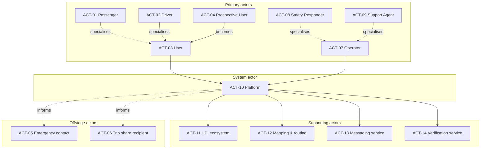
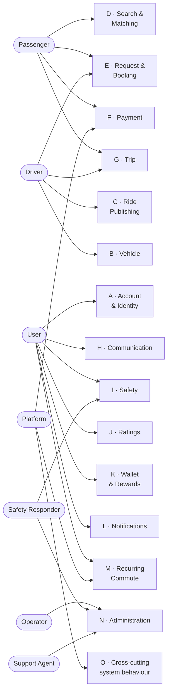
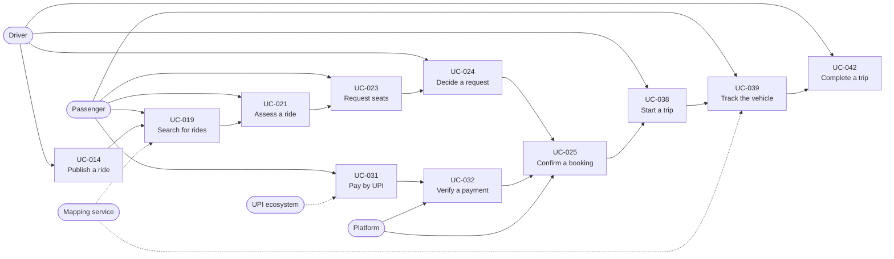
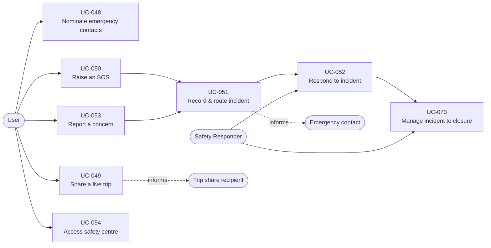
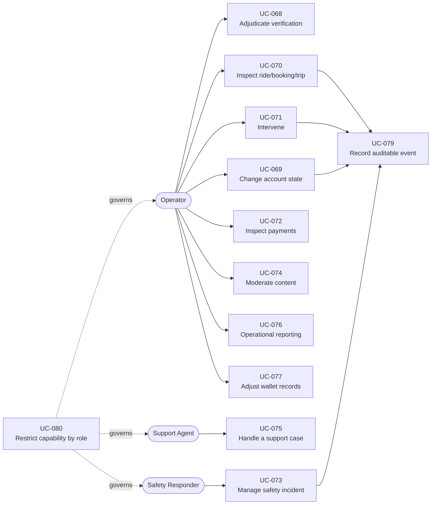
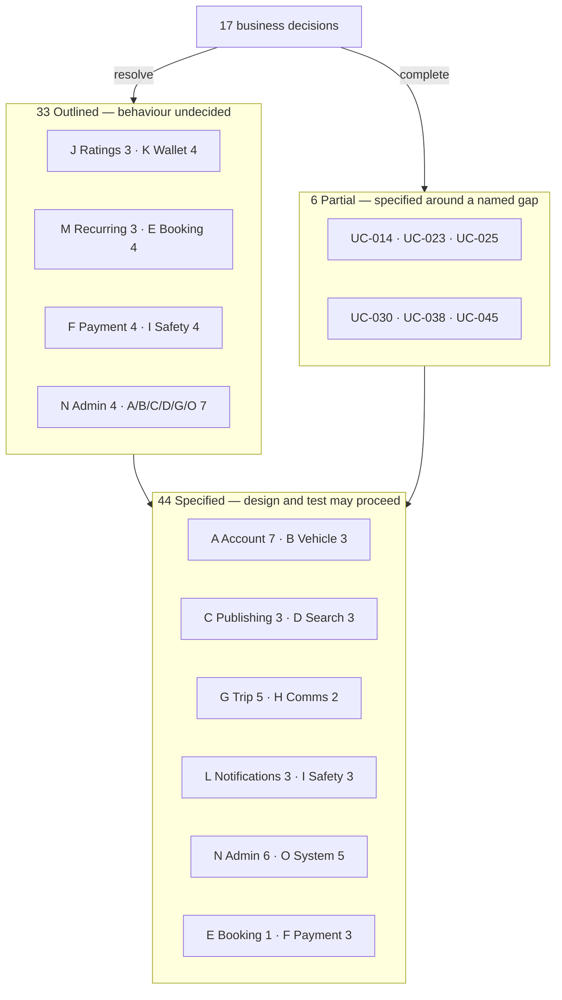
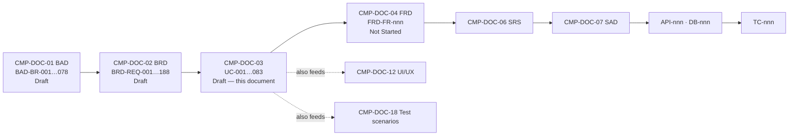

# Stakeholder & Use Case Specification
## Carpool Mobility Platform (CMP)

---

# 0. Document Control

## 0.1 Document Control Table

| Field | Value |
|---|---|
| Document ID | CMP-DOC-03 |
| Document Name | Stakeholder & Use Case Specification |
| Short Name | USECASE |
| Project Name | Carpool Mobility Platform |
| Project Code | CMP |
| Version | 0.1 |
| Status | Draft |
| Date | 2026-08-16 |
| Author | Business Analyst / Product Analyst (AI-assisted) |
| Reviewer | [TBD] |
| Approver | Project Owner |
| Classification | Internal |
| Brand | TBD |
| Previous Version | None (initial issue) |
| Predecessor Documents | CMP-DOC-01 (BAD) v0.1 — **Draft, not approved**; CMP-DOC-02 (BRD) v0.1 — **Draft, not approved** |
| Related Documents | `00_Project_Control/README.md`, `Documentation_Index.md`, `Documentation_Status.md`, `Document_Change_Log.md`, `Glossary.md`, `Master_Traceability_Matrix.md` |
| Successor Documents | CMP-DOC-04 (FRD) — Not Started |

## 0.2 Revision History

| Version | Date | Author | Change | Status |
|---|---|---|---|---|
| 0.1 | 2026-08-16 | Business Analyst / Product Analyst (AI-assisted) | Initial issue. Defines 14 actors and 83 use cases (`UC-001` … `UC-083`) across 15 packages, with 44 fully specified, 6 partially specified and 33 outlined pending business decisions. | Draft |

## 0.3 Distribution List

| Role | Purpose |
|---|---|
| Project Owner | Approval authority |
| Product Owner | Scope, prioritisation, flow decisions |
| Business Analyst | Authoring and maintenance |
| UI/UX Designer | **Primary consumer** — use cases drive journey and screen design (CMP-DOC-12) |
| QA Analyst | **Primary consumer** — flows become test scenarios (CMP-DOC-18) |
| Solution / Software Architect | Behaviour input to CMP-DOC-06 … CMP-DOC-09 |
| Backend & Mobile Developers | Behavioural reference |
| Trust & Safety | Review of the safety package |
| Security Analyst | Actor, authorisation and exception review |

## 0.4 Approval

| Role | Name | Signature | Date |
|---|---|---|---|
| Author | Business Analyst / Product Analyst (AI-assisted) | — | 2026-08-16 |
| Reviewer | [TBD] | — | — |
| Approver | Project Owner | — | — |

> **This document is NOT approved.** It is issued at version 0.1 with status `Draft`
> for Project Owner review.

## 0.5 Purpose of This Document

This specification defines **who interacts with the Carpool Mobility Platform, what each
of them is trying to achieve, and how the platform behaves in response**.

It converts the business requirements of CMP-DOC-02 into goal-oriented use cases that
can be:

- designed against (CMP-DOC-12 UI/UX);
- decomposed into functional requirements (CMP-DOC-04);
- turned into test scenarios (CMP-DOC-18);
- traced back to a business requirement and forward to a test case.

## 0.6 Scope and Boundary of This Document

**Contains:** actors and actor goals; stakeholder-to-use-case mapping; use case
conventions; the use case catalogue; use case diagrams; detailed use case
specifications with main, alternate and exception flows; cross-cutting system behaviour;
business rules invoked; traceability; assumptions; open questions; decisions required;
acceptance criteria; statistics.

**Excludes:**

| Excluded | Belongs to |
|---|---|
| Field-level validation, screen behaviour, functional decomposition | CMP-DOC-04 |
| Performance, availability and other quality attributes | CMP-DOC-05 |
| Architecture, components, deployment | CMP-DOC-07 … CMP-DOC-09 |
| API endpoints and payloads | CMP-DOC-10 |
| Database structures | CMP-DOC-11 |
| Wireframes, layout, visual design | CMP-DOC-12 |
| Security controls and threat model | CMP-DOC-13 |
| Test cases | CMP-DOC-18 |

## 0.7 Intended Audience

Product Owners · Business Stakeholders · Business Analysts · Solution Architects ·
Software Architects · Android Developers · Backend Developers · QA Engineers · UI/UX
Designers · Security Engineers · Technical Leads · Project Managers.

## 0.8 Basis of This Document — and Two Material Qualifications

### 0.8.1 Source

**FACT.** This document is derived from **CMP-DOC-01 v0.1** and **CMP-DOC-02 v0.1**, and
from no other source. No new evidence, research, legal advice or business decision
became available between CMP-DOC-02 and this document.

### 0.8.2 Qualification 1 — Both Predecessors Are Unapproved

> **WARNING.** CMP-DOC-01 and CMP-DOC-02 are both at status `Draft`. This document rests
> on an unapproved chain **two documents deep**.
>
> 1. Every use case inherits the confidence level of the requirements it realises.
> 2. If either predecessor changes in review, this document must be revised.
> 3. This document must not be baselined before both predecessors are approved.
>
> Recorded as `UC-RISK-001` and in `Document_Change_Log.md` conflict entry **CC-003**.

### 0.8.3 Qualification 2 — 42% of the Requirement Base Is Blocked

**FACT.** CMP-DOC-02 §20.2 records **79 of 188 business requirements blocked** by 17
unresolved business decisions.

A use case cannot be specified when the behaviour it describes has not been decided. The
author will **not invent a flow to fill the gap**. Instead this document uses three
specification tiers (§4.4):

| Tier | Meaning | Count |
|---|---|---|
| **Specified** | Complete: main, alternate and exception flows. | 44 |
| **Partial** | Specified except for named steps that a decision governs. The blocked step is marked in place. | 6 |
| **Outlined** | Scope, actors, trigger and outcome recorded. **Flows deliberately not written.** | 33 |

**The full landscape of 83 use cases is enumerated regardless of tier**, so that nothing
is lost and the true size of the system is visible. What is missing is behaviour that
nobody has yet decided — not analysis that has not been done.

> **RECOMMENDATION (carried from CMP-DOC-02 `BR-02`, `BR-03`).** Resolving just three
> decisions — `BAD-DEC-007`, `BAD-DEC-005`, `BAD-DEC-011` — would make **6 Outlined use
> cases specifiable, complete 3 Partial ones, and clear blocked steps from 6 more**:
> 15 use cases improved, including the whole booking journey. See §16.4.

## 0.9 Statement Classification Convention

As `README.md` §9.1. Markers used: **FACT**, **ASSUMPTION**, **BUSINESS DECISION
REQUIRED**, **TECHNICAL DECISION REQUIRED**, **OPEN QUESTION**, **TBD**, **FUTURE
CONSIDERATION**, **RECOMMENDATION**.

## 0.10 Identifier Conventions

| Prefix | Element | Section |
|---|---|---|
| `UC-nnn` | Use Case (**traceable**) | 5, 7 |
| `ACT-nn` | Actor | 2 |
| `UC-ASM-nnn` | Assumption | 12 |
| `UC-RISK-nnn` | Risk to specification | 13 |
| `UC-OQ-nnn` | Open Question | 14 |

Flow steps within a use case are numbered; alternate flows are `A1`, `A2`…; exception
flows are `E1`, `E2`… Identifiers are stable and are never renumbered without change
control.

> **ASSUMPTION (`UC-ASM-001`).** `README.md` §9.3 allocates `UC-` to this document.
> The auxiliary prefixes above follow the convention recorded as conflict **CC-001**,
> pending `BAD-DEC-024`. Only `UC-` participates in the traceability chain.

## 0.11 Table of Contents

| § | Section |
|---|---|
| 0 | Document Control |
| 1 | Executive Summary |
| 2 | Actors |
| 3 | Stakeholders and Their Goals |
| 4 | Use Case Conventions |
| 5 | Use Case Catalogue |
| 6 | Use Case Diagrams |
| 7 | Use Case Specifications |
| 8 | Cross-Cutting System Behaviour |
| 9 | Business Rules Invoked by Use Cases |
| 10 | Use Cases Withheld From Specification |
| 11 | Traceability |
| 12 | Assumptions |
| 13 | Risks to Specification |
| 14 | Open Questions |
| 15 | Business Decisions Required |
| 16 | Statistics & Readiness |
| 17 | Acceptance Criteria for This Document |
| 18 | Recommendations |
| A | Appendix A — Use Case Index |
| B | Appendix B — Actor / Goal Matrix |
| C | Appendix C — Terminology Reference |

---

# 1. Executive Summary

## 1.1 What This Document Delivers

| Element | Count |
|---|---|
| Actors defined | 14 |
| Use cases identified | **83** (`UC-001` … `UC-083`) |
| Use case packages | 15 |
| Fully specified | 44 |
| Partially specified | 6 |
| Outlined (blocked) | 33 |
| Business requirements realised | 184 of 188 |
| Requirements deliberately not realised by a use case | 4 (justified in §11.4) |

## 1.2 The Shape of the System

The 83 use cases divide into three very different bodies of work:

| Body | Use cases | Character |
|---|---|---|
| **The commute loop** — publish, search, request, book, pay, travel, complete | 31 | The product. Mostly specifiable today. |
| **Trust, safety and governance** | 23 | Where the platform earns the right to operate. Half is blocked. |
| **Operations and value** — admin, wallet, rewards, recurring | 29 | Where the business runs and retains. Heavily blocked. |

## 1.3 Readiness by Package

| Package | UCs | Specified | Partial | Outlined |
|---|---|---|---|---|
| A · Account & Identity | 9 | 7 | 0 | 2 |
| B · Vehicle | 4 | 3 | 0 | 1 |
| C · Ride Publishing | 5 | 3 | 1 | 1 |
| D · Search & Matching | 4 | 3 | 0 | 1 |
| E · Request & Booking | 7 | 1 | 2 | 4 |
| F · Payment & Settlement | 8 | 3 | 1 | 4 |
| G · Trip Execution | 7 | 5 | 1 | 1 |
| H · Communication | 3 | 2 | 1 | 0 |
| I · Safety | 7 | 3 | 0 | 4 |
| J · Ratings & Reviews | 3 | 0 | 0 | 3 |
| K · Wallet & Rewards | 4 | 0 | 0 | 4 |
| L · Notifications | 3 | 3 | 0 | 0 |
| M · Recurring Commute | 3 | 0 | 0 | 3 |
| N · Administration | 10 | 6 | 0 | 4 |
| O · Cross-Cutting System | 6 | 5 | 0 | 1 |
| **Total** | **83** | **44** | **6** | **33** |

## 1.4 The Three Findings That Matter

**1 — The core journey is specifiable, but its middle is not.**
A passenger can search (`UC-019`–`UC-021`, all Specified) and can travel (`UC-038`–`UC-044`,
five of seven Specified). What sits between them — requesting, being accepted, holding a
seat, and paying at the right moment (`UC-023`–`UC-028`) — is almost entirely governed by
`BAD-DEC-007` and `BAD-DEC-009`. **The system's narrow waist is its least decided part.**

**2 — Safety splits cleanly into "can build" and "must not build yet".**
Recording, routing and auditing a safety incident (`UC-051`) is Specified. Raising an SOS
(`UC-050`) and responding to one (`UC-052`) are Outlined, because `BAD-DEC-011` does not
exist. This is the same split CMP-DOC-02 `BR-05` recommends for delivery: build the
infrastructure, withhold the control.

**3 — Three packages have no specifiable behaviour at all.**
Ratings & Reviews, Wallet & Rewards, and Recurring Commute — 10 use cases — are entirely
Outlined. No screen can be designed and no test written for any of them today.

## 1.5 What a Reader Can Do With This Document Today

| Reader | Can act on |
|---|---|
| UI/UX Designer | 44 specified use cases — enough to design the search, publish, trip and notification journeys end to end. |
| QA Analyst | 44 specified use cases with explicit exception flows — enough to begin the test strategy for the unblocked half. |
| Architect | All 83 — the outlined ones still declare actors, triggers and data touched, which is sufficient for architectural shaping. |
| Product Owner | §16.4 — the decision-to-use-case leverage table. |

---

# 2. Actors

## 2.1 Actor Definition Convention

| Class | Meaning |
|---|---|
| **Primary** | Initiates a use case to achieve a goal of their own. |
| **Supporting** | Provides a service the platform relies on to complete a use case. |
| **Offstage** | Has an interest in the outcome but does not interact directly. |
| **System** | The platform acting on its own initiative (scheduled, triggered or automatic). |

## 2.2 Actor Register

| ID | Actor | Class | Description | Source |
|---|---|---|---|---|
| `ACT-01` | **Passenger** | Primary | A registered user seeking a seat on another user's journey. | `BAD-SH-004`, `BAD-PER-001`, `003`, `004` |
| `ACT-02` | **Driver** | Primary | A registered user offering spare seats on a journey they are already making. | `BAD-SH-005`, `BAD-PER-002`, `005` |
| `ACT-03` | **User** | Primary (generalisation) | Any registered account holder. Passenger and Driver both specialise User; a single account may hold both roles. | `BRD-REQ-013` |
| `ACT-04` | **Prospective User** | Primary | A person who has installed the application but does not yet hold an account. | `BRD-REQ-001` |
| `ACT-05` | **Emergency Contact** | Offstage | A person nominated by a User to be informed in a safety event. Does not hold an account. | `BAD-SH-006` |
| `ACT-06` | **Trip Share Recipient** | Offstage | A person given visibility of a live trip. May or may not be an Emergency Contact. | `BRD-REQ-117` |
| `ACT-07` | **Operator** | Primary | Platform staff working in the Filament back office: verification, ride/booking oversight, payment inspection. | `BAD-SH-007`, `BAD-PER-006` |
| `ACT-08` | **Safety Responder** | Primary | Trust & Safety staff handling safety incidents. A specialisation of Operator with distinct authority. | `BAD-SH-009`, `BAD-PER-007` |
| `ACT-09` | **Support Agent** | Primary | Staff handling support cases and disputes. A specialisation of Operator. | `BAD-SH-008` |
| `ACT-10` | **Platform (System)** | System | The platform acting without human initiation: verifying payments, generating rides, issuing notifications, enforcing authority. | `BRD-REQ-176`, `178` |
| `ACT-11` | **UPI Payment Ecosystem** | Supporting | The external payment rail and provider through which payment is initiated and verified. | `BRD-INT-004`, `005`; `BAD-SH-012` |
| `ACT-12` | **Mapping & Routing Service** | Supporting | Supplies places, routes and geometry for publishing, matching and tracking. | `BRD-INT-001`; `BAD-SH-013` |
| `ACT-13` | **Messaging Service** | Supporting | Delivers push notifications, and the channel used to verify phone control. | `BRD-INT-003`, `007` |
| `ACT-14` | **Verification Service** | Supporting | The external means by which identity or vehicle evidence is checked. **Not yet selected** (`BAD-DEP-005`). | `BRD-INT-008` |

## 2.3 Actor Model

## 2.4 Actor Notes of Consequence

| # | Note |
|---|---|
| AN-1 | **Passenger and Driver are roles, not accounts.** One person may be both, on the same day (`BRD-REQ-013`, `UC-008`). Use cases are written against the role in play, not the person. |
| AN-2 | **Emergency Contact and Trip Share Recipient are offstage and unauthenticated.** They receive information without holding an account, which makes what they may see a privacy decision — `BAD-DEC-022`, and why `UC-049` is Outlined. |
| AN-3 | **Safety Responder is separated from Operator deliberately.** CMP-DOC-01 `BAD-SH-009` gives Trust & Safety distinct authority; CMP-DOC-02 `BRD-REQ-175` requires role-restricted capability. |
| AN-4 | **The Platform is a first-class actor.** Eleven use cases have no human initiator: payment verification, ride generation, notification, audit, authority enforcement. Omitting it would leave the system's most important behaviour unowned. |
| AN-5 | **`ACT-14` does not exist yet.** No verification provider has been selected, which is why every use case depending on it is Outlined. |

---

# 3. Stakeholders and Their Goals

Stakeholders and their interests are established in CMP-DOC-01 §11 and elaborated as
stakeholder requirements in CMP-DOC-02 §4. This section maps them to use cases so that
**every stakeholder requirement is visibly realised by named behaviour**.

## 3.1 Stakeholder Requirement → Use Case Realisation

| Stakeholder requirement | Realised by | Realisation status |
|---|---|---|
| `BRD-SR-001` Find rides that fit my journey | `UC-019`, `UC-020` | **Specified** |
| `BRD-SR-002` Know who I would travel with | `UC-007`, `UC-021` | **Specified** |
| `BRD-SR-003` Know the cost before requesting | `UC-030` | Partial — `BAD-DEC-003` |
| `BRD-SR-004` Secure my seat with certainty | `UC-023`, `UC-025` | Partial — `BAD-DEC-007` |
| `BRD-SR-005` Pay without cash or chasing | `UC-031`, `UC-032` | **Specified** |
| `BRD-SR-006` Know where the driver is | `UC-039`, `UC-040` | **Specified** |
| `BRD-SR-007` Reach my driver | `UC-045` | Partial — `BAD-DEC-022` |
| `BRD-SR-008` Let someone I trust see where I am | `UC-049` | Outlined — `BAD-DEC-022` |
| `BRD-SR-009` Signal an emergency and be answered | `UC-050`, `UC-052` | **Outlined — `BAD-DEC-011`** |
| `BRD-SR-010` Recourse and a record | `UC-055`, `UC-073`, `UC-075` | Mixed |
| `BRD-SR-011` The same arrangement tomorrow | `UC-065`–`UC-067` | Outlined — `BAD-DEC-008` |
| `BRD-SR-012` Offer seats in seconds | `UC-014` | Partial — `BAD-DEC-003` |
| `BRD-SR-013` Passengers on my route | `UC-019`, `UC-020` | **Specified** |
| `BRD-SR-014` Know who is getting in my vehicle | `UC-024` | Outlined — `BAD-DEC-007` |
| `BRD-SR-015` Control who I accept | `UC-024` | Outlined — `BAD-DEC-007` |
| `BRD-SR-016` Money arrives without asking | `UC-036` | Outlined — `BAD-DEC-004` |
| `BRD-SR-017` Know what I have earned | `UC-037` | Outlined — `BAD-DEC-004` |
| `BRD-SR-018` Protection from no-shows | `UC-028` | Outlined — `BAD-DEC-009` |
| `BRD-SR-019` Republish my commute effortlessly | `UC-065`–`UC-067` | Outlined — `BAD-DEC-008` |
| `BRD-SR-020` Understand what I may do | `UC-083` | **Specified** |
| `BRD-SR-021` Follow a journey shared with me | `UC-049` | Outlined — `BAD-DEC-022` |
| `BRD-SR-022` Be told when my person raises an alarm | `UC-050`, `UC-052` | Outlined — `BAD-DEC-011` |
| `BRD-SR-023` Verify users and vehicles via a queue | `UC-068` | Outlined — `BAD-DEC-005` |
| `BRD-SR-024` Find any record and its history | `UC-070`, `UC-072` | **Specified** |
| `BRD-SR-025` Change a user's access | `UC-069` | Outlined — `BAD-DEC-006` |
| `BRD-SR-026` Evidence to resolve a case | `UC-075` | **Specified** |
| `BRD-SR-027` My own actions recorded | `UC-079` | **Specified** |
| `BRD-SR-028` See the full picture on an alarm | `UC-051`, `UC-052` | Mixed |
| `BRD-SR-029` A protocol to execute, and a record | `UC-052`, `UC-073` | Mixed |
| `BRD-SR-030` Act on the accounts involved | `UC-069` | Outlined — `BAD-DEC-006` |
| `BRD-SR-031` Everything recorded and reportable | `UC-079`, `UC-076` | **Specified** |
| `BRD-SR-032` Operate within a legal position | — | **No use case.** A business obligation, not a system interaction. See §11.4. |

## 3.2 Stakeholder Coverage Result

| Measure | Result |
|---|---|
| Stakeholder requirements realised by at least one use case | **31 of 32** |
| Realised by fully specified use cases | 12 |
| Realised only by Partial or Outlined use cases | 19 |
| Not realisable as a use case (justified) | 1 (`BRD-SR-032`) |

> **The most consequential line in this table is `BRD-SR-009`** — *"signal an emergency
> and be answered"*. It is realised only by Outlined use cases. Until `BAD-DEC-011`
> exists, the platform cannot specify what answering an emergency means.

---

# 4. Use Case Conventions

## 4.1 Use Case Template

Each specified use case carries:

| Field | Meaning |
|---|---|
| ID / Name | `UC-nnn` and a goal-oriented name |
| Package | The functional grouping (A–O) |
| Level | User goal, subfunction, or summary |
| Primary actor | Who initiates and owns the goal |
| Supporting actors | Who the platform relies on |
| Trigger | What starts it |
| Preconditions | What must already be true |
| Success guarantee | What is true if it succeeds |
| Minimal guarantee | What is true even if it fails |
| Priority / Release | Inherited from CMP-DOC-02 |
| Requirements | `BRD-REQ` realised |
| Rules | `BAD-RULE` enforced |
| Main success scenario | Numbered steps |
| Alternate flows | `A1`, `A2` … — other ways to succeed |
| Exception flows | `E1`, `E2` … — ways it fails, and what happens |

## 4.2 Use Case Levels

| Level | Meaning | Example |
|---|---|---|
| **User goal** | A goal a primary actor can complete in one sitting. Most use cases. | `UC-019` Search for rides |
| **Subfunction** | A step reused by several user goals. | `UC-032` Verify payment |
| **Summary** | A goal spanning several sittings. | `UC-065` Define a recurring schedule |

## 4.3 Writing Rules

1. Steps state **actor intent and platform response**, never UI mechanics.
2. The platform is named as the actor for every decision it owns — a consequence of
   `BAD-RULE-002` (backend is the business authority).
3. Exception flows are mandatory where money, seats or safety are involved.
4. No step describes behaviour governed by an unresolved decision. Where such a step
   would fall, the flow stops and the blocker is named in place.

## 4.4 Specification Status

| Status | Meaning | Consumer effect |
|---|---|---|
| **Specified** | Main, alternate and exception flows complete. | Design and test can proceed. |
| **Partial** | Complete except for named steps a decision governs; the blocked step is marked `[BLOCKED — BAD-DEC-nnn]` in the flow. | Design may proceed around the gap; the gap must not be filled by assumption. |
| **Outlined** | Header, trigger, actors and outcome recorded. **Flows deliberately not written.** | Do not design or test. Awaiting decision. |

> **Why Outlined use cases are included at all.** Omitting them would understate the
> system by 40% and hide work from planning. Including them with invented flows would be
> worse — it would present guesses as requirements. Recording scope without behaviour is
> the honest middle.

## 4.5 Priority and Release

Inherited from CMP-DOC-02 §0.10.3–4: **M/S/C/W** and **R1/R2/R3**. A use case takes the
highest priority and earliest release among the requirements it realises. Release
allocation remains provisional pending `BAD-DEC-020`.

---

# 5. Use Case Catalogue

## 5.1 Catalogue

| UC | Name | Package | Primary actor | Pri | Rel | Status |
|---|---|---|---|---|---|---|
| `UC-001` | Register an account | A | Prospective User | M | R1 | Specified |
| `UC-002` | Verify phone number | A | Prospective User | M | R1 | Specified |
| `UC-003` | Log in | A | User | M | R1 | Specified |
| `UC-004` | Log out | A | User | M | R1 | Specified |
| `UC-005` | Create and maintain profile | A | User | M | R1 | Specified |
| `UC-006` | Submit identity verification evidence | A | User | M | R1 | **Outlined — `BAD-DEC-005`** |
| `UC-007` | View a counterparty's verification standing | A | User | M | R1 | Specified |
| `UC-008` | Act as a driver | A | User | S | R1 | Specified |
| `UC-009` | Close an account | A | User | M | R1 | **Outlined — `BAD-DEC-021`** |
| `UC-010` | Register a vehicle | B | Driver | M | R1 | Specified |
| `UC-011` | Amend vehicle details | B | Driver | S | R1 | Specified |
| `UC-012` | Remove a vehicle | B | Driver | S | R1 | Specified |
| `UC-013` | Submit vehicle verification evidence | B | Driver | M | R1 | **Outlined — `BAD-DEC-005`** |
| `UC-014` | Publish a ride | C | Driver | M | R1 | **Partial — `BAD-DEC-003`** |
| `UC-015` | Declare ride travel preferences | C | Driver | M | R1 | Specified |
| `UC-016` | Withdraw a published ride | C | Driver | M | R1 | Specified |
| `UC-017` | Amend a published ride | C | Driver | S | R1 | **Outlined — `BAD-DEC-017`** |
| `UC-018` | View my published rides | C | Driver | S | R1 | Specified |
| `UC-019` | Search for rides | D | Passenger | M | R1 | Specified |
| `UC-020` | Understand why a ride matched | D | Passenger | M | R1 | Specified |
| `UC-021` | Assess a ride before committing | D | Passenger | M | R1 | Specified |
| `UC-022` | Handle an empty search result | D | Passenger | S | R1 | **Outlined — `BAD-OQ-007`** |
| `UC-023` | Request seats on a ride | E | Passenger | M | R1 | **Partial — `BAD-DEC-007`** |
| `UC-024` | Decide a ride request | E | Driver | M | R1 | **Outlined — `BAD-DEC-007`** |
| `UC-025` | Confirm a booking | E | Platform | M | R1 | **Partial — `BAD-DEC-007`** |
| `UC-026` | Cancel a booking | E | Passenger | M | R1 | **Outlined — `BAD-DEC-009`** |
| `UC-027` | Cancel a published ride with bookings | E | Driver | M | R1 | **Outlined — `BAD-DEC-009`** |
| `UC-028` | Handle a no-show | E | Driver | M | R1 | **Outlined — `BAD-DEC-009`** |
| `UC-029` | View my bookings | E | Passenger | S | R1 | Specified |
| `UC-030` | View the amount payable | F | Passenger | M | R1 | **Partial — `BAD-DEC-003`** |
| `UC-031` | Pay for a booking by UPI | F | Passenger | M | R1 | Specified |
| `UC-032` | Verify a payment | F | Platform | M | R1 | Specified |
| `UC-033` | Reconcile an indeterminate payment | F | Operator | M | R1 | Specified |
| `UC-034` | Refund a passenger | F | Platform | M | R1 | **Outlined — `BAD-DEC-010`** |
| `UC-035` | Record driver earnings | F | Platform | M | R1 | **Outlined — `BAD-DEC-003`** |
| `UC-036` | Settle funds to a driver | F | Platform | M | R1 | **Outlined — `BAD-DEC-004`** |
| `UC-037` | View my earnings | F | Driver | M | R1 | **Outlined — `BAD-DEC-004`** |
| `UC-038` | Start a trip | G | Driver | M | R1 | **Partial — `BAD-DEC-015`** |
| `UC-039` | Track the vehicle during a trip | G | Passenger | M | R1 | Specified |
| `UC-040` | View ETA and remaining distance | G | User | M | R1 | Specified |
| `UC-041` | Progress trip state | G | Driver | M | R1 | **Outlined — `BAD-DEC-015`** |
| `UC-042` | Complete a trip | G | Driver | M | R1 | Specified |
| `UC-043` | View trip history | G | User | S | R1 | Specified |
| `UC-044` | Travel on a multi-passenger trip | G | Passenger | M | R1 | Specified |
| `UC-045` | Message a co-traveller | H | User | M | R1 | **Partial — `BAD-DEC-022`** |
| `UC-046` | Read messages while offline | H | User | S | R1 | Specified |
| `UC-047` | Be alerted to a new message | H | User | M | R1 | Specified |
| `UC-048` | Nominate emergency contacts | I | User | M | R1 | Specified |
| `UC-049` | Share a live trip | I | User | M | R1 | **Outlined — `BAD-DEC-022`** |
| `UC-050` | Raise an SOS | I | User | M | R1 | **Outlined — `BAD-DEC-011`** |
| `UC-051` | Record and route a safety incident | I | Platform | M | R1 | Specified |
| `UC-052` | Respond to a safety incident | I | Safety Responder | M | R1 | **Outlined — `BAD-DEC-011`** |
| `UC-053` | Report a non-emergency safety concern | I | User | M | R1 | **Outlined — `BAD-DEC-016`** |
| `UC-054` | Access the safety centre | I | User | M | R1 | Specified |
| `UC-055` | Rate a co-traveller | J | User | M | R1 | **Outlined — `BAD-DEC-012`** |
| `UC-056` | Submit a review | J | User | S | R1 | **Outlined — `BAD-DEC-012`** |
| `UC-057` | View a user's reputation | J | User | M | R1 | **Outlined — `BAD-DEC-012`** |
| `UC-058` | View wallet balance and history | K | User | M | R2 | **Outlined — `BAD-DEC-013`** |
| `UC-059` | Earn points | K | Platform | M | R2 | **Outlined — `BAD-DEC-013`** |
| `UC-060` | Redeem points | K | User | M | R2 | **Outlined — `BAD-DEC-013`** |
| `UC-061` | Apply a coupon | K | Passenger | S | R2 | **Outlined — `BAD-DEC-013`** |
| `UC-062` | Receive an event notification | L | User | M | R1 | Specified |
| `UC-063` | Review notification history | L | User | S | R1 | Specified |
| `UC-064` | Manage notification preferences | L | User | S | R2 | Specified |
| `UC-065` | Define a recurring commute schedule | M | User | M | R2 | **Outlined — `BAD-DEC-008`** |
| `UC-066` | Activate, pause or remove a schedule | M | User | M | R2 | **Outlined — `BAD-DEC-008`** |
| `UC-067` | Generate rides from a schedule | M | Platform | M | R2 | **Outlined — `BAD-DEC-008`** |
| `UC-068` | Adjudicate a verification submission | N | Operator | M | R1 | **Outlined — `BAD-DEC-005`** |
| `UC-069` | Change a user's account state | N | Operator | M | R1 | **Outlined — `BAD-DEC-006`** |
| `UC-070` | Inspect a ride, booking or trip | N | Operator | M | R1 | Specified |
| `UC-071` | Intervene in a booking or trip | N | Operator | M | R1 | Specified |
| `UC-072` | Inspect payments and settlements | N | Operator | M | R1 | Specified |
| `UC-073` | Manage a safety incident to closure | N | Safety Responder | M | R1 | Specified |
| `UC-074` | Moderate reported content | N | Operator | M | R1 | **Outlined — `BAD-DEC-016`** |
| `UC-075` | Handle a support case | N | Support Agent | M | R1 | Specified |
| `UC-076` | Produce operational reporting | N | Operator | S | R2 | Specified |
| `UC-077` | Adjust wallet or reward records | N | Operator | M | R2 | **Outlined — `BAD-DEC-013`** |
| `UC-078` | Enforce backend authority over shared state | O | Platform | M | R1 | Specified |
| `UC-079` | Record an auditable event | O | Platform | M | R1 | Specified |
| `UC-080` | Restrict capability by role | O | Platform | M | R1 | Specified |
| `UC-081` | Degrade gracefully when an external service fails | O | Platform | M | R1 | Specified |
| `UC-082` | Apply data retention | O | Platform | M | R1 | **Outlined — `BAD-DEC-021`** |
| `UC-083` | View the rules of participation | O | User | M | R1 | Specified |

---

# 6. Use Case Diagrams

> Mermaid has no native UML use-case notation. These diagrams use the convention:
> **actor → use case** edges, use cases grouped by package. Dashed edges denote
> supporting-actor participation.

## 6.1 System Context — Actors and Packages

## 6.2 The Commute Loop — Core Use Cases

## 6.3 Safety Package

## 6.4 Administration Package

## 6.5 Specification Readiness

---

# 7. Use Case Specifications

## 7.A Package A — Account & Identity

### `UC-001` — Register an account

| Field | Value |
|---|---|
| Package / Level | A · User goal |
| Primary actor | `ACT-04` Prospective User |
| Supporting actors | `ACT-13` Messaging Service |
| Trigger | The person wants to participate in the platform. |
| Preconditions | The person does not hold an account. |
| Success guarantee | An account exists, uniquely identified, with phone control verified. |
| Minimal guarantee | No partial account is left usable; the person can retry. |
| Priority / Release | M / R1 |
| Requirements | `BRD-REQ-001`, `002`, `007` |
| Rules | `BAD-RULE-004`, `005` |
| Status | **Specified** |

**Main success scenario**

1. The Prospective User requests to register.
2. The platform requests the identifying details required to create an account.
3. The Prospective User supplies them, including a phone number.
4. The platform validates that the details are well formed and that the phone number is
   not already registered to an active account.
5. The platform creates the account in an unverified state and uniquely identifies it.
6. The platform invokes `UC-002` to verify control of the phone number.
7. On success, the platform marks the account usable and records the registration event
   (`UC-079`).
8. The platform admits the User to the application.

**Alternate flows**

- **A1 — Phone already registered.** At step 4, the platform informs the person that the
  number is in use and offers the login path (`UC-003`) instead. The use case ends.
- **A2 — Registration abandoned before verification.** The account remains unverified and
  unusable. The person may restart registration with the same number.

**Exception flows**

- **E1 — Details invalid.** The platform states which details are unacceptable and
  returns to step 3.
- **E2 — Phone verification fails or is abandoned.** See `UC-002` E1/E2. The account
  remains unverified and unusable; **no participation is permitted** (`BAD-RULE-005`).
- **E3 — Messaging service unavailable.** The platform applies `UC-081`, informs the
  person that verification cannot be completed now, and preserves the entered details for
  retry.

---

### `UC-002` — Verify phone number

| Field | Value |
|---|---|
| Package / Level | A · Subfunction |
| Primary actor | `ACT-04` Prospective User / `ACT-03` User |
| Supporting actors | `ACT-13` Messaging Service |
| Trigger | Registration, or a change of registered phone number. |
| Preconditions | A phone number has been supplied. |
| Success guarantee | The platform records that the user controls the number. |
| Minimal guarantee | No unverified number is ever recorded as verified. |
| Priority / Release | M / R1 |
| Requirements | `BRD-REQ-007`, `BRD-INT-007` |
| Rules | `BAD-RULE-005`, `006` |
| Status | **Specified** |

**Main success scenario**

1. The platform initiates verification of the supplied number through the messaging
   service.
2. The user demonstrates control of the number by the means the channel provides.
3. The platform confirms the demonstration.
4. The platform records phone-verified status as authoritative backend state
   (`BAD-RULE-006`) and records the event (`UC-079`).

**Alternate flows**

- **A1 — Re-verification requested.** The user asks for another attempt; the platform
  re-initiates within whatever limits it applies. Limits are
  `[TBD – Technical Decision Required]`, routed to CMP-DOC-13.

**Exception flows**

- **E1 — Demonstration incorrect.** The platform rejects the attempt and permits retry
  within its limits.
- **E2 — Attempt limit reached.** The platform stops accepting attempts for the number.
  The applicable limit and cool-off are `[TBD – Technical Decision Required]`.
- **E3 — Channel unavailable.** `UC-081` applies; verification is deferred and the
  account remains unverified.

---

### `UC-003` — Log in

| Field | Value |
|---|---|
| Package / Level | A · User goal |
| Primary actor | `ACT-03` User |
| Trigger | The user wants access to their account. |
| Preconditions | An account exists and its state permits participation. |
| Success guarantee | The user holds an authenticated session. |
| Minimal guarantee | No session is granted on failed authentication. |
| Priority / Release | M / R1 |
| Requirements | `BRD-REQ-003` |
| Rules | `BAD-RULE-004`, `011` |
| Status | **Specified** |

**Main success scenario**

1. The User requests access.
2. The platform authenticates the User.
3. The platform confirms that the account state permits participation.
4. The platform establishes an authenticated session and records the event (`UC-079`).

**Alternate flows**

- **A1 — Existing valid session.** The platform admits the User without re-authenticating.

**Exception flows**

- **E1 — Authentication fails.** The platform refuses access without disclosing which
  element was wrong, and permits retry within its limits.
- **E2 — Account state does not permit participation.** The platform refuses access and
  states that the account is restricted. **What the User is told, and any appeal path, is
  `[BLOCKED — BAD-DEC-006`, `BAD-DEC-016]`.**
- **E3 — Account not phone-verified.** The platform routes the User to `UC-002`.

---

### `UC-004` — Log out

| Field | Value |
|---|---|
| Package / Level | A · User goal |
| Primary actor | `ACT-03` User |
| Trigger | The user wants to end their session. |
| Preconditions | An authenticated session exists. |
| Success guarantee | The session is terminated and cannot be reused. |
| Minimal guarantee | The session is terminated locally even if the platform is unreachable. |
| Priority / Release | M / R1 |
| Requirements | `BRD-REQ-004` |
| Status | **Specified** |

**Main success scenario**

1. The User requests to end the session.
2. The platform invalidates the session and records the event (`UC-079`).
3. The application returns to its unauthenticated state and clears cached
   business data held for presentation (`BRD-REQ-177`).

**Exception flows**

- **E1 — Platform unreachable.** The application clears local session state and cached
  data regardless, and the platform invalidates the session when next contacted.

---

### `UC-005` — Create and maintain profile

| Field | Value |
|---|---|
| Package / Level | A · User goal |
| Primary actor | `ACT-03` User |
| Trigger | The user wants to establish or update how they appear to counterparties. |
| Preconditions | Authenticated session. |
| Success guarantee | The profile is stored and reflected wherever it is displayed. |
| Minimal guarantee | A rejected change leaves the previous profile intact. |
| Priority / Release | M / R1 |
| Requirements | `BRD-REQ-005`, `006` |
| Status | **Specified** |

**Main success scenario**

1. The User opens their profile.
2. The platform presents the current profile and indicates which elements are visible to
   counterparties.
3. The User amends one or more elements.
4. The platform validates and stores the change, and records the event (`UC-079`).
5. The change takes effect wherever the profile is displayed.

**Alternate flows**

- **A1 — Change of phone number.** The platform invokes `UC-002` before the new number
  takes effect.

**Exception flows**

- **E1 — Change rejected.** The platform states the reason and retains the prior profile.

> **Note.** Step 2 depends on `BRD-REQ-006`, which is blocked by `BAD-DEC-022`. The use
> case is specified because the *behaviour* — show the user what is visible — is settled;
> only the **content of that list** awaits the privacy decision.

---

### `UC-006` — Submit identity verification evidence

| Field | Value |
|---|---|
| Package / Level | A · User goal |
| Primary actor | `ACT-03` User |
| Supporting actors | `ACT-14` Verification Service, `ACT-07` Operator |
| Trigger | The user wants to raise their verification standing. |
| Preconditions | Authenticated session. |
| Outcome sought | The platform records an assessed verification level for the user. |
| Requirements | `BRD-REQ-008`, `009`, `BRD-INT-008` |
| Status | **Outlined — `BAD-DEC-005`** |

**Why this use case is not specified.** `BAD-DEC-005` has not defined what verification
levels exist, what evidence each requires, what each permits, or whether assessment is
automatic, operator-led or both. No supporting service has been selected
(`BAD-DEP-005`). Every step of the flow — what is submitted, who assesses it, what the
outcome means — is a direct consequence of that decision.

**What is known:** the actor, the trigger, that assessment is backend-authoritative
(`BAD-RULE-006`), that the result is displayed to counterparties (`UC-007`), and that an
operator queue exists (`UC-068`).

---

### `UC-007` — View a counterparty's verification standing

| Field | Value |
|---|---|
| Package / Level | A · Subfunction |
| Primary actor | `ACT-03` User |
| Trigger | The user is deciding whether to travel with, or accept, another user. |
| Preconditions | Authenticated session; a counterparty is in view. |
| Success guarantee | The user sees the counterparty's verification standing as held by the platform. |
| Minimal guarantee | No verification standing is ever displayed that the platform does not hold. |
| Priority / Release | M / R1 |
| Requirements | `BRD-REQ-010`, `011`, `BRD-REQ-075` context |
| Rules | `BAD-RULE-006`, `007` — **absolute** |
| Status | **Specified** |

**Main success scenario**

1. The User views a counterparty in a search result, request, booking or trip.
2. The platform retrieves the counterparty's verification standing from authoritative
   backend state.
3. The platform displays the standing before the User is asked to commit.

**Exception flows**

- **E1 — Standing unavailable.** The platform displays *unknown* rather than *unverified*
  or *verified*, and does not present the counterparty as verified. Committing while
  standing is unknown is governed by `BAD-DEC-005`.
- **E2 — A client-supplied verification value is presented.** The platform rejects it
  (`UC-078`). This exception exists to make `BAD-RULE-006` testable.

> **The displayed vocabulary of standings is `[BLOCKED — BAD-DEC-005]`.** The behaviour —
> retrieve from backend, display before commitment, never infer — is specified.

---

### `UC-008` — Act as a driver

| Field | Value |
|---|---|
| Package / Level | A · User goal |
| Primary actor | `ACT-03` User |
| Trigger | A user who has been a passenger wants to offer seats. |
| Preconditions | Authenticated session. |
| Success guarantee | The user holds the driver role and may reach driver capabilities. |
| Minimal guarantee | Role is never assumed by the client; the platform grants it. |
| Priority / Release | S / R1 |
| Requirements | `BRD-REQ-012`, `013` |
| Status | **Specified** |

**Main success scenario**

1. The User elects to offer seats.
2. The platform confirms the user's eligibility for the driver role.
3. The platform grants the driver role to the account and records the event (`UC-079`).
4. Driver capabilities become reachable, beginning with `UC-010` if no vehicle exists.

**Exception flows**

- **E1 — Eligibility not met.** The platform states what is outstanding — typically
  verification (`UC-006`) or a vehicle (`UC-010`). **The eligibility criteria themselves
  are `[BLOCKED — BAD-DEC-005]`.**

---

### `UC-009` — Close an account

| Field | Value |
|---|---|
| Package / Level | A · User goal |
| Primary actor | `ACT-03` User |
| Trigger | The user no longer wishes to participate. |
| Outcome sought | The account ceases to participate and the user's data is treated as the business has decided. |
| Requirements | `BRD-REQ-184`, `BRD-DATA-026` |
| Status | **Outlined — `BAD-DEC-021`** |

**Why this use case is not specified.** The treatment of a closing user's data is
undecided: what is erased, what is retained as evidence for trips other people
participated in, what happens to an in-flight booking or an unsettled balance, and
whether closure is reversible. CMP-DOC-01 `DM-7` records that nothing in the domain model
represents closure at all.

**What is known:** the actor, the trigger, and that retention is backend-governed
(`BRD-REQ-183`). **This is a gap the business must close before launch, not merely a
deferred feature.**

## 7.B Package B — Vehicle

### `UC-010` — Register a vehicle

| Field | Value |
|---|---|
| Package / Level | B · User goal |
| Primary actor | `ACT-02` Driver |
| Trigger | The driver intends to publish rides. |
| Preconditions | Authenticated session; driver role held. |
| Success guarantee | A vehicle is recorded against the driver and available for association with rides. |
| Minimal guarantee | An incomplete registration creates no usable vehicle. |
| Priority / Release | M / R1 |
| Requirements | `BRD-REQ-016`, `017`, `023` |
| Rules | `BAD-RULE-012`, `017` |
| Status | **Specified** |

**Main success scenario**

1. The Driver requests to add a vehicle.
2. The platform requests the vehicle attributes a passenger needs in order to identify
   and assess the vehicle.
3. The Driver supplies them.
4. The platform validates the attributes and records the vehicle against the driver.
5. The platform records the event (`UC-079`) and makes the vehicle selectable when
   publishing (`UC-014`).

**Alternate flows**

- **A1 — Additional vehicle.** A driver may register more than one vehicle; each is
  independently selectable.

**Exception flows**

- **E1 — Attributes invalid or incomplete.** The platform states what is unacceptable and
  returns to step 3.
- **E2 — Vehicle already registered to another account.** The platform refuses and routes
  the matter to operator review (`UC-070`). **Whether duplicate registration is permitted
  at all is `[BLOCKED — BAD-DEC-005]`.**

> **The lawful passenger capacity recorded at step 3 is `[BLOCKED — BAD-DEC-005]`** —
> `BRD-REQ-023` is blocked because the *source* of capacity (self-declared or evidenced)
> is a verification-policy question. Capacity nonetheless constrains `UC-014` step 4.

---

### `UC-011` — Amend vehicle details

| Field | Value |
|---|---|
| Package / Level | B · User goal |
| Primary actor | `ACT-02` Driver |
| Trigger | The recorded details are wrong or have changed. |
| Preconditions | The vehicle is registered to the driver. |
| Success guarantee | The amended details are reflected wherever the vehicle is shown. |
| Minimal guarantee | A rejected amendment leaves the prior record intact. |
| Priority / Release | S / R1 |
| Requirements | `BRD-REQ-018`, `020`, `025` |
| Rules | `BAD-RULE-013`, `015` |
| Status | **Specified** |

**Main success scenario**

1. The Driver selects a registered vehicle and amends its details.
2. The platform determines whether the vehicle is associated with an active ride, booking
   or trip.
3. Where it is not, the platform validates and stores the amendment and records the event.
4. The amended details are shown wherever that vehicle appears (`BAD-RULE-013`).

**Alternate flows**

- **A1 — Non-disqualifying amendment while in use.** Where an amendment does not
  invalidate any commitment already made, the platform accepts it and the change is
  reflected on the associated ride.

**Exception flows**

- **E1 — Disqualifying amendment while in use.** The platform refuses, names the active
  commitments, and offers the driver the cancellation path (`UC-027`). Which amendments
  are disqualifying follows from capacity (`UC-010`) and verification standing.

---

### `UC-012` — Remove a vehicle

| Field | Value |
|---|---|
| Package / Level | B · User goal |
| Primary actor | `ACT-02` Driver |
| Trigger | The driver no longer uses the vehicle on the platform. |
| Preconditions | The vehicle is registered to the driver. |
| Success guarantee | The vehicle is no longer selectable for new rides. |
| Minimal guarantee | Historical records referencing the vehicle remain intact (`BRD-DATA-022`). |
| Priority / Release | S / R1 |
| Requirements | `BRD-REQ-019`, `020` |
| Rules | `BAD-RULE-015` |
| Status | **Specified** |

**Main success scenario**

1. The Driver requests removal of a vehicle.
2. The platform confirms the vehicle is not associated with an active ride, booking or
   trip.
3. The platform withdraws the vehicle from selection and records the event (`UC-079`).
4. Completed trips continue to show the vehicle as it was at the time of travel.

**Exception flows**

- **E1 — Vehicle in active use.** The platform refuses removal and names the active
  commitments (`BAD-RULE-015`).

---

### `UC-013` — Submit vehicle verification evidence

| Field | Value |
|---|---|
| Package / Level | B · User goal |
| Primary actor | `ACT-02` Driver |
| Supporting actors | `ACT-14` Verification Service, `ACT-07` Operator |
| Trigger | The driver wants the vehicle verified, or verification is required to publish. |
| Outcome sought | The platform records an assessed verification standing for the vehicle. |
| Requirements | `BRD-REQ-021`, `022` |
| Status | **Outlined — `BAD-DEC-005`** |

**Why this use case is not specified.** As `UC-006`: the evidence accepted, the assessor,
and the meaning of the outcome are all consequences of the undecided verification policy.
`BRD-REQ-022` — whether an unverified vehicle may be used to publish at all — is the
question that determines whether this use case sits on the critical path of `UC-014` or
beside it.

## 7.C Package C — Ride Publishing

### `UC-014` — Publish a ride

| Field | Value |
|---|---|
| Package / Level | C · User goal |
| Primary actor | `ACT-02` Driver |
| Supporting actors | `ACT-12` Mapping & Routing Service |
| Trigger | The driver intends to travel a route with spare seats. |
| Preconditions | Authenticated session; driver role; at least one registered vehicle. |
| Success guarantee | A discoverable ride exists with seats available and a stated fare. |
| Minimal guarantee | A refused publication creates no partially discoverable ride. |
| Priority / Release | M / R1 |
| Requirements | `BRD-REQ-026`, `027`, `028`, `029`, `030`, `031`, `034`, `035`, `036` |
| Rules | `BAD-RULE-016`, `017`, `018`, `019` |
| Status | **Partial — `BAD-DEC-003`** |

**Main success scenario**

1. The Driver requests to publish a ride.
2. The Driver states the origin and destination.
3. The platform resolves the route between them via the mapping service and records it
   as the route against which passenger segments will be overlapped.
4. The Driver states the date and departure time.
5. The platform confirms the departure time is not in the past (`BAD-RULE-019`).
6. The Driver selects one of their registered vehicles.
7. The Driver states the number of seats offered.
8. The platform confirms the number does not exceed the recorded lawful capacity of that
   vehicle (`BAD-RULE-017`).
9. **[BLOCKED — `BAD-DEC-003`]** The fare for the ride is established. Whether the Driver
   states it, the platform computes it, or the Driver states it within a platform
   constraint is undecided. *No flow is written for this step.*
10. The Driver declares travel preferences (`UC-015`).
11. The platform validates the Driver's eligibility to publish.
12. The platform records the ride, makes it discoverable to compatible searches
    (`UC-019`), and records the event (`UC-079`).

**Alternate flows**

- **A1 — Publish from a previous ride.** The Driver starts from a ride they have
  published before; the platform pre-fills steps 2–8 and 10, and the Driver confirms or
  amends. Steps 5, 8 and 11 are re-evaluated in full.
- **A2 — Publish from a recurring schedule.** See `UC-067` (Outlined).

**Exception flows**

- **E1 — Route cannot be resolved.** The platform states that the journey could not be
  understood and returns to step 2. Where the mapping service is unavailable, `UC-081`
  applies and publication is deferred rather than published without a route.
- **E2 — Departure time in the past.** The platform refuses and returns to step 4.
- **E3 — Seats exceed vehicle capacity.** The platform refuses, states the recorded
  capacity, and returns to step 7.
- **E4 — Driver not eligible to publish.** The platform refuses and states the reason.
  **The eligibility criteria — in particular whether an unverified driver or unverified
  vehicle may publish — are `[BLOCKED — BAD-DEC-005]`** (`BRD-REQ-022`).
- **E5 — No registered vehicle.** The platform routes the Driver to `UC-010`.

> **Effect of the blockage.** Steps 1–8 and 10–12 are specifiable and testable today.
> Step 9 is the commercial heart of the ride and cannot be written. A design may
> therefore be produced for the whole publishing journey **except** the fare interaction,
> which must be left open. See `UC-030`, which has the same blocker on the passenger side.

---

### `UC-015` — Declare ride travel preferences

| Field | Value |
|---|---|
| Package / Level | C · Subfunction |
| Primary actor | `ACT-02` Driver |
| Trigger | Invoked from `UC-014`, or amended later via `UC-017`. |
| Preconditions | A ride is being published or exists. |
| Success guarantee | The declared preferences are recorded and shown to passengers before they commit. |
| Minimal guarantee | Undeclared preferences are shown as undeclared, never as permissive or restrictive. |
| Priority / Release | M / R1 |
| Requirements | `BRD-REQ-032`, `033` |
| Rules | `BAD-RULE-021` |
| Status | **Specified** |

**Main success scenario**

1. The platform presents the preference set: air conditioning, smoking, music, luggage,
   pets.
2. The Driver declares a position on each.
3. The platform records the declarations against the ride.
4. The platform displays them in search results (`UC-019`) and on the ride detail
   (`UC-021`) before any commitment is sought.

**Alternate flows**

- **A1 — Partial declaration.** The Driver declares some and not others. Undeclared
  preferences are displayed as undeclared.

> **`UC-ASM-002` — preferences are declarative, not enforced.** Inherited from
> `BRD-ASM-008` and CMP-DOC-01 `BAD-OQ-011`. The platform states them; it does not police
> them during the trip. If the business intends enforcement, this use case and `UC-053`
> both change.

---

### `UC-016` — Withdraw a published ride

| Field | Value |
|---|---|
| Package / Level | C · User goal |
| Primary actor | `ACT-02` Driver |
| Trigger | The driver will not make the journey, and no seat has yet been booked. |
| Preconditions | The ride is published and has no confirmed booking. |
| Success guarantee | The ride is no longer discoverable; the record is retained. |
| Minimal guarantee | A ride with confirmed bookings is never silently withdrawn. |
| Priority / Release | M / R1 |
| Requirements | `BRD-REQ-037`, `067` |
| Status | **Specified** |

**Main success scenario**

1. The Driver requests withdrawal of a published ride.
2. The platform confirms that no booking has been confirmed against it.
3. The platform removes the ride from discovery, records the withdrawal with its reason,
   and records the event (`UC-079`).
4. Any pending ride requests are closed and their requesters informed (`UC-062`).

**Exception flows**

- **E1 — Confirmed bookings exist.** The platform refuses withdrawal through this use
  case and routes the Driver to `UC-027`, which is **Outlined pending `BAD-DEC-009`**.
  Until that decision exists, **a driver with confirmed bookings has no specified way to
  cancel.** This is a gap in the MVP journey, recorded as `UC-OQ-003`.

---

### `UC-017` — Amend a published ride

| Field | Value |
|---|---|
| Package / Level | C · User goal |
| Primary actor | `ACT-02` Driver |
| Trigger | A detail of the journey changes after publication. |
| Outcome sought | The ride reflects reality without invalidating commitments unfairly. |
| Requirements | `BRD-REQ-038` |
| Status | **Outlined — `BAD-DEC-017`** |

**Why this use case is not specified.** `BAD-RULE-020` records that whether a driver may
amend a ride after bookings exist, and which fields may change, is undecided. The
question is not cosmetic: amending departure time or origin after a passenger has paid
changes what that passenger bought.

**What is known:** the actor, the trigger, that amendment before any booking is
uncontroversial, and that any post-booking amendment interacts with cancellation and
refund rules (`BAD-DEC-009`, `BAD-DEC-010`).

---

### `UC-018` — View my published rides

| Field | Value |
|---|---|
| Package / Level | C · User goal |
| Primary actor | `ACT-02` Driver |
| Trigger | The driver wants to see what they have offered and its status. |
| Preconditions | Authenticated session; driver role. |
| Success guarantee | The driver sees their rides with authoritative seat and booking status. |
| Minimal guarantee | Cached data is never presented as current authoritative status. |
| Priority / Release | S / R1 |
| Requirements | `BRD-REQ-036`, `063`, `176` |
| Status | **Specified** |

**Main success scenario**

1. The Driver opens their published rides.
2. The platform returns the rides with, for each, its date, time, route, seats offered,
   seats booked and current status — all from authoritative backend state.
3. The Driver may open any ride to see its requests and bookings.

**Alternate flows**

- **A1 — Offline.** The application may display previously retrieved rides, marked as
  cached and not current (`BRD-REQ-177`). Seat and booking counts are **not** presented
  as authoritative.

**Exception flows**

- **E1 — Platform unreachable.** `UC-081` applies; the Driver is told the status shown is
  not current.

## 7.D Package D — Search & Matching

### `UC-019` — Search for rides

| Field | Value |
|---|---|
| Package / Level | D · User goal |
| Primary actor | `ACT-01` Passenger |
| Supporting actors | `ACT-12` Mapping & Routing Service |
| Trigger | The passenger needs to travel. |
| Preconditions | Authenticated session. |
| Success guarantee | The passenger receives compatible rides, ranked, with the information needed to choose. |
| Minimal guarantee | An incompatible ride is never presented as bookable. |
| Priority / Release | M / R1 |
| Requirements | `BRD-REQ-039`–`051` |
| Rules | `BAD-RULE-022`, `024`, `025` |
| Status | **Specified** |
| **Note** | **The platform's differentiating use case** (`BAD-OPP-001`). |

**Main success scenario**

1. The Passenger states origin, destination, date and the number of seats required.
2. The platform resolves the requested travel segment via the mapping service.
3. The platform identifies published rides that are candidates for that date.
4. For each candidate the platform assesses, and requires all of:
   a. that the ride's route overlaps the requested segment (`BRD-REQ-040`), **including
      where the segment is only part of the ride's route** (`BRD-REQ-041`);
   b. pickup compatibility (`BRD-REQ-042`);
   c. drop compatibility (`BRD-REQ-043`);
   d. compatible direction of travel (`BRD-REQ-044`);
   e. compatible timing (`BRD-REQ-045`);
   f. sufficient available seats (`BRD-REQ-051`).
5. The platform ranks the compatible rides on a basis it can explain (`UC-020`).
6. The platform presents each result with its overlap, fare, departure time, available
   seats, driver and vehicle information, verification indicators and declared
   preferences.
7. The Passenger may open any result (`UC-021`).

**Alternate flows**

- **A1 — Fewer seats available than requested.** The ride is excluded from bookable
  results (`BAD-RULE-027` consequence). Whether it is shown as unavailable rather than
  hidden is a design question for CMP-DOC-12.
- **A2 — Search repeated.** Results are re-evaluated in full; seat availability is never
  served from a cached count (`BAD-RULE-026`).

**Exception flows**

- **E1 — Origin or destination cannot be resolved.** The platform states that the
  location was not understood and returns to step 1.
- **E2 — No compatible ride.** `UC-022` applies — **Outlined pending `BAD-OQ-007`**.
- **E3 — Mapping service unavailable.** `UC-081` applies. The platform states that search
  is unavailable rather than returning an unmatched or unranked result set.

> **Not specified here, deliberately:** the overlap calculation and any minimum overlap
> threshold. CMP-DOC-01 `BAD-RULE-023` records these as a `TECHNICAL DECISION REQUIRED`,
> routed to CMP-DOC-07 / CMP-DOC-09. Step 4a states the obligation without constraining
> the algorithm.

---

### `UC-020` — Understand why a ride matched

| Field | Value |
|---|---|
| Package / Level | D · Subfunction |
| Primary actor | `ACT-01` Passenger |
| Trigger | The passenger is comparing results. |
| Preconditions | A search has returned results. |
| Success guarantee | The passenger can see the degree of route overlap and the basis of the ranking. |
| Minimal guarantee | No match is presented as better than the platform's own assessment. |
| Priority / Release | M / R1 |
| Requirements | `BRD-REQ-046`, `047` |
| Rules | `BAD-RULE-024` |
| Status | **Specified** |

**Main success scenario**

1. The platform presents, for each result, the degree to which the ride's route overlaps
   the requested segment.
2. The platform presents the pickup and drop relationship in terms the Passenger can act
   on.
3. The Passenger uses this to compare results.

> **Why this is a separate use case.** `BAD-RULE-024` requires the ranking to be
> explainable. Explainability is the difference between a passenger trusting the match
> and re-checking it manually — and it is the visible surface of the platform's
> differentiator.

---

### `UC-021` — Assess a ride before committing

| Field | Value |
|---|---|
| Package / Level | D · User goal |
| Primary actor | `ACT-01` Passenger |
| Trigger | The passenger is considering a specific ride. |
| Preconditions | The ride appears in the passenger's results. |
| Success guarantee | The passenger has the driver, vehicle, verification, fare, timing, seat and preference information needed to make a trust decision. |
| Minimal guarantee | No commitment is sought before that information is presented. |
| Priority / Release | M / R1 |
| Requirements | `BRD-REQ-048`, `049`, `050`, `053` |
| Rules | `BAD-RULE-007`, `013`, `025` — **absolute** |
| Status | **Specified** |

**Main success scenario**

1. The Passenger opens a ride from their results.
2. The platform presents the driver information and verification standing (`UC-007`).
3. The platform presents the vehicle information as recorded against the ride
   (`BAD-RULE-013`).
4. The platform presents the fare, departure time and available seats.
5. The platform presents the declared travel preferences.
6. The platform presents the reputation information available for the driver
   (`UC-057` — **Outlined**; until `BAD-DEC-012`, no reputation is available and the
   trust decision rests on verification alone).
7. The Passenger may proceed to `UC-023`.

**Exception flows**

- **E1 — Seats taken while viewing.** On proceeding, the platform re-checks availability
  (`UC-023` step 2) and informs the Passenger if the ride is no longer bookable.
- **E2 — Ride withdrawn while viewing.** The platform informs the Passenger and returns
  them to results.

> **`[BLOCKED — BAD-DEC-022]`** governs the *precision* of location shown at step 4 —
> specifically how exactly a pickup point may be disclosed before a booking exists
> (`BRD-REQ-053`). The obligation to limit it is specified; the boundary is not.
>
> **Step 6 is where the absence of `BAD-DEC-012` is felt by the user.** Early passengers
> will make trust decisions without reputation data, which is exactly the exposure
> CMP-DOC-02 §5.10 flags for persona `BAD-PER-003`.

---

### `UC-022` — Handle an empty search result

| Field | Value |
|---|---|
| Package / Level | D · Subfunction |
| Primary actor | `ACT-01` Passenger |
| Trigger | A search returns no compatible ride. |
| Outcome sought | The passenger understands the outcome and knows what they may do next. |
| Requirements | `BRD-REQ-052` |
| Status | **Outlined — `BAD-OQ-007`** |

**Why this use case is not specified.** Whether an empty result offers alternatives —
nearby times, nearby pickup points, a notification when a ride appears, or nothing at all
— has not been decided. Each option implies materially different behaviour and different
downstream requirements.

**Why it matters more than it looks.** CMP-DOC-01 `BAD-RISK-002` identifies corridor
liquidity as a severity-9 risk, and `BAD-KPI-003` measures the zero-result rate. **In
early operation this will be the most frequently executed path in the product.** Leaving
it unspecified leaves the platform's most common passenger experience undesigned.

## 7.E Package E — Request & Booking

> **This package is the narrow waist of the system and its least decided part.** Six of
> seven use cases are governed by `BAD-DEC-007` or `BAD-DEC-009`.

### `UC-023` — Request seats on a ride

| Field | Value |
|---|---|
| Package / Level | E · User goal |
| Primary actor | `ACT-01` Passenger |
| Trigger | The passenger has chosen a ride. |
| Preconditions | Authenticated session; the ride is bookable. |
| Success guarantee | A ride request exists against the ride and both parties know its state. |
| Minimal guarantee | No seat is consumed by a request that does not succeed. |
| Priority / Release | M / R1 |
| Requirements | `BRD-REQ-054`, `055`, `056`, `057`, `058`, `061` |
| Rules | `BAD-RULE-026`, `029`, `030` |
| Status | **Partial — `BAD-DEC-007`** |

**Main success scenario**

1. The Passenger requests a stated number of seats on the ride.
2. The platform re-confirms, under its own authority, that the seats are available
   (`BAD-RULE-026`).
3. The platform records the ride request and presents the requesting Passenger's
   verification standing and reputation to the Driver (`BRD-REQ-057`).
4. **[BLOCKED — `BAD-DEC-007`]** Whether the request requires the Driver's acceptance, or
   proceeds automatically, is undecided. *No flow is written.* Where acceptance is
   required, `UC-024` follows.
5. **[BLOCKED — `BAD-DEC-007`]** Whether the requested seats are held pending payment,
   and for how long, is undecided. *No flow is written.*
6. The platform informs both parties of the request's state (`UC-062`).
7. On the path to confirmation, `UC-030` and `UC-031` follow.

**Alternate flows**

- **A1 — Multiple seats for other travellers.** Whether a passenger may book for others,
  and how those others are identified, is **`[BLOCKED — BAD-OQ-024 / UC-OQ-005]`**. This
  matters for safety: the platform would otherwise carry travellers it cannot identify.

**Exception flows**

- **E1 — Seats no longer available at step 2.** The platform declines the request, states
  why, and returns the Passenger to results. No seat is consumed.
- **E2 — Concurrent requests for the last seat.** The platform's authority over seat
  count (`UC-078`) ensures at most one request can proceed to a confirmed booking
  (`BAD-RULE-027`). This exception exists to make that rule testable.
- **E3 — Passenger not eligible to request.** The platform refuses and states the reason.
  Eligibility criteria are **`[BLOCKED — BAD-DEC-005]`**.

---

### `UC-024` — Decide a ride request

| Field | Value |
|---|---|
| Package / Level | E · User goal |
| Primary actor | `ACT-02` Driver |
| Trigger | A passenger has requested seats on the driver's ride. |
| Outcome sought | The request is accepted or declined and both parties know. |
| Requirements | `BRD-REQ-058`, `059`, `060` |
| Status | **Outlined — `BAD-DEC-007`** |

**Why this use case is not specified.** `BAD-DEC-007` has not established whether driver
acceptance is required at all, whether it is required only in some circumstances, whether
verified peers bypass it, how long a driver has to decide, or what happens on
non-response. Writing a flow would be writing the decision.

**What is known:** the actor, the trigger, that the Driver sees the requester's
verification standing and reputation (`BRD-REQ-057`, Specified), that both parties are
informed of the outcome (`BRD-REQ-063`, Specified), and that the platform — not the
Driver's device — records the outcome (`BAD-RULE-028`).

**Stakeholder consequence.** `BRD-SR-014` and `BRD-SR-015` — *"know who is getting into
my vehicle"* and *"control who I accept"* — are realised **only** by this use case. Until
`BAD-DEC-007` is taken, the driver's control over their own vehicle is unspecified.

---

### `UC-025` — Confirm a booking

| Field | Value |
|---|---|
| Package / Level | E · Subfunction |
| Primary actor | `ACT-10` Platform |
| Trigger | A ride request has satisfied every condition for confirmation. |
| Preconditions | Seats available; payment verified (`UC-032`). |
| Success guarantee | A booking exists with seats allocated, and both parties are informed. |
| Minimal guarantee | **No booking is ever confirmed without verified payment and available seats.** |
| Priority / Release | M / R1 |
| Requirements | `BRD-REQ-064`, `065`, `066`, `063` |
| Rules | `BAD-RULE-026`, `027`, `028` — **absolute** |
| Status | **Partial — `BAD-DEC-007`** |

**Main success scenario**

1. The platform establishes that the request is eligible for confirmation.
2. **[BLOCKED — `BAD-DEC-007`]** Whether confirmation occurs before or after payment
   depends on when payment is taken. *No ordering is written.*
3. The platform confirms, under its own authority alone, that seats remain available.
4. The platform confirms that payment status is verified (`UC-032`).
5. The platform allocates the seats, ensuring total confirmed seats never exceed seats
   offered (`BAD-RULE-027`).
6. The platform records the booking as confirmed and records the event (`UC-079`).
7. The platform informs the Passenger and the Driver (`UC-062`).

**Exception flows**

- **E1 — Seats no longer available.** The platform does not confirm; it informs the
  Passenger and initiates the return of any value taken (`UC-034` — **Outlined pending
  `BAD-DEC-010`**). **Until that decision exists, the platform can take money it cannot
  specify how to return.** Recorded as `UC-RISK-002`.
- **E2 — Payment not verified.** The platform does not confirm and does not allocate
  seats (`BAD-RULE-028`). Any held seats are released.
- **E3 — A client asserts a confirmed booking.** The platform rejects the assertion
  (`UC-078`). This exception exists to make `BAD-RULE-028` testable.

> **This use case carries three absolute rules and is the single most integrity-critical
> flow in the product.** Steps 3, 4 and 5 must not be relaxed under any delivery
> pressure.

---

### `UC-026` — Cancel a booking

| Field | Value |
|---|---|
| Package / Level | E · User goal |
| Primary actor | `ACT-01` Passenger |
| Trigger | The passenger will not travel. |
| Outcome sought | Seats are released, the record shows who cancelled and why, and any financial consequence is applied. |
| Requirements | `BRD-REQ-067`, `068`, `070` |
| Status | **Outlined — `BAD-DEC-009`** |

**Why this use case is not specified.** Cancellation windows, penalties, who may cancel
and when, and the financial consequence are entirely undecided (`BAD-RULE-040`). The
mechanical part — release the seats, record the reason — is settled
(`BRD-REQ-067`, `070`, both Ready); the *consequence* is not, and a cancellation flow
without its consequence would mislead both parties.

---

### `UC-027` — Cancel a published ride with bookings

| Field | Value |
|---|---|
| Package / Level | E · User goal |
| Primary actor | `ACT-02` Driver |
| Trigger | The driver will not make a journey on which passengers have confirmed bookings. |
| Outcome sought | Affected passengers are informed and made whole under the business's rules. |
| Requirements | `BRD-REQ-067`, `068`, `070` |
| Status | **Outlined — `BAD-DEC-009`** |

**Why this use case is not specified.** As `UC-026`, plus CMP-DOC-01 `BAD-OQ-010` — what
happens to a confirmed booking when the driver cancels — is explicitly open.

> **This is the most serious specification gap in the MVP journey.** A driver whose
> circumstances change has, today, **no specified path** to cancel a ride carrying
> confirmed bookings (see `UC-016` E1). Whatever `BAD-DEC-009` decides, this path must
> exist before real passengers rely on the platform. Recorded as `UC-OQ-003`.

---

### `UC-028` — Handle a no-show

| Field | Value |
|---|---|
| Package / Level | E · User goal |
| Primary actor | `ACT-02` Driver (or `ACT-01` Passenger) |
| Trigger | A party to a confirmed booking does not attend. |
| Outcome sought | The trip proceeds or is closed appropriately, and the consequence falls where the business has decided. |
| Requirements | `BRD-REQ-069` |
| Status | **Outlined — `BAD-DEC-009`** |

**Why this use case is not specified.** Whether a trip may start without a booked
passenger (`BAD-OQ-022`), how long a driver must wait, and what consequence attaches to
either party are undecided.

**Why it matters.** CMP-DOC-01 `BAD-RISK-017` scores no-shows at 6 and identifies them as
eroding trust on **both** sides — `DP-06` for drivers and the reliability the Routine
Commuter persona depends on.

---

### `UC-029` — View my bookings

| Field | Value |
|---|---|
| Package / Level | E · User goal |
| Primary actor | `ACT-01` Passenger |
| Trigger | The passenger wants to see what they have booked. |
| Preconditions | Authenticated session. |
| Success guarantee | The passenger sees their bookings with authoritative status. |
| Minimal guarantee | Cached bookings are never presented as current authoritative status. |
| Priority / Release | S / R1 |
| Requirements | `BRD-REQ-063`, `176`, `177` |
| Status | **Specified** |

**Main success scenario**

1. The Passenger opens their bookings.
2. The platform returns each booking with its ride, seats, status, payment status and
   associated trip, from authoritative backend state.
3. The Passenger may open any booking to reach its ride, trip, chat or payment.

**Alternate flows**

- **A1 — Offline.** Previously retrieved bookings may be shown, marked as cached
  (`BRD-REQ-177`). Booking and payment status are **not** presented as authoritative.

**Exception flows**

- **E1 — Platform unreachable.** `UC-081` applies.

## 7.F Package F — Payment & Settlement

### `UC-030` — View the amount payable

| Field | Value |
|---|---|
| Package / Level | F · Subfunction |
| Primary actor | `ACT-01` Passenger |
| Trigger | The passenger is about to pay for a booking. |
| Preconditions | A ride request exists and is eligible to proceed to payment. |
| Success guarantee | The passenger knows the total payable before any payment is initiated. |
| Minimal guarantee | **No payment is ever initiated for an amount the passenger has not been shown.** |
| Priority / Release | M / R1 |
| Requirements | `BRD-REQ-071`, `072`, `074` |
| Rules | `BAD-RULE-034` — **absolute** |
| Status | **Partial — `BAD-DEC-003`** |

**Main success scenario**

1. The platform calculates the amount payable **under its own authority**, never
   accepting an amount asserted by a client (`BAD-RULE-034`).
2. **[BLOCKED — `BAD-DEC-003`]** The composition of the amount — the fare basis, whether
   it is per seat or per booking, and whether a platform fee is included or added — is
   undecided. *No composition is written.*
3. The platform presents the total payable to the Passenger.
4. The Passenger proceeds to `UC-031`, or abandons.

**Exception flows**

- **E1 — A client asserts an amount.** The platform rejects it (`UC-078`).
- **E2 — Amount changes between display and payment.** The platform does not proceed on
  the stale amount; it re-presents and requires the Passenger to see the new total.

> Step 1 and step 3 are absolute and testable today. Step 2 is the whole commercial
> model and awaits both `BAD-DEC-003` and, upstream of it, `BAD-DEC-001`.

---

### `UC-031` — Pay for a booking by UPI

| Field | Value |
|---|---|
| Package / Level | F · User goal |
| Primary actor | `ACT-01` Passenger |
| Supporting actors | `ACT-11` UPI Payment Ecosystem |
| Trigger | The passenger has seen the amount payable and elects to pay. |
| Preconditions | An amount payable has been established and presented. |
| Success guarantee | A payment attempt has been made and its outcome submitted for verification. |
| Minimal guarantee | **The platform never treats the passenger's device or the UPI application as evidence that payment succeeded.** |
| Priority / Release | M / R1 |
| Requirements | `BRD-REQ-075`, `076`, `077`, `080`, `BRD-INT-004` |
| Rules | `BAD-RULE-032` — **absolute** |
| Status | **Specified** |

**Main success scenario**

1. The Passenger elects to pay.
2. The platform initiates a payment for the established amount through the UPI ecosystem.
3. The Passenger authorises the payment in their chosen UPI application.
4. Control returns to the platform's application, which may carry a response from the UPI
   application.
5. **The platform disregards that response as evidence** and invokes `UC-032` to
   determine the outcome independently (`BAD-RULE-032`).
6. The platform records the payment attempt and its verified outcome (`BRD-REQ-080`).
7. The platform informs the Passenger of the verified outcome, not the reported one.

**Alternate flows**

- **A1 — Passenger abandons in the UPI application.** The platform still invokes `UC-032`,
  because an abandoned interaction may nonetheless have moved money.
- **A2 — Control does not return to the application.** The platform still invokes
  `UC-032` on its own initiative. **The outcome must never depend on the passenger
  returning to the app.**

**Exception flows**

- **E1 — Payment declined.** `UC-032` establishes failure; no booking is confirmed;
  the Passenger may retry.
- **E2 — Outcome indeterminate.** `UC-032` establishes pending; `UC-033` follows. The
  Passenger is told the payment is being confirmed and is **not** told it succeeded.
- **E3 — A client reports success for a payment the platform cannot verify.** The
  platform rejects the claim (`UC-078`) and treats the payment as unverified.
- **E4 — UPI ecosystem unavailable.** `UC-081` applies; the platform does not create a
  payment it cannot verify.

> **Steps 5 and A2 are the whole point of this use case.** They encode `BAD-RULE-032`,
> the rule whose violation CMP-DOC-01 `BAD-RISK-007` identifies as direct financial loss
> exposure.

---

### `UC-032` — Verify a payment

| Field | Value |
|---|---|
| Package / Level | F · Subfunction |
| Primary actor | `ACT-10` Platform |
| Supporting actors | `ACT-11` UPI Payment Ecosystem |
| Trigger | A payment has been initiated, abandoned, or has an unresolved outcome. |
| Preconditions | A payment attempt exists. |
| Success guarantee | The payment carries a status the platform itself established: verified, failed or pending. |
| Minimal guarantee | **A payment is never marked verified on any evidence other than the platform's own.** |
| Priority / Release | M / R1 |
| Requirements | `BRD-REQ-078`, `079`, `080`, `086`, `BRD-INT-005` |
| Rules | `BAD-RULE-033`, `037` — **absolute** |
| Status | **Specified** |

**Main success scenario**

1. The platform independently establishes the outcome of the payment attempt with the
   payment ecosystem.
2. Where the outcome is success, the platform sets payment status to verified.
3. The platform records a ledger entry for the movement of value, attributable to the
   payer, the booking and the event (`BRD-REQ-086`).
4. The platform records the verification event (`UC-079`) and releases the booking to
   `UC-025`.

**Alternate flows**

- **A1 — Verification retried.** Where the outcome cannot be established immediately, the
  platform re-attempts on its own initiative without any user action.

**Exception flows**

- **E1 — Outcome is failure.** Status is set to failed; no ledger entry for a receipt is
  created; no booking is confirmed; any held seats are released.
- **E2 — Outcome cannot be established.** Status is set to **pending**, and the payment
  is routed to reconciliation (`UC-033`). It is **neither** confirmed **nor** failed.
- **E3 — Payment ecosystem unreachable.** The payment remains pending; `UC-081` applies;
  the platform does not resolve the payment by assumption in either direction.

> **`BAD-RULE-033` in one sentence:** only this use case may set payment status. No other
> use case, and no client, may do so.

---

### `UC-033` — Reconcile an indeterminate payment

| Field | Value |
|---|---|
| Package / Level | F · User goal |
| Primary actor | `ACT-07` Operator |
| Supporting actors | `ACT-11` UPI Payment Ecosystem |
| Trigger | A payment has remained pending beyond the platform's own resolution attempts. |
| Preconditions | A payment in pending status exists in the reconciliation queue. |
| Success guarantee | The payment reaches a determinate status and the ledger reflects reality. |
| Minimal guarantee | No pending payment is silently abandoned; the queue is the record. |
| Priority / Release | M / R1 |
| Requirements | `BRD-REQ-079`, `164`, `BRD-RPT-010` |
| Rules | `BAD-RULE-033`, `037` |
| Status | **Specified** |

**Main success scenario**

1. The platform presents pending payments to the Operator as a managed queue.
2. The Operator selects a payment and reviews its full history.
3. The Operator establishes the true outcome with the payment ecosystem.
4. The Operator records the determination.
5. The platform applies the determination to payment status, creates or corrects the
   ledger entry, and records the operator action (`UC-079`, `BRD-REQ-174`).
6. Where the outcome is success and the booking is still valid, `UC-025` follows; where
   the booking is no longer valid, `UC-034` follows — **Outlined pending `BAD-DEC-010`**.

**Exception flows**

- **E1 — Outcome still cannot be established.** The payment remains in the queue with the
  investigation recorded. It is never closed by assumption.
- **E2 — Money moved but the booking has lapsed.** The passenger is owed a return of
  value. **The return itself is `[BLOCKED — BAD-DEC-010]`.**

> **`BRD-KPI` note.** `BAD-KPI-015` measures the rate at which this use case is needed.
> CMP-DOC-01 records that it should trend to zero; a persistent queue indicates a defect
> in `UC-032`, not a staffing problem.

---

### `UC-034` — Refund a passenger

| Field | Value |
|---|---|
| Package / Level | F · Subfunction |
| Primary actor | `ACT-10` Platform |
| Trigger | A passenger is entitled to the return of value. |
| Outcome sought | Value returns to the passenger and the ledger reflects it. |
| Requirements | `BRD-REQ-081`, `082` |
| Status | **Outlined — `BAD-DEC-010`** |

**Why this use case is not specified.** Refund entitlement, calculation and timing are
undecided (`BAD-RULE-038`).

> **This is the most consequential Outlined use case in the payment package.** `UC-025`
> E1 and `UC-033` E2 both terminate here. The platform can therefore reach a state in
> which it holds a passenger's money with **no specified means of returning it**.
> Recorded as `UC-RISK-002`; the author recommends this decision be taken alongside
> `BAD-DEC-007`, not after it.

---

### `UC-035` — Record driver earnings

| Field | Value |
|---|---|
| Package / Level | F · Subfunction |
| Primary actor | `ACT-10` Platform |
| Trigger | A booking completes and value is attributable to a driver. |
| Outcome sought | The driver's entitlement is recorded in the ledger. |
| Requirements | `BRD-REQ-083`, `086` |
| Status | **Outlined — `BAD-DEC-003`** |

**Why this use case is not specified.** The amount attributable to a driver cannot be
computed until the fare model and any platform fee are decided.

**What is known:** whatever the amount, it produces a durable attributable ledger entry
(`BRD-REQ-086`, Specified via `UC-032` step 3).

---

### `UC-036` — Settle funds to a driver

| Field | Value |
|---|---|
| Package / Level | F · User goal |
| Primary actor | `ACT-10` Platform |
| Supporting actors | `ACT-11` UPI Payment Ecosystem |
| Trigger | Funds are due to a driver under the business's settlement model. |
| Outcome sought | The driver receives the funds due without having to ask. |
| Requirements | `BRD-REQ-084`, `BRD-INT-006` |
| Status | **Outlined — `BAD-DEC-004`** |

**Why this use case is not specified.** How and when drivers are paid — per trip, on a
cycle, on request, through what mechanism — is undecided (`BAD-RULE-036`), and no
provider has been selected (`BAD-DEP-004`).

**Stakeholder consequence.** `BRD-SR-016` — *"the money arrives without me asking"* — is
realised only here. Driver persona `BAD-PER-002` cites chasing payment (`DP-05`) as a
reason drivers stop offering seats.

---

### `UC-037` — View my earnings

| Field | Value |
|---|---|
| Package / Level | F · User goal |
| Primary actor | `ACT-02` Driver |
| Trigger | The driver wants to know what they have earned and what is owed. |
| Outcome sought | The driver sees their earnings and settlement history. |
| Requirements | `BRD-REQ-085` |
| Status | **Outlined — `BAD-DEC-004`** |

**Why this use case is not specified.** There is nothing coherent to display until
`UC-035` and `UC-036` are decided. `BAD-PER-002` cites `DP-09` — no visibility of
earnings — as a reason drivers cannot judge whether participation is worthwhile.

## 7.G Package G — Trip Execution

### `UC-038` — Start a trip

| Field | Value |
|---|---|
| Package / Level | G · User goal |
| Primary actor | `ACT-02` Driver |
| Trigger | Departure time approaches for a ride with confirmed bookings. |
| Preconditions | At least one confirmed booking exists against the ride. |
| Success guarantee | A trip is active, its participants know, and tracking has begun. |
| Minimal guarantee | **No trip begins without a confirmed booking** (`BAD-RULE-039`). |
| Priority / Release | M / R1 |
| Requirements | `BRD-REQ-087`, `088`, `089`, `090`, `091` |
| Rules | `BAD-RULE-039` |
| Status | **Partial — `BAD-DEC-015`** |

**Main success scenario**

1. The Driver indicates they are beginning the journey.
2. The platform confirms at least one confirmed booking exists against the ride.
3. The platform creates the trip and records its start with the time (`BRD-REQ-090`).
4. **[BLOCKED — `BAD-DEC-015`]** The state the trip enters, and the states available to
   it thereafter, are undecided. CMP-DOC-01 `BAD-ASM-012` proposes *Waiting Departure →
   Picking Up → On The Way → Approaching Drop → Arrived*, plus author-added *Cancelled*
   and *SafetyEvent*, but the model is not approved. *No state name is written into this
   flow.*
5. The platform makes the trip state visible to every participant (`UC-039`).
6. The platform notifies the booked passengers that the trip has begun (`UC-062`).
7. Position tracking begins (`UC-039`).

**Exception flows**

- **E1 — No confirmed booking.** The platform refuses to start a trip
  (`BAD-RULE-039`). The Driver may still travel; the platform simply has no trip.
- **E2 — Driver starts materially early or late.** The platform records the actual start
  time against the scheduled departure. **Any consequence is `[BLOCKED —
  BAD-DEC-009]`.**
- **E3 — Location unavailable at start.** The trip may still start; `UC-039` E1 applies
  and participants are told tracking is unavailable rather than shown a stale position.

---

### `UC-039` — Track the vehicle during a trip

| Field | Value |
|---|---|
| Package / Level | G · User goal |
| Primary actor | `ACT-01` Passenger |
| Supporting actors | `ACT-12` Mapping & Routing Service |
| Trigger | A trip is active. |
| Preconditions | The passenger holds a confirmed booking on the active trip. |
| Success guarantee | The passenger can see where the vehicle is. |
| Minimal guarantee | **A stale position is never presented as current.** |
| Priority / Release | M / R1 |
| Requirements | `BRD-REQ-092`, `093`, `BRD-INT-002` |
| Status | **Specified** |

**Main success scenario**

1. The platform obtains the vehicle's position during the active trip.
2. The platform makes the position available to the trip's participants.
3. The Passenger views the vehicle's position relative to their pickup or drop point.
4. The platform continues while the trip remains active.

**Alternate flows**

- **A1 — Multi-passenger trip.** Each passenger sees the vehicle position relative to
  their own pickup and drop points (`UC-044`).

**Exception flows**

- **E1 — Position unavailable.** The platform indicates that the position is not
  currently available, and states when it was last known. It does not present the last
  known position as current.
- **E2 — Mapping service unavailable.** `UC-081` applies; position may still be reported
  without map context.
- **E3 — Trip ends.** Tracking stops; the recorded route is retained subject to
  `UC-082` — **Outlined pending `BAD-DEC-021`**.

> **Privacy boundary.** Who may see this position, and for how long after the trip, is
> constrained by `BRD-REQ-182` and `UC-049`, both governed by `BAD-DEC-022`.

---

### `UC-040` — View ETA and remaining distance

| Field | Value |
|---|---|
| Package / Level | G · Subfunction |
| Primary actor | `ACT-03` User |
| Supporting actors | `ACT-12` Mapping & Routing Service |
| Trigger | A trip is active. |
| Preconditions | The user is a participant in the active trip. |
| Success guarantee | The user knows when the vehicle is expected and how far remains. |
| Minimal guarantee | No estimate is presented that the platform cannot currently compute. |
| Priority / Release | M / R1 |
| Requirements | `BRD-REQ-094`, `095` |
| Status | **Specified** |

**Main success scenario**

1. The platform computes the estimated time of arrival at the participant's next relevant
   point.
2. The platform computes the remaining distance to that point.
3. Both are presented to the participant and updated as the trip progresses.

**Alternate flows**

- **A1 — Driver's view.** The Driver sees the estimate to the next pickup or drop rather
  than to their own destination.
- **A2 — Richer telemetry.** Speed, current landmark and the next navigation instruction
  are provided where in scope (`BRD-REQ-096`, `097` — priority C, release R2).

**Exception flows**

- **E1 — Estimate cannot be computed.** The platform states that no estimate is available
  rather than presenting a stale or default one.

---

### `UC-041` — Progress trip state

| Field | Value |
|---|---|
| Package / Level | G · User goal |
| Primary actor | `ACT-02` Driver |
| Trigger | The journey reaches a point that changes its state. |
| Outcome sought | The trip's state reflects reality and participants see it. |
| Requirements | `BRD-REQ-088`, `091` |
| Status | **Outlined — `BAD-DEC-015`** |

**Why this use case is not specified.** The permitted states and transitions are
undecided. Without them there is nothing to progress *between*, no rule about which
transitions are legal, and no basis for deciding which are driver-initiated and which the
platform infers from position.

**What is known:** every transition is recorded with its time (`BRD-REQ-090`, Specified)
and is visible to participants (`BRD-REQ-089`, Specified). The mechanism of transition is
not.

---

### `UC-042` — Complete a trip

| Field | Value |
|---|---|
| Package / Level | G · User goal |
| Primary actor | `ACT-02` Driver |
| Trigger | All booked passengers have reached their drop points. |
| Preconditions | An active trip exists. |
| Success guarantee | The trip is closed and a durable record of it exists. |
| Minimal guarantee | **No trip is closed without producing its record** (`BRD-REQ-100`). |
| Priority / Release | M / R1 |
| Requirements | `BRD-REQ-099`, `100`, `101` |
| Rules | `BAD-RULE-039` |
| Status | **Specified** |

**Main success scenario**

1. The Driver indicates the journey is complete, or the platform determines completion
   from the trip's progress.
2. The platform closes the trip.
3. The platform records the trip's participants, route travelled, associated payment and
   outcome as a durable record (`BRD-REQ-100`).
4. The platform records the completion event (`UC-079`).
5. The platform makes the trip available in each participant's history (`UC-043`).
6. The platform invites participants to rate one another (`UC-055` — **Outlined pending
   `BAD-DEC-012`**; until then no invitation is issued and no reputation accrues).
7. Where reward accrual applies, `UC-059` follows — **Outlined pending `BAD-DEC-013`**.

**Alternate flows**

- **A1 — Multi-passenger trip.** The trip closes when the last booked passenger has been
  dropped; each booking's outcome is recorded independently (`UC-044`).

**Exception flows**

- **E1 — Trip ends without completing the journey.** The platform records the trip as
  ended with its actual outcome, not as completed. **The consequence is `[BLOCKED —
  BAD-DEC-009]`.**
- **E2 — Record cannot be written.** The platform does not report the trip as complete.
  `BRD-REQ-100` is absolute; a completed trip without a record is not an acceptable
  outcome.

> **Step 6 is where the absence of `BAD-DEC-012` compounds.** Every completed trip that
> produces no rating is reputation the platform will never recover retrospectively.

---

### `UC-043` — View trip history

| Field | Value |
|---|---|
| Package / Level | G · User goal |
| Primary actor | `ACT-03` User |
| Trigger | The user wants to review journeys they have taken or provided. |
| Preconditions | Authenticated session. |
| Success guarantee | The user sees their past trips with their recorded outcomes. |
| Minimal guarantee | History reflects the durable record, not client-held state. |
| Priority / Release | S / R1 |
| Requirements | `BRD-REQ-101`, `BRD-DATA-008` |
| Status | **Specified** |

**Main success scenario**

1. The User opens their trip history.
2. The platform returns their completed trips with date, route, counterparties, fare paid
   or earned, and outcome.
3. The User may open a trip to see its full record, including messages (`UC-046`) and
   payment (`UC-029`).

**Exception flows**

- **E1 — A trip has been subject to retention removal.** The platform indicates that
  older records are no longer held. **Retention periods are `[BLOCKED —
  BAD-DEC-021]`** (`UC-082`).

---

### `UC-044` — Travel on a multi-passenger trip

| Field | Value |
|---|---|
| Package / Level | G · User goal |
| Primary actor | `ACT-01` Passenger |
| Trigger | A trip carries more than one passenger holding independent bookings. |
| Preconditions | Two or more confirmed bookings exist against the same ride. |
| Success guarantee | Each passenger's booking, pickup, drop, payment and rating are handled independently. |
| Minimal guarantee | One passenger's cancellation or absence never invalidates another's booking. |
| Priority / Release | M / R1 |
| Requirements | `BRD-REQ-098`, `108` |
| Status | **Specified** |

**Main success scenario**

1. The platform associates each confirmed booking with the same trip.
2. Each Passenger sees the trip from the perspective of their own pickup and drop points
   (`UC-039`, `UC-040`).
3. The platform tracks each booking's pickup and drop independently.
4. Communication is available between the participants of the trip (`UC-045`).
5. On completion, each booking's outcome is recorded independently (`UC-042` A1).

**Alternate flows**

- **A1 — A passenger cancels.** Their seats are released; the trip and the other bookings
  are unaffected (`UC-026` — **Outlined pending `BAD-DEC-009`**).

**Exception flows**

- **E1 — A passenger does not attend.** `UC-028` applies — **Outlined pending
  `BAD-DEC-009`**. The trip proceeds for the remaining passengers.

> **`UC-OQ-004`** — CMP-DOC-01 `DM-6` records that drop sequencing, group chat and
> multi-party rating for such trips are not fully settled. This use case states the
> independence principle; the sequencing detail belongs to CMP-DOC-04.

## 7.H Package H — Communication

### `UC-045` — Message a co-traveller

| Field | Value |
|---|---|
| Package / Level | H · User goal |
| Primary actor | `ACT-03` User |
| Trigger | A party needs to coordinate with a co-traveller. |
| Preconditions | A qualifying relationship exists between the parties in respect of a ride. |
| Success guarantee | The message reaches the counterparty and is retained. |
| Minimal guarantee | No message reaches a party with no legitimate relationship to the ride. |
| Priority / Release | M / R1 |
| Requirements | `BRD-REQ-102`, `103`, `104`, `108` |
| Rules | `BAD-RULE-025` |
| Status | **Partial — `BAD-DEC-022`** |

**Main success scenario**

1. **[BLOCKED — `BAD-DEC-022` / `BAD-OQ-015`]** The platform determines whether the
   parties' relationship yet permits messaging. Whether messaging opens at request or
   only on confirmed booking is undecided. *No condition is written.*
2. The User composes and sends a message to the counterparty.
3. The platform records the message against the conversation for that ride.
4. The platform delivers it and alerts the recipient (`UC-047`).

**Alternate flows**

- **A1 — Multi-passenger trip.** Communication is available between the trip's
  participants (`UC-044` step 4).

**Exception flows**

- **E1 — Relationship does not permit messaging.** The platform declines to open the
  conversation. What the user is told is a design matter for CMP-DOC-12.
- **E2 — Delivery fails.** The message is retained and delivered when the recipient next
  connects; the sender is not told it was read.
- **E3 — Messaging service unavailable.** `UC-081` applies; messages are queued rather
  than lost.

> **Why step 1 matters.** Opening messaging before a booking aids pickup negotiation but
> exposes users to contact from parties who have committed to nothing. Restricting it to
> confirmed bookings protects privacy but removes negotiation from the decision. This is
> a genuine trade-off for the Project Owner, not an oversight.

---

### `UC-046` — Read messages while offline

| Field | Value |
|---|---|
| Package / Level | H · User goal |
| Primary actor | `ACT-03` User |
| Trigger | The user opens a conversation without connectivity. |
| Preconditions | Messages have previously been retrieved to the device. |
| Success guarantee | The user can read previously retrieved messages. |
| Minimal guarantee | Locally held messages are never presented as a complete or current conversation. |
| Priority / Release | S / R1 |
| Requirements | `BRD-REQ-105`, `177` |
| Status | **Specified** |

**Main success scenario**

1. The User opens a conversation with no connectivity.
2. The application presents the messages previously retrieved to the device.
3. The application indicates the conversation may not be current.
4. On reconnection, the platform supplies any messages since, and the conversation
   becomes current.

**Exception flows**

- **E1 — Message composed while offline.** It is held on the device and sent on
  reconnection. It is **not** shown as delivered until the platform accepts it — a direct
  application of `BAD-RULE-002`.

---

### `UC-047` — Be alerted to a new message

| Field | Value |
|---|---|
| Package / Level | H · Subfunction |
| Primary actor | `ACT-03` User |
| Supporting actors | `ACT-13` Messaging Service |
| Trigger | A message is delivered to the user. |
| Preconditions | The user is a party to the conversation. |
| Success guarantee | The user is made aware a message has arrived. |
| Minimal guarantee | Alert content never discloses more than the conversation itself would. |
| Priority / Release | M / R1 |
| Requirements | `BRD-REQ-106`, `142` |
| Status | **Specified** |

**Main success scenario**

1. The platform issues a chat-category notification to the recipient (`UC-062`).
2. The recipient opens it and reaches the conversation (`UC-045`).

**Exception flows**

- **E1 — Notification delivery fails.** The message remains available in the application;
  no message is lost because an alert failed.

## 7.I Package I — Safety

> **WARNING — read before designing or building anything in this package.** CMP-DOC-01
> `BAD-RISK-005` (severity 9) and CMP-DOC-02 `BR-05`: **the infrastructure use cases here
> may be built; the SOS control must not reach users until `BAD-DEC-011` defines the
> response and `BAD-DEP-012` staffs it.**

### `UC-048` — Nominate emergency contacts

| Field | Value |
|---|---|
| Package / Level | I · User goal |
| Primary actor | `ACT-03` User |
| Trigger | The user wants someone informed if something goes wrong. |
| Preconditions | Authenticated session. |
| Success guarantee | The platform holds the user's nominated contacts. |
| Minimal guarantee | A contact is never recorded in a form the platform cannot use. |
| Priority / Release | M / R1 |
| Requirements | `BRD-REQ-116`, `BRD-DATA-012` |
| Status | **Specified** |

**Main success scenario**

1. The User opens their emergency contacts.
2. The User adds, amends or removes a contact.
3. The platform validates and records the contacts against the user.
4. The platform records the event (`UC-079`).

**Alternate flows**

- **A1 — Multiple contacts.** More than one may be nominated; the platform records the
  set.

**Exception flows**

- **E1 — Contact details unusable.** The platform states why and returns to step 2.

> **What is *not* specified here:** whether the nominated person is told they have been
> nominated, and what they will be sent if an incident occurs. Both follow
> `BAD-DEC-011` and `BAD-DEC-022` (`UC-050`, `UC-052`). **The platform can therefore hold
> contacts today for a purpose it has not yet defined** — which is acceptable only because
> nothing is sent to them until that definition exists.

---

### `UC-049` — Share a live trip

| Field | Value |
|---|---|
| Package / Level | I · User goal |
| Primary actor | `ACT-03` User |
| Supporting actors | `ACT-06` Trip Share Recipient |
| Trigger | The user wants someone outside the vehicle to see their journey. |
| Outcome sought | A nominated recipient can follow the trip for as long as the business permits. |
| Requirements | `BRD-REQ-117`, `118` |
| Status | **Outlined — `BAD-DEC-022`** |

**Why this use case is not specified.** `BRD-REQ-118` — who may view a shared trip, what
they may see, and for how long access persists — is undecided (`BAD-OQ-019`). The
recipient is unauthenticated and offstage (`AN-2`), so every element of the flow is a
privacy decision: how access is granted, whether it can be revoked, whether the recipient
sees the driver's identity and vehicle, and what happens when the trip ends.

**Stakeholder consequence.** `BRD-SR-008` and `BRD-SR-021` are realised only here. Persona
`BAD-PER-003`, the Safety-First Traveller, treats this as a condition of travelling at
all — *"I know who they are, and my sister can see where I am."* **Half of that sentence
is currently unspecifiable.**

---

### `UC-050` — Raise an SOS

| Field | Value |
|---|---|
| Package / Level | I · User goal |
| Primary actor | `ACT-03` User |
| Trigger | The user is in an emergency during a trip. |
| Outcome sought | The platform records the emergency, informs those who should know, and a response occurs. |
| Requirements | `BRD-REQ-109`, `114` |
| Status | **Outlined — `BAD-DEC-011`** |

**Why this use case is not specified.** What happens after the control is pressed —
who is informed, in what order, how fast, with what authority, and whether emergency
contacts are notified automatically or by an operator (`BAD-OQ-020`) — does not exist as
a decision.

> **RECOMMENDATION (`BR-05`, restated).** Do not design, build or expose this control
> until `BAD-DEC-011` exists and `BAD-DEP-012` staffs the response. `UC-051` — recording
> and routing an incident — **is** specified and may be built now, so that when the
> decision arrives the infrastructure is already in place.
>
> An SOS control with nothing behind it is not a partial feature. It is a promise the
> platform cannot keep.

---

### `UC-051` — Record and route a safety incident

| Field | Value |
|---|---|
| Package / Level | I · Subfunction |
| Primary actor | `ACT-10` Platform |
| Trigger | An emergency signal is raised, or a safety concern is reported. |
| Preconditions | A user and, where applicable, a trip are identifiable. |
| Success guarantee | A safety incident exists with full context and is in an operator queue. |
| Minimal guarantee | **No safety signal is ever lost, and none is closed without a record.** |
| Priority / Release | M / R1 |
| Requirements | `BRD-REQ-110`, `111`, `112`, `115` |
| Rules | `BAD-RULE-041` |
| Status | **Specified** |

**Main success scenario**

1. The platform records the signal as a safety incident (`BRD-REQ-110`).
2. The platform captures with it: the raising user, the trip, the location at the time,
   the vehicle, and the co-travellers involved (`BRD-REQ-111`).
3. The platform places the incident in the safety operator queue (`BRD-REQ-112`).
4. The platform records the event as auditable (`UC-079`).
5. The incident awaits response — `UC-052` — **Outlined pending `BAD-DEC-011`**.
6. The platform records actions taken and the outcome as they occur (`BRD-REQ-115`).

**Exception flows**

- **E1 — Context partially unavailable.** The incident is recorded regardless, with the
  missing context marked as unavailable. **An incomplete incident is never discarded.**
- **E2 — Queue unreachable.** The incident is recorded and retried; `UC-081` applies. It
  is never dropped.
- **E3 — Signal raised outside an active trip.** The incident is still recorded, with no
  trip context.

> **This use case is the reason the safety package is not entirely blocked.** Everything
> here — capture, context, routing, audit — is decided, buildable and testable today. It
> is the foundation `BAD-DEC-011` will sit on.

---

### `UC-052` — Respond to a safety incident

| Field | Value |
|---|---|
| Package / Level | I · User goal |
| Primary actor | `ACT-08` Safety Responder |
| Supporting actors | `ACT-05` Emergency Contact |
| Trigger | A safety incident enters the operator queue. |
| Outcome sought | The situation is assessed and the business's protocol is executed. |
| Requirements | `BRD-REQ-113`, `114`, `121` |
| Status | **Outlined — `BAD-DEC-011`** |

**Why this use case is not specified.** There is no protocol to execute. `BAD-DEC-011`
must define: who acts, within what time, with what authority, what they may do, whether
and when emergency contacts or external services are contacted, and the operating hours
of the response (`BAD-OQ-021`).

**What is known:** the actor, the trigger, that the responder needs the full context
`UC-051` captures (`BRD-SR-028`), that actions and outcome are recorded
(`BRD-REQ-115`, Specified), and that the incident is closed through `UC-073`.

> **This is the single most important Outlined use case in the document.** CMP-DOC-01
> makes safety response a launch gate (`BAD-SC-008`, `BAD-DEC-011`, `BAD-DEP-012`).

---

### `UC-053` — Report a non-emergency safety concern

| Field | Value |
|---|---|
| Package / Level | I · User goal |
| Primary actor | `ACT-03` User |
| Trigger | A user experienced conduct that concerns them but is not an active emergency. |
| Outcome sought | The concern is recorded, assessed and acted upon. |
| Requirements | `BRD-REQ-120` |
| Status | **Outlined — `BAD-DEC-016`** |

**Why this use case is not specified.** The escalation tiers, thresholds and consequences
that a report leads to are undecided (`BAD-DEC-016`). What the platform does with a
report is the substance of the use case.

**What is known:** it produces a safety incident via `UC-051` (Specified), and it feeds
moderation and enforcement (`UC-074`).

---

### `UC-054` — Access the safety centre

| Field | Value |
|---|---|
| Package / Level | I · User goal |
| Primary actor | `ACT-03` User |
| Trigger | The user wants safety information or controls. |
| Preconditions | Authenticated session. |
| Success guarantee | The user reaches safety information and every safety control available to them from one place. |
| Minimal guarantee | No safety control is presented that the platform cannot honour. |
| Priority / Release | M / R1 |
| Requirements | `BRD-REQ-119` |
| Status | **Specified** |

**Main success scenario**

1. The User opens the safety centre.
2. The platform presents the safety information the business provides.
3. The platform presents the safety controls available: emergency contacts (`UC-048`),
   live trip sharing (`UC-049`), the emergency signal (`UC-050`), and reporting a concern
   (`UC-053`).
4. The User selects a control and the corresponding use case follows.

**Exception flows**

- **E1 — A control is not yet available.** The platform does not display it. **This is
  the mechanism by which `UC-050` is withheld** while `BAD-DEC-011` is outstanding: the
  safety centre ships without the SOS control rather than with a control that does
  nothing.

> The *content* of the safety information at step 2 is `[TBD]` and belongs to the
> business, not to this specification.

## 7.J Package J — Ratings & Reviews

> **All three use cases are Outlined pending `BAD-DEC-012`.** Rating scale, who may rate
> whom, visibility, and whether reputation affects ranking or access are undecided.

### `UC-055` — Rate a co-traveller

| Field | Value |
|---|---|
| Package / Level | J · User goal · Primary actor `ACT-03` User |
| Trigger | A trip completes (`UC-042` step 6). |
| Outcome sought | A rating is recorded against the completed trip and contributes to reputation. |
| Requirements | `BRD-REQ-122`, `123`, `124` |
| Status | **Outlined — `BAD-DEC-012`** |

**What is known and settled:** only participants in the trip concerned may rate
(`BRD-REQ-123`, Ready; `BAD-RULE-042`). **What is undecided:** the scale, whether rating
is mutual or blind, whether it is compulsory, and the window in which it may be given.

---

### `UC-056` — Submit a review

| Field | Value |
|---|---|
| Package / Level | J · User goal · Primary actor `ACT-03` User |
| Trigger | A trip completes. |
| Outcome sought | Written feedback is recorded, moderated, and published where permitted. |
| Requirements | `BRD-REQ-125`, `126` |
| Status | **Outlined — `BAD-DEC-012`, `BAD-DEC-016`** |

**Undecided:** whether moderation is pre- or post-publication, whether the subject may
respond (`BAD-OQ-029`), and what happens to a disputed review.

---

### `UC-057` — View a user's reputation

| Field | Value |
|---|---|
| Package / Level | J · Subfunction · Primary actor `ACT-03` User |
| Trigger | A user is assessing a counterparty (`UC-021`, `UC-024`). |
| Outcome sought | Past behaviour informs the present trust decision. |
| Requirements | `BRD-REQ-127`, `128` |
| Status | **Outlined — `BAD-DEC-012`** |

**Why this use case is not specified.** What reputation *is* — the scale, how ratings
aggregate, what is shown to whom, and whether it affects ranking or access
(`BRD-REQ-128`) — is undecided. There is nothing defined to display.

> **Consequence for the trust model.** `UC-021` step 6 and `UC-024` both depend on this.
> Until `BAD-DEC-012` is taken, **every trust decision on the platform rests on
> verification alone**, with no behavioural history. For the first cohort of users that
> is unavoidable — there is no history to show — but the mechanism must exist from the
> first trip or the history is never captured.

## 7.K Package K — Wallet & Rewards

> **All four use cases are Outlined pending `BAD-DEC-013`.** CMP-DOC-01 `BAD-RISK-010`:
> reward mechanics without designed economics are an uncapped liability. Nothing in this
> package may be built before the budget, caps and expiry rules exist.

### `UC-058` — View wallet balance and history

| Field | Value |
|---|---|
| Package / Level | K · User goal · Primary actor `ACT-03` User · R2 |
| Outcome sought | The user sees their balance and every entry that produced it. |
| Requirements | `BRD-REQ-129`, `131`, `132` |
| Status | **Outlined — `BAD-DEC-013`** |

**Settled in principle:** balance is derived from a durable attributable ledger, never
from a stored figure alone (`BRD-REQ-131`, absolute). **Undecided:** whether the wallet
holds real money, reward value, or both — which determines everything else, including
whether `UC-060` is a financial transaction.

---

### `UC-059` — Earn points

| Field | Value |
|---|---|
| Package / Level | K · Subfunction · Primary actor `ACT-10` Platform · R2 |
| Trigger | A qualifying activity completes — a trip (`UC-042` step 7), a referral, a milestone. |
| Requirements | `BRD-REQ-133`, `134`, `140`, `141` |
| Status | **Outlined — `BAD-DEC-013`** |

**Why this use case is not specified.** What activity qualifies, how much it earns, and
against what liability limit are all undecided (`BRD-REQ-134`, `140`). A flow would be
the reward economics written as steps.

> `BRD-REQ-141` — corridor- and time-targeted rewards — is the liquidity instrument
> identified in `BAD-OPP-008`. **If the reward system is designed without it, the
> mitigation for `BAD-RISK-002` is lost.** This should be an input to `BAD-DEC-013`, not
> a later enhancement.

---

### `UC-060` — Redeem points

| Field | Value |
|---|---|
| Package / Level | K · User goal · Primary actor `ACT-03` User · R2 |
| Requirements | `BRD-REQ-135`, `136`, `137` |
| Status | **Outlined — `BAD-DEC-013`** |

**Undecided, and material:** whether points carry monetary value and may be withdrawn
(`BAD-OQ-027`). CMP-DOC-01 `BM-3` and `RM-8` note this may carry regulatory
implications, placing it downstream of `BAD-DEC-001`.

---

### `UC-061` — Apply a coupon

| Field | Value |
|---|---|
| Package / Level | K · Subfunction · Primary actor `ACT-01` Passenger · R2 |
| Trigger | A passenger holds a coupon and is paying for a booking. |
| Requirements | `BRD-REQ-138`, `139` |
| Status | **Outlined — `BAD-DEC-013`** |

**Settled in principle:** a coupon's use is recorded and it cannot be applied twice.
**Undecided:** issue rules, value, eligibility and interaction with the fare model
(`BAD-DEC-003`).

## 7.L Package L — Notifications

> **The only package with no blocked use case.**

### `UC-062` — Receive an event notification

| Field | Value |
|---|---|
| Package / Level | L · Subfunction |
| Primary actor | `ACT-03` User |
| Supporting actors | `ACT-13` Messaging Service |
| Trigger | An event occurs that affects the user. |
| Preconditions | The user holds an account. |
| Success guarantee | The user is informed of the event, in a category they can recognise. |
| Minimal guarantee | **A safety or payment notification is delivered regardless of the user's preferences.** |
| Priority / Release | M / R1 |
| Requirements | `BRD-REQ-142`, `143`, `144`, `146`, `148` |
| Status | **Specified** |

**Main success scenario**

1. An event occurs in the ride, booking, payment, trip, chat, reward, safety or system
   category.
2. The platform determines the users affected.
3. The platform determines whether the user's preferences permit this category
   (`UC-064`).
4. The platform issues the notification through the messaging service, identifying its
   category.
5. The platform records the notification issued (`BRD-REQ-146`).
6. The User opens it and reaches the relevant part of the application.

**Alternate flows**

- **A1 — Safety or payment category.** Step 3 is bypassed: these are always delivered
  (`BRD-REQ-148`).
- **A2 — Time-critical notification.** Coordination-critical notifications are treated
  with the reliability `BRD-REQ-143` requires. **The numeric target is a quality
  attribute for CMP-DOC-05, not stated here.**

**Exception flows**

- **E1 — Delivery fails.** The notification remains available in the application
  (`UC-063`); the platform does not rely on push delivery as the sole channel for
  anything that matters.
- **E2 — Messaging service unavailable.** `UC-081` applies; notifications are queued.
- **E3 — User has no reachable device.** The notification is recorded and available in
  the application.

---

### `UC-063` — Review notification history

| Field | Value |
|---|---|
| Package / Level | L · User goal |
| Primary actor | `ACT-03` User |
| Trigger | The user wants to see what they have been told. |
| Preconditions | Authenticated session. |
| Success guarantee | The user sees the notifications issued to them. |
| Minimal guarantee | History reflects what the platform issued, not what the device displayed. |
| Priority / Release | S / R1 |
| Requirements | `BRD-REQ-145`, `146` |
| Status | **Specified** |

**Main success scenario**

1. The User opens their notifications.
2. The platform presents those issued to them, with category and time.
3. The User may open any to reach the subject of the notification.

**Exception flows**

- **E1 — Subject no longer available.** The platform states that the subject is no longer
  accessible rather than failing silently.

---

### `UC-064` — Manage notification preferences

| Field | Value |
|---|---|
| Package / Level | L · User goal |
| Primary actor | `ACT-03` User |
| Trigger | The user wants fewer non-essential notifications. |
| Preconditions | Authenticated session. |
| Success guarantee | The user's preferences are applied to non-essential categories. |
| Minimal guarantee | **Safety and payment notifications remain deliverable whatever the user selects.** |
| Priority / Release | S / R2 |
| Requirements | `BRD-REQ-147`, `148` |
| Status | **Specified** |

**Main success scenario**

1. The User opens notification preferences.
2. The platform presents the categories the user may control, and clearly identifies
   those that cannot be disabled.
3. The User sets their preferences.
4. The platform records them and applies them at `UC-062` step 3.

**Exception flows**

- **E1 — User attempts to disable a mandatory category.** The platform does not offer it
  as an option (`BRD-REQ-148`).

## 7.M Package M — Recurring Commute

> **All three use cases are Outlined pending `BAD-DEC-008`** — and this package is,
> per CMP-DOC-01 `BAD-OPP-002`, the platform's **retention moat**. Highest strategic
> value, zero specification readiness.

### `UC-065` — Define a recurring commute schedule

| Field | Value |
|---|---|
| Package / Level | M · Summary · Primary actor `ACT-03` User · R2 |
| Trigger | The user has a repeating travel pattern. |
| Outcome sought | A schedule exists from which rides are generated without re-entry. |
| Requirements | `BRD-REQ-149`, `150` |
| Status | **Outlined — `BAD-DEC-008`** |

**Undecided:** the generation horizon, how far ahead rides appear, and how a schedule
relates to the individual rides it produces.

---

### `UC-066` — Activate, pause or remove a schedule

| Field | Value |
|---|---|
| Package / Level | M · User goal · Primary actor `ACT-03` User · R2 |
| Requirements | `BRD-REQ-151`, `152`, `153`, `154`, `156` |
| Status | **Outlined — `BAD-DEC-008`** |

**Why this use case is not specified.** Pause and removal semantics are undecided
(`BRD-REQ-154`): what becomes of rides already generated, and of bookings already made
against them. The flow *is* that decision.

> **The dangerous case, restated from CMP-DOC-02 §5.13.** Pausing a schedule and
> cancelling a generated ride are **different acts** (`DM-3`). A schedule paused after
> rides have been generated **and booked** must not silently strand passengers.
> `BRD-REQ-154` requires this to be decided explicitly — it is the reason this use case
> cannot be written by inference.

---

### `UC-067` — Generate rides from a schedule

| Field | Value |
|---|---|
| Package / Level | M · Subfunction · Primary actor `ACT-10` Platform · R2 |
| Trigger | An active schedule reaches its generation point. |
| Requirements | `BRD-REQ-155`, `157` |
| Status | **Outlined — `BAD-DEC-008`, `BAD-DEC-007`** |

**Why this use case is not specified.** The generation horizon and trigger are undecided
(`BRD-REQ-155`), as is whether verified peers may be auto-accepted against a generated
ride (`BRD-REQ-157`).

**Doubly blocked:** ride generation awaits `BAD-DEC-008`; whether requests from verified
peers may be accepted automatically against a generated ride awaits `BAD-DEC-007` **and**
the verification policy `BAD-DEC-005`. This use case sits at the intersection of the three
most consequential undecided questions in the product.

## 7.N Package N — Platform Administration

> Delivered through Laravel Filament (`BAD-CON-003`). Screen-level detail belongs to
> CMP-DOC-17. Every use case in this package is subject to `UC-080` (role restriction)
> and produces an audit record via `UC-079`.

### `UC-068` — Adjudicate a verification submission

| Field | Value |
|---|---|
| Package / Level | N · User goal · Primary actor `ACT-07` Operator |
| Trigger | A user or vehicle verification submission awaits assessment. |
| Outcome sought | The submission is approved or rejected and the standing recorded. |
| Requirements | `BRD-REQ-159`, `160` |
| Status | **Outlined — `BAD-DEC-005`** |

**Why this use case is not specified.** There is no policy to adjudicate against: no
levels, no accepted evidence, no criteria. **What is known:** a managed queue exists, the
decision and its basis are recorded (`BRD-REQ-160`), and the resulting standing is
backend-authoritative and displayed by `UC-007`.

---

### `UC-069` — Change a user's account state

| Field | Value |
|---|---|
| Package / Level | N · User goal · Primary actor `ACT-07` Operator |
| Trigger | Conduct, verification or a support outcome requires the account's access to change. |
| Outcome sought | The account's state changes, with the basis recorded. |
| Requirements | `BRD-REQ-158`, `180` |
| Status | **Outlined — `BAD-DEC-006`, `BAD-DEC-016`** |

**Why this use case is not specified.** The permitted account states and transitions do
not exist (`BAD-RULE-010`), nor does the enforcement policy that would justify a change
(`BAD-DEC-016`), nor the appeal path (`BAD-OQ-030`).

**Stakeholder consequence.** `BRD-SR-025` and `BRD-SR-030` — the ability of an operator
or safety responder to act on an account — are realised only here. **A safety responder
can currently investigate an incident (`UC-073`) but has no specified means of acting on
the account involved.**

---

### `UC-070` — Inspect a ride, booking or trip

| Field | Value |
|---|---|
| Package / Level | N · User goal |
| Primary actor | `ACT-07` Operator |
| Trigger | An operator needs to understand what happened. |
| Preconditions | Authenticated operator session with the necessary role. |
| Success guarantee | The operator sees the full authoritative record and its history. |
| Minimal guarantee | Inspection never alters the record; every inspection is itself recorded. |
| Priority / Release | M / R1 |
| Requirements | `BRD-REQ-161`, `167`, `174`, `179` |
| Status | **Specified** |

**Main success scenario**

1. The Operator locates a ride, ride request, booking or trip.
2. The platform presents its authoritative record: parties, seats, status, state history,
   payment, messages and related incidents.
3. The platform records the inspection as an operator action (`UC-079`).

**Exception flows**

- **E1 — Operator's role does not permit access.** `UC-080` applies; access is refused
  and the refusal recorded.
- **E2 — Record subject to retention removal.** The platform states that the record is no
  longer held. **Retention is `[BLOCKED — BAD-DEC-021]`.**

---

### `UC-071` — Intervene in a booking or trip

| Field | Value |
|---|---|
| Package / Level | N · User goal |
| Primary actor | `ACT-07` Operator |
| Trigger | Operational circumstances require the platform to act on a live commitment. |
| Preconditions | The operator holds the necessary role; the subject exists. |
| Success guarantee | The intervention takes effect, the parties are informed, and the action is attributable. |
| Minimal guarantee | **No intervention bypasses an absolute business rule.** |
| Priority / Release | M / R1 |
| Requirements | `BRD-REQ-162`, `174` |
| Status | **Specified** |

**Main success scenario**

1. The Operator selects a booking or trip and states the intervention and its reason.
2. The platform confirms the operator's role permits it (`UC-080`).
3. The platform confirms the intervention does not breach an absolute rule — in
   particular that it cannot over-allocate seats (`BAD-RULE-027`) or mark a payment
   verified (`BAD-RULE-033`).
4. The platform applies the intervention and records it with the operator's identity
   (`UC-079`).
5. The platform informs the affected parties (`UC-062`).

**Exception flows**

- **E1 — Intervention would breach an absolute rule.** The platform refuses and records
  the attempt. **Operators are not exempt from `BAD-RULE-026`, `027`, `028`, `032`,
  `033`.**
- **E2 — Financial consequence arises.** The consequence is **`[BLOCKED — BAD-DEC-009`,
  `BAD-DEC-010]`**; the operational part of the intervention still proceeds and is
  recorded.

> **Step 3 is the important one.** An admin back office is the most common route by which
> integrity rules are quietly bypassed. This use case states that it is not one.

---

### `UC-072` — Inspect payments and settlements

| Field | Value |
|---|---|
| Package / Level | N · User goal |
| Primary actor | `ACT-07` Operator |
| Trigger | An operator needs to understand a payment, refund or settlement. |
| Preconditions | Authenticated operator session with the necessary role. |
| Success guarantee | The operator sees the payment, its verification history and its ledger entries. |
| Minimal guarantee | **Inspection cannot alter payment status** — only `UC-032` and `UC-033` may. |
| Priority / Release | M / R1 |
| Requirements | `BRD-REQ-163`, `168`, `174` |
| Rules | `BAD-RULE-033`, `037` |
| Status | **Specified** |

**Main success scenario**

1. The Operator locates a payment, refund or settlement.
2. The platform presents its amount, method, verification history, current status and
   ledger entries.
3. The platform records the inspection (`UC-079`).

**Exception flows**

- **E1 — Ledger does not reconcile.** The platform surfaces the discrepancy rather than
  presenting a computed balance that hides it. The matter proceeds to `UC-033`.
- **E2 — Operator attempts to set payment status directly.** Refused (`BAD-RULE-033`);
  the attempt is recorded.

---

### `UC-073` — Manage a safety incident to closure

| Field | Value |
|---|---|
| Package / Level | N · User goal |
| Primary actor | `ACT-08` Safety Responder |
| Trigger | A safety incident exists in the queue. |
| Preconditions | The responder holds the safety role. |
| Success guarantee | The incident carries a recorded assessment, the actions taken and an outcome. |
| Minimal guarantee | **No safety incident is closed without a recorded outcome.** |
| Priority / Release | M / R1 |
| Requirements | `BRD-REQ-115`, `166`, `174` |
| Rules | `BAD-RULE-041` |
| Status | **Specified** |

**Main success scenario**

1. The Safety Responder opens an incident from the queue.
2. The platform presents its full captured context (`UC-051` step 2) and the related
   trip, parties and records.
3. The Responder records their assessment.
4. The Responder records each action taken (`BRD-REQ-115`).
5. The Responder records the outcome and closes the incident.
6. The platform records every step as an operator action (`UC-079`).

**Alternate flows**

- **A1 — Account action required.** The Responder proceeds to `UC-069` — **Outlined
  pending `BAD-DEC-006`**. Until then, **the assessment can be recorded but not acted
  upon.**
- **A2 — Post-incident review.** The closed incident is retained for review.

**Exception flows**

- **E1 — Incident cannot be assessed.** It remains open with the position recorded. It is
  never closed by timeout.
- **E2 — The protocol does not exist.** **`[BLOCKED — BAD-DEC-011]`** — steps 3 to 5 can
  record *whatever* the responder does, but *what they should do* is undefined
  (`UC-052`). The record-keeping is specified; the practice is not.

> **This use case is deliberately Specified while `UC-052` is Outlined.** The distinction
> matters: the platform's ability to hold, present and record an incident is fully
> decided. Only the human protocol is missing.

---

### `UC-074` — Moderate reported content

| Field | Value |
|---|---|
| Package / Level | N · User goal · Primary actor `ACT-07` Operator |
| Trigger | A review or other content is reported, or is queued for pre-publication review. |
| Outcome sought | The content is permitted, amended or removed, with the decision recorded. |
| Requirements | `BRD-REQ-168`, `169` |
| Status | **Outlined — `BAD-DEC-016`** |

**Why this use case is not specified.** The moderation policy — escalation tiers,
penalties, whether moderation is pre- or post-publication, appeal rights — does not
exist. **What is known:** the decision and its basis are recorded (`BRD-DATA-019`).

---

### `UC-075` — Handle a support case

| Field | Value |
|---|---|
| Package / Level | N · User goal |
| Primary actor | `ACT-09` Support Agent |
| Trigger | A user raises an issue, or an operational event requires follow-up. |
| Preconditions | The agent holds the support role. |
| Success guarantee | The case reaches a recorded resolution supported by evidence the platform holds. |
| Minimal guarantee | No case is closed without a recorded outcome. |
| Priority / Release | M / R1 |
| Requirements | `BRD-REQ-167`, `171`, `174`, `179` |
| Status | **Specified** |

**Main success scenario**

1. The Support Agent records the case and its subject.
2. The platform gives the agent access to the relevant evidence: trip records, payment
   records, message history, reputation and prior cases (`BRD-REQ-167`).
3. The Agent progresses the case, recording each step.
4. The Agent records the resolution and closes the case.
5. The platform records every action (`UC-079`).

**Alternate flows**

- **A1 — Case requires intervention.** `UC-071` follows.
- **A2 — Case reveals a safety concern.** `UC-051` follows and the incident is handled by
  `UC-073`.

**Exception flows**

- **E1 — Evidence insufficient.** The agent records the position; the case is closed as
  unresolved rather than resolved by assumption.
- **E2 — Resolution requires a financial consequence.** **`[BLOCKED — BAD-DEC-009`,
  `BAD-DEC-010]`.**

> **`BRD-SR-026` — "the evidence to resolve a case without asking engineering" — is fully
> realised here.** This is one of the strongest ready-to-build areas in the document.

---

### `UC-076` — Produce operational reporting

| Field | Value |
|---|---|
| Package / Level | N · User goal |
| Primary actor | `ACT-07` Operator |
| Trigger | The business needs to understand platform activity. |
| Preconditions | Authenticated operator session with the necessary role. |
| Success guarantee | The operator obtains the measures defined in CMP-DOC-02 §7. |
| Minimal guarantee | No measure is reported that the platform cannot derive from its own records. |
| Priority / Release | S / R2 |
| Requirements | `BRD-REQ-172`, `BRD-RPT-001`–`018` |
| Status | **Specified** |

**Main success scenario**

1. The Operator selects a measure and a period.
2. The platform derives the measure from its own records.
3. The platform presents it, segmented where the measure requires it — notably by
   corridor and time band for `BRD-RPT-002`.

**Alternate flows**

- **A1 — Liquidity measures.** `BRD-RPT-001` (search success) and `BRD-RPT-002`
  (zero-result rate) are singled out by CMP-DOC-01 `R-08` for instrumentation in the
  **first** release with real users, ahead of the rest of this use case.
- **A2 — Cost measures.** `BRD-RPT-017` reports third-party cost per completed trip
  (`BAD-RISK-013`).

**Exception flows**

- **E1 — Measure depends on blocked behaviour.** Measures for verification
  (`BRD-RPT-007`, `008`), refunds (`BRD-RPT-011`) and no-shows (`BRD-RPT-013`) cannot be
  produced until their underlying decisions are taken. The platform reports them as
  unavailable rather than as zero.

> **E1 is a real trap.** A dashboard showing "refunds: 0" when refunds are unimplemented
> is worse than showing nothing.

---

### `UC-077` — Adjust wallet or reward records

| Field | Value |
|---|---|
| Package / Level | N · User goal · Primary actor `ACT-07` Operator · R2 |
| Trigger | A wallet, reward or coupon record requires correction. |
| Outcome sought | The record is corrected and the adjustment is attributable. |
| Requirements | `BRD-REQ-165` |
| Status | **Outlined — `BAD-DEC-013`** |

**Why this use case is not specified.** There is nothing to adjust until the wallet and
reward model exists. **What is known and will hold regardless:** every adjustment
produces a ledger entry and an operator audit record (`BRD-REQ-086`, `174`), and no
adjustment may set a balance directly (`BRD-REQ-131`).

## 7.O Package O — Cross-Cutting System Behaviour

> These use cases have no human initiator. They express behaviour the platform performs
> continuously, and they constrain every other use case in the document.

### `UC-078` — Enforce backend authority over shared state

| Field | Value |
|---|---|
| Package / Level | O · Subfunction |
| Primary actor | `ACT-10` Platform |
| Trigger | Any client submits a value or requests an action affecting shared business state. |
| Preconditions | None — this applies to every interaction. |
| Success guarantee | Authoritative state reflects only the platform's own determination. |
| Minimal guarantee | **No client-supplied value is ever accepted as authoritative.** |
| Priority / Release | M / R1 |
| Requirements | `BRD-REQ-176`, `177`, `178`, `BRD-DATA-021` |
| Rules | `BAD-RULE-002`, `003`, `006`, `026`, `028`, `033`, `034` — **absolute** |
| Status | **Specified** |

**Main success scenario**

1. A client submits a request that would affect shared business state.
2. The platform disregards any client-supplied value purporting to determine seat
   availability, booking status, payment status, fare, wallet balance, reward accrual or
   verification status (`BRD-REQ-178`).
3. The platform determines each such value itself from authoritative state.
4. The platform acts on its own determination and returns the authoritative result.
5. The client may cache the result for presentation only (`BRD-REQ-177`).

**Exception flows**

- **E1 — A client asserts an authoritative value.** The platform rejects the request,
  does not partially apply it, and records the attempt (`UC-079`) as a potential
  integrity event.
- **E2 — Client and platform state disagree.** The platform's state prevails without
  exception; the client is corrected.

> **This use case is invoked by exception flows throughout the document** — `UC-007` E2,
> `UC-025` E3, `UC-030` E1, `UC-031` E3. It exists as a use case precisely so that
> CMP-DOC-18 can test the Business Authority Principle directly rather than only by
> implication.

---

### `UC-079` — Record an auditable event

| Field | Value |
|---|---|
| Package / Level | O · Subfunction |
| Primary actor | `ACT-10` Platform |
| Trigger | A recordable event occurs: a ride, request, booking, payment, trip, safety incident or operator action. |
| Preconditions | None. |
| Success guarantee | A durable, attributable record exists of what happened, when, and at whose instance. |
| Minimal guarantee | **A recordable event is never completed without its record** (`BRD-REQ-179`). |
| Priority / Release | M / R1 |
| Requirements | `BRD-REQ-174`, `179`, `BRD-DATA-018`, `022`, `BRD-CMP-012` |
| Status | **Specified** |

**Main success scenario**

1. A recordable event occurs.
2. The platform records what occurred, when, the subject, and the party responsible —
   naming the operator where an operator acted (`BRD-REQ-174`).
3. The record is retained durably and cannot be silently altered or deleted
   (`BRD-DATA-022`).
4. The record is available to operators (`UC-070`, `UC-072`, `UC-075`) and supports
   demonstrating how any matter was handled (`BRD-CMP-012`).

**Exception flows**

- **E1 — The record cannot be written.** The platform does not report the underlying
  action as complete. Where the action has already taken effect, the platform raises the
  discrepancy for reconciliation rather than discarding it.
- **E2 — Retention removes a record.** Governed by `UC-082` — **`[BLOCKED —
  BAD-DEC-021]`**. Retention must not silently remove records still required as evidence
  for a trip other parties participated in.

> **E2 is an unresolved tension the business must settle.** `BRD-REQ-179` requires durable
> records; `BRD-REQ-183` requires retention limits; `UC-009` requires account closure.
> These three pull in different directions and `BAD-DEC-021` must reconcile them.

---

### `UC-080` — Restrict capability by role

| Field | Value |
|---|---|
| Package / Level | O · Subfunction |
| Primary actor | `ACT-10` Platform |
| Trigger | Any actor attempts an action. |
| Preconditions | The actor is identified. |
| Success guarantee | The actor may perform only what their role permits. |
| Minimal guarantee | An unpermitted action is refused and recorded, never partially applied. |
| Priority / Release | M / R1 |
| Requirements | `BRD-REQ-012`, `175`, `180` |
| Status | **Specified** |

**Main success scenario**

1. An actor attempts an action.
2. The platform determines the actor's roles — user roles (passenger, driver) or
   administrative roles (operator, safety responder, support agent).
3. The platform permits the action only where a held role allows it.
4. The platform records refusals (`UC-079`).

**Exception flows**

- **E1 — Role not held.** The action is refused and recorded.
- **E2 — Account state does not permit participation.** Refused. **The states themselves
  are `[BLOCKED — BAD-DEC-006]`.**

> **`BRD-REQ-175` is author-derived** (CMP-DOC-02 §12.4) and awaits confirmation as
> `BRD-OQ-008`. If the business declines administrative role restriction, step 2's
> administrative branch is removed — **which the author advises against**, since an
> unrestricted back office undermines `UC-079`.

---

### `UC-081` — Degrade gracefully when an external service fails

| Field | Value |
|---|---|
| Package / Level | O · Subfunction |
| Primary actor | `ACT-10` Platform |
| Supporting actors | `ACT-11`, `ACT-12`, `ACT-13`, `ACT-14` |
| Trigger | A supporting service is unavailable or does not respond. |
| Preconditions | None. |
| Success guarantee | The platform continues in a defined, honest degraded mode. |
| Minimal guarantee | **The platform never resolves an unknown outcome by assumption**, in either direction. |
| Priority / Release | M / R1 |
| Requirements | `BRD-INT-014`, `BRD-REQ-079` |
| Status | **Specified** |

**Main success scenario**

1. The platform detects that a supporting service is unavailable.
2. The platform determines which capabilities are affected.
3. The platform withdraws or marks those capabilities rather than presenting them as
   working.
4. The platform tells the affected actor what is unavailable and what they may still do.
5. On restoration, normal behaviour resumes and any deferred work proceeds.

**Alternate flows**

- **A1 — Mapping unavailable.** Search (`UC-019` E3) and publication (`UC-014` E1) are
  withdrawn; tracking may continue without map context (`UC-039` E2).
- **A2 — Payment ecosystem unavailable.** No payment is created that cannot be verified
  (`UC-031` E4); existing payments remain pending (`UC-032` E3).
- **A3 — Messaging unavailable.** Notifications and messages are queued
  (`UC-062` E2, `UC-045` E3); in-app records remain available.
- **A4 — Verification service unavailable.** Verification is deferred; **no user or
  vehicle is treated as verified in its absence.**

**Exception flows**

- **E1 — Degradation would compromise an absolute rule.** The capability is withdrawn
  entirely rather than degraded. Seats, bookings and payments are never approximated.

---

### `UC-082` — Apply data retention

| Field | Value |
|---|---|
| Package / Level | O · Subfunction · Primary actor `ACT-10` Platform |
| Trigger | Held data reaches the end of its retention period. |
| Outcome sought | Data is retained no longer than the business permits, without destroying evidence still required. |
| Requirements | `BRD-REQ-183`, `BRD-DATA-025`, `026` |
| Status | **Outlined — `BAD-DEC-021`** |

**Why this use case is not specified.** No retention period exists for any category —
location history, messages, identity evidence, payment records or trip records. The
tension noted at `UC-079` E2 must be resolved as part of the same decision.

**Why it matters.** CMP-DOC-01 `BAD-RISK-012` scores personal data exposure at 6 and
identifies **retention as the primary control**. The platform accumulates continuous
location history on every trip (`UC-039`); without this use case that accumulation is
unbounded.

---

### `UC-083` — View the rules of participation

| Field | Value |
|---|---|
| Package / Level | O · User goal |
| Primary actor | `ACT-03` User |
| Trigger | The user wants to know what is expected of them, or is asked to agree. |
| Preconditions | None — available before and after registration. |
| Success guarantee | The user can read the rules, and their agreement is recorded where required. |
| Minimal guarantee | **No user is bound by rules they were not shown.** |
| Priority / Release | M / R1 |
| Requirements | `BRD-REQ-186`, `187`, `BRD-CMP-005`, `008` |
| Status | **Specified** |

**Main success scenario**

1. The User opens the rules of participation.
2. The platform presents the current rules.
3. Where agreement is required, the User agrees and the platform records the agreement
   with the version agreed (`BRD-CMP-008`).

**Alternate flows**

- **A1 — Rules change.** Users are informed and, where required, asked to agree again.
  The prior agreement remains on record.

**Exception flows**

- **E1 — User declines.** Participation requiring agreement is not available. What
  remains available is a design matter for CMP-DOC-12.

> **`BRD-REQ-187` constrains the *content* of step 2:** the rules, and every other
> user-facing surface, must not state or imply that the platform provides insurance cover
> (`BAD-RISK-006`). **What the rules positively say about insurance is `[BLOCKED —
> BAD-DEC-019]`;** the prohibition on implying cover applies today regardless.

---

# 8. Cross-Cutting System Behaviour

Four use cases apply to every other use case in this document. They are stated once here
so that individual specifications need not repeat them.

| Applies to | Behaviour | Use case |
|---|---|---|
| Every interaction affecting shared state | The platform, not the client, determines the value. | `UC-078` |
| Every recordable event | A durable attributable record is produced. | `UC-079` |
| Every action by any actor | Capability is restricted to the roles held. | `UC-080` |
| Every dependence on a supporting actor | Failure degrades honestly, never by assumption. | `UC-081` |

## 8.1 Implicit Preconditions

Unless a use case states otherwise, the following are assumed and not repeated:

1. The actor holds an authenticated session (`UC-003`).
2. The actor's account state permits participation (**`[BLOCKED — BAD-DEC-006]`**).
3. The actor's role permits the action (`UC-080`).
4. Every state-changing step produces an audit record (`UC-079`).
5. Every value the platform returns is authoritative, not client-asserted (`UC-078`).

## 8.2 Implicit Exception Flows

Unless a use case states otherwise:

- **X1 — Session invalid or expired.** The actor is returned to `UC-003`; no partial
  action is applied.
- **X2 — Platform unreachable.** `UC-081` applies; the client presents cached data as
  cached, never as current.
- **X3 — Role or state does not permit the action.** `UC-080` refuses and records it.

---

# 9. Business Rules Invoked by Use Cases

## 9.1 Absolute Rules and Their Enforcing Use Cases

The ten absolute rules of CMP-DOC-01 §14 are each enforced by at least one use case, and
**every one of those use cases is Specified**.

| Rule | Enforced by | Status |
|---|---|---|
| `BAD-RULE-001` Peer, not professional | `UC-083`, and the absence of any dispatch use case | Specified |
| `BAD-RULE-002` Backend is the authority | `UC-078` | **Specified** |
| `BAD-RULE-003` No direct client-to-database access | `UC-078` | **Specified** |
| `BAD-RULE-006` Verification status is backend-held | `UC-007`, `UC-078` | **Specified** |
| `BAD-RULE-026` Seat availability platform-enforced | `UC-023`, `UC-025`, `UC-078` | Specified / Partial |
| `BAD-RULE-027` Confirmed seats never exceed offered | `UC-025` | Partial |
| `BAD-RULE-028` Booking confirmed only by the platform | `UC-025` | Partial |
| `BAD-RULE-032` A client UPI response is never proof | `UC-031` | **Specified** |
| `BAD-RULE-033` Payment status set only by verification | `UC-032`, `UC-072` | **Specified** |
| `BAD-RULE-034` Fare computed by the platform | `UC-030` | Partial |

> **Significant finding.** Every absolute rule is enforced by behaviour that is specified
> **today**. The four Partial cases are partial for *commercial* reasons — fare model,
> booking model — **not** because the integrity rule itself is unclear. The integrity of
> the platform can be built and tested before the commercial decisions are taken.

## 9.2 Undecided Rules and the Use Cases They Withhold

| Undecided rule | Decision | Use cases affected |
|---|---|---|
| `BAD-RULE-008` verification levels | `BAD-DEC-005` | `UC-006`, `UC-013`, `UC-068`; steps in `UC-007`, `UC-008`, `UC-010`, `UC-014`, `UC-023` |
| `BAD-RULE-010` account states | `BAD-DEC-006` | `UC-069`; steps in `UC-003`, `UC-080` |
| `BAD-RULE-018` fare setting | `BAD-DEC-003` | `UC-035`; steps in `UC-014`, `UC-030` |
| `BAD-RULE-020` post-booking amendment | `BAD-DEC-017` | `UC-017` |
| `BAD-RULE-029`/`030` acceptance & seat holding | `BAD-DEC-007` | `UC-024`, `UC-067`; steps in `UC-023`, `UC-025` |
| `BAD-RULE-031` booking/trip states | `BAD-DEC-015` | `UC-041`; steps in `UC-038` |
| `BAD-RULE-036` driver settlement | `BAD-DEC-004` | `UC-036`, `UC-037` |
| `BAD-RULE-038` refund entitlement | `BAD-DEC-010` | `UC-034` |
| `BAD-RULE-040` cancellation & no-show | `BAD-DEC-009` | `UC-026`, `UC-027`, `UC-028`; steps in `UC-016`, `UC-038`, `UC-042`, `UC-071`, `UC-075` |
| `BAD-RULE-023` overlap threshold | Technical | Routed to CMP-DOC-07 / CMP-DOC-09; `UC-019` states the obligation only |

---

# 10. Use Cases Withheld From Specification

## 10.1 The 33 Outlined Use Cases

| Decision | Use cases withheld | Count |
|---|---|---|
| `BAD-DEC-013` Reward economics | `UC-058`, `059`, `060`, `061`, `077` | 5 |
| `BAD-DEC-005` Verification policy | `UC-006`, `013`, `068` | 3 |
| `BAD-DEC-009` Cancellation & no-show | `UC-026`, `027`, `028` | 3 |
| `BAD-DEC-008` Recurring commute rules | `UC-065`, `066`, `067` | 3 |
| `BAD-DEC-012` Rating & review rules | `UC-055`, `056`, `057` | 3 |
| `BAD-DEC-011` Safety response protocol | `UC-050`, `052` | 2 |
| `BAD-DEC-004` Driver settlement | `UC-036`, `037` | 2 |
| `BAD-DEC-021` Retention & closure | `UC-009`, `082` | 2 |
| `BAD-DEC-016` Moderation & enforcement | `UC-053`, `074` | 2 |
| `BAD-DEC-006` Account states | `UC-069` | 1 |
| `BAD-DEC-007` Booking model | `UC-024` | 1 |
| `BAD-DEC-003` Fare model | `UC-035` | 1 |
| `BAD-DEC-010` Refund policy | `UC-034` | 1 |
| `BAD-DEC-015` Trip state model | `UC-041` | 1 |
| `BAD-DEC-017` Post-booking amendment | `UC-017` | 1 |
| `BAD-DEC-022` Privacy boundaries | `UC-049` | 1 |
| `BAD-OQ-007` Empty-result behaviour | `UC-022` | 1 |
| **Total** | | **33** |

## 10.2 The Six Partial Use Cases

| Use case | Specified | Blocked step | Decision |
|---|---|---|---|
| `UC-014` Publish a ride | 11 of 12 steps, 5 exception flows | Step 9 — fare | `BAD-DEC-003` |
| `UC-023` Request seats | Steps 1–3, 6–7, 3 exception flows | Steps 4–5 — acceptance, seat holding | `BAD-DEC-007` |
| `UC-025` Confirm a booking | Steps 1, 3–7, 3 exception flows | Step 2 — payment ordering | `BAD-DEC-007` |
| `UC-030` View amount payable | Steps 1, 3–4, 2 exception flows | Step 2 — composition | `BAD-DEC-003` |
| `UC-038` Start a trip | Steps 1–3, 5–7, 3 exception flows | Step 4 — initial state | `BAD-DEC-015` |
| `UC-045` Message a co-traveller | Steps 2–4, 3 exception flows | Step 1 — availability window | `BAD-DEC-022` |

> **Partial use cases are the most useful artefact in this document for a designer.** They
> show precisely where a journey can be designed and precisely where the design must stop
> and wait.

## 10.3 What Was Deliberately Not Done

The author did **not**:

- invent a fare model, cancellation window, verification level, rating scale, reward rate,
  retention period, trip state name or safety protocol in order to complete a flow;
- write a plausible-looking flow and mark it "to be confirmed";
- omit blocked use cases to make the document appear more complete;
- merge blocked behaviour into adjacent specified use cases to hide the gap.

Each of these would have produced a longer, tidier, and materially misleading document.

---

# 11. Traceability

## 11.1 Position in the Chain

## 11.2 Backward Traceability — `BRD-REQ` → `UC`

**184 of 188 business requirements are realised by at least one use case.** The
remaining four are constraints rather than goals and are justified in §11.4.

### Account & Identity

| `BRD-REQ` | Realised by |
|---|---|
| 001, 002 | `UC-001` |
| 003 | `UC-003` |
| 004 | `UC-004` |
| 005, 006 | `UC-005` |
| 007 | `UC-002` |
| 008, 009 | `UC-006` |
| 010 | `UC-007`, `UC-078` |
| 011 | `UC-007`, `UC-021` |
| 012 | `UC-008`, `UC-080` |
| 013 | `UC-008` |
| 014 | `UC-069` |
| 015 | `UC-003`, `UC-080` |

### Vehicle Management

| `BRD-REQ` | Realised by |
|---|---|
| 016, 017, 023 | `UC-010` |
| 018 | `UC-011` |
| 019 | `UC-012` |
| 020 | `UC-011`, `UC-012` |
| 021 | `UC-013` |
| 022 | `UC-013`, `UC-014` |
| 024 | `UC-021` |
| 025 | `UC-011`, `UC-021` |

### Ride Publishing

| `BRD-REQ` | Realised by |
|---|---|
| 026, 027, 028, 029, 030, 031, 034, 035 | `UC-014` |
| 032, 033 | `UC-015` |
| 036 | `UC-014`, `UC-018` |
| 037 | `UC-016` |
| 038 | `UC-017` |

### Search & Route Matching

| `BRD-REQ` | Realised by |
|---|---|
| 039, 040, 041, 042, 043, 044, 045, 051 | `UC-019` |
| 046, 047 | `UC-020` |
| 048, 049, 050, 053 | `UC-021` |
| 052 | `UC-022` |

### Ride Request & Booking

| `BRD-REQ` | Realised by |
|---|---|
| 054, 055, 056, 061 | `UC-023` |
| 057, 058 | `UC-023`, `UC-024` |
| 059 | `UC-024` |
| 060 | `UC-024`, `UC-067` |
| 062, 065, 066 | `UC-025` |
| 063 | `UC-023`, `UC-025`, `UC-029` |
| 064 | `UC-025`, `UC-078` |
| 067 | `UC-016`, `UC-026`, `UC-027` |
| 068, 070 | `UC-026`, `UC-027` |
| 069 | `UC-028` |

### Payments & Settlement

| `BRD-REQ` | Realised by |
|---|---|
| 071, 072, 073, 074 | `UC-030` |
| 075, 076, 077 | `UC-031` |
| 078 | `UC-032` |
| 079 | `UC-032`, `UC-033` |
| 080 | `UC-031`, `UC-032` |
| 081, 082 | `UC-034` |
| 083 | `UC-035` |
| 084 | `UC-036` |
| 085 | `UC-037` |
| 086 | `UC-032`, `UC-077` |

### Trip Execution & Live Tracking

| `BRD-REQ` | Realised by |
|---|---|
| 087, 089, 090 | `UC-038` |
| 088, 091 | `UC-038`, `UC-041` |
| 092, 093 | `UC-039` |
| 094, 095, 096, 097 | `UC-040` |
| 098 | `UC-044` |
| 099, 100 | `UC-042` |
| 101 | `UC-043` |

### Communication

| `BRD-REQ` | Realised by |
|---|---|
| 102, 103, 104 | `UC-045` |
| 105 | `UC-046` |
| 106 | `UC-047` |
| 107 | `UC-075` |
| 108 | `UC-044`, `UC-045` |

### Safety

| `BRD-REQ` | Realised by |
|---|---|
| 109 | `UC-050` |
| 110, 111, 112 | `UC-051` |
| 113, 121 | `UC-052` |
| 114 | `UC-050`, `UC-052` |
| 115 | `UC-051`, `UC-073` |
| 116 | `UC-048` |
| 117, 118 | `UC-049` |
| 119 | `UC-054` |
| 120 | `UC-053` |

### Ratings & Reviews

| `BRD-REQ` | Realised by |
|---|---|
| 122, 123, 124 | `UC-055` |
| 125 | `UC-056` |
| 126 | `UC-056`, `UC-074` |
| 127, 128 | `UC-057` |

### Wallet & Rewards

| `BRD-REQ` | Realised by |
|---|---|
| 129, 130, 132 | `UC-058` |
| 131 | `UC-058`, `UC-077` |
| 133, 134, 140, 141 | `UC-059` |
| 135, 136, 137 | `UC-060` |
| 138, 139 | `UC-061` |

### Notifications

| `BRD-REQ` | Realised by |
|---|---|
| 142 | `UC-062`, `UC-047` |
| 144 | `UC-062` |
| 145 | `UC-063` |
| 146 | `UC-062`, `UC-063` |
| 147 | `UC-064` |
| 148 | `UC-062`, `UC-064` |

### Recurring Commute

| `BRD-REQ` | Realised by |
|---|---|
| 149, 150 | `UC-065` |
| 151, 152, 153, 154, 156 | `UC-066` |
| 155, 157 | `UC-067` |

### Platform Administration

| `BRD-REQ` | Realised by |
|---|---|
| 158, 170 | `UC-069` |
| 159, 160 | `UC-068` |
| 161 | `UC-070` |
| 162 | `UC-071` |
| 163 | `UC-072` |
| 164 | `UC-033` |
| 165 | `UC-077` |
| 166 | `UC-073` |
| 167 | `UC-070`, `UC-075` |
| 168 | `UC-072`, `UC-074` |
| 169 | `UC-074` |
| 171 | `UC-075` |
| 172 | `UC-076` |
| 173 | `UC-062`, `UC-071` |
| 174 | `UC-079`, `UC-070`, `UC-071`, `UC-072`, `UC-073`, `UC-075` |
| 175 | `UC-080` |

### Cross-Cutting Governance

| `BRD-REQ` | Realised by |
|---|---|
| 176, 178 | `UC-078` |
| 179 | `UC-079` |
| 180 | `UC-069`, `UC-080` |
| 181, 183 | `UC-082` |
| 182 | `UC-049` |
| 184 | `UC-009` |
| 186, 187 | `UC-083` |

### Auxiliary Requirement Classes

| Class | Realised by |
|---|---|
| `BRD-DATA-001`–`026` | Realised implicitly by the use cases that create and read the data; audit and integrity by `UC-079`, `UC-078`; retention by `UC-082`. |
| `BRD-RPT-001`–`018` | `UC-076` |
| `BRD-INT-001`–`014` | `UC-019`, `UC-031`, `UC-032`, `UC-036`, `UC-039`, `UC-062`, `UC-081` |
| `BRD-CMP-001`–`012` | `UC-083` (`005`, `008`); `UC-079` (`012`); the remainder are business obligations — see §11.4. |
| `BRD-SR-001`–`032` | §3.1 |

## 11.3 Forward Traceability

| Element | Count | Traced forward |
|---|---|---|
| `UC-001` … `UC-083` | 83 | **0 — `TRACEABILITY: TBD`** |

**FACT.** CMP-DOC-04 does not exist. No forward link has been created or fabricated.

## 11.4 Requirements Deliberately Not Realised by a Use Case

Four business requirements are **constraints or obligations, not interactions**. Making
a use case out of them would misrepresent them.

| Requirement | Why there is no use case | Where it is honoured instead |
|---|---|---|
| `BRD-REQ-143` Notification reliability sufficient for imminent-journey coordination | A **quality attribute**, not a behaviour. It qualifies *how well* `UC-062` performs. | CMP-DOC-05 (NFR); noted at `UC-062` A2 |
| `BRD-REQ-177` A client may hold cached state for presentation only | A **permission that constrains every use case**, not a goal any actor pursues. | Applied at `UC-004`, `UC-018` A1, `UC-029` A1, `UC-046`; enforced by `UC-078` |
| `BRD-REQ-185` No assumptions precluding future platforms, markets or payment methods | An **architectural constraint** on how the system is built. | CMP-DOC-07 onward |
| `BRD-REQ-188` Operate within the legal position established by qualified advice | A **business obligation on the organisation**, not a system interaction. | `BRD-CMP-001`–`003`; `BAD-DEC-001` |

## 11.5 Coverage Statement

| Check | Result |
|---|---|
| `BRD-REQ` realised by at least one use case | **184 of 188 (98%)** |
| `BRD-REQ` justified as not use-case-able | 4 (§11.4) |
| **Total accounted for** | **188 of 188 (100%)** |
| Use cases with no requirement source | **0** |
| Stakeholder requirements realised | 31 of 32 (§3.2) |
| Absolute business rules enforced by a use case | **10 of 10 (§9.1)** |
| Forward links to CMP-DOC-04 | 0 — `TRACEABILITY: TBD` |

---

# 12. Assumptions

| ID | Assumption | Impact if wrong |
|---|---|---|
| `UC-ASM-001` | The auxiliary identifier convention is acceptable (§0.10). | Renumbering of non-`UC-` identifiers under change control. |
| `UC-ASM-002` | Ride preferences are declarative, not enforced (`UC-015`). | `UC-015` and `UC-053` both change; enforcement would need new behaviour. |
| `UC-ASM-003` | An Outlined use case's actor, trigger and outcome are correct even though its flow is unwritten. | The use case itself is wrong, not merely incomplete. |
| `UC-ASM-004` | Multi-passenger trips are in scope for R1 (`UC-044`). | Significant simplification of `UC-039`, `UC-042`, `UC-044`, `UC-045` if excluded. |
| `UC-ASM-005` | The implicit preconditions and exceptions of §8.1–8.2 apply everywhere they are not overridden. | Every use case would need them restated; omissions become defects. |
| `UC-ASM-006` | Trip completion may be determined by the platform as well as declared by the driver (`UC-042` step 1). | `UC-042` becomes driver-declared only, with consequences for `UC-028`. |
| `UC-ASM-007` | All assumptions of CMP-DOC-01 §26.2 and CMP-DOC-02 §13 are inherited unchanged. | Inherited — see predecessors. |

---

# 13. Risks to Specification

| ID | Risk | L | I | Sev | Response |
|---|---|---|---|---|---|
| `UC-RISK-001` | **Both predecessors are unapproved.** Changes in review propagate into these use cases. | 3 | 2 | **6** | Do not baseline until CMP-DOC-01 and CMP-DOC-02 are approved (§0.8.2). |
| `UC-RISK-002` | **The platform can take money it has no specified means of returning.** `UC-025` E1 and `UC-033` E2 both terminate in `UC-034`, which is Outlined. | 2 | 3 | **6** | Resolve `BAD-DEC-010` alongside `BAD-DEC-007`, not after it. |
| `UC-RISK-003` | **A driver with confirmed bookings has no specified way to cancel** (`UC-016` E1 → `UC-027`, Outlined). | 3 | 3 | **9** | Resolve `BAD-DEC-009` before any real passenger books. Recorded as `UC-OQ-003`. |
| `UC-RISK-004` | Outlined use cases are filled in by developers or designers under delivery pressure, silently deciding business policy. | 3 | 3 | **9** | §10.3 states what was withheld and why; Outlined use cases must be escalated, never inferred. |
| `UC-RISK-005` | The SOS control is built because the safety centre and incident recording are specified. | 2 | 3 | **6** | `UC-054` E1 defines the withholding mechanism explicitly; `UC-050` states the prohibition. |
| `UC-RISK-006` | The empty-result path (`UC-022`) is left undesigned although it will be the most frequently executed passenger path at launch. | 3 | 2 | **6** | Resolve `BAD-OQ-007`; it needs a product decision, not a business decision, and is cheap to take. |
| `UC-RISK-007` | Reputation never accumulates because `UC-055` is Outlined while trips complete. | 3 | 2 | **6** | Resolve `BAD-DEC-012` before first release; history not captured is not recoverable. |
| `UC-RISK-008` | Trip position history accumulates without bound because `UC-082` is Outlined. | 3 | 2 | **6** | Resolve `BAD-DEC-021` before real trips are tracked. |

---

# 14. Open Questions

| ID | Question | Owner | Blocks |
|---|---|---|---|
| `UC-OQ-001` | Should the SOS control be withheld from R1 while `UC-051` ships? | Trust & Safety | `UC-050`, R1 scope |
| `UC-OQ-002` | Is trip completion driver-declared, platform-determined, or both? | Product Owner | `UC-042`, `UC-ASM-006` |
| `UC-OQ-003` | **What is the driver's path to cancelling a ride with confirmed bookings?** No specified path exists today. | Project Owner | `UC-016`, `UC-027`, `UC-RISK-003` |
| `UC-OQ-004` | How are drop order, group messaging and multi-party rating handled on a multi-passenger trip? | Product Owner | `UC-044`, CMP-DOC-04 |
| `UC-OQ-005` | May a passenger book for other travellers, and how are those travellers identified? | Product Owner | `UC-023` A1; safety identity model |
| `UC-OQ-006` | Does the platform tell a nominated emergency contact that they have been nominated? | Trust & Safety | `UC-048` |
| `UC-OQ-007` | Should an operator's ability to issue notifications (`BRD-REQ-173`) be its own use case? | Product Owner | `UC-071` scope |
| `UC-OQ-008` | Is inspection-only access recorded as an operator action, or only state changes? | Security Analyst | `UC-070`, `UC-072`, audit volume |
| `UC-OQ-009` | What does a passenger see when a driver is unreachable mid-trip? | Product Owner | `UC-039` E1 |
| `UC-OQ-010` | Are re-verification attempt limits a business or technical decision? | Security Analyst | `UC-002` A1, E2 |

> The 31 open questions of CMP-DOC-01 §26.1 and the 12 of CMP-DOC-02 §17 remain open and
> are not restated.

---

# 15. Business Decisions Required

**No new business decisions are raised by this document.** The 17 already recorded in
CMP-DOC-02 §18.1 govern the withheld specifications, ordered here by **use-case
leverage** rather than requirement count.

| Decision | Use cases fully unblocked | Use cases with blocked steps cleared | Total affected |
|---|---|---|---|
| `BAD-DEC-013` Reward economics | 5 | 0 | 5 |
| `BAD-DEC-007` Booking model | 1 (`UC-024`) | 3 (`UC-023`, `UC-025`, `UC-067`) | **4** |
| `BAD-DEC-005` Verification policy | 3 | 5 (`UC-007`, `008`, `010`, `014`, `023`) | **8** |
| `BAD-DEC-009` Cancellation & no-show | 3 | 5 (`UC-016`, `038`, `042`, `071`, `075`) | **8** |
| `BAD-DEC-008` Recurring commute | 3 | 0 | 3 |
| `BAD-DEC-012` Rating & review | 3 | 2 (`UC-021`, `UC-042`) | 5 |
| `BAD-DEC-003` Fare model | 1 | 2 (`UC-014`, `UC-030`) | 3 |
| `BAD-DEC-011` Safety response | 2 | 1 (`UC-073`) | 3 |
| `BAD-DEC-021` Retention & closure | 2 | 3 (`UC-039`, `043`, `070`) | 5 |
| `BAD-DEC-016` Moderation & enforcement | 2 | 1 (`UC-003`) | 3 |
| `BAD-DEC-022` Privacy boundaries | 1 | 2 (`UC-021`, `UC-045`) | 3 |
| `BAD-DEC-015` Trip state model | 1 | 1 (`UC-038`) | 2 |
| `BAD-DEC-004` Driver settlement | 2 | 0 | 2 |
| `BAD-DEC-006` Account states | 1 | 3 (`UC-003`, `080`, `073`) | 4 |
| `BAD-DEC-010` Refund policy | 1 | 3 (`UC-025`, `033`, `075`) | 4 |
| `BAD-DEC-017` Post-booking amendment | 1 | 0 | 1 |
| `BAD-OQ-007` Empty-result behaviour | 1 | 0 | 1 |

---

# 16. Statistics & Readiness

## 16.1 Document Contents

| Element | Count |
|---|---|
| Actors | 14 |
| Use cases | 83 |
| Packages | 15 |
| Use cases with written flows | 50 (44 Specified + 6 Partial) |
| Use cases Outlined | 33 |
| Business requirements realised | 184 |
| Absolute rules enforced | 10 of 10 |
| Assumptions | 7 |
| Risks | 8 |
| Open questions | 10 |

## 16.2 Specification Status

| Status | Count | Share |
|---|---|---|
| Specified | 44 | 53% |
| Partial | 6 | 7% |
| Outlined | 33 | 40% |

## 16.3 Actor Load

| Actor | Use cases initiated |
|---|---|
| `ACT-03` User | 28 |
| `ACT-02` Driver | 16 |
| `ACT-10` Platform | 13 |
| `ACT-01` Passenger | 12 |
| `ACT-07` Operator | 9 |
| `ACT-04` Prospective User | 2 |
| `ACT-08` Safety Responder | 2 |
| `ACT-09` Support Agent | 1 |
| **Total** | **83** |

> `ACT-03` User carries the largest load because capabilities available to a person in
> either role — account, safety, communication, reputation, wallet, recurring commute —
> are written against User rather than duplicated for Passenger and Driver (`AN-1`).

## 16.4 Decision Leverage — What Three Decisions Would Buy

Resolving **`BAD-DEC-007`**, **`BAD-DEC-005`** and **`BAD-DEC-011`** would:

- move **6 use cases** from Outlined to specifiable (`UC-024`, `UC-006`, `UC-013`,
  `UC-068`, `UC-050`, `UC-052`);
- complete **3 Partial use cases** (`UC-023`, `UC-025`, and the verification steps of
  `UC-014`);
- clear blocked steps from **6 further use cases** (`UC-007`, `UC-008`, `UC-010`,
  `UC-067`, `UC-073`, `UC-014`);
- **unblock the entire booking journey**, which is currently the least specified part of
  the core product;
- **remove the launch gate on safety**.

Adding **`BAD-DEC-009`** would unblock a further 3 and clear steps from 5 more, and would
close `UC-RISK-003` — the driver with no cancellation path.

## 16.5 What Can Proceed Now

| Consumer | Scope available today |
|---|---|
| **UI/UX (CMP-DOC-12)** | 44 Specified use cases: registration and login, profile, vehicle registry, search and match explanation, ride assessment, trip tracking, trip completion and history, messaging, notifications, safety centre, and the operator surfaces. |
| **QA (CMP-DOC-18)** | 44 Specified use cases with explicit exception flows, including the integrity tests for `UC-078`, `UC-025`, `UC-031`, `UC-032`. |
| **Architecture (CMP-DOC-07+)** | All 83 — Outlined use cases still declare actors, triggers, data touched and supporting services. |
| **CMP-DOC-04 (FRD)** | The 44 Specified use cases decompose immediately; the 6 Partial decompose around their gaps. |

---

# 17. Acceptance Criteria for This Document

| # | Criterion | State |
|---|---|---|
| AC-1 | Every actor is defined with class and source. | **Met** — 14 |
| AC-2 | Every use case has a unique, stable identifier. | **Met** — `UC-001`…`UC-083`, contiguous |
| AC-3 | Every use case names a primary actor, trigger and outcome. | **Met** — 83 of 83 |
| AC-4 | Every use case names the requirements it realises. | **Met** |
| AC-5 | Every specified use case has main, alternate and exception flows. | **Met** — 50 with flows |
| AC-6 | Every withheld use case names the decision withholding it. | **Met** — 33 of 33 |
| AC-7 | Every business requirement is realised or justified as not use-case-able. | **Met** — 184 + 4 |
| AC-8 | Every absolute business rule is enforced by a named use case. | **Met** — 10 of 10 |
| AC-9 | No flow describes behaviour governed by an unresolved decision. | **Met** — §10.3 |
| AC-10 | Predecessor documents are approved. | **NOT MET** — both Draft |
| AC-11 | No use case remains Outlined. | **NOT MET** — 33 outlined |
| AC-12 | Priorities and release allocation confirmed. | **NOT MET** — `BAD-DEC-020`, `BRD-OQ-001` |

**Nine of twelve met.** All three outstanding are Project Owner actions.

---

# 18. Recommendations

| ID | Recommendation | Rationale | Owner | Urgency |
|---|---|---|---|---|
| `UR-01` | **Resolve `BAD-DEC-009` before any real passenger books.** | `UC-RISK-003`: a driver with confirmed bookings has no specified way to cancel. This is a live gap in the core journey, not a deferred feature. | Project Owner | **Immediate** |
| `UR-02` | **Resolve `BAD-DEC-010` alongside `BAD-DEC-007`.** | `UC-RISK-002`: the platform can otherwise take money it has no specified means of returning. | Project Owner | **Immediate** |
| `UR-03` | **Take `BAD-DEC-007`, `BAD-DEC-005` and `BAD-DEC-011` as a set.** | §16.4: together they unblock the booking journey and remove the safety launch gate. | Project Owner | **Immediate** |
| `UR-04` | **Answer `BAD-OQ-007` (empty search result) now.** | It is a product decision, not a business one, and it governs what will be the most frequently executed passenger path at launch (`UC-RISK-006`). | Product Owner | Immediate — cheap |
| `UR-05` | **Build `UC-051` in R1; withhold `UC-050`.** | The incident infrastructure is fully specified; the control is not. `UC-054` E1 provides the mechanism. | Trust & Safety | Before R1 |
| `UR-06` | **Resolve `BAD-DEC-012` before first release.** | `UC-RISK-007`: reputation not captured on early trips can never be recovered. | Product Owner | Before R1 |
| `UR-07` | **Resolve `BAD-DEC-021` before real trips are tracked.** | `UC-RISK-008`: `UC-039` accumulates continuous location history with no retention rule. | Project Owner | Before R1 |
| `UR-08` | **Treat Outlined use cases as escalation triggers, not gaps to fill.** | `UC-RISK-004`: the greatest risk to this document is a developer or designer quietly deciding business policy to get unblocked. | All | Standing |
| `UR-09` | **Begin CMP-DOC-04 and CMP-DOC-12 on the 44 Specified use cases.** | Substantial, coherent, low-rework work is available now. | Product Owner | Immediate |
| `UR-10` | **Do not baseline this document until both predecessors are approved.** | `UC-RISK-001`. | Project Owner | Standing |

## 18.1 Overall Assessment

The system's behaviour is now visible end to end. Eighty-three use cases cover every
business requirement that can be expressed as an interaction, every absolute business
rule is enforced by named and fully specified behaviour, and the four requirements that
are not interactions are justified rather than quietly dropped.

Fifty-three per cent of the use cases can be designed and tested today. The unspecified
forty per cent are not unfinished analysis — they are behaviour the business has not yet
decided, and the document says so in each case rather than filling the space with
plausible invention.

Two findings deserve the Project Owner's attention above the rest: **a driver with
confirmed bookings currently has no specified way to cancel**, and **the platform can
reach a state where it holds a passenger's money with no specified means of returning
it**. Both are consequences of `BAD-DEC-009` and `BAD-DEC-010` remaining open, and
neither requires engineering to fix.

**Recommended next step:** resolve `BAD-DEC-007`, `005`, `009`, `010` and `011`; then
commission CMP-DOC-04 for the specified set.

---

# Appendix A — Use Case Index

## A.1 By Package

| Package | Range | Count |
|---|---|---|
| A · Account & Identity | `UC-001`–`UC-009` | 9 |
| B · Vehicle | `UC-010`–`UC-013` | 4 |
| C · Ride Publishing | `UC-014`–`UC-018` | 5 |
| D · Search & Matching | `UC-019`–`UC-022` | 4 |
| E · Request & Booking | `UC-023`–`UC-029` | 7 |
| F · Payment & Settlement | `UC-030`–`UC-037` | 8 |
| G · Trip Execution | `UC-038`–`UC-044` | 7 |
| H · Communication | `UC-045`–`UC-047` | 3 |
| I · Safety | `UC-048`–`UC-054` | 7 |
| J · Ratings & Reviews | `UC-055`–`UC-057` | 3 |
| K · Wallet & Rewards | `UC-058`–`UC-061` | 4 |
| L · Notifications | `UC-062`–`UC-064` | 3 |
| M · Recurring Commute | `UC-065`–`UC-067` | 3 |
| N · Administration | `UC-068`–`UC-077` | 10 |
| O · Cross-Cutting System | `UC-078`–`UC-083` | 6 |

## A.2 Fully Specified (44)

`UC-001`, `002`, `003`, `004`, `005`, `007`, `008`, `010`, `011`, `012`, `015`, `016`,
`018`, `019`, `020`, `021`, `029`, `031`, `032`, `033`, `039`, `040`, `042`, `043`,
`044`, `046`, `047`, `048`, `051`, `054`, `062`, `063`, `064`, `070`, `071`, `072`,
`073`, `075`, `076`, `078`, `079`, `080`, `081`, `083`

## A.3 Partial (6)

`UC-014`, `UC-023`, `UC-025`, `UC-030`, `UC-038`, `UC-045`

## A.4 Outlined (33)

`UC-006`, `009`, `013`, `017`, `022`, `024`, `026`, `027`, `028`, `034`, `035`, `036`,
`037`, `041`, `049`, `050`, `052`, `053`, `055`, `056`, `057`, `058`, `059`, `060`,
`061`, `065`, `066`, `067`, `068`, `069`, `074`, `077`, `082`

## A.5 Integrity-Critical Use Cases

Use cases enforcing an absolute business rule. **Not subject to descoping.**

`UC-007`, `UC-023`, `UC-025`, `UC-030`, `UC-031`, `UC-032`, `UC-042`, `UC-051`,
`UC-071`, `UC-072`, `UC-078`, `UC-079`

---

# Appendix B — Actor / Goal Matrix

| Goal | Passenger | Driver | Operator | Safety Responder | Platform |
|---|---|---|---|---|---|
| Join and be trusted | `UC-001`–`005`, `007` | `UC-001`–`005`, `007`, `008` | — | — | `UC-078`, `UC-080` |
| Offer capacity | — | `UC-010`–`018` | — | — | — |
| Find capacity | `UC-019`–`022` | — | — | — | — |
| Commit and pay | `UC-023`, `026`, `029`–`031` | `UC-024`, `027`, `028` | `UC-033` | — | `UC-025`, `032`, `034`–`036` |
| Travel | `UC-039`, `040`, `043`, `044` | `UC-038`, `041`, `042`, `043` | — | — | — |
| Coordinate | `UC-045`–`047` | `UC-045`–`047` | — | — | `UC-062` |
| Stay safe | `UC-048`–`050`, `053`, `054` | `UC-048`–`050`, `053`, `054` | — | `UC-052`, `073` | `UC-051` |
| Build reputation | `UC-055`–`057` | `UC-055`–`057` | `UC-074` | — | — |
| Earn and redeem value | `UC-058`, `060`, `061` | `UC-037`, `058` | `UC-077` | — | `UC-059` |
| Commute habitually | `UC-065`, `066` | `UC-065`, `066` | — | — | `UC-067` |
| Run the platform | — | — | `UC-068`–`072`, `074`, `076` | `UC-073` | `UC-079`, `081`, `082` |

---

# Appendix C — Terminology Reference

This document uses the controlled vocabulary in
`Document/00_Project_Control/Glossary.md`. Terms introduced here are specification terms
only:

| Term | Meaning | Glossary action |
|---|---|---|
| **Specified / Partial / Outlined** | The three use case specification tiers (§4.4). | **New — add to Glossary** |
| **Blocked step** | A step within an otherwise specified flow whose behaviour a named decision governs, marked `[BLOCKED — BAD-DEC-nnn]` in place. | **New — add to Glossary** |
| **Primary / Supporting / Offstage / System actor** | The four actor classes (§2.1). | **New — add to Glossary** |
| **Implicit precondition** | A condition assumed by every use case unless overridden (§8.1). | **New — add to Glossary** |
| **Integrity-critical use case** | A use case enforcing an absolute business rule; not subject to descoping (Appendix A.5). | **New — add to Glossary** |

---

**END OF DOCUMENT**

*CMP-DOC-03 · Stakeholder & Use Case Specification · Version 0.1 · Draft · 2026-08-16*
*Carpool Mobility Platform · Project Code CMP · Brand TBD · Classification: Internal*
*This document is NOT approved. It is issued for Project Owner review.*
*Predecessors CMP-DOC-01 and CMP-DOC-02 are both at status Draft — see §0.8.2.*

