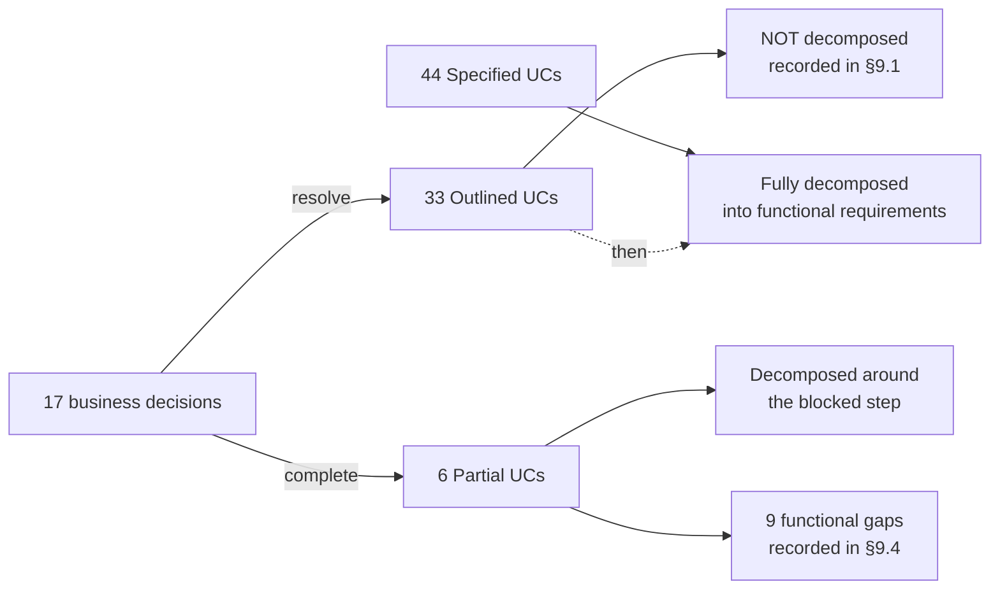
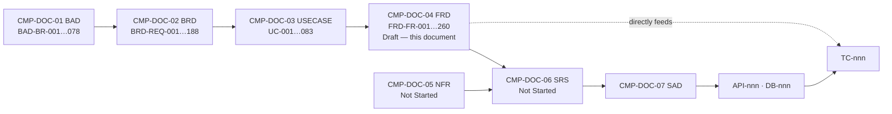
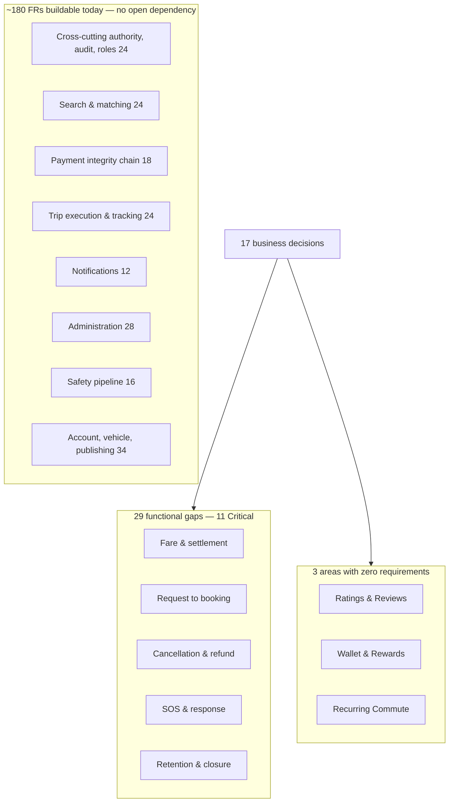

# Functional Requirements Document (FRD)
## Carpool Mobility Platform (CMP)

---

# 0. Document Control

## 0.1 Document Control Table

| Field | Value |
|---|---|
| Document ID | CMP-DOC-04 |
| Document Name | Functional Requirements Document |
| Short Name | FRD |
| Project Name | Carpool Mobility Platform |
| Project Code | CMP |
| Version | 0.2 |
| Status | Draft |
| Date | 2026-08-20 |
| Author | Product Analyst (AI-assisted) |
| Reviewer | [TBD] |
| Approver | Project Owner |
| Classification | Internal |
| Brand | TBD |
| Previous Version | 0.1 (2026-08-16) |
| Predecessor Documents | CMP-DOC-01 (BAD) v0.1, CMP-DOC-02 (BRD) v0.1, CMP-DOC-03 (USECASE) v0.1 — **all Draft, none approved** |
| Related Documents | `00_Project_Control/README.md`, `Documentation_Index.md`, `Documentation_Status.md`, `Document_Change_Log.md`, `Glossary.md`, `Master_Traceability_Matrix.md` |
| Successor Documents | CMP-DOC-05 (NFR) — Not Started; CMP-DOC-06 (SRS) — Not Started |

## 0.2 Revision History

| Version | Date | Author | Change | Status |
|---|---|---|---|---|
| 0.1 | 2026-08-16 | Product Analyst (AI-assisted) | Initial issue. Decomposes the 50 use cases carrying written flows into 260 functional requirements (`FRD-FR-001` … `FRD-FR-260`) across 12 functional areas, each with source, verification method, priority and release. The 33 Outlined use cases are **not** decomposed; the reason is recorded per use case in §9. | Draft |
| 0.2 | 2026-08-20 | Product Analyst (AI-assisted) | **Two gaps partially closed and one deferral answered, by Project Owner decision.** `FRD-GAP-002`’s verification **standing vocabulary** half is closed by `BAD-RULE-006`; its **driver eligibility** half remains open on `BAD-DEC-005`. `FRD-GAP-003` is closed for the account **state model** by `BAD-RULE-010`; account state **change and appeal** was already registered separately at `FRD-GAP-024` and remains open. `FRD-FR-002`’s deferral to *"the identifying details the business defines as mandatory"* is answered by the new `BAD-RULE-043`: the **verified phone number and nothing else**. **No functional requirement text was altered** — this document defers to the business and the business has answered; the answers are held in CMP-DOC-01 §14.2 and cited here. The gap count is unchanged at 29 and the Critical count at eleven, because a partially closed gap is not a removed one. | Draft |

## 0.3 Distribution List

| Role | Purpose |
|---|---|
| Project Owner | Approval authority |
| Product Owner | Scope and behaviour confirmation |
| Business Analyst / Product Analyst | Authoring and maintenance |
| **QA Analyst** | **Primary consumer** — every requirement carries a verification method; basis of CMP-DOC-18 |
| **Android Developers** | **Primary consumer** — client behaviour |
| **Backend Developers** | **Primary consumer** — platform behaviour |
| UI/UX Designer | Behavioural constraints on CMP-DOC-12 |
| Solution / Software Architect | Input to CMP-DOC-06 … CMP-DOC-09 |
| Security Analyst | Authorisation, validation and integrity review |

## 0.4 Approval

| Role | Name | Signature | Date |
|---|---|---|---|
| Author | Product Analyst (AI-assisted) | — | 2026-08-16 |
| Reviewer | [TBD] | — | — |
| Approver | Project Owner | — | — |

> **This document is NOT approved.** It is issued at version 0.1 with status `Draft`
> for Project Owner review.

## 0.5 Purpose of This Document

This document states **what the system must do**, in terms precise enough to build and
to test, for every use case whose behaviour has been decided.

Each functional requirement:

- carries a stable identifier (`FRD-FR-nnn`);
- traces back to a use case (`UC-nnn`) and through it to a business requirement
  (`BRD-REQ-nnn`);
- carries a **verification method**, so that CMP-DOC-18 can derive test cases directly;
- carries a priority and a proposed release.

## 0.6 Scope and Boundary of This Document

**Contains:** functional decomposition of the 50 use cases carrying written flows;
cross-cutting functional behaviour; state and data behaviour where decided; validation
and error-handling requirements; external interface behaviour; the record of what could
not be decomposed; traceability; assumptions, risks, open questions; acceptance criteria;
statistics.

**Excludes:**

| Excluded | Belongs to |
|---|---|
| Performance, availability, capacity, latency and other quality attributes | CMP-DOC-05 |
| System-level software requirements and allocation to components | CMP-DOC-06 |
| Architecture, components, layering, deployment | CMP-DOC-07 … CMP-DOC-09 |
| API endpoints, verbs, payloads, status codes | CMP-DOC-10 |
| Tables, columns, keys, indexes, migrations | CMP-DOC-11 |
| Screen layout, navigation, copy, visual design | CMP-DOC-12 |
| Security controls, threat model, cryptography | CMP-DOC-13 |
| Payment integration mechanics and provider specifics | CMP-DOC-14 |
| Test cases and test data | CMP-DOC-18 |

**A note on the boundary with CMP-DOC-12.** This document states *what the system does*,
including what information must be presented and when. It does **not** state how that
information is laid out, worded or styled. Where a requirement says "present", the design
of that presentation is CMP-DOC-12's.

## 0.7 Intended Audience

Product Owners · Business Analysts · Product Analysts · QA Engineers · Android
Developers · Backend Developers · Solution Architects · Software Architects · UI/UX
Designers · Security Engineers · Technical Leads.

## 0.8 Basis of This Document — and Three Material Qualifications

### 0.8.1 Source

**FACT.** Derived from **CMP-DOC-01 v0.1**, **CMP-DOC-02 v0.1** and **CMP-DOC-03 v0.1**,
and from no other source. No new evidence, research, legal advice or business decision
became available.

### 0.8.2 Qualification 1 — The Chain Is Three Documents Deep and Unapproved

> **WARNING.** CMP-DOC-01, CMP-DOC-02 and CMP-DOC-03 are all at status `Draft`. This
> document rests on an unapproved chain **three documents deep**.
>
> A change to CMP-DOC-01 in review propagates through CMP-DOC-02 and CMP-DOC-03 into
> these functional requirements. This document must not be baselined for construction
> before all three predecessors are approved.
>
> Recorded as `FRD-RISK-001` and in `Document_Change_Log.md` conflict entry **CC-004**.

### 0.8.3 Qualification 2 — 33 Use Cases Cannot Be Decomposed

**FACT.** CMP-DOC-03 records 33 of 83 use cases as **Outlined** — their behaviour has not
been decided, so no flow exists to decompose.

**This document does not decompose them.** Producing functional requirements for an
Outlined use case would mean inventing the business decision behind it and then writing
that invention as a build instruction — the most damaging thing this document could do.

| Use case tier (CMP-DOC-03) | Count | Treatment here |
|---|---|---|
| Specified | 44 | **Fully decomposed** |
| Partial | 6 | **Decomposed around the blocked step**, which is recorded as a functional gap |
| Outlined | 33 | **Not decomposed.** Recorded in §9 with the decision required. |

Three whole functional areas therefore contain **no functional requirements**: Ratings &
Reviews, Wallet & Rewards, and Recurring Commute.

### 0.8.4 Qualification 3 — Two Live Product Gaps Remain Open

CMP-DOC-03 identified two gaps in the core journey that persist into this document:

| Gap | Effect on this document |
|---|---|
| **A driver with confirmed bookings has no specified way to cancel** (`GAP-008`, `UC-RISK-003`) | `FRD-FR-063` states the refusal; **no requirement can state what happens next.** |
| **The platform can hold money it has no specified means of returning** (`GAP-009`, `UC-RISK-002`) | `FRD-FR-108` and `FRD-FR-134` both terminate in behaviour that cannot be specified. |

Both are recorded as functional gaps in §9.4, not smoothed over.

## 0.9 Statement Classification Convention

As `README.md` §9.1. Markers used: **FACT**, **ASSUMPTION**, **BUSINESS DECISION
REQUIRED**, **TECHNICAL DECISION REQUIRED**, **OPEN QUESTION**, **TBD**, **FUTURE
CONSIDERATION**, **RECOMMENDATION**.

## 0.10 Identifier Conventions

| Prefix | Element | Section |
|---|---|---|
| `FRD-FR-nnn` | Functional Requirement (**traceable**) | 4–8 |
| `FRD-GAP-nnn` | Functional gap — behaviour that cannot be specified | 9 |
| `FRD-ASM-nnn` | Assumption | 11 |
| `FRD-RISK-nnn` | Risk | 12 |
| `FRD-OQ-nnn` | Open Question | 13 |

> **ASSUMPTION (`FRD-ASM-001`).** `README.md` §9.3 allocates `FRD-FR-` to this document.
> The auxiliary prefixes follow the convention recorded as conflict **CC-001**, pending
> `BAD-DEC-024`. Only `FRD-FR-` participates in the traceability chain.

## 0.11 Table of Contents

| § | Section |
|---|---|
| 0 | Document Control |
| 1 | Executive Summary |
| 2 | Scope of Functional Decomposition |
| 3 | Requirement Conventions |
| 4 | Functional Requirements — User, Vehicle and Supply |
| 5 | Functional Requirements — Discovery and Transaction |
| 6 | Functional Requirements — Journey and Communication |
| 7 | Functional Requirements — Safety, Notification and Administration |
| 8 | Functional Requirements — Cross-Cutting System Behaviour |
| 9 | Functional Requirements Withheld |
| 10 | Traceability |
| 11 | Assumptions |
| 12 | Risks |
| 13 | Open Questions |
| 14 | Business Decisions Required |
| 15 | Acceptance Criteria for This Document |
| 16 | Statistics |
| 17 | Recommendations |
| A | Appendix A — Functional Requirement Index |
| B | Appendix B — Verification Method Summary |
| C | Appendix C — Terminology Reference |

---

# 1. Executive Summary

## 1.1 What This Document Delivers

| Element | Count |
|---|---|
| Functional requirements | **260** (`FRD-FR-001` … `FRD-FR-260`) |
| Functional areas | 12 |
| Use cases decomposed | 50 of 83 |
| Use cases not decomposed | 33 — behaviour undecided |
| Functional gaps recorded | 29 (11 Critical) |
| Requirements verifiable by test | 211 |
| Integrity-critical requirements (‡) | 81 |

## 1.2 Coverage by Functional Area

| § | Area | Source UCs | FRs | Range |
|---|---|---|---|---|
| 4.1 | Account & Identity | 7 | 32 | `FRD-FR-001`–`032` |
| 4.2 | Vehicle Management | 3 | 16 | `FRD-FR-033`–`048` |
| 4.3 | Ride Publishing | 4 | 24 | `FRD-FR-049`–`072` |
| 5.1 | Search & Route Matching | 3 | 24 | `FRD-FR-073`–`096` |
| 5.2 | Request & Booking | 3 | 20 | `FRD-FR-097`–`116` |
| 5.3 | Payment & Settlement | 4 | 24 | `FRD-FR-117`–`140` |
| 6.1 | Trip Execution | 6 | 28 | `FRD-FR-141`–`168` |
| 6.2 | Communication | 3 | 12 | `FRD-FR-169`–`180` |
| 7.1 | Safety | 3 | 16 | `FRD-FR-181`–`196` |
| 7.2 | Notifications | 3 | 12 | `FRD-FR-197`–`208` |
| 7.3 | Administration | 6 | 28 | `FRD-FR-209`–`236` |
| 8 | Cross-Cutting System | 5 | 24 | `FRD-FR-237`–`260` |
| — | **Ratings & Reviews** | 0 | **0** | Withheld — `BAD-DEC-012` |
| — | **Wallet & Rewards** | 0 | **0** | Withheld — `BAD-DEC-013` |
| — | **Recurring Commute** | 0 | **0** | Withheld — `BAD-DEC-008` |
| | **Total** | **50** | **260** | |

## 1.3 The Three Findings That Matter

**1 — The buildable system is now fully specified, and it is substantial.**
260 functional requirements cover registration through to trip completion, the whole
search and matching capability, the full payment integrity chain, live tracking,
messaging, notifications, the safety incident pipeline, and the operator back office.
**A competent team could begin construction on this today** and would not run out of
decided work for a considerable time.

**2 — The gaps are concentrated, not scattered.**
Nine functional gaps (§9.4) sit in four places: the fare interaction, the
request-to-booking transition, trip state progression, and every downstream consequence
of cancellation. Everything else is either complete or entirely absent by decision.

**3 — Nothing was invented to close a gap.**
Where behaviour is undecided, this document states the boundary and stops. Three whole
areas contain zero requirements. That is a truthful representation of the current
decision state, not an incomplete decomposition.

## 1.4 What Is Immediately Buildable

| Body of work | FRs | Depends on any open decision? |
|---|---|---|
| Cross-cutting authority, audit, roles, degradation | 24 | **No** |
| Search & route matching — the differentiator | 24 | **No** |
| Trip execution and live tracking | 24 of 28 | Only trip-state progression |
| Payment integrity chain (initiate, verify, reconcile, ledger) | 18 of 24 | Only fare composition and refunds |
| Notifications | 12 | **No** |
| Communication | 10 of 12 | Only the availability window |
| Administration and case handling | 28 | **No** |
| Safety incident pipeline | 16 | **No** — the SOS control is separate and withheld |
| Account, identity and vehicle (unblocked parts) | 34 of 48 | Only verification policy |

**Approximately 180 of 260 functional requirements have no dependency on any open
business decision.**

---

# 2. Scope of Functional Decomposition

## 2.1 What Was Decomposed

The 44 Specified and 6 Partial use cases of CMP-DOC-03 (Appendix A.2, A.3):

`UC-001`–`005`, `007`, `008`, `010`–`012`, `014`–`016`, `018`–`021`, `023`, `025`,
`029`–`033`, `038`–`040`, `042`–`048`, `051`, `054`, `062`–`064`, `070`–`073`,
`075`, `076`, `078`–`081`, `083`

## 2.2 What Was Not Decomposed

The 33 Outlined use cases (CMP-DOC-03 Appendix A.4). Each is recorded in §9.1 with the
decision that withholds it. **No functional requirement anywhere in this document
describes their behaviour.**

## 2.3 Decomposition Rules Applied

1. One functional requirement states **one testable obligation**.
2. A requirement describes **system behaviour**, not user interface.
3. Where a use case step is marked `[BLOCKED]` in CMP-DOC-03, **no requirement is written
   for it**; a functional gap is recorded instead.
4. Exception flows are decomposed as fully as main flows — most defects live there.
5. Behaviour required by a business rule marked *absolute* is stated explicitly, even
   where it seems obvious, so that it is testable.
6. Cross-cutting behaviour (§8) is stated once and referenced, not repeated.

## 2.4 Relationship to the Use Case Tiers

---

# 3. Requirement Conventions

## 3.1 Statement Form

Every functional requirement is written as:

> *The system shall …*

Requirements are **singular** (one obligation), **verifiable** (a method is stated), and
**implementation-independent** (behaviour, not mechanism).

## 3.2 Register Columns

| Column | Meaning |
|---|---|
| ID | `FRD-FR-nnn`; **‡** marks an integrity-critical requirement |
| Functional Requirement | The obligation, in *shall* form |
| UC | Source use case in CMP-DOC-03 |
| Req | Business requirement realised, from CMP-DOC-02 |
| Pri | MoSCoW priority, inherited |
| V | Verification method (§3.4) |

Release allocation is inherited from CMP-DOC-02 and is stated per area rather than per
requirement, since every requirement in an area shares its release unless noted.

## 3.3 Priority

Inherited from CMP-DOC-02 §0.10.3: **M** Must · **S** Should · **C** Could · **W** Won't.

## 3.4 Verification Method

| Code | Method | Use |
|---|---|---|
| **T** | Test | Executable verification against defined inputs and expected outputs. |
| **D** | Demonstration | Observation of the system performing the behaviour. |
| **I** | Inspection | Examination of records, configuration or output. |
| **A** | Analysis | Reasoned argument from design or from other verified behaviour. |

> **RECOMMENDATION.** CMP-DOC-18 should treat every **T** requirement as requiring at
> least one automated test, and every **‡** requirement as requiring both a positive and
> a negative test.

## 3.5 Integrity-Critical Marking

**‡** marks a requirement implementing an absolute business rule (CMP-DOC-01 §14,
CMP-DOC-02 §10.2, CMP-DOC-03 §9.1). **These are not subject to descoping**, and each
requires a negative test proving the rule cannot be violated.

## 3.6 Gap Marking

Where a use case step is blocked, the register carries a **`— GAP —`** row naming the
functional gap and the decision required. **No requirement text is written for blocked
behaviour.**

---

# 4. Functional Requirements — User, Vehicle and Supply

## 4.1 Account & Identity

**Sources:** `UC-001`–`UC-005`, `UC-007`, `UC-008` · **Release:** R1
**Withheld from this area:** `UC-006` (identity verification submission), `UC-009`
(account closure) — see §9.1.

| ID | Functional Requirement | UC | Req | Pri | V |
|---|---|---|---|---|---|
| `FRD-FR-001` | The system shall allow a person without an account to initiate registration. | `UC-001` | 001 | M | T |
| `FRD-FR-002` | The system shall require, at registration, the identifying details the business defines as mandatory, including a phone number. | `UC-001` | 001 | M | T |
| `FRD-FR-003` | The system shall reject registration where any mandatory detail is absent or malformed, and shall state which detail is unacceptable. | `UC-001` | 001 | M | T |
| `FRD-FR-004` | The system shall reject registration where the phone number is already registered to an active account, and shall offer the login path instead. | `UC-001` | 001 | M | T |
| `FRD-FR-005` ‡ | The system shall assign each account a unique and persistent identifier that is never reused. | `UC-001` | 002 | M | T |
| `FRD-FR-006` | The system shall create the account in an unverified state that does not permit participation. | `UC-001` | 001, 007 | M | T |
| `FRD-FR-007` | The system shall initiate phone verification immediately upon account creation. | `UC-001`, `UC-002` | 007 | M | T |
| `FRD-FR-008` | The system shall mark an account usable only after control of its phone number has been demonstrated. | `UC-002` | 007 | M | T |
| `FRD-FR-009` ‡ | The system shall record phone-verified status as backend-held state and shall reject any client assertion of it. | `UC-002` | 007, 010 | M | T |
| `FRD-FR-010` | The system shall permit a further verification attempt where the demonstration is incorrect, within the limits it applies. | `UC-002` | 007 | M | T |
| `FRD-FR-011` | The system shall cease accepting verification attempts for a number once its attempt limit is reached. | `UC-002` | 007 | M | T |
| `FRD-FR-012` | The system shall preserve entered registration details for retry where verification cannot be completed because the messaging channel is unavailable. | `UC-001`, `UC-002` | 007 | S | T |
| `FRD-FR-013` | The system shall leave an account unverified and unusable where verification is abandoned, and shall permit registration to be restarted with the same number. | `UC-001` | 001, 007 | M | T |
| `FRD-FR-014` | The system shall authenticate a user before granting access to an account. | `UC-003` | 003 | M | T |
| `FRD-FR-015` | The system shall refuse access on failed authentication without disclosing which credential element was incorrect. | `UC-003` | 003 | M | T |
| `FRD-FR-016` | The system shall establish an authenticated session on successful authentication. | `UC-003` | 003 | M | T |
| `FRD-FR-017` | The system shall admit a user holding a valid existing session without re-authenticating them. | `UC-003` | 003 | S | T |
| `FRD-FR-018` | The system shall route a user whose account is not phone-verified to phone verification rather than into the application. | `UC-003` | 007 | M | T |
| `FRD-FR-019` | The system shall terminate a session on the user's request and prevent its reuse. | `UC-004` | 004 | M | T |
| `FRD-FR-020` | The system shall clear cached business data held on the device when a session ends. | `UC-004` | 004, 177 | M | T |
| `FRD-FR-021` | The system shall terminate the session locally when the platform is unreachable, and invalidate it centrally when next contacted. | `UC-004` | 004 | S | T |
| `FRD-FR-022` | The system shall allow an authenticated user to create and maintain a personal profile. | `UC-005` | 005 | M | T |
| `FRD-FR-023` | The system shall indicate, on the profile, which elements are disclosed to counterparties. | `UC-005` | 006 | M | D |
| `FRD-FR-024` | The system shall validate a profile change and retain the previous profile where the change is rejected, stating the reason. | `UC-005` | 005 | M | T |
| `FRD-FR-025` | The system shall require phone verification before a changed phone number takes effect. | `UC-005`, `UC-002` | 007 | M | T |
| `FRD-FR-026` | The system shall reflect an accepted profile change wherever the profile is displayed. | `UC-005` | 005 | M | T |
| `FRD-FR-027` ‡ | The system shall retrieve a counterparty's verification standing from backend-held state whenever it is displayed. | `UC-007` | 010, 011 | M | T |
| `FRD-FR-028` ‡ | The system shall present a counterparty's verification standing before the user is asked to commit to travel with them. | `UC-007` | 011, 075 | M | D |
| `FRD-FR-029` ‡ | The system shall present verification standing as unknown, rather than as verified or unverified, where the standing cannot be retrieved. | `UC-007` | 010 | M | T |
| `FRD-FR-030` | The system shall allow a user to take the driver role, subject to the eligibility the business defines. | `UC-008` | 012, 013 | S | T |
| `FRD-FR-031` | The system shall state what is outstanding where a user is not eligible for the driver role. | `UC-008` | 012 | S | T |
| `FRD-FR-032` | The system shall permit a single account to hold both the passenger and driver roles concurrently. | `UC-008` | 013 | S | T |

### 4.1.1 Functional Gaps in This Area

| Gap | Blocked behaviour | Decision |
|---|---|---|
| `FRD-GAP-001` | The content of the disclosure list at `FRD-FR-023`, and what a counterparty may see at each journey stage. | `BAD-DEC-022` |
| `FRD-GAP-002` | The vocabulary of verification standings displayed at `FRD-FR-027`–`029`, and the eligibility criteria at `FRD-FR-030`–`031`. | `BAD-DEC-005` |
| `FRD-GAP-003` | Account state behaviour: what states exist, what each permits, and what a restricted user is told at login. | `BAD-DEC-006`, `BAD-DEC-016` |

> **Note on `FRD-FR-010`/`011`.** The attempt limit and cool-off period are a
> `TECHNICAL DECISION REQUIRED`, routed to CMP-DOC-13. The *obligation* to impose one is
> stated here and is testable once the value is set.

## 4.2 Vehicle Management

**Sources:** `UC-010`, `UC-011`, `UC-012` · **Release:** R1
**Withheld:** `UC-013` (vehicle verification submission) — see §9.1.

| ID | Functional Requirement | UC | Req | Pri | V |
|---|---|---|---|---|---|
| `FRD-FR-033` | The system shall allow a user holding the driver role to register a vehicle against their account. | `UC-010` | 016 | M | T |
| `FRD-FR-034` | The system shall require, for each vehicle, the attributes a passenger needs in order to identify and assess it. | `UC-010` | 017 | M | T |
| `FRD-FR-035` | The system shall reject a vehicle registration where a required attribute is absent or malformed, and shall state which. | `UC-010` | 016 | M | T |
| `FRD-FR-036` | The system shall record the lawful passenger capacity of each registered vehicle. | `UC-010` | 023 | M | I |
| `FRD-FR-037` | The system shall permit a driver to register more than one vehicle, each independently selectable when publishing. | `UC-010` | 016 | S | T |
| `FRD-FR-038` | The system shall refuse a vehicle registration that duplicates a vehicle registered to another account, and shall raise the matter for operator review. | `UC-010` | 016 | M | T |
| `FRD-FR-039` | The system shall allow a driver to amend the details of a vehicle registered to them. | `UC-011` | 018 | S | T |
| `FRD-FR-040` | The system shall determine, before applying an amendment, whether the vehicle is associated with an active ride, booking or trip. | `UC-011` | 020 | M | T |
| `FRD-FR-041` | The system shall accept an amendment that does not invalidate a commitment already made, and reflect it on the associated ride. | `UC-011` | 018 | S | T |
| `FRD-FR-042` | The system shall refuse an amendment that would invalidate a commitment already made, and shall name the active commitments. | `UC-011` | 020 | M | T |
| `FRD-FR-043` | The system shall allow a driver to remove a vehicle that is not associated with an active ride, booking or trip. | `UC-012` | 019 | S | T |
| `FRD-FR-044` | The system shall refuse removal of a vehicle in active use and shall name the active commitments. | `UC-012` | 020 | M | T |
| `FRD-FR-045` | The system shall withdraw a removed vehicle from selection for new rides while retaining it on historical records. | `UC-012` | 019 | M | T |
| `FRD-FR-046` ‡ | The system shall present, for any ride, the vehicle information recorded against that ride. | `UC-011`, `UC-012` | 025 | M | T |
| `FRD-FR-047` ‡ | The system shall present vehicle information to a passenger before that passenger commits to travel. | `UC-010` | 024 | M | D |
| `FRD-FR-048` | The system shall show a completed trip's vehicle as it was recorded at the time of travel. | `UC-012` | 025, 100 | M | T |

### 4.2.1 Functional Gaps in This Area

| Gap | Blocked behaviour | Decision |
|---|---|---|
| `FRD-GAP-004` | The source and evidencing of lawful capacity at `FRD-FR-036`; whether an unverified vehicle may be used to publish; whether duplicate registration is ever permitted. | `BAD-DEC-005` |

## 4.3 Ride Publishing

**Sources:** `UC-014` (Partial), `UC-015`, `UC-016`, `UC-018` · **Release:** R1
**Withheld:** `UC-017` (post-booking amendment) — see §9.1.

| ID | Functional Requirement | UC | Req | Pri | V |
|---|---|---|---|---|---|
| `FRD-FR-049` | The system shall allow a driver to initiate publication of a ride. | `UC-014` | 026 | M | T |
| `FRD-FR-050` | The system shall require an origin and a destination for every published ride. | `UC-014` | 026 | M | T |
| `FRD-FR-051` | The system shall resolve a route between the stated origin and destination and record it as the route against which passenger segments are overlapped. | `UC-014` | 026, 040 | M | T |
| `FRD-FR-052` | The system shall refuse publication where a route cannot be resolved, and shall state that the journey was not understood. | `UC-014` | 026 | M | T |
| `FRD-FR-053` | The system shall defer publication rather than publish a ride without a route where the mapping service is unavailable. | `UC-014`, `UC-081` | 026 | M | T |
| `FRD-FR-054` | The system shall require a date and a departure time for every published ride. | `UC-014` | 027 | M | T |
| `FRD-FR-055` | The system shall reject a ride whose departure time has already passed. | `UC-014` | 034 | M | T |
| `FRD-FR-056` | The system shall require each published ride to be associated with exactly one vehicle registered to the publishing driver. | `UC-014` | 029 | M | T |
| `FRD-FR-057` | The system shall route a driver with no registered vehicle to vehicle registration before publication can proceed. | `UC-014` | 029 | M | T |
| `FRD-FR-058` | The system shall require the number of seats offered for every published ride. | `UC-014` | 028 | M | T |
| `FRD-FR-059` ‡ | The system shall reject a ride offering more seats than the recorded lawful capacity of its associated vehicle, and shall state that capacity. | `UC-014` | 028 | M | T |
| **— GAP —** | **`FRD-GAP-005` — the establishment of the fare for a published ride.** Whether the driver states it, the platform computes it, or the driver states it within a constraint. **No requirement is written.** | `UC-014` | 030, 031 | — | — |
| `FRD-FR-060` | The system shall present the preference set — air conditioning, smoking, music, luggage, pets — for declaration on every published ride. | `UC-015` | 032 | M | T |
| `FRD-FR-061` | The system shall record the driver's declared position on each preference. | `UC-015` | 032 | M | T |
| `FRD-FR-062` | The system shall present an undeclared preference as undeclared, and shall not infer a permissive or restrictive position. | `UC-015` | 032 | M | T |
| `FRD-FR-063` | The system shall display declared preferences to a passenger before any commitment is sought. | `UC-015` | 033 | M | D |
| `FRD-FR-064` | The system shall validate the publishing driver's eligibility before accepting a ride. | `UC-014` | 035 | M | T |
| `FRD-FR-065` | The system shall state the reason where publication is refused. | `UC-014` | 035 | M | T |
| `FRD-FR-066` | The system shall make an accepted ride discoverable to compatible searches. | `UC-014` | 036 | M | T |
| `FRD-FR-067` | The system shall record the publication of a ride as an auditable event. | `UC-014` | 174, 179 | M | I |
| `FRD-FR-068` | The system shall allow a driver to pre-fill a new ride from a ride they have previously published, re-evaluating time, capacity and eligibility in full. | `UC-014` | 026 | S | T |
| `FRD-FR-069` | The system shall allow a driver to withdraw a published ride that carries no confirmed booking. | `UC-016` | 037 | M | T |
| `FRD-FR-070` ‡ | The system shall refuse withdrawal of a ride carrying a confirmed booking. | `UC-016` | 037, 067 | M | T |
| `FRD-FR-071` | The system shall close any pending ride request on a withdrawn ride and inform its requester. | `UC-016` | 067, 063 | M | T |
| `FRD-FR-072` | The system shall present a driver's published rides with their date, time, route, seats offered, seats booked and status, from backend-held state. | `UC-018` | 036, 176 | S | T |

### 4.3.1 Functional Gaps in This Area

| Gap | Blocked behaviour | Decision |
|---|---|---|
| `FRD-GAP-005` | Establishment of the fare on a published ride. | `BAD-DEC-003` |
| `FRD-GAP-006` | **What a driver may do when they must cancel a ride carrying confirmed bookings.** `FRD-FR-070` states the refusal; no requirement can state the alternative. **This is `GAP-008` from the traceability matrix and is a gap in the core journey.** | `BAD-DEC-009` |
| `FRD-GAP-007` | Whether and how a driver may amend a published ride after bookings exist. | `BAD-DEC-017` |

> **`FRD-FR-070` is deliberately stated as a bare refusal.** CMP-DOC-03 `UC-016` E1 routes
> to `UC-027`, which is Outlined. Until `BAD-DEC-009` is taken, the correct functional
> behaviour is to refuse — and the business must understand that this leaves a driver
> with no way out. Writing a permissive behaviour here would be inventing the
> cancellation policy.

---

# 5. Functional Requirements — Discovery and Transaction

## 5.1 Search & Route Matching

**Sources:** `UC-019`, `UC-020`, `UC-021` · **Release:** R1
**Withheld:** `UC-022` (empty-result handling) — see §9.1.
**This area implements the platform's differentiating capability** (`BAD-OPP-001`).

| ID | Functional Requirement | UC | Req | Pri | V |
|---|---|---|---|---|---|
| `FRD-FR-073` | The system shall accept a search stating origin, destination, date and the number of seats required. | `UC-019` | 039 | M | T |
| `FRD-FR-074` | The system shall resolve the requested travel segment from the stated origin and destination. | `UC-019` | 039 | M | T |
| `FRD-FR-075` | The system shall refuse a search where an origin or destination cannot be resolved, and shall state that the location was not understood. | `UC-019` | 039 | M | T |
| `FRD-FR-076` | The system shall identify published rides that are candidates for the requested date. | `UC-019` | 040 | M | T |
| `FRD-FR-077` ‡ | The system shall include a ride as compatible only where its route overlaps the requested travel segment. | `UC-019` | 040 | M | T |
| `FRD-FR-078` ‡ | The system shall include a ride whose route overlaps the requested segment even where that segment forms only part of the ride's route. | `UC-019` | 041 | M | T |
| `FRD-FR-079` | The system shall assess pickup compatibility between the passenger's origin and the ride's route. | `UC-019` | 042 | M | T |
| `FRD-FR-080` | The system shall assess drop compatibility between the passenger's destination and the ride's route. | `UC-019` | 043 | M | T |
| `FRD-FR-081` | The system shall assess whether the ride's direction of travel is compatible with the requested journey. | `UC-019` | 044 | M | T |
| `FRD-FR-082` | The system shall assess whether the ride's departure time is compatible with the requested travel time. | `UC-019` | 045 | M | T |
| `FRD-FR-083` ‡ | The system shall exclude from bookable results any ride with fewer available seats than the number requested. | `UC-019` | 051 | M | T |
| `FRD-FR-084` ‡ | The system shall evaluate seat availability from backend-held state on every search, and shall never serve it from a cached count. | `UC-019` | 051, 064 | M | T |
| `FRD-FR-085` | The system shall present a ride as compatible only where every compatibility assessment is satisfied. | `UC-019` | 040–045, 051 | M | T |
| `FRD-FR-086` | The system shall rank compatible rides on a basis it can express to the passenger. | `UC-019`, `UC-020` | 047 | S | A |
| `FRD-FR-087` | The system shall express, for each result, the degree to which the ride's route overlaps the requested segment. | `UC-020` | 046 | M | T |
| `FRD-FR-088` | The system shall express, for each result, the pickup and drop relationship in terms the passenger can act on. | `UC-020` | 046, 042, 043 | M | D |
| `FRD-FR-089` | The system shall present, for each result, the fare, departure time and number of available seats. | `UC-019`, `UC-021` | 049 | M | D |
| `FRD-FR-090` ‡ | The system shall present, for each result, the driver information and verification indicators required for a trust decision. | `UC-019`, `UC-021` | 048 | M | D |
| `FRD-FR-091` | The system shall present, for each result, the vehicle information recorded against the ride. | `UC-021` | 024, 025 | M | D |
| `FRD-FR-092` | The system shall present, for each result, the ride's declared travel preferences. | `UC-019`, `UC-021` | 050 | M | D |
| `FRD-FR-093` | The system shall re-evaluate results in full when a search is repeated. | `UC-019` | 051 | M | T |
| `FRD-FR-094` | The system shall re-check availability when a passenger proceeds from a result, and inform them where the ride is no longer bookable. | `UC-021` | 051, 055 | M | T |
| `FRD-FR-095` | The system shall inform a passenger and return them to results where a ride is withdrawn while they are viewing it. | `UC-021` | 037 | M | T |
| `FRD-FR-096` | The system shall state that search is unavailable, rather than return an unmatched or unranked result set, where the mapping service is unavailable. | `UC-019`, `UC-081` | 039 | M | T |

### 5.1.1 Functional Gaps in This Area

| Gap | Blocked behaviour | Decision |
|---|---|---|
| `FRD-GAP-008` | The precision of counterparty location disclosed in results and on the ride detail before a booking exists. | `BAD-DEC-022` |
| — | **Behaviour on an empty result set** — whether alternatives are offered, and which. Withheld with `UC-022`. | `BAD-OQ-007` |

> **Not specified here, by design:** the overlap calculation and any minimum overlap
> threshold. CMP-DOC-01 `BAD-RULE-023` records these as a `TECHNICAL DECISION REQUIRED`
> routed to CMP-DOC-07 / CMP-DOC-09. `FRD-FR-077` and `FRD-FR-087` state the obligation
> and leave the algorithm open — deliberately, so that the architecture may choose it.

## 5.2 Request & Booking

**Sources:** `UC-023` (Partial), `UC-025` (Partial), `UC-029` · **Release:** R1
**Withheld:** `UC-024`, `UC-026`, `UC-027`, `UC-028` — see §9.1.
**This is the least decided area of the core product.**

| ID | Functional Requirement | UC | Req | Pri | V |
|---|---|---|---|---|---|
| `FRD-FR-097` | The system shall allow a passenger to request a stated number of seats on a specific published ride. | `UC-023` | 054 | M | T |
| `FRD-FR-098` ‡ | The system shall re-confirm seat availability from backend-held state at the moment a request is made. | `UC-023` | 055, 064 | M | T |
| `FRD-FR-099` | The system shall decline a request where the seats are no longer available, state why, and consume no seat. | `UC-023` | 055 | M | T |
| `FRD-FR-100` | The system shall record a ride request against the ride, identifying the requesting passenger and the seats requested. | `UC-023` | 054 | M | T |
| `FRD-FR-101` ‡ | The system shall present the requesting passenger's verification standing to the driver. | `UC-023` | 057 | M | D |
| `FRD-FR-102` | The system shall refuse a request from a passenger who is not eligible to request, and state the reason. | `UC-023` | 058 | M | T |
| **— GAP —** | **`FRD-GAP-009` — whether a request requires driver acceptance, and the behaviour of that decision.** **No requirement is written.** | `UC-023`, `UC-024` | 058, 059 | — | — |
| **— GAP —** | **`FRD-GAP-010` — whether requested seats are held pending payment, and for how long.** **No requirement is written.** | `UC-023` | 061 | — | — |
| **— GAP —** | **`FRD-GAP-011` — whether payment is taken at booking or on trip completion.** **No requirement is written.** | `UC-025` | 062 | — | — |
| `FRD-FR-103` | The system shall inform both the passenger and the driver of the outcome of a ride request. | `UC-023` | 063 | M | T |
| `FRD-FR-104` ‡ | The system shall determine seat availability solely from its own state and shall reject any client-supplied seat count. | `UC-025` | 064, 178 | M | T |
| `FRD-FR-105` ‡ | The system shall confirm a booking only where seats remain available at the moment of confirmation. | `UC-025` | 065 | M | T |
| `FRD-FR-106` ‡ | The system shall confirm a booking only where payment status is verified. | `UC-025` | 066 | M | T |
| `FRD-FR-107` ‡ | The system shall never allow the total confirmed seats on a ride to exceed the seats offered, including under concurrent requests. | `UC-025` | 065 | M | T |
| `FRD-FR-108` ‡ | The system shall not confirm a booking where seats have become unavailable, and shall initiate the return of any value taken. | `UC-025` | 065, 081 | M | T |
| `FRD-FR-109` ‡ | The system shall not confirm a booking, and shall release any held seats, where payment is not verified. | `UC-025` | 066 | M | T |
| `FRD-FR-110` ‡ | The system shall reject any client assertion that a booking is confirmed. | `UC-025` | 178 | M | T |
| `FRD-FR-111` | The system shall allocate the requested seats to a confirmed booking. | `UC-025` | 065 | M | T |
| `FRD-FR-112` | The system shall record the confirmation of a booking as an auditable event. | `UC-025` | 174, 179 | M | I |
| `FRD-FR-113` | The system shall inform both the passenger and the driver when a booking is confirmed. | `UC-025` | 063 | M | T |
| `FRD-FR-114` | The system shall present a passenger's bookings with their ride, seats, status, payment status and associated trip, from backend-held state. | `UC-029` | 063, 176 | S | T |
| `FRD-FR-115` | The system shall mark bookings shown from device-held data as cached, and shall not present their booking or payment status as authoritative. | `UC-029` | 177 | M | T |
| `FRD-FR-116` | The system shall record every cancellation with the responsible party and the reason. | `UC-023` | 067 | M | I |

### 5.2.1 Functional Gaps in This Area

| Gap | Blocked behaviour | Decision |
|---|---|---|
| `FRD-GAP-009` | Driver acceptance of a ride request. | `BAD-DEC-007` |
| `FRD-GAP-010` | Seat holding between request and payment. | `BAD-DEC-007` |
| `FRD-GAP-011` | Timing of payment relative to booking confirmation. | `BAD-DEC-007` |
| `FRD-GAP-012` | Cancellation of a booking by either party, no-show handling, and every financial consequence of both. | `BAD-DEC-009` |

> **`FRD-FR-116` is stated even though cancellation itself is withheld.** Recording the
> responsible party and reason is settled (`BRD-REQ-067`, Ready) regardless of what the
> business decides the *consequence* to be. Building the record now costs nothing and
> makes the eventual policy enforceable retrospectively.
>
> **Three gaps in one area, all from one decision.** `BAD-DEC-007` alone accounts for
> `FRD-GAP-009`, `010` and `011` — which together are the transition from *interest* to
> *committed, paid booking*. This is the narrow waist of the product.

## 5.3 Payment & Settlement

**Sources:** `UC-030` (Partial), `UC-031`, `UC-032`, `UC-033` · **Release:** R1
**Withheld:** `UC-034`, `UC-035`, `UC-036`, `UC-037` — see §9.1.
**Every absolute payment rule is fully specified here.**

| ID | Functional Requirement | UC | Req | Pri | V |
|---|---|---|---|---|---|
| `FRD-FR-117` ‡ | The system shall calculate the amount payable under its own authority. | `UC-030` | 071 | M | T |
| `FRD-FR-118` ‡ | The system shall reject any client-supplied amount payable. | `UC-030` | 071, 178 | M | T |
| **— GAP —** | **`FRD-GAP-013` — the composition of the amount payable:** fare basis, per-seat or per-booking, and whether a platform fee is included or added. **No requirement is written.** | `UC-030` | 072, 073 | — | — |
| `FRD-FR-119` ‡ | The system shall present the total amount payable to the passenger before any payment is initiated. | `UC-030` | 074 | M | D |
| `FRD-FR-120` ‡ | The system shall not initiate a payment for an amount the passenger has not been shown. | `UC-030` | 074 | M | T |
| `FRD-FR-121` | The system shall re-present the total, and require the passenger to see it, where the amount changes between display and payment. | `UC-030` | 074 | M | T |
| `FRD-FR-122` | The system shall initiate payment for the established amount through the UPI ecosystem. | `UC-031` | 075 | M | T |
| `FRD-FR-123` | The system shall support payment through commonly used UPI applications. | `UC-031` | 076 | M | D |
| `FRD-FR-124` ‡ | The system shall not treat a response returned by a client-side UPI application as evidence that payment has been made. | `UC-031` | 077 | M | T |
| `FRD-FR-125` ‡ | The system shall initiate independent verification of every payment attempt, including where the passenger abandoned the interaction. | `UC-031` | 078 | M | T |
| `FRD-FR-126` ‡ | The system shall initiate verification of a payment attempt without requiring the passenger to return to the application. | `UC-031` | 078 | M | T |
| `FRD-FR-127` ‡ | The system shall determine payment status solely from its own verification. | `UC-032` | 078 | M | T |
| `FRD-FR-128` ‡ | The system shall set payment status to verified only where it has itself established that the payment succeeded. | `UC-032` | 078 | M | T |
| `FRD-FR-129` ‡ | The system shall set payment status to failed where it has established that the payment did not succeed, and shall release any held seats. | `UC-032` | 078 | M | T |
| `FRD-FR-130` ‡ | The system shall set payment status to pending, and route the payment for reconciliation, where the outcome cannot be established. | `UC-032` | 079 | M | T |
| `FRD-FR-131` ‡ | The system shall not resolve a pending payment to verified or failed by assumption. | `UC-032` | 079 | M | T |
| `FRD-FR-132` | The system shall re-attempt verification of a pending payment on its own initiative. | `UC-032` | 079 | M | T |
| `FRD-FR-133` ‡ | The system shall record a ledger entry for every movement of value, attributable to the payer, the booking and the event. | `UC-032` | 086 | M | I |
| `FRD-FR-134` | The system shall record every payment attempt and its verified outcome. | `UC-031`, `UC-032` | 080 | M | I |
| `FRD-FR-135` | The system shall inform the passenger of the verified outcome of a payment, and not of the outcome reported by the UPI application. | `UC-031` | 077, 080 | M | T |
| `FRD-FR-136` | The system shall inform a passenger that a payment is being confirmed, and shall not report success, while its status is pending. | `UC-031` | 079 | M | T |
| `FRD-FR-137` | The system shall not create a payment it cannot verify where the payment ecosystem is unavailable. | `UC-031`, `UC-081` | 075 | M | T |
| `FRD-FR-138` | The system shall present pending payments to operators as a managed queue. | `UC-033` | 164 | M | T |
| `FRD-FR-139` | The system shall allow an operator to record a determination against a pending payment, and shall apply it to payment status and to the ledger. | `UC-033` | 079, 163 | M | T |
| `FRD-FR-140` | The system shall retain a payment in the reconciliation queue, with the investigation recorded, where its outcome still cannot be established. | `UC-033` | 079 | M | T |

### 5.3.1 Functional Gaps in This Area

| Gap | Blocked behaviour | Decision |
|---|---|---|
| `FRD-GAP-013` | Composition of the amount payable. | `BAD-DEC-003` |
| `FRD-GAP-014` | **Return of value to a passenger.** `FRD-FR-108` initiates it and `FRD-FR-139` can require it, but no requirement can state how a refund is calculated or executed. **This is `GAP-009` from the traceability matrix.** | `BAD-DEC-010` |
| `FRD-GAP-015` | Recording driver earnings and settling funds to drivers. | `BAD-DEC-003`, `BAD-DEC-004` |

> **The payment integrity chain is complete.** `FRD-FR-117`, `118`, `124`–`131`, `133`
> together implement every absolute payment rule in CMP-DOC-01 §14.7. **None of them
> depends on any open business decision**, and all are verifiable by test today. This is
> the single most valuable body of work available to the team right now, because it is
> the code that prevents financial loss.
>
> **`FRD-FR-126` deserves particular attention in test.** A verification path that
> depends on the passenger returning to the app is the most common way this rule is
> broken in practice.

---

# 6. Functional Requirements — Journey and Communication

## 6.1 Trip Execution & Live Tracking

**Sources:** `UC-038` (Partial), `UC-039`, `UC-040`, `UC-042`, `UC-043`, `UC-044`
**Release:** R1 except where noted · **Withheld:** `UC-041` — see §9.1.

| ID | Functional Requirement | UC | Req | Pri | V |
|---|---|---|---|---|---|
| `FRD-FR-141` | The system shall allow a driver to begin a trip against a ride carrying at least one confirmed booking. | `UC-038` | 087 | M | T |
| `FRD-FR-142` ‡ | The system shall refuse to begin a trip against a ride with no confirmed booking. | `UC-038` | 087 | M | T |
| `FRD-FR-143` | The system shall create a trip on commencement and record its start time. | `UC-038` | 087, 090 | M | T |
| **— GAP —** | **`FRD-GAP-016` — the state a trip enters on commencement, the states available to it, and the permitted transitions between them.** **No requirement is written.** | `UC-038`, `UC-041` | 088, 091 | — | — |
| `FRD-FR-144` | The system shall record every trip state transition with the time at which it occurred. | `UC-038` | 090 | M | I |
| `FRD-FR-145` | The system shall make the current trip state visible to every participant in the trip. | `UC-038` | 089 | M | D |
| `FRD-FR-146` | The system shall notify booked passengers when a trip begins. | `UC-038` | 089, 142 | M | T |
| `FRD-FR-147` | The system shall record the actual start time of a trip against its scheduled departure time. | `UC-038` | 090 | M | I |
| `FRD-FR-148` | The system shall obtain the vehicle's position during an active trip. | `UC-039` | 092 | M | T |
| `FRD-FR-149` | The system shall make the vehicle's position available to the participants of the active trip. | `UC-039` | 093 | M | D |
| `FRD-FR-150` ‡ | The system shall not present a previously known position as the current position. | `UC-039` | 093 | M | T |
| `FRD-FR-151` | The system shall indicate that position is unavailable, and when it was last known, where it cannot currently be obtained. | `UC-039` | 093 | M | T |
| `FRD-FR-152` | The system shall permit a trip to begin, indicating that tracking is unavailable, where position cannot be obtained at commencement. | `UC-038`, `UC-039` | 092 | M | T |
| `FRD-FR-153` | The system shall continue to report position without map context where the mapping service is unavailable. | `UC-039`, `UC-081` | 092 | S | T |
| `FRD-FR-154` | The system shall cease position tracking when a trip ends. | `UC-039` | 092 | M | T |
| `FRD-FR-155` | The system shall compute an estimated time of arrival at each participant's next relevant point during an active trip. | `UC-040` | 094 | M | T |
| `FRD-FR-156` | The system shall compute the remaining distance to each participant's next relevant point during an active trip. | `UC-040` | 095 | M | T |
| `FRD-FR-157` | The system shall update the estimate and remaining distance as the trip progresses. | `UC-040` | 094, 095 | M | T |
| `FRD-FR-158` | The system shall state that no estimate is available, rather than present a stale or default value, where an estimate cannot be computed. | `UC-040` | 094 | M | T |
| `FRD-FR-159` | The system shall present a driver with the estimate to their next pickup or drop rather than to their own destination. | `UC-040` | 094 | S | D |
| `FRD-FR-160` | The system shall provide current speed, current landmark and the next navigation instruction during an active trip. *(Release R2)* | `UC-040` | 096, 097 | C | T |
| `FRD-FR-161` | The system shall associate every confirmed booking on a ride with the same trip. | `UC-044` | 098 | M | T |
| `FRD-FR-162` | The system shall track each booking's pickup and drop independently on a multi-passenger trip. | `UC-044` | 098 | M | T |
| `FRD-FR-163` | The system shall present each passenger with the trip from the perspective of their own pickup and drop points. | `UC-044` | 098 | M | D |
| `FRD-FR-164` ‡ | The system shall ensure that the cancellation or absence of one passenger does not invalidate another passenger's booking on the same trip. | `UC-044` | 098 | M | T |
| `FRD-FR-165` | The system shall close a trip on completion and record each booking's outcome independently. | `UC-042` | 099 | M | T |
| `FRD-FR-166` ‡ | The system shall record, for every completed trip, its participants, route travelled, associated payment and outcome. | `UC-042` | 100 | M | I |
| `FRD-FR-167` ‡ | The system shall not report a trip as complete where its record cannot be written. | `UC-042` | 100 | M | T |
| `FRD-FR-168` | The system shall present a user's completed trips with date, route, counterparties, fare paid or earned, and outcome. | `UC-043` | 101 | S | T |

### 6.1.1 Functional Gaps in This Area

| Gap | Blocked behaviour | Decision |
|---|---|---|
| `FRD-GAP-016` | The trip state model and the mechanism of progression between states. | `BAD-DEC-015` |
| `FRD-GAP-017` | The consequence of a trip beginning materially early or late, and of a trip ending without completing the journey. | `BAD-DEC-009` |
| `FRD-GAP-018` | Whether a completed trip invites a rating, and what accrues from it. | `BAD-DEC-012`, `BAD-DEC-013` |

> **`FRD-FR-165` closes a trip; it does not invite a rating.** CMP-DOC-03 `UC-042` step 6
> routes to `UC-055`, which is Outlined. Every trip completed before `BAD-DEC-012` is
> taken produces **no reputation data**, and that history cannot be reconstructed later.
> Recorded as `FRD-RISK-004`.

## 6.2 Communication

**Sources:** `UC-045` (Partial), `UC-046`, `UC-047` · **Release:** R1

| ID | Functional Requirement | UC | Req | Pri | V |
|---|---|---|---|---|---|
| **— GAP —** | **`FRD-GAP-019` — the point in the journey at which messaging between two parties becomes available.** **No requirement is written.** | `UC-045` | 103 | — | — |
| `FRD-FR-169` | The system shall allow a driver and a passenger with a qualifying relationship to a ride to exchange messages. | `UC-045` | 102 | M | T |
| `FRD-FR-170` ‡ | The system shall not deliver a message to a party with no qualifying relationship to the ride. | `UC-045` | 102 | M | T |
| `FRD-FR-171` | The system shall decline to open a conversation where the parties' relationship does not permit messaging. | `UC-045` | 103 | M | T |
| `FRD-FR-172` | The system shall record every message against the conversation for its ride. | `UC-045` | 104 | M | I |
| `FRD-FR-173` | The system shall retain a message and deliver it when the recipient next connects, where immediate delivery fails. | `UC-045` | 104 | M | T |
| `FRD-FR-174` | The system shall not report a message as read to its sender. | `UC-045` | 104 | M | T |
| `FRD-FR-175` | The system shall queue messages rather than discard them where the messaging service is unavailable. | `UC-045`, `UC-081` | 104 | M | T |
| `FRD-FR-176` | The system shall support messaging between the participants of a multi-passenger trip. | `UC-045`, `UC-044` | 108 | S | T |
| `FRD-FR-177` | The system shall present previously retrieved messages when the device has no connectivity. | `UC-046` | 105 | S | T |
| `FRD-FR-178` | The system shall indicate that a conversation shown without connectivity may not be current. | `UC-046` | 105, 177 | M | T |
| `FRD-FR-179` ‡ | The system shall not show a message composed offline as delivered until the platform has accepted it. | `UC-046` | 105, 176 | M | T |
| `FRD-FR-180` | The system shall alert a recipient to the arrival of a message, disclosing no more than the conversation itself would. | `UC-047` | 106 | M | T |

### 6.2.1 Functional Gaps in This Area

| Gap | Blocked behaviour | Decision |
|---|---|---|
| `FRD-GAP-019` | When messaging opens: at request, or only on confirmed booking. A privacy-versus-coordination trade-off. | `BAD-DEC-022`, `BAD-OQ-015` |

---

# 7. Functional Requirements — Safety, Notification and Administration

## 7.1 Safety

**Sources:** `UC-048`, `UC-051`, `UC-054` · **Release:** R1
**Withheld:** `UC-049`, `UC-050`, `UC-052`, `UC-053` — see §9.1.

> **WARNING.** This area specifies the **safety incident pipeline**, which may be built.
> It does **not** specify the SOS control or the response protocol, which must not be
> built until `BAD-DEC-011` exists and a response capability is staffed
> (CMP-DOC-03 `UR-05`, CMP-DOC-02 `BR-05`, `BAD-RISK-005`).

| ID | Functional Requirement | UC | Req | Pri | V |
|---|---|---|---|---|---|
| `FRD-FR-181` | The system shall allow a user to nominate one or more emergency contacts. | `UC-048` | 116 | M | T |
| `FRD-FR-182` | The system shall allow a user to amend or remove a nominated emergency contact. | `UC-048` | 116 | M | T |
| `FRD-FR-183` | The system shall validate emergency contact details and state why a contact is unusable. | `UC-048` | 116 | M | T |
| `FRD-FR-184` | The system shall record nominated emergency contacts against the user. | `UC-048` | 116 | M | I |
| `FRD-FR-185` ‡ | The system shall record every safety signal it receives as a safety incident. | `UC-051` | 110 | M | T |
| `FRD-FR-186` ‡ | The system shall capture, with each safety incident, the raising user, the trip, the location at the time, the vehicle and the co-travellers involved. | `UC-051` | 111 | M | T |
| `FRD-FR-187` ‡ | The system shall record a safety incident even where part of its context is unavailable, marking the missing context as unavailable. | `UC-051` | 110, 111 | M | T |
| `FRD-FR-188` ‡ | The system shall never discard a safety signal. | `UC-051` | 110 | M | T |
| `FRD-FR-189` ‡ | The system shall place every safety incident in the safety operator queue. | `UC-051` | 112 | M | T |
| `FRD-FR-190` ‡ | The system shall retain and retry an incident that cannot immediately reach the operator queue. | `UC-051`, `UC-081` | 112 | M | T |
| `FRD-FR-191` | The system shall record a safety incident raised outside an active trip, with no trip context. | `UC-051` | 110 | M | T |
| `FRD-FR-192` ‡ | The system shall record the actions taken in response to a safety incident, and its outcome. | `UC-051` | 115 | M | I |
| `FRD-FR-193` | The system shall record every safety incident and every action upon it as an auditable event. | `UC-051` | 174, 179 | M | I |
| `FRD-FR-194` | The system shall present safety information and every available safety control from a single place. | `UC-054` | 119 | M | D |
| `FRD-FR-195` ‡ | The system shall not present a safety control that the platform cannot honour. | `UC-054` | 119 | M | T |
| `FRD-FR-196` | The system shall make each safety control reachable from the safety centre, invoking the corresponding behaviour. | `UC-054` | 119 | M | T |

### 7.1.1 Functional Gaps in This Area

| Gap | Blocked behaviour | Decision |
|---|---|---|
| `FRD-GAP-020` | **Raising an SOS, and every step of the response to one** — including whether and when emergency contacts are informed, and the operating hours of response. | `BAD-DEC-011` |
| `FRD-GAP-021` | Live trip sharing: who may view, what they see, and for how long. | `BAD-DEC-022` |
| `FRD-GAP-022` | Reporting a non-emergency safety concern, and what follows from it. | `BAD-DEC-016` |

> **`FRD-FR-195` is the mechanism that keeps the SOS control out of the product.** The
> safety centre ships without a control the platform cannot honour, rather than with a
> control that does nothing. This is a functional requirement precisely so that it is
> testable.

## 7.2 Notifications

**Sources:** `UC-062`, `UC-063`, `UC-064` · **Release:** R1 except where noted
**No functional gaps in this area.**

| ID | Functional Requirement | UC | Req | Pri | V |
|---|---|---|---|---|---|
| `FRD-FR-197` | The system shall issue a notification to each affected user when an event occurs in the ride, booking, payment, trip, chat, reward, safety or system category. | `UC-062` | 142 | M | T |
| `FRD-FR-198` | The system shall identify the category of every notification it issues. | `UC-062` | 144 | M | T |
| `FRD-FR-199` | The system shall determine the users affected by an event before issuing notifications. | `UC-062` | 142 | M | T |
| `FRD-FR-200` | The system shall apply a user's notification preferences to non-essential categories. | `UC-062`, `UC-064` | 147 | S | T |
| `FRD-FR-201` ‡ | The system shall deliver safety-category and payment-category notifications irrespective of a user's preferences. | `UC-062`, `UC-064` | 148 | M | T |
| `FRD-FR-202` ‡ | The system shall not offer a mandatory notification category as one a user may disable. | `UC-064` | 148 | M | T |
| `FRD-FR-203` | The system shall record every notification it issues, with its category, addressee and time. | `UC-062` | 146 | M | I |
| `FRD-FR-204` ‡ | The system shall retain a notification in the application where its delivery fails. | `UC-062` | 146 | M | T |
| `FRD-FR-205` | The system shall queue notifications where the messaging service is unavailable. | `UC-062`, `UC-081` | 143 | M | T |
| `FRD-FR-206` | The system shall record and make available in the application a notification for a user with no reachable device. | `UC-062` | 146 | M | T |
| `FRD-FR-207` | The system shall present a user's notification history with category and time. | `UC-063` | 145 | S | T |
| `FRD-FR-208` | The system shall state that the subject of a notification is no longer accessible, rather than fail silently, when the user opens it. | `UC-063` | 145 | S | T |

> **`FRD-FR-204` and `FRD-FR-206` together state a principle worth naming:** push
> delivery is never the sole channel for anything that matters. Notification delivery is
> best-effort; the in-application record is authoritative.
>
> **Reliability targets are not stated here.** `BRD-REQ-143` is a quality attribute and
> belongs to CMP-DOC-05.

## 7.3 Administration

**Sources:** `UC-070`, `UC-071`, `UC-072`, `UC-073`, `UC-075`, `UC-076` · **Release:** R1
except where noted · **Withheld:** `UC-068`, `UC-069`, `UC-074`, `UC-077` — see §9.1.

| ID | Functional Requirement | UC | Req | Pri | V |
|---|---|---|---|---|---|
| `FRD-FR-209` | The system shall allow an operator to locate a ride, ride request, booking or trip. | `UC-070` | 161 | M | T |
| `FRD-FR-210` | The system shall present, for a located record, its parties, seats, status, state history, payment, messages and related safety incidents. | `UC-070` | 161, 167 | M | D |
| `FRD-FR-211` ‡ | The system shall not alter a record as a consequence of inspecting it. | `UC-070` | 161 | M | T |
| `FRD-FR-212` | The system shall record an operator's inspection of a record as an auditable event. | `UC-070` | 174 | M | I |
| `FRD-FR-213` ‡ | The system shall refuse operator access to a record where the operator's role does not permit it, and record the refusal. | `UC-070`, `UC-080` | 175 | M | T |
| `FRD-FR-214` | The system shall allow an operator to apply an intervention to a booking or trip, stating the intervention and its reason. | `UC-071` | 162 | M | T |
| `FRD-FR-215` ‡ | The system shall refuse an operator intervention that would allow confirmed seats to exceed seats offered. | `UC-071` | 162, 065 | M | T |
| `FRD-FR-216` ‡ | The system shall refuse an operator intervention that would set payment status other than through verification or reconciliation. | `UC-071`, `UC-072` | 162, 078 | M | T |
| `FRD-FR-217` ‡ | The system shall record every refused operator intervention as an auditable event. | `UC-071` | 174 | M | I |
| `FRD-FR-218` | The system shall record an applied intervention with the identity of the operator who applied it. | `UC-071` | 162, 174 | M | I |
| `FRD-FR-219` | The system shall inform the parties affected by an applied intervention. | `UC-071` | 162 | M | T |
| `FRD-FR-220` | The system shall allow an operator to locate a payment, refund or settlement record. | `UC-072` | 163 | M | T |
| `FRD-FR-221` | The system shall present, for a located payment, its amount, method, verification history, current status and ledger entries. | `UC-072` | 163 | M | D |
| `FRD-FR-222` ‡ | The system shall surface a discrepancy where a ledger does not reconcile, rather than present a computed balance that conceals it. | `UC-072` | 163, 086 | M | T |
| `FRD-FR-223` | The system shall route an unreconciled payment discrepancy to the reconciliation queue. | `UC-072`, `UC-033` | 164 | M | T |
| `FRD-FR-224` | The system shall present safety incidents to a safety responder as a queue. | `UC-073` | 166 | M | T |
| `FRD-FR-225` | The system shall present, for a safety incident, its full captured context and the related trip, parties and records. | `UC-073` | 166, 167 | M | D |
| `FRD-FR-226` | The system shall allow a safety responder to record an assessment, each action taken, and an outcome against a safety incident. | `UC-073` | 115, 166 | M | T |
| `FRD-FR-227` ‡ | The system shall not permit a safety incident to be closed without a recorded outcome. | `UC-073` | 166 | M | T |
| `FRD-FR-228` ‡ | The system shall not close a safety incident by timeout. | `UC-073` | 166 | M | T |
| `FRD-FR-229` | The system shall retain a closed safety incident for post-incident review. | `UC-073` | 166 | M | I |
| `FRD-FR-230` | The system shall allow a support agent to record a support case and its subject. | `UC-075` | 171 | M | T |
| `FRD-FR-231` | The system shall give a support agent access to the trip, payment, message, reputation and prior-case records relevant to their case. | `UC-075` | 167 | M | D |
| `FRD-FR-232` | The system shall record each step an agent takes on a support case. | `UC-075` | 171, 174 | M | I |
| `FRD-FR-233` ‡ | The system shall not permit a support case to be closed without a recorded outcome, and shall permit closure as unresolved. | `UC-075` | 171 | M | T |
| `FRD-FR-234` | The system shall derive every reported measure from its own records. | `UC-076` | 172 | S | A |
| `FRD-FR-235` | The system shall segment the zero-result search measure by corridor and time band. | `UC-076` | 172 | M | T |
| `FRD-FR-236` ‡ | The system shall report a measure as unavailable, rather than as zero, where the behaviour it measures is not implemented. | `UC-076` | 172 | M | T |

### 7.3.1 Functional Gaps in This Area

| Gap | Blocked behaviour | Decision |
|---|---|---|
| `FRD-GAP-023` | Adjudicating a verification submission. | `BAD-DEC-005` |
| `FRD-GAP-024` | Changing a user's account state, and any appeal from it. **A safety responder can therefore assess an incident but cannot act on the account involved.** | `BAD-DEC-006`, `BAD-DEC-016` |
| `FRD-GAP-025` | Moderating reported content. | `BAD-DEC-016` |
| `FRD-GAP-026` | Adjusting wallet or reward records. | `BAD-DEC-013` |
| `FRD-GAP-027` | The financial consequence of an operator intervention or a support resolution. | `BAD-DEC-009`, `BAD-DEC-010` |

> **`FRD-FR-215`–`217` are the most important requirements in this area.** An
> administrative back office is the usual route by which integrity rules are quietly
> bypassed. These three state that operators are not exempt, and that attempts are
> recorded.
>
> **`FRD-FR-236` prevents a specific, common and damaging defect:** a dashboard reporting
> "refunds: 0" when refunds are unimplemented reads as good news.

---

# 8. Functional Requirements — Cross-Cutting System Behaviour

**Sources:** `UC-078`, `UC-079`, `UC-080`, `UC-081`, `UC-083` · **Release:** R1
**Withheld:** `UC-082` (data retention) — see §9.1.

> These requirements apply to **every other requirement in this document**. They are
> stated once and referenced, not repeated. Twelve of the 34 integrity-critical
> requirements live here.

## 8.1 Backend Authority

| ID | Functional Requirement | UC | Req | Pri | V |
|---|---|---|---|---|---|
| `FRD-FR-237` ‡ | The system shall determine every value affecting shared business state from its own authoritative state. | `UC-078` | 176 | M | T |
| `FRD-FR-238` ‡ | The system shall reject any client-supplied value purporting to determine seat availability, booking status, payment status, fare, wallet balance, reward accrual or verification status. | `UC-078` | 178 | M | T |
| `FRD-FR-239` ‡ | The system shall reject a request carrying such a value in its entirety, and shall not partially apply it. | `UC-078` | 178 | M | T |
| `FRD-FR-240` ‡ | The system shall record an attempt to assert an authoritative value as an auditable integrity event. | `UC-078` | 178, 179 | M | I |
| `FRD-FR-241` ‡ | The system shall return its own determination as the authoritative result of every such request. | `UC-078` | 176 | M | T |
| `FRD-FR-242` | The system shall permit a client to retain returned values for presentation only. | `UC-078` | 177 | M | A |
| `FRD-FR-243` ‡ | The system shall resolve any disagreement between client-held and platform-held state in favour of platform-held state, and correct the client. | `UC-078` | 176 | M | T |

## 8.2 Auditability

| ID | Functional Requirement | UC | Req | Pri | V |
|---|---|---|---|---|---|
| `FRD-FR-244` ‡ | The system shall record every ride, ride request, booking, payment, trip, safety incident and operator action as an auditable event. | `UC-079` | 179 | M | I |
| `FRD-FR-245` ‡ | The system shall record, with each auditable event, what occurred, when, its subject, and the party responsible. | `UC-079` | 174, 179 | M | I |
| `FRD-FR-246` ‡ | The system shall name the operator responsible where an operator acted. | `UC-079` | 174 | M | I |
| `FRD-FR-247` ‡ | The system shall retain auditable records durably and shall not permit them to be silently altered or deleted. | `UC-079` | 179 | M | T |
| `FRD-FR-248` ‡ | The system shall not report an action as complete where its auditable record cannot be written. | `UC-079` | 179 | M | T |
| `FRD-FR-249` | The system shall raise for reconciliation any action that took effect but whose record could not be written. | `UC-079` | 179 | M | T |
| `FRD-FR-250` | The system shall make auditable records available to operators for inspection and for demonstrating how a matter was handled. | `UC-079` | 167, 179 | M | D |

## 8.3 Role Restriction

| ID | Functional Requirement | UC | Req | Pri | V |
|---|---|---|---|---|---|
| `FRD-FR-251` ‡ | The system shall determine the roles held by an actor before permitting any action. | `UC-080` | 012, 175 | M | T |
| `FRD-FR-252` ‡ | The system shall permit an action only where a role held by the actor allows it. | `UC-080` | 012, 175 | M | T |
| `FRD-FR-253` ‡ | The system shall refuse an unpermitted action without partially applying it, and shall record the refusal. | `UC-080` | 175 | M | T |
| `FRD-FR-254` | The system shall distinguish user roles from administrative roles and restrict each independently. | `UC-080` | 012, 175 | M | T |

## 8.4 Degraded Operation

| ID | Functional Requirement | UC | Req | Pri | V |
|---|---|---|---|---|---|
| `FRD-FR-255` | The system shall detect the unavailability of a supporting service and determine which capabilities are affected. | `UC-081` | 014 (INT) | M | T |
| `FRD-FR-256` ‡ | The system shall withdraw or mark an affected capability rather than present it as working. | `UC-081` | 014 (INT) | M | T |
| `FRD-FR-257` | The system shall inform the affected actor what is unavailable and what remains available. | `UC-081` | 014 (INT) | M | D |
| `FRD-FR-258` ‡ | The system shall not resolve an unknown outcome by assumption in either direction while a supporting service is unavailable. | `UC-081` | 079 | M | T |
| `FRD-FR-259` ‡ | The system shall withdraw a capability entirely, rather than degrade it, where degrading it would compromise an absolute rule. | `UC-081` | 014 (INT) | M | T |
| `FRD-FR-260` | The system shall resume normal behaviour and process deferred work when a supporting service is restored. | `UC-081` | 014 (INT) | M | T |

## 8.5 Rules of Participation

> **Note.** `UC-083` (view the rules of participation) is realised by `FRD-FR-194`
> (single point of access), `FRD-FR-244`–`245` (agreement recorded as an auditable event)
> and the prohibition below, rather than by requirements of its own. The prohibition is
> stated here because it constrains **every** user-facing surface, not one screen.

> **`FRD-FR-PROHIBITION` (stated as a constraint, not numbered):** no user-facing surface
> — including the rules of participation, notifications, the safety centre and any
> marketing text within the application — shall state or imply that the platform provides
> insurance cover for a journey (`BRD-REQ-187`, `BRD-CMP-005`, `BAD-RISK-006`).
> **What the rules positively say about insurance is `[BLOCKED — BAD-DEC-019]`;** the
> prohibition applies today regardless.

### 8.6 Functional Gaps in This Area

| Gap | Blocked behaviour | Decision |
|---|---|---|
| `FRD-GAP-028` | Data retention: what is held, for how long, and how removal reconciles with the durability required by `FRD-FR-247`. | `BAD-DEC-021` |
| `FRD-GAP-029` | Account closure and the treatment of a closing user's data. | `BAD-DEC-021` |

> **`FRD-GAP-028` names an unresolved tension, not merely a missing value.**
> `FRD-FR-247` requires durable, unalterable records; `BRD-REQ-183` requires retention
> limits; `UC-009` requires account closure. A trip record is evidence for **every**
> participant, so one user's erasure cannot silently destroy another's evidence.
> `BAD-DEC-021` must reconcile these three, not simply set a number.

---

# 9. Functional Requirements Withheld

## 9.1 Use Cases Not Decomposed

| Use case | Behaviour withheld | Decision |
|---|---|---|
| `UC-006`, `UC-013`, `UC-068` | Identity and vehicle verification submission and adjudication | `BAD-DEC-005` |
| `UC-009`, `UC-082` | Account closure; data retention | `BAD-DEC-021` |
| `UC-017` | Post-booking ride amendment | `BAD-DEC-017` |
| `UC-022` | Empty search result handling | `BAD-OQ-007` |
| `UC-024` | Driver decision on a ride request | `BAD-DEC-007` |
| `UC-026`, `UC-027`, `UC-028` | Cancellation by passenger, cancellation by driver, no-show | `BAD-DEC-009` |
| `UC-034` | Refund to a passenger | `BAD-DEC-010` |
| `UC-035` | Recording driver earnings | `BAD-DEC-003` |
| `UC-036`, `UC-037` | Driver settlement and earnings visibility | `BAD-DEC-004` |
| `UC-041` | Trip state progression | `BAD-DEC-015` |
| `UC-049` | Live trip sharing | `BAD-DEC-022` |
| `UC-050`, `UC-052` | Raising an SOS; responding to a safety incident | `BAD-DEC-011` |
| `UC-053`, `UC-074` | Non-emergency reporting; content moderation | `BAD-DEC-016` |
| `UC-055`, `UC-056`, `UC-057` | Rating, reviewing, reputation | `BAD-DEC-012` |
| `UC-058`–`UC-061`, `UC-077` | Wallet, points, coupons, operator adjustment | `BAD-DEC-013` |
| `UC-065`, `UC-066`, `UC-067` | Recurring commute definition, control and generation | `BAD-DEC-008` |
| `UC-069` | Changing a user's account state | `BAD-DEC-006`, `BAD-DEC-016` |
| **Total** | **33 use cases** | **17 decisions** |

## 9.2 Functional Areas With No Requirements

| Area | Use cases | Decision | Consequence |
|---|---|---|---|
| **Ratings & Reviews** | `UC-055`–`057` | `BAD-DEC-012` | No reputation accrues from any trip completed before this is resolved, and that history cannot be reconstructed. |
| **Wallet & Rewards** | `UC-058`–`061` | `BAD-DEC-013` | R2 cannot be estimated. |
| **Recurring Commute** | `UC-065`–`067` | `BAD-DEC-008` | The retention mechanism of the product is unspecified. |

## 9.3 Functional Gap Register

| ID | Gap | Area | Decision | Severity |
|---|---|---|---|---|
| `FRD-GAP-001` | Profile disclosure content | Account | `BAD-DEC-022` | Medium |
| `FRD-GAP-002` | ~~Verification standing vocabulary~~ **CLOSED 2026-08-20 by `BAD-RULE-006`** (`UNVERIFIED`, `VERIFIED`) · **driver eligibility still open** | Account | `BAD-DEC-005` | High |
| `FRD-GAP-003` | ~~Account state model~~ **CLOSED 2026-08-20 by `BAD-RULE-010`** (`ACTIVE`, `SUSPENDED`, `DEACTIVATED`) · **transition authority and appeal remain open at `FRD-GAP-024`** | Account | `BAD-DEC-006` | High |
| `FRD-GAP-004` | Vehicle capacity source and unverified-vehicle publishing | Vehicle | `BAD-DEC-005` | High |
| `FRD-GAP-005` | Fare establishment on a published ride | Publishing | `BAD-DEC-003` | **Critical** |
| `FRD-GAP-006` | **Driver cancellation with confirmed bookings** | Publishing | `BAD-DEC-009` | **Critical** |
| `FRD-GAP-007` | Post-booking ride amendment | Publishing | `BAD-DEC-017` | Medium |
| `FRD-GAP-008` | Location precision disclosed pre-booking | Search | `BAD-DEC-022` | Medium |
| `FRD-GAP-009` | Driver acceptance of a request | Booking | `BAD-DEC-007` | **Critical** |
| `FRD-GAP-010` | Seat holding pending payment | Booking | `BAD-DEC-007` | **Critical** |
| `FRD-GAP-011` | Payment timing relative to confirmation | Booking | `BAD-DEC-007` | **Critical** |
| `FRD-GAP-012` | Cancellation and no-show consequences | Booking | `BAD-DEC-009` | **Critical** |
| `FRD-GAP-013` | Composition of the amount payable | Payment | `BAD-DEC-003` | **Critical** |
| `FRD-GAP-014` | **Return of value to a passenger** | Payment | `BAD-DEC-010` | **Critical** |
| `FRD-GAP-015` | Driver earnings and settlement | Payment | `BAD-DEC-003`, `004` | High |
| `FRD-GAP-016` | Trip state model and progression | Trip | `BAD-DEC-015` | High |
| `FRD-GAP-017` | Consequence of early, late or incomplete trips | Trip | `BAD-DEC-009` | High |
| `FRD-GAP-018` | Rating invitation and accrual on completion | Trip | `BAD-DEC-012`, `013` | Medium |
| `FRD-GAP-019` | When messaging opens | Communication | `BAD-DEC-022` | Medium |
| `FRD-GAP-020` | **SOS and safety response** | Safety | `BAD-DEC-011` | **Critical** |
| `FRD-GAP-021` | Live trip sharing scope | Safety | `BAD-DEC-022` | High |
| `FRD-GAP-022` | Non-emergency safety reporting | Safety | `BAD-DEC-016` | Medium |
| `FRD-GAP-023` | Verification adjudication | Administration | `BAD-DEC-005` | High |
| `FRD-GAP-024` | Account state change and appeal | Administration | `BAD-DEC-006`, `016` | **Critical** |
| `FRD-GAP-025` | Content moderation | Administration | `BAD-DEC-016` | Medium |
| `FRD-GAP-026` | Wallet and reward adjustment | Administration | `BAD-DEC-013` | Low (R2) |
| `FRD-GAP-027` | Financial consequence of intervention or support resolution | Administration | `BAD-DEC-009`, `010` | High |
| `FRD-GAP-028` | Data retention, and its tension with durability | Cross-cutting | `BAD-DEC-021` | **Critical** |
| `FRD-GAP-029` | Account closure data treatment | Cross-cutting | `BAD-DEC-021` | High |

**29 functional gaps. Eleven are Critical.**

> **FACT (2026-08-20).** Three account decisions were taken by the Project Owner and are
> held in **CMP-DOC-01 §14.2**, which is where a business rule lives (`CLAUDE.md` §3):
> `BAD-RULE-006` fixes the verification standing vocabulary, `BAD-RULE-010` fixes the
> account state model, and `BAD-RULE-043` fixes the mandatory identifying detail at the
> verified phone number alone.
>
> **A struck-through gap is closed; the text beside it is what still is not.** Neither row
> was removed, because neither gap is wholly answered, and the register’s count is a count
> of gaps rather than of open questions.
>
> `FRD-FR-002`’s wording is deliberately unchanged. It defers to the business, and it should
> continue to defer — a later decision may add a mandatory detail, and the requirement that
> reads *"the identifying details the business defines as mandatory"* will still be correct.

## 9.4 The Two Gaps That Are Live Product Defects

Most gaps above are absent features. Two are different: the system can **reach a state
from which there is no specified way forward**.

| # | Gap | How the system reaches it | Consequence |
|---|---|---|---|
| 1 | `FRD-GAP-006` — driver cancellation | A driver publishes, a passenger books and pays, the driver's circumstances change. `FRD-FR-070` refuses withdrawal. | **The driver has no way out and the passenger has no notice.** |
| 2 | `FRD-GAP-014` — return of value | `FRD-FR-108` (seats gone after payment) or `FRD-FR-139` (reconciliation finds money moved against a lapsed booking). | **The platform holds money with no specified way to return it.** |

> **RECOMMENDATION.** These two should be treated as defects in the requirement baseline
> rather than as pending features, and closed by `BAD-DEC-009` and `BAD-DEC-010` before
> any real passenger books. Neither requires engineering to resolve.

---

# 10. Traceability

## 10.1 Position in the Chain

## 10.2 Backward Traceability — `UC` → `FRD-FR`

| Use case | Functional requirements | Count |
|---|---|---|
| `UC-001` | `FRD-FR-001`–`007`, `012`, `013` | 9 |
| `UC-002` | `FRD-FR-007`–`013`, `025` | 8 |
| `UC-003` | `FRD-FR-014`–`018` | 5 |
| `UC-004` | `FRD-FR-019`–`021` | 3 |
| `UC-005` | `FRD-FR-022`–`026` | 5 |
| `UC-007` | `FRD-FR-027`–`029` | 3 |
| `UC-008` | `FRD-FR-030`–`032` | 3 |
| `UC-010` | `FRD-FR-033`–`038`, `047` | 7 |
| `UC-011` | `FRD-FR-039`–`042`, `046` | 5 |
| `UC-012` | `FRD-FR-043`–`046`, `048` | 5 |
| `UC-014` | `FRD-FR-049`–`059`, `064`–`068` | 16 |
| `UC-015` | `FRD-FR-060`–`063` | 4 |
| `UC-016` | `FRD-FR-069`–`071` | 3 |
| `UC-018` | `FRD-FR-072` | 1 |
| `UC-019` | `FRD-FR-073`–`086`, `089`, `090`, `092`, `093`, `096` | 19 |
| `UC-020` | `FRD-FR-086`–`088` | 3 |
| `UC-021` | `FRD-FR-089`–`092`, `094`, `095` | 6 |
| `UC-023` | `FRD-FR-097`–`103`, `116` | 8 |
| `UC-025` | `FRD-FR-104`–`113` | 10 |
| `UC-029` | `FRD-FR-114`, `115` | 2 |
| `UC-030` | `FRD-FR-117`–`121` | 5 |
| `UC-031` | `FRD-FR-122`–`126`, `134`–`137` | 9 |
| `UC-032` | `FRD-FR-127`–`134` | 8 |
| `UC-033` | `FRD-FR-138`–`140`, `223` | 4 |
| `UC-038` | `FRD-FR-141`–`147`, `152` | 8 |
| `UC-039` | `FRD-FR-148`–`154` | 7 |
| `UC-040` | `FRD-FR-155`–`160` | 6 |
| `UC-042` | `FRD-FR-165`–`167` | 3 |
| `UC-043` | `FRD-FR-168` | 1 |
| `UC-044` | `FRD-FR-161`–`164`, `176` | 5 |
| `UC-045` | `FRD-FR-169`–`176` | 8 |
| `UC-046` | `FRD-FR-177`–`179` | 3 |
| `UC-047` | `FRD-FR-180` | 1 |
| `UC-048` | `FRD-FR-181`–`184` | 4 |
| `UC-051` | `FRD-FR-185`–`193` | 9 |
| `UC-054` | `FRD-FR-194`–`196` | 3 |
| `UC-062` | `FRD-FR-197`–`206` | 10 |
| `UC-063` | `FRD-FR-207`, `208` | 2 |
| `UC-064` | `FRD-FR-200`–`202` | 3 |
| `UC-070` | `FRD-FR-209`–`213` | 5 |
| `UC-071` | `FRD-FR-214`–`219` | 6 |
| `UC-072` | `FRD-FR-220`–`223` | 4 |
| `UC-073` | `FRD-FR-224`–`229` | 6 |
| `UC-075` | `FRD-FR-230`–`233` | 4 |
| `UC-076` | `FRD-FR-234`–`236` | 3 |
| `UC-078` | `FRD-FR-237`–`243` | 7 |
| `UC-079` | `FRD-FR-244`–`250` | 7 |
| `UC-080` | `FRD-FR-213`, `251`–`254` | 5 |
| `UC-081` | `FRD-FR-053`, `096`, `153`, `175`, `190`, `205`, `255`–`260` | 12 |
| `UC-083` | Realised by `FRD-FR-194`, `244`, `245` and the §8.5 prohibition | — |

## 10.3 Coverage Statement

| Check | Result |
|---|---|
| Use cases with written flows accounted for | **50 of 50 (100%)** |
| — decomposed into functional requirements of their own | 49 |
| — realised by requirements written elsewhere (`UC-083`, see §8.5) | 1 |
| Functional requirements naming a source use case | **260 of 260 (100%)** |
| Orphaned functional requirements | **0** |
| Outlined use cases decomposed | **0 of 33 — correct** |
| Functional gaps recorded rather than filled | 29 |
| Forward links to CMP-DOC-06 | **0 — `TRACEABILITY: TBD`** |

## 10.4 Business Requirement Reach

Through the use case layer, these 260 functional requirements reach **142 of the 188
business requirements** in CMP-DOC-02. The remaining 46 are reached only by Outlined use
cases, or are the 4 constraints CMP-DOC-03 §11.4 justified as non-interactions.

| Reach | Count |
|---|---|
| `BRD-REQ` reached by at least one functional requirement | 142 |
| `BRD-REQ` reachable only through an Outlined use case | 42 |
| `BRD-REQ` justified as constraints, not interactions | 4 |
| **Total accounted for** | **188** |

---

# 11. Assumptions

| ID | Assumption | Impact if wrong |
|---|---|---|
| `FRD-ASM-001` | The auxiliary identifier convention is acceptable (§0.10). | Renumbering of non-`FRD-FR-` identifiers under change control. |
| `FRD-ASM-002` | All three predecessors will be approved substantially as written. | **Any changed source statement invalidates the requirements derived from it.** |
| `FRD-ASM-003` | A Partial use case may be decomposed around its blocked step without the surrounding steps changing once the decision is taken. | Requirements adjacent to a gap may need revision, not merely addition. |
| `FRD-ASM-004` | Recording behaviour may be built ahead of the policy it will serve — as at `FRD-FR-116` (cancellation reason) and the safety pipeline. | Wasted effort if the eventual policy needs different data captured. **The author considers this low risk and high value.** |
| `FRD-ASM-005` | Verification method assignments (§3.4) reflect how the business intends to verify. | CMP-DOC-18 re-plans its verification approach. |
| `FRD-ASM-006` | Multi-passenger trips are in scope for R1. | `FRD-FR-161`–`164`, `176` are removed and several others simplify. |
| `FRD-ASM-007` | Assumptions of all three predecessors are inherited unchanged. | Inherited — see predecessors. |

---

# 12. Risks

| ID | Risk | L | I | Sev | Response |
|---|---|---|---|---|---|
| `FRD-RISK-001` | **Three unapproved predecessors.** Changes in review propagate into these build instructions. | 3 | 3 | **9** | Do not baseline for construction until all three are approved (§0.8.2). |
| `FRD-RISK-002` | **A developer implements a gap.** Faced with `FRD-GAP-009`, someone writes a reasonable-looking acceptance flow and business policy is set by default. | 3 | 3 | **9** | Gaps are marked `— GAP —` in the register, not omitted. Escalation, never inference. |
| `FRD-RISK-003` | **The two live product defects (§9.4) ship.** A driver strands passengers, or the platform holds money it cannot return. | 2 | 3 | **6** | Close `BAD-DEC-009` and `BAD-DEC-010` before first real booking. |
| `FRD-RISK-004` | **Reputation is never captured.** Trips complete via `FRD-FR-165` while `UC-055` is withheld. | 3 | 2 | **6** | Resolve `BAD-DEC-012` before first release; history is not reconstructable. |
| `FRD-RISK-005` | **The SOS control is built** because the safety pipeline is fully specified. | 2 | 3 | **6** | `FRD-FR-195` states the prohibition as a testable requirement. |
| `FRD-RISK-006` | **Integrity requirements are descoped** under delivery pressure. | 2 | 3 | **6** | 81 requirements marked ‡; each requires a negative test (§3.5). |
| `FRD-RISK-007` | **Location history accumulates without bound** — `FRD-FR-148` runs on every trip while `FRD-GAP-028` is open. | 3 | 2 | **6** | Resolve `BAD-DEC-021` before real trips are tracked. |
| `FRD-RISK-008` | The overlap algorithm is chosen implicitly by whoever implements `FRD-FR-077` first. | 3 | 2 | **6** | Route explicitly to CMP-DOC-07 / CMP-DOC-09 as a named technical decision. |
| `FRD-RISK-009` | Requirements are treated as complete because the count is large, masking that three areas are empty. | 2 | 2 | 4 | §9.2 states the empty areas; §1.2 shows them as zero. |

---

# 13. Open Questions

| ID | Question | Owner | Blocks |
|---|---|---|---|
| `FRD-OQ-001` | Are the verification methods in §3.4 the ones the business intends to use? | QA Analyst | CMP-DOC-18 planning |
| `FRD-OQ-002` | Should `FRD-FR-116` (record cancellation reason) be built now, ahead of the cancellation policy? | Product Owner | Build sequencing |
| `FRD-OQ-003` | What are the phone verification attempt limits and cool-off period? | Security Analyst | `FRD-FR-010`, `011` |
| `FRD-OQ-004` | Is duplicate vehicle registration ever permitted, and on what evidence? | Product Owner | `FRD-FR-038` |
| `FRD-OQ-005` | Which vehicle amendments are "disqualifying" for `FRD-FR-042`? | Product Owner | `FRD-FR-041`, `042` |
| `FRD-OQ-006` | Should operator *inspection* be audited, or only state changes? | Security Analyst | `FRD-FR-212`; audit volume |
| `FRD-OQ-007` | Is `FRD-FR-160` (rich telemetry) correctly deferred to R2? | Product Owner | R1 scope |
| `FRD-OQ-008` | Should `FRD-FR-234`–`236` (reporting) be R1 given `BRD-RPT-001`/`002` are R1? | Product Owner | Reporting scope |
| `FRD-OQ-009` | What does the passenger see when the driver becomes unreachable mid-trip? | Product Owner | `FRD-FR-151` |
| `FRD-OQ-010` | Does `FRD-FR-243` (correct the client) require the client to discard its cache, or merely refresh? | Software Architect | CMP-DOC-08 |

> The open questions of all three predecessors remain open and are not restated.

---

# 14. Business Decisions Required

**No new business decisions are raised.** The 17 from CMP-DOC-02 §18.1 govern the 29
functional gaps, ordered here by **functional leverage** — the number of gaps each closes.

| Decision | Gaps closed | Requirements unblocked (est.) | Priority |
|---|---|---|---|
| `BAD-DEC-009` Cancellation & no-show | 5 (`006`, `012`, `017`, `027`) | ~18 | **Critical — closes a live defect** |
| `BAD-DEC-007` Booking model | 3 (`009`, `010`, `011`) | ~12 | **Critical — the narrow waist** |
| `BAD-DEC-005` Verification policy | 4 (`002`, `004`, `023`) | ~14 | **Critical** |
| `BAD-DEC-022` Privacy boundaries | 4 (`001`, `008`, `019`, `021`) | ~10 | High |
| `BAD-DEC-021` Retention & closure | 2 (`028`, `029`) | ~8 | **Critical — unbounded accumulation today** |
| `BAD-DEC-013` Reward economics | 2 (`018`, `026`) | ~13 (whole area) | High — R2 |
| `BAD-DEC-003` Fare model | 3 (`005`, `013`, `015`) | ~10 | **Critical** |
| `BAD-DEC-016` Moderation & enforcement | 3 (`022`, `024`, `025`) | ~9 | High |
| `BAD-DEC-011` Safety response | 1 (`020`) | ~8 | **Critical — launch gate** |
| `BAD-DEC-010` Refund policy | 2 (`014`, `027`) | ~6 | **Critical — closes a live defect** |
| `BAD-DEC-012` Rating & review | 2 (`018`) | ~7 (whole area) | High |
| `BAD-DEC-015` Trip state model | 1 (`016`) | ~5 | High |
| `BAD-DEC-006` Account states | 2 (`003`, `024`) | ~5 | High |
| `BAD-DEC-004` Driver settlement | 1 (`015`) | ~4 | High |
| `BAD-DEC-008` Recurring commute | — | ~9 (whole area) | High — R2 |
| `BAD-DEC-017` Post-booking amendment | 1 (`007`) | ~3 | Medium |
| `BAD-OQ-007` Empty-result behaviour | — | ~3 | Medium — cheap |

---

# 15. Acceptance Criteria for This Document

| # | Criterion | State |
|---|---|---|
| AC-1 | Every use case with written flows is decomposed. | **Met** — 50 of 50 |
| AC-2 | Every functional requirement names a source use case. | **Met** — 260 of 260 |
| AC-3 | Identifiers are contiguous, unique and stable. | **Met** — `FRD-FR-001`…`260` |
| AC-4 | Every requirement carries a priority and a verification method. | **Met** |
| AC-5 | Every requirement is singular and testable as written. | **Met** — by construction (§2.3) |
| AC-6 | No requirement describes behaviour governed by an unresolved decision. | **Met** — 29 gaps recorded instead |
| AC-7 | Every gap names the decision required. | **Met** — 29 of 29 |
| AC-8 | Every absolute business rule is implemented by a marked requirement. | **Met** — 34 ‡ requirements |
| AC-9 | No Outlined use case is decomposed. | **Met** — 0 of 33 |
| AC-10 | Predecessor documents are approved. | **NOT MET** — all three Draft |
| AC-11 | No functional gap remains open. | **NOT MET** — 29 open, 11 Critical |
| AC-12 | Priorities and release allocation confirmed. | **NOT MET** — `BAD-DEC-020` |

**Nine of twelve met.** All three outstanding are Project Owner actions.

---

# 16. Statistics

## 16.1 Requirement Counts

| Measure | Value |
|---|---|
| Functional requirements | 260 |
| Integrity-critical (‡) | 81 |
| Verification by Test | 211 |
| Verification by Demonstration | 23 |
| Verification by Inspection | 23 |
| Verification by Analysis | 3 |
| Priority Must / Should / Could | 236 / 23 / 1 |
| Functional gaps | 29 (11 Critical) |
| Use cases decomposed | 50 of 83 |
| Functional areas with zero requirements | 3 |

> Verification methods sum to 260: each requirement carries exactly one primary method.

## 16.2 Dependency on Open Decisions

| Category | Requirements | Share |
|---|---|---|
| No dependency on any open decision | ~180 | 69% |
| Adjacent to a gap but independently buildable | ~50 | 19% |
| Dependent on a decision for their surrounding behaviour | ~30 | 12% |

## 16.3 Readiness Overview

---

# 17. Recommendations

| ID | Recommendation | Rationale | Owner | Urgency |
|---|---|---|---|---|
| `FR-01` | **Treat `FRD-GAP-006` and `FRD-GAP-014` as defects, not pending features.** | §9.4: the system can reach states with no specified way forward. Close via `BAD-DEC-009` and `BAD-DEC-010`. | Project Owner | **Immediate** |
| `FR-02` | **Begin construction on the ~180 requirements with no open dependency.** | Substantial, coherent, low-rework work exists today. §16.2. | Product Owner | **Immediate** |
| `FR-03` | **Build the payment integrity chain first** (`FRD-FR-117`, `118`, `124`–`131`, `133`). | It is complete, unblocked, and it is the code that prevents financial loss. | Backend Lead | **Immediate** |
| `FR-04` | **Require a negative test for every ‡ requirement.** | 81 requirements are integrity-bearing; a rule not tested for violation is not enforced. | QA Analyst | Before R1 |
| `FR-05` | **Build the safety pipeline (`FRD-FR-185`–`193`); do not build the SOS control.** | `FRD-FR-195` makes the withholding testable. | Trust & Safety | Before R1 |
| `FR-06` | **Route the overlap algorithm to CMP-DOC-07 as a named decision.** | `FRD-RISK-008`: otherwise it is chosen by whoever implements `FRD-FR-077` first. | Solution Architect | Before build of §5.1 |
| `FR-07` | **Resolve `BAD-DEC-021` before tracking real trips.** | `FRD-FR-148` accumulates location history on every trip with no retention rule. | Project Owner | Before R1 |
| `FR-08` | **Resolve `BAD-DEC-012` before first release.** | Every trip completed without it produces no reputation, unrecoverably. | Product Owner | Before R1 |
| `FR-09` | **Commission CMP-DOC-05 (NFR) next rather than CMP-DOC-06.** | Several requirements here defer a target to the NFR (`FRD-FR-197`–`205`, tracking, search). CMP-DOC-06 needs both. | Solution Architect | Next |
| `FR-10` | **Escalate every `— GAP —` row; never infer through one.** | `FRD-RISK-002` is the highest-severity risk in this document. | All | Standing |

## 17.1 Overall Assessment

The system is now specified to build, for everything the business has decided. Two
hundred and sixty functional requirements cover the commute loop end to end, and roughly
180 of them carry no dependency on any open decision. Every absolute business rule is
implemented by a marked, testable requirement, and the payment integrity chain — the code
that prevents financial loss — is complete and unblocked.

Twenty-nine functional gaps remain, eleven of them Critical, and three functional areas
contain no requirements at all. None of this is unfinished analysis: it is behaviour
seventeen business decisions have not yet defined, and each gap names the decision that
would close it.

Two gaps are worse than absent features. A driver with confirmed bookings cannot cancel,
and the platform can hold a passenger's money with no specified means of returning it.
Both are reachable through specified behaviour, and both should be closed before a real
passenger books.

**Recommended next step:** begin construction on the unblocked 180; close `BAD-DEC-009`
and `BAD-DEC-010`; then commission CMP-DOC-05 (NFR).

---

# Appendix A — Functional Requirement Index

## A.1 By Area

| Range | Area | § |
|---|---|---|
| `FRD-FR-001`–`032` | Account & Identity | 4.1 |
| `FRD-FR-033`–`048` | Vehicle Management | 4.2 |
| `FRD-FR-049`–`072` | Ride Publishing | 4.3 |
| `FRD-FR-073`–`096` | Search & Route Matching | 5.1 |
| `FRD-FR-097`–`116` | Request & Booking | 5.2 |
| `FRD-FR-117`–`140` | Payment & Settlement | 5.3 |
| `FRD-FR-141`–`168` | Trip Execution | 6.1 |
| `FRD-FR-169`–`180` | Communication | 6.2 |
| `FRD-FR-181`–`196` | Safety | 7.1 |
| `FRD-FR-197`–`208` | Notifications | 7.2 |
| `FRD-FR-209`–`236` | Administration | 7.3 |
| `FRD-FR-237`–`260` | Cross-Cutting System | 8 |

## A.2 Integrity-Critical Requirements (‡) — 34, Not Subject to Descoping

`FRD-FR-005`, `009`, `027`, `028`, `029`, `046`, `047`, `059`, `070`, `077`, `078`,
`083`, `084`, `090`, `098`, `101`, `104`, `105`, `106`, `107`, `108`, `109`, `110`,
`117`, `118`, `119`, `120`, `124`, `125`, `126`, `127`, `128`, `129`, `130`, `131`,
`133`, `142`, `150`, `164`, `166`, `167`, `170`, `179`, `185`, `186`, `187`, `188`,
`189`, `190`, `192`, `195`, `201`, `202`, `204`, `211`, `213`, `215`, `216`, `217`,
`222`, `227`, `228`, `233`, `236`, `237`, `238`, `239`, `240`, `241`, `243`, `244`,
`245`, `246`, `247`, `248`, `251`, `252`, `253`, `256`, `258`, `259`

> **81 requirements**, matching the ‡ marks in the register exactly. These implement the
> ten absolute business rules of CMP-DOC-01 §14 together with the rules CMP-DOC-01
> proposes as absolute. All are non-negotiable scope, and each requires a negative test
> under `FR-04` proving the rule cannot be violated.

## A.3 Requirements With No Dependency on Any Open Decision

All of §8 (`237`–`260`), §7.2 (`197`–`208`), §5.1 except `FRD-FR-089` fare display,
§5.3 integrity chain (`117`, `118`, `122`–`140`), §7.1 (`181`–`196`), §7.3
(`209`–`236`), §6.1 except state progression, and the majority of §4.1–4.3.

---

# Appendix B — Verification Method Summary

| Method | Count | Guidance for CMP-DOC-18 |
|---|---|---|
| **T** Test | 211 | Automated where the behaviour is deterministic; each ‡ requirement additionally requires a negative test. |
| **D** Demonstration | 23 | Observed against a build; mostly presentation obligations ("shall present"). |
| **I** Inspection | 23 | Examination of records and ledger entries; mostly audit obligations. |
| **A** Analysis | 3 | Reasoned from design; used only where direct observation is impractical (`FRD-FR-086`, `242`, `234`). |

> **RECOMMENDATION.** The 23 Inspection requirements are the audit trail. They are easy
> to defer and expensive to retrofit, because the data they inspect must have been
> captured at the time. Build them with the behaviour they record, not afterwards.

---

# Appendix C — Terminology Reference

Uses the controlled vocabulary in `Document/00_Project_Control/Glossary.md`. Terms
introduced here are specification terms only:

| Term | Meaning | Glossary action |
|---|---|---|
| **Functional gap (`FRD-GAP-nnn`)** | Behaviour that cannot be specified because a named business decision does not exist. Recorded in the register as a `— GAP —` row in place of a requirement. | **New — add to Glossary** |
| **Verification method (T/D/I/A)** | How satisfaction of a requirement will be demonstrated: Test, Demonstration, Inspection, Analysis. | **New — add to Glossary** |
| **Integrity-critical requirement (‡)** | A functional requirement implementing an absolute business rule; not subject to descoping; requires a negative test. | **New — add to Glossary** |
| **Live product defect** | A gap through which specified behaviour can reach a state with no specified way forward (§9.4), as distinct from an absent feature. | **New — add to Glossary** |

---

**END OF DOCUMENT**

*CMP-DOC-04 · Functional Requirements Document · Version 0.1 · Draft · 2026-08-16*
*Carpool Mobility Platform · Project Code CMP · Brand TBD · Classification: Internal*
*This document is NOT approved. It is issued for Project Owner review.*
*Predecessors CMP-DOC-01, CMP-DOC-02 and CMP-DOC-03 are all at status Draft — see §0.8.2.*

