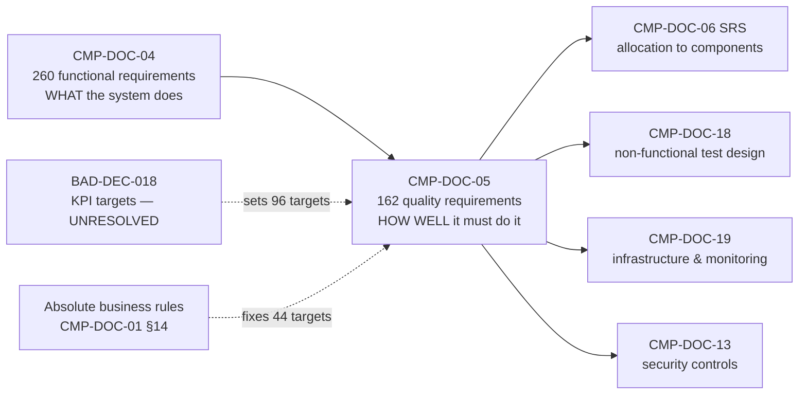
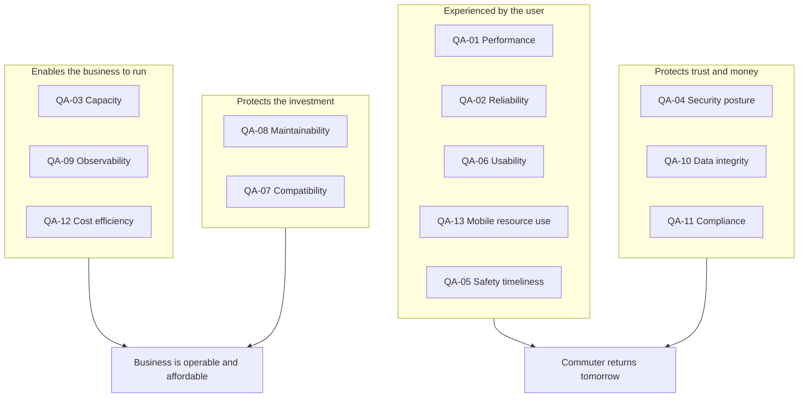
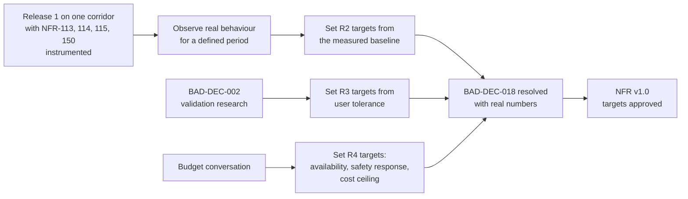
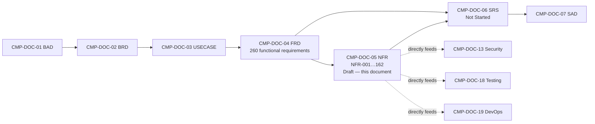

# Non-Functional Requirements / Quality Attributes (NFR)
## Carpool Mobility Platform (CMP)

---

# 0. Document Control

## 0.1 Document Control Table

| Field | Value |
|---|---|
| Document ID | CMP-DOC-05 |
| Document Name | Non-Functional Requirements / Quality Attributes |
| Short Name | NFR |
| Project Name | Carpool Mobility Platform |
| Project Code | CMP |
| Version | 0.1 |
| Status | Draft |
| Date | 2026-08-16 |
| Author | Solution Architect (AI-assisted) |
| Reviewer | [TBD] |
| Approver | Project Owner |
| Classification | Internal |
| Brand | TBD |
| Previous Version | None (initial issue) |
| Predecessor Documents | CMP-DOC-01 (BAD), CMP-DOC-02 (BRD), CMP-DOC-03 (USECASE), CMP-DOC-04 (FRD) — all v0.1, **all Draft, none approved** |
| Related Documents | `00_Project_Control/README.md`, `Documentation_Index.md`, `Documentation_Status.md`, `Document_Change_Log.md`, `Glossary.md`, `Master_Traceability_Matrix.md` |
| Successor Documents | CMP-DOC-06 (SRS) — Not Started |

## 0.2 Revision History

| Version | Date | Author | Change | Status |
|---|---|---|---|---|
| 0.1 | 2026-08-16 | Solution Architect (AI-assisted) | Initial issue. Defines 162 quality requirements (`NFR-001` … `NFR-162`) across 13 quality attributes, each with a measurable metric, a measurement method and a measurement point. **No target value is invented**: 44 are Absolute (derived from an approved absolute business rule), 49 carry a stated non-numeric target, and 69 are `[TBD]` against a named decision. Includes a target-setting framework (§19). | Draft |

## 0.3 Distribution List

| Role | Purpose |
|---|---|
| Project Owner | Approval authority; **owner of every `[TBD-BUS]` target** |
| Solution Architect | Authoring; input to CMP-DOC-06 and CMP-DOC-07 |
| Software Architect (Mobile / Backend) | Design constraints for CMP-DOC-08 / CMP-DOC-09 |
| **QA Analyst** | **Primary consumer** — quality requirements are the basis of non-functional testing in CMP-DOC-18 |
| **DevOps Engineer** | **Primary consumer** — availability, capacity, observability, operability |
| Security Analyst | Security posture; detailed controls in CMP-DOC-13 |
| UI/UX Designer | Usability and accessibility requirements |
| Product Owner | Cost efficiency, mobile experience, target trade-offs |
| Trust & Safety | Safety-critical timeliness (§9) |

## 0.4 Approval

| Role | Name | Signature | Date |
|---|---|---|---|
| Author | Solution Architect (AI-assisted) | — | 2026-08-16 |
| Reviewer | [TBD] | — | — |
| Approver | Project Owner | — | — |

> **This document is NOT approved.** It is issued at version 0.1 with status `Draft`
> for Project Owner review.

## 0.5 Purpose of This Document

This document states **how well** the Carpool Mobility Platform must perform the
functions specified in CMP-DOC-04.

A functional requirement says the platform verifies a payment. A quality requirement says
how quickly, how reliably, under what load, with what observability, and at what cost. A
system can satisfy every functional requirement in CMP-DOC-04 and still be unusable,
unaffordable or unsafe.

Each quality requirement:

- carries a stable identifier (`NFR-nnn`);
- states a **measurable metric** — not an adjective;
- states **how and where it is measured**;
- states a **target**, or records that the target is undecided **and who must decide it**;
- carries a priority and a verification method.

## 0.6 Scope and Boundary of This Document

**Contains:** the quality attribute model; 162 quality requirements across performance,
reliability, capacity, security posture, safety timeliness, usability, compatibility,
maintainability, observability, data quality, compliance, cost efficiency and
mobile-specific attributes; allocation of quality requirements to functional
requirements; a framework for setting the undecided targets; traceability; assumptions,
risks, open questions; acceptance criteria; statistics.

**Excludes:**

| Excluded | Belongs to |
|---|---|
| Functional behaviour | CMP-DOC-04 |
| Allocation of requirements to software components | CMP-DOC-06 |
| Architecture, technology choices, deployment topology | CMP-DOC-07 … CMP-DOC-09 |
| API contracts | CMP-DOC-10 |
| Database design, indexing, partitioning strategy | CMP-DOC-11 |
| Visual design and interaction detail | CMP-DOC-12 |
| **Security controls, threat model, cryptographic design** | **CMP-DOC-13** |
| Payment integration mechanics | CMP-DOC-14 |
| Test plans, environments, tooling | CMP-DOC-18 |
| Infrastructure sizing, monitoring stack, alerting configuration | CMP-DOC-19 |

**On the boundary with CMP-DOC-13.** This document states the **security posture the
business requires** — what must be true, measurably. CMP-DOC-13 states **how** it is
achieved. `NFR-053` requires that credentials never be recoverable from storage;
CMP-DOC-13 chooses the mechanism.

## 0.7 Intended Audience

Solution Architects · Software Architects · QA Engineers · DevOps Engineers · Security
Engineers · Android Developers · Backend Developers · UI/UX Designers · Product Owners ·
Technical Leads.

## 0.8 Basis of This Document — and Two Material Qualifications

### 0.8.1 Source

**FACT.** Derived from **CMP-DOC-01**, **CMP-DOC-02**, **CMP-DOC-03** and **CMP-DOC-04**,
all v0.1, and from no other source. No new evidence, research or business decision became
available.

### 0.8.2 Qualification 1 — Four Unapproved Predecessors

> **WARNING.** All four predecessors are at status `Draft`. This document rests on an
> unapproved chain **four documents deep**. Recorded as `NFR-RISK-001` and in
> `Document_Change_Log.md` conflict entry **CC-005**.

### 0.8.3 Qualification 2 — No Target Value Has Been Approved, and None Is Invented

This is the defining constraint on this document, and it deserves plain statement.

**FACT.** `BAD-DEC-018` (set KPI targets) is unresolved. No performance budget,
availability commitment, capacity forecast, response-time expectation or cost ceiling has
been supplied or approved. CMP-DOC-01 `BAD-CON-018` records that no user research, market
data or operational history exists from which such values could be derived.

`README.md` §9.2 prohibits inventing SLA commitments.

**Therefore this document does not state a number where the business has not set one.**
Instead, every quality requirement states the metric precisely enough that a target can be
attached the moment one is decided, and §19 sets out how to arrive at each.

| Target class | Meaning | Count |
|---|---|---|
| **Absolute** (‡) | Derived from an absolute business rule already approved in the chain. Not invented — the rule itself fixes the value (typically zero or 100%). | 44 |
| **Stated** | A non-numeric target that is decidable today without a business decision — *sub-linear*, *configurable*, *full compliance*, *no degradation*, *instrumented from R1*. Real targets, verifiable, and not numbers anyone had to guess. | 49 |
| **`[TBD-BUS]`** | A numeric value requiring a Project Owner business decision, chiefly `BAD-DEC-018`. | 47 |
| **`[TBD-TECH]`** | Requires an architecture or engineering decision; routed to CMP-DOC-07 / CMP-DOC-09 / CMP-DOC-19. | 22 |

**Ninety-three of 162 requirements (57%) therefore carry a target that is enforceable
today** — the 44 Absolute plus the 49 Stated. Only the 47 `[TBD-BUS]` genuinely await a
number the business has not chosen.

> **What "Absolute" means here, and why it is not invention.** CMP-DOC-01 `BAD-RULE-027`
> states that confirmed seats may never exceed seats offered. The corresponding quality
> requirement — seat over-allocation incidents: **zero** — is not a performance target the
> author chose. It is the arithmetic consequence of an approved rule. The same applies to
> payment status integrity, audit completeness and safety-signal loss.

> **RECOMMENDATION.** A document full of `[TBD]` is uncomfortable, and the temptation to
> populate it with plausible industry numbers is real. Resist it. A target the business
> has not chosen is a commitment nobody owns, and it will be measured, missed and argued
> about. §19 gives a cheap route to real numbers: measure the first release, then set
> targets from observed behaviour.

## 0.9 Statement Classification Convention

As `README.md` §9.1. Markers used: **FACT**, **ASSUMPTION**, **BUSINESS DECISION
REQUIRED**, **TECHNICAL DECISION REQUIRED**, **OPEN QUESTION**, **TBD**, **FUTURE
CONSIDERATION**, **RECOMMENDATION**.

## 0.10 Identifier Conventions

| Prefix | Element | Section |
|---|---|---|
| `NFR-nnn` | Quality requirement (**traceable**) | 5–17 |
| `NFR-QA-nn` | Quality attribute | 4 |
| `NFR-ASM-nnn` | Assumption | 21.1 |
| `NFR-RISK-nnn` | Risk | 21.2 |
| `NFR-OQ-nnn` | Open Question | 21.3 |

> **ASSUMPTION (`NFR-ASM-001`).** `README.md` §9.3 allocates `NFR-` to this document. The
> auxiliary prefixes follow the convention recorded as conflict **CC-001**, pending
> `BAD-DEC-024`. Only `NFR-nnn` participates in the traceability chain.

## 0.11 Table of Contents

| § | Section |
|---|---|
| 0 | Document Control |
| 1 | Executive Summary |
| 2 | Scope and Approach |
| 3 | Requirement Conventions |
| 4 | Quality Attribute Model |
| 5 | Performance Efficiency |
| 6 | Reliability and Availability |
| 7 | Capacity and Scalability |
| 8 | Security Posture |
| 9 | Safety-Critical Timeliness |
| 10 | Usability and Accessibility |
| 11 | Compatibility and Portability |
| 12 | Maintainability |
| 13 | Observability and Operability |
| 14 | Data Quality and Integrity |
| 15 | Compliance and Localisation |
| 16 | Cost Efficiency |
| 17 | Mobile-Specific Quality Attributes |
| 18 | Allocation to Functional Requirements |
| 19 | Target-Setting Framework |
| 20 | Traceability |
| 21 | Assumptions, Risks and Open Questions |
| 22 | Business Decisions Required |
| 23 | Acceptance Criteria for This Document |
| 24 | Statistics and Recommendations |
| A | Appendix A — Quality Requirement Index |
| B | Appendix B — Absolute Targets |
| C | Appendix C — Terminology Reference |

---

# 1. Executive Summary

## 1.1 What This Document Delivers

| Element | Count |
|---|---|
| Quality attributes | 13 |
| Quality requirements | **162** (`NFR-001` … `NFR-162`) |
| Targets that are **Absolute** (rule-derived, not invented) | 44 |
| Targets that are **Stated** (non-numeric, decidable today) | 49 |
| Targets requiring a **business** decision | 47 |
| Targets requiring a **technical** decision | 22 |
| **Requirements enforceable without any further decision** | **93 (57%)** |
| Quality requirements allocated to functional requirements | 162 |

## 1.2 Coverage by Quality Attribute

| § | Quality attribute | NFRs | Range | Absolute targets |
|---|---|---|---|---|
| 5 | Performance Efficiency | 22 | `NFR-001`–`022` | 0 |
| 6 | Reliability and Availability | 18 | `NFR-023`–`040` | 10 |
| 7 | Capacity and Scalability | 12 | `NFR-041`–`052` | 1 |
| 8 | Security Posture | 18 | `NFR-053`–`070` | 11 |
| 9 | Safety-Critical Timeliness | 8 | `NFR-071`–`078` | 4 |
| 10 | Usability and Accessibility | 14 | `NFR-079`–`092` | 2 |
| 11 | Compatibility and Portability | 10 | `NFR-093`–`102` | 2 |
| 12 | Maintainability | 10 | `NFR-103`–`112` | 0 |
| 13 | Observability and Operability | 12 | `NFR-113`–`124` | 3 |
| 14 | Data Quality and Integrity | 10 | `NFR-125`–`134` | 7 |
| 15 | Compliance and Localisation | 8 | `NFR-135`–`142` | 3 |
| 16 | Cost Efficiency | 8 | `NFR-143`–`150` | 0 |
| 17 | Mobile-Specific | 12 | `NFR-151`–`162` | 1 |
| | **Total** | **162** | | **44** |

## 1.3 The Three Findings That Matter

**1 — Fifty-seven per cent of this document is already enforceable.**
Forty-four requirements are Absolute — rule-derived, needing no decision, testable from
the first build: seat over-allocation must be zero, payment status must never be
client-set, no safety signal may be lost, every recordable event must produce a record.
A further 49 carry Stated targets that are equally decidable today. **The quality
requirements that protect money, seats, safety and evidence are not waiting on
anybody.**

**2 — Only 47 targets genuinely await a number, and they are cheap to set.**
Forty-seven `[TBD-BUS]` targets await `BAD-DEC-018`. §19 recommends against setting them
by committee: instrument the first corridor, observe real behaviour, then set targets
from that baseline. This costs one release and produces numbers that mean something.

**3 — Two quality attributes carry business risk that has not been surfaced before.**
**Cost efficiency** (§16) — live tracking and routing are metered per trip and scale with
success, which CMP-DOC-01 scored at severity 6 but which no document has yet expressed as
a measurable requirement. **Mobile resource consumption** (§17) — continuous location
tracking on a commuter's own phone, on their own battery and data allowance, is a
retention risk the product concept does not mention at all.

## 1.4 What Cannot Be Specified Here

| Area | Reason |
|---|---|
| Availability commitment to users | No SLA has been decided, and none may be invented. `NFR-023` states the metric only. |
| Concurrency and volume forecasts | No user-count or market-size estimate exists (`BAD-CON-018`). Capacity requirements are expressed as *ratios and behaviours under load*, not absolute numbers. |
| Retention periods | `BAD-DEC-021` unresolved; `NFR-131`–`133` state the obligation to enforce whatever is decided. |
| Security control strength | Belongs to CMP-DOC-13; this document states the posture required. |

---

# 2. Scope and Approach

## 2.1 Basis of the Attribute Model

The attribute model in §4 is adapted from the **ISO/IEC 25010 product quality model**,
with two additions specific to this product:

| Addition | Why CMP needs it |
|---|---|
| **Safety-Critical Timeliness** (§9) | A carpooling platform carries people in strangers' vehicles. The timeliness of a safety signal is a distinct quality concern from general performance, and it is a launch gate (`BAD-SC-008`). |
| **Cost Efficiency** (§16) | CMP-DOC-01 `BAD-RISK-013` and `BM-1` identify metered third-party cost per trip as a business risk that scales with success. Treating it as a measurable quality attribute makes it visible before it becomes a problem. |

> **ASSUMPTION (`NFR-ASM-002`).** Use of ISO/IEC 25010 as the organising model is an
> author choice, not an approved standard for this project. It is used because it is
> comprehensive and widely understood. No claim of certification or conformance to any
> standard is made anywhere in this document (`README.md` §9.2).

## 2.2 What a Quality Requirement Must Do Here

Every requirement in this document answers four questions:

1. **What quality is required?** — stated as an obligation.
2. **How is it measured?** — a metric, not an adjective.
3. **Where is it measured?** — the measurement point, because "response time" measured at
   the server and at the handset are different numbers.
4. **What is the target?** — a value, or a named decision and its owner.

A requirement that cannot answer all four is not written.

## 2.3 Relationship to the Functional Baseline

## 2.4 The Gapped Functional Areas

CMP-DOC-04 records three functional areas with no requirements (Ratings & Reviews, Wallet
& Rewards, Recurring Commute) and 29 functional gaps.

**Quality requirements are still written for these areas where the quality obligation is
independent of the undecided behaviour.** For example, whatever the wallet eventually
does, `NFR-127` requires that a balance always reconciles to its ledger — that follows
from `BRD-REQ-131`, an absolute rule, not from the undecided economics.

Where the quality obligation *depends* on the undecided behaviour, no requirement is
written and the gap is noted in the section.

---

# 3. Requirement Conventions

## 3.1 Statement Form

> *The system shall …* — an obligation, qualified by a measurable condition.

## 3.2 Register Columns

| Column | Meaning |
|---|---|
| ID | `NFR-nnn`; **‡** marks a requirement whose target is Absolute |
| Quality Requirement | The obligation |
| Metric / Measurement | What is measured, and at which point |
| Target | A value, or `[TBD-BUS]` / `[TBD-TECH]` with the decision named in the section note |
| Pri | MoSCoW priority |
| V | Verification method: **T** Test · **D** Demonstration · **I** Inspection · **A** Analysis |

## 3.3 Target Notation

| Notation | Meaning | Who sets it |
|---|---|---|
| A value on a ‡ row | **Absolute** — fixed by an approved business rule. | Already set |
| A value on a non-‡ row | **Stated** — a non-numeric target decidable today (*sub-linear*, *configurable*, *zero*, *full compliance*). | Already set |
| `[TBD-BUS]` | A numeric value requiring a business decision. | Project Owner, chiefly via `BAD-DEC-018` |
| `[TBD-TECH]` | Architecture or engineering decision required. | Solution Architect, in CMP-DOC-07 / 09 / 19 |

## 3.4 Measurement Points

| Point | Meaning |
|---|---|
| **Server** | Measured within the platform, excluding network and device. |
| **Device** | Measured on the handset, as the user experiences it. |
| **End-to-end** | User action to user-visible result, including network. |
| **Operational** | Measured from platform records over a period. |
| **Build** | Measured in the build or analysis pipeline, not at runtime. |

> **Why this column exists.** Most disputes about performance requirements are disputes
> about where the stopwatch starts. Naming the measurement point removes the argument
> before it happens.

## 3.5 Priority

Inherited convention: **M** Must · **S** Should · **C** Could · **W** Won't.

## 3.6 The ‡ Marking

**‡** marks a requirement whose target is **Absolute** and therefore already enforceable.
These 44 requirements are testable from the first build and are not subject to
negotiation, because negotiating them would mean amending an approved business rule.

---

# 4. Quality Attribute Model

## 4.1 The Thirteen Attributes

| ID | Quality attribute | Business concern it protects | § |
|---|---|---|---|
| `NFR-QA-01` | **Performance Efficiency** | A commute decision is made in seconds; a slow platform is not used. | 5 |
| `NFR-QA-02` | **Reliability and Availability** | A commuter who cannot rely on the platform reverts to another mode permanently. | 6 |
| `NFR-QA-03` | **Capacity and Scalability** | Corridor density is the goal; the platform must not degrade as it succeeds. | 7 |
| `NFR-QA-04` | **Security Posture** | Identity documents, location history and money. | 8 |
| `NFR-QA-05` | **Safety-Critical Timeliness** | A safety signal that arrives late has not arrived. | 9 |
| `NFR-QA-06` | **Usability and Accessibility** | The trust decision must be makeable by anyone, quickly. | 10 |
| `NFR-QA-07` | **Compatibility and Portability** | Android device diversity; future platforms not precluded. | 11 |
| `NFR-QA-08` | **Maintainability** | 20 documents of requirements imply a long-lived system. | 12 |
| `NFR-QA-09` | **Observability and Operability** | Operators cannot run what they cannot see. | 13 |
| `NFR-QA-10` | **Data Quality and Integrity** | The record is the evidence, and the evidence is the platform's defence. | 14 |
| `NFR-QA-11` | **Compliance and Localisation** | Indian market, UPI ecosystem, undecided legal position. | 15 |
| `NFR-QA-12` | **Cost Efficiency** | Metered third-party cost scales with success. | 16 |
| `NFR-QA-13` | **Mobile Resource Consumption** | The platform runs on the user's battery and data allowance. | 17 |

## 4.2 Attribute Map

## 4.3 Attribute Trade-Offs the Business Must Understand

Quality attributes conflict. Four conflicts in this system are material and should be
decided consciously rather than resolved by accident during implementation.

| # | Trade-off | The tension | Who decides |
|---|---|---|---|
| TO-1 | **Tracking fidelity vs battery and data (`QA-01`/`QA-13`)** | More frequent position reporting improves ETA accuracy and safety visibility, and consumes more of the user's battery and data allowance. | Product Owner — `NFR-OQ-002` |
| TO-2 | **Tracking fidelity vs metered cost (`QA-01`/`QA-12`)** | The same frequency drives routing calls, which are billed per use and scale with trip volume. | Product Owner + Solution Architect |
| TO-3 | **Match quality vs search latency (`QA-01`/`QA-03`)** | Route-overlap matching over a large candidate set is more expensive than point-to-point matching. The differentiator is also the slowest operation. | Solution Architect — CMP-DOC-07 |
| TO-4 | **Audit completeness vs retention limits (`QA-10`/`QA-11`)** | `NFR-125` requires durable evidence; `NFR-131` requires deletion. A trip record is evidence for every participant. | Project Owner — `BAD-DEC-021` |

> **TO-4 is not merely a trade-off; it is an unresolved contradiction** already recorded
> as `FRD-GAP-028`. It cannot be settled by architecture. `BAD-DEC-021` must reconcile
> durability, retention and account closure.

---

# 5. Performance Efficiency

**Attribute:** `NFR-QA-01` · **Applies to:** the whole functional baseline
**Target decision:** `BAD-DEC-018` sets every target in this section.

> **Note on why every target here is `[TBD-BUS]`.** Response-time expectations are a
> product decision informed by user tolerance, not a technical constant. No research
> exists (`BAD-CON-018`). §19.2 gives the recommended route: measure the first corridor,
> then set targets from observed behaviour and observed abandonment.

## 5.1 Interaction Responsiveness

| ID | Quality Requirement | Metric / Measurement | Target | Pri | V |
|---|---|---|---|---|---|
| `NFR-001` | The system shall return ride search results within a bounded time. | Elapsed time from search submission to results displayed · **End-to-end**, 50th and 95th percentile | `[TBD-BUS]` | M | T |
| `NFR-002` | The system shall complete route-overlap matching within a bounded time irrespective of candidate set size. | Server-side matching duration per search · **Server**, 95th percentile | `[TBD-BUS]` | M | T |
| `NFR-003` | The system shall present the ride detail within a bounded time of selection. | Selection to detail displayed · **End-to-end**, 95th percentile | `[TBD-BUS]` | M | T |
| `NFR-004` | The system shall complete ride publication within a bounded time of submission. | Submission to confirmation displayed · **End-to-end**, 95th percentile | `[TBD-BUS]` | M | T |
| `NFR-005` | The system shall confirm or decline a ride request within a bounded time. | Request submission to outcome displayed · **End-to-end**, 95th percentile | `[TBD-BUS]` | M | T |
| `NFR-006` | The system shall present the amount payable within a bounded time of the passenger reaching payment. | Elapsed time to amount displayed · **End-to-end**, 95th percentile | `[TBD-BUS]` | M | T |
| `NFR-007` | The system shall establish a verified payment status within a bounded time of a payment attempt. | Attempt to verified status recorded · **Server**, 95th percentile | `[TBD-BUS]` | M | T |
| `NFR-008` | The system shall authenticate a user within a bounded time. | Credential submission to session established · **End-to-end**, 95th percentile | `[TBD-BUS]` | S | T |

## 5.2 Live Trip Responsiveness

| ID | Quality Requirement | Metric / Measurement | Target | Pri | V |
|---|---|---|---|---|---|
| `NFR-009` | The system shall reflect a change in vehicle position to trip participants within a bounded time of that position being obtained. | Position obtained to position displayed · **End-to-end**, 95th percentile | `[TBD-BUS]` | M | T |
| `NFR-010` | The system shall obtain vehicle position at a defined interval during an active trip. | Interval between successive position fixes · **Device** | `[TBD-TECH]` — see TO-1, TO-2 | M | T |
| `NFR-011` | The system shall recompute estimated time of arrival at a defined interval during an active trip. | Interval between ETA recomputations · **Server** | `[TBD-TECH]` | M | T |
| `NFR-012` | The system shall bound the staleness of any position presented as current. | Age of the displayed position · **Device** | `[TBD-BUS]` | M | T |
| `NFR-013` | The system shall deliver a trip-state change to participants within a bounded time of the change. | State change recorded to participant notified · **End-to-end**, 95th percentile | `[TBD-BUS]` | M | T |

> **`NFR-010` and `NFR-012` together implement `FRD-FR-150`** — that a previously known
> position is never presented as current. `FRD-FR-150` states the rule; `NFR-012` makes
> "current" measurable.

## 5.3 Communication and Notification Responsiveness

| ID | Quality Requirement | Metric / Measurement | Target | Pri | V |
|---|---|---|---|---|---|
| `NFR-014` | The system shall deliver a message to an online recipient within a bounded time of sending. | Send to delivery · **End-to-end**, 95th percentile | `[TBD-BUS]` | M | T |
| `NFR-015` | The system shall issue a time-critical notification within a bounded time of its triggering event. | Event recorded to notification issued · **Server**, 95th percentile | `[TBD-BUS]` | M | T |
| `NFR-016` | The system shall define which notification categories are time-critical. | Categorisation · **Inspection** | `[TBD-BUS]` | M | I |

> **`NFR-015` and `NFR-016` are the quality expression of `BRD-REQ-143`**, which
> CMP-DOC-04 §11.4 deliberately deferred here as a quality attribute. The obligation is
> stated; the value and the category list are the Project Owner's.

## 5.4 Administrative and Reporting Responsiveness

| ID | Quality Requirement | Metric / Measurement | Target | Pri | V |
|---|---|---|---|---|---|
| `NFR-017` | The system shall return an operator record search within a bounded time. | Search to results · **End-to-end**, 95th percentile | `[TBD-BUS]` | S | T |
| `NFR-018` | The system shall present a safety incident with its full context within a bounded time of an operator opening it. | Open to full context displayed · **End-to-end**, 95th percentile | `[TBD-BUS]` | M | T |
| `NFR-019` | The system shall produce a reported measure within a bounded time of request. | Request to report available · **Server** | `[TBD-BUS]` | C | T |

## 5.5 Resource Efficiency at the Platform

| ID | Quality Requirement | Metric / Measurement | Target | Pri | V |
|---|---|---|---|---|---|
| `NFR-020` | The system shall bound the server resource consumed per search. | CPU-time and memory per search · **Server**, mean and 95th percentile | `[TBD-TECH]` | S | A |
| `NFR-021` | The system shall bound the number of external routing calls made per search. | Routing calls per search · **Operational** | `[TBD-TECH]` — see `NFR-144` | M | I |
| `NFR-022` | The system shall bound the number of external routing calls made per active trip. | Routing calls per completed trip · **Operational** | `[TBD-TECH]` — see `NFR-145` | M | I |

> **`NFR-021` and `NFR-022` are performance requirements with a direct commercial
> consequence.** They are restated as cost requirements in §16 because the same
> measurement serves both. This is the measurable form of CMP-DOC-01 `BM-1`.

---

# 6. Reliability and Availability

**Attribute:** `NFR-QA-02` · **Ten Absolute targets** — the integrity requirements here
derive from approved absolute rules and are enforceable today.

## 6.1 Availability

| ID | Quality Requirement | Metric / Measurement | Target | Pri | V |
|---|---|---|---|---|---|
| `NFR-023` | The system shall be available to users for booking and travel. | Successful availability checks ÷ total, per calendar month · **Operational** | `[TBD-BUS]` | M | T |
| `NFR-024` | The system shall define its planned maintenance windows and exclude them from the availability measure. | Window definition and exclusions · **Inspection** | `[TBD-BUS]` | S | I |
| `NFR-025` ‡ | The system shall remain able to execute an active trip during a planned maintenance window. | Active-trip capability during maintenance · **Demonstration** | Required | M | D |
| `NFR-026` | The system shall bound the time to restore service after an unplanned interruption. | Interruption detected to service restored · **Operational** | `[TBD-BUS]` | M | T |

> **`NFR-025` carries a stated target ("Required") rather than a number** because it is a
> binary capability, not a threshold. A trip in progress carries people; a maintenance
> window must not strand them. **RECOMMENDATION:** treat this as a release gate.

## 6.2 Correctness Under Failure

| ID | Quality Requirement | Metric / Measurement | Target | Pri | V |
|---|---|---|---|---|---|
| `NFR-027` ‡ | The system shall never confirm a booking whose payment is not verified, under any failure condition. | Bookings confirmed without verified payment · **Operational** | **Zero** | M | T |
| `NFR-028` ‡ | The system shall never allow confirmed seats to exceed seats offered, under any concurrency condition. | Seat over-allocation incidents · **Operational** | **Zero** | M | T |
| `NFR-029` ‡ | The system shall never record a payment as verified other than by its own verification. | Payment statuses set by any other path · **Operational** | **Zero** | M | T |
| `NFR-030` ‡ | The system shall never lose a safety signal, under any failure condition. | Safety signals received but not recorded as incidents · **Operational** | **Zero** | M | T |
| `NFR-031` ‡ | The system shall never report an action as complete where its auditable record was not written. | Completed actions lacking an audit record · **Operational** | **Zero** | M | T |
| `NFR-032` ‡ | The system shall never resolve an indeterminate payment by assumption. | Payments resolved without verification evidence · **Operational** | **Zero** | M | T |
| `NFR-033` ‡ | The system shall never present a client-asserted value as authoritative. | Accepted client assertions of authoritative state · **Operational** | **Zero** | M | T |

## 6.3 Fault Tolerance and Recovery

| ID | Quality Requirement | Metric / Measurement | Target | Pri | V |
|---|---|---|---|---|---|
| `NFR-034` ‡ | The system shall continue to operate in its defined degraded mode when any single supporting service is unavailable. | Degraded-mode behaviour per supporting service · **Demonstration** | All services covered | M | D |
| `NFR-035` ‡ | The system shall withdraw rather than degrade any capability whose degradation would compromise an absolute rule. | Capabilities degraded in breach of an absolute rule · **Operational** | **Zero** | M | T |
| `NFR-036` | The system shall bound the time to detect that a supporting service is unavailable. | Failure onset to detection · **Operational** | `[TBD-TECH]` | M | T |
| `NFR-037` | The system shall recover deferred work after a supporting service is restored, without loss. | Deferred items lost on recovery · **Operational** | **Zero** | M | T |
| `NFR-038` | The system shall bound data loss in the event of a platform failure. | Recovery point objective · **Operational** | `[TBD-BUS]` | M | A |
| `NFR-039` | The system shall bound the time to recover from a platform failure. | Recovery time objective · **Operational** | `[TBD-BUS]` | M | A |
| `NFR-040` | The system shall bound the rate of failed user-initiated operations. | Failed operations ÷ attempted, by operation · **Operational** | `[TBD-BUS]` | M | T |

> **`NFR-037` is Absolute in value but not marked ‡** because its underlying rule
> (`FRD-FR-175`, `FRD-FR-190`, `FRD-FR-205` — queue rather than discard) is stated across
> several functional requirements rather than as a single absolute business rule. It
> should nonetheless be treated as non-negotiable.
>
> **`NFR-038` and `NFR-039` are RPO and RTO.** They are business decisions with direct
> infrastructure cost consequences, and are routed to `BAD-DEC-018` and CMP-DOC-19.

---

# 7. Capacity and Scalability

**Attribute:** `NFR-QA-03`

> **Why there are no volume numbers in this section.** CMP-DOC-01 `BAD-CON-018` records
> that no user count, market size or adoption estimate exists, and `README.md` §9.2
> prohibits inventing them. Capacity requirements are therefore expressed as
> **behaviours and ratios under increasing load**, which are measurable without knowing
> the absolute volume, and as **headroom against an observed baseline**.

| ID | Quality Requirement | Metric / Measurement | Target | Pri | V |
|---|---|---|---|---|---|
| `NFR-041` | The system shall sustain its performance requirements up to a defined concurrent-user level. | Concurrent users at which §5 targets still hold · **Operational** | `[TBD-BUS]` | M | T |
| `NFR-042` | The system shall sustain its performance requirements up to a defined concurrent active-trip level. | Concurrent active trips at which §5.2 targets still hold · **Operational** | `[TBD-BUS]` | M | T |
| `NFR-043` | The system shall maintain search performance as the number of published rides on a corridor grows. | Search duration vs candidate-set size · **Server**, regression slope | Sub-linear | M | T |
| `NFR-044` | The system shall maintain matching quality as candidate-set size grows. | Match rate and overlap accuracy vs candidate-set size · **Operational** | No degradation | M | T |
| `NFR-045` | The system shall degrade predictably rather than fail when load exceeds its sustained level. | Behaviour beyond sustained load · **Demonstration** | Defined and graceful | M | D |
| `NFR-046` ‡ | The system shall preserve seat and payment integrity at any load. | Integrity breaches under load test · **Operational** | **Zero** | M | T |
| `NFR-047` | The system shall support the addition of corridors without change to the matching behaviour of existing corridors. | Existing-corridor match rate before/after addition · **Operational** | No degradation | M | T |
| `NFR-048` | The system shall support growth in stored trip, message and ledger volume without degradation of operator search. | Operator search duration vs stored volume · **Server** | Sub-linear | S | T |
| `NFR-049` | The system shall define the headroom maintained above observed peak load. | Provisioned capacity ÷ observed peak · **Operational** | `[TBD-TECH]` | M | A |
| `NFR-050` | The system shall bound the growth rate of stored data per completed trip. | Bytes retained per completed trip · **Operational** | `[TBD-TECH]` | S | A |
| `NFR-051` | The system shall support increase in capacity without service interruption. | Interruption during scaling · **Demonstration** | None | S | D |
| `NFR-052` | The system shall not assume a single city, corridor or region in any capacity-bearing design. | Design inspection · **Build** | No such assumption | S | I |

> **`NFR-043` and `NFR-044` are the capacity expression of the platform's
> differentiator.** Route-overlap matching over a growing candidate set is the operation
> most likely to degrade as the business succeeds (trade-off TO-3). Sub-linear growth is
> stated as a *shape* requirement rather than a number, which is measurable today.
>
> **`NFR-052` protects `BRD-REQ-185`** (do not preclude future markets), which CMP-DOC-04
> §11.4 correctly declined to make a functional requirement. It is a design-time quality
> requirement, verifiable by inspection.

---

# 8. Security Posture

**Attribute:** `NFR-QA-04`
**Boundary:** this section states **what must be true**. CMP-DOC-13 states **how**.
**Eleven Absolute targets.**

## 8.1 Authentication and Session Integrity

| ID | Quality Requirement | Metric / Measurement | Target | Pri | V |
|---|---|---|---|---|---|
| `NFR-053` ‡ | The system shall ensure that authentication credentials are not recoverable from any store the platform controls. | Credentials recoverable in plaintext or reversible form · **Inspection** | **Zero** | M | I |
| `NFR-054` ‡ | The system shall ensure that a terminated session cannot be reused. | Successful requests on a terminated session · **Operational** | **Zero** | M | T |
| `NFR-055` | The system shall bound the lifetime of an authenticated session. | Maximum session lifetime · **Inspection** | `[TBD-TECH]` | M | I |
| `NFR-056` | The system shall bound the rate of authentication attempts against an account. | Attempts permitted per period · **Server** | `[TBD-TECH]` | M | T |
| `NFR-057` | The system shall bound the rate of phone-verification attempts against a number. | Attempts permitted per period · **Server** | `[TBD-TECH]` | M | T |

## 8.2 Authorisation Integrity

| ID | Quality Requirement | Metric / Measurement | Target | Pri | V |
|---|---|---|---|---|---|
| `NFR-058` ‡ | The system shall ensure that no action is performed by an actor whose role does not permit it. | Actions performed without a permitting role · **Operational** | **Zero** | M | T |
| `NFR-059` ‡ | The system shall ensure that no operator action bypasses an absolute business rule. | Operator actions breaching an absolute rule · **Operational** | **Zero** | M | T |
| `NFR-060` ‡ | The system shall record every refused authorisation. | Refusals lacking a record · **Operational** | **Zero** | M | I |
| `NFR-061` ‡ | The system shall ensure that a user can access only the records to which they are a party. | Cross-user record accesses · **Operational** | **Zero** | M | T |

## 8.3 Data Protection Posture

| ID | Quality Requirement | Metric / Measurement | Target | Pri | V |
|---|---|---|---|---|---|
| `NFR-062` ‡ | The system shall protect personal data in transit between client and platform. | Unprotected transmissions · **Inspection** | **Zero** | M | I |
| `NFR-063` ‡ | The system shall protect identity evidence and payment-related data at rest. | Unprotected at-rest stores of such data · **Inspection** | **Zero** | M | I |
| `NFR-064` ‡ | The system shall ensure that location history is accessible only to parties entitled to it. | Unentitled location accesses · **Operational** | **Zero** | M | T |
| `NFR-065` | The system shall minimise the personal data it collects to that required by a stated purpose. | Collected fields lacking a stated purpose · **Inspection** | **Zero** | M | I |
| `NFR-066` | The system shall bound the personal data disclosed between users to what the business has decided. | Disclosures beyond the decided boundary · **Operational** | **Zero** once decided | M | T |

> **`NFR-066` states a zero target against an undecided boundary.** The obligation not to
> exceed the boundary is absolute; the boundary itself is `BAD-DEC-022`. This is stated
> deliberately: the requirement becomes testable the moment the decision is taken, and
> until then it prevents the boundary being set implicitly in code.

## 8.4 Integrity Against Manipulation

| ID | Quality Requirement | Metric / Measurement | Target | Pri | V |
|---|---|---|---|---|---|
| `NFR-067` ‡ | The system shall reject every client-supplied value purporting to determine authoritative state. | Accepted such values · **Operational** | **Zero** | M | T |
| `NFR-068` ‡ | The system shall ensure that auditable records cannot be altered or deleted without detection. | Undetected alterations · **Operational** | **Zero** | M | T |
| `NFR-069` | The system shall detect and record attempts to assert authoritative state. | Detected attempts recorded · **Operational** | 100% | M | I |
| `NFR-070` | The system shall define its posture toward automated abuse of registration, search and request functions. | Abuse-control posture · **Inspection** | `[TBD-TECH]` — **gap, see note** | M | I |

> **`NFR-070` records a known gap in the requirement baseline.** CMP-DOC-02 `BRD-OQ-010`,
> CMP-DOC-01 `BAD-OQ-014` and traceability `GAP-005` all record that **fraud and abuse
> requirements do not exist** anywhere in the chain, while `BAD-RISK-011` scores fraud at
> severity 6. This quality requirement names the gap rather than leaving it silent; the
> substance belongs to CMP-DOC-13.

---

# 9. Safety-Critical Timeliness

**Attribute:** `NFR-QA-05` · **Four Absolute targets**

> **WARNING.** This section states timeliness requirements for the **safety incident
> pipeline**, which CMP-DOC-04 specifies and which may be built. It does **not** state
> response-time requirements for the SOS control or the human response protocol, because
> neither exists (`BAD-DEC-011`, `FRD-GAP-020`). A response-time target for a protocol
> that has not been written would be meaningless.

| ID | Quality Requirement | Metric / Measurement | Target | Pri | V |
|---|---|---|---|---|---|
| `NFR-071` ‡ | The system shall record a safety signal as an incident without loss, irrespective of platform load or supporting-service availability. | Signals lost · **Operational** | **Zero** | M | T |
| `NFR-072` | The system shall record a safety incident within a bounded time of the signal. | Signal received to incident recorded · **Server**, maximum | `[TBD-BUS]` | M | T |
| `NFR-073` | The system shall place a safety incident in the operator queue within a bounded time of recording it. | Incident recorded to queued · **Server**, maximum | `[TBD-BUS]` | M | T |
| `NFR-074` ‡ | The system shall capture the full available context with a safety incident at the moment of the signal. | Incidents lacking available context · **Operational** | **Zero** | M | T |
| `NFR-075` ‡ | The system shall retain and retry an incident that cannot immediately reach the operator queue, until it succeeds. | Incidents abandoned before queueing · **Operational** | **Zero** | M | T |
| `NFR-076` ‡ | The system shall ensure that safety-category notifications are delivered irrespective of user notification preferences. | Safety notifications suppressed by preference · **Operational** | **Zero** | M | T |
| `NFR-077` | The system shall bound the time to present a safety incident with full context to a responder. | Responder opens incident to full context displayed · **End-to-end**, maximum | `[TBD-BUS]` | M | T |
| `NFR-078` | The system shall define the operating hours during which safety response timeliness applies. | Declared coverage hours · **Inspection** | `[TBD-BUS]` — `BAD-DEC-011`, `BAD-OQ-021` | M | I |

> **Why `NFR-072`, `073` and `077` use *maximum* rather than a percentile.** For most
> performance requirements a 95th percentile is the right measure, because the occasional
> slow response is tolerable. For a safety signal it is not: the one incident in a hundred
> that takes ten times as long is precisely the one that matters. **RECOMMENDATION:** set
> these three as hard maxima with alerting on breach, not as percentiles.
>
> **`NFR-078` is the honest one.** A platform that presents an emergency control implies
> that someone is watching. If response is not continuous, the coverage must be decided
> and — per CMP-DOC-02 `BRD-REQ-121` — made clear to users.

---

# 10. Usability and Accessibility

**Attribute:** `NFR-QA-06` · **Consumed by CMP-DOC-12** · **Two Absolute targets**

> **Boundary.** This section states measurable usability obligations. It does not
> prescribe layout, wording or visual treatment — those are CMP-DOC-12's.

## 10.1 Task Efficiency

| ID | Quality Requirement | Metric / Measurement | Target | Pri | V |
|---|---|---|---|---|---|
| `NFR-079` | The system shall enable a passenger to complete search to confirmed booking without leaving the flow. | Interruptions requiring a separate flow · **Demonstration** | Zero, other than payment authorisation | M | D |
| `NFR-080` | The system shall bound the number of user actions required to publish a ride. | Discrete user actions to publish · **Demonstration** | `[TBD-BUS]` | M | D |
| `NFR-081` | The system shall bound the number of user actions required to republish a previously published ride. | Discrete user actions · **Demonstration** | `[TBD-BUS]` | S | D |
| `NFR-082` | The system shall bound the time a representative user takes to complete first registration. | Task completion time · **Operational**, median | `[TBD-BUS]` | S | T |
| `NFR-083` | The system shall bound the task-abandonment rate for search, booking and payment. | Abandonment ÷ started, per flow · **Operational** | `[TBD-BUS]` | M | T |

> **`NFR-080` and `NFR-081` are the measurable form of persona `BAD-PER-002`'s
> requirement** — *"offer seats in seconds"* (`BRD-SR-012`). A driver who finds publishing
> tedious stops publishing, and supply is the scarcer side.

## 10.2 Comprehensibility at the Point of Decision

| ID | Quality Requirement | Metric / Measurement | Target | Pri | V |
|---|---|---|---|---|---|
| `NFR-084` ‡ | The system shall present verification standing, vehicle information, fare, timing, seats and preferences before any commitment is sought. | Commitments sought without prior presentation · **Operational** | **Zero** | M | T |
| `NFR-085` | The system shall express route-overlap match quality in terms a passenger can act on without explanation. | Comprehension in representative testing · **Operational** | `[TBD-BUS]` | M | T |
| `NFR-086` ‡ | The system shall distinguish cached information from current information wherever both may appear. | Cached values presented as current · **Operational** | **Zero** | M | T |
| `NFR-087` | The system shall state the reason for every refusal it presents to a user. | Refusals presented without a reason · **Operational** | **Zero** | M | T |

## 10.3 Accessibility

| ID | Quality Requirement | Metric / Measurement | Target | Pri | V |
|---|---|---|---|---|---|
| `NFR-088` | The system shall define the accessibility standard it conforms to, and the conformance level. | Declared standard and level · **Inspection** | `[TBD-BUS]` — see note | M | I |
| `NFR-089` | The system shall remain operable with the platform's assistive technologies enabled. | Task completion with assistive technology · **Demonstration** | All primary tasks | M | D |
| `NFR-090` | The system shall remain legible and operable at the platform's supported text-scaling settings. | Layout and operability across supported scales · **Demonstration** | No loss of function | M | D |
| `NFR-091` | The system shall not rely on colour alone to convey verification standing, trip state or payment status. | Instances relying on colour alone · **Inspection** | **Zero** | M | I |
| `NFR-092` | The system shall keep every safety control reachable without dependence on precise gestures. | Safety controls requiring precise gestures · **Inspection** | **Zero** | M | I |

> **`NFR-088` is deliberately left as a decision, not filled with a standard name.** No
> accessibility standard or conformance level has been chosen for this project, and
> `README.md` §9.2 prohibits claiming conformance to one that has not been approved.
> **RECOMMENDATION:** choose a standard early — accessibility retrofitted after the UI is
> built is materially more expensive than accessibility designed in, and CMP-DOC-12 has
> not started.
>
> **`NFR-092` exists because of who uses safety controls.** A control that requires a
> steady hand and precise aim is the wrong design for someone in distress in a moving
> vehicle.

---

# 11. Compatibility and Portability

**Attribute:** `NFR-QA-07` · **Two Absolute targets**

| ID | Quality Requirement | Metric / Measurement | Target | Pri | V |
|---|---|---|---|---|---|
| `NFR-093` | The system shall define the range of Android versions it supports. | Declared supported range · **Inspection** | `[TBD-TECH]` | M | I |
| `NFR-094` | The system shall define the device characteristics it supports, including screen size and memory class. | Declared supported characteristics · **Inspection** | `[TBD-TECH]` | M | I |
| `NFR-095` | The system shall remain functional across the declared device range without loss of primary capability. | Primary tasks completed per device class · **Test** | All primary tasks | M | T |
| `NFR-096` | The system shall comply with the distribution platform's technical requirements applicable at release. | Compliance check · **Inspection** | Full compliance | M | I |
| `NFR-097` | The system shall operate correctly across the UPI applications it declares support for. | Payment completion per declared application · **Test** | All declared | M | T |
| `NFR-098` ‡ | The system shall keep client applications free of authoritative business logic. | Authoritative decisions taken client-side · **Inspection** | **Zero** | M | I |
| `NFR-099` ‡ | The system shall expose its capability through a versioned interface, so that a client version change does not require a platform change. | Breaking changes without a version increment · **Inspection** | **Zero** | M | I |
| `NFR-100` | The system shall not embed assumptions that preclude support for an additional client platform. | Design inspection · **Build** | No such assumption | S | I |
| `NFR-101` | The system shall not embed assumptions that preclude an additional payment method. | Design inspection · **Build** | No such assumption | S | I |
| `NFR-102` | The system shall not embed assumptions that preclude an additional market or currency. | Design inspection · **Build** | No such assumption | S | I |

> **`NFR-098` is the quality expression of the Business Authority Principle.** CMP-DOC-04
> `FRD-FR-237`–`243` state the behaviour; this states the structural property that makes
> it durable — and it is what makes `NFR-100` achievable at all. CMP-DOC-01 `BAD-OPP-009`
> identified this as a strategic benefit of the approved architecture.
>
> **`NFR-100`–`102` are the measurable form of `BRD-REQ-185`**, which CMP-DOC-04 §11.4
> correctly declined to state functionally. They are verifiable by design inspection, and
> they are cheap now and expensive later.

---

# 12. Maintainability

**Attribute:** `NFR-QA-08` · Consumed by CMP-DOC-06 through CMP-DOC-09

| ID | Quality Requirement | Metric / Measurement | Target | Pri | V |
|---|---|---|---|---|---|
| `NFR-103` | The system shall keep business rules expressed in one place per rule. | Rules implemented in more than one location · **Inspection** | **Zero** | M | I |
| `NFR-104` | The system shall keep every absolute business rule enforced at the platform, not in a client. | Absolute rules enforced only client-side · **Inspection** | **Zero** | M | I |
| `NFR-105` | The system shall define its automated test coverage expectation. | Coverage measure and threshold · **Build** | `[TBD-TECH]` | M | I |
| `NFR-106` | The system shall carry an automated test for every requirement marked integrity-critical in CMP-DOC-04. | Integrity-critical requirements with a negative test · **Build** | 100% of 81 | M | I |
| `NFR-107` | The system shall bound the time from code change to a verified build. | Commit to build verified · **Build** | `[TBD-TECH]` | S | T |
| `NFR-108` | The system shall keep configuration that varies by environment out of the built artefact. | Environment values embedded in artefacts · **Build** | **Zero** | M | I |
| `NFR-109` | The system shall keep externally-supplied values — fares, thresholds, retention periods, reward rates — configurable rather than embedded. | Undecided business values embedded in code · **Inspection** | **Zero** | M | I |
| `NFR-110` | The system shall keep brand-bearing strings externalised from code. | Brand strings embedded in code · **Inspection** | **Zero** | M | I |
| `NFR-111` | The system shall define its expectation for dependency currency. | Policy for third-party dependency updates · **Inspection** | `[TBD-TECH]` | S | I |
| `NFR-112` | The system shall make each functional requirement traceable to the code that implements it. | Requirements without an identifiable implementation · **Inspection** | `[TBD-TECH]` | S | I |

> **`NFR-109` is the most valuable requirement in this section, and it exists because of
> this project's specific situation.** Seventeen business decisions are open and 29
> functional gaps depend on them. When those decisions land, they will land as *values* —
> a cancellation window, a fee basis, a retention period, a reward rate. If those values
> are embedded in code, every decision becomes a release. If they are configurable, most
> become a configuration change.
>
> **`NFR-110` protects against `BAD-RISK-022`** — the brand name is undecided
> (`BAD-DEC-023`), and it will eventually change from "CMP" to something else.

---

# 13. Observability and Operability

**Attribute:** `NFR-QA-09` · Consumed by CMP-DOC-19 · **Three Absolute targets**

## 13.1 Measurement of the Business

| ID | Quality Requirement | Metric / Measurement | Target | Pri | V |
|---|---|---|---|---|---|
| `NFR-113` | The system shall measure search success rate from its first release carrying real users. | Searches returning ≥1 compatible ride ÷ total · **Operational** | Instrumented from R1 | M | I |
| `NFR-114` | The system shall measure zero-result searches segmented by corridor and time band. | Zero-result searches by segment · **Operational** | Instrumented from R1 | M | I |
| `NFR-115` | The system shall measure third-party service cost attributable to each completed trip. | Cost per completed trip · **Operational** | Instrumented from R1 | M | I |
| `NFR-116` | The system shall make every measure defined in CMP-DOC-02 §7 derivable from its own records. | Measures not derivable · **Inspection** | **Zero** | M | I |
| `NFR-117` ‡ | The system shall report a measure as unavailable rather than as zero where the behaviour it measures is unimplemented. | Unimplemented behaviour reported as zero · **Operational** | **Zero** | M | T |

> **`NFR-113`–`115` carry a stated target — "Instrumented from R1" — rather than
> `[TBD]`,** because CMP-DOC-01 `R-08` and `R-12` already establish that these three must
> exist in the first release with real users. The *thresholds* are `[TBD-BUS]`; the
> *existence of the measurement* is decided. They are the earliest signal of whether the
> business hypothesis holds.

## 13.2 Operational Visibility

| ID | Quality Requirement | Metric / Measurement | Target | Pri | V |
|---|---|---|---|---|---|
| `NFR-118` | The system shall record sufficient diagnostic detail to determine the cause of a failed user operation without reproducing it. | Failures diagnosable from records alone · **Operational** | `[TBD-BUS]` | M | T |
| `NFR-119` ‡ | The system shall make every operator action attributable to a named operator. | Operator actions lacking attribution · **Operational** | **Zero** | M | I |
| `NFR-120` | The system shall surface the reconciliation queue depth as an operational measure. | Pending payments awaiting reconciliation · **Operational** | Visible continuously | M | D |
| `NFR-121` | The system shall surface the safety incident queue depth and oldest-item age as operational measures. | Queue depth and oldest age · **Operational** | Visible continuously | M | D |
| `NFR-122` | The system shall alert operators when a defined operational threshold is breached. | Threshold set and alert routing · **Inspection** | `[TBD-TECH]` | M | I |
| `NFR-123` ‡ | The system shall ensure diagnostic records do not contain personal data beyond what their purpose requires. | Personal data in diagnostic records beyond purpose · **Inspection** | **Zero** | M | I |
| `NFR-124` | The system shall retain operational and diagnostic records for a defined period. | Retention period · **Inspection** | `[TBD-BUS]` — `BAD-DEC-021` | M | I |

> **`NFR-121` is not routine monitoring.** The age of the oldest unattended safety
> incident is the single most important operational number this platform produces. It
> should be visible without anyone asking for it.
>
> **`NFR-123` names a common and serious defect:** diagnostic logging is the usual route
> by which location history and identity data escape their intended boundary.

---

# 14. Data Quality and Integrity

**Attribute:** `NFR-QA-10` · **Seven Absolute targets** — the highest density in the
document, because this attribute is almost entirely rule-derived.

| ID | Quality Requirement | Metric / Measurement | Target | Pri | V |
|---|---|---|---|---|---|
| `NFR-125` ‡ | The system shall produce a durable record for every ride, request, booking, payment, trip, safety incident and operator action. | Recordable events lacking a record · **Operational** | **Zero** | M | I |
| `NFR-126` ‡ | The system shall ensure every completed trip record identifies its participants, route, payment and outcome. | Incomplete completed-trip records · **Operational** | **Zero** | M | T |
| `NFR-127` ‡ | The system shall ensure every balance reconciles exactly to its ledger entries. | Balances not reconciling · **Operational** | **Zero** | M | T |
| `NFR-128` ‡ | The system shall ensure every ledger entry is attributable to an identified party and an identified event. | Unattributable ledger entries · **Operational** | **Zero** | M | I |
| `NFR-129` ‡ | The system shall ensure that evidential records cannot be altered or deleted without detection. | Undetected alterations · **Operational** | **Zero** | M | T |
| `NFR-130` ‡ | The system shall ensure that vehicle information shown for a ride matches the record for that ride. | Mismatches · **Operational** | **Zero** | M | T |
| `NFR-131` | The system shall apply the business's retention period to each category of personal data. | Data retained beyond its period · **Operational** | **Zero** once decided | M | T |
| `NFR-132` | The system shall ensure that retention removal does not destroy evidence required by another party to the same record. | Records destroyed while still required as evidence · **Operational** | **Zero** | M | A |
| `NFR-133` | The system shall apply the business's decided treatment of a user's data on account closure. | Closures not applying the decided treatment · **Operational** | **Zero** once decided | M | T |
| `NFR-134` ‡ | The system shall ensure the record of a completed trip reflects the state at the time of travel, not the current state of its referenced entities. | Historical records mutated by later changes · **Operational** | **Zero** | M | T |

> **`NFR-132` is the measurable form of the contradiction recorded as `FRD-GAP-028` and
> trade-off TO-4.** `NFR-129` requires durability; `NFR-131` requires deletion; a trip
> record is evidence for **every** participant, so one user's erasure must not destroy
> another's evidence. This requirement states the constraint that `BAD-DEC-021` must
> satisfy. **It is verifiable by analysis today, and it will invalidate any retention
> policy that treats records as belonging to a single user.**
>
> **`NFR-134` prevents a subtle and common defect:** a completed trip that displays the
> driver's *current* vehicle rather than the vehicle actually travelled in. CMP-DOC-04
> `FRD-FR-048` states the behaviour; this makes it measurable across all historical data.

---

# 15. Compliance and Localisation

**Attribute:** `NFR-QA-11` · **Three Absolute targets**

> **CRITICAL QUALIFICATION, restated.** No legal advice has been obtained
> (`BAD-DEC-001`). This section states **obligations the platform must be able to
> discharge**. It does **not** state what any law requires, because that is unknown and
> may not be invented.

| ID | Quality Requirement | Metric / Measurement | Target | Pri | V |
|---|---|---|---|---|---|
| `NFR-135` ‡ | The system shall be able to demonstrate, from its own records alone, how any transaction, trip or safety incident was handled. | Matters not demonstrable from records · **Operational** | **Zero** | M | I |
| `NFR-136` | The system shall be able to apply a change in the business's legal position without redevelopment of unrelated capability. | Capability requiring change per policy change · **Analysis** | Bounded | M | A |
| `NFR-137` ‡ | The system shall not present, in any user-facing surface, a statement or implication that the platform provides insurance cover. | Surfaces stating or implying cover · **Inspection** | **Zero** | M | I |
| `NFR-138` ‡ | The system shall record each user's agreement to the rules of participation, with the version agreed. | Agreements lacking a recorded version · **Operational** | **Zero** | M | I |
| `NFR-139` | The system shall comply with the operating requirements of the payment ecosystem it uses. | Compliance assessment · **Inspection** | Full, once provider selected | M | I |
| `NFR-140` | The system shall comply with the terms of every external service it uses. | Compliance assessment per service · **Inspection** | Full | M | I |
| `NFR-141` | The system shall present monetary values in the currency and format of the target market. | Formatting inspection · **Inspection** | Consistent throughout | M | I |
| `NFR-142` | The system shall present dates, times and distances in the conventions of the target market. | Formatting inspection · **Inspection** | Consistent throughout | S | I |

> **`NFR-136` is the quality property that makes an undecided legal position survivable.**
> The platform cannot know today what `BAD-DEC-001` will require. What it can do is avoid
> hard-coding a position, so that when the answer arrives it is a change to policy and
> configuration rather than a rewrite. This is closely related to `NFR-109`.
>
> **`NFR-137` is a prohibition with a zero target and it applies today**, irrespective of
> `BAD-DEC-019`. What the platform *says* about insurance is undecided; that it must not
> imply cover it does not provide is not.

---

# 16. Cost Efficiency

**Attribute:** `NFR-QA-12`

> **Why this attribute exists.** CMP-DOC-01 `BAD-RISK-013` (severity 6) and `BM-1` record
> that mapping, routing and live tracking are **metered services whose cost scales
> directly with usage** — that is, with success. `BAD-KPI-024` requires cost per completed
> trip to be measured. No document before this one expressed it as a requirement on the
> system. Without these requirements, the cost of the platform's most distinctive
> features is discovered in an invoice.

| ID | Quality Requirement | Metric / Measurement | Target | Pri | V |
|---|---|---|---|---|---|
| `NFR-143` | The system shall attribute third-party service cost to the activity that incurred it. | Cost attributable to activity ÷ total third-party cost · **Operational** | `[TBD-BUS]` | M | I |
| `NFR-144` | The system shall bound the third-party cost incurred per search. | Metered calls and cost per search · **Operational** | `[TBD-BUS]` | M | I |
| `NFR-145` | The system shall bound the third-party cost incurred per completed trip. | Metered calls and cost per completed trip · **Operational** | `[TBD-BUS]` | M | I |
| `NFR-146` | The system shall avoid repeating an external call whose result it already holds and which remains valid. | Redundant external calls ÷ total · **Operational** | `[TBD-TECH]` | M | T |
| `NFR-147` | The system shall make the cost consequence of tracking frequency explicit and configurable. | Tracking interval as configuration · **Inspection** | Configurable | M | I |
| `NFR-148` | The system shall bound the third-party cost incurred by a search that returns no result. | Cost per zero-result search · **Operational** | `[TBD-BUS]` | M | I |
| `NFR-149` | The system shall alert operators when third-party cost per trip exceeds a defined threshold. | Threshold and alerting · **Inspection** | `[TBD-BUS]` | S | I |
| `NFR-150` | The system shall record third-party cost measurement from its first release carrying real users. | Instrumentation present · **Inspection** | Instrumented from R1 | M | I |

> **`NFR-148` addresses a specific and easily-missed exposure.** CMP-DOC-01
> `BAD-RISK-002` establishes that in early operation, on thin corridors, **the most
> frequent search outcome will be no result** — and CMP-DOC-03 `UC-022` records that the
> behaviour for that case is not even designed. A zero-result search still resolves
> locations and may still compute routes. **The platform's most common early operation
> may also be one of its more expensive ones, and it earns nothing.**
>
> **`NFR-147` makes trade-offs TO-1 and TO-2 adjustable rather than structural.** If
> tracking frequency is a configuration value, the balance between ETA accuracy, battery
> consumption and cost can be tuned against real data instead of being fixed at design
> time by whoever wrote the tracking loop.

---

# 17. Mobile Resource Consumption

**Attribute:** `NFR-QA-13`

> **Why this attribute exists.** The platform runs on the commuter's own device, on their
> own battery and their own data allowance, for the whole duration of every journey. No
> document in the chain has previously stated a requirement about this. An application
> that noticeably drains a phone during the morning commute is uninstalled, whatever its
> match rate — which makes this a **retention** concern, not merely a technical one.

| ID | Quality Requirement | Metric / Measurement | Target | Pri | V |
|---|---|---|---|---|---|
| `NFR-151` | The system shall bound the battery consumed by the client during an active trip. | Battery consumed per hour of active trip · **Device** | `[TBD-BUS]` | M | T |
| `NFR-152` | The system shall bound the battery consumed by the client when no trip is active. | Battery consumed per hour, idle · **Device** | `[TBD-BUS]` | M | T |
| `NFR-153` | The system shall bound the mobile data consumed during an active trip. | Data consumed per hour of active trip · **Device** | `[TBD-BUS]` | M | T |
| `NFR-154` | The system shall bound the mobile data consumed by a search. | Data per search · **Device** | `[TBD-BUS]` | S | T |
| `NFR-155` ‡ | The system shall cease location acquisition when no trip is active. | Location acquisition outside an active trip · **Device** | **Zero** | M | T |
| `NFR-156` | The system shall bound the installed size of the client application. | Installed size · **Build** | `[TBD-TECH]` | S | I |
| `NFR-157` | The system shall bound client memory consumption on the lowest supported device class. | Peak memory · **Device** | `[TBD-TECH]` | M | T |
| `NFR-158` | The system shall bound client application start time on the lowest supported device class. | Cold start to interactive · **Device**, 95th percentile | `[TBD-BUS]` | M | T |
| `NFR-159` | The system shall operate within the host platform's constraints on background activity and location access. | Behaviour under platform restrictions · **Test** | Full compliance | M | T |
| `NFR-160` | The system shall make its tracking behaviour understandable to the user, including when location is being accessed. | Disclosure of active location access · **Demonstration** | Always disclosed | M | D |
| `NFR-161` | The system shall degrade tracking rather than fail the trip when the device restricts background activity. | Trip continuity under restriction · **Demonstration** | Trip continues | M | D |
| `NFR-162` | The system shall function on an intermittent connection without loss of user-entered data. | User data lost on connection interruption · **Device** | **Zero** | M | T |

> **`NFR-155` and `NFR-160` are privacy requirements as much as resource requirements.**
> A carpooling application that acquires location when no trip is running is both wasting
> the user's battery and collecting data it cannot justify — which interacts directly with
> `NFR-065` (data minimisation) and `BAD-RISK-012`.
>
> **`NFR-159` and `NFR-161` acknowledge a real constraint without inventing its detail.**
> The host platform imposes restrictions on background activity and location access, and
> those restrictions change between platform versions. The requirement is to operate
> within whatever applies at release, and to degrade rather than strand a trip in
> progress. **The specific restrictions applicable at build time are
> `[TBD – Technical Decision Required]`, routed to CMP-DOC-08.**

---

# 18. Allocation to Functional Requirements

## 18.1 Allocation Principle

Every quality requirement qualifies one or more functional requirements. This section
records the allocation so that CMP-DOC-06 can carry both into component design, and
CMP-DOC-18 can test the pair together.

## 18.2 Allocation Map

| Quality attribute | Principally qualifies | Functional requirements |
|---|---|---|
| Performance Efficiency | Search, publish, booking, payment, tracking | `FRD-FR-049`–`096`, `097`–`140`, `148`–`160` |
| Reliability and Availability | The whole baseline; integrity in particular | `FRD-FR-104`–`110`, `124`–`133`, `255`–`260` |
| Capacity and Scalability | Search and matching, storage growth | `FRD-FR-073`–`096`, `209`–`236` |
| Security Posture | Authentication, authorisation, data, authority | `FRD-FR-001`–`021`, `237`–`254` |
| Safety-Critical Timeliness | The safety incident pipeline | `FRD-FR-185`–`196`, `224`–`229` |
| Usability and Accessibility | Every user-facing presentation obligation | `FRD-FR-023`, `028`, `047`, `063`, `087`–`092`, `119`, `194` |
| Compatibility and Portability | Client behaviour, versioned interface | `FRD-FR-237`–`243`, and the client generally |
| Maintainability | The whole baseline at build time | All — verified by inspection |
| Observability and Operability | Audit, administration, reporting | `FRD-FR-209`–`236`, `244`–`250` |
| Data Quality and Integrity | Records, ledger, trip history | `FRD-FR-133`, `166`, `179`, `244`–`250` |
| Compliance and Localisation | Rules of participation, records, formatting | `FRD-FR-194`, `244`–`250`, §8.5 prohibition |
| Cost Efficiency | Search, tracking, external calls | `FRD-FR-051`, `073`–`076`, `148`–`157` |
| Mobile Resource Consumption | Client tracking, offline behaviour, start-up | `FRD-FR-020`, `115`, `148`–`154`, `177`–`179` |

## 18.3 Functional Requirements Carrying an Absolute Quality Target

The 44 Absolute quality requirements attach to these functional requirements. **Together
they form the non-negotiable quality core**, testable from the first build:

`FRD-FR-005`, `009`, `027`–`029`, `046`, `047`, `059`, `070`, `077`, `078`, `083`,
`084`, `090`, `098`, `101`, `104`–`110`, `117`–`120`, `124`–`131`, `133`, `142`, `150`,
`164`, `166`, `167`, `170`, `179`, `185`–`190`, `192`, `195`, `201`, `202`, `204`,
`211`, `213`, `215`–`217`, `222`, `227`, `228`, `233`, `236`–`260`

## 18.4 Quality Requirements for Withheld Functional Areas

| Area | Quality requirements that still apply | Why |
|---|---|---|
| Ratings & Reviews | `NFR-125`, `129`, `131` | Whatever the rating rules become, the records must be durable, unalterable and retained per policy. |
| Wallet & Rewards | `NFR-127`, `128`, `129` | Balance reconciliation and ledger attributability follow from `BRD-REQ-131`, an absolute rule, not from the undecided economics. |
| Recurring Commute | `NFR-041`–`044`, `048` | Generated rides enter the same search and storage paths and must not degrade them. |

> **This is why quality requirements can be written for areas that have no functional
> requirements.** The obligation derives from an approved rule, not from the undecided
> behaviour.

---

# 19. Target-Setting Framework

> **Purpose of this section.** Forty-seven numeric targets await `BAD-DEC-018`. This section sets
> out how to arrive at each of them without guessing, so that the decision is a short
> exercise rather than an open-ended one.

## 19.1 The Four Ways a Target Gets Set

| Route | When it applies | Who | Cost to obtain |
|---|---|---|---|
| **R1 — Rule-derived** | The value follows from an approved absolute rule. | Already set | None — 44 already done |
| **R2 — Measured baseline** | The value should reflect what the system actually does before it is constrained. | Product Owner, after first release | One release |
| **R3 — User tolerance** | The value depends on what a commuter will accept. | Product Owner, from validation research | Part of `BAD-DEC-002` |
| **R4 — Commercial ceiling** | The value is bounded by what the business will pay. | Project Owner | A budget conversation |

## 19.2 Recommended Route Per Attribute

| Attribute | Recommended route | Note |
|---|---|---|
| Performance Efficiency | **R2 then R3** | Measure the first corridor; set targets at or slightly better than observed, then validate against abandonment (`NFR-083`). |
| Reliability and Availability | **R4** | Availability costs money in a fairly direct relationship. Decide what is affordable, not what sounds impressive. |
| Capacity and Scalability | **R2** | Meaningless before there is load to measure. Express as headroom over observed peak. |
| Security Posture | **R1 where possible**, otherwise CMP-DOC-13 | Most are already Absolute. |
| Safety-Critical Timeliness | **R4, urgently** | Depends on `BAD-DEC-011` and on staffing. Cannot wait for measurement. |
| Usability | **R3** | Requires real users; part of `BAD-DEC-002`. |
| Cost Efficiency | **R2 then R4** | Measure cost per trip from R1 (`NFR-150`), then set a ceiling. |
| Mobile Resource Consumption | **R2 then R3** | Measure on the lowest supported device class first. |

## 19.3 The Recommended Sequence

**RECOMMENDATION.** Do not attempt to resolve `BAD-DEC-018` in a single sitting before
the first release. Four targets should be set now by budget conversation — availability
(`NFR-023`), recovery objectives (`NFR-038`, `039`) and safety response timeliness
(`NFR-072`, `073`, `077`) — because they drive infrastructure and staffing decisions that
cannot wait. **The rest are better set from one release of real measurement than from any
amount of discussion.**

## 19.4 What Must Not Happen

| Anti-pattern | Why it damages this project |
|---|---|
| Filling the `[TBD]`s with industry-typical numbers | Creates commitments nobody owns, which will be measured, missed and argued about. |
| Setting targets in a workshop with no data | Produces numbers that feel authoritative and are not. |
| Deferring **all** targets until after release | Availability, recovery and safety timeliness drive infrastructure and staffing that must be procured first. |
| Treating Absolute targets as negotiable | They are approved business rules; negotiating them is a change-control action, not a planning decision. |

---

# 20. Traceability

## 20.1 Position in the Chain

**NFR sits beside the FRD, not after it.** CMP-DOC-06 (SRS) requires both.

## 20.2 Backward Traceability — Source of Each Quality Attribute

| Attribute | Principal sources |
|---|---|
| Performance Efficiency | `BAD-OBJ-001`, `BAD-SC-002`, `BRD-REQ-143`, `FRD-FR-073`–`096` |
| Reliability and Availability | `BAD-SC-004`–`006`, `BAD-RULE-026`–`028`, `032`–`034`, `FRD-FR-104`–`110` |
| Capacity and Scalability | `BAD-OBJ-007`, `BAD-RISK-002`, `BAD-OPP-001` |
| Security Posture | `BAD-RISK-011`, `BAD-RISK-012`, `BRD-REQ-176`–`182`, `FRD-FR-237`–`254` |
| Safety-Critical Timeliness | `BAD-OBJ-005`, `BAD-SC-008`, `BAD-RISK-005`, `FRD-FR-185`–`196` |
| Usability and Accessibility | `BAD-PER-001`–`005`, `BRD-SR-001`–`020`, `BAD-RULE-007` |
| Compatibility and Portability | `BAD-CON-001`–`011`, `BAD-OPP-009`, `BRD-REQ-185` |
| Maintainability | `BAD-DEC-018` and the 17 open decisions; `BAD-RISK-022` |
| Observability and Operability | `BAD-OBJ-009`, `BAD-KPI-002`, `003`, `024`, `BRD-RPT-001`–`018` |
| Data Quality and Integrity | `BAD-OBJ-008`, `BAD-RULE-037`, `BRD-REQ-179`, `FRD-FR-244`–`250` |
| Compliance and Localisation | `BAD-OBJ-010`, `BAD-RISK-006`, `BRD-CMP-001`–`012` |
| Cost Efficiency | `BAD-RISK-013`, `BAD-KPI-024`, `BM-1` |
| Mobile Resource Consumption | `BAD-RISK-018`, `BAD-RISK-019`, `BAD-CON-010` |

## 20.3 Coverage Statement

| Check | Result |
|---|---|
| Quality requirements with a stated metric | **162 of 162 (100%)** |
| Quality requirements with a stated measurement point | **162 of 162 (100%)** |
| Quality requirements with a target or a named decision | **162 of 162 (100%)** |
| Quality requirements allocated to functional requirements | **162 of 162 (100%)** |
| Targets invented by the author | **0** |
| Functional areas covered, including the three with no functional requirements | 15 of 15 |
| Forward links to CMP-DOC-06 | **0 — `TRACEABILITY: TBD`** |

## 20.4 Quality Attributes With No Requirements Here

None. Every attribute in the model carries at least eight requirements. Where an
attribute's *targets* are undecided, the requirements are still stated, because the
metric and the measurement point are decidable today and the target is not.

---

# 21. Assumptions, Risks and Open Questions

## 21.1 Assumptions

| ID | Assumption | Impact if wrong |
|---|---|---|
| `NFR-ASM-001` | The auxiliary identifier convention is acceptable. | Renumbering under change control. |
| `NFR-ASM-002` | ISO/IEC 25010 is an acceptable organising model. | Re-organisation; no requirement text changes. |
| `NFR-ASM-003` | All four predecessors will be approved substantially as written. | Requirements derived from a changed source must be re-examined. |
| `NFR-ASM-004` | A target derived from an absolute business rule is not an invented target. | If rejected, 44 requirements lose their targets and join the `[TBD]` set. |
| `NFR-ASM-005` | Measuring the first release is an acceptable route to setting targets (§19). | `BAD-DEC-018` must be resolved by another means, without data. |
| `NFR-ASM-006` | Cost efficiency and mobile resource consumption are legitimate quality attributes for this product. | Two attributes and 20 requirements are removed; the underlying risks remain unaddressed. |
| `NFR-ASM-007` | Assumptions of all four predecessors are inherited unchanged. | Inherited. |

## 21.2 Risks

| ID | Risk | L | I | Sev | Response |
|---|---|---|---|---|---|
| `NFR-RISK-001` | **Four unapproved predecessors.** | 3 | 2 | **6** | Do not baseline until all are approved. |
| `NFR-RISK-002` | **The `[TBD]` targets are filled with plausible numbers** by whoever needs a value first, and become de facto commitments. | 3 | 3 | **9** | §19.4 names the anti-pattern; every target names its decision owner. |
| `NFR-RISK-003` | **Targets are never set at all**, and the platform ships with no measurable quality expectation. | 3 | 3 | **9** | §19.3 gives a concrete sequence; four targets are recommended for immediate setting. |
| `NFR-RISK-004` | **Third-party cost per trip is discovered in an invoice**, not in a measure. | 3 | 3 | **9** | `NFR-150` requires instrumentation from R1; `NFR-149` requires alerting. |
| `NFR-RISK-005` | **Battery and data consumption drive uninstalls** that are attributed to poor match rate. | 3 | 2 | **6** | §17 makes consumption measurable; `NFR-147` makes the trade-off tunable. |
| `NFR-RISK-006` | **Accessibility is retrofitted** after CMP-DOC-12 is built. | 3 | 2 | **6** | `NFR-088` requires the standard to be chosen before design begins. |
| `NFR-RISK-007` | **Retention policy destroys evidence** belonging to another party to the same record. | 2 | 3 | **6** | `NFR-132` states the constraint that `BAD-DEC-021` must satisfy. |
| `NFR-RISK-008` | **Undecided business values are embedded in code**, so that each decision becomes a release. | 3 | 2 | **6** | `NFR-109` requires them to be configurable. |
| `NFR-RISK-009` | **Absolute targets are treated as negotiable** in planning. | 2 | 3 | **6** | 44 marked ‡; §3.6 states that negotiating one is a change-control action. |
| `NFR-RISK-010` | **Route-overlap matching degrades as corridors densify**, undermining the differentiator exactly as it succeeds. | 2 | 3 | **6** | `NFR-043`, `044` require sub-linear behaviour, testable before scale arrives. |

## 21.3 Open Questions

| ID | Question | Owner | Blocks |
|---|---|---|---|
| `NFR-OQ-001` | Which accessibility standard and conformance level apply? | Product Owner | `NFR-088`; CMP-DOC-12 |
| `NFR-OQ-002` | What is the acceptable balance between tracking fidelity, battery and cost? | Product Owner | TO-1, TO-2; `NFR-010`, `147`, `151` |
| `NFR-OQ-003` | Which notification categories are time-critical? | Product Owner | `NFR-016` |
| `NFR-OQ-004` | What range of Android versions and device classes is supported? | Solution Architect | `NFR-093`, `094`, `157`, `158` |
| `NFR-OQ-005` | Is availability measured against all capability, or against a defined critical subset? | Project Owner | `NFR-023` |
| `NFR-OQ-006` | Should safety timeliness be a hard maximum with alerting rather than a percentile? | Trust & Safety | `NFR-072`, `073`, `077` |
| `NFR-OQ-007` | What automated test coverage expectation applies? | Technical Lead | `NFR-105` |
| `NFR-OQ-008` | Does "available" include the ability to start a new trip, or only to continue one? | Project Owner | `NFR-023`, `025` |
| `NFR-OQ-009` | Is a zero-result search permitted to incur routing cost at all? | Product Owner | `NFR-148` |
| `NFR-OQ-010` | Over what period is the measured baseline taken before targets are set? | Product Owner | §19.3 |

---

# 22. Business Decisions Required

**One decision dominates this document.**

| Decision | Effect here | Priority |
|---|---|---|
| `BAD-DEC-018` **Set KPI and quality targets** | Sets **47 of 162** targets — the numeric ones. The other 115 are already enforceable. | **Critical** |
| `BAD-DEC-011` Safety response protocol | Sets `NFR-072`, `073`, `077`, `078`; without it, safety timeliness cannot be committed. | **Critical** |
| `BAD-DEC-021` Retention and closure | Sets `NFR-124`, `131`, `133`, and must satisfy the constraint in `NFR-132`. | **Critical** |
| `BAD-DEC-002` Validation research | Supplies the user-tolerance basis (R3) for usability and performance targets. | High |
| `BAD-DEC-001` Legal opinion | Determines what `NFR-136` and `NFR-139` must accommodate. | **Critical** |
| `BAD-DEC-022` Privacy boundaries | Sets the boundary `NFR-066` measures against. | High |
| `BAD-DEC-019` Insurance position | Determines what the rules may say; `NFR-137`'s prohibition applies regardless. | High |
| `BAD-DEC-023` Brand name | `NFR-110` keeps this cheap whenever it is taken. | Medium |

**No new business decision is raised by this document.**

---

# 23. Acceptance Criteria for This Document

| # | Criterion | State |
|---|---|---|
| AC-1 | Every quality requirement states a measurable metric. | **Met** — 162 of 162 |
| AC-2 | Every quality requirement states its measurement point. | **Met** — 162 of 162 |
| AC-3 | Every quality requirement states a target or names the decision that will set it. | **Met** — 162 of 162 |
| AC-4 | No target value is invented. | **Met** — 44 rule-derived, 49 stated, 69 deferred, **0 invented** |
| AC-5 | Every quality requirement carries a priority and a verification method. | **Met** |
| AC-6 | Every quality attribute is traced to a business source. | **Met** — §20.2 |
| AC-7 | Quality requirements are allocated to functional requirements. | **Met** — §18 |
| AC-8 | Attribute trade-offs are identified and assigned an owner. | **Met** — §4.3 |
| AC-9 | A route exists to set every undecided target. | **Met** — §19 |
| AC-10 | Predecessor documents are approved. | **NOT MET** — all four Draft |
| AC-11 | All targets are set. | **NOT MET** — 69 outstanding (47 business, 22 technical) |
| AC-12 | An accessibility standard has been chosen. | **NOT MET** — `NFR-OQ-001` |

**Nine of twelve met.** All three outstanding are Project Owner or Product Owner actions.

---

# 24. Statistics and Recommendations

## 24.1 Statistics

| Measure | Value |
|---|---|
| Quality requirements | 162 |
| Quality attributes | 13 |
| Absolute targets (‡) | 44 (27%) |
| Stated targets | 49 (30%) |
| `[TBD-BUS]` targets | 47 (29%) |
| `[TBD-TECH]` targets | 22 (14%) |
| Priority Must / Should / Could | 141 / 20 / 1 |
| Verification by Test | 83 |
| Verification by Inspection | 59 |
| Verification by Demonstration | 13 |
| Verification by Analysis | 7 |
| **Requirements enforceable without further decision** | **93 (57%)** |
| Requirements requiring a business decision before assessment | 47 |
| Trade-offs identified | 4 |
| Risks | 10 (3 at severity 9) |
| Open questions | 10 |

## 24.2 Recommendations

| ID | Recommendation | Rationale | Owner | Urgency |
|---|---|---|---|---|
| `NR-01` | **Set four targets now by budget conversation:** availability (`NFR-023`), recovery objectives (`NFR-038`, `039`) and safety timeliness (`NFR-072`, `073`, `077`). | They drive infrastructure procurement and safety staffing, which cannot wait for measurement. | Project Owner | **Immediate** |
| `NR-02` | **Instrument `NFR-113`, `114`, `115` and `150` in the first release carrying real users.** | Search success, zero-result rate and cost per trip are the earliest signals of both business viability and cost exposure. All four are cheap. | Product Owner | **Before R1** |
| `NR-03` | **Do not fill the remaining `[TBD]`s before there is data.** | `NFR-RISK-002`: invented targets become commitments nobody owns. §19.3 gives the sequence. | All | Standing |
| `NR-04` | **Treat the 44 Absolute requirements as the non-functional release gate.** | They derive from approved rules, need no decision, and protect money, seats, safety and evidence. | QA Analyst | Before R1 |
| `NR-05` | **Choose an accessibility standard before CMP-DOC-12 begins.** | `NFR-RISK-006`: retrofitting accessibility after UI design is materially more expensive. CMP-DOC-12 has not started, so this is free today. | Product Owner | **Immediate** |
| `NR-06` | **Make every undecided business value configurable (`NFR-109`).** | 17 open decisions will land as values. Configurable values turn each decision into a configuration change rather than a release. | Solution Architect | Before build |
| `NR-07` | **Resolve `NFR-OQ-002` (tracking fidelity vs battery vs cost) explicitly.** | Otherwise the trade-off is settled by whoever writes the tracking loop, and it affects retention, cost and safety visibility simultaneously. | Product Owner | Before build of §6.1 |
| `NR-08` | **Carry `NFR-132` into `BAD-DEC-021` as a stated constraint.** | It will invalidate any retention policy that treats a trip record as belonging to a single user. | Project Owner | With `BAD-DEC-021` |
| `NR-09` | **Verify `NFR-043` and `NFR-044` (sub-linear matching) before corridor density arrives.** | The differentiator degrades exactly when the business succeeds. Testable now with synthetic load. | Solution Architect | Before R2 |
| `NR-10` | **Commission CMP-DOC-06 (SRS) next**, carrying both CMP-DOC-04 and this document. | The SRS requires both; neither alone is sufficient for component allocation. | Solution Architect | Next |

## 24.3 Overall Assessment

The system now has a quality specification that matches its functional one. One hundred
and sixty-two quality requirements cover thirteen attributes, every one with a metric, a
measurement point and a named target owner. Forty-four are enforceable from the first
build without any further decision, because they derive from business rules already
approved — and those forty-four are precisely the ones protecting money, seats, safety
and evidence.

Two quality attributes are new to the documentation chain and both carry real business
risk that no previous document expressed as a requirement: **third-party cost per trip**,
which scales with success and is currently invisible, and **mobile battery and data
consumption**, which the product concept does not mention at all despite the platform
running on the commuter's own phone for every journey.

No target has been invented. Ninety-three of the 162 requirements are enforceable today
— 44 fixed by approved rules and 49 carrying stated non-numeric targets. Only 47 await a
number from `BAD-DEC-018`, and §19 gives a concrete, cheap route to setting them:
instrument the first corridor, measure, then decide. Four of those should not wait,
because they drive procurement and staffing.

**Recommended next step:** set the four urgent targets; instrument the four R1 measures;
then commission CMP-DOC-06 (SRS), which requires this document and CMP-DOC-04 together.

---

# Appendix A — Quality Requirement Index

| Range | Attribute | § |
|---|---|---|
| `NFR-001`–`022` | Performance Efficiency | 5 |
| `NFR-023`–`040` | Reliability and Availability | 6 |
| `NFR-041`–`052` | Capacity and Scalability | 7 |
| `NFR-053`–`070` | Security Posture | 8 |
| `NFR-071`–`078` | Safety-Critical Timeliness | 9 |
| `NFR-079`–`092` | Usability and Accessibility | 10 |
| `NFR-093`–`102` | Compatibility and Portability | 11 |
| `NFR-103`–`112` | Maintainability | 12 |
| `NFR-113`–`124` | Observability and Operability | 13 |
| `NFR-125`–`134` | Data Quality and Integrity | 14 |
| `NFR-135`–`142` | Compliance and Localisation | 15 |
| `NFR-143`–`150` | Cost Efficiency | 16 |
| `NFR-151`–`162` | Mobile Resource Consumption | 17 |

---

# Appendix B — Absolute Targets

The 44 requirements below have targets fixed by approved business rules. **They require
no decision, are testable from the first build, and are not subject to descoping.**

| NFR | Target | Derived from |
|---|---|---|
| `NFR-027` | Zero bookings confirmed without verified payment | `BAD-RULE-028` |
| `NFR-028` | Zero seat over-allocations | `BAD-RULE-027` |
| `NFR-029` | Zero payment statuses set outside verification | `BAD-RULE-033` |
| `NFR-030` | Zero safety signals lost | `BAD-RULE-041` |
| `NFR-031` | Zero completed actions lacking an audit record | `BRD-REQ-179` |
| `NFR-032` | Zero payments resolved by assumption | `BAD-RULE-033` |
| `NFR-033` | Zero client assertions accepted | `BAD-RULE-002` |
| `NFR-034` | All supporting services covered by a degraded mode | `BRD-INT-014` |
| `NFR-035` | Zero degradations breaching an absolute rule | `BAD-RULE-002` |
| `NFR-046` | Zero integrity breaches under load | `BAD-RULE-026`–`028` |
| `NFR-053` | Zero recoverable credentials | `BRD-REQ-181` |
| `NFR-054` | Zero reused terminated sessions | `FRD-FR-019` |
| `NFR-058` | Zero actions without a permitting role | `BRD-REQ-175` |
| `NFR-059` | Zero operator bypasses of an absolute rule | `FRD-FR-215`–`217` |
| `NFR-060` | Zero unrecorded authorisation refusals | `BRD-REQ-174` |
| `NFR-061` | Zero cross-user record accesses | `BRD-REQ-182` |
| `NFR-062` | Zero unprotected transmissions | `BRD-REQ-181` |
| `NFR-063` | Zero unprotected at-rest identity or payment data | `BRD-REQ-181` |
| `NFR-064` | Zero unentitled location accesses | `BRD-REQ-182` |
| `NFR-067` | Zero accepted client assertions of authoritative state | `BRD-REQ-178` |
| `NFR-068` | Zero undetected record alterations | `BRD-REQ-179` |
| `NFR-071` | Zero safety signals lost under any condition | `BAD-RULE-041` |
| `NFR-074` | Zero incidents lacking available context | `BRD-REQ-111` |
| `NFR-075` | Zero incidents abandoned before queueing | `BRD-REQ-112` |
| `NFR-076` | Zero safety notifications suppressed by preference | `BRD-REQ-148` |
| `NFR-084` | Zero commitments sought before disclosure | `BAD-RULE-007` |
| `NFR-086` | Zero cached values presented as current | `BRD-REQ-177` |
| `NFR-098` | Zero authoritative decisions client-side | `BAD-RULE-002` |
| `NFR-099` | Zero unversioned breaking changes | `BAD-CON-007` |
| `NFR-117` | Zero unimplemented behaviours reported as zero | `FRD-FR-236` |
| `NFR-119` | Zero unattributed operator actions | `BRD-REQ-174` |
| `NFR-123` | Zero excess personal data in diagnostics | `BRD-REQ-181` |
| `NFR-125` | Zero recordable events lacking a record | `BRD-REQ-179` |
| `NFR-126` | Zero incomplete completed-trip records | `BRD-REQ-100` |
| `NFR-127` | Zero balances not reconciling | `BRD-REQ-131` |
| `NFR-128` | Zero unattributable ledger entries | `BRD-REQ-086` |
| `NFR-129` | Zero undetected alterations of evidential records | `BRD-REQ-179` |
| `NFR-130` | Zero vehicle-information mismatches | `BAD-RULE-013` |
| `NFR-134` | Zero historical records mutated by later change | `FRD-FR-048` |
| `NFR-135` | Zero matters not demonstrable from records | `BRD-CMP-012` |
| `NFR-137` | Zero surfaces implying insurance cover | `BRD-REQ-187` |
| `NFR-138` | Zero agreements lacking a recorded version | `BRD-CMP-008` |
| `NFR-025` | Active trips unaffected by planned maintenance | Author-derived from `BAD-RULE-039` — **confirm** |
| `NFR-155` | Zero location acquisition outside an active trip | Author-derived from `BRD-REQ-181` — **confirm** |

> **The last two are author-derived** rather than directly rule-derived, and are flagged
> for Project Owner confirmation as part of `NFR-OQ-008` and `NFR-OQ-002`. The author
> considers both non-negotiable but records the derivation honestly.

---

# Appendix C — Terminology Reference

| Term | Meaning | Glossary action |
|---|---|---|
| **Quality attribute** | A category of non-functional concern, per the model in §4. Thirteen are defined. | **New — add to Glossary** |
| **Absolute target** | A quality target fixed by an approved absolute business rule rather than chosen. 44 exist; marked ‡. | **New — add to Glossary** |
| **Measurement point** | Where a metric is measured: Server, Device, End-to-end, Operational or Build. | **New — add to Glossary** |
| **Target-setting route (R1–R4)** | How an undecided target will be arrived at: rule-derived, measured baseline, user tolerance, or commercial ceiling (§19.1). | **New — add to Glossary** |
| **Quality trade-off** | A pair of attributes that cannot both be maximised, requiring a named owner to decide the balance (§4.3). Four are identified. | **New — add to Glossary** |

---

**END OF DOCUMENT**

*CMP-DOC-05 · Non-Functional Requirements / Quality Attributes · Version 0.1 · Draft · 2026-08-16*
*Carpool Mobility Platform · Project Code CMP · Brand TBD · Classification: Internal*
*This document is NOT approved. It is issued for Project Owner review.*
*Predecessors CMP-DOC-01 … CMP-DOC-04 are all at status Draft — see §0.8.2.*

