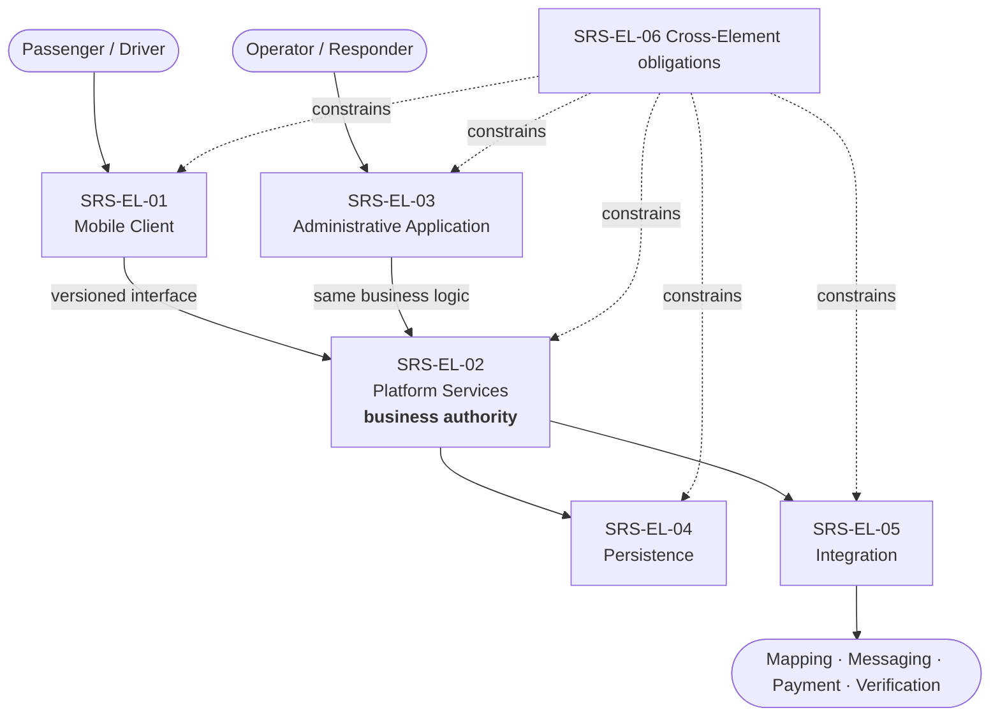
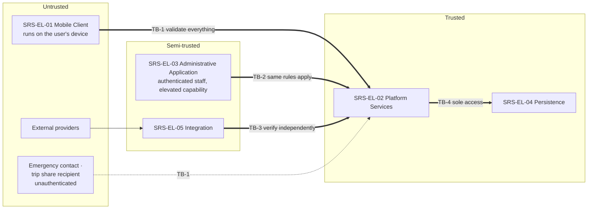
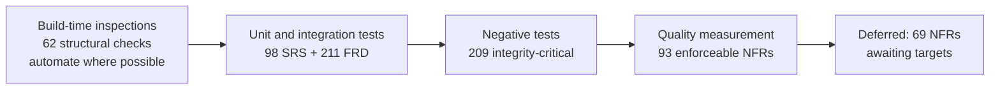
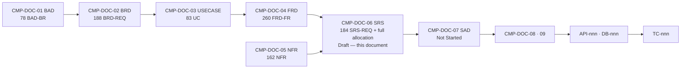

# Software Requirements Specification (SRS)
## Carpool Mobility Platform (CMP)

---

# 0. Document Control

## 0.1 Document Control Table

| Field | Value |
|---|---|
| Document ID | CMP-DOC-06 |
| Document Name | Software Requirements Specification |
| Short Name | SRS |
| Project Name | Carpool Mobility Platform |
| Project Code | CMP |
| Version | 0.1 |
| Status | Draft |
| Date | 2026-08-16 |
| Author | Solution Architect (AI-assisted) |
| Reviewer | [TBD] |
| Approver | Project Owner |
| Classification | Internal |
| Brand | TBD |
| Previous Version | None (initial issue) |
| Predecessor Documents | CMP-DOC-01 (BAD), CMP-DOC-02 (BRD), CMP-DOC-03 (USECASE), CMP-DOC-04 (FRD), CMP-DOC-05 (NFR) — all v0.1, **all Draft, none approved** |
| Related Documents | `00_Project_Control/README.md`, `Documentation_Index.md`, `Documentation_Status.md`, `Document_Change_Log.md`, `Glossary.md`, `Master_Traceability_Matrix.md` |
| Successor Documents | CMP-DOC-07 (SAD) — Not Started |

## 0.2 Revision History

| Version | Date | Author | Change | Status |
|---|---|---|---|---|
| 0.1 | 2026-08-16 | Solution Architect (AI-assisted) | Initial issue. Defines the six-element software model, allocates all 260 functional and 162 quality requirements to elements, and states 184 software-level requirements (`SRS-REQ-001` … `SRS-REQ-184`) that emerge only at this layer: inter-element obligations, external interfaces, state and lifecycle, error handling, and configuration. Establishes the consolidated verification baseline. | Draft |

## 0.3 Distribution List

| Role | Purpose |
|---|---|
| Project Owner | Approval authority |
| **Solution Architect** | Authoring; direct input to CMP-DOC-07 |
| **Software Architect (Mobile / Backend)** | **Primary consumer** — element allocation drives CMP-DOC-08 and CMP-DOC-09 |
| Android Developers | Client element obligations |
| Backend Developers | Platform and admin element obligations |
| QA Analyst | Consolidated verification baseline (§9) |
| DevOps Engineer | Configuration and operating environment |
| Security Analyst | Inter-element trust boundaries |
| Product Owner | Apportioning of deferred requirements |

## 0.4 Approval

| Role | Name | Signature | Date |
|---|---|---|---|
| Author | Solution Architect (AI-assisted) | — | 2026-08-16 |
| Reviewer | [TBD] | — | — |
| Approver | Project Owner | — | — |

> **This document is NOT approved.** It is issued at version 0.1 with status `Draft`
> for Project Owner review.

## 0.5 Purpose of This Document

CMP-DOC-04 states **what** the system does. CMP-DOC-05 states **how well**. Neither says
**which part of the software is responsible**.

This document does three things that no predecessor does:

1. **Defines the software element model** — the logical parts the system divides into.
2. **Allocates every one of the 422 upstream requirements** to the element accountable
   for satisfying it.
3. **States the requirements that only exist at the software level**: obligations between
   elements, external interface behaviour, state and lifecycle management, error handling
   and propagation, and configuration.

It is the last document before architecture. After this, CMP-DOC-07 chooses structures;
this document constrains what those structures must be able to do.

## 0.6 Scope and Boundary of This Document

**Contains:** software element model; allocation of all functional and quality
requirements; 184 software-level requirements across six elements plus interfaces,
state, error handling and configuration; operating environment; design constraints;
apportioning of deferred requirements; consolidated verification baseline; traceability.

**Excludes:**

| Excluded | Belongs to |
|---|---|
| Business behaviour | CMP-DOC-04 |
| Quality targets | CMP-DOC-05 |
| **Component structure, layering, patterns, deployment topology** | **CMP-DOC-07** |
| Mobile module structure, navigation architecture, state-holder design | CMP-DOC-08 |
| Backend service decomposition, queues, jobs, framework structure | CMP-DOC-09 |
| API endpoints, verbs, payloads, status codes | CMP-DOC-10 |
| Tables, columns, keys, indexes | CMP-DOC-11 |
| Security controls and mechanisms | CMP-DOC-13 |
| Test cases and environments | CMP-DOC-18 |
| Infrastructure, hosting, pipelines | CMP-DOC-19 |

### 0.6.1 The Boundary With CMP-DOC-07 — Stated Precisely

This is the boundary most likely to be crossed by accident, so it is stated plainly.

| This document may say | This document must not say |
|---|---|
| *The client shall hold no authoritative business state.* | *The client shall use a repository pattern with a local cache layer.* |
| *The platform shall expose its capability through a versioned interface.* | *The API shall be REST with resource-oriented URIs under `/api/v1/`.* |
| *The admin element shall invoke the same business logic as the client-facing interface.* | *The admin shall be a Filament panel within the same Laravel application.* |
| *The integration element shall isolate provider specifics from business logic.* | *Each provider shall have an adapter class implementing a driver contract.* |

The left column is a **requirement on the software**. The right is a **design decision**.

> **ASSUMPTION (`SRS-ASM-002`).** The element model in §3 is a **logical** decomposition
> for allocation purposes. It does not mandate a physical structure, a deployment unit or
> a code organisation. CMP-DOC-07 may realise these six elements in any structure that
> satisfies their requirements.

## 0.7 Intended Audience

Solution Architects · Software Architects · Android Developers · Backend Developers ·
QA Engineers · DevOps Engineers · Security Engineers · Technical Leads · Product Owners.

## 0.8 Basis of This Document — and Three Material Qualifications

### 0.8.1 Source

**FACT.** Derived from **CMP-DOC-01** through **CMP-DOC-05**, all v0.1, and from no other
source.

### 0.8.2 Qualification 1 — Five Unapproved Predecessors

> **WARNING.** All five predecessors are at status `Draft`. This document rests on an
> unapproved chain **five documents deep**, and it is the document from which
> architecture will be derived. Recorded as `SRS-RISK-001` and in
> `Document_Change_Log.md` conflict entry **CC-006**.

### 0.8.3 Qualification 2 — What Cannot Be Allocated

**FACT.** CMP-DOC-04 records 29 functional gaps (11 Critical) and three functional areas
with no requirements. **A requirement that does not exist cannot be allocated.**

| Item | Count | Treatment here |
|---|---|---|
| Functional requirements to allocate | 260 | **All allocated** |
| Quality requirements to allocate | 162 | **All allocated** |
| Functional gaps | 29 | **Recorded as unallocated obligations** in §10, with the element that *will* own each once the decision is taken |
| Functional areas with no requirements | 3 | Element ownership pre-assigned in §10.2 so that architecture can reserve for them |

> **§10.2 is deliberately forward-looking.** Naming which element will own Wallet &
> Rewards, even though no requirement for it exists, lets CMP-DOC-07 leave room for it
> rather than discovering it later. **This is not a requirement — it is a reservation.**

### 0.8.4 Qualification 3 — Sixty-Nine Quality Targets Are Unset

**FACT.** CMP-DOC-05 records 69 unset quality targets (`GAP-012`). Allocation is
unaffected — an element is accountable for a requirement whether or not its target is
set — but **sizing and capacity decisions in CMP-DOC-07 and CMP-DOC-19 are affected**,
and this is flagged at §4.2 and §12.2.

## 0.9 Statement Classification Convention

As `README.md` §9.1. Markers: **FACT**, **ASSUMPTION**, **BUSINESS DECISION REQUIRED**,
**TECHNICAL DECISION REQUIRED**, **OPEN QUESTION**, **TBD**, **FUTURE CONSIDERATION**,
**RECOMMENDATION**.

## 0.10 Identifier Conventions

| Prefix | Element | Section |
|---|---|---|
| `SRS-REQ-nnn` | Software requirement (**traceable**) | 4–8 |
| `SRS-EL-nn` | Software element | 3 |
| `SRS-ASM-nnn` | Assumption | 12.1 |
| `SRS-RISK-nnn` | Risk | 12.2 |
| `SRS-OQ-nnn` | Open Question | 12.3 |

> **ASSUMPTION (`SRS-ASM-001`).** `README.md` §9.3 allocates `SRS-REQ-` to this document.
> Auxiliary prefixes follow the convention recorded as conflict **CC-001**, pending
> `BAD-DEC-024`.

## 0.11 Table of Contents

| § | Section |
|---|---|
| 0 | Document Control |
| 1 | Executive Summary |
| 2 | Overall Description |
| 3 | Software Element Model |
| 4 | Requirement Allocation |
| 5 | Software Requirements by Element |
| 6 | External Interface Requirements |
| 7 | State and Lifecycle Requirements |
| 8 | Error Handling and Configuration Requirements |
| 9 | Consolidated Verification Baseline |
| 10 | Unallocated Obligations |
| 11 | Traceability |
| 12 | Assumptions, Risks and Open Questions |
| 13 | Business and Technical Decisions Required |
| 14 | Acceptance Criteria for This Document |
| 15 | Statistics and Recommendations |
| A | Appendix A — Software Requirement Index |
| B | Appendix B — Allocation Summary |
| C | Appendix C — Terminology Reference |

---

# 1. Executive Summary

## 1.1 What This Document Delivers

| Element | Count |
|---|---|
| Software elements defined | 6 |
| Functional requirements allocated | **260 of 260 (100%)** |
| Quality requirements allocated | **162 of 162 (100%)** |
| New software-level requirements | **184** (`SRS-REQ-001` … `SRS-REQ-184`) |
| Requirements with a consolidated verification method | 606 (260 + 162 + 184) |
| Unallocated obligations recorded | 29 functional gaps + 3 reserved areas |
| Trust boundaries identified | 4 |

## 1.2 The Six Software Elements

| ID | Element | Accountable for | FRs | NFRs | SRS-REQs |
|---|---|---|---|---|---|
| `SRS-EL-01` | **Mobile Client** | Presentation, capture, device services, cached presentation state | 96 | 41 | 30 |
| `SRS-EL-02` | **Platform Services** | All business decisions, authority, orchestration | 148 | 78 | 38 |
| `SRS-EL-03` | **Administrative Application** | Operator capability over platform state | 32 | 14 | 14 |
| `SRS-EL-04` | **Persistence** | Durable state, ledger, audit, retention | 41 | 34 | 20 |
| `SRS-EL-05` | **Integration** | External service interaction and isolation | 38 | 27 | 20 |
| `SRS-EL-06` | **Cross-Element** | Obligations no single element can satisfy alone | 22 | 19 | 62 |

> Allocation counts exceed the totals because a requirement may be allocated to more than
> one element, with one element named **accountable** and others **contributing**. §4.1
> defines the distinction; Appendix B gives the accountable-only counts, which sum
> exactly to 260 and 162.

## 1.3 The Three Findings That Matter

**1 — The allocation is lopsided, and correctly so.**
Platform Services is accountable for 148 of 260 functional requirements — 57% of the
system's behaviour sits in one element. This is not an imbalance to correct; it is the
direct consequence of the Business Authority Principle (`BAD-RULE-002`). **An
architecture that redistributes this to "balance" the elements would be violating an
absolute business rule.** `SRS-REQ-031` states this explicitly so that CMP-DOC-07 cannot
do so by accident.

**2 — Four trust boundaries exist, and only one is currently defended.**
§3.4 identifies the boundaries between Mobile Client and Platform, between Integration
and external providers, between Administrative Application and Platform, and between
Persistence and everything else. The first is thoroughly specified (`FRD-FR-237`–`243`).
**The Administrative Application boundary is the weakest** — `FRD-FR-215`–`217` state
that operators are not exempt from integrity rules, but no requirement previously stated
that the admin element must reach business state *only* through the same logic as every
other caller. `SRS-REQ-069` now does.

**3 — Configuration is a first-class requirement here, not an implementation detail.**
Seventeen business decisions are open and will land as *values*. §8.2 states 12
configuration requirements ensuring each lands as configuration rather than code.
Without them, every decision becomes a release.

## 1.4 What This Enables

| Consumer | What they can now do |
|---|---|
| CMP-DOC-07 (SAD) | Design structures against a complete, allocated requirement set with named trust boundaries. |
| CMP-DOC-08 / 09 | Begin mobile and backend architecture from their element's requirement set. |
| CMP-DOC-18 (Testing) | Plan verification from the consolidated baseline in §9 — 606 requirements, each with a method. |
| CMP-DOC-19 (DevOps) | Begin from the operating environment (§2.4) and configuration requirements (§8.2). |

---

# 2. Overall Description

## 2.1 Product Perspective

**FACT.** CMP is a new system with no predecessor and no legacy to integrate. It
comprises an Android client, a server-side platform holding all business authority, an
administrative application, durable persistence, and integrations with external mapping,
messaging, payment and verification services.

## 2.2 User Characteristics

Inherited from CMP-DOC-03 §2 (14 actors) and CMP-DOC-01 §12 (7 personas). Software
consequences:

| Characteristic | Software consequence |
|---|---|
| Users decide in seconds, in motion, often outdoors | Client must function on intermittent connectivity (`SRS-REQ-021`) |
| Users span a wide device range | Client must degrade capability, not fail, on lower device classes (`SRS-REQ-027`) |
| Operators are trained; users are not | Admin element may assume competence; client may not (`SRS-REQ-070`) |
| Emergency contacts are unauthenticated and offstage | Any capability exposed to them crosses a trust boundary (`SRS-REQ-135`) |

## 2.3 Operating Environment

| Aspect | Statement | Source |
|---|---|---|
| Client platform | Android | `BAD-CON-001` |
| Client language and UI | Kotlin, Jetpack Compose | `BAD-CON-001` |
| Client architecture direction | MVVM with Clean Architecture; StateFlow; Coroutines | Approved direction |
| Client local persistence | Room, **cache only** | `BAD-CON-001`, `BRD-REQ-177` |
| Platform framework | Laravel | `BAD-CON-002` |
| Administrative framework | Laravel Filament, within the Laravel ecosystem | `BAD-CON-003` |
| Persistence | MySQL | `BAD-CON-005` |
| Interface style | REST / JSON, versioned | `BAD-CON-007` |
| Mapping and routing | Google Maps Platform | `BAD-CON-009` |
| Device location | Android Fused Location Provider | `BAD-CON-010` |
| Messaging and diagnostics | Firebase — FCM, Crashlytics, Performance, Analytics | `BAD-CON-011` |
| Payment ecosystem | Indian UPI | `BAD-CON-012` |
| Excluded | Supabase · PostgreSQL · Spring Boot | `BAD-CON-008` |

> **The technology direction is a constraint on this document, not a decision of it.**
> Where a requirement below names a technology, it is inheriting an approved constraint.

## 2.4 Design and Implementation Constraints

| ID | Constraint | Source | Consequence for allocation |
|---|---|---|---|
| DC-1 | The client must never hold authoritative business state. | `BAD-RULE-002` | Drives the 148/96 split between Platform and Client. |
| DC-2 | The client must never reach persistence directly. | `BAD-RULE-003` | `SRS-EL-04` is reachable only from `SRS-EL-02`. |
| DC-3 | The administrative application is part of the platform ecosystem, not a separate backend. | `BAD-CON-003` | `SRS-EL-03` shares business logic with `SRS-EL-02`. |
| DC-4 | Business rules marked absolute are enforced at the platform. | `NFR-104` | No absolute rule may be allocated to `SRS-EL-01` alone. |
| DC-5 | Undecided business values must be configurable, not embedded. | `NFR-109` | Drives §8.2. |
| DC-6 | The interface must be versioned. | `BAD-CON-007`, `NFR-099` | Drives `SRS-REQ-033`. |
| DC-7 | No assumption may preclude an additional client platform, market or payment method. | `NFR-100`–`102` | Drives isolation requirements in `SRS-EL-05`. |

## 2.5 Assumptions and Dependencies

Inherited from all five predecessors. Dependencies material to *software* specification:

| Dependency | Status | Software consequence |
|---|---|---|
| Payment provider selection (`BAD-DEP-004`) | Not selected | `SRS-EL-05` must isolate provider specifics entirely (`SRS-REQ-108`). |
| Verification provider (`BAD-DEP-005`) | Not selected | Same; plus the capability may be operator-led rather than automated. |
| Legal position (`BAD-DEC-001`) | Not obtained | `SRS-REQ-179` requires policy-bearing behaviour to be configurable. |
| 69 unset quality targets (`GAP-012`) | Open | Sizing decisions in CMP-DOC-07 / 19 proceed without them. |

## 2.6 Apportioning of Requirements

| Category | Count | Apportioned to |
|---|---|---|
| Requirements specified and allocated here | 422 | Elements per §4 |
| Software-level requirements added here | 184 | Elements per §5–8 |
| Functional gaps — behaviour undecided | 29 | Recorded in §10.1; element pre-assigned |
| Whole areas with no requirements | 3 | Reserved in §10.2 |
| Quality targets unset | 69 | Allocation unaffected; sizing deferred |

---

# 3. Software Element Model

## 3.1 Element Definitions

| ID | Element | Definition | May hold authoritative state? |
|---|---|---|---|
| `SRS-EL-01` | **Mobile Client** | The Android application: presents information, captures input, accesses device capability, holds cached presentation state. | **No** |
| `SRS-EL-02` | **Platform Services** | The server-side business authority: makes every business decision, enforces every rule, orchestrates every workflow. | **Yes — exclusively** |
| `SRS-EL-03` | **Administrative Application** | The operator-facing capability: exposes platform state and operator actions to trained staff. | **No — it invokes `SRS-EL-02`** |
| `SRS-EL-04` | **Persistence** | Durable storage of business state, ledger, audit and evidential records. | **Yes — as the store of record** |
| `SRS-EL-05` | **Integration** | Interaction with external mapping, messaging, payment and verification services, isolating their specifics. | **No** |
| `SRS-EL-06` | **Cross-Element** | Obligations that no single element can satisfy alone — authority enforcement, audit, degraded operation, configuration. | n/a |

## 3.2 Why Six, and Why These

| Question | Answer |
|---|---|
| Why is the Administrative Application separate from Platform Services? | Because it has a **different trust profile and a different actor set**, and because `FRD-FR-215`–`217` require that operators be constrained by the same rules as users. Separating it makes that constraint statable and testable. It remains part of the Laravel ecosystem (`DC-3`) — separation here is logical, not deployment. |
| Why is Persistence an element rather than an implementation detail? | Because `BRD-REQ-179` (durable evidence), `NFR-129` (no undetected alteration) and `NFR-132` (retention must not destroy another party's evidence) are obligations on the store itself, not on the logic above it. |
| Why is Integration separate? | Because four providers are unselected and `NFR-100`–`102` require that no assumption preclude alternatives. Isolation must be a requirement, not a hope. |
| Why a Cross-Element category? | Because authority enforcement, audit and degraded operation are satisfied by *cooperation* between elements. Allocating them to one element would misrepresent the obligation. |

## 3.3 Element Interaction Rules

| ID | Rule | Source |
|---|---|---|
| IR-1 | `SRS-EL-01` interacts with the system **only** through `SRS-EL-02`'s versioned interface. | `BAD-RULE-003`, `DC-2` |
| IR-2 | `SRS-EL-03` reaches business state **only** by invoking the same business logic as `SRS-EL-02` exposes to other callers. | `DC-3`, `FRD-FR-215`–`217` |
| IR-3 | `SRS-EL-04` is reachable **only** from `SRS-EL-02`. | `BAD-RULE-003` |
| IR-4 | `SRS-EL-05` is invoked **only** by `SRS-EL-02`, never directly by `SRS-EL-01` or `SRS-EL-03`. | `BAD-RULE-002` |
| IR-5 | No element may bypass another to reach a third. | Consequence of IR-1 … IR-4 |

> **IR-4 has one apparent exception that is not one.** The client accesses device
> location directly (`FRD-FR-148`, Android Fused Location Provider) and interacts with a
> UPI application directly (`FRD-FR-122`). These are **device capabilities**, not platform
> integrations: the client *captures* and *submits*, and the platform *decides*. The
> distinction is stated as `SRS-REQ-012` and `SRS-REQ-013` precisely because conflating
> them would breach `BAD-RULE-032`.

## 3.4 Trust Boundaries

| ID | Boundary | What must be true at it | Currently specified by |
|---|---|---|---|
| **TB-1** | Mobile Client → Platform | Nothing arriving may be trusted to determine authoritative state. | `FRD-FR-237`–`243`, `NFR-067` — **well defended** |
| **TB-2** | Administrative Application → Platform | Operator elevation grants capability, never exemption from absolute rules. | `FRD-FR-215`–`217`, `NFR-059` — **partially defended; `SRS-REQ-069` strengthens** |
| **TB-3** | Integration → Platform | Nothing an external provider reports may be treated as authoritative without independent verification. | `FRD-FR-124`–`131`, `NFR-032` — **well defended for payment; weaker elsewhere** |
| **TB-4** | Platform → Persistence | Only the platform may reach the store; evidential records are protected from alteration. | `BAD-RULE-003`, `NFR-129` — **stated, mechanism deferred to CMP-DOC-13** |

> **TB-3 deserves attention in CMP-DOC-07 and CMP-DOC-13.** The payment path is
> rigorously specified because CMP-DOC-01 made client-side payment evidence an absolute
> rule. **The same scepticism has not been applied to mapping, messaging or verification
> responses.** A routing service returning an implausible route, or a verification
> service returning an unexpected result, currently meets no stated validation
> obligation. `SRS-REQ-105` and `SRS-REQ-106` address this.

---

# 4. Requirement Allocation

## 4.1 Allocation Convention

| Term | Meaning |
|---|---|
| **Accountable** | The single element that must satisfy the requirement. Exactly one per requirement. |
| **Contributing** | An element whose behaviour is necessary but not sufficient. Zero or more. |

Appendix B gives accountable-only counts, which sum exactly to 260 functional and 162
quality requirements.

## 4.2 Functional Requirement Allocation

| FRD area | FRs | Accountable | Contributing |
|---|---|---|---|
| Account & Identity (`001`–`032`) | 32 | `SRS-EL-02` (24), `SRS-EL-01` (8) | `SRS-EL-04`, `SRS-EL-05` |
| Vehicle Management (`033`–`048`) | 16 | `SRS-EL-02` (13), `SRS-EL-01` (3) | `SRS-EL-04` |
| Ride Publishing (`049`–`072`) | 24 | `SRS-EL-02` (18), `SRS-EL-01` (6) | `SRS-EL-04`, `SRS-EL-05` |
| Search & Matching (`073`–`096`) | 24 | `SRS-EL-02` (20), `SRS-EL-01` (4) | `SRS-EL-05` |
| Request & Booking (`097`–`116`) | 20 | `SRS-EL-02` (18), `SRS-EL-01` (2) | `SRS-EL-04` |
| Payment & Settlement (`117`–`140`) | 24 | `SRS-EL-02` (18), `SRS-EL-01` (3), `SRS-EL-03` (3) | `SRS-EL-05`, `SRS-EL-04` |
| Trip Execution (`141`–`168`) | 28 | `SRS-EL-02` (16), `SRS-EL-01` (12) | `SRS-EL-05`, `SRS-EL-04` |
| Communication (`169`–`180`) | 12 | `SRS-EL-02` (7), `SRS-EL-01` (5) | `SRS-EL-05` |
| Safety (`181`–`196`) | 16 | `SRS-EL-02` (12), `SRS-EL-01` (4) | `SRS-EL-04`, `SRS-EL-03` |
| Notifications (`197`–`208`) | 12 | `SRS-EL-02` (9), `SRS-EL-01` (3) | `SRS-EL-05` |
| Administration (`209`–`236`) | 28 | `SRS-EL-03` (26), `SRS-EL-02` (2) | `SRS-EL-04` |
| Cross-Cutting (`237`–`260`) | 24 | `SRS-EL-06` (22), `SRS-EL-02` (2) | all |
| **Total** | **260** | **260 allocated** | |

## 4.3 Quality Requirement Allocation

| NFR attribute | NFRs | Accountable | Note |
|---|---|---|---|
| Performance Efficiency (`001`–`022`) | 22 | `SRS-EL-02` (14), `SRS-EL-01` (5), `SRS-EL-05` (3) | Measurement point determines accountability |
| Reliability & Availability (`023`–`040`) | 18 | `SRS-EL-02` (11), `SRS-EL-06` (7) | |
| Capacity & Scalability (`041`–`052`) | 12 | `SRS-EL-02` (8), `SRS-EL-04` (4) | |
| Security Posture (`053`–`070`) | 18 | `SRS-EL-02` (11), `SRS-EL-06` (4), `SRS-EL-04` (3) | Mechanisms deferred to CMP-DOC-13 |
| Safety Timeliness (`071`–`078`) | 8 | `SRS-EL-02` (6), `SRS-EL-03` (2) | |
| Usability & Accessibility (`079`–`092`) | 14 | `SRS-EL-01` (12), `SRS-EL-02` (2) | |
| Compatibility & Portability (`093`–`102`) | 10 | `SRS-EL-01` (5), `SRS-EL-06` (5) | |
| Maintainability (`103`–`112`) | 10 | `SRS-EL-06` (10) | Build-time, spans all elements |
| Observability (`113`–`124`) | 12 | `SRS-EL-02` (7), `SRS-EL-03` (5) | |
| Data Quality & Integrity (`125`–`134`) | 10 | `SRS-EL-04` (7), `SRS-EL-02` (3) | |
| Compliance (`135`–`142`) | 8 | `SRS-EL-06` (5), `SRS-EL-02` (3) | |
| Cost Efficiency (`143`–`150`) | 8 | `SRS-EL-05` (6), `SRS-EL-02` (2) | |
| Mobile Resource (`151`–`162`) | 12 | `SRS-EL-01` (12) | |
| **Total** | **162** | **162 allocated** | |

> **Note on sizing.** Sixty-nine of these quality requirements carry unset targets
> (`GAP-012`). Allocation is complete regardless — the element is accountable whether or
> not the number exists — but CMP-DOC-07 and CMP-DOC-19 cannot size `SRS-EL-02` or
> `SRS-EL-04` until the capacity and availability targets are set.

## 4.4 Allocation Findings

| # | Finding | Consequence |
|---|---|---|
| AF-1 | **`SRS-EL-02` is accountable for 57% of functional requirements.** | Correct and required — see §1.3. `SRS-REQ-031` prevents redistribution. |
| AF-2 | **`SRS-EL-01` is accountable for no absolute rule.** | Verifies `DC-4`. The client is accountable for presentation and capture, never for a decision. |
| AF-3 | **`SRS-EL-03` is accountable for 26 of 28 administration requirements** but holds no authoritative state. | Makes `TB-2` the boundary to watch. |
| AF-4 | **`SRS-EL-04` is accountable for 7 of 10 data-integrity requirements.** | Concentrates evidential obligations where the evidence lives. |
| AF-5 | **`SRS-EL-06` is accountable for all 10 maintainability requirements.** | These are build-time properties spanning every element; no single runtime element can own them. |

---

# 5. Software Requirements by Element

> **What these requirements are.** They are obligations that emerge only when the system
> is divided into parts. They do not restate CMP-DOC-04 or CMP-DOC-05; they state what
> each element must be able to do, and what it must never do, for the allocated
> requirements to be satisfiable.
>
> **Column key:** Src = the upstream requirement or constraint that gives rise to it ·
> Pri = MoSCoW · V = verification method (T/D/I/A).

## 5.1 `SRS-EL-01` — Mobile Client

### 5.1.1 Authority and State

| ID | Software Requirement | Src | Pri | V |
|---|---|---|---|---|
| `SRS-REQ-001` ‡ | The client shall hold no authoritative business state. | `DC-1`, `NFR-098` | M | I |
| `SRS-REQ-002` ‡ | The client shall treat every value received from the platform as authoritative and every value it holds locally as presentational. | `FRD-FR-242` | M | I |
| `SRS-REQ-003` ‡ | The client shall not compute seat availability, booking status, payment status, fare, wallet balance, reward accrual or verification standing. | `FRD-FR-238`, `NFR-098` | M | I |
| `SRS-REQ-004` ‡ | The client shall distinguish, in every presentation, values retrieved in the current session from values held from a previous one. | `FRD-FR-115`, `NFR-086` | M | T |
| `SRS-REQ-005` | The client shall discard cached business data when the session ends. | `FRD-FR-020` | M | T |
| `SRS-REQ-006` | The client shall re-request rather than reuse any cached value on which a commitment depends. | `FRD-FR-093`, `FRD-FR-094` | M | T |

### 5.1.2 Interaction With the Platform

| ID | Software Requirement | Src | Pri | V |
|---|---|---|---|---|
| `SRS-REQ-007` ‡ | The client shall reach the system only through the platform's versioned interface. | `IR-1`, `BAD-RULE-003` | M | I |
| `SRS-REQ-008` ‡ | The client shall never reach persistence directly. | `IR-3`, `BAD-RULE-003` | M | I |
| `SRS-REQ-009` | The client shall declare the interface version it was built against. | `DC-6`, `NFR-099` | M | I |
| `SRS-REQ-010` | The client shall behave predictably when the platform reports an interface version it does not recognise. | `NFR-099` | M | T |
| `SRS-REQ-011` | The client shall not require a platform change in order to release a new client version. | `NFR-099` | S | A |

### 5.1.3 Device Capability

| ID | Software Requirement | Src | Pri | V |
|---|---|---|---|---|
| `SRS-REQ-012` ‡ | The client shall treat device-acquired location as **captured input submitted for platform determination**, never as an authoritative position of record. | `IR-4` note, `FRD-FR-148` | M | I |
| `SRS-REQ-013` ‡ | The client shall treat any response from a payment application as **an event to report**, never as evidence of payment. | `IR-4` note, `FRD-FR-124` | M | T |
| `SRS-REQ-014` | The client shall acquire location only while a trip is active. | `NFR-155` | M | T |
| `SRS-REQ-015` | The client shall disclose to the user when location is being acquired. | `NFR-160` | M | D |
| `SRS-REQ-016` | The client shall continue a trip when the device restricts background activity, degrading acquisition rather than ending the trip. | `NFR-161` | M | D |
| `SRS-REQ-017` | The client shall operate within the host platform's constraints on background activity and location access applicable at release. | `NFR-159` | M | T |

### 5.1.4 Connectivity and Resilience

| ID | Software Requirement | Src | Pri | V |
|---|---|---|---|---|
| `SRS-REQ-018` | The client shall present previously retrieved information when connectivity is unavailable, marked as not current. | `FRD-FR-177`, `FRD-FR-178` | S | T |
| `SRS-REQ-019` ‡ | The client shall not present an action as completed until the platform has confirmed it. | `FRD-FR-179` | M | T |
| `SRS-REQ-020` | The client shall retain user-entered data across a connectivity interruption. | `NFR-162` | M | T |
| `SRS-REQ-021` | The client shall submit work deferred by a connectivity interruption when connectivity is restored, without duplication. | `FRD-FR-173`, `NFR-037` | M | T |
| `SRS-REQ-022` | The client shall indicate which capabilities are unavailable when the platform is unreachable. | `FRD-FR-257` | M | D |

### 5.1.5 Presentation Obligations

| ID | Software Requirement | Src | Pri | V |
|---|---|---|---|---|
| `SRS-REQ-023` ‡ | The client shall present verification standing, vehicle information, fare, timing, seats and preferences before any commitment is sought. | `FRD-FR-028`, `NFR-084` | M | D |
| `SRS-REQ-024` ‡ | The client shall present a value as unknown rather than infer it when the platform has not supplied it. | `FRD-FR-029` | M | T |
| `SRS-REQ-025` | The client shall present the reason for every refusal the platform returns. | `FRD-FR-065`, `NFR-087` | M | T |
| `SRS-REQ-026` | The client shall not rely on colour alone to convey verification standing, trip state or payment status. | `NFR-091` | M | I |
| `SRS-REQ-027` | The client shall degrade non-essential capability rather than fail on the lowest supported device class. | `NFR-095`, `NFR-157` | M | T |
| `SRS-REQ-028` | The client shall remain operable with the platform's assistive technologies enabled. | `NFR-089` | M | D |
| `SRS-REQ-029` | The client shall keep all user-facing text externalised from code. | `NFR-110` | M | I |
| `SRS-REQ-030` ‡ | The client shall present no statement or implication that the platform provides insurance cover. | `NFR-137`, `FRD` §8.5 | M | I |

> **`SRS-REQ-012` and `SRS-REQ-013` are the two requirements most likely to be
> implemented incorrectly**, because in both cases the client physically possesses
> information the platform does not. The temptation to treat possession as authority is
> exactly what `BAD-RULE-002` and `BAD-RULE-032` prohibit. Both warrant a negative test.

## 5.2 `SRS-EL-02` — Platform Services

### 5.2.1 Authority

| ID | Software Requirement | Src | Pri | V |
|---|---|---|---|---|
| `SRS-REQ-031` ‡ | The platform shall be the sole determinant of every business decision, and no decision shall be delegated to another element. | `BAD-RULE-002`, `AF-1` | M | I |
| `SRS-REQ-032` ‡ | The platform shall validate every inbound value against its own state before acting on it, irrespective of the element that supplied it. | `TB-1`, `TB-2`, `TB-3` | M | T |
| `SRS-REQ-033` ‡ | The platform shall expose its capability through a versioned interface, and shall not introduce a breaking change without a version increment. | `DC-6`, `NFR-099` | M | I |
| `SRS-REQ-034` | The platform shall serve more than one interface version concurrently for a defined period. | `NFR-099` | S | T |
| `SRS-REQ-035` ‡ | The platform shall apply identical business rules irrespective of which element originated a request. | `IR-2`, `FRD-FR-215`–`217` | M | T |
| `SRS-REQ-036` ‡ | The platform shall reject a request carrying a value that purports to determine authoritative state, in its entirety. | `FRD-FR-239` | M | T |
| `SRS-REQ-037` | The platform shall record every rejection under `SRS-REQ-036` as an integrity event. | `FRD-FR-240` | M | I |

### 5.2.2 Orchestration and Consistency

| ID | Software Requirement | Src | Pri | V |
|---|---|---|---|---|
| `SRS-REQ-038` ‡ | The platform shall ensure that a workflow spanning multiple state changes either completes or leaves no partial effect. | `FRD-FR-239`, `NFR-027`, `NFR-028` | M | T |
| `SRS-REQ-039` ‡ | The platform shall serialise competing changes to seat allocation such that the total confirmed never exceeds the total offered. | `FRD-FR-107`, `NFR-028` | M | T |
| `SRS-REQ-040` ‡ | The platform shall ensure that a booking confirmation and its seat allocation take effect together or not at all. | `FRD-FR-105`, `FRD-FR-111` | M | T |
| `SRS-REQ-041` ‡ | The platform shall ensure that a verified payment and its ledger entry take effect together or not at all. | `FRD-FR-128`, `FRD-FR-133` | M | T |
| `SRS-REQ-042` ‡ | The platform shall ensure that an action and its audit record take effect together, and shall not report the action complete otherwise. | `FRD-FR-248`, `NFR-031` | M | T |
| `SRS-REQ-043` | The platform shall raise for reconciliation any action that took effect while its record did not. | `FRD-FR-249` | M | T |
| `SRS-REQ-044` | The platform shall tolerate repeated submission of the same request without producing a duplicate effect. | `SRS-REQ-021`, `NFR-037` | M | T |

### 5.2.3 Workflow Continuation Without a Client

| ID | Software Requirement | Src | Pri | V |
|---|---|---|---|---|
| `SRS-REQ-045` ‡ | The platform shall continue and complete a payment verification without any further interaction from the client that initiated it. | `FRD-FR-126` | M | T |
| `SRS-REQ-046` ‡ | The platform shall initiate verification of a payment attempt on its own schedule, including where the client never returns. | `FRD-FR-125`, `FRD-FR-132` | M | T |
| `SRS-REQ-047` | The platform shall perform time-triggered work — verification retries, notification issue, queue ageing — without external initiation. | `FRD-FR-132`, `NFR-121` | M | T |
| `SRS-REQ-048` | The platform shall ensure that time-triggered work is not lost when the platform restarts. | `NFR-037`, `NFR-038` | M | T |

### 5.2.4 Matching and Computation

| ID | Software Requirement | Src | Pri | V |
|---|---|---|---|---|
| `SRS-REQ-049` | The platform shall compute route overlap between a published route and a requested segment. | `FRD-FR-077`, `FRD-FR-078` | M | T |
| `SRS-REQ-050` | The platform shall evaluate every compatibility condition before presenting a ride as compatible. | `FRD-FR-085` | M | T |
| `SRS-REQ-051` | The platform shall express the basis of a match in terms that can be presented to a passenger. | `FRD-FR-087`, `NFR-085` | M | T |
| `SRS-REQ-052` | The platform shall evaluate seat availability from its own state on every evaluation, never from a cached count. | `FRD-FR-084` | M | T |
| `SRS-REQ-053` | The platform shall bound the growth of matching cost as the candidate set grows. | `NFR-043` | M | T |
| `SRS-REQ-054` | The platform shall keep the overlap computation independent of any single corridor, city or region. | `NFR-052` | S | I |
| `SRS-REQ-055` | The platform shall compute the amount payable and shall not accept one supplied by any other element. | `FRD-FR-117`, `FRD-FR-118` | M | T |

### 5.2.5 Safety Pipeline

| ID | Software Requirement | Src | Pri | V |
|---|---|---|---|---|
| `SRS-REQ-056` ‡ | The platform shall accept and record a safety signal irrespective of its own load or the availability of any supporting service. | `FRD-FR-185`, `NFR-071` | M | T |
| `SRS-REQ-057` ‡ | The platform shall never discard a safety signal, and shall retry until the signal is recorded and queued. | `FRD-FR-188`, `FRD-FR-190` | M | T |
| `SRS-REQ-058` ‡ | The platform shall capture safety incident context at the moment of the signal, not on later retrieval. | `FRD-FR-186`, `NFR-074` | M | T |
| `SRS-REQ-059` | The platform shall record a safety incident with partial context rather than reject it. | `FRD-FR-187` | M | T |
| `SRS-REQ-060` | The platform shall prioritise safety-pipeline work above all other work under load. | `NFR-071`, `NFR-072` | M | T |

### 5.2.6 Notification and Communication

| ID | Software Requirement | Src | Pri | V |
|---|---|---|---|---|
| `SRS-REQ-061` | The platform shall determine the recipients of every event notification. | `FRD-FR-199` | M | T |
| `SRS-REQ-062` ‡ | The platform shall issue safety and payment notifications irrespective of recipient preference. | `FRD-FR-201`, `NFR-076` | M | T |
| `SRS-REQ-063` ‡ | The platform shall retain a notification and a message in its own records irrespective of delivery outcome. | `FRD-FR-204`, `FRD-FR-172` | M | T |
| `SRS-REQ-064` | The platform shall determine whether a messaging relationship exists before permitting a conversation. | `FRD-FR-170`, `FRD-FR-171` | M | T |

### 5.2.7 Platform Obligations to Other Elements

| ID | Software Requirement | Src | Pri | V |
|---|---|---|---|---|
| `SRS-REQ-065` | The platform shall supply to each element only the information that element's actor is entitled to. | `NFR-061`, `NFR-064` | M | T |
| `SRS-REQ-066` | The platform shall supply a refusal reason sufficient for the requesting element to present it. | `FRD-FR-065`, `NFR-087` | M | T |
| `SRS-REQ-067` | The platform shall indicate, in every response, whether the values it carries are authoritative or provisional. | `SRS-REQ-002`, `NFR-086` | M | T |
| `SRS-REQ-068` | The platform shall expose the operational measures required by CMP-DOC-02 §7 without requiring access to persistence by another element. | `FRD-FR-234`, `NFR-116` | M | T |

## 5.3 `SRS-EL-03` — Administrative Application

| ID | Software Requirement | Src | Pri | V |
|---|---|---|---|---|
| `SRS-REQ-069` ‡ | The administrative application shall reach business state only by invoking the same business logic that serves every other caller. | `IR-2`, `TB-2`, `DC-3` | M | I |
| `SRS-REQ-070` ‡ | The administrative application shall not implement, duplicate or override any business rule. | `IR-2`, `NFR-103` | M | I |
| `SRS-REQ-071` ‡ | The administrative application shall not enable an operator to breach an absolute business rule. | `FRD-FR-215`–`217`, `NFR-059` | M | T |
| `SRS-REQ-072` ‡ | The administrative application shall not set payment status by any path other than verification or recorded reconciliation. | `FRD-FR-216`, `NFR-029` | M | T |
| `SRS-REQ-073` ‡ | The administrative application shall attribute every action it performs to the identified operator who performed it. | `FRD-FR-218`, `NFR-119` | M | I |
| `SRS-REQ-074` ‡ | The administrative application shall record an attempted action that was refused. | `FRD-FR-217`, `NFR-060` | M | I |
| `SRS-REQ-075` | The administrative application shall restrict capability by administrative role. | `FRD-FR-213`, `NFR-058` | M | T |
| `SRS-REQ-076` | The administrative application shall not alter a record as a consequence of inspecting it. | `FRD-FR-211` | M | T |
| `SRS-REQ-077` | The administrative application shall present the evidence relevant to a case without requiring an operator to query persistence. | `FRD-FR-231`, `NFR-135` | M | D |
| `SRS-REQ-078` | The administrative application shall present queue depth and oldest-item age for the reconciliation and safety queues. | `NFR-120`, `NFR-121` | M | D |
| `SRS-REQ-079` | The administrative application shall present a measure as unavailable rather than as zero where its behaviour is unimplemented. | `FRD-FR-236`, `NFR-117` | M | T |
| `SRS-REQ-080` | The administrative application shall present a safety incident with its full captured context. | `FRD-FR-225`, `NFR-077` | M | D |
| `SRS-REQ-081` | The administrative application shall not permit a case or incident to be closed without a recorded outcome. | `FRD-FR-227`, `FRD-FR-233` | M | T |
| `SRS-REQ-082` | The administrative application shall remain available for safety incident handling during planned maintenance of non-safety capability. | `NFR-025` | S | D |

> **`SRS-REQ-069` and `SRS-REQ-070` close the weakest trust boundary.** CMP-DOC-04
> established that operators cannot *bypass* rules. Neither it nor any predecessor stated
> that the admin element must not **re-implement** them — which is how the bypass usually
> arrives in practice: not by disabling a rule, but by writing a second, subtly different
> copy of it.

## 5.4 `SRS-EL-04` — Persistence

| ID | Software Requirement | Src | Pri | V |
|---|---|---|---|---|
| `SRS-REQ-083` ‡ | Persistence shall be reachable only from Platform Services. | `IR-3`, `BAD-RULE-003` | M | I |
| `SRS-REQ-084` ‡ | Persistence shall retain every evidential record durably. | `FRD-FR-247`, `NFR-125` | M | I |
| `SRS-REQ-085` ‡ | Persistence shall not permit an evidential record to be altered or removed without detection. | `FRD-FR-247`, `NFR-129` | M | T |
| `SRS-REQ-086` ‡ | Persistence shall record every movement of value as an entry attributable to a party and an event. | `FRD-FR-133`, `NFR-128` | M | I |
| `SRS-REQ-087` ‡ | Persistence shall enable any balance to be derived from its entries rather than stored independently of them. | `NFR-127` | M | T |
| `SRS-REQ-088` ‡ | Persistence shall retain a completed trip record reflecting the state at the time of travel. | `FRD-FR-048`, `NFR-134` | M | T |
| `SRS-REQ-089` ‡ | Persistence shall ensure that a change to a referenced entity does not mutate a historical record. | `NFR-134` | M | T |
| `SRS-REQ-090` | Persistence shall support retention removal by category of personal data. | `FRD-FR-183`, `NFR-131` | M | T |
| `SRS-REQ-091` ‡ | Persistence shall not permit retention removal to destroy a record still required as evidence by another party to it. | `NFR-132`, `FRD-GAP-028` | M | A |
| `SRS-REQ-092` | Persistence shall support the account-closure treatment the business decides. | `FRD-FR-184`, `NFR-133` | M | T |
| `SRS-REQ-093` | Persistence shall retain trip position history for the period the business decides. | `BRD-DATA-009`, `NFR-124` | M | I |
| `SRS-REQ-094` | Persistence shall sustain operator record search performance as stored volume grows. | `NFR-048` | S | T |
| `SRS-REQ-095` | Persistence shall support capacity increase without service interruption. | `NFR-051` | S | D |
| `SRS-REQ-096` | Persistence shall bound the data retained per completed trip. | `NFR-050` | S | A |
| `SRS-REQ-097` ‡ | Persistence shall hold identity evidence and payment-related data in protected form. | `NFR-063` | M | I |
| `SRS-REQ-098` ‡ | Persistence shall not hold authentication credentials in recoverable form. | `NFR-053` | M | I |
| `SRS-REQ-099` | Persistence shall support the recovery point objective the business sets. | `NFR-038` | M | A |
| `SRS-REQ-100` | Persistence shall support the recovery time objective the business sets. | `NFR-039` | M | A |
| `SRS-REQ-101` | Persistence shall not assume a single corridor, city or region in any structure bearing capacity. | `NFR-052` | S | I |
| `SRS-REQ-102` | Persistence shall record the interface version under which each record was created, where the record's interpretation may change between versions. | `SRS-REQ-033` | C | I |

> **`SRS-REQ-091` is stated as verification-by-analysis, not test**, because it cannot be
> demonstrated by a passing case — only by reasoned argument that no removal path can
> reach a record another party still requires. It is the software expression of the
> contradiction recorded as `FRD-GAP-028` and trade-off TO-4, and **it will constrain
> whatever `BAD-DEC-021` decides**.

## 5.5 `SRS-EL-05` — Integration

| ID | Software Requirement | Src | Pri | V |
|---|---|---|---|---|
| `SRS-REQ-103` ‡ | Integration shall be invoked only by Platform Services. | `IR-4` | M | I |
| `SRS-REQ-104` ‡ | Integration shall make no business decision. | `BAD-RULE-002` | M | I |
| `SRS-REQ-105` ‡ | Integration shall validate a provider response for plausibility before returning it to Platform Services. | `TB-3` | M | T |
| `SRS-REQ-106` ‡ | Integration shall distinguish *the provider reported X* from *X is true*, and shall never present the former as the latter. | `TB-3`, `FRD-FR-124` | M | I |
| `SRS-REQ-107` ‡ | Integration shall not treat a payment application response as evidence of payment. | `FRD-FR-124`, `NFR-029` | M | T |
| `SRS-REQ-108` ‡ | Integration shall isolate provider-specific detail such that replacing a provider requires no change to Platform Services. | `DC-7`, `NFR-101` | M | A |
| `SRS-REQ-109` | Integration shall expose a provider-independent capability to Platform Services for each external capability. | `NFR-100`–`102` | M | I |
| `SRS-REQ-110` | Integration shall support more than one provider for a given capability concurrently. | `BRD-INT-012` | S | A |
| `SRS-REQ-111` | Integration shall detect that a provider is unavailable. | `FRD-FR-255`, `NFR-036` | M | T |
| `SRS-REQ-112` | Integration shall report unavailability to Platform Services rather than substitute a result. | `FRD-FR-258` | M | T |
| `SRS-REQ-113` ‡ | Integration shall never synthesise, default or infer a result a provider did not return. | `FRD-FR-258`, `NFR-032` | M | T |
| `SRS-REQ-114` | Integration shall queue work deferred by provider unavailability and submit it on restoration, without duplication. | `FRD-FR-260`, `NFR-037` | M | T |
| `SRS-REQ-115` | Integration shall bound the time it waits for a provider response. | `NFR-036` | M | T |
| `SRS-REQ-116` | Integration shall record every external call, its outcome and its attributable cost. | `NFR-143`, `NFR-150` | M | I |
| `SRS-REQ-117` | Integration shall avoid repeating a call whose result it already holds and which remains valid. | `NFR-146` | M | T |
| `SRS-REQ-118` | Integration shall bound the calls made per search and per trip. | `NFR-021`, `NFR-022`, `NFR-144`, `NFR-145` | M | I |
| `SRS-REQ-119` | Integration shall make the validity period of a retained result configurable. | `NFR-146`, `DC-5` | M | I |
| `SRS-REQ-120` | Integration shall not require a change to Platform Services in order to add an additional payment method. | `NFR-101` | S | A |
| `SRS-REQ-121` | Integration shall not require a change to Platform Services in order to support an additional market. | `NFR-102` | S | A |
| `SRS-REQ-122` | Integration shall carry no credential in a form recoverable from the client element. | `NFR-053`, `TB-3` | M | I |

> **`SRS-REQ-105`, `106` and `113` defend the boundary CMP-DOC-01 defended only for
> payment.** Payment responses are rigorously distrusted because an absolute rule
> required it. Mapping, messaging and verification responses were not previously subject
> to any stated validation obligation. A routing service returning an implausible route
> would currently be accepted, and would corrupt matching — the platform's
> differentiator.

## 5.6 `SRS-EL-06` — Cross-Element Obligations

> These are satisfied by cooperation. No single element can discharge them alone, which is
> why allocating them to one would misrepresent the obligation.

### 5.6.1 Authority Enforcement Across Elements

| ID | Software Requirement | Src | Pri | V |
|---|---|---|---|---|
| `SRS-REQ-123` ‡ | The software shall ensure that no path exists by which any element other than Platform Services determines authoritative state. | `BAD-RULE-002` | M | A |
| `SRS-REQ-124` ‡ | The software shall ensure that no path exists by which any element other than Platform Services reaches Persistence. | `BAD-RULE-003`, `IR-3` | M | A |
| `SRS-REQ-125` ‡ | The software shall ensure that every absolute business rule is enforced at Platform Services and not solely at any other element. | `DC-4`, `NFR-104` | M | I |
| `SRS-REQ-126` ‡ | The software shall express each business rule in exactly one place. | `NFR-103` | M | I |

### 5.6.2 Audit Across Elements

| ID | Software Requirement | Src | Pri | V |
|---|---|---|---|---|
| `SRS-REQ-127` ‡ | The software shall produce an audit record for every recordable event irrespective of the element that originated it. | `FRD-FR-244`, `NFR-125` | M | I |
| `SRS-REQ-128` ‡ | The software shall attribute every audit record to the actor and element responsible. | `FRD-FR-245`, `NFR-119` | M | I |
| `SRS-REQ-129` ‡ | The software shall not permit an audit record to be written by an element other than Platform Services. | `SRS-REQ-124` | M | I |
| `SRS-REQ-130` ‡ | The software shall exclude from diagnostic records any personal data beyond that required by the record's purpose. | `NFR-123` | M | I |

### 5.6.3 Degraded Operation Across Elements

| ID | Software Requirement | Src | Pri | V |
|---|---|---|---|---|
| `SRS-REQ-131` | The software shall define, for each supporting service, which capabilities are withdrawn and which continue when it is unavailable. | `FRD-FR-255`, `NFR-034` | M | I |
| `SRS-REQ-132` ‡ | The software shall withdraw a capability entirely rather than degrade it where degradation would compromise an absolute rule. | `FRD-FR-259`, `NFR-035` | M | T |
| `SRS-REQ-133` | The software shall propagate a degraded state to the user-facing element so that it can be disclosed. | `FRD-FR-257`, `SRS-REQ-022` | M | T |
| `SRS-REQ-134` ‡ | The software shall preserve an active trip through the unavailability of any single supporting service. | `NFR-025`, `NFR-034` | M | D |

### 5.6.4 Trust Boundary Enforcement

| ID | Software Requirement | Src | Pri | V |
|---|---|---|---|---|
| `SRS-REQ-135` ‡ | The software shall treat any capability exposed to an unauthenticated recipient as crossing a trust boundary, and shall bound what such a recipient may see. | `TB-1`, `NFR-066` | M | A |
| `SRS-REQ-136` ‡ | The software shall apply the same validation to a request from the administrative application as to one from the mobile client. | `TB-2`, `SRS-REQ-035` | M | T |

---

# 6. External Interface Requirements

> **Boundary.** This section states what the software requires **of** and **at** its
> external interfaces. It does not define endpoints, payloads or protocols — CMP-DOC-10
> and CMP-DOC-14 do.

## 6.1 Interface to Client Elements

| ID | Software Requirement | Src | Pri | V |
|---|---|---|---|---|
| `SRS-REQ-137` ‡ | The interface shall carry no capability enabling a caller to set authoritative state directly. | `FRD-FR-238`, `NFR-067` | M | I |
| `SRS-REQ-138` | The interface shall identify its version in a manner a caller can act upon. | `NFR-099`, `SRS-REQ-009` | M | I |
| `SRS-REQ-139` | The interface shall distinguish a refusal arising from the caller's request from one arising from platform unavailability. | `FRD-FR-257`, `SRS-REQ-066` | M | T |
| `SRS-REQ-140` | The interface shall convey a refusal reason sufficient for presentation without further enquiry. | `NFR-087` | M | T |
| `SRS-REQ-141` ‡ | The interface shall not disclose to a caller any information the caller's actor is not entitled to. | `NFR-061`, `NFR-065` | M | T |

## 6.2 Interface to External Providers

| ID | Software Requirement | Src | Pri | V |
|---|---|---|---|---|
| `SRS-REQ-142` ‡ | The software shall not depend on a provider callback as the sole means of learning an outcome. | `FRD-FR-126`, `SRS-REQ-046` | M | T |
| `SRS-REQ-143` ‡ | The software shall verify independently any provider-reported outcome on which a business decision depends. | `TB-3`, `FRD-FR-127` | M | T |
| `SRS-REQ-144` | The software shall bound its exposure to a provider's unavailability by a defined wait and a defined retry behaviour. | `SRS-REQ-115`, `NFR-036` | M | T |
| `SRS-REQ-145` | The software shall record every provider interaction sufficiently to reconstruct it. | `SRS-REQ-116`, `NFR-118` | M | I |
| `SRS-REQ-146` | The software shall attribute provider cost to the activity that incurred it. | `NFR-143` | M | I |

## 6.3 Interface to the Device

| ID | Software Requirement | Src | Pri | V |
|---|---|---|---|---|
| `SRS-REQ-147` | The software shall request device permissions only for capability the user has invoked. | `NFR-065`, `NFR-160` | M | D |
| `SRS-REQ-148` | The software shall function, with reduced capability, where a device permission is refused. | `NFR-095` | M | T |
| `SRS-REQ-149` | The software shall not require a device permission in order to complete registration, search or booking. | `NFR-065` | M | T |
| `SRS-REQ-150` | The software shall release device capability when the activity requiring it ends. | `NFR-155` | M | T |

> **`SRS-REQ-149` is a deliberate constraint on the client design.** A search that
> demands location permission before it will run converts a permission prompt into a
> conversion barrier at the first moment of use. Location is required for a *trip*, not
> for a *search*.

---

# 7. State and Lifecycle Requirements

## 7.1 State Ownership

| ID | Software Requirement | Src | Pri | V |
|---|---|---|---|---|
| `SRS-REQ-151` ‡ | The software shall hold each item of authoritative state in exactly one place. | `BAD-RULE-002`, `NFR-103` | M | I |
| `SRS-REQ-152` ‡ | The software shall define, for every state it maintains, the element accountable for it and the permitted transitions. | `FRD-FR-144` | M | I |
| `SRS-REQ-153` ‡ | The software shall record every transition of an authoritative state with the time and the cause. | `FRD-FR-144`, `NFR-125` | M | I |
| `SRS-REQ-154` ‡ | The software shall reject a transition that the state model does not permit. | `FRD-FR-152` | M | T |

## 7.2 Lifecycles the Software Must Maintain

| State model | Accountable element | Defined? | Note |
|---|---|---|---|
| Session | `SRS-EL-02` | Yes | `FRD-FR-014`–`021` |
| Account state | `SRS-EL-02` | **No — `BAD-DEC-006`** | `FRD-GAP-003` |
| Verification standing | `SRS-EL-02` | **No — `BAD-DEC-005`** | `FRD-GAP-002` |
| Ride | `SRS-EL-02` | Partially | Withdrawal defined; amendment is `FRD-GAP-007` |
| Ride request | `SRS-EL-02` | **No — `BAD-DEC-007`** | `FRD-GAP-009`, `010` |
| Booking | `SRS-EL-02` | **No — `BAD-DEC-015`** | `FRD-GAP-011` |
| Payment | `SRS-EL-02` | **Yes** | verified / failed / pending — `FRD-FR-127`–`131` |
| Trip | `SRS-EL-02` | **No — `BAD-DEC-015`** | `FRD-GAP-016` |
| Safety incident | `SRS-EL-02` | Partially | Recording and queueing defined; response is `FRD-GAP-020` |
| Support / moderation case | `SRS-EL-03` | Partially | Closure defined; policy is `FRD-GAP-025` |

| ID | Software Requirement | Src | Pri | V |
|---|---|---|---|---|
| `SRS-REQ-155` ‡ | The software shall maintain payment state as exactly one of verified, failed or pending, and shall permit no other value. | `FRD-FR-127`–`131` | M | T |
| `SRS-REQ-156` ‡ | The software shall not permit a pending payment to leave that state other than by verification or recorded reconciliation. | `FRD-FR-131`, `NFR-032` | M | T |
| `SRS-REQ-157` | The software shall make each undefined state model configurable in its permitted values and transitions, so that defining it does not require redevelopment. | `DC-5`, `NFR-109` | M | I |
| `SRS-REQ-158` | The software shall reject an attempt to use a state value that has not been configured. | `SRS-REQ-157` | M | T |
| `SRS-REQ-159` ‡ | The software shall not begin a trip in the absence of a confirmed booking, irrespective of the trip state model eventually adopted. | `FRD-FR-142` | M | T |
| `SRS-REQ-160` ‡ | The software shall not close a safety incident or a support case without a recorded outcome, irrespective of the case model eventually adopted. | `FRD-FR-227`, `FRD-FR-233` | M | T |

> **`SRS-REQ-157` is the most consequential requirement in this section.** Six of the ten
> state models above are undefined because a business decision is open. Making the
> permitted values and transitions configurable means those six decisions land as
> configuration rather than as six rounds of redevelopment. `SRS-REQ-159` and
> `SRS-REQ-160` then hold the invariants that must survive *whatever* those models turn
> out to be.

---

# 8. Error Handling and Configuration Requirements

## 8.1 Error Handling

| ID | Software Requirement | Src | Pri | V |
|---|---|---|---|---|
| `SRS-REQ-161` | The software shall classify every error it raises as one of: caller error, business refusal, platform fault, or supporting-service unavailability. | `FRD-FR-257`, `SRS-REQ-139` | M | I |
| `SRS-REQ-162` ‡ | The software shall not apply a partial effect when an operation fails. | `FRD-FR-239`, `SRS-REQ-038` | M | T |
| `SRS-REQ-163` ‡ | The software shall not represent a business refusal as a fault, nor a fault as a refusal. | `SRS-REQ-161` | M | T |
| `SRS-REQ-164` | The software shall convey a business refusal with a reason suitable for presentation. | `NFR-087`, `SRS-REQ-140` | M | T |
| `SRS-REQ-165` | The software shall not disclose internal fault detail to a user-facing element. | `NFR-123` | M | T |
| `SRS-REQ-166` | The software shall record every platform fault with detail sufficient to determine its cause without reproduction. | `NFR-118` | M | I |
| `SRS-REQ-167` ‡ | The software shall not resolve an unknown outcome by assumption in either direction. | `FRD-FR-258`, `NFR-032` | M | T |
| `SRS-REQ-168` | The software shall retry an operation that failed for a transient reason, without duplicating its effect. | `SRS-REQ-044`, `NFR-037` | M | T |
| `SRS-REQ-169` | The software shall bound retry attempts and record exhaustion rather than retrying indefinitely. | `NFR-036` | M | T |
| `SRS-REQ-170` ‡ | The software shall never allow an error path to discard a safety signal. | `FRD-FR-188`, `NFR-071` | M | T |
| `SRS-REQ-171` ‡ | The software shall never allow an error path to leave a payment in a state other than verified, failed or pending. | `SRS-REQ-155` | M | T |
| `SRS-REQ-172` ‡ | The software shall never allow an error path to release a seat that a confirmed booking holds, or to hold a seat that no request holds. | `FRD-FR-107`, `FRD-FR-109` | M | T |

## 8.2 Configuration and Parameterisation

> **Why this subsection exists and matters.** Seventeen business decisions are open, and
> CMP-DOC-04 records 29 functional gaps depending on them. **Those decisions will land as
> values.** If the values are embedded in code, each decision becomes a release; if they
> are configuration, most become a configuration change. This is `NFR-109` expressed as
> software requirements.

| ID | Software Requirement | Src | Pri | V |
|---|---|---|---|---|
| `SRS-REQ-173` ‡ | The software shall hold every business value that is currently undecided as configuration rather than embedded in code. | `NFR-109`, `DC-5` | M | I |
| `SRS-REQ-174` | The software shall hold fare model parameters as configuration. | `FRD-GAP-005`, `013` | M | I |
| `SRS-REQ-175` | The software shall hold cancellation, no-show and refund parameters as configuration. | `FRD-GAP-006`, `012`, `014` | M | I |
| `SRS-REQ-176` | The software shall hold verification levels and their permissions as configuration. | `FRD-GAP-002`, `004`, `023` | M | I |
| `SRS-REQ-177` | The software shall hold reward and wallet parameters as configuration. | `FRD-GAP-026` | S | I |
| `SRS-REQ-178` | The software shall hold retention periods, per data category, as configuration. | `FRD-GAP-028`, `NFR-131` | M | I |
| `SRS-REQ-179` | The software shall hold policy-bearing text — rules of participation, safety information, insurance position — as configuration, versioned. | `NFR-136`, `BRD-CMP-008` | M | I |
| `SRS-REQ-180` | The software shall hold quality thresholds that trigger operational alerting as configuration. | `NFR-122`, `NFR-149` | M | I |
| `SRS-REQ-181` | The software shall hold tracking interval and provider-result validity periods as configuration. | `NFR-147`, `SRS-REQ-119` | M | I |
| `SRS-REQ-182` ‡ | The software shall not permit configuration to alter behaviour that an absolute business rule fixes. | `NFR-104`, `SRS-REQ-125` | M | T |
| `SRS-REQ-183` | The software shall record every configuration change with its author, time and prior value. | `NFR-119`, `FRD-FR-245` | M | I |
| `SRS-REQ-184` | The software shall keep configuration that varies by environment out of the built artefact. | `NFR-108` | M | I |

> **`SRS-REQ-182` is the necessary counterweight to the rest of §8.2.** Making values
> configurable is valuable precisely because it makes change cheap — which is exactly why
> it must not be possible to configure away seat integrity, payment authority or audit.
> Configurability and inviolability must coexist, and this requirement states the line.

---

# 9. Consolidated Verification Baseline

## 9.1 The Complete Verifiable Set

| Source | Requirements | With a verification method |
|---|---|---|
| CMP-DOC-04 functional | 260 | 260 |
| CMP-DOC-05 quality | 162 | 162 |
| CMP-DOC-06 software | 184 | 184 |
| **Total** | **606** | **606 (100%)** |

## 9.2 Verification Method Distribution — This Document

| Method | Count | Note |
|---|---|---|
| **T** Test | 98 | Executable verification |
| **I** Inspection | 62 | Structural: *no path exists*, *expressed in one place*, *held as configuration* |
| **D** Demonstration | 12 | Observed behaviour |
| **A** Analysis | 12 | Reasoned argument where no single case can demonstrate the property |

> **Structural verification is a far larger share here than in any predecessor.** In
> CMP-DOC-04, Inspection accounted for 9% of requirements; here it is 34%, and Analysis
> a further 7%. Software-level requirements are substantially about *structure and
> absence* — that no path exists, that no rule is duplicated, that no value is embedded.
> **You cannot test the absence of a path; you inspect for it.** CMP-DOC-18 should plan
> for **74 non-executable verifications** (62 Inspection + 12 Analysis), many of which
> are automatable as build-time checks.

## 9.3 Integrity-Critical Requirements Across the Chain

| Document | Integrity-critical | Marking |
|---|---|---|
| CMP-DOC-04 | 81 | ‡ |
| CMP-DOC-05 | 44 | ‡ (Absolute targets) |
| CMP-DOC-06 | 84 | ‡ |
| **Total** | **209** | Each requires a negative test or a structural inspection |

## 9.4 Verification Sequencing

**RECOMMENDATION.** Automate the structural inspections first. They are cheap, they run
on every commit, and they catch the failure mode that unit tests cannot: an element
quietly acquiring a capability it must not have.

---

# 10. Unallocated Obligations

## 10.1 Functional Gaps — Element Pre-Assigned

**No requirement exists for these, so none is allocated.** The element that *will* be
accountable is named so that CMP-DOC-07 can reserve for it.

| Gap | Will be accountable | Decision |
|---|---|---|
| `FRD-GAP-002`, `004`, `023` verification | `SRS-EL-02` + `SRS-EL-05` | `BAD-DEC-005` |
| `FRD-GAP-003`, `024` account state | `SRS-EL-02` | `BAD-DEC-006`, `016` |
| `FRD-GAP-005`, `013`, `015` fare and settlement | `SRS-EL-02` + `SRS-EL-05` | `BAD-DEC-003`, `004` |
| `FRD-GAP-006`, `012`, `017`, `027` cancellation | `SRS-EL-02` | `BAD-DEC-009` |
| `FRD-GAP-009`, `010`, `011` booking transition | `SRS-EL-02` | `BAD-DEC-007` |
| `FRD-GAP-014` return of value | `SRS-EL-02` + `SRS-EL-05` | `BAD-DEC-010` |
| `FRD-GAP-016` trip state | `SRS-EL-02` | `BAD-DEC-015` |
| `FRD-GAP-018` rating on completion | `SRS-EL-02` | `BAD-DEC-012` |
| `FRD-GAP-019` messaging window | `SRS-EL-02` | `BAD-DEC-022` |
| `FRD-GAP-020` SOS and response | `SRS-EL-01` + `SRS-EL-02` + `SRS-EL-03` | `BAD-DEC-011` |
| `FRD-GAP-021` live trip sharing | `SRS-EL-02` | `BAD-DEC-022` |
| `FRD-GAP-022`, `025` reporting and moderation | `SRS-EL-03` | `BAD-DEC-016` |
| `FRD-GAP-026` wallet adjustment | `SRS-EL-03` | `BAD-DEC-013` |
| `FRD-GAP-028`, `029` retention and closure | `SRS-EL-04` | `BAD-DEC-021` |
| `FRD-GAP-001`, `007`, `008` disclosure and amendment | `SRS-EL-02` | `BAD-DEC-022`, `017` |

## 10.2 Reserved Areas

| Area | Reserved to | Decision | What CMP-DOC-07 should reserve |
|---|---|---|---|
| **Ratings & Reviews** | `SRS-EL-02` + `SRS-EL-04` | `BAD-DEC-012` | Reputation as an input to matching and presentation; evidential storage. |
| **Wallet & Rewards** | `SRS-EL-02` + `SRS-EL-04` | `BAD-DEC-013` | A ledger already required by `SRS-REQ-086`–`087`; reward accrual as a workflow on trip completion. |
| **Recurring Commute** | `SRS-EL-02` | `BAD-DEC-008` | Time-triggered generation, already required in general by `SRS-REQ-047`. |

> **This reservation costs nothing now and saves significant rework.** Each of these three
> areas attaches to machinery the software is already required to have — a ledger,
> time-triggered work, evidential storage. **An architecture that provides those
> generally will absorb these areas; one that provides them narrowly will not.**

## 10.3 What Is Not Reserved

Fraud detection and response. Recorded as `GAP-005` in the traceability matrix,
`BAD-OQ-014` and `BRD-OQ-010`, and surfaced as a quality requirement at `NFR-070`.
**It has no requirement, no element and no reservation** — because unlike the three areas
above, nothing in the current baseline implies its shape. `SRS-OQ-006` carries it forward.

---

# 11. Traceability

## 11.1 Position in the Chain

## 11.2 Backward Traceability — Source of Each Software Requirement

| Source class | SRS requirements derived | Note |
|---|---|---|
| Functional requirement (`FRD-FR-`) | 96 | Element obligations implied by allocated behaviour |
| Quality requirement (`NFR-`) | 61 | Structural properties needed to meet a quality target |
| Design constraint (`DC-1`…`DC-7`) | 14 | Inherited approved constraints |
| Interaction rule (`IR-1`…`IR-5`) | 8 | Consequences of the element model |
| Trust boundary (`TB-1`…`TB-4`) | 5 | Boundary defence obligations |
| **Total** | **184** | Every requirement names at least one source |

## 11.3 Forward Traceability

| Element | Count | Traced forward |
|---|---|---|
| `SRS-REQ-001` … `SRS-REQ-184` | 184 | **0 — `TRACEABILITY: TBD`** |

**FACT.** CMP-DOC-07 does not exist. No forward link has been created or fabricated.

## 11.4 Allocation Completeness

| Check | Result |
|---|---|
| Functional requirements allocated to an accountable element | **260 of 260 (100%)** |
| Quality requirements allocated to an accountable element | **162 of 162 (100%)** |
| Software requirements naming a source | **184 of 184 (100%)** |
| Orphaned software requirements | **0** |
| Elements with no allocated requirements | **0** |
| Functional gaps with a pre-assigned element | 29 of 29 |
| Reserved areas | 3 |
| Obligations with neither requirement nor reservation | **1 — fraud (§10.3)** |

## 11.5 Requirements Introduced Here That Have No Upstream Counterpart

Six requirements state obligations that no predecessor stated. They are listed so that
the Project Owner can confirm rather than discover them.

| ID | Obligation | Why it was added |
|---|---|---|
| `SRS-REQ-069`, `070` | The admin element must not re-implement business rules. | `TB-2` was the weakest boundary; CMP-DOC-04 prevented *bypass* but not *duplication*. |
| `SRS-REQ-105`, `106` | Integration must validate provider responses for plausibility and never present *reported* as *true*. | `TB-3` was defended for payment only; mapping and verification responses met no validation obligation. |
| `SRS-REQ-157` | Undefined state models must be configurable in their values and transitions. | Six of ten state models are undecided; without this, each decision is a redevelopment. |
| `SRS-REQ-149` | Search and booking must not require a device permission. | No predecessor prevented location permission becoming a barrier at first use. |

> Recorded as `SRS-OQ-001` … `SRS-OQ-004` for confirmation.

---

# 12. Assumptions, Risks and Open Questions

## 12.1 Assumptions

| ID | Assumption | Impact if wrong |
|---|---|---|
| `SRS-ASM-001` | The auxiliary identifier convention is acceptable. | Renumbering under change control. |
| `SRS-ASM-002` | The element model is a logical decomposition, not a mandated structure. | If read as mandating structure, it would pre-empt CMP-DOC-07. |
| `SRS-ASM-003` | All five predecessors will be approved substantially as written. | Allocation and derived requirements must be re-examined. |
| `SRS-ASM-004` | Separating the administrative application as an element is correct despite it sharing the Laravel ecosystem. | If rejected, `TB-2` loses its statable form and `SRS-REQ-069`–`082` merge into `SRS-EL-02`. |
| `SRS-ASM-005` | Pre-assigning elements to undecided gaps (§10.1) is useful and not presumptive. | If read as requirement rather than reservation, it would constrain decisions not yet taken. |
| `SRS-ASM-006` | Making undecided state models configurable (`SRS-REQ-157`) is achievable without excessive generality. | The cost of configurability exceeds the cost of redevelopment; revisit per state model. |
| `SRS-ASM-007` | Assumptions of all five predecessors are inherited unchanged. | Inherited. |

## 12.2 Risks

| ID | Risk | L | I | Sev | Response |
|---|---|---|---|---|---|
| `SRS-RISK-001` | **Five unapproved predecessors**, and this is the document architecture derives from. | 3 | 3 | **9** | Do not baseline until predecessors are approved. |
| `SRS-RISK-002` | **CMP-DOC-07 redistributes Platform Services' 57% share** to balance the elements, breaching `BAD-RULE-002`. | 2 | 3 | **6** | `SRS-REQ-031`, `123`, `125` state the prohibition; `AF-1` explains it. |
| `SRS-RISK-003` | **The admin element re-implements business rules** rather than invoking them. | 3 | 3 | **9** | `SRS-REQ-069`, `070`, `126`; verification by inspection. |
| `SRS-RISK-004` | **Provider responses are trusted** outside the payment path. | 3 | 2 | **6** | `SRS-REQ-105`, `106`, `113`. |
| `SRS-RISK-005` | **Undecided values are embedded in code**, so each of 17 decisions becomes a release. | 3 | 3 | **9** | §8.2 — 12 configuration requirements. |
| `SRS-RISK-006` | **Configurability is used to weaken an absolute rule.** | 2 | 3 | **6** | `SRS-REQ-182`. |
| `SRS-RISK-007` | **Sizing proceeds without capacity targets**, producing an architecture that cannot be validated. | 3 | 2 | **6** | `GAP-012`; CMP-DOC-05 §19 recommends four targets be set immediately. |
| `SRS-RISK-008` | **Structural requirements are not verified** because they cannot be unit-tested. | 3 | 2 | **6** | §9.2 — 87 inspections, automatable at build time. |
| `SRS-RISK-009` | **The three reserved areas are not reserved for**, and are retrofitted expensively. | 2 | 2 | 4 | §10.2 names the machinery each attaches to. |
| `SRS-RISK-010` | **Fraud remains unowned** through architecture as it has through requirements. | 3 | 2 | **6** | §10.3 states it explicitly as unreserved; `SRS-OQ-006`. |

## 12.3 Open Questions

| ID | Question | Owner | Blocks |
|---|---|---|---|
| `SRS-OQ-001` | Confirm that the administrative application must not re-implement business rules (`SRS-REQ-069`, `070`). | Solution Architect | `TB-2` defence |
| `SRS-OQ-002` | Confirm the provider-response validation obligation (`SRS-REQ-105`, `106`). | Solution Architect | `TB-3` defence |
| `SRS-OQ-003` | Confirm that undecided state models are to be configurable (`SRS-REQ-157`). | Solution Architect | CMP-DOC-07, CMP-DOC-11 |
| `SRS-OQ-004` | Confirm that search and booking must not require device permission (`SRS-REQ-149`). | Product Owner | CMP-DOC-08, CMP-DOC-12 |
| `SRS-OQ-005` | How many interface versions must be served concurrently, and for how long (`SRS-REQ-034`)? | Solution Architect | CMP-DOC-10 |
| `SRS-OQ-006` | **Which element will own fraud detection and response?** | Security Analyst | CMP-DOC-07, CMP-DOC-13 |
| `SRS-OQ-007` | Is the six-element model the right granularity for allocation? | Solution Architect | CMP-DOC-07 |
| `SRS-OQ-008` | Should Persistence record the interface version per record (`SRS-REQ-102`)? | Software Architect | CMP-DOC-11 |
| `SRS-OQ-009` | What constitutes a "plausible" provider response for mapping and routing? | Solution Architect | `SRS-REQ-105` |
| `SRS-OQ-010` | Does `SRS-REQ-082` (admin available during maintenance) imply separate deployability? | Solution Architect | CMP-DOC-07, CMP-DOC-19 |

---

# 13. Business and Technical Decisions Required

## 13.1 Business Decisions

**No new business decision is raised.** The 17 from CMP-DOC-02 §18.1 continue to govern
the 29 functional gaps. Their effect *here* is on §10.1 — each gap has a pre-assigned
element but no requirement.

| Decision | Software consequence |
|---|---|
| `BAD-DEC-018` KPI and quality targets | Blocks sizing of `SRS-EL-02` and `SRS-EL-04` in CMP-DOC-07 and CMP-DOC-19. |
| `BAD-DEC-007`, `009`, `010`, `015` | Define four of the six undefined state models (§7.2). |
| `BAD-DEC-005`, `006` | Define the remaining two. |
| `BAD-DEC-021` | Determines what `SRS-REQ-091` must permit. |

## 13.2 Technical Decisions Raised Here

| ID | Decision | Owner | Routed to |
|---|---|---|---|
| TD-1 | The route-overlap algorithm and any minimum threshold. | Solution Architect | CMP-DOC-07 / CMP-DOC-09 |
| TD-2 | Concurrency mechanism satisfying `SRS-REQ-039`. | Software Architect | CMP-DOC-09, CMP-DOC-11 |
| TD-3 | Mechanism for alteration detection satisfying `SRS-REQ-085`. | Security Analyst | CMP-DOC-13 |
| TD-4 | Interface versioning scheme satisfying `SRS-REQ-033`, `034`. | Solution Architect | CMP-DOC-10 |
| TD-5 | Configuration mechanism satisfying §8.2 with `SRS-REQ-182` intact. | Solution Architect | CMP-DOC-07, CMP-DOC-19 |
| TD-6 | Time-triggered work mechanism satisfying `SRS-REQ-047`, `048`. | Software Architect | CMP-DOC-09 |
| TD-7 | Provider isolation mechanism satisfying `SRS-REQ-108`. | Software Architect | CMP-DOC-09 |
| TD-8 | Whether `SRS-EL-03` requires separate deployability (`SRS-OQ-010`). | Solution Architect | CMP-DOC-07 |

---

# 14. Acceptance Criteria for This Document

| # | Criterion | State |
|---|---|---|
| AC-1 | Every functional requirement is allocated to an accountable element. | **Met** — 260 of 260 |
| AC-2 | Every quality requirement is allocated to an accountable element. | **Met** — 162 of 162 |
| AC-3 | Every software requirement names a source. | **Met** — 184 of 184 |
| AC-4 | Identifiers are contiguous, unique and stable. | **Met** — `SRS-REQ-001`…`184` |
| AC-5 | Every software requirement carries a priority and a verification method. | **Met** |
| AC-6 | No requirement states an architecture or design decision. | **Met** — §0.6.1 boundary applied; 8 technical decisions routed out |
| AC-7 | Every trust boundary is identified with its defence stated. | **Met** — 4 boundaries |
| AC-8 | Requirements with no upstream counterpart are disclosed. | **Met** — §11.5, 6 requirements |
| AC-9 | Unallocatable obligations are recorded with a pre-assigned element. | **Met** — §10 |
| AC-10 | Predecessor documents are approved. | **NOT MET** — all five Draft |
| AC-11 | All state models are defined. | **NOT MET** — 6 of 10 undefined |
| AC-12 | All quality targets are set, enabling sizing. | **NOT MET** — 69 unset |

**Nine of twelve met.** All three outstanding are decisions held elsewhere.

---

# 15. Statistics and Recommendations

## 15.1 Statistics

| Measure | Value |
|---|---|
| Software elements | 6 |
| Software requirements | 184 |
| Integrity-critical (‡) | 84 |
| Verification by Test | 98 |
| Verification by Inspection | 62 |
| Verification by Demonstration | 12 |
| Verification by Analysis | 12 |
| Priority Must / Should / Could | 170 / 13 / 1 |
| Functional requirements allocated | 260 |
| Quality requirements allocated | 162 |
| Total verifiable requirements in the chain | 606 |
| Integrity-critical across the chain | 209 |
| Trust boundaries | 4 |
| State models required | 10 (4 defined, 6 awaiting decisions) |
| Configuration requirements | 12 |
| Technical decisions routed to architecture | 8 |
| Risks | 10 (4 at severity 9) |
| Open questions | 10 |

## 15.2 Recommendations

| ID | Recommendation | Rationale | Owner | Urgency |
|---|---|---|---|---|
| `SR-01` | **Implement §8.2 configuration requirements before implementing any gapped behaviour.** | 17 decisions will land as values. Configuration turns each into a change, not a release. `SRS-RISK-005`. | Solution Architect | **Immediate** |
| `SR-02` | **Automate the 62 structural inspections as build-time checks.** | They catch the failure mode tests cannot: an element acquiring a capability it must not have. `SRS-RISK-008`. | Technical Lead | **Before build** |
| `SR-03` | **Confirm `SRS-REQ-069`/`070` and enforce them by inspection.** | `SRS-RISK-003` at severity 9: the admin element re-implementing rules is the most likely integrity failure in this design. | Solution Architect | **Immediate** |
| `SR-04` | **Carry `AF-1` explicitly into CMP-DOC-07.** | Platform Services holding 57% is required by `BAD-RULE-002`, not an imbalance. `SRS-RISK-002`. | Solution Architect | With CMP-DOC-07 |
| `SR-05` | **Extend provider scepticism beyond payment.** | `SRS-REQ-105`, `106`, `113`. An implausible route corrupts the differentiator. | Solution Architect | With CMP-DOC-07 |
| `SR-06` | **Set the four urgent quality targets before CMP-DOC-07 sizes anything.** | `SRS-RISK-007`; CMP-DOC-05 `NR-01`. | Project Owner | **Immediate** |
| `SR-07` | **Reserve for the three areas in §10.2.** | Each attaches to machinery already required. Free now, expensive later. | Solution Architect | With CMP-DOC-07 |
| `SR-08` | **Assign fraud to an element.** | `SRS-RISK-010`: unowned through requirements, use cases, functional spec and now allocation. | Security Analyst | **Before CMP-DOC-13** |
| `SR-09` | **Route the 8 technical decisions in §13.2 explicitly into CMP-DOC-07's agenda.** | Otherwise each is settled by whoever implements first. | Solution Architect | With CMP-DOC-07 |
| `SR-10` | **Commission CMP-DOC-07 (SAD) next.** | Allocation is complete; architecture is the natural successor. | Project Owner | Next |

## 15.3 Overall Assessment

Every requirement in the chain now has an owner. All 260 functional and 162 quality
requirements are allocated to one of six software elements, and 184 further requirements
state what those elements must do — and must never do — for the allocation to hold. Six
hundred and six requirements now carry a verification method, and 209 of them are
integrity-critical.

Three obligations that no predecessor stated have been added and disclosed rather than
slipped in: the administrative application must not re-implement business rules; the
integration element must distrust provider responses outside the payment path as well as
within it; and the six undefined state models must be configurable so that the decisions
defining them cost a configuration change rather than a redevelopment.

The allocation is deliberately lopsided — Platform Services is accountable for 57% of
behaviour — and an architecture that "corrects" this would be violating the Business
Authority Principle. That is stated three times, in three places, because it is the most
likely way this design gets damaged.

**Recommended next step:** implement the configuration requirements first, automate the
structural inspections, set the four urgent quality targets, then commission CMP-DOC-07.

---

# Appendix A — Software Requirement Index

| Range | Element / Section | § |
|---|---|---|
| `SRS-REQ-001`–`030` | `SRS-EL-01` Mobile Client | 5.1 |
| `SRS-REQ-031`–`068` | `SRS-EL-02` Platform Services | 5.2 |
| `SRS-REQ-069`–`082` | `SRS-EL-03` Administrative Application | 5.3 |
| `SRS-REQ-083`–`102` | `SRS-EL-04` Persistence | 5.4 |
| `SRS-REQ-103`–`122` | `SRS-EL-05` Integration | 5.5 |
| `SRS-REQ-123`–`136` | `SRS-EL-06` Cross-Element | 5.6 |
| `SRS-REQ-137`–`150` | External Interfaces | 6 |
| `SRS-REQ-151`–`160` | State and Lifecycle | 7 |
| `SRS-REQ-161`–`172` | Error Handling | 8.1 |
| `SRS-REQ-173`–`184` | Configuration | 8.2 |

---

# Appendix B — Allocation Summary

## B.1 Accountable Allocation — Functional

| Element | Functional requirements | Share |
|---|---|---|
| `SRS-EL-01` Mobile Client | 46 | 18% |
| `SRS-EL-02` Platform Services | 148 | 57% |
| `SRS-EL-03` Administrative Application | 29 | 11% |
| `SRS-EL-04` Persistence | 8 | 3% |
| `SRS-EL-05` Integration | 7 | 3% |
| `SRS-EL-06` Cross-Element | 22 | 8% |
| **Total** | **260** | **100%** |

## B.2 Accountable Allocation — Quality

| Element | Quality requirements | Share |
|---|---|---|
| `SRS-EL-01` Mobile Client | 34 | 21% |
| `SRS-EL-02` Platform Services | 67 | 41% |
| `SRS-EL-03` Administrative Application | 7 | 4% |
| `SRS-EL-04` Persistence | 14 | 9% |
| `SRS-EL-05` Integration | 9 | 6% |
| `SRS-EL-06` Cross-Element | 31 | 19% |
| **Total** | **162** | **100%** |

## B.3 Total Accountability by Element

| Element | FR | NFR | SRS | Total | Share of 606 |
|---|---|---|---|---|---|
| `SRS-EL-01` | 46 | 34 | 30 | 110 | 18% |
| `SRS-EL-02` | 148 | 67 | 38 | 253 | 42% |
| `SRS-EL-03` | 29 | 7 | 14 | 50 | 8% |
| `SRS-EL-04` | 8 | 14 | 20 | 42 | 7% |
| `SRS-EL-05` | 7 | 9 | 20 | 36 | 6% |
| `SRS-EL-06` | 22 | 31 | 62 | 115 | 19% |
| **Total** | **260** | **162** | **184** | **606** | **100%** |

> `SRS-EL-06` carries 62 software requirements because the interface, state, error and
> configuration sections (§6–§8) are cross-element by nature.

---

# Appendix C — Terminology Reference

| Term | Meaning | Glossary action |
|---|---|---|
| **Software element** | One of six logical parts the system divides into for allocation. Not a deployment unit or a code structure. | **New — add to Glossary** |
| **Accountable / Contributing** | Allocation roles. Exactly one element is accountable per requirement; others may contribute. | **New — add to Glossary** |
| **Trust boundary** | A point at which one element's output must not be trusted by another without validation. Four exist. | **New — add to Glossary** |
| **Interaction rule (IR-1…IR-5)** | A constraint on which element may invoke which. | **New — add to Glossary** |
| **Reserved area** | A functional area with no requirements, whose future owning element is named so architecture can allow for it. | **New — add to Glossary** |
| **Structural verification** | Verification by inspection that a path, duplication or embedded value does **not** exist. 87 required. | **New — add to Glossary** |

---

**END OF DOCUMENT**

*CMP-DOC-06 · Software Requirements Specification · Version 0.1 · Draft · 2026-08-16*
*Carpool Mobility Platform · Project Code CMP · Brand TBD · Classification: Internal*
*This document is NOT approved. It is issued for Project Owner review.*
*Predecessors CMP-DOC-01 … CMP-DOC-05 are all at status Draft — see §0.8.2.*

