# System Architecture Document (SAD)
## Carpool Mobility Platform (CMP)

---

# 0. Document Control

## 0.1 Document Control Table

| Field | Value |
|---|---|
| Document ID | CMP-DOC-07 |
| Document Name | System Architecture Document |
| Short Name | SAD |
| Project Name | Carpool Mobility Platform |
| Project Code | CMP |
| Version | 0.1 |
| Status | Draft |
| Date | 2026-08-16 |
| Author | Solution Architect (AI-assisted) |
| Reviewer | [TBD] |
| Approver | Project Owner |
| Classification | Internal |
| Brand | TBD |
| Previous Version | None (initial issue) |
| Predecessor Documents | CMP-DOC-01 … CMP-DOC-06, all v0.1, **all Draft, none approved** |
| Related Documents | `00_Project_Control/README.md`, `Documentation_Index.md`, `Documentation_Status.md`, `Document_Change_Log.md`, `Glossary.md`, `Master_Traceability_Matrix.md` |
| Successor Documents | CMP-DOC-08 (Mobile Architecture), CMP-DOC-09 (Backend Architecture) — Not Started |

## 0.2 Revision History

| Version | Date | Author | Change | Status |
|---|---|---|---|---|
| 0.1 | 2026-08-16 | Solution Architect (AI-assisted) | Initial issue. Establishes the system architecture: 12 architectural drivers, 10 principles, **24 Architecture Decision Records resolving all 8 technical decisions routed from CMP-DOC-06 §13.2**, container and component views for all six software elements, 5 runtime views, and the data, integration, security and deployment architectures. Issues 148 architecture statements (`ARCH-001` … `ARCH-148`). | Draft |

## 0.3 Distribution List

| Role | Purpose |
|---|---|
| Project Owner | Approval authority |
| **Solution Architect** | Authoring and ownership |
| **Software Architect (Mobile)** | **Primary consumer** — CMP-DOC-08 derives from §6.1 and §7 |
| **Software Architect (Backend)** | **Primary consumer** — CMP-DOC-09 derives from §6.2–6.5 |
| Security Analyst | Security architecture (§10); controls in CMP-DOC-13 |
| DevOps Engineer | Deployment architecture (§11); infrastructure in CMP-DOC-19 |
| Backend Lead | API surface shape (§9.1) feeding CMP-DOC-10; data architecture (§8) feeding CMP-DOC-11 |
| QA Analyst | Runtime views (§7) as integration test scenarios |
| Product Owner | Architectural trade-offs with product consequences (§14.3) |

## 0.4 Approval

| Role | Name | Signature | Date |
|---|---|---|---|
| Author | Solution Architect (AI-assisted) | — | 2026-08-16 |
| Reviewer | [TBD] | — | — |
| Approver | Project Owner | — | — |

> **This document is NOT approved.** It is issued at version 0.1 with status `Draft`
> for Project Owner review.

## 0.5 Purpose of This Document

Every document before this one described **what must be true**. This document is the
first that decides **how**.

It does four things:

1. Establishes the **architectural drivers** — the requirements that actually shape
   structure, as distinct from the 606 that must merely be satisfied.
2. Records **24 architecture decisions**, each with its context, the alternatives
   considered and its consequences — including all eight technical decisions CMP-DOC-06
   routed here rather than taking.
3. Specifies the **architecture**: containers, components, runtime behaviour, data,
   integration, security and deployment.
4. **Evaluates** the architecture against its drivers, and states honestly where it
   cannot yet be validated.

## 0.6 Scope and Boundary of This Document

**Contains:** architectural drivers and principles; architecture decision records; system
context, container and component views; runtime views for the scenarios that stress the
architecture; data, integration, security and deployment architecture; cross-cutting
architecture; technology mapping; architecture evaluation; traceability; risks.

**Excludes:**

| Excluded | Belongs to |
|---|---|
| Mobile module structure, navigation graph, state-holder design, Compose composition | CMP-DOC-08 |
| Backend service decomposition, class design, framework idiom, job definitions | CMP-DOC-09 |
| Endpoint paths, verbs, request and response payloads, status codes | CMP-DOC-10 |
| Tables, columns, keys, indexes, migrations | CMP-DOC-11 |
| Screen design, interaction, visual language | CMP-DOC-12 |
| **Security controls, cryptographic choices, threat model** | **CMP-DOC-13** |
| Payment provider integration mechanics | CMP-DOC-14 |
| Test design | CMP-DOC-18 |
| Hosting, environments, pipelines, monitoring stack | CMP-DOC-19 |

### 0.6.1 What This Document May and May Not Decide

| May decide | May not decide |
|---|---|
| That seat allocation is serialised by a pessimistic lock within a transaction. | The exact isolation level and lock timeout — CMP-DOC-09 / CMP-DOC-11. |
| That external providers are reached through ports with provider-neutral contracts. | The class structure of those adapters — CMP-DOC-09. |
| That evidential records are append-only with a verifiable chain. | The hash algorithm and key handling — CMP-DOC-13. |
| That the interface is versioned in the URI path with N and N−1 supported. | The endpoint set and payload shapes — CMP-DOC-10. |

## 0.7 Intended Audience

Solution Architects · Software Architects · Backend and Android Developers · Security
Engineers · DevOps Engineers · QA Engineers · Technical Leads · Product Owners.

## 0.8 Basis of This Document — and Three Material Qualifications

### 0.8.1 Source

**FACT.** Derived from **CMP-DOC-01** through **CMP-DOC-06**, all v0.1, and from the
approved technology direction. No other source.

### 0.8.2 Qualification 1 — Six Unapproved Predecessors

> **WARNING.** All six predecessors are at status `Draft`. Architecture derived from an
> unapproved requirement baseline inherits its instability. Recorded as `ARCH-RISK-001`
> and in `Document_Change_Log.md` conflict entry **CC-007**.

### 0.8.3 Qualification 2 — Structure Is Decidable; Sizing Is Not

**FACT.** CMP-DOC-05 records 69 unset quality targets (`GAP-012`), including every
capacity, availability and recovery target.

**Consequence, stated plainly:**

| Can be decided now | Cannot be decided now |
|---|---|
| How the system is decomposed | How many instances of anything |
| How components interact | What hardware or service tier |
| Where state lives and how it is protected | What redundancy the availability target requires |
| How concurrency, versioning and configuration work | Whether the design meets a performance target |
| How failure is contained | The recovery topology the RPO/RTO requires |

**This document therefore specifies structure and defers sizing.** Every sizing-dependent
decision is marked `[SIZING — BAD-DEC-018]` and carried to CMP-DOC-19. **No capacity
number, instance count, latency figure or availability figure appears anywhere in this
document**, because none has been approved and `README.md` §9.2 prohibits inventing them.

### 0.8.4 Qualification 3 — Three Suppliers Are Unselected

**FACT.** The payment provider (`BAD-DEP-004`), identity verification means
(`BAD-DEP-005`) and hosting (`BAD-DEP-009`) are not selected.

The architecture is designed so that **none of these choices is structural**: each sits
behind a port (`ADR-07`), and the deployment view is expressed logically rather than
against a named provider (§11). This is a deliberate response to `NFR-100`–`102` and
`SRS-REQ-108`.

## 0.9 Statement Classification Convention

As `README.md` §9.1. Markers: **FACT**, **ASSUMPTION**, **BUSINESS DECISION REQUIRED**,
**TECHNICAL DECISION REQUIRED**, **OPEN QUESTION**, **TBD**, **FUTURE CONSIDERATION**,
**RECOMMENDATION**.

## 0.10 Identifier Conventions

| Prefix | Element | Section |
|---|---|---|
| `ARCH-nnn` | Architecture statement (**traceable**) | 5–13 |
| `ADR-nn` | Architecture Decision Record | 4 |
| `AD-nn` | Architectural Driver | 2 |
| `AP-nn` | Architectural Principle | 3 |
| `ARCH-RISK-nnn` | Architectural risk | 16.2 |
| `ARCH-OQ-nnn` | Open Question | 16.3 |

## 0.11 Table of Contents

| § | Section |
|---|---|
| 0 | Document Control |
| 1 | Executive Summary |
| 2 | Architectural Drivers |
| 3 | Architectural Principles |
| 4 | Architecture Decision Records |
| 5 | System Context and Container Architecture |
| 6 | Component Architecture |
| 7 | Runtime Architecture |
| 8 | Data Architecture |
| 9 | Integration Architecture |
| 10 | Security Architecture |
| 11 | Deployment Architecture |
| 12 | Cross-Cutting Architecture |
| 13 | Technology Mapping |
| 14 | Architecture Evaluation |
| 15 | Traceability |
| 16 | Assumptions, Risks and Open Questions |
| 17 | Acceptance Criteria for This Document |
| 18 | Statistics and Recommendations |
| A | Appendix A — Architecture Statement Index |
| B | Appendix B — Decision Record Index |
| C | Appendix C — Terminology Reference |

---

# 1. Executive Summary

## 1.1 What This Document Delivers

| Element | Count |
|---|---|
| Architectural drivers | 12 |
| Architectural principles | 10 |
| **Architecture Decision Records** | **24** |
| — of which resolve technical decisions routed from CMP-DOC-06 | **8 of 8** |
| Architecture statements | **148** (`ARCH-001` … `ARCH-148`) |
| Containers | 5 |
| Components specified | 31 |
| Runtime views | 5 |
| Sizing decisions deferred | 11 |
| Architectural risks | 12 |

## 1.2 The Architecture in One Paragraph

A single Laravel application holds all business authority and exposes two front doors: a
versioned REST interface for the Android client, and a Filament administrative interface
for operators — both reaching business state through **one shared domain layer**, never
around it. Behind that layer sit MySQL as the store of record with an append-only
evidential log, a queue-and-scheduler subsystem carrying all work that must survive a
client disconnecting, and a set of **ports** isolating every external provider so that
none of the three unselected suppliers is a structural commitment. The Android client is
a presentation and capture surface that holds no authoritative state and reaches the
system only through the versioned interface.

## 1.3 The Five Decisions That Shape Everything Else

| ADR | Decision | Why it dominates |
|---|---|---|
| **`ADR-01`** | A single deployable Laravel application containing both the API and the admin interface, sharing one domain layer. | Directly satisfies `SRS-REQ-069`/`070` — the admin element cannot re-implement a rule it does not own. Rejecting this was the alternative most likely to produce the `SRS-RISK-003` failure. |
| **`ADR-04`** | Seat allocation and booking confirmation serialised by pessimistic row-level locking inside a single transaction. | `BAD-RULE-027` is absolute and admits no eventual consistency. This is the one place the architecture deliberately trades throughput for correctness. |
| **`ADR-06`** | All work that must complete regardless of the client — payment verification above all — runs as durable, idempotent queued jobs. | `FRD-FR-126` requires verification to complete when the passenger never returns. Without this, the payment integrity chain is unimplementable. |
| **`ADR-07`** | Every external provider sits behind a port with a provider-neutral contract; no provider type appears in the domain layer. | Three suppliers are unselected. This makes that fact non-structural. |
| **`ADR-11`** | Business policy configuration is a first-class, versioned, audited runtime subsystem — distinct from deployment configuration. | 17 open decisions will land as values. This is what makes them configuration changes rather than releases. |

## 1.4 What the Architecture Cannot Yet Validate

| Cannot validate | Blocked by |
|---|---|
| Whether the design meets any performance target | `BAD-DEC-018` — no targets exist |
| The redundancy the availability target requires | `NFR-023` unset |
| The recovery topology | `NFR-038`, `NFR-039` unset |
| Cost per trip against a ceiling | `NFR-145`, `NFR-149` unset |
| Whether matching remains sub-linear at real corridor density | Requires measurement (`ADR-03` consequence) |

**Structure is complete and reviewable. Sizing is deferred to CMP-DOC-19 with eleven
named decisions.**

## 1.5 The Uncomfortable Finding

`ADR-01` places the administrative interface inside the same deployable unit as the API
— which is correct for integrity, and **in tension with `SRS-REQ-082`**, which requires
the administrative application to remain available for safety incident handling during
planned maintenance of other capability. One deployable unit means one maintenance
window.

§4.1 `ADR-01` records this openly, and `ADR-24` resolves it: **safety incident handling
is the one capability permitted to be deployed independently**, as a narrow read-and-act
surface over the same domain layer. This is the only structural exception in the design,
and it exists because a safety obligation demanded it.

---

# 2. Architectural Drivers

> **What a driver is, and what it is not.** All 606 requirements must be satisfied. A
> *driver* is one that would **change the structure** if it changed. Twelve qualify.
> The remainder are satisfied within whatever structure the drivers produce.

| ID | Driver | Source | Structural consequence |
|---|---|---|---|
| `AD-01` | **The backend is the sole business authority.** | `BAD-RULE-002`, `SRS-REQ-031` | One domain layer; no business logic in client or admin; all state changes through it. |
| `AD-02` | **Confirmed seats may never exceed seats offered — under any concurrency.** | `BAD-RULE-027`, `NFR-028` | Serialised allocation; a strongly consistent store; no eventual consistency on seat state. |
| `AD-03` | **Payment status is set only by the platform's own verification, which must complete without the client.** | `BAD-RULE-032`/`033`, `FRD-FR-126` | Durable asynchronous work subsystem; idempotency; reconciliation surface. |
| `AD-04` | **No safety signal may be lost, under any load or failure.** | `BAD-RULE-041`, `NFR-071` | Safety path isolated from general load; durable capture before any processing; independent availability (`ADR-24`). |
| `AD-05` | **Every recordable event produces a durable, unalterable record.** | `BRD-REQ-179`, `NFR-129` | Append-only evidential log distinct from mutable operational state. |
| `AD-06` | **Route-overlap matching is the differentiator and must not degrade as corridors densify.** | `BAD-OPP-001`, `NFR-043`/`044` | Two-phase matching with a spatially indexed coarse filter; precomputed route geometry. |
| `AD-07` | **The administrative interface must not re-implement business rules.** | `SRS-REQ-069`/`070` | Admin shares the domain layer rather than calling the API or the database. |
| `AD-08` | **Three suppliers are unselected and must remain replaceable.** | `BAD-DEP-004`/`005`/`009`, `NFR-101` | Ports and provider-neutral contracts; no provider type in the domain. |
| `AD-09` | **Seventeen business decisions are open and will arrive as values.** | `NFR-109`, `SRS-REQ-173`–`184` | Runtime policy configuration subsystem, versioned and audited. |
| `AD-10` | **The client runs on the user's battery and an intermittent connection.** | `NFR-151`–`162` | Client-side durable outbox; server-driven cadence; no client polling loops. |
| `AD-11` | **Third-party cost is metered and scales with success.** | `BAD-RISK-013`, `NFR-144`/`145` | Result caching at the port layer; call attribution; cost measurement as a first-class concern. |
| `AD-12` | **Six of ten state models are undefined.** | CMP-DOC-06 §7.2, `SRS-REQ-157` | State machines driven by configuration rather than hard-coded transitions. |

## 2.1 Driver Conflicts

| # | Conflict | Resolution | ADR |
|---|---|---|---|
| DC-1 | `AD-02` (serialised allocation) vs `AD-06` (matching throughput) | Separate the read path from the write path: matching reads a denormalised projection; allocation writes to the strongly consistent record. | `ADR-04`, `ADR-05` |
| DC-2 | `AD-07` (admin shares the domain) vs `SRS-REQ-082` (admin available during maintenance) | Single deployable for integrity, with **one narrow exception** for safety incident handling. | `ADR-01`, `ADR-24` |
| DC-3 | `AD-04` (safety never lost) vs `AD-02` (write path under lock contention) | Safety capture never takes a business lock; it writes to its own durable path before any processing. | `ADR-13` |
| DC-4 | `AD-11` (reduce metered calls) vs `AD-06` (fresh routing accuracy) | Cache route geometry, which is stable; never cache seat availability or position, which are not. | `ADR-08` |

---

# 3. Architectural Principles

| ID | Principle | Meaning in practice |
|---|---|---|
| `AP-01` | **One domain layer, one truth.** | Every business decision is taken in exactly one place, reached identically by every caller. |
| `AP-02` | **Distrust every input, including our own front doors.** | Admin requests are validated as strictly as client requests. |
| `AP-03` | **Correctness before throughput where money and seats are involved.** | Locking is acceptable; a lost seat guarantee is not. |
| `AP-04` | **Anything that must happen without the user must be durable work.** | If a workflow depends on a client returning, it is wrong. |
| `AP-05` | **Record before you process.** | Safety signals and payment events are persisted before any business handling. |
| `AP-06` | **Undecided values are configuration; decided rules are code.** | Policy moves at the speed of a decision; absolute rules do not move. |
| `AP-07` | **Providers are replaceable; the domain does not know their names.** | No provider identifier appears above the port. |
| `AP-08` | **Read paths and write paths have different shapes.** | Matching and reporting read projections; transactions write records. |
| `AP-09` | **Degrade by withdrawal, never by guessing.** | An unavailable capability is removed, not approximated. |
| `AP-10` | **Structure for the decisions not yet taken.** | Reserve for the three empty areas; make the six undefined state models configurable. |

---

# 4. Architecture Decision Records

> Each record states context, the decision, the alternatives considered and the
> consequences — including the negative ones. **The eight technical decisions routed from
> CMP-DOC-06 §13.2 are marked ⇢TD-n.**

## 4.1 `ADR-01` — Single Deployable Application with Two Front Doors ⇢TD-8

| Field | Content |
|---|---|
| **Context** | `AD-01` requires one business authority. `AD-07` and `SRS-REQ-069`/`070` require the admin interface not to re-implement rules. `BAD-CON-003` states Filament is part of the Laravel ecosystem, not a separate backend. `SRS-REQ-082` wants admin availability during maintenance of other capability. |
| **Decision** | **One Laravel application, one deployable unit, containing both the versioned REST interface and the Filament administrative interface. Both reach business state exclusively through a shared domain layer. Neither front door contains business logic.** |
| **Alternatives** | *(a)* Separate admin application calling the public API — rejected: forces the admin's elevated operations through a surface designed for untrusted callers, and tempts a parallel API. *(b)* Separate admin application with its own data access — **rejected outright**: this is precisely the `SRS-RISK-003` failure mode. *(c)* Modular monolith with independently deployable modules — deferred; adds operational cost before any measured need. |
| **Consequences** | ✔ A rule cannot be duplicated because the admin does not own one. ✔ `SRS-REQ-069`, `070`, `126` become structurally true rather than merely required. ✔ Simplest operable topology while capacity targets are unknown. ✘ **One deployable unit means one maintenance window** — in tension with `SRS-REQ-082`. Resolved by `ADR-24`. ✘ Admin and API scale together; acceptable until sizing is possible. |
| **Status** | Accepted. Revisit if measurement shows admin load materially affecting API behaviour. |

## 4.2 `ADR-02` — Layered Domain-Centric Structure

| Field | Content |
|---|---|
| **Context** | `AD-01`, `AP-01`. Six software elements must map onto a structure that keeps the domain reachable identically from two front doors and isolated from providers. |
| **Decision** | **Four layers: Interface (REST controllers, Filament resources) → Application (use-case services, transaction boundaries) → Domain (entities, business rules, invariants) → Infrastructure (persistence, ports). Dependencies point inward only; the Domain layer depends on nothing outward.** |
| **Alternatives** | *(a)* Framework-idiomatic fat controllers and models — rejected: business rules would spread across both front doors, breaking `NFR-103`. *(b)* Full hexagonal with strict DTO boundaries everywhere — deferred: the discipline is valuable, the ceremony is not yet justified. |
| **Consequences** | ✔ Absolute rules live in one layer that no front door can bypass. ✔ Ports fit naturally at the Infrastructure boundary (`ADR-07`). ✘ Requires discipline the framework does not enforce — mitigated by `ARCH-142` (build-time dependency check). |
| **Status** | Accepted. Detailed structure is CMP-DOC-09's. |

## 4.3 `ADR-03` — Two-Phase Route-Overlap Matching ⇢TD-1

| Field | Content |
|---|---|
| **Context** | `AD-06`. `BAD-RULE-023` left the overlap calculation open. `NFR-043` requires sub-linear growth of matching cost as the candidate set grows; `NFR-044` requires match quality not to degrade. Precise geometric overlap against every published ride does not scale. |
| **Decision** | **Matching runs in two phases. Phase 1 — a coarse filter over a spatially indexed representation of each ride's route, narrowing candidates by geographic proximity, direction, date and time window, and available seats. Phase 2 — precise overlap computation only over the surviving candidates, producing the overlap measure presented to the passenger.** Route geometry is resolved once at publication (`ARCH-051`) and stored, never recomputed per search. |
| **Alternatives** | *(a)* Precise computation over all candidates — rejected: violates `NFR-043`. *(b)* Endpoint-proximity matching only — **rejected: this abandons the differentiator**, because partial-segment matches (`FRD-FR-078`) are invisible to endpoint matching. *(c)* External matching service — rejected: adds a metered dependency to the platform's core competitive capability. |
| **Consequences** | ✔ Cost grows with the *filtered* set, not the published set. ✔ Route geometry resolved once per ride rather than once per search — directly serves `AD-11`. ✘ Phase 1 selectivity determines everything; poor selectivity collapses to alternative (a). **`ARCH-RISK-004`: selectivity is unmeasurable until real corridor density exists.** ✘ The overlap threshold remains a business decision, not a technical one. |
| **Status** | Accepted. Threshold `[TBD-BUS]`. Selectivity to be measured — `ARCH-OQ-002`. |

## 4.4 `ADR-04` — Pessimistic Serialisation of Seat Allocation ⇢TD-2

| Field | Content |
|---|---|
| **Context** | `AD-02`. `BAD-RULE-027` and `NFR-028` admit zero over-allocation under any concurrency. `FRD-FR-107` and `SRS-REQ-039` require serialisation. Two passengers requesting the last seat simultaneously is a routine event, not an edge case. |
| **Decision** | **Seat allocation acquires a pessimistic row-level lock on the ride's allocation record inside a database transaction. Availability is re-evaluated under the lock, the allocation is written, and the booking confirmation is committed in the same transaction. A database-level constraint enforces the invariant independently of application logic.** |
| **Alternatives** | *(a)* Optimistic concurrency with retry — rejected as the *sole* mechanism: correct under low contention, but the contended case is exactly the last-seat case that matters, and retry storms degrade precisely when demand is highest. *(b)* Queue-serialised allocation per ride — considered; adds latency to a synchronous user decision and an operational component, for a guarantee locking already provides. *(c)* Application-level distributed lock — rejected: introduces a second source of truth about locking. |
| **Consequences** | ✔ The invariant is enforced twice — by lock and by constraint — so an application defect cannot breach it. ✔ Directly testable (`NFR-028` negative test). ✘ Lock contention on a popular ride is a real throughput limit. **Accepted deliberately per `AP-03`.** ✘ Transaction scope must stay narrow; no external call may occur inside it — stated as `ARCH-062`. |
| **Status** | Accepted. Isolation level and timeout are CMP-DOC-09 / CMP-DOC-11. |

## 4.5 `ADR-05` — Separate Read Projections for Matching and Reporting

| Field | Content |
|---|---|
| **Context** | DC-1. Matching (`AD-06`) is read-heavy and must not contend with allocation (`AD-02`). Reporting (`BRD-RPT-001`–`018`) must not contend with either. |
| **Decision** | **Search and matching read from a denormalised ride projection maintained from the authoritative records; operational reporting reads from separate aggregates. Neither projection is authoritative, and neither is ever the source for seat availability, which is always read from the authoritative record at the point of decision (`FRD-FR-084`).** |
| **Alternatives** | *(a)* Read everything from the normalised authoritative tables — rejected: contention with the write path, and matching queries that fight allocation locks. *(b)* Full CQRS with separate stores — deferred: unjustified before sizing is possible. |
| **Consequences** | ✔ Matching scales independently of allocation. ✔ `NFR-048` (operator search as volume grows) becomes tractable. ✘ Projection staleness is now a design concern — bounded by `ARCH-055`, and **explicitly excluded from seat availability**. ✘ A second representation to keep correct. |
| **Status** | Accepted. |

## 4.6 `ADR-06` — Durable Queued Work for Everything Client-Independent ⇢TD-6

| Field | Content |
|---|---|
| **Context** | `AD-03`. `FRD-FR-126` and `SRS-REQ-045`/`046` require payment verification to complete when the client never returns. `SRS-REQ-047`/`048` require time-triggered work surviving restart. `NFR-037` requires no deferred work to be lost. |
| **Decision** | **A durable job subsystem, with its job store in MySQL, carries all work that must complete independently of a client: payment verification and retry, notification issue, safety incident routing, reconciliation ageing, projection maintenance and scheduled generation. Every job is idempotent and safely re-runnable. A scheduler triggers time-based work.** |
| **Alternatives** | *(a)* Synchronous processing within the request — **rejected: makes `FRD-FR-126` unimplementable by construction.** *(b)* An external broker — deferred: MySQL is already a required, strongly consistent, backed-up store; introducing a second durable store before sizing adds failure modes without evidence of need. Revisit at scale (`ARCH-OQ-005`). |
| **Consequences** | ✔ Payment verification is structurally independent of the client. ✔ Job durability inherits the database's backup and recovery. ✔ No additional infrastructure while hosting is unselected. ✘ Queue throughput is bounded by database capacity — **`[SIZING — BAD-DEC-018]`**. ✘ Idempotency becomes a requirement on every job, not an option (`ARCH-071`). |
| **Status** | Accepted. Revisit when capacity targets exist. |

## 4.7 `ADR-07` — Ports for Every External Provider ⇢TD-7

| Field | Content |
|---|---|
| **Context** | `AD-08`. Payment, verification and hosting are unselected. `NFR-101`/`102` and `SRS-REQ-108` require replacement without change to Platform Services. `SRS-REQ-106` requires *"the provider reported X"* never to become *"X is true"*. |
| **Decision** | **Each external capability — mapping and routing, messaging, payment, identity verification, transactional email — is reached through a port defined in provider-neutral terms. Adapters implement ports. No provider name, type or error appears above the port boundary. Every port normalises provider outcomes into a platform vocabulary that distinguishes *reported*, *verified* and *unknown*.** |
| **Alternatives** | *(a)* Direct SDK use in application services — rejected: makes provider choice structural, in direct breach of `SRS-REQ-108`. *(b)* A single generic gateway abstraction over all providers — rejected: forces unrelated capabilities into one shape. |
| **Consequences** | ✔ Three unselected suppliers become non-structural. ✔ `SRS-REQ-105`/`106`/`113` have a natural home — plausibility validation lives in the adapter. ✔ Caching and cost attribution have a single choke point (`ADR-08`). ✘ An abstraction layer to maintain per capability. ✘ A provider capability that no port models cannot be used without changing the port. |
| **Status** | Accepted. |

## 4.8 `ADR-08` — Caching and Cost Attribution at the Port Boundary

| Field | Content |
|---|---|
| **Context** | `AD-11`, DC-4. `NFR-144`/`145`/`146` bound metered cost; `NFR-148` notes zero-result searches still cost money; `SRS-REQ-116`–`118` require call recording, bounding and attribution. |
| **Decision** | **Every port records each call, its outcome and its attributable cost, and applies a configurable validity period to results it may reuse. Route geometry and place resolution are cacheable; seat availability, position and payment status are never cached.** |
| **Alternatives** | *(a)* Cache in application services — rejected: scatters the policy and the measurement. *(b)* No caching until cost becomes a problem — rejected: cost measurement is required from R1 (`NFR-150`) and caching without measurement is guesswork. |
| **Consequences** | ✔ One place to measure, bound and tune metered cost. ✔ `NFR-147` (tracking cadence configurable) and `SRS-REQ-119` (validity configurable) are satisfied structurally. ✘ Cache invalidation for route geometry when a ride is amended — handled by `ARCH-096`. |
| **Status** | Accepted. |

## 4.9 `ADR-09` — Append-Only Evidential Log, Separate From Operational State ⇢TD-3

| Field | Content |
|---|---|
| **Context** | `AD-05`. `BRD-REQ-179`, `NFR-129` and `SRS-REQ-084`/`085` require durable records that cannot be altered or removed without detection. `NFR-132` and `SRS-REQ-091` require that retention removal not destroy another party's evidence. |
| **Decision** | **Evidential records — every ride, request, booking, payment, trip, safety incident, operator action and configuration change — are written to an append-only log distinct from mutable operational state. Entries are never updated or deleted in place; each carries a chained integrity value making undetected alteration detectable. Corrections are new entries, not edits.** |
| **Alternatives** | *(a)* Audit columns on operational tables — rejected: an update path exists, so `NFR-129` cannot be assured. *(b)* External append-only service — rejected: a second store of record before hosting is even selected. |
| **Consequences** | ✔ `NFR-129` becomes structurally supportable. ✔ Retention can remove *personal data* while the evidential skeleton of a shared trip survives — the mechanism `SRS-REQ-091` needs. ✔ Reconstruction of any matter (`NFR-135`) is a log read. ✘ Storage grows monotonically — **`[SIZING — BAD-DEC-018]`**. ✘ The chaining algorithm and key handling are **deferred to CMP-DOC-13**; this document decides only that a verifiable chain exists. |
| **Status** | Accepted. Mechanism: CMP-DOC-13. |

## 4.10 `ADR-10` — URI-Path Interface Versioning, N and N−1 ⇢TD-4

| Field | Content |
|---|---|
| **Context** | `BAD-CON-007` mandates versioned REST at `/api/v1/`. `NFR-099` prohibits unversioned breaking changes; `SRS-REQ-033`/`034` require concurrent version support; `SRS-REQ-011` requires client release independence. Android clients update on the user's schedule, not ours. |
| **Decision** | **Versioning in the URI path, as already mandated. Within a version, changes are additive only. A breaking change increments the version. The platform serves the current version and the immediately preceding one concurrently. Both versions are served by the same domain layer through version-specific interface adapters; the domain is never versioned.** |
| **Alternatives** | *(a)* Header-based negotiation — rejected: contradicts `BAD-CON-007`. *(b)* Single version, force upgrade — rejected: unenforceable on Android and hostile to a commuter mid-journey. *(c)* Support all historical versions — rejected: unbounded cost. |
| **Consequences** | ✔ Clients release independently (`SRS-REQ-011`). ✔ Domain complexity does not grow with versions. ✘ Two interface adapter sets during transition. ✘ **How long N−1 is served is not decided** — `ARCH-OQ-004`. |
| **Status** | Accepted. Retention window `[TBD]`. |

## 4.11 `ADR-11` — Policy Configuration as a Runtime Subsystem ⇢TD-5

| Field | Content |
|---|---|
| **Context** | `AD-09`, `AD-12`. `SRS-REQ-173`–`184` require undecided business values to be configuration; `SRS-REQ-182` prohibits configuring away an absolute rule; `SRS-REQ-183` requires every change audited; `NFR-108` keeps environment values out of artefacts. |
| **Decision** | **Two distinct configuration kinds. (1) *Deployment configuration* — environment-specific, supplied at deploy time, outside the artefact, not changeable at runtime. (2) *Policy configuration* — business values and state-model definitions, held as versioned records, changeable at runtime by an authorised operator, every change audited with author, time and prior value. Absolute business rules are code and are not addressable by either.** |
| **Alternatives** | *(a)* One configuration mechanism — rejected: conflates a database password with a cancellation window; the first must never be runtime-editable and the second must be. *(b)* Feature flags only — rejected: flags toggle behaviour, they do not carry structured values or state models. |
| **Consequences** | ✔ Seventeen pending decisions land as policy changes, not releases. ✔ `SRS-REQ-157` (configurable state models) has a home. ✔ Policy history is itself evidential (`ADR-09`). ✘ A policy subsystem is real work, built before the decisions it serves. **Justified: the alternative is 17 releases.** ✘ Requires strict enforcement of `SRS-REQ-182` — `ARCH-121`. |
| **Status** | Accepted. |

## 4.12 `ADR-12` — Client Durable Outbox and Server-Driven Cadence

| Field | Content |
|---|---|
| **Context** | `AD-10`. `SRS-REQ-020`/`021` require user data to survive interruption and deferred work to submit without duplication. `NFR-151`–`154` bound battery and data. `FRD-FR-179` forbids showing an action as complete before the platform accepts it. |
| **Decision** | **The client holds a durable local outbox for user-initiated actions taken without connectivity, submitting them with an idempotency key on reconnection. The client does not poll; cadence for position reporting and refresh is supplied by the platform and is configurable (`ADR-11`).** |
| **Alternatives** | *(a)* Client-chosen polling interval — rejected: hard-codes the trade-off between freshness, battery and metered cost that `NFR-147` requires to be tunable. *(b)* Discard actions taken offline — rejected: breaches `NFR-162`. |
| **Consequences** | ✔ Trade-off TO-1/TO-2 tunable without a client release. ✔ Duplicate submission handled by idempotency (`ARCH-071`). ✘ The outbox is local state — must never hold anything authoritative (`SRS-REQ-001`); enforced by `ARCH-024`. |
| **Status** | Accepted. |

## 4.13 `ADR-13` — Safety Path Isolated From Business Contention

| Field | Content |
|---|---|
| **Context** | `AD-04`, DC-3. `NFR-071` admits zero signal loss under any load; `SRS-REQ-056`/`057` require acceptance irrespective of load or supporting-service availability; `SRS-REQ-060` requires safety work prioritised above all other work. |
| **Decision** | **A safety signal is written to durable storage before any business processing, on a path that acquires no business lock and calls no external provider. Context enrichment, queue routing and notification occur asynchronously afterwards. Safety jobs run on a dedicated queue with priority over all others.** |
| **Alternatives** | *(a)* Handle synchronously with full enrichment — rejected: makes signal acceptance depend on provider availability and lock acquisition, breaching `NFR-071`. *(b)* Same queue as other work — rejected: breaches `SRS-REQ-060` under load. |
| **Consequences** | ✔ Signal acceptance is independent of every other subsystem's health. ✔ `SRS-REQ-059` (record with partial context) falls out naturally — enrichment is a later step. ✘ The recorded incident is briefly incomplete; acceptable and explicitly required. |
| **Status** | Accepted. |

## 4.14 `ADR-14` — Idempotency as a Platform-Wide Contract

| Field | Content |
|---|---|
| **Context** | `SRS-REQ-044` requires repeated submission to produce no duplicate effect; `ADR-06` requires re-runnable jobs; `ADR-12` retries from the client outbox. |
| **Decision** | **Every state-changing operation accepts an idempotency key and records it with its outcome. A repeat presenting the same key returns the original outcome without re-executing. Every queued job is idempotent by the same mechanism.** |
| **Alternatives** | *(a)* Natural-key deduplication per operation — rejected: inconsistent and easy to omit. *(b)* At-most-once delivery — rejected: unattainable across an unreliable mobile network. |
| **Consequences** | ✔ Client retry, job retry and provider callback replay are all safe. ✔ Directly supports `NFR-037`. ✘ Key storage and expiry to manage; expiry is policy configuration. |
| **Status** | Accepted. |

## 4.15 `ADR-15` — Configuration-Driven State Machines

| Field | Content |
|---|---|
| **Context** | `AD-12`. Six of ten state models are undefined (CMP-DOC-06 §7.2). `SRS-REQ-157` requires configurable values and transitions; `SRS-REQ-158` requires rejection of unconfigured values; `SRS-REQ-159`/`160` state invariants that must hold regardless of the eventual model. |
| **Decision** | **State machines are defined as policy configuration: permitted states, permitted transitions and the guards on each. The engine enforcing them is code. Invariants that must hold under any model — no trip without a confirmed booking, no case closed without an outcome, payment restricted to three states — are code and are not configurable.** |
| **Alternatives** | *(a)* Hard-code the proposed models now — rejected: six are undecided, so this is inventing business policy. *(b)* Defer all state handling — rejected: four models *are* defined and the system must run. |
| **Consequences** | ✔ Four state decisions land as configuration. ✔ `SRS-REQ-158` is a natural engine behaviour. ✘ A configuration error can now stall a workflow — mitigated by validation on change and by `ARCH-124`. ✘ More machinery than hard-coding, justified by `AD-12`. |
| **Status** | Accepted. |

## 4.16 `ADR-16` — Domain Events Between Components

| Field | Content |
|---|---|
| **Context** | Trip completion must trigger rating invitation (undecided), reward accrual (undecided) and record finalisation (decided). Payment verification must trigger booking confirmation and notification. Coupling each producer to each consumer would embed undecided behaviour in decided code. |
| **Decision** | **Significant domain occurrences are published as internal domain events. Consumers subscribe. Publishing a domain event does not require the publisher to know its consumers. Events are published only after the transaction that produced them commits.** |
| **Alternatives** | *(a)* Direct service calls — rejected: trip completion would need to know about rewards, which do not exist yet. *(b)* External event bus — rejected: infrastructure before need. |
| **Consequences** | ✔ The three reserved areas (CMP-DOC-06 §10.2) attach as subscribers without touching the trip lifecycle. ✔ Audit is a universal subscriber (`ADR-09`). ✘ Flow is less linear to read; mitigated by an explicit event catalogue in CMP-DOC-09. |
| **Status** | Accepted. |

## 4.17 `ADR-17` … `ADR-23` — Supporting Decisions

| ID | Decision | Rationale | Key consequence |
|---|---|---|---|
| `ADR-17` | **Authoritative values are never cached anywhere.** Seat availability, booking status, payment status, fare, balance and verification standing are read from the record at the point of decision. | `AD-01`, `FRD-FR-084`, `NFR-086` | Removes an entire class of integrity defect; costs read throughput on the hot path. |
| `ADR-18` | **The client transmits captured location as observation, never as position of record.** The platform timestamps and records it. | `SRS-REQ-012` | A tampered client cannot rewrite trip history. |
| `ADR-19` | **Notification delivery is best-effort; the in-application record is authoritative.** | `FRD-FR-204`, `SRS-REQ-063` | Push failure never loses information; requires an in-app inbox as a first-class store. |
| `ADR-20` | **Payment verification is provider-initiated *and* platform-initiated.** The platform polls its own schedule regardless of callbacks. | `SRS-REQ-142`, `FRD-FR-126` | Correct where callbacks are lost or spoofed; costs additional provider calls, bounded by `ADR-08`. |
| `ADR-21` | **Authorisation is evaluated in the Application layer, uniformly for both front doors.** | `AP-02`, `SRS-REQ-136` | An admin request cannot skip a check a client request receives. |
| `ADR-22` | **Reporting reads only from projections, never from the evidential log or live operational tables.** | `ADR-05`, `NFR-048` | Report generation cannot contend with the transactional path. |
| `ADR-23` | **Structural constraints are enforced at build time, not by review.** Layer dependency direction, absence of provider types above ports, absence of business logic in front doors. | `SRS-REQ-123`–`126`, 62 structural verifications | Makes CMP-DOC-06's inspection requirements executable; needs build tooling. |

## 4.18 `ADR-24` — Safety Incident Handling as the Sole Independently Deployable Capability

| Field | Content |
|---|---|
| **Context** | DC-2. `ADR-01` gives one deployable unit and therefore one maintenance window. `SRS-REQ-082` requires the administrative application to remain available for safety incident handling during planned maintenance of other capability. `NFR-025` requires active trips to survive a maintenance window. This is a genuine conflict between an integrity decision and a safety obligation. |
| **Decision** | **Safety signal acceptance and safety incident handling may be deployed and operated independently of the remainder of the application. They are the only such exception. The independent surface is narrow — accept a signal, persist it, present incidents to a responder, record actions — and it reaches the same domain layer and the same store; it does not re-implement any rule.** |
| **Alternatives** | *(a)* Accept the conflict; schedule maintenance when no trips run — rejected: a commuting platform has no such window, and a safety obligation should not depend on scheduling luck. *(b)* Make everything independently deployable — rejected: reintroduces the `SRS-RISK-003` failure across the whole system to solve one requirement. |
| **Consequences** | ✔ `SRS-REQ-082` and `NFR-025` satisfiable without abandoning `ADR-01`. ✔ The exception is narrow, named and justified. ✘ **A second deployment path exists** — the most likely place for drift; mitigated by `ARCH-023` (shared domain, verified structurally) and `ARCH-147`. ✘ Operational complexity in CMP-DOC-19. |
| **Status** | Accepted. **This is the only structural exception in the architecture.** |

## 4.19 Technical Decisions Routed From CMP-DOC-06 — Resolution Status

| Routed TD | Subject | Resolved by | Status |
|---|---|---|---|
| TD-1 | Route-overlap algorithm and threshold | `ADR-03` | **Resolved** (threshold remains a business value) |
| TD-2 | Concurrency mechanism for seat allocation | `ADR-04` | **Resolved** |
| TD-3 | Alteration detection for evidential records | `ADR-09` | **Resolved structurally**; mechanism to CMP-DOC-13 |
| TD-4 | Interface versioning scheme | `ADR-10` | **Resolved** (retention window open) |
| TD-5 | Configuration mechanism | `ADR-11` | **Resolved** |
| TD-6 | Time-triggered work mechanism | `ADR-06` | **Resolved** |
| TD-7 | Provider isolation mechanism | `ADR-07` | **Resolved** |
| TD-8 | Whether admin requires separate deployability | `ADR-01` + `ADR-24` | **Resolved** — no, except for safety |

**All eight are resolved.** Two carry a residual open item, both recorded in §16.3.

## 4.20 Driver → Decision Map

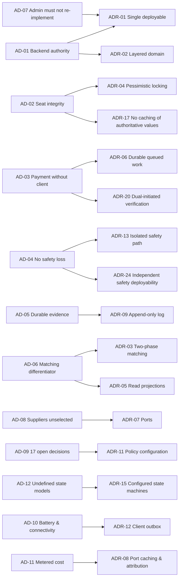

---

# 5. System Context and Container Architecture

## 5.1 System Context

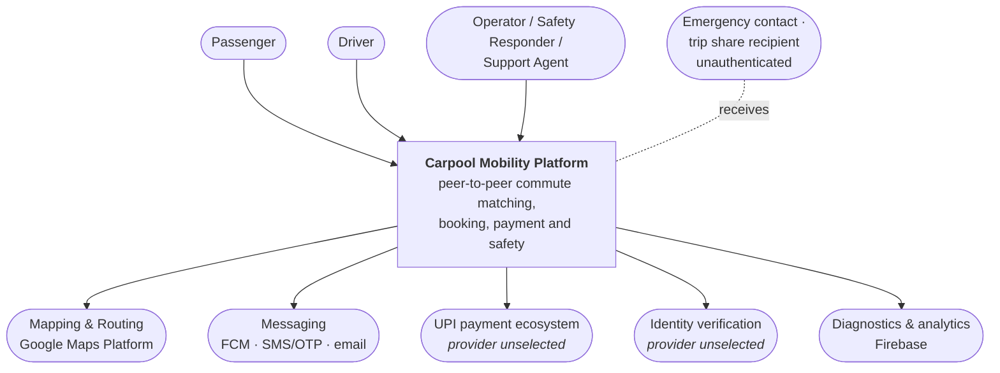

| ID | Architecture Statement | Src |
|---|---|---|
| `ARCH-001` | The system shall present exactly two human-facing surfaces: the Android client and the administrative interface. | `SRS-EL-01`, `03` |
| `ARCH-002` | The system shall interact with external providers only through the Integration element. | `IR-4`, `ADR-07` |
| `ARCH-003` | The system shall expose no interface permitting an external party to alter authoritative state directly. | `SRS-REQ-137` |
| `ARCH-004` | The system shall treat unauthenticated recipients of shared information as outside its trust boundary. | `SRS-REQ-135` |

## 5.2 Container View

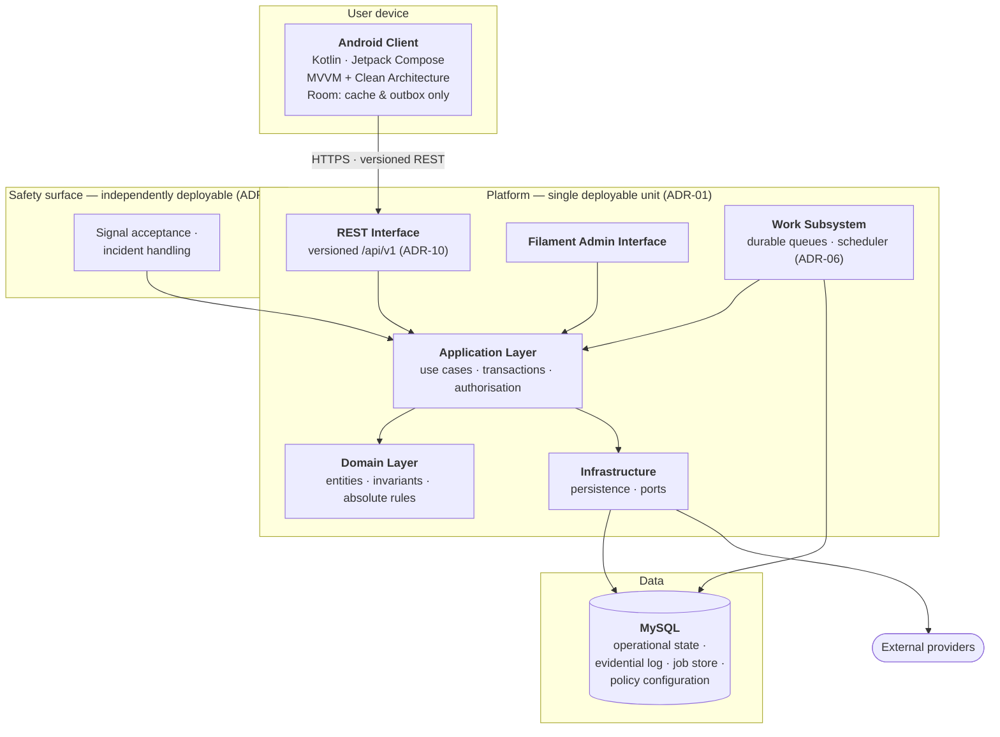

| ID | Architecture Statement | Src |
|---|---|---|
| `ARCH-005` | The platform shall be realised as a single deployable Laravel application containing both front doors. | `ADR-01` |
| `ARCH-006` | Both front doors shall reach business state exclusively through the Application layer. | `ADR-01`, `SRS-REQ-069` |
| `ARCH-007` | Neither front door shall contain business logic. | `SRS-REQ-070`, `AP-01` |
| `ARCH-008` | The Domain layer shall depend on no outward layer. | `ADR-02` |
| `ARCH-009` | The Android client shall reach the platform only through the versioned REST interface. | `SRS-REQ-007` |
| `ARCH-010` | No container other than the platform shall reach the database. | `SRS-REQ-083`, `IR-3` |
| `ARCH-011` | The work subsystem shall invoke the Application layer, not the Domain or Infrastructure layers directly. | `ADR-06`, `AP-01` |
| `ARCH-012` | The safety surface shall be independently deployable and shall share the Application layer, Domain layer and store. | `ADR-24` |
| `ARCH-013` | The safety surface shall be the only capability permitted independent deployment. | `ADR-24` |
| `ARCH-014` | MySQL shall hold operational state, the evidential log, the job store and policy configuration. | `ADR-06`, `09`, `11`, `BAD-CON-005` |

## 5.3 Container Responsibilities

| Container | Holds authoritative state | Makes business decisions | Reaches providers | Independently deployable |
|---|---|---|---|---|
| Android Client | No | No | Device capability only | n/a |
| REST Interface | No | No | No | No |
| Filament Admin Interface | No | No | No | No |
| Application Layer | No — orchestrates | Enforces via Domain | Via Infrastructure | No |
| Domain Layer | Yes — invariants | **Yes — exclusively** | No | No |
| Infrastructure | Persists | No | **Yes — via ports** | No |
| Work Subsystem | No | Via Application | Via Infrastructure | No |
| Safety Surface | No | Via Application | No | **Yes — sole exception** |
| MySQL | **Yes — store of record** | No | No | n/a |

---

# 6. Component Architecture

> **Boundary reminder.** This section names components and their obligations. Their
> internal structure is CMP-DOC-08 (mobile) and CMP-DOC-09 (backend).

## 6.1 Android Client Components

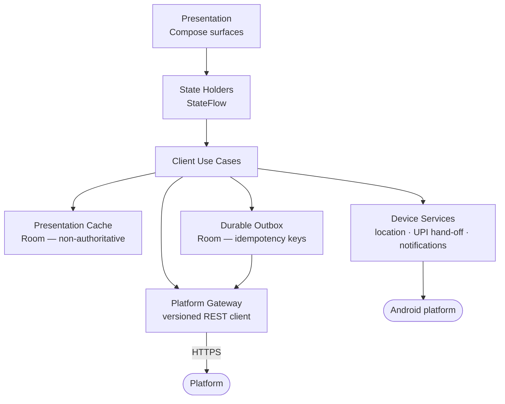

| ID | Architecture Statement | Src |
|---|---|---|
| `ARCH-015` | The client shall separate presentation, state holding, use-case and gateway concerns. | `BAD-CON-001` |
| `ARCH-016` | The client shall hold no business rule and shall compute no authoritative value. | `SRS-REQ-001`, `003` |
| `ARCH-017` | The presentation cache shall be marked non-authoritative in every read path. | `SRS-REQ-002`, `004` |
| `ARCH-018` | The client shall discard cached business data on session end. | `SRS-REQ-005` |
| `ARCH-019` | The client shall re-request rather than reuse any cached value on which a commitment depends. | `SRS-REQ-006`, `ADR-17` |
| `ARCH-020` | The durable outbox shall hold user-initiated actions taken without connectivity, each with an idempotency key. | `ADR-12`, `ADR-14` |
| `ARCH-021` | The client shall not present an outbox action as complete until the platform confirms it. | `SRS-REQ-019` |
| `ARCH-022` | Device services shall submit captured location as observation, never as position of record. | `ADR-18`, `SRS-REQ-012` |
| `ARCH-023` | Device services shall treat a payment application response as an event to report, never as evidence. | `SRS-REQ-013`, `ADR-20` |
| `ARCH-024` | The outbox shall hold no value that the platform treats as authoritative. | `SRS-REQ-001`, `ADR-12` |
| `ARCH-025` | The client shall acquire location only while a trip is active, at a platform-supplied cadence. | `SRS-REQ-014`, `ADR-12` |
| `ARCH-026` | The client shall not poll the platform on a client-chosen interval. | `ADR-12`, `AD-10` |
| `ARCH-027` | The client shall externalise all user-facing text and brand-bearing strings. | `SRS-REQ-029`, `NFR-110` |
| `ARCH-028` | The client shall degrade non-essential capability rather than fail on the lowest supported device class. | `SRS-REQ-027` |

## 6.2 Platform Services Components

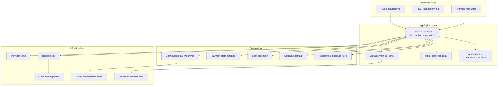

| ID | Architecture Statement | Src |
|---|---|---|
| `ARCH-029` | Interface adapters shall translate between transport representation and application input only. | `ADR-02`, `ADR-10` |
| `ARCH-030` | Version-specific adapters shall share one Application layer; the Domain layer shall not be versioned. | `ADR-10` |
| `ARCH-031` | Authorisation shall be evaluated in the Application layer, identically for both front doors. | `ADR-21`, `SRS-REQ-136` |
| `ARCH-032` | Use-case services shall own transaction boundaries; no other layer shall begin a transaction. | `ADR-02`, `ADR-04` |
| `ARCH-033` | Absolute business rules shall reside in the Domain layer and shall not be reachable for override. | `SRS-REQ-125`, `NFR-104` |
| `ARCH-034` | Each business rule shall be expressed in exactly one Domain component. | `SRS-REQ-126`, `NFR-103` |
| `ARCH-035` | Seat allocation shall be a distinct Domain component owning the seat invariant. | `ADR-04`, `AD-02` |
| `ARCH-036` | Payment state shall be a distinct Domain component permitting exactly three states. | `SRS-REQ-155`, `156` |
| `ARCH-037` | Configured state machines shall read their definitions from policy configuration and reject unconfigured values. | `ADR-15`, `SRS-REQ-158` |
| `ARCH-038` | Invariants that must hold under any state model shall be code, not configuration. | `ADR-15`, `SRS-REQ-159`, `160` |
| `ARCH-039` | Domain events shall be published only after the producing transaction commits. | `ADR-16` |
| `ARCH-040` | The idempotency registry shall record every state-changing operation's key and outcome. | `ADR-14`, `SRS-REQ-044` |
| `ARCH-041` | The evidential log writer shall be the sole path by which evidential records are created. | `ADR-09`, `SRS-REQ-129` |
| `ARCH-042` | Projection maintenance shall be driven by domain events and shall never be authoritative. | `ADR-05`, `ADR-16` |

## 6.3 Administrative Interface Components

| ID | Architecture Statement | Src |
|---|---|---|
| `ARCH-043` | Administrative resources shall invoke the same use-case services as the REST interface. | `ADR-01`, `SRS-REQ-069` |
| `ARCH-044` | Administrative resources shall implement no business rule and no validation that substitutes for a Domain rule. | `SRS-REQ-070` |
| `ARCH-045` | Administrative access shall be restricted by administrative role in the Application layer. | `SRS-REQ-075`, `ADR-21` |
| `ARCH-046` | Every administrative action shall carry the acting operator's identity into the Application layer. | `SRS-REQ-073` |
| `ARCH-047` | Administrative reads shall be served from projections, never from the evidential log or live transactional tables. | `ADR-22` |
| `ARCH-048` | The administrative interface shall present a measure as unavailable where its behaviour is unimplemented. | `SRS-REQ-079` |
| `ARCH-049` | Operator queues — reconciliation, safety, verification, moderation — shall each expose depth and oldest-item age. | `SRS-REQ-078`, `NFR-121` |

## 6.4 Persistence Components

| ID | Architecture Statement | Src |
|---|---|---|
| `ARCH-050` | Operational state, the evidential log, the job store, the idempotency registry, projections and policy configuration shall be logically distinct within MySQL. | `ADR-06`, `09`, `11`, `14` |
| `ARCH-051` | Route geometry shall be resolved once at publication and stored with the ride. | `ADR-03`, `AD-11` |
| `ARCH-052` | Ride routes shall be held in a spatially indexed representation supporting the coarse filter. | `ADR-03` |
| `ARCH-053` | The seat allocation record shall be lockable independently of other ride attributes. | `ADR-04` |
| `ARCH-054` | Evidential records shall be append-only, carrying a chained integrity value. | `ADR-09` |
| `ARCH-055` | Projection staleness shall be bounded and the bound shall be configurable. | `ADR-05`, `ADR-11` |
| `ARCH-056` | Seat availability shall never be served from a projection. | `ADR-05`, `ADR-17`, `FRD-FR-084` |
| `ARCH-057` | A completed trip record shall capture referenced entity values as at the time of travel. | `SRS-REQ-088`, `089` |
| `ARCH-058` | Retention removal shall operate on personal data while preserving the evidential skeleton of records shared with another party. | `ADR-09`, `SRS-REQ-091` |
| `ARCH-059` | Identity evidence and payment-related data shall be held in protected form; mechanism deferred to CMP-DOC-13. | `SRS-REQ-097` |
| `ARCH-060` | Authentication credentials shall be held in non-recoverable form; mechanism deferred to CMP-DOC-13. | `SRS-REQ-098` |

## 6.5 Integration Components

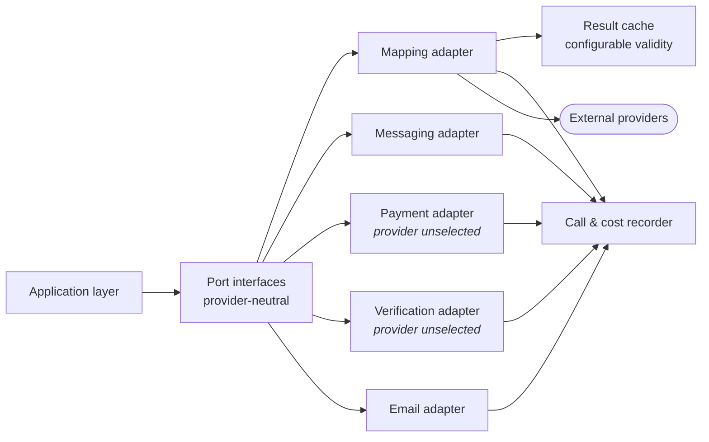

| ID | Architecture Statement | Src |
|---|---|---|
| `ARCH-061` | Each external capability shall be defined as a port in provider-neutral terms. | `ADR-07`, `SRS-REQ-109` |
| `ARCH-062` | No external call shall occur inside a database transaction. | `ADR-04`, `AD-02` |
| `ARCH-063` | No provider name, type or error shall appear above the port boundary. | `ADR-07`, `SRS-REQ-108` |
| `ARCH-064` | Each adapter shall validate a provider response for plausibility before returning it. | `SRS-REQ-105` |
| `ARCH-065` | Each adapter shall return outcomes distinguishing *reported*, *verified* and *unknown*. | `SRS-REQ-106`, `113` |
| `ARCH-066` | No adapter shall synthesise, default or infer a result a provider did not return. | `SRS-REQ-113`, `AP-09` |
| `ARCH-067` | Each adapter shall record every call, its outcome and its attributable cost. | `ADR-08`, `SRS-REQ-116` |
| `ARCH-068` | Result caching shall apply only to stable results and shall never cache authoritative platform state. | `ADR-08`, `ADR-17` |
| `ARCH-069` | Cache validity periods and call cadences shall be policy configuration. | `ADR-08`, `ADR-11` |
| `ARCH-070` | Provider unavailability shall be reported upward, never substituted by a result. | `SRS-REQ-112`, `AP-09` |

## 6.6 Work Subsystem Components

| ID | Architecture Statement | Src |
|---|---|---|
| `ARCH-071` | Every queued job shall be idempotent and safely re-runnable. | `ADR-06`, `ADR-14` |
| `ARCH-072` | Payment verification shall run as a queued job initiated by the platform, independent of any client. | `ADR-06`, `ADR-20`, `FRD-FR-126` |
| `ARCH-073` | The platform shall re-attempt payment verification on its own schedule, bounded and recorded. | `SRS-REQ-168`, `169` |
| `ARCH-074` | Safety work shall run on a dedicated queue with priority over all other work. | `ADR-13`, `SRS-REQ-060` |
| `ARCH-075` | Notification issue, projection maintenance, reconciliation ageing and scheduled generation shall be queued work. | `ADR-06` |
| `ARCH-076` | Deferred work shall survive platform restart without loss. | `SRS-REQ-048`, `NFR-037` |
| `ARCH-077` | Job failure shall be bounded by attempt count, with exhaustion recorded rather than retried indefinitely. | `SRS-REQ-169` |

## 6.7 Component Count

| Element | Components |
|---|---|
| Android Client | 6 |
| Platform Services | 14 |
| Administrative Interface | 3 |
| Persistence | 6 |
| Integration | 7 (5 adapters + cache + meter) |
| Work Subsystem | 5 job families |
| **Total** | **31 named + 10 supporting** |

---

# 7. Runtime Architecture

> Five scenarios are modelled: those that **stress the architecture**, not those that
> exercise the most requirements.

## 7.1 Search and Route-Overlap Matching

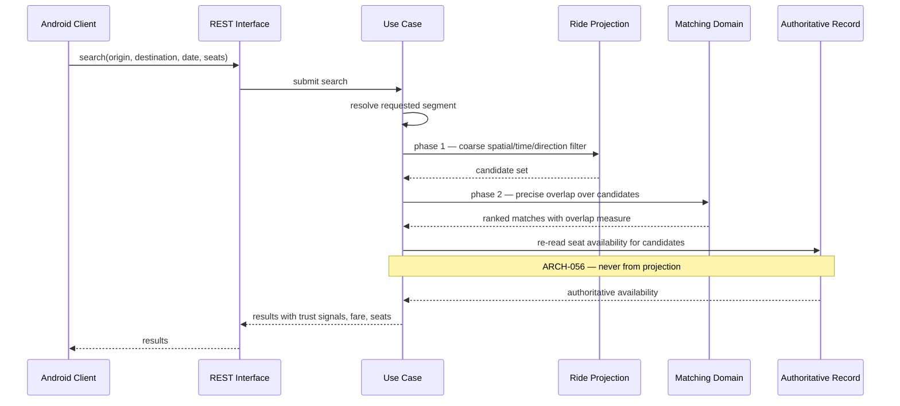

| ID | Architecture Statement | Src |
|---|---|---|
| `ARCH-078` | Search shall resolve the requested segment before any candidate evaluation. | `ADR-03` |
| `ARCH-079` | Phase 1 shall narrow candidates before any precise geometry is computed. | `ADR-03`, `NFR-043` |
| `ARCH-080` | Seat availability presented in results shall be read from the authoritative record. | `ARCH-056`, `FRD-FR-084` |
| `ARCH-081` | A search returning no candidate shall not incur precise-overlap computation. | `NFR-148`, `AD-11` |
| `ARCH-082` | Search shall be withdrawn, not degraded, when route resolution is unavailable. | `AP-09`, `FRD-FR-096` |

## 7.2 Request, Payment and Booking Confirmation

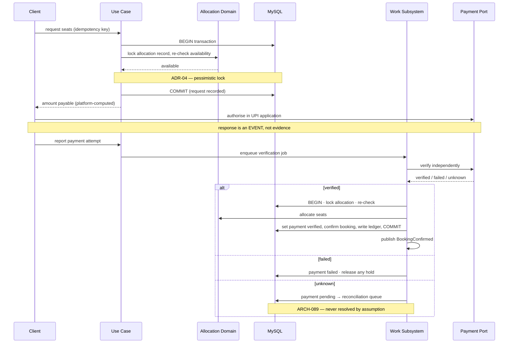

| ID | Architecture Statement | Src |
|---|---|---|
| `ARCH-083` | The amount payable shall be computed by the platform and never accepted from a client. | `FRD-FR-117`, `118` |
| `ARCH-084` | A client-reported payment outcome shall enqueue verification, never set payment status. | `ADR-20`, `FRD-FR-124` |
| `ARCH-085` | Verification shall proceed on the platform's schedule irrespective of client return. | `ADR-06`, `FRD-FR-126` |
| `ARCH-086` | Seat availability shall be re-checked under lock at confirmation, not only at request. | `ADR-04`, `FRD-FR-105` |
| `ARCH-087` | Payment verification, seat allocation, booking confirmation and the ledger entry shall commit in one transaction. | `SRS-REQ-040`, `041` |
| `ARCH-088` | No external call shall occur within that transaction. | `ARCH-062` |
| `ARCH-089` | An indeterminate verification shall set pending and route to reconciliation, never resolve by assumption. | `FRD-FR-130`, `131` |
| `ARCH-090` | Seats shall be released when verification fails. | `FRD-FR-109` |

## 7.3 Active Trip and Position Reporting

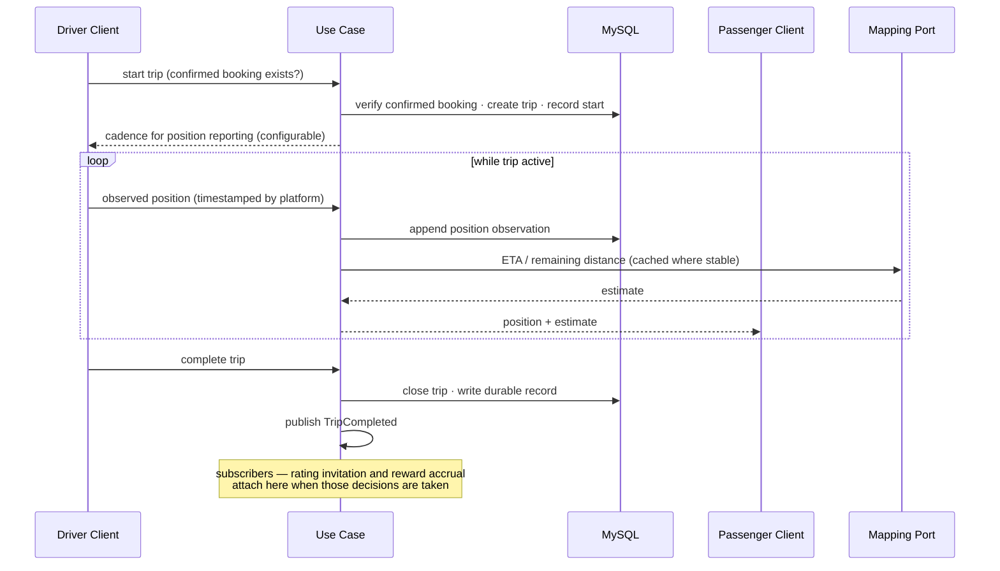

| ID | Architecture Statement | Src |
|---|---|---|
| `ARCH-091` | A trip shall not start without a confirmed booking, irrespective of the eventual state model. | `SRS-REQ-159` |
| `ARCH-092` | The platform shall timestamp position observations; client timestamps shall not be authoritative. | `ADR-18` |
| `ARCH-093` | Position reporting cadence shall be supplied by the platform and configurable. | `ADR-12`, `NFR-147` |
| `ARCH-094` | A position shall not be presented as current beyond its configured staleness bound. | `NFR-012`, `FRD-FR-150` |
| `ARCH-095` | Trip completion shall write its durable record before the trip is reported complete. | `FRD-FR-167` |
| `ARCH-096` | Amending a ride shall invalidate its cached route geometry. | `ADR-08` |
| `ARCH-097` | `TripCompleted` shall be published as a domain event with no compile-time dependency on its subscribers. | `ADR-16` |

## 7.4 Safety Signal

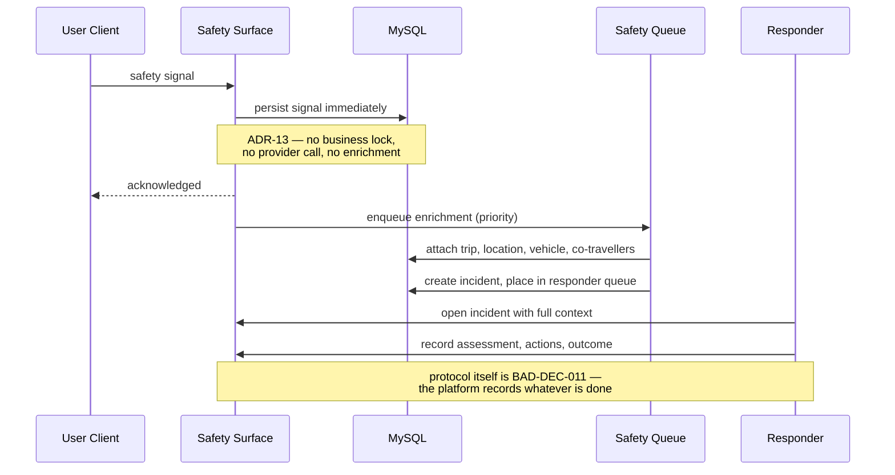

| ID | Architecture Statement | Src |
|---|---|---|
| `ARCH-098` | A safety signal shall be persisted before any enrichment or routing. | `ADR-13`, `AP-05` |
| `ARCH-099` | Safety signal acceptance shall acquire no business lock and call no external provider. | `ADR-13` |
| `ARCH-100` | Safety signal acceptance shall remain available when other capability is unavailable. | `ADR-24`, `SRS-REQ-082` |
| `ARCH-101` | An incident shall be created with partial context rather than rejected. | `FRD-FR-187`, `SRS-REQ-059` |
| `ARCH-102` | Enrichment failure shall not discard a signal; the signal shall be retried until recorded and queued. | `SRS-REQ-057`, `NFR-075` |
| `ARCH-103` | Safety notifications shall bypass user notification preferences. | `SRS-REQ-062`, `NFR-076` |

## 7.5 Degraded Operation

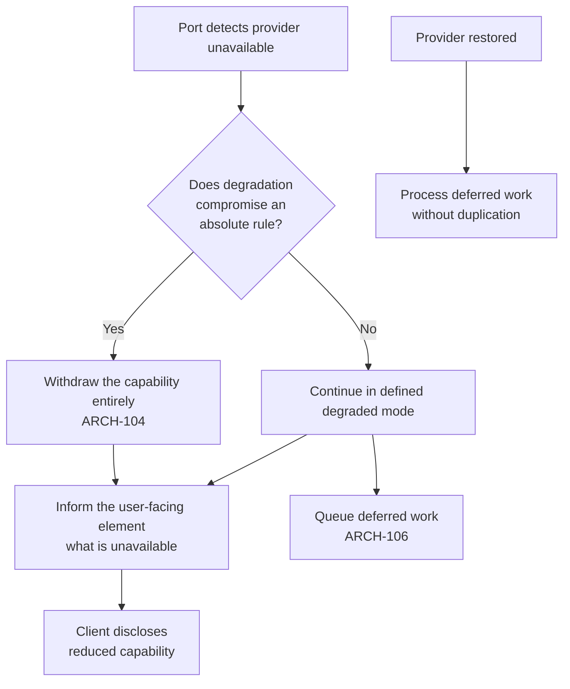

| ID | Architecture Statement | Src |
|---|---|---|
| `ARCH-104` | A capability whose degradation would compromise an absolute rule shall be withdrawn entirely. | `SRS-REQ-132`, `NFR-035` |
| `ARCH-105` | Degraded state shall be propagated to the user-facing element for disclosure. | `SRS-REQ-133` |
| `ARCH-106` | Work deferred by provider unavailability shall be queued and processed on restoration without duplication. | `SRS-REQ-114`, `ADR-14` |
| `ARCH-107` | An active trip shall survive the unavailability of any single supporting service. | `SRS-REQ-134`, `NFR-025` |
| `ARCH-108` | Payment shall not be initiated when the payment ecosystem is unavailable. | `FRD-FR-137` |
| `ARCH-109` | Search shall be withdrawn when route resolution is unavailable, rather than return unranked results. | `FRD-FR-096`, `AP-09` |

---

# 8. Data Architecture

> **Boundary.** Logical data architecture only. Tables, columns, keys, indexes and
> migrations are CMP-DOC-11's.

## 8.1 The Five Data Categories

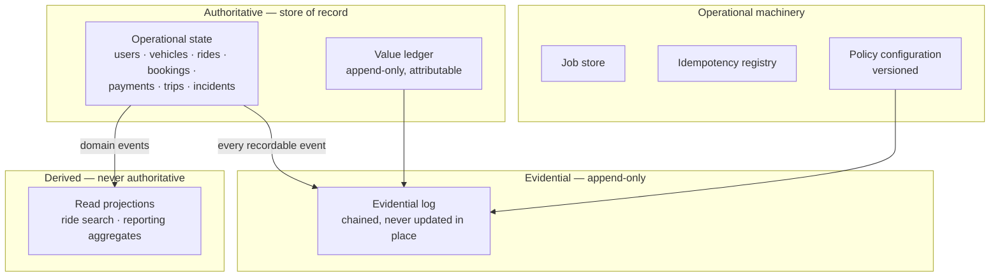

| ID | Architecture Statement | Src |
|---|---|---|
| `ARCH-110` | Authoritative state, evidential records, derived projections and operational machinery shall be logically distinct. | `ADR-05`, `09` |
| `ARCH-111` | Balances shall be derived from ledger entries and never stored independently of them. | `SRS-REQ-087`, `NFR-127` |
| `ARCH-112` | Every ledger entry shall be attributable to a party and an event. | `SRS-REQ-086`, `NFR-128` |
| `ARCH-113` | Projections shall be rebuildable from authoritative state without loss. | `ADR-05` |
| `ARCH-114` | Loss of a projection shall degrade performance, never correctness. | `ADR-05`, `AP-08` |
| `ARCH-115` | Policy configuration changes shall be evidential records. | `ADR-11`, `SRS-REQ-183` |

## 8.2 Consistency Model

| Data | Consistency | Rationale |
|---|---|---|
| Seat allocation | **Strong, serialised** | `AD-02` admits nothing weaker |
| Payment status | **Strong** | `BAD-RULE-033` |
| Booking confirmation | **Strong, same transaction as allocation and ledger** | `SRS-REQ-040`, `041` |
| Evidential log | **Strong, append-only** | `AD-05` |
| Ride search projection | **Bounded staleness, configurable** | `ADR-05` — never used for availability |
| Reporting aggregates | **Eventually consistent** | Not decision-bearing |
| Position observations | **Append-only, no update** | `ADR-18` |

> **The single most important line in this section:** the search projection may be stale,
> and **seat availability is never read from it** (`ARCH-056`). Staleness is acceptable
> for *what is on offer*; it is not acceptable for *what remains*.

## 8.3 Data Lifecycle and Retention

| ID | Architecture Statement | Src |
|---|---|---|
| `ARCH-116` | Personal data shall be separable from the evidential skeleton of a shared record. | `SRS-REQ-091`, `NFR-132` |
| `ARCH-117` | Retention removal shall not break the integrity chain of the evidential log. | `ADR-09` |
| `ARCH-118` | Retention periods shall be policy configuration per data category. | `SRS-REQ-178`, `ADR-11` |
| `ARCH-119` | Position history shall be retained separately from trip records so that it can be removed independently. | `BRD-DATA-009`, `NFR-131` |

> **`ARCH-116` and `ARCH-119` are the architectural answer to `FRD-GAP-028`.** A trip
> record is evidence for every participant; a position track is largely evidence about
> one. Separating them means retention can remove the latter without destroying the
> former — which is what `NFR-132` requires and what any workable `BAD-DEC-021` will need.

---

# 9. Integration Architecture

## 9.1 External Interface Shape

| ID | Architecture Statement | Src |
|---|---|---|
| `ARCH-120` | The platform shall expose one versioned REST interface for client elements. | `BAD-CON-007`, `ADR-10` |
| `ARCH-121` | The interface shall carry no operation permitting direct assignment of authoritative state. | `SRS-REQ-137` |
| `ARCH-122` | The interface shall distinguish a business refusal from a platform fault from provider unavailability. | `SRS-REQ-139`, `161` |
| `ARCH-123` | The interface shall identify its version in a form the client can act upon. | `SRS-REQ-138` |
| `ARCH-124` | The interface shall accept an idempotency key on every state-changing operation. | `ADR-14` |
| `ARCH-125` | The interface shall disclose to a caller only what that caller's actor is entitled to. | `SRS-REQ-141` |

## 9.2 Provider Ports

| Port | Capability | Provider status | Cacheable |
|---|---|---|---|
| Mapping & Routing | Place resolution, route geometry, ETA and distance | Google Maps Platform (direction approved) | **Yes** — geometry is stable |
| Messaging | Push notification, OTP channel | Firebase / `[TBD]` for OTP | No |
| Payment | Initiation and independent verification | **Unselected** — `BAD-DEP-004` | **Never** |
| Identity Verification | Evidence assessment | **Unselected** — `BAD-DEP-005` | No |
| Transactional Email | Outbound email | **Unselected** — `BAD-DEP-007` | No |

| ID | Architecture Statement | Src |
|---|---|---|
| `ARCH-126` | Payment verification outcomes shall never be cached. | `ADR-08`, `ADR-17` |
| `ARCH-127` | The payment port shall support platform-initiated verification independent of provider callback. | `ADR-20`, `SRS-REQ-142` |
| `ARCH-128` | A provider callback shall be treated as a trigger to verify, never as the verification. | `SRS-REQ-143`, `FRD-FR-124` |
| `ARCH-129` | Each port shall bound its wait and its retry behaviour. | `SRS-REQ-144`, `115` |
| `ARCH-130` | Port contracts shall be expressible without reference to any named provider. | `SRS-REQ-108`, `109` |

> **`ARCH-128` matters more than its length suggests.** A callback endpoint is
> externally reachable and its authenticity depends on a provider's implementation. By
> making a callback only a *trigger* to run the platform's own verification, the
> architecture is unaffected by a forged or replayed callback. This is `BAD-RULE-032`
> holding at the integration boundary.

---

# 10. Security Architecture

> **Boundary.** Structure and trust boundaries only. Controls, algorithms, key handling
> and the threat model are CMP-DOC-13's.

## 10.1 Trust Boundary Realisation

| Boundary | Realised by | Architecture statements |
|---|---|---|
| **TB-1** Client → Platform | Versioned REST interface; all input validated in the Application layer; no operation assigns authoritative state | `ARCH-121`, `125`, `131` |
| **TB-2** Admin → Platform | Same Application layer, same authorisation evaluation, operator identity carried through | `ARCH-043`, `045`, `046`, `132` |
| **TB-3** Integration → Platform | Ports normalise outcomes; adapters validate plausibility; *reported* never becomes *true* | `ARCH-064`, `065`, `066`, `128` |
| **TB-4** Platform → Persistence | Repositories are the sole access path; evidential writes go through one writer | `ARCH-010`, `041` |

| ID | Architecture Statement | Src |
|---|---|---|
| `ARCH-131` | Every inbound value shall be validated against platform state before use, irrespective of origin. | `SRS-REQ-032`, `AP-02` |
| `ARCH-132` | Administrative requests shall receive validation identical to client requests. | `SRS-REQ-136`, `ADR-21` |
| `ARCH-133` | An attempt to assert authoritative state shall be rejected in whole and recorded as an integrity event. | `SRS-REQ-036`, `037` |
| `ARCH-134` | Authorisation shall be deny-by-default. | `NFR-058`, `AP-02` |
| `ARCH-135` | Refused authorisations shall be recorded. | `SRS-REQ-074`, `NFR-060` |
| `ARCH-136` | Diagnostic records shall exclude personal data beyond their purpose. | `SRS-REQ-130`, `NFR-123` |
| `ARCH-137` | Information shared with an unauthenticated recipient shall be bounded and time-limited by policy configuration. | `SRS-REQ-135`, `ADR-11` |

## 10.2 Security Concerns Deferred to CMP-DOC-13

| Concern | Why deferred |
|---|---|
| Credential storage mechanism | `ARCH-060` states the property; the mechanism is a security design choice |
| Evidential chaining algorithm and key handling | `ARCH-054` states the property; the cryptography is CMP-DOC-13's |
| Transport protection specifics | Property stated by `NFR-062` |
| Session lifetime and rotation | `NFR-055` `[TBD-TECH]` |
| Rate limiting thresholds | `NFR-056`, `057` `[TBD-TECH]` |
| **Fraud detection and response** | **Unowned — `GAP-013`.** No element assigned; see `ARCH-OQ-007` |

---

# 11. Deployment Architecture

> **Hosting is unselected (`BAD-DEP-009`) and no capacity target exists
> (`BAD-DEC-018`).** This section therefore specifies **logical deployment topology and
> its constraints**, not physical infrastructure, instance counts or service tiers. Those
> are CMP-DOC-19's, and cannot be settled until sizing is possible.

## 11.1 Logical Topology

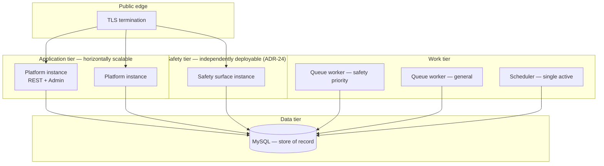

| ID | Architecture Statement | Src | Sizing |
|---|---|---|---|
| `ARCH-138` | The application tier shall be stateless between requests, permitting horizontal scaling. | `NFR-041`, `051` | `[SIZING]` |
| `ARCH-139` | Session state shall not be held in application-instance memory. | `ARCH-138` | — |
| `ARCH-140` | The scheduler shall have exactly one active instance to prevent duplicate triggering. | `ADR-06` | — |
| `ARCH-141` | Queue workers shall be scalable independently of the application tier. | `ADR-06` | `[SIZING]` |
| `ARCH-142` | Safety-priority workers shall be separable from general workers. | `ADR-13`, `ARCH-074` | `[SIZING]` |
| `ARCH-143` | The safety surface shall be deployable and restartable without restarting the application tier. | `ADR-24` | — |
| `ARCH-144` | The data tier shall support the recovery objectives once set. | `NFR-038`, `039` | **`[SIZING]`** |

## 11.2 Sizing Decisions Deferred to CMP-DOC-19

| # | Decision | Blocked by |
|---|---|---|
| 1 | Application tier instance count and scaling trigger | `NFR-041`, `042` |
| 2 | Worker pool sizes, general and safety | `NFR-072`, `073` |
| 3 | Database tier and capacity | `NFR-041`–`050` |
| 4 | Redundancy topology for the availability target | `NFR-023` |
| 5 | Backup frequency and retention for the recovery objectives | `NFR-038`, `039` |
| 6 | Read-replica strategy for projections | `NFR-048` |
| 7 | Evidential log growth provisioning | `ADR-09`, `NFR-050` |
| 8 | Cost ceiling and alerting thresholds | `NFR-145`, `149` |
| 9 | Environment count and promotion path | `NFR-108` |
| 10 | Hosting provider | `BAD-DEP-009` |
| 11 | Whether the safety surface requires separate infrastructure or only separate deployment | `ARCH-OQ-006` |

**Eleven sizing decisions. All eleven trace to `BAD-DEC-018` or an unselected supplier.**

---

# 12. Cross-Cutting Architecture

## 12.1 Configuration

| ID | Architecture Statement | Src |
|---|---|---|
| `ARCH-145` | Deployment configuration shall be supplied at deploy time, outside the artefact, and shall not be runtime-editable. | `ADR-11`, `NFR-108` |
| `ARCH-146` | Policy configuration shall be versioned records, runtime-editable by an authorised operator, every change audited. | `ADR-11`, `SRS-REQ-183` |
| `ARCH-147` | No configuration of either kind shall alter behaviour fixed by an absolute business rule. | `SRS-REQ-182`, `ADR-11` |
| `ARCH-148` | Policy configuration shall be validated on change, and an invalid configuration shall be rejected rather than applied. | `ADR-15` |

## 12.2 Audit, Observability and Error Handling

| Concern | Architectural realisation |
|---|---|
| **Audit** | Universal domain-event subscriber writing to the evidential log (`ADR-09`, `ADR-16`); no component writes audit records directly (`ARCH-041`). |
| **Observability** | Call and cost recording at the port boundary (`ARCH-067`); queue depth and oldest-item age exposed per queue (`ARCH-049`); the four R1 measures instrumented from first release (`NFR-113`–`115`, `150`). |
| **Error taxonomy** | Four classes — caller error, business refusal, platform fault, provider unavailability — distinguished at the interface (`ARCH-122`) and never conflated (`SRS-REQ-163`). |
| **Structural enforcement** | Build-time checks for layer dependency direction, absence of provider types above ports, and absence of business logic in front doors (`ADR-23`). |

## 12.3 How the Reserved Areas Attach

| Reserved area | Attaches as | Requires no structural change because |
|---|---|---|
| **Ratings & Reviews** | Subscriber to `TripCompleted`; reputation read via projection | `ADR-16` decouples publisher from subscriber; `ADR-05` already provides projections |
| **Wallet & Rewards** | Subscriber to `TripCompleted` and payment events; balance derived from the existing ledger | `ARCH-111`/`112` already require an attributable ledger |
| **Recurring Commute** | Scheduled job generating rides through the existing publication use case | `ADR-06` already provides durable scheduled work |

> **This is the payoff of `AP-10`.** Three undecided product areas attach to machinery
> the architecture already requires for other reasons. None of them will force a
> structural change when its decision is taken.

---

# 13. Technology Mapping

| Architectural element | Technology | Status |
|---|---|---|
| Android client | Kotlin, Jetpack Compose, MVVM + Clean Architecture, StateFlow, Coroutines | **Approved direction** |
| Client cache and outbox | Room — non-authoritative only | **Approved direction** |
| Device location | Android Fused Location Provider | **Approved direction** |
| Platform application | Laravel | **Approved direction** |
| Administrative interface | Laravel Filament, same deployable | **Approved direction** + `ADR-01` |
| Interface style | REST / JSON, versioned at `/api/v1/` | **Approved direction** + `ADR-10` |
| Store of record, evidential log, job store, policy store | MySQL | **Approved direction** + `ADR-06`, `09`, `11` |
| Spatial indexing for phase-1 matching | MySQL spatial capability | `ADR-03` — **architecture decision** |
| Work subsystem | Laravel queues and scheduler, MySQL-backed | `ADR-06` — **architecture decision** |
| Mapping and routing | Google Maps Platform | **Approved direction** |
| Push, diagnostics, analytics | Firebase — FCM, Crashlytics, Performance, Analytics | **Approved direction** |
| Payment | Indian UPI ecosystem | **Approved direction**; provider **unselected** |
| Identity verification | — | **Unselected** |
| Hosting | — | **Unselected** |
| Excluded throughout | Supabase · PostgreSQL · Spring Boot | **Excluded by `BAD-CON-008`** |

> **No technology appears in this architecture that is not either an approved direction
> or an architecture decision recorded in §4.** The three unselected items sit behind
> ports and are not structural.

---

# 14. Architecture Evaluation

## 14.1 Evaluation Against the Drivers

| Driver | Satisfied by | Assessment |
|---|---|---|
| `AD-01` Backend authority | `ADR-01`, `ADR-02`, `ARCH-006`–`008`, `033` | **Satisfied structurally.** One domain layer; both front doors pass through it; enforced at build time (`ADR-23`). |
| `AD-02` Seat integrity | `ADR-04`, `ARCH-035`, `053`, `086`, `087` | **Satisfied.** Invariant enforced by lock *and* constraint. Throughput cost accepted. |
| `AD-03` Payment without client | `ADR-06`, `ADR-20`, `ARCH-072`, `085` | **Satisfied.** Verification is queued work on the platform's own schedule. |
| `AD-04` No safety loss | `ADR-13`, `ADR-24`, `ARCH-098`–`102` | **Satisfied structurally.** Capture precedes processing; path takes no lock; independently deployable. |
| `AD-05` Durable evidence | `ADR-09`, `ARCH-041`, `054`, `116` | **Satisfied structurally.** Mechanism for chaining deferred to CMP-DOC-13. |
| `AD-06` Matching differentiator | `ADR-03`, `ADR-05`, `ARCH-051`, `079` | **Partially validated.** Structure is sound; **phase-1 selectivity is unmeasured** (`ARCH-RISK-004`). |
| `AD-07` Admin must not re-implement | `ADR-01`, `ARCH-043`, `044`, `ADR-23` | **Satisfied structurally and enforced at build time.** |
| `AD-08` Suppliers replaceable | `ADR-07`, `ARCH-061`–`063`, `130` | **Satisfied.** No provider type above the port. |
| `AD-09` Open decisions arrive as values | `ADR-11`, `ARCH-145`–`148` | **Satisfied.** Two configuration kinds, absolute rules excluded from both. |
| `AD-10` Battery and connectivity | `ADR-12`, `ARCH-020`, `025`, `026`, `093` | **Satisfied.** Server-driven cadence; durable outbox; no client polling. |
| `AD-11` Metered cost | `ADR-08`, `ARCH-051`, `067`, `081` | **Satisfied.** One choke point; geometry resolved once; zero-result path bounded. |
| `AD-12` Undefined state models | `ADR-15`, `ARCH-037`, `038` | **Satisfied.** Definitions configurable; invariants remain code. |

**Ten of twelve drivers are satisfied structurally. `AD-06` awaits measurement.
`AD-02` is satisfied at a deliberate throughput cost.**

## 14.2 Evaluation Against Absolute Rules

| Absolute rule | Architectural guarantee |
|---|---|
| `BAD-RULE-002` Backend authority | `ARCH-006`–`008`; build-time dependency check |
| `BAD-RULE-003` No direct client-to-database | `ARCH-009`, `010` |
| `BAD-RULE-026`/`027` Seat integrity | `ADR-04`; lock plus database constraint |
| `BAD-RULE-028` Booking confirmed only by platform | `ARCH-087` — one transaction |
| `BAD-RULE-032` Client UPI response never proof | `ARCH-084`, `128` |
| `BAD-RULE-033` Payment status only by verification | `ARCH-036`, `085`, `089` |
| `BAD-RULE-034` Fare computed by platform | `ARCH-083` |
| `BAD-RULE-041` Safety signals recorded | `ARCH-098`, `102` |
| `BAD-RULE-006` Verification backend-held | `ARCH-033` |
| `BAD-RULE-001` Peer, not professional | No dispatch or assignment component exists anywhere in the architecture |

**All ten absolute rules have a named architectural guarantee.**

## 14.3 Trade-Offs the Business Should Understand

| # | Trade-off | Chosen | Cost accepted | Reversible? |
|---|---|---|---|---|
| T-1 | Seat correctness vs booking throughput | Correctness (`ADR-04`) | Lock contention on popular rides | Yes — revisit with measurement |
| T-2 | Integrity vs independent deployability | Integrity (`ADR-01`) | One maintenance window, mitigated by `ADR-24` | Yes — modular extraction later |
| T-3 | Provider abstraction vs directness | Abstraction (`ADR-07`) | An abstraction layer per capability | No — reversing it re-couples the domain |
| T-4 | Configurability vs simplicity | Configurability (`ADR-11`, `ADR-15`) | A policy subsystem built before its decisions | Partially |
| T-5 | MySQL-backed queues vs a broker | MySQL (`ADR-06`) | Queue throughput bounded by the database | Yes — `ARCH-OQ-005` |
| T-6 | Matching accuracy vs metered cost | Cache stable geometry only (`ADR-08`) | Cache invalidation on ride amendment | Yes |

> **T-1 and T-5 are the two the Project Owner should expect to revisit** once capacity
> targets exist. Both were decided in favour of correctness and simplicity because
> **there is no measurement against which to justify the alternative**, and CMP-DOC-05
> §19 recommends measuring before optimising.

## 14.4 What This Architecture Deliberately Does Not Do

| Not done | Why |
|---|---|
| Microservice decomposition | No capacity target justifies it; it would multiply the `SRS-RISK-003` surface. |
| Separate read store | `ADR-05` projections within MySQL suffice until sizing is possible. |
| External message broker | `ADR-06`; revisit at scale. |
| Multi-region topology | No availability target exists. |
| Client-side business caching | Prohibited by `ADR-17` and `SRS-REQ-001`. |
| Fraud detection subsystem | **Unowned — `GAP-013`.** Not designed because no requirement exists. |

---

# 15. Traceability

## 15.1 Position in the Chain

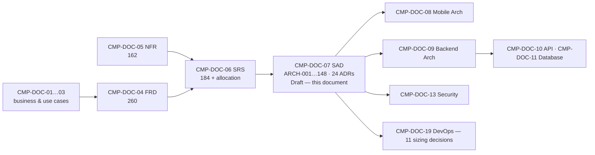

## 15.2 Backward Traceability

| Source | Architecture statements derived |
|---|---|
| Software requirement (`SRS-REQ-`) | 96 |
| Architecture decision (`ADR-`) | 31 |
| Quality requirement (`NFR-`) | 12 |
| Functional requirement (`FRD-FR-`) | 6 |
| Approved constraint (`BAD-CON-`) | 3 |
| **Total** | **148** — every statement names a source |

## 15.3 Coverage

| Check | Result |
|---|---|
| Technical decisions routed from CMP-DOC-06 resolved | **8 of 8 (100%)** |
| Architectural drivers with a named realisation | **12 of 12** |
| Absolute business rules with an architectural guarantee | **10 of 10** |
| Software elements with a component architecture | **6 of 6** |
| Trust boundaries with a realisation | **4 of 4** |
| Architecture statements naming a source | **148 of 148** |
| Sizing decisions deferred with a named blocker | 11 |
| Forward links to CMP-DOC-08 / 09 | **0 — `TRACEABILITY: TBD`** |

## 15.4 Requirements the Architecture Cannot Yet Serve

| Requirement | Reason | Consequence |
|---|---|---|
| `NFR-023`, `038`, `039` availability and recovery | No target | Topology cannot be finalised (`ARCH-144`) |
| `NFR-041`–`050` capacity | No target | Instance and pool sizing deferred |
| `NFR-145`, `149` cost | No ceiling | Alerting thresholds cannot be set |
| Fraud detection | No requirement, no element | Nothing designed — `GAP-013` |
| 29 functional gaps | Behaviour undecided | Elements pre-assigned (CMP-DOC-06 §10.1); reserved per §12.3 |

---

# 16. Assumptions, Risks and Open Questions

## 16.1 Assumptions

| ID | Assumption | Impact if wrong |
|---|---|---|
| `ARCH-ASM-001` | All six predecessors will be approved substantially as written. | Drivers change, and decisions derived from them must be re-examined. |
| `ARCH-ASM-002` | MySQL's spatial capability is sufficient for phase-1 candidate filtering at the densities CMP will reach. | `ADR-03` phase 1 needs another mechanism; phase 2 and the overall shape survive. |
| `ARCH-ASM-003` | A MySQL-backed queue is sufficient until capacity targets exist. | `ADR-06` requires a broker earlier than planned; job contracts are unaffected. |
| `ARCH-ASM-004` | Pessimistic locking on the allocation record will not become the system's primary bottleneck at MVP scale. | T-1 must be revisited; `ADR-04`'s alternative (b) becomes relevant. |
| `ARCH-ASM-005` | One deployable unit plus the safety exception satisfies operational needs. | `ADR-01` revisited toward modular extraction. |
| `ARCH-ASM-006` | Policy configuration can carry the six undefined state models without unbounded generality. | `ADR-15` narrows to configurable values only, with transitions coded per model. |
| `ARCH-ASM-007` | Assumptions of all six predecessors are inherited unchanged. | Inherited. |

## 16.2 Architectural Risks

| ID | Risk | L | I | Sev | Response |
|---|---|---|---|---|---|
| `ARCH-RISK-001` | **Six unapproved predecessors** beneath an architecture. | 3 | 3 | **9** | Do not baseline until approved; drivers are stated explicitly so change impact is traceable. |
| `ARCH-RISK-002` | **Sizing cannot be validated**, so the architecture may not meet targets nobody has set. | 3 | 3 | **9** | 11 sizing decisions named; CMP-DOC-05 §19 route; four targets recommended immediately. |
| `ARCH-RISK-003` | **The safety deployment exception (`ADR-24`) drifts** into a second implementation. | 2 | 3 | **6** | `ARCH-012`, `143` require shared domain and store; enforced by `ADR-23`. |
| `ARCH-RISK-004` | **Phase-1 selectivity is inadequate**, collapsing matching toward brute force. | 2 | 3 | **6** | Measure at synthetic density before R2 (`ARCH-OQ-002`); `NFR-043` is testable now. |
| `ARCH-RISK-005` | **Lock contention on popular rides** limits booking throughput. | 2 | 2 | 4 | Accepted (T-1); revisit with measurement. |
| `ARCH-RISK-006` | **The policy subsystem becomes a second place business logic lives.** | 2 | 3 | **6** | `ARCH-147` prohibits configuring absolute behaviour; `ARCH-148` validates on change. |
| `ARCH-RISK-007` | **Projection staleness leaks into a decision path.** | 2 | 3 | **6** | `ARCH-056` prohibits availability from projections; testable. |
| `ARCH-RISK-008` | **Structural constraints are not enforced** because build tooling is deferred. | 3 | 3 | **9** | `ADR-23`; CMP-DOC-06 already requires 62 structural verifications. |
| `ARCH-RISK-009` | **MySQL queue throughput** becomes a bottleneck under load. | 2 | 2 | 4 | `ARCH-ASM-003`; `ARCH-OQ-005`. |
| `ARCH-RISK-010` | **Evidential log growth** is unprovisioned. | 3 | 2 | **6** | `[SIZING]` #7; `NFR-050` measurable from R1. |
| `ARCH-RISK-011` | **Fraud has no architectural home** and will be retrofitted into the domain layer. | 3 | 2 | **6** | `GAP-013`; `ARCH-OQ-007`; assign before CMP-DOC-13. |
| `ARCH-RISK-012` | **Two interface versions** drift in behaviour. | 2 | 2 | 4 | `ARCH-030` — one Application layer, version-specific adapters only. |

## 16.3 Open Questions

| ID | Question | Owner | Blocks |
|---|---|---|---|
| `ARCH-OQ-001` | What is the minimum route-overlap threshold for a match to be presented? | Product Owner | `ADR-03` |
| `ARCH-OQ-002` | Does phase-1 filtering achieve adequate selectivity at realistic corridor density? | Solution Architect | `ARCH-RISK-004` |
| `ARCH-OQ-003` | Should the search projection be a separate store rather than a MySQL projection? | Solution Architect | `ADR-05`; needs sizing |
| `ARCH-OQ-004` | How long is interface version N−1 served after N is released? | Solution Architect | `ADR-10` |
| `ARCH-OQ-005` | At what measured load does the MySQL-backed queue require replacement? | Solution Architect | `ADR-06`, `ARCH-RISK-009` |
| `ARCH-OQ-006` | Does the safety surface require separate infrastructure, or only separate deployment? | Solution Architect / DevOps | `ADR-24`; `[SIZING]` #11 |
| `ARCH-OQ-007` | **Which architectural component will own fraud detection and response?** | Security Analyst | `GAP-013`; CMP-DOC-13 |
| `ARCH-OQ-008` | Should the evidential log be partitioned by time from the outset? | Software Architect | CMP-DOC-11; `ARCH-RISK-010` |
| `ARCH-OQ-009` | Is idempotency-key retention a policy value or a technical constant? | Solution Architect | `ADR-14` |
| `ARCH-OQ-010` | Should projections be served from a read replica once one exists? | Solution Architect | `ADR-05`; `[SIZING]` #6 |

## 16.4 Decisions Required

**No new business decision is raised.** `BAD-DEC-018` remains the binding constraint on
this document: it blocks all eleven sizing decisions and prevents evaluation of the
architecture against any performance, availability or cost target.

---

# 17. Acceptance Criteria for This Document

| # | Criterion | State |
|---|---|---|
| AC-1 | Every architectural driver is identified and traced to a source. | **Met** — 12 |
| AC-2 | Every technical decision routed from CMP-DOC-06 is resolved or explicitly deferred with a reason. | **Met** — 8 of 8 resolved |
| AC-3 | Every decision records context, alternatives and consequences including negative ones. | **Met** — 24 ADRs |
| AC-4 | Every software element has a component architecture. | **Met** — 6 of 6 |
| AC-5 | Every trust boundary has a named realisation. | **Met** — 4 of 4 |
| AC-6 | Every absolute business rule has an architectural guarantee. | **Met** — 10 of 10 |
| AC-7 | Every architecture statement names a source. | **Met** — 148 of 148 |
| AC-8 | No capacity, latency, availability or cost figure is invented. | **Met** — 11 sizing decisions deferred, 0 invented |
| AC-9 | No excluded technology appears. | **Met** |
| AC-10 | Predecessor documents are approved. | **NOT MET** — all six Draft |
| AC-11 | The architecture is validated against quality targets. | **NOT MET** — 69 targets unset |
| AC-12 | Every capability has an owning component. | **NOT MET** — fraud unowned (`GAP-013`) |

**Nine of twelve met.** All three outstanding are held elsewhere.

---

# 18. Statistics and Recommendations

## 18.1 Statistics

| Measure | Value |
|---|---|
| Architectural drivers | 12 |
| Architectural principles | 10 |
| Architecture Decision Records | 24 |
| Routed technical decisions resolved | 8 of 8 |
| Architecture statements | 148 |
| Containers | 5 |
| Components named | 31 |
| Runtime views | 5 |
| Driver conflicts identified and resolved | 4 |
| Trade-offs recorded | 6 |
| Sizing decisions deferred | 11 |
| Architectural risks | 12 (4 at severity 9) |
| Open questions | 10 |
| Structural exceptions to the single-deployable decision | **1** (`ADR-24`) |

## 18.2 Recommendations

| ID | Recommendation | Rationale | Owner | Urgency |
|---|---|---|---|---|
| `AR-01` | **Build the structural enforcement of `ADR-23` first.** | `ARCH-RISK-008` at severity 9. Layer direction, provider isolation and front-door purity are cheap to enforce on day one and expensive to recover later. | Technical Lead | **Immediate** |
| `AR-02` | **Set the four urgent quality targets.** | `ARCH-RISK-002` at severity 9. Eleven sizing decisions and the entire evaluation of §14 depend on them. | Project Owner | **Immediate** |
| `AR-03` | **Measure phase-1 selectivity against synthetic corridor density before R2.** | `ARCH-RISK-004`. `ADR-03` is the differentiator's implementation and its key assumption is untested. | Solution Architect | Before R2 |
| `AR-04` | **Assign fraud to an architectural component.** | `ARCH-RISK-011`; unowned through six documents. | Security Analyst | Before CMP-DOC-13 |
| `AR-05` | **Implement the policy configuration subsystem (`ADR-11`) before any gapped behaviour.** | 17 decisions land as values; this is what makes them configuration rather than releases. | Solution Architect | **Immediate** |
| `AR-06` | **Treat `ADR-24` as the only permitted deployment exception**, and review any proposal to add another as a change to this document. | `ARCH-RISK-003`. Exceptions multiply if the first is treated as a precedent. | Solution Architect | Standing |
| `AR-07` | **Carry the 11 sizing decisions into CMP-DOC-19 as an explicit agenda.** | Otherwise they are settled implicitly by whoever provisions first. | DevOps Engineer | With CMP-DOC-19 |
| `AR-08` | **Commission CMP-DOC-08 and CMP-DOC-09 in parallel.** | Both derive from this document and neither depends on the other. | Project Owner | Next |
| `AR-09` | **Commission CMP-DOC-13 early** rather than at its sequence position. | Four security properties (`ARCH-054`, `059`, `060`, and fraud) are stated but unmechanised, and two are prerequisites for the evidential log. | Security Analyst | Soon |

## 18.3 Overall Assessment

The architecture is decided. Twenty-four decision records resolve every technical
question routed here, including all eight from CMP-DOC-06, and each records what was
rejected and what it costs. One hundred and forty-eight architecture statements specify
the containers, components, runtime behaviour, data, integration, security posture and
logical deployment, and every one names its source.

The shape is conservative on purpose. A single deployable application with one domain
layer, pessimistic locking where an absolute rule demands it, durable queued work in the
database that already exists, and ports around three unselected suppliers. **Nothing here
is elaborate, and that is the point**: there is no measurement to justify elaboration,
and CMP-DOC-05 §19 recommends measuring before optimising. Every place where a more
sophisticated answer might later be right — the queue, the projections, the locking, the
deployment granularity — is recorded as a trade-off with the condition that would
reverse it.

One structural exception exists. `ADR-01` puts the admin interface inside the single
deployable unit, which is right for integrity and wrong for the safety availability
obligation; `ADR-24` resolves it by permitting safety incident handling alone to deploy
independently. That is the only exception, and it is named as such so it does not become
a precedent.

Two things cannot be done here. **Sizing** — eleven decisions wait on targets nobody has
set. And **fraud**, which has now passed through six documents without an owner and is
the one capability this architecture does not provide for.

**Recommended next step:** build the structural enforcement, set the four targets,
commission CMP-DOC-08 and CMP-DOC-09 in parallel, and bring CMP-DOC-13 forward.

---

# Appendix A — Architecture Statement Index

| Range | Subject | § |
|---|---|---|
| `ARCH-001`–`014` | System context and containers | 5 |
| `ARCH-015`–`028` | Android client components | 6.1 |
| `ARCH-029`–`042` | Platform services components | 6.2 |
| `ARCH-043`–`049` | Administrative interface components | 6.3 |
| `ARCH-050`–`060` | Persistence components | 6.4 |
| `ARCH-061`–`070` | Integration components | 6.5 |
| `ARCH-071`–`077` | Work subsystem components | 6.6 |
| `ARCH-078`–`082` | Runtime — search and matching | 7.1 |
| `ARCH-083`–`090` | Runtime — request, payment, booking | 7.2 |
| `ARCH-091`–`097` | Runtime — active trip | 7.3 |
| `ARCH-098`–`103` | Runtime — safety signal | 7.4 |
| `ARCH-104`–`109` | Runtime — degraded operation | 7.5 |
| `ARCH-110`–`119` | Data architecture | 8 |
| `ARCH-120`–`130` | Integration architecture | 9 |
| `ARCH-131`–`137` | Security architecture | 10 |
| `ARCH-138`–`144` | Deployment architecture | 11 |
| `ARCH-145`–`148` | Configuration | 12.1 |

---

# Appendix B — Decision Record Index

| ADR | Decision | Routed TD |
|---|---|---|
| `ADR-01` | Single deployable application with two front doors | ⇢TD-8 |
| `ADR-02` | Layered domain-centric structure | — |
| `ADR-03` | Two-phase route-overlap matching | ⇢TD-1 |
| `ADR-04` | Pessimistic serialisation of seat allocation | ⇢TD-2 |
| `ADR-05` | Separate read projections | — |
| `ADR-06` | Durable queued work | ⇢TD-6 |
| `ADR-07` | Ports for every external provider | ⇢TD-7 |
| `ADR-08` | Caching and cost attribution at the port | — |
| `ADR-09` | Append-only evidential log | ⇢TD-3 |
| `ADR-10` | URI-path versioning, N and N−1 | ⇢TD-4 |
| `ADR-11` | Policy configuration as a runtime subsystem | ⇢TD-5 |
| `ADR-12` | Client durable outbox, server-driven cadence | — |
| `ADR-13` | Safety path isolated from contention | — |
| `ADR-14` | Idempotency as a platform-wide contract | — |
| `ADR-15` | Configuration-driven state machines | — |
| `ADR-16` | Domain events between components | — |
| `ADR-17` | Authoritative values never cached | — |
| `ADR-18` | Location as observation, not record | — |
| `ADR-19` | Notification best-effort, in-app authoritative | — |
| `ADR-20` | Dual-initiated payment verification | — |
| `ADR-21` | Authorisation in the Application layer | — |
| `ADR-22` | Reporting from projections only | — |
| `ADR-23` | Structural constraints enforced at build time | — |
| `ADR-24` | Safety as the sole independently deployable capability | ⇢TD-8 |

---

# Appendix C — Terminology Reference

| Term | Meaning | Glossary action |
|---|---|---|
| **Architectural driver** | A requirement that would change the structure if it changed, as distinct from one the structure must merely satisfy. Twelve identified. | **New — add to Glossary** |
| **Architecture Decision Record (ADR)** | A recorded decision with its context, alternatives and consequences, including negative ones. Twenty-four issued. | **New — add to Glossary** |
| **Port / adapter** | A provider-neutral capability contract and its provider-specific implementation. No provider type appears above the port. | **New — add to Glossary** |
| **Evidential log** | The append-only, chained record of every recordable event, distinct from mutable operational state. | **New — add to Glossary** |
| **Projection** | A derived, non-authoritative read representation. Never the source for seat availability. | **New — add to Glossary** |
| **Policy configuration** | Versioned, audited, runtime-editable business values and state-model definitions — distinct from deployment configuration and from absolute rules, which are code. | **New — add to Glossary** |
| **Sizing decision** | A decision that cannot be taken until a quality target exists. Eleven deferred to CMP-DOC-19. | **New — add to Glossary** |
| **Structural exception** | A deliberate, named departure from an architectural decision. Exactly one exists (`ADR-24`). | **New — add to Glossary** |

---

**END OF DOCUMENT**

*CMP-DOC-07 · System Architecture Document · Version 0.1 · Draft · 2026-08-16*
*Carpool Mobility Platform · Project Code CMP · Brand TBD · Classification: Internal*
*This document is NOT approved. It is issued for Project Owner review.*
*Predecessors CMP-DOC-01 … CMP-DOC-06 are all at status Draft — see §0.8.2.*

