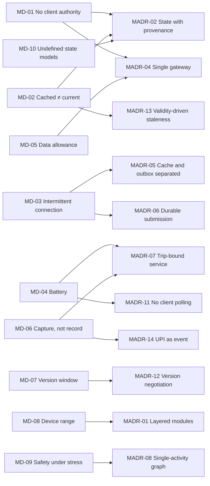
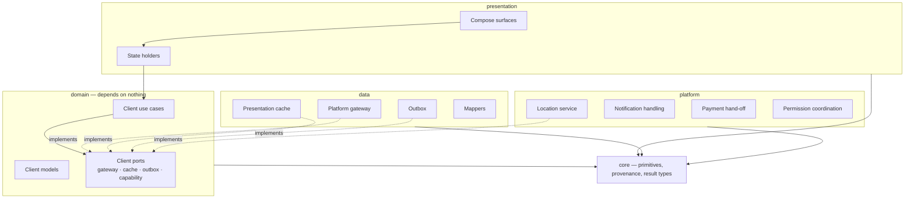
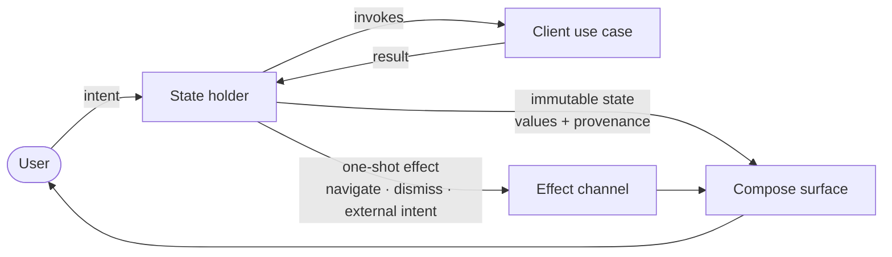
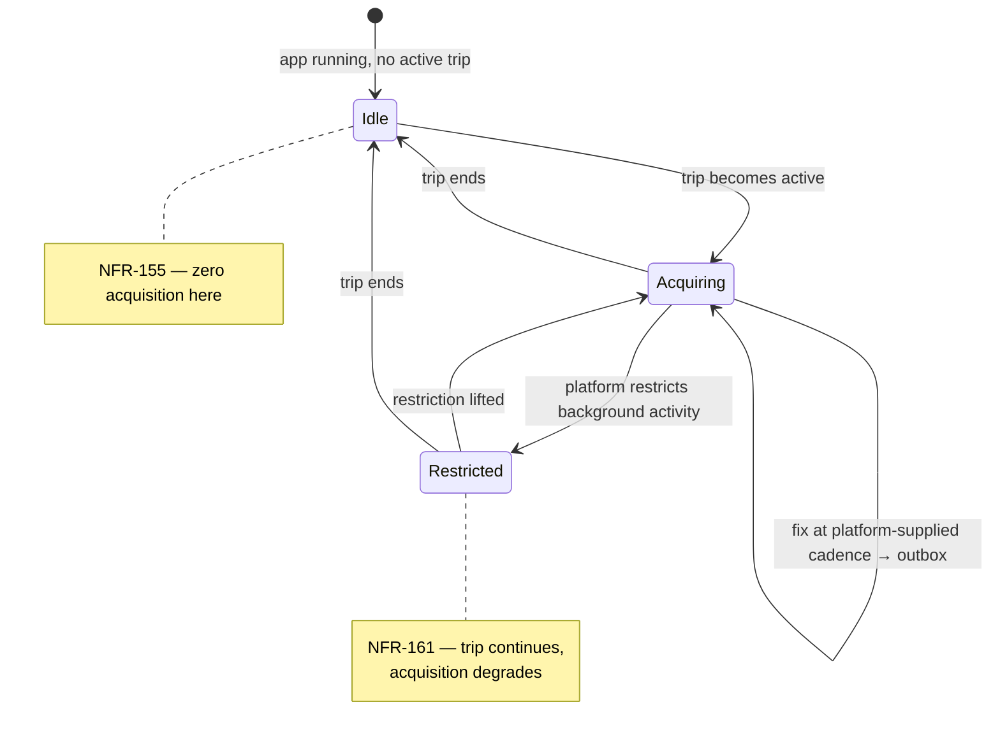
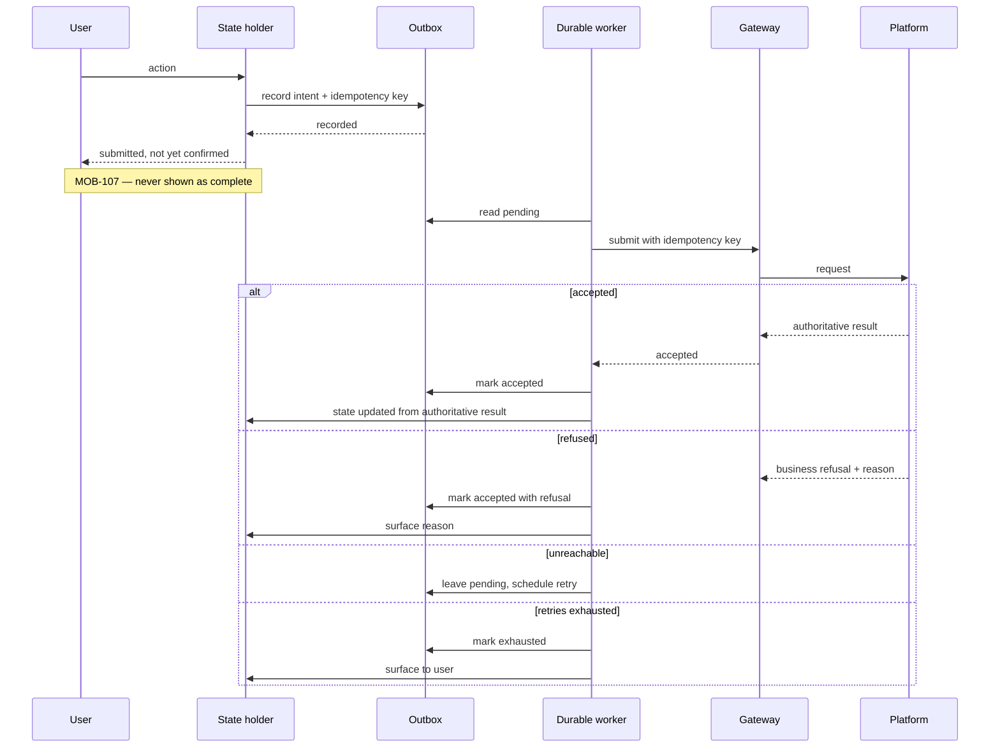
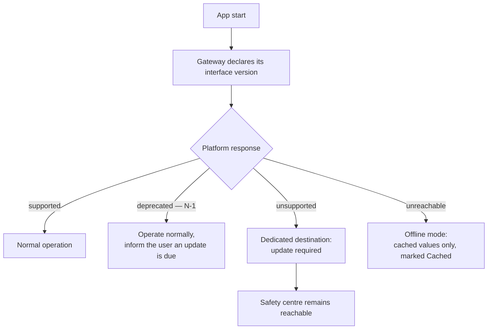
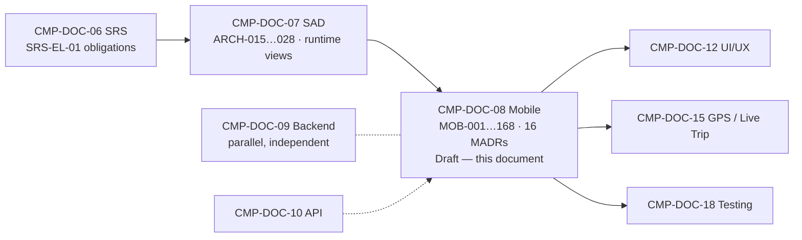

# Mobile Architecture Document
## Carpool Mobility Platform (CMP)

---

# 0. Document Control

## 0.1 Document Control Table

| Field | Value |
|---|---|
| Document ID | CMP-DOC-08 |
| Document Name | Mobile Architecture Document |
| Short Name | MOBILE |
| Project Name | Carpool Mobility Platform |
| Project Code | CMP |
| Version | 0.1 |
| Status | Draft |
| Date | 2026-08-16 |
| Author | Software Architect — Android (AI-assisted) |
| Reviewer | [TBD] |
| Approver | Project Owner |
| Classification | Internal |
| Brand | TBD |
| Previous Version | None (initial issue) |
| Predecessor Documents | CMP-DOC-01 … CMP-DOC-07, all v0.1, **all Draft, none approved** |
| Related Documents | `00_Project_Control/README.md`, `Documentation_Index.md`, `Documentation_Status.md`, `Document_Change_Log.md`, `Glossary.md`, `Master_Traceability_Matrix.md` |
| Successor Documents | CMP-DOC-12 (UI/UX), CMP-DOC-15 (GPS / Live Trip), CMP-DOC-18 (Testing) |
| Parallel Document | CMP-DOC-09 (Backend Architecture) — independent of this document |

## 0.2 Revision History

| Version | Date | Author | Change | Status |
|---|---|---|---|---|
| 0.1 | 2026-08-16 | Software Architect — Android (AI-assisted) | Initial issue. Establishes the Android client architecture: 10 mobile drivers, **16 mobile architecture decisions**, module and layer structure, presentation, data, device capability, offline, concurrency, error, configuration, resource, security, testing and build architecture. Issues 168 mobile architecture statements (`MOB-001` … `MOB-168`). | Draft |

## 0.3 Distribution List

| Role | Purpose |
|---|---|
| Project Owner | Approval authority |
| **Software Architect — Android** | Authoring and ownership |
| **Android Developers** | **Primary consumer** |
| Solution Architect | Consistency with CMP-DOC-07 |
| UI/UX Designer | State and navigation model constrains CMP-DOC-12 |
| QA Analyst | Testing architecture (§15); client-side verification |
| Backend Lead | Client expectations of the interface (§12.2) feeding CMP-DOC-10 |
| Security Analyst | On-device security posture (§14); mechanisms in CMP-DOC-13 |

## 0.4 Approval

| Role | Name | Signature | Date |
|---|---|---|---|
| Author | Software Architect — Android (AI-assisted) | — | 2026-08-16 |
| Reviewer | [TBD] | — | — |
| Approver | Project Owner | — | — |

> **This document is NOT approved.** It is issued at version 0.1 with status `Draft`
> for Project Owner review.

## 0.5 Purpose of This Document

CMP-DOC-07 specified the Android client as one of six software elements and stated
fourteen obligations on it (`ARCH-015`–`028`). This document turns those obligations into
a buildable client architecture.

Its central discipline is inherited and absolute: **the client holds no authoritative
business state and makes no business decision.** Every structure here exists to make that
property hold under real conditions — an intermittent connection, a constrained battery,
a device the user controls, and a platform that may be unreachable at the moment of
decision.

## 0.6 Scope and Boundary of This Document

**Contains:** mobile architectural drivers; 16 mobile architecture decisions; module and
layer structure; presentation architecture including state and navigation; the client
domain layer; the data layer including cache, outbox and gateway; device capability
architecture; concurrency and lifecycle; offline and synchronisation; error handling;
configuration and version negotiation; resource management; on-device security posture;
testing architecture; build and module structure.

**Excludes:**

| Excluded | Belongs to |
|---|---|
| **Screen layout, visual design, copy, interaction detail** | **CMP-DOC-12** |
| System architecture, container decisions | CMP-DOC-07 |
| Backend structure | CMP-DOC-09 |
| **Endpoint paths, payload shapes, status codes** | **CMP-DOC-10** |
| Server database design | CMP-DOC-11 |
| Security mechanisms, cryptography, key handling | CMP-DOC-13 |
| Payment provider integration mechanics | CMP-DOC-14 |
| Live-trip telemetry protocol detail | CMP-DOC-15 |
| Test cases, test data, device matrix | CMP-DOC-18 |
| Build pipeline, signing, distribution | CMP-DOC-19 |

### 0.6.1 The Boundary With CMP-DOC-12, Stated Precisely

This is the boundary most easily crossed, because both documents concern what the user
sees.

| This document decides | CMP-DOC-12 decides |
|---|---|
| That a screen is driven by a single immutable state object. | What that screen looks like. |
| That cached values are marked as not-current wherever displayed. | How "not current" is expressed to the user. |
| That a refusal reason from the platform is surfaced rather than swallowed. | The wording and placement of that reason. |
| That navigation is a single-activity destination graph. | The journey and screen order through it. |

## 0.7 Intended Audience

Android Developers · Software Architects · Solution Architects · QA Engineers · UI/UX
Designers · Security Engineers · Technical Leads.

## 0.8 Basis of This Document — and Three Material Qualifications

### 0.8.1 Source

**FACT.** Derived from **CMP-DOC-01** through **CMP-DOC-07**, all v0.1, and from the
approved technology direction. No other source.

### 0.8.2 Qualification 1 — Seven Unapproved Predecessors

> **WARNING.** All seven predecessors are at status `Draft`. Recorded as `MOB-RISK-001`
> and in `Document_Change_Log.md` conflict entry **CC-008**.

### 0.8.3 Qualification 2 — Resource Budgets Are Unset

**FACT.** CMP-DOC-05 `NFR-151`–`158` bound battery, data, memory and start-up, and
**every one of those targets is `[TBD-BUS]`** pending `BAD-DEC-018`.

This document therefore specifies **the structures that make consumption controllable and
measurable** — a configurable acquisition cadence, a single metered gateway, a bounded
cache — and **states no budget figure**, because none has been approved. Nine measurement
points are named in §13 so that the budgets can be set from observation rather than
guessed.

### 0.8.4 Qualification 3 — The Accessibility Standard Is Unchosen

**FACT.** `NFR-088` requires a declared accessibility standard and conformance level;
`NFR-OQ-001` records that none has been chosen.

The architecture provides the **hooks** — semantic state exposure, no colour-only
signalling, scalable text, gesture-independent safety controls — but **cannot claim
conformance to a standard that has not been selected**, and does not. See `MOB-OQ-002`.

## 0.9 Statement Classification Convention

As `README.md` §9.1. Markers: **FACT**, **ASSUMPTION**, **BUSINESS DECISION REQUIRED**,
**TECHNICAL DECISION REQUIRED**, **OPEN QUESTION**, **TBD**, **FUTURE CONSIDERATION**,
**RECOMMENDATION**.

## 0.10 Identifier Conventions

| Prefix | Element | Section |
|---|---|---|
| `MOB-nnn` | Mobile architecture statement (**traceable**) | 4–16 |
| `MADR-nn` | Mobile Architecture Decision Record | 3 |
| `MD-nn` | Mobile architectural driver | 2 |
| `MOB-ASM-nnn` | Assumption | 18.1 |
| `MOB-RISK-nnn` | Risk | 18.2 |
| `MOB-OQ-nnn` | Open Question | 18.3 |

## 0.11 Table of Contents

| § | Section |
|---|---|
| 0 | Document Control |
| 1 | Executive Summary |
| 2 | Mobile Architectural Drivers |
| 3 | Mobile Architecture Decisions |
| 4 | Module and Layer Architecture |
| 5 | Presentation Architecture |
| 6 | Client Domain Layer |
| 7 | Data Layer |
| 8 | Device Capability Architecture |
| 9 | Concurrency and Lifecycle |
| 10 | Offline and Synchronisation |
| 11 | Error Handling |
| 12 | Configuration and Version Negotiation |
| 13 | Resource Management |
| 14 | On-Device Security Posture |
| 15 | Testing Architecture |
| 16 | Build and Module Structure |
| 17 | Traceability |
| 18 | Assumptions, Risks and Open Questions |
| 19 | Acceptance Criteria for This Document |
| 20 | Statistics and Recommendations |
| A | Appendix A — Statement Index |
| B | Appendix B — Decision Index |
| C | Appendix C — Terminology Reference |

---

# 1. Executive Summary

## 1.1 What This Document Delivers

| Element | Count |
|---|---|
| Mobile architectural drivers | 10 |
| **Mobile Architecture Decision Records** | **16** |
| Mobile architecture statements | **168** (`MOB-001` … `MOB-168`) |
| Layers | 4 |
| Module groups | 5 |
| Measurement points named for unset budgets | 9 |
| Risks | 10 |

## 1.2 The Client in One Paragraph

A single-activity Jetpack Compose application organised into four layers — presentation,
client domain, data and platform capability — with dependencies pointing inward. Each
screen is driven by one immutable state object produced by a state holder; the state
carries not only values but their **freshness**, because a value the platform has not
just confirmed must never look like one it has. All platform interaction goes through a
single versioned gateway. Actions taken without a connection are written to a durable
outbox with idempotency keys and submitted by durable background work. Location is
acquired only while a trip is active, at a cadence the platform supplies. Nothing on the
device is treated as authoritative.

## 1.3 The Four Decisions That Shape Everything Else

| MADR | Decision | Why it dominates |
|---|---|---|
| **`MADR-02`** | One immutable state object per screen, carrying **provenance** — authoritative, cached, or unknown — alongside every value. | This is how `ARCH-017` and `NFR-086` become structurally true rather than a rule developers must remember. A value cannot be rendered without its freshness travelling with it. |
| **`MADR-05`** | The durable outbox is a first-class store, distinct from the cache, holding only *intents* — never authoritative results. | `SRS-REQ-020`/`021` require offline actions to survive and submit without duplication, while `SRS-REQ-001` forbids holding authoritative state. Separating intent from result is what satisfies both. |
| **`MADR-07`** | Location acquisition runs in a foreground service whose lifetime is bound to the active trip, at a platform-supplied cadence. | `NFR-155` requires zero acquisition outside a trip; `NFR-160` requires disclosure; `NFR-161` requires the trip to survive background restriction. One structure satisfies all three. |
| **`MADR-12`** | The gateway negotiates interface version at startup and treats an unsupported version as a first-class application state. | Android clients update on the user's schedule. `ADR-10` serves N and N−1; the client must behave correctly when it falls outside that window. |

## 1.4 What This Architecture Refuses to Do

| Refused | Why |
|---|---|
| Compute any fare, seat count, booking status or payment status | `ARCH-016`, `SRS-REQ-003` — absolute |
| Cache any authoritative value for reuse in a decision | `ADR-17`, `MOB-053` |
| Treat a UPI application result as evidence of payment | `ARCH-023`, `MADR-14` |
| Poll the platform on a client-chosen interval | `ARCH-026`, `MADR-11` |
| Acquire location when no trip is active | `NFR-155`, `MADR-07` |
| Require a device permission before search or booking | `SRS-REQ-149`, `MOB-082` |
| Show an action as complete before the platform confirms it | `ARCH-021`, `MOB-107` |

---

# 2. Mobile Architectural Drivers

| ID | Driver | Source | Structural consequence |
|---|---|---|---|
| `MD-01` | **The client holds no authoritative state and makes no business decision.** | `ARCH-016`, `SRS-REQ-001`–`003` | No client-side rule engine; no computed business values; provenance carried on every value. |
| `MD-02` | **A cached value must never be mistaken for a current one.** | `ARCH-017`, `NFR-086`, `FRD-FR-115` | Provenance is part of state, not a UI convention (`MADR-02`). |
| `MD-03` | **The connection is intermittent and the user's work must survive it.** | `NFR-162`, `SRS-REQ-020`/`021` | Durable outbox with idempotency; background submission (`MADR-05`, `MADR-06`). |
| `MD-04` | **The platform runs on the user's battery.** | `NFR-151`–`155`, `AD-10` | Trip-bound acquisition; server-driven cadence; no polling (`MADR-07`, `MADR-11`). |
| `MD-05` | **The platform runs on the user's data allowance.** | `NFR-153`, `154` | Single metered gateway; bounded payload reuse; measurement points. |
| `MD-06` | **Device capability is captured, never trusted as record.** | `ARCH-022`, `023`, `ADR-18` | Location and payment results submitted as observations and events. |
| `MD-07` | **The client may fall outside the supported interface window.** | `ADR-10`, `SRS-REQ-010` | Version negotiation as an application state (`MADR-12`). |
| `MD-08` | **The device range is wide and the lowest class must remain usable.** | `NFR-095`, `157`, `SRS-REQ-027` | Capability degradation, not failure; bounded memory footprint. |
| `MD-09` | **Safety controls must work for someone in distress in a moving vehicle.** | `NFR-092`, `FRD-FR-195` | Gesture-independent controls; safety path never blocked by a modal or a network wait. |
| `MD-10` | **Six state models are undefined and will arrive as configuration.** | `ADR-15`, `SRS-REQ-157` | The client renders state it is told about; it does not enumerate states in code. |

> **`MD-10` has an easily-missed consequence.** If the client hard-codes a `when` over trip
> states, every state decision becomes a client release — and Android clients update on
> the user's schedule. The client must render what the platform describes.

---

# 3. Mobile Architecture Decisions

## 3.1 `MADR-01` — Layered Modules, Feature Modularisation Deferred

| Field | Content |
|---|---|
| **Context** | `ADR-02` establishes inward-pointing layers at system level. The client must mirror that discipline. Feature modularisation offers build-time and ownership benefits at the cost of structural overhead. |
| **Decision** | **Modularise by layer first: `app`, `presentation`, `domain`, `data`, `platform` (device capability), plus `core` for shared primitives. Feature modules are deferred until team size or build time justifies them.** Dependencies point inward; `domain` depends on nothing. |
| **Alternatives** | *(a)* Single module — rejected: nothing prevents a Compose surface reaching the gateway directly, which is `MD-01`'s failure mode. *(b)* Feature-first modularisation now — deferred: real benefit, but it multiplies module count before the team exists to benefit. |
| **Consequences** | ✔ Layer violations become compile errors, not review findings. ✔ Aligns with `ADR-23` build-time enforcement. ✘ Feature code is spread across layer modules; revisit when features stabilise (`MOB-OQ-005`). |

## 3.2 `MADR-02` — Immutable Screen State Carrying Provenance

| Field | Content |
|---|---|
| **Context** | `MD-01`, `MD-02`. `ARCH-017` requires cached values to be marked non-authoritative *in every read path*; `NFR-086` sets a zero tolerance. A convention that developers must remember will fail. |
| **Decision** | **Each screen is driven by exactly one immutable state object exposed as `StateFlow`. Every business value in that object is wrapped so that it carries its provenance — `Authoritative`, `Cached(asOf)`, or `Unknown` — alongside the value. Rendering a raw value without provenance is not expressible.** The state holder accepts user intents and emits one-shot effects separately from state. |
| **Alternatives** | *(a)* A boolean `isStale` flag on the state object — rejected: staleness is per-value, not per-screen; a screen may hold a fresh fare and a cached driver profile. *(b)* Provenance as a UI-layer concern — rejected: it is then optional, and `NFR-086` is absolute. |
| **Consequences** | ✔ `NFR-086` becomes a type-level property. ✔ CMP-DOC-12 receives an explicit signal for every value it renders. ✔ `FRD-FR-115` and `SRS-REQ-004` satisfied structurally. ✘ More verbose state definitions. ✘ CMP-DOC-12 must design a treatment for `Cached` and `Unknown` on **every** value — a real design obligation, stated here so it is not discovered late. |

## 3.3 `MADR-03` — Compile-Time Dependency Injection

| Field | Content |
|---|---|
| **Context** | Layer isolation (`MADR-01`) requires construction to happen outside the layers. Testing (`§15`) requires substituting the gateway and device capability. |
| **Decision** | **Compile-time dependency injection, with scopes aligned to lifecycle: application, screen, and trip-session for the location service.** Dispatchers are injected, never referenced statically. |
| **Alternatives** | *(a)* Manual construction — rejected: the trip-session scope and gateway substitution become error-prone. *(b)* Runtime service location — rejected: defers wiring errors to runtime. |
| **Consequences** | ✔ Fakes substitute cleanly at the gateway boundary (`MADR-16`). ✔ Injected dispatchers make concurrency testable. ✘ Build-time cost; annotation processing. |

## 3.4 `MADR-04` — A Single Versioned Gateway as the Only Platform Reach

| Field | Content |
|---|---|
| **Context** | `ARCH-009` and `SRS-REQ-007` require the client to reach the system only through the versioned interface. `MD-05` requires data consumption to be measurable at one point. |
| **Decision** | **One gateway component owns all platform communication: a typed REST client over HTTP with JSON serialisation, carrying the interface version, the idempotency key, and authentication. No other component may perform network I/O to the platform.** Payload models are gateway-local and mapped to domain models at the boundary. |
| **Alternatives** | *(a)* Per-feature clients — rejected: no single point for version negotiation, metering, error mapping or authentication. *(b)* Exposing transport models to presentation — rejected: couples screens to the wire format and to `/api/v1` change. |
| **Consequences** | ✔ One place for version negotiation (`MADR-12`), metering (`MOB-136`), error mapping (`MADR-10`) and idempotency (`MADR-06`). ✔ CMP-DOC-10 changes do not propagate past the mapper. ✘ Mapping code to maintain. |

## 3.5 `MADR-05` — Separate Cache and Outbox Stores

| Field | Content |
|---|---|
| **Context** | `MD-03`. `SRS-REQ-020`/`021` require offline user work to survive and submit exactly once. `SRS-REQ-001` and `ARCH-024` forbid the client holding anything authoritative. These pull in opposite directions unless intent and result are separated. |
| **Decision** | **Two logically distinct on-device stores. (1) *Presentation cache* — the last known values retrieved from the platform, every record carrying its retrieval time, used only for display and always marked `Cached`. (2) *Outbox* — user intents not yet accepted, each with an idempotency key and submission state. Neither store ever holds a value the platform treats as authoritative.** |
| **Alternatives** | *(a)* One store for both — rejected: conflates "what the platform told me" with "what I want to tell the platform", and invites treating a queued intent as an accomplished fact. *(b)* No cache, no offline capability — rejected: breaches `NFR-162` and makes the app unusable on a commute. |
| **Consequences** | ✔ The distinction between *observed* and *intended* is structural. ✔ Cache eviction cannot lose user work. ✔ `ARCH-018` (clear cache on session end) does not destroy unsent intents — they are separately governed (`MOB-104`). ✘ Two stores to manage. |

## 3.6 `MADR-06` — Durable Background Submission With Idempotency

| Field | Content |
|---|---|
| **Context** | `MADR-05`. Submission must survive process death, reboot and connectivity loss. `ADR-14` establishes idempotency keys platform-wide. |
| **Decision** | **Outbox submission is performed by durable, constraint-aware background work that survives process death and reboot. Each intent carries a client-generated idempotency key, created when the intent is recorded, not when it is sent. Retry is bounded and its exhaustion is surfaced to the user.** |
| **Alternatives** | *(a)* Submit on next app launch — rejected: a commuter may not reopen the app for hours. *(b)* Foreground-only retry — rejected: fails the case the outbox exists for. *(c)* Key generated at send time — **rejected: defeats idempotency**, since a retry after an ambiguous failure would carry a new key. |
| **Consequences** | ✔ Duplicate submission is safe end to end. ✔ Battery cost is bounded by system scheduling. ✘ Delivery timing is not under the app's control; the UI must never imply immediacy (`MOB-107`). |

## 3.7 `MADR-07` — Trip-Bound Foreground Location Service

| Field | Content |
|---|---|
| **Context** | `MD-04`, `MD-09`. `NFR-155` requires zero acquisition outside a trip. `NFR-160` requires disclosure while acquiring. `NFR-161` requires the trip to continue under background restriction. `ARCH-025` requires a platform-supplied cadence. |
| **Decision** | **Location is acquired by a foreground service started when a trip becomes active and stopped when it ends. Its ongoing notification is the disclosure required by `NFR-160`. Cadence is supplied by the platform and re-read on change. Observations are written to the outbox and submitted by the same durable mechanism as any other intent — position reporting is not a special network path.** |
| **Alternatives** | *(a)* Background location with a periodic worker — rejected: platform restrictions make continuity unreliable exactly when a passenger is waiting. *(b)* Foreground service running whenever the app is installed — **rejected: breaches `NFR-155` and collects data with no purpose.** *(c)* Direct upload per fix, bypassing the outbox — rejected: loses observations on a connectivity gap. |
| **Consequences** | ✔ `NFR-155`, `160`, `161` satisfied by one structure. ✔ Position survives connectivity loss like any other intent. ✔ The user can always see that location is being used. ✘ A visible ongoing notification during every trip; acceptable and required. ✘ Cadence changes take effect at the next read, not instantly (`MOB-076`). |

## 3.8 `MADR-08` — Single-Activity Destination Graph

| Field | Content |
|---|---|
| **Context** | Compose-first UI; deep links from notifications (`FRD-FR-208`) must reach the subject; safety controls must be reachable without unwinding a stack. |
| **Decision** | **A single activity hosting a typed destination graph. Every notification-reachable subject is a destination with a defined argument contract. The safety centre is reachable from any authenticated destination without dismissing an in-progress flow.** |
| **Alternatives** | *(a)* Multiple activities per feature — rejected: complicates state retention and deep linking. *(b)* Untyped string routes — rejected: argument errors become runtime crashes. |
| **Consequences** | ✔ Deep links and safety access are structural. ✔ CMP-DOC-12 designs journeys over a stable graph. ✘ One graph to keep coherent as features grow. |

## 3.9 `MADR-09` — Structured Concurrency With Injected Dispatchers

| Field | Content |
|---|---|
| **Context** | Coroutines and StateFlow are the approved direction. Work must be cancelled with the scope that owns it, and concurrency must be testable. |
| **Decision** | **All asynchronous work runs in a scope owned by a lifecycle: screen state holders, the trip-session service, or the application for background submission. Dispatchers are injected. No component creates an unscoped coroutine.** |
| **Alternatives** | *(a)* Global scope for convenience — rejected: leaks work past the lifecycle that justified it, and drains battery. *(b)* Hard-coded dispatchers — rejected: untestable timing. |
| **Consequences** | ✔ Leaving a screen cancels its work; ending a trip cancels acquisition. ✔ Deterministic tests. ✘ Discipline required; enforced by review and by `MOB-166`. |

## 3.10 `MADR-10` — Four-Class Error Model Mirroring the Platform

| Field | Content |
|---|---|
| **Context** | `SRS-REQ-161` defines four error classes; `ARCH-122` requires the interface to distinguish them; `SRS-REQ-163` forbids conflating a refusal with a fault. The client must not collapse them into "something went wrong". |
| **Decision** | **The gateway maps every outcome to exactly one of: *caller error*, *business refusal*, *platform fault*, *connectivity or provider unavailability*. A business refusal always carries the platform's reason and is surfaced; a platform fault is reported without internal detail; unavailability is presented as a temporary condition with what remains available.** |
| **Alternatives** | *(a)* A single error type with a message — rejected: the user cannot distinguish "you cannot do this" from "we are broken", and neither can support. *(b)* Mapping in each screen — rejected: inconsistent and duplicated. |
| **Consequences** | ✔ `NFR-087` (every refusal states a reason) satisfied at one point. ✔ CMP-DOC-12 designs four treatments, not dozens. ✘ Requires the interface to be equally disciplined — a dependency on CMP-DOC-10. |

## 3.11 `MADR-11` … `MADR-16` — Supporting Decisions

| ID | Decision | Rationale | Key consequence |
|---|---|---|---|
| `MADR-11` | **The client never polls on a self-chosen interval.** Refresh cadence, position cadence and staleness bounds are supplied by the platform as configuration and cached with a validity period. | `ARCH-026`, `ARCH-093`, `NFR-147` | Trade-off TO-1/TO-2 becomes tunable without a client release; the client must handle configuration being briefly unavailable. |
| `MADR-12` | **Interface version negotiation at startup**, with an unsupported version treated as a first-class application state rather than an error. | `ADR-10`, `SRS-REQ-010` | A client outside the N/N−1 window degrades to an informative state instead of failing obscurely. |
| `MADR-13` | **Cache entries carry a retrieval time and a platform-supplied validity**; an entry beyond validity is presented as `Cached`, never silently refreshed into `Authoritative`. | `MADR-02`, `NFR-012` | Staleness is data-driven, not a hard-coded constant. |
| `MADR-14` | **UPI hand-off is an intent to an external application; its result is recorded as an event and submitted, never interpreted.** | `ARCH-023`, `BAD-RULE-032` | The client cannot report payment success; only the platform can. Requires the UI to express "confirming" as a real state. |
| `MADR-15` | **Push messages are treated as signals to fetch, not as content.** The in-application record is authoritative. | `ADR-19`, `FRD-FR-204` | A lost or duplicated push cannot lose or duplicate information. |
| `MADR-16` | **Fakes substitute at the gateway and device-capability boundaries**, not at internal seams. | `§15` | Tests exercise real client logic against controlled platform behaviour; internal refactoring does not break tests. |

## 3.12 Driver → Decision Map

---

# 4. Module and Layer Architecture

## 4.1 Layer Model

| ID | Statement | Src |
|---|---|---|
| `MOB-001` | The client shall be organised into `presentation`, `domain`, `data`, `platform` and `core` modules. | `MADR-01` |
| `MOB-002` | The `domain` module shall depend on no other module except `core`. | `MADR-01`, `ADR-02` |
| `MOB-003` | The `presentation` module shall not depend on `data` or `platform`. | `MADR-01` |
| `MOB-004` | Interfaces for gateway, cache, outbox and device capability shall be declared in `domain` and implemented in `data` or `platform`. | `MADR-01`, `MADR-03` |
| `MOB-005` | The `app` module shall be the only module permitted to reference all others, and shall contain composition only. | `MADR-03` |
| `MOB-006` | No Compose surface shall reference the gateway, cache, outbox or a device capability directly. | `MADR-01`, `MD-01` |
| `MOB-007` | Layer dependency direction shall be enforced at build time, not by review. | `ADR-23` |
| `MOB-008` | Transport and persistence models shall not appear in `domain` or `presentation`. | `MADR-04` |
| `MOB-009` | The `core` module shall define the provenance wrapper, the result type and the error classes, and shall contain no feature logic. | `MADR-02`, `MADR-10` |
| `MOB-010` | No module shall contain a business rule, a fare computation, a seat calculation or a state-transition rule. | `ARCH-016`, `MD-01` |
| `MOB-011` | The absence of business logic in the client shall be verified by build-time inspection. | `ADR-23`, `SRS-REQ-125` |
| `MOB-012` | Brand-bearing and user-facing strings shall reside in resources, not in code. | `ARCH-027`, `NFR-110` |
| `MOB-013` | The client shall not embed any environment-specific value in its artefact. | `NFR-108` |
| `MOB-014` | Feature modularisation may be introduced without changing the layer contract. | `MADR-01` |

## 4.2 Module Responsibilities

| Module | Owns | Must not |
|---|---|---|
| `app` | Composition, entry point, graph host | Contain logic of any kind |
| `presentation` | Surfaces, state holders, navigation | Reach data or platform modules |
| `domain` | Client use cases, client models, port interfaces | Depend on any framework or transport concern |
| `data` | Gateway, cache, outbox, mapping | Make a business decision |
| `platform` | Location, notifications, payment hand-off, permissions | Interpret what it captures |
| `core` | Provenance, result and error primitives | Contain feature logic |

---

# 5. Presentation Architecture

## 5.1 Unidirectional State Flow

| ID | Statement | Src |
|---|---|---|
| `MOB-015` | Each screen shall be driven by exactly one immutable state object. | `MADR-02` |
| `MOB-016` | State shall be exposed as an observable stream held across configuration change. | `BAD-CON-001` |
| `MOB-017` | Every business value in state shall carry its provenance: authoritative, cached with retrieval time, or unknown. | `MADR-02`, `ARCH-017` |
| `MOB-018` | A business value shall not be renderable without its provenance. | `MADR-02`, `NFR-086` |
| `MOB-019` | User input shall reach the state holder as a declared intent, not as a direct call to a lower layer. | `MADR-02` |
| `MOB-020` | One-shot occurrences — navigation, dismissal, launching an external application — shall be emitted as effects, distinct from state. | `MADR-02` |
| `MOB-021` | An effect shall be consumed exactly once and shall not be replayed on configuration change. | `MADR-02` |
| `MOB-022` | State holders shall contain no business rule and shall not compute an authoritative value. | `MD-01`, `MOB-010` |
| `MOB-023` | A screen shall render an unknown value as unknown, never substituting a default. | `FRD-FR-029`, `SRS-REQ-024` |
| `MOB-024` | A screen shall surface the platform's refusal reason wherever a refusal occurs. | `SRS-REQ-025`, `NFR-087` |
| `MOB-025` | A screen shall not present an action as complete until the platform has confirmed it. | `ARCH-021`, `SRS-REQ-019` |
| `MOB-026` | A screen requiring a commitment shall re-request the values on which the commitment depends before presenting it. | `ARCH-019`, `ADR-17` |
| `MOB-027` | Verification standing, vehicle information, fare, timing, seats and preferences shall be presented before any commitment is sought. | `ARCH-023`, `NFR-084` |
| `MOB-028` | State shall not encode a closed set of business state names in code. | `MD-10`, `SRS-REQ-157` |
| `MOB-029` | The client shall render a business state it does not recognise using the description the platform supplies. | `MD-10`, `MADR-11` |

## 5.2 Navigation

| ID | Statement | Src |
|---|---|---|
| `MOB-030` | Navigation shall be a single-activity typed destination graph. | `MADR-08` |
| `MOB-031` | Every notification-reachable subject shall be a destination with a declared argument contract. | `MADR-08`, `FRD-FR-208` |
| `MOB-032` | The safety centre shall be reachable from any authenticated destination without dismissing an in-progress flow. | `MD-09`, `FRD-FR-194` |
| `MOB-033` | Navigation to a subject that is no longer accessible shall present that fact rather than fail. | `FRD-FR-208` |
| `MOB-034` | An unsupported interface version shall route to a dedicated destination rather than surface as an error on an arbitrary screen. | `MADR-12` |

## 5.3 Accessibility Hooks

> **The standard is unchosen (`NFR-088`, `MOB-OQ-002`).** These are the structures that
> make conformance achievable once one is selected. **No conformance is claimed.**

| Requirement | Architectural hook |
|---|---|
| `NFR-089` operable with assistive technology | Semantic descriptions attached to state, not to layout |
| `NFR-090` legible at supported text scales | No fixed-height text containers in the state contract |
| `NFR-091` no colour-only signalling | Provenance and status are values in state, not colours (`MADR-02`) |
| `NFR-092` gesture-independent safety controls | Safety destinations reachable by simple activation (`MOB-032`) |

---

# 6. Client Domain Layer

> **The client domain layer orchestrates; it does not decide.** This distinction is the
> whole of `MD-01`, and this section exists to make it unambiguous.

| ID | Statement | Src |
|---|---|---|
| `MOB-035` | Client use cases shall orchestrate retrieval, submission and presentation preparation only. | `MD-01` |
| `MOB-036` | A client use case shall not evaluate a business rule, compute a fare, determine availability or decide a state transition. | `ARCH-016`, `SRS-REQ-003` |
| `MOB-037` | A client use case may validate input for well-formedness before submission. | `FRD-FR-003` |
| `MOB-038` | Well-formedness validation shall not substitute for platform validation, and its success shall never imply acceptance. | `ARCH-032`, `AP-02` |
| `MOB-039` | Client models shall be independent of transport and persistence representations. | `MADR-04`, `MOB-008` |
| `MOB-040` | A client model holding a business value shall hold its provenance with it. | `MADR-02` |
| `MOB-041` | Client ports shall be declared as interfaces in `domain`. | `MADR-01` |
| `MOB-042` | A client use case shall express failure using the four error classes, not transport codes. | `MADR-10` |
| `MOB-043` | A client use case that submits an intent shall record it in the outbox before reporting acceptance of the user's action. | `MADR-05`, `MADR-06` |
| `MOB-044` | A client use case shall not retry a submission itself; retry belongs to background submission. | `MADR-06` |
| `MOB-045` | A client use case shall treat a device observation as input for submission, never as a value of record. | `MD-06`, `ARCH-022` |
| `MOB-046` | Client use cases shall be pure with respect to threading, receiving their dispatcher by injection. | `MADR-09` |

---

# 7. Data Layer

## 7.1 Platform Gateway

| ID | Statement | Src |
|---|---|---|
| `MOB-047` | The gateway shall be the only component performing network communication with the platform. | `MADR-04`, `ARCH-009` |
| `MOB-048` | The gateway shall attach the interface version to every request. | `MADR-12`, `SRS-REQ-009` |
| `MOB-049` | The gateway shall attach an idempotency key to every state-changing request. | `ADR-14`, `ARCH-124` |
| `MOB-050` | The gateway shall map every outcome to one of the four error classes. | `MADR-10` |
| `MOB-051` | The gateway shall map transport representations to client models at its boundary. | `MADR-04` |
| `MOB-052` | The gateway shall mark every value it returns as authoritative. | `MADR-02` |
| `MOB-053` | The gateway shall not serve a request from the cache when the caller requires an authoritative value. | `ADR-17`, `ARCH-019` |
| `MOB-054` | The gateway shall record the size and count of its exchanges for measurement. | `MD-05`, `NFR-153` |
| `MOB-055` | The gateway shall not expose transport types beyond the `data` module. | `MOB-008` |
| `MOB-056` | The gateway shall carry authentication without the caller supplying it. | `MADR-04` |
| `MOB-057` | The gateway shall surface a version-unsupported response as a distinct outcome. | `MADR-12` |

## 7.2 Presentation Cache

| ID | Statement | Src |
|---|---|---|
| `MOB-058` | The cache shall store only values previously retrieved from the platform. | `MADR-05` |
| `MOB-059` | Every cache record shall carry its retrieval time and its platform-supplied validity. | `MADR-13` |
| `MOB-060` | A value read from the cache shall be marked `Cached` with its retrieval time. | `MADR-02`, `MADR-13` |
| `MOB-061` | The cache shall never be the source of a value on which a commitment depends. | `ADR-17`, `ARCH-019` |
| `MOB-062` | Seat availability, booking status, payment status, fare, balance and verification standing shall never be served from the cache to a decision path. | `ARCH-056`, `SRS-REQ-003` |
| `MOB-063` | Cached business data shall be cleared when the session ends. | `ARCH-018`, `SRS-REQ-005` |
| `MOB-064` | The cache shall be bounded, and eviction shall never remove outbox content. | `MADR-05`, `MD-08` |

## 7.3 Outbox

| ID | Statement | Src |
|---|---|---|
| `MOB-065` | The outbox shall store user intents not yet accepted by the platform. | `MADR-05`, `ARCH-020` |
| `MOB-066` | Each intent shall carry an idempotency key generated when the intent is recorded. | `MADR-06`, `ADR-14` |
| `MOB-067` | The outbox shall hold no value the platform treats as authoritative. | `ARCH-024`, `SRS-REQ-001` |
| `MOB-068` | Each intent shall carry a submission state distinguishing pending, in-flight, accepted and exhausted. | `MADR-06` |

---

# 8. Device Capability Architecture

## 8.1 Location Acquisition

| ID | Statement | Src |
|---|---|---|
| `MOB-069` | Location shall be acquired only while a trip is active. | `NFR-155`, `ARCH-025` |
| `MOB-070` | Acquisition shall run in a foreground service whose lifetime is bound to the active trip. | `MADR-07` |
| `MOB-071` | The service's ongoing notification shall constitute the disclosure that location is being acquired. | `NFR-160`, `MADR-07` |
| `MOB-072` | Acquisition cadence shall be supplied by the platform, never chosen by the client. | `ARCH-093`, `MADR-11` |
| `MOB-073` | Observations shall be written to the outbox and submitted by the standard durable mechanism. | `MADR-07`, `MADR-06` |
| `MOB-074` | An observation shall carry the device's capture time; the platform's timestamp shall be authoritative. | `ARCH-092`, `ADR-18` |
| `MOB-075` | The client shall not present a position as current beyond the platform-supplied staleness bound. | `ARCH-094`, `NFR-012` |
| `MOB-076` | A cadence change shall take effect at the next configuration read, and the client shall not assume immediacy. | `MADR-11`, `MADR-07` |
| `MOB-077` | Under background restriction the trip shall continue with degraded acquisition rather than end. | `NFR-161`, `SRS-REQ-016` |
| `MOB-078` | The service shall stop and release location when the trip ends. | `NFR-155`, `SRS-REQ-150` |
| `MOB-079` | A trip shall be permitted to start when location is unavailable, with tracking indicated as unavailable. | `FRD-FR-152`, `SRS-REQ-148` |

## 8.2 Permissions

| ID | Statement | Src |
|---|---|---|
| `MOB-080` | A permission shall be requested only when the capability requiring it is invoked. | `SRS-REQ-147`, `NFR-065` |
| `MOB-081` | The client shall function with reduced capability where a permission is refused. | `SRS-REQ-148`, `NFR-095` |
| `MOB-082` | Registration, search and booking shall not require any device permission. | `SRS-REQ-149` |
| `MOB-083` | The reason a permission is needed shall be stated before it is requested. | `NFR-160`, `NFR-087` |

## 8.3 Payment Hand-Off

| ID | Statement | Src |
|---|---|---|
| `MOB-084` | The client shall hand off to an external payment application and shall not embed payment authorisation. | `MADR-14`, `FRD-FR-122` |
| `MOB-085` | The result returned by a payment application shall be recorded as an event and submitted, never interpreted. | `ARCH-023`, `MADR-14` |
| `MOB-086` | The client shall report the payment as being confirmed and shall not report success until the platform states it. | `FRD-FR-136`, `MADR-14` |
| `MOB-087` | The client shall submit the payment-attempt event even where the user does not return to the application. | `FRD-FR-126`, `MADR-06` |

## 8.4 Notifications

| ID | Statement | Src |
|---|---|---|
| `MOB-088` | A push message shall be treated as a signal to fetch, and its payload shall not be treated as content of record. | `MADR-15`, `ADR-19` |

---

# 9. Concurrency and Lifecycle

| ID | Statement | Src |
|---|---|---|
| `MOB-089` | All asynchronous work shall run in a scope owned by an identified lifecycle. | `MADR-09` |
| `MOB-090` | No component shall create an unscoped coroutine. | `MADR-09` |
| `MOB-091` | Dispatchers shall be injected and shall not be referenced statically. | `MADR-09`, `MADR-03` |
| `MOB-092` | Leaving a screen shall cancel work started for that screen. | `MADR-09` |
| `MOB-093` | Ending a trip shall cancel acquisition work started for that trip. | `MADR-07`, `MADR-09` |
| `MOB-094` | Background submission shall be owned by an application-lifetime scope, not a screen. | `MADR-06` |
| `MOB-095` | State shall survive configuration change without re-fetching authoritative values unnecessarily. | `MD-04`, `MD-05` |
| `MOB-096` | Process death shall not lose an outbox intent. | `MADR-05`, `MADR-06` |
| `MOB-097` | Process death shall not cause a duplicate submission on restart. | `MADR-06`, `ADR-14` |
| `MOB-098` | The client shall not perform network work while backgrounded except through the durable submission mechanism. | `MD-04`, `MADR-06` |

---

# 10. Offline and Synchronisation

## 10.1 Submission Sequence

| ID | Statement | Src |
|---|---|---|
| `MOB-099` | An action taken without connectivity shall be recorded in the outbox and reported as submitted, not completed. | `MADR-05`, `ARCH-021` |
| `MOB-100` | Submission shall be performed by durable background work surviving process death and reboot. | `MADR-06`, `SRS-REQ-021` |
| `MOB-101` | Each submission shall carry the idempotency key recorded with the intent. | `MADR-06`, `ADR-14` |
| `MOB-102` | Retry shall be bounded, and exhaustion shall be surfaced to the user rather than silently retained. | `SRS-REQ-169`, `MADR-06` |
| `MOB-103` | A submission accepted with a business refusal shall surface the refusal reason. | `MADR-10`, `NFR-087` |
| `MOB-104` | Clearing cached data on session end shall not discard unsent intents; their treatment shall be explicit. | `MADR-05`, `MOB-063` |
| `MOB-105` | Previously retrieved values may be presented without connectivity, marked `Cached` with their retrieval time. | `SRS-REQ-018`, `MADR-02` |
| `MOB-106` | The client shall indicate which capabilities are unavailable while the platform is unreachable. | `SRS-REQ-022`, `ARCH-105` |
| `MOB-107` | The client shall not present an outbox action as complete until the platform confirms it. | `ARCH-021`, `FRD-FR-179` |
| `MOB-108` | User-entered data shall survive a connectivity interruption without loss. | `NFR-162`, `SRS-REQ-020` |
| `MOB-109` | On reconnection the client shall reconcile state from the platform rather than assume its cached view is current. | `ADR-17`, `MADR-02` |
| `MOB-110` | A position observation shall be submitted through the same mechanism as any other intent. | `MADR-07` |
| `MOB-111` | Loss of the cache shall not lose user work. | `MADR-05` |
| `MOB-112` | A safety signal shall be submitted immediately and shall not wait for a scheduling window. | `MD-09`, `ARCH-098` |

> **`MOB-112` is the one deliberate exception to `MADR-06`'s scheduling discipline.** A
> safety signal is written durably like any intent, but its submission is attempted at
> once rather than deferred to a constraint-aware window. `NFR-071` admits no signal loss
> and `NFR-072` bounds the time to record — deferring a safety signal to save battery
> would be the wrong trade in the one case where it matters most.

---

# 11. Error Handling

| ID | Statement | Src |
|---|---|---|
| `MOB-113` | Every outcome shall be classified as caller error, business refusal, platform fault, or unavailability. | `MADR-10`, `SRS-REQ-161` |
| `MOB-114` | A business refusal shall never be presented as a fault, nor a fault as a refusal. | `SRS-REQ-163` |
| `MOB-115` | A business refusal shall always surface the platform's stated reason. | `NFR-087`, `SRS-REQ-025` |
| `MOB-116` | Internal fault detail shall not be presented to the user. | `SRS-REQ-165` |
| `MOB-117` | Unavailability shall be presented as a temporary condition, stating what remains available. | `SRS-REQ-133`, `ARCH-105` |
| `MOB-118` | A failed operation shall leave no partial local effect. | `SRS-REQ-162` |
| `MOB-119` | The client shall not retry a business refusal. | `MADR-10` |
| `MOB-120` | The client shall not resolve an unknown outcome by assumption in either direction. | `SRS-REQ-167`, `AP-09` |
| `MOB-121` | Diagnostic capture shall exclude personal data beyond its purpose. | `NFR-123`, `SRS-REQ-130` |
| `MOB-122` | An unrecoverable client fault shall be reported without loss of outbox content. | `MADR-05` |

---

# 12. Configuration and Version Negotiation

## 12.1 Platform-Supplied Configuration

| ID | Statement | Src |
|---|---|---|
| `MOB-123` | Acquisition cadence, refresh cadence, staleness bounds and cache validity shall be supplied by the platform. | `MADR-11`, `ARCH-093` |
| `MOB-124` | Platform-supplied configuration shall be cached with a validity period and re-read on expiry. | `MADR-11`, `MADR-13` |
| `MOB-125` | Where configuration is unavailable, the client shall use its last known values and shall not substitute a hard-coded default that contradicts them. | `MADR-11` |
| `MOB-126` | The client shall not embed a business value that the platform holds as policy configuration. | `NFR-109`, `SRS-REQ-173` |

## 12.2 Version Negotiation

| ID | Statement | Src |
|---|---|---|
| `MOB-127` | The client shall declare its interface version and act on the platform's response. | `SRS-REQ-009`, `MADR-12` |
| `MOB-128` | An unsupported interface version shall route to a dedicated destination rather than surface as an arbitrary error. | `MADR-12`, `SRS-REQ-010` |
| `MOB-129` | A deprecated but supported version shall permit normal operation while informing the user. | `ADR-10`, `MADR-12` |
| `MOB-130` | Safety capability shall remain reachable when the interface version is unsupported. | `MD-09`, `ARCH-100` |
| `MOB-131` | The client shall not require a platform change in order to release a new client version. | `SRS-REQ-011` |
| `MOB-132` | The client shall tolerate additive changes within its interface version without modification. | `ADR-10` |

> **`MOB-130` matters and is easy to miss.** A client too old to transact is still on a
> phone in a moving vehicle. Locking the entire application behind an update wall would
> remove the safety centre from the person most likely to need it.

---

# 13. Resource Management

> **Every budget in `NFR-151`–`158` is unset (`[TBD-BUS]`).** This section specifies the
> structures that make consumption **controllable and measurable**, and names the nine
> measurement points from which the budgets can be set. **No budget figure is stated.**

| ID | Statement | Src |
|---|---|---|
| `MOB-133` | Location acquisition shall be the only continuous background activity, and shall run only during a trip. | `NFR-151`, `MADR-07` |
| `MOB-134` | The client shall perform no periodic network activity of its own choosing. | `ARCH-026`, `MADR-11` |
| `MOB-135` | Acquisition and refresh cadence shall be adjustable without a client release. | `NFR-147`, `MADR-11` |
| `MOB-136` | The gateway shall be the single point at which data volume is measured. | `MD-05`, `NFR-153` |
| `MOB-137` | The client shall measure and report battery consumption attributable to an active trip. | `NFR-151` |
| `MOB-138` | The client shall measure and report data consumed per trip and per search. | `NFR-153`, `154` |
| `MOB-139` | The client shall bound its memory footprint on the lowest supported device class. | `NFR-157`, `MD-08` |
| `MOB-140` | The client shall bound cold start to interactive on the lowest supported device class. | `NFR-158` |
| `MOB-141` | The client shall degrade non-essential capability rather than fail on a constrained device. | `NFR-095`, `SRS-REQ-027` |
| `MOB-142` | The client shall release device capability when the activity requiring it ends. | `SRS-REQ-150`, `NFR-155` |

## 13.1 The Nine Measurement Points

| # | Measured | Where | Sets |
|---|---|---|---|
| 1 | Battery consumed per hour of active trip | Foreground service | `NFR-151` |
| 2 | Battery consumed per hour idle | Application | `NFR-152` |
| 3 | Data consumed per hour of active trip | Gateway | `NFR-153` |
| 4 | Data consumed per search | Gateway | `NFR-154` |
| 5 | Peak memory on the lowest device class | Application | `NFR-157` |
| 6 | Cold start to interactive | Application | `NFR-158` |
| 7 | Position fixes submitted per trip | Outbox | Cadence tuning, `NFR-010` |
| 8 | Outbox depth and time-to-acceptance | Outbox | `MADR-06` retry policy |
| 9 | Cache hit rate on non-decision reads | Cache | `NFR-146` tuning |

> **RECOMMENDATION.** Instrument all nine in the first release. They cost little, and
> CMP-DOC-05 §19 route R2 requires exactly this data to set the budgets. Without them the
> budgets will be set by guesswork or not at all.

---

# 14. On-Device Security Posture

> **Mechanisms are CMP-DOC-13's.** This section states the properties the client
> architecture must provide for.

| ID | Statement | Src |
|---|---|---|
| `MOB-143` | The client shall hold no authentication credential in recoverable form. | `NFR-053`, `SRS-REQ-097` |
| `MOB-144` | Session material shall be cleared on session end. | `ARCH-018`, `NFR-054` |
| `MOB-145` | The client shall hold no identity evidence beyond the act of submitting it. | `NFR-063`, `NFR-065` |
| `MOB-146` | Cached business data shall not be readable by another application. | `NFR-063` |
| `MOB-147` | Outbox content shall be protected to the same standard as cached data. | `MADR-05`, `NFR-063` |
| `MOB-148` | The client shall not log personal data beyond a diagnostic purpose. | `NFR-123`, `SRS-REQ-130` |
| `MOB-149` | The client shall not weaken transport protection under any configuration. | `NFR-062` |
| `MOB-150` | The client shall not present a safety control it cannot honour. | `FRD-FR-195`, `ARCH-100` |

> **`MOB-150` is the client-side realisation of the SOS withholding decision.** CMP-DOC-04
> `FRD-FR-195` requires that no safety control be presented which the platform cannot
> honour. Because `BAD-DEC-011` is unresolved, **the SOS control is not built into the
> safety centre**; the centre ships with the controls that work. This is a structural
> statement, not a UI choice, and CMP-DOC-12 must not add the control back.

---

# 15. Testing Architecture

| ID | Statement | Src |
|---|---|---|
| `MOB-151` | Fakes shall substitute at the gateway and device-capability boundaries, not at internal seams. | `MADR-16` |
| `MOB-152` | State holders shall be testable without a UI framework or a device. | `MADR-02`, `MADR-09` |
| `MOB-153` | Client use cases shall be testable without a network or a database. | `MADR-01`, `MADR-03` |
| `MOB-154` | Dispatcher injection shall permit deterministic testing of concurrent behaviour. | `MADR-09` |
| `MOB-155` | Each of the four error classes shall have an explicit test at the gateway boundary. | `MADR-10` |
| `MOB-156` | Provenance shall be asserted in tests wherever a business value is presented. | `MADR-02`, `NFR-086` |
| `MOB-157` | Offline submission, process death and duplicate submission shall each have an explicit test. | `MADR-06` |
| `MOB-158` | Layer dependency direction shall be verified by an automated build-time check. | `MOB-007`, `ADR-23` |
| `MOB-159` | The absence of business logic in the client shall be verified by an automated check. | `MOB-011`, `SRS-REQ-125` |
| `MOB-160` | Trip-bound acquisition shall have a test proving no acquisition occurs outside an active trip. | `NFR-155`, `MADR-07` |

> **`MOB-159` and `MOB-160` are negative tests** — they prove something does *not* happen.
> CMP-DOC-06 requires 62 structural verifications and CMP-DOC-04 marks 81 requirements as
> needing a negative test; these two are the client's contribution and are the hardest to
> add later.

---

# 16. Build and Module Structure

| ID | Statement | Src |
|---|---|---|
| `MOB-161` | The build shall enforce the module dependency graph declared in §4. | `MOB-007`, `ADR-23` |
| `MOB-162` | Environment-specific values shall be supplied at build time and shall not be embedded in source. | `NFR-108`, `MOB-013` |
| `MOB-163` | Build variants shall differ only in configuration, never in business behaviour. | `NFR-104`, `MOB-010` |
| `MOB-164` | The build shall declare the supported Android version range and device characteristics. | `NFR-093`, `094` |
| `MOB-165` | The build shall produce a measurable artefact size. | `NFR-156` |
| `MOB-166` | Static analysis shall flag unscoped coroutines, static dispatcher references and layer violations. | `MADR-09`, `MOB-007` |
| `MOB-167` | The build shall fail on a violation of a structural check rather than warn. | `ADR-23` |
| `MOB-168` | Distribution-platform technical requirements applicable at release shall be verified in the build. | `NFR-096` |

---

# 17. Traceability

## 17.1 Position in the Chain

## 17.2 Backward Traceability

| Source | Statements derived |
|---|---|
| Architecture statement (`ARCH-`) | 46 |
| Quality requirement (`NFR-`) | 52 |
| Software requirement (`SRS-REQ-`) | 38 |
| Mobile decision (`MADR-`) | 24 |
| Functional requirement (`FRD-FR-`) | 8 |
| **Total** | **168** — every statement names a source |

## 17.3 Coverage of the Client's Obligations

All fourteen client obligations from CMP-DOC-07 §6.1 are realised.

| SAD obligation | Realised by |
|---|---|
| `ARCH-015` layer separation | `MOB-001`–`006`, `MADR-01` |
| `ARCH-016` no business rule or authoritative value | `MOB-010`, `011`, `022`, `036` |
| `ARCH-017` cache marked non-authoritative | `MOB-017`, `018`, `060`, `MADR-02` |
| `ARCH-018` clear cache on session end | `MOB-063`, `144` |
| `ARCH-019` re-request before commitment | `MOB-026`, `053`, `061` |
| `ARCH-020` durable outbox with idempotency | `MOB-065`–`068`, `MADR-05` |
| `ARCH-021` not complete until confirmed | `MOB-025`, `107` |
| `ARCH-022` location as observation | `MOB-045`, `074` |
| `ARCH-023` payment result as event | `MOB-085`, `086`, `MADR-14` |
| `ARCH-024` outbox holds nothing authoritative | `MOB-067` |
| `ARCH-025` trip-bound acquisition at platform cadence | `MOB-069`–`072` |
| `ARCH-026` no client-chosen polling | `MOB-134`, `MADR-11` |
| `ARCH-027` externalised strings | `MOB-012` |
| `ARCH-028` degrade on low device class | `MOB-141` |

## 17.4 Forward Traceability

| Element | Count | Traced forward |
|---|---|---|
| `MOB-001` … `MOB-168` | 168 | **0 — `TRACEABILITY: TBD`** |

**FACT.** CMP-DOC-12, CMP-DOC-15 and CMP-DOC-18 do not exist. No forward link fabricated.

## 17.5 Obligations This Document Places on Other Documents

| Document | Obligation created here | Statement |
|---|---|---|
| **CMP-DOC-12** | Must design a treatment for `Cached` and `Unknown` provenance on **every** business value. | `MADR-02`, `MOB-018` |
| **CMP-DOC-12** | Must not reintroduce the SOS control while `BAD-DEC-011` is unresolved. | `MOB-150` |
| **CMP-DOC-12** | Must design four distinct error treatments, not one. | `MADR-10` |
| **CMP-DOC-10** | Must distinguish the four error classes and carry a refusal reason. | `MADR-10`, `MOB-050` |
| **CMP-DOC-10** | Must expose interface version negotiation and a version-unsupported outcome. | `MADR-12`, `MOB-057` |
| **CMP-DOC-10** | Must supply cadence, staleness bounds and cache validity as configuration. | `MADR-11`, `MOB-123` |
| **CMP-DOC-13** | Must specify mechanisms for `MOB-143`–`149`. | §14 |

> **§17.5 exists because these are commitments made by this document that other documents
> must honour.** Recording them here prevents them being discovered as surprises.

---

# 18. Assumptions, Risks and Open Questions

## 18.1 Assumptions

| ID | Assumption | Impact if wrong |
|---|---|---|
| `MOB-ASM-001` | All seven predecessors will be approved substantially as written. | Drivers change; derived decisions re-examined. |
| `MOB-ASM-002` | Layer modularisation is sufficient; feature modules are not needed at MVP scale. | `MADR-01` revisited; layer contract survives. |
| `MOB-ASM-003` | Carrying provenance on every business value is affordable in state size and developer effort. | `MADR-02` narrows to decision-bearing values only — **weakening `NFR-086`**. |
| `MOB-ASM-004` | Platform-supplied cadence is available early enough in the session to govern the first trip. | Client needs a bounded fallback; `MOB-125` becomes load-bearing. |
| `MOB-ASM-005` | A foreground service is acceptable to users for the duration of a trip. | `MADR-07` revisited; `NFR-161` becomes materially harder. |
| `MOB-ASM-006` | The platform will distinguish the four error classes at the interface. | `MADR-10` degrades to client-side guessing — a real quality loss. |
| `MOB-ASM-007` | Assumptions of all seven predecessors are inherited unchanged. | Inherited. |

## 18.2 Risks

| ID | Risk | L | I | Sev | Response |
|---|---|---|---|---|---|
| `MOB-RISK-001` | **Seven unapproved predecessors.** | 3 | 2 | **6** | Do not baseline until approved. |
| `MOB-RISK-002` | **Provenance is bypassed** under delivery pressure and a cached value is rendered as current. | 2 | 3 | **6** | `MADR-02` makes it type-level; `MOB-156` requires it asserted in tests. |
| `MOB-RISK-003` | **Business logic accumulates in the client** — a "small" fare estimate or availability guess. | 3 | 3 | **9** | `MOB-011`, `MOB-159` automated checks; `MOB-010` explicit. |
| `MOB-RISK-004` | **Resource budgets are never set**, and consumption is discovered from user reviews. | 3 | 2 | **6** | Nine measurement points (§13.1); instrument in R1. |
| `MOB-RISK-005` | **The foreground-service notification prompts uninstalls.** | 2 | 2 | 4 | Required by `NFR-160`; wording is CMP-DOC-12's, and matters. |
| `MOB-RISK-006` | **Outbox intents accumulate unsent** and the user believes actions completed. | 2 | 3 | **6** | `MOB-102` surfaces exhaustion; `MOB-107` never shows complete. |
| `MOB-RISK-007` | **The client hard-codes state names** and a state decision becomes a client release. | 3 | 2 | **6** | `MOB-028`, `029`; verified by review of any `when` over business state. |
| `MOB-RISK-008` | **Version negotiation is treated as an error path** and old clients fail obscurely. | 2 | 2 | 4 | `MADR-12`, `MOB-128`, `MOB-130`. |
| `MOB-RISK-009` | **Accessibility is retrofitted** after CMP-DOC-12 designs screens. | 3 | 2 | **6** | Hooks in §5.3; the standard must still be chosen (`NFR-088`). |
| `MOB-RISK-010` | **Safety submission is deferred** by the scheduler like any other intent. | 2 | 3 | **6** | `MOB-112` states the exception explicitly and requires a test. |

## 18.3 Open Questions

| ID | Question | Owner | Blocks |
|---|---|---|---|
| `MOB-OQ-001` | What Android version range and device classes are supported? | Solution Architect | `MOB-164`, `NFR-093`/`094` |
| `MOB-OQ-002` | Which accessibility standard and conformance level apply? | Product Owner | §5.3, CMP-DOC-12 |
| `MOB-OQ-003` | What is the client's fallback cadence before platform configuration is first read? | Solution Architect | `MOB-125`, `MOB-ASM-004` |
| `MOB-OQ-004` | How long may an unsent intent remain in the outbox before it is surfaced as exhausted? | Product Owner | `MOB-102` |
| `MOB-OQ-005` | At what team size or build duration should feature modularisation be introduced? | Technical Lead | `MADR-01` |
| `MOB-OQ-006` | Should unsent intents survive a sign-out, and if so under whose account? | Product Owner | `MOB-104` |
| `MOB-OQ-007` | Does the trip continue if the user force-stops the application mid-trip? | Product Owner | `MADR-07`, `NFR-161` |
| `MOB-OQ-008` | Is a deprecated-version warning shown once per session or once per release? | Product Owner | `MOB-129` |

---

# 19. Acceptance Criteria for This Document

| # | Criterion | State |
|---|---|---|
| AC-1 | Every client obligation from CMP-DOC-07 §6.1 is realised. | **Met** — 14 of 14 (§17.3) |
| AC-2 | Every statement names a source. | **Met** — 168 of 168 |
| AC-3 | Identifiers are contiguous, unique and stable. | **Met** — `MOB-001`…`168` |
| AC-4 | Every decision records context, alternatives and consequences. | **Met** — 16 MADRs |
| AC-5 | No statement places business authority in the client. | **Met** — `MOB-010`, `011`, `036` |
| AC-6 | No resource budget, latency or conformance figure is invented. | **Met** — 9 measurement points instead |
| AC-7 | No screen design, endpoint or payload is specified. | **Met** — §0.6.1 boundary |
| AC-8 | Obligations placed on other documents are recorded. | **Met** — §17.5 |
| AC-9 | Predecessor documents are approved. | **NOT MET** — all seven Draft |
| AC-10 | Supported device range is declared. | **NOT MET** — `MOB-OQ-001` |
| AC-11 | Accessibility standard is chosen. | **NOT MET** — `MOB-OQ-002` |
| AC-12 | Resource budgets are set. | **NOT MET** — `BAD-DEC-018` |

**Eight of twelve met.** All four outstanding are decisions held elsewhere.

---

# 20. Statistics and Recommendations

## 20.1 Statistics

| Measure | Value |
|---|---|
| Mobile drivers | 10 |
| Mobile Architecture Decision Records | 16 |
| Mobile architecture statements | 168 |
| Layers / module groups | 4 / 6 |
| SAD client obligations realised | 14 of 14 |
| Measurement points named for unset budgets | 9 |
| Obligations placed on other documents | 7 |
| Negative tests required | 2 explicit (`MOB-159`, `MOB-160`) |
| Risks | 10 (1 at severity 9) |
| Open questions | 8 |

## 20.2 Recommendations

| ID | Recommendation | Rationale | Owner | Urgency |
|---|---|---|---|---|
| `MR-01` | **Implement the provenance wrapper and the four error classes in `core` before any feature.** | `MADR-02` and `MADR-10` are only cheap if they exist before the first screen. Retrofitting provenance across built screens is expensive and will be skipped. | Android Lead | **Immediate** |
| `MR-02` | **Add the two automated structural checks (`MOB-158`, `MOB-159`) to the build on day one.** | `MOB-RISK-003` is the only severity-9 risk here. A check that fails the build is the only reliable defence. | Android Lead | **Immediate** |
| `MR-03` | **Instrument the nine measurement points in the first release.** | `MOB-RISK-004`; CMP-DOC-05 §19 route R2 needs this data to set budgets. | Android Lead | Before R1 |
| `MR-04` | **Choose the supported device range early** (`MOB-OQ-001`). | It determines the lowest-class targets in `MOB-139`/`140` and the test matrix in CMP-DOC-18. | Solution Architect | **Immediate** |
| `MR-05` | **Choose an accessibility standard before CMP-DOC-12 designs screens.** | `MOB-RISK-009`; the hooks exist, the standard does not. Free now. | Product Owner | **Immediate** |
| `MR-06` | **Give CMP-DOC-12 §17.5 as an input, not as a review comment.** | Three of its seven obligations are design obligations that change screen work materially. | Software Architect | With CMP-DOC-12 |
| `MR-07` | **Do not build the SOS control** (`MOB-150`). | `BAD-DEC-011` unresolved; the safety centre ships with the controls that work. | Android Lead | Standing |
| `MR-08` | **Write `MOB-160` (no acquisition outside a trip) as a test before writing the service.** | It is the cheapest possible guarantee of `NFR-155`, and a privacy property as much as a battery one. | Android Lead | With `MADR-07` |

## 20.3 Overall Assessment

The client architecture is decided and buildable. Sixteen decisions and 168 statements
cover module structure, state, navigation, data, device capability, concurrency, offline
behaviour, errors, configuration, resources, security posture, testing and build. All
fourteen client obligations from CMP-DOC-07 are realised, and every statement names its
source.

Two decisions carry most of the weight. **`MADR-02`** makes provenance a property of
every business value rather than a rule developers must remember — which is how a zero
tolerance like `NFR-086` becomes achievable rather than aspirational. **`MADR-05`**
separates *what the platform told me* from *what I want to tell the platform*, which is
what allows the client to work offline without ever holding anything authoritative.

Three things cannot be settled here. **Resource budgets** are unset, so this document
specifies nine measurement points instead of nine numbers. **The device range** is
undeclared, which leaves the lowest-class targets unanchored. **The accessibility
standard** is unchosen, so the architecture provides hooks and claims no conformance.

The single largest risk is ordinary and predictable: business logic accumulating in the
client, one small convenience at a time. Two automated build checks are the answer, and
they are worth writing before the first screen.

**Recommended next step:** build `core` with provenance and error classes, add the two
structural checks, choose the device range and accessibility standard, and pass §17.5 to
CMP-DOC-12 as an input.

---

# Appendix A — Statement Index

| Range | Subject | § |
|---|---|---|
| `MOB-001`–`014` | Module and layer architecture | 4 |
| `MOB-015`–`034` | Presentation architecture | 5 |
| `MOB-035`–`046` | Client domain layer | 6 |
| `MOB-047`–`068` | Data layer | 7 |
| `MOB-069`–`088` | Device capability | 8 |
| `MOB-089`–`098` | Concurrency and lifecycle | 9 |
| `MOB-099`–`112` | Offline and synchronisation | 10 |
| `MOB-113`–`122` | Error handling | 11 |
| `MOB-123`–`132` | Configuration and version negotiation | 12 |
| `MOB-133`–`142` | Resource management | 13 |
| `MOB-143`–`150` | On-device security posture | 14 |
| `MOB-151`–`160` | Testing architecture | 15 |
| `MOB-161`–`168` | Build and module structure | 16 |

---

# Appendix B — Decision Index

| MADR | Decision |
|---|---|
| `MADR-01` | Layered modules, feature modularisation deferred |
| `MADR-02` | Immutable screen state carrying provenance |
| `MADR-03` | Compile-time dependency injection |
| `MADR-04` | A single versioned gateway as the only platform reach |
| `MADR-05` | Separate cache and outbox stores |
| `MADR-06` | Durable background submission with idempotency |
| `MADR-07` | Trip-bound foreground location service |
| `MADR-08` | Single-activity destination graph |
| `MADR-09` | Structured concurrency with injected dispatchers |
| `MADR-10` | Four-class error model mirroring the platform |
| `MADR-11` | No client-chosen polling; platform-supplied cadence |
| `MADR-12` | Interface version negotiation as an application state |
| `MADR-13` | Validity-driven cache staleness |
| `MADR-14` | UPI hand-off result as an event, never evidence |
| `MADR-15` | Push as a signal to fetch; in-app record authoritative |
| `MADR-16` | Fakes at the gateway and capability boundaries |

---

# Appendix C — Terminology Reference

| Term | Meaning | Glossary action |
|---|---|---|
| **Provenance** | The origin and freshness carried alongside every business value in client state: `Authoritative`, `Cached(asOf)` or `Unknown`. A value cannot be rendered without it. | **New — add to Glossary** |
| **Presentation cache** | On-device store of values previously retrieved from the platform, used only for display and always marked `Cached`. Never authoritative. | **New — add to Glossary** |
| **Outbox** | On-device store of user *intents* not yet accepted by the platform, each with an idempotency key. Holds no authoritative value. | **New — add to Glossary** |
| **Intent (client)** | A recorded user action awaiting platform acceptance — distinct from an accomplished fact. | **New — add to Glossary** |
| **Trip-bound acquisition** | Location acquisition whose lifetime is bound to an active trip, with disclosure, at a platform-supplied cadence. | **New — add to Glossary** |
| **Version negotiation** | The startup exchange establishing whether the client's interface version is supported, deprecated or unsupported. | **New — add to Glossary** |

---

**END OF DOCUMENT**

*CMP-DOC-08 · Mobile Architecture Document · Version 0.1 · Draft · 2026-08-16*
*Carpool Mobility Platform · Project Code CMP · Brand TBD · Classification: Internal*
*This document is NOT approved. It is issued for Project Owner review.*
*Predecessors CMP-DOC-01 … CMP-DOC-07 are all at status Draft — see §0.8.2.*

