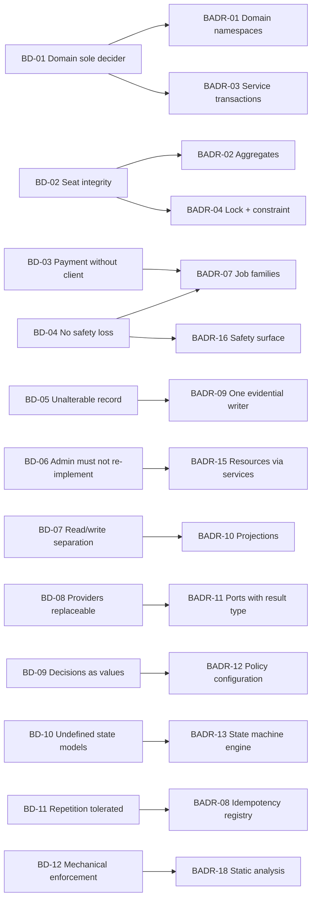
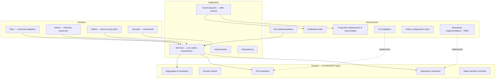
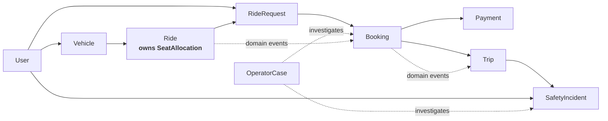
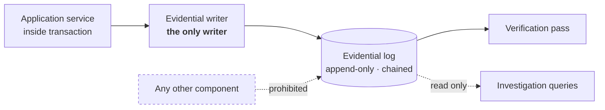
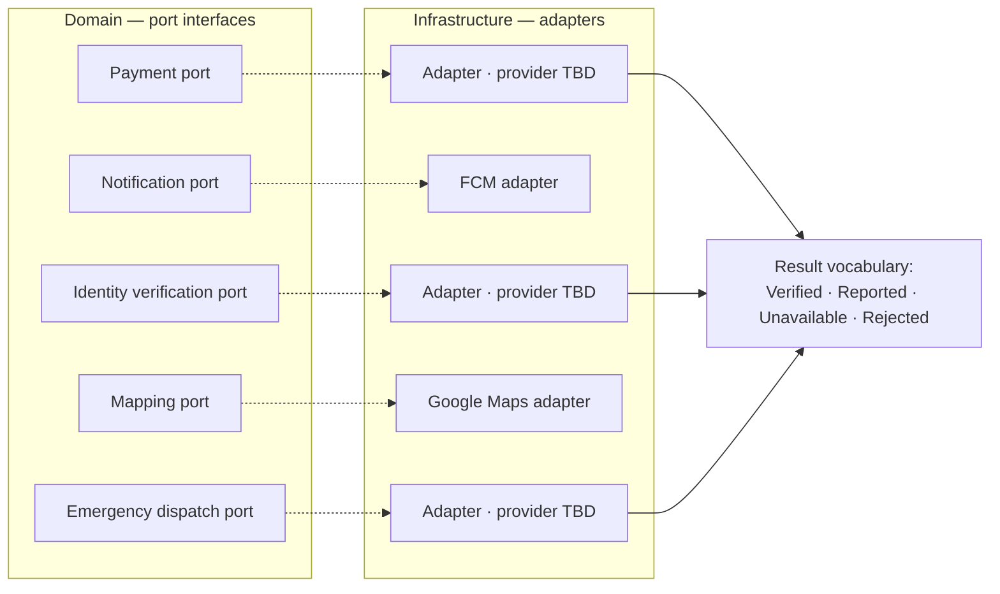
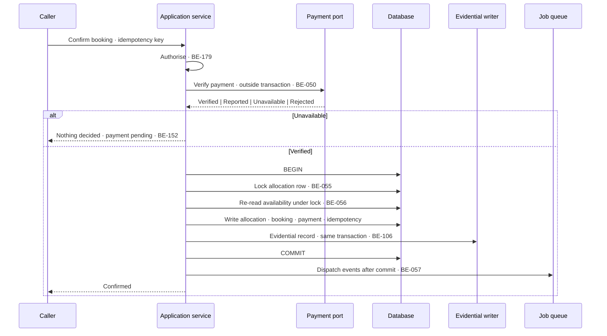

# Backend Architecture Document
## Carpool Mobility Platform (CMP)

---

# 0. Document Control

## 0.1 Document Control Table

| Field | Value |
|---|---|
| Document ID | CMP-DOC-09 |
| Document Name | Backend Architecture Document |
| Short Name | BACKEND |
| Project Name | Carpool Mobility Platform |
| Project Code | CMP |
| Version | 0.2 |
| Status | Draft |
| Date | 2026-08-17 |
| Author | Software Architect — Backend (AI-assisted) |
| Reviewer | [TBD] |
| Approver | Project Owner |
| Classification | Internal |
| Brand | TBD |
| Previous Version | 0.1 (2026-08-16) |
| Predecessor Documents | CMP-DOC-01 … CMP-DOC-08, all v0.1, **all Draft, none approved** |
| Related Documents | `00_Project_Control/README.md`, `Documentation_Index.md`, `Documentation_Status.md`, `Document_Change_Log.md`, `Glossary.md`, `Master_Traceability_Matrix.md` |
| Successor Documents | CMP-DOC-10 (API), CMP-DOC-11 (Database), CMP-DOC-17 (Admin / Filament) |
| Parallel Document | CMP-DOC-08 (Mobile Architecture) — independent of this document |

## 0.2 Revision History

| Version | Date | Author | Change | Status |
|---|---|---|---|---|
| 0.2 | 2026-08-17 | Software Architect — Backend (AI-assisted) | **Traceability correction.** A citation audit resolving every cited identifier back to the text of the statement it names found that **78 of 163 externally-verifiable citations in v0.1 did not correspond to the statement cited** — identifiers were written from recollection of what each ought to say rather than resolved against source. **92 Src cells are corrected** against the actual text of CMP-DOC-01, 04, 05, 06 and 07. Adds §18.7 disclosing the **7 statements that have no upstream counterpart**, of which `BE-097` (payment credential handling) and `BE-102` (injection defence) are **gaps in the requirement chain, not merely in this document**; both are raised as `BE-OQ-08` and `BE-OQ-09` for CMP-DOC-13. Also corrects **14 wrong document-number references** in §18.4–§18.6, §14.1 and §21.3 — v0.1 named CMP-DOC-12 as Integration Design, CMP-DOC-14 as Admin, CMP-DOC-16 as Security and CMP-DOC-17 as Deployment, none of which match the roadmap in `Documentation_Status.md` §5. **No statement text, identifier, decision or count changed** — the correction is confined to the Src column, downstream document names, §18.7 and two open questions. | Draft |
| 0.1 | 2026-08-16 | Software Architect — Backend (AI-assisted) | Initial issue. Establishes the Laravel platform architecture: 12 backend drivers, **18 backend architecture decisions**, namespace and layer structure, domain model organisation with 9 aggregates, application services and transaction boundaries, both interface surfaces, persistence, the evidential log, projections, the work subsystem, ports, policy configuration and state machines, authorisation and errors, the safety surface, observability, testing and structural enforcement. Issues 218 statements (`BE-001` … `BE-218`). | Draft |

## 0.3 Distribution List

| Role | Purpose |
|---|---|
| Project Owner | Approval authority |
| **Software Architect — Backend** | Authoring and ownership |
| **Backend Developers** | **Primary consumer** |
| Solution Architect | Consistency with CMP-DOC-07 |
| Backend Lead | Input to CMP-DOC-10 (API) and CMP-DOC-11 (Database) |
| Security Analyst | Authorisation, evidential integrity, port trust (§14, §9); mechanisms in CMP-DOC-13 |
| QA Analyst | Testing architecture and structural enforcement (§17) |
| DevOps Engineer | Work subsystem and observability shape (§11, §16); sizing in CMP-DOC-19 |
| Product Analyst | Admin surface behaviour (§7.2) feeding CMP-DOC-17 |

## 0.4 Approval

| Role | Name | Signature | Date |
|---|---|---|---|
| Author | Software Architect — Backend (AI-assisted) | — | 2026-08-16 |
| Reviewer | [TBD] | — | — |
| Approver | Project Owner | — | — |

> **This document is NOT approved.** It is issued at version 0.1 with status `Draft`
> for Project Owner review.

## 0.5 Purpose of This Document

CMP-DOC-06 made Platform Services accountable for 148 of the 260 functional requirements
in the chain — 57% of the system's behaviour, in one element, by design.
CMP-DOC-07 then decided the structures that hold it: one deployable, one domain layer,
pessimistic seat locking, durable queued work, ports, an append-only evidential log, and
a policy configuration subsystem.

This document turns those decisions into a buildable Laravel architecture. It is the
largest single body of construction in the programme, and its governing property is
stated once here and enforced throughout: **the domain layer is the only place a business
decision is taken, and every caller — REST, admin, queue worker, safety surface — reaches
it the same way.**

## 0.6 Scope and Boundary of This Document

**Contains:** backend drivers; 18 architecture decisions; namespace and layer structure;
domain model organisation and aggregate boundaries; application services and transaction
boundaries; the REST and administrative interface surfaces; persistence and repositories;
the evidential log; projections; the work subsystem; ports and adapters; policy
configuration and state machines; authorisation and error handling; the safety surface;
observability; testing and structural enforcement.

**Excludes:**

| Excluded | Belongs to |
|---|---|
| System architecture and container decisions | CMP-DOC-07 |
| Android client structure | CMP-DOC-08 |
| **Endpoint paths, verbs, request and response payloads, status codes** | **CMP-DOC-10** |
| **Tables, columns, keys, indexes, migrations** | **CMP-DOC-11** |
| Screen design | CMP-DOC-12 |
| **Security mechanisms, cryptographic algorithms, key handling** | **CMP-DOC-13** |
| Payment provider integration mechanics | CMP-DOC-14 |
| Administrative screen composition and Filament resource layout | CMP-DOC-17 |
| Test cases and test data | CMP-DOC-18 |
| Hosting, environments, pipelines, instance sizing | CMP-DOC-19 |

### 0.6.1 The Boundaries With CMP-DOC-10 and CMP-DOC-11

| This document decides | CMP-DOC-10 decides | CMP-DOC-11 decides |
|---|---|---|
| That an interface adapter maps transport to an application command. | The endpoint, verb and payload shape. | — |
| That a repository interface is declared in the domain and implemented in infrastructure. | — | The tables and columns behind it. |
| That the allocation record is locked pessimistically within the transaction. | — | The index and constraint that support it. |
| That the evidential log is append-only with a chained integrity value. | — | Its physical structure and partitioning. |

## 0.7 Intended Audience

Backend Developers · Software Architects · Solution Architects · Backend Leads · Security
Engineers · QA Engineers · DevOps Engineers · Technical Leads.

## 0.8 Basis of This Document — and Three Material Qualifications

### 0.8.1 Source

**FACT.** Derived from **CMP-DOC-01** through **CMP-DOC-08**, all v0.1, and from the
approved technology direction. No other source.

### 0.8.2 Qualification 1 — Eight Unapproved Predecessors

> **WARNING.** All eight predecessors are at status `Draft`. Recorded as `BE-RISK-001`
> and in `Document_Change_Log.md` conflict entry **CC-009**.

### 0.8.3 Qualification 2 — Structure Is Decidable; Tuning Values Are Not

**FACT.** No capacity, latency, availability or throughput target exists
(`BAD-DEC-018`, `GAP-012`).

This document decides **structure and mechanism**. It does **not** state a lock timeout,
a retry interval, a queue worker count, a batch size, a connection pool size or a cache
duration, because each of those is a tuning value that should be set from measurement
rather than guessed. **Eleven such values are named as configuration in §13.2** so that
they can be set without a release once measurement exists.

### 0.8.4 Qualification 3 — Six State Models and Seventeen Decisions Are Open

**FACT.** CMP-DOC-06 §7.2 records six of ten state models as undefined, and 17 business
decisions remain open.

`BADR-13` makes state machines configuration-driven and `BADR-12` makes business values
policy configuration, so that **each of those decisions lands as a configuration change
rather than a code change**. The invariants that must hold under any eventual model are
code, and hold irrespective of the declared model by `BE-177` in §13.3.

## 0.9 Statement Classification Convention

As `README.md` §9.1. Markers: **FACT**, **ASSUMPTION**, **BUSINESS DECISION REQUIRED**,
**TECHNICAL DECISION REQUIRED**, **OPEN QUESTION**, **TBD**, **FUTURE CONSIDERATION**,
**RECOMMENDATION**.

## 0.10 Identifier Conventions

| Prefix | Element | Section |
|---|---|---|
| `BE-nnn` | Backend architecture statement (**traceable**) | 4–17 |
| `BADR-nn` | Backend Architecture Decision Record | 3 |
| `BD-nn` | Backend architectural driver | 2 |
| `BE-ASM-nnn` | Assumption | 19.1 |
| `BE-RISK-nnn` | Risk | 19.2 |
| `BE-OQ-nnn` | Open Question | 19.3 |

## 0.11 Table of Contents

| § | Section |
|---|---|
| 0 | Document Control |
| 1 | Executive Summary |
| 2 | Backend Architectural Drivers |
| 3 | Backend Architecture Decisions |
| 4 | Namespace and Layer Structure |
| 5 | Domain Layer |
| 6 | Application Layer |
| 7 | Interface Surfaces |
| 8 | Persistence and Repositories |
| 9 | Evidential Log |
| 10 | Projections |
| 11 | Work Subsystem |
| 12 | Ports and Adapters |
| 13 | Policy Configuration and State Machines |
| 14 | Authorisation and Error Handling |
| 15 | Safety Surface |
| 16 | Observability |
| 17 | Testing and Structural Enforcement |
| 18 | Traceability |
| 19 | Assumptions, Risks and Open Questions |
| 20 | Acceptance Criteria for This Document |
| 21 | Statistics and Recommendations |
| A | Appendix A — Statement Index |
| B | Appendix B — Decision Index |
| C | Appendix C — Terminology Reference |

---

# 1. Executive Summary

## 1.1 What This Document Delivers

| Element | Count |
|---|---|
| Backend architectural drivers | 12 |
| **Backend Architecture Decision Records** | **18** |
| Backend architecture statements | **218** (`BE-001` … `BE-218`) |
| Layers | 4 |
| Aggregates | 9 |
| Job families | 7 |
| Ports | 5 |
| Tuning values named as configuration | 11 |
| Structural enforcement rules | 8 |

## 1.2 The Backend in One Paragraph

A single Laravel application organised into four namespaces — `Interface`, `Application`,
`Domain`, `Infrastructure` — with dependencies pointing inward and enforced by static
analysis. Nine aggregates own the invariants; the seat allocation aggregate is the only
one that takes a pessimistic lock, and it does so because an absolute rule leaves no
alternative. Application services own transaction boundaries and are the sole entry to
the domain from every caller: REST controllers, Filament resources, queue workers and the
safety surface all pass through the same services and receive the same authorisation.
Domain events dispatch after commit and drive projections, the evidential log and the
three reserved product areas. Five ports isolate providers. Policy configuration and a
configuration-driven state machine engine absorb the eleven unresolved tuning values
listed in §13.2, so that resolving each costs a configuration change rather than a release.

## 1.3 The Five Decisions That Shape Everything Else

| BADR | Decision | Why it dominates |
|---|---|---|
| **`BADR-01`** | Domain-centric namespaces, **not** framework-default MVC, with layer direction enforced by static analysis. | Laravel's defaults invite business logic into controllers and models. `SRS-REQ-126` requires each rule in exactly one place, and `SRS-RISK-003` names duplication as the most likely integrity failure. This is the structural defence. |
| **`BADR-03`** | **Application services own transaction boundaries; nothing else may open one.** | `ADR-04` requires allocation, confirmation and the ledger entry to commit together. If a repository or a listener can open a transaction, that guarantee dissolves. |
| **`BADR-06`** | Domain events dispatch **after commit**, never within it. | An event published inside a transaction that later rolls back produces effects for something that never happened — a notification for a booking that does not exist. |
| **`BADR-09`** | The evidential log is written by one service, from domain events, and is append-only with a chained integrity value. | `NFR-129` admits zero undetected alteration. One writer is the only way that is verifiable. |
| **`BADR-15`** | Filament resources call application services and **may not touch the ORM**. | This is `SRS-REQ-069`/`070` made concrete. It is also the single rule most likely to be broken, because the framework makes the shortcut easy. |

## 1.4 What This Architecture Refuses to Do

| Refused | Why |
|---|---|
| Business logic in controllers, resources, models or listeners | `SRS-REQ-070`, `BE-011`, `BADR-01` |
| A transaction opened outside an application service | `BADR-03`, `BE-047` |
| An external call inside a transaction | `ARCH-062`, `BE-050` |
| A domain event dispatched before commit | `BADR-06`, `BE-057` |
| Seat availability read from a projection | `ARCH-056`, `BE-122` |
| An evidential record updated or deleted | `BADR-09`, `BE-108` |
| A provider type above the port boundary | `ARCH-063`, `BE-153` |
| Configuration that overrides an absolute rule | `ARCH-147`, `BE-172` |

---

# 2. Backend Architectural Drivers

| ID | Driver | Source | Structural consequence |
|---|---|---|---|
| `BD-01` | **The domain layer is the sole decision-maker for every caller.** | `ARCH-031`, `SRS-REQ-031` | Application services as the single entry; four callers, one path. |
| `BD-02` | **Confirmed seats may never exceed seats offered, under any concurrency.** | `BAD-RULE-027`, `ADR-04` | A lockable allocation aggregate and a database constraint. |
| `BD-03` | **Payment verification must complete without the client.** | `FRD-FR-126`, `ADR-06` | Durable, idempotent, platform-initiated jobs. |
| `BD-04` | **No safety signal may be lost, under any load or failure.** | `NFR-071`, `ADR-13` | A capture path that takes no lock and calls no provider; a priority queue. |
| `BD-05` | **Every recordable event produces an unalterable record.** | `NFR-129`, `ADR-09` | One evidential writer; append-only; chained. |
| `BD-06` | **The admin surface must not re-implement a rule.** | `SRS-REQ-069`/`070` | Filament resources call application services; ORM access prohibited there. |
| `BD-07` | **Matching must not contend with allocation.** | `ADR-05`, DC-1 | Read projections separate from the write path. |
| `BD-08` | **Three providers are unselected and must remain replaceable.** | `ADR-07`, `NFR-101` | Ports in the domain, adapters in infrastructure. |
| `BD-09` | **Seventeen business decisions will arrive as values.** | `ADR-11`, `NFR-109` | Policy configuration subsystem, versioned and audited. |
| `BD-10` | **Six state models are undefined.** | `ADR-15`, `SRS-REQ-157` | Configuration-driven state machine engine; invariants in code. |
| `BD-11` | **Every operation must tolerate repetition.** | `ADR-14`, `SRS-REQ-044` | Idempotency registry at the application boundary. |
| `BD-12` | **Structural rules must be enforced mechanically.** | `ADR-23`, 62 structural verifications | Static analysis in the build, failing rather than warning. |

---

# 3. Backend Architecture Decisions

## 3.1 `BADR-01` — Domain-Centric Namespaces, Not Framework-Default MVC

| Field | Content |
|---|---|
| **Context** | `BD-01`, `BD-12`. `ADR-02` established four layers at system level. Laravel's conventional layout places behaviour in controllers and Eloquent models, which spreads rules across both front doors and makes `NFR-103` (each rule in one place) unachievable. |
| **Decision** | **Four top-level namespaces — `Interface`, `Application`, `Domain`, `Infrastructure` — organised by domain area beneath each. The `Domain` namespace depends on no framework type. Eloquent models are infrastructure detail and are never returned from a repository. Dependency direction is enforced by static analysis (`BADR-18`).** |
| **Alternatives** | *(a)* Framework-default MVC with fat models — rejected: business rules would live in two front doors and in the ORM, which is `SRS-RISK-003`. *(b)* Domain layer with Eloquent entities as domain objects — rejected: couples invariants to persistence and makes the domain untestable without a database. *(c)* Separate packages per bounded context — deferred; useful later, unjustified now. |
| **Consequences** | ✔ A rule has exactly one home. ✔ The domain is unit-testable without a database. ✔ `SRS-REQ-123`–`126` become mechanically verifiable. ✘ Mapping between domain objects and ORM models must be written and maintained. ✘ Developers accustomed to Laravel conventions need the boundary explained; `BADR-18` enforces it regardless. |

## 3.2 `BADR-02` — Nine Aggregates With Explicit Invariant Ownership

| Field | Content |
|---|---|
| **Context** | `BD-02`, `BD-05`. Invariants must have an owner, and the seat invariant in particular must be enforceable under concurrency. |
| **Decision** | **Nine aggregates: `User`, `Vehicle`, `Ride` (owning `SeatAllocation` as its consistency boundary), `RideRequest`, `Booking`, `Payment`, `Trip`, `SafetyIncident`, `OperatorCase`. Each owns and enforces its invariants. Cross-aggregate consistency is achieved by domain events, never by reaching into another aggregate.** |
| **Alternatives** | *(a)* One large model graph — rejected: no clear locking boundary, and the seat invariant becomes unenforceable. *(b)* Booking owning seat allocation — rejected: the invariant is *per ride*, not per booking; the ride must be the locking boundary. |
| **Consequences** | ✔ `SeatAllocation` inside `Ride` gives `ADR-04` a precise lock target. ✔ Each invariant is testable in isolation. ✘ Some workflows span aggregates and need an application service to orchestrate them (`BADR-03`). |

## 3.3 `BADR-03` — Application Services Own Transaction Boundaries

| Field | Content |
|---|---|
| **Context** | `BD-01`, `BD-02`. `SRS-REQ-040`/`041`/`042` require allocation, confirmation, the ledger entry and the audit record to commit together. `ARCH-062` forbids an external call inside a transaction. |
| **Decision** | **Only an application service may begin, commit or roll back a transaction. Repositories, domain objects, listeners, jobs and interface adapters never do. Each service declares whether it is transactional. No external provider call may occur within a transactional scope.** |
| **Alternatives** | *(a)* Transactions in repositories — rejected: a workflow spanning repositories then spans transactions, and atomicity is lost. *(b)* Framework middleware wrapping every request — rejected: holds a transaction open across external calls, breaching `ARCH-062`. |
| **Consequences** | ✔ Atomicity is a property of a named service, reviewable in one place. ✔ `BE-050` (no provider call inside a transaction) becomes checkable. ✘ Services that must call a provider and then persist require explicit two-phase structuring (`BE-052`). |

## 3.4 `BADR-04` — Pessimistic Row Lock Plus Database Constraint

| Field | Content |
|---|---|
| **Context** | `BD-02`. `ADR-04` decided pessimistic serialisation; this document decides how. `NFR-028` admits zero over-allocation. |
| **Decision** | **The allocation transaction acquires an exclusive row lock on the ride's allocation record, re-reads availability under the lock, writes the allocation and commits. The transaction runs at read-committed isolation with the explicit row lock providing serialisation. A database-level constraint enforces the seat invariant independently, so an application defect cannot breach it. Lock wait is bounded, and the bound is configuration (§13.3).** |
| **Alternatives** | *(a)* Rely on repeatable-read isolation without an explicit lock — rejected: gap and phantom behaviour differs across engines and versions; an explicit lock states the intent unambiguously. *(b)* Application-level advisory lock — rejected: a second source of truth about locking. *(c)* Constraint alone with retry on violation — rejected as sole mechanism: turns a routine last-seat contention into an error path. |
| **Consequences** | ✔ Two independent guarantees — lock and constraint. ✔ The negative test for `NFR-028` is straightforward: concurrent requests for the last seat. ✘ Lock contention on a popular ride is a real limit, accepted at `ADR-04`. ✘ Lock wait bound must be set from measurement, not guessed. |

## 3.5 `BADR-05` — Repository Interfaces in the Domain, ORM Behind Them

| Field | Content |
|---|---|
| **Context** | `BADR-01`. The domain must be persistence-ignorant; `SRS-REQ-083` requires persistence reachable only from platform services. |
| **Decision** | **Repository interfaces are declared in `Domain` in domain terms. Implementations live in `Infrastructure` and use the ORM. A repository returns domain objects, never ORM models, and never exposes a query builder. Read models for projections are separate interfaces (`BADR-10`) and are not served by aggregate repositories.** |
| **Alternatives** | *(a)* Use the ORM directly in application services — rejected: couples orchestration to persistence and makes the domain untestable. *(b)* Generic repository over all aggregates — rejected: leaks query concerns upward. |
| **Consequences** | ✔ Domain tests need no database. ✔ CMP-DOC-11 may change physical structure without touching the domain. ✘ Mapping code per aggregate. ✘ Developers must resist the ORM's convenience — enforced by `BADR-18`. |

## 3.6 `BADR-06` — Domain Events Dispatched After Commit

| Field | Content |
|---|---|
| **Context** | `ARCH-039` requires events published only after the producing transaction commits. Events drive projections, the evidential log, notifications and the three reserved areas. |
| **Decision** | **Aggregates record domain events; the application service collects them and dispatches them only after the transaction commits successfully. A listener never runs inside the producing transaction. Listeners that perform durable work enqueue a job rather than doing it inline.** |
| **Alternatives** | *(a)* Dispatch immediately on state change — **rejected: a rolled-back transaction would already have notified a passenger of a booking that does not exist.** *(b)* Transactional outbox table for events — considered and deferred; after-commit dispatch plus durable jobs covers the need without a second mechanism. Revisit if cross-process ordering becomes a requirement (`BE-OQ-004`). |
| **Consequences** | ✔ No effect can outlive a rolled-back transaction. ✔ The three reserved areas attach as listeners with no change to the trip lifecycle. ✘ A crash between commit and dispatch can lose an event; mitigated by `BE-060` (reconciliation from the evidential log). |

## 3.7 `BADR-07` — Database-Backed Queues With Named Job Families

| Field | Content |
|---|---|
| **Context** | `BD-03`, `BD-04`. `ADR-06` decided durable queued work in MySQL; `SRS-REQ-060` requires safety work prioritised above all other. |
| **Decision** | **Seven named job families on separate queues: `safety` (highest priority), `payment-verification`, `notification`, `projection`, `reconciliation`, `scheduled-generation`, `maintenance`. Workers may be assigned per family. Every job is idempotent, bounded in attempts, and records exhaustion. The scheduler has exactly one active instance.** |
| **Alternatives** | *(a)* A single default queue — rejected: safety work would queue behind projection rebuilds under load, breaching `SRS-REQ-060`. *(b)* An external broker — deferred by `ADR-06`. |
| **Consequences** | ✔ Safety latency is independent of general load. ✔ Worker allocation per family is a deployment decision, not a code change. ✘ Seven queues to monitor; `BE-204` requires depth and age per queue. |

## 3.8 `BADR-08` — Idempotency Registry at the Application Boundary

| Field | Content |
|---|---|
| **Context** | `BD-11`. `ADR-14` establishes platform-wide idempotency; `SRS-REQ-044` requires repeated submission to produce no duplicate effect; the client generates keys at intent-recording time (`MADR-06`). |
| **Decision** | **Every state-changing application service accepts an idempotency key. The registry records key, operation, outcome and completion. A repeat with the same key returns the recorded outcome without re-executing. The registry entry is written in the same transaction as the effect it guards. Retention of keys is configuration.** |
| **Alternatives** | *(a)* Natural-key deduplication per operation — rejected: inconsistent, easily omitted, and impossible for operations with no natural key. *(b)* Registry written outside the transaction — **rejected: a crash between effect and registry write would permit a duplicate.** |
| **Consequences** | ✔ Client retry, job retry and provider callback replay are all safe. ✔ One mechanism, uniformly applied. ✘ Every state-changing service signature carries a key. ✘ Registry growth requires retention (§13.3). |

## 3.9 `BADR-09` — One Evidential Writer, Append-Only, Chained

| Field | Content |
|---|---|
| **Context** | `BD-05`. `ADR-09` decided an append-only evidential log distinct from operational state; `NFR-129` admits zero undetected alteration; `SRS-REQ-129` requires that no element other than platform services write it. |
| **Decision** | **A single evidential writer service is the only code path that creates evidential records. It subscribes to domain events and to operator actions. Records are inserted, never updated or deleted. Each record carries a chained integrity value linking it to its predecessor. Personal data is held in a separable part of the record so that retention can remove it without breaking the chain (`ARCH-116`).** |
| **Alternatives** | *(a)* Each service writes its own audit rows — rejected: no single point to verify, and omission is invisible. *(b)* ORM model events as the audit hook — rejected: silent on anything that bypasses the ORM, and couples audit to persistence mechanics. |
| **Consequences** | ✔ `NFR-129` verifiable at one place. ✔ Retention and durability coexist (`SRS-REQ-091`). ✘ The chaining algorithm and key handling are **CMP-DOC-13's**; this document decides only that a verifiable chain exists. ✘ Log growth is unprovisioned — `[SIZING]`. |

## 3.10 `BADR-10` — Projections Maintained by Listeners, Rebuildable on Demand

| Field | Content |
|---|---|
| **Context** | `BD-07`. `ADR-05` separates read projections from the write path; `ARCH-113` requires projections rebuildable from authoritative state; `ARCH-056` forbids seat availability from a projection. |
| **Decision** | **Projections are maintained by event listeners enqueuing `projection` jobs, and each projection has an idempotent rebuild routine that reconstructs it from authoritative state. Projections are read through dedicated read-model interfaces, never through aggregate repositories. Seat availability is never projected.** |
| **Alternatives** | *(a)* Synchronous projection updates in the write transaction — rejected: reintroduces the contention `ADR-05` exists to remove. *(b)* Query the normalised tables directly for search — rejected: matching would contend with allocation locks. |
| **Consequences** | ✔ Loss or corruption of a projection is recoverable by rebuild — degrading performance, never correctness (`ARCH-114`). ✔ Search scales independently. ✘ Bounded staleness is a real behaviour that CMP-DOC-10 must express and CMP-DOC-12 must present. |

## 3.11 `BADR-11` — Ports as Domain Interfaces With a Capability Result Type

| Field | Content |
|---|---|
| **Context** | `BD-08`. `ADR-07` requires provider-neutral ports; `SRS-REQ-106` requires *"the provider reported X"* never to become *"X is true"*; `SRS-REQ-113` forbids synthesising a result. |
| **Decision** | **Each of the five ports is an interface in `Domain`, expressed in domain terms. Every port returns a result type that distinguishes `Verified`, `Reported`, `Unavailable` and `Rejected` — a provider's optimistic answer cannot be mistaken for a verified fact by type. Adapters live in `Infrastructure`, validate plausibility, record call and cost, and never appear above the port.** |
| **Alternatives** | *(a)* Ports returning plain values or throwing on failure — **rejected: erases the distinction between reported and verified, which is the whole of `TB-3`.** *(b)* One generic provider gateway — rejected: forces unrelated capabilities into one shape. |
| **Consequences** | ✔ `SRS-REQ-106` becomes a type-level property, as provenance is on the client. ✔ One place per capability for caching, metering and plausibility. ✘ Callers must handle four outcomes; that is the point. |

## 3.12 `BADR-12` — Policy Configuration as Typed, Versioned, Cached Records

| Field | Content |
|---|---|
| **Context** | `BD-09`. `ADR-11` distinguishes deployment configuration from policy configuration; `SRS-REQ-182` forbids configuring away an absolute rule; `SRS-REQ-183` requires every change audited. |
| **Decision** | **Policy configuration is held as versioned records with typed accessors. Values are read through a policy service, cached in-process with a bounded lifetime, and invalidated on change. Every change is written by an operator action, validated before application, and recorded evidentially. The policy service exposes no accessor for behaviour fixed by an absolute rule.** |
| **Alternatives** | *(a)* Framework config files — rejected: not runtime-editable, not audited, requires a release. *(b)* Untyped key-value store — rejected: a mistyped cancellation window becomes a runtime failure in a payment path. |
| **Consequences** | ✔ Seventeen pending decisions land as policy changes. ✔ Policy history is evidential. ✘ A policy subsystem built before the decisions it serves — justified: the alternative is 17 releases. ✘ Cache invalidation across instances must be handled (`BE-170`). |

## 3.13 `BADR-13` — Configuration-Driven State Machine Engine

| Field | Content |
|---|---|
| **Context** | `BD-10`. Six of ten state models are undefined; `SRS-REQ-157` requires configurable values and transitions; `SRS-REQ-158` requires rejection of unconfigured values; `SRS-REQ-159`/`160` state invariants that survive any model. |
| **Decision** | **A single state machine engine reads permitted states, transitions and guards from policy configuration. The engine is code; the models are configuration. Invariants that must hold under any model — no trip without a confirmed booking, no case closed without an outcome, payment restricted to three states — are implemented in the domain and are not expressible as configuration.** |
| **Alternatives** | *(a)* Hard-code the proposed models — rejected: six are undecided; this is inventing business policy. *(b)* A separate engine per aggregate — rejected: six variants of the same mechanism. |
| **Consequences** | ✔ Four state decisions land as configuration. ✔ `SRS-REQ-158` is natural engine behaviour. ✘ A misconfigured model can stall a workflow — mitigated by validation on change (`BE-174`) and by the coded invariants. |

## 3.14 `BADR-14` — Authorisation Evaluated in the Application Layer

| Field | Content |
|---|---|
| **Context** | `ADR-21` requires uniform authorisation for both front doors; `SRS-REQ-136` requires admin requests validated identically to client requests; `NFR-134` requires deny-by-default. |
| **Decision** | **Authorisation is evaluated inside the application service, against the acting identity and the target, before any domain invocation. Interface-layer middleware may perform coarse authentication but is never the sole authorisation. Every refusal is recorded. Default is deny.** |
| **Alternatives** | *(a)* Middleware-only authorisation — **rejected: a queue worker or a Filament resource bypassing the HTTP stack would bypass authorisation entirely.** *(b)* Authorisation inside the domain — rejected: mixes policy with invariants and makes domain tests carry identity. |
| **Consequences** | ✔ Every caller is checked identically — the `TB-2` defence. ✔ Testable without HTTP. ✘ The acting identity must be threaded into every service call, including from jobs (`BE-140`). |

## 3.15 `BADR-15` — Filament Resources Call Application Services and May Not Touch the ORM

| Field | Content |
|---|---|
| **Context** | `BD-06`. `SRS-REQ-069`/`070` and `ARCH-043`/`044`. Filament's productivity comes from binding resources directly to Eloquent models — which is exactly the shortcut that would re-implement rules and bypass authorisation. |
| **Decision** | **Administrative resources invoke application services for every read and every write. Direct ORM access from the `Interface\Admin` namespace is prohibited and is checked by static analysis. Where a resource needs list or detail data, it uses a read model, not a model query.** |
| **Alternatives** | *(a)* Bind resources to Eloquent models as the framework intends — **rejected outright: this is `SRS-RISK-003`, the most likely integrity failure in the whole design.** *(b)* A separate admin API — rejected by `ADR-01`. |
| **Consequences** | ✔ Operators are subject to the same rules and the same authorisation as users. ✔ `SRS-REQ-071`/`072` become structural. ✘ **Significant loss of Filament's out-of-the-box convenience**, and the most likely rule to be broken under delivery pressure. `BADR-18` enforces it; `BE-RISK-002` tracks it. |

## 3.16 `BADR-16` — Safety Surface as a Separately Bootable Entry Point

| Field | Content |
|---|---|
| **Context** | `ADR-24` permits safety incident handling alone to deploy independently; `SRS-REQ-082` requires availability during maintenance of other capability. |
| **Decision** | **The safety surface is a distinct entry point within the same codebase, bootable independently, exposing only safety signal acceptance and incident handling. It uses the same application services, the same domain and the same store. It contains no logic of its own and duplicates nothing.** |
| **Alternatives** | *(a)* A separate service with its own code — **rejected: reintroduces duplication for the one capability that must never be wrong.** *(b)* No separation — rejected: breaches `SRS-REQ-082`. |
| **Consequences** | ✔ `ADR-24` realised without duplication. ✔ Safety capability survives a maintenance window. ✘ A second boot path to keep correct; `BE-197` requires it verified by the same tests. |

## 3.17 `BADR-17` … `BADR-18` — Errors and Enforcement

| ID | Decision | Rationale | Key consequence |
|---|---|---|---|
| `BADR-17` | **A four-branch exception hierarchy mirroring `SRS-REQ-161`** — caller error, business refusal, platform fault, provider unavailability — mapped to transport only at the interface layer. A business refusal always carries a reason code and message. | `MADR-10`, `ARCH-122` | The client's four-class model has a matching source; a refusal can never surface as a fault. |
| `BADR-18` | **Static analysis enforces eight structural rules in the build**, failing rather than warning: layer direction, no framework types in `Domain`, no ORM in `Interface`, no transaction outside `Application`, no provider type above ports, no business logic in listeners, no direct evidential writes, no policy accessor for absolute behaviour. | `ADR-23`, `BD-12` | The 62 structural verifications of CMP-DOC-06 become executable for the backend. |

## 3.18 Driver → Decision Map

---

# 4. Namespace and Layer Structure

| ID | Statement | Src |
|---|---|---|
| `BE-001` | The application shall be organised into `Interface`, `Application`, `Domain` and `Infrastructure` namespaces. | `BADR-01`, `ADR-02` |
| `BE-002` | The `Domain` namespace shall reference no framework type. | `BADR-01` |
| `BE-003` | Dependencies shall point inward only; `Domain` shall depend on nothing. | `BADR-01`, `ARCH-008` |
| `BE-004` | Each namespace shall be organised by domain area beneath it. | `BADR-01` |
| `BE-005` | `Interface` shall contain adapters only, and no business rule. | `ARCH-007`, `ARCH-029` |
| `BE-006` | `Application` shall contain orchestration, transactions, authorisation and idempotency, and no invariant. | `BADR-03` |
| `BE-007` | `Domain` shall contain aggregates, invariants, domain events, port interfaces and repository interfaces. | `BADR-01`, `BADR-02` |
| `BE-008` | `Infrastructure` shall contain repository implementations, adapters, projection maintenance, the evidential writer, the policy store and job implementations. | `BADR-01` |
| `BE-009` | ORM models shall be infrastructure detail and shall not appear in `Domain`, `Application` or `Interface`. | `BADR-05` |
| `BE-010` | Each business rule shall be implemented in exactly one `Domain` component. | `NFR-103`, `SRS-REQ-126` |
| `BE-011` | No business rule shall be implemented in a controller, an administrative resource, an ORM model, a listener or a job. | `SRS-REQ-070`, `BADR-01` |
| `BE-012` | Absolute business rules shall reside in `Domain` and shall not be reachable for override. | `ARCH-033`, `SRS-REQ-125` |
| `BE-013` | The four callers — REST, administrative, safety and worker — shall reach the domain only through `Application`. | `ARCH-006`, `BD-01` |
| `BE-014` | Layer dependency direction shall be verified by static analysis in the build. | `BADR-18`, `ADR-23` |
| `BE-015` | Environment-specific values shall not appear in source. | `NFR-108`, `SRS-REQ-184` |
| `BE-016` | Namespace organisation shall permit later extraction into packages without changing the layer contract. | `BADR-01` |

---

# 5. Domain Layer

## 5.1 Aggregates

| ID | Statement | Src |
|---|---|---|
| `BE-017` | The domain shall define nine aggregates: `User`, `Vehicle`, `Ride`, `RideRequest`, `Booking`, `Payment`, `Trip`, `SafetyIncident`, `OperatorCase`. | `BADR-02` |
| `BE-018` | `Ride` shall own `SeatAllocation` as part of its consistency boundary. | `BADR-02`, `BADR-04` |
| `BE-019` | An aggregate shall enforce its own invariants and shall not reach into another aggregate to do so. | `BADR-02` |
| `BE-020` | Cross-aggregate consistency shall be achieved by domain events, not by direct modification. | `BADR-02`, `BADR-06` |
| `BE-021` | An aggregate shall be constructible into a valid state only. | `BADR-02` |
| `BE-022` | An aggregate shall record domain events rather than dispatch them. | `BADR-06` |

## 5.2 Invariants Owned in the Domain

| ID | Statement | Src |
|---|---|---|
| `BE-023` ‡ | `Ride` shall ensure that seats offered never exceed the recorded lawful capacity of its vehicle. | `FRD-FR-059`, `BAD-RULE-017` |
| `BE-024` ‡ | `SeatAllocation` shall ensure that total confirmed seats never exceed seats offered. | `BAD-RULE-027`, `NFR-028` |
| `BE-025` ‡ | `Booking` shall not reach confirmed state without a verified payment. | `BAD-RULE-028`, `FRD-FR-106` |
| `BE-026` ‡ | `Payment` shall permit exactly three states — verified, failed, pending — and no other. | `SRS-REQ-155`, `ARCH-036` |
| `BE-027` ‡ | `Payment` shall not leave pending other than by verification or recorded reconciliation. | `SRS-REQ-156`, `FRD-FR-131` |
| `BE-028` ‡ | `Trip` shall not start without at least one confirmed booking. | `SRS-REQ-159`, `FRD-FR-142` |
| `BE-029` ‡ | `SafetyIncident` shall not close without a recorded outcome. | `SRS-REQ-160`, `FRD-FR-227` |
| `BE-030` ‡ | `OperatorCase` shall not close without a recorded outcome. | `FRD-FR-233` |
| `BE-031` ‡ | A completed `Trip` shall capture its participants, route, payment and outcome. | `FRD-FR-166`, `NFR-126` |
| `BE-032` ‡ | Fare shall be computed within the domain and never accepted from an inbound value. | `BAD-RULE-034`, `ARCH-083` |
| `BE-033` ‡ | Verification standing shall be held as domain state and never accepted from an inbound value. | `BAD-RULE-006`, `FRD-FR-027` |

## 5.3 Domain Services and Contracts

| ID | Statement | Src |
|---|---|---|
| `BE-034` | Route-overlap assessment shall be a domain service, not an aggregate method. | `ADR-03`, `SRS-REQ-049` |
| `BE-035` | The overlap computation shall be expressed independently of any corridor, city or region. | `SRS-REQ-054`, `NFR-052` |
| `BE-036` | Port interfaces shall be declared in `Domain` in domain terms. | `BADR-11`, `ARCH-061` |
| `BE-037` | Repository interfaces shall be declared in `Domain` and shall return domain objects. | `BADR-05` |
| `BE-038` | State machine contracts shall be declared in `Domain`; their definitions shall be configuration. | `BADR-13`, `ARCH-037` |
| `BE-039` | Domain events shall be immutable and shall carry sufficient context for a listener to act without re-reading the aggregate. | `BADR-06` |
| `BE-040` | The domain shall be unit-testable without a database, a framework or a network. | `BADR-01`, `BADR-05` |

---

# 6. Application Layer

## 6.1 Application Services

| ID | Statement | Src |
|---|---|---|
| `BE-041` | Each use case shall be realised by exactly one application service operation. | `BADR-03` |
| `BE-042` | An application service shall accept a command expressed in application terms, not a transport representation. | `BE-005` |
| `BE-043` | An application service shall be invocable from any caller without HTTP context. | `BADR-14`, `BE-013` |
| `BE-044` | An application service shall evaluate authorisation before invoking the domain. | `BADR-14`, `ARCH-031` |
| `BE-045` | An application service shall accept an idempotency key for every state-changing operation. | `BADR-08`, `ARCH-124` |
| `BE-046` | An application service shall return a result expressed in application terms, distinguishing success from each failure class. | `BADR-17` |

## 6.2 Transactions

| ID | Statement | Src |
|---|---|---|
| `BE-047` ‡ | Only an application service shall begin, commit or roll back a transaction. | `BADR-03`, `ARCH-032` |
| `BE-048` ‡ | Seat allocation, booking confirmation, the ledger entry and the payment status change shall commit in a single transaction. | `SRS-REQ-040`, `SRS-REQ-041`, `ARCH-087` |
| `BE-049` ‡ | An operation and its evidential record shall commit together. | `SRS-REQ-042`, `NFR-031` |
| `BE-050` ‡ | No external provider call shall occur within a transactional scope. | `ARCH-088` |
| `BE-051` ‡ | The idempotency registry entry shall be written in the same transaction as the effect it guards. | `BADR-08` |
| `BE-052` | A service requiring a provider result before persisting shall obtain it before opening the transaction. | `BE-050` |
| `BE-053` ‡ | A failed operation shall leave no partial effect. | `SRS-REQ-162`, `BADR-03` |
| `BE-054` | Transaction scope shall be the narrowest that preserves the required atomicity. | `BADR-04`, `ADR-04` |

## 6.3 Concurrency

| ID | Statement | Src |
|---|---|---|
| `BE-055` ‡ | The allocation transaction shall acquire an exclusive row lock on the ride's allocation record before re-reading availability. | `BADR-04`, `ARCH-053`, `ARCH-086` |
| `BE-056` ‡ | Availability shall be re-read under the lock and never carried from an earlier read. | `ADR-04`, `ARCH-086` |

## 6.4 Event Dispatch

| ID | Statement | Src |
|---|---|---|
| `BE-057` ‡ | Domain events shall be dispatched only after the producing transaction commits. | `BADR-06`, `ARCH-042` |
| `BE-058` | A listener shall not execute within the producing transaction. | `BADR-06` |
| `BE-059` | A listener performing durable work shall enqueue a job rather than perform it inline. | `BADR-06`, `BADR-07` |
| `BE-060` | The platform shall be able to reconcile projections and evidential records from authoritative state where an event dispatch is lost. | `BADR-06`, `BADR-10` |
| `BE-061` | A listener shall contain no business rule. | `BE-011` |
| `BE-062` | Publishing a domain event shall not require the publisher to know its subscribers. | `ADR-16`, `ARCH-097` |
| `BE-063` | Trip completion shall publish an event to which rating and reward listeners may later attach without modification to the trip lifecycle. | `ADR-16`, §12.3 of CMP-DOC-07 |
| `BE-064` | Event subscription shall be declared in one registry, inspectable as a catalogue. | `BADR-06`, `ARCH-097` |

---

# 7. Interface Surfaces

## 7.1 REST Interface

| ID | Statement | Src |
|---|---|---|
| `BE-065` | REST adapters shall translate transport representations to application commands and back. | `ARCH-029`, `BADR-01` |
| `BE-066` | Version-specific adapters shall share one application layer; the domain shall not be versioned. | `ARCH-030`, `ADR-10` |
| `BE-067` | The platform shall serve the current interface version and the immediately preceding one concurrently. | `ADR-10`, `SRS-REQ-034` |
| `BE-068` | A REST adapter shall contain no business rule and shall not access the ORM. | `BE-005`, `BE-011` |
| `BE-069` ‡ | A REST adapter shall reject any inbound value purporting to set authoritative state, in whole. | `SRS-REQ-036`, `ARCH-121` |
| `BE-070` | A REST adapter shall map an application failure class to its transport representation, without conflating classes. | `BADR-17`, `ARCH-029`, `ARCH-122` |
| `BE-071` | A REST adapter shall convey a business refusal with its reason. | `NFR-087`, `SRS-REQ-140` |
| `BE-072` | A REST adapter shall pass the caller's idempotency key to the application service unchanged. | `BADR-08`, `MOB-049` |
| `BE-073` | A REST adapter shall expose the interface version and a version-unsupported outcome. | `MADR-12`, `MOB-057` |

## 7.2 Administrative Interface

| ID | Statement | Src |
|---|---|---|
| `BE-074` ‡ | Administrative resources shall invoke application services for every read and every write. | `BADR-15`, `ARCH-043` |
| `BE-075` ‡ | Administrative resources shall not access the ORM directly. | `BADR-15`, `ARCH-043` |
| `BE-076` ‡ | Administrative resources shall implement no business rule and no validation substituting for a domain rule. | `ARCH-044` |
| `BE-077` ‡ | Administrative reads shall be served from read models, never from aggregate repositories or the evidential log. | `ARCH-056`, `ADR-22` |
| `BE-078` ‡ | Every administrative action shall carry the acting operator's identity into the application service. | `ARCH-046`, `SRS-REQ-073` |
| `BE-079` ‡ | An administrative action shall be refused where it would breach an absolute rule, and the attempt recorded. | `SRS-REQ-071`, `SRS-REQ-074`, `NFR-059` |
| `BE-080` | Administrative capability shall be restricted by administrative role in the application layer. | `ARCH-045`, `BADR-14` |
| `BE-081` | Administrative surfaces shall present a measure as unavailable where its behaviour is unimplemented. | `ARCH-048`, `FRD-FR-236` |
| `BE-082` | Prohibition of ORM access from the administrative namespace shall be verified by static analysis. | `BADR-18`, `BADR-15` |

> **`BE-074`–`BE-082` are the most consequential nine statements in this document.**
> CMP-DOC-06 identified admin rule duplication as the most likely integrity failure
> (`SRS-RISK-003`, severity 9), and Filament's conventional usage is precisely the
> shortcut that produces it. These statements cost real convenience; `BE-082` is what
> keeps them true.

---

# 8. Persistence and Repositories

## 8.1 Repository Contract

| ID | Statement | Src |
|---|---|---|
| `BE-083` | A repository shall accept and return domain objects, never ORM models. | `BADR-05` |
| `BE-084` | A repository interface shall be expressed in domain vocabulary, not in query vocabulary. | `BADR-05` |
| `BE-085` | A repository shall load an aggregate whole, including the state its invariants require. | `BADR-02` |
| `BE-086` | A repository shall persist an aggregate whole. | `BADR-02` |
| `BE-087` | The ORM shall be used only inside repository implementations, the projection maintenance layer and the evidential writer. | `BADR-05`, `BE-009` |
| `BE-088` | A repository shall offer a lock-acquiring load for the allocation record. | `BADR-04`, `BE-055` |
| `BE-089` | A repository shall not begin or commit a transaction. | `BADR-03` |
| `BE-090` | A repository shall not dispatch an event. | `BADR-06` |
| `BE-091` | Absence shall be a distinct repository outcome, not a null aggregate. | `BADR-17` |
| `BE-092` | Repository implementations shall be replaceable without change above `Infrastructure`. | `BADR-05`, `ADR-06` |

## 8.2 Data Handling Rules

| ID | Statement | Src |
|---|---|---|
| `BE-093` ‡ | Authoritative state shall be held in the relational store and nowhere else. | `ARCH-014`, `ARCH-110` |
| `BE-094` ‡ | Seat availability shall be derived from the allocation record under lock, never from a cache or a projection. | `BADR-04`, `ADR-04` |
| `BE-095` ‡ | Monetary quantities shall be stored in an exact representation; floating-point storage is prohibited. | `NFR-127`, **originates here** (§18.7) |
| `BE-096` ‡ | Financial records shall not be deleted; correction shall be by compensating record. | `NFR-068`, `FRD-FR-247` |
| `BE-097` ‡ | Payment instrument credentials shall never be stored, logged or held in memory beyond the handoff. | **originates here** (§18.7), `BAD-RULE-032` |
| `BE-098` ‡ | Location history shall be retained under the retention rule for its category and not beyond it. | `ARCH-118`, `ARCH-119` |
| `BE-099` | Schema migration shall be forward-only and reviewed; destructive migration shall require explicit approval. | **originates here** (§18.7) |
| `BE-100` | A migration shall not encode a business rule. | `BE-010` |
| `BE-101` | Physical schema, index strategy and partitioning are the subject of CMP-DOC-11 and are not specified here. | §0.6 |
| `BE-102` | Query construction shall be parameterised without exception. | **originates here** (§18.7) |
| `BE-103` | Connection credentials shall be supplied by deployment configuration, never by source. | `BE-015`, `ARCH-145` |
| `BE-104` ‡ | No client shall hold a database credential or reach the database other than through this layer. | `ARCH-010`, `BAD-RULE-002` |

---

# 9. The Evidential Log

| ID | Statement | Src |
|---|---|---|
| `BE-105` ‡ | One component shall write evidential records; no other component shall write them. | `BADR-09`, `ARCH-041` |
| `BE-106` ‡ | An evidential record shall be written in the same transaction as the operation it evidences. | `SRS-REQ-042`, `SRS-REQ-129` |
| `BE-107` ‡ | An evidential record shall capture actor, action, subject, time, outcome and reason. | `SRS-REQ-153`, **extended here** (§18.7) |
| `BE-108` ‡ | An evidential record shall never be updated or deleted by any code path. | `BADR-09`, `NFR-129` |
| `BE-109` ‡ | Each record shall carry a value chained to its predecessor such that alteration is detectable. | `BADR-09`, `ARCH-054`, `ADR-13` |
| `BE-110` ‡ | The application shall hold no credential permitting update or deletion on the evidential store. | `BADR-09`, `FRD-FR-247` |
| `BE-111` ‡ | Administrative actions overriding a normal outcome shall be evidenced. | `NFR-059`, `FRD-FR-218` |
| `BE-112` ‡ | Payment state transitions shall be evidenced. | `SRS-REQ-153`, `FRD-FR-134` |
| `BE-113` ‡ | Safety actions and their outcomes shall be evidenced. | `FRD-FR-192`, `FRD-FR-227` |
| `BE-114` ‡ | Refused operations shall be evidenced with their refusal reason. | `NFR-060`, `SRS-REQ-164` |
| `BE-115` | A verification pass shall be able to re-derive the chain and report any break. | `BADR-09`, `ADR-13` |
| `BE-116` | The evidential log shall not be a query source for operational screens. | `BE-077`, `ADR-22` |
| `BE-117` | Prohibition of evidential writes outside the writer shall be verified by static analysis. | `BADR-18` |
| `BE-118` | Retention of evidential records is `[TBD – Business Decision Required]`; the architecture assumes retention outlasts any dispute window. | `GAP-012`, `ARCH-117` |

---

# 10. Projections and Read Models

| ID | Statement | Src |
|---|---|---|
| `BE-119` | A projection shall be maintained by a listener responding to a domain event. | `BADR-10`, `ARCH-042` |
| `BE-120` | A projection shall be rebuildable in full from authoritative state. | `BADR-10`, `ADR-22` |
| `BE-121` ‡ | A projection shall never be an input to a business decision. | `BADR-10`, `ARCH-042`, `SRS-REQ-031` |
| `BE-122` ‡ | Seat availability shall never be read from a projection for allocation purposes. | `BE-094`, `ARCH-056` |
| `BE-123` | Administrative listing, search and operational counts shall be served from projections. | `BE-077` |
| `BE-124` | A projection shall carry the time at which it was last maintained. | `BADR-10` |
| `BE-125` | A surface reading a projection shall present its currency where staleness would mislead. | `MOB-018`, `ARCH-055` |
| `BE-126` | A rebuild shall be executable without interrupting write traffic. | `BADR-10` |
| `BE-127` | Projection maintenance failure shall be visible as a distinct condition, not silent. | `BE-204`, `ARCH-114` |
| `BE-128` | A projection shall be treated as disposable; no projection shall be the sole record of anything. | `BADR-10`, `BE-093` |
| `BE-129` | Which projections exist is `[TBD – Technical Decision Required]` pending the administrative screen inventory in CMP-DOC-17. | §0.6 |
| `BE-130` | Whether a projection is maintained synchronously in the same transaction or by job shall be decided per projection and recorded. | `BADR-07`, `[TBD – Technical Decision Required]` |

---

# 11. The Work Subsystem

## 11.1 Job Families

| Family | Purpose | Priority |
|---|---|---|
| `safety` | Emergency dispatch, contact notification, escalation | Highest |
| `payment-verification` | Provider confirmation, status resolution | High |
| `notification` | Push, message delivery | Normal |
| `projection` | Read model maintenance | Normal |
| `reconciliation` | Pending resolution, chain verification, integrity sweeps | Normal |
| `scheduled-generation` | Recurring ride instantiation | Normal |
| `maintenance` | Retention enforcement, housekeeping | Lowest |

| ID | Statement | Src |
|---|---|---|
| `BE-131` | The platform shall define the seven job families above and no undeclared eighth. | `BADR-07` |
| `BE-132` ‡ | Safety work shall not queue behind work of any other family. | `ARCH-074`, `SRS-REQ-060`, `BD-04` |
| `BE-133` | Each family shall be independently drainable and independently pausable. | `BADR-07` |
| `BE-134` | A job shall invoke an application service and shall contain no business rule. | `BE-011`, `BE-043` |
| `BE-135` ‡ | A job shall be safe to execute more than once. | `BADR-08`, `ARCH-071` |
| `BE-136` | A job shall record its outcome. | `BE-107` |
| `BE-137` | A job exhausting its attempts shall move to a failed state visible to operations, not be discarded. | `ARCH-077` |
| `BE-138` ‡ | A failed safety job shall raise an operational condition immediately. | `NFR-030`, `NFR-121`, `BD-04` |
| `BE-139` | Attempt counts and backoff intervals shall be configuration, not code. | `BADR-12` |
| `BE-140` | The identity on whose behalf a job acts shall be carried into it explicitly. | `BE-078`, `BE-107` |
| `BE-141` | A job shall not depend on the memory state of the process that enqueued it. | `BADR-07`, `ARCH-076` |
| `BE-142` | Job storage shall be the relational database at launch, behind an interface permitting substitution. | `BADR-07`, `ARCH-076` |

## 11.2 Scheduled Work

| ID | Statement | Src |
|---|---|---|
| `BE-143` | Recurring ride generation shall run as scheduled work in the `scheduled-generation` family. | `ARCH-075`, `BADR-07` |
| `BE-144` ‡ | Generation shall be idempotent per period, so that a repeated run creates no duplicate. | `BE-135`, `SRS-REQ-044` |
| `BE-145` | Pending-payment resolution shall run as scheduled reconciliation. | `FRD-FR-131`, `BE-060` |
| `BE-146` | Evidential chain verification shall run as scheduled reconciliation. | `BE-115` |
| `BE-147` | Retention enforcement shall run as scheduled maintenance. | `BE-098`, `SRS-REQ-178` |
| `BE-148` | Scheduled work frequency shall be configuration. | `BADR-12` |

---

# 12. Ports and Adapters

| ID | Statement | Src |
|---|---|---|
| `BE-149` | A port shall be declared for each capability the platform does not itself provide. | `BADR-11`, `ARCH-063` |
| `BE-150` | A port shall be expressed in domain terms and shall name no provider. | `BADR-11`, `ARCH-063` |
| `BE-151` | A port shall return one of `Verified`, `Reported`, `Unavailable` or `Rejected`. | `BADR-11`, `ARCH-065` |
| `BE-152` ‡ | An application service shall treat `Unavailable` as a distinct case and shall never treat it as success or as failure. | `BADR-11`, `ARCH-065`, `SRS-REQ-112` |
| `BE-153` ‡ | No provider type shall appear above the adapter. | `BADR-11`, `ARCH-063` |
| `BE-154` | An adapter shall translate a provider error into a port result, without leaking the provider representation. | `BADR-11`, `BADR-17` |
| `BE-155` | An adapter shall be invoked outside a transaction. | `BE-050` |
| `BE-156` ‡ | An adapter shall not decide business outcome; it shall report what the provider said. | `BE-011`, `ARCH-066` |
| `BE-157` | Provider timeout, retry and circuit behaviour shall be adapter concerns governed by configuration. | `ARCH-129`, `SRS-REQ-144` |
| `BE-158` ‡ | Payment verification shall be resolved from the provider's confirmation only. | `BAD-RULE-033`, `ARCH-128` |
| `BE-159` ‡ | An unconfirmed payment shall remain pending; the platform shall not assume an outcome. | `BE-027`, `FRD-FR-131` |
| `BE-160` | Provider callbacks shall be authenticated and processed idempotently. | `BADR-08`, `ARCH-128` |
| `BE-161` | The five providers are `[TBD – Business Decision Required]` except mapping and notification, which are directed. | `BAD-DEC-011`, §2 of CMP-DOC-01 |
| `BE-162` | An adapter shall be substitutable without change above `Infrastructure`. | `ADR-11`, `SRS-REQ-108` |
| `BE-163` | A port shall have a test adapter permitting every result to be exercised. | `BE-151`, `BADR-11` |
| `BE-164` | Emergency dispatch integration remains unresolved and is recorded as `GAP-004`; the port exists so that its absence is visible rather than assumed. | `GAP-004`, `SRS-REQ-112` |

---

# 13. Policy Configuration and State Machines

## 13.1 Policy Configuration

| ID | Statement | Src |
|---|---|---|
| `BE-165` | Values a business owner may change without a code change shall be held as policy configuration. | `BADR-12`, `SRS-REQ-173` |
| `BE-166` | Policy configuration shall be typed and validated, not free-form. | `BADR-12`, `BE-174` |
| `BE-167` | Policy configuration shall be versioned, and a decision shall record the version it used. | `BADR-12`, `ARCH-146` |
| `BE-168` | Policy configuration shall be read through one accessor, not read directly. | `BADR-12` |
| `BE-169` | Policy configuration shall be cached, since it is read on nearly every decision. | `BADR-12` |
| `BE-170` | The policy cache shall be invalidated on change; no restart shall be required. | `BADR-12` |
| `BE-171` | Policy configuration shall be distinct from deployment configuration and shall not be held in environment variables. | `BE-015`, `BADR-12` |
| `BE-172` ‡ | No policy configuration value shall override an absolute business rule. | `BE-012`, `ARCH-038` |
| `BE-173` | A policy change shall be evidenced with actor, previous value and new value. | `BE-107`, `ARCH-115` |
| `BE-174` | A policy change shall be validated against its declared constraints before it takes effect. | `BADR-12`, `ARCH-148` |

## 13.2 Values Held as Policy Configuration

The following are configuration because their values are unresolved business decisions. Their **existence** is architecture; their **values** are not invented here.

| Value | Register |
|---|---|
| Cancellation window and consequence | `[TBD – Business Decision Required]` · `GAP-008` |
| Commission or platform fee treatment | `[TBD – Business Decision Required]` |
| Verification levels required per action | `[TBD – Business Decision Required]` |
| Rating thresholds and their effects | `[TBD – Business Decision Required]` |
| Refund eligibility and window | `[TBD – Business Decision Required]` · `GAP-009` |
| Search radius and result limits | `[TBD – Technical Decision Required]` |
| Route-overlap acceptance threshold | `[TBD – Business Decision Required]` |
| Job attempt counts and backoff | `[TBD – Technical Decision Required]` |
| Scheduled work frequency | `[TBD – Technical Decision Required]` |
| Retention periods per data category | `[TBD – Business Decision Required]` · `GAP-012` |
| Provider timeout and circuit thresholds | `[TBD – Technical Decision Required]` |

> No value above is asserted anywhere in this document. Eleven values are configurable
> precisely because eleven decisions are outstanding — the architecture is built so that
> resolving them costs a configuration change rather than a release.

## 13.3 State Machines

| ID | Statement | Src |
|---|---|---|
| `BE-175` | Lifecycle transitions shall be evaluated by one engine reading declared definitions. | `BADR-13`, `ARCH-037` |
| `BE-176` ‡ | An undeclared transition shall be refused. | `BADR-13`, `SRS-REQ-154` |
| `BE-177` ‡ | Coded invariants shall hold irrespective of the declared state model; a permissive definition shall not admit a prohibited outcome. | `BE-025`–`BE-030`, `BADR-13` |
| `BE-178` | A transition shall be evidenced with its trigger and actor. | `BE-107` |

---

# 14. Authorisation and Error Handling

## 14.1 Authorisation

| ID | Statement | Src |
|---|---|---|
| `BE-179` ‡ | Authorisation shall be evaluated in the application layer, on every caller, without exception. | `BADR-14`, `ARCH-031` |
| `BE-180` ‡ | Authorisation shall not be implemented in transport middleware alone. | `BADR-14`, `ARCH-031` |
| `BE-181` ‡ | Ownership and relationship checks shall be evaluated against authoritative state, not against inbound claims. | `BE-069`, `SRS-REQ-032`, `ARCH-131` |
| `BE-182` | Authorisation refusal shall be a distinct outcome from absence and from validation failure. | `BADR-17` |
| `BE-183` | Authorisation refusal shall be evidenced. | `BE-114`, `ARCH-135` |
| `BE-184` | Session and credential handling are the subject of CMP-DOC-13 and are not specified here. | §0.6 |

## 14.2 Error Handling

| Branch | Meaning | Caller consequence |
|---|---|---|
| Validation failure | The command was malformed | Correctable by the caller |
| Business refusal | A rule declined the operation | Not correctable by retry; reason carried |
| Dependency unavailable | An external capability did not answer | Retry may succeed; nothing decided |
| Internal fault | The platform failed | Not the caller's concern; investigated |

| ID | Statement | Src |
|---|---|---|
| `BE-185` | Exceptions shall fall into exactly the four branches above. | `BADR-17`, `SRS-REQ-161` |
| `BE-186` ‡ | A business refusal shall never be represented as an internal fault, and an internal fault shall never be represented as a business refusal. | `BADR-17`, `ARCH-122` |
| `BE-187` ‡ | A dependency unavailability shall never be represented as a business refusal. | `BE-152`, `SRS-REQ-163` |
| `BE-188` | A business refusal shall carry a reason fit to be shown to the affected person. | `BE-071`, `NFR-087` |
| `BE-189` ‡ | An internal fault shall not disclose internal detail to a caller. | `SRS-REQ-165` |
| `BE-190` | An unhandled exception shall be recorded with correlation identity and shall roll back its transaction. | `BE-053`, `BE-199` |

---

# 15. The Safety Surface

| ID | Statement | Src |
|---|---|---|
| `BE-191` ‡ | Safety endpoints shall be bootable as a separate entry point sharing the same code. | `BADR-16`, `ARCH-012` |
| `BE-192` ‡ | The safety surface shall depend on the minimum set of components required to record and dispatch. | `BADR-16`, `ARCH-143` |
| `BE-193` ‡ | The safety surface shall not depend on payment, search, matching, rating or projection components. | `BADR-16`, `ARCH-012` |
| `BE-194` ‡ | Recording a safety incident shall succeed where any non-essential dependency is unavailable. | `FRD-FR-187`, `NFR-030` |
| `BE-195` ‡ | Emergency contact notification shall be attempted through the highest-priority family. | `BE-132`, `ARCH-074` |
| `BE-196` ‡ | A safety operation shall never be rate-limited to refusal. | `FRD-FR-188`, `SRS-REQ-170` |
| `BE-197` | The safety surface shall be verified by the same test suite in both deployment forms. | `BADR-16`, `BE-215` |
| `BE-198` | Whether the separate entry point is deployed at launch is a deployment decision for CMP-DOC-19; the code separation is not conditional on it. | `BADR-16`, §0.6 |

---

# 16. Observability

| ID | Statement | Src |
|---|---|---|
| `BE-199` | Every inbound operation shall carry a correlation identity through services, jobs and adapters. | **originates here** (§18.7) |
| `BE-200` | Logs shall be structured and shall carry correlation identity. | **originates here** (§18.7) |
| `BE-201` ‡ | Logs shall not contain payment credentials, precise location or contact details. | `BE-097`, `NFR-063` |
| `BE-202` | Operational logging shall be distinct from the evidential log and shall not substitute for it. | `BE-105`, `ARCH-110` |
| `BE-203` | The platform shall expose a health indication distinguishing itself from its dependencies. | `NFR-034`, **extended here** (§18.7) |
| `BE-204` | Queue depth and oldest-item age shall be observable per family. | `BADR-07`, `ARCH-049`, `NFR-121` |
| `BE-205` | Failed-job count shall be observable per family. | `BE-137`, `ARCH-077` |
| `BE-206` | Alert thresholds are `[TBD – Technical Decision Required]`; the measurements above exist so that thresholds can later be set against real data. | `SRS-REQ-180`, `GAP-015` |

---

# 17. Testing and Structural Enforcement

## 17.1 Test Obligations

| ID | Statement | Src |
|---|---|---|
| `BE-207` | Every domain invariant shall have a test asserting refusal of its violation. | `BE-023`–`BE-033` |
| `BE-208` ‡ | Concurrent allocation shall be tested under genuine parallel execution, not simulated sequence. | `BADR-04`, `SRS-REQ-039` |
| `BE-209` ‡ | Atomicity of the booking transaction shall be tested by induced mid-transaction failure. | `BE-048`, `BE-053` |
| `BE-210` | Every port result — including `Unavailable` — shall be exercised through its test adapter. | `BE-163`, `BE-152` |
| `BE-211` ‡ | Idempotent replay shall be tested for every state-changing operation. | `BE-135`, `BADR-08` |
| `BE-212` ‡ | Evidential chain verification shall be tested against a deliberately altered record. | `BE-109`, `BE-115` |
| `BE-213` | Projection rebuild shall be tested for equivalence with incrementally maintained state. | `BE-120` |
| `BE-214` ‡ | Administrative operations shall be tested for refusal where they would breach an absolute rule. | `BE-079` |
| `BE-215` | Safety operations shall be tested with non-essential dependencies made unavailable. | `BE-194`, `BE-197` |

## 17.2 Structural Enforcement

The eight rules below fail the build. They are the mechanism by which this document remains true after the people who wrote it stop reading it.

| # | Enforced rule | Protects |
|---|---|---|
| 1 | `Domain` references no framework type | `BE-002` |
| 2 | Dependencies point inward only | `BE-003` |
| 3 | No ORM type outside the three permitted namespaces | `BE-087` |
| 4 | No transaction control outside `Application` | `BE-047` |
| 5 | No ORM access from the administrative namespace | `BE-075` |
| 6 | No evidential write outside the writer | `BE-105` |
| 7 | No provider type above an adapter | `BE-153` |
| 8 | No business rule in a controller, resource, model, listener or job | `BE-011` |

| ID | Statement | Src |
|---|---|---|
| `BE-216` | The eight rules above shall be enforced by static analysis in continuous integration. | `BADR-18`, `ADR-23` |
| `BE-217` | A violation shall fail the build; suppression shall require recorded justification. | `BADR-18` |
| `BE-218` | Rules 5, 6 and 8 shall be treated as non-suppressible, as each guards an integrity-critical statement. | `BE-075`, `BE-105`, `BE-011` |

---

# 18. Traceability

## 18.1 Upward Traceability

| Source document | Basis carried into this document |
|---|---|
| CMP-DOC-07 SAD | 148 `ARCH` statements; 24 `ADR`; trust boundaries; component allocation |
| CMP-DOC-06 SRS | Backend element allocation; `SRS-REQ` obligations on the server element |
| CMP-DOC-05 NFR | Quality attribute obligations placed on the server |
| CMP-DOC-04 FRD | Functional behaviour the services must realise |
| CMP-DOC-01 BAD | Absolute business rules and business decisions |

## 18.2 Coverage of the SAD Backend Obligations

CMP-DOC-07 §7 allocated the following to the backend element. Each is realised here.

| SAD statement | Obligation | Realised by |
|---|---|---|
| `ARCH-005` | No client reaches the database | `BE-104` |
| `ARCH-006` | All callers enter through one layer | `BE-013`, `BE-043` |
| `ARCH-007` | Interface contains no business rule | `BE-005`, `BE-011` |
| `ARCH-008` | Dependencies point inward | `BE-003`, `BE-014` |
| `ARCH-011` | Authoritative state in the relational store | `BE-093` |
| `ARCH-029` | Adapters translate only | `BE-065`, `BE-068` |
| `ARCH-031` | Authorisation in the application layer | `BE-179` |
| `ARCH-033` | Absolute rules unreachable for override | `BE-012`, `BE-172` |
| `ARCH-037` | One state transition engine | `BE-175` |
| `ARCH-039` | Events after commit | `BE-057` |
| `ARCH-044` | Admin implements no rule | `BE-076` |
| `ARCH-046` | Admin identity carried through | `BE-078` |
| `ARCH-047` | Admin reads from read models | `BE-077` |
| `ARCH-061` | Ports declared in domain terms | `BE-036`, `BE-149` |
| `ARCH-065` | Unavailability is a distinct case | `BE-152`, `BE-187` |
| `ARCH-087` | Booking atomicity | `BE-048` |
| `ARCH-093` | One evidential writer | `BE-105` |
| `ARCH-094` | Evidential records immutable | `BE-108` |
| `ARCH-096` | Projections from events | `BE-119` |
| `ARCH-098` | Projections not decision inputs | `BE-121` |
| `ARCH-112` | Correlation identity | `BE-199` |
| `ARCH-121` | Error branches distinguished | `BE-185` |
| `ARCH-124` | Idempotency on state change | `BE-045`, `BE-051` |
| `ARCH-133` | Inbound authority values rejected | `BE-069` |

## 18.3 Coverage of the Absolute Business Rules

Every absolute rule identified in CMP-DOC-01 and confirmed in CMP-DOC-05 §4 has a
backend statement that owns its enforcement.

| Absolute rule | Owned by |
|---|---|
| Seats never oversold | `BE-024`, `BE-055`, `BE-094` |
| No confirmed booking without verified payment | `BE-025` |
| Payment status only from the provider | `BE-158`, `BE-159` |
| Fare computed server-side only | `BE-032` |
| Verification standing server-held only | `BE-033` |
| No credential storage | `BE-097` |
| Financial records never deleted | `BE-096` |
| Safety never degraded by unrelated load | `BE-132`, `BE-193`, `BE-196` |
| Evidential records never altered | `BE-108`, `BE-109`, `BE-110` |
| No client reaches authoritative state directly | `BE-104` |

## 18.4 Downward Traceability

| Consuming document | What it must take from here |
|---|---|
| CMP-DOC-10 API Specification | The four interface surfaces, versioning, idempotency key handling, the four error branches |
| CMP-DOC-11 Database Design | The nine aggregates, exact monetary representation, the allocation record, the evidential chain, append-only constraints |
| CMP-DOC-14 Payment & UPI Specification | The payment port, its four-result vocabulary, and `BE-158`–`BE-160` |
| CMP-DOC-16 Communication & Notification | The notification port and its four-result vocabulary |
| CMP-DOC-17 Admin / Filament Specification | `BE-074`–`BE-082` without exception |
| CMP-DOC-13 Security Design | Authorisation placement, credential handling, log redaction, and the two gaps in §18.7 |
| CMP-DOC-19 DevOps / Deployment | The safety entry point, job family isolation, configuration separation |
| CMP-DOC-18 Testing & QA | The nine test obligations in §17.1 |

## 18.5 Obligations This Document Places on Others

| Document | Obligation |
|---|---|
| **CMP-DOC-10** | Must not introduce an endpoint that bypasses an application service |
| **CMP-DOC-11** | Must implement the seat constraint as a database constraint, not application-only |
| **CMP-DOC-11** | Must make evidential records physically non-updatable |
| **CMP-DOC-14** | Must not name a provider in a domain-facing contract |
| **CMP-DOC-17** | Must not specify a Filament screen that reads the ORM |
| **CMP-DOC-19** | Must give the `safety` family isolated capacity |
| **CMP-DOC-18** | Must run the concurrency test under genuine parallelism |

## 18.6 Statements Awaiting a Decision

`TRACEABILITY: TBD` is recorded where the consuming decision is not yet made.

| Statement | Awaiting |
|---|---|
| `BE-118` | Evidential retention period — `GAP-012` |
| `BE-129` | Projection inventory — CMP-DOC-17 |
| `BE-130` | Synchronous vs deferred projection maintenance |
| `BE-161` | Three of five providers — `BAD-DEC-011` |
| `BE-164` | Emergency dispatch integration — `GAP-004` |
| `BE-198` | Safety deployment form — CMP-DOC-19 |
| `BE-206` | Alert thresholds — `GAP-015` |

## 18.7 Statements Originating in This Document

**FACT.** Seven statements have no upstream counterpart. They are disclosed here rather
than presented as derived, following the practice CMP-DOC-06 §11.5 established.

| Statement | Subject | Why there is no upstream source |
|---|---|---|
| `BE-095` | Exact monetary representation | `NFR-127` requires balances to reconcile exactly to their ledger entries. Nothing upstream says *how* money is stored. Exact reconciliation is unachievable in floating point, so the storage rule is stated here. |
| `BE-097` | Payment instrument credentials never stored, logged or held | `NFR-053` covers **authentication** credentials only. `BAD-RULE-032` says a UPI application response is not evidence, which is a different matter. No upstream statement covers payment instrument credentials. **This is a requirement-chain gap, not merely a documentation one.** |
| `BE-099` | Forward-only, reviewed schema migration | No upstream requirement addresses migration. |
| `BE-102` | Parameterised query construction | No upstream requirement addresses injection. `NFR-054`–`NFR-062` cover session, authorisation and transport, not query construction. **A second requirement-chain gap.** |
| `BE-107` | Evidential record content — actor, action, subject, time, outcome, reason | `SRS-REQ-153` requires the time and cause of a transition. The remaining four fields are added here. |
| `BE-199`, `BE-200` | Correlation identity and structured logging | No upstream requirement addresses correlation. `NFR-118` requires diagnosis of a failed operation without reproduction, which correlation serves but does not name. |
| `BE-203` | Health indication distinguishing platform from dependencies | `NFR-034` requires a defined degraded mode. Distinguishing the platform's own health from a dependency's is the mechanism, stated here. |

> **`BE-097` and `BE-102` should be read as findings, not as footnotes.** Payment
> credential handling and injection defence are absent from CMP-DOC-04, CMP-DOC-05 and
> CMP-DOC-06. The architecture states them because a backend cannot be specified without
> them, but the requirement chain above has a hole in each place, and **CMP-DOC-13
> Security Design should close both** rather than inherit them silently from here.
> Recorded as `BE-OQ-08` and `BE-OQ-09`.

---

# 19. Assumptions, Risks and Open Questions

## 19.1 Assumptions

| ID | Assumption | If false |
|---|---|---|
| `BE-ASM-01` | A single relational database is sufficient for authoritative state at launch scale. | Sharding would disturb `BE-093` and the locking model. |
| `BE-ASM-02` | Pessimistic locking on the allocation record will not become a throughput limit at launch scale. | `BADR-04` would need revisiting; the invariant would not. |
| `BE-ASM-03` | Database-backed queues are adequate for the seven families at launch scale. | `BE-142` anticipates substitution. |
| `BE-ASM-04` | Payment providers expose a confirmation the platform can treat as authoritative. | `BE-158` becomes unimplementable and pending resolution becomes wholly manual. |
| `BE-ASM-05` | Filament can be constrained to service-only access without fighting the framework throughout. | `BADR-15` becomes costly and `BE-082` becomes the only defence. |
| `BE-ASM-06` | Launch scale figures are unknown; no statement here depends on a specific figure. | — |

> `BE-ASM-01`, `BE-ASM-02` and `BE-ASM-03` all say "at launch scale," and launch scale is
> `[TBD – Business Decision Required]`. Three architectural assumptions therefore rest on a
> number nobody has supplied. This is disclosed rather than resolved.

## 19.2 Risks

| ID | Risk | L | I | Sev | Response |
|---|---|---|---|---|---|
| `BE-RISK-01` | Business logic accumulates in Filament resources despite `BADR-15`. | 4 | 5 | 20 | `BE-082` enforcement rule 5, non-suppressible per `BE-218`. |
| `BE-RISK-02` | The four-branch error model degrades into everything being an internal fault. | 4 | 4 | 16 | `BE-186`, `BE-187`; caller-visible refusal reasons per `BE-188`. |
| `BE-RISK-03` | Provider unavailability is coded as failure, producing wrong business outcomes. | 3 | 5 | 15 | `BE-152`, `BE-187`, `BE-210`. |
| `BE-RISK-04` | Projections are used as decision inputs once they exist and are convenient. | 3 | 5 | 15 | `BE-121`, `BE-122`. |
| `BE-RISK-05` | Events dispatched inside transactions during hurried work, producing effects for rolled-back operations. | 3 | 4 | 12 | `BE-057`, enforcement rule 4. |
| `BE-RISK-06` | Allocation lock contention on popular rides degrades booking latency. | 3 | 3 | 9 | `BE-054` narrow scope; `BE-ASM-02` disclosed. |
| `BE-RISK-07` | Static analysis rules are suppressed under delivery pressure. | 3 | 4 | 12 | `BE-217` recorded justification; `BE-218` non-suppressible set. |
| `BE-RISK-08` | Fraud remains unowned and no component here is responsible for it. | 4 | 4 | 16 | `GAP-013`, unchanged and still unowned after nine documents. |

## 19.3 Open Questions

| ID | Question | Type |
|---|---|---|
| `BE-OQ-01` | What is expected launch scale in concurrent bookings? | `[TBD – Business Decision Required]` |
| `BE-OQ-02` | Which projections must exist for the administrative surface? | `[TBD – Technical Decision Required]` |
| `BE-OQ-03` | Who owns fraud detection, and in which layer does it sit? | `GAP-013` |
| `BE-OQ-04` | What resolves a payment that never confirms and never fails? | `GAP-009` |
| `BE-OQ-05` | Is the safety entry point deployed separately at launch? | `[TBD – Technical Decision Required]` |
| `BE-OQ-06` | For how long must evidential records be retained? | `GAP-012` |
| `BE-OQ-07` | What is the emergency dispatch integration, if any? | `GAP-004` |
| `BE-OQ-08` | Where in the requirement chain does payment instrument credential handling belong? | `BE-097`, §18.7 |
| `BE-OQ-09` | Where in the requirement chain does injection defence belong? | `BE-102`, §18.7 |

---

# 20. Acceptance Criteria for This Document

| # | Criterion | Met |
|---|---|---|
| 1 | Every backend obligation allocated by CMP-DOC-07 is realised by a statement | Yes — §18.2, 24 obligations |
| 2 | Every absolute business rule has a named backend owner | Yes — §18.3, 10 rules |
| 3 | No statement grants the client a business decision | Yes |
| 4 | No pricing, commission, threshold or retention value is invented | Yes — §13.2 lists 11 as unresolved |
| 5 | No physical schema, endpoint or deployment topology is specified | Yes — §0.6 boundaries |
| 6 | Every decision records alternatives and negative consequences | Yes — §3 |
| 7 | Every statement names a source, and every cited identifier resolves to a statement that says what is claimed | Yes — 218 of 218 named; all citations resolved against source text at v0.2; 7 with no upstream are disclosed in §18.7 |
| 8 | Statement identifiers are contiguous and unique | Yes — `BE-001` … `BE-218` |
| 9 | Structural enforcement is specified, not merely recommended | Yes — §17.2 |
| 10 | Unresolved matters are registered, not assumed | Yes — §18.6, §19.3 |

---

# 21. Statistics and Recommendations

## 21.1 Document Statistics

| Measure | Value |
|---|---|
| Backend architectural drivers | 12 (`BD-01` … `BD-12`) |
| Backend architecture decisions | 18 (`BADR-01` … `BADR-18`) |
| Backend architecture statements | 218 (`BE-001` … `BE-218`) |
| Integrity-critical statements (‡) | 76 |
| Statements naming a source | 218 of 218 |
| Diagrams | 6 |
| Aggregates | 9 |
| Job families | 7 |
| Ports | 5 |
| Tuning values held as configuration | 11 |
| Structural enforcement rules | 8 (3 non-suppressible) |
| Test obligations | 9 |
| Statements with no upstream counterpart (§18.7) | 7 |
| Assumptions / Risks / Open questions | 6 / 8 / 9 |
| `[TBD – Business Decision Required]` markers | 12 |
| `[TBD – Technical Decision Required]` markers | 10 |

### Statements by Section

| § | Section | Statements |
|---|---|---|
| 4 | Namespace and Layer Structure | 16 |
| 5 | Domain Layer | 24 |
| 6 | Application Layer | 24 |
| 7 | Interface Surfaces | 18 |
| 8 | Persistence and Repositories | 22 |
| 9 | The Evidential Log | 14 |
| 10 | Projections and Read Models | 12 |
| 11 | The Work Subsystem | 18 |
| 12 | Ports and Adapters | 16 |
| 13 | Policy Configuration and State Machines | 14 |
| 14 | Authorisation and Error Handling | 12 |
| 15 | The Safety Surface | 8 |
| 16 | Observability | 8 |
| 17 | Testing and Structural Enforcement | 12 |
| | **Total** | **218** |

## 21.2 What This Document Could Not Settle

| Matter | Why not settled |
|---|---|
| Launch scale | No figure supplied; three assumptions rest on it |
| Fraud ownership | Unowned since CMP-DOC-01; no document has claimed it |
| Return of value on a failed trip | `GAP-009`, open since CMP-DOC-04 |
| Driver cancellation consequence | `GAP-008`, open since CMP-DOC-04 |
| Emergency dispatch | `GAP-004`, open since CMP-DOC-04 |
| Three of five providers | Business decision outstanding |
| Retention periods | Business decision outstanding |

## 21.3 Recommendations

| # | Recommendation | Rationale |
|---|---|---|
| R-1 | Implement the eight static analysis rules **before** the first feature. | Retrofitting `BE-075` and `BE-011` after Filament screens exist is a rewrite, not a fix. `BE-RISK-01` is the highest-severity risk in this document. |
| R-2 | Write the concurrency test (`BE-208`) before the booking service. | It is the only test that proves the platform's single most consequential rule. Written afterwards, it tends to be written to pass. |
| R-3 | Assign fraud ownership before CMP-DOC-10. | `GAP-013` has now survived nine documents. Each further document makes retrofitting more expensive, and the API surface is where it would first become visible. |
| R-4 | Obtain a launch-scale figure before CMP-DOC-11. | `BE-ASM-01`–`03` and the entire index and partitioning strategy depend on it. |
| R-5 | Resolve `GAP-008` and `GAP-009` before implementation of the payment services. | Both are product defects, not technical gaps: the platform currently has no defined answer for a rider who paid for a trip that did not happen. |
| R-6 | Treat `BE-074`–`BE-082` as non-negotiable in CMP-DOC-17 review. | `SRS-RISK-003` rated admin rule duplication severity 9 — the highest integrity risk identified in the requirements chain. |

## 21.4 Recommendation Status

| Recommendation | Status |
|---|---|
| R-1 … R-6 | Recorded. None accepted, rejected or scheduled — this document is Draft and unapproved. |

---

# Appendix A — Statement Index

| Range | Section |
|---|---|
| `BE-001` – `BE-016` | Namespace and Layer Structure |
| `BE-017` – `BE-040` | Domain Layer |
| `BE-041` – `BE-064` | Application Layer |
| `BE-065` – `BE-082` | Interface Surfaces |
| `BE-083` – `BE-104` | Persistence and Repositories |
| `BE-105` – `BE-118` | The Evidential Log |
| `BE-119` – `BE-130` | Projections and Read Models |
| `BE-131` – `BE-148` | The Work Subsystem |
| `BE-149` – `BE-164` | Ports and Adapters |
| `BE-165` – `BE-178` | Policy Configuration and State Machines |
| `BE-179` – `BE-190` | Authorisation and Error Handling |
| `BE-191` – `BE-198` | The Safety Surface |
| `BE-199` – `BE-206` | Observability |
| `BE-207` – `BE-218` | Testing and Structural Enforcement |

## A.1 Integrity-Critical Statements (‡)

The 76 statements below carry ‡. A change to any of them requires re-verification of the
absolute business rule it protects.

`BE-023`, `BE-024`, `BE-025`, `BE-026`, `BE-027`, `BE-028`, `BE-029`, `BE-030`, `BE-031`,
`BE-032`, `BE-033`, `BE-047`, `BE-048`, `BE-049`, `BE-050`, `BE-051`, `BE-053`, `BE-055`,
`BE-056`, `BE-057`, `BE-069`, `BE-074`, `BE-075`, `BE-076`, `BE-077`, `BE-078`, `BE-079`,
`BE-093`, `BE-094`, `BE-095`, `BE-096`, `BE-097`, `BE-098`, `BE-104`, `BE-105`, `BE-106`,
`BE-107`, `BE-108`, `BE-109`, `BE-110`, `BE-111`, `BE-112`, `BE-113`, `BE-114`, `BE-121`,
`BE-122`, `BE-132`, `BE-135`, `BE-138`, `BE-144`, `BE-152`, `BE-153`, `BE-156`, `BE-158`,
`BE-159`, `BE-172`, `BE-176`, `BE-177`, `BE-179`, `BE-180`, `BE-181`, `BE-186`, `BE-187`,
`BE-189`, `BE-191`, `BE-192`, `BE-193`, `BE-194`, `BE-195`, `BE-196`, `BE-201`, `BE-208`,
`BE-209`, `BE-211`, `BE-212`, `BE-214`

---

# Appendix B — Decision Index

| BADR | Decision | Section |
|---|---|---|
| `BADR-01` | Domain-centric namespaces | §3.1 |
| `BADR-02` | Nine aggregates | §3.2 |
| `BADR-03` | Application services own transactions | §3.3 |
| `BADR-04` | Pessimistic lock plus database constraint | §3.4 |
| `BADR-05` | Repository interfaces in the domain | §3.5 |
| `BADR-06` | Domain events after commit | §3.6 |
| `BADR-07` | Seven job families | §3.7 |
| `BADR-08` | Idempotency registry in the same transaction | §3.8 |
| `BADR-09` | One evidential writer, append-only, chained | §3.9 |
| `BADR-10` | Rebuildable projections | §3.10 |
| `BADR-11` | Four-result port vocabulary | §3.11 |
| `BADR-12` | Typed, versioned policy configuration | §3.12 |
| `BADR-13` | Configuration-driven state machines | §3.13 |
| `BADR-14` | Authorisation in the application layer | §3.14 |
| `BADR-15` | Filament through application services only | §3.15 |
| `BADR-16` | Separately bootable safety surface | §3.16 |
| `BADR-17` | Four-branch exception hierarchy | §3.17 |
| `BADR-18` | Static analysis enforcing eight rules | §3.17 |

---

# Appendix C — Terminology Reference

| Term | Meaning in this document |
|---|---|
| Aggregate | A cluster of domain state with one entry point that enforces its own invariants |
| Application service | The single unit of work for a use case; owns the transaction |
| Absolute rule | A business rule no configuration, role or override may relax |
| Evidential record | An append-only, chained record of what was done, by whom, with what outcome |
| Idempotency registry | The record that makes a repeated operation produce one effect |
| Integrity-critical (‡) | A statement whose violation permits an absolute rule to be broken |
| Policy configuration | A business-owned value, typed and versioned, changeable without release |
| Port | A domain-side interface for a capability the platform does not provide |
| Projection | A derived read model, rebuildable, never a decision input |
| `Unavailable` | A port result meaning nothing was decided — neither success nor failure |

## C.1 The Booking Transaction

The single most consequential sequence in the platform, shown for reference. Note that
the provider call precedes the transaction, per `BE-050` and `BE-052`.

---

*End of CMP-DOC-09 Backend Architecture Document, version 0.1, Draft.*

