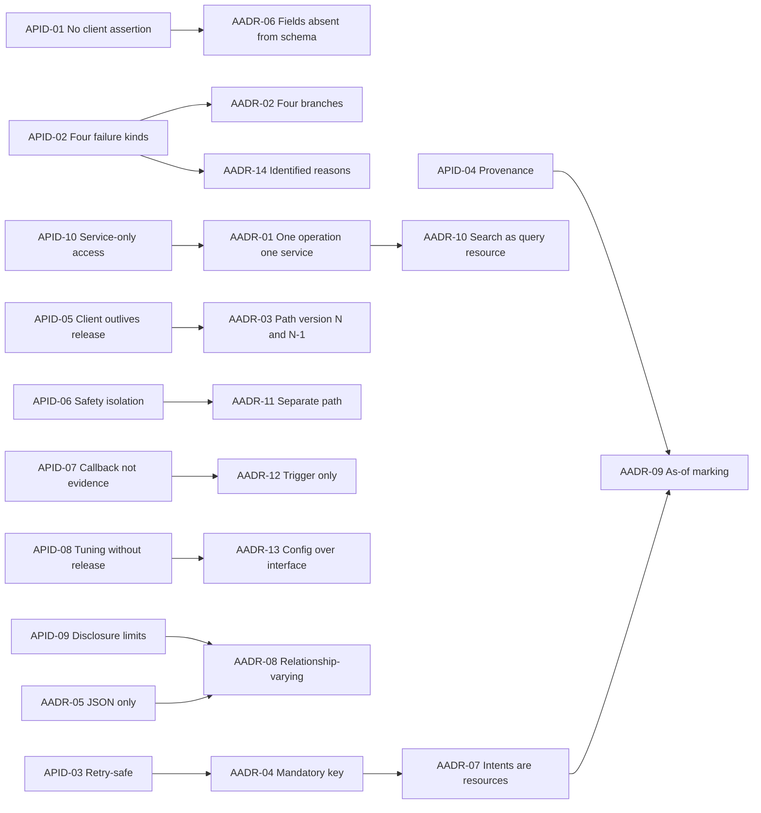
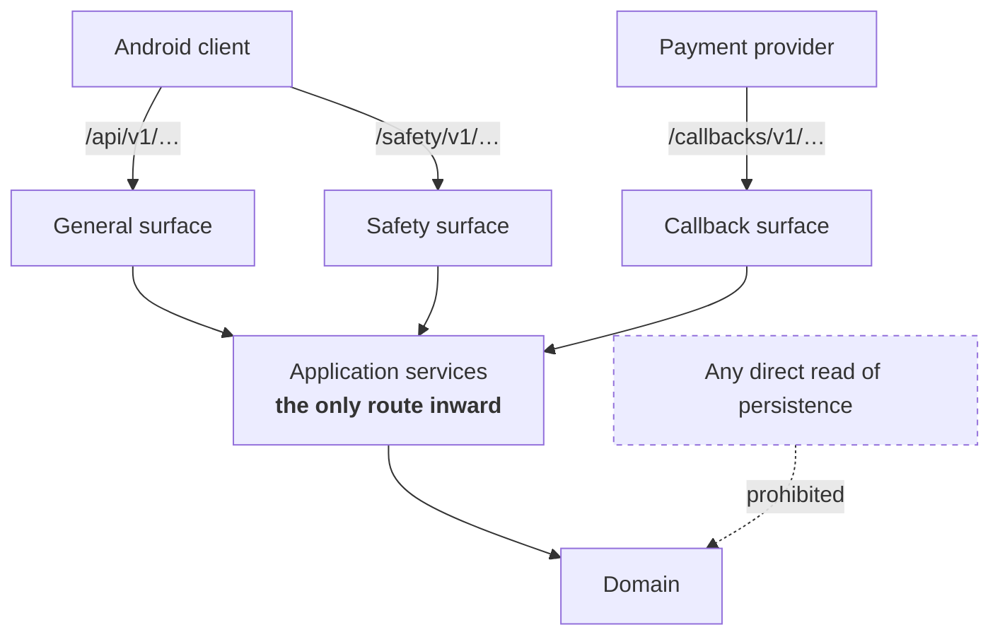
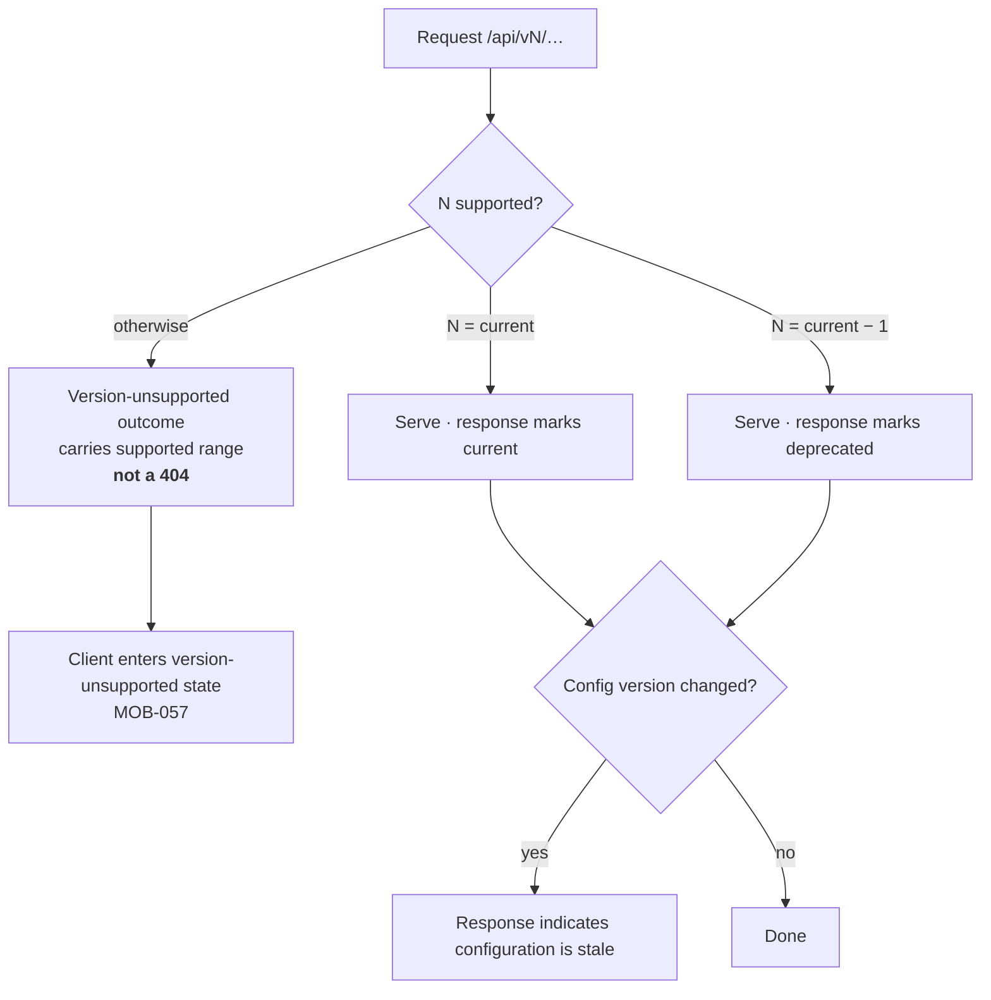
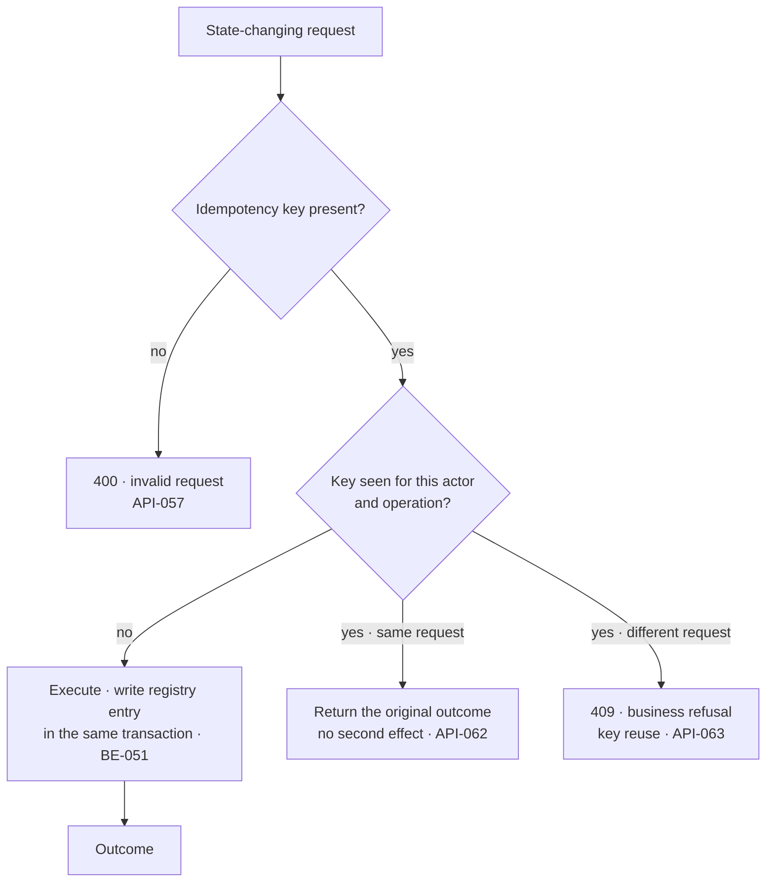
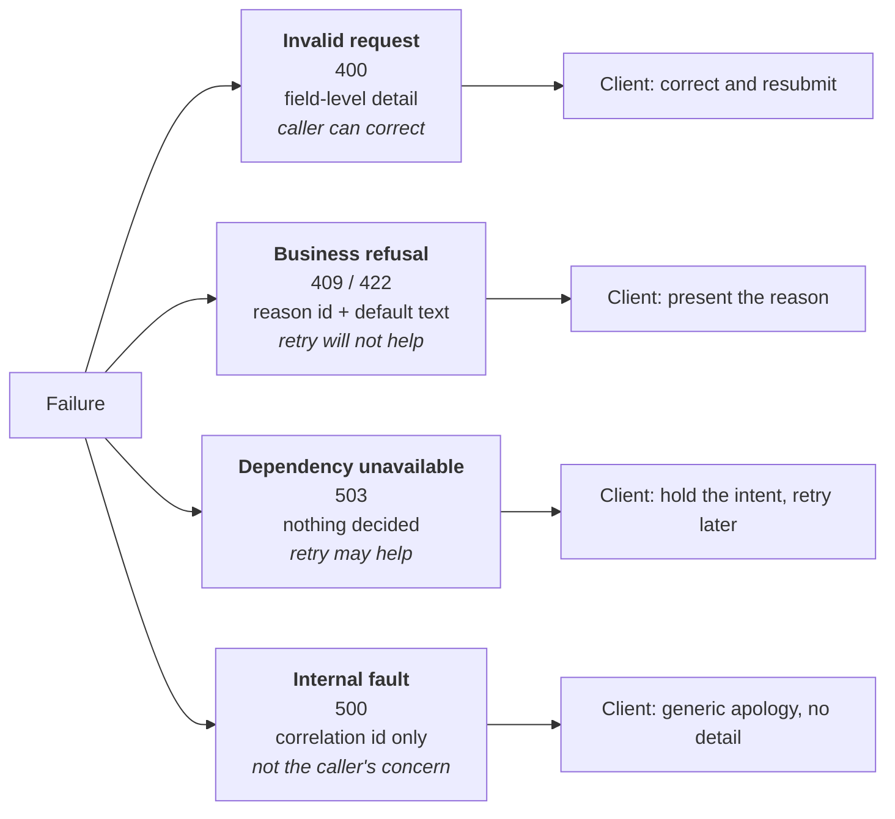
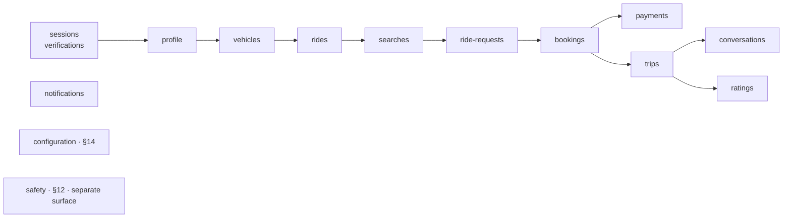
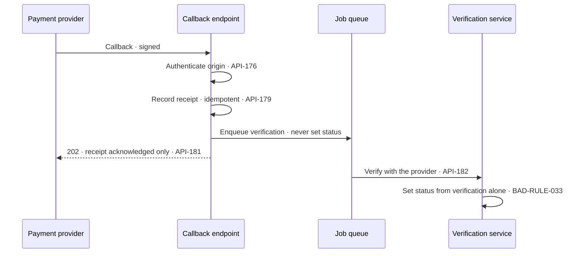

# CMP-DOC-10 — API Specification

**Carpool Mobility Platform (CMP)**

---

# 0. Document Control

## 0.1 Document Metadata

| Field | Value |
|---|---|
| Document ID | CMP-DOC-10 |
| Document Name | API Specification |
| Short Name | API |
| Project Name | Carpool Mobility Platform |
| Project Code | CMP |
| Version | 0.3 |
| Status | Draft |
| Date | 2026-08-20 |
| Author | Solution Architect / Backend Lead (AI-assisted) |
| Reviewer | [TBD] |
| Approver | Project Owner |
| Classification | Internal |
| Brand | TBD |
| Previous Version | 0.2 (2026-08-20) |
| Predecessor Documents | CMP-DOC-01 … CMP-DOC-09, **all Draft, none approved** (CMP-DOC-09 at v0.2, the remainder at v0.1) |
| Related Documents | `00_Project_Control/README.md`, `Documentation_Index.md`, `Documentation_Status.md`, `Document_Change_Log.md`, `Glossary.md`, `Master_Traceability_Matrix.md` |
| Successor Documents | CMP-DOC-11 (Database), CMP-DOC-14 (Payment & UPI), CMP-DOC-15 (GPS / Live Trip), CMP-DOC-16 (Communication & Notification) |

## 0.2 Revision History

| Version | Date | Author | Change | Status |
|---|---|---|---|---|
| 0.1 | 2026-08-17 | Solution Architect / Backend Lead (AI-assisted) | Initial issue. Specifies the platform's external interface: 10 interface drivers, **14 API decisions**, the interface model and conventions, versioning and negotiation, representation rules, idempotency, the four-branch error model, authorisation and session carriage, collections, the resource catalogue across 13 functional areas, the safety surface, the provider callback surface, configuration delivery, rate limiting posture and interface quality obligations. Issues 216 statements (`API-001` … `API-216`). | Draft |
| 0.2 | 2026-08-20 | Solution Architect / Backend Lead (AI-assisted) | **Three implementation readings ratified and recorded.** Building `FEAT-035` found three places where this document states a requirement without stating how it is met, and the implementation had to choose in order to meet it at all. Each choice was reported rather than taken silently, and the Project Owner ratified all three on 2026-08-20. **`API-217`** records the response envelope: `API-022`, `API-023`, `API-043` ‡ and `API-064` each require a marking and none says where it goes, so all four are carried in one `meta` object beside `data` — one envelope rather than four separate inventions. The four error branch shapes of `API-072` ‡ are unchanged and do not use `data`. **`API-218`** records `426 Upgrade Required` as the status of the version-unsupported outcome, which §5 describes without a code and §8.6 places outside the four branches; `API-024` ‡’s constraint is that it is **not** a not-found outcome, and that is preserved. **`API-219`** records the reading of `API-071` ‡ that a request naming no operation — an unrouted path or method — is not an operation failing, so the framework’s own not-found and method-not-allowed responses are not forced into the four branches. Issues 3 statements (`API-217` … `API-219`); §5, §6 and §8 gain one each. **No existing statement was altered, no ‡ marking changed, and no operation, resource or field was added.** | Draft |
| 0.3 | 2026-08-20 | Solution Architect / Backend Lead (AI-assisted) | **§15.3’s session lifetime bound is no longer unset.** `SEC-039` ‡ was decided as **twenty-four hours** on 2026-08-20 and `API-104` cites it, so the tuning-value register records the figure and the count of unset values there falls from nine to eight. **The value is not stated in this document’s own terms** — CMP-DOC-13 owns it and this is a pointer, which is why §15.3’s preamble that *"their existence is specified here; their values are not invented"* is unchanged. **No statement was created or altered.** | Draft |

## 0.3 Distribution List

| Role | Purpose |
|---|---|
| Project Owner | Approval authority |
| **Backend Lead** | Authoring and ownership |
| **Backend Developers** | **Primary consumer — implements the surface** |
| **Android Developers** | **Primary consumer — consumes the surface** |
| Solution Architect | Consistency with CMP-DOC-07 and CMP-DOC-09 |
| Software Architect — Android | Realisation of `MOB-047`–`MOB-057` against this contract |
| Security Analyst | Authorisation carriage, disclosure limits, callback authentication; mechanisms in CMP-DOC-13 |
| QA Analyst | Contract testing and the negative cases in §8 |
| Product Analyst | Resource catalogue coverage of the specified use cases |

## 0.4 Approval

| Role | Name | Signature | Date |
|---|---|---|---|
| Author | Solution Architect / Backend Lead (AI-assisted) | — | 2026-08-17 |
| Reviewer | [TBD] | — | — |
| Approver | Project Owner | — | — |

> **This document is NOT approved.** It is issued at version 0.1 with status `Draft`
> for Project Owner review.

## 0.5 Purpose of This Document

CMP-DOC-09 established that every caller reaches the domain through one application
service layer, and that the REST adapters translate transport representations to
application commands and nothing more (`BE-013`, `BE-065`, `BE-068`). It did not say
what those transport representations are.

This document says. It specifies the contract between the Android client and the
platform: what resources exist, what operations act on them, how a version is
negotiated, how an idempotency key is carried, how the four error branches appear on
the wire, and what a caller may and may not assert.

The contract has one governing property, inherited from `BAD-RULE-002` and restated at
every layer above: **the interface offers no way to tell the platform what is true.**
A caller submits intents and receives outcomes. There is no endpoint by which a client
sets a fare, a verification standing, a payment status or a seat count, because
`ARCH-121` forbids the operation from existing rather than merely forbidding its use.

## 0.6 Boundaries — What This Document Does Not Specify

| Subject | Owning document |
|---|---|
| Application services, aggregates, transactions, layer structure | CMP-DOC-09 |
| **Tables, columns, keys, indexes, migrations** | **CMP-DOC-11** |
| Screen design, navigation, copy | CMP-DOC-12 |
| **Cryptographic algorithms, token format, key handling, TLS configuration** | **CMP-DOC-13** |
| **Payment provider mechanics, UPI flows, settlement** | **CMP-DOC-14** |
| Position acquisition cadence behaviour on the device | CMP-DOC-15 |
| Notification channel mechanics and message templates | CMP-DOC-16 |
| Administrative screens and Filament resources | CMP-DOC-17 |
| Test cases and test data | CMP-DOC-18 |
| Hosting, gateways, TLS termination, instance sizing | CMP-DOC-19 |

### 0.6.1 The Boundary With CMP-DOC-13

This document states **where** a credential is carried, **what** an unauthorised
outcome looks like, and **what** must never be disclosed. It states nothing about how a
credential is constructed, signed, stored or rotated. `API-095`–`API-110` are
positional and behavioural statements; every mechanism behind them is CMP-DOC-13's.

### 0.6.2 The Boundary With CMP-DOC-14

This document specifies the payment resources a client may act on and the shape of the
provider callback surface. It specifies no UPI flow, no provider API, no settlement
mechanics and no reconciliation procedure.

## 0.7 Inputs to This Document

| Input | Contribution |
|---|---|
| CMP-DOC-09 §7.1 | `BE-065`–`BE-073` — the REST adapter's obligations |
| CMP-DOC-09 §14.2 | `BE-185`–`BE-190` — the four error branches |
| CMP-DOC-07 §12 | `ARCH-120`–`ARCH-139` — interface and security-position statements |
| CMP-DOC-08 §17.5 | Three obligations placed explicitly on this document |
| CMP-DOC-06 §6.1 | `SRS-REQ-137`–`SRS-REQ-141` — external interface requirements |
| CMP-DOC-05 | Quality obligations bearing on the interface |
| CMP-DOC-04 | The functional behaviour the resources must expose |
| CMP-DOC-03 | 44 Specified use cases determining which resources are needed |

## 0.8 Qualifications on This Document

### 0.8.1 Source

Every statement derives from a predecessor statement, from a decision recorded in §3,
or is disclosed in §17.6 as originating here.

### 0.8.2 Qualification 1 — Nine Unapproved Predecessors

**FACT.** CMP-DOC-01 … CMP-DOC-09 are all `Draft`. None is approved.

This document is nine deep on an unapproved baseline, and it is the first document a
developer will implement against literally. Recorded as conflict `CC-010` and as
`API-RISK-01`.

### 0.8.3 Qualification 2 — The Resource Catalogue Is Bounded by Decided Behaviour

**FACT.** CMP-DOC-03 records 33 of 83 use cases as Outlined, and CMP-DOC-04 records 29
functional gaps of which 11 are Critical.

A resource cannot be specified for behaviour that has not been decided. §11 covers the
44 Specified use cases. **Where a resource would be needed for an Outlined use case,
§11.14 names the resource and the blocking decision, and no operation is invented for
it.** This is the same discipline CMP-DOC-04 applied, one layer down.

### 0.8.4 Qualification 3 — No Limit, Window or Page Size Is Stated

**FACT.** `BAD-DEC-018` leaves 69 quality targets unset (`GAP-012`), and launch scale is
unstated (`GAP-016`).

This document states **that** the interface pages, **that** it rate-limits, and **that**
a payload is bounded. It states no page size, no rate, no window and no maximum, because
each is a tuning value that should be set from measurement. Nine such values are named as
configuration in §15.3.

### 0.8.5 Qualification 4 — Two Requirement-Chain Gaps Are Inherited

**FACT.** CMP-DOC-09 §18.7 recorded that payment credential handling (`BE-097`) and
injection defence (`BE-102`) have no upstream requirement.

Both surface here, because both are interface-visible. This document restates them at
the boundary (`API-053`, `API-109`) and repeats that **CMP-DOC-13 should close the
requirement gap** rather than let an architecture and an interface document be the only
places either is written down.

## 0.9 Statement Classification Convention

As `README.md` §9.1. Markers: **FACT**, **ASSUMPTION**, **BUSINESS DECISION REQUIRED**,
**TECHNICAL DECISION REQUIRED**, **OPEN QUESTION**, **TBD**, **FUTURE CONSIDERATION**,
**RECOMMENDATION**.

## 0.10 Identifier Conventions

| Prefix | Element | Section |
|---|---|---|
| `API-nnn` | **Traceable API specification statement** | §4–§16 |
| `AADR-nn` | API Architecture Decision Record | §3 |
| `APID-nn` | Interface driver | §2 |
| `API-ASM-nn` | Assumption | §19.1 |
| `API-RISK-nn` | Risk | §19.2 |
| `API-OQ-nn` | Open Question | §19.3 |

`API-nnn` is the only traceable prefix. A statement marked **‡** is integrity-critical:
its violation would permit an absolute business rule to be broken.

## 0.11 Table of Contents

| § | Title |
|---|---|
| 0 | Document Control |
| 1 | Executive Summary |
| 2 | Interface Drivers |
| 3 | API Decisions |
| 4 | Interface Model and Conventions |
| 5 | Versioning and Negotiation |
| 6 | Representation Rules |
| 7 | Idempotency |
| 8 | The Error Model |
| 9 | Authorisation and Session Carriage |
| 10 | Collections, Filtering and Paging |
| 11 | Resource Catalogue |
| 12 | The Safety Surface |
| 13 | The Provider Callback Surface |
| 14 | Configuration Delivery |
| 15 | Rate Limiting and Abuse Posture |
| 16 | Interface Quality Obligations |
| 17 | Traceability |
| 18 | Assumptions, Risks and Open Questions |
| 19 | Acceptance Criteria for This Document |
| 20 | Statistics and Recommendations |
| A | Appendix A — Statement Index |
| B | Appendix B — Decision Index |
| C | Appendix C — Resource Index |

---

# 1. Executive Summary

## 1.1 What This Document Delivers

| Element | Count |
|---|---|
| Interface drivers | 10 |
| **API Decision Records** | **14** |
| API specification statements | **219** (`API-001` … `API-219`) |
| Resource groups | 13 |
| Operations specified | 59 |
| Error branches | 4 |
| Tuning values named as configuration | 9 |
| Obligations discharged from CMP-DOC-08 §17.5 | 3 of 3 |

## 1.2 The Interface in One Paragraph

One REST interface, versioned in the URI path, serving the current version and the one
before it. JSON only. Every state-changing request carries an idempotency key and every
response carries the interface version. Every business value the platform holds is
returned with the platform's own valuation and never accepted from the caller. Failures
arrive as exactly one of four branches — invalid request, business refusal, dependency
unavailable, internal fault — each with a distinct status code range and a distinct body
shape, so that a client can tell "you may not" from "we could not" without parsing prose.
A separate safety surface answers on the same contract with the narrowest possible
dependency set. Provider callbacks are a trigger to verify, never a verification.

## 1.3 The Four Decisions That Shape Everything Else

| AADR | Decision | Why it dominates |
|---|---|---|
| **`AADR-02`** | Four error branches, each with its own status range and its own body shape — **not** a single error envelope with a code. | CMP-DOC-08 `MADR-10` requires the client to design four distinct treatments. A single envelope makes the four indistinguishable without agreeing a code list, and code lists rot. This is the obligation from CMP-DOC-08 §17.5 discharged structurally. |
| **`AADR-04`** | The idempotency key is **required** on every state-changing request and the interface **refuses** a request without one. | `ARCH-124` requires acceptance; making it optional means it is absent exactly when the network was unreliable — the case it exists for. A refusal is noisy on day one and silent thereafter. |
| **`AADR-06`** | No request body field may name an authoritative value. Such a field **does not exist in the schema** rather than being ignored. | `ARCH-121` and `BE-069`. A field that is accepted-and-ignored is a field somebody will later honour. Absence from the schema is the only durable form of the rule. |
| **`AADR-09`** | Every business value is returned with an explicit **as-of** marking. | CMP-DOC-08 `MADR-02` makes provenance a type-level client property, and `MOB-018` forbids rendering a value without it. If the interface does not supply the marking, the client must invent one, and an invented provenance is a lie with a type signature. |

## 1.4 What This Document Could Not Specify

| Matter | Position |
|---|---|
| Resources for 33 Outlined use cases | Named in §11.14 with the blocking decision; no operation invented |
| Page sizes, rate limits, payload bounds | Configuration; 9 values named in §15.3 |
| Token format, signing, TLS profile | CMP-DOC-13 |
| Version support duration | `API-OQ-01`; `SRS-OQ-005` is answered only in part |
| Emergency dispatch surface | `GAP-004`; §12.4 |

---

# 2. Interface Drivers

A driver is a requirement that would **change the shape of the interface** if it changed.

| ID | Driver | Source | Consequence |
|---|---|---|---|
| `APID-01` | The client must never be able to assert authoritative state. | `BAD-RULE-002`, `ARCH-121` | `AADR-06`: absence from schema, not validation. |
| `APID-02` | The client must distinguish four failure kinds without parsing prose. | `MADR-10`, `BE-185` | `AADR-02`: four branches, four shapes. |
| `APID-03` | Every state change must survive being retried. | `ARCH-124`, `BE-135` | `AADR-04`: mandatory idempotency key. |
| `APID-04` | The client must render no business value without provenance. | `MADR-02`, `MOB-018` | `AADR-09`: as-of marking on every value. |
| `APID-05` | A client build outlives a platform release. | `NFR-099`, `SRS-REQ-010` | `AADR-03`: N and N−1, explicit unsupported outcome. |
| `APID-06` | Safety must not degrade because unrelated capability is failing. | `NFR-030`, `BE-193` | `AADR-11`: safety surface on a separate path with a narrow contract. |
| `APID-07` | A provider callback is not evidence. | `ARCH-128`, `BAD-RULE-032` | `AADR-12`: callbacks accepted as triggers only. |
| `APID-08` | Tuning values must change without a client release. | `MADR-11`, `MOB-123` | `AADR-13`: configuration delivered over the interface. |
| `APID-09` | The interface must disclose only what the caller is entitled to. | `ARCH-125`, `SRS-REQ-141` | `AADR-08`: representation varies by relationship, not by flag. |
| `APID-10` | Every endpoint must reach the domain through an application service. | `BE-013`, CMP-DOC-09 §18.5 | `AADR-01`: one operation, one service, no exceptions. |

---

# 3. API Decisions

Each decision records its context, the alternatives considered, and its consequences
**including the negative ones**, marked ✘.

## 3.1 `AADR-01` — One Operation, One Application Service

| | |
|---|---|
| **Context** | CMP-DOC-09 §18.5 places an obligation on this document: no endpoint may bypass an application service. Convenience endpoints that "just read a table" are how that obligation is broken. |
| **Decision** | **Every operation in §11 maps to exactly one application service operation. No endpoint composes two services, and no endpoint reads persistence directly. A composite need is met by a service, not by an adapter.** |
| **Alternatives** | *(a)* Allow read-only endpoints to query read models directly — rejected: authorisation lives in the application layer (`BE-179`), so a direct read is an unauthorised read. *(b)* Allow adapters to compose services — rejected: composition without a transaction boundary is where partial effects appear. |
| **Consequences** | ✔ Authorisation, idempotency and evidencing apply uniformly. ✔ The admin surface and the REST surface stay behaviourally identical. ✘ Some screens need a purpose-built service rather than two cheap calls. ✘ A service must exist before its endpoint can. |

## 3.2 `AADR-02` — Four Error Branches, Four Shapes

| | |
|---|---|
| **Context** | `BE-185` defines four exception branches. `MADR-10` requires the client to design four distinct treatments. `SRS-REQ-163` forbids representing a refusal as a fault or a fault as a refusal. The common industry practice — one envelope with an application error code — satisfies none of these reliably, because the distinction then lives in a code list rather than in the structure. |
| **Decision** | **Each branch has its own status code range and its own response body shape: invalid request (`400`), business refusal (`409` / `422`), dependency unavailable (`503`), internal fault (`500`). A client can branch on structure alone. The refusal body carries a presentable reason; the fault body carries a correlation identity and nothing else.** |
| **Alternatives** | *(a)* One envelope with a `code` field — rejected: the four cases become indistinguishable to a client that does not hold the current code list, which is exactly the client that has been in the field longest. *(b)* Status code alone with no body — rejected: `SRS-REQ-140` requires a presentable reason. |
| **Consequences** | ✔ `MOB-050`'s four treatments are structurally supported. ✔ A refusal cannot silently become a fault in a later release without the shape changing. ✘ Four schemas to maintain rather than one. ✘ Servers must be disciplined about which branch a condition belongs to; §8.6 gives the classification rules. |

## 3.3 `AADR-03` — URI Path Versioning, N and N−1

| | |
|---|---|
| **Context** | `ARCH-123` requires the version to be identifiable in a form the client can act on. `SRS-REQ-034` requires more than one version concurrently for a defined period. CMP-DOC-07 §0.6 already decided path versioning; this document details it. `TD-4` is routed here. |
| **Decision** | **The version is the first path segment: `/api/v1/…`. The platform serves the current version and the immediately preceding one. Every response carries the serving version and a deprecation indication for N−1. A request for an unsupported version receives a distinct outcome — not a `404` — carrying the supported range.** |
| **Alternatives** | *(a)* Header-based version negotiation — rejected: invisible in logs, in a browser and in a support conversation, and easy to omit. *(b)* Unversioned with additive-only change — rejected: `SRS-REQ-033` requires a version increment for a breaking change, so a version must exist to increment. *(c)* Serve N only — rejected: forces a synchronised client release, which `SRS-REQ-011` forbids requiring. |
| **Consequences** | ✔ The version is visible everywhere a URL is. ✔ `MOB-057`'s version-unsupported application state has a definite trigger. ✘ Two versions to run, test and reason about. ✘ **How long N−1 is served is `[TBD – Business Decision Required]`** — `SRS-OQ-005` is therefore only half answered here, and `API-OQ-01` records the remainder. |

## 3.4 `AADR-04` — Mandatory Idempotency Key

| | |
|---|---|
| **Context** | `ARCH-124` requires the interface to accept a key on every state-changing operation. `MOB-049` has the client generate one when an intent is recorded. `BE-051` writes the registry entry in the same transaction as the effect. The remaining question is whether a request without a key is accepted. |
| **Decision** | **A state-changing request without an idempotency key is refused as an invalid request. The key is caller-generated, opaque to the platform, and scoped to the actor and the operation.** |
| **Alternatives** | *(a)* Optional key, best-effort deduplication — rejected: the key is absent precisely when the network misbehaved, which is the only case it matters. *(b)* Server-generated key returned for reuse on retry — rejected: requires a round trip that the failing network just prevented. |
| **Consequences** | ✔ Every state change is replay-safe end to end, not merely in the queue. ✔ `BE-211`'s replay test has a wire-level counterpart. ✘ Every client call site must supply a key; a forgotten one fails loudly in development. ✘ Key retention duration is a tuning value (§15.3). |

## 3.5 `AADR-05` — JSON Only, One Representation Per Resource

| | |
|---|---|
| **Context** | The only client is the Android application (`ARCH-009`), plus provider callbacks and, later, whatever CMP-DOC-17 needs. Content negotiation is a cost paid on every endpoint for a flexibility nobody has asked for. |
| **Decision** | **`application/json` for requests and responses. One representation per resource. No content negotiation, no partial-response syntax, no field-selection query language.** |
| **Alternatives** | *(a)* GraphQL — rejected: moves query composition to the client, which conflicts with `AADR-01` and with authorisation living in the application layer. *(b)* Sparse fieldsets — rejected: multiplies the authorisation surface for a payload saving that `MOB-054` has not yet measured. |
| **Consequences** | ✔ One schema per resource to authorise, test and version. ✔ Contract tests are tractable. ✘ Over-fetching on some screens. ✘ If payload volume becomes a real constraint, this decision is the one to revisit — `MOB-136` is the measurement that would justify it. |

## 3.6 `AADR-06` — Authoritative Fields Absent From Schema

| | |
|---|---|
| **Context** | `ARCH-121` requires that no operation permit direct assignment of authoritative state. `ARCH-133` requires an attempt to be rejected in whole and recorded. `BE-069` restates it at the adapter. The weak form of this rule is to accept and ignore. |
| **Decision** | **Fare, verification standing, payment status, seat counts, ratings, balances and trip state do not appear as writable fields in any request schema. An unknown field in a request body causes the request to be refused in whole, and a field matching a known authoritative name is additionally recorded as an integrity event.** |
| **Alternatives** | *(a)* Accept and ignore unknown fields — rejected: tolerant readers are how a client comes to believe it set something. *(b)* Accept and validate against platform state — rejected: still implies the field is meaningful. |
| **Consequences** | ✔ The rule is enforced by schema, not by vigilance. ✔ `ARCH-133`'s integrity event has a definite trigger point. ✘ Strict rejection breaks clients that send extra fields, including during their own development. ✘ Additive schema change requires a client that tolerates unknown *response* fields — stated separately at `API-046`. |

## 3.7 `AADR-07` — Intents Are Resources

| | |
|---|---|
| **Context** | Several client actions do not complete synchronously: a booking awaits payment verification, a payment awaits provider confirmation, a recurring ride awaits generation. A synchronous response cannot state an outcome that does not yet exist, and `BE-159` forbids assuming one. |
| **Decision** | **An operation whose outcome is not yet determined returns the created resource in its actual state — `pending` — with a location at which its state may be read. The interface never returns a provisional success.** |
| **Alternatives** | *(a)* Block until resolved — rejected: couples a client's responsiveness to a provider's, and `BE-050` puts the provider call outside the transaction precisely to avoid this. *(b)* Return success and correct later by push — rejected: `MOB-060` forbids the client presenting an intent as an accomplished fact. |
| **Consequences** | ✔ `pending` is a first-class outcome the client can render honestly. ✔ Reconciliation has a resource to act on. ✘ Every such flow needs a read path and a client-side follow-up. ✘ Clients must not poll on a self-chosen interval (`ARCH-026`); §14.2 supplies the cadence. |

## 3.8 `AADR-08` — Representation Varies by Relationship

| | |
|---|---|
| **Context** | `ARCH-125` and `SRS-REQ-141` limit disclosure to what the caller's actor is entitled to. `BAD-RULE-025` forbids exposing a counterparty's precise location beyond what is required. A single representation with nullable sensitive fields leaks by omission pattern and invites a client to infer. |
| **Decision** | **A resource has one schema, but the platform populates only the fields the caller's relationship entitles them to, and the schema marks which fields are relationship-dependent. Entitlement is evaluated in the application layer (`BE-179`), never by the adapter.** |
| **Alternatives** | *(a)* Distinct schemas per relationship — rejected: multiplies representations and drifts. *(b)* Client-side filtering — rejected: the data has already left the platform. |
| **Consequences** | ✔ One schema, one authorisation point. ✔ A new relationship type does not create a new resource. ✘ A client must handle an absent field on every relationship-dependent value. ✘ Absence is itself weak information; `API-107` bounds what may be inferred from it. |

## 3.9 `AADR-09` — Every Business Value Carries an As-Of Marking

| | |
|---|---|
| **Context** | `MADR-02` makes provenance a type-level property of client state and `MOB-018` forbids rendering a value without it. The client can mark a value `Cached` from its own store, but it cannot know how current a value was when the platform computed it — a seat count read from an authoritative record and a projection-derived count both arrive as JSON numbers. |
| **Decision** | **Every response carries the time at which the platform evaluated it, and any value served from a projection additionally carries that projection's maintenance time. A value the platform read under lock is marked as authoritative-at-that-instant.** |
| **Alternatives** | *(a)* One response timestamp only — rejected: conflates the freshness of a projection-derived list with that of a locked read, and `BE-125` requires the difference to be presentable. *(b)* Leave it to the client — rejected: the client cannot know, and would have to guess. |
| **Consequences** | ✔ `MOB-018` becomes satisfiable rather than aspirational. ✔ `BE-125`'s staleness disclosure has a wire representation. ✘ Marking on every value costs payload. ✘ Screens must decide what to do with a stale marking — an obligation this document places on CMP-DOC-12. |

## 3.10 `AADR-10` — Search Is a Query Resource, Not a Filtered Collection

| | |
|---|---|
| **Context** | Ride search is route-overlap matching (`SRS-REQ-049`), not attribute filtering. Expressing it as query parameters on a rides collection implies a filterable list and invites clients to construct arbitrary filters, which `NFR-020` and `NFR-021` bound and `ARCH-081` structures in two phases. |
| **Decision** | **Search is a distinct resource accepting a journey description and returning a ranked result set with its own representation. It is not `GET /rides?from=…&to=…`.** |
| **Alternatives** | *(a)* Filtered collection — rejected: implies composability the matching engine does not have and cannot bound. *(b)* `POST` returning a stored search — rejected: adds a resource lifecycle for no current requirement. |
| **Consequences** | ✔ The bounded cost of a search is expressible on one operation. ✔ Ranking is part of the contract rather than an accident of ordering. ✘ Search is not cacheable by URL. ✘ A `POST` that does not change state needs `API-018` to say so explicitly. |

## 3.11 `AADR-11` — The Safety Surface Is a Separate Path

| | |
|---|---|
| **Context** | `BADR-16` makes the safety surface separately bootable. `BE-193` forbids it depending on payment, search, matching, rating or projection components. `NFR-030` forbids losing a safety signal under any failure condition. If safety shares a path prefix with everything else, a gateway rule or a rate limiter written for the general case will eventually apply to it. |
| **Decision** | **Safety operations live under a distinct path prefix, carry the narrowest possible request shape, and are specified so that they can be served by a deployment that implements only them. They are exempt from rate limiting to the point of refusal (`BE-196`).** |
| **Alternatives** | *(a)* Same prefix, flagged internally — rejected: makes the isolation invisible to every layer in front of the application. *(b)* A wholly separate protocol — rejected: doubles the client's transport code for no gain. |
| **Consequences** | ✔ Isolation is visible to gateways, logs and operators, not only to the application. ✔ CMP-DOC-19 can route the prefix separately without a code change. ✘ Two prefixes to secure and monitor. ✘ The client must not route a safety call through a general-purpose retry policy; `API-172` states this. |

## 3.12 `AADR-12` — Callbacks Are Triggers, Never Verifications

| | |
|---|---|
| **Context** | `ARCH-128` states it, `BAD-RULE-032` states it of client-side UPI responses, and `BE-160` requires callbacks to be authenticated and idempotent. `SRS-REQ-142` forbids depending on a callback as the sole means of learning an outcome. |
| **Decision** | **A provider callback endpoint records that a callback arrived and enqueues verification. It never sets a payment status from the callback body. The response acknowledges receipt only, and carries no business outcome.** |
| **Alternatives** | *(a)* Trust a signed callback body — rejected: a valid signature proves origin, not truth, and `BAD-RULE-033` sets status only by backend verification. *(b)* No callback endpoint, poll only — rejected: wastes the provider's willingness to tell us early. |
| **Consequences** | ✔ A forged, replayed or reordered callback cannot move money. ✔ Verification remains the single path to a payment status. ✘ A callback does not shorten the worst case; scheduled verification (`BE-145`) still bounds it. ✘ Providers expecting an outcome in the callback response must be told the acknowledgement means receipt. |

## 3.13 `AADR-13` — Configuration Is Delivered Over the Interface

| | |
|---|---|
| **Context** | CMP-DOC-08 §17.5 obliges this document to supply cadence, staleness bounds and cache validity as configuration. `MOB-123` forbids the client embedding a value the platform holds as policy configuration. `BADR-12` makes those values versioned and runtime-editable. |
| **Decision** | **A configuration resource returns the client-relevant subset of policy configuration with its version. The client fetches it at startup and on demand, and the platform may indicate in any response that configuration has changed. No policy value is compiled into the client.** |
| **Alternatives** | *(a)* Push-only via notification — rejected: leaves a cold-started client with nothing. *(b)* Per-value endpoints — rejected: multiplies round trips at the moment the client is least useful. |
| **Consequences** | ✔ The three CMP-DOC-08 obligations are discharged by one resource. ✔ A tuning value changes without a release. ✘ The client must behave sensibly before its first successful fetch; `API-193` requires a documented conservative default. ✘ Configuration becomes a startup dependency — bounded by `API-194`. |

## 3.14 `AADR-14` — Refusal Reasons Are Identified, Not Free Text

| | |
|---|---|
| **Context** | `SRS-REQ-140` requires a reason sufficient for presentation without further enquiry. `BE-188` requires it to be fit to show the affected person. `SRS-REQ-029` requires the client to keep user-facing text externalised. These pull in opposite directions: presentable text must be localisable, and localisable text cannot come from the server as a fixed string. |
| **Decision** | **A refusal carries a stable machine-readable reason identifier **and** a human-readable default. The client presents its own localised text keyed by the identifier, falling back to the default for an identifier it does not recognise.** |
| **Alternatives** | *(a)* Server text only — rejected: unlocalisable, and `SRS-REQ-029` forbids the client depending on server-supplied display text. *(b)* Identifier only — rejected: a client older than the identifier has nothing to show. |
| **Consequences** | ✔ Old clients degrade to comprehensible text rather than to a blank dialog. ✔ Reasons are enumerable and testable. ✘ Two things to keep in step. ✘ The identifier set becomes part of the contract and is versioned with it. |

## 3.15 Driver to Decision Map

---

# 4. Interface Model and Conventions

| ID | Statement | Src |
|---|---|---|
| `API-001` | The platform shall expose one REST interface over HTTP for client elements. | `ARCH-120`, `BE-065` |
| `API-002` ‡ | Every operation shall invoke exactly one application service operation. | `AADR-01`, `BE-013` |
| `API-003` ‡ | No operation shall read persistence other than through an application service. | `AADR-01`, `BE-104` |
| `API-004` | An operation shall be identified by a path and a method, and shall have one meaning. | `AADR-05` |
| `API-005` | Resource paths shall name collections in the plural and members by identifier. | `AADR-05` |
| `API-006` | A path segment shall not encode an action where a method expresses it. | `AADR-05` |
| `API-007` | `GET` shall be safe and shall change no authoritative state. | `AADR-01` |
| `API-008` | `PUT` and `DELETE` shall be idempotent by definition of the operation, independently of the idempotency key. | `AADR-04` |
| `API-009` | `POST` shall be used where an operation creates a resource or submits an intent. | `AADR-07` |
| `API-010` | `PATCH` shall be used for partial amendment of a caller-owned resource. | `AADR-05` |
| `API-011` | Request and response bodies shall be `application/json`; no other media type shall be negotiated. | `AADR-05` |
| `API-012` | The interface shall not offer field selection, sparse representation or a query language. | `AADR-05` |
| `API-013` | Identifiers exposed by the interface shall be opaque to the caller and shall not encode meaning. | `AADR-05`, `API-014` |
| `API-014` ‡ | An identifier shall not be guessable in a way that permits enumeration of another party's resources. | `NFR-061`, `SRS-REQ-141` |
| `API-015` | Times shall be expressed in a single unambiguous representation carrying an offset. | `AADR-09` |
| `API-016` ‡ | Monetary amounts shall be transmitted in an exact representation and never as a floating-point number. | `BE-095`, `NFR-127` |
| `API-017` | The interface shall not depend on request or response header order, casing or optional whitespace for meaning. | `AADR-05` |
| `API-018` | An operation that uses `POST` without changing state shall be documented as such, and shall be safe to repeat. | `AADR-10` |

---

# 5. Versioning and Negotiation

| ID | Statement | Src |
|---|---|---|
| `API-019` ‡ | The interface version shall be the first path segment, in the form `/api/v{n}/`. | `AADR-03`, `ARCH-123` |
| `API-020` ‡ | The platform shall not introduce a breaking change within a version. | `SRS-REQ-033` |
| `API-021` | The platform shall serve the current version and the immediately preceding version concurrently. | `SRS-REQ-034`, `BE-067` |
| `API-022` | Every response shall state the version that served it. | `ARCH-123`, `SRS-REQ-138` |
| `API-023` | A response served by the preceding version shall additionally indicate that the version is deprecated. | `AADR-03` |
| `API-024` ‡ | A request for a version that is neither current nor preceding shall receive a distinct version-unsupported outcome, and shall not receive a not-found outcome. | `AADR-03`, `MOB-057` |
| `API-025` | The version-unsupported outcome shall state the versions the platform does serve. | `SRS-REQ-010`, `MOB-057` |
| `API-026` | The version-unsupported outcome shall be reachable without an authenticated session. | `MOB-057` |
| `API-027` | The client shall be able to determine the supported range without attempting a business operation. | `MOB-057`, `SRS-REQ-009` |
| `API-028` | The following shall be breaking and shall require a version increment: removing a field, removing an operation, narrowing an accepted value set, changing a field's type, changing a field's meaning, adding a required request field, or moving a condition between error branches. | `SRS-REQ-033`, `AADR-02` |
| `API-029` | The following shall be non-breaking within a version: adding an optional request field, adding a response field, adding an operation, adding a resource, adding a refusal reason identifier, or widening an accepted value set. | `SRS-REQ-033` |
| `API-030` ‡ | Moving a condition from one error branch to another shall be treated as breaking, because a client's treatment of it changes. | `AADR-02`, `MADR-10` |
| `API-031` | The domain shall not be versioned; both served versions shall reach the same application services. | `BE-066` |
| `API-032` | A version shall be retired only after a stated notice period. | `SRS-REQ-034` |
| `API-033` | The duration for which the preceding version is served is `[TBD – Business Decision Required]`; it depends on the client update profile, which is unmeasured. | `SRS-OQ-005`, `API-OQ-01` |
| `API-034` | Deprecation of an operation within a version shall be indicated in its response before the operation is removed in the next version. | `AADR-03` |
| `API-218` | The version-unsupported outcome of `API-024` ‡ shall carry the status `426 Upgrade Required`. It is not a failure branch (§8.6) and shall not be a `404`. | `API-024`, `API-025` |

> **`SRS-OQ-005` asked two questions: how many versions, and for how long.**
> `API-021` answers the first — two. `API-033` records that the second cannot be answered
> without a client update profile that does not yet exist. Half an answer is recorded as
> half an answer.

---

# 6. Representation Rules

## 6.1 General

| ID | Statement | Src |
|---|---|---|
| `API-035` | A resource shall have exactly one representation. | `AADR-05` |
| `API-036` ‡ | A representation shall contain no field by which the caller may assert an authoritative value. | `AADR-06`, `ARCH-121` |
| `API-037` ‡ | Fare, verification standing, payment status, seat counts, ratings, balances and trip state shall be absent from every request schema. | `AADR-06`, `BE-069` |
| `API-038` ‡ | A request containing a field the schema does not define shall be refused in whole. | `AADR-06`, `ARCH-133` |
| `API-039` ‡ | A request containing a field whose name matches a known authoritative value shall additionally be recorded as an integrity event. | `ARCH-133`, `NFR-069` |
| `API-040` ‡ | Every inbound value shall be validated against platform state before use, irrespective of its origin. | `ARCH-131`, `SRS-REQ-032` |
| `API-041` | Validation of well-formedness shall not substitute for validation against platform state. | `MOB-038`, `API-040` |
| `API-042` ‡ | An administrative request shall receive validation identical to a client request. | `ARCH-132`, `BE-076` |

## 6.2 Provenance

| ID | Statement | Src |
|---|---|---|
| `API-043` ‡ | Every response shall carry the time at which the platform evaluated it. | `AADR-09`, `MOB-018` |
| `API-044` ‡ | A value derived from a projection shall carry that projection's maintenance time. | `AADR-09`, `BE-124` |
| `API-045` | A value read under lock shall be marked as authoritative at the stated instant. | `AADR-09`, `BE-094` |
| `API-046` | A client shall tolerate response fields it does not recognise, so that additive change remains non-breaking. | `API-029` |
| `API-047` | A representation shall not present a derived value without indicating what it was derived from where the distinction affects a decision. | `BE-121`, `NFR-086` |
| `API-048` | Seat availability shall be served from the authoritative record, never from a projection. | `ARCH-056`, `BE-122` |
| `API-217` | Every response shall carry the markings of `API-022`, `API-023`, `API-043` ‡ and `API-064` in a single `meta` object, distinct from the representation itself. A resource still has exactly one representation (`API-035`); the envelope describes the response, not the resource. Adding a `meta` field is non-breaking under `API-029`. | `API-022`, `API-043`, `API-029` |

## 6.3 Disclosure

| ID | Statement | Src |
|---|---|---|
| `API-049` ‡ | A representation shall include only the fields the caller's relationship entitles them to. | `AADR-08`, `ARCH-125` |
| `API-050` ‡ | Entitlement shall be evaluated in the application layer and never by the adapter. | `BE-179`, `AADR-08` |
| `API-051` ‡ | A counterparty's precise home or personal location shall not be disclosed beyond what a trip requires. | `BAD-RULE-025`, `NFR-061` |
| `API-052` ‡ | Contact details shall be disclosed only where a qualifying relationship exists. | `FRD-FR-170`, `NFR-061` |
| `API-053` ‡ | No payment instrument credential shall appear in any request or response. | `BE-097`, §17.6 |
| `API-054` ‡ | Information shared with an unauthenticated recipient shall be bounded and time-limited by policy configuration. | `ARCH-137` |
| `API-055` | The schema shall mark which fields are relationship-dependent, so that absence is expected rather than exceptional. | `AADR-08` |
| `API-056` | A field's absence shall not be usable to infer the value it would have carried. | `AADR-08` |

---

# 7. Idempotency

| ID | Statement | Src |
|---|---|---|
| `API-057` ‡ | Every state-changing request shall carry an idempotency key. | `AADR-04`, `ARCH-124` |
| `API-058` ‡ | A state-changing request without an idempotency key shall be refused as an invalid request. | `AADR-04` |
| `API-059` | The key shall be caller-generated and opaque to the platform. | `MOB-049` |
| `API-060` | The key shall be scoped to the acting actor and the operation. | `BADR-08` |
| `API-061` ‡ | The registry entry shall be written in the same transaction as the effect it guards. | `BE-051` |
| `API-062` ‡ | A repeated request with the same key and the same content shall return the original outcome and shall produce no second effect. | `SRS-REQ-044`, `BADR-08` |
| `API-063` ‡ | A repeated key with different content shall be refused as a business refusal, and shall not overwrite the original outcome. | `BADR-08` |
| `API-064` | A replayed response shall be indicated as a replay, so that a client does not treat it as a fresh outcome. | `AADR-04`, `MOB-068` |
| `API-065` | `GET` shall not require an idempotency key. | `API-007` |
| `API-066` ‡ | Idempotency shall apply to the safety surface exactly as to the general surface. | `AADR-11`, `BE-135` |
| `API-067` ‡ | Idempotency shall apply to provider callbacks. | `BE-160`, `AADR-12` |
| `API-068` | The client shall generate the key when the intent is recorded, not when the request is sent. | `MOB-049` |
| `API-069` | Key retention duration is a tuning value held as configuration. | §15.3 |
| `API-070` | A key whose retention has lapsed shall be treated as unseen; retention shall therefore exceed the longest plausible client retry window. | `API-069`, `API-062` |

---

# 8. The Error Model

This section discharges the first of the three obligations CMP-DOC-08 §17.5 placed on
this document.

## 8.1 The Four Branches

| Branch | Status | Body carries | Retry |
|---|---|---|---|
| Invalid request | `400` | Field-level detail identifying each offending field | After correction |
| Business refusal | `409` conflict with state · `422` rule declined | Reason identifier and human-readable default | No — the answer will not change |
| Dependency unavailable | `503` | Nothing decided; optional retry guidance | Yes |
| Internal fault | `500` | Correlation identity only | Yes, but the platform is at fault |

| ID | Statement | Src |
|---|---|---|
| `API-071` ‡ | Every failure shall be represented as exactly one of four branches. | `AADR-02`, `BE-185` |
| `API-072` ‡ | Each branch shall have its own status code range and its own body shape, distinguishable by structure alone. | `AADR-02`, `MADR-10` |
| `API-073` ‡ | A business refusal shall never be represented as an internal fault. | `SRS-REQ-163`, `BE-186` |
| `API-074` ‡ | An internal fault shall never be represented as a business refusal. | `SRS-REQ-163`, `BE-186` |
| `API-075` ‡ | A dependency unavailability shall never be represented as a business refusal. | `BE-187`, `ARCH-122` |
| `API-076` ‡ | A dependency unavailability shall never be represented as success. | `BE-152`, `SRS-REQ-112` |
| `API-077` | The interface shall distinguish a refusal arising from the caller's request from one arising from platform unavailability. | `SRS-REQ-139`, `ARCH-122` |

## 8.2 Invalid Request

| ID | Statement | Src |
|---|---|---|
| `API-078` | An invalid-request body shall identify each offending field and why it is offending. | `SRS-REQ-140` |
| `API-079` | An invalid request shall report all detectable field failures, not only the first. | `NFR-087` |
| `API-080` | Field-level detail shall not disclose platform state the caller is not entitled to. | `API-049`, `SRS-REQ-141` |

## 8.3 Business Refusal

| ID | Statement | Src |
|---|---|---|
| `API-081` ‡ | A business refusal shall carry a stable machine-readable reason identifier. | `AADR-14` |
| `API-082` ‡ | A business refusal shall carry a human-readable default suitable for presentation. | `SRS-REQ-140`, `BE-188` |
| `API-083` | The client shall present its own localised text keyed by the identifier, and shall fall back to the default for an unrecognised identifier. | `AADR-14`, `SRS-REQ-029` |
| `API-084` | A reason identifier shall not be removed or repurposed within a version. | `API-028`, `AADR-14` |
| `API-085` | Adding a reason identifier shall be non-breaking. | `API-029` |
| `API-086` ‡ | A refusal reason shall state what the platform declined, and shall not state platform state the caller is not entitled to. | `SRS-REQ-141`, `API-049` |
| `API-087` | A refusal arising from a state conflict shall be distinguished from one arising from a rule. | `AADR-02` |
| `API-088` ‡ | Refused authorisations shall be recorded. | `ARCH-135`, `BE-183` |

## 8.4 Dependency Unavailable

| ID | Statement | Src |
|---|---|---|
| `API-089` ‡ | The dependency-unavailable branch shall convey that **nothing was decided** — neither success nor failure. | `BE-152`, `ARCH-065` |
| `API-090` | The branch shall not name the provider or expose its error. | `ARCH-063`, `BE-154` |
| `API-091` | Degraded platform state shall be propagated so that the client can disclose what remains available. | `ARCH-105`, `MOB-106` |

## 8.5 Internal Fault

| ID | Statement | Src |
|---|---|---|
| `API-092` ‡ | An internal fault shall disclose no internal detail — no stack, no query, no identifier of an internal component. | `SRS-REQ-165`, `BE-189` |
| `API-093` | An internal fault shall carry a correlation identity a caller may quote to support. | `BE-199`, `NFR-118` |

## 8.6 Classification Rules

Where a condition could plausibly be placed in more than one branch, these rules decide.

| Condition | Branch | Why |
|---|---|---|
| Field missing, malformed, or of the wrong type | Invalid request | The caller can correct it |
| Unknown field present | Invalid request | `API-038` |
| Idempotency key absent | Invalid request | `API-058` |
| Idempotency key reused with different content | Business refusal | The platform declines; correction is not possible |
| Caller not authenticated | Business refusal | Distinguished from authorisation by reason identifier |
| Caller not entitled | Business refusal | Never a not-found, which would leak existence |
| Resource does not exist | Business refusal | Same shape as not-entitled, so the two are indistinguishable to a caller |
| Seats no longer available | Business refusal | `FRD-FR-105` |
| Payment not yet verified | **Not a failure** | `pending` is an outcome — `AADR-07` |
| Provider did not answer | Dependency unavailable | `BE-152` |
| Platform cannot reach its own store | Internal fault | Not the caller's concern |
| Interface version unsupported | **Its own outcome** | `API-024` — not a branch, and not a `404` |

| ID | Statement | Src |
|---|---|---|
| `API-094` ‡ | Absence and non-entitlement shall be indistinguishable to a caller, so that existence cannot be probed. | `API-014`, `SRS-REQ-141` |
| `API-219` | `API-071` ‡ governs the failure of an **operation**. A request naming no operation — an unrouted path, or a method the platform does not route on a path it does — is not an operation failing, and shall not be reshaped into one of the four branches. `API-094` ‡ is unaffected: it concerns a **resource** the caller may or may not be entitled to, which an unrouted path is not. | `API-071`, `API-004`, `API-094` |

> **FACT (2026-08-20).** `API-217`, `API-218` and `API-219` were ratified by the Project
> Owner after being reported as implementation choices during `FEAT-035`. Each records a
> reading this document did not state, and none of the three adds behaviour: the markings
> of `API-217` were already required, the outcome of `API-218` was already required to
> exist and not to be a `404`, and `API-219` states the scope `API-071` ‡ already had.
>
> `API-219` in particular is a **reading, not a licence**. The Project Owner directed that
> no fallback handler be introduced to force unrouted requests into the four branches, and
> that the position be revisited through change control should an authoritative
> specification later establish that `API-071` ‡ reaches them.

---

# 9. Authorisation and Session Carriage

> **This section states position and behaviour only.** Token format, signing, storage,
> rotation and transport configuration are CMP-DOC-13's (§0.6.1).

| ID | Statement | Src |
|---|---|---|
| `API-095` ‡ | Every operation other than those §9.1 names shall require an authenticated session. | `ARCH-134`, `BE-179` |
| `API-096` ‡ | Authorisation shall be evaluated in the application layer on every operation. | `BE-179`, `ARCH-031` |
| `API-097` ‡ | Authorisation shall not be implemented in transport middleware alone. | `BE-180`, `ARCH-031` |
| `API-098` ‡ | Authorisation shall be deny-by-default; an operation with no stated rule shall be refused. | `ARCH-134` |
| `API-099` ‡ | Ownership and relationship shall be evaluated against platform state, never against an inbound claim. | `BE-181`, `SRS-REQ-032` |
| `API-100` | The session credential shall be carried in a request header and never in a URI, a query parameter or a body field. | `NFR-062`, `SRS-REQ-141` |
| `API-101` ‡ | A credential shall never appear in a response. | `NFR-053`, `SRS-REQ-122` |
| `API-102` | Session establishment, refresh and termination shall each be a distinct operation. | `FRD-FR-016`, `NFR-054` |
| `API-103` ‡ | A terminated session shall be unusable, and a request bearing one shall be refused. | `NFR-054` |
| `API-104` | Session lifetime shall be bounded, and the bound shall be policy configuration. | `NFR-055`, `BADR-12` |
| `API-105` ‡ | The interface shall carry no operation by which a caller may alter its own authorisation. | `ARCH-121`, `AADR-06` |
| `API-106` ‡ | An attempt to act outside the caller's entitlement shall be refused in whole and recorded. | `ARCH-133`, `API-088` |
| `API-107` | A refusal for non-entitlement shall carry the same shape as one for absence. | `API-094` |
| `API-108` | Administrative callers shall traverse the same authorisation evaluation as client callers. | `BE-179`, `ARCH-132` |
| `API-109` ‡ | Values received from a caller shall never be interpolated into a query, a command or a path. | `BE-102`, §17.6 |
| `API-110` | Which operations are reachable without a session is stated in §9.1 and nowhere else. | `API-095` |

## 9.1 Operations Reachable Without a Session

| Operation | Why |
|---|---|
| Version discovery (§5) | `API-026` — a client must learn it is unsupported before it can authenticate |
| Session establishment | Otherwise unreachable |
| Phone verification initiation and completion | `FRD-FR-007` — precedes an account |
| Configuration fetch, public subset (§14) | `API-193` — a cold client needs conservative defaults |
| Platform health indication | `BE-203` |

---

# 10. Collections, Filtering and Paging

| ID | Statement | Src |
|---|---|---|
| `API-111` | A collection shall be paged, without exception. | `AADR-05`, `NFR-049` |
| `API-112` | Paging shall be cursor-based, so that an insertion does not shift a page boundary. | `AADR-05` |
| `API-113` | A cursor shall be opaque and shall not encode a position a caller may manipulate. | `API-013` |
| `API-114` | A collection response shall state whether a further page exists, and shall not require the caller to infer it from a short page. | `AADR-05` |
| `API-115` | The default and maximum page size shall be configuration, not a compiled constant. | §15.3 |
| `API-116` | A collection shall have one stated ordering, and that ordering shall be total. | `AADR-05` |
| `API-117` ‡ | A collection shall include only members the caller is entitled to see, and shall not indicate that others were excluded. | `API-049`, `SRS-REQ-141` |
| `API-118` | A count shall be returned only where it can be produced without an unbounded scan. | `NFR-020` |
| `API-119` | Where a count is unavailable, it shall be reported as unavailable and never as zero. | `FRD-FR-236`, `BE-081` |
| `API-120` | Filtering shall be limited to the parameters each operation states, and no general filter syntax shall be offered. | `AADR-05`, `AADR-10` |
| `API-121` | A collection served from a projection shall carry that projection's maintenance time. | `API-044` |
| `API-122` | Search shall be a distinct resource and shall not be expressed as a filtered rides collection. | `AADR-10` |
| `API-123` | A search shall state that it is unavailable rather than return an unranked or unmatched result set. | `FRD-FR-096` |
| `API-124` | The number of external routing calls a single search may cause shall be bounded, and the bound shall be configuration. | `NFR-021`, §15.3 |

---

# 11. Resource Catalogue

## 11.0 How to Read This Section

Every operation below realises behaviour specified in CMP-DOC-04 and invokes exactly one
application service (`API-002`). All paths are relative to `/api/v1/`. All state-changing
operations require an idempotency key (`API-057`). No operation accepts an authoritative
value (`API-037`).

**Coverage is bounded by decided behaviour.** §11.14 lists the eleven resources that would be
needed for the 33 Outlined use cases and names the decision blocking each. No operation
appears below for behaviour CMP-DOC-04 did not specify.

## 11.1 Sessions and Verification

| Method | Path | Realises |
|---|---|---|
| `POST` | `/verifications` | `FRD-FR-007` — initiate phone verification |
| `POST` | `/verifications/{id}/attempts` | `FRD-FR-009`, `FRD-FR-010` — submit a demonstration |
| `POST` | `/sessions` | `FRD-FR-016` — establish a session |
| `POST` | `/sessions/current/refresh` | `NFR-055` — extend within the bound |
| `DELETE` | `/sessions/current` | `NFR-054` — terminate |

| ID | Statement | Src |
|---|---|---|
| `API-125` ‡ | Verification standing shall be readable but shall never be writable through the interface. | `BAD-RULE-006`, `BE-033` |
| `API-126` | Attempt limits shall be enforced by the platform and reported as a business refusal on exhaustion. | `FRD-FR-011`, `NFR-057` |
| `API-127` | Rate limiting on verification shall be a platform behaviour, and its bound shall be configuration. | `NFR-057`, §15.3 |

## 11.2 Profile

| Method | Path | Realises |
|---|---|---|
| `GET` | `/profile` | `FRD-FR-022` — read own profile |
| `PATCH` | `/profile` | `FRD-FR-023`, `FRD-FR-024` — amend, with rejection retaining the previous |
| `GET` | `/users/{id}` | `FRD-FR-027` — counterparty view, relationship-limited |
| `GET` | `/profile/emergency-contacts` | `FRD-FR-181` |
| `PUT` | `/profile/emergency-contacts/{id}` | `FRD-FR-182`, `FRD-FR-183` |
| `DELETE` | `/profile/emergency-contacts/{id}` | `FRD-FR-182` |

| ID | Statement | Src |
|---|---|---|
| `API-128` ‡ | A counterparty representation shall carry verification standing read from platform state at request time. | `FRD-FR-027`, `BE-033` |
| `API-129` ‡ | A counterparty representation shall not disclose precise home location, contact details or trip history beyond the qualifying relationship. | `BAD-RULE-025`, `API-051` |
| `API-130` | A rejected profile amendment shall state why and shall leave the stored profile unchanged. | `FRD-FR-024` |
| `API-131` | An unusable emergency contact shall be reported with the reason it is unusable. | `FRD-FR-183` |

## 11.3 Vehicles

| Method | Path | Realises |
|---|---|---|
| `GET` | `/vehicles` | Own vehicles |
| `POST` | `/vehicles` | `FRD-FR-030` — register |
| `GET` | `/vehicles/{id}` | Read |
| `PATCH` | `/vehicles/{id}` | Amend |
| `DELETE` | `/vehicles/{id}` | Withdraw |

| ID | Statement | Src |
|---|---|---|
| `API-132` ‡ | Lawful seating capacity shall be platform-held and shall not be settable by the caller. | `BAD-RULE-017`, `BE-023` |
| `API-133` ‡ | A vehicle shall not be withdrawn where it carries a ride with a confirmed booking; the attempt shall be a business refusal. | `FRD-FR-070`, `BE-018` |

## 11.4 Rides

| Method | Path | Realises |
|---|---|---|
| `GET` | `/rides` | Own published rides |
| `POST` | `/rides` | `FRD-FR-050`, `FRD-FR-054` — publish |
| `GET` | `/rides/{id}` | Read, relationship-limited |
| `PATCH` | `/rides/{id}` | `FRD-FR-064` — amend |
| `DELETE` | `/rides/{id}` | Withdraw |
| `GET` | `/rides/{id}/seats` | `ARCH-080` — authoritative availability |

| ID | Statement | Src |
|---|---|---|
| `API-134` ‡ | Seats offered shall be validated against the vehicle's recorded lawful capacity, and a request exceeding it shall be a business refusal. | `BE-023`, `FRD-FR-059` |
| `API-135` ‡ | Seat availability shall be read from the authoritative record and marked as such. | `API-048`, `ARCH-080` |
| `API-136` | Publication shall be deferred rather than completed where the mapping service is unavailable, and reported as dependency-unavailable. | `FRD-FR-053`, `API-089` |
| `API-137` | Amending a ride shall invalidate its cached route geometry. | `ARCH-096` |
| `API-138` | **No recurring-commute resource is specified.** CMP-DOC-04 §1.2 records the area as carrying **zero functional requirements**, withheld pending `BAD-DEC-008`. See §11.14. | `BAD-DEC-008`, CMP-DOC-04 §9.2 |
| `API-139` ‡ | Withdrawal shall be permitted where the ride carries no confirmed booking, and shall be refused as a business refusal where it does. | `FRD-FR-069`, `FRD-FR-070` |

## 11.5 Search

| Method | Path | Realises |
|---|---|---|
| `POST` | `/searches` | `FRD-FR-090`, `SRS-REQ-049` — route-overlap matching |

| ID | Statement | Src |
|---|---|---|
| `API-140` | Search shall accept a journey description and return a ranked result set. | `AADR-10`, `SRS-REQ-049` |
| `API-141` | A result shall carry the driver information and verification indicators a travel decision requires, and no more. | `FRD-FR-090`, `API-049` |
| `API-142` | Match quality shall be expressed in terms a passenger can act on without explanation. | `NFR-085` |
| `API-143` | Search shall be re-evaluated in full when repeated, and shall not be served from a cached result set. | `FRD-FR-093` |
| `API-144` | A search returning no candidate shall be a successful empty result, not a refusal. | `ARCH-081`, `API-071` |

## 11.6 Ride Requests

| Method | Path | Realises |
|---|---|---|
| `POST` | `/ride-requests` | `FRD-FR-100` — request a seat |
| `GET` | `/ride-requests` | Own requests, or requests on own rides |
| `GET` | `/ride-requests/{id}` | Read |
| `POST` | `/ride-requests/{id}/acceptance` | `FRD-FR-103` — driver accepts |
| `POST` | `/ride-requests/{id}/decline` | Driver declines |
| `DELETE` | `/ride-requests/{id}` | Passenger withdraws |

| ID | Statement | Src |
|---|---|---|
| `API-145` ‡ | Acceptance shall not confirm a booking; confirmation requires a verified payment. | `BE-025`, `BAD-RULE-028` |
| `API-146` | The requesting passenger's verification standing shall be presented to the driver. | `FRD-FR-101` |
| `API-147` | Whether and for how long seats are held during request and payment is `[TBD – Business Decision Required]`. | `BAD-RULE-030` |

## 11.7 Bookings

| Method | Path | Realises |
|---|---|---|
| `POST` | `/bookings` | `FRD-FR-105` — create, pending payment |
| `GET` | `/bookings` | Own bookings |
| `GET` | `/bookings/{id}` | Read |
| `POST` | `/bookings/{id}/cancellation` | Passenger cancels |

| ID | Statement | Src |
|---|---|---|
| `API-148` ‡ | A booking shall be created in `pending` state and shall not be reported as confirmed until payment is verified. | `AADR-07`, `BE-025` |
| `API-149` ‡ | Confirmation shall be refused where seats have become unavailable at the moment of confirmation. | `FRD-FR-105`, `BE-056` |
| `API-150` ‡ | The fare shall be computed by the platform, returned in the representation, and never accepted from the caller. | `BE-032`, `ARCH-083` |
| `API-151` | Cancellation consequence is `[TBD – Business Decision Required]`; the operation exists, its effect on money does not. | `GAP-008`, `GAP-009` |

## 11.8 Payments

| Method | Path | Realises |
|---|---|---|
| `POST` | `/bookings/{id}/payments` | `FRD-FR-120` — initiate |
| `GET` | `/payments/{id}` | `FRD-FR-134` — read status |
| `POST` | `/payments/{id}/verification` | `FRD-FR-132` — request re-verification |

| ID | Statement | Src |
|---|---|---|
| `API-152` ‡ | Payment status shall be one of `verified`, `failed` or `pending`, and no other value shall appear. | `BE-026`, `SRS-REQ-155` |
| `API-153` ‡ | Payment status shall never be settable through the interface. | `BAD-RULE-033`, `AADR-06` |
| `API-154` ‡ | A response from a client-side payment application shall never be accepted as evidence of payment. | `BAD-RULE-032`, `SRS-REQ-107` |
| `API-155` ‡ | An unresolved payment shall be reported as `pending`; the interface shall not assume an outcome. | `BE-159`, `FRD-FR-131` |
| `API-156` ‡ | The passenger shall be informed of the platform's verified outcome, not of the outcome the provider reported. | `FRD-FR-135` |
| `API-157` ‡ | Payment verification outcomes shall never be cached. | `ARCH-126` |
| `API-158` | Return of value where a trip does not occur is **not specified**; see `GAP-009` in §11.14. | `GAP-009` |

## 11.9 Trips

| Method | Path | Realises |
|---|---|---|
| `GET` | `/trips` | Own trips |
| `GET` | `/trips/{id}` | Read |
| `POST` | `/trips/{id}/start` | `FRD-FR-142` — driver starts |
| `POST` | `/trips/{id}/completion` | `FRD-FR-166` — driver completes |
| `POST` | `/trips/{id}/positions` | `ARCH-093` — position reports during an active trip |
| `GET` | `/trips/{id}/positions/latest` | Participant view |
| `POST` | `/trips/{id}/ratings` | `FRD-FR-172` — rate a counterparty |

| ID | Statement | Src |
|---|---|---|
| `API-159` ‡ | A trip shall not start without at least one confirmed booking. | `BE-028`, `SRS-REQ-159` |
| `API-160` ‡ | Trip state shall be platform-determined and shall never be settable directly. | `AADR-06`, `ARCH-121` |
| `API-161` ‡ | A position shall not be presented as current beyond its configured staleness bound. | `ARCH-094`, §15.3 |
| `API-162` | Position reporting cadence shall be supplied by the platform through configuration, not chosen by the client. | `ARCH-093`, `ARCH-026`, §14 |

## 11.10 Communication

| Method | Path | Realises |
|---|---|---|
| `GET` | `/conversations` | `FRD-FR-175` |
| `GET` | `/conversations/{id}/messages` | Read |
| `POST` | `/conversations/{id}/messages` | `FRD-FR-176` — send |

Conversation membership derives from a qualifying ride relationship and is not settable
(`FRD-FR-170`).

## 11.11 Notifications

| Method | Path | Realises |
|---|---|---|
| `GET` | `/notifications` | `FRD-FR-207` — history with category and time |
| `POST` | `/notifications/{id}/acknowledgement` | Mark seen |
| `GET` | `/notification-preferences` | `FRD-FR-200` |
| `PUT` | `/notification-preferences` | Amend |
| `PUT` | `/devices/current` | Register the delivery target |
| `DELETE` | `/devices/current` | Deregister |

A notification whose subject is no longer accessible shall say so rather than fail
silently (`FRD-FR-208`).

## 11.12 Wallet and Rewards

Wallet and reward behaviour is Outlined, not Specified. **No operation is stated.** See
§11.14.

## 11.13 Platform

| Method | Path | Realises |
|---|---|---|
| `GET` | `/health` | `BE-203` — platform health, distinguished from dependencies |
| `GET` | `/versions` | `API-027` — supported version range |
| `GET` | `/configuration` | §14 |

## 11.14 Resources Withheld

**FACT.** 33 use cases are Outlined and 29 functional gaps exist, 11 of them Critical.
A resource is named below where one would be needed. **No operation, path, field or
status is invented for any of them.**

| Resource that would be needed | Blocked by |
|---|---|
| Recurring commute definition, control and generation | `BAD-DEC-008` — **CMP-DOC-04 records zero functional requirements for the whole area** (`UC-065`–`UC-067` Outlined) |
| Wallet balance and entries | Wallet behaviour undecided — CMP-DOC-03 Outlined set |
| Reward accrual and redemption | Reward scheme undecided |
| Refund and return of value | `GAP-009` — **Critical**; no defined behaviour when a paid trip does not happen |
| Driver cancellation consequence | `GAP-008` — **Critical** |
| Dispute and claim | No specified behaviour |
| Insurance position | `[TBD – Business Decision Required]`; nothing may be stated (`NFR-137`) |
| Referral | Undecided |
| Fraud reporting and response | `GAP-013` — **unowned through ten documents** |
| Emergency dispatch | `GAP-004` — see §12.4 |
| Operator and support surfaces | CMP-DOC-17 |

> **`API-151` and `API-158` are the same defect seen from two resources.**
> `FRD-FR-070` prevents a driver *withdrawing* a ride that carries a confirmed booking,
> so the interface has an answer for that. It has no answer for the case behind it: a
> passenger has paid, the trip does not happen, and no document above this one has decided
> what is returned or on what terms. The cancellation operation exists because the journey
> reaches it; its monetary effect does not exist because nobody has defined it.

---

# 12. The Safety Surface

## 12.1 Operations

All paths are relative to `/safety/v1/`.

| Method | Path | Realises |
|---|---|---|
| `POST` | `/incidents` | `FRD-FR-185` — raise a safety signal |
| `GET` | `/incidents/{id}` | Read own incident |
| `POST` | `/incidents/{id}/context` | `FRD-FR-187` — supply context that was unavailable at raising |

## 12.2 Statements

| ID | Statement | Src |
|---|---|---|
| `API-163` ‡ | Safety operations shall be served under a path prefix distinct from the general surface. | `AADR-11`, `BADR-16` |
| `API-164` ‡ | The request shape for raising an incident shall be the minimum that permits recording, so that a signal is never lost to a validation failure on a non-essential field. | `FRD-FR-188`, `BE-194` |
| `API-165` ‡ | An incident shall be recorded even where part of its context is unavailable, with the missing context marked. | `FRD-FR-187`, `BE-194` |
| `API-166` ‡ | Raising an incident shall not depend on payment, search, matching, rating or projection capability. | `BE-193`, `AADR-11` |
| `API-167` ‡ | A safety signal shall never be discarded. | `FRD-FR-188`, `NFR-030` |
| `API-168` ‡ | A safety operation shall never be rate-limited to the point of refusal. | `BE-196`, `FRD-FR-188` |
| `API-169` ‡ | Acceptance shall be acknowledged only after the signal is persisted. | `ARCH-098` |
| `API-170` ‡ | The safety surface shall be specifiable and servable by a deployment implementing only these operations. | `AADR-11`, `BE-191` |
| `API-171` ‡ | An incident shall not be closable through the client interface, and shall never close without a recorded outcome. | `FRD-FR-227`, `BE-029` |
| `API-172` | The client shall not route a safety call through a general-purpose retry or backoff policy. | `AADR-11`, `MOB-150` |
| `API-173` | Idempotency shall apply, so that a repeated raise under a poor connection produces one incident. | `API-066` |
| `API-174` | Safety operations shall carry the same four-branch error model, with the dependency-unavailable branch reserved for the persistence path alone. | `API-071`, `API-166` |

## 12.3 What the Safety Surface Deliberately Omits

| Omitted | Why |
|---|---|
| Search, ride, booking, payment or trip reads | `BE-193` — every dependency is a way to fail |
| Rich validation | `API-164` — a rejected signal is a lost signal |
| Paging and filtering | Not needed to record |
| Configuration fetch | Would make recording depend on configuration |

## 12.4 Emergency Dispatch

**FACT.** `GAP-004` remains open. Whether the platform contacts an emergency service, and
by what means, is undecided.

**No operation is specified.** The incident resource exists so that the absence of a
dispatch path is visible rather than assumed, exactly as `BE-164` intended at the port.
`NFR-137` forbids implying a protection the platform does not provide, so the interface
states nothing about dispatch.

---

# 13. The Provider Callback Surface

All paths are relative to `/callbacks/v1/`.

| ID | Statement | Src |
|---|---|---|
| `API-175` ‡ | A provider callback shall be treated as a trigger to verify and never as the verification. | `ARCH-128`, `AADR-12` |
| `API-176` ‡ | A callback shall be authenticated before it is recorded. | `BE-160` |
| `API-177` ‡ | A callback body shall never set a payment status. | `BAD-RULE-033`, `API-153` |
| `API-178` ‡ | A callback shall never be the sole means by which the platform learns an outcome. | `SRS-REQ-142`, `BE-145` |
| `API-179` ‡ | Callback processing shall be idempotent, so that replay produces one effect. | `BE-160`, `API-067` |
| `API-180` ‡ | A replayed, reordered or forged callback shall be incapable of moving money. | `AADR-12`, `API-177` |
| `API-181` | The callback response shall acknowledge receipt only and shall carry no business outcome. | `AADR-12` |
| `API-182` | Verification shall be platform-initiated and independent of the callback. | `ARCH-127` |
| `API-183` | Every callback shall be recorded sufficiently to reconstruct it. | `SRS-REQ-145` |
| `API-184` | The callback surface shall be reachable without a client session and shall be authorised by provider credential alone. | `API-176`, `API-095` |
| `API-185` | The callback path shall not expose any read operation. | `API-014` |
| `API-186` | Provider-specific callback shapes shall be confined to the adapter and shall not appear in the domain-facing contract. | `ARCH-063`, `BE-153` |

> **The provider is not named here.** Three of five providers are `[TBD – Business
> Decision Required]` (`BE-161`). The callback surface is specified as a shape a provider
> adapter fills; CMP-DOC-14 states the payment provider's specifics once chosen.

---

# 14. Configuration Delivery

This section discharges the third obligation CMP-DOC-08 §17.5 placed on this document.

## 14.1 The Resource

| Method | Path | Realises |
|---|---|---|
| `GET` | `/configuration` | `MOB-123`, `MADR-11` |

## 14.2 Values Delivered

| Value | Obligation discharged |
|---|---|
| Position reporting cadence | `ARCH-093`, `MOB-135` |
| Position staleness bound | `ARCH-094`, `API-161` |
| Presentation cache validity per category | `ARCH-069`, `MOB-123` |
| Search result limit | `NFR-020` |
| Page size default and maximum | `API-115` |
| Session lifetime bound | `API-104` |
| Client retry and backoff policy | `MOB-051` |
| Refusal reason identifier set | `AADR-14` |

| ID | Statement | Src |
|---|---|---|
| `API-187` ‡ | The client shall obtain every policy value it needs from this resource and shall embed none. | `MOB-123`, `BADR-12` |
| `API-188` | The response shall carry the configuration version that produced it. | `BE-167`, `ARCH-146` |
| `API-189` | Any response on any surface may indicate that configuration has changed, so that the client refetches without polling. | `AADR-13`, `ARCH-026` |
| `API-190` ‡ | The client shall not poll this resource on a client-chosen interval. | `ARCH-026`, `MOB-134` |
| `API-191` ‡ | No value delivered here shall be capable of relaxing an absolute business rule. | `BE-172`, `ARCH-034` |
| `API-192` | A configuration value shall be typed and shall be validated by the platform before it is served. | `BE-166`, `ARCH-148` |
| `API-193` | The client shall hold a documented conservative default for every value, applied only until its first successful fetch. | `AADR-13` |
| `API-194` ‡ | Failure to fetch configuration shall not prevent the client from raising a safety incident. | `API-166`, `BE-194` |
| `API-195` | The public subset reachable without a session shall contain no value that discloses platform state. | `API-049`, §9.1 |
| `API-196` | A configuration change shall not require a client release, and shall not be delivered by any other means. | `MADR-11`, `AADR-13` |

---

# 15. Rate Limiting and Abuse Posture

| ID | Statement | Src |
|---|---|---|
| `API-197` | The interface shall bound the rate at which an actor may invoke each operation. | `NFR-040`, `NFR-057` |
| `API-198` ‡ | Safety operations shall be exempt from rate limiting to the point of refusal. | `API-168`, `BE-196` |
| `API-199` | A rate-limit refusal shall be a distinct outcome carrying its own reason identifier, and shall state when the caller may retry. | `AADR-14`, `API-081` |
| `API-200` | A rate-limit refusal shall not be represented as an internal fault or as a dependency unavailability. | `API-073`, `API-075` |
| `API-201` ‡ | Verification attempts against a phone number shall be bounded independently of the session. | `NFR-057`, `FRD-FR-011` |
| `API-202` | The rate of failed user-initiated operations shall be bounded. | `NFR-040` |
| `API-203` | Request payload size shall be bounded, and an oversized payload shall be an invalid request. | `NFR-040` |
| `API-204` ‡ | Detected attempts to assert authoritative state shall be recorded, and repetition shall be treatable as abuse. | `NFR-069`, `API-039` |
| `API-205` | Rate limiting shall not depend on a client-supplied identifier that the client controls. | `API-099` |
| `API-206` | **Fraud detection is not specified here and is not owned by any document** — `GAP-013`. This interface records integrity events but takes no fraud decision. | `GAP-013` |

## 15.3 Tuning Values Held as Configuration

Their **existence** is specified here; their **values** are not invented.

| Value | Register |
|---|---|
| Page size default and maximum | `[TBD – Technical Decision Required]` |
| Search result limit | `[TBD – Technical Decision Required]` |
| External routing calls permitted per search | `[TBD – Technical Decision Required]` |
| Per-operation rate limits and windows | `[TBD – Technical Decision Required]` |
| Verification attempt limit per number | `[TBD – Business Decision Required]` |
| Request payload size bound | `[TBD – Technical Decision Required]` |
| Idempotency key retention duration | `[TBD – Technical Decision Required]` |
| Session lifetime bound | **Decided 2026-08-20 — twenty-four hours** (`SEC-039` ‡; CMP-DOC-13 owns the value) |
| Position staleness bound | `[TBD – Technical Decision Required]` |

> No value above is asserted anywhere in this document. Nine values are configurable
> because nine decisions are outstanding, and because `GAP-012` and `GAP-016` mean none
> of them can be set from measurement yet.

---

# 16. Interface Quality Obligations

| ID | Statement | Src |
|---|---|---|
| `API-207` | Every operation shall carry a correlation identity through to the application service and back to the caller on fault. | `BE-199`, `API-093` |
| `API-208` ‡ | Personal data shall be protected in transit; the mechanism is CMP-DOC-13's. | `NFR-062`, §0.6.1 |
| `API-209` ‡ | Diagnostic records of a request shall exclude personal data beyond their purpose. | `ARCH-136`, `BE-201` |
| `API-210` | The interface shall function on an intermittent connection without loss of user-entered data, in combination with the client outbox. | `NFR-162`, `MOB-065` |
| `API-211` | Response payloads shall be measurable so that data consumption can be attributed. | `MOB-136`, `NFR-153` |
| `API-212` | The interface shall not require a platform change in order to release a new client version within a served version. | `SRS-REQ-011`, `API-029` |
| `API-213` | Every integrity-critical statement in this document shall have an automated contract test. | `NFR-106`, `BE-207` |
| `API-214` ‡ | A contract test shall exist asserting that no request schema accepts an authoritative field. | `API-037`, `AADR-06` |
| `API-215` ‡ | A contract test shall exist for each of the four error branches, asserting that a condition of one branch never returns as another. | `API-073`–`API-076` |
| `API-216` | Performance targets for the interface are `[TBD – Business Decision Required]` pending `BAD-DEC-018`; no latency or throughput figure is stated here. | `GAP-012` |

---

# 17. Traceability

## 17.1 Upward Traceability

| Source document | Basis carried into this document |
|---|---|
| CMP-DOC-09 BACKEND | `BE-065`–`BE-073` adapter obligations; `BE-185`–`BE-190` error branches; `BE-179`–`BE-181` authorisation |
| CMP-DOC-08 MOBILE | Three explicit obligations (§17.5 of that document); `MOB-047`–`MOB-057` gateway expectations |
| CMP-DOC-07 SAD | `ARCH-120`–`ARCH-139` interface and security-position statements |
| CMP-DOC-06 SRS | `SRS-REQ-137`–`SRS-REQ-141` external interface requirements |
| CMP-DOC-05 NFR | Quality obligations bearing on the interface |
| CMP-DOC-04 FRD | The behaviour each operation realises |
| CMP-DOC-01 BAD | Absolute rules the interface must not permit breaking |

## 17.2 The Three Obligations From CMP-DOC-08 §17.5

All three are discharged. This is the reason they were recorded there.

| Obligation | Discharged by | Where |
|---|---|---|
| Must distinguish the four error classes and carry a refusal reason (`MADR-10`, `MOB-050`) | `AADR-02`, `AADR-14`; `API-071`–`API-094` | §8 |
| Must expose interface version negotiation and a version-unsupported outcome (`MADR-12`, `MOB-057`) | `AADR-03`; `API-019`–`API-034` | §5 |
| Must supply cadence, staleness bounds and cache validity as configuration (`MADR-11`, `MOB-123`) | `AADR-13`; `API-187`–`API-196` | §14 |

## 17.3 The Obligation From CMP-DOC-09 §18.5

| Obligation | Discharged by |
|---|---|
| Must not introduce an endpoint that bypasses an application service | `AADR-01`; `API-002`, `API-003`; every operation in §11 maps to one service |

## 17.4 Coverage of the SAD Interface Statements

| SAD statement | Obligation | Realised by |
|---|---|---|
| `ARCH-120` | One versioned REST interface | `API-001`, `API-019` |
| `ARCH-121` | No operation assigns authoritative state | `API-036`, `API-037`, `API-105` |
| `ARCH-122` | Refusal, fault and unavailability distinguished | `API-071`, `API-077` |
| `ARCH-123` | Version identifiable and actionable | `API-019`, `API-022` |
| `ARCH-124` | Idempotency key on every state change | `API-057` |
| `ARCH-125` | Disclose only what the actor is entitled to | `API-049`, `API-117` |
| `ARCH-126` | Payment verification never cached | `API-157` |
| `ARCH-127` | Platform-initiated verification | `API-182` |
| `ARCH-128` | Callback is a trigger, not a verification | `API-175` |
| `ARCH-131` | Inbound values validated against state | `API-040` |
| `ARCH-132` | Administrative validation identical | `API-042` |
| `ARCH-133` | Assertion rejected in whole and recorded | `API-038`, `API-039`, `API-106` |
| `ARCH-134` | Deny-by-default | `API-098` |
| `ARCH-135` | Refused authorisations recorded | `API-088` |
| `ARCH-136` | Diagnostics exclude personal data | `API-209` |
| `ARCH-137` | Unauthenticated disclosure bounded | `API-054` |

## 17.5 Downward Traceability

| Consuming document | What it must take from here |
|---|---|
| CMP-DOC-11 Database Design | Exact monetary representation (`API-016`), opaque non-enumerable identifiers (`API-013`, `API-014`), cursor stability (`API-112`) |
| CMP-DOC-12 UI/UX Specification | Four error treatments (§8), as-of markings on every value (`API-043`–`API-045`), absent relationship-dependent fields (`API-055`) |
| CMP-DOC-13 Security Design | Every mechanism behind §9; **and the two requirement-chain gaps at `API-053` and `API-109`** |
| CMP-DOC-14 Payment & UPI | The callback shape (§13) and the payment resources (§11.8) |
| CMP-DOC-15 GPS / Live Trip | Position operations (§11.9) and the cadence and staleness values (§14.2) |
| CMP-DOC-16 Communication & Notification | Notification resources (§11.11) |
| CMP-DOC-17 Admin / Filament | That administrative callers receive identical validation and authorisation (`API-042`, `API-108`) |
| CMP-DOC-18 Testing & QA | `API-213`–`API-215` contract test obligations |

## 17.6 Statements Originating in This Document

**FACT.** Two statements have no upstream counterpart. Both are inherited disclosures
from CMP-DOC-09 §18.7, restated here because both are interface-visible.

| Statement | Subject | Position |
|---|---|---|
| `API-053` | No payment instrument credential in any request or response | `BE-097` states it in the backend. Nothing in CMP-DOC-04, 05 or 06 states it anywhere. **The requirement chain has a hole**, and an architecture document plus an interface document are currently the only places it is written. |
| `API-109` | No caller value interpolated into a query, command or path | `BE-102` states it in the backend. Same hole. |

> These are not this document's findings to close. **CMP-DOC-13 Security Design should
> state both as security requirements**, at which point `API-053` and `API-109` acquire
> a proper upstream source and stop being disclosures. Tracked as `API-OQ-05`.

## 17.7 Obligations This Document Places on Others

| Document | Obligation |
|---|---|
| **CMP-DOC-11** | Must make identifiers opaque and non-enumerable, not sequential |
| **CMP-DOC-11** | Must support a stable cursor that an insertion does not disturb |
| **CMP-DOC-12** | Must design a treatment for a stale as-of marking on every business value |
| **CMP-DOC-12** | Must design four distinct failure treatments, matching §8 branch for branch |
| **CMP-DOC-13** | Must close the two requirement-chain gaps in §17.6 |
| **CMP-DOC-14** | Must not require the callback response to carry a business outcome |
| **CMP-DOC-19** | Must permit the safety prefix to be routed independently of the general prefix |

## 17.8 Statements Awaiting a Decision

| Statement | Awaiting |
|---|---|
| `API-033` | Duration N−1 is served — `API-OQ-01` |
| `API-139`, `API-151` | Driver cancellation consequence — `GAP-008` |
| `API-147` | Seat hold during request and payment — `BAD-RULE-030` |
| `API-158` | Return of value — `GAP-009` |
| `API-206` | Fraud ownership — `GAP-013` |
| `API-216` | Interface performance targets — `GAP-012` |
| §11.14 | Eleven withheld resources |
| §12.4 | Emergency dispatch — `GAP-004` |

---

# 18. Assumptions, Risks and Open Questions

## 18.1 Assumptions

| ID | Assumption | If false |
|---|---|---|
| `API-ASM-01` | The Android application is the only client for the foreseeable term. | `AADR-05`'s rejection of content negotiation and field selection would need revisiting. |
| `API-ASM-02` | Payload volume is not a launch constraint. | `AADR-05` is the decision to reconsider; `MOB-136` is the measurement that would justify it. |
| `API-ASM-03` | Two concurrent versions are sufficient for the client update profile. | `API-021` would need to widen, and `API-033`'s unknown becomes urgent. |
| `API-ASM-04` | Payment providers will accept a receipt-only callback acknowledgement. | `AADR-12` holds regardless, but integration friction rises; CMP-DOC-14 would carry it. |
| `API-ASM-05` | Strict rejection of unknown request fields is tolerable to client development. | `AADR-06` would weaken to accept-and-record, which is materially less safe. |
| `API-ASM-06` | Launch scale is unknown; no statement here depends on a figure. | — |

## 18.2 Risks

| ID | Risk | L | I | Sev | Response |
|---|---|---|---|---|---|
| `API-RISK-01` | Nine unapproved predecessors, and this is the first document implemented literally. | 5 | 4 | 20 | `CC-010`; the contract must not be baselined before its predecessors. |
| `API-RISK-02` | The four branches collapse in practice into "400 or 500" under delivery pressure. | 4 | 5 | 20 | `API-215` contract tests per branch; §8.6 classification rules leave less to judgement. |
| `API-RISK-03` | An authoritative field is added to a request schema for convenience. | 3 | 5 | 15 | `API-214` contract test; `AADR-06` makes absence the rule rather than validation. |
| `API-RISK-04` | Idempotency keys are supplied but not varied, so replay protection is nominal. | 3 | 4 | 12 | `API-063` refuses reuse with different content, making the error visible early. |
| `API-RISK-05` | The safety prefix is placed behind the same gateway policy as everything else. | 3 | 5 | 15 | `API-163` makes the separation structural; obligation placed on CMP-DOC-19. |
| `API-RISK-06` | As-of markings are emitted but ignored, so provenance is decorative. | 4 | 3 | 12 | Obligation placed on CMP-DOC-12; `MOB-018` makes it non-optional client-side. |
| `API-RISK-07` | The eleven withheld resources are implemented ad hoc by developers who need them. | 4 | 4 | 16 | §11.14 names each and its blocker; the gaps are product decisions, not oversights. |
| `API-RISK-08` | Fraud remains unowned, and the interface becomes the de facto place it is handled. | 4 | 4 | 16 | `API-206` states explicitly that this interface takes no fraud decision. |

## 18.3 Open Questions

| ID | Question | Type |
|---|---|---|
| `API-OQ-01` | For how long is version N−1 served? | `[TBD – Business Decision Required]` |
| `API-OQ-02` | What is the client update profile that would answer `API-OQ-01`? | `[TBD – Business Decision Required]` |
| `API-OQ-03` | Does an administrative client consume this interface, or only Filament? | `[TBD – Technical Decision Required]` — CMP-DOC-17 |
| `API-OQ-04` | What is the interface for a paid trip that does not happen? | `GAP-009` |
| `API-OQ-05` | Will CMP-DOC-13 adopt `API-053` and `API-109` as security requirements? | §17.6 |
| `API-OQ-06` | Which resource surfaces the emergency dispatch outcome, if any? | `GAP-004` |
| `API-OQ-07` | Who owns fraud, and does it act at this boundary? | `GAP-013` |
| `API-OQ-08` | `ARCH-075` reserves a `scheduled-generation` job family, and `BE-143` specifies its behaviour, for recurring commute — an area with **zero functional requirements**. Should the family be deferred until `BAD-DEC-008` is resolved? | `[TBD – Technical Decision Required]` |

---

# 19. Acceptance Criteria for This Document

| # | Criterion | Met |
|---|---|---|
| 1 | All three CMP-DOC-08 §17.5 obligations discharged | Yes — §17.2 |
| 2 | The CMP-DOC-09 §18.5 obligation discharged | Yes — §17.3 |
| 3 | Every SAD interface statement realised | Yes — §17.4, 16 statements |
| 4 | No operation permits a caller to assert authoritative state | Yes — `AADR-06`, `API-036`–`API-039` |
| 5 | No page size, rate, window, limit or latency figure invented | Yes — §15.3 lists 9 as unresolved |
| 6 | No resource invented for undecided behaviour | Yes — §11.14 names 11 withheld with blockers |
| 7 | No provider named in a domain-facing contract | Yes — §13 |
| 8 | Every statement names a source, and every cited identifier resolves to a statement that says what is claimed | Yes — 219 of 219; verified by resolution against source text |
| 9 | Statement identifiers contiguous and unique | Yes — `API-001` … `API-219`. §5, §6 and §8 each hold one identifier outside their original block, added at v0.2; identifiers are never renumbered. |
| 10 | Statements with no upstream counterpart disclosed, not presented as derived | Yes — §17.6 |

---

# 20. Statistics and Recommendations

## 20.1 Document Statistics

| Measure | Value |
|---|---|
| Interface drivers | 10 (`APID-01` … `APID-10`) |
| API decisions | 14 (`AADR-01` … `AADR-14`) |
| API specification statements | 219 (`API-001` … `API-219`) |
| Integrity-critical statements (‡) | 100 |
| Statements naming a source | 219 of 219 |
| Diagrams | 7 |
| Resource groups | 13 |
| Operations specified | 59 |
| Resources withheld pending a decision | 11 |
| Tuning values held as configuration | 9 |
| Error branches | 4 |
| Contract test obligations | 3 |
| Statements with no upstream counterpart | 2 |
| Assumptions / Risks / Open questions | 6 / 8 / 8 |
| `[TBD – Business Decision Required]` markers | 11 |
| `[TBD – Technical Decision Required]` markers | 10 |

### Statements by Section

| § | Section | Statements |
|---|---|---|
| 4 | Interface Model and Conventions | 18 |
| 5 | Versioning and Negotiation | 17 |
| 6 | Representation Rules | 23 |
| 7 | Idempotency | 14 |
| 8 | The Error Model | 25 |
| 9 | Authorisation and Session Carriage | 16 |
| 10 | Collections, Filtering and Paging | 14 |
| 11 | Resource Catalogue | 38 |
| 12 | The Safety Surface | 12 |
| 13 | The Provider Callback Surface | 12 |
| 14 | Configuration Delivery | 10 |
| 15 | Rate Limiting and Abuse Posture | 10 |
| 16 | Interface Quality Obligations | 10 |
| | **Total** | **219** |

## 20.2 The Proportion That Is Integrity-Critical

**100 of 219 statements carry ‡ — 46%, the highest proportion of any document in the
chain.** This is not inflation. The interface is the boundary at which every absolute
rule is either enforced or lost: it is the only place a client can attempt to assert a
fare, a payment status or a verification standing, and the only place a disclosure limit
is actually applied. CMP-DOC-09 could state that the domain owns an invariant; this
document is where the outside world meets it.

## 20.3 What This Document Could Not Settle

| Matter | Why not settled |
|---|---|
| Version support duration | No client update profile exists |
| Eleven resources in §11.14 | Behaviour undecided upstream |
| Return of value, driver cancellation | `GAP-009`, `GAP-008` — open since CMP-DOC-04 |
| Fraud at the boundary | `GAP-013` — unowned through ten documents |
| Nine tuning values | `GAP-012`, `GAP-016` — nothing to measure against |
| Payment credential and injection requirements | `API-053`, `API-109` — chain gaps inherited from CMP-DOC-09 |

## 20.4 Recommendations

| # | Recommendation | Rationale |
|---|---|---|
| R-1 | **Write the four-branch contract tests (`API-215`) before the first endpoint.** | `API-RISK-02` is joint-highest at severity 20. The four branches degrade into two the first time a deadline is close, and the degradation is invisible until a client mistreats a refusal as a fault in production. |
| R-2 | **Write the authoritative-field schema test (`API-214`) at the same time.** | It is a single test over all request schemas and it makes `AADR-06` self-enforcing. Cheap now, a rewrite once forty endpoints exist. |
| R-3 | **Resolve `GAP-008` and `GAP-009` before any payment endpoint is built.** | `API-139`, `API-151` and `API-158` are three faces of one undefined behaviour, and it sits in the middle of the money path. |
| R-4 | **Give CMP-DOC-13 the two chain gaps explicitly** (`API-053`, `API-109`). | They have now been carried by two documents that are not the right home for them. |
| R-5 | **Obtain a client update profile.** | It is the only input `API-OQ-01` needs, and version support duration determines how long every deprecation costs. |
| R-6 | **Assign fraud before CMP-DOC-13.** | `GAP-013` has survived ten documents. `API-206` had to state that this interface takes no fraud decision, which is an odd thing for a specification to have to say. |

## 20.5 Recommendation Status

| Recommendation | Status |
|---|---|
| R-1 … R-6 | Recorded. None accepted, rejected or scheduled — this document is Draft and unapproved. |

---

# Appendix A — Statement Index

| Range | Section |
|---|---|
| `API-001` – `API-018` | Interface Model and Conventions |
| `API-019` – `API-034` | Versioning and Negotiation |
| `API-035` – `API-056` | Representation Rules |
| `API-057` – `API-070` | Idempotency |
| `API-071` – `API-094` | The Error Model |
| `API-095` – `API-110` | Authorisation and Session Carriage |
| `API-111` – `API-124` | Collections, Filtering and Paging |
| `API-125` – `API-162` | Resource Catalogue |
| `API-163` – `API-174` | The Safety Surface |
| `API-175` – `API-186` | The Provider Callback Surface |
| `API-187` – `API-196` | Configuration Delivery |
| `API-197` – `API-206` | Rate Limiting and Abuse Posture |
| `API-207` – `API-216` | Interface Quality Obligations |
| `API-217` | Representation Rules (added at v0.2) |
| `API-218` | Versioning and Negotiation (added at v0.2) |
| `API-219` | The Error Model (added at v0.2) |

---

# Appendix B — Decision Index

| AADR | Decision | Section |
|---|---|---|
| `AADR-01` | One operation, one application service | §3.1 |
| `AADR-02` | Four error branches, four shapes | §3.2 |
| `AADR-03` | URI path versioning, N and N−1 | §3.3 |
| `AADR-04` | Mandatory idempotency key | §3.4 |
| `AADR-05` | JSON only, one representation per resource | §3.5 |
| `AADR-06` | Authoritative fields absent from schema | §3.6 |
| `AADR-07` | Intents are resources | §3.7 |
| `AADR-08` | Representation varies by relationship | §3.8 |
| `AADR-09` | Every business value carries an as-of marking | §3.9 |
| `AADR-10` | Search is a query resource | §3.10 |
| `AADR-11` | The safety surface is a separate path | §3.11 |
| `AADR-12` | Callbacks are triggers, never verifications | §3.12 |
| `AADR-13` | Configuration delivered over the interface | §3.13 |
| `AADR-14` | Refusal reasons identified, not free text | §3.14 |

---

# Appendix C — Resource Index

| Resource group | Path root | Operations | Section |
|---|---|---|---|
| Sessions and verification | `/verifications`, `/sessions` | 5 | §11.1 |
| Profile | `/profile`, `/users` | 6 | §11.2 |
| Vehicles | `/vehicles` | 5 | §11.3 |
| Rides | `/rides` | 6 | §11.4 |
| Search | `/searches` | 1 | §11.5 |
| Ride requests | `/ride-requests` | 6 | §11.6 |
| Bookings | `/bookings` | 4 | §11.7 |
| Payments | `/payments` | 3 | §11.8 |
| Trips | `/trips` | 7 | §11.9 |
| Communication | `/conversations` | 3 | §11.10 |
| Notifications | `/notifications`, `/devices` | 6 | §11.11 |
| Wallet and rewards | — | **0 — withheld** | §11.12 |
| Platform | `/health`, `/versions`, `/configuration` | 3 | §11.13 |
| Safety | `/safety/v1/incidents` | 3 | §12.1 |
| Configuration | `/configuration` | 1 | §14.1 |

---

*End of CMP-DOC-10 API Specification, version 0.1, Draft.*

