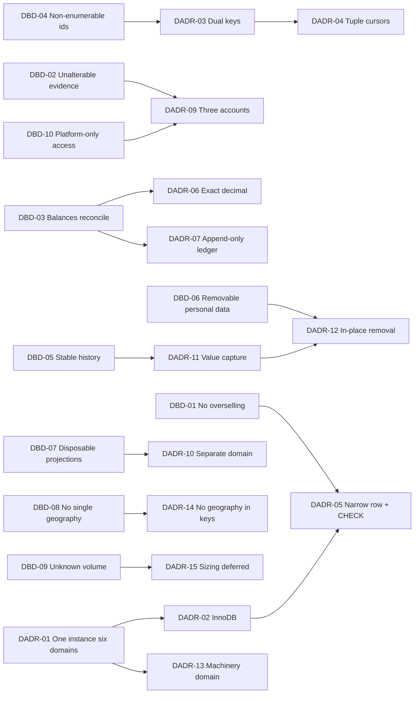
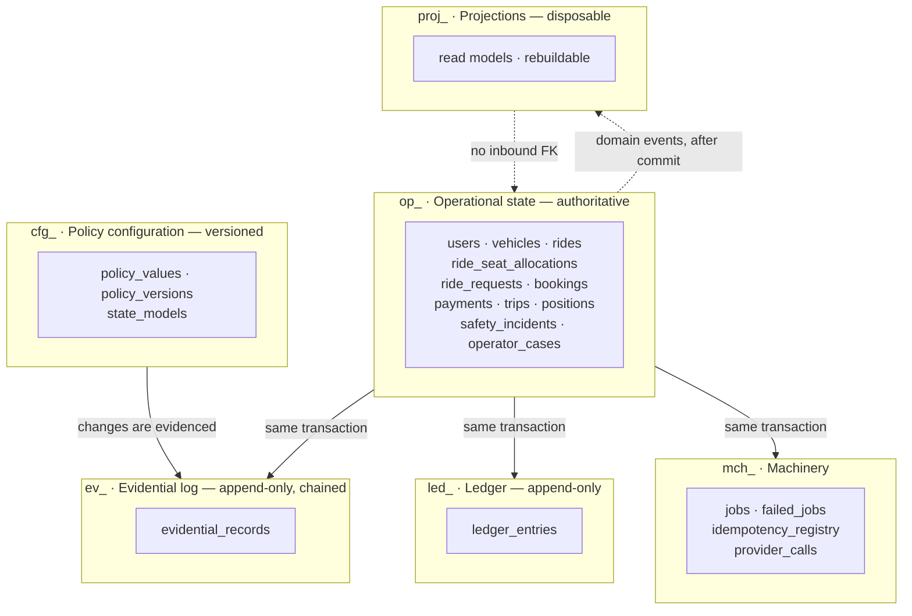
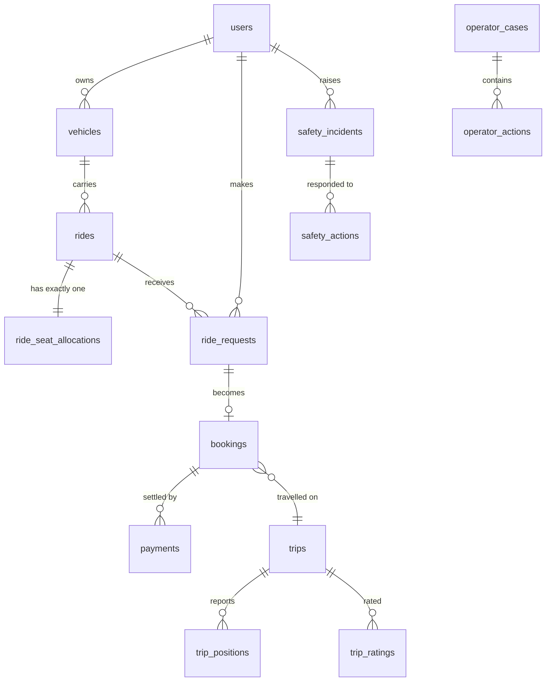
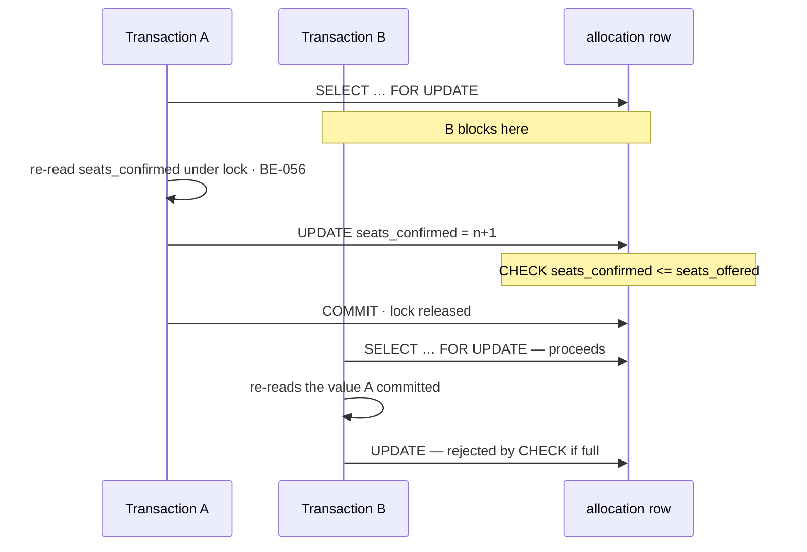
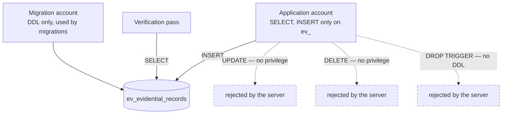
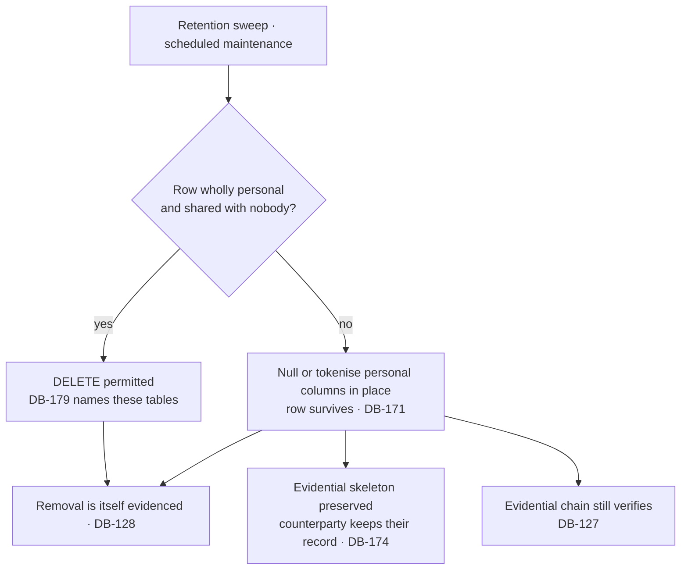

# CMP-DOC-11 — Database Design Document

**Carpool Mobility Platform (CMP)**

---

# 0. Document Control

## 0.1 Document Metadata

| Field | Value |
|---|---|
| Document ID | CMP-DOC-11 |
| Document Name | Database Design Document |
| Short Name | DATABASE |
| Project Name | Carpool Mobility Platform |
| Project Code | CMP |
| Version | 0.1 |
| Status | Draft |
| Date | 2026-08-17 |
| Author | Software Architect / Backend Lead (AI-assisted) |
| Reviewer | [TBD] |
| Approver | Project Owner |
| Classification | Internal |
| Brand | TBD |
| Previous Version | None (initial issue) |
| Predecessor Documents | CMP-DOC-01 … CMP-DOC-10, **all Draft, none approved** (CMP-DOC-09 at v0.2, the remainder at v0.1) |
| Related Documents | `00_Project_Control/README.md`, `Documentation_Index.md`, `Documentation_Status.md`, `Document_Change_Log.md`, `Glossary.md`, `Master_Traceability_Matrix.md` |
| Successor Documents | CMP-DOC-13 (Security), CMP-DOC-14 (Payment & UPI), CMP-DOC-15 (GPS / Live Trip), CMP-DOC-17 (Admin / Filament), CMP-DOC-19 (DevOps / Deployment) |

## 0.2 Revision History

| Version | Date | Author | Change | Status |
|---|---|---|---|---|
| 0.1 | 2026-08-17 | Software Architect / Backend Lead (AI-assisted) | Initial issue. Specifies the MySQL physical design: 10 data drivers, **16 database decisions**, six storage domains, schema conventions, the operational schema for nine aggregates, the seat allocation record, the ledger, the evidential log, projections, operational machinery, historical integrity, retention and removal, indexing and access paths, the integrity constraint register, migration, and backup and recovery. Issues 232 statements (`DB-001` … `DB-232`). | Draft |

## 0.3 Distribution List

| Role | Purpose |
|---|---|
| Project Owner | Approval authority |
| **Backend Lead** | Authoring and ownership |
| **Backend Developers** | **Primary consumer** |
| Software Architect — Backend | Consistency with CMP-DOC-09 |
| Solution Architect | Consistency with CMP-DOC-07 §8 |
| Security Analyst | Protected-form storage, credential separation, retention (§9.5, §13); mechanisms in CMP-DOC-13 |
| DevOps Engineer | Backup, recovery, capacity and migration (§16, §17); sizing in CMP-DOC-19 |
| QA Analyst | The integrity constraint register (§15) and its tests |
| Product Analyst | Retention categories awaiting a business decision (§13.2) |

## 0.4 Approval

| Role | Name | Signature | Date |
|---|---|---|---|
| Author | Software Architect / Backend Lead (AI-assisted) | — | 2026-08-17 |
| Reviewer | [TBD] | — | — |
| Approver | Project Owner | — | — |

> **This document is NOT approved.** It is issued at version 0.1 with status `Draft`
> for Project Owner review.

## 0.5 Purpose of This Document

CMP-DOC-09 named nine aggregates and stated what must be true of them. CMP-DOC-07 §8
said where the categories of data live. Neither said what a table is.

This document says. It specifies the MySQL physical design: the six logical storage
domains, the tables realising each aggregate, their keys, their types, their constraints,
their indexes, and the rules by which they change.

It has one governing property. **Where an absolute business rule can be enforced by the
database, it is enforced by the database** — not only by the application. CMP-DOC-09
`BADR-04` chose a pessimistic lock *and* a database constraint precisely so that a bug in
the application cannot oversell a seat, and CMP-DOC-09 §18.5 placed that on this document
as an obligation. The same reasoning produces `DADR-09`: the application is given a
database account that **cannot** update or delete an evidential record, so that the
guarantee survives a defect rather than depending on the absence of one.

## 0.6 Boundaries — What This Document Does Not Specify

| Subject | Owning document |
|---|---|
| Aggregates, invariants, repositories, transactions | CMP-DOC-09 |
| **Endpoint paths, payloads, status codes** | **CMP-DOC-10** |
| Screen design | CMP-DOC-12 |
| **Encryption algorithms, key management, hashing scheme, TLS** | **CMP-DOC-13** |
| Payment provider records and settlement structures | CMP-DOC-14 |
| Position acquisition behaviour on the device | CMP-DOC-15 |
| Notification channel records | CMP-DOC-16 |
| Administrative screens and Filament resources | CMP-DOC-17 |
| Test data and test cases | CMP-DOC-18 |
| **Instance sizing, storage volumes, replica topology, host configuration** | **CMP-DOC-19** |

### 0.6.1 The Boundary With CMP-DOC-13

This document states **which** columns hold protected data, **which** hold
non-recoverable data, and **which** database account may reach what. It states no
algorithm, no key length, no key custody arrangement and no hashing scheme. `DB-035`,
`DB-036` and §9.5 are positional statements; every mechanism behind them is CMP-DOC-13's.

### 0.6.2 The Boundary With CMP-DOC-19

This document states the **structural** requirements recovery imposes — that the engine
be transactional and crash-safe, that binary logging permit point-in-time recovery, that
the evidential account be separate. It states no instance class, no storage size, no
replica count, no backup schedule and no RPO or RTO figure, because `NFR-038` and
`NFR-039` are unset and launch scale is unknown (`GAP-016`).

## 0.7 Inputs to This Document

| Input | Contribution |
|---|---|
| CMP-DOC-09 §5.1, §8 | Nine aggregates; repository contract; data handling rules `BE-093`–`BE-104` |
| CMP-DOC-09 §18.5 | Two obligations placed explicitly on this document |
| CMP-DOC-10 §17.7 | Two obligations placed explicitly on this document |
| CMP-DOC-07 §8, §10 | `ARCH-050`–`ARCH-060`, `ARCH-110`–`ARCH-119` — data architecture |
| CMP-DOC-06 §5.4 | `SRS-REQ-083`–`SRS-REQ-102` — the Persistence element |
| CMP-DOC-05 | `NFR-125`–`NFR-132` auditability; `NFR-036`–`NFR-039` recovery |
| CMP-DOC-01 | Absolute rules the schema must make unbreakable |

## 0.8 Qualifications on This Document

### 0.8.1 Source

Every statement derives from a predecessor statement, from a decision recorded in §3, or
is disclosed in §18.6 as originating here.

### 0.8.2 Qualification 1 — Ten Unapproved Predecessors

**FACT.** CMP-DOC-01 … CMP-DOC-10 are all `Draft`. None is approved.

Recorded as conflict `CC-011` and as `DB-RISK-01`. A schema is more expensive to change
after data exists in it than any other artefact in this chain, which makes the unapproved
baseline more consequential here than it was for the documents above.

### 0.8.3 Qualification 2 — Structure Is Decidable; Sizing Is Not

**FACT.** Launch scale is unstated (`GAP-016`) and 69 quality targets are unset
(`GAP-012`).

This document decides **structure, keys, constraints and access paths**. It does not
state a row-count estimate, a storage volume, a partition count, a buffer pool size, an
RPO or an RTO, because each requires a volume figure nobody has supplied. **§14.5 records
the seven index and partitioning decisions that cannot be taken until launch scale
exists**, and states what each depends on rather than guessing.

This is the point at which `GAP-016` stops being a note and starts costing something.

### 0.8.4 Qualification 3 — No Table Is Created for Undecided Behaviour

**FACT.** CMP-DOC-04 records 29 functional gaps and three functional areas with zero
requirements. CMP-DOC-10 withheld eleven resources for the same reason.

**No table is specified for wallet, rewards, refunds, disputes, referrals, recurring
commute or fraud.** §6.11 names each and the decision blocking it. A speculative table
is worse than an absent one, because a speculative table acquires foreign keys.

### 0.8.5 Qualification 4 — Two Requirement-Chain Gaps Are Inherited

**FACT.** CMP-DOC-09 §18.7 and CMP-DOC-10 §17.6 record that payment credential handling
and injection defence have no upstream requirement.

Both reach the database. `DB-037` states that no payment instrument credential is stored
in any column, and `DB-038` that no statement is constructed by concatenation. Both are
restatements, not new sources. **CMP-DOC-13 should close the requirement gap**; tracked
here as `DB-OQ-08`.

## 0.9 Statement Classification Convention

As `README.md` §9.1. Markers: **FACT**, **ASSUMPTION**, **BUSINESS DECISION REQUIRED**,
**TECHNICAL DECISION REQUIRED**, **OPEN QUESTION**, **TBD**, **FUTURE CONSIDERATION**,
**RECOMMENDATION**.

## 0.10 Identifier Conventions

| Prefix | Element | Section |
|---|---|---|
| `DB-nnn` | **Traceable database design statement** | §4–§17 |
| `DADR-nn` | Database Decision Record | §3 |
| `DBD-nn` | Data driver | §2 |
| `DB-ASM-nn` | Assumption | §19.1 |
| `DB-RISK-nn` | Risk | §19.2 |
| `DB-OQ-nn` | Open Question | §19.3 |

`DB-nnn` is the only traceable prefix. A statement marked **‡** is integrity-critical:
its violation would permit an absolute business rule to be broken.

## 0.11 Table of Contents

| § | Title |
|---|---|
| 0 | Document Control |
| 1 | Executive Summary |
| 2 | Data Drivers |
| 3 | Database Decisions |
| 4 | Storage Domains |
| 5 | Schema Conventions |
| 6 | The Operational Schema |
| 7 | The Seat Allocation Record |
| 8 | The Ledger |
| 9 | The Evidential Log |
| 10 | Projections and Read Models |
| 11 | Operational Machinery |
| 12 | Historical Integrity |
| 13 | Retention and Removal |
| 14 | Indexing and Access Paths |
| 15 | The Integrity Constraint Register |
| 16 | Migration |
| 17 | Backup, Recovery and Capacity |
| 18 | Traceability |
| 19 | Assumptions, Risks and Open Questions |
| 20 | Acceptance Criteria for This Document |
| 21 | Statistics and Recommendations |
| A | Appendix A — Statement Index |
| B | Appendix B — Decision Index |
| C | Appendix C — Table Index |

---

# 1. Executive Summary

## 1.1 What This Document Delivers

| Element | Count |
|---|---|
| Data drivers | 10 |
| **Database Decision Records** | **16** |
| Database design statements | **232** (`DB-001` … `DB-232`) |
| Storage domains | 6 |
| Tables specified | 34 |
| Database-enforced integrity constraints | 21 |
| Database accounts | 3 |
| Tables withheld pending a decision | 7 |
| Sizing decisions deferred | 7 |
| Obligations discharged from CMP-DOC-09 and CMP-DOC-10 | 4 of 4 |

## 1.2 The Database in One Paragraph

One MySQL instance holding six logically distinct domains: operational state, the
evidential log, the ledger, projections, operational machinery and policy configuration.
Every table carries an internal monotonic surrogate key for clustering and a separate
opaque external identifier for the interface, so that InnoDB gets locality and the API
gets non-enumerability. Money is exact decimal and balances are never stored. The seat
allocation record is a single narrow row per ride, lockable on its own, carrying a
database `CHECK` constraint that makes overselling impossible even if the application is
wrong. Evidential records are append-only, hash-chained, and written by a database
account that holds no `UPDATE` or `DELETE` privilege on them — the guarantee is a grant,
not a convention. Projections are separate, rebuildable and disposable. Retention removes
personal data while leaving the evidential skeleton a counterparty is entitled to.

## 1.3 The Four Decisions That Shape Everything Else

| DADR | Decision | Why it dominates |
|---|---|---|
| **`DADR-03`** | **Dual keys**: an internal monotonic `BIGINT` surrogate for clustering and foreign keys, and a separate opaque external identifier exposed by the interface. | `API-013` and `API-014` require opaque, non-enumerable identifiers; InnoDB's clustered index wants monotonic insertion. A single random UUID primary key satisfies the first and defeats the second. Two keys satisfy both, and the internal one never leaves the platform. |
| **`DADR-05`** | The seat allocation record is **one narrow row per ride** in its own table, carrying a `CHECK` constraint. | `BADR-04` requires the row to be lockable independently of other ride attributes, and CMP-DOC-09 §18.5 requires the constraint to be in the database. A wide `rides` row would make every lock contend with every unrelated update. |
| **`DADR-09`** | The application connects as **three distinct database accounts**, one of which can insert into the evidential log but cannot update or delete it. | `BE-110` requires the application to hold no credential permitting alteration. A trigger can be dropped and a convention can be forgotten; a privilege the account does not have cannot be exercised by any code path. |
| **`DADR-12`** | Retention removal **nulls or tokenises personal columns in place** and never deletes a row that another party is entitled to as evidence. | `ARCH-058`, `ARCH-117` and `SRS-REQ-091`. Row deletion would break the evidential hash chain and destroy a counterparty's record of a shared trip. This is the structural answer to the `NFR-125` versus `NFR-131` conflict CMP-DOC-05 recorded. |

## 1.4 The Two Obligations From CMP-DOC-09 and the Two From CMP-DOC-10

| Obligation | Source | Discharged by |
|---|---|---|
| Seat constraint implemented as a database constraint, not application-only | CMP-DOC-09 §18.5 | `DADR-05`; `DB-083`, `DB-084` |
| Evidential records physically non-updatable | CMP-DOC-09 §18.5 | `DADR-09`; `DB-118`–`DB-121` |
| Identifiers opaque and non-enumerable, not sequential | CMP-DOC-10 §17.7 | `DADR-03`; `DB-021`–`DB-024` |
| A stable cursor an insertion does not disturb | CMP-DOC-10 §17.7 | `DADR-04`; `DB-025`–`DB-027` |

## 1.5 What This Document Could Not Settle

| Matter | Position |
|---|---|
| Index, partitioning and archival strategy | §14.5 — seven decisions, all needing launch scale (`GAP-016`) |
| Retention periods | §13.2 — nine categories, all `[TBD – Business Decision Required]` |
| RPO and RTO | `NFR-038`, `NFR-039` unset; §17 states structure only |
| Seven tables | §6.11 — behaviour undecided upstream |
| Monetary precision | `DB-032` — depends on the largest plausible amount, which needs a scale figure |

---

# 2. Data Drivers

| ID | Driver | Source | Consequence |
|---|---|---|---|
| `DBD-01` | Seats must never be oversold, even if the application is defective. | `BAD-RULE-027`, CMP-DOC-09 §18.5 | `DADR-05`: narrow lockable row with a `CHECK` constraint. |
| `DBD-02` | Evidential records must be unalterable, not merely un-altered. | `NFR-129`, `BE-110` | `DADR-09`: privilege separation, not a trigger. |
| `DBD-03` | Balances must reconcile exactly to their entries. | `NFR-127`, `ARCH-111` | `DADR-07`: append-only ledger, no stored balance, exact decimal. |
| `DBD-04` | Identifiers leaving the platform must not be enumerable. | `API-013`, `API-014` | `DADR-03`: dual keys. |
| `DBD-05` | A historical record must not change when a referenced entity does. | `SRS-REQ-089`, `ARCH-057` | `DADR-11`: value capture at completion, not foreign keys alone. |
| `DBD-06` | Personal data must be removable without destroying shared evidence. | `SRS-REQ-091`, `ARCH-058` | `DADR-12`: in-place removal, never row deletion. |
| `DBD-07` | Projections must be disposable. | `ARCH-113`, `BE-128` | `DADR-10`: separate domain, no foreign key into it. |
| `DBD-08` | The design must not assume one city or corridor. | `SRS-REQ-101`, `NFR-052` | `DADR-14`: no geography in a key, a name or a partition. |
| `DBD-09` | Volume is unknown, so the design must be able to grow without redesign. | `GAP-016` | `DADR-15`: sizing decisions named and deferred, not guessed. |
| `DBD-10` | The database must be reachable only from the platform. | `ARCH-010`, `BE-104` | `DADR-09`: no account is issued to any other component. |

---

# 3. Database Decisions

Each decision records its context, the alternatives considered, and its consequences
**including the negative ones**, marked ✘.

## 3.1 `DADR-01` — One MySQL Instance, Six Logical Domains

| | |
|---|---|
| **Context** | `ARCH-050` requires operational state, the evidential log, the job store, the idempotency registry, projections and policy configuration to be logically distinct within MySQL. `ARCH-110` restates it. Distinct does not have to mean separate servers, and separate servers would break the atomicity `BE-048` and `BE-049` require. |
| **Decision** | **One MySQL instance and one schema, with six domains distinguished by a table-name prefix and by grant. Cross-domain foreign keys are permitted only from operational state to itself; no domain may hold a foreign key into projections.** |
| **Alternatives** | *(a)* Six schemas — rejected: cross-schema transactions work in MySQL but complicate grants and migrations for no isolation gain. *(b)* Separate instances for the evidential log — rejected: `BE-049` requires the operation and its evidential record to commit together, which a second instance makes impossible without distributed transactions. |
| **Consequences** | ✔ Atomicity across an operation and its evidence is a plain local transaction. ✔ Domains remain separable later, because the prefix and the grants already exist. ✘ One instance is one failure domain. ✘ Discipline is required to keep the domains from growing references to one another; `DB-013` states the rule and §15 tests it. |

## 3.2 `DADR-02` — InnoDB, Transactional and Crash-Safe

| | |
|---|---|
| **Context** | `BE-047`–`BE-055` require transactions, row-level locking and `SELECT … FOR UPDATE`. `NFR-038` requires bounded data loss. |
| **Decision** | **Every table shall use a transactional, crash-safe, row-locking storage engine — InnoDB. No table shall use a non-transactional engine for any reason, including logging or staging.** |
| **Alternatives** | *(a)* A non-transactional engine for high-write tables such as position history — rejected: silently breaks `BE-053`'s no-partial-effect guarantee for anything sharing a transaction with it. |
| **Consequences** | ✔ Row locking, foreign keys and crash recovery are uniform. ✔ `BADR-04`'s pessimistic lock is available. ✘ Higher write cost on position history than a non-transactional engine; §14.5 records this as a sizing decision rather than resolving it by weakening the engine. |

## 3.3 `DADR-03` — Dual Keys: Internal Surrogate, External Opaque

| | |
|---|---|
| **Context** | `API-013` requires exposed identifiers to be opaque and to encode no meaning; `API-014` requires them to be non-enumerable. InnoDB clusters rows on the primary key, so a random primary key scatters insertions and fragments the index. Both constraints are real and they pull opposite ways. |
| **Decision** | **Every table has an internal `BIGINT UNSIGNED AUTO_INCREMENT` primary key used for clustering, foreign keys and cursors, and — where the entity is exposed — a separate indexed, unique, random external identifier column. The internal key is never returned by the interface and never appears in a URI, a payload or a log the caller sees.** |
| **Alternatives** | *(a)* Random UUID as primary key — rejected: defeats clustered-index locality on every table and inflates every foreign key. *(b)* Time-ordered identifier (ULID or UUIDv7) as the single key — rejected: monotonic by construction, therefore enumerable, therefore fails `API-014`. *(c)* Sequential public identifier with authorisation as the only defence — rejected: `API-014` requires that enumeration be impossible, not merely unauthorised. |
| **Consequences** | ✔ Both constraints are satisfied without compromise. ✔ Cursors are cheap and stable (`DADR-04`). ✘ Two keys per exposed table: an extra unique index, extra storage, and a lookup by external identifier on every inbound request. ✘ A developer may expose the internal key by accident; `DB-024` makes that a reviewable rule and §15 tests representative endpoints. |

## 3.4 `DADR-04` — Cursors Are (Sort Key, Internal Id) Tuples

| | |
|---|---|
| **Context** | CMP-DOC-10 §17.7 obliges this document to support a cursor an insertion does not disturb. `API-112` requires cursor paging; `API-113` requires the cursor to be opaque; `API-116` requires a total ordering. Offset paging shifts a boundary whenever a row is inserted before it. |
| **Decision** | **A cursor encodes the ordering column's value together with the internal surrogate key, opaquely. The internal key breaks every tie, making the ordering total. Because the surrogate is monotonic and never reused, a row inserted after the page was read sorts after the cursor and cannot displace a boundary.** |
| **Alternatives** | *(a)* Offset and limit — rejected: an insertion shifts every subsequent page, so a caller both skips and repeats rows. *(b)* Timestamp-only cursor — rejected: timestamps collide, so the ordering is not total and rows are lost at the boundary. |
| **Consequences** | ✔ Stable paging with an index seek rather than a scan. ✔ Every ordering becomes total for free. ✘ Cursors cannot jump to an arbitrary page, only forward and backward. ✘ Every paged access path needs a composite index ending in the surrogate key; `DB-190` states this. |

## 3.5 `DADR-05` — The Allocation Record Is a Narrow Row With a Constraint

| | |
|---|---|
| **Context** | `BADR-04` chose a pessimistic lock and a database constraint. `ARCH-053` requires the allocation record to be lockable independently of other ride attributes. CMP-DOC-09 §18.5 requires the constraint to be in the database, not application-only. `BAD-RULE-027` is absolute. |
| **Decision** | **`ride_seat_allocations` holds one row per ride with the ride reference, seats offered, seats confirmed and a version, and nothing else. It carries `CHECK (seats_confirmed >= 0 AND seats_confirmed <= seats_offered)`. Allocation locks this row; no other operation on the ride touches it.** |
| **Alternatives** | *(a)* Columns on `rides` — rejected: locking the allocation would lock the ride, so amending a description would contend with a booking. *(b)* Derive confirmed seats by counting bookings — rejected: the count is not lockable as a value, so two transactions can both count correctly and both proceed. *(c)* Application-only enforcement — rejected explicitly by CMP-DOC-09 §18.5. |
| **Consequences** | ✔ Overselling is impossible even with a defective application — the constraint rejects the write. ✔ Lock scope is one narrow row, so contention is confined to concurrent bookings on the same ride. ✘ A second table and a second write on every booking. ✘ **The constraint is only enforced if the deployed MySQL version enforces `CHECK`.** `DB-085` makes that a deployment requirement and §15 tests it at migration time rather than trusting it. |

## 3.6 `DADR-06` — Exact Decimal Money, No Stored Balances

| | |
|---|---|
| **Context** | `BE-095` prohibits floating-point storage; `NFR-127` requires every balance to reconcile exactly to its entries; `ARCH-111` requires balances to be derived and never stored independently. |
| **Decision** | **Every monetary column is `DECIMAL` with a scale equal to the currency's smallest indivisible unit. No table holds a balance, a total or a running sum as a persisted column. Balances are computed from ledger entries at read time, and where that becomes costly the answer is a projection (§10), never a stored balance.** |
| **Alternatives** | *(a)* Integer minor units — accepted as equivalent in exactness but rejected for legibility: every query and every report would carry a scaling factor, and a forgotten one is a hundredfold error. *(b)* Stored balance with a reconciliation job — rejected: `ARCH-111` forbids it, and the job would be discovering a divergence that the design permitted. |
| **Consequences** | ✔ `NFR-127` is structural: a balance cannot disagree with its entries because it is not stored. ✔ Rounding is explicit wherever it occurs. ✘ Balance reads cost an aggregation. ✘ **Precision is `[TBD – Technical Decision Required]`** — it depends on the largest plausible amount, which depends on scale figures nobody has supplied (`DB-032`). |

## 3.7 `DADR-07` — The Ledger Is Append-Only and Double-Entry in Effect

| | |
|---|---|
| **Context** | `NFR-128` requires every entry attributable to an identified party and an identified event. `BE-096` prohibits deleting financial records and requires correction by compensating entry. `ARCH-112` restates attribution. |
| **Decision** | **`ledger_entries` is append-only. Every entry names a party, an event, a direction and an amount, and every movement of value produces balanced entries summing to zero across its parties. A correction is a new compensating entry referencing the original, never an update.** |
| **Alternatives** | *(a)* Single-sided entries — rejected: nothing then constrains the books to balance, and `NFR-127` becomes an aspiration. *(b)* Mutable entries with an audit trail — rejected: `BE-096`. |
| **Consequences** | ✔ Every balance is derivable and every correction is visible. ✔ A reconciliation sweep has something definite to check (`DB-105`). ✘ Corrections are more verbose than edits. ✘ The ledger grows monotonically; archival is a sizing decision (§14.5). |

## 3.8 `DADR-08` — Route Geometry Stored With the Ride, Spatially Indexed

| | |
|---|---|
| **Context** | `ARCH-051` requires geometry resolved once at publication and stored with the ride. `ARCH-052` requires a spatially indexed representation supporting the coarse filter. `ARCH-081` structures search as a coarse phase then a precise phase. |
| **Decision** | **The ride carries its resolved route geometry and a derived bounding envelope. The envelope is spatially indexed and serves the coarse filter; the full geometry serves the precise overlap computation and is never scanned without the coarse filter first.** |
| **Alternatives** | *(a)* Re-resolve geometry per search — rejected: `NFR-021` bounds external routing calls per search, and re-resolution would breach it immediately. *(b)* Index the full geometry — rejected: the coarse filter exists precisely so that the expensive representation is touched rarely. |
| **Consequences** | ✔ The two-phase search has a physical realisation. ✔ Route resolution cost is paid once per ride. ✘ Geometry is duplicated per ride rather than shared between rides on the same corridor. ✘ Amending a ride must invalidate the stored geometry (`API-137`, `DB-055`). |

## 3.9 `DADR-09` — Three Database Accounts, One Unable to Alter Evidence

| | |
|---|---|
| **Context** | `BE-110` requires the application to hold no credential permitting update or deletion on the evidential store. `NFR-129` requires alteration to be undetectable-proof. CMP-DOC-09 §18.5 requires evidential records to be physically non-updatable. A trigger enforces this only until someone drops the trigger, and a code convention only until someone forgets it. |
| **Decision** | **Three accounts. The *application* account holds `SELECT`, `INSERT`, `UPDATE`, `DELETE` on operational, projection and machinery domains, and `SELECT`, `INSERT` only on the evidential and ledger domains — no `UPDATE`, no `DELETE`, no `DDL`. The *migration* account holds `DDL` and is used only by migrations. The *read* account holds `SELECT` and is used for reporting. No account is issued to any component other than the platform.** |
| **Alternatives** | *(a)* Triggers rejecting `UPDATE` and `DELETE` — rejected as the sole mechanism: a trigger is `DDL` and the application account would need `DDL` to run migrations, so it could drop it. Retained as a second layer only. *(b)* Application-level discipline — rejected: `BE-110` asks for the absence of a credential, which is a stronger and cheaper claim. |
| **Consequences** | ✔ No application code path can alter an evidential record, whatever the defect. ✔ The claim is verifiable by inspecting a grant rather than by reading every line. ✘ Three connection configurations to manage; a migration needs a deliberate switch. ✘ A correction to a mistaken evidential record is impossible by design — which is the point, and is why `DB-124` requires corrections to be new records. |

## 3.10 `DADR-10` — Projections Are a Separate Domain With No Inbound References

| | |
|---|---|
| **Context** | `ARCH-113` requires projections rebuildable without loss; `ARCH-114` requires their loss to degrade performance and never correctness; `BE-128` calls them disposable. A foreign key from operational state into a projection would make a disposable thing undroppable. |
| **Decision** | **Projections live in their own prefixed domain. No table outside that domain holds a foreign key into it. A projection may be truncated and rebuilt at any time without a schema change and without affecting any other domain.** |
| **Alternatives** | *(a)* Projections as views — rejected: a view does not decouple read cost from write contention, which is the reason projections exist. *(b)* Projections in operational tables as denormalised columns — rejected: makes them undroppable and puts stale data one join away from a business decision, which `BE-121` forbids. |
| **Consequences** | ✔ Rebuild is a truncate and a replay. ✔ `ARCH-114` is structural. ✘ Reads that mix authoritative and projected data must do so in the application, not in a join. ✘ Which projections exist is still `[TBD – Technical Decision Required]` (`BE-129`), so §10 specifies the pattern and two instances rather than an inventory. |

## 3.11 `DADR-11` — Completed Trips Capture Values, Not Only References

| | |
|---|---|
| **Context** | `SRS-REQ-089` requires that a change to a referenced entity not mutate a historical record. `ARCH-057` requires a completed trip record to capture referenced entity values as at the time of travel. `NFR-126` requires it to identify participants, route, payment and outcome. A foreign key to a mutable `users` row does not satisfy any of these. |
| **Decision** | **On completion, the trip record captures the values it must preserve — participant names as shown, vehicle description, route as travelled, fare and payment outcome — alongside the references. The references remain for navigation; the captured values are what the record means.** |
| **Alternatives** | *(a)* Full temporal versioning of every referenced entity — rejected: correct but disproportionate, and it makes retention removal far harder. *(b)* References only — rejected: fails `SRS-REQ-089` outright. |
| **Consequences** | ✔ A completed trip means the same thing a year later. ✔ Retention can remove the live personal record while the captured evidence a counterparty is entitled to survives (`DADR-12`). ✘ Duplication between live and captured values. ✘ Captured personal values are themselves personal data and are in scope for retention; `DB-176` states which are removable and which are not. |

## 3.12 `DADR-12` — Retention Removes In Place, Never by Row Deletion

| | |
|---|---|
| **Context** | CMP-DOC-05 recorded the conflict directly: `NFR-125` requires a durable record for every ride, request, booking, payment, trip, safety incident and operator action, and `NFR-131` requires personal data to be removed on its retention period. `SRS-REQ-091` forbids removal destroying a record another party needs as evidence. `ARCH-117` forbids breaking the evidential chain. Deleting a row satisfies the second and breaks the other three. |
| **Decision** | **Retention removal nulls or tokenises the personal columns of a row and records that it did so. It never deletes a row that participates in a shared record or in the evidential chain. Where a row is wholly personal and shared with nobody — a position history point, for instance — deletion is permitted and `DB-179` names those tables explicitly.** |
| **Alternatives** | *(a)* Delete rows and accept chain gaps — rejected: `ARCH-117`. *(b)* Retain everything — rejected: `NFR-131`. *(c)* Move to an archive schema — rejected: relocates the conflict without resolving it. |
| **Consequences** | ✔ Both requirements are met rather than one being sacrificed. ✔ The evidential chain survives, and a counterparty keeps their trip record. ✘ Rows persist after their subject is removed, so row counts do not fall. ✘ **Every retention period is `[TBD – Business Decision Required]`** (`BAD-DEC-021`), so §13.2 names nine categories and sets none. |

## 3.13 `DADR-13` — Idempotency and Job State Are Machinery, Not Domain

| | |
|---|---|
| **Context** | `BE-051` requires the idempotency registry entry written in the same transaction as the effect. `BADR-07` puts jobs in the database. `ARCH-050` lists both as distinct from operational state. |
| **Decision** | **The idempotency registry and the job store live in the machinery domain. The registry is written in the same transaction as the effect it guards, which is possible because it is the same instance. Neither holds a foreign key into operational state, so machinery can be pruned without cascade.** |
| **Alternatives** | *(a)* Registry rows in each operational table — rejected: repeats the mechanism per table and makes retention of it inconsistent. *(b)* Registry outside the database — rejected: `BE-051` becomes impossible. |
| **Consequences** | ✔ One mechanism, one retention rule, atomic with its effect. ✔ Machinery is prunable independently. ✘ No referential integrity between a registry entry and the row it created; the link is by recorded identifier only. ✘ Registry retention duration is a tuning value (`API-069`) and remains unset. |

## 3.14 `DADR-14` — No Geography in Any Key, Name or Partition

| | |
|---|---|
| **Context** | `SRS-REQ-101` and `NFR-052` require that no capacity-bearing structure assume a single corridor, city or region. A city column in a partition key or a table named for a launch city is the classic way this is violated on day one and discovered in year two. |
| **Decision** | **No table name, primary key, partition key or unique constraint shall incorporate a city, corridor, region or market. Geography is ordinary indexed data.** |
| **Alternatives** | *(a)* Partition by city for locality — rejected: the assumption becomes structural and unpicking it means a migration of every partitioned table. |
| **Consequences** | ✔ A second market is data, not a migration. ✔ `NFR-052` is enforceable by inspection. ✘ Forgoes a locality optimisation that might genuinely help at scale; `DB-198` records it as available later if measurement justifies it. |

## 3.15 `DADR-15` — Sizing Decisions Are Named and Deferred, Not Guessed

| | |
|---|---|
| **Context** | `GAP-016` — launch scale is unstated. Index selection beyond the access paths, partitioning, archival and read-replica use all depend on volume and read-write mix. CMP-DOC-07 already deferred 11 sizing decisions to CMP-DOC-19; this document must not quietly resolve them by choosing a number. |
| **Decision** | **Indexes required by a stated access path are specified here (§14.1–§14.4). Indexes, partitions, archival boundaries and replica strategy that depend on volume are named in §14.5 with what each needs, and none is chosen.** |
| **Alternatives** | *(a)* Choose defaults now — rejected: an index chosen without measurement is as likely to cost writes as to save reads, and it is harder to remove than to add. |
| **Consequences** | ✔ Nothing is invented, and the seven decisions are visible rather than implicit. ✔ Each names its blocker, so resolving `GAP-016` unblocks them mechanically. ✘ CMP-DOC-19 inherits seven open decisions. ✘ The first performance problem will be met without a plan, only with a list. |

## 3.16 `DADR-16` — The Interface Version Is Recorded Only Where Interpretation Depends On It

| | |
|---|---|
| **Context** | `SRS-REQ-102` requires Persistence to record the interface version under which each record was created **where the record's interpretation may change between versions**. `SRS-OQ-008` routes the question here. Recording it everywhere is cheap per row and expensive in aggregate; recording it nowhere loses the ability to interpret an old record. |
| **Decision** | **The interface version is recorded on rows created directly from an inbound request whose meaning is version-dependent: bookings, payments, ride publications and safety incidents. It is not recorded on projections, machinery, ledger entries or evidential records, whose interpretation is fixed by this design rather than by the interface.** |
| **Alternatives** | *(a)* Every table — rejected: a column on the highest-volume tables, including position history, for no interpretive benefit. *(b)* No table — rejected: `SRS-REQ-102` and the loss is unrecoverable once a version is retired. |
| **Consequences** | ✔ `SRS-OQ-008` is answered, with a stated rule rather than a blanket. ✔ An old booking remains interpretable after its version is retired. ✘ The judgement "interpretation may change" must be applied whenever a table is added; `DB-040` makes it a review question. |

## 3.17 Driver to Decision Map

---

# 4. Storage Domains

| ID | Statement | Src |
|---|---|---|
| `DB-001` | The platform shall use one MySQL instance and one schema. | `DADR-01`, `ARCH-014` |
| `DB-002` | Tables shall be assigned to exactly one of six domains, identified by name prefix: `op_`, `led_`, `ev_`, `proj_`, `mch_`, `cfg_`. | `DADR-01`, `ARCH-050` |
| `DB-003` ‡ | Authoritative state shall reside in `op_` and in no other domain. | `BE-093`, `ARCH-110` |
| `DB-004` ‡ | Evidential records shall reside in `ev_` and shall be written only by the evidential writer. | `BE-105`, `ARCH-041` |
| `DB-005` ‡ | Movements of value shall be recorded in `led_` and nowhere else. | `ARCH-112`, `NFR-128` |
| `DB-006` | Derived read models shall reside in `proj_`. | `DADR-10`, `ARCH-113` |
| `DB-007` | Job state, the idempotency registry and provider call records shall reside in `mch_`. | `DADR-13`, `BADR-07` |
| `DB-008` | Policy configuration shall reside in `cfg_`. | `ARCH-146`, `BADR-12` |
| `DB-009` ‡ | Every table shall use the InnoDB storage engine. | `DADR-02` |
| `DB-010` | The schema and every table shall use a Unicode character set covering the full range, with a deterministic collation. | `DADR-01`, `NFR-052` |
| `DB-011` ‡ | An operation and its evidential record shall be committable in one local transaction, which requires them to share an instance. | `BE-049`, `DADR-01` |
| `DB-012` ‡ | No table outside `proj_` shall hold a foreign key into `proj_`. | `DADR-10`, `ARCH-114` |
| `DB-013` | No table in `mch_` shall hold a foreign key into `op_`; the association shall be by recorded identifier. | `DADR-13` |
| `DB-014` | Domain membership shall be verifiable from the table name alone, and shall be checked at migration time. | `DB-002`, `DB-216` |

---

# 5. Schema Conventions

## 5.1 Naming

| ID | Statement | Src |
|---|---|---|
| `DB-015` | Table names shall be lower snake case, prefixed by domain, and plural. | `DADR-01` |
| `DB-016` | Column names shall be lower snake case and singular. | `DB-015` |
| `DB-017` | A foreign key column shall be named for the referenced entity followed by `_id`. | `DB-016` |
| `DB-018` | Index names shall state their table and their columns, so that a duplicate index is visible by name. | `DB-190` |
| `DB-019` | Constraint names shall state the rule they enforce, so that a violation message names the rule. | `DB-203` |
| `DB-020` ‡ | No table, column, index or constraint name shall incorporate a city, corridor, region or market. | `DADR-14`, `SRS-REQ-101` |

## 5.2 Keys and Identifiers

| ID | Statement | Src |
|---|---|---|
| `DB-021` | Every table shall have a `BIGINT UNSIGNED AUTO_INCREMENT` primary key used for clustering and foreign keys. | `DADR-03` |
| `DB-022` ‡ | Every entity exposed through the interface shall additionally carry a unique, indexed, randomly generated external identifier. | `DADR-03`, `API-013` |
| `DB-023` ‡ | The external identifier shall be generated with sufficient entropy that enumeration is infeasible, and shall encode no meaning, no sequence and no timestamp. | `API-014`, `DADR-03` |
| `DB-024` ‡ | The internal primary key shall never be returned by the interface, appear in a URI, or appear in a record a caller can read. | `DADR-03`, `API-013` |
| `DB-025` | Cursor paging shall order by the access path's ordering column followed by the internal primary key. | `DADR-04`, `API-112` |
| `DB-026` ‡ | The internal primary key shall be monotonic and shall never be reused, so that a cursor boundary cannot be displaced by an insertion. | `DADR-04`, `API-112` |
| `DB-027` | A cursor shall be opaque to the caller and shall not be constructible by them. | `API-113`, `DADR-04` |
| `DB-028` | A natural key shall be enforced by a unique constraint where one exists, and shall not be used as a primary key. | `DADR-03` |
| `DB-029` | Foreign keys shall be declared and enforced by the database, within `op_`. | `DADR-01`, `DB-012` |
| `DB-030` ‡ | No foreign key shall cascade a delete into a record another party is entitled to as evidence. | `DADR-12`, `SRS-REQ-091` |

## 5.3 Types

| ID | Statement | Src |
|---|---|---|
| `DB-031` ‡ | Monetary columns shall be `DECIMAL` with a scale equal to the currency's smallest indivisible unit. | `DADR-06`, `BE-095` |
| `DB-032` | Monetary precision is `[TBD – Technical Decision Required]`; it depends on the largest plausible amount, which depends on scale figures not yet supplied. | `DADR-06`, `GAP-016` |
| `DB-033` ‡ | No monetary value shall be stored in a floating-point type under any circumstance. | `BE-095`, `API-016` |
| `DB-034` | Timestamps shall be stored in a single time zone reference and shall record the instant, not a local wall-clock reading. | `API-015` |
| `DB-035` ‡ | Columns holding identity evidence or payment-related data shall be marked as protected; the protection mechanism is CMP-DOC-13's. | `ARCH-059`, `SRS-REQ-097` |
| `DB-036` ‡ | Columns holding authentication credentials shall be non-recoverable; the scheme is CMP-DOC-13's. | `ARCH-060`, `SRS-REQ-098` |
| `DB-037` ‡ | No column shall store a payment instrument credential in any form, protected or otherwise. | `BE-097`, `API-053` |
| `DB-038` ‡ | No statement shall be constructed by concatenating a caller-supplied value; every value shall be bound. | `BE-102`, `API-109` |
| `DB-039` | An enumerated column whose value set is a business decision shall not be a database `ENUM`; it shall reference policy configuration. | `BADR-13`, `ARCH-037` |
| `DB-040` | The interface version shall be recorded on a table where the record's interpretation may change between versions, and this question shall be answered whenever a table is added. | `DADR-16`, `SRS-REQ-102` |

---

# 6. The Operational Schema

## 6.1 Coverage

The nine aggregates of CMP-DOC-09 `BADR-02` are realised by the tables below. **Only
behaviour CMP-DOC-04 specified is given a table**; §6.11 names what is withheld.

## 6.2 `op_users` and Identity

| Table | Purpose |
|---|---|
| `op_users` | The person. Profile, contact, verification standing, account state. |
| `op_user_verifications` | Verification attempts and outcomes per channel. |
| `op_user_credentials` | Non-recoverable authentication material. |
| `op_user_emergency_contacts` | Nominated contacts. |
| `op_sessions` | Established sessions and their termination. |

| ID | Statement | Src |
|---|---|---|
| `DB-041` ‡ | Verification standing shall be a column on `op_users` written only by the platform, and shall have no inbound write path from the interface. | `BAD-RULE-006`, `API-125` |
| `DB-042` ‡ | Authentication material shall be held in `op_user_credentials` in non-recoverable form and shall never appear on `op_users`. | `SRS-REQ-098`, `DB-036` |
| `DB-043` | Verification attempts shall be retained with their outcome so that an attempt limit is enforceable against state rather than against memory. | `FRD-FR-011`, `API-126` |
| `DB-044` ‡ | A terminated session shall be recorded as terminated and shall not be removed, so that reuse is detectable rather than merely impossible. | `NFR-054`, `API-103` |
| `DB-045` | Account state shall reference policy configuration rather than a database `ENUM`. | `DB-039`, `BAD-RULE-010` |
| `DB-046` | Account closure treatment shall be `[TBD – Business Decision Required]`; the schema supports state change and retention marking, and prescribes neither. | `SRS-REQ-092`, `BAD-DEC-021` |

## 6.3 `op_vehicles`

| ID | Statement | Src |
|---|---|---|
| `DB-047` ‡ | Lawful seating capacity shall be a column written only by the platform. | `BAD-RULE-017`, `API-132` |
| `DB-048` ‡ | A vehicle row shall not be deleted where it is referenced by a ride; withdrawal shall be a state change. | `DB-030`, `API-133` |
| `DB-049` | Vehicle documentation references shall be held as protected columns. | `DB-035` |

## 6.4 `op_rides`

| Table | Purpose |
|---|---|
| `op_rides` | The published ride: driver, vehicle, origin, destination, departure, state. |
| `op_ride_routes` | Resolved geometry and derived bounding envelope, one per ride. |
| `op_ride_preferences` | Declared preference positions. |
| `op_ride_seat_allocations` | §7 — its own section. |

| ID | Statement | Src |
|---|---|---|
| `DB-050` ‡ | Seats offered shall be held on the allocation record, not on `op_rides`, so that it is lockable independently. | `DADR-05`, `ARCH-053` |
| `DB-051` | Resolved route geometry shall be stored once at publication in `op_ride_routes`. | `ARCH-051`, `DADR-08` |
| `DB-052` | A derived bounding envelope shall be stored alongside the geometry and spatially indexed. | `ARCH-052`, `DADR-08` |
| `DB-053` | The coarse filter shall use the spatial index; the precise overlap computation shall read the full geometry only for coarse-filter survivors. | `ARCH-081`, `DADR-08` |
| `DB-054` | An undeclared preference shall be stored as undeclared and shall never default to a permissive or restrictive value. | `FRD-FR-062` |
| `DB-055` | Amending a ride shall invalidate its stored route geometry. | `ARCH-096`, `API-137` |
| `DB-056` ‡ | A ride carrying a confirmed booking shall not be deletable; withdrawal shall be a state change and shall be refused where `FRD-FR-070` applies. | `FRD-FR-070`, `API-139` |
| `DB-057` | Ride state shall reference policy configuration rather than a database `ENUM`. | `DB-039` |
| `DB-058` | The interface version shall be recorded on `op_rides`. | `DADR-16` |

## 6.5 `op_ride_requests` and `op_bookings`

| ID | Statement | Src |
|---|---|---|
| `DB-059` ‡ | A booking shall carry the fare computed by the platform, and no column shall accept a caller-supplied amount. | `BE-032`, `API-150` |
| `DB-060` ‡ | A booking shall not reach a confirmed state without a verified payment; the rule is enforced by the application and the state model, and the schema shall carry the payment reference that makes it checkable. | `BE-025`, `BAD-RULE-028` |
| `DB-061` | Booking state and ride-request state shall reference policy configuration. | `DB-039`, `BAD-RULE-031` |
| `DB-062` | Whether and for how long seats are held during request and payment is `[TBD – Business Decision Required]`; the schema carries a hold expiry column that remains unused until the rule exists. | `BAD-RULE-030`, `API-147` |
| `DB-063` | The interface version shall be recorded on `op_bookings`. | `DADR-16` |
| `DB-064` ‡ | Cancellation consequence is undecided (`GAP-008`, `GAP-009`); the schema records that a cancellation occurred, by whom and when, and records **no monetary effect**, because none is defined. | `GAP-008`, `GAP-009` |

## 6.6 `op_payments`

| ID | Statement | Src |
|---|---|---|
| `DB-065` ‡ | Payment status shall permit exactly three values — verified, failed, pending — enforced by a `CHECK` constraint, because the three are fixed by `SRS-REQ-155` and are not a business decision. | `BE-026`, `SRS-REQ-155` |
| `DB-066` ‡ | Payment status shall have no inbound write path from the interface. | `BAD-RULE-033`, `API-153` |
| `DB-067` ‡ | Every payment attempt and its verified outcome shall be recorded, and an attempt row shall never be updated to hide a prior attempt. | `FRD-FR-134`, `BE-096` |
| `DB-068` ‡ | No column shall hold a payment instrument credential, a token exchangeable for one, or a provider response body containing either. | `DB-037`, `BE-097` |
| `DB-069` | The provider reference shall be stored so that a verification can be re-initiated by the platform without a callback. | `ARCH-127`, `API-182` |
| `DB-070` | The interface version shall be recorded on `op_payments`. | `DADR-16` |

## 6.7 `op_trips` and Position History

| Table | Purpose |
|---|---|
| `op_trips` | The journey: state, actual start, completion, captured values. |
| `op_trip_participants` | Participant per trip, with captured values. |
| `op_trip_positions` | Position reports during an active trip. |
| `op_trip_ratings` | Ratings recorded after completion. |

| ID | Statement | Src |
|---|---|---|
| `DB-071` ‡ | A trip shall not start without at least one confirmed booking; the schema shall carry the booking references that make the rule checkable. | `BE-028`, `API-159` |
| `DB-072` ‡ | A completed trip shall capture participants, route as travelled, fare and payment outcome as values, not references alone. | `DADR-11`, `NFR-126` |
| `DB-073` ‡ | Position history shall be held in its own table, separable from the trip record so that it can be removed independently. | `ARCH-119`, `DB-179` |
| `DB-074` | A position row shall carry the instant of acquisition, distinct from the instant of receipt. | `ARCH-094`, `API-161` |
| `DB-075` | Trip state shall reference policy configuration. | `DB-039` |
| `DB-076` | Position history is the highest-volume table in the design; its retention, partitioning and archival are named in §14.5 and are unresolved. | `SRS-REQ-093`, `GAP-016` |

## 6.8 `op_safety_incidents`

| ID | Statement | Src |
|---|---|---|
| `DB-077` ‡ | A safety incident shall be insertable with partial context, so that no validation failure on a non-essential column can lose a signal. | `FRD-FR-187`, `API-164` |
| `DB-078` ‡ | Missing context shall be recorded as missing, and shall be distinguishable from context that was absent in fact. | `FRD-FR-187`, `API-165` |

## 6.9 `op_operator_cases`

Operator cases, actions and outcomes. Administrative screen composition is CMP-DOC-17's;
the tables exist here because `NFR-125` requires a durable record of every operator
action.

## 6.10 Tables Realising the Nine Aggregates

| Aggregate | Tables |
|---|---|
| `User` | `op_users`, `op_user_verifications`, `op_user_credentials`, `op_user_emergency_contacts`, `op_sessions` |
| `Vehicle` | `op_vehicles` |
| `Ride` (owning `SeatAllocation`) | `op_rides`, `op_ride_routes`, `op_ride_preferences`, `op_ride_seat_allocations` |
| `RideRequest` | `op_ride_requests` |
| `Booking` | `op_bookings` |
| `Payment` | `op_payments`, `op_payment_attempts` |
| `Trip` | `op_trips`, `op_trip_participants`, `op_trip_positions`, `op_trip_ratings` |
| `SafetyIncident` | `op_safety_incidents`, `op_safety_actions` |
| `OperatorCase` | `op_operator_cases`, `op_operator_actions` |

## 6.11 Tables Withheld

**FACT.** No table is specified for the following. Each would require behaviour no
document above this one has decided.

| Table that would be needed | Blocked by |
|---|---|
| Wallet accounts and entries | Wallet behaviour undecided — CMP-DOC-03 Outlined |
| Reward accrual and redemption | Reward scheme undecided |
| Refunds and returns of value | `GAP-009` — **Critical** |
| Disputes and claims | No specified behaviour |
| Referrals | Undecided |
| Recurring ride series | `BAD-DEC-008` — **the whole area carries zero functional requirements** |
| Fraud signals and cases | `GAP-013` — **unowned through eleven documents** |

> **A speculative table is worse than an absent one.** An absent table is a gap somebody
> notices. A speculative table acquires foreign keys, then data, then a migration cost —
> and it encodes a guess about behaviour nobody has decided.

---

# 7. The Seat Allocation Record

This section discharges the first obligation CMP-DOC-09 §18.5 placed on this document.

## 7.1 Structure

`op_ride_seat_allocations` — one row per ride, and nothing on it that is not needed to
decide a seat.

| Column | Purpose |
|---|---|
| internal key | Clustering |
| ride reference | Unique — exactly one row per ride |
| seats offered | Set at publication from the vehicle's lawful capacity |
| seats confirmed | Incremented only under lock |
| version | Optimistic detection of a lost update, secondary to the lock |
| updated instant | For the as-of marking `API-045` requires |

| ID | Statement | Src |
|---|---|---|
| `DB-079` ‡ | Exactly one allocation row shall exist per ride, enforced by a unique constraint on the ride reference. | `DADR-05`, `BE-018` |
| `DB-080` ‡ | The allocation row shall contain no column not required to decide a seat. | `DADR-05`, `ARCH-053` |
| `DB-081` ‡ | Seats offered shall be set from the vehicle's recorded lawful capacity and shall not exceed it. | `BE-023`, `API-134` |
| `DB-082` ‡ | Allocation shall acquire an exclusive row lock before re-reading seats confirmed. | `BE-055`, `SRS-REQ-039` |
| `DB-083` ‡ | The table shall carry a `CHECK` constraint asserting that seats confirmed is not negative and does not exceed seats offered. | **CMP-DOC-09 §18.5**, `BAD-RULE-027` |
| `DB-084` ‡ | The constraint shall be the last line of defence and shall not be relied on as the first; the lock and the re-read remain required. | `BADR-04`, `BE-056` |
| `DB-085` ‡ | The deployed MySQL version shall enforce `CHECK` constraints; a version that parses and ignores them shall not be deployed. | `DB-083`, `DADR-05` |
| `DB-086` ‡ | Migration shall verify that the constraint is enforced by attempting a violating write and requiring it to fail. | `DB-085`, `DB-217` |
| `DB-087` ‡ | Seats confirmed shall never be derived by counting bookings for the purpose of deciding availability. | `DADR-05`, `BE-094` |
| `DB-088` ‡ | Seat availability shall never be read from a projection. | `ARCH-056`, `API-048` |
| `DB-089` | The row shall carry the instant it was last updated, so that the interface can supply the as-of marking. | `API-045`, `AADR-09` |
| `DB-090` | Reducing seats offered below seats confirmed shall be rejected by the same constraint. | `DB-083` |
| `DB-091` | Lock wait behaviour shall be configured so that a contended booking fails as a bounded wait rather than an indefinite one. | `NFR-040`, `[TBD – Technical Decision Required]` |
| `DB-092` ‡ | A test shall exist that runs concurrent allocations under genuine parallelism and asserts that the constraint was never violated and that no oversell occurred. | `BE-208`, `DB-207` |

> **`DB-083` is the single most important statement in this document.** Every layer above
> it also enforces the seat rule — the domain in `BE-024`, the service in `BE-055`, the
> interface in `API-149`. This is the one that holds when one of those is wrong.

---

# 8. The Ledger

| ID | Statement | Src |
|---|---|---|
| `DB-093` ‡ | `led_ledger_entries` shall be append-only; no code path shall update or delete an entry. | `DADR-07`, `BE-096` |
| `DB-094` ‡ | The application account shall hold `SELECT` and `INSERT` on the ledger domain and shall hold neither `UPDATE` nor `DELETE`. | `DADR-09`, `BE-096` |
| `DB-095` ‡ | Every entry shall name a party, an event, a direction and an amount. | `NFR-128`, `ARCH-112` |
| `DB-096` ‡ | Every movement of value shall produce entries that sum to zero across their parties. | `DADR-07`, `NFR-127` |
| `DB-097` ‡ | No balance, total or running sum shall be stored as a persisted column in any domain. | `ARCH-111`, `DADR-06` |
| `DB-098` ‡ | A balance shall be derived from entries at read time. | `ARCH-111`, `NFR-127` |
| `DB-099` ‡ | A correction shall be a new compensating entry referencing the original. | `BE-096`, `DADR-07` |
| `DB-100` ‡ | Amounts shall be exact decimal. | `DB-031`, `BE-095` |
| `DB-101` | An entry shall reference the operational record that caused it, by recorded identifier. | `ARCH-112` |
| `DB-102` | An entry shall carry the instant of the movement, distinct from the instant of recording. | `DB-034` |
| `DB-103` | Rounding, where it occurs, shall be recorded as its own entry rather than absorbed silently. | `NFR-127`, `DADR-07` |
| `DB-104` | Currency shall be recorded per entry rather than assumed, so that a second market is data. | `DADR-14`, `NFR-141` |
| `DB-105` | A scheduled reconciliation shall assert that entries sum to zero per event and shall surface any discrepancy rather than correct it. | `FRD-FR-222`, `BE-146` |
| `DB-106` ‡ | Retention shall never remove a ledger entry. | `DADR-12`, `BE-096` |
| `DB-107` | Ledger growth is monotonic; archival is a sizing decision named in §14.5 and is unresolved. | `DADR-15`, `GAP-016` |
| `DB-108` | Settlement structures, payouts and provider reconciliation records are CMP-DOC-14's and are not specified here. | §0.6 |

---

# 9. The Evidential Log

This section discharges the second obligation CMP-DOC-09 §18.5 placed on this document.

## 9.1 Structure

`ev_evidential_records` — append-only, hash-chained.

| Column | Purpose |
|---|---|
| internal key | Clustering and chain order |
| actor, action, subject | Who did what to what |
| outcome, reason | What happened and why |
| occurred instant | When |
| previous hash, record hash | The chain |

## 9.2 Append-Only Enforcement

| ID | Statement | Src |
|---|---|---|
| `DB-109` ‡ | Every evidential record shall carry actor, action, subject, time, outcome and reason. | `BE-107`, `NFR-125` |
| `DB-110` ‡ | Every record shall carry a hash of its own content and the hash of its predecessor. | `ARCH-054`, `BE-109` |
| `DB-111` ‡ | The chain shall be ordered by the internal primary key, which is monotonic and never reused. | `DB-026`, `ARCH-054` |
| `DB-112` ‡ | A record shall be written in the same transaction as the operation it evidences. | `BE-049`, `SRS-REQ-042` |
| `DB-113` ‡ | The evidential writer shall be the only component that inserts into the domain. | `ARCH-041`, `BE-105` |
| `DB-114` ‡ | Administrative overrides, payment state transitions, safety actions, refused operations and policy changes shall each be evidenced. | `BE-111`–`BE-114`, `ARCH-115` |
| `DB-115` | A verification pass shall re-derive the chain and report any break rather than repair it. | `BE-115`, `ADR-13` |
| `DB-116` | The hashing algorithm is CMP-DOC-13's; this document requires only that alteration be detectable. | `ARCH-059`, §0.6.1 |
| `DB-117` | Retention of evidential records is `[TBD – Business Decision Required]`; the design assumes it outlasts any dispute window. | `BE-118`, `GAP-012` |

## 9.3 Physical Non-Updatability

| ID | Statement | Src |
|---|---|---|
| `DB-118` ‡ | The application account shall hold `SELECT` and `INSERT` on the evidential domain, and shall hold neither `UPDATE` nor `DELETE`. | **CMP-DOC-09 §18.5**, `BE-110` |
| `DB-119` ‡ | The application account shall hold no `DDL` privilege on any domain, so that it cannot remove a constraint or a trigger that constrains it. | `DADR-09`, `BE-110` |
| `DB-120` ‡ | A trigger rejecting `UPDATE` and `DELETE` shall additionally be present, as a second layer and not as the primary mechanism. | `DADR-09` |
| `DB-121` ‡ | The grant shall be asserted by an automated check that attempts an update and requires it to be refused by the server. | `DB-118`, `DB-207` |
| `DB-122` ‡ | No credential permitting alteration of the evidential domain shall be available to the application in any environment, including development. | `BE-110`, `DADR-09` |
| `DB-123` | Migration against the evidential domain shall use the migration account and shall be additive; no migration shall rewrite an existing record. | `DB-119`, `DB-215` |
| `DB-124` ‡ | A mistaken evidential record shall be corrected by a new record referencing it, never by amendment. | `DADR-09`, `BE-108` |

## 9.4 Retention Interaction

| ID | Statement | Src |
|---|---|---|
| `DB-125` ‡ | Retention removal shall not delete an evidential record, because deletion would break the chain. | `ARCH-117`, `DADR-12` |
| `DB-126` ‡ | Where an evidential record contains personal data, retention shall tokenise it in place — which requires an update, and therefore shall be performed by a separately privileged retention process, not by the application account. | `ARCH-058`, `DB-118` |
| `DB-127` ‡ | Tokenisation shall preserve the record hash by hashing the original content, so that the chain still verifies after removal. | `ARCH-117`, `DB-110` |
| `DB-128` | The retention process shall itself be evidenced. | `DB-114`, `NFR-125` |

> **`DB-126` is the one place the append-only guarantee is deliberately qualified.**
> A record that can never be touched cannot have personal data removed from it, and
> `NFR-131` requires removal. The resolution is a fourth, tightly scoped privilege used by
> one process, not a relaxation of the application's grant — and `DB-127` keeps the chain
> verifiable across it. This is a real tension, and it is recorded rather than hidden.

---

# 10. Projections and Read Models

| ID | Statement | Src |
|---|---|---|
| `DB-129` | Projections shall reside in `proj_` and shall be maintained by listeners responding to domain events. | `DADR-10`, `BE-119` |
| `DB-130` ‡ | A projection shall never be an input to a business decision. | `BE-121`, `ARCH-042` |
| `DB-131` ‡ | Seat availability shall never be projected. | `ARCH-056`, `DB-088` |
| `DB-132` | Every projection shall be rebuildable in full from authoritative state, by truncate and replay. | `ARCH-113`, `BE-120` |
| `DB-133` | Every projection row shall carry its maintenance instant. | `BE-124`, `API-044` |
| `DB-134` | Loss of a projection shall degrade performance and never correctness. | `ARCH-114` |
| `DB-135` | No table outside `proj_` shall reference a projection by foreign key. | `DB-012`, `DADR-10` |
| `DB-136` | A rebuild shall be executable without interrupting write traffic. | `BE-126` |
| `DB-137` | Administrative listing, search and operational counts shall be served from projections. | `BE-123`, `ARCH-047` |
| `DB-138` | Where a count cannot be produced without an unbounded scan, the projection shall hold it, and where it is unavailable it shall be reported unavailable rather than zero. | `API-118`, `API-119` |
| `DB-139` | The projection inventory is `[TBD – Technical Decision Required]` pending CMP-DOC-17's screen inventory; this section specifies the pattern, not a list. | `BE-129`, `DADR-10` |
| `DB-140` | Whether a projection is maintained synchronously or by job shall be recorded per projection. | `BE-130` |

---

# 11. Operational Machinery

| ID | Statement | Src |
|---|---|---|
| `DB-141` ‡ | The idempotency registry entry shall be written in the same transaction as the effect it guards. | `BE-051`, `DADR-13` |
| `DB-142` ‡ | The registry shall be unique on actor, operation and key, so that a duplicate is rejected by the database rather than by a race-prone read. | `BADR-08`, `API-062` |
| `DB-143` | The registry shall record the outcome, so that a replay returns the original rather than re-executing. | `API-062`, `ARCH-040` |
| `DB-144` | Registry retention duration is `[TBD – Technical Decision Required]` and shall exceed the longest client retry window. | `API-069`, `API-070` |
| `DB-145` | The job store shall hold queued work with its family, attempt count and availability instant. | `BADR-07`, `BE-142` |
| `DB-146` ‡ | Safety-family work shall be selectable without scanning other families, so that it is never delayed by their volume. | `ARCH-074`, `BE-132` |
| `DB-147` | Exhausted jobs shall move to a failed table and shall not be deleted. | `ARCH-077`, `BE-137` |
| `DB-148` | Queue depth and oldest-item age shall be derivable per family from the job store. | `BE-204`, `NFR-121` |
| `DB-149` | Deferred work shall survive restart, which follows from the store being a transactional table. | `ARCH-076`, `DADR-02` |
| `DB-150` | Provider call records shall capture the call, its outcome and its attributable cost. | `ARCH-067`, `SRS-REQ-145` |
| `DB-151` ‡ | A provider call record shall contain no credential and no response body carrying one. | `DB-037`, `BE-097` |
| `DB-152` | Policy configuration shall be versioned records, each change producing a new version rather than an update in place. | `ARCH-146`, `BE-167` |
| `DB-153` ‡ | A policy value shall never be capable of relaxing an absolute rule; values that could are absent from the table rather than validated. | `ARCH-147`, `BE-172` |
| `DB-154` | Policy changes shall be evidenced. | `ARCH-115`, `BE-173` |
| `DB-155` | State model definitions shall be held in `cfg_` and referenced by the state columns of `op_`. | `ARCH-037`, `DB-039` |
| `DB-156` | Machinery tables shall be prunable without cascade into `op_`. | `DADR-13`, `DB-013` |

---

# 12. Historical Integrity

| ID | Statement | Src |
|---|---|---|
| `DB-157` ‡ | A change to a referenced entity shall not mutate a historical record. | `SRS-REQ-089`, `DADR-11` |
| `DB-158` ‡ | A completed trip shall capture participant identity as shown, vehicle description, route as travelled, fare and payment outcome as stored values. | `ARCH-057`, `NFR-126` |
| `DB-159` | References shall be retained alongside captured values, for navigation only. | `DADR-11` |
| `DB-160` ‡ | A reader of a historical record shall use the captured value, never the reference, where the two may differ. | `DADR-11`, `SRS-REQ-089` |
| `DB-161` | Capture shall occur at completion, not at creation, so that it records what was true at travel. | `ARCH-057` |
| `DB-162` ‡ | A booking shall capture the fare at confirmation, so that a later fare change cannot alter what was agreed. | `BE-032`, `DB-059` |
| `DB-163` | Captured values shall be marked as captured, so that a reader can tell them from live ones. | `DB-160` |
| `DB-164` ‡ | Captured personal values are personal data and are in scope for retention. | `DADR-12`, `NFR-131` |
| `DB-165` ‡ | Retention of a captured value shall not remove what the counterparty is entitled to retain as evidence of a shared trip. | `SRS-REQ-091`, `ARCH-058` |
| `DB-166` | Data retained per completed trip shall be bounded, and position history shall not be part of the trip record. | `SRS-REQ-096`, `DB-073` |
| `DB-167` | The interface version recorded at creation shall be retained with the record, so that an old record stays interpretable after its version is retired. | `DADR-16`, `SRS-REQ-102` |
| `DB-168` | Full temporal versioning of referenced entities is a `FUTURE CONSIDERATION`, not required by any current statement. | `DADR-11` |

---

# 13. Retention and Removal

## 13.1 Mechanism

| ID | Statement | Src |
|---|---|---|
| `DB-169` | Retention periods shall be policy configuration per data category. | `ARCH-118`, `SRS-REQ-178` |
| `DB-170` | Retention removal shall run as scheduled maintenance. | `BE-147`, `BADR-07` |
| `DB-171` ‡ | Removal shall null or tokenise personal columns in place, and shall not delete the row, except where `DB-179` permits. | `DADR-12`, `ARCH-058` |
| `DB-172` ‡ | Removal shall never destroy a record another party is entitled to as evidence. | `SRS-REQ-091` |
| `DB-173` ‡ | Removal shall never break the evidential chain. | `ARCH-117`, `DB-127` |
| `DB-174` ‡ | The evidential skeleton of a shared record — that it happened, between whom by reference, when, and its outcome — shall survive removal of the personal detail. | `ARCH-058`, `ARCH-116` |
| `DB-175` | Every removal shall be recorded, so that an absent value is distinguishable from a value never supplied. | `DB-128`, `NFR-125` |
| `DB-176` | Each personal column shall be classified as removable, tokenisable or retained-as-evidence, and the classification shall be part of the schema definition rather than a separate list. | `DADR-12`, `NFR-131` |
| `DB-177` | A column added without a retention classification shall fail migration review. | `DB-176`, `DB-216` |
| `DB-178` ‡ | Personal data shall be separable from the evidential skeleton, which requires it to be in distinguishable columns rather than embedded in a composite value. | `ARCH-116` |
| `DB-179` | Row deletion is permitted only for `op_trip_positions` and `mch_` tables, being wholly personal or wholly machinery and shared with nobody. | `DADR-12`, `ARCH-119` |
| `DB-180` | Position history shall be removable independently of the trip record. | `ARCH-119`, `SRS-REQ-093` |
| `DB-181` | Account closure treatment shall follow the same mechanism, and its policy is `[TBD – Business Decision Required]`. | `SRS-REQ-092`, `DB-046` |
| `DB-182` ‡ | Ledger entries shall never be removed. | `DB-106`, `BE-096` |

## 13.2 Retention Periods — All Unset

**FACT.** `BAD-DEC-021` is unresolved. Every period below is a business decision and
**none is stated here.**

| Category | Register |
|---|---|
| Position history | `[TBD – Business Decision Required]` · `SRS-REQ-093` |
| Completed trip records | `[TBD – Business Decision Required]` |
| Evidential records | `[TBD – Business Decision Required]` · `BE-118` |
| Ledger entries | Never removed — `DB-182` |
| Identity evidence | `[TBD – Business Decision Required]` |
| Message content | `[TBD – Business Decision Required]` |
| Closed accounts | `[TBD – Business Decision Required]` · `SRS-REQ-092` |
| Diagnostic and operational records | `[TBD – Business Decision Required]` · `NFR-124` |
| Idempotency registry | `[TBD – Technical Decision Required]` · `DB-144` |

| ID | Statement | Src |
|---|---|---|
| `DB-183` | Nine retention categories exist and eight have no period; the mechanism is complete and unusable until they are set. | `BAD-DEC-021`, `GAP-012` |
| `DB-184` | The conflict CMP-DOC-05 recorded between `NFR-125` and `NFR-131` is resolved structurally by `DADR-12` and not by preferring one requirement. | `NFR-125`, `NFR-131` |
| `DB-185` | Legal or regulatory retention obligations are `[TBD – Business Decision Required]`; **this document asserts none and no minimum period is implied by anything stated here.** | §19 no-invention rule |
| `DB-186` | Removal shall be verifiable: a test shall assert that a removed value is absent and that the evidential chain still verifies. | `DB-173`, `DB-207` |

---

# 14. Indexing and Access Paths

## 14.1 Principle

| ID | Statement | Src |
|---|---|---|
| `DB-187` | An index shall exist for a stated access path and shall not be added speculatively. | `DADR-15` |
| `DB-188` | Every foreign key shall be indexed. | `DB-029` |
| `DB-189` | Every external identifier shall carry a unique index, since every inbound request resolves through it. | `DB-022`, `DADR-03` |
| `DB-190` | Every paged access path shall have a composite index ending in the internal primary key, so that the cursor is an index seek. | `DADR-04`, `DB-025` |
| `DB-191` | A redundant index — one whose columns are a left prefix of another — shall be removed. | `DB-018` |
| `DB-192` | Index cost is a write cost; an index shall be justified by a read path that exists. | `DADR-15` |

## 14.2 Stated Access Paths

| Access path | Index |
|---|---|
| Resolve an entity by external identifier | Unique on the external identifier, per exposed table |
| Lock the allocation row for a ride | Unique on the ride reference in `op_ride_seat_allocations` |
| Coarse-filter candidate rides for a journey | Spatial on the route envelope, with the departure date |
| A driver's published rides, paged | Driver, departure instant, internal key |
| A user's bookings, paged | User, created instant, internal key |
| A booking's payments | Booking reference |
| Positions for an active trip, most recent first | Trip, acquisition instant descending, internal key |
| Pending payments awaiting reconciliation | Status, created instant |
| Queued work by family and availability | Family, available instant, internal key |
| Idempotency lookup | Unique on actor, operation, key |
| Evidential records for a subject | Subject reference, internal key |
| Ledger entries for a party | Party, occurred instant, internal key |

| ID | Statement | Src |
|---|---|---|
| `DB-193` | The twelve access paths above are the ones this design commits to; an index for any other path requires a stated path first. | `DB-187` |
| `DB-194` | The spatial index shall serve the coarse filter only; the precise overlap computation shall not be index-driven. | `ARCH-081`, `DADR-08` |
| `DB-195` ‡ | The allocation lookup shall be a unique index seek, so that the lock is taken on one row and never on a range. | `DB-079`, `BE-055` |
| `DB-196` | Operator record search shall be served from projections, with their own indexes, and shall not add indexes to `op_`. | `SRS-REQ-094`, `DB-137` |

## 14.3 Structures That Must Not Assume Geography

| ID | Statement | Src |
|---|---|---|
| `DB-197` ‡ | No index, partition or unique constraint shall incorporate a city, corridor, region or market. | `DADR-14`, `SRS-REQ-101` |
| `DB-198` | Partitioning by geography remains available if measurement later justifies it, and is not adopted now. | `DADR-14`, `DADR-15` |

## 14.4 Growth

| ID | Statement | Src |
|---|---|---|
| `DB-199` | Capacity increase shall be possible without service interruption. | `SRS-REQ-095` |
| `DB-200` | The design shall not depend on any table remaining small. | `SRS-REQ-094`, `DADR-15` |
| `DB-201` | `op_trip_positions`, `ev_evidential_records` and `led_ledger_entries` are the three monotonically growing tables and are the subjects of §14.5. | `DB-076`, `DB-107` |
| `DB-202` | Read replicas, if used, shall serve projections and reporting only, and shall never serve an authoritative read. | `BE-093`, `DB-130` |

## 14.5 Sizing Decisions Deferred

**FACT.** Launch scale is unstated (`GAP-016`). Seven decisions below **cannot** be taken
without it. Each names what it needs.

| # | Decision | Needs |
|---|---|---|
| 1 | Partitioning of `op_trip_positions` | Positions per trip per unit time × concurrent active trips |
| 2 | Archival boundary for `op_trip_positions` | Its retention period (`SRS-REQ-093`, unset) |
| 3 | Archival boundary for `led_ledger_entries` | Entry volume and the dispute window |
| 4 | Archival boundary for `ev_evidential_records` | Its retention period (`BE-118`, unset) |
| 5 | Whether search requires a dedicated read path beyond the spatial index | Rides per corridor and search rate |
| 6 | Read replica count and use | Read-write mix and RTO |
| 7 | Buffer pool and connection sizing | Instance class, which is CMP-DOC-19's |

> **This is where `GAP-016` costs something concrete.** The first four decisions govern
> the three tables that grow without bound. Deciding them late means deciding them on a
> populated table, which is a migration rather than a choice.

---

# 15. The Integrity Constraint Register

Twenty-one constraints the **database** enforces. Each is a rule that holds even if the
application is wrong.

| # | Constraint | Protects |
|---|---|---|
| 1 | `CHECK` seats confirmed between 0 and seats offered | `BAD-RULE-027` · `DB-083` |
| 2 | `UNIQUE` one allocation row per ride | `DB-079` |
| 3 | `CHECK` payment status in the three permitted values | `SRS-REQ-155` · `DB-065` |
| 4 | `UNIQUE` external identifier per exposed table | `API-014` · `DB-022` |
| 5 | `UNIQUE` idempotency actor, operation, key | `BADR-08` · `DB-142` |
| 6 | `NOT NULL` on actor, action, subject, outcome, time in evidential records | `BE-107` · `DB-109` |
| 7 | `NOT NULL` on previous hash and record hash | `ARCH-054` · `DB-110` |
| 8 | No `UPDATE` or `DELETE` privilege on `ev_` for the application account | `BE-110` · `DB-118` |
| 9 | No `UPDATE` or `DELETE` privilege on `led_` for the application account | `BE-096` · `DB-094` |
| 10 | No `DDL` privilege for the application account | `DB-119` |
| 11 | Trigger rejecting `UPDATE` and `DELETE` on `ev_` | `DB-120` |
| 12 | `NOT NULL` on ledger party, event, direction, amount | `NFR-128` · `DB-095` |
| 13 | `CHECK` ledger amount is exact decimal and non-null | `DB-100` |
| 14 | `FOREIGN KEY` booking to ride request, ride, user | `DB-029` |
| 15 | `RESTRICT` on delete for any referenced operational row | `DB-030` · `DB-048` |
| 16 | `CHECK` seats offered does not exceed vehicle lawful capacity at insert | `BE-023` · `DB-081` |
| 17 | `NOT NULL` on captured values of a completed trip | `NFR-126` · `DB-158` |
| 18 | `UNIQUE` one rating per rater per trip | `FRD-FR-172` |
| 19 | `NOT NULL` on job family and availability instant | `DB-145` |
| 20 | `NOT NULL` on policy value version | `DB-152` |
| 21 | No foreign key from any domain into `proj_` | `DB-012` |

| ID | Statement | Src |
|---|---|---|
| `DB-203` | Every constraint above shall be named for the rule it enforces. | `DB-019` |
| `DB-204` ‡ | A constraint shall not be dropped to make a migration succeed; a migration that requires it dropped shall be rejected. | `DB-217` |
| `DB-205` ‡ | Constraints 8, 9 and 10 are grants, not schema objects, and shall be asserted by a check that attempts the forbidden operation. | `DADR-09`, `DB-121` |
| `DB-206` | Application-level validation shall not be treated as a substitute for any constraint above. | `DB-084`, `BE-012` |
| `DB-207` ‡ | Each of the twenty-one constraints shall have a test that attempts to violate it and requires the database to refuse. | `NFR-106`, `BE-207` |
| `DB-208` | A constraint added later shall be added to this register and to its test set in the same change. | `DB-207` |
| `DB-209` ‡ | Where a rule is enforceable by the database and by the application, it shall be enforced by both. | `BADR-04`, `DADR-05` |
| `DB-210` | Where a rule is not enforceable by the database — because it depends on policy configuration — that shall be stated rather than left as an apparent omission. | `DB-039`, `DB-057` |
| `DB-211` | Rules depending on policy configuration are enforced by the state machine engine and are listed in CMP-DOC-09 §13.3, not here. | `BADR-13`, `DB-155` |
| `DB-212` | The register shall be reviewable as a single list, which is why it appears here in full rather than distributed through the schema. | `DB-203` |

---

# 16. Migration

| ID | Statement | Src |
|---|---|---|
| `DB-213` | Migrations shall be forward-only, versioned, ordered and reviewed. | `BE-099` — which CMP-DOC-09 §18.7 records as originating there |
| `DB-214` ‡ | A migration shall not encode a business rule. | `BE-100`, `BE-010` |
| `DB-215` | A migration shall run under the migration account, which is the only account holding `DDL`. | `DADR-09`, `DB-119` |
| `DB-216` | Migration review shall verify domain prefix, retention classification of every new column, index justification and constraint registration. | `DB-014`, `DB-177`, `DB-187` |
| `DB-217` ‡ | Migration shall verify that `CHECK` constraints are enforced by the deployed server, by attempting a violating write. | `DB-085`, `DB-086` |
| `DB-218` ‡ | A destructive migration — dropping a column, a table or a constraint — shall require explicit recorded approval. | `BE-099` |
| `DB-219` ‡ | No migration shall rewrite an existing evidential or ledger record. | `DB-123`, `DB-093` |
| `DB-220` | A migration shall be runnable against a populated database without requiring exclusive access for an unbounded period. | `SRS-REQ-095`, `DB-199` |
| `DB-221` | Seed data shall be limited to policy configuration and reference values, and shall contain no business decision not recorded in CMP-DOC-01. | `DB-153`, §19 no-invention rule |
| `DB-222` | The schema shall be reconstructible from migrations alone; no manual step shall be required. | `DB-213` |

---

# 17. Backup, Recovery and Capacity

> **Structure only.** Every figure below is unset, and this document sets none (§0.6.2).

| ID | Statement | Src |
|---|---|---|
| `DB-223` | The engine shall be crash-safe, which follows from `DADR-02`. | `NFR-038`, `DADR-02` |
| `DB-224` | Binary logging shall be enabled so that point-in-time recovery is possible. | `NFR-038`, `NFR-039` |
| `DB-225` | Backups shall be taken and shall be restore-tested; an untested backup is not a backup. | `NFR-039`, `ARCH-144` |
| `DB-226` | The recovery point objective is `[TBD – Business Decision Required]`; `NFR-038` is unset. | `NFR-038`, `GAP-012` |
| `DB-227` | The recovery time objective is `[TBD – Business Decision Required]`; `NFR-039` is unset. | `NFR-039`, `GAP-012` |
| `DB-228` | Backup schedule, retention and storage location are CMP-DOC-19's, and follow from the two objectives once set. | §0.6.2, `ARCH-144` |
| `DB-229` ‡ | A backup contains personal data and identity evidence, and is in scope for the same protection and retention rules as the live database. | `SRS-REQ-097`, `DB-169` |
| `DB-230` ‡ | Restoring a backup shall not reinstate personal data that retention has removed; the reconciliation of backup age against retention is a stated procedure, not an accident. | `DADR-12`, `NFR-131` |
| `DB-231` | Instance sizing, storage volume and replica topology are CMP-DOC-19's. | §0.6.2, `GAP-016` |
| `DB-232` | The data tier shall support the recovery objectives once they are set; it cannot be shown to do so until they are. | `ARCH-144`, `DB-226` |

> **`DB-230` names a problem that is easy to miss.** If a user's data is removed on
> Tuesday and a backup from Monday is restored on Wednesday, the removal is undone. The
> structural answer is a procedure that re-applies removals after any restore; this
> document requires one to exist and CMP-DOC-19 must write it.

---

# 18. Traceability

## 18.1 Upward Traceability

| Source document | Basis carried into this document |
|---|---|
| CMP-DOC-09 BACKEND v0.2 | Nine aggregates; `BE-093`–`BE-104` data handling; `BE-105`–`BE-118` evidential log; two §18.5 obligations |
| CMP-DOC-10 API | `API-013`, `API-014`, `API-016`, `API-112` and two §17.7 obligations |
| CMP-DOC-07 SAD | `ARCH-050`–`ARCH-060`, `ARCH-110`–`ARCH-119`, `ARCH-144`–`ARCH-148` |
| CMP-DOC-06 SRS | `SRS-REQ-083`–`SRS-REQ-102` — the Persistence element in full |
| CMP-DOC-05 NFR | `NFR-125`–`NFR-132` auditability; `NFR-036`–`NFR-039` recovery |
| CMP-DOC-04 FRD | The records each behaviour requires |
| CMP-DOC-01 BAD | Absolute rules the schema must make unbreakable |

## 18.2 The Four Obligations Discharged

| Obligation | Source | Discharged by |
|---|---|---|
| Seat constraint implemented as a database constraint, not application-only | CMP-DOC-09 §18.5 | `DB-083`, `DB-085`, `DB-086`; register entry 1 |
| Evidential records physically non-updatable | CMP-DOC-09 §18.5 | `DB-118`–`DB-122`; register entries 8, 10, 11 |
| Identifiers opaque and non-enumerable, not sequential | CMP-DOC-10 §17.7 | `DB-022`–`DB-024`; register entry 4 |
| A stable cursor an insertion does not disturb | CMP-DOC-10 §17.7 | `DB-025`–`DB-027`, `DB-190` |

## 18.3 Coverage of the Persistence Element

Every one of the twenty `SRS-REQ` statements allocated to `SRS-EL-04` is realised.

| SRS statement | Realised by |
|---|---|
| `SRS-REQ-083` | `DB-003`, `DB-118` (grants), `BE-104` |
| `SRS-REQ-084` | `DB-109`, `DB-112` |
| `SRS-REQ-085` | `DB-110`, `DB-118`, `DB-120` |
| `SRS-REQ-086` | `DB-095`, `DB-101` |
| `SRS-REQ-087` | `DB-097`, `DB-098` |
| `SRS-REQ-088` | `DB-158`, `DB-161` |
| `SRS-REQ-089` | `DB-157`, `DB-160` |
| `SRS-REQ-090` | `DB-169`, `DB-176` |
| `SRS-REQ-091` | `DB-172`, `DB-174` |
| `SRS-REQ-092` | `DB-046`, `DB-181` — mechanism present, policy unset |
| `SRS-REQ-093` | `DB-073`, `DB-180` — mechanism present, period unset |
| `SRS-REQ-094` | `DB-137`, `DB-196` |
| `SRS-REQ-095` | `DB-199`, `DB-220` |
| `SRS-REQ-096` | `DB-166` |
| `SRS-REQ-097` | `DB-035`, `DB-229` |
| `SRS-REQ-098` | `DB-036`, `DB-042` |
| `SRS-REQ-099` | `DB-224`, `DB-226` — structure present, objective unset |
| `SRS-REQ-100` | `DB-225`, `DB-227` — structure present, objective unset |
| `SRS-REQ-101` | `DB-020`, `DB-197` |
| `SRS-REQ-102` | `DADR-16`, `DB-040`, `DB-167` |

> **Four of the twenty are realised as mechanism without value** — `SRS-REQ-092`, `093`,
> `099` and `100` each require a figure or a policy that does not exist. The structure is
> complete; the settings are not, and this is stated rather than papered over.

## 18.4 Coverage of the Absolute Rules Enforceable in the Database

| Absolute rule | Database enforcement |
|---|---|
| Seats never oversold | `CHECK` constraint — `DB-083` |
| Financial records never deleted | Grant — `DB-094` |
| Evidential records never altered | Grant — `DB-118` |
| Payment status only one of three | `CHECK` constraint — `DB-065` |
| No client reaches the database | Grants; no account issued — `DB-010`, `DADR-09` |
| No payment credential stored | Absence of any column — `DB-037` |
| Balances reconcile to entries | No stored balance exists — `DB-097` |

Three absolute rules — fare computed by the platform, verification standing platform-held,
safety never degraded — are **not** database-enforceable, because each depends on
behaviour rather than on structure. `DB-210` requires that to be stated rather than left
looking like an omission; they are enforced at `BE-032`, `BE-033` and `BE-193`.

## 18.5 Downward Traceability

| Consuming document | What it must take from here |
|---|---|
| CMP-DOC-13 Security Design | The protected-column set (`DB-035`), the non-recoverable set (`DB-036`), the hashing requirement (`DB-116`), the three accounts (`DADR-09`), backup scope (`DB-229`) |
| CMP-DOC-14 Payment & UPI | That no credential may be stored (`DB-037`, `DB-068`) and that the ledger is append-only |
| CMP-DOC-15 GPS / Live Trip | `op_trip_positions` structure, independent removability, and that it is the highest-volume table |
| CMP-DOC-17 Admin / Filament | That operator reads come from projections (`DB-137`), and the projection inventory it must settle (`DB-139`) |
| CMP-DOC-18 Testing & QA | The 21 constraint tests (`DB-207`), the concurrency test (`DB-092`), the removal test (`DB-186`) |
| CMP-DOC-19 DevOps | The seven sizing decisions (§14.5), the recovery structure (§17), and the restore-versus-retention procedure (`DB-230`) |

## 18.6 Statements Originating in This Document

**FACT.** Three statements have no upstream counterpart. Two are inherited disclosures;
one is new.

| Statement | Subject | Position |
|---|---|---|
| `DB-037` | No payment instrument credential in any column | Inherited from `BE-097` and `API-053`. The requirement chain has no such statement. **Third document to carry it.** |
| `DB-038` | No statement built by concatenation | Inherited from `BE-102` and `API-109`. Same. |
| `DB-230` | A restore must not reinstate removed personal data | **New here.** No document above considered the interaction between backup age and retention removal. It emerged from putting `DADR-12` and §17 in the same document. |

> `DB-037` and `DB-038` have now been stated by an architecture document, an interface
> document and a database document — none of which is a requirements document. **CMP-DOC-13
> should adopt both**, at which point all three acquire a proper source. Tracked as
> `DB-OQ-08`.

## 18.7 Obligations This Document Places on Others

| Document | Obligation |
|---|---|
| **CMP-DOC-13** | Must adopt `DB-037` and `DB-038` as security requirements |
| **CMP-DOC-13** | Must specify the hashing scheme `DB-110` depends on |
| **CMP-DOC-13** | Must specify protection for backups as in-scope personal data (`DB-229`) |
| **CMP-DOC-17** | Must settle the projection inventory (`DB-139`) |
| **CMP-DOC-19** | Must deploy a MySQL version that enforces `CHECK` constraints (`DB-085`) |
| **CMP-DOC-19** | Must write the restore-versus-retention reconciliation procedure (`DB-230`) |
| **CMP-DOC-19** | Must resolve the seven sizing decisions in §14.5 once launch scale exists |

## 18.8 Statements Awaiting a Decision

| Statement | Awaiting |
|---|---|
| `DB-032` | Monetary precision — launch scale |
| `DB-046`, `DB-181` | Account closure treatment — `BAD-DEC-021` |
| `DB-062` | Seat hold during payment — `BAD-RULE-030` |
| `DB-064` | Cancellation monetary effect — `GAP-008`, `GAP-009` |
| `DB-076`, §14.5 | Seven sizing decisions — `GAP-016` |
| `DB-091`, `DB-144` | Two tuning values |
| `DB-117`, §13.2 | Eight retention periods — `BAD-DEC-021` |
| `DB-139` | Projection inventory — CMP-DOC-17 |
| `DB-226`, `DB-227` | RPO and RTO — `NFR-038`, `NFR-039` |
| §6.11 | Seven withheld tables |

---

# 19. Assumptions, Risks and Open Questions

## 19.1 Assumptions

| ID | Assumption | If false |
|---|---|---|
| `DB-ASM-01` | One MySQL instance is sufficient for authoritative state at launch scale. | `DADR-01` fails, and with it the local-transaction atomicity `BE-049` needs. This is `BE-ASM-01` restated at the physical layer. |
| `DB-ASM-02` | A narrow allocation row keeps lock contention to concurrent bookings on the same ride. | `DADR-05` holds; the throughput consequence would be a sizing problem, not a correctness one. |
| `DB-ASM-03` | The deployed MySQL version enforces `CHECK` constraints. | **`DB-083` becomes decorative and the first obligation is undischarged.** `DB-086` exists to make this fail loudly at migration rather than silently in production. |
| `DB-ASM-04` | Random external identifiers of sufficient entropy do not collide in practice. | A unique index makes a collision a failed insert rather than a data error, and a retry resolves it. |
| `DB-ASM-05` | Personal data can be separated into distinguishable columns rather than embedded in composite values. | `DB-178` and therefore `DADR-12` become unworkable. |
| `DB-ASM-06` | Launch scale is unknown; no structural statement depends on a figure. | — |

## 19.2 Risks

| ID | Risk | L | I | Sev | Response |
|---|---|---|---|---|---|
| `DB-RISK-01` | Ten unapproved predecessors, and a schema is the most expensive artefact to change after it holds data. | 5 | 5 | 25 | `CC-011`; must not be baselined before approval. |
| `DB-RISK-02` | The application account is granted `UPDATE` on `ev_` "temporarily" to fix something, and the grant persists. | 4 | 5 | 20 | `DB-121` asserts the grant by attempting a forbidden write; run it in every environment, not only production. |
| `DB-RISK-03` | The `CHECK` constraint is not enforced by the deployed server and nobody notices. | 3 | 5 | 15 | `DB-086` fails migration; `DB-ASM-03` records the dependency. |
| `DB-RISK-04` | Sizing decisions are taken late, on populated tables. | 5 | 4 | 20 | §14.5 names all seven now; each becomes a migration if deferred past launch. |
| `DB-RISK-05` | A retention period is never set, so removal never runs and `NFR-131` is silently unmet. | 4 | 4 | 16 | §13.2 names nine categories with eight unset; the mechanism is complete and visibly unusable. |
| `DB-RISK-06` | A restore reinstates removed personal data. | 3 | 4 | 12 | `DB-230`; obligation placed on CMP-DOC-19. |
| `DB-RISK-07` | A speculative table is added for withheld behaviour and acquires foreign keys. | 3 | 4 | 12 | §6.11 names the seven; `DB-216` makes migration review the gate. |
| `DB-RISK-08` | The internal primary key is exposed by an endpoint, defeating `API-014`. | 3 | 4 | 12 | `DB-024`; a representative endpoint test in the constraint set. |

## 19.3 Open Questions

| ID | Question | Type |
|---|---|---|
| `DB-OQ-01` | What is launch scale, in rides, bookings and concurrent active trips? | `GAP-016` |
| `DB-OQ-02` | What retention period applies to each of the eight unset categories? | `BAD-DEC-021` |
| `DB-OQ-03` | What are the recovery point and recovery time objectives? | `NFR-038`, `NFR-039` |
| `DB-OQ-04` | What monetary precision is required? | `DB-032` |
| `DB-OQ-05` | Which projections must exist? | `DB-139` — CMP-DOC-17 |
| `DB-OQ-06` | Is there a legal or regulatory retention floor? | `[TBD – Business Decision Required]` — **none is assumed** |
| `DB-OQ-07` | Who owns fraud, and does it require tables? | `GAP-013` |
| `DB-OQ-08` | Will CMP-DOC-13 adopt `DB-037` and `DB-038` as security requirements? | §18.6 |

---

# 20. Acceptance Criteria for This Document

| # | Criterion | Met |
|---|---|---|
| 1 | All four obligations from CMP-DOC-09 and CMP-DOC-10 discharged | Yes — §18.2 |
| 2 | All twenty Persistence requirements realised | Yes — §18.3, four as mechanism-without-value and stated as such |
| 3 | Every absolute rule enforceable in the database is enforced there | Yes — §18.4, 7 of 10; the other 3 are behavioural and named |
| 4 | No retention period, RPO, RTO, volume or sizing figure invented | Yes — §13.2 and §14.5 name them unset |
| 5 | No table created for undecided behaviour | Yes — §6.11 names 7 withheld |
| 6 | No geography in any name, key, index or partition | Yes — `DB-020`, `DB-197` |
| 7 | Every statement names a source, and every cited identifier resolves to a statement that says what is claimed | Yes — 232 of 232, verified by resolution against source text |
| 8 | Statement identifiers contiguous and unique | Yes — `DB-001` … `DB-232` |
| 9 | Database-enforced constraints listed in one reviewable register with a test each | Yes — §15, 21 constraints |
| 10 | Statements with no upstream counterpart disclosed | Yes — §18.6, 3 of them |

---

# 21. Statistics and Recommendations

## 21.1 Document Statistics

| Measure | Value |
|---|---|
| Data drivers | 10 (`DBD-01` … `DBD-10`) |
| Database decisions | 16 (`DADR-01` … `DADR-16`) |
| Database design statements | 232 (`DB-001` … `DB-232`) |
| Integrity-critical statements (‡) | 103 |
| Statements naming a source | 232 of 232 |
| Diagrams | 6 |
| Storage domains | 6 |
| Tables specified | 34 |
| Tables withheld pending a decision | 7 |
| Database-enforced constraints | 21 |
| Database accounts | 3, plus 1 scoped retention process |
| Stated access paths | 12 |
| Sizing decisions deferred | 7 |
| Retention categories / periods set | 9 / 1 |
| Statements with no upstream counterpart | 3 |
| Assumptions / Risks / Open questions | 6 / 8 / 8 |
| `[TBD – Business Decision Required]` markers | 18 |
| `[TBD – Technical Decision Required]` markers | 8 |

### Statements by Section

| § | Section | Statements |
|---|---|---|
| 4 | Storage Domains | 14 |
| 5 | Schema Conventions | 26 |
| 6 | The Operational Schema | 38 |
| 7 | The Seat Allocation Record | 14 |
| 8 | The Ledger | 16 |
| 9 | The Evidential Log | 20 |
| 10 | Projections and Read Models | 12 |
| 11 | Operational Machinery | 16 |
| 12 | Historical Integrity | 12 |
| 13 | Retention and Removal | 18 |
| 14 | Indexing and Access Paths | 16 |
| 15 | The Integrity Constraint Register | 10 |
| 16 | Migration | 10 |
| 17 | Backup, Recovery and Capacity | 10 |
| | **Total** | **232** |

## 21.2 What Changed in the Shape of the Problem

CMP-DOC-09 could state that the domain owns an invariant. CMP-DOC-10 could state that the
interface refuses to let a caller assert one. **This document is the first that can make
a rule true independently of any code at all** — a `CHECK` constraint and a withheld
`UPDATE` privilege hold when the application is wrong, which no statement above this layer
can claim. That is why §15 exists as a single reviewable register: twenty-one places where
correctness stops depending on anyone remembering.

It is also the layer at which `GAP-016` stops being a note. Seven decisions in §14.5
cannot be taken without launch scale, four of them concerning the three tables that grow
without bound, and each becomes a migration on populated data if deferred past launch.

## 21.3 What This Document Could Not Settle

| Matter | Why not settled |
|---|---|
| Eight retention periods | `BAD-DEC-021` unresolved since CMP-DOC-01 |
| Seven sizing decisions | Launch scale unstated (`GAP-016`) |
| RPO and RTO | `NFR-038`, `NFR-039` unset |
| Monetary precision | Depends on the largest plausible amount |
| Seven tables | Behaviour undecided upstream |
| Projection inventory | CMP-DOC-17 |
| Fraud | `GAP-013` — unowned through eleven documents |

## 21.4 Recommendations

| # | Recommendation | Rationale |
|---|---|---|
| R-1 | **Create the three accounts and their grants before the first migration.** | `DB-RISK-02` is severity 20. Retrofitting privilege separation after the application has run with a single superuser account means auditing every code path to find what breaks — and the pressure will be to widen the grant. |
| R-2 | **Verify `CHECK` enforcement in the first migration (`DB-086`).** | It is three lines, and without it `DB-083` — the most important statement here — is decorative. `DB-ASM-03` is the assumption it protects. |
| R-3 | **Obtain launch scale before the first production migration.** | `DB-RISK-04` is severity 20. Four of the seven §14.5 decisions govern unbounded tables, and each is a choice today and a migration afterwards. |
| R-4 | **Set the eight retention periods, or set an interim policy and record it as interim.** | `DB-RISK-05`: the removal mechanism is complete and cannot run. An unrunnable mechanism reads as compliance until someone asks for evidence. |
| R-5 | **Write the 21 constraint tests with the schema, not after it.** | `DB-207`. A constraint nobody has tried to violate is a constraint nobody knows is enforced. |
| R-6 | **Give CMP-DOC-13 the three items in §18.7 explicitly.** | Two of them have now been carried by three documents, none of which is their home. |

## 21.5 Recommendation Status

| Recommendation | Status |
|---|---|
| R-1 … R-6 | Recorded. None accepted, rejected or scheduled — this document is Draft and unapproved. |

---

# Appendix A — Statement Index

| Range | Section |
|---|---|
| `DB-001` – `DB-014` | Storage Domains |
| `DB-015` – `DB-040` | Schema Conventions |
| `DB-041` – `DB-078` | The Operational Schema |
| `DB-079` – `DB-092` | The Seat Allocation Record |
| `DB-093` – `DB-108` | The Ledger |
| `DB-109` – `DB-128` | The Evidential Log |
| `DB-129` – `DB-140` | Projections and Read Models |
| `DB-141` – `DB-156` | Operational Machinery |
| `DB-157` – `DB-168` | Historical Integrity |
| `DB-169` – `DB-186` | Retention and Removal |
| `DB-187` – `DB-202` | Indexing and Access Paths |
| `DB-203` – `DB-212` | The Integrity Constraint Register |
| `DB-213` – `DB-222` | Migration |
| `DB-223` – `DB-232` | Backup, Recovery and Capacity |

---

# Appendix B — Decision Index

| DADR | Decision | Section |
|---|---|---|
| `DADR-01` | One MySQL instance, six logical domains | §3.1 |
| `DADR-02` | InnoDB, transactional and crash-safe | §3.2 |
| `DADR-03` | Dual keys: internal surrogate, external opaque | §3.3 |
| `DADR-04` | Cursors are (sort key, internal id) tuples | §3.4 |
| `DADR-05` | Narrow allocation row with a `CHECK` constraint | §3.5 |
| `DADR-06` | Exact decimal money, no stored balances | §3.6 |
| `DADR-07` | Append-only, balanced ledger | §3.7 |
| `DADR-08` | Route geometry stored with the ride, spatially indexed | §3.8 |
| `DADR-09` | Three database accounts, one unable to alter evidence | §3.9 |
| `DADR-10` | Projections a separate domain with no inbound references | §3.10 |
| `DADR-11` | Completed trips capture values, not only references | §3.11 |
| `DADR-12` | Retention removes in place, never by row deletion | §3.12 |
| `DADR-13` | Idempotency and job state are machinery | §3.13 |
| `DADR-14` | No geography in any key, name or partition | §3.14 |
| `DADR-15` | Sizing decisions named and deferred | §3.15 |
| `DADR-16` | Interface version recorded only where interpretation depends on it | §3.16 |

---

# Appendix C — Table Index

| Domain | Tables | Count |
|---|---|---|
| `op_` Operational | `users`, `user_verifications`, `user_credentials`, `user_emergency_contacts`, `sessions`, `vehicles`, `rides`, `ride_routes`, `ride_preferences`, `ride_seat_allocations`, `ride_requests`, `bookings`, `payments`, `payment_attempts`, `trips`, `trip_participants`, `trip_positions`, `trip_ratings`, `safety_incidents`, `safety_actions`, `operator_cases`, `operator_actions` | 22 |
| `led_` Ledger | `ledger_entries` | 1 |
| `ev_` Evidential | `evidential_records` | 1 |
| `proj_` Projections | Inventory `[TBD]` — CMP-DOC-17 (`DB-139`) | 0 specified |
| `mch_` Machinery | `jobs`, `failed_jobs`, `idempotency_registry`, `provider_calls` | 4 |
| `cfg_` Configuration | `policy_values`, `policy_versions`, `state_models`, `retention_policies`, `refusal_reasons`, `interface_versions` | 6 |
| | **Total specified** | **34** |
| | **Withheld — §6.11** | **7** |

---

*End of CMP-DOC-11 Database Design Document, version 0.1, Draft.*

