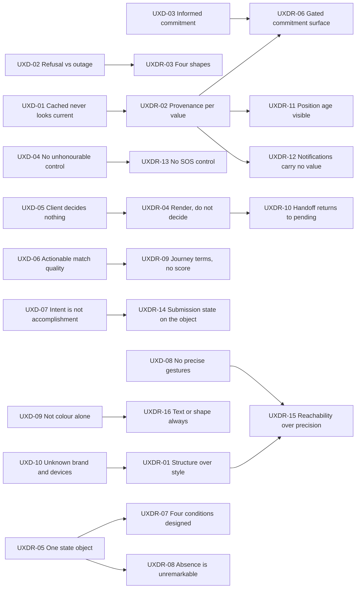
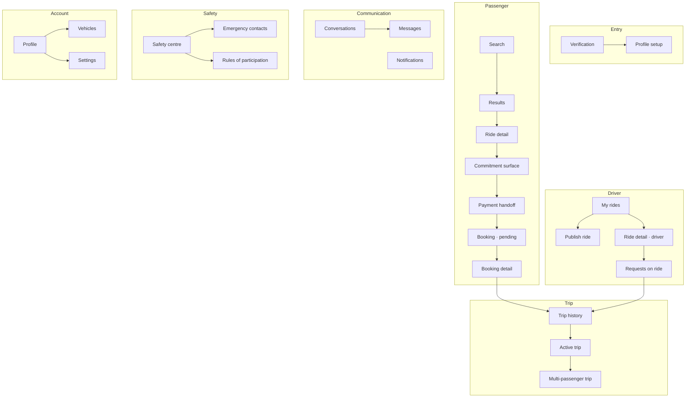
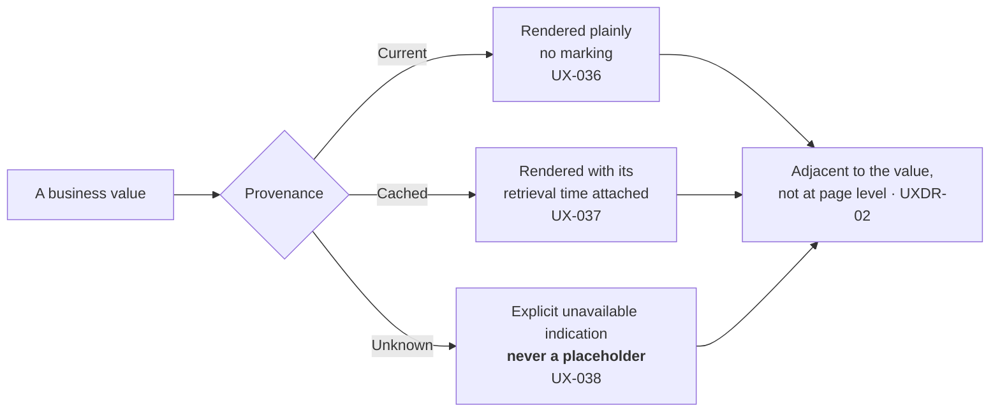
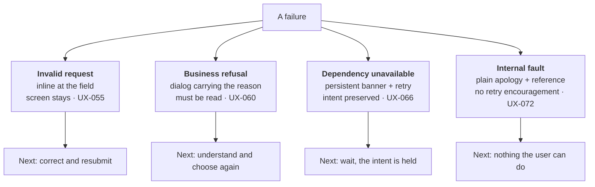
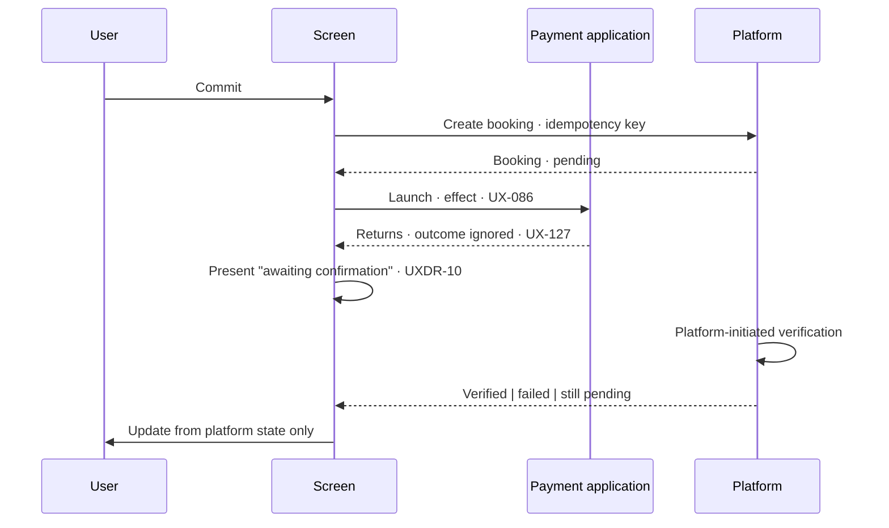

# CMP-DOC-12 — UI/UX Specification

**Carpool Mobility Platform (CMP)**

---

# 0. Document Control

## 0.1 Document Metadata

| Field | Value |
|---|---|
| Document ID | CMP-DOC-12 |
| Document Name | UI/UX Specification |
| Short Name | UIUX |
| Project Name | Carpool Mobility Platform |
| Project Code | CMP |
| Version | 0.1 |
| Status | Draft |
| Date | 2026-08-17 |
| Author | UI/UX Designer (AI-assisted) |
| Reviewer | [TBD] |
| Approver | Project Owner |
| Classification | Internal |
| Brand | TBD |
| Previous Version | None (initial issue) |
| Predecessor Documents | CMP-DOC-01 … CMP-DOC-11 and CMP-DOC-13, **all Draft, none approved** (CMP-DOC-09 at v0.2, the remainder at v0.1) |
| Related Documents | `00_Project_Control/README.md`, `Documentation_Index.md`, `Documentation_Status.md`, `Document_Change_Log.md`, `Glossary.md`, `Master_Traceability_Matrix.md` |
| Successor Documents | CMP-DOC-14 (Payment & UPI), CMP-DOC-15 (GPS / Live Trip), CMP-DOC-16 (Communication & Notification), CMP-DOC-18 (Testing & QA) |

## 0.2 Revision History

| Version | Date | Author | Change | Status |
|---|---|---|---|---|
| 0.1 | 2026-08-17 | UI/UX Designer (AI-assisted) | Initial issue. Specifies the client experience for the 44 Specified use cases: 10 experience drivers, **16 UI/UX decisions**, the screen inventory, the on-screen state model, provenance treatment, the four failure treatments, navigation, the commitment surface, search and results, payment handoff, the trip surface, the safety surface, content and refusal reasons, accessibility mechanics, offline behaviour, and the screens withheld. Issues 224 statements (`UX-001` … `UX-224`). | Draft |

## 0.3 Distribution List

| Role | Purpose |
|---|---|
| Project Owner | Approval authority; **`NFR-088` and `MOB-OQ-001` are theirs to decide** |
| **UI/UX Designer** | Authoring and ownership |
| **Android Developers** | **Primary consumer** |
| Software Architect — Android | Consistency with CMP-DOC-08 |
| Backend Lead | Consistency with CMP-DOC-10 §8 and §14 |
| Security Analyst | Disclosure limits and the client's non-decision position (§9.4, `UX-032`) |
| Product Analyst | Screen coverage against the 44 Specified use cases; the 39 withheld |
| QA Analyst | The verification obligations in §20 |

## 0.4 Approval

| Role | Name | Signature | Date |
|---|---|---|---|
| Author | UI/UX Designer (AI-assisted) | — | 2026-08-17 |
| Reviewer | [TBD] | — | — |
| Approver | Project Owner | — | — |

> **This document is NOT approved.** It is issued at version 0.1 with status `Draft`
> for Project Owner review.

## 0.5 Purpose of This Document

CMP-DOC-08 gave the client a state model, a provenance type and four error classes, and
placed three obligations on this document. CMP-DOC-10 gave the interface four failure
branches and an as-of marking on every value, and placed two more. CMP-DOC-13 bounded what
may be disclosed and forbade the client deciding anything.

**Five obligations, and all five are about the same thing: making the truth of a value
visible.** The platform is the sole authority (`BAD-RULE-002`), the client holds nothing
authoritative (`MOB-067`), and every value the user sees is therefore either current, or
cached with a time, or unknown. A design that renders all three identically tells the user
a confident lie three times out of three.

This document specifies the experience for the **44 Specified use cases**. It specifies no
screen for the 39 that are not, and §17 names each.

## 0.6 Boundaries — What This Document Does Not Specify

| Subject | Owning document |
|---|---|
| Client module and layer structure | CMP-DOC-08 |
| Endpoint paths, payloads, status codes | CMP-DOC-10 |
| Tables and columns | CMP-DOC-11 |
| **Security mechanisms** | **CMP-DOC-13** |
| Payment provider flows and UPI mechanics | CMP-DOC-14 |
| Position acquisition behaviour and cadence | CMP-DOC-15 |
| Notification channels and delivery | CMP-DOC-16 |
| Administrative screens | CMP-DOC-17 |
| Test cases and usability test protocol | CMP-DOC-18 |

### 0.6.1 Visual Identity Is Out of Scope

**FACT.** `Brand` is `TBD` throughout this documentation set, by instruction.

This document specifies **structure, state, behaviour, hierarchy, content rules and
accessibility mechanics**. It specifies **no colour, no typeface, no logo, no illustration
style and no visual tone**, because the brand does not exist and inventing one here would
commit a decision that is not this document's to make. Every statement is expressed so
that it survives whatever visual identity is later chosen. `UX-OQ-01` records the
dependency.

### 0.6.2 No Accessibility Conformance Is Claimed

**FACT.** `NFR-088` requires the platform to define the accessibility standard it conforms
to and the conformance level. **No standard has been chosen** (`MOB-OQ-002`).

§15 specifies accessibility **mechanics** — what must be operable, perceivable and
reachable — derived from `NFR-089` to `NFR-092`, which are stated requirements. It names
no standard and **claims no conformance with any**. Choosing the standard remains open and
is escalated at `UX-OQ-02`.

## 0.7 Inputs to This Document

| Input | Contribution |
|---|---|
| CMP-DOC-03 | The 44 Specified use cases — the whole of what may be designed |
| CMP-DOC-04 | The behaviour each screen presents |
| CMP-DOC-05 §NFR-079–092 | 14 usability and accessibility requirements |
| CMP-DOC-08 §17.5 | **Three obligations** placed explicitly on this document |
| CMP-DOC-08 §5–§7 | The client state model, provenance, intents and effects |
| CMP-DOC-10 §17.7 | **Two obligations**; the four error branches and as-of markings |
| CMP-DOC-13 §20.5 | Disclosure limits; the client makes no security decision |

## 0.8 Qualifications on This Document

### 0.8.1 Source

Every statement derives from a predecessor statement, from a decision recorded in §3, or
is disclosed in §18.6 as originating here.

### 0.8.2 Qualification 1 — Twelve Unapproved Predecessors

**FACT.** CMP-DOC-01 … CMP-DOC-11 and CMP-DOC-13 are all `Draft`. None is approved.

Recorded as conflict `CC-013` and as `UX-RISK-01`.

### 0.8.3 Qualification 2 — Coverage Is Bounded by Decided Behaviour

**FACT.** CMP-DOC-03 records **33 of 83 use cases as Outlined**, and CMP-DOC-04 records 29
functional gaps. CMP-DOC-10 withheld 11 resources and CMP-DOC-11 withheld 7 tables for the
same reason.

**No screen is designed for behaviour nobody has decided.** §17 names every withheld
screen and its blocking decision. A speculative screen is the most expensive kind of
speculation in this chain, because a screen implies a promise to the user.

### 0.8.4 Qualification 3 — Two Decisions This Document Needs Are Unmade

**FACT.** The accessibility standard (`NFR-088`, `MOB-OQ-002`) and the supported device
range (`NFR-094`, `MOB-OQ-001`) are both unchosen.

Both bear directly on design. Without a device range there is no smallest screen to design
for; without a standard there is no conformance target. §15 and §16 specify what can be
specified regardless, and **name both gaps rather than assuming a default**.

## 0.9 Statement Classification Convention

As `README.md` §9.1. Markers: **FACT**, **ASSUMPTION**, **BUSINESS DECISION REQUIRED**,
**TECHNICAL DECISION REQUIRED**, **OPEN QUESTION**, **TBD**, **FUTURE CONSIDERATION**,
**RECOMMENDATION**.

## 0.10 Identifier Conventions

| Prefix | Element | Section |
|---|---|---|
| `UX-nnn` | **Traceable UI/UX specification statement** | §4–§17 |
| `UXDR-nn` | UI/UX Decision Record | §3 |
| `UXD-nn` | Experience driver | §2 |
| `UX-ASM-nn` | Assumption | §19.1 |
| `UX-RISK-nn` | Risk | §19.2 |
| `UX-OQ-nn` | Open Question | §19.3 |

> **`UX-` is a new prefix allocation.** Master Documentation Control Prompt §20 lists
> traceable prefixes for every formal document **except CMP-DOC-12**. `UX-` is adopted
> here, distinct from `UC-` (use cases), and registered in `Documentation_Index.md` §5.13.
> The omission and this resolution are recorded as conflict entry `CC-014`, following the
> precedent set by `CC-001`.

## 0.11 Table of Contents

| § | Title |
|---|---|
| 0 | Document Control |
| 1 | Executive Summary |
| 2 | Experience Drivers |
| 3 | UI/UX Decisions |
| 4 | Screen Inventory |
| 5 | The State Model on Screen |
| 6 | Provenance Treatment |
| 7 | The Four Failure Treatments |
| 8 | Navigation and Flow |
| 9 | The Commitment Surface |
| 10 | Search and Results |
| 11 | Payment and the Handoff |
| 12 | The Trip Surface |
| 13 | The Safety Surface |
| 14 | Content and Refusal Reasons |
| 15 | Accessibility |
| 16 | Offline and Intermittent Connectivity |
| 17 | Screens Withheld |
| 18 | Traceability |
| 19 | Assumptions, Risks and Open Questions |
| 20 | Acceptance Criteria for This Document |
| 21 | Statistics and Recommendations |
| A | Appendix A — Statement Index |
| B | Appendix B — Decision Index |
| C | Appendix C — Screen Index |

---

# 1. Executive Summary

## 1.1 What This Document Delivers

| Element | Count |
|---|---|
| Experience drivers | 10 |
| **UI/UX Decision Records** | **16** |
| UI/UX specification statements | **224** (`UX-001` … `UX-224`) |
| Screens specified | 32 |
| Screens withheld pending a decision | 14 |
| Use cases covered | 44 of 44 Specified |
| Provenance treatments | 3 |
| Failure treatments | 4 |
| Obligations discharged from CMP-DOC-08 and CMP-DOC-10 | 5 of 5 |
| Colours, typefaces or brand elements specified | **0** |
| Accessibility conformance claims | **0** |

## 1.2 The Experience in One Paragraph

Thirty-one screens, each driven by one immutable state object, each rendering every
business value with its provenance visible — current, cached with a time, or unknown — and
never substituting a default for an absent value. Four failure treatments, one per
interface branch, so that "you may not" never looks like "we could not". A commitment
surface that shows verification standing, vehicle, fare, timing, seats and preferences
before any commitment is sought, with every one of those values marked for currency. A
payment flow that hands off to the payment application and returns to a *pending* state,
because the client is not entitled to conclude anything. A trip surface that keeps position
honest about its age. A safety centre that ships only the controls that work — **no SOS button and, as it
turns out, no incident-reporting control either**, because every user-facing route to
raising a safety matter is a decision nobody has taken.

## 1.3 The Four Decisions That Shape Everything Else

| UXDR | Decision | Why it dominates |
|---|---|---|
| **`UXDR-02`** | Provenance is rendered as a **property of the value**, adjacent to it — not as a page-level banner or a refresh timestamp in a corner. | `MOB-018` forbids rendering a value without its provenance. A page-level "last updated" tells the user nothing about *which* values are stale, and on a screen mixing a locked seat count with a projected rating, that difference is the whole point. |
| **`UXDR-03`** | Four failure treatments with **four different shapes** — inline field, dialog with reason, persistent banner with retry, and a plain apology. | CMP-DOC-08 `MADR-10` and CMP-DOC-10 §8 both require four. One "something went wrong" dialog is how a business refusal becomes indistinguishable from an outage, and the user retries something that will never succeed. |
| **`UXDR-06`** | The commitment surface is a **single screen** that shows everything `NFR-084` requires, and the commit control is disabled until every required value is `Current`. | `NFR-084` is integrity-critical. A user cannot meaningfully consent to travel with a stranger on cached verification standing, so the design refuses to let them. |
| **`UXDR-13`** | **No SOS control is designed.** The safety centre presents the controls the platform can honour and nothing else. | `MOB-150` and `FRD-FR-195`. `BAD-DEC-011` leaves the safety response protocol undecided, so a prominent red button would promise a response nobody has specified. **This is the most consequential omission in the document and it is deliberate.** |

## 1.4 The Five Obligations Discharged

| Obligation | Source | Discharged by |
|---|---|---|
| Treatment for `Cached` and `Unknown` provenance on every business value | CMP-DOC-08 §17.5 | `UXDR-02`; §6 |
| Must not reintroduce the SOS control while `BAD-DEC-011` is unresolved | CMP-DOC-08 §17.5 | `UXDR-13`; §13.3 |
| Four distinct error treatments, not one | CMP-DOC-08 §17.5 | `UXDR-03`; §7 |
| Treatment for a stale as-of marking on every business value | CMP-DOC-10 §17.7 | `UXDR-02`; `UX-041`–`UX-046` |
| Four failure treatments matching §8 branch for branch | CMP-DOC-10 §17.7 | `UXDR-03`; §7.6 mapping table |

## 1.5 What This Document Could Not Settle

| Matter | Position |
|---|---|
| Accessibility standard and level | `UX-OQ-02` — mechanics specified, no standard chosen, no conformance claimed |
| Supported device range | `UX-OQ-03` — no smallest screen to design against |
| Visual identity | `UX-OQ-01` — brand is TBD |
| 14 screens | §17 — behaviour undecided upstream |
| Action-count and timing bounds | `NFR-080`–`NFR-083` all unset |
| What a cancellation shows the passenger | `GAP-008`, `GAP-009`, `BAD-DEC-009` |

---

# 2. Experience Drivers

| ID | Driver | Source | Consequence |
|---|---|---|---|
| `UXD-01` | A user must never mistake a cached value for a current one. | `NFR-086`, `MOB-018` | `UXDR-02`: provenance adjacent to the value. |
| `UXD-02` | A user must be able to tell "you may not" from "we could not". | `MADR-10`, `API-071` | `UXDR-03`: four shapes. |
| `UXD-03` | A user must see what they need before committing to travel with a stranger. | `NFR-084` | `UXDR-06`: one commitment surface, gated. |
| `UXD-04` | The client must never present a control it cannot honour. | `FRD-FR-195`, `MOB-150` | `UXDR-13`: no SOS control. |
| `UXD-05` | The client decides nothing. | `ARCH-016`, `SEC-160` | `UXDR-04`: intents in, state out, no local judgement. |
| `UXD-06` | Match quality must be actionable without explanation. | `NFR-085` | `UXDR-09`: plain-language match reasons. |
| `UXD-07` | An intent submitted offline must not look accomplished. | `MOB-060`, `MOB-068` | `UXDR-14`: submission state on the affected object. |
| `UXD-08` | Safety controls must not depend on precise gestures. | `NFR-092` | `UXDR-15`: large targets, no gesture-only path. |
| `UXD-09` | Colour must never be the only carrier of meaning. | `NFR-091` | `UXDR-16`: text or shape accompanies every status. |
| `UXD-10` | The design must survive an unchosen brand and an unchosen device range. | §0.6.1, `MOB-OQ-001` | `UXDR-01`: structure over style; relative sizing throughout. |

---

# 3. UI/UX Decisions

Each decision records its context, the alternatives considered, and its consequences
**including the negative ones**, marked ✘. **No decision specifies a colour, typeface or
brand element** (§0.6.1).

## 3.1 `UXDR-01` — Structure Is Specified; Style Is Deferred

| | |
|---|---|
| **Context** | `Brand` is `TBD`. The device range is unchosen (`MOB-OQ-001`), so there is no smallest screen to design against. A specification that waits for both produces nothing; one that invents both commits decisions it does not own. |
| **Decision** | **This document specifies hierarchy, grouping, order, state, behaviour and content rules. Every statement is expressed in terms that survive any visual identity and any screen size: relative emphasis rather than colour, ordinal position rather than pixel layout, and "must be reachable" rather than "must be visible without scrolling".** |
| **Alternatives** | *(a)* Wait for the brand — rejected: blocks the whole document on a decision with no owner assigned. *(b)* Invent a provisional visual language — rejected: provisional decisions become permanent the moment someone builds against them. |
| **Consequences** | ✔ The specification is buildable now and does not need rewriting when the brand arrives. ✔ Nothing here is invented. ✘ A developer needs a visual design in addition to this document before shipping. ✘ Some statements read abstractly where a mockup would be clearer; §21.4 R-1 recommends commissioning the visual layer against this structure. |

## 3.2 `UXDR-02` — Provenance Is a Property of the Value

| | |
|---|---|
| **Context** | CMP-DOC-08 §17.5's first obligation. `MOB-018` forbids rendering a business value without its provenance; `MOB-023` forbids substituting a default for an unknown. CMP-DOC-10 `AADR-09` supplies an as-of marking per value, and a projection's maintenance time separately. A screen commonly mixes a locked seat count, a projection-derived rating and a cached profile name. |
| **Decision** | **Provenance is rendered adjacent to the value it describes, not at page level. Three treatments: `Current` renders the value plainly with no marking; `Cached` renders the value with its retrieval time attached; `Unknown` renders an explicit unavailable indication and never a placeholder, a zero or a dash that could be read as a value.** |
| **Alternatives** | *(a)* Page-level "last updated" — rejected: says nothing about *which* value is stale, which is the only useful thing to know on a mixed screen. *(b)* Mark only stale values, leave current ones unmarked — **partially adopted**: `Current` is deliberately unmarked so that a marking always means something. *(c)* A single "offline" mode — rejected: values do not all go stale together. |
| **Consequences** | ✔ `MOB-018` becomes satisfiable rather than aspirational. ✔ A user can tell which fact to trust. ✘ Visual density rises on any screen with several cached values. ✘ Every component that renders a business value must accept a provenance parameter; `UX-035` makes that a component contract rather than a convention. |

## 3.3 `UXDR-03` — Four Failure Treatments With Four Shapes

| | |
|---|---|
| **Context** | CMP-DOC-08 §17.5's third obligation and CMP-DOC-10 §17.7's second. `MADR-10` gives the client four error classes; `API-071`–`API-094` give the interface four branches with four body shapes. The industry default — one dialog saying something went wrong — collapses all four. |
| **Decision** | **Four treatments, distinguishable at a glance without reading: an invalid request is shown inline at the offending field; a business refusal is shown as a dialog carrying the reason; a dependency unavailability is shown as a persistent banner with a retry affordance and the intent preserved; an internal fault is shown as a plain apology with a reference and no retry encouragement.** |
| **Alternatives** | *(a)* One error component parameterised by severity — rejected: severity is not the distinction; *what the user should do next* is, and it differs in all four. *(b)* Toast notifications for all — rejected: a business refusal the user must understand cannot be transient. |
| **Consequences** | ✔ The user's next action is implied by the shape before they read a word. ✔ A refusal is never retried pointlessly, and an outage is never accepted as final. ✘ Four components to build and test. ✘ Developers must classify correctly; §7.6 maps every branch to its treatment so the choice is not a judgement call. |

## 3.4 `UXDR-04` — The Screen Renders; It Does Not Decide

| | |
|---|---|
| **Context** | `ARCH-016`, `MOB-010`, `MOB-022`, `MOB-036` and `SEC-160` all say the client holds no business rule and makes no decision. The temptation in UI work is small and constant: disable a button because the fare looks wrong, hide an option because the user probably cannot use it, compute a total to save a round trip. |
| **Decision** | **A screen renders state and emits intents. It computes no fare, no availability, no eligibility and no entitlement. Where a control must be disabled, it is disabled because state says so — carrying the platform's reason — never because the screen inferred it.** |
| **Alternatives** | *(a)* Client-side pre-validation of business conditions — rejected: duplicates a rule, and `SRS-REQ-126` requires each rule in exactly one place. *(b)* Optimistic display of computed values — rejected: `MOB-060` forbids presenting an intent as accomplished. |
| **Consequences** | ✔ A business rule change needs no client release. ✔ The client cannot be wrong about a rule it does not hold. ✘ More round trips than a client that guesses. ✘ Some interactions feel slower; `UXDR-14`'s submission states are what make that honest rather than merely sluggish. |

## 3.5 `UXDR-05` — One Immutable State Object Per Screen

| | |
|---|---|
| **Context** | `MOB-015` requires each screen driven by exactly one immutable state object; `MOB-016` requires it observable and held across configuration change; `MOB-020` separates one-shot effects from state. |
| **Decision** | **Each screen has one state object carrying every value it renders, each with provenance, plus its loading, empty, populated and failed conditions. Navigation, dismissal and external launches are effects, consumed once, never state.** |
| **Alternatives** | *(a)* Multiple observable streams per screen — rejected: produces intermediate combinations that were never designed and are discovered as bugs. *(b)* Navigation as a state flag — rejected: replays on configuration change. |
| **Consequences** | ✔ Every renderable condition is enumerable, therefore designable and testable. ✔ Rotation and process death are non-events. ✘ The state object grows on complex screens. ✘ Every condition must be designed, including the ones nobody wants to think about; §5.3 requires all four. |

## 3.6 `UXDR-06` — One Gated Commitment Surface

| | |
|---|---|
| **Context** | `NFR-084` is integrity-critical: verification standing, vehicle information, fare, timing, seats and preferences must all be presented before any commitment is sought. `BAD-RULE-007` requires verification standing visible **before** a counterparty commits to travel. A cached verification standing is not a basis for that decision. |
| **Decision** | **A single screen precedes every commitment, showing all six required values with their provenance. The commit control is unavailable while any of the six is `Cached` or `Unknown`, and the screen states which value it is waiting on and offers to refresh.** |
| **Alternatives** | *(a)* Show the values across the preceding flow — rejected: `NFR-084` requires them present at the point of commitment, not somewhere earlier. *(b)* Allow commitment on cached values with a warning — rejected: this is the one decision where being wrong means travelling with an unverified stranger. |
| **Consequences** | ✔ `NFR-084` and `BAD-RULE-007` are structurally satisfied. ✔ The user's decision rests on current facts or does not proceed. ✘ **On a poor connection, commitment is blocked** — deliberate, and the most user-visible cost in this document. ✘ Requires a refresh path that can fail, which needs its own treatment (`UX-104`). |

## 3.7 `UXDR-07` — Empty, Loading and Failed Are Designed, Not Defaults

| | |
|---|---|
| **Context** | `MOB-023` forbids substituting a default for an unknown value. A screen with an undesigned empty state renders as a blank region that reads as a fault. `FRD-FR-096` requires search to state it is unavailable rather than return an unmatched set — which only works if "unavailable" has a designed appearance distinct from "no results". |
| **Decision** | **Every screen designs four conditions explicitly: loading, empty, populated and failed. Empty states state what is absent and what the user may do. "No results" and "search unavailable" are visually and textually distinct.** |
| **Alternatives** | *(a)* A shared generic empty component — rejected: "you have no bookings yet" and "we could not load your bookings" require opposite user responses. |
| **Consequences** | ✔ No condition renders as an accident. ✔ `FRD-FR-096` is realisable. ✘ Four designs per screen rather than one. ✘ Content must be written for conditions that are rare, which is where writing effort is least willingly spent. |

## 3.8 `UXDR-08` — Disclosure Follows the Relationship, and Absence Is Normal

| | |
|---|---|
| **Context** | `AADR-08` and `API-049` populate only the fields a caller's relationship entitles them to, and `API-055` marks which fields are relationship-dependent. `SEC-065`–`SEC-069` bound disclosure. `API-056` forbids inferring a value from its absence. A screen that renders an absent entitled field as an error teaches users that missing means broken. |
| **Decision** | **Relationship-dependent fields are laid out so that their absence is unremarkable: no reserved gap, no placeholder, no "not available to you" message. The screen presents what it has. Contact details appear only once a qualifying relationship exists, and their appearance is not announced as a change in status.** |
| **Alternatives** | *(a)* Show a locked indicator where a field is withheld — rejected: confirms the field exists and has a value, which is precisely what `API-056` and `SEC-069` prevent. *(b)* Separate screens per relationship — rejected: multiplies designs and drifts. |
| **Consequences** | ✔ Absence discloses nothing. ✔ One layout per screen regardless of viewer. ✘ Layout must tolerate variable field counts without looking unfinished. ✘ A user cannot tell why they cannot see something — deliberate. |

## 3.9 `UXDR-09` — Match Quality Is Stated in Journey Terms

| | |
|---|---|
| **Context** | `NFR-085` requires route-overlap match quality expressed in terms a passenger can act on **without explanation**. `BAD-RULE-024` requires ranking to be explainable. A percentage or a star rating is neither: an overlap figure tells a passenger nothing about whether they will be walking, and inventing one would be inventing a metric. |
| **Decision** | **Each result states the concrete facts a passenger acts on — where pickup and drop-off are relative to their stated points, and how the ride's timing relates to theirs. No score, percentage, star rating or composite quality figure is shown.** |
| **Alternatives** | *(a)* A match percentage — rejected: not actionable, and it would be an invented metric. *(b)* Ranked list with no explanation — rejected: `BAD-RULE-024` requires the ranking explainable. |
| **Consequences** | ✔ `NFR-085` satisfied with facts the platform already computes. ✔ No metric invented. ✘ More text per result than a score. ✘ **The overlap threshold and ranking rule are `[TBD – Business Decision Required]`** (`BAD-RULE-023`), so the ordering this presents is not yet defined. |

## 3.10 `UXDR-10` — The Payment Handoff Returns to Pending, Always

| | |
|---|---|
| **Context** | `BAD-RULE-032` makes a client-side payment application response non-evidence; `SRS-REQ-013` requires the client to treat it as an event to report; `AADR-07` returns the resource in `pending`; `API-155` forbids assuming an outcome. The payment application will return something that looks like a result, and the user will believe it. |
| **Decision** | **On return from the payment application, the screen shows the booking as awaiting confirmation, regardless of what the payment application reported. It does not show success, does not show failure, and does not echo the payment application's outcome. It states that the platform is confirming, and updates when the platform says so.** |
| **Alternatives** | *(a)* Show the payment application's result optimistically and correct later — rejected: `MOB-060` and `BAD-RULE-032`, and correcting a "paid" to a "failed" is the worst moment in the product. *(b)* Block on a spinner until verified — rejected: verification may be slow, and `AADR-07` made `pending` a first-class outcome precisely so the user is not held. |
| **Consequences** | ✔ The user is never told something the platform has not established. ✔ Pending is honest and leaves the app usable. ✘ **A user who saw their payment app say "success" is shown "awaiting confirmation"**, which will read as a fault to some. §11.4 requires the content to explain it. ✘ Needs a resolution path when pending persists. |

## 3.11 `UXDR-11` — Position Age Is Always Visible During a Trip

| | |
|---|---|
| **Context** | `ARCH-094` and `API-161` forbid presenting a position as current beyond its configured staleness bound. `MOB-075` restates it client-side. A map with a moving dot is the most confident lie a mobile interface can tell: a dot that has not moved for four minutes looks identical to one updating live. |
| **Decision** | **A displayed position always carries its acquisition age. Within the staleness bound it is shown as current with its age; beyond the bound it is shown as last known with its age, and the presentation changes so that the difference is apparent without reading.** |
| **Alternatives** | *(a)* Hide a stale position — rejected: a last-known position is useful, and hiding it loses information the user wants. *(b)* Show age only on tap — rejected: the user must know before they act, not after they enquire. |
| **Consequences** | ✔ The map never implies currency it does not have. ✔ `MOB-075` is realisable. ✘ Persistent chrome on the trip screen. ✘ **The staleness bound is configuration and its value is unset** (§14.2 of CMP-DOC-10), so the threshold at which presentation changes is not yet defined. |

## 3.12 `UXDR-12` — Notifications Carry No Business Value

| | |
|---|---|
| **Context** | A notification is delivered outside the app and cannot carry provenance. Its content may be stale by the time it is read, and `MOB-018` forbids rendering a business value without provenance. `NFR-076` requires safety notifications delivered irrespective of preferences. |
| **Decision** | **A notification states that something happened and invites the user into the app. It does not carry a fare, a seat count, a payment status or a verification standing. Safety notifications are exempt from user preference and are visually distinct from every other category.** |
| **Alternatives** | *(a)* Rich notifications with values — rejected: an unprovenanced business value, which `MOB-018` forbids and which will be read minutes or hours later. |
| **Consequences** | ✔ No unprovenanced value ever leaves the app. ✔ `NFR-076`'s exemption has a visible expression. ✘ Notifications are less informative than users may expect. ✘ CMP-DOC-16 must not reintroduce values; §18.7 places that obligation. |

## 3.13 `UXDR-13` — No SOS Control Is Designed

| | |
|---|---|
| **Context** | CMP-DOC-08 §17.5's second obligation, and the only one framed as a prohibition. `FRD-FR-195` requires that no safety control be presented which the platform cannot honour. `MOB-150` restates it. **`BAD-DEC-011` — the safety response protocol: what happens on SOS, who acts, in what time, with what authority, and whether emergency contacts are notified automatically — is unresolved.** `NFR-137` forbids implying a protection the platform does not provide. |
| **Decision** | **No SOS control is designed. The safety centre presents the controls the platform can honour: reporting an incident, reviewing and amending emergency contacts, and sharing trip details. No prominent emergency affordance, no panic gesture and no distress shortcut appears anywhere in the application.** |
| **Alternatives** | *(a)* An SOS button that records an incident and says help is coming — rejected: it says something untrue. *(b)* An SOS button with small print explaining no emergency service is contacted — rejected: nobody reads small print in an emergency, and the affordance's prominence is itself the promise. *(c)* Design it now, hide it behind a flag — rejected: a built control ships eventually, and a flag is a decision waiting to be made by whoever is closest to a deadline. |
| **Consequences** | ✔ The application makes no promise it cannot keep, which is the whole of `NFR-137`. ✔ When `BAD-DEC-011` is decided, the control is designed against a real protocol. ✘ **A carpooling application with no visible emergency control will be remarked on** — by users, by reviewers and possibly by the distribution platform. §13.3 states this plainly. ✘ Incident reporting must be reachable enough to be useful without becoming an implicit SOS. |

## 3.14 `UXDR-14` — Submission State Lives on the Affected Object

| | |
|---|---|
| **Context** | `MOB-065` stores intents not yet accepted; `MOB-068` gives each a submission state; `MOB-060` forbids presenting an intent as accomplished. `NFR-162` requires no loss of user-entered data on an intermittent connection. A global "syncing" indicator tells a user something is pending but not what. |
| **Decision** | **A pending intent is shown on the object it affects — the booking, the message, the profile change — carrying its submission state: pending, in flight, or exhausted. There is no global sync indicator. An exhausted intent is presented with what the user can do about it.** |
| **Alternatives** | *(a)* A global sync badge — rejected: does not tell the user which action is unfinished. *(b)* Block the UI until submitted — rejected: `NFR-162` requires working through intermittency, not waiting it out. |
| **Consequences** | ✔ The user always knows which action is unfinished. ✔ Nothing is presented as done that is not. ✘ Every object that can be the subject of an intent needs a submission-state presentation. ✘ Exhausted intents need a resolution path per intent type. |

## 3.15 `UXDR-15` — Reachability Over Precision

| | |
|---|---|
| **Context** | `NFR-092` requires every safety control reachable without dependence on precise gestures. `NFR-089` requires operability with assistive technologies; `NFR-090` requires legibility and operability at supported text scaling. The device range is unchosen, so no minimum target size can be stated in absolute terms. |
| **Decision** | **No action is available only through a gesture. Every gesture-driven action has an equivalent control that is focusable, labelled and activatable by assistive technology. Safety controls are placed and sized so that they are operable without precision, and this is stated as a relative requirement because the device range is unchosen.** |
| **Alternatives** | *(a)* State a minimum target size in absolute units — rejected: requires a device range that does not exist (`MOB-OQ-001`), and would be an invented figure. *(b)* Gesture shortcuts with no equivalent — rejected: `NFR-092`. |
| **Consequences** | ✔ `NFR-089` and `NFR-092` are satisfiable without a chosen standard. ✔ Nothing invented. ✘ Absolute sizing cannot be specified until `MOB-OQ-001` is answered; `UX-190` records the dependency. ✘ Every gesture needs a designed equivalent. |

## 3.16 `UXDR-16` — Status Is Never Carried by Colour Alone

| | |
|---|---|
| **Context** | `NFR-091` forbids relying on colour alone to convey verification standing, trip state or payment status. These three are exactly the values a designer most wants to encode as a coloured badge. `Brand` is TBD, so no palette exists to rely on anyway. |
| **Decision** | **Verification standing, trip state, payment status and provenance each carry a textual or shape-based indication independent of colour. Colour may reinforce and may never be the sole carrier. Because the brand is undecided, every status is specified by its text and its shape, and colour assignment is left to the visual layer.** |
| **Alternatives** | *(a)* Colour with an accessible palette — rejected: still colour-alone for a user who cannot perceive it or is in bright sunlight, and `NFR-091` says *alone*. |
| **Consequences** | ✔ `NFR-091` holds regardless of the eventual palette. ✔ The brand decision cannot break it. ✘ Status indications occupy more space than a coloured dot. ✘ Text must be short enough not to dominate; §14 sets the content rule. |

## 3.17 Driver to Decision Map

---

# 4. Screen Inventory

## 4.1 The Thirty-One Screens

| # | Screen | Realises | Tier |
|---|---|---|---|
| 1 | Verification | `UC-001`, `UC-002` | Specified |
| 2 | Log in | `UC-003` | Specified |
| 3 | Profile | `UC-005` | Specified |
| 4 | Home | Entry point | Structural |
| 5 | Vehicles | `UC-010`, `UC-011`, `UC-012` | Specified |
| 6 | My published rides | `UC-018` | Specified |
| 7 | Publish ride | `UC-014` | **Partial — `BAD-DEC-003`** |
| 8 | Ride preferences | `UC-015` | Specified |
| 9 | Ride detail — driver | `UC-016` | Specified |
| 10 | Search | `UC-019` | Specified |
| 11 | Results | `UC-020` | Specified |
| 12 | Ride detail — passenger | `UC-021` | Specified |
| 13 | Commitment surface | `UC-021`, `UC-025`, `UC-030` | **Partial — `BAD-DEC-003`, `BAD-DEC-007`** |
| 14 | Request seats | `UC-023` | **Partial — `BAD-DEC-007`** |
| 15 | Payment handoff | `UC-031` | Specified |
| 16 | Payment status | `UC-032`, `UC-033` | Specified |
| 17 | My bookings | `UC-029` | Specified |
| 18 | Booking detail | `UC-029` | Specified |
| 19 | Counterparty profile | `UC-007` | Specified |
| 20 | Trip history | `UC-043` | Specified |
| 21 | Active trip — passenger | `UC-039`, `UC-040` | Specified |
| 22 | Active trip — driver | `UC-042` | Specified |
| 23 | Multi-passenger trip | `UC-044` | Specified |
| 24 | Conversations | `UC-045` | **Partial — `BAD-DEC-022`** |
| 25 | Messages | `UC-046`, `UC-047` | Specified |
| 26 | Notifications | `UC-062`, `UC-063` | Specified |
| 27 | Notification preferences | `UC-064` | Specified |
| 28 | Safety centre | `UC-054` | Specified |
| 29 | Emergency contacts | `UC-048` | Specified |
| 30 | Rules of participation | `UC-083` | Specified |
| 31 | Settings | `UC-004`, `UC-008` | Specified |
| 32 | Version unsupported | `MOB-057`, `API-024` | Structural |

> **Four screens are marked Partial.** Each realises a use case CMP-DOC-03 records as
> partially specified: the screen exists because part of its behaviour is decided, and
> §17 names what within it is not. **Screen 7 cannot state the amount payable** and
> **screens 13 and 14 cannot state whether a request requires driver acceptance**, because
> `BAD-DEC-003` and `BAD-DEC-007` are unresolved.

| ID | Statement | Src |
|---|---|---|
| `UX-001` | The application shall comprise the thirty-two screens above and no screen for behaviour CMP-DOC-04 did not specify. | §0.8.3, `UXDR-01` |
| `UX-002` | Every screen shall realise at least one Specified use case, or shall serve a structural purpose stated in §4.1. | CMP-DOC-03 |
| `UX-003` | No screen shall be added for an Outlined use case; §17 names each withheld screen and its blocker. | §0.8.3 |
| `UX-004` | Screen 32 shall be reachable without an authenticated session and without a supported interface version. | `API-026`, `MOB-057` |
| `UX-005` | Screen 32 shall state that the application must be updated and shall offer no business capability. | `API-025` |
| `UX-006` | No screen shall present a control the platform cannot honour. | `FRD-FR-195`, `MOB-150` |
| `UX-007` | No screen shall specify a colour, typeface, logo or illustration; the visual layer is deferred. | §0.6.1, `UXDR-01` |
| `UX-008` | Layout shall be expressed in relative terms and shall not assume a screen size, because the device range is unchosen. | `MOB-OQ-001`, `UXDR-01` |
| `UX-009` | The passenger and driver active-trip screens shall be distinct, because the information each needs and may see differs. | `UXDR-08`, `API-049` |
| `UX-010` | A screen shall be reachable by at most one route from the primary navigation, so that back behaviour is unambiguous. | `UXDR-05`, `MOB-020` |
| `UX-011` | The safety centre shall be reachable from every screen during an active trip. | `NFR-092`, `FRD-FR-189` |
| `UX-012` | No screen shall depend on a screen for an Outlined use case existing. | `UX-003`, §17 |
| `UX-013` | Administrative surfaces are CMP-DOC-17's and appear in no screen here. | §0.6 |
| `UX-014` | The screen inventory shall be revisited when any Outlined use case becomes Specified. | `UX-003`, §17 |

---

# 5. The State Model on Screen

| ID | Statement | Src |
|---|---|---|
| `UX-015` | Each screen shall be driven by exactly one immutable state object. | `MOB-015`, `UXDR-05` |
| `UX-016` | The state object shall carry every value the screen renders, each with its provenance. | `MOB-017`, `UXDR-02` |
| `UX-017` | State shall survive configuration change without re-fetching. | `MOB-016` |
| `UX-018` | Navigation, dismissal and external launch shall be effects consumed once, never state. | `MOB-020`, `UXDR-05` |
| `UX-019` | User input shall reach the state holder as a declared intent. | `MOB-019` |
| `UX-020` ‡ | A screen shall compute no fare, no availability, no eligibility and no entitlement. | `MOB-022`, `UXDR-04` |
| `UX-021` ‡ | A control shall be disabled only because state says so, never because the screen inferred a condition. | `UXDR-04`, `SEC-160` |
| `UX-022` | A disabled control shall state why it is disabled, using the reason state carries. | `NFR-087`, `UX-021` |
| `UX-023` ‡ | A screen shall render an unknown value as unknown and shall never substitute a default, a zero or a dash. | `MOB-023`, `UXDR-02` |

## 5.1 The Four Conditions

| ID | Statement | Src |
|---|---|---|
| `UX-024` | Every screen shall design a loading condition. | `UXDR-07` |
| `UX-025` | Every screen shall design an empty condition stating what is absent and what the user may do. | `UXDR-07` |
| `UX-026` | Every screen shall design a populated condition. | `UXDR-07` |
| `UX-027` | Every screen shall design a failed condition, distinct from empty. | `UXDR-07`, `FRD-FR-096` |
| `UX-028` | "No results" and "unavailable" shall be visually and textually distinct on every screen where both can occur. | `FRD-FR-096`, `UXDR-07` |
| `UX-029` | A loading condition shall not block a screen region the user can already act on. | `NFR-079` |
| `UX-030` | A partial load shall render what is available with the remainder marked unknown, rather than withholding the screen. | `UX-023`, `MOB-023` |

## 5.2 What the Screen Never Does

| ID | Statement | Src |
|---|---|---|
| `UX-031` ‡ | A screen shall never present an intent as accomplished before the platform accepts it. | `MOB-068`, `UXDR-14` |
| `UX-032` ‡ | A screen shall make no security decision and shall present what the platform decided. | `SEC-160`, `ARCH-016` |

---

# 6. Provenance Treatment

This section discharges CMP-DOC-08 §17.5's first obligation and CMP-DOC-10 §17.7's first.

## 6.1 The Three Treatments

| ID | Statement | Src |
|---|---|---|
| `UX-033` ‡ | Every business value shall be rendered with its provenance. | `MOB-018`, **CMP-DOC-08 §17.5** |
| `UX-034` ‡ | Provenance shall be rendered adjacent to the value it describes, never as a page-level indication. | `UXDR-02` |
| `UX-035` | Every component rendering a business value shall accept provenance as a required parameter, so that omitting it is a compile-time failure rather than an oversight. | `UXDR-02`, `MOB-018` |
| `UX-036` | A `Current` value shall be rendered plainly with no marking, so that a marking always carries meaning. | `UXDR-02` |
| `UX-037` ‡ | A `Cached` value shall be rendered with its retrieval time attached. | `MOB-018`, `NFR-086` |
| `UX-038` ‡ | An `Unknown` value shall be rendered as an explicit unavailable indication and never as a placeholder, a zero, a dash or an empty space. | `MOB-023`, `UX-023` |
| `UX-039` ‡ | Provenance shall not be conveyed by colour alone. | `NFR-091`, `UXDR-16` |
| `UX-040` | A screen mixing provenances shall not group values by provenance; each stays in its meaningful position. | `UXDR-02` |

## 6.2 The As-Of Marking

| ID | Statement | Src |
|---|---|---|
| `UX-041` ‡ | A value carrying an as-of marking from the platform shall render that marking, not the device's receipt time. | `API-043`, `AADR-09` |
| `UX-042` ‡ | A value derived from a projection shall render the projection's maintenance time, which may be older than the response. | `API-044`, `BE-124` |
| `UX-043` | A value read under lock shall be rendered as current at its stated instant. | `API-045`, `BE-094` |
| `UX-044` ‡ | Where a value's as-of marking exceeds its staleness bound, it shall be presented as stale and not as current. | `API-161`, `UXDR-11` |
| `UX-045` | Staleness bounds are supplied as configuration and their values are unset; the presentation shall read the bound rather than embed one. | `MOB-123`, `API-187` |
| `UX-046` | An as-of marking shall be expressed in terms of elapsed time rather than an absolute timestamp, where the value's currency is what matters. | `UXDR-02`, `NFR-086` |

## 6.3 Where Provenance Matters Most

| ID | Statement | Src |
|---|---|---|
| `UX-047` ‡ | Verification standing shall never be presented as current when it is cached. | `BAD-RULE-007`, `NFR-084` |
| `UX-048` ‡ | Seat availability shall be presented with its provenance, and never from a projection or the device cache. | `API-048`, `MOB-062` |
| `UX-049` ‡ | Fare shall be presented with its provenance and shall never be computed on the device. | `BE-032`, `UX-020` |
| `UX-050` ‡ | Payment status shall be presented with its provenance and shall never be inferred from the payment application. | `BAD-RULE-032`, `UXDR-10` |
| `UX-051` ‡ | A position shall be presented with its acquisition age. | `UXDR-11`, `MOB-075` |
| `UX-052` | A counterparty's profile values may be cached, and shall be marked as such wherever they appear. | `UXDR-02`, `FRD-FR-027` |

---

# 7. The Four Failure Treatments

This section discharges CMP-DOC-08 §17.5's third obligation and CMP-DOC-10 §17.7's second.

## 7.1 The Shapes

| ID | Statement | Src |
|---|---|---|
| `UX-053` ‡ | Four failure treatments shall exist, distinguishable by shape before any text is read. | `MADR-10`, **CMP-DOC-08 §17.5** |
| `UX-054` ‡ | No single generic failure component shall be used for more than one branch. | `UXDR-03`, `API-072` |

## 7.2 Invalid Request

| ID | Statement | Src |
|---|---|---|
| `UX-055` | An invalid request shall be presented inline at each offending field. | `UXDR-03`, `API-078` |
| `UX-056` | All detectable field failures shall be shown together, not one at a time. | `API-079` |
| `UX-057` | The screen shall not be dismissed, and entered data shall be retained. | `NFR-162`, `FRD-FR-024` |
| `UX-058` | Focus shall move to the first offending field for assistive technology. | `NFR-089` |

## 7.3 Business Refusal

| ID | Statement | Src |
|---|---|---|
| `UX-059` ‡ | A business refusal shall be presented as a dialog the user must acknowledge. | `UXDR-03`, `NFR-087` |
| `UX-060` ‡ | The dialog shall carry the reason, presented from the client's own localised text keyed by the refusal reason identifier. | `AADR-14`, `API-083` |
| `UX-061` | Where the identifier is unrecognised, the platform's human-readable default shall be shown. | `API-083` |
| `UX-062` | A refusal shall not offer a retry affordance, because retrying will not change the answer. | `API-081`, `UXDR-03` |
| `UX-063` | A refusal shall offer the next action available to the user, where one exists. | `NFR-087` |
| `UX-064` | A rate-limit refusal shall state when the user may try again. | `API-199`, `SEC-184` |
| `UX-065` ‡ | A refusal shall not disclose platform state the user is not entitled to. | `API-086`, `SEC-065` |

## 7.4 Dependency Unavailable

| ID | Statement | Src |
|---|---|---|
| `UX-066` ‡ | A dependency unavailability shall be presented as a persistent banner, not a transient message. | `UXDR-03`, `API-089` |
| `UX-067` ‡ | The banner shall state that nothing was decided — neither success nor failure. | `API-089`, `BE-152` |
| `UX-068` | The banner shall offer retry and shall preserve the intent. | `MOB-065`, `UXDR-14` |
| `UX-069` | The banner shall state which capability is unavailable and what remains usable. | `ARCH-105`, `MOB-106` |
| `UX-070` ‡ | The banner shall not name the provider. | `API-090`, `ARCH-063` |
| `UX-071` | Where a capability is withdrawn rather than degraded, the screen shall say so rather than present a failing control. | `NFR-035`, `ARCH-104` |

## 7.5 Internal Fault

| ID | Statement | Src |
|---|---|---|
| `UX-072` | An internal fault shall be presented as a plain apology carrying the correlation reference. | `UXDR-03`, `API-093` |
| `UX-073` ‡ | An internal fault shall disclose no internal detail. | `API-092`, `SEC-092` |
| `UX-074` | The presentation shall not encourage retry, because the fault is the platform's. | `UXDR-03` |
| `UX-075` | The correlation reference shall be copyable, so that a user can quote it to support. | `API-093`, `BE-199` |

## 7.6 Branch to Treatment Mapping

**The mapping is stated so that classification is not a developer's judgement call.**

| Interface branch | Status | Treatment | Statement |
|---|---|---|---|
| Invalid request | `400` | Inline at field | `UX-055` |
| Business refusal — state conflict | `409` | Dialog with reason | `UX-059` |
| Business refusal — rule declined | `422` | Dialog with reason | `UX-059` |
| Dependency unavailable | `503` | Persistent banner with retry | `UX-066` |
| Internal fault | `500` | Plain apology with reference | `UX-072` |
| Version unsupported | Distinct outcome | Screen 32 | `UX-004` |
| Rate limited | Business refusal | Dialog stating when to retry | `UX-064` |
| Not entitled / absent | Business refusal | Dialog, identical for both | `UX-065` |

| ID | Statement | Src |
|---|---|---|
| `UX-076` ‡ | The mapping above shall be exhaustive; a failure not covered by it shall be treated as an internal fault and reported as a defect. | `UXDR-03`, `API-071` |

---

# 8. Navigation and Flow

| ID | Statement | Src |
|---|---|---|
| `UX-077` | Navigation shall be an effect emitted by a state holder, never a decision taken in a view. | `MOB-020`, `UXDR-05` |
| `UX-078` | A navigation effect shall be consumed once and shall not replay on configuration change. | `MOB-020`, `UX-017` |
| `UX-079` | The primary navigation shall expose search, trips, messages and account. | §4.1 |
| `UX-080` ‡ | The safety centre shall be reachable within one action from any screen during an active trip. | `NFR-092`, `UX-011` |
| `UX-081` | Back from any screen shall return to the screen that opened it, without re-submitting an intent. | `UX-010`, `MOB-020` |
| `UX-082` ‡ | The passenger shall be able to complete search to confirmed booking without leaving the flow. | `NFR-079` |
| `UX-083` | The number of actions required to publish a ride shall be bounded; **the bound is unset** (`NFR-080`) and the design minimises steps without asserting a figure. | `NFR-080`, `GAP-012` |
| `UX-084` | Republishing a previously published ride shall reuse its values, re-evaluating time, capacity and eligibility in full. | `FRD-FR-068`, `NFR-081` |
| `UX-085` | A flow interrupted by process death shall resume at the same step with entered data intact. | `MOB-016`, `MOB-065` |
| `UX-086` | Launching the payment application shall be an effect, and returning shall resume the flow. | `MOB-020`, `UXDR-10` |
| `UX-087` | A deep link shall resolve to a screen the user is entitled to, or to a refusal, and shall never leak the existence of a resource. | `SEC-069`, `API-094` |
| `UX-088` | No flow shall require a device permission in order to complete registration, search or booking. | `SRS-REQ-149`, `NFR-065` |
| `UX-089` | A permission shall be requested only when the capability requiring it is invoked, with its reason stated first. | `SRS-REQ-147`, `MOB-083` |
| `UX-090` | A refused permission shall reduce capability and shall not end the flow. | `SRS-REQ-148` |
| `UX-091` | Task abandonment for search, booking and payment shall be measurable; **the bound is unset** (`NFR-083`). | `NFR-083`, `GAP-012` |
| `UX-092` | First registration duration shall be measurable; **the bound is unset** (`NFR-082`). | `NFR-082`, `GAP-012` |

---

# 9. The Commitment Surface

## 9.1 What Must Be Shown

`NFR-084` is integrity-critical and names six values.

| ID | Statement | Src |
|---|---|---|
| `UX-093` ‡ | A single screen shall precede every commitment, presenting verification standing, vehicle information, fare, timing, seats and preferences. | `NFR-084`, `UXDR-06` |
| `UX-094` ‡ | Each of the six shall carry its provenance. | `UX-033`, `UXDR-02` |
| `UX-095` ‡ | The commit control shall be unavailable while any of the six is `Cached` or `Unknown`. | `UXDR-06`, `BAD-RULE-007` |
| `UX-096` ‡ | The screen shall state which value it is waiting on and shall offer to refresh. | `UX-022`, `NFR-087` |
| `UX-097` ‡ | Verification standing shall be presented before any commitment is sought, and shall be current. | `BAD-RULE-007`, `UX-047` |
| `UX-098` | Declared preferences shall be displayed before commitment, with an undeclared preference shown as undeclared. | `FRD-FR-062`, `FRD-FR-063` |
| `UX-099` ‡ | The fare shown shall be the platform's computed fare, presented with provenance, and shall not be recomputed or reformatted in a way that changes its value. | `BE-032`, `UX-049` |
| `UX-100` | Seats shall be presented from the authoritative record. | `API-048`, `UX-048` |

## 9.2 Refusal at Commitment

| ID | Statement | Src |
|---|---|---|
| `UX-101` ‡ | Where seats become unavailable at confirmation, the refusal shall be presented as a business refusal with its reason. | `FRD-FR-105`, `UX-059` |
| `UX-102` | The screen shall remain, showing the updated availability, so that the user can act on the new position. | `UX-057`, `UXDR-07` |
| `UX-103` | A refusal at commitment shall not discard the user's search context. | `NFR-079`, `NFR-162` |

## 9.3 When Refresh Fails

| ID | Statement | Src |
|---|---|---|
| `UX-104` | Where a refresh required by `UX-095` fails as dependency-unavailable, the persistent banner treatment shall apply and the commit control shall remain unavailable. | `UX-066`, `UXDR-06` |
| `UX-105` | The screen shall state plainly that commitment cannot proceed until the values are current, rather than implying the user did something wrong. | `NFR-087`, `UXDR-03` |

## 9.4 Disclosure at Commitment

| ID | Statement | Src |
|---|---|---|
| `UX-106` ‡ | The counterparty's precise home or personal location shall not be shown. | `BAD-RULE-025`, `SEC-068` |
| `UX-107` ‡ | Contact details shall appear only once a qualifying relationship exists, and their appearance shall not be announced. | `SEC-052`, `UXDR-08` |
| `UX-108` | A relationship-dependent field absent at this point shall leave no gap and no placeholder. | `UXDR-08`, `API-056` |

> **`UX-095` is the most consequential statement in this document.** It means that on a
> poor connection a user cannot book. That is a real cost, and it is accepted because
> `NFR-084` and `BAD-RULE-007` exist to prevent someone committing to travel with a
> stranger on the strength of a verification standing that was true an hour ago.

---

# 10. Search and Results

| ID | Statement | Src |
|---|---|---|
| `UX-109` | Search shall accept origin, destination, date and seats required. | `FRD-FR-073` |
| `UX-110` | An unresolvable origin or destination shall be refused with a statement that the location was not understood. | `FRD-FR-075`, `UX-059` |
| `UX-111` ‡ | Search unavailability shall be presented distinctly from an empty result set. | `FRD-FR-096`, `UX-028` |
| `UX-112` ‡ | An empty result set shall be a successful outcome, not a failure treatment. | `API-144`, `UXDR-07` |
| `UX-113` | Each result shall state where pickup and drop-off are relative to the passenger's stated points, and how the ride's timing relates to theirs. | `NFR-085`, `UXDR-09` |
| `UX-114` ‡ | No score, percentage, star rating or composite match figure shall be shown. | `UXDR-09`, §19 no-invention rule |
| `UX-115` | Each result shall present the driver information and verification indicators a travel decision requires, and no more. | `FRD-FR-090`, `SEC-065` |
| `UX-116` | Result ordering shall be the platform's, and the screen shall not reorder. | `UX-020`, `BAD-RULE-024` |
| `UX-117` | The ranking rule and overlap threshold are `[TBD – Business Decision Required]`; the presentation is specified and the ordering it presents is not yet defined. | `BAD-RULE-023`, `UXDR-09` |
| `UX-118` | Results shall be paged by cursor, appending rather than replacing. | `API-112`, `API-114` |
| `UX-119` | Repeating a search shall re-evaluate in full; no result set shall be served from the device cache as current. | `FRD-FR-093`, `API-143` |
| `UX-120` | A previously retrieved result set may be shown when offline, marked `Cached` in full. | `MOB-060`, `UX-037` |
| `UX-121` ‡ | A cached result set shall not permit commitment; `UX-095` applies. | `MOB-061`, `UX-095` |
| `UX-122` | Seat counts in results shall carry provenance. | `UX-048` |
| `UX-123` | The search screen shall retain the last query for reuse and shall not auto-execute it. | `NFR-079`, `MOB-134` |
| `UX-124` | The number of external routing calls per search is bounded by the platform; the screen shall not offer a control that would multiply them. | `NFR-021`, `API-124` |

---

# 11. Payment and the Handoff

## 11.1 The Flow

| ID | Statement | Src |
|---|---|---|
| `UX-125` | Launching the payment application shall be an effect, not a navigation. | `MOB-020`, `UX-086` |
| `UX-126` ‡ | On return, the screen shall present the booking as awaiting confirmation regardless of what the payment application reported. | `UXDR-10`, `BAD-RULE-032` |
| `UX-127` ‡ | The payment application's reported outcome shall not be displayed, echoed or used to select a presentation. | `SRS-REQ-013`, `ARCH-023` |
| `UX-128` ‡ | Payment status shall be presented only from platform state. | `API-153`, `UX-050` |
| `UX-129` ‡ | The screen shall never present a payment as successful before the platform verifies it. | `BE-159`, `API-155` |
| `UX-130` | A pending payment shall leave the application usable; the user shall not be held on a blocking indicator. | `AADR-07`, `UXDR-10` |
| `UX-131` | The content shall explain why confirmation is awaited, since the user may have seen their payment application report success. | `UXDR-10`, `NFR-087` |
| `UX-132` | A payment resolving to failed shall be presented as a business refusal with its reason. | `FRD-FR-129`, `UX-059` |
| `UX-133` | A payment remaining pending shall continue to be presented as pending, and shall not time out into a failure on the device. | `FRD-FR-131`, `UX-129` |
| `UX-134` | The user shall be able to view a payment's status and history from the booking. | `FRD-FR-134`, `API-152` |
| `UX-135` ‡ | No screen shall collect, display or retain a payment instrument credential. | `SEC-133`, `API-053` |
| `UX-136` ‡ | The screen shall present the platform's verified outcome, not the provider's reported one. | `FRD-FR-135`, `SEC-156` |
| `UX-137` | Return of value where a trip does not happen is **not specified**; `GAP-009` is open and **no refund presentation is designed**. | `GAP-009`, §17 |
| `UX-138` | UPI application selection and its mechanics are CMP-DOC-14's. | §0.6 |

---

# 12. The Trip Surface

| ID | Statement | Src |
|---|---|---|
| `UX-139` ‡ | A displayed position shall always carry its acquisition age. | `UXDR-11`, `MOB-075` |
| `UX-140` ‡ | Within the staleness bound a position shall be presented as current with its age; beyond it, as last known with its age, and the presentation shall differ perceptibly. | `API-161`, `ARCH-094` |
| `UX-141` | The staleness bound shall be read from configuration and shall not be embedded. | `UX-045`, `MOB-123` |
| `UX-142` ‡ | A stale position shall not be hidden; a last-known position remains useful. | `UXDR-11` |
| `UX-143` | Trip state shall be presented from platform state and shall carry provenance. | `UX-033`, `API-160` |
| `UX-144` ‡ | Trip state shall not be conveyed by colour alone. | `NFR-091`, `UXDR-16` |
| `UX-145` | The trip screen shall disclose that location is being acquired while it is. | `SRS-REQ-015` |
| `UX-146` | The driver and passenger trip screens shall each show only what their relationship entitles them to. | `UXDR-08`, `UX-009` |
| `UX-147` ‡ | The safety centre shall be reachable within one action from the trip screen. | `UX-080`, `NFR-092` |
| `UX-148` | A trip shall remain operable when a supporting service is unavailable, with the affected capability marked. | `ARCH-107`, `UX-069` |
| `UX-149` | Trip completion shall be presented from platform state; the screen shall not conclude a trip locally. | `UX-020`, `BE-028` |
| `UX-150` | A completed trip shall present its captured values, marked as a record rather than as live data. | `DADR-11`, `DB-163` |
| `UX-151` | **No rating screen shall be designed.** `UC-055`–`UC-057` are Outlined and CMP-DOC-04 records **zero functional requirements** for Ratings & Reviews, withheld pending `BAD-DEC-012`. | `BAD-DEC-012`, §17 |
| `UX-152` | Position acquisition behaviour and cadence are CMP-DOC-15's; this section specifies presentation only. | §0.6 |

---

# 13. The Safety Surface

This section discharges CMP-DOC-08 §17.5's second obligation — the one framed as a
prohibition.

## 13.1 What the Safety Centre Presents

**FACT, and it is worse than expected.** Every route by which a user could raise a safety
matter is Outlined, not Specified.

| Control | Use case | Tier | Designable? |
|---|---|---|---|
| Access the safety centre | `UC-054` | Specified | **Yes** |
| Review and amend emergency contacts | `UC-048` | Specified | **Yes** |
| View rules of participation and safety information | `UC-083` | Specified | **Yes** |
| Raise an SOS | `UC-050` | **Outlined — `BAD-DEC-011`** | No |
| Report a non-emergency safety concern | `UC-053` | **Outlined — `BAD-DEC-016`** | No |
| Share a live trip | `UC-049` | **Outlined — `BAD-DEC-022`** | No |

`UC-051` — *record and route a safety incident* — **is** Specified, and `FRD-FR-185` to
`FRD-FR-196` specify the platform's handling in full. But `UC-051` describes what the
platform does **on receiving a signal**. Both user-facing routes to producing one are
Outlined. **The platform is ready to receive a safety signal that the interface has no
specified way to send.**

| ID | Statement | Src |
|---|---|---|
| `UX-153` ‡ | The safety centre shall present only the three designable controls above. | `UXDR-13`, `FRD-FR-195` |
| `UX-154` ‡ | **No incident-raising control shall be designed**, because both `UC-050` and `UC-053` are Outlined and neither behaviour is decided. | `UXDR-13`, §13.1 |
| `UX-155` ‡ | When `UC-053` is specified, the reporting screen shall submit with partial context and mark what is missing rather than block, per `FRD-FR-187`. | `FRD-FR-187`, `API-165` |
| `UX-156` ‡ | When designed, submission shall be acknowledged only once the platform has accepted it. | `API-169`, `UX-031` |
| `UX-157` ‡ | Any acknowledgement shall state what happens next **only to the extent the platform can honour it**, and shall never describe a response that is undecided. | `NFR-137`, `UXDR-13` |
| `UX-158` ‡ | Safety controls shall be operable without precise gestures. | `NFR-092`, `UXDR-15` |
| `UX-159` ‡ | No safety action shall be gesture-only. | `NFR-092`, `UXDR-15` |
| `UX-160` | Safety notifications shall be visually distinct and shall be delivered irrespective of preference. | `NFR-076`, `UXDR-12` |
| `UX-161` | An unusable emergency contact shall be presented with the reason it is unusable. | `FRD-FR-183`, `API-131` |
| `UX-162` | The safety centre shall function when other capability is unavailable, and shall say which. | `ARCH-100`, `UX-069` |

## 13.2 What Is Not Designed

| ID | Statement | Src |
|---|---|---|
| `UX-163` ‡ | **No SOS control shall be designed or presented anywhere in the application.** | `UXDR-13`, `MOB-150` |
| `UX-164` ‡ | No panic gesture, distress shortcut, emergency shake or hidden emergency affordance shall exist. | `UXDR-13`, `FRD-FR-195` |
| `UX-165` ‡ | No screen shall state or imply that an emergency service will be contacted, that help is on the way, or that the platform provides protection. | `NFR-137`, `UXDR-13` |
| `UX-166` | When `BAD-DEC-011` is resolved, the control shall be designed against the decided protocol, and this section revised under change control. | `BAD-DEC-011`, §29 |

## 13.3 The Cost of This Omission

**FACT.** A carpooling application whose safety centre offers only emergency-contact
management and a policy document is unusual, and the absence will be noticed — by users,
by reviewers, and possibly by the distribution platform whose technical requirements
`NFR-096` obliges the platform to meet.

**This is stated so that the omission is a decision the Project Owner makes knowingly.**
The alternative is worse: a prominent control that records an incident into a queue with
no defined response protocol, no defined responder, no defined time and no defined
authority — while the user believes help is coming. `NFR-137` forbids implying a
protection the platform does not provide, and a red button in a carpooling app is the
strongest implication available.

**Three decisions gate the safety experience, not one.** `BAD-DEC-011` (SOS and the
response protocol), `BAD-DEC-016` (non-emergency reporting) and `BAD-DEC-022` (trip
sharing) have all been open since CMP-DOC-01. Resolving `BAD-DEC-016` alone would give
users a specified way to raise a concern, and is the cheapest of the three. §21.4 R-3
escalates all three.

---

# 14. Content and Refusal Reasons

| ID | Statement | Src |
|---|---|---|
| `UX-167` | All user-facing text shall be externalised from code. | `SRS-REQ-029` |
| `UX-168` ‡ | A refusal shall be presented from the client's own localised text, keyed by the platform's refusal reason identifier. | `AADR-14`, `API-083` |
| `UX-169` | An unrecognised reason identifier shall fall back to the platform's human-readable default. | `API-083`, `API-061` |
| `UX-170` | The client shall maintain text for every reason identifier the interface defines, and adding one shall be non-breaking. | `API-085`, `API-084` |
| `UX-171` ‡ | Content shall state what the platform declined and shall not disclose state the user is not entitled to. | `API-086`, `SEC-065` |
| `UX-172` | Content shall state the reason for every refusal presented to a user. | `NFR-087` |
| `UX-173` | Content shall not attribute a platform fault to the user. | `UXDR-03`, `UX-105` |
| `UX-174` | An empty state shall state what is absent and what the user may do next. | `UXDR-07`, `UX-025` |
| `UX-175` | Monetary values shall be presented in the currency and format of the target market. | `NFR-141` |
| `UX-176` ‡ | No content shall state or imply insurance cover, emergency response, background verification or any protection the platform does not provide. | `NFR-137`, `UX-165` |
| `UX-177` | Rules of participation, safety information and any policy-bearing text shall be delivered as policy configuration, not embedded. | `SRS-REQ-179`, `MOB-123` |
| `UX-178` | Content shall not depend on colour terms to identify a status. | `NFR-091`, `UXDR-16` |
| `UX-179` | Status labels shall be short enough not to dominate the value they qualify. | `UXDR-16`, `UXDR-02` |
| `UX-180` | Provenance markings shall use consistent wording across every screen. | `UXDR-02`, `UX-035` |
| `UX-181` | Localisation targets are `[TBD – Business Decision Required]`; externalisation is required regardless. | `SRS-REQ-029`, `NFR-141` |
| `UX-182` | Notification content shall carry no business value. | `UXDR-12`, `MOB-018` |

---

# 15. Accessibility

> **§0.6.2 applies to this entire section. No standard is named and no conformance is
> claimed.** The statements below derive from `NFR-089` to `NFR-092`, which are stated
> requirements, and from `MOB-085`–`MOB-092`.

## 15.1 Operability

| ID | Statement | Src |
|---|---|---|
| `UX-183` ‡ | Every screen shall remain operable with the platform's assistive technologies enabled. | `NFR-089` |
| `UX-184` ‡ | Every interactive element shall be focusable, labelled and activatable by assistive technology. | `NFR-089`, `UXDR-15` |
| `UX-185` ‡ | No action shall be available only through a gesture; every gesture shall have an equivalent control. | `NFR-092`, `UXDR-15` |
| `UX-186` ‡ | Safety controls shall be operable without precision. | `NFR-092`, `UX-158` |
| `UX-187` | Focus order shall follow reading order and shall be stable across state changes. | `NFR-089` |
| `UX-188` | A state change that alters what the user must attend to shall be announced to assistive technology. | `NFR-089`, `UX-058` |
| `UX-189` | A control's accessible label shall convey its action, not its icon. | `NFR-089` |
| `UX-190` | Absolute target sizing cannot be specified until the device range is chosen (`MOB-OQ-001`); sizing is stated relatively and shall be revisited when it is. | `MOB-OQ-001`, `UXDR-15` |

## 15.2 Perceivability

| ID | Statement | Src |
|---|---|---|
| `UX-191` ‡ | Every screen shall remain legible and operable at the platform's supported text-scaling settings. | `NFR-090` |
| `UX-192` ‡ | No layout shall truncate or clip content at supported scaling; content shall reflow. | `NFR-090` |
| `UX-193` ‡ | Verification standing, trip state, payment status and provenance shall each carry a textual or shape indication independent of colour. | `NFR-091`, `UXDR-16` |
| `UX-194` ‡ | Colour may reinforce a status and shall never be its sole carrier. | `NFR-091`, `UXDR-16` |
| `UX-195` | Non-text content conveying meaning shall carry a text equivalent. | `NFR-089` |
| `UX-196` | Contrast requirements cannot be stated until the palette exists; the visual layer shall satisfy them and §0.6.1 defers the palette. | §0.6.1, `UX-OQ-01` |

## 15.3 Standard and Conformance

| ID | Statement | Src |
|---|---|---|
| `UX-197` | **The accessibility standard and conformance level are `[TBD – Business Decision Required]`** (`NFR-088`). | `NFR-088`, `MOB-OQ-002` |
| `UX-198` | **No conformance with any standard is claimed by this document.** | §0.6.2 |
| `UX-199` | The mechanics in §15.1 and §15.2 are required irrespective of which standard is chosen. | `NFR-089`–`NFR-092` |
| `UX-200` | Choosing the standard may add requirements; it shall not remove any stated here. | `NFR-088`, `UX-199` |
| `UX-201` | Accessibility shall be verified by automated inspection and by assistive-technology walkthrough; the obligation passes to CMP-DOC-18. | `NFR-106`, §18.7 |
| `UX-202` | The choice is free to make today and constrains nothing already decided; it has been open since CMP-DOC-05. | `MOB-OQ-002`, `NFR-088` |

---

# 16. Offline and Intermittent Connectivity

| ID | Statement | Src |
|---|---|---|
| `UX-203` ‡ | The application shall function on an intermittent connection without loss of user-entered data. | `NFR-162`, `MOB-065` |
| `UX-204` ‡ | Previously retrieved values may be presented offline, marked `Cached` with their retrieval time. | `MOB-060`, `MOB-059` |
| `UX-205` ‡ | No commitment shall be permitted on cached values. | `UX-095`, `UXDR-06` |
| `UX-206` ‡ | A pending intent shall be presented on the object it affects, carrying its submission state. | `UXDR-14`, `MOB-068` |
| `UX-207` ‡ | There shall be no global synchronisation indicator. | `UXDR-14` |
| `UX-208` ‡ | An intent shall not be presented as accomplished before the platform accepts it. | `MOB-068`, `UX-031` |
| `UX-209` | An exhausted intent shall be presented with what the user can do about it. | `MOB-068`, `UXDR-14` |
| `UX-210` | A message composed offline shall not be shown as delivered until the platform accepts it. | `FRD-FR-179`, `UX-208` |
| `UX-211` | Previously retrieved messages shall be presented when the device has no connectivity, marked `Cached`. | `FRD-FR-177`, `UX-204` |
| `UX-212` | The client shall not poll on a self-chosen interval; refresh cadence comes from configuration. | `ARCH-026`, `MOB-134` |
| `UX-213` | A manual refresh affordance shall exist where currency matters, and shall be subject to the platform's rate limits. | `UX-096`, `SEC-179` |
| `UX-214` | Cached business data shall be discarded on session end, and the screens shall handle its absence as `Unknown`. | `ARCH-018`, `UX-038` |
| `UX-215` | Reconnection shall update values and their provenance without disrupting the user's position in a flow. | `NFR-162`, `UX-085` |
| `UX-216` | Degraded platform state shall be disclosed with what remains available. | `ARCH-105`, `UX-069` |

---

# 17. Screens Withheld

**FACT.** CMP-DOC-03 records 33 use cases as Outlined. **No screen is designed for any of
them.** Fourteen screens would be needed; each is named with its blocker.

| Screen that would be needed | Use case | Blocked by |
|---|---|---|
| **SOS / emergency** | `UC-050` | `BAD-DEC-011`, `GAP-004` — §13.2 |
| **Report a non-emergency safety concern** | `UC-053` | `BAD-DEC-016` — **leaves the platform with no specified way to receive a user signal** |
| **Share a live trip** | `UC-049` | `BAD-DEC-022` |
| **Refund / return of value** | `UC-034` | `BAD-DEC-010`, `GAP-009` — **Critical** |
| **Cancel a booking** | `UC-026` | `BAD-DEC-009` |
| **Cancel a published ride with bookings** | `UC-027` | `BAD-DEC-009`, `GAP-008` — **Critical** |
| Handle a no-show | `UC-028` | `BAD-DEC-009` |
| Decide a ride request — driver accepts or declines | `UC-024` | `BAD-DEC-007` |
| Amend a published ride | `UC-017` | `BAD-DEC-017` |
| Submit identity verification evidence | `UC-006` | `BAD-DEC-005` |
| Submit vehicle verification evidence | `UC-013` | `BAD-DEC-005` |
| Rate a co-traveller, submit a review, view reputation | `UC-055`–`UC-057` | `BAD-DEC-012` — **the area carries zero functional requirements** |
| Close an account | `UC-009` | `BAD-DEC-021` |
| Handle an empty search result — designed treatment | `UC-022` | `BAD-OQ-007` |

**Wallet, rewards, recurring commute, disputes, referrals and fraud** have no use case at
any tier and therefore no screen; they are recorded at CMP-DOC-10 §11.14 and CMP-DOC-11
§6.11.

> **`UC-024` deserves particular notice.** A passenger can request seats (`UC-023`,
> Partial) but **the driver has no specified way to accept or decline** (`UC-024`,
> Outlined). The request path is designed up to the point where someone must answer it.

| ID | Statement | Src |
|---|---|---|
| `UX-217` | No screen shall be designed for any behaviour in the table above. | §0.8.3, `UX-003` |
| `UX-218` ‡ | No navigation entry, empty state or placeholder shall reference a withheld screen. | `UX-006`, `NFR-137` |
| `UX-219` ‡ | Where a journey reaches a withheld behaviour, the application shall present the platform's refusal rather than an unfinished screen. | `UX-059`, `UX-006` |
| `UX-220` ‡ | A passenger whose paid trip does not happen reaches `GAP-009` with **no designed screen**, and neither cancellation route (`UC-026`, `UC-027`) is specified either. | `GAP-009`, `GAP-008` |
| `UX-221` | Each withheld screen shall be designed when its blocking decision is resolved, under change control. | §29, `UX-014` |
| `UX-222` | A withheld screen shall not be partially designed, prototyped or hidden behind a flag. | `UXDR-13`, §0.8.3 |
| `UX-223` | The withheld list shall be reviewed whenever CMP-DOC-03 or CMP-DOC-04 is revised. | `UX-014` |
| `UX-224` | Fourteen withheld screens against thirty-two specified is the clearest available measure of how much of this product is undecided. | §0.8.3, §21.2 |

> **`UX-220` is worth reading twice.** A passenger can pay for a seat, the trip can fail to
> happen, and this specification cannot say what they see — because no document above it
> has decided what they get. The screen is not missing through oversight. It is missing
> because the product does not yet have an answer.

---

# 18. Traceability

## 18.1 Upward Traceability

| Source document | Basis carried into this document |
|---|---|
| CMP-DOC-03 | The 44 Specified use cases; the 33 Outlined that bound coverage |
| CMP-DOC-04 | The behaviour each screen presents |
| CMP-DOC-05 §NFR-079–092 | 14 usability and accessibility requirements |
| CMP-DOC-08 §17.5 | **Three obligations** |
| CMP-DOC-08 §5–§7 | State model, provenance, intents, effects, submission states |
| CMP-DOC-10 §17.7 | **Two obligations**; the four branches and as-of markings |
| CMP-DOC-13 §20.5 | Disclosure limits; the client makes no security decision |
| CMP-DOC-01 | `BAD-RULE-007`, `024`, `025`, `032`; `BAD-DEC-008`, `011` |

## 18.2 The Five Obligations Discharged

| Obligation | Source | Discharged by |
|---|---|---|
| Treatment for `Cached` and `Unknown` provenance on every business value | CMP-DOC-08 §17.5 | §6; `UX-033`–`UX-040` |
| Must not reintroduce the SOS control while `BAD-DEC-011` is unresolved | CMP-DOC-08 §17.5 | §13.2; `UX-163`–`UX-165` |
| Four distinct error treatments, not one | CMP-DOC-08 §17.5 | §7; `UX-053`–`UX-076` |
| Treatment for a stale as-of marking on every business value | CMP-DOC-10 §17.7 | §6.2; `UX-041`–`UX-046` |
| Four failure treatments matching §8 branch for branch | CMP-DOC-10 §17.7 | §7.6 mapping; `UX-076` |

## 18.3 The 14 Usability and Accessibility Requirements

| NFR | Requirement | Realised by |
|---|---|---|
| `NFR-079` | Search to booking without leaving the flow | `UX-082` |
| `NFR-080` | Bounded actions to publish | `UX-083` — **bound unset** |
| `NFR-081` | Bounded actions to republish | `UX-084` — **bound unset** |
| `NFR-082` | Bounded first-registration time | `UX-092` — **bound unset** |
| `NFR-083` | Bounded task abandonment | `UX-091` — **bound unset** |
| `NFR-084` ‡ | Six values before commitment | `UX-093`–`UX-100` |
| `NFR-085` | Actionable match quality | `UX-113`, `UX-114` |
| `NFR-086` ‡ | Cached distinguished from current | §6 in full |
| `NFR-087` | Reason for every refusal | `UX-060`, `UX-172` |
| `NFR-088` | Accessibility standard defined | `UX-197` — **unchosen; no conformance claimed** |
| `NFR-089` | Operable with assistive technologies | `UX-183`–`UX-189` |
| `NFR-090` | Legible at supported text scaling | `UX-191`, `UX-192` |
| `NFR-091` | Not colour alone | `UX-193`, `UX-194` |
| `NFR-092` | Safety controls without precise gestures | `UX-158`, `UX-185`, `UX-186` |

> **Nine of fourteen are realised and verifiable. Four have unset bounds and one has an
> unchosen standard.** The design satisfies the shape of all fourteen; five cannot be
> measured against a target because no target exists.

## 18.4 Use Case Coverage

| Tier | Count | Screens |
|---|---|---|
| Specified | 44, of which **33 are client-facing** | Covered by the 32 screens in §4.1; 11 are operator or system use cases belonging to CMP-DOC-17 |
| Partial | 5 client-facing | Screens 7, 13, 14, 24 — designed only where behaviour is decided |
| Outlined | 33 | **No screen designed** — §17 names 14 that would be needed |

| Use case | Screen |
|---|---|
| `UC-001`, `UC-002`, `UC-003`, `UC-004` | 1, 2, 31 |
| `UC-005`, `UC-007`, `UC-008` | 3, 19, 31 |
| `UC-010`, `UC-011`, `UC-012` | 5 |
| `UC-014`, `UC-015`, `UC-016`, `UC-018` | 6, 7, 8, 9 |
| `UC-019`, `UC-020`, `UC-021` | 10, 11, 12 |
| `UC-023`, `UC-025`, `UC-029`, `UC-030` | 13, 14, 17, 18 |
| `UC-031`, `UC-032`, `UC-033` | 15, 16 |
| `UC-039`, `UC-040`, `UC-042`, `UC-043`, `UC-044` | 20, 21, 22, 23 |
| `UC-045`, `UC-046`, `UC-047` | 24, 25 |
| `UC-048`, `UC-054` | 28, 29 |
| `UC-062`, `UC-063`, `UC-064` | 26, 27 |
| `UC-083` | 30 |
| `UC-070`–`UC-076` | **None — operator use cases, CMP-DOC-17** |
| `UC-078`–`UC-082` | **None — system behaviour with no screen** |

## 18.5 Downward Traceability

| Consuming document | What it must take from here |
|---|---|
| CMP-DOC-14 Payment & UPI | `UXDR-10` in full — the handoff returns to pending regardless of what the payment application reports |
| CMP-DOC-15 GPS / Live Trip | `UXDR-11` — position age always visible; the staleness bound drives presentation |
| CMP-DOC-16 Communication & Notification | `UXDR-12` — a notification carries no business value; safety notifications are exempt from preference and visually distinct |
| CMP-DOC-18 Testing & QA | The four-treatment tests, the provenance tests, and the accessibility walkthrough (`UX-201`) |

## 18.6 Statements Originating in This Document

**FACT.** Three statements have no upstream counterpart.

| Statement | Subject | Position |
|---|---|---|
| `UX-035` | Provenance is a required component parameter | **New.** `MOB-018` requires provenance rendered; nothing above requires the *mechanism* that makes omitting it impossible. Making it a compile-time failure is this document's contribution. |
| `UX-095` | The commit control is unavailable while any required value is cached | **New.** `NFR-084` requires the six values *presented*; it does not say what happens if one is stale. `BAD-RULE-007` implies it, and this document states it. |
| `UX-076` | The branch-to-treatment mapping is exhaustive, and an uncovered failure is a defect | **New.** Follows from `UXDR-03` and prevents a fifth informal treatment emerging. |

## 18.7 Obligations This Document Places on Others

| Document | Obligation |
|---|---|
| **CMP-DOC-14** | Must not require the screen to display the payment application's reported outcome |
| **CMP-DOC-15** | Must supply a staleness bound as configuration, since `UX-140` reads it rather than embedding one |
| **CMP-DOC-16** | Must not place a business value in a notification |
| **CMP-DOC-16** | Must make safety notifications exempt from user preference and distinguishable |
| **CMP-DOC-17** | Must not assume any client screen exists for an administrative function |
| **CMP-DOC-18** | Must test all four failure treatments distinctly, not as one error path |
| **CMP-DOC-18** | Must include an assistive-technology walkthrough (`UX-201`) |

## 18.8 Statements Awaiting a Decision

| Statement | Awaiting |
|---|---|
| `UX-007`, `UX-196` | Visual identity — brand is TBD |
| `UX-083`, `UX-091`, `UX-092` | Four unset usability bounds — `GAP-012` |
| `UX-117` | Ranking rule and overlap threshold — `BAD-RULE-023` |
| `UX-137`, `UX-220` | Return of value — `GAP-009` |
| `UX-141`, `UX-045` | Staleness bound value |
| `UX-166` | SOS control — `BAD-DEC-011` |
| `UX-181` | Localisation targets |
| `UX-190` | Absolute sizing — device range `MOB-OQ-001` |
| `UX-197` | Accessibility standard — `NFR-088`, `MOB-OQ-002` |
| §17 | Fourteen withheld screens |

---

# 19. Assumptions, Risks and Open Questions

## 19.1 Assumptions

| ID | Assumption | If false |
|---|---|---|
| `UX-ASM-01` | A design specified as structure survives the eventual visual identity without rework. | `UXDR-01` fails and parts of this document are rewritten alongside the brand. |
| `UX-ASM-02` | Users will accept a booking blocked on a poor connection rather than a booking made on stale verification. | `UXDR-06` becomes a business decision to revisit, not a design defect. `UX-095` is where it would be reversed. |
| `UX-ASM-03` | Users will tolerate "awaiting confirmation" after their payment application reported success. | `UXDR-10` holds regardless — `BAD-RULE-032` is absolute — but the content in `UX-131` carries more weight than assumed. |
| `UX-ASM-04` | The absence of an emergency control will be accepted for launch. | `UXDR-13` holds until `BAD-DEC-011` is resolved; the consequence is commercial, not technical. §13.3. |
| `UX-ASM-05` | Provenance markings on every value will not overwhelm the interface. | `UXDR-02` needs a density review once a visual layer exists; the rule stands, its expression may change. |
| `UX-ASM-06` | The device range, when chosen, includes no device on which the commitment surface cannot show six values. | `UX-093` would need a scrolling or staged treatment that still satisfies `NFR-084`. |

## 19.2 Risks

| ID | Risk | L | I | Sev | Response |
|---|---|---|---|---|---|
| `UX-RISK-01` | Twelve unapproved predecessors, and this document is what users actually experience. | 5 | 4 | 20 | `CC-013`; must not be baselined before approval. |
| `UX-RISK-02` | The four failure treatments collapse into one during implementation. | 4 | 5 | 20 | §7.6 mapping removes the judgement call; `UX-076` makes an uncovered case a defect. Mirrors `API-RISK-02`. |
| `UX-RISK-03` | Provenance markings are dropped as visual clutter during the visual design phase. | 4 | 5 | 20 | `UX-035` makes omission a compile-time failure rather than a design choice. |
| `UX-RISK-04` | `UX-095` is relaxed under pressure because booking fails on poor connections. | 4 | 5 | 20 | It protects `NFR-084` and `BAD-RULE-007`; relaxing it is a Project Owner decision, not a developer's. |
| `UX-RISK-05` | A safety control — SOS or incident reporting — is added late by someone unaware that three decisions gate it. | 4 | 5 | 20 | `UX-153`–`UX-165`; §13.1 and §13.3 state the reasoning where it will be found. |
| `UX-RISK-06` | The accessibility standard is chosen after build, requiring rework. | 4 | 3 | 12 | `UX-199` specifies mechanics that any standard will require; `UX-202` notes the choice is free today. |
| `UX-RISK-07` | A withheld screen is built ad hoc because a journey reaches it. | 4 | 4 | 16 | `UX-218`, `UX-219`, `UX-222`; §17 names all fourteen. |
| `UX-RISK-08` | Search ranking is presented before `BAD-RULE-023` is decided, so the order shown is arbitrary. | 4 | 3 | 12 | `UX-116`, `UX-117`; the screen presents the platform's order and does not invent one. |

## 19.3 Open Questions

| ID | Question | Type |
|---|---|---|
| `UX-OQ-01` | What is the visual identity, and who owns it? | `[TBD – Business Decision Required]` |
| `UX-OQ-02` | **Which accessibility standard, at which conformance level?** | `NFR-088`, `MOB-OQ-002` — **free to decide today** |
| `UX-OQ-03` | What is the supported device range? | `NFR-094`, `MOB-OQ-001` |
| `UX-OQ-04` | What does a passenger see when a paid trip does not happen? | `GAP-009` |
| `UX-OQ-05` | What are the safety response protocol, the non-emergency reporting behaviour and the trip-sharing behaviour, so that any safety control can be designed? | `BAD-DEC-011`, `BAD-DEC-016`, `BAD-DEC-022` |
| `UX-OQ-06` | What are the four unset usability bounds? | `NFR-080`–`083` |
| `UX-OQ-07` | What are the localisation targets? | `UX-181` |
| `UX-OQ-08` | Is a safety centre offering only emergency-contact management acceptable for launch? | §13.3 — **the Project Owner's** |

---

# 20. Acceptance Criteria for This Document

| # | Criterion | Met |
|---|---|---|
| 1 | All three CMP-DOC-08 §17.5 obligations discharged | Yes — §18.2 |
| 2 | Both CMP-DOC-10 §17.7 obligations discharged | Yes — §18.2 |
| 3 | All 44 Specified use cases covered by a screen | Yes — §18.4 |
| 4 | No screen designed for an Outlined use case | Yes — §17, 14 withheld with blockers |
| 5 | **No colour, typeface, logo or brand element specified** | Yes — §0.6.1; 0 specified |
| 6 | **No accessibility conformance claimed** | Yes — §0.6.2; `UX-198` |
| 7 | No SOS control designed anywhere | Yes — `UX-163`–`UX-165` |
| 8 | No usability bound, threshold or metric invented | Yes — five recorded as unset |
| 9 | Every business value has a provenance treatment | Yes — §6 |
| 10 | Every interface failure branch maps to exactly one treatment | Yes — §7.6, exhaustive per `UX-076` |
| 11 | Every statement names a source, and every cited identifier resolves to a statement that says what is claimed | Yes — 224 of 224 |
| 12 | Statement identifiers contiguous and unique | Yes — `UX-001` … `UX-224` |

---

# 21. Statistics and Recommendations

## 21.1 Document Statistics

| Measure | Value |
|---|---|
| Experience drivers | 10 (`UXD-01` … `UXD-10`) |
| UI/UX decisions | 16 (`UXDR-01` … `UXDR-16`) |
| UI/UX specification statements | 224 (`UX-001` … `UX-224`) |
| Integrity-critical statements (‡) | 84 |
| Statements naming a source | 224 of 224 |
| Diagrams | 5 |
| Screens specified | 32 |
| Screens withheld | 14 |
| Use cases covered | 44 of 44 Specified |
| Provenance treatments | 3 |
| Failure treatments | 4 |
| Usability and accessibility requirements realised | 14 of 14; **9 measurable, 5 without a target** |
| **Colours, typefaces or brand elements specified** | **0** |
| **Accessibility conformance claims** | **0** |
| Statements with no upstream counterpart | 3 |
| Assumptions / Risks / Open questions | 6 / 8 / 8 |
| `[TBD – Business Decision Required]` markers | 6 |

### Statements by Section

| § | Section | Statements |
|---|---|---|
| 4 | Screen Inventory | 14 |
| 5 | The State Model on Screen | 18 |
| 6 | Provenance Treatment | 20 |
| 7 | The Four Failure Treatments | 24 |
| 8 | Navigation and Flow | 16 |
| 9 | The Commitment Surface | 16 |
| 10 | Search and Results | 16 |
| 11 | Payment and the Handoff | 14 |
| 12 | The Trip Surface | 14 |
| 13 | The Safety Surface | 14 |
| 14 | Content and Refusal Reasons | 16 |
| 15 | Accessibility | 20 |
| 16 | Offline and Intermittent Connectivity | 14 |
| 17 | Screens Withheld | 8 |
| | **Total** | **224** |

## 21.2 Thirty-One Screens Against Twelve Withheld

**The clearest measure in this document is the ratio in §17.** Fourteen screens cannot be
designed because fourteen decisions have not been taken, and four more are designed only
partially. Two of them — refund and driver
cancellation — sit in the middle of the money path, and one of them, the emergency
control, is the affordance users of a carpooling application will look for first.

Every other document in this chain could describe a gap abstractly. This one cannot: a
gap here is a screen a user reaches and finds nothing on. `UX-219` makes the application
present the platform's refusal rather than an unfinished screen, which is the best
available answer and is not a good one.

## 21.3 What This Document Could Not Settle

| Matter | Why not settled |
|---|---|
| Visual identity | Brand is TBD by instruction |
| Accessibility standard | `NFR-088` unchosen since CMP-DOC-05 |
| Device range | `MOB-OQ-001` unchosen since CMP-DOC-08 |
| Four usability bounds | `GAP-012` |
| Search ranking order | `BAD-RULE-023` |
| Fourteen screens | Behaviour undecided upstream |
| The emergency control | `BAD-DEC-011`, open since CMP-DOC-01 |

## 21.4 Recommendations

| # | Recommendation | Rationale |
|---|---|---|
| R-1 | **Commission the visual layer against this structure, not before it.** | `UXDR-01` deliberately defers style. A visual design produced without §6 and §7 will not have places to put provenance markings or four distinct failure shapes, and retrofitting them is where they get dropped — `UX-RISK-03`. |
| R-2 | **Choose the accessibility standard now.** | `UX-OQ-02` has been open since CMP-DOC-05, it is free to decide today, and it constrains nothing already decided. Choosing it after build is `UX-RISK-06`. |
| R-3 | **Resolve `BAD-DEC-016` first, then `BAD-DEC-011` and `BAD-DEC-022`.** | Three decisions gate the safety experience, and the platform is currently ready to receive a safety signal the interface has no specified way to send (§13.1). `BAD-DEC-016` — non-emergency reporting — is the cheapest of the three and would give users *some* specified route. All have been open since CMP-DOC-01. |
| R-4 | **Resolve `GAP-008` and `GAP-009` before build.** | They are the only two withheld screens on the money path, and `UX-220` means a paying passenger currently reaches nothing. |
| R-5 | **Build the provenance component contract (`UX-035`) first.** | It is the one mechanism that makes `UXDR-02` self-enforcing. Every screen built before it exists will need revisiting. |
| R-6 | **Set the device range so `UX-190` can be closed.** | Absolute target sizing, the smallest supported layout and the lowest-class performance targets all wait on it. |

## 21.5 Recommendation Status

| Recommendation | Status |
|---|---|
| R-1 … R-6 | Recorded. None accepted, rejected or scheduled — this document is Draft and unapproved. |

---

# Appendix A — Statement Index

| Range | Section |
|---|---|
| `UX-001` – `UX-014` | Screen Inventory |
| `UX-015` – `UX-032` | The State Model on Screen |
| `UX-033` – `UX-052` | Provenance Treatment |
| `UX-053` – `UX-076` | The Four Failure Treatments |
| `UX-077` – `UX-092` | Navigation and Flow |
| `UX-093` – `UX-108` | The Commitment Surface |
| `UX-109` – `UX-124` | Search and Results |
| `UX-125` – `UX-138` | Payment and the Handoff |
| `UX-139` – `UX-152` | The Trip Surface |
| `UX-153` – `UX-166` | The Safety Surface |
| `UX-167` – `UX-182` | Content and Refusal Reasons |
| `UX-183` – `UX-202` | Accessibility |
| `UX-203` – `UX-216` | Offline and Intermittent Connectivity |
| `UX-217` – `UX-224` | Screens Withheld |

---

# Appendix B — Decision Index

| UXDR | Decision | Section |
|---|---|---|
| `UXDR-01` | Structure specified, style deferred | §3.1 |
| `UXDR-02` | Provenance is a property of the value | §3.2 |
| `UXDR-03` | Four failure treatments with four shapes | §3.3 |
| `UXDR-04` | The screen renders; it does not decide | §3.4 |
| `UXDR-05` | One immutable state object per screen | §3.5 |
| `UXDR-06` | One gated commitment surface | §3.6 |
| `UXDR-07` | Empty, loading and failed are designed | §3.7 |
| `UXDR-08` | Disclosure follows the relationship; absence is normal | §3.8 |
| `UXDR-09` | Match quality in journey terms, no score | §3.9 |
| `UXDR-10` | The payment handoff returns to pending, always | §3.10 |
| `UXDR-11` | Position age always visible during a trip | §3.11 |
| `UXDR-12` | Notifications carry no business value | §3.12 |
| `UXDR-13` | **No SOS control is designed** | §3.13 |
| `UXDR-14` | Submission state lives on the affected object | §3.14 |
| `UXDR-15` | Reachability over precision | §3.15 |
| `UXDR-16` | Status is never carried by colour alone | §3.16 |

---

# Appendix C — Screen Index

| Group | Screens | Count |
|---|---|---|
| Entry | Verification, Log in, Profile, Home | 4 |
| Passenger | Search, Results, Ride detail, Commitment surface, Request seats, Payment handoff, Payment status, My bookings, Booking detail, Counterparty profile | 10 |
| Driver | My published rides, Publish ride, Ride preferences, Ride detail — driver | 4 |
| Trip | Trip history, Active trip — passenger, Active trip — driver, Multi-passenger trip | 4 |
| Communication | Conversations, Messages, Notifications, Notification preferences | 4 |
| Safety | Safety centre, Emergency contacts, Rules of participation | 3 |
| Account | Vehicles, Settings | 2 |
| Structural | Version unsupported | 1 |
| | **Total specified** | **32** |
| | **Withheld — §17** | **14** |

---

*End of CMP-DOC-12 UI/UX Specification, version 0.1, Draft.*

