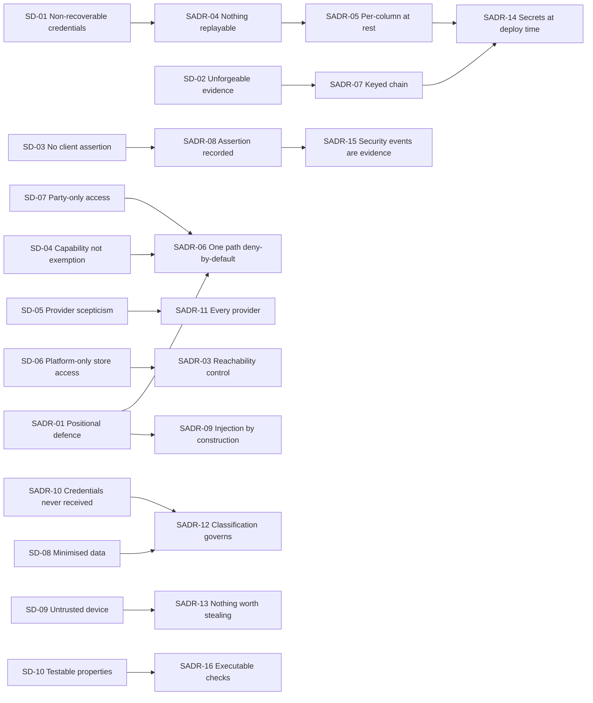
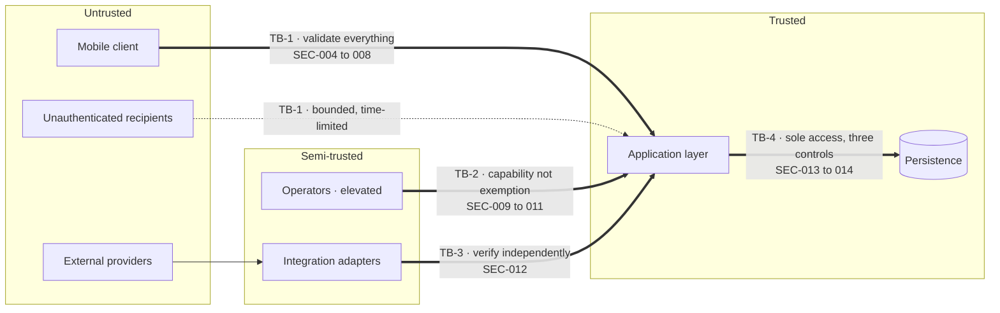
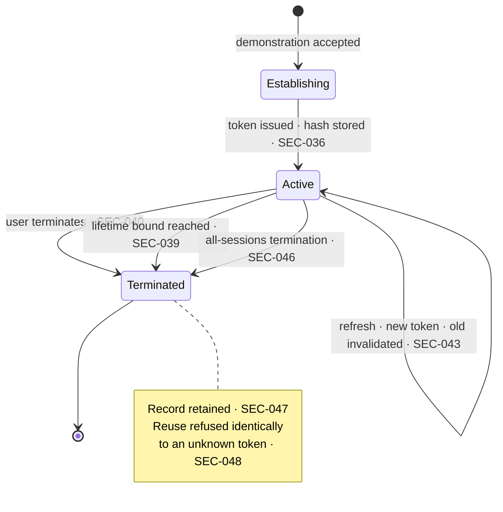
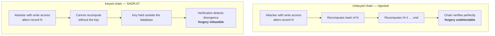
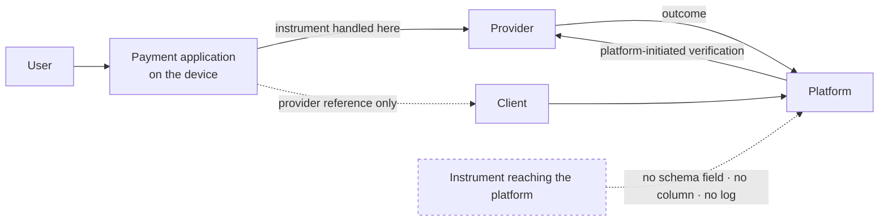

# CMP-DOC-13 — Security Design

**Carpool Mobility Platform (CMP)**

---

# 0. Document Control

## 0.1 Document Metadata

| Field | Value |
|---|---|
| Document ID | CMP-DOC-13 |
| Document Name | Security Design |
| Short Name | SECURITY |
| Project Name | Carpool Mobility Platform |
| Project Code | CMP |
| Version | 0.2 |
| Status | Draft |
| Date | 2026-08-20 |
| Author | Security Analyst (AI-assisted) |
| Reviewer | [TBD] |
| Approver | Project Owner |
| Classification | Internal |
| Brand | TBD |
| Previous Version | 0.1 (2026-08-17) |
| Predecessor Documents | CMP-DOC-01 … CMP-DOC-11, **all Draft, none approved** (CMP-DOC-09 at v0.2, the remainder at v0.1). CMP-DOC-12 does not exist. |
| Related Documents | `00_Project_Control/README.md`, `Documentation_Index.md`, `Documentation_Status.md`, `Document_Change_Log.md`, `Glossary.md`, `Master_Traceability_Matrix.md` |
| Successor Documents | CMP-DOC-14 (Payment & UPI), CMP-DOC-15 (GPS / Live Trip), CMP-DOC-17 (Admin / Filament), CMP-DOC-18 (Testing & QA), CMP-DOC-19 (DevOps / Deployment) |

## 0.2 Revision History

| Version | Date | Author | Change | Status |
|---|---|---|---|---|
| 0.1 | 2026-08-17 | Security Analyst (AI-assisted) | Initial issue. Specifies the security mechanisms deferred here by five predecessors: 10 security drivers, **16 security decisions**, trust boundary defences, authentication, session management, authorisation, protection at rest and in transit, the evidential chain mechanism, injection defence, payment credential handling, client-side security, secrets and key management, abuse posture, the fraud position, logging and response, backup security, and verification. Issues 240 statements (`SEC-001` … `SEC-240`). | Draft |
| 0.2 | 2026-08-20 | Security Analyst (AI-assisted) | **The evidential chain construction ratified and recorded in §14.2.** `SEC-107` required a keyed message authentication construction over a canonical serialisation and left the specific algorithm to §14.2 as a technical decision; §14.2 named no algorithm. The Project Owner ratified **HMAC-SHA-256 over the length-prefixed canonical serialisation of `SEC-108` ‡** on 2026-08-20, and it is now recorded at `SEC-241`. `SEC-242` records that this does not close `SEC-174`: each record continues to carry the construction that produced it, so the choice remains replaceable by a staged migration. Issues 2 statements (`SEC-241`, `SEC-242`); §14 now holds 18. **No existing statement was altered, no ‡ marking changed, and no compliance claim is made — §0.6.2 continues to apply.** | Draft |

## 0.3 Distribution List

| Role | Purpose |
|---|---|
| Project Owner | Approval authority; **five decisions in §21.3 are theirs alone** |
| **Security Analyst** | Authoring and ownership |
| **Backend Developers** | **Primary consumer** |
| **Android Developers** | §13 client-side mechanisms |
| Software Architect — Backend | Consistency with CMP-DOC-09 |
| Backend Lead | Consistency with CMP-DOC-10 and CMP-DOC-11 |
| DevOps Engineer | Secrets, key custody, transport termination, backup protection (§14, §9, §18) |
| QA Analyst | The verification obligations in §19 |
| Product Analyst | The fraud position in §16 and the disclosure limits in §7.4 |

## 0.4 Approval

| Role | Name | Signature | Date |
|---|---|---|---|
| Author | Security Analyst (AI-assisted) | — | 2026-08-17 |
| Reviewer | [TBD] | — | — |
| Approver | Project Owner | — | — |

> **This document is NOT approved.** It is issued at version 0.1 with status `Draft`
> for Project Owner review.

## 0.5 Purpose of This Document

Five documents have deferred mechanism to this one. CMP-DOC-07 `AR-09` recommended
commissioning it early because four security properties were stated and unmechanised.
CMP-DOC-09 deferred session and credential handling. CMP-DOC-10 stated where a credential
is carried and nothing about what it is. CMP-DOC-11 named which columns are protected and
left the protection undefined. CMP-DOC-08 §17.5 required mechanisms for seven on-device
properties.

This document supplies them.

It also does something none of its predecessors could. **Payment credential handling and
injection defence have been stated three times — by an architecture document, an interface
document and a database document — and by no requirements document.** Each disclosed the
gap and passed it on, because none was the right home. This document is the right home,
and §11 and §12 adopt both as security requirements with a stated origin. That closes
`BE-OQ-08`, `BE-OQ-09`, `API-OQ-05` and `DB-OQ-08` together.

## 0.6 Boundaries — What This Document Does Not Specify

| Subject | Owning document |
|---|---|
| Business rules, aggregates, transactions | CMP-DOC-09 |
| Endpoint paths, payloads, status codes | CMP-DOC-10 |
| Tables, columns, keys, indexes | CMP-DOC-11 |
| Screen design and security-relevant copy | CMP-DOC-12 |
| **Payment provider mechanics and UPI flows** | **CMP-DOC-14** |
| Position acquisition behaviour | CMP-DOC-15 |
| Administrative screens | CMP-DOC-17 |
| Test cases and penetration test scope | CMP-DOC-18 |
| **Host hardening, network topology, firewall rules, WAF, TLS termination point** | **CMP-DOC-19** |

### 0.6.1 The Boundary With CMP-DOC-19

This document states **what property must hold** — that transport is authenticated and
confidential, that a secret is not in the artefact, that the evidential account lacks a
privilege. It does not state where TLS terminates, which secret store is used, how hosts
are hardened or how the network is segmented. Those are deployment decisions, and
`SEC-101`, `SEC-168` and `SEC-227` name them as such.

### 0.6.2 What This Document Deliberately Does Not Claim

**FACT.** No compliance, certification or regulatory position is asserted anywhere in
this document.

**No statement here should be read as claiming conformance with any standard, scheme or
regulation, or as establishing what any law requires.** Choices of algorithm and
construction are engineering decisions recorded in §3 with their alternatives; they are
not compliance claims and confer no certification. Whether the platform is subject to a
particular regime, and what that regime requires, is `[TBD – Business Decision Required]`
and is recorded at `SEC-OQ-01`. §19 no-invention rule governs this document as strictly
as any other, and security is the area where an invented claim would be most damaging.

## 0.7 Inputs to This Document

| Input | Contribution |
|---|---|
| CMP-DOC-05 §NFR-053–070 | 18 security quality requirements — the core obligation set |
| CMP-DOC-06 §3.4 | Four trust boundaries and their defence status |
| CMP-DOC-07 `AR-09` | Four unmechanised properties: `ARCH-054`, `059`, `060`, fraud |
| CMP-DOC-08 §14, §17.5 | Seven on-device properties requiring mechanism |
| CMP-DOC-09 `BE-184`, §18.7 | Session and credential handling; two chain gaps |
| CMP-DOC-10 §9, §17.6 | Credential carriage positions; the same two gaps |
| CMP-DOC-11 §18.7 | Hashing scheme, backup protection, the same two gaps |

## 0.8 Qualifications on This Document

### 0.8.1 Source

Every statement derives from a predecessor statement, from a decision recorded in §3, or
is disclosed in §20.6 as originating here.

### 0.8.2 Qualification 1 — Eleven Unapproved Predecessors

**FACT.** CMP-DOC-01 … CMP-DOC-11 are all `Draft`. None is approved. CMP-DOC-12 does not
exist, so this document is produced out of sequence, as CMP-DOC-07 `AR-09` recommended.

Recorded as conflict `CC-012` and as `SEC-RISK-01`.

### 0.8.3 Qualification 2 — Mechanism Is Decidable; Regulatory Position Is Not

**FACT.** No document in the chain states which regulatory regimes apply.

This document specifies **mechanisms**. It states no breach notification period, no
mandatory retention floor, no data residency requirement and no certification target,
because each depends on a legal position nobody has established. §21.3 routes five such
questions to the Project Owner, and **none is answered by a default here.**

### 0.8.4 Qualification 3 — Fraud Is Still Not Owned

**FACT.** `GAP-013` has passed through eleven documents with no requirement, no software
element and no component.

CMP-DOC-07 `AR-09` named fraud as one of four unmechanised properties, which implies this
document should mechanise it. **It cannot.** Fraud detection requires a policy — what
constitutes fraud on this platform, what the response is, and who decides — and no such
policy exists. §16 states precisely what this document *can* provide (a detection surface
already implied by `NFR-069`), states what it cannot, and escalates the decision. **No
fraud rule, threshold or response is invented.**

## 0.9 Statement Classification Convention

As `README.md` §9.1. Markers: **FACT**, **ASSUMPTION**, **BUSINESS DECISION REQUIRED**,
**TECHNICAL DECISION REQUIRED**, **OPEN QUESTION**, **TBD**, **FUTURE CONSIDERATION**,
**RECOMMENDATION**.

## 0.10 Identifier Conventions

| Prefix | Element | Section |
|---|---|---|
| `SEC-nnn` | **Traceable security design statement** | §4–§19 |
| `SADR-nn` | Security Decision Record | §3 |
| `SD-nn` | Security driver | §2 |
| `SEC-ASM-nn` | Assumption | §21.1 |
| `SEC-RISK-nn` | Risk | §21.2 |
| `SEC-OQ-nn` | Open Question | §21.3 |

`SEC-nnn` is the only traceable prefix. A statement marked **‡** is integrity-critical:
its violation would permit an absolute business rule to be broken.

## 0.11 Table of Contents

| § | Title |
|---|---|
| 0 | Document Control |
| 1 | Executive Summary |
| 2 | Security Drivers |
| 3 | Security Decisions |
| 4 | Trust Boundaries |
| 5 | Authentication |
| 6 | Session Management |
| 7 | Authorisation and Disclosure |
| 8 | Protection at Rest |
| 9 | Protection in Transit |
| 10 | The Evidential Chain Mechanism |
| 11 | Input Handling and Injection Defence |
| 12 | Payment Credential Handling |
| 13 | Client-Side Security |
| 14 | Secrets and Key Management |
| 15 | Abuse and Automated Access |
| 16 | Fraud — An Unowned Obligation |
| 17 | Security Logging and Response |
| 18 | Backup and Restore Security |
| 19 | Verification |
| 20 | Traceability |
| 21 | Assumptions, Risks and Open Questions |
| 22 | Acceptance Criteria for This Document |
| 23 | Statistics and Recommendations |
| A | Appendix A — Statement Index |
| B | Appendix B — Decision Index |
| C | Appendix C — Mechanism Index |

---

# 1. Executive Summary

## 1.1 What This Document Delivers

| Element | Count |
|---|---|
| Security drivers | 10 |
| **Security Decision Records** | **16** |
| Security design statements | **242** (`SEC-001` … `SEC-242`) |
| Trust boundaries defended | 4 |
| Mechanisms specified for previously unmechanised properties | 4 |
| Requirement-chain gaps adopted and closed | 2 |
| Verification obligations | 14 |
| Questions routed to the Project Owner | 8 |
| Compliance or certification claims made | **0** |

## 1.2 The Security Position in One Paragraph

Four trust boundaries, each with a stated defence. Authentication is by phone possession
with a rate-bounded attempt path; nothing about a session is held by the client in a form
another application can read. Authorisation is deny-by-default and is evaluated in the
application layer for every caller, including operators, who receive capability and never
exemption. Data in transit is authenticated and confidential with no configuration that
weakens it; data at rest is protected by column, with authentication material held in a
form no store can return. The evidential chain is a keyed hash over an ordered record set,
verified on a schedule and defended primarily by a database privilege the application does
not hold. Injection is prevented by construction rather than by filtering, and payment
credentials are prevented by never entering the platform at all. Fraud is not mechanised,
because nobody has decided what it is.

## 1.3 The Four Decisions That Shape Everything Else

| SADR | Decision | Why it dominates |
|---|---|---|
| **`SADR-04`** | Authentication material is stored under a **memory-hard, salted, tunable password hash**, and session tokens are stored **hashed** so that a store read yields nothing usable. | `NFR-053` requires credentials not recoverable from any store the platform controls. "Any store" includes the session table, which is the one usually forgotten. |
| **`SADR-07`** | The evidential chain is a **keyed** hash, and the key lives outside the database. | An unkeyed chain is re-computable: anyone who can write the table can rewrite the history *and* its hashes. `DB-118`'s privilege separation is the primary defence; the key is what makes forgery infeasible for someone who defeats it. |
| **`SADR-09`** | Injection is prevented **by construction** — parameter binding, allow-listed identifiers, no dynamic statement assembly — and never by input filtering. | Filtering is a denylist, and a denylist is a bet that you enumerated the attacker's vocabulary. This adopts `BE-102`, `API-109` and `DB-038`, which no requirements document ever stated. |
| **`SADR-10`** | Payment credentials never enter the platform: the payment application handles them and the platform receives only a provider reference. | `BE-097`, `API-053` and `DB-037` each said "do not store". This says *do not receive*, which is the only version that cannot be violated by a logging change. |

## 1.4 What This Document Closes

| Deferred item | Deferred by | Closed by |
|---|---|---|
| `ARCH-054` evidential chain mechanism | CMP-DOC-07 `AR-09` | §10, `SADR-07` |
| `ARCH-059` protected form at rest | CMP-DOC-07 `AR-09` | §8, `SADR-05` |
| `ARCH-060` non-recoverable credentials | CMP-DOC-07 `AR-09` | §5, `SADR-04` |
| `BE-184` session and credential handling | CMP-DOC-09 | §5, §6 |
| `MOB-143`–`MOB-149` on-device mechanisms | CMP-DOC-08 §17.5 | §13 |
| `DB-110` hashing scheme | CMP-DOC-11 §18.7 | `SEC-107` |
| `DB-229` backup protection | CMP-DOC-11 §18.7 | §18 |
| **Payment credential requirement gap** | CMP-DOC-09, 10, 11 | §12 — **adopted here** |
| **Injection defence requirement gap** | CMP-DOC-09, 10, 11 | §11 — **adopted here** |

## 1.5 What This Document Could Not Settle

| Matter | Position |
|---|---|
| Fraud | §16 — detection surface stated, policy absent, decision escalated |
| Regulatory regime and its requirements | `SEC-OQ-01` — no default assumed |
| Breach notification obligations and timing | `SEC-OQ-02` — legal, not technical |
| Data residency | `SEC-OQ-03` |
| Penetration testing and independent review | `SEC-OQ-04` — scope and cadence unset |
| Key rotation periods | `SEC-171` — all `[TBD]` |
| Rate limit values | `SEC-183` — configuration, values unset |

---

# 2. Security Drivers

| ID | Driver | Source | Consequence |
|---|---|---|---|
| `SD-01` | A credential must not be recoverable from any store the platform controls. | `NFR-053`, `ARCH-060` | `SADR-04`: password hashing and hashed session tokens. |
| `SD-02` | Evidence must be unforgeable, not merely unaltered. | `NFR-068`, `ARCH-054` | `SADR-07`: keyed chain, key outside the database. |
| `SD-03` | Nothing arriving from a client may determine authoritative state. | `TB-1`, `NFR-067` | `SADR-08`: validation against state, integrity events on assertion. |
| `SD-04` | An operator gains capability, never exemption. | `TB-2`, `NFR-059` | `SADR-06`: identical authorisation path, elevated capability only. |
| `SD-05` | Nothing a provider reports is authoritative without verification. | `TB-3`, `SRS-REQ-143` | `SADR-11`: plausibility validation on every provider response, not only payment. |
| `SD-06` | Only the platform may reach the store. | `TB-4`, `BAD-RULE-003` | `SADR-03`: three accounts, network reachability, no issued credential. |
| `SD-07` | A user may reach only records they are party to. | `NFR-061`, `API-049` | `SADR-06`: relationship evaluated against state, deny-by-default. |
| `SD-08` | Personal data must be minimised and bounded in disclosure. | `NFR-065`, `NFR-066` | `SADR-12`: purpose-bound collection, classified columns. |
| `SD-09` | The device is not a trusted store. | `MOB-143`–`149`, `TB-1` | `SADR-13`: platform-backed keystore, nothing sensitive at rest on device. |
| `SD-10` | A security property must be testable, or it is an aspiration. | `NFR-106`, `DB-207` | `SADR-16`: 14 verification obligations, each an executable check. |

---

# 3. Security Decisions

Each decision records its context, the alternatives considered, and its consequences
**including the negative ones**, marked ✘. **None constitutes a compliance claim** (§0.6.2).

## 3.1 `SADR-01` — Defence Is Positional, Not Perimeter-Based

| | |
|---|---|
| **Context** | The chain has already placed authorisation in the application layer (`BE-179`), forbidden middleware-only enforcement (`BE-180`), and required the admin surface to traverse the same path (`BE-108`). A perimeter model — trust everything inside — would contradict all three. |
| **Decision** | **Every control is placed at the boundary it defends, and no control depends on the caller having already been filtered by something in front of it. A gateway, a firewall or a WAF may exist and may help, but no statement in this document is satisfied by one.** |
| **Alternatives** | *(a)* Perimeter model with a trusted interior — rejected: `TB-2` puts a semi-trusted actor inside the perimeter, and the operator is precisely the actor `NFR-059` is about. *(b)* Rely on a WAF for injection defence — rejected: `SADR-09` prevents by construction; a WAF is a second layer that must never be the first. |
| **Consequences** | ✔ Controls survive a change of deployment topology. ✔ CMP-DOC-19 can add perimeter defences without any statement here becoming redundant or contradictory. ✘ Each control must be implemented in the application rather than configured once. ✘ Some checks are repeated per caller type. |

## 3.2 `SADR-02` — Authentication Is Phone Possession, and Its Limits Are Stated

| | |
|---|---|
| **Context** | `FRD-FR-007`–`FRD-FR-016` establish phone verification as the account route. `NFR-056` and `NFR-057` bound attempt rates. No document specifies a second factor, and none requires one. |
| **Decision** | **Authentication is demonstration of possession of a verified phone number, with a bounded attempt rate and a bounded demonstration lifetime. The platform holds a demonstration only in non-recoverable form. A second factor is not specified, and §5.5 states plainly what that means for the threat model rather than leaving it implicit.** |
| **Alternatives** | *(a)* Add a password — rejected: no requirement asks for one, and a password adds a credential to steal without adding a factor most users would keep distinct. *(b)* Add a second factor now — rejected as invention: no requirement, no business decision, and it changes the registration journey CMP-DOC-03 specified. |
| **Consequences** | ✔ Matches the specified journey exactly and adds no unrequested friction. ✔ Attempt bounding is the control that carries the weight, and it is stated. ✘ **Account takeover via phone number takeover is not defended against**, and §5.5 says so. ✘ A user changing number needs a recovery path that `SEC-OQ-05` records as unspecified. |

## 3.3 `SADR-03` — Reachability Is a Control, Not a Configuration Detail

| | |
|---|---|
| **Context** | `BAD-RULE-003` and `ARCH-010` require that no component other than the platform reach the database. `DADR-09` created three accounts. A grant limits what an account may do; it does not limit who may attempt to use it. |
| **Decision** | **Database credentials are issued to the platform's own processes only, are never present in a client artefact, and the store accepts connections only from the platform. Reachability, credential issuance and grant are three separate controls and all three are required.** |
| **Alternatives** | *(a)* Grants alone — rejected: an account reachable from anywhere is an account subject to credential stuffing. *(b)* Network restriction alone — rejected: does not constrain what a compromised platform process may do, which is what `DB-118` is for. |
| **Consequences** | ✔ `TB-4` has three independent defences. ✔ A leaked credential is not sufficient on its own. ✘ Network reachability is a deployment concern, so `SEC-013` places an obligation on CMP-DOC-19 rather than resolving it here. |

## 3.4 `SADR-04` — Nothing in Any Store Is Replayable

| | |
|---|---|
| **Context** | `NFR-053` requires credentials not recoverable from **any store the platform controls**. Password hashing is the familiar half. The half usually missed is the session table: a stored session token is a bearer credential, and a store read hands the reader live sessions. |
| **Decision** | **Authentication material is stored under a memory-hard, salted, tunable password hash. Session tokens are stored as a hash of the token, never the token. Verification demonstrations are stored hashed. A read of any store yields nothing that can be presented back to the platform.** |
| **Alternatives** | *(a)* Fast general-purpose hash for credentials — rejected: designed to be fast, which is the attacker's requirement, not ours. *(b)* Reversible encryption of session tokens — rejected: a key that can decrypt them is a key that exists, and `NFR-053` says not recoverable. *(c)* Store tokens in clear because they expire — rejected: `NFR-055` bounds lifetime but a live window is a live window. |
| **Consequences** | ✔ `NFR-053` holds for every store, not only the obvious one. ✔ Session validation becomes a hash-and-lookup, which is an index seek. ✘ A session token cannot be recovered for support purposes — deliberate. ✘ Hash cost parameters need tuning against real hardware; `SEC-024` makes them configuration and `SEC-025` records that they are unset. |

## 3.5 `SADR-05` — Protection at Rest Is Per Column, Not Per Database

| | |
|---|---|
| **Context** | `ARCH-059` and `SRS-REQ-097` require identity evidence and payment-related data in protected form. `DB-035` marked the columns. Full-disk or tablespace encryption protects against a stolen disk and against nothing else — a compromised application reads plaintext through it. |
| **Decision** | **Columns classified as protected are encrypted at the application boundary before they reach the database, with keys held outside it. Storage-level encryption may additionally be deployed and is not a substitute. `DB-176`'s classification is the authority for which columns these are.** |
| **Alternatives** | *(a)* Storage-level encryption only — rejected: defends the disk, not the data, and `SRS-REQ-097` is about the data. *(b)* Encrypt everything at the application boundary — rejected: makes most columns unindexable and unqueryable for no threat reduction. |
| **Consequences** | ✔ A database read by an unauthorised party yields ciphertext for the data that matters. ✔ The protected set is explicit and reviewable. ✘ Protected columns cannot be searched or indexed on their content; `SEC-079` states the consequence for operator search. ✘ Key custody becomes essential and is §14's subject. |

## 3.6 `SADR-06` — One Authorisation Path, Deny by Default

| | |
|---|---|
| **Context** | `BE-179`, `ARCH-031`, `ARCH-134`, `API-096`, `API-098`. `TB-2` is the boundary CMP-DOC-06 called partially defended: an operator is authenticated and elevated, and the risk is exemption rather than intrusion. |
| **Decision** | **One authorisation evaluation, in the application layer, for every caller — client, operator, worker, safety surface. Deny by default: an operation with no stated rule is refused. An operator role grants additional capability and never an exemption from an absolute rule; an attempt to exceed is refused in whole and recorded.** |
| **Alternatives** | *(a)* Separate admin authorisation — rejected: two paths diverge, and the one used less is the one that rots. *(b)* Allow-by-default for internal callers — rejected: `ARCH-134`. |
| **Consequences** | ✔ `TB-1` and `TB-2` are defended by the same code, so a fix to one fixes both. ✔ A new operation is refused until someone states its rule, which fails safe. ✘ Every operation needs an explicit rule before it works at all. ✘ Operator frustration is a real cost of `NFR-059` and is not a defect. |

## 3.7 `SADR-07` — The Evidential Chain Is Keyed, With the Key Outside the Database

| | |
|---|---|
| **Context** | `ARCH-054` requires a chained integrity value; `NFR-068` requires alteration to be undetectable-proof; `DB-110` requires the hash and defers the scheme here; `DB-118` withholds `UPDATE` from the application. An unkeyed chain has a specific weakness: anyone who can write the table can rewrite a record *and recompute every subsequent hash*, leaving a chain that verifies perfectly. |
| **Decision** | **Each record carries a keyed hash over its content and its predecessor's hash. The key is held outside the database, in the same custody as other application secrets, and is never readable through a database connection. Verification recomputes the chain with the key and reports the first divergence.** |
| **Alternatives** | *(a)* Unkeyed hash chain — rejected: forgeable by anyone with write access, which is the threat `DB-118` already treats as realistic enough to remove a privilege for. *(b)* External timestamping or anchoring — rejected as disproportionate now, recorded as a `FUTURE CONSIDERATION` at `SEC-118`. |
| **Consequences** | ✔ Rewriting history requires both write access **and** the key, held in different places. ✔ `NFR-068` becomes a defensible claim rather than a hopeful one. ✘ Losing the key makes the chain unverifiable — not the data unreadable, but the guarantee void. `SEC-172` requires key escrow for exactly this. ✘ Verification cost grows with the log; `SEC-114` makes it incremental with checkpoints. |

## 3.8 `SADR-08` — Assertion Attempts Are Recorded as Security Events

| | |
|---|---|
| **Context** | `NFR-067` requires rejection of client-supplied values purporting to determine authoritative state; `NFR-069` requires detection and recording; `ARCH-133` requires rejection in whole plus an integrity event; `API-039` gives it a trigger point at the schema. Rejecting is defence. Recording is intelligence. |
| **Decision** | **A request containing a field matching a known authoritative name is refused in whole and recorded as a security event with actor, field and time. Repetition by one actor is itself a signal, and §15 treats it as abuse.** |
| **Alternatives** | *(a)* Reject silently — rejected: `NFR-069` requires detection, and silence loses the only early warning of a client probing the boundary. |
| **Consequences** | ✔ `TB-1` produces evidence, not only refusals. ✔ Gives §16 a real detection surface without inventing a fraud policy. ✘ A buggy client generates noise; `SEC-190` requires the signal to be distinguishable by actor and pattern rather than by volume alone. |

## 3.9 `SADR-09` — Injection Is Prevented by Construction

| | |
|---|---|
| **Context** | `BE-102`, `API-109` and `DB-038` each state it. **No requirements document does** — this is one of the two chain gaps CMP-DOC-09 §18.7 disclosed. Input filtering is the common alternative and it is a denylist, which assumes the defender enumerated the attacker's vocabulary. |
| **Decision** | **Every value originating outside the platform is bound as a parameter and never concatenated into a statement, a command, a path, a template or a redirect. Where a structural element must vary — a column name for sorting — it is selected from a fixed allow-list, never constructed. Input filtering is not a control and is not relied on anywhere.** |
| **Alternatives** | *(a)* Escaping — rejected: correct escaping is context-dependent and a value that crosses contexts is escaped for the wrong one. *(b)* WAF filtering — rejected as a primary control by `SADR-01`. |
| **Consequences** | ✔ The defence does not depend on predicting attacks. ✔ Testable by static analysis, so `SEC-131` adds it to the eight structural rules `BADR-18` already enforces. ✘ Dynamic query construction becomes deliberately awkward, which is the point. ✘ Sorting and filtering need allow-lists maintained alongside the access paths in `DB-193`. |

## 3.10 `SADR-10` — Payment Credentials Are Never Received

| | |
|---|---|
| **Context** | `BE-097`, `API-053` and `DB-037` all say "never stored". `BAD-RULE-031` and `BAD-RULE-032` establish that a client-side payment application response is not evidence. **No requirements document states any of it** — the second chain gap. "Never stored" is a weaker claim than it sounds: a value received and not stored is still in memory, in a log buffer, in a crash dump and in a proxy access log. |
| **Decision** | **The platform never receives a payment instrument credential. The payment application handles the instrument; the platform receives a provider reference and a verification outcome. No request schema accepts an instrument field (`API-037`), no column exists for one (`DB-037`), and no provider response body containing one is persisted or logged (`DB-151`).** |
| **Alternatives** | *(a)* Receive and immediately discard — rejected: it is then in memory, in logs and in dumps, and "discard" is a promise about code paths nobody has enumerated. *(b)* Receive and tokenise in-platform — rejected: makes the platform the custodian of exactly the data it should not hold. |
| **Consequences** | ✔ The strongest available form of the claim: the data is not there to leak. ✔ Verifiable by schema inspection rather than by log review. ✘ The platform depends entirely on the provider's handling, which `SEC-142` records as an assumption to verify per provider in CMP-DOC-14. ✘ Some support scenarios are harder without instrument detail — deliberate. |

## 3.11 `SADR-11` — Provider Scepticism Applies to Every Provider

| | |
|---|---|
| **Context** | CMP-DOC-06 §3.4 named this explicitly: `TB-3` is well defended for payment because `BAD-RULE-032` made client-side payment evidence an absolute rule, and **weaker elsewhere**. A routing service returning an implausible route, or a verification service returning an unexpected result, met no stated validation obligation until `SRS-REQ-105` and `SRS-REQ-106`. |
| **Decision** | **Every adapter validates its provider's response for plausibility before returning it, not only the payment adapter. A response failing plausibility is treated as `Unavailable`, never as a result. No provider response is treated as authoritative without independent verification where a business decision depends on it.** |
| **Alternatives** | *(a)* Validate payment only — rejected: this is the weakness CMP-DOC-06 named, and leaving it is choosing to leave it. |
| **Consequences** | ✔ `TB-3` is uniformly defended. ✔ A provider defect degrades to unavailability rather than to a wrong business outcome. ✘ Plausibility rules must be written per provider capability; `SEC-060` requires them stated in CMP-DOC-14 and CMP-DOC-15 rather than left to the adapter author. |

## 3.12 `SADR-12` — Personal Data Is Classified, and Classification Governs

| | |
|---|---|
| **Context** | `NFR-065` requires minimisation to a stated purpose; `NFR-066` bounds disclosure between users; `NFR-061` and `NFR-064` bound access; `DB-176` already requires each personal column to carry a retention classification. Four requirements about the same data, applied in four places, will diverge unless one classification drives them all. |
| **Decision** | **Each personal data element carries one classification recording its purpose, its disclosure scope, its protection requirement and its retention treatment. Collection, disclosure, protection and removal all read that classification. A new element without one fails review.** |
| **Alternatives** | *(a)* Four independent lists — rejected: they diverge, and the divergence is discovered by disclosing something. *(b)* Classification as documentation only — rejected: then it is advice, and `DB-177` already makes it a gate. |
| **Consequences** | ✔ One place to change, four behaviours updated. ✔ `NFR-065` becomes checkable: an element with no stated purpose is a finding. ✘ Requires the classification to be maintained as the schema evolves; `SEC-088` places it in migration review alongside `DB-216`. ✘ **The disclosure scopes themselves are `[TBD – Business Decision Required]`** (`NFR-066`), so the mechanism is complete and partly unpopulated. |

## 3.13 `SADR-13` — The Device Holds Nothing Worth Stealing

| | |
|---|---|
| **Context** | CMP-DOC-08 §17.5 requires mechanisms for `MOB-143`–`149`. `MOB-067` already established that the outbox holds no authoritative value and `MOB-017` that the cache is non-authoritative. The device is untrusted (`TB-1`) and may be rooted, backed up, or shared. |
| **Decision** | **Session material is held in the platform-provided hardware-backed keystore and cleared on session end. Identity evidence is never persisted on the device. Cached business data and outbox content are stored in application-private storage, excluded from device backup, and hold nothing authoritative. The client detects nothing about device integrity and makes no decision on it.** |
| **Alternatives** | *(a)* Root or tamper detection gating functionality — rejected: it is an arms race the platform cannot win on someone else's hardware, it breaks legitimate users, and `MOB-036` already forbids the client deciding anything that matters. *(b)* Client-side encryption with an app-held key — rejected: the key is on the same device as the data. |
| **Consequences** | ✔ A compromised device yields a session that can be terminated and cached data that is not authoritative. ✔ No functionality depends on an unwinnable detection. ✘ **A compromised device can act as the user for the session's lifetime**, bounded only by `NFR-055`; §13.6 states this plainly. ✘ Backup exclusion means a user restoring a device re-authenticates. |

## 3.14 `SADR-14` — Secrets Are Supplied at Deploy Time and Never in the Artefact

| | |
|---|---|
| **Context** | `NFR-108` and `ARCH-145` require environment-varying configuration outside the built artefact and not runtime-editable. `BE-015`, `BE-103` and `DB-103` restate it. Secrets are the subset where the consequence of getting it wrong is unrecoverable. |
| **Decision** | **No secret — database credential, chain key, encryption key, provider credential, signing key — appears in source, in a build artefact, in an image, in a repository or in a log. Secrets are supplied at deploy time from a store CMP-DOC-19 selects, and are readable only by the process that needs them.** |
| **Alternatives** | *(a)* Encrypted secrets in the repository — rejected: relocates the problem to the decryption key, which then lives somewhere too. *(b)* Environment variables set by hand — rejected: no rotation path, no audit, and they appear in process listings and crash dumps. |
| **Consequences** | ✔ A repository leak is not a credential leak. ✔ Rotation becomes possible, which `SEC-171` requires and does not schedule. ✘ Local development needs its own non-production secrets and a way to get them; `SEC-176` requires them to be distinct and never shared with production. ✘ The secret store is a dependency at start-up. |

## 3.15 `SADR-15` — Security Events Are Evidential Records

| | |
|---|---|
| **Context** | `NFR-060` requires every refused authorisation recorded; `NFR-069` requires assertion attempts recorded; `BE-114` requires refusals evidenced; `BE-202` distinguishes operational logging from the evidential log and forbids substitution. Security events could go to either. |
| **Decision** | **Security events that concern an actor's conduct — refused authorisation, assertion attempt, rate-limit breach, operator override — are evidential records, written by the evidential writer. Security events that concern the platform's own health are operational logs. The distinction is whether the record is about someone.** |
| **Alternatives** | *(a)* All security events to operational logs — rejected: operational logs are mutable and retention-bounded, and `NFR-060` records are exactly what a dispute needs. *(b)* A third store — rejected: a third retention rule and a third integrity story for no gain. |
| **Consequences** | ✔ Conduct records inherit append-only, chaining and the privilege separation. ✔ One integrity story rather than two. ✘ The evidential log grows faster, which feeds `DB-107`'s unresolved archival decision. ✘ Noise from a buggy client lands in the evidential log; `SEC-190` requires rate-limit records to be aggregated rather than per-request. |

## 3.16 `SADR-16` — Every Property Has an Executable Check

| | |
|---|---|
| **Context** | `NFR-106` requires an automated test for every integrity-critical requirement. `DB-207` requires one per database constraint. `BADR-18` enforces eight structural rules in the build. A security property with no check is an intention. |
| **Decision** | **Every mechanism in this document has a verification obligation in §19: a test, a static analysis rule, or an automated inspection of a grant or a configuration. Fourteen are stated. A property that cannot be checked is recorded as unverified rather than presented as satisfied.** |
| **Alternatives** | *(a)* Rely on review — rejected: review catches what it looks for once; a check catches it on every commit. *(b)* Rely on penetration testing — rejected: `SEC-OQ-04` records that its scope and cadence are unset, and it is a sample, not a guarantee. |
| **Consequences** | ✔ Security regressions fail the build rather than surfacing in an incident. ✔ CMP-DOC-18 inherits a definite obligation set. ✘ Fourteen checks to build and maintain. ✘ Three properties in §19.4 **cannot** be checked automatically and are recorded as requiring review — honestly, rather than being padded with a weak test. |

## 3.17 Driver to Decision Map

---

# 4. Trust Boundaries

| ID | Statement | Src |
|---|---|---|
| `SEC-001` | Four trust boundaries shall be defended, and each control shall name the boundary it defends. | `SADR-01`, CMP-DOC-06 §3.4 |
| `SEC-002` | No control shall depend on a caller having been filtered by a component in front of the application. | `SADR-01`, `BE-180` |
| `SEC-003` | A perimeter control may exist as an additional layer and shall not satisfy any statement in this document. | `SADR-01` |

## 4.1 `TB-1` — Client to Platform

| ID | Statement | Src |
|---|---|---|
| `SEC-004` ‡ | Every inbound value shall be validated against platform state before use, irrespective of origin. | `ARCH-131`, `API-040` |
| `SEC-005` ‡ | No inbound value shall be capable of determining authoritative state. | `NFR-067`, `API-036` |
| `SEC-006` ‡ | An attempt to assert authoritative state shall be refused in whole and recorded as a security event. | `SADR-08`, `ARCH-133` |
| `SEC-007` ‡ | Capability exposed to an unauthenticated recipient shall be treated as crossing `TB-1`, and what such a recipient may see shall be bounded and time-limited by policy configuration. | `SRS-REQ-135`, `ARCH-137` |
| `SEC-008` | Well-formedness validation performed by the client shall not reduce any platform-side validation. | `MOB-038`, `API-041` |

## 4.2 `TB-2` — Operator to Platform

| ID | Statement | Src |
|---|---|---|
| `SEC-009` ‡ | An operator request shall traverse the same authorisation evaluation and the same validation as a client request. | `ARCH-132`, `API-042`, `API-108` |
| `SEC-010` ‡ | An operator role shall grant additional capability and shall never grant exemption from an absolute business rule. | `NFR-059`, `SADR-06` |
| `SEC-011` ‡ | An operator action that would breach an absolute rule shall be refused in whole and the attempt recorded. | `SRS-REQ-071`, `SRS-REQ-074` |

## 4.3 `TB-3` — Provider to Platform

| ID | Statement | Src |
|---|---|---|
| `SEC-012` ‡ | Every adapter shall validate its provider's response for plausibility before returning it, and a response failing plausibility shall be reported as unavailable rather than as a result. | `SADR-11`, `SRS-REQ-105` |

## 4.4 `TB-4` — Platform to Persistence

| ID | Statement | Src |
|---|---|---|
| `SEC-013` ‡ | The store shall accept connections only from the platform's own processes; network reachability is a deployment obligation on CMP-DOC-19. | `SADR-03`, `ARCH-010` |
| `SEC-014` ‡ | No database credential shall be present in any client artefact, in any repository, or in any component other than the platform. | `SADR-03`, `SADR-14`, `BE-104` |

---

# 5. Authentication

## 5.1 Mechanism

| ID | Statement | Src |
|---|---|---|
| `SEC-015` | Authentication shall be demonstration of possession of a verified phone number. | `SADR-02`, `FRD-FR-007` |
| `SEC-016` ‡ | A demonstration shall be stored only in non-recoverable form. | `SADR-04`, `NFR-053` |
| `SEC-017` | A demonstration shall have a bounded lifetime, and the bound shall be policy configuration. | `NFR-055`, `BADR-12` |
| `SEC-018` ‡ | A demonstration shall be single-use; acceptance shall invalidate it. | `SADR-02` |
| `SEC-019` | A demonstration shall be generated with a cryptographically secure random source. | `SADR-04` |
| `SEC-020` ‡ | Comparison of a demonstration shall be performed in constant time with respect to its content. | `SADR-04` |
| `SEC-021` | The platform shall not disclose whether a phone number is registered in response to an authentication attempt. | `NFR-061`, `SADR-06` |

## 5.2 Attempt Bounding

| ID | Statement | Src |
|---|---|---|
| `SEC-022` ‡ | Authentication attempts against an account shall be rate-bounded. | `NFR-056` |
| `SEC-023` ‡ | Verification attempts against a phone number shall be rate-bounded independently of any session. | `NFR-057`, `API-201` |
| `SEC-024` | Attempt limits, windows and lockout behaviour shall be policy configuration. | `BADR-12`, `NFR-057` |
| `SEC-025` | Their values are `[TBD – Business Decision Required]`; a limit too low denies service to a legitimate user on a poor network and a limit too high denies nothing. | `NFR-057`, `GAP-012` |
| `SEC-026` ‡ | Exhaustion of an attempt limit shall be a business refusal carrying its own reason identifier, and shall be recorded. | `FRD-FR-011`, `API-199` |
| `SEC-027` | Attempt bounding shall not depend on a client-supplied identifier the client controls. | `API-205` |

## 5.3 Credential Storage

| ID | Statement | Src |
|---|---|---|
| `SEC-028` ‡ | Authentication material shall be stored under a memory-hard, salted, tunable password hash. | `SADR-04`, `ARCH-060` |
| `SEC-029` ‡ | Each stored value shall carry a unique salt. | `SADR-04` |
| `SEC-030` | Hash cost parameters shall be configuration, tunable without a code change, and shall be re-tuned when hardware changes. | `SADR-04`, `SEC-024` |
| `SEC-031` | Cost parameter values are `[TBD – Technical Decision Required]`; they must be set against the deployed hardware, which is CMP-DOC-19's. | `SADR-04`, `GAP-016` |
| `SEC-032` ‡ | A stored value shall be re-hashed on next successful authentication when its parameters are below the current setting. | `SEC-030` |
| `SEC-033` ‡ | No store the platform controls shall hold any value that can be presented back to the platform as a credential. | `NFR-053`, `SADR-04` |

## 5.4 Recovery

| ID | Statement | Src |
|---|---|---|
| `SEC-034` | Account recovery where a user loses access to their verified number is **not specified by any predecessor**, and no mechanism is invented here. Recorded as `SEC-OQ-05`. | `SADR-02`, §20.6 |

## 5.5 What This Authentication Does Not Defend Against

**FACT.** Stated plainly rather than left implicit, because a threat model that omits its
own limits is not a threat model.

| Not defended | Consequence | Position |
|---|---|---|
| Takeover of the user's phone number by their carrier or by a subscriber-identity attack | Full account takeover | No second factor is specified by any requirement. `SEC-OQ-06` |
| Interception of a verification demonstration in transit to the device | Account takeover within the demonstration's lifetime | Bounded by `SEC-017` and `SEC-018`, not eliminated |
| A device already under an attacker's control | Action as the user for the session lifetime | `SADR-13`, §13.6 |

> **This is not a recommendation to add a second factor.** No requirement asks for one,
> and adding one would change the registration journey CMP-DOC-03 specified. It is a
> statement of what the specified design does and does not achieve, so that the Project
> Owner decides with the limitation visible rather than discovering it later.

---

# 6. Session Management

| ID | Statement | Src |
|---|---|---|
| `SEC-035` ‡ | A session token shall be generated with a cryptographically secure random source and shall carry sufficient entropy that guessing is infeasible. | `SADR-04` |
| `SEC-036` ‡ | The platform shall store a hash of the token, never the token. | `SADR-04`, `NFR-053` |
| `SEC-037` ‡ | A token shall be carried in a request header and never in a URI, a query parameter or a body field. | `API-100`, `NFR-062` |
| `SEC-038` ‡ | A token shall never appear in a response body, in a log, in a diagnostic record or in an error message. | `API-101`, `NFR-123` |
| `SEC-039` ‡ | Session lifetime shall be bounded, and the bound shall be policy configuration. | `NFR-055`, `API-104` |
| `SEC-040` ‡ | A terminated session shall be recorded as terminated and shall be unusable thereafter. | `NFR-054`, `DB-044` |
| `SEC-041` ‡ | Session state shall be held in the store and not in application-instance memory. | `ARCH-139`, `ARCH-138` |
| `SEC-042` | Session validation shall be a hash-and-lookup against the store on every request. | `SADR-04`, `SEC-036` |
| `SEC-043` | Refresh shall issue a new token and invalidate the previous one. | `API-102`, `SEC-040` |
| `SEC-044` ‡ | A session shall be bound to the actor it authenticated and shall not be transferable. | `API-099`, `SADR-06` |
| `SEC-045` ‡ | A session shall carry no authorisation claim; entitlement shall be evaluated against platform state on every request. | `BE-181`, `API-099` |
| `SEC-046` | Terminating all of a user's sessions shall be possible as a single operation, for use when compromise is suspected. | `NFR-054`, `SADR-13` |
| `SEC-047` | Session records shall be retained after termination for the period `DB-169` sets, so that reuse attempts remain detectable. | `DB-044`, `NFR-054` |
| `SEC-048` ‡ | A request bearing a terminated, expired or unknown token shall be refused identically, so that the three are indistinguishable to a caller. | `API-107`, `NFR-061` |
| `SEC-049` | Concurrent sessions per user shall be permitted, and their number shall be policy configuration. | `BADR-12`, `[TBD – Business Decision Required]` |
| `SEC-050` | Session establishment, refresh and termination shall each be evidenced. | `SADR-15`, `NFR-125` |
| `SEC-051` ‡ | No session shall be established for a caller whose account state does not permit it. | `SADR-06`, `DB-045` |
| `SEC-052` | Session material on the device is `SADR-13`'s subject and is specified in §13.1. | §13.1 |

---

# 7. Authorisation and Disclosure

## 7.1 Evaluation

| ID | Statement | Src |
|---|---|---|
| `SEC-053` ‡ | Authorisation shall be evaluated in the application layer on every operation and every caller. | `BE-179`, `ARCH-031` |
| `SEC-054` ‡ | Authorisation shall not be implemented in transport middleware alone. | `BE-180`, `API-097` |
| `SEC-055` ‡ | Authorisation shall be deny-by-default; an operation with no stated rule shall be refused. | `ARCH-134`, `API-098` |
| `SEC-056` ‡ | Ownership and relationship shall be evaluated against platform state, never against an inbound claim. | `BE-181`, `API-099` |
| `SEC-057` ‡ | Every refused authorisation shall be recorded. | `NFR-060`, `ARCH-135` |
| `SEC-058` ‡ | No operation shall permit a caller to alter their own entitlement. | `API-105`, `ARCH-121` |
| `SEC-059` | An authorisation rule shall be expressed once and evaluated identically for every caller type. | `SADR-06`, `SRS-REQ-126` |
| `SEC-060` | Plausibility rules for each provider capability shall be stated in the document owning that capability, not left to the adapter author. | `SADR-11`, `SEC-012` |

## 7.2 Roles

| ID | Statement | Src |
|---|---|---|
| `SEC-061` | Administrative capability shall be restricted by administrative role, evaluated in the application layer. | `ARCH-045`, `BE-080` |
| `SEC-062` ‡ | No role shall exist that is exempt from an absolute business rule. | `NFR-059`, `SADR-06` |
| `SEC-063` | Role definitions and their capabilities are `[TBD – Business Decision Required]`; the mechanism is specified and the role set is not. | `ARCH-045`, CMP-DOC-17 |
| `SEC-064` | A role change shall be evidenced with actor, previous role and new role. | `SADR-15`, `NFR-059` |

## 7.3 Disclosure

| ID | Statement | Src |
|---|---|---|
| `SEC-065` ‡ | A caller shall receive only the fields their relationship entitles them to. | `ARCH-125`, `API-049` |
| `SEC-066` ‡ | A user shall access only records to which they are a party. | `NFR-061` |
| `SEC-067` ‡ | Location history shall be accessible only to parties entitled to it. | `NFR-064` |
| `SEC-068` ‡ | A counterparty's precise home or personal location shall not be disclosed beyond what coordinating a trip requires. | `BAD-RULE-025`, `API-051` |
| `SEC-069` ‡ | Absence and non-entitlement shall be indistinguishable to a caller, so that existence cannot be probed. | `API-094`, `API-014` |
| `SEC-070` | Disclosure scopes between users are `[TBD – Business Decision Required]`; `NFR-066` requires them bounded by a business decision that has not been taken. | `NFR-066`, `SADR-12` |

---

# 8. Protection at Rest

| ID | Statement | Src |
|---|---|---|
| `SEC-071` ‡ | Columns classified as protected shall be encrypted at the application boundary before reaching the database. | `SADR-05`, `ARCH-059` |
| `SEC-072` ‡ | Keys for those columns shall be held outside the database and shall not be readable through a database connection. | `SADR-05`, `SADR-14` |
| `SEC-073` | Storage-level encryption may additionally be deployed and shall not substitute for `SEC-071`. | `SADR-05` |
| `SEC-074` ‡ | Identity evidence shall be protected. | `SRS-REQ-097`, `NFR-063` |
| `SEC-075` ‡ | Payment-related data shall be protected, and payment instrument credentials shall not be present at all. | `NFR-063`, `SADR-10` |
| `SEC-076` ‡ | Authentication material shall be non-recoverable, which is a stronger requirement than protected. | `SRS-REQ-098`, `SEC-028` |
| `SEC-077` | The protected column set shall be `DB-035`'s classification, and shall not be maintained as a second list. | `SADR-12`, `DB-176` |
| `SEC-078` | A column added without a protection classification shall fail migration review. | `DB-177`, `SADR-12` |
| `SEC-079` | A protected column cannot be searched or indexed on its content; operator search over such data shall be by reference or by a non-protected attribute. | `SADR-05`, `DB-196` |
| `SEC-080` ‡ | An encryption failure shall prevent the write, and shall never fall back to storing plaintext. | `SADR-05`, `BE-053` |
| `SEC-081` ‡ | Message content between users shall be protected at rest as personal data. | `NFR-063`, `SADR-12` |
| `SEC-082` | The platform shall not provide end-to-end encryption of messages, because `FRD-FR-172` requires every message to be recorded against its conversation and `FRD-FR-173` requires the platform to hold and later deliver it. **No moderation or message-review requirement exists in the chain**, so none is assumed here; this states only that recording and deferred delivery are incompatible with end-to-end encryption. | `FRD-FR-172`, `FRD-FR-173` |
| `SEC-083` ‡ | Position history shall be protected as personal data and shall be removable independently of the trip record. | `NFR-064`, `DB-073` |
| `SEC-084` | The encryption construction shall provide authenticated encryption, so that ciphertext modification is detectable rather than silently decrypting to something else. | `SADR-05` |
| `SEC-085` | The specific algorithm and construction are a technical decision recorded in §14.2; **no compliance claim follows from the choice**. | §0.6.2, `SADR-05` |
| `SEC-086` ‡ | Diagnostic records, crash reports and error payloads shall never contain protected data. | `NFR-123`, `ARCH-136` |
| `SEC-087` ‡ | A protected value shall not be used as a cache key, a log correlation value or an external identifier. | `SADR-05`, `DB-024` |
| `SEC-088` | The classification shall be verified in migration review alongside `DB-216`. | `SADR-12`, `DB-216` |
| `SEC-089` | Personal data shall be minimised to what a stated purpose requires. | `NFR-065`, `SADR-12` |
| `SEC-090` | An element with no stated purpose shall be a review finding, not a default acceptance. | `NFR-065`, `SADR-12` |

---

# 9. Protection in Transit

| ID | Statement | Src |
|---|---|---|
| `SEC-091` ‡ | All traffic between client and platform shall be authenticated and confidential in transit. | `NFR-062`, `MOB-149` |
| `SEC-092` ‡ | The platform shall refuse unprotected transport; no downgrade path shall exist. | `NFR-062`, `MOB-149` |
| `SEC-093` ‡ | The client shall carry no configuration, build variant or debug setting that weakens transport protection. | `MOB-149`, `SADR-13` |
| `SEC-094` ‡ | Traffic between the platform and every provider shall be authenticated and confidential. | `NFR-062`, `SADR-11` |
| `SEC-095` ‡ | Traffic between the platform and the store shall be protected in transit. | `TB-4`, `NFR-062` |
| `SEC-096` ‡ | A provider callback shall be authenticated before it is recorded. | `API-176`, `BE-160` |
| `SEC-097` ‡ | Callback authentication shall establish origin only, and shall never be treated as establishing the truth of the callback's content. | `AADR-12`, `BAD-RULE-032` |
| `SEC-098` | Certificate validation shall not be disabled in any environment, including development. | `SEC-092`, `SADR-13` |
| `SEC-099` | Certificate pinning is a `FUTURE CONSIDERATION`; it raises the cost of interception and the cost of certificate rotation, and no requirement asks for it. | `MOB-149` |
| `SEC-100` ‡ | No personal or sensitive value shall appear in a URI, a query string or a redirect target. | `API-100`, `NFR-062` |
| `SEC-101` | The transport termination point, protocol versions and cipher selection are deployment decisions for CMP-DOC-19; this document requires only that the property in `SEC-091` hold end to end. | §0.6.1 |
| `SEC-102` ‡ | Where transport terminates before the application, the segment between termination and the application shall be protected to the same standard. | `SEC-091`, §0.6.1 |
| `SEC-103` | Response payloads shall be measurable for `MOB-136` without exposing content to intermediaries. | `MOB-136`, `API-211` |
| `SEC-104` | The safety surface shall carry identical transport protection, with no exemption for its lower dependency set. | `API-163`, `SEC-091` |

---

# 10. The Evidential Chain Mechanism

This section closes `ARCH-054`, one of the four properties CMP-DOC-07 `AR-09` named as
stated-but-unmechanised, and supplies the scheme `DB-110` deferred here.

## 10.1 Why the Chain Is Keyed

| ID | Statement | Src |
|---|---|---|
| `SEC-105` ‡ | Each evidential record shall carry a keyed hash over its own content and its predecessor's hash. | `SADR-07`, `ARCH-054` |
| `SEC-106` ‡ | The chain key shall be held outside the database and shall not be readable through a database connection. | `SADR-07`, `SADR-14` |
| `SEC-107` | The hash construction shall be a keyed message authentication construction over a canonical serialisation of the record; the specific algorithm is recorded in §14.2 as a technical decision. | `DB-110`, `SADR-07` |
| `SEC-108` ‡ | Serialisation for hashing shall be canonical, so that the same content always produces the same hash regardless of field order or encoding. | `SEC-105` |
| `SEC-109` ‡ | The chain shall be ordered by the database's monotonic, never-reused key. | `DB-111`, `DB-026` |
| `SEC-110` ‡ | The primary defence against alteration shall remain the withheld `UPDATE` and `DELETE` privilege; the key defends against an attacker who defeats it. | `DB-118`, `SADR-07` |
| `SEC-111` | Verification shall recompute the chain and report the first divergence, with the record at which it occurred. | `DB-115`, `BE-115` |
| `SEC-112` ‡ | Verification shall never repair a divergence; a break is a finding, not a fault to correct. | `BE-115`, `DB-115` |
| `SEC-113` | Verification shall run as scheduled reconciliation. | `BE-146`, `BADR-07` |
| `SEC-114` | Verification shall be incremental, anchored on periodic checkpoints, so that its cost does not grow without bound with the log. | `DB-107`, `SEC-113` |
| `SEC-115` ‡ | A checkpoint shall itself be keyed and shall be verifiable independently of the records before it. | `SEC-114`, `SEC-105` |
| `SEC-116` ‡ | Tokenisation performed by the retention process shall preserve the record hash by hashing the original content, so that the chain verifies across removal. | `DB-127`, `DB-126` |
| `SEC-117` ‡ | The retention process shall use its own tightly scoped privilege and shall not use the application account. | `DB-126`, `SADR-03` |
| `SEC-118` | Anchoring the chain to an external timestamping authority is a `FUTURE CONSIDERATION`, disproportionate now, and would defend against an attacker holding both write access and the key. | `SADR-07` |

---

# 11. Input Handling and Injection Defence

> **This section adopts a requirement the chain never had.** `BE-102`, `API-109` and
> `DB-038` each state that values must not be concatenated into a statement. None of
> CMP-DOC-04, CMP-DOC-05 or CMP-DOC-06 states it, so three documents have carried a rule
> with no upstream source. **It is adopted here as a security requirement with an origin
> declared in §20.6, closing `BE-OQ-09`, `API-OQ-05` and `DB-OQ-08`.**

| ID | Statement | Src |
|---|---|---|
| `SEC-119` ‡ | Every value originating outside the platform shall be bound as a parameter and shall never be concatenated into a database statement. | `SADR-09`, `BE-102` — **adopted here** |
| `SEC-120` ‡ | The same rule shall apply to shell commands, file paths, template expressions, redirect targets and any other interpreted context. | `SADR-09`, `API-109` |
| `SEC-121` ‡ | Where a structural element must vary — a sort column, a table name, an ordering direction — it shall be selected from a fixed allow-list and never constructed from input. | `SADR-09`, `DB-193` |
| `SEC-122` ‡ | Input filtering, sanitising or escaping shall not be relied on as a control anywhere. | `SADR-09` |
| `SEC-123` ‡ | A request containing a field the schema does not define shall be refused in whole. | `API-038`, `AADR-06` |
| `SEC-124` ‡ | Deserialisation shall not instantiate a type named by input. | `SADR-09`, `SEC-004` |
| `SEC-125` ‡ | A caller-supplied value shall never be used to select a file, a resource path or an included template. | `SADR-09` |
| `SEC-126` ‡ | A caller-supplied URL shall never be fetched by the platform without an allow-list. | `SADR-09`, `SEC-004` |
| `SEC-127` | Output shall be encoded for the context it enters, which is a correctness obligation on the consuming surface and does not substitute for `SEC-119`. | `SADR-09`, CMP-DOC-12 |
| `SEC-128` ‡ | An identifier arriving from a caller shall be an external identifier and shall be resolved through its unique index, never used as an internal key. | `DB-024`, `API-013` |
| `SEC-129` ‡ | Numeric and length bounds shall be enforced on every inbound value, and an oversized payload shall be an invalid request. | `API-203`, `SEC-004` |
| `SEC-130` ‡ | File upload, where it exists, shall validate type by content rather than by name or by declared type. | `SADR-09`, `[TBD – Technical Decision Required]` |
| `SEC-131` | Prohibition of dynamic statement construction shall be enforced by static analysis, added to the eight structural rules `BADR-18` already enforces. | `SADR-09`, `BADR-18` |
| `SEC-132` | The static analysis rule shall be non-suppressible, on the same basis as `BE-218`'s three. | `BE-218`, `SEC-131` |

---

# 12. Payment Credential Handling

> **The second adopted requirement.** `BE-097`, `API-053` and `DB-037` each say the
> platform must not store a payment instrument credential. **No requirements document says
> anything about them at all.** Adopted here, and strengthened: the platform does not
> *receive* them, which is a claim that cannot be undone by a logging change. Closes
> `BE-OQ-08`.

| ID | Statement | Src |
|---|---|---|
| `SEC-133` ‡ | The platform shall never receive a payment instrument credential. | `SADR-10`, `BE-097` — **adopted here** |
| `SEC-134` ‡ | No request schema shall define a field capable of carrying one. | `API-037`, `SADR-10` |
| `SEC-135` ‡ | No column shall exist for one, protected or otherwise. | `DB-037`, `DB-068` |
| `SEC-136` ‡ | No provider response body containing one shall be persisted or logged. | `DB-151`, `SADR-10` |
| `SEC-137` ‡ | The platform shall hold a provider reference and a verification outcome, and nothing from which an instrument could be reconstructed. | `SADR-10`, `DB-069` |
| `SEC-138` ‡ | A client-side payment application response shall never be accepted as evidence of payment. | `BAD-RULE-032`, `API-154` |
| `SEC-139` ‡ | Payment status shall be set only by platform-initiated verification. | `BAD-RULE-033`, `API-153` |
| `SEC-140` ‡ | A provider callback shall be a trigger to verify and never a verification. | `ARCH-128`, `API-175` |
| `SEC-141` ‡ | A replayed, reordered or forged callback shall be incapable of moving money. | `API-180`, `SEC-096` |
| `SEC-142` | The platform depends on the provider's own handling of the instrument; this is an assumption to be verified per provider and is recorded at `SEC-ASM-04`. | `SADR-10`, CMP-DOC-14 |
| `SEC-143` | Settlement, payout and refund security are CMP-DOC-14's, and `GAP-009` means refund behaviour does not yet exist to secure. | §0.6, `GAP-009` |
| `SEC-144` ‡ | Diagnostic capture on a payment path shall exclude the provider interaction body by default rather than by redaction. | `SEC-136`, `NFR-123` |

---

# 13. Client-Side Security

This section supplies the mechanisms CMP-DOC-08 §17.5 required for `MOB-143`–`MOB-149`.

## 13.1 Session Material

| ID | Statement | Src |
|---|---|---|
| `SEC-145` ‡ | Session material shall be held in the platform-provided hardware-backed keystore where the device offers one. | `MOB-143`, `SADR-13` |
| `SEC-146` ‡ | Where no hardware-backed keystore is available, session material shall be held in the platform-provided secure storage and the reduced assurance shall be recorded, not concealed. | `MOB-143`, `SADR-13` |
| `SEC-147` ‡ | Session material shall be cleared on session end. | `MOB-144` |
| `SEC-148` ‡ | The client shall hold no authentication credential in recoverable form. | `MOB-143`, `NFR-053` |

## 13.2 Identity Evidence

| ID | Statement | Src |
|---|---|---|
| `SEC-149` ‡ | The client shall hold no identity evidence beyond the act of submitting it. | `MOB-145` |
| `SEC-150` ‡ | Identity evidence shall not be written to device storage, to a cache, or to a media library at any point in the capture-and-submit flow. | `MOB-145`, `SADR-13` |

## 13.3 Cache and Outbox

| ID | Statement | Src |
|---|---|---|
| `SEC-151` ‡ | Cached business data shall be held in application-private storage and shall not be readable by another application. | `MOB-146` |
| `SEC-152` ‡ | Outbox content shall be protected to the same standard as cached data. | `MOB-147` |
| `SEC-153` ‡ | Cached data and outbox content shall be excluded from device backup. | `SADR-13`, `MOB-146` |
| `SEC-154` ‡ | Cached business data shall be discarded on session end. | `ARCH-018`, `MOB-144` |
| `SEC-155` ‡ | Neither the cache nor the outbox shall hold a value the platform treats as authoritative. | `MOB-067`, `MOB-017` |

## 13.4 Logging and Transport

| ID | Statement | Src |
|---|---|---|
| `SEC-156` ‡ | The client shall not log personal data beyond a diagnostic purpose. | `MOB-148`, `NFR-123` |
| `SEC-157` ‡ | The client shall not log a session token, a demonstration, a position or a contact detail under any build configuration. | `MOB-148`, `SEC-038` |
| `SEC-158` ‡ | The client shall not weaken transport protection under any configuration. | `MOB-149`, `SEC-093` |

## 13.5 Device Integrity

| ID | Statement | Src |
|---|---|---|
| `SEC-159` | The client shall not attempt to detect device rooting, tampering or emulation, and shall gate no functionality on such a detection. | `SADR-13`, `MOB-036` |
| `SEC-160` | The client shall make no security decision; it shall present what the platform decided. | `MOB-036`, `ARCH-016` |
| `SEC-161` | Screenshot prevention, overlay detection and similar device-level defences are `FUTURE CONSIDERATION`s and are not specified. | `SADR-13` |

## 13.6 What Client-Side Security Does Not Achieve

| ID | Statement | Src |
|---|---|---|
| `SEC-162` | **A compromised device can act as the user for the lifetime of its session**, bounded only by `NFR-055` and by `SEC-046`. No client-side mechanism specified here changes that, and none can. | `SADR-13`, `TB-1` |

> The value of §13 is not that a compromised device is safe. It is that a compromised
> device yields **a session that can be terminated and cached data that is not
> authoritative** — rather than a credential, an identity document and a set of business
> values the platform would honour.

---

# 14. Secrets and Key Management

## 14.1 Handling

| ID | Statement | Src |
|---|---|---|
| `SEC-163` ‡ | No secret shall appear in source, in a build artefact, in an image, in a repository or in a log. | `SADR-14`, `NFR-108` |
| `SEC-164` ‡ | Secrets shall be supplied at deploy time and shall be readable only by the process requiring them. | `ARCH-145`, `SADR-14` |
| `SEC-165` | The secret inventory shall be explicit: database credentials for three accounts plus the retention privilege, the chain key, column encryption keys, provider credentials, and any signing key. | `SADR-14`, `DADR-09` |
| `SEC-166` ‡ | A secret shall never be transmitted to the client. | `API-101`, `SEC-014` |
| `SEC-167` ‡ | A secret shall never appear in a diagnostic record, a crash report or an error payload. | `NFR-123`, `SEC-086` |
| `SEC-168` | The secret store, its access control and its audit are deployment decisions for CMP-DOC-19; this document requires only that `SEC-163` and `SEC-164` hold. | §0.6.1 |
| `SEC-169` | Access to a secret shall be recorded where the store supports it. | `SADR-15`, `SEC-168` |
| `SEC-170` | Development and test environments shall use distinct secrets, and a production secret shall never be present in either. | `SADR-14`, `SEC-176` |

## 14.2 Algorithms and Constructions

**These are engineering decisions.** Per §0.6.2 they constitute no compliance claim.

| Purpose | Requirement | Statement |
|---|---|---|
| Authentication material | Memory-hard, salted, tunable password hash | `SEC-028` |
| Session token storage | One-way hash of a high-entropy random token | `SEC-036` |
| Evidential chain | Keyed message authentication over canonical serialisation | `SEC-105`, `SEC-107`, `SEC-241` |
| Protected columns | Authenticated encryption | `SEC-084` |
| Random generation | Cryptographically secure source | `SEC-019`, `SEC-035` |

| ID | Statement | Src |
|---|---|---|
| `SEC-171` | Key rotation shall be possible for every key in `SEC-165` without data loss; **rotation periods are `[TBD – Business Decision Required]`** and none is stated. | `SADR-14`, `GAP-012` |
| `SEC-172` ‡ | The chain key shall be escrowed, because losing it makes the evidential guarantee unverifiable. | `SADR-07`, `SEC-106` |
| `SEC-173` ‡ | Column encryption keys shall support rotation with re-encryption, and the design shall record which key version encrypted each value. | `SADR-05`, `SEC-171` |
| `SEC-174` | Algorithm choices shall be reviewable and replaceable; no construction shall be embedded such that changing it requires a data migration that cannot be staged. | `SEC-173` |
| `SEC-175` | Specific algorithm parameters are `[TBD – Technical Decision Required]` and shall be set against deployed hardware. | `SEC-031`, `GAP-016` |
| `SEC-176` | A secret shared between environments shall be treated as a production secret and rotated. | `SEC-170` |
| `SEC-177` ‡ | Compromise of any secret shall have a stated response procedure; **the procedure is CMP-DOC-19's and its absence is recorded at `SEC-OQ-07`.** | `SADR-14`, §0.6.1 |
| `SEC-178` | No key shall be derived from a value the platform also stores. | `SADR-05`, `SEC-072` |
| `SEC-241` | The construction required by `SEC-107` shall be **HMAC-SHA-256** over the length-prefixed canonical serialisation of `SEC-108` ‡, in which each field is preceded by its own byte length, so that two records differing only in where a field boundary falls cannot serialise to the same bytes. | `SEC-105`, `SEC-107`, `SEC-108` |
| `SEC-242` | `SEC-241` records the construction in use and **does not close `SEC-174`**: each evidential record shall carry the construction that produced it, and a replacement shall proceed as a staged migration under change control rather than as a rewrite of existing records. | `SEC-174`, `SEC-241` |

**FACT (2026-08-20).** `SEC-241` was ratified by the Project Owner. It is an engineering
decision recorded here because `SEC-107` places the algorithm in this section, and per
§0.6.2 it constitutes **no compliance or certification claim**. A separator-joined
serialisation was rejected: with a separator, an action of `a|b` with subject `c` and an
action of `a` with subject `b|c` produce identical bytes, and two different records would
share a hash. The length prefix is what `SEC-108` ‡ requires to be true in practice rather
than in intent.

---

# 15. Abuse and Automated Access

| ID | Statement | Src |
|---|---|---|
| `SEC-179` | The platform shall bound the rate at which an actor may invoke each operation. | `NFR-040`, `API-197` |
| `SEC-180` ‡ | Safety operations shall be exempt from rate limiting to the point of refusal. | `BE-196`, `API-198` |
| `SEC-181` ‡ | Registration, search and ride-request operations shall carry a stated posture toward automated abuse. | `NFR-070` |
| `SEC-182` | The posture shall be: bound the rate, require a verified account for state-changing operations, and record patterns — **and shall not include a challenge-response test**, because none is specified and adding one changes the registration journey. | `NFR-070`, `SADR-02` |
| `SEC-183` | Rate limits, windows and thresholds shall be policy configuration; **their values are `[TBD – Technical Decision Required]`** and none is stated. | `BADR-12`, `GAP-012` |
| `SEC-184` | A rate-limit refusal shall be a business refusal with its own reason identifier and shall state when the caller may retry. | `API-199` |
| `SEC-185` ‡ | A rate-limit refusal shall never be represented as an internal fault or as a dependency unavailability. | `API-200`, `BE-186` |
| `SEC-186` | Rate limiting shall not depend on a client-supplied identifier the client controls. | `API-205`, `SEC-027` |
| `SEC-187` ‡ | Enumeration of another party's resources shall be infeasible by identifier construction, not merely refused. | `API-014`, `DB-023` |
| `SEC-188` ‡ | Repeated attempts to assert authoritative state shall be treated as abuse. | `SADR-08`, `NFR-069` |
| `SEC-189` | Detected abuse shall be recorded; **the response to it is a business decision and none is specified here.** | `NFR-070`, §16 |
| `SEC-190` | Rate-limit and abuse records shall be aggregated by actor and pattern rather than written per refused request, so that a buggy client does not flood the evidential log. | `SADR-15`, `DB-107` |
| `SEC-191` | Automated access by a legitimate integrator is not a specified use case; no API key, quota or partner model exists. | `NFR-070`, `[TBD – Business Decision Required]` |
| `SEC-192` | Distributed denial of service is a deployment concern for CMP-DOC-19 and is not addressed by any statement here. | §0.6.1 |

---

# 16. Fraud — An Unowned Obligation

## 16.1 The Position

**FACT.** `GAP-013` has passed through **eleven** documents. It has no requirement, no
software element, no architectural component, no interface position and no table.
CMP-DOC-07 `AR-09` listed fraud alongside three properties this document mechanises, which
implies it should be mechanised here too.

**It cannot be, and this section says why rather than producing something that looks like
a mechanism.**

Fraud detection requires three things: a definition of what constitutes fraud on this
platform, a policy for responding to it, and an owner who decides both. **None exists.**
A detection rule invented here would encode a guess about acceptable user behaviour —
exactly the class of invention §19 of the governing prompt prohibits, and the class where
a wrong guess suspends real users from a service they have paid for.

## 16.2 What This Document Can Provide

The chain has already produced a detection **surface**, without anyone designing one:

| Existing signal | Where it comes from |
|---|---|
| Attempts to assert authoritative state, per actor | `NFR-069`, `SEC-006`, `API-039` |
| Refused authorisations, per actor | `NFR-060`, `SEC-057` |
| Rate-limit breaches, per actor and pattern | `SEC-190` |
| Payment verification failures, per actor | `FRD-FR-134`, `DB-067` |
| Repeated cancellation, per actor | `DB-064` — recorded, with no monetary effect defined |
| Evidential chain divergence | `SEC-111` |

| ID | Statement | Src |
|---|---|---|
| `SEC-193` | The signals above shall be recorded and shall be queryable per actor and over time. | `NFR-069`, `SADR-15` |
| `SEC-194` | They constitute a detection surface and **do not constitute fraud detection**, which requires a definition this platform does not have. | `GAP-013` |
| `SEC-195` | **No fraud rule, threshold, score or automated response is specified here.** | §19 no-invention rule |
| `SEC-196` ‡ | No automated action shall suspend an account, withhold value or restrict a user on the basis of an unspecified fraud judgement. | `NFR-059`, `SEC-195` |
| `SEC-197` | An operator may act on the recorded signals through the specified operator case mechanism, under the same rules as any operator action. | `SEC-009`, `FRD-FR-230` |
| `SEC-198` | Any future fraud capability shall be subject to `SEC-010` — capability, never exemption from an absolute rule. | `NFR-059` |

## 16.3 The Decision Required

| ID | Statement | Src |
|---|---|---|
| `SEC-199` | **What constitutes fraud on this platform is `[TBD – Business Decision Required]`.** | `GAP-013`, `BAD-OQ-014` |
| `SEC-200` | **The response to detected fraud is `[TBD – Business Decision Required]`.** | `GAP-013` |
| `SEC-201` | **Who owns fraud — as a role and as a document — is `[TBD – Business Decision Required]`.** | `GAP-013`, `SRS-OQ-006` |
| `SEC-202` | Until `SEC-199` to `SEC-201` are answered, the platform records and does not judge. This is a defensible position and is not a solution. | `GAP-013` |

> **Eleven documents have each noted that fraud is unowned and passed it on.** This one
> does the same, and should be the last that can: `AR-09` routed it here, and the honest
> answer is that a security document can build the sensors and cannot write the policy.
> **The decision is now overdue by a full documentation chain**, and §23.4 R-4 escalates it
> rather than recording it again.

---

# 17. Security Logging and Response

## 17.1 What Is Recorded Where

| ID | Statement | Src |
|---|---|---|
| `SEC-203` ‡ | Security events concerning an actor's conduct shall be evidential records. | `SADR-15`, `BE-114` |
| `SEC-204` | Security events concerning the platform's own health shall be operational logs. | `SADR-15`, `BE-202` |
| `SEC-205` ‡ | Operational logging shall not substitute for the evidential log. | `BE-202`, `NFR-060` |
| `SEC-206` ‡ | The conduct set shall be: refused authorisation, assertion attempt, rate-limit breach, authentication failure, session anomaly, operator override, policy change, and chain divergence. | `SADR-15`, `NFR-060` |
| `SEC-207` ‡ | Every such record shall carry actor, action, subject, time, outcome and reason. | `BE-107`, `DB-109` |
| `SEC-208` ‡ | No log shall contain a credential, a session token, a payment instrument detail, a precise location or a contact detail. | `BE-201`, `NFR-123` |
| `SEC-209` ‡ | Diagnostic records shall exclude personal data beyond what their purpose requires. | `ARCH-136`, `NFR-123` |
| `SEC-210` | Exclusion shall be by construction — the value is not passed to the logger — rather than by redaction after the fact. | `SEC-144`, `SADR-09` |
| `SEC-211` | Every operation shall carry a correlation identity through to its records. | `BE-199`, `API-207` |
| `SEC-212` | Operational and diagnostic records shall be retained for the period `NFR-124` sets; that period is `[TBD – Business Decision Required]`. | `NFR-124`, `DB-169` |

## 17.2 Detection and Response

| ID | Statement | Src |
|---|---|---|
| `SEC-213` | Chain divergence shall raise an operational condition immediately. | `SEC-111`, `BE-138` |
| `SEC-214` | A failed grant assertion — the application proving able to update an evidential record — shall raise an operational condition immediately. | `DB-121`, `SEC-110` |
| `SEC-215` | Alert thresholds for security signals are `[TBD – Technical Decision Required]`, on the same basis as `BE-206`. | `BE-206`, `GAP-015` |
| `SEC-216` | An incident response procedure shall exist; **it is CMP-DOC-19's and its absence is recorded at `SEC-OQ-07`.** | `SEC-177`, §0.6.1 |
| `SEC-217` | **Breach notification obligations, recipients and timing are `[TBD – Business Decision Required]` and depend on a legal position nobody has established.** No period, recipient or obligation is stated or implied here. | §0.6.2, `SEC-OQ-02` |
| `SEC-218` | Independent security review and penetration testing scope and cadence are `[TBD – Business Decision Required]`; **no claim of having been tested follows from this document.** | §0.6.2, `SEC-OQ-04` |

---

# 18. Backup and Restore Security

| ID | Statement | Src |
|---|---|---|
| `SEC-219` ‡ | A backup contains personal data, identity evidence and protected columns, and is in scope for the same protection requirements as the live store. | `DB-229`, `SRS-REQ-097` |
| `SEC-220` ‡ | A backup shall be encrypted at rest with keys held separately from the backup itself. | `SEC-219`, `SADR-14` |
| `SEC-221` ‡ | Access to a backup shall be restricted and recorded. | `SEC-219`, `SADR-15` |
| `SEC-222` ‡ | A backup shall not be readable by the application account. | `SADR-03`, `SEC-219` |
| `SEC-223` ‡ | Restoring a backup shall not reinstate personal data that retention has removed; a reconciliation procedure shall re-apply removals after any restore. | `DB-230`, `DADR-12` |
| `SEC-224` | The reconciliation procedure is CMP-DOC-19's; this document requires that one exist and that a restore be incomplete until it has run. | `DB-230`, §0.6.1 |
| `SEC-225` ‡ | A restore shall not reinstate a terminated session; session records restored from backup shall be treated as terminated. | `NFR-054`, `SEC-040` |
| `SEC-226` ‡ | A restore shall not reinstate a rotated secret; secrets shall not be held in the backup at all. | `SADR-14`, `SEC-163` |
| `SEC-227` | Backup location, schedule, retention and residency are deployment decisions for CMP-DOC-19, and residency in particular depends on `SEC-OQ-03`. | §0.6.1, `SEC-OQ-03` |
| `SEC-228` | Restore testing shall include verification that the evidential chain still verifies after restore. | `SEC-111`, `DB-225` |

---

# 19. Verification

`SADR-16` requires every mechanism to have an executable check. Fourteen are stated.
**Three properties that cannot be checked automatically are recorded as such in §19.4
rather than given a weak test.**

## 19.1 Automated Checks

| # | Check | Verifies |
|---|---|---|
| 1 | Attempt an `UPDATE` on an evidential record as the application account; require server refusal | `SEC-110`, `DB-118` |
| 2 | Attempt a `DELETE` on a ledger entry as the application account; require server refusal | `DB-094` |
| 3 | Attempt `DDL` as the application account; require server refusal | `DB-119` |
| 4 | Alter a record directly and run chain verification; require divergence to be reported at that record | `SEC-111` |
| 5 | Static analysis: no dynamic statement construction anywhere | `SEC-131` |
| 6 | Schema inspection: no request schema accepts an authoritative field | `API-214`, `SEC-134` |
| 7 | Schema inspection: no column exists for a payment instrument credential | `SEC-135` |
| 8 | Log inspection under exercise: no credential, token, position or contact detail present | `SEC-208` |
| 9 | Authorisation: every operation refuses an unentitled caller, and absence is indistinguishable from non-entitlement | `SEC-055`, `SEC-069` |
| 10 | Operator path: an operator action breaching an absolute rule is refused and recorded | `SEC-011` |
| 11 | Session: a terminated token is refused identically to an unknown one | `SEC-048` |
| 12 | Storage: no store returns a value presentable back to the platform as a credential | `SEC-033` |
| 13 | Transport: the platform refuses unprotected transport, in every environment | `SEC-092` |
| 14 | Restore: after a restore and reconciliation, removed data is absent and the chain verifies | `SEC-223`, `SEC-228` |

| ID | Statement | Src |
|---|---|---|
| `SEC-229` ‡ | The fourteen checks above shall run in continuous integration. | `SADR-16`, `NFR-106` |
| `SEC-230` ‡ | Checks 1, 2 and 3 shall run in every environment, not only in production. | `DB-122`, `SEC-229` |
| `SEC-231` | A failing check shall fail the build; suppression shall require recorded justification. | `BE-217`, `SADR-16` |
| `SEC-232` ‡ | Checks 1 to 7 shall be non-suppressible. | `BE-218`, `SADR-16` |
| `SEC-233` | Every statement marked ‡ in this document shall be covered by a check, by a database constraint, or by an entry in §19.4. | `NFR-106`, `SADR-16` |
| `SEC-234` | Checks shall be additive to `DB-207`'s twenty-one and `BADR-18`'s eight, not a replacement. | `DB-207`, `BADR-18` |

## 19.2 Obligations on CMP-DOC-18

| ID | Statement | Src |
|---|---|---|
| `SEC-235` | CMP-DOC-18 shall carry the fourteen checks as test obligations. | `SADR-16`, §0.6 |
| `SEC-236` | CMP-DOC-18 shall include negative authorisation cases for every operation, not a sample. | `SEC-055`, `NFR-106` |
| `SEC-237` | CMP-DOC-18 shall not treat penetration testing as a substitute for any check here. | `SEC-218`, `SADR-16` |

## 19.3 Review Obligations

| ID | Statement | Src |
|---|---|---|
| `SEC-238` | Migration review shall verify protection and retention classification on every new column. | `SEC-078`, `DB-216` |
| `SEC-239` | Any new operation shall have a stated authorisation rule before it is reachable. | `SEC-055` |
| `SEC-240` | Any new provider capability shall have stated plausibility rules before its adapter is written. | `SEC-060`, `SADR-11` |

## 19.4 Properties That Cannot Be Checked Automatically

**FACT.** Three properties in this document have no executable check. They are recorded
as unverified rather than presented as satisfied.

| Property | Why no check | Compensating control |
|---|---|---|
| `SEC-089` — personal data minimised to a stated purpose | Requires judgement about whether a purpose is legitimate | `SEC-090` makes an unstated purpose a review finding |
| `SEC-142` — the provider handles instruments correctly | Outside the platform's observation | Verify per provider in CMP-DOC-14; recorded at `SEC-ASM-04` |
| `SEC-070` — disclosure scopes bounded by a business decision | The decision does not exist, so there is nothing to check against | `NFR-066` unresolved; recorded at `SEC-OQ-08` |

---

# 20. Traceability

## 20.1 Upward Traceability

| Source document | Basis carried into this document |
|---|---|
| CMP-DOC-05 NFR | `NFR-053`–`NFR-070` — the 18 security quality requirements |
| CMP-DOC-06 SRS | Four trust boundaries; `SRS-REQ-097`, `098`, `105`, `135`, `141` |
| CMP-DOC-07 SAD | `ARCH-054`, `059`, `060`, `131`–`139`; `AR-09` |
| CMP-DOC-08 MOBILE | `MOB-143`–`MOB-149` and the §17.5 obligation |
| CMP-DOC-09 BACKEND | `BE-179`–`BE-184`; `BE-097`, `BE-102`, `BE-110`, `BE-201` |
| CMP-DOC-10 API | §9 carriage positions; `API-039`, `API-053`, `API-109` |
| CMP-DOC-11 DATABASE | `DADR-09`, `DB-110`, `DB-118`–`DB-127`, `DB-229`, `DB-230` |
| CMP-DOC-01 BAD | `BAD-RULE-003`, `025`, `032`, `033` |

## 20.2 The 18 Security Quality Requirements

Every `NFR` in CMP-DOC-05's security block now has a mechanism.

| NFR | Requirement | Mechanism |
|---|---|---|
| `NFR-053` | Credentials not recoverable from any store | `SADR-04`; `SEC-028`, `SEC-033`, `SEC-036` |
| `NFR-054` | Terminated session unusable | `SEC-040`, `SEC-048` |
| `NFR-055` | Session lifetime bounded | `SEC-039` |
| `NFR-056` | Authentication attempts bounded | `SEC-022` |
| `NFR-057` | Verification attempts bounded per number | `SEC-023` |
| `NFR-058` | No action by an actor whose role forbids it | `SEC-053`, `SEC-061` |
| `NFR-059` | No operator action bypasses an absolute rule | `SADR-06`; `SEC-010`, `SEC-011`, `SEC-062` |
| `NFR-060` | Every refused authorisation recorded | `SEC-057`, `SEC-206` |
| `NFR-061` | Access only to records one is party to | `SEC-066`, `SEC-069` |
| `NFR-062` | Personal data protected in transit | `SADR-01`; `SEC-091`–`SEC-095` |
| `NFR-063` | Identity evidence and payment data protected at rest | `SADR-05`; `SEC-071`, `SEC-074`, `SEC-075` |
| `NFR-064` | Location history access bounded | `SEC-067`, `SEC-083` |
| `NFR-065` | Personal data minimised to a stated purpose | `SADR-12`; `SEC-089`, `SEC-090` — **unverifiable, §19.4** |
| `NFR-066` | Disclosure between users bounded by decision | `SEC-070` — **mechanism ready, decision absent** |
| `NFR-067` | Client-supplied authority values rejected | `SEC-005`, `SEC-006` |
| `NFR-068` | Auditable records unalterable without detection | `SADR-07`; `SEC-105`, `SEC-110` |
| `NFR-069` | Assertion attempts detected and recorded | `SADR-08`; `SEC-006`, `SEC-188` |
| `NFR-070` | Stated posture toward automated abuse | `SEC-181`, `SEC-182` |

> **Sixteen of the eighteen are mechanised and verifiable. Two are not**, and both are
> named: `NFR-065` requires a judgement no test can make, and `NFR-066` requires a business
> decision that does not exist. They are recorded in §19.4, not counted as complete.

## 20.3 The Four Unmechanised Properties From `AR-09`

| Property | Status |
|---|---|
| `ARCH-054` evidential chaining | **Mechanised** — §10, `SADR-07` |
| `ARCH-059` protected form at rest | **Mechanised** — §8, `SADR-05` |
| `ARCH-060` non-recoverable credentials | **Mechanised** — §5.3, `SADR-04` |
| Fraud | **Not mechanised.** §16 states why, provides the detection surface, and escalates the decision. |

## 20.4 The Two Requirement-Chain Gaps, Closed

| Gap | Carried by | Adopted as |
|---|---|---|
| Payment instrument credential handling | `BE-097` → `API-053` → `DB-037` | `SEC-133`–`SEC-144`, strengthened from "not stored" to "not received" |
| Injection defence | `BE-102` → `API-109` → `DB-038` | `SEC-119`–`SEC-132`, prevention by construction |

This closes `BE-OQ-08`, `BE-OQ-09`, `API-OQ-05` and `DB-OQ-08`.

## 20.5 Downward Traceability

| Consuming document | What it must take from here |
|---|---|
| CMP-DOC-12 UI/UX | Disclosure limits (§7.3); that no security decision is made client-side (`SEC-160`) |
| CMP-DOC-14 Payment & UPI | `SADR-10` in full; per-provider verification of `SEC-ASM-04`; plausibility rules (`SEC-060`) |
| CMP-DOC-15 GPS / Live Trip | Position protection and access limits (`SEC-067`, `SEC-083`); plausibility rules for mapping |
| CMP-DOC-17 Admin / Filament | `TB-2` in full (§4.2); role mechanism with the role set still undecided (`SEC-063`) |
| CMP-DOC-18 Testing & QA | The 14 checks (§19.1) and the three obligations in §19.2 |
| CMP-DOC-19 DevOps | Secret store (`SEC-168`), transport termination (`SEC-101`), incident response (`SEC-216`), restore reconciliation (`SEC-224`), network reachability (`SEC-013`) |

## 20.6 Statements Originating in This Document

**FACT.** Four statements have no upstream requirement. Two are the adopted chain gaps —
recorded as originating **here** because this is where they acquire a proper home. Two are
new.

| Statement | Subject | Position |
|---|---|---|
| `SEC-119` | Injection prevented by construction | **Adopted here.** Carried without a source by CMP-DOC-09, 10 and 11. This document is a security document, so it is the correct origin. `BE-OQ-09` closed. |
| `SEC-133` | Payment instrument credentials never received | **Adopted here**, and strengthened beyond what the three predecessors stated. `BE-OQ-08` closed. |
| `SEC-034` | Account recovery on loss of the verified number | **New.** No predecessor specifies it. `SADR-02` makes the phone number the sole factor, so its loss is unrecoverable, and **no mechanism is invented**. `SEC-OQ-05`. |
| `SEC-172` | The chain key must be escrowed | **New.** Follows from `SADR-07`: keying the chain creates a way to lose the guarantee that an unkeyed chain did not have. |

## 20.7 Obligations This Document Places on Others

| Document | Obligation |
|---|---|
| **CMP-DOC-14** | Must verify `SEC-ASM-04` for each selected provider before adoption |
| **CMP-DOC-14** | Must state plausibility rules for every payment provider capability |
| **CMP-DOC-15** | Must state plausibility rules for mapping and routing responses |
| **CMP-DOC-17** | Must define the role set that `SEC-063` leaves open |
| **CMP-DOC-18** | Must carry the 14 checks as test obligations, with negative authorisation cases for every operation |
| **CMP-DOC-19** | Must provide the secret store, the incident response procedure and the restore reconciliation procedure |
| **CMP-DOC-19** | Must restrict network reachability of the store to the platform |

## 20.8 Statements Awaiting a Decision

| Statement | Awaiting |
|---|---|
| `SEC-025`, `SEC-183` | Attempt and rate limits — `GAP-012` |
| `SEC-031`, `SEC-175` | Hash and algorithm parameters — deployed hardware |
| `SEC-034` | Account recovery — `SEC-OQ-05` |
| `SEC-049` | Concurrent session limit |
| `SEC-063` | Role set — CMP-DOC-17 |
| `SEC-070` | Disclosure scopes — `NFR-066` |
| `SEC-171` | Key rotation periods |
| `SEC-199`–`SEC-201` | Fraud definition, response and ownership — `GAP-013` |
| `SEC-217` | Breach notification — legal position |
| `SEC-218` | Independent review scope and cadence |

---

# 21. Assumptions, Risks and Open Questions

## 21.1 Assumptions

| ID | Assumption | If false |
|---|---|---|
| `SEC-ASM-01` | Phone possession is an acceptable sole authentication factor for this platform. | `SADR-02` needs revisiting, and the registration journey CMP-DOC-03 specified changes. §5.5 exists so this is decided knowingly. |
| `SEC-ASM-02` | The deployed platform provides a hardware-backed keystore on the supported device range. | `SEC-146` degrades to platform secure storage with recorded lower assurance. The device range is still unchosen (`MOB-OQ-001`). |
| `SEC-ASM-03` | The chain key can be held in custody genuinely separate from the database. | `SADR-07` collapses to an unkeyed chain, and `NFR-068` weakens to what `DB-118` alone provides. |
| `SEC-ASM-04` | Payment providers handle instruments such that the platform never receives one. | `SADR-10` fails at its foundation. **Must be verified per provider in CMP-DOC-14**, and three of five providers are unchosen (`BE-161`). |
| `SEC-ASM-05` | Operators are trusted actors who may act wrongly, not adversaries with insider intent. | `TB-2`'s defences bound capability but do not defend against a determined insider; segregation of duties would be needed and is not specified. |
| `SEC-ASM-06` | No regulatory regime imposes a requirement this design contradicts. | Unknown, and unknowable until `SEC-OQ-01` is answered. **This is an assumption, not a finding.** |

## 21.2 Risks

| ID | Risk | L | I | Sev | Response |
|---|---|---|---|---|---|
| `SEC-RISK-01` | Eleven unapproved predecessors, and this document supplies mechanisms five of them depend on. | 5 | 4 | 20 | `CC-012`; must not be baselined before approval. |
| `SEC-RISK-02` | Phone-number takeover yields full account takeover, and no second factor is specified. | 3 | 5 | 15 | §5.5 states it; `SEC-OQ-06` routes the decision. **Not mitigated by this design.** |
| `SEC-RISK-03` | The application account is granted `UPDATE` on the evidential domain to expedite a fix. | 4 | 5 | 20 | Checks 1–3, non-suppressible (`SEC-232`), run in every environment (`SEC-230`). |
| `SEC-RISK-04` | The chain key is lost, voiding the evidential guarantee. | 3 | 5 | 15 | `SEC-172` escrow. This risk did not exist before `SADR-07` and is the price of it. |
| `SEC-RISK-05` | Fraud remains unowned and the platform operates with sensors and no policy. | 5 | 4 | 20 | §16; R-4 escalates. **Twelve documents now.** |
| `SEC-RISK-06` | Input filtering is added as a control and treated as sufficient. | 3 | 4 | 12 | `SEC-122` forbids reliance; `SEC-131` static analysis is the real defence. |
| `SEC-RISK-07` | A provider is selected that requires the platform to receive instrument data. | 3 | 5 | 15 | `SEC-ASM-04`; verification obligation placed on CMP-DOC-14 **before adoption**, not after. |
| `SEC-RISK-08` | The regulatory position is established late and contradicts a design decision. | 4 | 4 | 16 | `SEC-OQ-01`; no default assumed, so nothing here needs unpicking — but nothing here is validated either. |

## 21.3 Open Questions — Five Are the Project Owner's Alone

| ID | Question | Type |
|---|---|---|
| `SEC-OQ-01` | **Which regulatory regimes apply to this platform, and what do they require?** | `[TBD – Business Decision Required]` — **no default assumed anywhere** |
| `SEC-OQ-02` | **What are the breach notification obligations, to whom, and in what time?** | `[TBD – Business Decision Required]` — legal |
| `SEC-OQ-03` | **Is there a data residency requirement?** | `[TBD – Business Decision Required]` |
| `SEC-OQ-04` | **What independent security review or penetration testing is required, and how often?** | `[TBD – Business Decision Required]` |
| `SEC-OQ-05` | What is the account recovery path when a user loses their verified number? | `[TBD – Business Decision Required]` |
| `SEC-OQ-06` | Is a second authentication factor required, accepting the journey change? | `[TBD – Business Decision Required]` |
| `SEC-OQ-07` | Who owns incident response, and what is the procedure? | CMP-DOC-19 |
| `SEC-OQ-08` | What are the disclosure scopes between users? | `NFR-066` |

---

# 22. Acceptance Criteria for This Document

| # | Criterion | Met |
|---|---|---|
| 1 | Every one of the 18 security quality requirements has a mechanism | Yes — §20.2; 16 verifiable, 2 named as not |
| 2 | Three of the four `AR-09` properties mechanised; the fourth explained | Yes — §20.3 |
| 3 | Both requirement-chain gaps adopted with a declared origin | Yes — §20.4, §20.6 |
| 4 | All seven `MOB-143`–`149` client properties given a mechanism | Yes — §13 |
| 5 | Four trust boundaries each with a stated defence | Yes — §4 |
| 6 | **No compliance, certification or regulatory claim made** | Yes — §0.6.2; 0 claims |
| 7 | No fraud rule, threshold or response invented | Yes — §16, `SEC-195` |
| 8 | No rate limit, key rotation period or notification timing invented | Yes — all `[TBD]` |
| 9 | Every statement names a source, and every cited identifier resolves to a statement that says what is claimed | Yes — 242 of 242 |
| 10 | Statement identifiers contiguous and unique | Yes — `SEC-001` … `SEC-242`. §14 holds `SEC-163`–`SEC-178` and `SEC-241`–`SEC-242`, the second range added at v0.2; identifiers are never renumbered. |
| 11 | Properties that cannot be verified recorded as unverified | Yes — §19.4, 3 of them |
| 12 | What the design does **not** defend against stated explicitly | Yes — §5.5, §13.6, `SEC-192` |

---

# 23. Statistics and Recommendations

## 23.1 Document Statistics

| Measure | Value |
|---|---|
| Security drivers | 10 (`SD-01` … `SD-10`) |
| Security decisions | 16 (`SADR-01` … `SADR-16`) |
| Security design statements | 242 (`SEC-001` … `SEC-242`) |
| Integrity-critical statements (‡) | 135 |
| Statements naming a source | 242 of 242 |
| Diagrams | 5 |
| Trust boundaries defended | 4 |
| Security quality requirements mechanised | 18 of 18; 16 verifiable |
| `AR-09` properties mechanised | 3 of 4 |
| Requirement-chain gaps closed | 2 |
| Automated verification checks | 14 (7 non-suppressible) |
| Properties recorded as unverifiable | 3 |
| Statements with no upstream counterpart | 4 |
| **Compliance or certification claims** | **0** |
| Assumptions / Risks / Open questions | 6 / 8 / 8 |
| `[TBD – Business Decision Required]` markers | 21 |
| `[TBD – Technical Decision Required]` markers | 6 |

### Statements by Section

| § | Section | Statements |
|---|---|---|
| 4 | Trust Boundaries | 14 |
| 5 | Authentication | 20 |
| 6 | Session Management | 18 |
| 7 | Authorisation and Disclosure | 18 |
| 8 | Protection at Rest | 20 |
| 9 | Protection in Transit | 14 |
| 10 | The Evidential Chain Mechanism | 14 |
| 11 | Input Handling and Injection Defence | 14 |
| 12 | Payment Credential Handling | 12 |
| 13 | Client-Side Security | 18 |
| 14 | Secrets and Key Management | 18 |
| 15 | Abuse and Automated Access | 14 |
| 16 | Fraud — An Unowned Obligation | 10 |
| 17 | Security Logging and Response | 16 |
| 18 | Backup and Restore Security | 10 |
| 19 | Verification | 12 |
| | **Total** | **242** |

## 23.2 What This Document Deliberately Does Not Claim

**135 of 242 statements are integrity-critical — 56%, the highest proportion in the
chain.** That is a measure of what security touches, not of how secure the platform is.

This document makes **no claim** that the platform is secure, that it conforms to any
standard, that it has been tested, or that it meets any legal requirement. It specifies
mechanisms for eighteen stated requirements, names three properties it cannot verify, and
states in three places (§5.5, §13.6, `SEC-192`) what the design does not defend against.
A security document that claimed more than it had established would be the most damaging
kind of invention in this chain, and §0.6.2 exists to prevent it.

## 23.3 What This Document Could Not Settle

| Matter | Why not settled |
|---|---|
| Fraud | No definition, no policy, no owner — `GAP-013`, twelve documents |
| Regulatory position | No legal analysis exists; no default assumed |
| Breach notification | Depends on the above |
| Account recovery | `SADR-02` makes the number the sole factor; no recovery path specified anywhere |
| Second factor | A journey change nobody has authorised |
| Disclosure scopes | `NFR-066` requires a business decision that has not been taken |
| Rate limits, key rotation, hash parameters | Need measurement or a business decision |

## 23.4 Recommendations

| # | Recommendation | Rationale |
|---|---|---|
| R-1 | **Implement checks 1–3 and 5–7 before the first feature.** | `SEC-RISK-03` is severity 20. The grant assertions are three tests; the schema and static analysis checks are one each. All six are cheap now and archaeology later. |
| R-2 | **Escrow the chain key at the moment it is first generated.** | `SEC-RISK-04` is a risk this design created. `SADR-07` buys forgery resistance and sells key loss; escrow is the only thing that makes that trade sound. |
| R-3 | **Obtain a legal position on `SEC-OQ-01` to `SEC-OQ-03` before launch, not before audit.** | `SEC-RISK-08`. Nothing here contradicts a regime, because no regime has been identified — which means nothing here is validated against one either. |
| R-4 | **Decide fraud, or decide explicitly to operate without it.** | `GAP-013` is now twelve documents old and `AR-09` routed it here. §16 provides sensors and no policy. **Operating knowingly without fraud handling is a legitimate decision; operating without noticing is not.** |
| R-5 | **Verify `SEC-ASM-04` for each payment provider before selection, not after.** | `SEC-RISK-07`. A provider requiring the platform to receive instrument data invalidates `SADR-10`, and provider selection is still open (`BE-161`). |
| R-6 | **Answer `SEC-OQ-05` and `SEC-OQ-06` together.** | Account recovery and second factor are the same question seen from two sides: what happens when the single factor is lost, and whether there should be only one. |

## 23.5 Recommendation Status

| Recommendation | Status |
|---|---|
| R-1 … R-6 | Recorded. None accepted, rejected or scheduled — this document is Draft and unapproved. |

---

# Appendix A — Statement Index

| Range | Section |
|---|---|
| `SEC-001` – `SEC-014` | Trust Boundaries |
| `SEC-015` – `SEC-034` | Authentication |
| `SEC-035` – `SEC-052` | Session Management |
| `SEC-053` – `SEC-070` | Authorisation and Disclosure |
| `SEC-071` – `SEC-090` | Protection at Rest |
| `SEC-091` – `SEC-104` | Protection in Transit |
| `SEC-105` – `SEC-118` | The Evidential Chain Mechanism |
| `SEC-119` – `SEC-132` | Input Handling and Injection Defence |
| `SEC-133` – `SEC-144` | Payment Credential Handling |
| `SEC-145` – `SEC-162` | Client-Side Security |
| `SEC-163` – `SEC-178` | Secrets and Key Management |
| `SEC-179` – `SEC-192` | Abuse and Automated Access |
| `SEC-193` – `SEC-202` | Fraud |
| `SEC-203` – `SEC-218` | Security Logging and Response |
| `SEC-219` – `SEC-228` | Backup and Restore Security |
| `SEC-229` – `SEC-240` | Verification |
| `SEC-241` – `SEC-242` | Secrets and Key Management (added at v0.2) |

---

# Appendix B — Decision Index

| SADR | Decision | Section |
|---|---|---|
| `SADR-01` | Defence is positional, not perimeter-based | §3.1 |
| `SADR-02` | Authentication is phone possession, limits stated | §3.2 |
| `SADR-03` | Reachability is a control | §3.3 |
| `SADR-04` | Nothing in any store is replayable | §3.4 |
| `SADR-05` | Protection at rest is per column | §3.5 |
| `SADR-06` | One authorisation path, deny by default | §3.6 |
| `SADR-07` | The evidential chain is keyed | §3.7 |
| `SADR-08` | Assertion attempts are security events | §3.8 |
| `SADR-09` | Injection prevented by construction | §3.9 |
| `SADR-10` | Payment credentials never received | §3.10 |
| `SADR-11` | Provider scepticism applies to every provider | §3.11 |
| `SADR-12` | Personal data is classified, and classification governs | §3.12 |
| `SADR-13` | The device holds nothing worth stealing | §3.13 |
| `SADR-14` | Secrets supplied at deploy time | §3.14 |
| `SADR-15` | Security events are evidential records | §3.15 |
| `SADR-16` | Every property has an executable check | §3.16 |

---

# Appendix C — Mechanism Index

| Property required | Required by | Mechanism | Verified by |
|---|---|---|---|
| Credentials non-recoverable | `NFR-053`, `ARCH-060` | Memory-hard salted hash; hashed session tokens | Check 12 |
| Terminated session unusable | `NFR-054` | Store-side termination record; identical refusal | Check 11 |
| Evidence unalterable | `NFR-068`, `ARCH-054` | Withheld privilege plus keyed chain | Checks 1, 4 |
| Ledger unalterable | `BE-096` | Withheld privilege | Check 2 |
| No schema-level authority assertion | `NFR-067` | Absent fields plus integrity event | Check 6 |
| No payment credential | `BE-097` | Never received | Check 7 |
| No injection | `BE-102` | Binding plus allow-lists plus static analysis | Check 5 |
| Protected at rest | `NFR-063`, `ARCH-059` | Per-column authenticated encryption | — inspection |
| Protected in transit | `NFR-062` | No downgrade path, refused unprotected transport | Check 13 |
| Deny-by-default authorisation | `NFR-058`, `ARCH-134` | Single application-layer evaluation | Checks 9, 10 |
| No credential in logs | `NFR-123`, `BE-201` | Exclusion by construction | Check 8 |
| Device holds nothing authoritative | `MOB-143`–`149` | Keystore, private storage, backup exclusion | — inspection |
| Removal survives restore | `DB-230` | Reconciliation after restore | Check 14 |
| Fraud | `GAP-013` | **None — see §16** | — |

---

*End of CMP-DOC-13 Security Design, version 0.1, Draft.*

