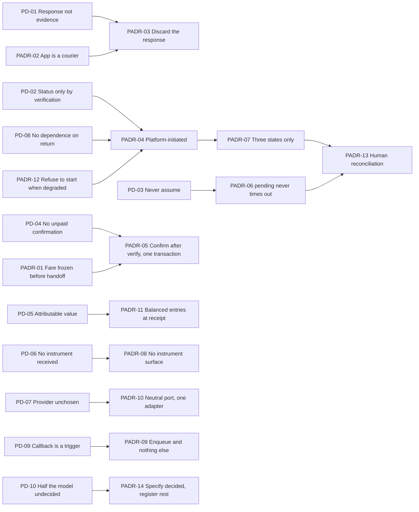
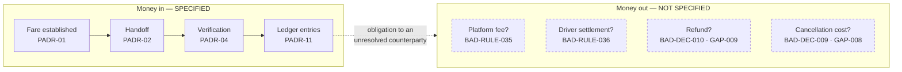
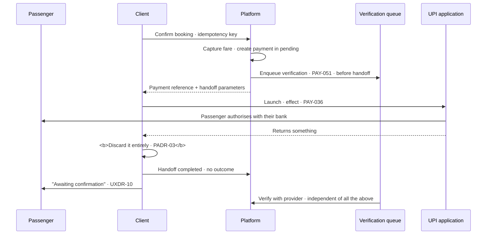
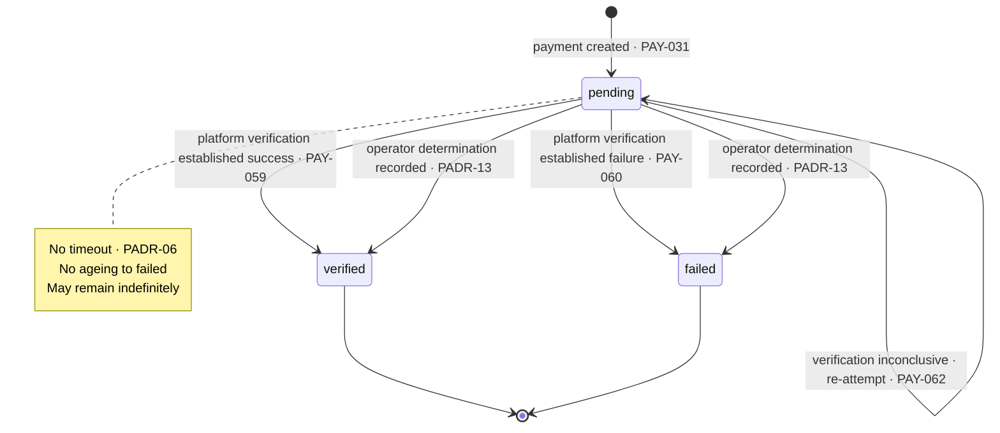
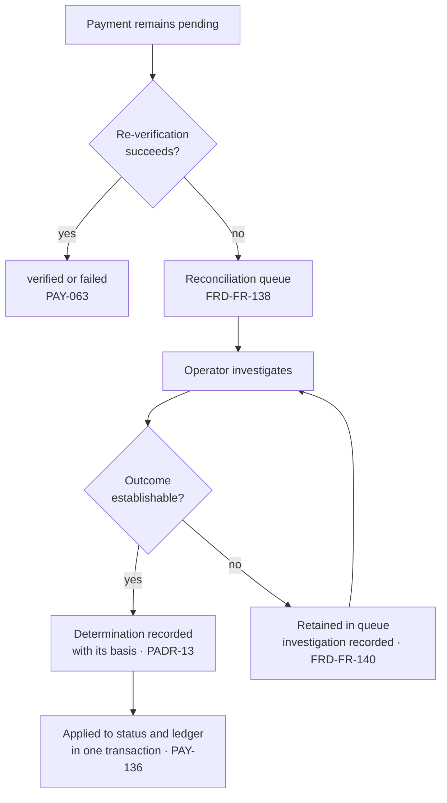

# CMP-DOC-14 — Payment & UPI Specification

**Carpool Mobility Platform (CMP)**

---

# 0. Document Control

## 0.1 Document Metadata

| Field | Value |
|---|---|
| Document ID | CMP-DOC-14 |
| Document Name | Payment & UPI Specification |
| Short Name | PAYMENT |
| Project Name | Carpool Mobility Platform |
| Project Code | CMP |
| Version | 0.1 |
| Status | Draft |
| Date | 2026-08-17 |
| Author | Solution Architect / Payments (AI-assisted) |
| Reviewer | [TBD] |
| Approver | Project Owner |
| Classification | Internal |
| Brand | TBD |
| Previous Version | None (initial issue) |
| Predecessor Documents | CMP-DOC-01 … CMP-DOC-13, **all Draft, none approved** (CMP-DOC-09 at v0.2, the remainder at v0.1) |
| Related Documents | `00_Project_Control/README.md`, `Documentation_Index.md`, `Documentation_Status.md`, `Document_Change_Log.md`, `Glossary.md`, `Master_Traceability_Matrix.md` |
| Successor Documents | CMP-DOC-17 (Admin / Filament), CMP-DOC-18 (Testing & QA), CMP-DOC-19 (DevOps / Deployment) |

## 0.2 Revision History

| Version | Date | Author | Change | Status |
|---|---|---|---|---|
| 0.1 | 2026-08-17 | Solution Architect / Payments (AI-assisted) | Initial issue. Specifies the payment path: 10 payment drivers, **14 payment decisions**, the money model, fare establishment, the UPI handoff, verification, payment states, the provider port, the callback surface, reconciliation, the ledger, degraded operation, provider selection criteria, what is not specified, and verification obligations. Issues 208 statements (`PAY-001` … `PAY-208`). | Draft |

## 0.3 Distribution List

| Role | Purpose |
|---|---|
| Project Owner | Approval authority; **six money decisions in §18.3 are theirs alone** |
| **Solution Architect / Payments** | Authoring and ownership |
| **Backend Developers** | **Primary consumer** |
| Android Developers | §6 handoff and its return behaviour |
| Backend Lead | Consistency with CMP-DOC-10 §11.8 and §13 |
| Security Analyst | `SADR-10` realisation and the `SEC-ASM-04` verification obligation (§14.3) |
| Product Analyst | §15 — the money model this document could not specify |
| QA Analyst | The 12 verification obligations in §16 |
| DevOps Engineer | Provider credential custody (§9.6) |

## 0.4 Approval

| Role | Name | Signature | Date |
|---|---|---|---|
| Author | Solution Architect / Payments (AI-assisted) | — | 2026-08-17 |
| Reviewer | [TBD] | — | — |
| Approver | Project Owner | — | — |

> **This document is NOT approved.** It is issued at version 0.1 with status `Draft`
> for Project Owner review.

## 0.5 Purpose of This Document

The payment path is the most rigorously specified behaviour in this chain and the least
complete money model in it. Both halves of that sentence are this document's subject.

**Payment in is fully specified.** `BAD-RULE-032` makes a client-side UPI response
non-evidence, `BAD-RULE-033` makes verification the only route to a payment status, and
`FRD-FR-124` to `FRD-FR-140` specify seventeen behaviours in full. Three integrity-critical
quality requirements — `NFR-027`, `NFR-029`, `NFR-032` — each demand zero occurrences.
This document specifies the mechanism that satisfies them.

**Money out is not specified at all.** Whether a platform fee exists (`BAD-RULE-035`), how
driver earnings are settled (`BAD-RULE-036`), what a refund is (`BAD-DEC-010`, `GAP-009`)
and what cancellation costs (`BAD-DEC-009`, `GAP-008`) are all undecided. §15 states this
plainly and **invents none of it**.

A passenger can therefore pay, and the platform can prove they paid — and nobody has
decided what happens to the money afterwards.

## 0.6 Boundaries — What This Document Does Not Specify

| Subject | Owning document |
|---|---|
| Application services, aggregates, transactions | CMP-DOC-09 |
| Endpoint paths, payloads, status codes | CMP-DOC-10 |
| Tables, columns, keys | CMP-DOC-11 |
| Screen design and the pending presentation | CMP-DOC-12 |
| **Cryptographic mechanisms, credential storage, transport** | **CMP-DOC-13** |
| Administrative screens for the reconciliation queue | CMP-DOC-17 |
| Test cases | CMP-DOC-18 |
| Provider credential custody at deploy time | CMP-DOC-19 |

### 0.6.1 No Provider Is Named

**FACT.** `BE-161` records that three of five providers are `[TBD – Business Decision
Required]`, and the payment provider is one of them.

**This document names no payment provider, no payment service provider, no aggregator and
no bank.** It specifies the port the platform presents to whichever is chosen, the flows
the adapter must support, and the criteria by which the choice should be made (§14). A
document written against a provider that is not chosen would need rewriting when one is.

### 0.6.2 No Scheme or Regulatory Position Is Asserted

**FACT.** No document in this chain establishes which regulatory regimes apply
(`SEC-OQ-01`), and none establishes the platform's status under any payment scheme.

**This document asserts no scheme rule, no regulatory requirement, no licensing position
and no settlement obligation imposed by any authority.** Where a flow depends on scheme
behaviour, the statement says what the **platform** must do and requires the behaviour to
be **confirmed against the provider's current specification at integration**, rather than
asserting it here from a source this document cannot cite. `PAY-050` and `PAY-192` carry
that obligation, and `SEC-OQ-01` remains open.

## 0.7 Inputs to This Document

| Input | Contribution |
|---|---|
| CMP-DOC-01 | `BAD-RULE-029`–`037` — the money rules, decided and undecided |
| CMP-DOC-04 §5.3 | `FRD-FR-117`–`140` — 24 payment behaviours |
| CMP-DOC-05 | `NFR-026`–`034` — payment integrity, three at zero tolerance |
| CMP-DOC-09 §12 | `BE-149`–`BE-164` — the port model and its four results |
| CMP-DOC-10 §11.8, §13 | Payment resources and the callback surface |
| CMP-DOC-11 §8 | The append-only ledger |
| CMP-DOC-12 §11 | `UXDR-10` — the handoff returns to pending |
| CMP-DOC-13 §12 | `SADR-10` — credentials never received |

## 0.8 Qualifications on This Document

### 0.8.1 Source

Every statement derives from a predecessor statement, from a decision recorded in §3, or
is disclosed in §17.6 as originating here.

### 0.8.2 Qualification 1 — Thirteen Unapproved Predecessors

**FACT.** CMP-DOC-01 … CMP-DOC-13 are all `Draft`. None is approved.

Recorded as conflict `CC-015` and as `PAY-RISK-01`.

### 0.8.3 Qualification 2 — Half the Money Model Does Not Exist

**FACT.** Six money decisions are unresolved: `BAD-RULE-035` (platform fee),
`BAD-RULE-036` (driver settlement), `BAD-RULE-030` (seat hold), `BAD-DEC-003` (fare
basis), `BAD-DEC-009` (cancellation) and `BAD-DEC-010` (refund).

This document specifies **the receipt and verification of money from a passenger** in
full, because that half is decided. It specifies **nothing about where the money then
goes**, because that half is not. §15 names all six and **no fee, rate, schedule, split or
refund rule is invented**.

### 0.8.4 Qualification 3 — The Provider Is Unchosen and It Matters

**FACT.** `SEC-ASM-04` assumes payment providers handle instruments such that the platform
never receives one. `SADR-10` depends on it entirely. The provider is unchosen.

**If a provider requires the platform to receive instrument data, `SADR-10` fails at its
foundation and CMP-DOC-13 §12 becomes unimplementable.** §14.3 makes verifying this a
selection gate rather than an integration discovery, and `PAY-RISK-03` records it.

## 0.9 Statement Classification Convention

As `README.md` §9.1. Markers: **FACT**, **ASSUMPTION**, **BUSINESS DECISION REQUIRED**,
**TECHNICAL DECISION REQUIRED**, **OPEN QUESTION**, **TBD**, **FUTURE CONSIDERATION**,
**RECOMMENDATION**.

## 0.10 Identifier Conventions

| Prefix | Element | Section |
|---|---|---|
| `PAY-nnn` | **Traceable payment specification statement** | §4–§16 |
| `PADR-nn` | Payment Decision Record | §3 |
| `PD-nn` | Payment driver | §2 |
| `PAY-ASM-nn` | Assumption | §18.1 |
| `PAY-RISK-nn` | Risk | §18.2 |
| `PAY-OQ-nn` | Open Question | §18.3 |

## 0.11 Table of Contents

| § | Title |
|---|---|
| 0 | Document Control |
| 1 | Executive Summary |
| 2 | Payment Drivers |
| 3 | Payment Decisions |
| 4 | The Money Model |
| 5 | Fare Establishment |
| 6 | The UPI Handoff |
| 7 | Verification |
| 8 | Payment States and Transitions |
| 9 | The Provider Port |
| 10 | The Callback Surface |
| 11 | Reconciliation |
| 12 | The Ledger |
| 13 | Failure and Degraded Operation |
| 14 | Provider Selection Criteria |
| 15 | What Is Not Specified |
| 16 | Verification Obligations |
| 17 | Traceability |
| 18 | Assumptions, Risks and Open Questions |
| 19 | Acceptance Criteria for This Document |
| 20 | Statistics and Recommendations |
| A | Appendix A — Statement Index |
| B | Appendix B — Decision Index |
| C | Appendix C — Payment State Reference |

---

# 1. Executive Summary

## 1.1 What This Document Delivers

| Element | Count |
|---|---|
| Payment drivers | 10 |
| **Payment Decision Records** | **14** |
| Payment specification statements | **208** (`PAY-001` … `PAY-208`) |
| Payment states | 3 |
| Port results | 4 |
| Verification obligations | 12 |
| Money decisions this document could not take | 6 |
| Provider selection gates | 7 |
| **Providers named** | **0** |
| **Scheme or regulatory positions asserted** | **0** |

## 1.2 The Payment Path in One Paragraph

The platform computes the fare, shows it, and does not proceed if it changed. It creates a
payment in `pending` and hands the passenger to their UPI application, which it treats as
a courier and not as a witness. Whatever the UPI application says on return is discarded.
The platform then verifies the payment with the provider on its own initiative, on its own
schedule, and reaches one of exactly three states: `verified`, `failed`, or still
`pending`. A callback may arrive and it is a trigger to verify, never a verification. A
payment that cannot be resolved stays `pending` forever rather than being guessed, and
goes to a reconciliation queue where a human decides. Every movement of value produces a
balanced, append-only ledger entry. Where the money goes after that, nobody has decided.

## 1.3 The Four Decisions That Shape Everything Else

| PADR | Decision | Why it dominates |
|---|---|---|
| **`PADR-03`** | The UPI application's response is **discarded on receipt** — not logged, not stored, not used to select a presentation, not used to choose whether to verify. | `BAD-RULE-032` says it is never evidence. The weak reading is "do not trust it"; the strong reading, adopted here, is "do not use it at all". A value that is read is a value that will eventually be branched on. |
| **`PADR-04`** | Verification is **platform-initiated and unconditional**: every payment attempt is verified, including one the passenger abandoned. | `FRD-FR-125` requires it explicitly. An abandoned interaction is exactly where money moves without anybody watching, and it is the case a callback-driven design misses. |
| **`PADR-06`** | `pending` is a **terminal-until-resolved** state with no timeout. It never ages into `failed`. | `NFR-032` and `FRD-FR-131` forbid resolving by assumption. Every timeout is an assumption with a clock attached. A payment that cannot be established is a human's problem, not a scheduler's. |
| **`PADR-10`** | The platform holds a **provider-neutral payment port** with four results, and the entire provider integration lives in one adapter. | The provider is unchosen (`BE-161`), and three of the five are. If provider concepts leak past the adapter, choosing a provider becomes a rewrite rather than a configuration. |

## 1.4 What This Document Discharges

| Obligation | Source | Discharged by |
|---|---|---|
| `SADR-10` in full — credentials never received | CMP-DOC-13 §20.5 | §6.3; `PAY-041`–`PAY-046` |
| Per-provider verification of `SEC-ASM-04` | CMP-DOC-13 §20.5 | §14.3 — a selection gate, not an integration discovery |
| Plausibility rules for every payment provider capability | CMP-DOC-13 §20.5 | §9.4; `PAY-104`–`PAY-108` |
| The callback response carries no business outcome | CMP-DOC-10 §17.7 | `PAY-121` |
| The handoff returns to pending regardless of what the app reports | CMP-DOC-12 §18.7 | `PADR-03`; `PAY-047` |

## 1.5 What This Document Could Not Settle

| Matter | Position |
|---|---|
| Platform fee — whether one exists, its basis, its value | `BAD-RULE-035` — §15.1 |
| Driver settlement — how and when | `BAD-RULE-036` — §15.2 |
| Refunds | `BAD-DEC-010`, `GAP-009` — §15.3 |
| Cancellation cost | `BAD-DEC-009`, `GAP-008` — §15.4 |
| Fare basis | `BAD-DEC-003` — §5.1 |
| Seat hold during payment | `BAD-RULE-030` — §5.2 |
| The provider | `BE-161` — §14 gives criteria, not a choice |
| Verification cadence and retry bounds | Configuration; values unset |

---

# 2. Payment Drivers

| ID | Driver | Source | Consequence |
|---|---|---|---|
| `PD-01` | A client-side UPI response is never evidence. | `BAD-RULE-032`, `FRD-FR-124` | `PADR-03`: discard it entirely. |
| `PD-02` | Payment status comes only from the platform's own verification. | `BAD-RULE-033`, `NFR-029` | `PADR-04`: platform-initiated, unconditional. |
| `PD-03` | An indeterminate payment must never be resolved by assumption. | `NFR-032`, `FRD-FR-131` | `PADR-06`: no timeout, human resolution. |
| `PD-04` | A booking must never be confirmed without a verified payment. | `NFR-027`, `BAD-RULE-028` | `PADR-05`: confirmation is downstream of verification, in one transaction. |
| `PD-05` | Every movement of value must be attributable. | `BAD-RULE-037`, `NFR-128` | `PADR-11`: balanced append-only entries. |
| `PD-06` | The platform must never receive a payment instrument. | `SADR-10`, `BE-097` | `PADR-08`: handoff only, no instrument surface. |
| `PD-07` | The provider is unchosen and may change. | `BE-161`, `ADR-11` | `PADR-10`: provider-neutral port, one adapter. |
| `PD-08` | Verification must not depend on the passenger returning. | `FRD-FR-126` | `PADR-04`: server-side, independent of the client. |
| `PD-09` | A callback is a trigger, not a verification. | `ARCH-128`, `AADR-12` | `PADR-09`: enqueue and verify, never set status. |
| `PD-10` | Half the money model is undecided and must not be invented. | §0.8.3 | `PADR-14`: specify the decided half, register the rest. |

---

# 3. Payment Decisions

Each decision records its context, the alternatives considered, and its consequences
**including the negative ones**, marked ✘. **No decision names a provider** (§0.6.1) and
**none asserts a scheme or regulatory position** (§0.6.2).

## 3.1 `PADR-01` — The Fare Is Established Before the Handoff and Frozen

| | |
|---|---|
| **Context** | `FRD-FR-120` forbids initiating a payment for an amount the passenger has not been shown. `FRD-FR-121` requires re-presenting the total where the amount changes between display and payment. `BAD-RULE-034` computes the fare in the backend. `UX-099` presents it with provenance. |
| **Decision** | **The fare is computed by the platform, captured on the booking at confirmation (`DB-162`), and is the amount the payment is initiated for. If the computed fare differs from the amount shown, the handoff does not occur; the passenger is returned to the commitment surface with the new amount.** |
| **Alternatives** | *(a)* Recompute at payment time and proceed — rejected: `FRD-FR-120`, and the passenger would pay an amount they never saw. *(b)* Honour the shown amount even if it is now wrong — rejected: the platform would be initiating a payment it knows to be incorrect. |
| **Consequences** | ✔ The passenger pays exactly what they agreed to. ✔ The captured fare is what the ledger and the dispute record refer to. ✘ A fare change mid-flow interrupts the journey. ✘ **The fare basis itself is `[TBD – Business Decision Required]`** (`BAD-DEC-003`), so this specifies *when* the fare is fixed and not *what* it is. |

## 3.2 `PADR-02` — The UPI Application Is a Courier, Not a Party

| | |
|---|---|
| **Context** | The passenger's UPI application is on an untrusted device (`TB-1`), is chosen by the passenger, and is outside the platform's control. `FRD-FR-123` requires supporting commonly used UPI applications. The platform's relationship to it is the single most consequential modelling choice in the payment path. |
| **Decision** | **The UPI application is modelled as a courier: it carries the passenger to their bank and back. It is not a party to the transaction from the platform's perspective, holds no platform trust, and its participation is not required for the platform to learn the outcome.** |
| **Alternatives** | *(a)* Treat it as a participant whose response contributes to the outcome — rejected: `BAD-RULE-032` forbids it, and it makes the platform's knowledge depend on a component it does not control. *(b)* Integrate with specific applications for richer signalling — rejected: `FRD-FR-123` requires breadth, and per-application integration multiplies the trust surface. |
| **Consequences** | ✔ Supporting a new UPI application costs nothing. ✔ The platform's knowledge is independent of the device. ✘ The platform learns the outcome later than it could. ✘ The passenger experiences a gap between paying and being told, which `UXDR-10` makes honest rather than removing. |

## 3.3 `PADR-03` — The Response Is Discarded, Not Distrusted

| | |
|---|---|
| **Context** | `BAD-RULE-032` and `FRD-FR-124` say the response is never evidence. `SRS-REQ-013` says treat it as an event to report. `API-154` forbids accepting it as evidence. Every one of those permits reading it. A value that is read is a value someone will eventually branch on — to skip a verification, to choose a message, to decide a retry. |
| **Decision** | **The response from the UPI application is discarded on receipt. It is not logged, not stored, not returned to the platform, not used to select a presentation, and not used to decide whether or when to verify. The client's only report is that the handoff completed.** |
| **Alternatives** | *(a)* Report it to the platform as an event, unused — rejected: it then exists in a log and in a table, and `DB-151` and `SEC-136` would have to keep it clean of instrument data for no benefit. *(b)* Use it to prioritise verification — rejected: makes verification order depend on an untrusted input, and `PADR-04` verifies everything anyway. |
| **Consequences** | ✔ The strongest available reading of `BAD-RULE-032`: the value does not exist in the platform. ✔ Nothing to leak, log or misuse. ✘ The platform cannot tell an abandoned interaction from a completed one at the moment of return — which `PADR-04` makes irrelevant by verifying both. ✘ Support cannot say what the passenger's app displayed. |

## 3.4 `PADR-04` — Verification Is Platform-Initiated and Unconditional

| | |
|---|---|
| **Context** | `FRD-FR-125` requires verification of **every** payment attempt, including where the passenger abandoned the interaction. `FRD-FR-126` requires it without the passenger returning. `ARCH-127` requires the port to support platform-initiated verification independent of callback. `SRS-REQ-142` forbids depending on a callback as the sole means. |
| **Decision** | **Every payment attempt is enqueued for verification at the moment it is created, before the handoff occurs. Verification runs server-side on the platform's own schedule and completes regardless of whether the passenger returns, whether a callback arrives, or what the UPI application reported.** |
| **Alternatives** | *(a)* Verify on return from the handoff — rejected: `FRD-FR-126`, and it misses every abandoned interaction, which is where unwatched money movement lives. *(b)* Verify on callback — rejected: `SRS-REQ-142`, and a callback that never arrives means a payment never checked. |
| **Consequences** | ✔ No payment attempt is ever unverified, whatever the passenger or the network did. ✔ `FRD-FR-125` and `FRD-FR-126` are satisfied by construction. ✘ Verification traffic is proportional to attempts, not to completions, so abandoned attempts cost provider calls. ✘ Cadence and retry bounds become configuration, and both are unset. |

## 3.5 `PADR-05` — Confirmation Is Downstream of Verification, in One Transaction

| | |
|---|---|
| **Context** | `NFR-027` requires zero bookings confirmed without a verified payment, under any failure condition. `BAD-RULE-028` makes confirmation backend-only. `BE-048` commits seat allocation, booking confirmation, the ledger entry and the payment status change in a single transaction. `BE-050` puts the provider call outside it. |
| **Decision** | **Verification completes first, outside any transaction. Only on a `Verified` result does a single transaction confirm the booking, allocate the seats, write the ledger entries and set the payment status. A failure at any point rolls back all four.** |
| **Alternatives** | *(a)* Confirm optimistically and reverse on failure — rejected: `NFR-027` says zero, and a reversal is visible to a passenger who was told they had a seat. *(b)* Confirm and allocate separately — rejected: `BE-048`, and it permits a confirmed booking with no seat. |
| **Consequences** | ✔ `NFR-027` is structural: the confirmation path does not exist without a verified payment. ✔ Partial states are impossible. ✘ Seat availability can change between fare display and verification, so a verified payment may meet an unavailable seat — §13.2 specifies that case and it is the ugliest in the document. ✘ The transaction is wider than a booking alone. |

## 3.6 `PADR-06` — `pending` Never Times Out

| | |
|---|---|
| **Context** | `NFR-032` requires zero payments resolved by assumption. `FRD-FR-130` sets `pending` where the outcome cannot be established; `FRD-FR-131` forbids resolving it by assumption; `FRD-FR-132` requires re-attempted verification; `FRD-FR-140` retains it in the queue with the investigation recorded. `BE-027` forbids leaving `pending` other than by verification or recorded reconciliation. |
| **Decision** | **`pending` has no timeout and no expiry. It is left only by a successful verification or by a recorded operator determination. A payment may remain `pending` indefinitely, and doing so is correct behaviour rather than a stuck record.** |
| **Alternatives** | *(a)* Age `pending` to `failed` after a period — rejected: that is an assumption with a clock attached, and `NFR-032` says zero. *(b)* Age it to `verified` — rejected, obviously, and worse. *(c)* Auto-resolve using a provider's final status feed — accepted **as verification**, not as ageing: if the provider states an outcome, that is verification (`PAY-063`), not a timeout. |
| **Consequences** | ✔ `NFR-032` cannot be violated by elapsed time. ✔ A dispute always has a record of what was known and when. ✘ The reconciliation queue grows and needs human capacity; `PAY-145` makes its depth an operational measure. ✘ A passenger may wait a long time, and `UX-133` requires the client not to time out either. |

## 3.7 `PADR-07` — Three States, No Fourth, No Sub-States

| | |
|---|---|
| **Context** | `SRS-REQ-155` and `BE-026` permit exactly three payment states — `verified`, `failed`, `pending` — and no other. `DB-065` enforces it as a database constraint. The pressure to add a fourth — `initiated`, `awaiting_callback`, `under_review` — is constant and each one erodes the guarantee. |
| **Decision** | **Three states, enforced by constraint. Operational detail that a fourth state would carry — attempt count, last verification time, reconciliation ownership — is held as attributes of the payment, not as states. A payment under investigation is `pending` with an investigation recorded.** |
| **Alternatives** | *(a)* Add `initiated` before the handoff — rejected: it is `pending`; the payment exists and its outcome is unestablished. *(b)* Add `under_review` — rejected: it is `pending` with an owner attribute, and adding a state means every consumer must learn it. |
| **Consequences** | ✔ Every consumer handles three cases exhaustively. ✔ `DB-065`'s constraint stays meaningful. ✘ Operational nuance lives in attributes, so queue views must read more than the state. ✘ Developers will propose a fourth state; `PAY-081` states the rule where they will look. |

## 3.8 `PADR-08` — No Instrument Surface Exists Anywhere

| | |
|---|---|
| **Context** | CMP-DOC-13 `SADR-10` strengthened three predecessors from "never stored" to "never received". `SEC-133`–`SEC-137` state it. `API-037` keeps it out of request schemas, `DB-037` out of columns, `DB-151` out of provider call records. This document is where the flow either honours that or quietly breaks it. |
| **Decision** | **No flow in this document causes the platform to receive a payment instrument credential, a token exchangeable for one, or a provider response body containing either. The handoff carries a reference and an amount outward, and returns nothing. Provider responses are parsed for outcome and reference only, and the raw body is never persisted.** |
| **Alternatives** | *(a)* Persist raw provider responses for support — rejected: `DB-151` and `SEC-136`, and it is the single most likely route by which instrument data enters the platform. *(b)* Accept a provider-issued instrument token for reuse — rejected: makes the platform custodian of a reusable payment capability, and no requirement asks for saved instruments. |
| **Consequences** | ✔ `SADR-10` holds through the one document that could have broken it. ✔ A breach yields no instrument data because none is present. ✘ Support cannot see what the provider returned verbatim; `PAY-141` requires a redacted structured record instead. ✘ **Depends entirely on the provider's behaviour** — §14.3. |

## 3.9 `PADR-09` — A Callback Enqueues Verification and Nothing Else

| | |
|---|---|
| **Context** | `ARCH-128` and `AADR-12` make a callback a trigger. `API-175`–`API-181` specify the surface. `SEC-096` requires it authenticated; `SEC-097` requires authentication to establish origin only. `BE-160` requires idempotent processing. |
| **Decision** | **A callback is authenticated, recorded as received, and enqueues a verification for the payment it references. It sets no status, writes no ledger entry, and its body contributes nothing to the outcome. The response acknowledges receipt only.** |
| **Alternatives** | *(a)* Set status from a signed callback — rejected: a signature proves origin, not truth, and `BAD-RULE-033` sets status only by verification. *(b)* No callback endpoint at all — rejected: the provider's willingness to tell us early is free latency reduction, and `PADR-04` means we lose nothing if it never arrives. |
| **Consequences** | ✔ A forged, replayed or reordered callback cannot move money. ✔ Callbacks are pure optimisation and can be disabled without correctness impact. ✘ The provider may expect an outcome in the acknowledgement; §14.2 makes that a selection criterion. ✘ A callback storm becomes verification load; `PAY-125` requires deduplication before enqueue. |

## 3.10 `PADR-10` — One Provider-Neutral Port, One Adapter

| | |
|---|---|
| **Context** | `BE-149`–`BE-164` define the port model with four results. `BE-150` forbids a port naming a provider. `BE-153` forbids a provider type above the adapter. `ADR-11` requires substitutability. The provider is unchosen and three of five are (`BE-161`). |
| **Decision** | **The payment port is declared in domain terms with four results — `Verified`, `Reported`, `Unavailable`, `Rejected` — and the entire provider integration lives in one adapter. No provider identifier, error code, status string or data shape appears above it.** |
| **Alternatives** | *(a)* Provider-specific services — rejected: choosing a provider becomes a rewrite. *(b)* A thin pass-through port exposing provider status — rejected: leaks the provider's vocabulary into the domain, which `BE-153` forbids precisely because it is invisible until you try to change provider. |
| **Consequences** | ✔ Provider selection is an adapter, not a project. ✔ A second provider can be added for redundancy without domain change. ✘ Every provider concept needs a domain translation, and some translations lose detail. ✘ The four results must cover every provider outcome; §9.2 maps them and §14.2 states what happens when one does not fit. |

## 3.11 `PADR-11` — Every Verified Payment Produces Balanced Entries Immediately

| | |
|---|---|
| **Context** | `BAD-RULE-037` requires a durable attributable record for every value movement. `FRD-FR-133` requires a ledger entry attributable to payer, booking and event. `DADR-07` makes the ledger append-only and balanced. `DB-096` requires entries summing to zero across parties. |
| **Decision** | **A verified payment writes balanced ledger entries in the same transaction as the status change. The entries record value received from the passenger and value owed onward. What "owed onward" resolves to — driver, platform, or a split — depends on `BAD-RULE-035` and is recorded as an obligation to an unresolved counterparty rather than being invented.** |
| **Alternatives** | *(a)* Write entries at settlement rather than receipt — rejected: `BAD-RULE-037` requires a record of the movement that happened, and money was received. *(b)* Single-sided entry for the receipt — rejected: `DB-096`, and the books would not balance. |
| **Consequences** | ✔ Every rupee received is recorded when received. ✔ Settlement, when specified, has a liability to settle against. ✘ **The onward party is unresolved**, so entries carry an obligation whose beneficiary split is undecided. §12.4 states this and §15.1 escalates it. |

## 3.12 `PADR-12` — Degraded Means Refuse to Start, Never Start and Hope

| | |
|---|---|
| **Context** | `FRD-FR-137` forbids creating a payment that cannot be verified where the payment ecosystem is unavailable. `ARCH-108` forbids initiating payment when the ecosystem is unavailable. `NFR-035` requires withdrawing rather than degrading a capability whose degradation would compromise an absolute rule. |
| **Decision** | **Where verification capability is unavailable, payment initiation is withdrawn — the handoff is not offered — rather than offered and later reconciled. The interface reports dependency-unavailable, and the passenger's booking remains uncommitted.** |
| **Alternatives** | *(a)* Allow payment and reconcile later — rejected: it manufactures `pending` payments during an outage, and the passenger has parted with money the platform cannot yet see. *(b)* Queue the initiation — rejected: the passenger cannot be queued. |
| **Consequences** | ✔ An outage costs bookings and never costs unverifiable money movements. ✔ `NFR-035` is honoured exactly. ✘ Payment is unavailable during a provider outage, which is visible and commercially unwelcome. ✘ Detecting unavailability needs a health signal from the adapter; `PAY-166` requires one. |

## 3.13 `PADR-13` — Reconciliation Is a Human Decision With a Recorded Basis

| | |
|---|---|
| **Context** | `FRD-FR-138` requires pending payments presented as a managed queue. `FRD-FR-139` allows an operator to record a determination and apply it to status and ledger. `FRD-FR-140` retains the payment with the investigation recorded where the outcome still cannot be established. `NFR-059` forbids an operator bypassing an absolute rule. |
| **Decision** | **A `pending` payment is resolved only by continued verification succeeding, or by an operator recording a determination with its basis. The determination is evidenced, attributed, and applies to both status and ledger in one transaction. An operator may not set `verified` without recording what established it.** |
| **Alternatives** | *(a)* Automated resolution rules — rejected: `NFR-032`, and a rule is an assumption. *(b)* Operator sets status freely — rejected: `NFR-059` and `SEC-010`; capability, never exemption. |
| **Consequences** | ✔ Every resolution has a recorded reason and an accountable person. ✔ `FRD-FR-139` and `FRD-FR-140` are satisfiable. ✘ Reconciliation requires staffing, and `NFR-078`'s operating hours are unset. ✘ The queue is unbounded by design; `PAY-145` measures it. |

## 3.14 `PADR-14` — Specify the Decided Half, Register the Rest

| | |
|---|---|
| **Context** | Six money decisions are unresolved (§0.8.3). A payment document that invented a fee model, a settlement schedule and a refund policy would look complete and would be fiction. |
| **Decision** | **This document specifies receipt and verification in full, because they are decided. It specifies nothing about fees, settlement, refunds or cancellation cost, and §15 names each with its decision, its consequence and what it blocks. No placeholder rate, schedule or split appears anywhere.** |
| **Alternatives** | *(a)* Invent a provisional model marked TBD — rejected: a provisional number gets implemented, and §19 of the governing prompt prohibits it. *(b)* Delay the document until the decisions are made — rejected: the verification half is decided, substantial, and is what most needs specifying before build. |
| **Consequences** | ✔ Everything stated here is buildable and true. ✔ The six gaps are visible in one place with their blockers. ✘ **The document is half a payment specification** and says so. ✘ CMP-DOC-17's reconciliation screens and any settlement capability wait on §15. |

## 3.15 Driver to Decision Map

---

# 4. The Money Model

## 4.1 What Exists and What Does Not

| ID | Statement | Src |
|---|---|---|
| `PAY-001` | The platform shall receive value from a passenger against a booking, and shall record it. | `FRD-FR-122`, `BAD-RULE-037` |
| `PAY-002` ‡ | The platform shall establish the outcome of every receipt by its own verification. | `BAD-RULE-033`, `NFR-029` |
| `PAY-003` ‡ | The platform shall record every movement of value as balanced ledger entries. | `BAD-RULE-037`, `DB-096` |
| `PAY-004` | **The platform's onward obligations — fee, settlement, refund, cancellation cost — are undecided and are specified nowhere in this document.** | §0.8.3, `PADR-14` |
| `PAY-005` ‡ | No fee, rate, split, schedule or refund rule shall be stated or implied. | `PADR-14`, §19 no-invention rule |
| `PAY-006` | Money movements shall be denominated in the market's currency, recorded per entry rather than assumed. | `DB-104`, `NFR-141` |
| `PAY-007` ‡ | Monetary amounts shall be exact decimal throughout, in transit, in storage and in computation. | `BE-095`, `API-016` |
| `PAY-008` ‡ | No balance shall be stored; balances derive from ledger entries. | `ARCH-111`, `DB-097` |
| `PAY-009` | The passenger is the payer; the platform is the recipient of record at the point of receipt. | `FRD-FR-133`, `PADR-11` |
| `PAY-010` | Whether the platform is recipient of record onward, or a conduit, **depends on `BAD-RULE-035` and is not decided here.** | `BAD-RULE-035`, `PAY-193` |
| `PAY-011` ‡ | A ledger entry shall be attributable to the payer, the booking and the event. | `FRD-FR-133`, `NFR-128` |
| `PAY-012` ‡ | Financial records shall never be deleted; correction is by compensating entry. | `BE-096`, `DB-099` |
| `PAY-013` | The wallet, rewards and referral concepts have no requirement at any tier and appear nowhere in this document. | CMP-DOC-10 §11.14, CMP-DOC-11 §6.11 |
| `PAY-014` | This document specifies **one** money flow — passenger to platform — because it is the only one decided. | `PADR-14`, §15 |

---

# 5. Fare Establishment

| ID | Statement | Src |
|---|---|---|
| `PAY-015` ‡ | The fare shall be computed by the platform and never accepted from a caller. | `BAD-RULE-034`, `BE-032` |
| `PAY-016` ‡ | A payment shall not be initiated for an amount the passenger has not been shown. | `FRD-FR-120` |
| `PAY-017` ‡ | The fare shall be captured on the booking at confirmation and shall be the amount the payment is initiated for. | `PADR-01`, `DB-162` |
| `PAY-018` ‡ | Where the computed amount differs from the amount shown, the handoff shall not occur and the passenger shall be re-presented with the new amount. | `FRD-FR-121`, `PADR-01` |
| `PAY-019` | Re-presentation shall require the passenger to see the new amount before proceeding. | `FRD-FR-121` |
| `PAY-020` ‡ | A captured fare shall not change after capture; a later fare change shall not alter what was agreed. | `DB-162`, `PADR-01` |
| `PAY-021` | The fare shall be presented with its provenance and shall be `Current` at the point of commitment. | `UX-099`, `UX-095` |
| `PAY-022` | The amount payable shall be presented as a single total, itemised only where the itemisation is decided. | `FRD-FR-118`, §15.1 |
| `PAY-023` | **Whether the total includes a platform fee, and how it is itemised, is `[TBD – Business Decision Required]`.** | `BAD-RULE-035` |

## 5.1 The Fare Basis

| ID | Statement | Src |
|---|---|---|
| `PAY-024` | **The basis on which a fare is computed is `[TBD – Business Decision Required]`** (`BAD-DEC-003`); this document specifies when it is fixed, not what it is. | `BAD-DEC-003`, `PADR-01` |
| `PAY-025` | The computation shall be a domain concern and shall be expressible without reference to a corridor, city or region. | `BE-032`, `NFR-052` |
| `PAY-026` | Fare-bearing values, once decided, shall be policy configuration rather than code. | `BADR-12`, `SRS-REQ-173` |
| `PAY-027` | No default, placeholder or illustrative fare shall appear in this document or in seed data. | `DB-221`, `PADR-14` |

## 5.2 Seat Holding

| ID | Statement | Src |
|---|---|---|
| `PAY-028` | **Whether seats are held during request and payment, and for how long, is `[TBD – Business Decision Required]`.** | `BAD-RULE-030`, `DB-062` |
| `PAY-029` ‡ | In the absence of a hold rule, seat availability is re-read under lock at confirmation and a verified payment may meet an unavailable seat; §13.2 specifies that case. | `BE-056`, `PADR-05` |
| `PAY-030` | The schema carries a hold expiry that remains unused until the rule exists. | `DB-062` |

---

# 6. The UPI Handoff

## 6.1 The Flow

| ID | Statement | Src |
|---|---|---|
| `PAY-031` ‡ | A payment shall be created in `pending` before the handoff occurs. | `PADR-04`, `AADR-07` |
| `PAY-032` ‡ | Verification shall be enqueued at creation, before the handoff, so that an abandoned handoff is still verified. | `PADR-04`, `FRD-FR-125` |
| `PAY-033` | The platform shall supply the client with a payment reference and the parameters the handoff requires. | `FRD-FR-122` |
| `PAY-034` ‡ | The handoff parameters shall carry no credential and no value the passenger could alter to change the amount. | `SEC-133`, `API-036` |
| `PAY-035` | The platform shall support payment through commonly used UPI applications and shall not integrate with any of them individually. | `FRD-FR-123`, `PADR-02` |
| `PAY-036` | Launching the UPI application shall be a client effect, not a navigation. | `UX-125`, `MOB-020` |
| `PAY-037` | The client shall hand off and shall not embed payment capability. | `MOB-084`, `SADR-10` |

## 6.2 The Return

| ID | Statement | Src |
|---|---|---|
| `PAY-038` ‡ | The UPI application's response shall be discarded on receipt. | `PADR-03`, `BAD-RULE-032` |
| `PAY-039` ‡ | The response shall not be logged, stored, transmitted to the platform, or used to select a presentation. | `PADR-03`, `SEC-136` |
| `PAY-040` ‡ | The response shall not be used to decide whether or when to verify. | `PADR-03`, `PADR-04` |
| `PAY-041` ‡ | The client shall report only that the handoff completed, carrying no outcome. | `PADR-03`, `UX-127` |
| `PAY-042` ‡ | The client shall present the booking as awaiting confirmation regardless of what the application reported. | `UXDR-10`, `UX-126` |
| `PAY-043` ‡ | A passenger who does not return shall be indistinguishable, to the platform, from one who does. | `PADR-04`, `FRD-FR-126` |

## 6.3 No Instrument Surface

| ID | Statement | Src |
|---|---|---|
| `PAY-044` ‡ | No flow in this document shall cause the platform to receive a payment instrument credential. | `SEC-133`, `SADR-10` |
| `PAY-045` ‡ | No flow shall cause the platform to receive a token exchangeable for one. | `SEC-135`, `DB-037` |
| `PAY-046` ‡ | No raw provider response body shall be persisted or logged. | `DB-151`, `SEC-136` |
| `PAY-047` ‡ | Saved payment instruments are not a specified capability and no flow shall create one. | `SADR-10`, `PADR-08` |
| `PAY-048` | Provider interaction records shall be structured and redacted, capturing outcome and reference only. | `SEC-144`, `ARCH-067` |

## 6.4 What Must Be Confirmed at Integration

| ID | Statement | Src |
|---|---|---|
| `PAY-049` | The handoff mechanism, its parameters and its return behaviour shall be implemented against the selected provider's current specification. | `PADR-10`, §0.6.2 |
| `PAY-050` | **This document asserts no scheme behaviour.** Every flow characteristic dependent on the payment scheme or the provider shall be **confirmed against the provider's current specification at integration**, and any divergence from the shape specified here shall be raised as a change rather than absorbed. | §0.6.2, `PADR-10` |

---

# 7. Verification

This is the core of the document. Three integrity-critical quality requirements —
`NFR-027`, `NFR-029`, `NFR-032` — each demand **zero** occurrences, and this section is
what makes zero achievable.

## 7.1 Initiation

| ID | Statement | Src |
|---|---|---|
| `PAY-051` ‡ | Every payment attempt shall be verified. | `FRD-FR-125`, `PADR-04` |
| `PAY-052` ‡ | Verification shall be initiated by the platform, not by the client and not by a callback. | `ARCH-127`, `FRD-FR-126` |
| `PAY-053` ‡ | Verification shall not require the passenger to return to the application. | `FRD-FR-126` |
| `PAY-054` ‡ | An abandoned interaction shall be verified identically to a completed one. | `FRD-FR-125`, `PAY-043` |
| `PAY-055` | Verification shall run as queued work in the `payment-verification` family. | `BADR-07`, `BE-131` |
| `PAY-056` ‡ | Verification shall be idempotent; repeated verification of the same payment shall produce one effect. | `BE-135`, `API-179` |
| `PAY-057` ‡ | Verification shall occur outside any database transaction. | `BE-050`, `ARCH-062` |

## 7.2 Determining the Outcome

| ID | Statement | Src |
|---|---|---|
| `PAY-058` ‡ | Payment status shall be determined solely from the platform's own verification. | `FRD-FR-127`, `BAD-RULE-033` |
| `PAY-059` ‡ | Status shall be set to `verified` only where the platform has itself established that the payment succeeded. | `FRD-FR-128`, `NFR-029` |
| `PAY-060` ‡ | Status shall be set to `failed` only where the platform has established that the payment did not succeed. | `FRD-FR-129` |
| `PAY-061` ‡ | Status shall remain `pending` where the outcome cannot be established. | `FRD-FR-130`, `BE-159` |
| `PAY-062` ‡ | A `pending` payment shall not be resolved to `verified` or `failed` by assumption. | `FRD-FR-131`, `NFR-032` |
| `PAY-063` | A provider statement of final outcome, obtained by the platform through the port, constitutes verification; it is not an assumption. | `PADR-06`, `PAY-058` |
| `PAY-064` ‡ | Absence of a provider response is not a determination and shall leave the payment `pending`. | `BE-152`, `NFR-032` |
| `PAY-065` ‡ | A provider response failing plausibility shall be treated as unavailability, not as a determination. | `SEC-012`, `SRS-REQ-105` |
| `PAY-066` ‡ | An error path shall never leave a payment in a state other than `verified`, `failed` or `pending`. | `SRS-REQ-171`, `DB-065` |

## 7.3 On `verified`

| ID | Statement | Src |
|---|---|---|
| `PAY-067` ‡ | On a verified result, one transaction shall set the payment status, confirm the booking, allocate the seats and write the ledger entries. | `PADR-05`, `BE-048` |
| `PAY-068` ‡ | Seat availability shall be re-read under lock within that transaction. | `BE-055`, `BE-056` |
| `PAY-069` ‡ | The transaction shall also write its evidential record. | `BE-049`, `DB-112` |
| `PAY-070` ‡ | Failure at any point in the transaction shall roll back all of it. | `BE-053`, `PADR-05` |
| `PAY-071` | Confirmation shall inform both the passenger and the driver. | `FRD-FR-113` |

## 7.4 On `failed`

| ID | Statement | Src |
|---|---|---|
| `PAY-072` ‡ | On a failed result, any held seats shall be released. | `FRD-FR-129` |
| `PAY-073` ‡ | The booking shall not be confirmed. | `NFR-027`, `BAD-RULE-028` |
| `PAY-074` | The passenger shall be informed of the platform's verified outcome, not the provider's reported one. | `FRD-FR-135`, `UX-136` |
| `PAY-075` | A failed payment shall not prevent a further attempt against the same booking, subject to the booking still being available. | `FRD-FR-134` |
| `PAY-076` | Every attempt and its verified outcome shall be recorded, and an attempt record shall never be amended to hide a prior attempt. | `FRD-FR-134`, `DB-067` |

---

# 8. Payment States and Transitions

| ID | Statement | Src |
|---|---|---|
| `PAY-077` ‡ | Payment status shall be exactly one of `verified`, `failed` or `pending`. | `SRS-REQ-155`, `BE-026` |
| `PAY-078` ‡ | The three values shall be enforced by a database constraint. | `DB-065` |
| `PAY-079` ‡ | `pending` shall have no timeout and shall never age into another state. | `PADR-06`, `NFR-032` |
| `PAY-080` ‡ | `verified` and `failed` shall be terminal. | `PADR-07` |
| `PAY-081` | No fourth state shall be introduced; operational detail shall be held as attributes of the payment. | `PADR-07`, `DB-065` |
| `PAY-082` | Attempt count, last verification instant and reconciliation ownership shall be attributes, not states. | `PADR-07` |
| `PAY-083` ‡ | Every transition shall be evidenced with its trigger and actor. | `BE-178`, `DB-114` |
| `PAY-084` ‡ | Payment status shall have no inbound write path from any interface. | `API-153`, `DB-066` |
| `PAY-085` ‡ | An operator shall not set status without recording what established it. | `PADR-13`, `FRD-FR-139` |
| `PAY-086` ‡ | No configuration value shall permit a transition the state model forbids. | `BE-172`, `DB-153` |
| `PAY-087` | The booking state model is distinct from the payment state model and is governed by `BAD-RULE-031`, which is undecided. | `BAD-RULE-031`, `DB-061` |
| `PAY-088` ‡ | A booking shall not reach a confirmed state while its payment is `pending` or `failed`. | `NFR-027`, `BE-025` |
| `PAY-089` | Payment status shall be presented with provenance and never inferred by the client. | `UX-128`, `UX-050` |
| `PAY-090` | A payment shall carry the interface version under which it was created. | `DADR-16`, `DB-070` |
| `PAY-091` | A payment shall reference its booking, and the reference shall be immutable. | `DB-029`, `PAY-011` |
| `PAY-092` ‡ | Concurrent verification of one payment shall not produce two effects. | `PAY-056`, `BE-135` |
| `PAY-093` | State transition definitions shall be held in policy configuration and read by the engine. | `BADR-13`, `DB-155` |
| `PAY-094` ‡ | The three permitted values are fixed by `SRS-REQ-155` and are **not** a business decision; configuration shall not extend them. | `DB-065`, `PADR-07` |

---

# 9. The Provider Port

## 9.1 The Contract

| ID | Statement | Src |
|---|---|---|
| `PAY-095` ‡ | The payment port shall be declared in domain terms and shall name no provider. | `BE-150`, `ARCH-130` |
| `PAY-096` ‡ | The port shall return exactly one of `Verified`, `Reported`, `Unavailable` or `Rejected`. | `BE-151`, `ARCH-065` |
| `PAY-097` ‡ | No provider identifier, error code, status string or data shape shall appear above the adapter. | `BE-153`, `ARCH-063` |
| `PAY-098` | The entire provider integration shall live in one adapter. | `PADR-10`, `BE-162` |
| `PAY-099` | The adapter shall be substitutable without change above `Infrastructure`. | `BE-162`, `ADR-11` |
| `PAY-100` | The port shall support platform-initiated verification independent of any callback. | `ARCH-127`, `PADR-04` |
| `PAY-101` | A test adapter shall exercise every one of the four results. | `BE-163`, `PAY-203` |

## 9.2 Result Semantics

| Result | Meaning | Payment status consequence |
|---|---|---|
| `Verified` | The platform established the payment succeeded | `verified` |
| `Rejected` | The platform established the payment did not succeed | `failed` |
| `Reported` | The provider stated something the platform has not independently established | **None** — remains `pending`, re-verify |
| `Unavailable` | Nothing was decided | **None** — remains `pending`, re-verify |

| ID | Statement | Src |
|---|---|---|
| `PAY-102` ‡ | `Reported` shall never set a payment status; it is a claim, not a verification. | `BAD-RULE-033`, `SRS-REQ-143` |
| `PAY-103` ‡ | `Unavailable` shall never be treated as success or as failure. | `BE-152`, `ARCH-065` |

## 9.3 Plausibility

This section discharges CMP-DOC-13's obligation to state plausibility rules for every
payment provider capability (`SEC-060`).

| ID | Statement | Src |
|---|---|---|
| `PAY-104` ‡ | The adapter shall validate every provider response for plausibility before returning a result. | `SEC-012`, `ARCH-064` |
| `PAY-105` ‡ | A response whose amount does not match the amount the platform initiated shall fail plausibility. | `PAY-104`, `PAY-017` |
| `PAY-106` ‡ | A response referencing a payment the platform did not initiate shall fail plausibility. | `PAY-104`, `SEC-004` |
| `PAY-107` ‡ | A response whose currency, reference format or outcome vocabulary is unrecognised shall fail plausibility. | `SEC-012` |
| `PAY-108` ‡ | A response failing plausibility shall be returned as `Unavailable` and recorded as an integrity event. | `PAY-065`, `NFR-069` |
| `PAY-109` ‡ | The adapter shall not synthesise, default or infer a result the provider did not return. | `ARCH-066` |

## 9.4 Bounds and Recording

| ID | Statement | Src |
|---|---|---|
| `PAY-110` | The port shall bound its wait and its retry behaviour, and both shall be configuration. | `ARCH-129`, `BE-157` |
| `PAY-111` | Every provider call, its outcome and its attributable cost shall be recorded. | `ARCH-067`, `SRS-REQ-145` |
| `PAY-112` ‡ | Provider credentials shall be supplied at deploy time and shall appear in no artefact; custody is CMP-DOC-19's. | `SEC-163`, `SEC-168` |

---

# 10. The Callback Surface

| ID | Statement | Src |
|---|---|---|
| `PAY-113` ‡ | A provider callback shall be a trigger to verify and never a verification. | `ARCH-128`, `API-175` |
| `PAY-114` ‡ | A callback shall be authenticated before it is recorded. | `SEC-096`, `API-176` |
| `PAY-115` ‡ | Callback authentication shall establish origin only, never the truth of the content. | `SEC-097`, `AADR-12` |
| `PAY-116` ‡ | A callback body shall never set a payment status. | `API-177`, `BAD-RULE-033` |
| `PAY-117` ‡ | A callback shall never be the sole means by which the platform learns an outcome. | `SRS-REQ-142`, `PADR-04` |
| `PAY-118` ‡ | Callback processing shall be idempotent. | `BE-160`, `API-179` |
| `PAY-119` ‡ | A replayed, reordered or forged callback shall be incapable of moving money. | `API-180`, `SEC-141` |
| `PAY-120` | A callback shall record receipt and enqueue verification, and shall do nothing else. | `PADR-09` |
| `PAY-121` | The callback response shall acknowledge receipt only and shall carry no business outcome. | `API-181`, **CMP-DOC-10 §17.7** |
| `PAY-122` | Every callback shall be recorded sufficiently to reconstruct it, redacted per `PAY-046`. | `SRS-REQ-145`, `API-183` |
| `PAY-123` | The callback path shall expose no read operation. | `API-185` |
| `PAY-124` | Provider-specific callback shapes shall be confined to the adapter. | `API-186`, `PAY-097` |
| `PAY-125` | Repeated callbacks for one payment shall be deduplicated before enqueue, so that a callback storm does not become verification load. | `PADR-09`, `PAY-118` |
| `PAY-126` | Callbacks are an optimisation; disabling the surface shall not affect correctness. | `PADR-09`, `PADR-04` |

---

# 11. Reconciliation

## 11.1 The Queue

| ID | Statement | Src |
|---|---|---|
| `PAY-127` ‡ | A payment whose outcome cannot be established shall be routed for reconciliation. | `FRD-FR-130` |
| `PAY-128` ‡ | The platform shall re-attempt verification of a pending payment on its own initiative. | `FRD-FR-132`, `BE-145` |
| `PAY-129` | Re-verification cadence and attempt bounds shall be configuration; **their values are unset**. | `BADR-12`, `GAP-012` |
| `PAY-130` ‡ | Exhausting re-verification attempts shall not resolve the payment; it shall remain `pending` in the queue. | `PADR-06`, `FRD-FR-140` |
| `PAY-131` | Pending payments shall be presented to operators as a managed queue. | `FRD-FR-138` |
| `PAY-132` | The queue shall present the payment, its attempts, its provider interactions and its evidential record. | `SRS-REQ-077`, `PAY-111` |
| `PAY-133` ‡ | Operator screens shall read from projections and shall not access the store directly. | `BE-077`, `DB-137` |

## 11.2 Operator Determination

| ID | Statement | Src |
|---|---|---|
| `PAY-134` ‡ | An operator may record a determination against a pending payment. | `FRD-FR-139`, `PADR-13` |
| `PAY-135` ‡ | A determination shall record what established it; a status change without a recorded basis shall be refused. | `PADR-13`, `PAY-085` |
| `PAY-136` ‡ | A determination shall apply to payment status and to the ledger in one transaction. | `FRD-FR-139`, `BE-048` |
| `PAY-137` ‡ | A determination shall be evidenced with the acting operator's identity. | `BE-078`, `DB-114` |
| `PAY-138` ‡ | An operator determination shall not breach an absolute rule; a determination that would confirm a booking without a verified payment shall be refused. | `NFR-059`, `SEC-010` |
| `PAY-139` ‡ | Where the outcome still cannot be established, the payment shall be retained with the investigation recorded. | `FRD-FR-140` |
| `PAY-140` | Reconciliation ownership shall be an attribute of the payment, not a state. | `PADR-07`, `PAY-082` |

## 11.3 Discrepancy and Measurement

| ID | Statement | Src |
|---|---|---|
| `PAY-141` | Provider interaction records shall be available to the operator in structured redacted form. | `PAY-048`, `SEC-144` |
| `PAY-142` ‡ | A ledger that does not reconcile shall surface a discrepancy rather than present a computed balance. | `FRD-FR-222`, `DB-105` |
| `PAY-143` | A scheduled reconciliation shall assert that entries sum to zero per event. | `DB-105` |
| `PAY-144` ‡ | Reconciliation shall never silently correct; a discrepancy is a finding. | `DB-105`, `SEC-112` |
| `PAY-145` | Reconciliation queue depth and oldest-item age shall be operational measures. | `NFR-120`, `BE-204` |
| `PAY-146` | **Operating hours during which reconciliation response applies are `[TBD – Business Decision Required]`** (`NFR-078`); the queue is unbounded by design and needs human capacity. | `NFR-078`, `PADR-13` |

---

# 12. The Ledger

| ID | Statement | Src |
|---|---|---|
| `PAY-147` ‡ | A verified payment shall write balanced ledger entries in the same transaction as the status change. | `PADR-11`, `BE-048` |
| `PAY-148` ‡ | Entries shall sum to zero across their parties. | `DB-096`, `DADR-07` |
| `PAY-149` ‡ | Every entry shall name a party, an event, a direction and an amount. | `NFR-128`, `DB-095` |
| `PAY-150` ‡ | Every entry shall be attributable to the payer, the booking and the event. | `FRD-FR-133` |
| `PAY-151` ‡ | The ledger shall be append-only; no entry shall be updated or deleted. | `DB-093`, `BE-096` |
| `PAY-152` ‡ | The application account shall hold no `UPDATE` or `DELETE` privilege on the ledger. | `DB-094`, `DADR-09` |
| `PAY-153` ‡ | A correction shall be a new compensating entry referencing the original. | `DB-099`, `BE-096` |
| `PAY-154` ‡ | Amounts shall be exact decimal. | `DB-100`, `PAY-007` |
| `PAY-155` ‡ | No balance shall be stored; balances derive from entries at read time. | `DB-097`, `DB-098` |
| `PAY-156` | Rounding, where it occurs, shall be its own entry rather than absorbed silently. | `DB-103` |
| `PAY-157` | Currency shall be recorded per entry. | `DB-104` |
| `PAY-158` | An entry shall carry the instant of the movement, distinct from the instant of recording. | `DB-102` |
| `PAY-159` ‡ | Retention shall never remove a ledger entry. | `DB-106`, `DB-182` |
| `PAY-160` | Ledger growth is monotonic; archival is an unresolved sizing decision. | `DB-107`, `GAP-016` |

## 12.1 The Unresolved Counterparty

| ID | Statement | Src |
|---|---|---|
| `PAY-161` ‡ | A verified payment records value received from the passenger and a corresponding obligation onward. | `PADR-11`, `PAY-148` |
| `PAY-162` | **The beneficiary of that obligation — driver, platform, or a split — depends on `BAD-RULE-035` and is not decided here. The entry records an obligation to an unresolved counterparty rather than naming one.** | `BAD-RULE-035`, `PAY-193` |

> **`PAY-162` is an uncomfortable statement and it is the honest one.** The books balance,
> every rupee received is recorded, and the platform cannot yet say who it owes it to.
> Resolving `BAD-RULE-035` names the counterparty; until then, recording the obligation
> without naming the beneficiary is preferable to inventing a split.

---

# 13. Failure and Degraded Operation

## 13.1 Ecosystem Unavailable

| ID | Statement | Src |
|---|---|---|
| `PAY-163` ‡ | The platform shall not create a payment it cannot verify. | `FRD-FR-137` |
| `PAY-164` ‡ | Payment initiation shall be withdrawn where verification capability is unavailable, rather than offered and reconciled later. | `PADR-12`, `ARCH-108` |
| `PAY-165` ‡ | Withdrawal rather than degradation applies because degradation here would compromise an absolute rule. | `NFR-035`, `ARCH-104` |
| `PAY-166` | The adapter shall expose a health signal by which unavailability is detected. | `PADR-12`, `BE-203` |
| `PAY-167` | The interface shall report dependency-unavailable, and the booking shall remain uncommitted. | `API-089`, `UX-066` |
| `PAY-168` | Degraded state shall be propagated to the client for disclosure. | `ARCH-105`, `UX-069` |

## 13.2 Verified Payment, Unavailable Seat

**This is the ugliest case in the document and it is stated rather than hidden.**

Because `BAD-RULE-030` leaves seat holding undecided, a passenger may pay for a seat that
is taken between fare display and verification. `PAY-068` re-reads availability under lock,
so the seat is not oversold — but the money has moved.

| ID | Statement | Src |
|---|---|---|
| `PAY-169` ‡ | Seat availability shall be re-read under lock; the seat shall not be oversold. | `BE-055`, `BAD-RULE-027` |
| `PAY-170` ‡ | Where the seat is unavailable, the booking shall not be confirmed. | `FRD-FR-108`, `NFR-027` |
| `PAY-171` ‡ | The payment shall remain `verified`, because it succeeded; the platform holds money against no booking. | `PAY-059`, `PADR-06` |
| `PAY-172` ‡ | A ledger entry shall record the receipt and the resulting obligation. | `PAY-147`, `PAY-161` |
| `PAY-173` ‡ | **What the passenger receives is `[TBD – Business Decision Required]`** — `FRD-FR-108` requires the return of value to be initiated, and `BAD-DEC-010` has not defined what that is. | `FRD-FR-108`, `GAP-009` |
| `PAY-174` | The payment shall be routed for reconciliation so that the case is visible to an operator. | `PAY-127`, `FRD-FR-138` |
| `PAY-175` | **This case is reachable today through fully specified behaviour**, and its resolution is not specified. | `GAP-009`, `PAY-197` |

## 13.3 Other Failures

| ID | Statement | Src |
|---|---|---|
| `PAY-176` ‡ | A failure during the confirmation transaction shall roll back all of it and leave the payment `verified`, routed for reconciliation. | `BE-053`, `PAY-070` |
| `PAY-177` ‡ | An error path shall never discard a payment record. | `SRS-REQ-171`, `PAY-066` |
| `PAY-178` | A verification job exhausting attempts shall move to the failed-job table and raise an operational condition; the payment stays `pending`. | `BE-137`, `PAY-130` |

---

# 14. Provider Selection Criteria

**This section states criteria, not a choice.** `BE-161` records the provider as
`[TBD – Business Decision Required]`, and §0.6.1 names none.

## 14.1 The Seven Gates

| # | Gate | Why it is a gate |
|---|---|---|
| 1 | **The platform never receives an instrument credential** | `SADR-10` and `SEC-133` depend on it entirely — §14.3 |
| 2 | Platform-initiated verification is available, independent of any callback | `PADR-04`, `ARCH-127`; without it `FRD-FR-125` and `FRD-FR-126` are unmeetable |
| 3 | Verification is available for an attempt the passenger abandoned | `FRD-FR-125`; the case most likely to be unsupported |
| 4 | The provider states a final outcome the platform can obtain | `PAY-063`; without it every payment ends in reconciliation |
| 5 | A receipt-only callback acknowledgement is acceptable to the provider | `PADR-09`, `PAY-121` |
| 6 | Responses carry the amount and a platform-supplied reference | `PAY-105`, `PAY-106` — plausibility is unimplementable without them |
| 7 | The four port results are expressible from the provider's outcome vocabulary | `PADR-10`, §9.2 |

| ID | Statement | Src |
|---|---|---|
| `PAY-179` | A provider shall be assessed against the seven gates before selection. | `PADR-10`, §14.3 |
| `PAY-180` ‡ | Gate 1 shall be verified, not assumed. | `SEC-ASM-04`, §14.3 |
| `PAY-181` | A provider failing a gate shall be recorded as failing it, with the consequence for the affected statement. | `PADR-14` |
| `PAY-182` | Selection is a `[TBD – Business Decision Required]` and this document makes none. | `BE-161`, §0.6.1 |

## 14.2 Where a Gate Cannot Be Met

| ID | Statement | Src |
|---|---|---|
| `PAY-183` ‡ | Where gate 1 cannot be met, `SADR-10` fails and CMP-DOC-13 §12 becomes unimplementable; this shall be escalated as a change to CMP-DOC-13, not absorbed here. | `SEC-133`, §0.8.4 |
| `PAY-184` | Where gate 2 or 3 cannot be met, `FRD-FR-125` or `FRD-FR-126` becomes unmeetable and shall be escalated as a requirement conflict. | `FRD-FR-125`, §29 |
| `PAY-185` | Where gate 4 cannot be met, every payment resolves through reconciliation and `PAY-146`'s staffing question becomes acute. | `PAY-063`, `PADR-13` |
| `PAY-186` | Where gate 5 cannot be met, the acknowledgement shall still carry no business outcome and the provider shall be told what it means. | `PAY-121`, `PADR-09` |
| `PAY-187` | Where gate 7 cannot be met, the unmappable outcome shall be returned as `Unavailable` and recorded, never mapped to the nearest fit. | `PAY-109`, `PAY-103` |

## 14.3 The `SEC-ASM-04` Verification Obligation

This discharges CMP-DOC-13's obligation to verify `SEC-ASM-04` per provider.

| ID | Statement | Src |
|---|---|---|
| `PAY-188` ‡ | Before a provider is selected, it shall be established in writing that no flow the platform will use causes it to receive an instrument credential or a token exchangeable for one. | `SEC-ASM-04`, **CMP-DOC-13 §20.5** |
| `PAY-189` ‡ | Establishment shall be by inspection of the provider's integration specification, not by assurance. | `PAY-188` |
| `PAY-190` ‡ | The finding shall be recorded against `SEC-ASM-04` and shall be re-established when a provider changes a flow. | `SEC-ASM-04` |
| `PAY-191` ‡ | This is a **selection gate**, not an integration discovery; discovering it during integration means the architecture is already wrong. | §0.8.4, `PAY-RISK-03` |
| `PAY-192` | Every flow characteristic dependent on the provider or the payment scheme shall be confirmed against the provider's current specification, and divergence from the shape specified here raised as a change. | `PAY-050`, §0.6.2 |

---

# 15. What Is Not Specified

**Six money decisions are unresolved.** Each is named with its consequence and what it
blocks. **No fee, rate, split, schedule or refund rule is invented.**

## 15.1 Platform Fee — `BAD-RULE-035`

| ID | Statement | Src |
|---|---|---|
| `PAY-193` | **Whether a platform fee exists, its basis and its value are `[TBD – Business Decision Required]`.** | `BAD-RULE-035` |
| `PAY-194` | Until decided: the fare total cannot be itemised (`PAY-022`), the ledger's onward beneficiary cannot be named (`PAY-162`), and CMP-DOC-17 cannot present a settlement view. | `PAY-022`, `PAY-162` |

## 15.2 Driver Settlement — `BAD-RULE-036`

| ID | Statement | Src |
|---|---|---|
| `PAY-195` | **How and when driver earnings are settled and withdrawn is `[TBD – Business Decision Required]`.** | `BAD-RULE-036` |
| `PAY-196` | Until decided: no settlement flow, payout instruction, earnings view or withdrawal capability is specified, and the ledger accumulates obligations with no discharge path. | `PAY-161`, `PAY-162` |

## 15.3 Refund — `BAD-DEC-010`, `GAP-009`

| ID | Statement | Src |
|---|---|---|
| `PAY-197` ‡ | **What a passenger receives when a paid trip does not happen is `[TBD – Business Decision Required]`.** | `BAD-DEC-010`, `GAP-009` |
| `PAY-198` ‡ | Until decided: `FRD-FR-108` requires the return of value to be initiated and **no behaviour exists to initiate**; `PAY-173` and `UX-137` reach the same wall from two directions. | `FRD-FR-108`, `GAP-009` |

## 15.4 Cancellation — `BAD-DEC-009`, `GAP-008`

| ID | Statement | Src |
|---|---|---|
| `PAY-199` | **What a cancellation costs, and to whom, is `[TBD – Business Decision Required]`.** | `BAD-DEC-009`, `GAP-008` |
| `PAY-200` | Until decided: `DB-064` records that a cancellation occurred with **no monetary effect defined**, and CMP-DOC-12 withholds both cancellation screens. | `DB-064`, `UX-217` |

## 15.5 Fare Basis and Seat Hold

| ID | Statement | Src |
|---|---|---|
| `PAY-201` | **The fare basis is `[TBD – Business Decision Required]`** (`BAD-DEC-003`), and **the seat hold rule is `[TBD – Business Decision Required]`** (`BAD-RULE-030`). | `BAD-DEC-003`, `BAD-RULE-030` |
| `PAY-202` | The seat hold decision is what makes §13.2 reachable; deciding it would close the case, and it has been open since CMP-DOC-01. | `BAD-RULE-030`, §13.2 |

---

# 16. Verification Obligations

| # | Obligation | Verifies |
|---|---|---|
| 1 | Verification runs for an attempt where the client never returned | `PAY-054`, `FRD-FR-125` |
| 2 | The UPI application's response is absent from every log, store and code path | `PAY-038`, `PAY-039` |
| 3 | A `Reported` result leaves the payment `pending` | `PAY-102` |
| 4 | An `Unavailable` result leaves the payment `pending` | `PAY-103` |
| 5 | `pending` does not change state on elapsed time, however long | `PAY-079` |
| 6 | No path sets payment status to a fourth value; the constraint refuses it | `PAY-078`, `DB-065` |
| 7 | A response with a mismatched amount fails plausibility and returns `Unavailable` | `PAY-105`, `PAY-108` |
| 8 | A replayed callback produces one verification, not two | `PAY-118`, `PAY-125` |
| 9 | A callback cannot set a status by any route | `PAY-116` |
| 10 | The confirmation transaction rolls back entirely on induced mid-transaction failure | `PAY-070`, `PAY-176` |
| 11 | Ledger entries for a verified payment sum to zero | `PAY-148` |
| 12 | An operator cannot set `verified` without recording a basis | `PAY-135`, `PAY-085` |

| ID | Statement | Src |
|---|---|---|
| `PAY-203` ‡ | The twelve obligations above shall be automated tests. | `NFR-106`, `SADR-16` |
| `PAY-204` ‡ | Obligations 1, 5 and 9 shall be non-suppressible; each guards a zero-tolerance requirement. | `NFR-027`, `NFR-029`, `NFR-032` |
| `PAY-205` | Obligation 2 shall be a static analysis rule as well as a test. | `SEC-131`, `PAY-039` |
| `PAY-206` | Every statement marked ‡ shall be covered by an obligation here, by a database constraint, or by an obligation in CMP-DOC-13 §19. | `NFR-106`, `SEC-233` |
| `PAY-207` | The obligations pass to CMP-DOC-18 as test obligations. | §17.7 |
| `PAY-208` | Concurrent verification of one payment shall be tested under genuine parallelism. | `PAY-092`, `BE-208` |

---

# 17. Traceability

## 17.1 Upward Traceability

| Source document | Basis carried into this document |
|---|---|
| CMP-DOC-01 | `BAD-RULE-029`–`037`; `BAD-DEC-003`, `009`, `010` |
| CMP-DOC-04 §5.3 | `FRD-FR-117`–`140` |
| CMP-DOC-05 | `NFR-026`–`035`, three at zero tolerance |
| CMP-DOC-09 §12 | `BE-149`–`BE-164`; `BE-048`, `BE-158`–`BE-160` |
| CMP-DOC-10 §11.8, §13 | Payment resources and the callback surface |
| CMP-DOC-11 §8, §12 | The append-only ledger; `DB-065`–`DB-070` |
| CMP-DOC-12 §11 | `UXDR-10` and the pending presentation |
| CMP-DOC-13 §12 | `SADR-10`, `SEC-133`–`SEC-144` |

## 17.2 The 24 Payment Functional Requirements

| FRD | Realised by |
|---|---|
| `FRD-FR-117`–`FRD-FR-119` | `PAY-015`, `PAY-022` — itemisation blocked by `BAD-RULE-035` |
| `FRD-FR-120` | `PAY-016` |
| `FRD-FR-121` | `PAY-018`, `PAY-019` |
| `FRD-FR-122` | `PAY-033`, `PAY-001` |
| `FRD-FR-123` | `PAY-035` |
| `FRD-FR-124` | `PAY-038`, `PADR-03` |
| `FRD-FR-125` | `PAY-051`, `PAY-054` |
| `FRD-FR-126` | `PAY-053` |
| `FRD-FR-127` | `PAY-058` |
| `FRD-FR-128` | `PAY-059` |
| `FRD-FR-129` | `PAY-060`, `PAY-072` |
| `FRD-FR-130` | `PAY-061`, `PAY-127` |
| `FRD-FR-131` | `PAY-062` |
| `FRD-FR-132` | `PAY-128` |
| `FRD-FR-133` | `PAY-150` |
| `FRD-FR-134` | `PAY-076` |
| `FRD-FR-135` | `PAY-074` |
| `FRD-FR-136` | `PAY-042`, `UX-126` |
| `FRD-FR-137` | `PAY-163` |
| `FRD-FR-138` | `PAY-131` |
| `FRD-FR-139` | `PAY-134`, `PAY-136` |
| `FRD-FR-140` | `PAY-139` |

## 17.3 The Three Zero-Tolerance Requirements

| NFR | Requirement | How zero is achieved |
|---|---|---|
| `NFR-027` | Zero bookings confirmed without verified payment | `PADR-05` — the confirmation path does not exist without a verified result; one transaction; `PAY-088` |
| `NFR-029` | Zero payment statuses set outside verification | `PADR-03` discards the client value; `PAY-084` removes the inbound path; `DB-066` removes the column write |
| `NFR-032` | Zero payments resolved by assumption | `PADR-06` — no timeout exists to make an assumption with; `PAY-062`, `PAY-064` |

## 17.4 Obligations Discharged

| Obligation | Source | Discharged by |
|---|---|---|
| `SADR-10` in full | CMP-DOC-13 §20.5 | §6.3 |
| Verify `SEC-ASM-04` per provider | CMP-DOC-13 §20.5 | §14.3 — as a selection gate |
| Plausibility rules per capability | CMP-DOC-13 §20.5 | §9.3 |
| Callback acknowledgement carries no outcome | CMP-DOC-10 §17.7 | `PAY-121` |
| Handoff returns to pending regardless | CMP-DOC-12 §18.7 | `PAY-042` |

## 17.5 Downward Traceability

| Consuming document | What it must take from here |
|---|---|
| CMP-DOC-17 Admin / Filament | The reconciliation queue (§11), operator determination rules (`PAY-134`–`PAY-138`), and that no settlement view can be built yet |
| CMP-DOC-18 Testing & QA | The 12 verification obligations (§16) |
| CMP-DOC-19 DevOps | Provider credential custody (`PAY-112`) and verification queue capacity |

## 17.6 Statements Originating in This Document

| Statement | Subject | Position |
|---|---|---|
| `PAY-040` | The response shall not decide whether or when to verify | **New.** Predecessors forbid using it as evidence; none forbids using it as a scheduling hint, which is the residual route by which it influences an outcome. |
| `PAY-125` | Callbacks deduplicated before enqueue | **New.** Follows from `PADR-09`: making callbacks free means making a callback storm free too. |
| `PAY-162` | The ledger records an obligation to an unresolved counterparty | **New.** No predecessor considered what a balanced entry looks like when the beneficiary is undecided. |
| `PAY-171` | A verified payment against an unavailable seat stays `verified` | **New.** `FRD-FR-108` requires return of value initiated; nothing said what the payment's own state becomes. |

## 17.7 Obligations This Document Places on Others

| Document | Obligation |
|---|---|
| **CMP-DOC-13** | Must accept the §14.3 gate as the point at which `SEC-ASM-04` is discharged |
| **CMP-DOC-17** | Must present the reconciliation queue with attempts, provider interactions and evidence |
| **CMP-DOC-17** | Must refuse an operator determination lacking a recorded basis |
| **CMP-DOC-17** | Must not present a settlement or earnings view until `BAD-RULE-036` is decided |
| **CMP-DOC-18** | Must carry the 12 obligations, with 1, 5 and 9 non-suppressible |
| **CMP-DOC-18** | Must test concurrent verification under genuine parallelism |
| **CMP-DOC-19** | Must supply provider credentials at deploy time and size the verification queue |

## 17.8 Statements Awaiting a Decision

| Statement | Awaiting |
|---|---|
| `PAY-023`, `PAY-193`, `PAY-194` | Platform fee — `BAD-RULE-035` |
| `PAY-195`, `PAY-196` | Driver settlement — `BAD-RULE-036` |
| `PAY-173`, `PAY-197`, `PAY-198` | Refund — `BAD-DEC-010`, `GAP-009` |
| `PAY-199`, `PAY-200` | Cancellation — `BAD-DEC-009`, `GAP-008` |
| `PAY-024`, `PAY-201` | Fare basis — `BAD-DEC-003` |
| `PAY-028`, `PAY-202` | Seat hold — `BAD-RULE-030` |
| `PAY-129` | Verification cadence and bounds |
| `PAY-146` | Reconciliation operating hours — `NFR-078` |
| `PAY-182` | Provider selection — `BE-161` |

---

# 18. Assumptions, Risks and Open Questions

## 18.1 Assumptions

| ID | Assumption | If false |
|---|---|---|
| `PAY-ASM-01` | A provider exists that meets all seven gates. | Gate failures escalate per §14.2; gate 1 failing is the one that breaks the architecture. |
| `PAY-ASM-02` | Platform-initiated verification of an abandoned attempt is obtainable. | `FRD-FR-125` becomes unmeetable and the requirement must be revisited. |
| `PAY-ASM-03` | Reconciliation volume is human-manageable. | `PADR-13` holds but `PAY-146`'s staffing question becomes the binding constraint. |
| `PAY-ASM-04` | Passengers tolerate the gap between paying and confirmation. | `UXDR-10` and `PADR-02` hold regardless — `BAD-RULE-032` is absolute — but `UX-131`'s content carries more weight. |
| `PAY-ASM-05` | The seat-versus-payment race in §13.2 is rare. | Frequency is unmeasured; if common, `BAD-RULE-030` becomes urgent rather than merely open. |
| `PAY-ASM-06` | Launch scale is unknown; no statement here depends on a figure. | — |

## 18.2 Risks

| ID | Risk | L | I | Sev | Response |
|---|---|---|---|---|---|
| `PAY-RISK-01` | Thirteen unapproved predecessors on the money path. | 5 | 5 | 25 | `CC-015`; must not be baselined before approval. |
| `PAY-RISK-02` | `pending` acquires a timeout during implementation because the queue is growing. | 4 | 5 | 20 | `PADR-06`, `PAY-079`; obligation 5 non-suppressible. Growing queue is a staffing problem, not a state-machine problem. |
| `PAY-RISK-03` | A provider is selected that requires the platform to receive instrument data. | 3 | 5 | 15 | §14.3 makes it a selection gate. Discovering it at integration means the architecture is already wrong. |
| `PAY-RISK-04` | The UPI response is read "just for logging" and later branched on. | 4 | 4 | 16 | `PADR-03` discards rather than distrusts; obligation 2 is a test and a static rule. |
| `PAY-RISK-05` | §13.2 occurs in production with no defined resolution. | 4 | 5 | 20 | Reachable today through specified behaviour. `PAY-175`; only `BAD-DEC-010` closes it. |
| `PAY-RISK-06` | The ledger accumulates obligations with no discharge path. | 5 | 4 | 20 | `PAY-162`, `PAY-196`. Money arrives from day one; settlement does not exist. |
| `PAY-RISK-07` | A fourth payment state is introduced. | 3 | 4 | 12 | `PADR-07`, `PAY-081`; `DB-065`'s constraint refuses it. |
| `PAY-RISK-08` | Reconciliation is unstaffed and the queue becomes a backlog nobody owns. | 4 | 4 | 16 | `PAY-145` measures it; `PAY-146` records that operating hours are unset. |

## 18.3 Open Questions — Six Are the Project Owner's Alone

| ID | Question | Type |
|---|---|---|
| `PAY-OQ-01` | **Does a platform fee exist, on what basis, at what value?** | `BAD-RULE-035` |
| `PAY-OQ-02` | **How and when are driver earnings settled?** | `BAD-RULE-036` |
| `PAY-OQ-03` | **What does a passenger receive when a paid trip does not happen?** | `BAD-DEC-010`, `GAP-009` |
| `PAY-OQ-04` | **What does a cancellation cost, and to whom?** | `BAD-DEC-009`, `GAP-008` |
| `PAY-OQ-05` | **On what basis is the fare computed?** | `BAD-DEC-003` |
| `PAY-OQ-06` | **Are seats held during payment, and for how long?** | `BAD-RULE-030` |
| `PAY-OQ-07` | Which provider, assessed against the seven gates? | `BE-161` |
| `PAY-OQ-08` | What reconciliation capacity and operating hours? | `NFR-078` |

---

# 19. Acceptance Criteria for This Document

| # | Criterion | Met |
|---|---|---|
| 1 | All 24 payment functional requirements realised | Yes — §17.2 |
| 2 | The three zero-tolerance requirements achieved by construction | Yes — §17.3 |
| 3 | All five inherited obligations discharged | Yes — §17.4 |
| 4 | **No provider named** | Yes — §0.6.1; 0 named |
| 5 | **No scheme or regulatory position asserted** | Yes — §0.6.2; 0 asserted |
| 6 | No fee, rate, split, schedule or refund rule invented | Yes — §15, six decisions registered |
| 7 | No timeout, cadence or bound invented | Yes — all configuration, values unset |
| 8 | Plausibility rules stated per capability | Yes — §9.3 |
| 9 | The seat-versus-payment case stated rather than hidden | Yes — §13.2 |
| 10 | Every statement names a source, and every cited identifier resolves | Yes — 208 of 208 |
| 11 | Statement identifiers contiguous and unique | Yes — `PAY-001` … `PAY-208` |
| 12 | Statements with no upstream counterpart disclosed | Yes — §17.6, 4 of them |

---

# 20. Statistics and Recommendations

## 20.1 Document Statistics

| Measure | Value |
|---|---|
| Payment drivers | 10 (`PD-01` … `PD-10`) |
| Payment decisions | 14 (`PADR-01` … `PADR-14`) |
| Payment specification statements | 208 (`PAY-001` … `PAY-208`) |
| Integrity-critical statements (‡) | 119 |
| Statements naming a source | 208 of 208 |
| Diagrams | 5 |
| Payment states | 3 |
| Port results | 4 |
| Provider selection gates | 7 |
| Verification obligations | 12 (3 non-suppressible) |
| Payment functional requirements realised | 24 of 24 |
| Zero-tolerance requirements achieved by construction | 3 of 3 |
| **Money decisions this document could not take** | **6** |
| Statements with no upstream counterpart | 4 |
| **Providers named** | **0** |
| **Scheme or regulatory positions asserted** | **0** |
| Assumptions / Risks / Open questions | 6 / 8 / 8 |
| `[TBD – Business Decision Required]` markers | 15 |

### Statements by Section

| § | Section | Statements |
|---|---|---|
| 4 | The Money Model | 14 |
| 5 | Fare Establishment | 16 |
| 6 | The UPI Handoff | 20 |
| 7 | Verification | 26 |
| 8 | Payment States and Transitions | 18 |
| 9 | The Provider Port | 18 |
| 10 | The Callback Surface | 14 |
| 11 | Reconciliation | 20 |
| 12 | The Ledger | 16 |
| 13 | Failure and Degraded Operation | 16 |
| 14 | Provider Selection Criteria | 14 |
| 15 | What Is Not Specified | 10 |
| 16 | Verification Obligations | 6 |
| | **Total** | **208** |

## 20.2 Half a Payment Specification, and It Says So

**The receipt-and-verification half is the most completely specified behaviour in this
chain.** Twenty-four functional requirements, three zero-tolerance quality requirements
achieved by construction rather than by discipline, and a state model with three values
enforced by a database constraint.

**The money-out half does not exist.** Six decisions are unresolved, and their absence is
not evenly distributed: a passenger can pay on day one, and the platform will accumulate
verified receipts recording obligations to a counterparty nobody has named
(`PAY-162`, `PAY-RISK-06`). The books will balance. Nothing will be payable.

`PAY-175` names the sharpest version: **the seat-versus-payment case in §13.2 is reachable
today through fully specified behaviour, and its resolution is not specified.**

## 20.3 What This Document Could Not Settle

| Matter | Why not settled |
|---|---|
| Platform fee | `BAD-RULE-035`, open since CMP-DOC-01 |
| Driver settlement | `BAD-RULE-036`, open since CMP-DOC-01 |
| Refund | `BAD-DEC-010`, `GAP-009` |
| Cancellation cost | `BAD-DEC-009`, `GAP-008` |
| Fare basis | `BAD-DEC-003` |
| Seat hold | `BAD-RULE-030` |
| Provider | `BE-161` — criteria given, choice not made |
| Reconciliation capacity | `NFR-078` |

## 20.4 Recommendations

| # | Recommendation | Rationale |
|---|---|---|
| R-1 | **Decide `BAD-RULE-035` and `BAD-RULE-036` before any payment code is written.** | `PAY-RISK-06` is severity 20. The platform will take money from day one and has no specified way to pay anyone. This is not a feature gap; it is an accumulating liability with no discharge path. |
| R-2 | **Decide `BAD-DEC-010` before launch.** | `PAY-RISK-05` is severity 20 and `§13.2` is reachable through fully specified behaviour. A passenger paying for a seat that is gone is not an edge case; it is what happens when two people book at once and seat holding is undecided. |
| R-3 | **Assess providers against the seven gates before selecting, and verify gate 1 in writing.** | `PAY-RISK-03`. Gate 1 failing invalidates `SADR-10`, and discovering that during integration means CMP-DOC-13 §12 must be rewritten with code already built against it. |
| R-4 | **Decide `BAD-RULE-030`.** | It is the cheapest of the six and it is what makes §13.2 reachable. Deciding it may close the case entirely. |
| R-5 | **Write obligations 1, 5 and 9 before the payment service.** | They guard the three zero-tolerance requirements. Obligation 5 in particular — that `pending` never ages — is the one that will be argued away once the queue grows. |
| R-6 | **Plan reconciliation staffing alongside the build.** | `PADR-06` makes the queue unbounded by design and correct. It is only correct if somebody works it. |

## 20.5 Recommendation Status

| Recommendation | Status |
|---|---|
| R-1 … R-6 | Recorded. None accepted, rejected or scheduled — this document is Draft and unapproved. |

---

# Appendix A — Statement Index

| Range | Section |
|---|---|
| `PAY-001` – `PAY-014` | The Money Model |
| `PAY-015` – `PAY-030` | Fare Establishment |
| `PAY-031` – `PAY-050` | The UPI Handoff |
| `PAY-051` – `PAY-076` | Verification |
| `PAY-077` – `PAY-094` | Payment States and Transitions |
| `PAY-095` – `PAY-112` | The Provider Port |
| `PAY-113` – `PAY-126` | The Callback Surface |
| `PAY-127` – `PAY-146` | Reconciliation |
| `PAY-147` – `PAY-162` | The Ledger |
| `PAY-163` – `PAY-178` | Failure and Degraded Operation |
| `PAY-179` – `PAY-192` | Provider Selection Criteria |
| `PAY-193` – `PAY-202` | What Is Not Specified |
| `PAY-203` – `PAY-208` | Verification Obligations |

---

# Appendix B — Decision Index

| PADR | Decision | Section |
|---|---|---|
| `PADR-01` | The fare is established before the handoff and frozen | §3.1 |
| `PADR-02` | The UPI application is a courier, not a party | §3.2 |
| `PADR-03` | The response is discarded, not distrusted | §3.3 |
| `PADR-04` | Verification is platform-initiated and unconditional | §3.4 |
| `PADR-05` | Confirmation is downstream of verification, in one transaction | §3.5 |
| `PADR-06` | `pending` never times out | §3.6 |
| `PADR-07` | Three states, no fourth | §3.7 |
| `PADR-08` | No instrument surface exists anywhere | §3.8 |
| `PADR-09` | A callback enqueues verification and nothing else | §3.9 |
| `PADR-10` | One provider-neutral port, one adapter | §3.10 |
| `PADR-11` | Every verified payment produces balanced entries immediately | §3.11 |
| `PADR-12` | Degraded means refuse to start | §3.12 |
| `PADR-13` | Reconciliation is a human decision with a recorded basis | §3.13 |
| `PADR-14` | Specify the decided half, register the rest | §3.14 |

---

# Appendix C — Payment State Reference

| State | Entered when | Left when | May be terminal? |
|---|---|---|---|
| `pending` | Payment created, before handoff (`PAY-031`) | Verification establishes an outcome (`PAY-059`, `PAY-060`), or an operator records a determination (`PAY-134`) | **Yes — indefinitely** (`PAY-079`) |
| `verified` | Platform verification established success (`PAY-059`) | Never | Yes |
| `failed` | Platform verification established failure (`PAY-060`) | Never | Yes |

| Never causes a transition | Statement |
|---|---|
| The UPI application's response | `PAY-038` |
| A callback body | `PAY-116` |
| Elapsed time | `PAY-079` |
| A `Reported` port result | `PAY-102` |
| An `Unavailable` port result | `PAY-103` |
| An operator without a recorded basis | `PAY-135` |
| Any interface write path | `PAY-084` |
| A configuration value | `PAY-086` |

---

*End of CMP-DOC-14 Payment & UPI Specification, version 0.1, Draft.*

