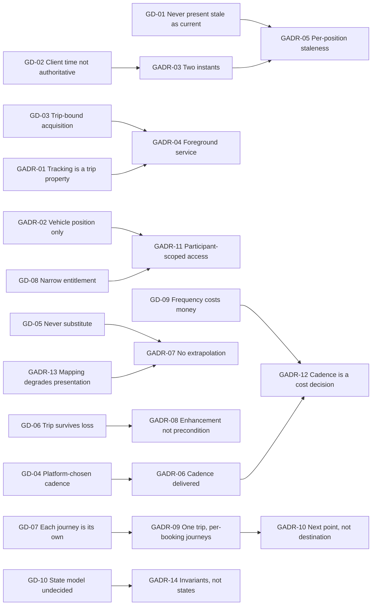
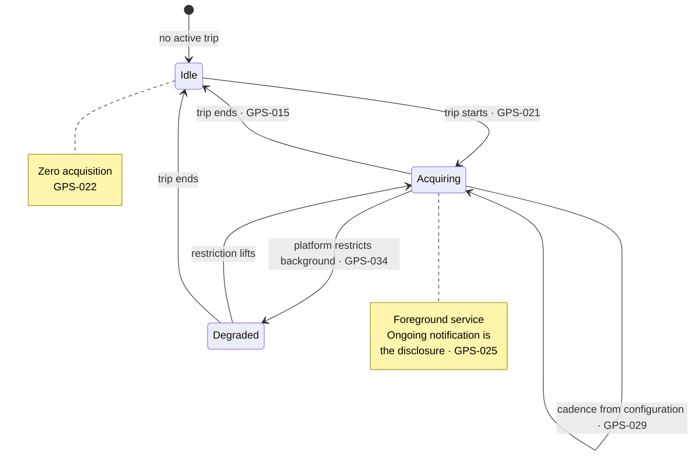
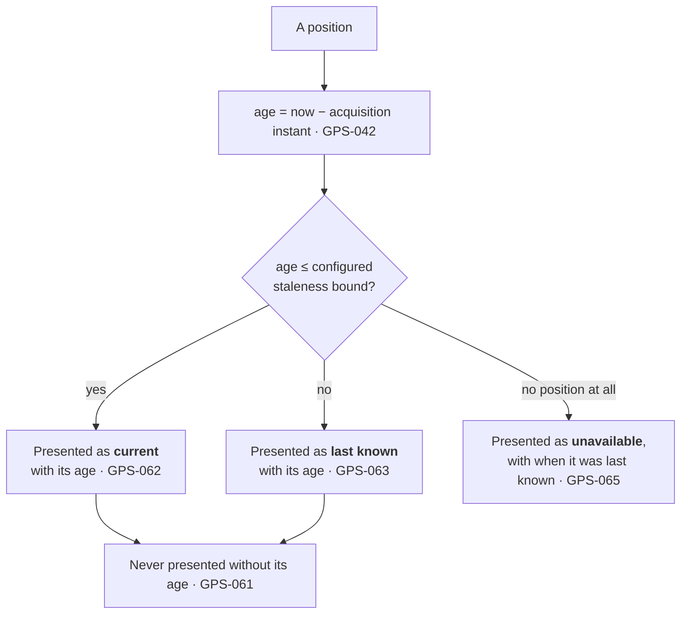
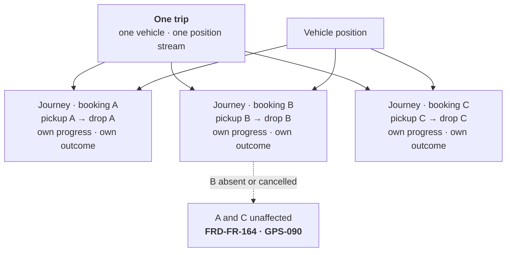

# CMP-DOC-15 — GPS / Live Trip Specification

**Carpool Mobility Platform (CMP)**

---

# 0. Document Control

## 0.1 Document Metadata

| Field | Value |
|---|---|
| Document ID | CMP-DOC-15 |
| Document Name | GPS / Live Trip Specification |
| Short Name | GPS |
| Project Name | Carpool Mobility Platform |
| Project Code | CMP |
| Version | 0.1 |
| Status | Draft |
| Date | 2026-08-17 |
| Author | Software Architect (AI-assisted) |
| Reviewer | [TBD] |
| Approver | Project Owner |
| Classification | Internal |
| Brand | TBD |
| Previous Version | None (initial issue) |
| Predecessor Documents | CMP-DOC-01 … CMP-DOC-14, **all Draft, none approved** (CMP-DOC-09 at v0.2, the remainder at v0.1) |
| Related Documents | `00_Project_Control/README.md`, `Documentation_Index.md`, `Documentation_Status.md`, `Document_Change_Log.md`, `Glossary.md`, `Master_Traceability_Matrix.md` |
| Successor Documents | CMP-DOC-16 (Communication & Notification), CMP-DOC-17 (Admin / Filament), CMP-DOC-18 (Testing & QA), CMP-DOC-19 (DevOps / Deployment) |

## 0.2 Revision History

| Version | Date | Author | Change | Status |
|---|---|---|---|---|
| 0.1 | 2026-08-17 | Software Architect (AI-assisted) | Initial issue. Specifies live trip behaviour: 10 tracking drivers, **14 tracking decisions**, the trip lifecycle, position acquisition, position reporting, staleness, estimates, the multi-passenger model, mapping dependency, privacy and retention, cost control, degraded operation, what is not specified, and verification obligations. Issues 196 statements (`GPS-001` … `GPS-196`). | Draft |

## 0.3 Distribution List

| Role | Purpose |
|---|---|
| Project Owner | Approval authority; **`BAD-DEC-015` and `BAD-DEC-022` are theirs** |
| **Software Architect** | Authoring and ownership |
| **Android Developers** | **Primary consumer — §5 acquisition** |
| **Backend Developers** | §6 reporting, §7 staleness, §8 estimates |
| Software Architect — Android | Consistency with CMP-DOC-08 §8.1 |
| UI/UX Designer | `UXDR-11` realisation and the staleness bound this document supplies |
| Security Analyst | Position protection and access limits (§10) |
| DevOps Engineer | Mapping provider cost and the highest-volume table (§11) |
| QA Analyst | The 10 verification obligations in §14 |

## 0.4 Approval

| Role | Name | Signature | Date |
|---|---|---|---|
| Author | Software Architect (AI-assisted) | — | 2026-08-17 |
| Reviewer | [TBD] | — | — |
| Approver | Project Owner | — | — |

> **This document is NOT approved.** It is issued at version 0.1 with status `Draft`
> for Project Owner review.

## 0.5 Purpose of This Document

A moving dot on a map is the most confident lie a mobile interface can tell. A dot that
has not moved for four minutes looks identical to one updating live, and a passenger
waiting at a kerb will read it as the truth.

`ARCH-094`, `FRD-FR-150`, `MOB-075` and `UXDR-11` all exist to prevent that, and each of
them defers the same thing: **the staleness bound**. CMP-DOC-12 §18.7 placed an obligation
on this document to supply it as configuration. §7 does.

This document specifies what the platform knows about where a vehicle is, how it comes to
know it, how long that knowledge stays true, and what it says when it does not know. It
also specifies the multi-passenger trip model, which `FRD-FR-161`–`164` require and which
is the part most likely to be built as an afterthought.

## 0.6 Boundaries — What This Document Does Not Specify

| Subject | Owning document |
|---|---|
| Client module and layer structure | CMP-DOC-08 |
| Endpoint paths and payloads | CMP-DOC-10 |
| Table structure and indexes | CMP-DOC-11 |
| Screen layout and map presentation | CMP-DOC-12 |
| **Cryptographic protection of position data** | **CMP-DOC-13** |
| Payment and fare | CMP-DOC-14 |
| Notification delivery on trip events | CMP-DOC-16 |
| Operator trip views | CMP-DOC-17 |
| Test cases | CMP-DOC-18 |
| **Mapping provider cost budgets and instance sizing** | **CMP-DOC-19** |

### 0.6.1 The Mapping Provider

**FACT.** CMP-DOC-01 directs Google Maps Platform for mapping and Android Fused Location
Provider for device acquisition. These are the two providers this chain has named.

This document specifies the **capabilities** the platform requires and the **plausibility
rules** every mapping response must satisfy. It specifies no API call, no product tier, no
quota and no pricing, and it requires the behaviour to be confirmed against the provider's
current specification at integration (`GPS-152`).

### 0.6.2 No Accuracy, Cadence or Budget Figure Is Stated

**FACT.** `NFR-147` requires the cost consequence of tracking frequency to be explicit and
configurable. `NFR-145` and `NFR-149` require bounds and thresholds that are unset
(`GAP-012`), and every mobile resource budget is unset (`GAP-015`).

This document states **that** cadence is configurable, **that** staleness is bounded and
**that** cost is attributable. It states **no cadence, no staleness bound value, no
accuracy radius, no battery figure, no data figure and no cost threshold**, because each
requires measurement nobody has taken. §15.2 names eleven such values.

## 0.7 Inputs to This Document

| Input | Contribution |
|---|---|
| CMP-DOC-04 §6.1 | `FRD-FR-141`–`168` — 28 trip execution behaviours |
| CMP-DOC-05 | `NFR-064` location access; `NFR-143`–`149` third-party cost |
| CMP-DOC-07 | `ARCH-091`–`ARCH-097`, `ARCH-119` |
| CMP-DOC-08 §8.1 | `MOB-069`–`MOB-084` — trip-bound acquisition |
| CMP-DOC-10 §11.9, §14.2 | Position operations; cadence and staleness as configuration |
| CMP-DOC-11 | `DB-073`–`DB-076`, `DB-180` — the highest-volume table |
| CMP-DOC-12 §18.7 | **The obligation to supply a staleness bound as configuration** |
| CMP-DOC-13 §20.5 | Position protection, access limits, mapping plausibility rules |

## 0.8 Qualifications on This Document

### 0.8.1 Source

Every statement derives from a predecessor statement, from a decision recorded in §3, or
is disclosed in §16.6 as originating here.

### 0.8.2 Qualification 1 — Fourteen Unapproved Predecessors

**FACT.** CMP-DOC-01 … CMP-DOC-14 are all `Draft`. None is approved.

Recorded as conflict `CC-016` and as `GPS-RISK-01`.

### 0.8.3 Qualification 2 — The Trip State Model Is Undecided

**FACT.** `UC-041` — *progress trip state* — is **Outlined**, blocked by `BAD-DEC-015`.
CMP-DOC-06 §7.2 records six of ten state models as undefined.

`FRD-FR-143`, `FRD-FR-144` and `FRD-FR-145` specify that a trip is created, that
transitions are recorded and that state is visible — **without specifying what the states
are**. `ARCH-091` requires the no-unconfirmed-start rule to hold *irrespective of the
eventual state model*, which is the chain acknowledging the same gap.

This document specifies the **invariants that hold under any state model** and the
mechanism by which states are configured. **It invents no state name and no transition.**
§12.1 records the position.

### 0.8.4 Qualification 3 — Live Trip Sharing Is Outlined

**FACT.** `UC-049` — *share a live trip* — is **Outlined**, blocked by `BAD-DEC-022`.

CMP-DOC-12 §13.1 already found that trip sharing is one of three undesignable safety
controls. **No sharing flow, recipient experience or link mechanism is specified here.**
`ARCH-137` bounds what an unauthenticated recipient may see, and that bound is the only
part that exists. §12.2 records it.

## 0.9 Statement Classification Convention

As `README.md` §9.1. Markers: **FACT**, **ASSUMPTION**, **BUSINESS DECISION REQUIRED**,
**TECHNICAL DECISION REQUIRED**, **OPEN QUESTION**, **TBD**, **FUTURE CONSIDERATION**,
**RECOMMENDATION**.

## 0.10 Identifier Conventions

| Prefix | Element | Section |
|---|---|---|
| `GPS-nnn` | **Traceable live trip specification statement** | §4–§14 |
| `GADR-nn` | Tracking Decision Record | §3 |
| `GD-nn` | Tracking driver | §2 |
| `GPS-ASM-nn` | Assumption | §17.1 |
| `GPS-RISK-nn` | Risk | §17.2 |
| `GPS-OQ-nn` | Open Question | §17.3 |

## 0.11 Table of Contents

| § | Title |
|---|---|
| 0 | Document Control |
| 1 | Executive Summary |
| 2 | Tracking Drivers |
| 3 | Tracking Decisions |
| 4 | The Trip Lifecycle |
| 5 | Position Acquisition |
| 6 | Position Reporting |
| 7 | Staleness |
| 8 | Estimates |
| 9 | The Multi-Passenger Trip |
| 10 | Position Privacy and Retention |
| 11 | Mapping Dependency and Cost |
| 12 | What Is Not Specified |
| 13 | Degraded Operation |
| 14 | Verification Obligations |
| 15 | Configuration Values |
| 16 | Traceability |
| 17 | Assumptions, Risks and Open Questions |
| 18 | Acceptance Criteria for This Document |
| 19 | Statistics and Recommendations |
| A | Appendix A — Statement Index |
| B | Appendix B — Decision Index |
| C | Appendix C — Position Reference |

---

# 1. Executive Summary

## 1.1 What This Document Delivers

| Element | Count |
|---|---|
| Tracking drivers | 10 |
| **Tracking Decision Records** | **14** |
| Live trip specification statements | **196** (`GPS-001` … `GPS-196`) |
| Trip execution requirements realised | 28 of 28 |
| Configuration values supplied to the client | 6 |
| Configuration values named but unset | 11 |
| Verification obligations | 10 |
| Mapping plausibility rules | 6 |
| **Cadence, accuracy or budget figures stated** | **0** |
| **Trip state names invented** | **0** |

## 1.2 Live Tracking in One Paragraph

Location is acquired only while a trip is active, by a foreground service whose lifetime is
the trip's, at a cadence the platform supplies and the client never chooses. Every position
is timestamped by the platform on receipt, and carries the device's acquisition instant as
a separate reported value that is never authoritative. A position is presented as current
only within a configured staleness bound; beyond it, it is last known, with its age. The
platform never presents a previously known position as the current one. Estimates are
computed per participant against their own next relevant point, and where one cannot be
computed the platform says so rather than showing a stale or default value. A
multi-passenger trip tracks each booking's pickup and drop independently, and one
passenger's absence invalidates nobody else's booking. Position history is the
highest-volume data the platform holds, is removable independently of the trip record, and
is visible only to parties entitled to it.

## 1.3 The Four Decisions That Shape Everything Else

| GADR | Decision | Why it dominates |
|---|---|---|
| **`GADR-03`** | The platform timestamps every position **on receipt**, and the device's acquisition instant is carried as a **separate, non-authoritative reported value**. | `ARCH-092` says client timestamps are not authoritative. Two instants are needed — the age the user cares about is the acquisition age, and the value the platform can trust is its own. Collapsing them loses one or the other. |
| **`GADR-05`** | Staleness is evaluated **per position against a configured bound**, and the bound is delivered to the client, not compiled into it. | This discharges CMP-DOC-12 §18.7. `UX-140` reads the bound; if the client embedded one, changing it would need a release, and `MOB-123` forbids that. |
| **`GADR-07`** | An unavailable estimate is stated as unavailable. **No estimate is ever extrapolated, defaulted or carried forward.** | `FRD-FR-158` requires it. An ETA is the value a waiting passenger acts on most directly, and a stale one is worse than none. |
| **`GADR-09`** | A multi-passenger trip is **one trip with independent per-booking journeys**, not several trips sharing a vehicle. | `FRD-FR-161` associates every confirmed booking with the same trip; `FRD-FR-164` requires one passenger's absence not to invalidate another's booking. Modelling it as several trips breaks the first; modelling it as one undifferentiated journey breaks the second. |

## 1.4 What This Document Discharges

| Obligation | Source | Discharged by |
|---|---|---|
| Supply a staleness bound as configuration | CMP-DOC-12 §18.7 | `GADR-05`; §7, §15.1 |
| Position protection and access limits | CMP-DOC-13 §20.5 | §10 |
| Plausibility rules for mapping and routing responses | CMP-DOC-13 §20.5 | §11.2 |
| Position operations and their cadence configuration | CMP-DOC-10 §14.2 | §5.2, §6 |
| `op_trip_positions` independent removability | CMP-DOC-11 §18.5 | `GPS-121` |

## 1.5 What This Document Could Not Settle

| Matter | Position |
|---|---|
| Trip state names and transitions | `BAD-DEC-015`, `UC-041` Outlined — §12.1 |
| Live trip sharing | `BAD-DEC-022`, `UC-049` Outlined — §12.2 |
| Cadence, staleness bound, accuracy, budgets | §15.2 — eleven values unset |
| Position retention period | `SRS-REQ-093`, `BAD-DEC-021` |
| Cost thresholds and alerting | `NFR-145`, `NFR-149` unset |
| Navigation instructions and speed | `FRD-FR-160` is Release R2 — §12.3 |

---

# 2. Tracking Drivers

| ID | Driver | Source | Consequence |
|---|---|---|---|
| `GD-01` | A previously known position must never be presented as current. | `FRD-FR-150`, `ARCH-094` | `GADR-05`: bounded staleness, evaluated per position. |
| `GD-02` | A client timestamp is not authoritative. | `ARCH-092` | `GADR-03`: platform timestamps on receipt. |
| `GD-03` | Location is acquired only while a trip is active. | `MOB-069`, `NFR-160` | `GADR-04`: trip-bound foreground service. |
| `GD-04` | The client never chooses its own cadence. | `MOB-072`, `ARCH-026` | `GADR-06`: cadence delivered as configuration. |
| `GD-05` | An unavailable value must be stated, never substituted. | `FRD-FR-151`, `FRD-FR-158` | `GADR-07`: no extrapolation, ever. |
| `GD-06` | A trip must survive losing tracking. | `FRD-FR-152`, `MOB-077` | `GADR-08`: tracking is an enhancement, not a precondition. |
| `GD-07` | Each passenger's journey is their own. | `FRD-FR-162`, `FRD-FR-163` | `GADR-09`: one trip, independent per-booking journeys. |
| `GD-08` | Position is personal data with a narrow entitlement. | `NFR-064`, `SEC-067` | `GADR-11`: participant-scoped, trip-scoped, time-scoped. |
| `GD-09` | Tracking frequency has a cost consequence. | `NFR-147`, `NFR-145` | `GADR-12`: cadence and cost are the same decision. |
| `GD-10` | The trip state model is undecided and must not be invented. | `BAD-DEC-015` | `GADR-14`: specify the invariants, configure the states. |

---

# 3. Tracking Decisions

Each decision records its context, the alternatives considered, and its consequences
**including the negative ones**, marked ✘. **No decision states a cadence, accuracy or
budget figure** (§0.6.2).

## 3.1 `GADR-01` — Tracking Is a Trip Property, Not a User Property

| | |
|---|---|
| **Context** | `MOB-069` acquires location only while a trip is active. `NFR-160` requires tracking behaviour to be understandable to the user. `SRS-REQ-150` releases device capability when the activity ends. A user-level "share my location" setting would make tracking a standing capability with a standing risk. |
| **Decision** | **Tracking exists only in the context of an active trip. There is no user-level location setting, no standing share, no background tracking outside a trip, and no history of the user's movements that is not a history of their trips.** |
| **Alternatives** | *(a)* User-level location preference — rejected: creates a standing capability the platform does not need and cannot justify under `NFR-065`. *(b)* Track from booking to completion — rejected: a booking may precede a trip by days. |
| **Consequences** | ✔ The narrowest possible acquisition window. ✔ `NFR-065`'s minimisation is structural. ✘ No pre-trip position, so a passenger cannot see a driver approaching before the trip starts. ✘ Trip start becomes the moment tracking becomes possible, which §4.3 addresses. |

## 3.2 `GADR-02` — Position Is Reported by the Vehicle, Not by Every Participant

| | |
|---|---|
| **Context** | `FRD-FR-148` obtains the vehicle's position during an active trip. `FRD-FR-149` makes it available to participants. Nothing requires a passenger's own position, and acquiring it would double the personal data for no stated purpose. |
| **Decision** | **Only the driver's device reports position, as the vehicle's position. Passenger devices acquire no location during a trip. A passenger's pickup point is data they supplied, not a position observed.** |
| **Alternatives** | *(a)* Track all participants — rejected: no requirement asks for it, and `NFR-065` minimises to a stated purpose. *(b)* Track passengers near pickup — rejected: same, and it is the most privacy-sensitive moment. |
| **Consequences** | ✔ Half the position data, half the privacy surface, half the battery cost. ✔ The entitlement model is simple: participants see the vehicle. ✘ The platform cannot confirm a passenger was present, which matters for `GAP-008`'s no-show case — undecided anyway. ✘ Pickup confirmation must be an action, not an observation. |

## 3.3 `GADR-03` — Two Instants, One Authoritative

| | |
|---|---|
| **Context** | `ARCH-092` requires the platform to timestamp position observations and forbids client timestamps being authoritative. `UX-139` requires the displayed position to carry its **acquisition** age — which is the device's instant, the one that is not authoritative. Both are needed and they are different. |
| **Decision** | **Every position carries two instants: the platform's receipt instant, which is authoritative and orders the record, and the device's reported acquisition instant, which is what staleness and the user-facing age are computed from and which is never trusted for ordering or for integrity.** |
| **Alternatives** | *(a)* Platform instant only — rejected: a position delayed in transit would appear fresher than it is, which is exactly the deception `FRD-FR-150` forbids. *(b)* Device instant only — rejected: `ARCH-092`, and a wrong device clock would reorder history. |
| **Consequences** | ✔ Age is honest and ordering is trustworthy. ✔ A large divergence between the two is itself a signal, and `GPS-063` records it. ✘ Two instants on the highest-volume table. ✘ Developers must use the right one; §6.4 states which is which for each purpose. |

## 3.4 `GADR-04` — A Foreground Service Bound to the Trip, Disclosed by Its Notification

| | |
|---|---|
| **Context** | `MOB-070` runs acquisition in a foreground service bound to the active trip. `MOB-071` makes the ongoing notification the disclosure. `SRS-REQ-015` requires disclosure that location is being acquired. `MOB-078` stops and releases on trip end. |
| **Decision** | **Acquisition runs in a foreground service started at trip start and stopped at trip end. Its ongoing notification is the disclosure required by `SRS-REQ-015` and shall not be suppressible. The service holds no business logic and reports positions through the client's normal gateway.** |
| **Alternatives** | *(a)* Background acquisition — rejected: undisclosed, platform-restricted, and `SRS-REQ-015` requires the user to know. *(b)* Acquisition in the activity — rejected: stops when the screen locks, which is most of a trip. |
| **Consequences** | ✔ Disclosure is structural — the notification cannot be hidden. ✔ Acquisition survives the screen locking. ✘ A persistent notification for the trip's duration, which some users dislike and which is the price of honesty. ✘ Platform background restrictions still apply; `GADR-08` handles degradation. |

## 3.5 `GADR-05` — Staleness Is Per Position, Against a Delivered Bound

| | |
|---|---|
| **Context** | This discharges CMP-DOC-12 §18.7. `ARCH-094` forbids presenting a position as current beyond its configured staleness bound. `MOB-075` restates it client-side. `UX-140` changes presentation at the bound. `MOB-123` forbids the client embedding a platform-held policy value. |
| **Decision** | **Staleness is evaluated per position by comparing its acquisition instant to now against a bound the platform delivers through the configuration resource. The bound is not compiled into the client, not hard-coded in the platform, and not inferred from cadence.** |
| **Alternatives** | *(a)* Derive the bound from cadence, as a multiple — rejected: couples two decisions that should move independently, and a cadence change would silently change staleness. *(b)* Fixed bound in the client — rejected: `MOB-123`, and changing it would need a release. |
| **Consequences** | ✔ CMP-DOC-12's obligation is discharged with a value the operator can change. ✔ Cadence and staleness can be tuned separately. ✘ Two configuration values to set rather than one. ✘ **Both values are unset** (§15.2), so the mechanism is complete and unusable until they are. |

## 3.6 `GADR-06` — Cadence Is Delivered, and the Client Never Chooses

| | |
|---|---|
| **Context** | `ARCH-093` supplies cadence from the platform and makes it configurable. `MOB-072` forbids the client choosing. `ARCH-026` forbids polling on a client-chosen interval. `NFR-147` makes the cost consequence of frequency explicit and configurable. |
| **Decision** | **Acquisition cadence and reporting cadence are separate configured values delivered to the client. The client applies them and never varies them on its own judgement — not for battery, not for connectivity, not for perceived need.** |
| **Alternatives** | *(a)* Client-adaptive cadence based on battery or movement — rejected: `MOB-072`, and it makes cost unpredictable and behaviour unreproducible in support. *(b)* One cadence for both acquisition and reporting — rejected: acquiring often and reporting in batches is a legitimate tuning axis, and collapsing them removes it. |
| **Consequences** | ✔ Cost is predictable and controllable from the platform. ✔ Behaviour is reproducible. ✘ The client cannot protect its own battery, so a badly set cadence is a support problem the operator must fix. ✘ Two more unset values. |

## 3.7 `GADR-07` — No Value Is Ever Extrapolated

| | |
|---|---|
| **Context** | `FRD-FR-150` forbids presenting a previously known position as the current one. `FRD-FR-151` requires stating unavailability and when position was last known. `FRD-FR-158` requires stating that no estimate is available rather than presenting a stale or default value. `MOB-023` forbids substituting a default for an unknown. |
| **Decision** | **The platform never extrapolates a position from a previous one and a heading, never carries an estimate forward when its inputs are stale, and never substitutes a default. Where a value cannot be computed now, it is unavailable, and unavailability is a value the interface carries.** |
| **Alternatives** | *(a)* Dead-reckoning between reports — rejected: manufactures a position the platform did not observe, which is precisely what `FRD-FR-150` forbids. *(b)* Hold the last estimate until a new one arrives — rejected: `FRD-FR-158`; a passenger acting on a five-minute-old ETA is being misled. |
| **Consequences** | ✔ Nothing the platform shows is invented. ✔ `FRD-FR-150` and `FRD-FR-158` are satisfied by construction. ✘ The interface flickers between available and unavailable on a poor connection, which looks worse than a smooth lie. ✘ Requires the client to design an unavailable state for every live value — `UXDR-07` already does. |

## 3.8 `GADR-08` — Tracking Is an Enhancement, Never a Precondition

| | |
|---|---|
| **Context** | `FRD-FR-152` permits a trip to begin when position cannot be obtained, indicating tracking unavailable. `MOB-077` continues the trip under background restriction with degraded acquisition. `MOB-079` permits starting when location is unavailable. `ARCH-107` requires an active trip to survive any single supporting service being unavailable. |
| **Decision** | **A trip starts, runs and completes without tracking. Loss of position degrades the trip's information and never its validity. No trip state transition depends on a position, and no trip is blocked, paused or ended because tracking failed.** |
| **Alternatives** | *(a)* Require position to start — rejected: `FRD-FR-152`, and it would strand a trip in a car park with poor reception. *(b)* End a trip on prolonged position loss — rejected: the trip is still happening; the platform has merely stopped watching. |
| **Consequences** | ✔ The trip is robust to the least reliable component in the system. ✔ `ARCH-107` holds. ✘ A completed trip may have little or no route record, which weakens `FRD-FR-166`'s captured route — `GPS-127` states what is captured when nothing was observed. ✘ Tracking cannot be used as evidence a trip occurred. |

## 3.9 `GADR-09` — One Trip, Independent Per-Booking Journeys

| | |
|---|---|
| **Context** | `FRD-FR-161` associates every confirmed booking on a ride with the same trip. `FRD-FR-162` tracks each booking's pickup and drop independently. `FRD-FR-163` presents each passenger the trip from their own perspective. `FRD-FR-164` is integrity-critical: one passenger's cancellation or absence must not invalidate another's booking. `FRD-FR-165` closes the trip recording each booking's outcome independently. |
| **Decision** | **A trip is a single entity with one vehicle and one position stream, carrying an independent journey per confirmed booking — each with its own pickup point, drop point, progress and outcome. Participants share the vehicle's position and share nothing else.** |
| **Alternatives** | *(a)* One trip per booking — rejected: `FRD-FR-161`, and the vehicle would report position several times. *(b)* One undifferentiated journey — rejected: `FRD-FR-162` and `FRD-FR-164`; a single outcome cannot record one passenger completing and another absent. |
| **Consequences** | ✔ `FRD-FR-164` is structural: outcomes are per booking, so one cannot affect another. ✔ Each passenger's view is a projection of one shared position stream. ✘ Every trip-level operation must be examined for whether it is really per-booking; §9.4 lists which are which. ✘ Completion is not a single event but a set of per-booking outcomes plus a trip closure. |

## 3.10 `GADR-10` — The Driver Sees the Next Point, Not the Destination

| | |
|---|---|
| **Context** | `FRD-FR-159` requires presenting a driver with the estimate to their **next pickup or drop**, not to their own destination. On a multi-passenger trip the driver's own destination is the least useful figure they could be shown. |
| **Decision** | **Estimates are computed per participant against that participant's next relevant point. For a driver on a multi-passenger trip, that is the next pickup or drop in sequence; for a passenger awaiting pickup, it is their pickup; for a passenger travelling, it is their drop.** |
| **Alternatives** | *(a)* One trip-level ETA — rejected: `FRD-FR-159` and `FRD-FR-163`; it is the wrong number for everyone. |
| **Consequences** | ✔ Every participant sees the figure they act on. ✔ `FRD-FR-159` and `FRD-FR-163` satisfied. ✘ Estimate computation is per participant, multiplying mapping cost by participants — which `GADR-12` makes a cost decision rather than an accident. ✘ Point sequencing depends on the route, and route ordering is undecided (§12.4). |

## 3.11 `GADR-11` — Position Access Is Participant-, Trip- and Time-Scoped

| | |
|---|---|
| **Context** | `NFR-064` limits location history to parties entitled to it. `SEC-067` restates it. `SEC-083` requires position protected as personal data and independently removable. `BAD-RULE-025` forbids exposing a counterparty's precise personal location beyond what a trip requires. `ARCH-137` bounds and time-limits what an unauthenticated recipient may see. |
| **Decision** | **A position is visible to the participants of its trip, for that trip, while it is active. After completion, position history is not presented to participants at all; the completed trip record carries the route travelled, not the position stream.** |
| **Alternatives** | *(a)* Participants retain access to position history after completion — rejected: `NFR-065`; the purpose ended with the trip, and `FRD-FR-166` already captures the route. *(b)* Driver retains access to their own history — rejected: it is also the passengers' history. |
| **Consequences** | ✔ The entitlement window is as narrow as the purpose. ✔ Removal of position history (`DB-180`) affects nothing anyone can currently see. ✘ A dispute after a trip cannot be settled from position history by a participant; only an operator can reach it, and only within retention. ✘ Requires the captured route (§9.5) to be sufficient for the completed trip record. |

## 3.12 `GADR-12` — Cadence Is a Cost Decision, and Cost Is Attributed

| | |
|---|---|
| **Context** | `NFR-147` requires the cost consequence of tracking frequency to be explicit and configurable. `NFR-143` attributes third-party cost to the activity that incurred it. `NFR-145` bounds cost per completed trip. `NFR-149` alerts when cost per trip exceeds a threshold. `ARCH-067` records every adapter call, its outcome and its attributable cost. |
| **Decision** | **Every mapping call is recorded against the trip and the participant that caused it. Cadence, estimate refresh interval and per-trip call bounds are configuration, and changing cadence visibly changes recorded cost. Cost per trip is an operational measure.** |
| **Alternatives** | *(a)* Record cost in aggregate — rejected: `NFR-143` requires attribution to the activity, and an aggregate cannot show which trips are expensive. |
| **Consequences** | ✔ The cadence-versus-cost trade-off is measurable rather than argued. ✔ `NFR-145` and `NFR-149` become implementable once thresholds exist. ✘ A cost record per mapping call adds volume. ✘ **The bounds and thresholds are unset** (§15.2). |

## 3.13 `GADR-13` — Mapping Unavailability Degrades Presentation, Not Position

| | |
|---|---|
| **Context** | `FRD-FR-153` requires continuing to report position without map context where the mapping service is unavailable. `ARCH-109` withdraws search when route resolution is unavailable — a different decision for a different capability. `SEC-012` requires plausibility validation on every provider response. |
| **Decision** | **Position acquisition and reporting do not depend on the mapping provider. Where mapping is unavailable, positions continue to be acquired, reported and stored; map rendering and estimates become unavailable and are stated as such. Search behaves differently and is `ARCH-109`'s concern, not this document's.** |
| **Alternatives** | *(a)* Suspend tracking when mapping fails — rejected: `FRD-FR-153`, and the position data is still true and still wanted. *(b)* Cache map tiles to continue rendering — rejected: an availability improvement, not a specification requirement, and it does not restore estimates. |
| **Consequences** | ✔ The trip record survives a mapping outage intact. ✔ `FRD-FR-153` satisfied. ✘ A position with no map context is of limited use to a passenger; `GPS-146` requires it to be stated rather than shown as a blank map. ✘ Estimates disappear during the outage, which `GADR-07` makes honest. |

## 3.14 `GADR-14` — Specify the Invariants; Configure the States

| | |
|---|---|
| **Context** | `UC-041` is Outlined and `BAD-DEC-015` is unresolved, so the trip state model does not exist. `ARCH-091` requires the no-unconfirmed-start rule to hold *irrespective of the eventual state model*. `BADR-13` makes state machines configuration-driven; `DB-155` holds definitions in `cfg_`. `BE-177` requires coded invariants to hold under any declared model. |
| **Decision** | **This document specifies the invariants that must hold under any trip state model, and the mechanism by which states and transitions are configured. It names no state and no transition. When `BAD-DEC-015` is resolved, the model becomes configuration and the invariants are unaffected.** |
| **Alternatives** | *(a)* Propose a provisional state model — rejected: a provisional model becomes the model, and `UC-041` being Outlined means nobody has decided what progressing a trip means. *(b)* Defer this document — rejected: acquisition, staleness, estimates and the multi-passenger model are all decided and all specifiable. |
| **Consequences** | ✔ Nothing is invented and the invariants are buildable now. ✔ `BAD-DEC-015` resolves into configuration, not code. ✘ **A developer cannot build the trip screen's state display from this document alone**; `UX-143` presents state from platform state, and what those states are is undecided. ✘ §12.1 is a real gap in an otherwise complete area. |

## 3.15 Driver to Decision Map

---

# 4. The Trip Lifecycle

## 4.1 Start

| ID | Statement | Src |
|---|---|---|
| `GPS-001` ‡ | A trip shall not start without at least one confirmed booking, irrespective of the eventual state model. | `ARCH-091`, `FRD-FR-142` |
| `GPS-002` | A driver shall be able to begin a trip against a ride carrying at least one confirmed booking. | `FRD-FR-141` |
| `GPS-003` | A trip shall be created on commencement and its start time recorded. | `FRD-FR-143` |
| `GPS-004` | The actual start time shall be recorded against the scheduled departure time. | `FRD-FR-147` |
| `GPS-005` | Booked passengers shall be notified when a trip begins; delivery is CMP-DOC-16's. | `FRD-FR-146`, §0.6 |
| `GPS-006` ‡ | A trip shall be permitted to start when position cannot be obtained, with tracking indicated as unavailable. | `FRD-FR-152`, `MOB-079` |
| `GPS-007` ‡ | Trip start shall not depend on the mapping provider. | `GADR-13`, `FRD-FR-153` |

## 4.2 During

| ID | Statement | Src |
|---|---|---|
| `GPS-008` | Every trip state transition shall be recorded with the time at which it occurred. | `FRD-FR-144` |
| `GPS-009` | The current trip state shall be visible to every participant. | `FRD-FR-145` |
| `GPS-010` ‡ | Trip state shall be platform-determined and shall never be settable by a client. | `API-160`, `UX-160` |
| `GPS-011` ‡ | No trip state transition shall depend on a position being available. | `GADR-08`, `ARCH-107` |
| `GPS-012` ‡ | An active trip shall survive the unavailability of any single supporting service. | `ARCH-107`, `NFR-034` |
| `GPS-013` | Transition definitions shall be read from policy configuration. | `BADR-13`, `DB-155` |
| `GPS-014` | The state names and transitions themselves are **not specified**; see §12.1. | `BAD-DEC-015`, `GADR-14` |

## 4.3 End

| ID | Statement | Src |
|---|---|---|
| `GPS-015` ‡ | Position tracking shall cease when a trip ends. | `FRD-FR-154`, `MOB-078` |
| `GPS-016` ‡ | The device shall release location capability when the trip ends. | `SRS-REQ-150`, `MOB-078` |
| `GPS-017` ‡ | A trip shall not be reported complete where its record cannot be written. | `FRD-FR-167`, `ARCH-095` |
| `GPS-018` ‡ | Completion shall record each booking's outcome independently. | `FRD-FR-165`, `GADR-09` |
| `GPS-019` ‡ | A completed trip shall record its participants, route travelled, associated payment and outcome. | `FRD-FR-166`, `NFR-126` |
| `GPS-020` | Completion shall publish a domain event with no compile-time dependency on its subscribers. | `ARCH-097`, `BE-063` |

---

# 5. Position Acquisition

## 5.1 The Service

| ID | Statement | Src |
|---|---|---|
| `GPS-021` ‡ | Location shall be acquired only while a trip is active. | `MOB-069`, `GADR-01` |
| `GPS-022` ‡ | Zero acquisition shall occur outside an active trip. | `MOB-069`, `NFR-065` |
| `GPS-023` ‡ | There shall be no user-level location setting, standing share or background tracking outside a trip. | `GADR-01`, `NFR-065` |
| `GPS-024` ‡ | Acquisition shall run in a foreground service whose lifetime is bound to the active trip. | `MOB-070`, `GADR-04` |
| `GPS-025` ‡ | The service's ongoing notification shall constitute the disclosure that location is being acquired, and shall not be suppressible. | `MOB-071`, `SRS-REQ-015` |
| `GPS-026` ‡ | Only the driver's device shall report position; passenger devices shall acquire no location during a trip. | `GADR-02`, `NFR-065` |
| `GPS-027` | The service shall contain no business rule and shall report through the client's normal gateway. | `MOB-010`, `MOB-047` |
| `GPS-028` | A location permission shall be requested only when a trip requiring it is started, with its reason stated first. | `SRS-REQ-147`, `UX-089` |

## 5.2 Cadence

| ID | Statement | Src |
|---|---|---|
| `GPS-029` ‡ | Acquisition cadence shall be supplied by the platform and shall never be chosen by the client. | `MOB-072`, `ARCH-093` |
| `GPS-030` | Reporting cadence shall be a separate configured value from acquisition cadence. | `GADR-06`, `NFR-147` |
| `GPS-031` ‡ | The client shall not vary cadence on its own judgement — not for battery, not for connectivity, not for perceived need. | `MOB-072`, `GADR-06` |
| `GPS-032` | Cadence shall be read from the configuration resource and shall not be embedded. | `MOB-123`, `API-187` |
| `GPS-033` | Cadence values are **unset**; §15.2 records them. | `GAP-012`, `NFR-147` |

## 5.3 Degradation

| ID | Statement | Src |
|---|---|---|
| `GPS-034` ‡ | Under platform background restriction the trip shall continue with degraded acquisition rather than end. | `MOB-077`, `GADR-08` |
| `GPS-035` | Degraded acquisition shall be reported as such, so that the platform knows why positions are sparse. | `GADR-08`, `ARCH-105` |
| `GPS-036` ‡ | A refused location permission shall reduce capability and shall not end the trip or the flow. | `SRS-REQ-148`, `UX-090` |
| `GPS-037` | The client shall not attempt to circumvent a platform restriction on background activity. | `MOB-077`, `SEC-159` |
| `GPS-038` | Acquisition accuracy is a device and platform property and **no accuracy figure is stated**; §15.2. | §0.6.2 |

---

# 6. Position Reporting

## 6.1 What a Position Carries

| Element | Authoritative? | Purpose |
|---|---|---|
| Coordinates | Yes, as reported | The position |
| Reported accuracy | No — device-supplied | Presentation qualification |
| **Device acquisition instant** | **No** (`ARCH-092`) | Staleness and user-facing age |
| **Platform receipt instant** | **Yes** | Ordering, integrity, retention |
| Trip reference | Yes | Scoping |

| ID | Statement | Src |
|---|---|---|
| `GPS-039` ‡ | The platform shall timestamp every position on receipt, and that instant shall be authoritative. | `ARCH-092`, `GADR-03` |
| `GPS-040` ‡ | The device's acquisition instant shall be carried as a separate reported value and shall never be authoritative. | `ARCH-092`, `GADR-03` |
| `GPS-041` ‡ | Ordering, integrity and retention shall use the platform instant. | `GADR-03`, `DB-074` |
| `GPS-042` ‡ | Staleness and the user-facing age shall be computed from the acquisition instant. | `GADR-03`, `UX-139` |
| `GPS-043` | Device-reported accuracy shall be carried and shall qualify presentation, never gate acceptance. | `GADR-07` |
| `GPS-044` ‡ | A position shall be scoped to its trip and shall not exist outside one. | `GADR-01`, `DB-073` |

## 6.2 Acceptance

| ID | Statement | Src |
|---|---|---|
| `GPS-045` ‡ | A position report shall be accepted only for an active trip the reporting actor drives. | `SEC-056`, `API-099` |
| `GPS-046` ‡ | A position report shall be validated against platform state before use. | `ARCH-131`, `API-040` |
| `GPS-047` ‡ | A position shall not set, alter or influence any authoritative business value. | `API-036`, `UX-020` |
| `GPS-048` | Reports shall be accepted in batches, so that reporting cadence may differ from acquisition cadence. | `GADR-06`, `GPS-030` |
| `GPS-049` | A batch shall be idempotent; a replayed batch shall produce no duplicate positions. | `API-057`, `BE-135` |
| `GPS-050` | Out-of-order reports shall be accepted and ordered by the platform instant. | `GPS-041` |
| `GPS-051` | A report for a trip that has ended shall be refused as a business refusal, not silently discarded. | `GPS-015`, `API-059` |
| `GPS-052` | A report shall be rejected in whole where any element is malformed, and the rejection reported per branch. | `API-038`, `UX-055` |

## 6.3 Distribution

| ID | Statement | Src |
|---|---|---|
| `GPS-053` | The vehicle's position shall be available to the participants of the active trip. | `FRD-FR-149` |
| `GPS-054` ‡ | Position shall be served with its acquisition instant so that the consumer can compute age. | `API-043`, `UX-139` |
| `GPS-055` | The most recent position shall be readable; the full stream shall not be exposed to participants. | `GADR-11`, `API-049` |
| `GPS-056` | The client shall not poll for position on a self-chosen interval. | `ARCH-026`, `MOB-134` |
| `GPS-057` | Position distribution shall not depend on the mapping provider. | `GADR-13`, `FRD-FR-153` |

## 6.4 Which Instant, Where

**Stated so that the choice is not a judgement call.**

| Purpose | Instant |
|---|---|
| Ordering the position stream | Platform receipt |
| Retention and removal | Platform receipt |
| Evidential and integrity records | Platform receipt |
| Staleness evaluation | Device acquisition |
| The age shown to a user | Device acquisition |
| Detecting a divergent device clock | Both, compared |

| ID | Statement | Src |
|---|---|---|
| `GPS-058` | The mapping above shall be applied without exception. | `GADR-03` |

---

# 7. Staleness

This section discharges CMP-DOC-12 §18.7.

| ID | Statement | Src |
|---|---|---|
| `GPS-059` ‡ | A staleness bound shall be delivered to the client through the configuration resource. | **CMP-DOC-12 §18.7**, `MOB-123` |
| `GPS-060` ‡ | The bound shall not be compiled into the client, hard-coded in the platform, or derived from cadence. | `GADR-05`, `MOB-123` |
| `GPS-061` ‡ | A position shall never be presented without its age. | `UX-139`, `UXDR-11` |
| `GPS-062` ‡ | Within the bound, a position shall be presented as current with its age. | `ARCH-094`, `UX-140` |
| `GPS-063` ‡ | Beyond the bound, a position shall be presented as last known with its age, and the presentation shall differ perceptibly. | `FRD-FR-150`, `UX-140` |
| `GPS-064` ‡ | A previously known position shall never be presented as the current position. | `FRD-FR-150`, `MOB-075` |
| `GPS-065` ‡ | Where position cannot be obtained at all, the platform shall indicate that it is unavailable and when it was last known. | `FRD-FR-151` |
| `GPS-066` ‡ | A stale position shall not be hidden; a last-known position remains useful. | `UXDR-11`, `FRD-FR-151` |
| `GPS-067` ‡ | Staleness shall be evaluated per position, never per screen or per session. | `GADR-05`, `UXDR-02` |
| `GPS-068` ‡ | No position shall be extrapolated, dead-reckoned or interpolated. | `GADR-07`, `FRD-FR-150` |
| `GPS-069` | The bound value is **unset**; §15.2. | `GAP-012` |
| `GPS-070` | A large divergence between the acquisition and receipt instants shall be recorded, as it indicates a delayed report or a divergent device clock. | `GADR-03`, `GPS-058` |

---

# 8. Estimates

| ID | Statement | Src |
|---|---|---|
| `GPS-071` | The platform shall compute an estimated time of arrival at each participant's next relevant point during an active trip. | `FRD-FR-155` |
| `GPS-072` | The platform shall compute the remaining distance to each participant's next relevant point. | `FRD-FR-156` |
| `GPS-073` | Estimates shall update as the trip progresses. | `FRD-FR-157` |
| `GPS-074` ‡ | Where an estimate cannot be computed, the platform shall state that none is available rather than present a stale or default value. | `FRD-FR-158`, `GADR-07` |
| `GPS-075` ‡ | An estimate shall never be carried forward when its inputs are stale. | `GADR-07`, `GPS-074` |
| `GPS-076` | A driver shall be presented with the estimate to their next pickup or drop, not to their own destination. | `FRD-FR-159`, `GADR-10` |
| `GPS-077` | A passenger awaiting pickup shall be presented with the estimate to their pickup; a passenger travelling, to their drop. | `FRD-FR-163`, `GADR-10` |
| `GPS-078` ‡ | Estimates shall be computed by the platform and never on the device. | `UX-020`, `MOB-022` |
| `GPS-079` | An estimate shall carry its own as-of marking, distinct from the position's. | `API-043`, `UXDR-02` |
| `GPS-080` | Estimate refresh interval shall be configuration, separate from position cadence. | `GADR-12`, `NFR-147` |
| `GPS-081` ‡ | Estimates shall become unavailable when the mapping provider is unavailable, and shall be stated as such. | `GADR-13`, `FRD-FR-153` |
| `GPS-082` | Current speed, current landmark and the next navigation instruction are **Release R2** (`FRD-FR-160`) and are not specified here. | `FRD-FR-160`, §12.3 |
| `GPS-083` | Point sequencing depends on route ordering, which **no upstream rule, decision or requirement covers**; §12.4. | **originates here** (§16.6) |
| `GPS-084` | An estimate shall not be presented as a commitment or a guarantee. | `NFR-137`, `UX-176` |

---

# 9. The Multi-Passenger Trip

## 9.1 The Model

| ID | Statement | Src |
|---|---|---|
| `GPS-085` ‡ | Every confirmed booking on a ride shall be associated with the same trip. | `FRD-FR-161`, `GADR-09` |
| `GPS-086` ‡ | A trip shall carry one vehicle and one position stream. | `GADR-02`, `GADR-09` |
| `GPS-087` ‡ | Each booking shall have its own journey with its own pickup point, drop point, progress and outcome. | `FRD-FR-162`, `GADR-09` |
| `GPS-088` | Each passenger shall be presented the trip from the perspective of their own pickup and drop. | `FRD-FR-163` |
| `GPS-089` ‡ | Participants shall share the vehicle's position and shall share nothing else. | `GADR-11`, `API-049` |
| `GPS-090` ‡ | The cancellation or absence of one passenger shall not invalidate another passenger's booking on the same trip. | `FRD-FR-164` |
| `GPS-091` ‡ | Outcomes shall be recorded per booking, so that one cannot affect another. | `FRD-FR-165`, `GADR-09` |
| `GPS-092` ‡ | A trip shall not be modelled as several trips sharing a vehicle. | `FRD-FR-161`, `GADR-09` |
| `GPS-093` ‡ | A trip shall not be modelled as one undifferentiated journey. | `FRD-FR-162`, `FRD-FR-164` |

## 9.4 Trip-Level Versus Per-Booking

**Stated so that the distinction is not rediscovered per feature.**

| Concern | Level |
|---|---|
| Vehicle position | Trip |
| Trip state | Trip |
| Start and end instants | Trip |
| Route travelled | Trip |
| Pickup and drop points | **Per booking** |
| Progress against those points | **Per booking** |
| Estimate and remaining distance | **Per booking** (and per driver, to the next point) |
| Outcome | **Per booking** |
| Fare and payment | **Per booking** |
| Rating | **Per booking pair** — Outlined, `BAD-DEC-012` |

| ID | Statement | Src |
|---|---|---|
| `GPS-094` | The mapping above shall be applied when any trip capability is added. | `GADR-09` |
| `GPS-095` | A trip-level operation shall be examined for whether it is really per-booking before it is built. | `FRD-FR-164`, `GPS-094` |
| `GPS-096` | Completion is a set of per-booking outcomes plus a trip closure, not a single event. | `FRD-FR-165`, `GPS-018` |

## 9.5 The Captured Route

| ID | Statement | Src |
|---|---|---|
| `GPS-097` ‡ | A completed trip shall capture the route travelled as a value on the trip record. | `FRD-FR-166`, `DADR-11` |
| `GPS-098` ‡ | The captured route shall be derived from observed positions and shall not be the planned route. | `FRD-FR-166`, `GADR-07` |
| `GPS-099` ‡ | Where few or no positions were observed, the captured route shall record that, rather than substituting the planned route. | `GADR-07`, `GADR-08` |
| `GPS-100` ‡ | The captured route shall survive removal of the position history it was derived from. | `DB-180`, `GADR-11` |
| `GPS-101` | The captured route shall be bounded in size; the position stream is not part of the trip record. | `SRS-REQ-096`, `DB-166` |

---

# 10. Position Privacy and Retention

| ID | Statement | Src |
|---|---|---|
| `GPS-102` ‡ | Position shall be treated as personal data. | `NFR-064`, `SEC-083` |
| `GPS-103` ‡ | Location history shall be accessible only to parties entitled to it. | `NFR-064`, `SEC-067` |
| `GPS-104` ‡ | A position shall be visible to the participants of its trip, for that trip, while it is active. | `GADR-11`, `API-049` |
| `GPS-105` ‡ | After completion, the position stream shall not be presented to participants. | `GADR-11`, `NFR-065` |
| `GPS-106` ‡ | A counterparty's precise home or personal location shall not be disclosed beyond what coordinating the trip requires. | `BAD-RULE-025`, `SEC-068` |
| `GPS-107` ‡ | Position shall be protected at rest; the mechanism is CMP-DOC-13's. | `SEC-083`, `DB-035` |
| `GPS-108` ‡ | Position shall not appear in a log, a diagnostic record or a crash report. | `SEC-157`, `BE-201` |
| `GPS-109` ‡ | Position shall not be transmitted to any third party other than as a mapping query, and a mapping query shall carry no participant identity. | `SEC-060`, `NFR-065` |
| `GPS-110` ‡ | Position shall never be used as a cache key, a correlation value or an external identifier. | `SEC-087` |
| `GPS-111` | Acquisition shall be disclosed to the user while it occurs. | `SRS-REQ-015`, `GPS-025` |
| `GPS-112` | Tracking behaviour shall be understandable to the user, including when it occurs and when it stops. | `NFR-160`, `MOB-071` |
| `GPS-113` ‡ | Only the driver's position is acquired; the platform holds no passenger position. | `GADR-02`, `NFR-065` |
| `GPS-114` | An operator may reach position history only through the specified operator surface, and the access shall be recorded. | `SEC-057`, `BE-078` |
| `GPS-115` ‡ | Position access by an operator shall be evidenced. | `SEC-206`, `DB-114` |
| `GPS-116` | Unauthenticated recipients are bounded and time-limited by `ARCH-137`; the sharing flow itself is Outlined (§12.2). | `ARCH-137`, §12.2 |

## 10.2 Retention

| ID | Statement | Src |
|---|---|---|
| `GPS-117` ‡ | Position history shall be held in its own table, separable from the trip record. | `ARCH-119`, `DB-073` |
| `GPS-118` ‡ | Position history shall be removable independently of the trip record. | `ARCH-119`, `DB-180` |
| `GPS-119` | Position rows are wholly personal and shared with nobody, so **deletion is permitted** rather than in-place removal. | `DB-179`, `DADR-12` |
| `GPS-120` ‡ | Removal of position history shall not affect the captured route on a completed trip. | `GPS-100`, `DB-174` |
| `GPS-121` ‡ | This discharges CMP-DOC-11 §18.5's obligation on independent removability. | **CMP-DOC-11 §18.5**, `DB-180` |
| `GPS-122` | **The position retention period is `[TBD – Business Decision Required]`** (`SRS-REQ-093`, `BAD-DEC-021`). | `SRS-REQ-093`, `BAD-DEC-021` |
| `GPS-123` | Position history is the highest-volume data the platform holds; its partitioning and archival are unresolved sizing decisions. | `DB-076`, `DB-201` |
| `GPS-124` | Retention enforcement shall run as scheduled maintenance. | `BE-147`, `DB-170` |

---

# 11. Mapping Dependency and Cost

## 11.1 Dependency

| ID | Statement | Src |
|---|---|---|
| `GPS-125` ‡ | Position acquisition, reporting and storage shall not depend on the mapping provider. | `GADR-13`, `FRD-FR-153` |
| `GPS-126` ‡ | Where mapping is unavailable, positions shall continue to be acquired, reported and stored. | `FRD-FR-153` |
| `GPS-127` | Where mapping is unavailable, map rendering and estimates shall become unavailable and shall be stated as such. | `GADR-13`, `GPS-081` |
| `GPS-128` | Mapping shall be reached through a port declared in domain terms, naming no provider. | `BE-150`, `ARCH-130` |
| `GPS-129` | The mapping adapter shall be substitutable without change above `Infrastructure`. | `BE-162`, `ADR-11` |

## 11.2 Plausibility

This discharges CMP-DOC-13's obligation to state plausibility rules for mapping.

| # | Rule | Statement |
|---|---|---|
| 1 | A returned route must connect the points requested | `GPS-131` |
| 2 | A returned distance must be consistent with the geometry returned | `GPS-132` |
| 3 | A returned duration must be consistent with the distance at a plausible speed | `GPS-133` |
| 4 | A geocoded point must lie within the bounds of the query it answered | `GPS-134` |
| 5 | A response must reference the query the platform issued | `GPS-135` |
| 6 | A response must be in a recognised structure with a recognised vocabulary | `GPS-136` |

| ID | Statement | Src |
|---|---|---|
| `GPS-130` ‡ | Every mapping response shall be validated for plausibility before it is returned above the adapter. | `SEC-012`, `ARCH-064` |
| `GPS-131` ‡ | A route that does not connect the requested points shall fail plausibility. | `GPS-130`, `SEC-060` |
| `GPS-132` ‡ | A distance inconsistent with the returned geometry shall fail plausibility. | `GPS-130` |
| `GPS-133` ‡ | A duration inconsistent with the distance at a plausible speed shall fail plausibility; **the plausibility band is configuration and its value is unset**. | `GPS-130`, §15.2 |
| `GPS-134` ‡ | A geocoded point outside the bounds of its query shall fail plausibility. | `GPS-130`, `SEC-012` |
| `GPS-135` ‡ | A response not referencing the platform's query shall fail plausibility. | `SEC-004`, `GPS-130` |
| `GPS-136` ‡ | An unrecognised structure or vocabulary shall fail plausibility. | `SEC-012` |
| `GPS-137` ‡ | A response failing plausibility shall be returned as `Unavailable`, never as a result, and recorded. | `BE-152`, `PAY-108` |
| `GPS-138` ‡ | The adapter shall not synthesise, default or infer a result the provider did not return. | `ARCH-066` |

## 11.3 Cost

| ID | Statement | Src |
|---|---|---|
| `GPS-139` | Every mapping call shall be recorded with its outcome and its attributable cost. | `ARCH-067`, `SRS-REQ-145` |
| `GPS-140` | Cost shall be attributed to the trip and the participant that caused it. | `NFR-143`, `GADR-12` |
| `GPS-141` | Third-party cost per completed trip shall be bounded; **the bound is unset**. | `NFR-145`, §15.2 |
| `GPS-142` | The cost consequence of tracking frequency shall be explicit and configurable. | `NFR-147`, `GADR-12` |
| `GPS-143` | Cost per trip shall be an operational measure. | `NFR-149` |
| `GPS-144` | An alert threshold on cost per trip is **unset**; §15.2. | `NFR-149`, `GAP-012` |
| `GPS-145` | Result caching shall apply only to stable results and shall never cache a position or an authoritative value. | `ARCH-068`, `BE-121` |
| `GPS-146` | Where mapping is unavailable, the client shall state it rather than render a blank map. | `UX-069`, `GADR-13` |
| `GPS-147` | Route geometry resolved at publication is stored with the ride and is CMP-DOC-11's; it is not re-resolved per trip. | `ARCH-051`, `DB-051` |
| `GPS-148` | The number of mapping calls per trip shall be bounded by cadence and by the estimate refresh interval, both configuration. | `GADR-12`, `GPS-080` |
| `GPS-149` | Cost budgets, quotas and pricing are CMP-DOC-19's. | §0.6 |
| `GPS-150` | The directed providers are Google Maps Platform for mapping and Android Fused Location Provider for device acquisition; **no API, tier or quota is specified**. | CMP-DOC-01, §0.6.1 |
| `GPS-151` | Provider capability shall be reached only through the port, and no provider type shall appear above the adapter. | `BE-153`, `ARCH-063` |
| `GPS-152` | Provider behaviour shall be confirmed against the provider's current specification at integration, and divergence raised as a change. | §0.6.1, `PAY-192` |

---

# 12. What Is Not Specified

## 12.1 The Trip State Model

**FACT.** `UC-041` — *progress trip state* — is **Outlined**, blocked by `BAD-DEC-015`.

| ID | Statement | Src |
|---|---|---|
| `GPS-153` | **No trip state name and no transition is specified.** | `BAD-DEC-015`, `GADR-14` |
| `GPS-154` ‡ | The invariants in `GPS-001`, `GPS-011`, `GPS-017` and `GPS-090` shall hold under any eventual state model. | `ARCH-091`, `BE-177` |
| `GPS-155` | When `BAD-DEC-015` is resolved, the model shall become policy configuration and no code change shall be required to adopt it. | `BADR-13`, `DB-155` |
| `GPS-156` | **A developer cannot build the trip state display from this document alone**; `UX-143` presents state from platform state, and what those states are is undecided. | `UX-143`, §0.8.3 |

## 12.2 Live Trip Sharing

| ID | Statement | Src |
|---|---|---|
| `GPS-157` | **No live trip sharing flow, recipient experience or link mechanism is specified.** `UC-049` is Outlined, blocked by `BAD-DEC-022`. | `BAD-DEC-022`, §0.8.4 |
| `GPS-158` ‡ | If sharing is later specified, what an unauthenticated recipient may see shall be bounded and time-limited by policy configuration. | `ARCH-137`, `SEC-007` |
| `GPS-159` | CMP-DOC-12 §13.1 records sharing as one of three undesignable safety controls; this document does not change that. | `UX-153`, `BAD-DEC-022` |

## 12.3 Navigation and Speed

| ID | Statement | Src |
|---|---|---|
| `GPS-160` | Current speed, current landmark and the next navigation instruction are **Release R2** and are not specified here. | `FRD-FR-160` |
| `GPS-161` | The platform is not a navigation application, and no statement here shall be read as providing turn-by-turn guidance. | `NFR-137`, `FRD-FR-160` |

## 12.4 Pickup and Drop Sequencing — A New Gap

| ID | Statement | Src |
|---|---|---|
| `GPS-162` | **The order in which pickups and drops are sequenced on a multi-passenger trip is `[TBD – Business Decision Required]`, and no upstream rule, decision or requirement covers it.** `BAD-RULE-022` and `BAD-RULE-023` govern route *matching* at search time, not point *sequencing* during a trip. | **originates here** (§16.6) |
| `GPS-163` ‡ | Until decided, the driver's next relevant point cannot be determined by the platform and `FRD-FR-159` is **unimplementable** for a multi-passenger trip. | `FRD-FR-159`, `GPS-162` |
| `GPS-164` | This is a **new gap identified by this document** — it is not recorded in CMP-DOC-01 as a business decision, not in CMP-DOC-04 as a functional gap, and not in the gap register. It is escalated at §19.4 R-3 and registered as `GAP-017`. | `GPS-162`, `GAP-017` |

## 12.5 Other Absences

| ID | Statement | Src |
|---|---|---|
| `GPS-165` | Geofencing, arrival detection and automatic pickup confirmation are not specified by any requirement and are **not invented here**. | §19 no-invention rule |
| `GPS-166` | Driver behaviour monitoring — harsh braking, speeding, phone use — is not specified by any requirement and is not invented here. | §19 no-invention rule |
| `GPS-167` | Offline map storage is not specified and is a `FUTURE CONSIDERATION`. | `FRD-FR-153` |
| `GPS-168` | Position-based fare adjustment does not exist; the fare is captured at confirmation and is immutable. | `PAY-020`, `DB-162` |

---

# 13. Degraded Operation

| Condition | Trip continues? | What the user is told |
|---|---|---|
| No position at trip start | **Yes** | Tracking unavailable (`GPS-006`) |
| Position lost during trip | **Yes** | Last known, with its age (`GPS-063`) |
| Platform restricts background activity | **Yes**, degraded | Acquisition degraded (`GPS-034`) |
| Location permission refused | **Yes**, no tracking | Capability reduced (`GPS-036`) |
| Mapping provider unavailable | **Yes** | Map and estimates unavailable (`GPS-127`) |
| Platform unreachable from the client | **Yes** | Positions queued; client discloses degraded state |
| Trip record cannot be written at completion | **Trip not reported complete** | `GPS-017` |

| ID | Statement | Src |
|---|---|---|
| `GPS-169` ‡ | No degradation in this table shall invalidate a trip, a booking or a payment. | `GADR-08`, `ARCH-107` |
| `GPS-170` ‡ | Every degradation shall be disclosed rather than hidden. | `ARCH-105`, `UX-069` |
| `GPS-171` ‡ | Degraded state shall be propagated to the client for disclosure. | `ARCH-105`, `MOB-106` |
| `GPS-172` | Positions acquired while the platform is unreachable shall be queued on the device and reported on restoration. | `MOB-065`, `NFR-162` |
| `GPS-173` | Queued positions shall retain their acquisition instants and shall be ordered by the platform on receipt. | `GPS-040`, `GPS-050` |
| `GPS-174` ‡ | A queued batch shall be idempotent on restoration. | `GPS-049`, `API-062` |
| `GPS-175` ‡ | The safety surface shall remain reachable throughout every degradation above. | `UX-080`, `BE-193` |
| `GPS-176` ‡ | A capability whose degradation would compromise an absolute rule shall be withdrawn entirely rather than degraded; no tracking capability meets that description. | `NFR-035`, `ARCH-104` |
| `GPS-177` | A trip shall not be ended by the platform because tracking failed. | `GADR-08`, `GPS-011` |
| `GPS-178` | Recovery shall update positions and their provenance without disrupting the user's position in a flow. | `UX-215`, `NFR-162` |

---

# 14. Verification Obligations

| # | Obligation | Verifies |
|---|---|---|
| 1 | No location is acquired when no trip is active, in any application state | `GPS-021`, `GPS-022` |
| 2 | Acquisition stops and location is released when the trip ends | `GPS-015`, `GPS-016` |
| 3 | A position older than the configured bound is never presented as current | `GPS-062`, `GPS-064` |
| 4 | Changing the configured bound changes presentation without a client release | `GPS-059`, `GPS-060` |
| 5 | No position is extrapolated between reports | `GPS-068` |
| 6 | An estimate whose inputs are stale is reported unavailable, not carried forward | `GPS-074`, `GPS-075` |
| 7 | A trip starts, runs and completes with no position at all | `GPS-006`, `GPS-011` |
| 8 | One passenger's cancellation leaves every other booking on the trip valid | `GPS-090` |
| 9 | An implausible mapping response returns `Unavailable`, never a result | `GPS-137` |
| 10 | Removing position history leaves the completed trip's captured route intact | `GPS-120` |

| ID | Statement | Src |
|---|---|---|
| `GPS-179` ‡ | The ten obligations above shall be automated tests. | `NFR-106`, `SADR-16` |
| `GPS-180` ‡ | Obligations 1, 3 and 8 shall be non-suppressible; each guards an integrity-critical statement. | `GPS-022`, `GPS-064`, `GPS-090` |
| `GPS-181` | Obligation 1 shall be exercised across application states including background and after process death. | `MOB-069`, `GPS-021` |
| `GPS-182` | Obligation 8 shall be exercised on a trip with at least three bookings. | `GPS-090`, `GADR-09` |
| `GPS-183` | Every statement marked ‡ shall be covered by an obligation here, by a database constraint, or by an obligation in CMP-DOC-13 §19. | `NFR-106`, `SEC-233` |
| `GPS-184` | The obligations pass to CMP-DOC-18 as test obligations. | §16.7 |

---

# 15. Configuration Values

## 15.1 Delivered to the Client

This is the set CMP-DOC-10 §14.2 reserved and CMP-DOC-12 §18.7 required.

| Value | Consumed by | Statement |
|---|---|---|
| Acquisition cadence | Foreground service | `GPS-029` |
| Reporting cadence | Client gateway | `GPS-030` |
| **Position staleness bound** | Presentation | `GPS-059` |
| Estimate refresh interval | Platform, disclosed to client | `GPS-080` |
| Presentation cache validity | Client cache | `MOB-123` |
| Client retry and backoff policy | Client gateway | `MOB-051` |

| ID | Statement | Src |
|---|---|---|
| `GPS-185` ‡ | Every value above shall be delivered through the configuration resource and none shall be embedded. | `MOB-123`, `API-187` |
| `GPS-186` ‡ | The client shall hold a documented conservative default for each, applied only until its first successful fetch. | `API-193`, `UX-193` |
| `GPS-187` ‡ | No configuration value shall permit a position to be presented as current beyond its bound. | `BE-172`, `GPS-064` |

## 15.2 Named but Unset

**Eleven values. No figure is stated for any of them.**

| Value | Register |
|---|---|
| Acquisition cadence | `[TBD – Technical Decision Required]` |
| Reporting cadence | `[TBD – Technical Decision Required]` |
| Position staleness bound | `[TBD – Technical Decision Required]` |
| Estimate refresh interval | `[TBD – Technical Decision Required]` |
| Duration plausibility band | `[TBD – Technical Decision Required]` |
| Mapping calls permitted per trip | `[TBD – Technical Decision Required]` |
| Third-party cost bound per trip | `[TBD – Business Decision Required]` · `NFR-145` |
| Cost-per-trip alert threshold | `[TBD – Business Decision Required]` · `NFR-149` |
| Position retention period | `[TBD – Business Decision Required]` · `SRS-REQ-093` |
| Battery and data budgets for tracking | `[TBD – Business Decision Required]` · `GAP-015` |
| Position history partitioning boundary | `[TBD – Technical Decision Required]` · `GAP-016` |

| ID | Statement | Src |
|---|---|---|
| `GPS-188` | No value above is asserted anywhere in this document. | §0.6.2, §19 no-invention rule |
| `GPS-189` | Four of them — cadence, staleness, estimate refresh and cost bound — are the same trade-off seen four ways, and setting them requires measurement nobody has taken. | `NFR-147`, `GADR-12` |
| `GPS-190` | The mechanism is complete and **unusable until the first four are set**. | `GPS-033`, `GPS-069` |

## 15.3 Instrumentation Required to Set Them

| ID | Statement | Src |
|---|---|---|
| `GPS-191` | Position report volume per trip shall be measurable. | `GADR-12`, `MOB-136` |
| `GPS-192` | Mapping calls per trip shall be measurable. | `GPS-139`, `NFR-143` |
| `GPS-193` | Battery and data consumed during an active trip shall be measurable at the nine points CMP-DOC-08 §13.1 named. | `GAP-015`, `MOB-136` |
| `GPS-194` | Position age at the moment of presentation shall be measurable, so that the staleness bound can be set from observation. | `GPS-042`, `GADR-05` |
| `GPS-195` | Instrumentation shall exist from first release, so that the values can be set from data rather than argument. | `NFR-113`, `GAP-015` |
| `GPS-196` | Setting the four values is a **precondition for the tracking feature being tunable**, not a post-launch improvement. | `GPS-190`, §19.4 |

---

# 16. Traceability

## 16.1 Upward Traceability

| Source document | Basis carried into this document |
|---|---|
| CMP-DOC-03 | `UC-039`, `UC-040`, `UC-042`, `UC-044` Specified; `UC-041`, `UC-049` Outlined |
| CMP-DOC-04 §6.1 | `FRD-FR-141`–`168` |
| CMP-DOC-05 | `NFR-064`, `NFR-143`–`149`, `NFR-160` |
| CMP-DOC-07 | `ARCH-091`–`ARCH-097`, `ARCH-107`, `ARCH-119`, `ARCH-137` |
| CMP-DOC-08 §8.1 | `MOB-069`–`MOB-084` |
| CMP-DOC-10 §11.9, §14.2 | Position operations; the configuration set |
| CMP-DOC-11 | `DB-073`–`DB-076`, `DB-179`, `DB-180` |
| CMP-DOC-12 §18.7 | **The staleness bound obligation** |
| CMP-DOC-13 §20.5 | Position protection, access limits, mapping plausibility |

## 16.2 The 28 Trip Execution Requirements

| FRD | Realised by |
|---|---|
| `FRD-FR-141`, `FRD-FR-142` | `GPS-002`, `GPS-001` |
| `FRD-FR-143`, `FRD-FR-144` | `GPS-003`, `GPS-008` |
| `FRD-FR-145` | `GPS-009` |
| `FRD-FR-146`, `FRD-FR-147` | `GPS-005`, `GPS-004` |
| `FRD-FR-148`, `FRD-FR-149` | `GPS-021`, `GPS-053` |
| `FRD-FR-150`, `FRD-FR-151` | `GPS-064`, `GPS-065` |
| `FRD-FR-152`, `FRD-FR-153` | `GPS-006`, `GPS-126` |
| `FRD-FR-154` | `GPS-015` |
| `FRD-FR-155`, `FRD-FR-156`, `FRD-FR-157` | `GPS-071`, `GPS-072`, `GPS-073` |
| `FRD-FR-158`, `FRD-FR-159` | `GPS-074`, `GPS-076` |
| `FRD-FR-160` | **Release R2** — `GPS-160`, not specified |
| `FRD-FR-161`, `FRD-FR-162`, `FRD-FR-163`, `FRD-FR-164` | `GPS-085`, `GPS-087`, `GPS-088`, `GPS-090` |
| `FRD-FR-165`, `FRD-FR-166`, `FRD-FR-167` | `GPS-018`, `GPS-019`, `GPS-017` |
| `FRD-FR-168` | Presentation is CMP-DOC-12's; the record is `GPS-019` |

> **27 of 28 are realised. `FRD-FR-160` is Release R2 and is not specified**, which is a
> scope position rather than a gap.

## 16.3 Obligations Discharged

| Obligation | Source | Discharged by |
|---|---|---|
| Supply a staleness bound as configuration | CMP-DOC-12 §18.7 | `GPS-059`, `GPS-060`; §15.1 |
| Position protection and access limits | CMP-DOC-13 §20.5 | §10 |
| Mapping plausibility rules | CMP-DOC-13 §20.5 | §11.2, six rules |
| `op_trip_positions` independently removable | CMP-DOC-11 §18.5 | `GPS-118`, `GPS-121` |
| Cadence and staleness as configuration | CMP-DOC-10 §14.2 | §15.1 |

## 16.4 Downward Traceability

| Consuming document | What it must take from here |
|---|---|
| CMP-DOC-16 Communication & Notification | Trip-start and trip-event notification triggers; that a notification carries no position |
| CMP-DOC-17 Admin / Filament | Operator position access is evidenced (`GPS-115`) and bounded by retention |
| CMP-DOC-18 Testing & QA | The 10 verification obligations (§14) |
| CMP-DOC-19 DevOps | Mapping cost budgets, position history partitioning, the instrumentation in §15.3 |

## 16.5 Statements Awaiting a Decision

| Statement | Awaiting |
|---|---|
| `GPS-014`, `GPS-153`–`GPS-156` | Trip state model — `BAD-DEC-015` |
| `GPS-116`, `GPS-157`–`GPS-159` | Live trip sharing — `BAD-DEC-022` |
| `GPS-122` | Position retention — `BAD-DEC-021` |
| `GPS-141`, `GPS-144` | Cost bound and threshold — `NFR-145`, `NFR-149` |
| `GPS-162`–`GPS-164` | Pickup and drop sequencing — `GAP-017` |
| §15.2 | Eleven configuration values |

## 16.6 Statements Originating in This Document

| Statement | Subject | Position |
|---|---|---|
| `GPS-040` | The device instant is carried as a separate non-authoritative value | **New.** `ARCH-092` says client timestamps are not authoritative; nothing said the device instant must still be carried, and `UX-139` needs it. |
| `GPS-070` | A large divergence between the two instants is recorded | **New.** Follows from carrying both: the difference is a signal nobody had considered. |
| `GPS-099` | Where few positions were observed, the captured route records that | **New.** `GADR-08` makes trips without tracking normal; nothing said what `FRD-FR-166`'s route captures then. |
| `GPS-162`, `GPS-163` | Pickup and drop sequencing on a multi-passenger trip is undecided, and `FRD-FR-159` is unimplementable without it | **New, and a new gap.** No upstream rule, decision, requirement or gap-register entry covers point sequencing. `BAD-RULE-022` and `BAD-RULE-023` govern route matching at search time only. Registered as `GAP-017`. |

## 16.7 Obligations This Document Places on Others

| Document | Obligation |
|---|---|
| **CMP-DOC-16** | Must not place a position in a notification |
| **CMP-DOC-16** | Must trigger trip-start notification from the trip event, not from a position |
| **CMP-DOC-17** | Must evidence every operator access to position history |
| **CMP-DOC-18** | Must carry the 10 obligations, with 1, 3 and 8 non-suppressible |
| **CMP-DOC-18** | Must exercise obligation 1 across background and post-process-death states |
| **CMP-DOC-19** | Must provide the instrumentation in §15.3 from first release |
| **CMP-DOC-19** | Must resolve position history partitioning once launch scale exists |

---

# 17. Assumptions, Risks and Open Questions

## 17.1 Assumptions

| ID | Assumption | If false |
|---|---|---|
| `GPS-ASM-01` | A foreground service can sustain acquisition for a trip's duration on the supported device range. | `GADR-04` degrades to `GPS-034`'s path more often than expected; the device range is unchosen (`MOB-OQ-001`). |
| `GPS-ASM-02` | Device-reported acquisition instants are approximately correct. | `GPS-070` detects divergence; staleness would be computed from a wrong clock, which is why `GPS-041` uses the platform instant for everything that must be right. |
| `GPS-ASM-03` | Passengers accept that no pre-trip position is available. | `GADR-01` would need revisiting, and with it the whole minimisation position. |
| `GPS-ASM-04` | The mapping provider supports the plausibility checks in §11.2 — returning the query reference, geometry and distance. | `GPS-135` and `GPS-132` become unimplementable and `SEC-012` is unmet for mapping. |
| `GPS-ASM-05` | Position volume is manageable at launch scale. | Unmeasured; `GPS-123` records partitioning as unresolved and it is the highest-volume table. |
| `GPS-ASM-06` | Launch scale is unknown; no statement here depends on a figure. | — |

## 17.2 Risks

| ID | Risk | L | I | Sev | Response |
|---|---|---|---|---|---|
| `GPS-RISK-01` | Fourteen unapproved predecessors. | 5 | 4 | 20 | `CC-016`; must not be baselined before approval. |
| `GPS-RISK-02` | The staleness bound is never set, so the mechanism ships with a conservative default nobody revisits. | 4 | 5 | 20 | `GPS-190`, `GPS-196`; §15.3's instrumentation is what makes setting it possible. |
| `GPS-RISK-03` | Dead-reckoning is added to smooth the map, defeating `FRD-FR-150`. | 4 | 5 | 20 | `GPS-068`; obligation 5. The flickering `GADR-07` causes is exactly what invites this. |
| `GPS-RISK-04` | The multi-passenger model is built as one undifferentiated journey. | 3 | 5 | 15 | `GPS-093`, §9.4's level table; obligation 8 non-suppressible. |
| `GPS-RISK-05` | Sequencing stays undecided and per-driver estimates are quietly dropped, or a developer invents an ordering. | 4 | 4 | 16 | `GAP-017`; the gap is now named rather than discovered in build. **Nobody has been asked this question before.** |
| `GPS-RISK-06` | Cadence is set high for a good demonstration and the mapping cost is discovered in the first invoice. | 4 | 4 | 16 | `GADR-12` makes cadence and cost the same decision; `GPS-143` measures it. |
| `GPS-RISK-07` | Acquisition continues outside a trip through a defect nobody notices. | 3 | 5 | 15 | Obligation 1, non-suppressible, exercised across application states. |
| `GPS-RISK-08` | Position history grows unpartitioned until the table is unmanageable. | 4 | 4 | 16 | `GPS-123`, `DB-201`; needs launch scale (`GAP-016`). |

## 17.3 Open Questions

| ID | Question | Type |
|---|---|---|
| `GPS-OQ-01` | **What are the trip states and transitions?** | `BAD-DEC-015`, `UC-041` |
| `GPS-OQ-02` | **In what order are pickups and drops sequenced on a multi-passenger trip?** | `GAP-017` — **no upstream decision exists to resolve** |
| `GPS-OQ-03` | Is live trip sharing to be specified, and on what terms? | `BAD-DEC-022`, `UC-049` |
| `GPS-OQ-04` | What is the position retention period? | `SRS-REQ-093`, `BAD-DEC-021` |
| `GPS-OQ-05` | What acquisition and reporting cadence, and what staleness bound? | §15.2 |
| `GPS-OQ-06` | What third-party cost bound and alert threshold per trip? | `NFR-145`, `NFR-149` |
| `GPS-OQ-07` | What is the supported device range, on which `GPS-ASM-01` depends? | `MOB-OQ-001` |
| `GPS-OQ-08` | Does the mapping provider support the six plausibility checks? | `GPS-ASM-04` |

---

# 18. Acceptance Criteria for This Document

| # | Criterion | Met |
|---|---|---|
| 1 | All 28 trip execution requirements addressed | Yes — §16.2; 27 realised, 1 is Release R2 |
| 2 | All five inherited obligations discharged | Yes — §16.3 |
| 3 | The staleness bound supplied as configuration | Yes — `GPS-059`, `GPS-060` |
| 4 | Six mapping plausibility rules stated | Yes — §11.2 |
| 5 | **No cadence, staleness, accuracy, battery, data or cost figure stated** | Yes — §15.2, eleven named unset |
| 6 | **No trip state name or transition invented** | Yes — `GPS-153` |
| 7 | No sharing flow invented | Yes — `GPS-157` |
| 8 | The multi-passenger model specified per booking, not per trip | Yes — §9, §9.4 |
| 9 | No position extrapolated, defaulted or carried forward | Yes — `GADR-07`, `GPS-068`, `GPS-075` |
| 10 | Every statement names a source, and every cited identifier resolves | Yes — 196 of 196 |
| 11 | Statement identifiers contiguous and unique | Yes — `GPS-001` … `GPS-196` |
| 12 | Statements with no upstream counterpart disclosed | Yes — §16.6, 4 of them |

---

# 19. Statistics and Recommendations

## 19.1 Document Statistics

| Measure | Value |
|---|---|
| Tracking drivers | 10 (`GD-01` … `GD-10`) |
| Tracking decisions | 14 (`GADR-01` … `GADR-14`) |
| Live trip specification statements | 196 (`GPS-001` … `GPS-196`) |
| Integrity-critical statements (‡) | 96 |
| Statements naming a source | 196 of 196 |
| Diagrams | 4 |
| Trip execution requirements realised | 27 of 28; 1 is Release R2 |
| Configuration values delivered to the client | 6 |
| **Configuration values named but unset** | **11** |
| Mapping plausibility rules | 6 |
| Verification obligations | 10 (3 non-suppressible) |
| Statements with no upstream counterpart | 5 |
| **Cadence, accuracy or budget figures stated** | **0** |
| **Trip state names invented** | **0** |
| Assumptions / Risks / Open questions | 6 / 8 / 8 |
| `[TBD – Business Decision Required]` markers | 8 |
| `[TBD – Technical Decision Required]` markers | 8 |

### Statements by Section

| § | Section | Statements |
|---|---|---|
| 4 | The Trip Lifecycle | 20 |
| 5 | Position Acquisition | 18 |
| 6 | Position Reporting | 20 |
| 7 | Staleness | 12 |
| 8 | Estimates | 14 |
| 9 | The Multi-Passenger Trip | 17 |
| 10 | Position Privacy and Retention | 23 |
| 11 | Mapping Dependency and Cost | 28 |
| 12 | What Is Not Specified | 16 |
| 13 | Degraded Operation | 10 |
| 14 | Verification Obligations | 6 |
| 15 | Configuration Values | 12 |
| | **Total** | **196** |

## 19.2 A Complete Mechanism With No Values

**The tracking mechanism is fully specified and cannot yet be tuned.** Four of the eleven
unset values — acquisition cadence, reporting cadence, the staleness bound and the estimate
refresh interval — are the same trade-off seen four ways: how often to look, how often to
tell, how long to believe, how often to recompute. Each costs battery, data and mapping
calls; each buys freshness.

**None can be set by argument.** §15.3 requires the instrumentation from first release
precisely so that they are set from observation. `GPS-196` states that this is a
precondition for the feature being tunable, not a post-launch improvement.

The one substantive gap in an otherwise complete area is **new**. Because pickup and drop
sequencing on a multi-passenger trip is undecided, the platform cannot determine a
driver's next relevant point, and `FRD-FR-159` is unimplementable. **No upstream rule,
decision, requirement or gap-register entry covers it** — `BAD-RULE-022` and `BAD-RULE-023`
govern route matching at search time, not sequencing during a trip. Registered here as
`GAP-017` and escalated at R-3.

## 19.3 What This Document Could Not Settle

| Matter | Why not settled |
|---|---|
| Trip states and transitions | `BAD-DEC-015`, `UC-041` Outlined |
| Pickup and drop sequencing | **`GAP-017` — newly identified; no upstream decision exists** |
| Live trip sharing | `BAD-DEC-022`, `UC-049` Outlined |
| Eleven configuration values | Measurement not taken; `GAP-012`, `GAP-015`, `GAP-016` |
| Position retention | `BAD-DEC-021` |
| Navigation and speed | `FRD-FR-160` is Release R2 |

## 19.4 Recommendations

| # | Recommendation | Rationale |
|---|---|---|
| R-1 | **Build the §15.3 instrumentation before the tracking feature, not after.** | `GPS-RISK-02` is severity 20. Four values cannot be set by argument, and a conservative default shipped without measurement becomes permanent. |
| R-2 | **Write obligation 5 — no extrapolation — before the map screen.** | `GPS-RISK-03` is severity 20. `GADR-07` causes visible flickering, and smoothing it with dead-reckoning is the obvious fix and the one `FRD-FR-150` forbids. |
| R-3 | **Decide pickup and drop sequencing, and record it as a business decision — there is currently no decision to resolve.** | `GAP-017`. Without it a driver on a multi-passenger trip cannot be given the estimate `FRD-FR-159` requires, and multi-passenger travel is the product's premise. This is a **new gap**, not a known one being restated. |
| R-4 | **Decide `BAD-DEC-015` before the trip screen is built.** | `GPS-156`: a developer cannot build the state display from this document, and the invariants are specified but the vocabulary is not. |
| R-5 | **Confirm the six plausibility checks against the mapping provider early.** | `GPS-ASM-04`. If the provider does not return a query reference, `GPS-135` is unimplementable and `SEC-012` is unmet for mapping. |
| R-6 | **Treat cadence as a cost decision at the first tuning conversation.** | `GPS-RISK-06`. `GADR-12` makes the link explicit so that it is a decision rather than an invoice. |

## 19.5 Recommendation Status

| Recommendation | Status |
|---|---|
| R-1 … R-6 | Recorded. None accepted, rejected or scheduled — this document is Draft and unapproved. |

---

# Appendix A — Statement Index

| Range | Section |
|---|---|
| `GPS-001` – `GPS-020` | The Trip Lifecycle |
| `GPS-021` – `GPS-038` | Position Acquisition |
| `GPS-039` – `GPS-058` | Position Reporting |
| `GPS-059` – `GPS-070` | Staleness |
| `GPS-071` – `GPS-084` | Estimates |
| `GPS-085` – `GPS-101` | The Multi-Passenger Trip |
| `GPS-102` – `GPS-124` | Position Privacy and Retention |
| `GPS-125` – `GPS-152` | Mapping Dependency and Cost |
| `GPS-153` – `GPS-168` | What Is Not Specified |
| `GPS-169` – `GPS-178` | Degraded Operation |
| `GPS-179` – `GPS-184` | Verification Obligations |
| `GPS-185` – `GPS-196` | Configuration Values |

---

# Appendix B — Decision Index

| GADR | Decision | Section |
|---|---|---|
| `GADR-01` | Tracking is a trip property, not a user property | §3.1 |
| `GADR-02` | Position is reported by the vehicle, not every participant | §3.2 |
| `GADR-03` | Two instants, one authoritative | §3.3 |
| `GADR-04` | A foreground service bound to the trip | §3.4 |
| `GADR-05` | Staleness is per position, against a delivered bound | §3.5 |
| `GADR-06` | Cadence is delivered; the client never chooses | §3.6 |
| `GADR-07` | No value is ever extrapolated | §3.7 |
| `GADR-08` | Tracking is an enhancement, never a precondition | §3.8 |
| `GADR-09` | One trip, independent per-booking journeys | §3.9 |
| `GADR-10` | The driver sees the next point, not the destination | §3.10 |
| `GADR-11` | Position access is participant-, trip- and time-scoped | §3.11 |
| `GADR-12` | Cadence is a cost decision, and cost is attributed | §3.12 |
| `GADR-13` | Mapping unavailability degrades presentation, not position | §3.13 |
| `GADR-14` | Specify the invariants; configure the states | §3.14 |

---

# Appendix C — Position Reference

| Property | Value |
|---|---|
| Acquired when | Only while a trip is active (`GPS-021`) |
| Acquired by | The driver's device only (`GPS-026`) |
| Acquired how | Foreground service bound to the trip (`GPS-024`) |
| Cadence | Platform-supplied configuration (`GPS-029`) |
| Authoritative instant | Platform receipt (`GPS-039`) |
| Age computed from | Device acquisition instant (`GPS-042`) |
| Presented as current | Within the configured staleness bound (`GPS-062`) |
| Presented beyond the bound | Last known, with its age (`GPS-063`) |
| Never | Extrapolated, defaulted or carried forward (`GPS-068`) |
| Visible to | Participants of that trip, while active (`GPS-104`) |
| Visible after completion | Not at all; the captured route replaces it (`GPS-105`) |
| Stored in | Its own table, independently removable (`GPS-117`, `GPS-118`) |
| Deletable | Yes — wholly personal, shared with nobody (`GPS-119`) |
| Retention period | `[TBD – Business Decision Required]` (`GPS-122`) |

---

*End of CMP-DOC-15 GPS / Live Trip Specification, version 0.1, Draft.*

