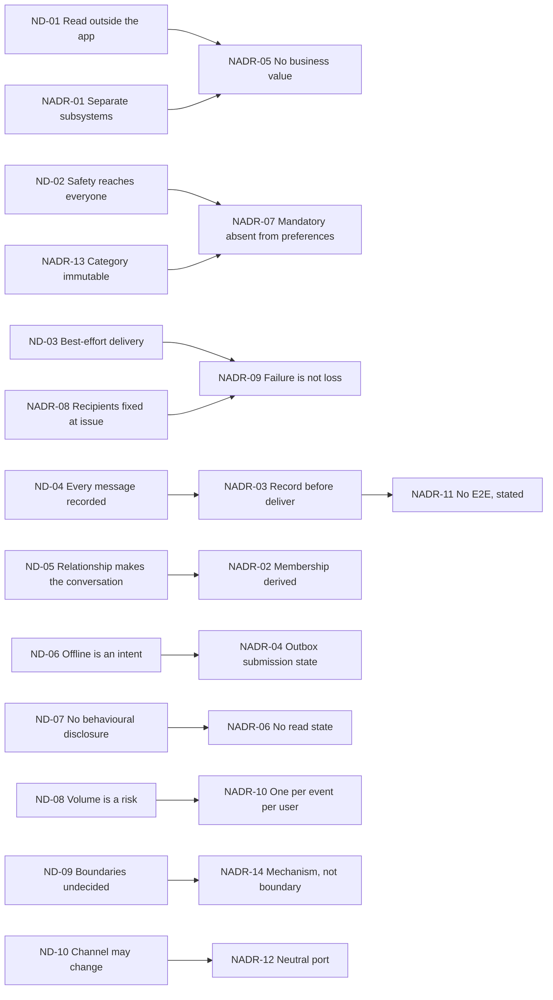
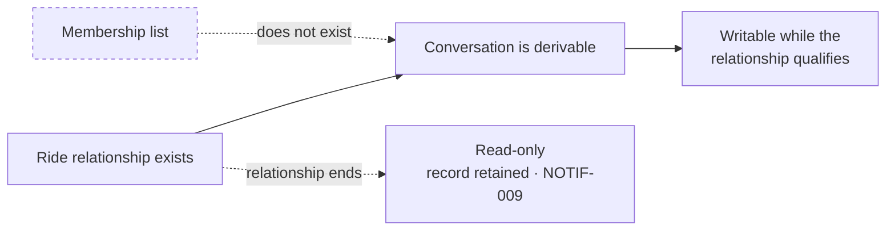
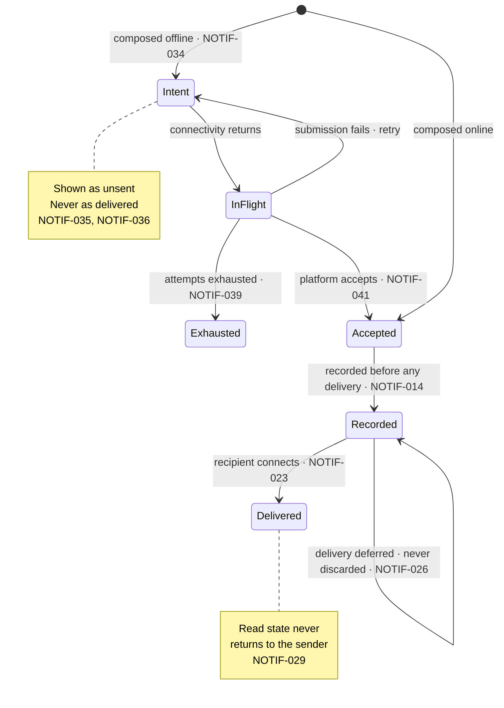
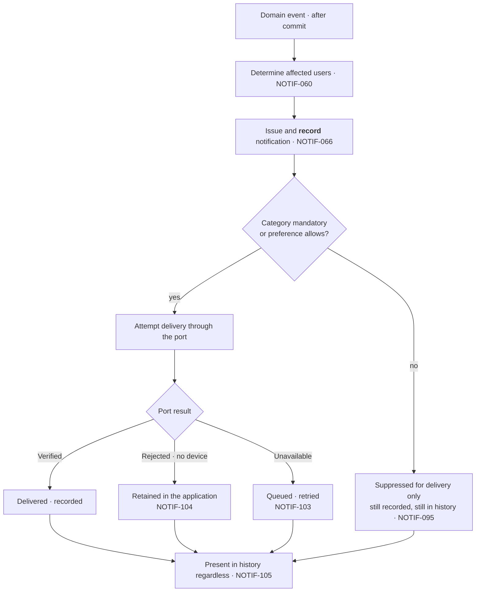

# CMP-DOC-16 — Communication & Notification Specification

**Carpool Mobility Platform (CMP)**

---

# 0. Document Control

## 0.1 Document Metadata

| Field | Value |
|---|---|
| Document ID | CMP-DOC-16 |
| Document Name | Communication & Notification Specification |
| Short Name | NOTIFICATION |
| Project Name | Carpool Mobility Platform |
| Project Code | CMP |
| Version | 0.1 |
| Status | Draft |
| Date | 2026-08-17 |
| Author | Software Architect (AI-assisted) |
| Reviewer | [TBD] |
| Approver | Project Owner |
| Classification | Internal |
| Brand | TBD |
| Previous Version | None (initial issue) |
| Predecessor Documents | CMP-DOC-01 … CMP-DOC-15, **all Draft, none approved** (CMP-DOC-09 at v0.2, the remainder at v0.1) |
| Related Documents | `00_Project_Control/README.md`, `Documentation_Index.md`, `Documentation_Status.md`, `Document_Change_Log.md`, `Glossary.md`, `Master_Traceability_Matrix.md` |
| Successor Documents | CMP-DOC-17 (Admin / Filament), CMP-DOC-18 (Testing & QA), CMP-DOC-19 (DevOps / Deployment) |

## 0.2 Revision History

| Version | Date | Author | Change | Status |
|---|---|---|---|---|
| 0.1 | 2026-08-17 | Software Architect (AI-assisted) | Initial issue. Specifies messaging and notification: 10 communication drivers, **14 communication decisions**, the messaging model, message delivery, offline messaging, the notification model, categories and preferences, delivery and failure, notification content, the delivery port, privacy, what is not specified, and verification obligations. Issues 188 statements (`NOTIF-001` … `NOTIF-188`). | Draft |

## 0.3 Distribution List

| Role | Purpose |
|---|---|
| Project Owner | Approval authority; **`BAD-DEC-022` is theirs and it blocks part of §4** |
| **Software Architect** | Authoring and ownership |
| **Backend Developers** | **Primary consumer** |
| Android Developers | §5.4 client behaviour and §9 delivery |
| UI/UX Designer | `UXDR-12` realisation; notification content rules (§10) |
| Security Analyst | Message protection, disclosure limits, the no-E2E position (§11) |
| Product Analyst | The eight notification categories and which are mandatory (§7) |
| DevOps Engineer | Delivery provider, queue capacity, retry behaviour |
| QA Analyst | The 10 verification obligations in §13 |

## 0.4 Approval

| Role | Name | Signature | Date |
|---|---|---|---|
| Author | Software Architect (AI-assisted) | — | 2026-08-17 |
| Reviewer | [TBD] | — | — |
| Approver | Project Owner | — | — |

> **This document is NOT approved.** It is issued at version 0.1 with status `Draft`
> for Project Owner review.

## 0.5 Purpose of This Document

A notification leaves the platform and is read somewhere the platform cannot see, at a time
the platform does not choose, possibly on a lock screen visible to somebody else. It is the
only surface in this system where a business value would be displayed with no provenance,
no entitlement check at the moment of reading, and no way to correct it.

CMP-DOC-12 `UXDR-12` therefore decided that a notification carries no business value, and
placed that on this document as an obligation. CMP-DOC-15 added that it carries no
position. §10 discharges both.

The other half of this document is messaging, and it has an unusual shape: `FRD-FR-169` to
`FRD-FR-180` specify twelve behaviours in full, while `UC-045` — *message a co-traveller* —
is recorded as **Partial** because `BAD-DEC-022` has not settled what one user may see of
another. The mechanism is specifiable; **who may message whom, and what they see of each
other, is not.** §12.1 states the boundary precisely.

## 0.6 Boundaries — What This Document Does Not Specify

| Subject | Owning document |
|---|---|
| Client module structure and the outbox | CMP-DOC-08 |
| Endpoint paths and payloads | CMP-DOC-10 |
| Table structure | CMP-DOC-11 |
| Screen layout and conversation presentation | CMP-DOC-12 |
| **Cryptographic protection of message content** | **CMP-DOC-13** |
| Payment outcomes that trigger notifications | CMP-DOC-14 |
| Trip events that trigger notifications | CMP-DOC-15 |
| Operator views of conversations | CMP-DOC-17 |
| Test cases | CMP-DOC-18 |
| **Delivery provider configuration, quotas and queue sizing** | **CMP-DOC-19** |

### 0.6.1 The Delivery Provider

**FACT.** CMP-DOC-01 directs Firebase Cloud Messaging for push delivery. That is the one
delivery channel this chain has named.

This document specifies the **port** the platform presents to a delivery channel, the
**four results** it may return, and the behaviour required of the platform whatever the
channel does. It specifies no API, no payload format, no quota and no topic structure, and
requires provider behaviour to be confirmed at integration (`NOTIF-152`).

**No second channel — SMS, email, voice — is specified**, because no requirement asks for
one. §12.3 records the consequence.

### 0.6.2 No Timing, Volume or Retry Figure Is Stated

**FACT.** `NFR-072`, `NFR-073` and `NFR-077` bound safety timing and are unset
(`GAP-012`). No requirement states a delivery latency, a retry count, a batching window or
a per-user volume cap.

This document states **that** delivery is bounded, retried and recorded. It states **no
figure**, and §14 names nine values as configuration.

## 0.7 Inputs to This Document

| Input | Contribution |
|---|---|
| CMP-DOC-03 | `UC-045` **Partial**; `UC-046`, `UC-047`, `UC-062`–`UC-064` Specified |
| CMP-DOC-04 §6.2, §7.2 | `FRD-FR-169`–`180` and `FRD-FR-197`–`208` — 24 behaviours |
| CMP-DOC-05 | `NFR-076` safety exemption; `NFR-072`, `NFR-073` unset timing |
| CMP-DOC-07 | `ARCH-103` safety notifications bypass preferences |
| CMP-DOC-09 | `BADR-07` job families; the `notification` family |
| CMP-DOC-12 §18.7 | **Two obligations**: no business value; safety distinct and preference-exempt |
| CMP-DOC-13 §8 | `SEC-081`, `SEC-082` — message protection and the no-E2E position |
| CMP-DOC-15 §16.7 | **Two obligations**: no position in a notification; trigger from the trip event |

## 0.8 Qualifications on This Document

### 0.8.1 Source

Every statement derives from a predecessor statement, from a decision recorded in §3, or
is disclosed in §15.6 as originating here.

### 0.8.2 Qualification 1 — Fifteen Unapproved Predecessors

**FACT.** CMP-DOC-01 … CMP-DOC-15 are all `Draft`. None is approved.

Recorded as conflict `CC-017` and as `NOTIF-RISK-01`.

### 0.8.3 Qualification 2 — Privacy Boundaries Between Users Are Undecided

**FACT.** `BAD-DEC-022` — *privacy boundaries between users: phone numbers, precise
locations, home locations, live-share audience* — is unresolved. `UC-045` is **Partial** in
consequence, and `NFR-066` requires disclosure between users bounded by a business decision
that has not been taken.

The messaging **mechanism** is fully specified. **What a participant sees of another
participant in a conversation is not**, and neither is whether a phone number is ever
exchanged. §12.1 states the boundary; **no disclosure rule is invented.**

### 0.8.4 Qualification 3 — Safety Notification Timing Is Unset

**FACT.** `NFR-072`, `NFR-073` and `NFR-077` bound the time to record, queue and present a
safety incident, and all three are unset (`GAP-012`).

`NFR-076` is unambiguous and is honoured absolutely: safety notifications bypass
preferences. **How quickly they must arrive is not stated anywhere**, and this document
states no figure. `NOTIF-OQ-03` records it.

## 0.9 Statement Classification Convention

As `README.md` §9.1. Markers: **FACT**, **ASSUMPTION**, **BUSINESS DECISION REQUIRED**,
**TECHNICAL DECISION REQUIRED**, **OPEN QUESTION**, **TBD**, **FUTURE CONSIDERATION**,
**RECOMMENDATION**.

## 0.10 Identifier Conventions

| Prefix | Element | Section |
|---|---|---|
| `NOTIF-nnn` | **Traceable communication specification statement** | §4–§14 |
| `NADR-nn` | Communication Decision Record | §3 |
| `ND-nn` | Communication driver | §2 |
| `NOTIF-ASM-nn` | Assumption | §16.1 |
| `NOTIF-RISK-nn` | Risk | §16.2 |
| `NOTIF-OQ-nn` | Open Question | §16.3 |

## 0.11 Table of Contents

| § | Title |
|---|---|
| 0 | Document Control |
| 1 | Executive Summary |
| 2 | Communication Drivers |
| 3 | Communication Decisions |
| 4 | The Messaging Model |
| 5 | Message Delivery |
| 6 | The Notification Model |
| 7 | Categories and Preferences |
| 8 | Notification Delivery and Failure |
| 9 | The Delivery Port |
| 10 | Notification Content |
| 11 | Privacy and Protection |
| 12 | What Is Not Specified |
| 13 | Verification Obligations |
| 14 | Configuration Values |
| 15 | Traceability |
| 16 | Assumptions, Risks and Open Questions |
| 17 | Acceptance Criteria for This Document |
| 18 | Statistics and Recommendations |
| A | Appendix A — Statement Index |
| B | Appendix B — Decision Index |
| C | Appendix C — Category Reference |

---

# 1. Executive Summary

## 1.1 What This Document Delivers

| Element | Count |
|---|---|
| Communication drivers | 10 |
| **Communication Decision Records** | **14** |
| Communication specification statements | **188** (`NOTIF-001` … `NOTIF-188`) |
| Communication and notification requirements realised | 24 of 24 |
| Notification categories | 8 |
| Mandatory categories | 2 |
| Port results | 4 |
| Verification obligations | 10 |
| Configuration values named unset | 9 |
| **Business values placed in a notification** | **0** |
| **Delivery channels beyond push** | **0** — none specified |

## 1.2 Communication in One Paragraph

A conversation exists because a ride relationship exists, and ends being writable when that
relationship ends. Every message is recorded against its conversation, which is why the
platform does not offer end-to-end encryption and says so. A message composed offline sits
in the outbox and is never shown as delivered until the platform accepts it; a message the
platform holds is delivered when the recipient next connects. Read state is never reported
to a sender. Notifications are issued per event to the users the platform determines are
affected, in one of eight categories, of which two — safety and payment — are mandatory and
are not offered as disableable. A notification says that something happened and invites the
user into the application: **it carries no fare, no seat count, no payment status, no
verification standing and no position**, because it will be read later, elsewhere, possibly
by somebody else. Delivery failure is not loss: the notification is retained in the
application and remains in the user's history.

## 1.3 The Four Decisions That Shape Everything Else

| NADR | Decision | Why it dominates |
|---|---|---|
| **`NADR-05`** | A notification carries **no business value** — only that something happened, its category, and where to go. | This discharges CMP-DOC-12 §18.7 and CMP-DOC-15 §16.7. A notification is read outside the application, later, with no provenance and no entitlement check at the moment of reading. Every other surface in this system marks a value's currency; this one cannot, so it carries none. |
| **`NADR-07`** | Mandatory categories are **absent from the preference surface**, not present-and-disabled. | `FRD-FR-202` forbids offering a mandatory category as one a user may disable. Showing a greyed-out switch invites a support request and implies the setting exists. Absence is the only form of the rule that cannot be misread. |
| **`NADR-09`** | Delivery failure is **not loss**. The notification is retained in the application and remains in history regardless of what the channel did. | `FRD-FR-204` and `FRD-FR-206`. Push delivery is best-effort on someone else's infrastructure to a device that may be off; treating the channel's success as the notification's success would make the platform's record depend on a component it does not control. |
| **`NADR-11`** | The platform **does not offer end-to-end encryption**, and states why rather than staying silent. | `FRD-FR-172` requires every message recorded against its conversation and `FRD-FR-173` requires the platform to hold and later deliver it. Both are incompatible with E2E. `SEC-082` already recorded this; users are entitled to know what the platform can read. |

## 1.4 What This Document Discharges

| Obligation | Source | Discharged by |
|---|---|---|
| A notification carries no business value | CMP-DOC-12 §18.7 | `NADR-05`; §10.1 |
| Safety notifications preference-exempt and distinguishable | CMP-DOC-12 §18.7 | `NADR-07`; `NOTIF-093`, `NOTIF-107` |
| No position in a notification | CMP-DOC-15 §16.7 | `NOTIF-134` |
| Trip-start notification triggered from the trip event, not a position | CMP-DOC-15 §16.7 | `NOTIF-079` |

## 1.5 What This Document Could Not Settle

| Matter | Position |
|---|---|
| What participants see of each other in a conversation | `BAD-DEC-022`, `UC-045` Partial — §12.1 |
| Whether phone numbers are ever exchanged | `BAD-DEC-022` — §12.1 |
| Safety notification timing | `NFR-072`, `NFR-073`, `NFR-077` unset — §0.8.4 |
| A second delivery channel | None specified — §12.3 |
| Message retention | `BAD-DEC-021` |
| Nine configuration values | §14.2 |

---

# 2. Communication Drivers

| ID | Driver | Source | Consequence |
|---|---|---|---|
| `ND-01` | A notification is read outside the application, later, with no provenance. | `MOB-018`, `UXDR-12` | `NADR-05`: no business value, ever. |
| `ND-02` | A safety notification must reach the user whatever their preferences. | `NFR-076`, `ARCH-103` | `NADR-07`: mandatory categories absent from the preference surface. |
| `ND-03` | Delivery is best-effort on infrastructure the platform does not control. | `FRD-FR-204`, `FRD-FR-206` | `NADR-09`: failure is not loss. |
| `ND-04` | Every message must be recorded. | `FRD-FR-172` | `NADR-11`: no end-to-end encryption, stated openly. |
| `ND-05` | A conversation exists only because a relationship does. | `FRD-FR-170`, `FRD-FR-171` | `NADR-02`: membership is derived, never granted. |
| `ND-06` | An offline message is an intent, not an accomplishment. | `FRD-FR-179`, `MOB-060` | `NADR-04`: outbox submission state, never "delivered". |
| `ND-07` | The platform must not tell a sender what a recipient did. | `FRD-FR-174` | `NADR-06`: no read receipts, and none inferable. |
| `ND-08` | Notification volume is a user-experience risk in itself. | `NFR-070`, `UXDR-12` | `NADR-10`: one notification per event per affected user, deduplicated. |
| `ND-09` | Privacy boundaries between users are undecided. | `BAD-DEC-022` | `NADR-14`: specify the mechanism, register the boundary. |
| `ND-10` | The delivery channel may change. | `ADR-11`, `BE-162` | `NADR-12`: provider-neutral port, one adapter. |

---

# 3. Communication Decisions

Each decision records its context, the alternatives considered, and its consequences
**including the negative ones**, marked ✘. **No decision names a provider API or states a
timing figure** (§0.6).

## 3.1 `NADR-01` — Messaging and Notification Are Separate Concerns

| | |
|---|---|
| **Context** | `FRD-FR-180` requires a recipient to be alerted to a message arriving. That single requirement is the only place the two meet, and it invites building them as one subsystem — messages as a notification type, or notifications as system messages. |
| **Decision** | **Messaging and notification are separate subsystems with separate models. A message is content between users, recorded and retrievable. A notification is a signal that something happened, addressed to a user. A new message causes a notification; the notification is not the message and carries none of its content beyond what `FRD-FR-180` permits.** |
| **Alternatives** | *(a)* Messages as a notification category with content — rejected: a notification carries no business value (`NADR-05`), and message content is the most sensitive content in the system. *(b)* Notifications as system-authored messages in a conversation — rejected: notifications have no conversation and no counterparty. |
| **Consequences** | ✔ Each has one model, one retention rule and one privacy story. ✔ `NADR-05` can be absolute because messages are not notifications. ✘ Two subsystems to build. ✘ The message-arrival notification is the one coupling, and §10.3 specifies exactly what it may say. |

## 3.2 `NADR-02` — Conversation Membership Is Derived, Never Granted

| | |
|---|---|
| **Context** | `FRD-FR-169` permits a driver and a passenger with a qualifying relationship to a ride to exchange messages. `FRD-FR-170` is integrity-critical: no message shall be delivered to a party with no qualifying relationship. `FRD-FR-171` declines to open a conversation where the relationship does not permit it. `FRD-FR-176` supports messaging between participants of a multi-passenger trip. |
| **Decision** | **A conversation is derived from a ride relationship and has no membership list of its own. Membership is evaluated against platform state at every read and every write, never stored as a grant and never editable. When the relationship ends, the conversation becomes read-only rather than disappearing.** |
| **Alternatives** | *(a)* Store a participant list — rejected: it can diverge from the relationship, and a stale grant is how `FRD-FR-170` gets violated. *(b)* Delete the conversation when the relationship ends — rejected: `FRD-FR-172` requires the record, and participants may need their history. |
| **Consequences** | ✔ `FRD-FR-170` cannot be violated by a stale membership record, because none exists. ✔ Cancellation automatically removes write access. ✘ Membership evaluation on every access, not once. ✘ **What "qualifying relationship" means for a multi-passenger trip depends on `BAD-DEC-022`** — see §12.1. |

## 3.3 `NADR-03` — Every Message Is Recorded, Which Precludes E2E

| | |
|---|---|
| **Context** | `FRD-FR-172` records every message against the conversation for its ride. `FRD-FR-173` retains a message and delivers it when the recipient next connects. `FRD-FR-175` queues rather than discards when the messaging service is unavailable. Each requires the platform to hold message content. |
| **Decision** | **Every message is recorded against its conversation at the moment the platform accepts it, before any delivery attempt. The record is the message; delivery is a subsequent event against it.** |
| **Alternatives** | *(a)* Deliver first, record on acknowledgement — rejected: `FRD-FR-173` requires holding an undelivered message, so it must exist before delivery. *(b)* Transient messages not recorded — rejected: `FRD-FR-172`. |
| **Consequences** | ✔ `FRD-FR-173`, `FRD-FR-175` and `FRD-FR-177` all follow from the record existing first. ✔ An operator investigating an incident has the conversation. ✘ **The platform can read every message**, and `NADR-11` requires saying so. ✘ Message content is personal data at rest with a retention rule that is unset. |

## 3.4 `NADR-04` — An Offline Message Is an Intent

| | |
|---|---|
| **Context** | `FRD-FR-179` is integrity-critical: a message composed offline shall not be shown as delivered until the platform has accepted it. `MOB-065` stores intents in the outbox; `MOB-068` gives each a submission state; `UXDR-14` shows submission state on the affected object. |
| **Decision** | **A message composed without connectivity is an outbox intent carrying pending, in-flight or exhausted. It is shown in the conversation as unsent, distinguishable from a sent message at a glance, and becomes a message only when the platform accepts it and returns its record.** |
| **Alternatives** | *(a)* Show it as sent optimistically — rejected: `FRD-FR-179`, and the sender acts on a belief the recipient does not share. *(b)* Refuse composition offline — rejected: `NFR-162` requires functioning through intermittency. |
| **Consequences** | ✔ The sender always knows what has actually left. ✔ `FRD-FR-179` satisfied. ✘ Conversations show two kinds of thing. ✘ An exhausted message needs a resolution path — `NOTIF-058`. |

## 3.5 `NADR-05` — A Notification Carries No Business Value

| | |
|---|---|
| **Context** | This discharges CMP-DOC-12 §18.7 and CMP-DOC-15 §16.7. `MOB-018` forbids rendering a business value without provenance, and a notification cannot carry provenance — it is read later, outside the application, with no way to mark currency and no entitlement evaluation at the moment of reading. It may be visible on a lock screen to somebody who is not the user. |
| **Decision** | **A notification states that an event occurred, its category, and where in the application to go. It carries no fare, no amount, no seat count, no payment status, no verification standing, no position, no counterparty contact detail and no message content beyond what `FRD-FR-180` permits. Values are read in the application, with provenance, after authorisation.** |
| **Alternatives** | *(a)* Rich notifications with values, for a better experience — rejected: an unprovenanced business value read minutes or hours later is exactly what `NFR-086` and `MOB-018` exist to prevent, and it may be read by the wrong person. *(b)* Values only for non-sensitive categories — rejected: the distinction would be maintained by judgement, and "non-sensitive" drifts. |
| **Consequences** | ✔ No unprovenanced value ever leaves the application. ✔ A notification on a stolen or shared device discloses nothing of substance. ✘ **Notifications are less informative than users expect from consumer applications**, and this will be raised as a shortcoming. ✘ Every notification costs a round trip to be useful. |

## 3.6 `NADR-06` — No Read State Leaves the Platform

| | |
|---|---|
| **Context** | `FRD-FR-174` forbids reporting a message as read to its sender. Read receipts are a near-universal expectation, and the requirement is deliberate: on a platform pairing strangers, whether someone has read a message is information about them. |
| **Decision** | **The platform does not report read state to a sender, does not expose a per-message read indicator, and does not expose a proxy from which read state can be inferred — no "last seen", no typing indicator, no delivery-to-device receipt. A sender learns only that the platform accepted the message.** |
| **Alternatives** | *(a)* Read receipts with a user setting — rejected: `FRD-FR-174` has no exception, and a setting invites the inference that a disabled receipt means the message was read. *(b)* Delivery receipts but not read receipts — rejected: on a phone, delivered is a close enough proxy to be the same disclosure. |
| **Consequences** | ✔ `FRD-FR-174` is satisfied with no residual inference channel. ✔ Neither party learns anything about the other's behaviour. ✘ **Senders will find this unfamiliar** and may resend. ✘ Support cannot tell a user whether their message was read. |

## 3.7 `NADR-07` — Mandatory Categories Are Absent From the Preference Surface

| | |
|---|---|
| **Context** | `FRD-FR-201` is integrity-critical: safety-category and payment-category notifications are delivered irrespective of preferences. `FRD-FR-202` is integrity-critical: the system shall not offer a mandatory category as one a user may disable. `NFR-076` requires zero safety notifications suppressed by preference. `ARCH-103` bypasses preferences. |
| **Decision** | **Safety and payment categories do not appear on the preference surface at all. They are not shown disabled, not shown locked, and not shown with an explanation. The preference surface lists only the six categories a user may actually control.** |
| **Alternatives** | *(a)* Show mandatory categories disabled with a tooltip — rejected: `FRD-FR-202` says the system shall not *offer* it, and a visible control is an offer. It also generates support requests to enable something that cannot be enabled. *(b)* Allow disabling with a warning — rejected: `NFR-076` says zero. |
| **Consequences** | ✔ `FRD-FR-202` and `NFR-076` are structural: there is no control to misuse. ✔ The preference surface is shorter and every switch on it works. ✘ A user cannot see that safety notifications exist as a category until they receive one. ✘ Categorisation errors become severe — a notification miscategorised as safety is undisableable; `NOTIF-100` addresses it. |

## 3.8 `NADR-08` — Affected Users Are Determined Before Issue, Not at Delivery

| | |
|---|---|
| **Context** | `FRD-FR-199` requires determining the users affected by an event before issuing notifications. `FRD-FR-197` issues to each affected user across eight categories. Determining recipients at delivery time means evaluating entitlement against state that has moved on since the event. |
| **Decision** | **The set of affected users is computed at the moment the event is handled, against the state at that moment, and is fixed in the notification records created. Delivery does not re-evaluate who should receive it.** |
| **Alternatives** | *(a)* Determine recipients at delivery — rejected: a passenger who cancelled after the event would either receive or miss a notification depending on delivery latency, which is not a decision anyone made. *(b)* Re-evaluate and suppress at delivery — rejected: the record would then disagree with what was delivered. |
| **Consequences** | ✔ Recipients are deterministic and reproducible from the event. ✔ `FRD-FR-203`'s record is what actually happened. ✘ A user who becomes unentitled between issue and delivery still receives it; §11.4 bounds what it can disclose, which `NADR-05` already makes very little. |

## 3.9 `NADR-09` — Delivery Failure Is Not Loss

| | |
|---|---|
| **Context** | `FRD-FR-204` is integrity-critical: a notification shall be retained in the application where its delivery fails. `FRD-FR-206` records and makes available in the application a notification for a user with no reachable device. `FRD-FR-205` queues where the messaging service is unavailable. `FRD-FR-207` presents notification history. |
| **Decision** | **A notification is created and recorded before any delivery attempt, and is available in the application's notification history whether or not the channel delivered it. Delivery is an attribute of the notification, not its existence. A user with no device, a disabled device or a failed channel loses nothing.** |
| **Alternatives** | *(a)* Create on successful delivery — rejected: `FRD-FR-206`, and the platform's record would depend on a third party. *(b)* Retry until delivered, then record — rejected: `FRD-FR-204` requires retention on failure, not eventual success. |
| **Consequences** | ✔ The in-application history is complete and authoritative regardless of the channel. ✔ Push becomes an accelerator rather than the mechanism. ✘ Notification volume in history is higher than delivered volume. ✘ A user who never opens the application accumulates unread history — bounded by retention, which is unset. |

## 3.10 `NADR-10` — One Notification Per Event Per Affected User

| | |
|---|---|
| **Context** | Domain events dispatch after commit (`BE-057`), listeners may retry (`BE-137`), and jobs are idempotent (`BE-135`). Without a rule, a retried listener issues a second notification for the same event, and a user receives the same alert twice. |
| **Decision** | **Notification issue is idempotent per event and per affected user. A repeated handling of the same event produces no second notification. Distinct events produce distinct notifications even where their content would read alike.** |
| **Alternatives** | *(a)* Deduplicate by content — rejected: two genuinely distinct events may read alike, and suppressing one loses information. *(b)* Rely on the job system's idempotency — rejected: that guards the job, not the notification; a legitimately re-run projection rebuild should not re-notify. |
| **Consequences** | ✔ A retried listener is safe. ✔ Volume is proportional to events, not to retries. ✘ Requires an event identity carried into the notification record. ✘ Deliberate re-notification — a reminder — is a distinct event and must be modelled as one; **no reminder behaviour is specified** (§12.4). |

## 3.11 `NADR-11` — The No-Encryption Position Is Stated, Not Silent

| | |
|---|---|
| **Context** | `FRD-FR-172` records every message; `FRD-FR-173` holds and later delivers. `SEC-081` protects message content at rest; `SEC-082` records that the platform does not offer end-to-end encryption and states the reason. Users of a messaging feature increasingly assume E2E. |
| **Decision** | **The platform does not offer end-to-end encryption, because `FRD-FR-172` and `FRD-FR-173` require it to hold message content. Message content is protected at rest and in transit. **The application shall state what the platform can read**, rather than leaving users to assume.** |
| **Alternatives** | *(a)* Implement E2E — rejected: incompatible with `FRD-FR-172` and `FRD-FR-173`, and would remove an operator's ability to investigate a safety incident from the conversation. *(b)* Say nothing — rejected: silence about a privacy property users assume is a form of misleading them, and `NFR-137` forbids implying a protection the platform does not provide. |
| **Consequences** | ✔ Users are told what is true. ✔ Safety investigation retains the conversation. ✘ The platform is a less private messaging channel than a general-purpose messenger, and saying so may push conversations off-platform — where safety investigation cannot reach them at all. ✘ **No message-review or moderation requirement exists**; `NOTIF-142` states that reading is possible and unspecified. |

## 3.12 `NADR-12` — One Provider-Neutral Delivery Port

| | |
|---|---|
| **Context** | `BE-149`–`BE-164` define the port model with four results. `BE-150` forbids a port naming a provider. Firebase Cloud Messaging is directed for push, but a second channel may later be required and `ADR-11` requires substitutability. |
| **Decision** | **Delivery is reached through one port declared in domain terms, returning `Verified`, `Reported`, `Unavailable` or `Rejected`. No provider concept appears above the adapter. Adding a channel is adding an adapter and a routing rule, not changing the notification model.** |
| **Alternatives** | *(a)* Provider-specific delivery service — rejected: `BE-153`, and a second channel becomes a rewrite. *(b)* Multi-channel abstraction now — rejected: no requirement asks for a second channel, and building one would be speculation (§12.3). |
| **Consequences** | ✔ A second channel is an adapter. ✔ `NADR-09` means channel failure is already handled. ✘ Provider-specific delivery features are unavailable above the port. ✘ The four results must express every channel outcome; §9.3 maps them. |

## 3.13 `NADR-13` — Category Is Assigned at Issue and Is Immutable

| | |
|---|---|
| **Context** | `FRD-FR-198` requires the category of every notification to be identified. `FRD-FR-200` applies preferences to non-essential categories. `FRD-FR-201` exempts two. Category determines whether a user receives the notification at all, which makes it a decision with a consequence rather than a label. |
| **Decision** | **Category is assigned by the platform when the notification is issued, from a fixed set of eight, and is immutable thereafter. A category is never inferred from content, never chosen by a client, and never changed after issue.** |
| **Alternatives** | *(a)* Infer category from the event type at delivery — rejected: the same event may be safety-relevant in one context and not another, and that judgement belongs at issue where the context exists. *(b)* Allow recategorisation — rejected: a notification a user received under one category cannot retroactively become another. |
| **Consequences** | ✔ Preference application is deterministic. ✔ `FRD-FR-203`'s record is stable. ✘ A miscategorisation is permanent for that notification. ✘ Adding a category is a change to a fixed set and requires the preference surface to change with it. |

## 3.14 `NADR-14` — Specify the Mechanism; Register the Boundary

| | |
|---|---|
| **Context** | `BAD-DEC-022` is unresolved. `UC-045` is Partial in consequence. `NFR-066` requires disclosure between users bounded by a business decision that has not been taken. The messaging mechanism is fully specified by `FRD-FR-169`–`180`; what participants see of each other is not specified anywhere. |
| **Decision** | **This document specifies conversation formation, message recording, delivery, offline behaviour and retrieval in full. It specifies **no rule about what one participant sees of another** — not a name format, not a photograph, not a phone number, not a location. §12.1 names the boundary and `NOTIF-141` requires the disclosure set to be configuration once decided.** |
| **Alternatives** | *(a)* Adopt a provisional disclosure set — rejected: it would be a privacy decision made by an architect, and privacy decisions made by default are how platforms end up disclosing phone numbers. *(b)* Defer the document — rejected: twelve of the twelve messaging behaviours are specified and buildable. |
| **Consequences** | ✔ Everything stated is buildable and true. ✔ The privacy decision stays with the Project Owner. ✘ **A developer cannot build the conversation header from this document** — who the counterparty appears to be is undecided. ✘ `UC-045` remains Partial after this document, which is the correct outcome. |

## 3.15 Driver to Decision Map

---

# 4. The Messaging Model

## 4.1 Conversation Formation

| ID | Statement | Src |
|---|---|---|
| `NOTIF-001` | A driver and a passenger with a qualifying relationship to a ride shall be able to exchange messages. | `FRD-FR-169` |
| `NOTIF-002` ‡ | A conversation shall be derived from a ride relationship and shall hold no membership list of its own. | `NADR-02`, `FRD-FR-170` |
| `NOTIF-003` ‡ | Membership shall be evaluated against platform state on every read and every write. | `NADR-02`, `SEC-056` |
| `NOTIF-004` ‡ | Membership shall never be stored as a grant and shall never be editable. | `NADR-02`, `API-105` |
| `NOTIF-005` ‡ | A message shall not be delivered to a party with no qualifying relationship to the ride. | `FRD-FR-170` |
| `NOTIF-006` ‡ | A conversation shall not be opened where the parties' relationship does not permit messaging. | `FRD-FR-171` |
| `NOTIF-007` | Messaging shall be supported between the participants of a multi-passenger trip. | `FRD-FR-176` |
| `NOTIF-008` | What constitutes a qualifying relationship on a multi-passenger trip depends on `BAD-DEC-022`; §12.1. | `BAD-DEC-022`, `NADR-14` |
| `NOTIF-009` | When the relationship ends, the conversation shall become read-only rather than disappear. | `NADR-02`, `FRD-FR-172` |
| `NOTIF-010` ‡ | Conversation membership shall be evaluated in the application layer, never in the client. | `SEC-053`, `UX-020` |
| `NOTIF-011` | A conversation shall be scoped to one ride and shall not span rides. | `FRD-FR-172` |
| `NOTIF-012` ‡ | No operation shall permit a caller to add a participant to a conversation. | `NADR-02`, `API-105` |

## 4.2 Message Recording

| ID | Statement | Src |
|---|---|---|
| `NOTIF-013` ‡ | Every message shall be recorded against the conversation for its ride. | `FRD-FR-172` |
| `NOTIF-014` ‡ | Recording shall occur at the moment the platform accepts the message, before any delivery attempt. | `NADR-03`, `FRD-FR-173` |
| `NOTIF-015` ‡ | The record shall be the message; delivery shall be a subsequent event against it. | `NADR-03` |
| `NOTIF-016` | A message shall carry its author, its conversation, its content and the instant the platform accepted it. | `FRD-FR-172` |
| `NOTIF-017` ‡ | The platform's acceptance instant shall be authoritative; a client-supplied instant shall not be. | `ARCH-092`, `GPS-039` |
| `NOTIF-018` ‡ | Message content shall never set, alter or influence an authoritative business value. | `API-036`, `UX-020` |
| `NOTIF-019` | A message shall be immutable once accepted; there shall be no edit operation. | `NADR-03`, `FRD-FR-172` |
| `NOTIF-020` | Deletion of a message by a participant is **not specified** by any requirement and is not invented here. | §19 no-invention rule |
| `NOTIF-021` ‡ | Message content shall be protected at rest as personal data. | `SEC-081`, `DB-035` |
| `NOTIF-022` | Message retention is `[TBD – Business Decision Required]`. | `BAD-DEC-021`, `DB-169` |

---

# 5. Message Delivery

## 5.1 Delivery and Retention

| ID | Statement | Src |
|---|---|---|
| `NOTIF-023` ‡ | A message shall be retained and delivered when the recipient next connects, where immediate delivery fails. | `FRD-FR-173` |
| `NOTIF-024` ‡ | Messages shall be queued rather than discarded where the messaging service is unavailable. | `FRD-FR-175` |
| `NOTIF-025` | Delivery shall run as queued work in the `notification` family. | `BADR-07`, `BE-131` |
| `NOTIF-026` ‡ | Delivery failure shall never discard a message. | `FRD-FR-175`, `NADR-09` |
| `NOTIF-027` | Message ordering within a conversation shall be by the platform acceptance instant. | `NOTIF-017` |
| `NOTIF-028` | A recipient shall retrieve messages through the interface; the platform shall not depend on push for message availability. | `NADR-09`, `FRD-FR-173` |

## 5.2 Read State

| ID | Statement | Src |
|---|---|---|
| `NOTIF-029` ‡ | A message shall not be reported as read to its sender. | `FRD-FR-174` |
| `NOTIF-030` ‡ | No per-message read indicator shall be exposed to a sender. | `NADR-06`, `FRD-FR-174` |
| `NOTIF-031` ‡ | No proxy from which read state can be inferred shall exist — no last-seen, no typing indicator, no delivery-to-device receipt. | `NADR-06`, `FRD-FR-174` |
| `NOTIF-032` | A sender shall learn only that the platform accepted the message. | `NADR-06`, `NOTIF-041` |
| `NOTIF-033` | A recipient's own read state may be held for their own use — to mark a conversation unread to them — and shall not be exposed to the sender. | `NADR-06` |

## 5.3 Offline Composition

| ID | Statement | Src |
|---|---|---|
| `NOTIF-034` ‡ | A message composed without connectivity shall be an outbox intent carrying pending, in-flight or exhausted. | `MOB-068`, `NADR-04` |
| `NOTIF-035` ‡ | It shall not be shown as delivered until the platform has accepted it. | `FRD-FR-179`, `UX-210` |
| `NOTIF-036` ‡ | It shall be shown in the conversation as unsent, distinguishable from a sent message at a glance. | `UXDR-14`, `FRD-FR-179` |
| `NOTIF-037` | It shall carry an idempotency key generated when the intent is recorded. | `MOB-066`, `API-068` |
| `NOTIF-038` ‡ | Replay of the same intent shall produce one message, not two. | `API-062`, `NOTIF-037` |
| `NOTIF-039` | An exhausted intent shall be presented with what the user can do about it. | `UX-209`, `MOB-068` |
| `NOTIF-040` | Composition shall be permitted without connectivity; the platform shall not require connectivity to compose. | `NFR-162`, `UX-203` |
| `NOTIF-041` | Acceptance shall return the message record, at which point the intent becomes a message. | `NADR-04`, `AADR-07` |

## 5.4 Offline Retrieval

| ID | Statement | Src |
|---|---|---|
| `NOTIF-042` | Previously retrieved messages shall be presented when the device has no connectivity. | `FRD-FR-177`, `UX-211` |
| `NOTIF-043` ‡ | A conversation shown without connectivity shall be indicated as possibly not current. | `FRD-FR-178`, `UX-204` |
| `NOTIF-044` ‡ | Cached messages shall be marked `Cached` with their retrieval time. | `MOB-060`, `UX-037` |
| `NOTIF-045` ‡ | Cached message content shall be held in application-private storage and excluded from device backup. | `SEC-151`, `SEC-153` |
| `NOTIF-046` ‡ | Cached messages shall be discarded on session end. | `ARCH-018`, `SEC-154` |

## 5.5 Alerting

| ID | Statement | Src |
|---|---|---|
| `NOTIF-047` | A recipient shall be alerted to the arrival of a message. | `FRD-FR-180` |
| `NOTIF-048` ‡ | The alert shall disclose no more than the conversation itself would. | `FRD-FR-180`, `NADR-05` |
| `NOTIF-049` ‡ | The alert is a notification and is governed by §10; it is not the message. | `NADR-01` |
| `NOTIF-050` | The chat category is user-controllable; a user may disable message alerts without disabling messaging. | `FRD-FR-200`, §7.2 |

## 5.6 Multi-Passenger Conversations

| ID | Statement | Src |
|---|---|---|
| `NOTIF-051` | Messaging between the participants of a multi-passenger trip shall be supported. | `FRD-FR-176` |
| `NOTIF-052` ‡ | A passenger shall not be delivered a message from a party with no qualifying relationship. | `FRD-FR-170`, `NOTIF-005` |
| `NOTIF-053` | **Whether passengers on the same trip may message each other, or only the driver, depends on `BAD-DEC-022` and is not decided here.** | `BAD-DEC-022`, §12.1 |
| `NOTIF-054` | The mechanism supports either shape without change; only the membership rule differs. | `NADR-02`, `NOTIF-053` |
| `NOTIF-055` ‡ | One passenger's cancellation shall not remove another passenger's access to their own conversation history. | `GPS-090`, `NOTIF-009` |
| `NOTIF-056` | Conversation scope on a multi-passenger trip — one shared conversation or several pairwise — is `[TBD – Business Decision Required]`. | `BAD-DEC-022`, §12.1 |
| `NOTIF-057` | Until decided, the platform shall not present a conversation surface that presumes either shape. | `NOTIF-056`, `UX-006` |
| `NOTIF-058` | An exhausted message intent shall remain in the outbox and shall not be silently dropped. | `MOB-065`, `NOTIF-039` |

---

# 6. The Notification Model

| ID | Statement | Src |
|---|---|---|
| `NOTIF-059` | A notification shall be issued to each affected user when an event occurs in the ride, booking, payment, trip, chat, reward, safety or system category. | `FRD-FR-197` |
| `NOTIF-060` ‡ | The users affected by an event shall be determined before notifications are issued. | `FRD-FR-199`, `NADR-08` |
| `NOTIF-061` ‡ | The affected set shall be computed against the state at the moment the event is handled, and fixed in the records created. | `NADR-08` |
| `NOTIF-062` ‡ | Delivery shall not re-evaluate who should receive a notification. | `NADR-08` |
| `NOTIF-063` ‡ | The category of every notification shall be identified. | `FRD-FR-198` |
| `NOTIF-064` ‡ | Category shall be assigned by the platform at issue, from the fixed set of eight, and shall be immutable thereafter. | `NADR-13`, `FRD-FR-198` |
| `NOTIF-065` ‡ | Category shall never be inferred from content, chosen by a client, or changed after issue. | `NADR-13` |
| `NOTIF-066` ‡ | Every notification issued shall be recorded with its category, addressee and time. | `FRD-FR-203` |
| `NOTIF-067` ‡ | Notification issue shall be idempotent per event and per affected user. | `NADR-10`, `BE-135` |
| `NOTIF-068` ‡ | A repeated handling of the same event shall produce no second notification. | `NADR-10` |
| `NOTIF-069` | Distinct events shall produce distinct notifications even where their content reads alike. | `NADR-10` |
| `NOTIF-070` | The notification record shall carry the event identity that makes `NOTIF-067` possible. | `NADR-10` |
| `NOTIF-071` | Notifications shall be issued from domain events dispatched after commit. | `BE-057`, `BE-059` |
| `NOTIF-072` ‡ | A notification shall never be issued for an operation that was rolled back. | `BE-057`, `BE-053` |
| `NOTIF-073` | Issue shall run as queued work in the `notification` family. | `BADR-07`, `BE-131` |
| `NOTIF-074` ‡ | Safety-category issue shall not queue behind work of any other family. | `BE-132`, `ARCH-074` |
| `NOTIF-075` | A listener issuing notifications shall contain no business rule. | `BE-061`, `BE-011` |
| `NOTIF-076` | A user's notification history shall be presented with category and time. | `FRD-FR-207` |
| `NOTIF-077` ‡ | Where the subject of a notification is no longer accessible, opening it shall state so rather than fail silently. | `FRD-FR-208` |
| `NOTIF-078` | Notification retention is `[TBD – Business Decision Required]`. | `BAD-DEC-021`, `NFR-124` |
| `NOTIF-079` ‡ | A trip-start notification shall be triggered by the trip event, not by a position. | **CMP-DOC-15 §16.7**, `FRD-FR-146` |
| `NOTIF-080` | Payment-outcome notifications shall be triggered by the platform's verified outcome, never by a provider callback. | `PAY-140`, `PAY-113` |

---

# 7. Categories and Preferences

## 7.1 The Eight Categories

| Category | Source | User-controllable? |
|---|---|---|
| Ride | `FRD-FR-197` | Yes |
| Booking | `FRD-FR-197` | Yes |
| **Payment** | `FRD-FR-197`, `FRD-FR-201` | **No — mandatory** |
| Trip | `FRD-FR-197` | Yes |
| Chat | `FRD-FR-197` | Yes |
| Reward | `FRD-FR-197` | Yes — **but no reward behaviour exists** (§12.2) |
| **Safety** | `FRD-FR-197`, `FRD-FR-201`, `NFR-076` | **No — mandatory** |
| System | `FRD-FR-197` | Yes |

| ID | Statement | Src |
|---|---|---|
| `NOTIF-081` ‡ | The eight categories above shall be the complete set, and no ninth shall be introduced without changing the preference surface with it. | `FRD-FR-197`, `NADR-13` |
| `NOTIF-082` | The reward category exists in `FRD-FR-197` but **no reward behaviour is specified** (`BAD-DEC-013`); no notification shall be issued in it until one is. | `BAD-DEC-013`, §12.2 |

## 7.2 Preferences

| ID | Statement | Src |
|---|---|---|
| `NOTIF-083` | A user's notification preferences shall apply to non-essential categories. | `FRD-FR-200` |
| `NOTIF-084` ‡ | Safety-category and payment-category notifications shall be delivered irrespective of a user's preferences. | `FRD-FR-201`, `NFR-076` |
| `NOTIF-085` ‡ | A mandatory category shall not be offered as one a user may disable. | `FRD-FR-202` |
| `NOTIF-086` ‡ | Mandatory categories shall be **absent from the preference surface** — not shown disabled, not shown locked, not shown with an explanation. | `NADR-07`, `FRD-FR-202` |
| `NOTIF-087` ‡ | The preference surface shall list only the categories a user may actually control. | `NADR-07` |
| `NOTIF-088` ‡ | Zero safety notifications shall be suppressed by preference. | `NFR-076` |
| `NOTIF-089` ‡ | Preference evaluation shall occur at issue, against the affected user's preferences at that moment. | `NADR-08`, `NOTIF-061` |
| `NOTIF-090` | A preference change shall not retroactively suppress or restore an already-issued notification. | `NOTIF-089`, `NOTIF-066` |
| `NOTIF-091` | Preferences shall be per category, not per event type. | `FRD-FR-200`, `NOTIF-081` |
| `NOTIF-092` | Preferences shall be platform-held and shall not be inferred from client behaviour. | `UX-020`, `SEC-053` |
| `NOTIF-093` ‡ | Safety notifications shall be visually distinct from every other category. | **CMP-DOC-12 §18.7**, `UX-160` |
| `NOTIF-094` | A suppressed notification shall still be recorded and shall still appear in history. | `FRD-FR-203`, `NADR-09` |
| `NOTIF-095` ‡ | Suppression by preference shall affect delivery only, never issue or record. | `NOTIF-094`, `NADR-09` |

## 7.3 Categorisation Risk

| ID | Statement | Src |
|---|---|---|
| `NOTIF-096` ‡ | A notification shall be assigned the safety category only where the event is a safety event. | `NADR-13`, `FRD-FR-198` |
| `NOTIF-097` ‡ | The safety category shall not be used to escape a user's preferences for a non-safety event. | `NFR-076`, `NADR-07` |
| `NOTIF-098` ‡ | Misuse of the safety category shall be treated as a defect, not a feature. | `NOTIF-097` |
| `NOTIF-099` | Category assignment shall be reviewable per event type in one place, so that a miscategorisation is visible. | `NADR-13`, `NOTIF-064` |
| `NOTIF-100` ‡ | Because mandatory categories are absent from the preference surface, a miscategorised notification is undisableable by the user; category assignment shall therefore be a reviewed decision, not an incidental one. | `NADR-07`, `NOTIF-096` |

---

# 8. Notification Delivery and Failure

| ID | Statement | Src |
|---|---|---|
| `NOTIF-101` ‡ | A notification shall be created and recorded before any delivery attempt. | `NADR-09`, `FRD-FR-203` |
| `NOTIF-102` ‡ | A notification shall be retained in the application where its delivery fails. | `FRD-FR-204` |
| `NOTIF-103` | Notifications shall be queued where the messaging service is unavailable. | `FRD-FR-205` |
| `NOTIF-104` ‡ | A notification for a user with no reachable device shall be recorded and made available in the application. | `FRD-FR-206` |
| `NOTIF-105` ‡ | A notification shall appear in history whether or not the channel delivered it. | `NADR-09`, `FRD-FR-207` |
| `NOTIF-106` ‡ | Delivery shall be an attribute of the notification, never its existence. | `NADR-09` |
| `NOTIF-107` ‡ | Safety-category delivery shall be attempted through the highest-priority job family. | `BE-132`, `BE-195` |
| `NOTIF-108` ‡ | A failed safety-category delivery shall raise an operational condition immediately. | `BE-138`, `NFR-030` |
| `NOTIF-109` | Delivery attempts, their outcome and their instant shall be recorded against the notification. | `FRD-FR-203`, `ARCH-067` |
| `NOTIF-110` | Retry attempt counts and backoff shall be configuration; **their values are unset**. | `BE-139`, §14.2 |
| `NOTIF-111` | A delivery job exhausting its attempts shall move to the failed-job table; the notification remains in history. | `BE-137`, `NOTIF-105` |
| `NOTIF-112` ‡ | Exhausted delivery shall never remove a notification from history. | `NADR-09`, `FRD-FR-204` |
| `NOTIF-113` | Device registration shall be a distinct operation, and deregistration shall not delete notification history. | `API-137`, `NADR-09` |
| `NOTIF-114` | A user with several registered devices shall receive delivery to each, and the notification shall remain one record. | `NADR-10`, `NOTIF-067` |
| `NOTIF-115` | Delivery to one device failing shall not suppress delivery to another. | `NOTIF-114`, `NADR-09` |
| `NOTIF-116` | A stale device registration shall be removed on a definitive rejection from the channel, and the notification retained. | `NOTIF-104`, `NOTIF-112` |

---

# 9. The Delivery Port

| ID | Statement | Src |
|---|---|---|
| `NOTIF-117` ‡ | Delivery shall be reached through one port declared in domain terms, naming no provider. | `BE-150`, `NADR-12` |
| `NOTIF-118` ‡ | The port shall return exactly one of `Verified`, `Reported`, `Unavailable` or `Rejected`. | `BE-151`, `ARCH-065` |
| `NOTIF-119` ‡ | No provider identifier, error code or payload shape shall appear above the adapter. | `BE-153`, `ARCH-063` |
| `NOTIF-120` | The entire channel integration shall live in one adapter. | `NADR-12`, `BE-162` |
| `NOTIF-121` | The adapter shall be substitutable without change above `Infrastructure`. | `BE-162`, `ADR-11` |
| `NOTIF-122` ‡ | `Unavailable` shall be treated as a distinct case — the notification is queued and retried, not failed. | `BE-152`, `NOTIF-103` |
| `NOTIF-123` ‡ | `Reported` shall not be treated as delivery; the channel reporting acceptance is not the device receiving it. | `BE-151`, `NADR-09` |
| `NOTIF-124` ‡ | `Rejected` shall mean the channel definitively refused; the notification is retained and the registration may be removed. | `NOTIF-116`, `FRD-FR-206` |
| `NOTIF-125` ‡ | The adapter shall validate every channel response for plausibility before returning a result. | `SEC-012`, `ARCH-064` |
| `NOTIF-126` ‡ | A response failing plausibility shall be returned as `Unavailable` and recorded. | `PAY-108`, `GPS-137` |
| `NOTIF-127` ‡ | The adapter shall not synthesise, default or infer a result the channel did not return. | `ARCH-066` |
| `NOTIF-128` | The port shall bound its wait and its retry behaviour, both configuration. | `ARCH-129`, `BE-157` |
| `NOTIF-129` | Every channel call, its outcome and its attributable cost shall be recorded. | `ARCH-067`, `SRS-REQ-145` |
| `NOTIF-130` ‡ | Channel credentials shall be supplied at deploy time and shall appear in no artefact. | `SEC-163`, `SEC-168` |
| `NOTIF-131` | Adding a second channel shall be adding an adapter and a routing rule, not changing the notification model. | `NADR-12`, §12.3 |
| `NOTIF-132` | Provider behaviour shall be confirmed against the provider's current specification at integration. | `PAY-192`, §0.6.1 |

---

# 10. Notification Content

This section discharges CMP-DOC-12 §18.7 and CMP-DOC-15 §16.7.

## 10.1 What a Notification May Not Carry

| ID | Statement | Src |
|---|---|---|
| `NOTIF-133` ‡ | A notification shall carry **no business value**. | **CMP-DOC-12 §18.7**, `UXDR-12` |
| `NOTIF-134` ‡ | A notification shall carry **no position**. | **CMP-DOC-15 §16.7**, `GPS-102` |
| `NOTIF-135` ‡ | A notification shall carry no fare, no amount, no seat count, no payment status and no verification standing. | `NADR-05`, `MOB-018` |
| `NOTIF-136` ‡ | A notification shall carry no counterparty contact detail. | `SEC-052`, `BAD-DEC-022` |
| `NOTIF-137` ‡ | A notification shall carry no identity evidence and no credential. | `SEC-149`, `SEC-166` |
| `NOTIF-138` ‡ | A notification shall carry no message content beyond what `FRD-FR-180` permits. | `FRD-FR-180`, `NOTIF-048` |

## 10.2 What a Notification Carries

| ID | Statement | Src |
|---|---|---|
| `NOTIF-139` | A notification shall state that an event occurred, its category, and where in the application to go. | `NADR-05`, `FRD-FR-198` |
| `NOTIF-140` | Values shall be read in the application, with provenance, after authorisation. | `UX-033`, `SEC-053` |
| `NOTIF-141` ‡ | Content shall assume the notification may be read by somebody who is not the addressee. | `NADR-05`, `SEC-065` |
| `NOTIF-142` | Content shall be externalised and localisable, and shall not be composed from platform-supplied display text. | `SRS-REQ-029`, `UX-167` |
| `NOTIF-143` ‡ | Content shall not state or imply a protection the platform does not provide. | `NFR-137`, `UX-176` |
| `NOTIF-144` | The application shall state what the platform can read of a conversation. | `NADR-11`, `SEC-082` |

## 10.3 The Message-Arrival Notification

| ID | Statement | Src |
|---|---|---|
| `NOTIF-145` ‡ | The message-arrival notification shall disclose no more than the conversation itself would. | `FRD-FR-180` |
| `NOTIF-146` ‡ | Because what a participant may see of another is undecided (`BAD-DEC-022`), the message-arrival notification shall carry **no counterparty identity and no message content** until that decision is taken. | `BAD-DEC-022`, `NOTIF-136` |
| `NOTIF-147` | It shall state that a message arrived and in which conversation, by reference. | `FRD-FR-180`, `NADR-05` |
| `NOTIF-148` | When `BAD-DEC-022` is decided, the disclosure set shall become policy configuration rather than content changes. | `NADR-14`, `BADR-12` |

---

# 11. Privacy and Protection

| ID | Statement | Src |
|---|---|---|
| `NOTIF-149` ‡ | Message content shall be protected at rest and in transit. | `SEC-081`, `SEC-091` |
| `NOTIF-150` ‡ | The platform does not offer end-to-end encryption, because `FRD-FR-172` and `FRD-FR-173` require it to hold message content. | `SEC-082`, `NADR-11` |
| `NOTIF-151` ‡ | The application shall state what the platform can read rather than leave users to assume. | `NADR-11`, `NFR-137` |
| `NOTIF-152` ‡ | Message content shall not appear in a log, a diagnostic record or a crash report. | `SEC-208`, `BE-201` |
| `NOTIF-153` ‡ | Message content shall not be transmitted to a delivery channel. | `NOTIF-138`, `NADR-05` |
| `NOTIF-154` ‡ | A user shall access only conversations to which they are a party. | `NFR-061`, `SEC-066` |
| `NOTIF-155` ‡ | Access shall be evaluated against platform state, never against an inbound claim. | `SEC-056`, `NOTIF-003` |
| `NOTIF-156` ‡ | Absence and non-entitlement shall be indistinguishable to a caller. | `API-094`, `SEC-069` |
| `NOTIF-157` | An operator may reach a conversation only through the specified operator surface, and the access shall be evidenced. | `FRD-FR-210`, `SEC-057` |
| `NOTIF-158` ‡ | Operator access to message content shall be evidenced with the acting operator's identity. | `BE-078`, `DB-114` |
| `NOTIF-159` | **No message-review, moderation or automated content-scanning requirement exists** in the chain, and none is invented here. | §19 no-invention rule |
| `NOTIF-160` ‡ | That the platform *can* read a conversation does not mean any process does; `NOTIF-159` states that none is specified. | `NADR-11`, `NOTIF-159` |
| `NOTIF-161` | Notification content is personal data in the same sense and is subject to the same protection. | `SEC-081`, `NOTIF-133` |
| `NOTIF-162` ‡ | Notification records shall be removable under the retention rule for their category. | `DB-169`, `NOTIF-078` |
| `NOTIF-163` ‡ | Removal of a conversation's personal content shall follow `DADR-12` — in place, preserving the evidential skeleton of a shared record. | `DADR-12`, `DB-171` |

---

# 12. What Is Not Specified

## 12.1 Privacy Boundaries Between Users

**FACT.** `BAD-DEC-022` — *privacy boundaries between users: phone numbers, precise
locations, home locations, live-share audience* — is unresolved, and `UC-045` is **Partial**
in consequence.

| ID | Statement | Src |
|---|---|---|
| `NOTIF-164` | **What one participant sees of another in a conversation is not specified** — not a name format, not a photograph, not a phone number, not a location. | `BAD-DEC-022`, `NADR-14` |
| `NOTIF-165` | **Whether a phone number is ever exchanged between participants is not specified**, and no flow here exchanges one. | `BAD-DEC-022`, `NOTIF-136` |
| `NOTIF-166` | **Whether passengers on the same trip may message each other, or only the driver, is not specified.** | `BAD-DEC-022`, `NOTIF-053` |
| `NOTIF-167` | **Whether a multi-passenger conversation is one shared thread or several pairwise threads is not specified.** | `BAD-DEC-022`, `NOTIF-056` |
| `NOTIF-168` ‡ | The mechanism in §4 and §5 supports every one of those shapes without change; only the membership and disclosure rules differ. | `NADR-02`, `NADR-14` |
| `NOTIF-169` | Once decided, the disclosure set shall be policy configuration, not code. | `BADR-12`, `SRS-REQ-173` |
| `NOTIF-170` | **A developer cannot build the conversation header from this document**, because who the counterparty appears to be is undecided. | `NOTIF-164`, `UX-006` |

## 12.2 Reward Notifications

| ID | Statement | Src |
|---|---|---|
| `NOTIF-171` | `FRD-FR-197` names a reward category, and **no reward behaviour exists** (`BAD-DEC-013`, zero functional requirements). | `BAD-DEC-013`, `FRD-FR-197` |
| `NOTIF-172` | No notification shall be issued in the reward category until a reward behaviour is specified. | `NOTIF-082`, `NOTIF-171` |
| `NOTIF-173` | The category is retained in the fixed set because `FRD-FR-197` names it; retaining it is not a commitment to build it. | `FRD-FR-197`, `NADR-13` |

## 12.3 A Second Delivery Channel

| ID | Statement | Src |
|---|---|---|
| `NOTIF-174` | **No delivery channel other than push is specified**, because no requirement asks for one. | §19 no-invention rule |
| `NOTIF-175` | The consequence is that a user with no reachable device receives nothing outside the application, which `FRD-FR-206` accepts by requiring in-application availability instead. | `FRD-FR-206`, `NADR-09` |
| `NOTIF-176` | **This is the weakest point in the safety notification path**: `NFR-076` guarantees a safety notification is not suppressed by preference, and guarantees nothing about it reaching a device that is off. | `NFR-076`, `NOTIF-108` |
| `NOTIF-177` | Adding a channel is an adapter and a routing rule; the model does not change. | `NADR-12`, `NOTIF-131` |
| `NOTIF-178` | Whether a second channel is required for safety is `[TBD – Business Decision Required]`, and is recorded at `NOTIF-OQ-04`. | `NFR-076`, §16.3 |

## 12.4 Other Absences

| ID | Statement | Src |
|---|---|---|
| `NOTIF-179` | **No reminder or re-notification behaviour is specified**; a reminder would be a distinct event and none is defined. | `NADR-10`, §19 no-invention rule |
| `NOTIF-180` | **No digest, batching or quiet-hours behaviour is specified.** | §19 no-invention rule |
| `NOTIF-181` | **No in-application banner, badge count or unread-count behaviour is specified**; presentation is CMP-DOC-12's and it specifies none. | §0.6, `UX-217` |
| `NOTIF-182` | **No message deletion, editing or recall is specified.** | `NOTIF-019`, `NOTIF-020` |
| `NOTIF-183` | **No attachment, image or voice message is specified.** | §19 no-invention rule |
| `NOTIF-184` | **No group conversation beyond a trip's participants is specified.** | `NOTIF-011` |

---

# 13. Verification Obligations

| # | Obligation | Verifies |
|---|---|---|
| 1 | A notification payload contains no fare, amount, status, standing or position | `NOTIF-133`, `NOTIF-134` |
| 2 | A safety-category notification is delivered to a user who has disabled everything disableable | `NOTIF-084`, `NOTIF-088` |
| 3 | The preference surface offers no control for safety or payment | `NOTIF-086` |
| 4 | A failed delivery leaves the notification in history | `NOTIF-102`, `NOTIF-105` |
| 5 | A re-handled event produces one notification, not two | `NOTIF-067`, `NOTIF-068` |
| 6 | A message is not delivered to a party with no qualifying relationship | `NOTIF-005` |
| 7 | A cancelled relationship makes the conversation read-only and leaves history intact | `NOTIF-009`, `NOTIF-055` |
| 8 | An offline message is never shown as delivered before acceptance | `NOTIF-035` |
| 9 | No read state or proxy for it is exposed to a sender | `NOTIF-029`, `NOTIF-031` |
| 10 | A rolled-back operation issues no notification | `NOTIF-072` |

| ID | Statement | Src |
|---|---|---|
| `NOTIF-185` ‡ | The ten obligations above shall be automated tests. | `NFR-106`, `SADR-16` |
| `NOTIF-186` ‡ | Obligations 1, 2, 3 and 6 shall be non-suppressible; each guards an integrity-critical statement. | `NOTIF-133`, `NOTIF-084`, `NOTIF-086`, `NOTIF-005` |
| `NOTIF-187` | Obligation 1 shall be a static analysis rule as well as a test, checking that no business value type reaches the notification payload. | `SEC-131`, `NOTIF-133` |
| `NOTIF-188` | The obligations pass to CMP-DOC-18 as test obligations. | §15.7 |

---

# 14. Configuration Values

## 14.1 Held as Configuration

| Value | Consumed by |
|---|---|
| Delivery retry attempt count | Delivery job |
| Delivery backoff intervals | Delivery job |
| Port wait bound | Delivery adapter |
| Notification retention period per category | Retention sweep |
| Message retention period | Retention sweep |
| Per-user notification volume bound | Issue |
| Conversation disclosure set | Presentation — once `BAD-DEC-022` is decided |
| Safety delivery priority weighting | Job family |
| Channel routing rule | Delivery port |

## 14.2 All Nine Are Unset

**No figure is stated for any of them.**

| Value | Register |
|---|---|
| Delivery retry attempt count | `[TBD – Technical Decision Required]` |
| Delivery backoff intervals | `[TBD – Technical Decision Required]` |
| Port wait bound | `[TBD – Technical Decision Required]` |
| Notification retention per category | `[TBD – Business Decision Required]` · `BAD-DEC-021` |
| Message retention | `[TBD – Business Decision Required]` · `BAD-DEC-021` |
| Per-user notification volume bound | `[TBD – Technical Decision Required]` |
| Conversation disclosure set | `[TBD – Business Decision Required]` · `BAD-DEC-022` |
| Safety delivery priority weighting | `[TBD – Technical Decision Required]` |
| Channel routing rule | `[TBD – Technical Decision Required]` — trivial while one channel exists |

---

# 15. Traceability

## 15.1 Upward Traceability

| Source document | Basis carried into this document |
|---|---|
| CMP-DOC-03 | `UC-045` **Partial**; `UC-046`, `UC-047`, `UC-062`–`UC-064` Specified |
| CMP-DOC-04 §6.2, §7.2 | `FRD-FR-169`–`180`, `FRD-FR-197`–`208` |
| CMP-DOC-05 | `NFR-076`; `NFR-072`, `NFR-073`, `NFR-077` unset |
| CMP-DOC-07 | `ARCH-103`, `ARCH-074` |
| CMP-DOC-09 | `BADR-07`, `BE-057`, `BE-131`, `BE-132` |
| CMP-DOC-12 §18.7 | **Two obligations** |
| CMP-DOC-13 §8 | `SEC-081`, `SEC-082` |
| CMP-DOC-15 §16.7 | **Two obligations** |
| CMP-DOC-01 | `BAD-DEC-013`, `BAD-DEC-021`, `BAD-DEC-022` |

## 15.2 The 24 Communication and Notification Requirements

| FRD | Realised by |
|---|---|
| `FRD-FR-169` | `NOTIF-001` |
| `FRD-FR-170` | `NOTIF-005` |
| `FRD-FR-171` | `NOTIF-006` |
| `FRD-FR-172` | `NOTIF-013` |
| `FRD-FR-173` | `NOTIF-023` |
| `FRD-FR-174` | `NOTIF-029` |
| `FRD-FR-175` | `NOTIF-024` |
| `FRD-FR-176` | `NOTIF-007`, `NOTIF-051` |
| `FRD-FR-177` | `NOTIF-042` |
| `FRD-FR-178` | `NOTIF-043` |
| `FRD-FR-179` | `NOTIF-035` |
| `FRD-FR-180` | `NOTIF-047`, `NOTIF-145` |
| `FRD-FR-197` | `NOTIF-059` |
| `FRD-FR-198` | `NOTIF-063` |
| `FRD-FR-199` | `NOTIF-060` |
| `FRD-FR-200` | `NOTIF-083` |
| `FRD-FR-201` | `NOTIF-084` |
| `FRD-FR-202` | `NOTIF-085`, `NOTIF-086` |
| `FRD-FR-203` | `NOTIF-066` |
| `FRD-FR-204` | `NOTIF-102` |
| `FRD-FR-205` | `NOTIF-103` |
| `FRD-FR-206` | `NOTIF-104` |
| `FRD-FR-207` | `NOTIF-076` |
| `FRD-FR-208` | `NOTIF-077` |

> **All 24 are realised.** Four of the twelve messaging requirements are realised as
> *mechanism without a boundary rule*, because `BAD-DEC-022` has not settled what
> participants see of each other — `NOTIF-008`, `NOTIF-053`, `NOTIF-056` and `NOTIF-146`
> each name their own gap.

## 15.3 Obligations Discharged

| Obligation | Source | Discharged by |
|---|---|---|
| A notification carries no business value | CMP-DOC-12 §18.7 | `NOTIF-133`, `NOTIF-135` |
| Safety notifications preference-exempt and distinguishable | CMP-DOC-12 §18.7 | `NOTIF-084`, `NOTIF-086`, `NOTIF-093` |
| No position in a notification | CMP-DOC-15 §16.7 | `NOTIF-134` |
| Trip-start notification triggered from the trip event | CMP-DOC-15 §16.7 | `NOTIF-079` |

## 15.4 Downward Traceability

| Consuming document | What it must take from here |
|---|---|
| CMP-DOC-17 Admin / Filament | Operator conversation access is evidenced (`NOTIF-158`); no message-review process exists (`NOTIF-159`) |
| CMP-DOC-18 Testing & QA | The 10 verification obligations (§13) |
| CMP-DOC-19 DevOps | Channel credentials, notification queue capacity, retry configuration |

## 15.5 Statements Awaiting a Decision

| Statement | Awaiting |
|---|---|
| `NOTIF-008`, `NOTIF-053`, `NOTIF-056`, `NOTIF-146`, `NOTIF-164`–`NOTIF-170` | `BAD-DEC-022` |
| `NOTIF-022`, `NOTIF-078` | Retention — `BAD-DEC-021` |
| `NOTIF-082`, `NOTIF-171`–`NOTIF-173` | Reward behaviour — `BAD-DEC-013` |
| `NOTIF-178` | A second delivery channel |
| §14.2 | Nine configuration values |
| Safety notification timing | `NFR-072`, `NFR-073`, `NFR-077` |

## 15.6 Statements Originating in This Document

| Statement | Subject | Position |
|---|---|---|
| `NOTIF-031` | No proxy for read state may exist either | **New.** `FRD-FR-174` forbids reporting a message as read. Nothing forbade last-seen or typing indicators, which disclose the same thing by another route. |
| `NOTIF-100` | Because mandatory categories are absent from the preference surface, miscategorisation is undisableable | **New.** The consequence of `NADR-07` on `FRD-FR-198`'s categorisation was not previously identified. |
| `NOTIF-146` | The message-arrival notification carries no counterparty identity until `BAD-DEC-022` is decided | **New.** `FRD-FR-180` permits disclosing what the conversation would; what the conversation discloses is itself undecided. |
| `NOTIF-176` | The single channel is the weakest point in the safety notification path | **New.** `NFR-076` guarantees non-suppression by preference and guarantees nothing about reaching a device that is off. |

## 15.7 Obligations This Document Places on Others

| Document | Obligation |
|---|---|
| **CMP-DOC-12** | Must not present a conversation surface that presumes a multi-passenger conversation shape (`NOTIF-057`) |
| **CMP-DOC-12** | Must state in the application what the platform can read of a conversation (`NOTIF-144`) |
| **CMP-DOC-17** | Must evidence every operator access to message content |
| **CMP-DOC-17** | Must not present a message-review or moderation capability, none being specified |
| **CMP-DOC-18** | Must carry the 10 obligations, with 1, 2, 3 and 6 non-suppressible |
| **CMP-DOC-19** | Must supply channel credentials at deploy time and size the notification queue |
| **CMP-DOC-19** | Must not treat channel delivery success as notification success |

---

# 16. Assumptions, Risks and Open Questions

## 16.1 Assumptions

| ID | Assumption | If false |
|---|---|---|
| `NOTIF-ASM-01` | Push delivery is sufficient for every category including safety. | `NOTIF-176`; a second channel becomes necessary and `NOTIF-OQ-04` becomes urgent. |
| `NOTIF-ASM-02` | Users will accept the absence of read receipts. | `NADR-06` holds regardless — `FRD-FR-174` has no exception — but resend volume rises. |
| `NOTIF-ASM-03` | Users will accept notifications that carry no values. | `NADR-05` holds regardless; the cost is engagement, not correctness. |
| `NOTIF-ASM-04` | Conversations off-platform are not a material safety loss. | `NADR-11`'s consequence: a platform less private than a general messenger pushes conversation elsewhere, where investigation cannot reach it. Unmeasured. |
| `NOTIF-ASM-05` | Notification volume per user is manageable without digest or quiet hours. | `NOTIF-180`; neither is specified, and a volume problem would need a new requirement. |
| `NOTIF-ASM-06` | Launch scale is unknown; no statement here depends on a figure. | — |

## 16.2 Risks

| ID | Risk | L | I | Sev | Response |
|---|---|---|---|---|---|
| `NOTIF-RISK-01` | Fifteen unapproved predecessors. | 5 | 4 | 20 | `CC-017`; must not be baselined before approval. |
| `NOTIF-RISK-02` | A business value is added to a notification for a better experience. | 5 | 4 | 20 | `NOTIF-133`; obligation 1 is a test **and** a static rule, because this is the most tempting rule in the document to break. |
| `NOTIF-RISK-03` | A non-safety event is given the safety category to escape preferences. | 3 | 5 | 15 | `NOTIF-097`, `NOTIF-100`; category assignment reviewable in one place. |
| `NOTIF-RISK-04` | A safety notification does not reach a user whose device is off, and the single channel is treated as sufficient. | 4 | 5 | 20 | `NOTIF-176` states it plainly; `NOTIF-OQ-04` routes the decision. **Not mitigated by this design.** |
| `NOTIF-RISK-05` | `BAD-DEC-022` stays undecided and a developer picks a disclosure set. | 4 | 4 | 16 | `NOTIF-164`–`NOTIF-170`; `NOTIF-170` states that the header cannot be built from this document. |
| `NOTIF-RISK-06` | Delivery success is treated as notification success and history diverges from what was sent. | 3 | 4 | 12 | `NADR-09`, `NOTIF-106`; obligation 4. |
| `NOTIF-RISK-07` | A retried listener double-notifies. | 3 | 3 | 9 | `NOTIF-067`; obligation 5. |
| `NOTIF-RISK-08` | Conversations move off-platform because the no-E2E position is stated. | 3 | 4 | 12 | `NOTIF-ASM-04`. Stating it is still right; `NFR-137` forbids implying a protection not provided. |

## 16.3 Open Questions

| ID | Question | Type |
|---|---|---|
| `NOTIF-OQ-01` | **What may one participant see of another — name, photograph, phone number?** | `BAD-DEC-022` |
| `NOTIF-OQ-02` | **May passengers on a shared trip message each other, and in one thread or several?** | `BAD-DEC-022` |
| `NOTIF-OQ-03` | **How quickly must a safety notification be delivered?** | `NFR-072`, `NFR-073`, `NFR-077` unset |
| `NOTIF-OQ-04` | **Is a second delivery channel required so that a safety notification reaches a user whose device is off?** | `NOTIF-176` |
| `NOTIF-OQ-05` | What are the message and notification retention periods? | `BAD-DEC-021` |
| `NOTIF-OQ-06` | Is any message-review or moderation capability intended? | `NOTIF-159` |
| `NOTIF-OQ-07` | Are reminders, digests or quiet hours required? | `NOTIF-179`, `NOTIF-180` |
| `NOTIF-OQ-08` | What per-user notification volume bound applies? | §14.2 |

---

# 17. Acceptance Criteria for This Document

| # | Criterion | Met |
|---|---|---|
| 1 | All 24 communication and notification requirements realised | Yes — §15.2 |
| 2 | All four inherited obligations discharged | Yes — §15.3 |
| 3 | **No business value in any notification** | Yes — `NOTIF-133`–`NOTIF-138` |
| 4 | **No position in any notification** | Yes — `NOTIF-134` |
| 5 | Mandatory categories absent from the preference surface | Yes — `NOTIF-086` |
| 6 | No disclosure rule between users invented | Yes — §12.1, seven statements |
| 7 | No retry, timing, volume or retention figure invented | Yes — §14.2, nine values unset |
| 8 | No second channel, reminder, digest or moderation capability invented | Yes — §12.3, §12.4 |
| 9 | The no-encryption position stated rather than left silent | Yes — `NOTIF-150`, `NOTIF-151` |
| 10 | Every statement names a source, and every cited identifier resolves | Yes — 188 of 188 |
| 11 | Statement identifiers contiguous and unique | Yes — `NOTIF-001` … `NOTIF-188` |
| 12 | Statements with no upstream counterpart disclosed | Yes — §15.6, 4 of them |

---

# 18. Statistics and Recommendations

## 18.1 Document Statistics

| Measure | Value |
|---|---|
| Communication drivers | 10 (`ND-01` … `ND-10`) |
| Communication decisions | 14 (`NADR-01` … `NADR-14`) |
| Communication specification statements | 188 (`NOTIF-001` … `NOTIF-188`) |
| Integrity-critical statements (‡) | 100 |
| Statements naming a source | 188 of 188 |
| Diagrams | 4 |
| Requirements realised | 24 of 24 |
| Notification categories | 8 |
| Mandatory categories | 2 |
| Verification obligations | 10 (4 non-suppressible) |
| Configuration values named unset | 9 |
| Statements with no upstream counterpart | 4 |
| **Business values in a notification** | **0** |
| **Delivery channels specified beyond push** | **0** |
| Assumptions / Risks / Open questions | 6 / 8 / 8 |
| `[TBD – Business Decision Required]` markers | 8 |
| `[TBD – Technical Decision Required]` markers | 7 |

### Statements by Section

| § | Section | Statements |
|---|---|---|
| 4 | The Messaging Model | 22 |
| 5 | Message Delivery | 36 |
| 6 | The Notification Model | 22 |
| 7 | Categories and Preferences | 20 |
| 8 | Notification Delivery and Failure | 16 |
| 9 | The Delivery Port | 16 |
| 10 | Notification Content | 16 |
| 11 | Privacy and Protection | 15 |
| 12 | What Is Not Specified | 21 |
| 13 | Verification Obligations | 4 |
| | **Total** | **188** |

## 18.2 A Mechanism Without Its Boundary

**The messaging mechanism is complete; the privacy boundary it operates within does not
exist.** Twelve messaging requirements are realised, and four of them — who may talk to
whom, in what grouping, seeing what of each other — are realised as *mechanism without a
rule*, because `BAD-DEC-022` has not been decided.

`NOTIF-170` states the practical consequence: **a developer cannot build the conversation
header**, because who the counterparty appears to be is undecided. `NADR-14` keeps that
decision with the Project Owner rather than letting an architect make a privacy choice by
default — which is how platforms come to disclose phone numbers.

The notification half has a different shape. It is complete, and its most consequential
statement is a prohibition: **`NOTIF-133` — a notification carries no business value.**
`NOTIF-RISK-02` rates the pressure to break it at severity 20, which is why obligation 1 is
both a test and a static rule.

And one thing this document found rather than inherited: **`NOTIF-176`** — `NFR-076`
guarantees a safety notification will not be suppressed by preference, and guarantees
nothing at all about it reaching a device that is switched off. With one delivery channel,
that is the weakest point in the safety path.

## 18.3 What This Document Could Not Settle

| Matter | Why not settled |
|---|---|
| What participants see of each other | `BAD-DEC-022`, open since CMP-DOC-01 |
| Multi-passenger conversation shape | `BAD-DEC-022` |
| Safety notification timing | `NFR-072`, `NFR-073`, `NFR-077` unset |
| A second delivery channel | Not required by any requirement |
| Message and notification retention | `BAD-DEC-021` |
| Reward notifications | `BAD-DEC-013`, zero reward requirements |
| Nine configuration values | §14.2 |

## 18.4 Recommendations

| # | Recommendation | Rationale |
|---|---|---|
| R-1 | **Decide `BAD-DEC-022` before the conversation screen is built.** | `NOTIF-RISK-05`. Four messaging requirements are realised as mechanism without a rule, and the header cannot be built without it. It also blocks `UC-045` from becoming Specified, `UC-049` trip sharing, and CMP-DOC-12's counterparty presentation. |
| R-2 | **Write obligation 1 as a static rule before the first notification is issued.** | `NOTIF-RISK-02` is severity 20. Adding a value to a notification is a one-line change that looks like an improvement, and the rule is unenforceable by review alone. |
| R-3 | **Decide `NOTIF-OQ-04` — whether safety needs a second channel.** | `NOTIF-RISK-04` is severity 20. `NFR-076` is satisfied and the user may still never see the notification. This is a gap between a requirement and its purpose, not a defect in meeting it. |
| R-4 | **Set the three safety timing bounds** (`NFR-072`, `NFR-073`, `NFR-077`). | They are the only quality targets on the safety path and none is set. Until they are, "delivered irrespective of preferences" has no time attached to it. |
| R-5 | **Review category assignment per event type as a deliberate exercise.** | `NOTIF-100`. Because mandatory categories are absent from the preference surface, a miscategorisation is undisableable by the user — the strictness of `NADR-07` raises the cost of getting categorisation wrong. |
| R-6 | **State in the application what the platform can read.** | `NOTIF-144`, `NOTIF-151`. Users increasingly assume end-to-end encryption, and `NFR-137` forbids implying a protection not provided. Silence is a form of implying it. |

## 18.5 Recommendation Status

| Recommendation | Status |
|---|---|
| R-1 … R-6 | Recorded. None accepted, rejected or scheduled — this document is Draft and unapproved. |

---

# Appendix A — Statement Index

| Range | Section |
|---|---|
| `NOTIF-001` – `NOTIF-022` | The Messaging Model |
| `NOTIF-023` – `NOTIF-058` | Message Delivery |
| `NOTIF-059` – `NOTIF-080` | The Notification Model |
| `NOTIF-081` – `NOTIF-100` | Categories and Preferences |
| `NOTIF-101` – `NOTIF-116` | Notification Delivery and Failure |
| `NOTIF-117` – `NOTIF-132` | The Delivery Port |
| `NOTIF-133` – `NOTIF-148` | Notification Content |
| `NOTIF-149` – `NOTIF-163` | Privacy and Protection |
| `NOTIF-164` – `NOTIF-184` | What Is Not Specified |
| `NOTIF-185` – `NOTIF-188` | Verification Obligations |

---

# Appendix B — Decision Index

| NADR | Decision | Section |
|---|---|---|
| `NADR-01` | Messaging and notification are separate concerns | §3.1 |
| `NADR-02` | Conversation membership is derived, never granted | §3.2 |
| `NADR-03` | Every message is recorded, which precludes E2E | §3.3 |
| `NADR-04` | An offline message is an intent | §3.4 |
| `NADR-05` | **A notification carries no business value** | §3.5 |
| `NADR-06` | No read state leaves the platform | §3.6 |
| `NADR-07` | Mandatory categories absent from the preference surface | §3.7 |
| `NADR-08` | Affected users determined before issue | §3.8 |
| `NADR-09` | Delivery failure is not loss | §3.9 |
| `NADR-10` | One notification per event per affected user | §3.10 |
| `NADR-11` | The no-encryption position is stated, not silent | §3.11 |
| `NADR-12` | One provider-neutral delivery port | §3.12 |
| `NADR-13` | Category assigned at issue and immutable | §3.13 |
| `NADR-14` | Specify the mechanism; register the boundary | §3.14 |

---

# Appendix C — Category Reference

| Category | Mandatory? | On the preference surface? | Notification may carry |
|---|---|---|---|
| Ride | No | Yes | Event occurred, category, destination |
| Booking | No | Yes | Event occurred, category, destination |
| **Payment** | **Yes** | **No** (`NOTIF-086`) | Event occurred, category, destination — **no amount, no status** |
| Trip | No | Yes | Event occurred, category, destination — **no position** |
| Chat | No | Yes | A message arrived, in which conversation by reference — **no content, no counterparty identity** (`NOTIF-146`) |
| Reward | No | Yes | **Nothing — no reward behaviour exists** (`NOTIF-172`) |
| **Safety** | **Yes** | **No** (`NOTIF-086`) | Event occurred, category, destination — **visually distinct** (`NOTIF-093`) |
| System | No | Yes | Event occurred, category, destination |

| Property | Statement |
|---|---|
| Assigned at issue, immutable | `NOTIF-064` |
| Never inferred from content | `NOTIF-065` |
| Preference applied at issue | `NOTIF-089` |
| Suppression affects delivery only | `NOTIF-095` |
| Recorded regardless of delivery | `NOTIF-105` |

---

*End of CMP-DOC-16 Communication & Notification Specification, version 0.1, Draft.*

