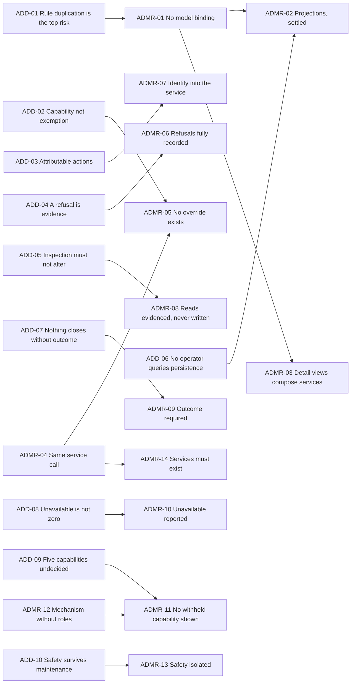
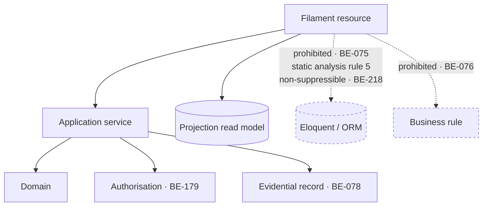
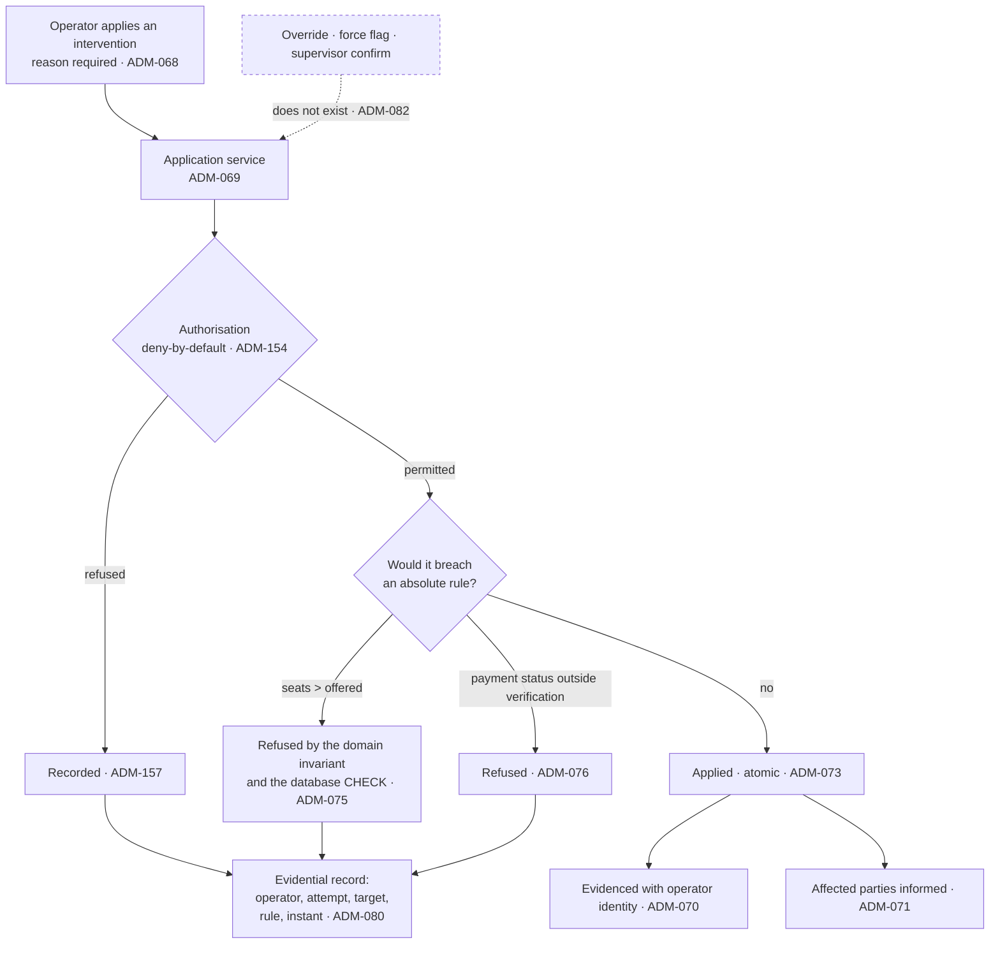

# CMP-DOC-17 — Admin / Filament Specification

**Carpool Mobility Platform (CMP)**

---

# 0. Document Control

## 0.1 Document Metadata

| Field | Value |
|---|---|
| Document ID | CMP-DOC-17 |
| Document Name | Admin / Filament Specification |
| Short Name | ADMIN |
| Project Name | Carpool Mobility Platform |
| Project Code | CMP |
| Version | 0.1 |
| Status | Draft |
| Date | 2026-08-17 |
| Author | Backend Lead / Product Analyst (AI-assisted) |
| Reviewer | [TBD] |
| Approver | Project Owner |
| Classification | Internal |
| Brand | TBD |
| Previous Version | None (initial issue) |
| Predecessor Documents | CMP-DOC-01 … CMP-DOC-16, **all Draft, none approved** (CMP-DOC-09 at v0.2, the remainder at v0.1) |
| Related Documents | `00_Project_Control/README.md`, `Documentation_Index.md`, `Documentation_Status.md`, `Document_Change_Log.md`, `Glossary.md`, `Master_Traceability_Matrix.md` |
| Successor Documents | CMP-DOC-18 (Testing & QA), CMP-DOC-19 (DevOps / Deployment) |

## 0.2 Revision History

| Version | Date | Author | Change | Status |
|---|---|---|---|---|
| 0.1 | 2026-08-17 | Backend Lead / Product Analyst (AI-assisted) | Initial issue. Specifies the administrative surface: 10 administrative drivers, **14 administrative decisions**, the binding constraint, resource structure, the projection inventory, inspection, intervention, payment reconciliation, safety response, support cases, operational reporting, roles and authorisation, evidencing, screens withheld, and verification obligations. Issues 204 statements (`ADM-001` … `ADM-204`). | Draft |

## 0.3 Distribution List

| Role | Purpose |
|---|---|
| Project Owner | Approval authority; **the role set (§13.4) and five withheld screens (§15) are theirs** |
| **Backend Lead** | Authoring and ownership |
| **Backend Developers** | **Primary consumer — §4 binds every screen** |
| Product Analyst | Co-author; screen coverage and the withheld set |
| Software Architect — Backend | Consistency with CMP-DOC-09 §7.2 |
| Security Analyst | `TB-2` realisation, role mechanism, evidencing (§13, §14) |
| Solution Architect / Payments | The reconciliation queue (§9) |
| QA Analyst | The 12 verification obligations in §16 |
| DevOps Engineer | Availability during maintenance (`ADM-118`) |

## 0.4 Approval

| Role | Name | Signature | Date |
|---|---|---|---|
| Author | Backend Lead / Product Analyst (AI-assisted) | — | 2026-08-17 |
| Reviewer | [TBD] | — | — |
| Approver | Project Owner | — | — |

> **This document is NOT approved.** It is issued at version 0.1 with status `Draft`
> for Project Owner review.

## 0.5 Purpose of This Document

CMP-DOC-06 identified administrative rule duplication as **the most likely integrity
failure in the entire system** — `SRS-RISK-003`, severity 9, the highest in the
requirements chain. CMP-DOC-09 responded with `BADR-15` and nine statements,
`BE-074`–`BE-082`, and placed them on this document as an obligation with the words
*"without exception."*

The reason is specific and it is about Filament. Filament's conventional usage is a
resource bound to an Eloquent model, generating a table and a form from that model's
columns. That usage is fast, it is what the framework is for, and **it puts business logic
in the administrative layer** — a validation rule here, a status transition there, a
computed total in a table column. Each is small. Together they are a second implementation
of the business, in the one place `SRS-REQ-126` says a rule must not be.

**This document exists to make that impossible rather than discouraged.** §4 is the
binding constraint, §16 is how it is enforced, and every screen in §7 to §12 is specified
within it.

It also carries **seven obligations from five predecessors** — more than any other document
in this chain — and settles the projection inventory that CMP-DOC-11 deferred here.

## 0.6 Boundaries — What This Document Does Not Specify

| Subject | Owning document |
|---|---|
| Application services, aggregates, transactions | CMP-DOC-09 |
| Client-facing endpoints | CMP-DOC-10 |
| Table structure and indexes | CMP-DOC-11 |
| Client screens | CMP-DOC-12 |
| **Security mechanisms** | **CMP-DOC-13** |
| Payment verification mechanics | CMP-DOC-14 |
| Position acquisition | CMP-DOC-15 |
| Message and notification mechanics | CMP-DOC-16 |
| Test cases | CMP-DOC-18 |
| **Hosting, access routes, operator device management** | **CMP-DOC-19** |

### 0.6.1 Visual Design Is Out of Scope

**FACT.** `Brand` is `TBD`, and Filament supplies its own presentation.

This document specifies **which resources exist, what each presents, what each may do, and
what each is forbidden**. It specifies no colour, no layout grid, no component styling and
no theme. Where a presentation rule matters for correctness — a measure shown as
unavailable rather than zero — it is stated as a rule, not as a design.

## 0.7 Inputs to This Document

| Input | Contribution |
|---|---|
| CMP-DOC-03 | 7 operator use cases Specified; **5 Outlined** |
| CMP-DOC-04 §7.3 | `FRD-FR-209`–`236` — 28 administration behaviours |
| CMP-DOC-06 §5.3 | `SRS-REQ-069`–`082` — the Administrative Application element |
| CMP-DOC-06 §3.4 | `TB-2` — the boundary called *partially defended* |
| CMP-DOC-09 §7.2 | **`BE-074`–`BE-082`, the binding constraint** |
| CMP-DOC-11 §18.7 | **The obligation to settle the projection inventory** |
| CMP-DOC-13 §20.5 | `TB-2` in full; the role mechanism with an undecided role set |
| CMP-DOC-14 §17.7 | **Three obligations** on the reconciliation queue |
| CMP-DOC-15 §16.7 | Evidence every operator access to position history |
| CMP-DOC-16 §15.7 | Evidence message access; present no moderation capability |

## 0.8 Qualifications on This Document

### 0.8.1 Source

Every statement derives from a predecessor statement, from a decision recorded in §3, or
is disclosed in §17.6 as originating here.

### 0.8.2 Qualification 1 — Sixteen Unapproved Predecessors

**FACT.** CMP-DOC-01 … CMP-DOC-16 are all `Draft`. None is approved.

Recorded as conflict `CC-018` and as `ADM-RISK-01`.

### 0.8.3 Qualification 2 — Five Operator Capabilities Are Undecided

**FACT.** Of twelve operator use cases, **seven are Specified and five are Outlined**:
verification adjudication (`UC-068`, `BAD-DEC-005`), account state change (`UC-069`,
`BAD-DEC-006`), content moderation (`UC-074`, `BAD-DEC-016`), wallet and reward adjustment
(`UC-077`, `BAD-DEC-013`) and data retention application (`UC-082`, `BAD-DEC-021`).

**No screen is specified for any of them.** §15 names each. Two are worth stating plainly
here: **an operator cannot adjudicate a verification submission and cannot change a user's
account state** — both are core administrative functions in a platform whose entire trust
model rests on verification standing.

### 0.8.4 Qualification 3 — The Role Set Does Not Exist

**FACT.** `SRS-REQ-075` restricts capability by administrative role and `SEC-063` records
that the role definitions and their capabilities are `[TBD – Business Decision Required]`.

This document specifies the **mechanism** — deny-by-default, evaluated in the application
layer, capability never exemption — and **names no role**. §13.4 states the consequence:
the surface cannot be deployed until at least one role exists.

## 0.9 Statement Classification Convention

As `README.md` §9.1. Markers: **FACT**, **ASSUMPTION**, **BUSINESS DECISION REQUIRED**,
**TECHNICAL DECISION REQUIRED**, **OPEN QUESTION**, **TBD**, **FUTURE CONSIDERATION**,
**RECOMMENDATION**.

## 0.10 Identifier Conventions

| Prefix | Element | Section |
|---|---|---|
| `ADM-nnn` | **Traceable administrative specification statement** | §4–§16 |
| `ADMR-nn` | Administrative Decision Record | §3 |
| `ADD-nn` | Administrative driver | §2 |
| `ADM-ASM-nn` | Assumption | §18.1 |
| `ADM-RISK-nn` | Risk | §18.2 |
| `ADM-OQ-nn` | Open Question | §18.3 |

## 0.11 Table of Contents

| § | Title |
|---|---|
| 0 | Document Control |
| 1 | Executive Summary |
| 2 | Administrative Drivers |
| 3 | Administrative Decisions |
| 4 | The Binding Constraint |
| 5 | Resource Structure |
| 6 | The Projection Inventory |
| 7 | Inspection |
| 8 | Intervention |
| 9 | Payment Reconciliation |
| 10 | Safety Response |
| 11 | Support Cases |
| 12 | Operational Reporting |
| 13 | Roles and Authorisation |
| 14 | Evidencing |
| 15 | Screens Withheld |
| 16 | Verification Obligations |
| 17 | Traceability |
| 18 | Assumptions, Risks and Open Questions |
| 19 | Acceptance Criteria for This Document |
| 20 | Statistics and Recommendations |
| A | Appendix A — Statement Index |
| B | Appendix B — Decision Index |
| C | Appendix C — Resource Index |

---

# 1. Executive Summary

## 1.1 What This Document Delivers

| Element | Count |
|---|---|
| Administrative drivers | 10 |
| **Administrative Decision Records** | **14** |
| Administrative specification statements | **204** (`ADM-001` … `ADM-204`) |
| Administration requirements realised | 28 of 28 |
| Administrative Application requirements realised | 14 of 14 |
| Resources specified | 14 |
| **Resources withheld** | **5** |
| Projections settled | 9 |
| Verification obligations | 12 |
| Obligations discharged from five predecessors | 7 of 7 |
| **Filament resources bound to an Eloquent model** | **0** |

## 1.2 The Administrative Surface in One Paragraph

Every Filament resource invokes an application service for every read and every write, and
none is bound to an Eloquent model. Reads come from projections — nine of them, settled
here — and never from aggregate repositories or the evidential log. An operator's identity
travels with every action into the application layer, and every action, refusal and
inspection is evidenced. Intervention is possible and exemption is not: an operator may
apply an intervention with a stated reason, and an intervention that would oversell a seat
or set a payment status outside verification is refused in whole and the attempt recorded.
Neither a safety incident nor a support case may be closed without a recorded outcome, and
neither closes by timeout. A measure whose behaviour is unimplemented is reported
unavailable, never zero. Five operator capabilities have no screen, because five decisions
have not been taken.

## 1.3 The Four Decisions That Shape Everything Else

| ADMR | Decision | Why it dominates |
|---|---|---|
| **`ADMR-01`** | **No Filament resource is bound to an Eloquent model.** Every resource is backed by an application service and a projection read model, and the ORM is unreachable from the administrative namespace. | This is `BADR-15` and `BE-075` made concrete. Filament's conventional usage — `Resource::model(Booking::class)` — is precisely what produces `SRS-RISK-003`. Forbidding the binding is the only version of the rule a framework cannot erode. |
| **`ADMR-04`** | An operator action is **the same application service call a client makes**, differing only in the caller's capability. | `SRS-REQ-069` and `BE-074`. If the admin path is a separate implementation, it is a second place a rule can be wrong, and it is the path used less and reviewed less. |
| **`ADMR-06`** | An intervention **states its reason as a required input**, and a refused intervention is recorded as fully as an applied one. | `FRD-FR-214` requires the reason; `FRD-FR-217` requires the refusal recorded. A refused intervention is the more interesting record: it is evidence that someone tried, and `TB-2` is the boundary where that matters. |
| **`ADMR-11`** | The administrative surface **presents no capability for a withheld decision** — not disabled, not hidden behind a role, not present in the navigation. | `UX-218` set the precedent client-side. A greyed-out "adjudicate verification" button is a promise the platform cannot keep and a support request nobody can answer. |

## 1.4 The Seven Obligations Discharged

| Obligation | Source | Discharged by |
|---|---|---|
| `BE-074`–`BE-082` without exception | CMP-DOC-09 §18.5 | §4 in full |
| Must not specify a screen that reads the ORM | CMP-DOC-09 §18.5 | `ADMR-01`; `ADM-005` |
| Settle the projection inventory | CMP-DOC-11 §18.7 | §6 — nine projections |
| `TB-2` in full; role mechanism with the role set open | CMP-DOC-13 §20.5 | §13 |
| Reconciliation queue with attempts, provider interactions and evidence | CMP-DOC-14 §17.7 | §9.1 |
| Refuse a determination lacking a recorded basis | CMP-DOC-14 §17.7 | `ADM-098` |
| No settlement view until `BAD-RULE-036` | CMP-DOC-14 §17.7 | `ADM-105`, §15 |
| Evidence operator access to position history | CMP-DOC-15 §16.7 | `ADM-178` |
| Evidence message access; present no moderation | CMP-DOC-16 §15.7 | `ADM-179`, `ADM-192` |

## 1.5 What This Document Could Not Settle

| Matter | Position |
|---|---|
| Five operator capabilities | §15 — verification adjudication, account state, moderation, wallet, retention |
| The role set | `SEC-063`, `ADM-OQ-01` — mechanism specified, no role named |
| A settlement view | `BAD-RULE-036` — no earnings or payout capability |
| Reporting measure targets | `BAD-DEC-018` — measures defined, thresholds unset |
| Reconciliation operating hours | `NFR-078` unset |
| Queue capacity and staffing | `PAY-146`, unmeasured |

---

# 2. Administrative Drivers

| ID | Driver | Source | Consequence |
|---|---|---|---|
| `ADD-01` | Administrative rule duplication is the most likely integrity failure in the system. | `SRS-RISK-003`, severity 9 | `ADMR-01`: no model binding, no ORM reachability. |
| `ADD-02` | An operator gains capability, never exemption. | `NFR-059`, `SEC-010` | `ADMR-05`: absolute rules refuse operators identically. |
| `ADD-03` | Every operator action must be attributable. | `SRS-REQ-073`, `BE-078` | `ADMR-07`: identity travels into the service, always. |
| `ADD-04` | A refused action is evidence. | `FRD-FR-217`, `SRS-REQ-074` | `ADMR-06`: refusals recorded as fully as applications. |
| `ADD-05` | Inspection must not alter. | `FRD-FR-211`, `SRS-REQ-076` | `ADMR-08`: reads are reads, and are themselves evidenced. |
| `ADD-06` | An operator must not query persistence to do their job. | `SRS-REQ-077`, `BE-077` | `ADMR-02`: projections, settled here. |
| `ADD-07` | Nothing closes without an outcome. | `SRS-REQ-081`, `FRD-FR-227` | `ADMR-09`: outcome is a required input, no timeout closure. |
| `ADD-08` | An unimplemented measure is unavailable, not zero. | `FRD-FR-236`, `SRS-REQ-079` | `ADMR-10`: unavailable is a first-class reported value. |
| `ADD-09` | Five operator capabilities are undecided. | §0.8.3 | `ADMR-11`: no capability for a withheld decision. |
| `ADD-10` | The safety queue must work when other capability does not. | `SRS-REQ-082`, `BE-193` | `ADMR-13`: safety handling isolated from the rest. |

---

# 3. Administrative Decisions

Each decision records its context, the alternatives considered, and its consequences
**including the negative ones**, marked ✘.

## 3.1 `ADMR-01` — No Resource Is Bound to an Eloquent Model

| | |
|---|---|
| **Context** | `BADR-15`, `BE-074` and `BE-075` require every administrative read and write to invoke an application service and forbid direct ORM access. `SRS-RISK-003` rates admin rule duplication severity 9 — the highest integrity risk in the requirements chain. Filament's conventional usage binds a resource to an Eloquent model and generates a table and a form from its columns. That usage is what the framework is for, and it is exactly the pattern that produces the risk. |
| **Decision** | **No Filament resource declares an Eloquent model. Every resource is backed by an application service for writes and a projection read model for reads. The ORM is unreachable from the administrative namespace, enforced by static analysis (`BE-082`), and the rule is non-suppressible (`BE-218`).** |
| **Alternatives** | *(a)* Bind the model but forbid business logic by convention — rejected: the binding *is* the mechanism by which logic arrives, because the generated form validates against model rules and the generated table computes from model accessors. *(b)* Bind a read-only model for tables and use services for writes — rejected: it re-opens the read path `BE-077` closes, and a read-only model still carries accessors. |
| **Consequences** | ✔ `SRS-RISK-003`'s mechanism is removed rather than discouraged. ✔ Admin and client behaviour cannot diverge, because they are the same code. ✘ **Filament's productivity advantage is substantially forfeited** — tables, forms and filters are hand-built against services rather than generated. This is the largest cost in this document and it is accepted deliberately. ✘ Every resource needs a projection before it can list anything (§6). |

## 3.2 `ADMR-02` — Reads Come From Projections, Settled Here

| | |
|---|---|
| **Context** | `BE-077` requires administrative reads served from read models, never from aggregate repositories or the evidential log. `SRS-REQ-077` requires evidence presented without an operator querying persistence. `DB-139` left the projection inventory `[TBD – Technical Decision Required]` pending this document, and CMP-DOC-11 §18.7 made settling it an obligation. |
| **Decision** | **Nine projections are specified in §6, one per administrative listing or search need. Every administrative list, search and count reads a projection. No administrative read touches an aggregate repository, and none touches the evidential log except the two audit views in §14.3, which read it deliberately and read-only.** |
| **Alternatives** | *(a)* Read aggregates for detail views — rejected: `BE-077`, and an aggregate load is a write-path shape used for a read. *(b)* Leave the inventory to implementation — rejected: CMP-DOC-11 made it an obligation, and an unsettled inventory means each screen invents its own. |
| **Consequences** | ✔ `DB-139` is closed and CMP-DOC-11's obligation discharged. ✔ Administrative load does not contend with the write path. ✘ Nine projections to build, maintain and rebuild. ✘ Projection staleness is visible to operators, and `ADM-046` requires it disclosed rather than hidden. |

## 3.3 `ADMR-03` — Detail Views Compose Services, Not Joins

| | |
|---|---|
| **Context** | `FRD-FR-210` presents, for a located record, its parties, seats, status, state history, payment, messages and related safety incidents. That is seven things from six aggregates. The natural implementation is a query with joins; `ADMR-01` forbids it. |
| **Decision** | **A detail view is served by one application service operation that composes what the view needs. It is a purpose-built service, not a generic query and not several calls stitched in the resource.** |
| **Alternatives** | *(a)* Several service calls composed in the Filament resource — rejected: composition without a transaction boundary is where inconsistent views come from, and `AADR-01` set the same rule for the API. *(b)* A reporting projection joining everything — rejected: it would need maintaining on every write to six aggregates. |
| **Consequences** | ✔ One authorisation evaluation per view, one consistent read. ✔ The composition is testable. ✘ A purpose-built service per detail view. ✘ Adding a field to a view is a service change, not a template change. |

## 3.4 `ADMR-04` — An Operator Action Is the Same Service Call

| | |
|---|---|
| **Context** | `SRS-REQ-069` requires the administrative application to reach business state only by invoking the same business logic that serves every other caller. `BE-074` requires application services for every read and write. `ARCH-132` and `API-042` require identical validation. |
| **Decision** | **An operator action invokes the same application service operation a client invokes, differing only in the caller's capability and in the additional intervention operations §8 specifies. There is no administrative variant of a client operation.** |
| **Alternatives** | *(a)* Administrative variants with relaxed validation — rejected: the relaxation is the rule duplication `SRS-REQ-070` forbids. *(b)* A separate administrative domain — rejected: two implementations, and the one used less rots. |
| **Consequences** | ✔ A rule change reaches both callers at once. ✔ `TB-2` is defended by the same code that defends `TB-1`. ✘ Operator workflows must fit the service shape, and where they do not, a new service is required rather than a shortcut. ✘ Bulk operations need explicit bulk services (`ADM-030`). |

## 3.5 `ADMR-05` — Capability, Never Exemption

| | |
|---|---|
| **Context** | `NFR-059` requires that no operator action bypass an absolute business rule. `SRS-REQ-071` forbids enabling an operator to breach one. `FRD-FR-215` and `FRD-FR-216` name two specific refusals. `SEC-010` restates it. `TB-2` is the boundary CMP-DOC-06 called *partially defended*, precisely because the risk there is exemption rather than intrusion. |
| **Decision** | **An administrative role grants additional operations and never relaxes a rule. Every absolute rule refuses an operator exactly as it refuses a user. There is no override, no force flag, no supervisor confirmation that proceeds anyway, and no support-only endpoint.** |
| **Alternatives** | *(a)* A supervisor override with dual authorisation — rejected: `NFR-059` has no exception, and a dual-authorised oversell is still an oversell. *(b)* Override permitted with mandatory justification — rejected: the justification records that the rule was broken; it does not stop it. |
| **Consequences** | ✔ `NFR-059` is structural. ✔ `TB-2` becomes as well defended as `TB-1`. ✘ **A genuine operational emergency has no override**, and the answer is a code change or a policy configuration change under `BADR-12`. `ADM-084` states this rather than leaving it discovered. ✘ Operators will ask for one. |

## 3.6 `ADMR-06` — A Refusal Is Recorded as Fully as an Application

| | |
|---|---|
| **Context** | `FRD-FR-217` requires every refused operator intervention recorded as an auditable event. `SRS-REQ-074` requires an attempted action that was refused to be recorded. `ARCH-135` records refused authorisations. `NFR-060` requires every refused authorisation recorded. |
| **Decision** | **A refused intervention is recorded with the operator, the intervention attempted, the record it targeted, the rule that refused it and the instant — the same detail an applied intervention carries. A refusal record is not a log line; it is an evidential record.** |
| **Alternatives** | *(a)* Record refusals in operational logs — rejected: `SADR-15` puts conduct records in the evidential log, and a refused intervention is conduct. *(b)* Record a count — rejected: `FRD-FR-217` requires the event, and the interesting question is always *which* rule refused *whom*. |
| **Consequences** | ✔ An operator repeatedly attempting a forbidden action is visible. ✔ `TB-2` produces evidence, not only refusals. ✘ Evidential volume rises. ✘ Operators are recorded when they get something wrong, which needs stating to them plainly; `ADM-165` requires it. |

## 3.7 `ADMR-07` — Operator Identity Travels Into the Service

| | |
|---|---|
| **Context** | `SRS-REQ-073` requires every action attributed to the identified operator who performed it. `BE-078` requires the acting operator's identity carried into the application service. `ARCH-046` restates it. `BE-140` threads identity into jobs. |
| **Decision** | **Operator identity is a parameter of every administrative service call, not an ambient session read inside the service. Where an action enqueues work, the identity is carried into the job. A service invoked without an identity is refused.** |
| **Alternatives** | *(a)* Read the identity from the session inside the service — rejected: the same service serves clients and workers, and an ambient read makes attribution depend on the caller's context. *(b)* Attribute at the resource layer — rejected: the record would be written by the layer that must not write records. |
| **Consequences** | ✔ Attribution is impossible to omit; the call does not compile without it. ✔ Deferred work stays attributed. ✘ Every administrative service signature carries an identity parameter. ✘ System-initiated actions need an explicit system identity; `ADM-176` specifies one. |

## 3.8 `ADMR-08` — Inspection Is a Read, and Reads Are Evidenced

| | |
|---|---|
| **Context** | `FRD-FR-211` is integrity-critical: no record shall be altered as a consequence of inspecting it. `SRS-REQ-076` restates it. `FRD-FR-212` requires an operator's inspection recorded as an auditable event. CMP-DOC-15 and CMP-DOC-16 add that position and message access specifically must be evidenced. |
| **Decision** | **An inspection performs no write to business state — no last-viewed stamp, no view counter, no lock, no read receipt. It does write one evidential record: that this operator inspected this record at this time. Position history and message content access are evidenced individually.** |
| **Alternatives** | *(a)* Do not evidence reads, to reduce volume — rejected: `FRD-FR-212`, and unrecorded access to a user's messages and positions is exactly what an operator-misuse investigation needs. *(b)* Stamp last-viewed on the record — rejected: `FRD-FR-211`; that is altering as a consequence of inspecting. |
| **Consequences** | ✔ `FRD-FR-211` and `FRD-FR-212` are both satisfied, and they pull in opposite directions. ✔ Operator access to sensitive data is reviewable. ✘ Evidential volume from reads exceeds that from writes. ✘ Bulk listing must not evidence per row; `ADM-174` bounds it to the record actually opened. |

## 3.9 `ADMR-09` — Nothing Closes Without an Outcome

| | |
|---|---|
| **Context** | `FRD-FR-227` and `SRS-REQ-081` forbid closing a safety incident without a recorded outcome. `FRD-FR-228` forbids closing one by timeout. `FRD-FR-233` requires the same of a support case and permits closure as unresolved. `BE-029` and `BE-030` make both domain invariants. |
| **Decision** | **Outcome is a required input to closure for both safety incidents and support cases. Neither closes by timeout, by inactivity, by bulk action or by cascade. *Unresolved* is a valid recorded outcome and is not the same as no outcome.** |
| **Alternatives** | *(a)* Auto-close stale cases with a default outcome — rejected: `FRD-FR-228`, and a default outcome is a fabricated one. *(b)* Permit closure and require the outcome later — rejected: it will not be supplied. |
| **Consequences** | ✔ Every closed case has a human's account of what happened. ✔ `FRD-FR-227`, `FRD-FR-228` and `FRD-FR-233` satisfied by construction. ✘ Queues grow with cases nobody has resolved, and no timeout will clear them. ✘ **This needs staffing**, and `NFR-078`'s operating hours are unset. |

## 3.10 `ADMR-10` — Unavailable Is a Reported Value

| | |
|---|---|
| **Context** | `FRD-FR-236` is integrity-critical: a measure shall be reported as unavailable, rather than as zero, where the behaviour it measures is not implemented. `SRS-REQ-079` restates it. `BE-081` states it at the service. With five operator capabilities and several product areas unbuilt, this affects many measures. |
| **Decision** | **A measure whose behaviour is unimplemented reports *unavailable*, distinguishable at a glance from zero, and states why it is unavailable. A measure that is implemented and genuinely zero reports zero. The two are never rendered alike.** |
| **Alternatives** | *(a)* Omit unimplemented measures — rejected: their absence is itself information, and a report that silently omits is worse than one that says so. *(b)* Show zero with a footnote — rejected: `FRD-FR-236`, and nobody reads the footnote before acting on the number. |
| **Consequences** | ✔ No report ever implies a behaviour exists. ✔ `FRD-FR-236` satisfied. ✘ Early reports will be substantially *unavailable*, which is an uncomfortable but accurate picture. ✘ Each measure needs its implementation state known; `ADM-146` makes it a property of the measure. |

## 3.11 `ADMR-11` — No Capability for a Withheld Decision

| | |
|---|---|
| **Context** | Five operator use cases are Outlined (§0.8.3). `UX-218` set the client-side precedent: no navigation entry, empty state or placeholder shall reference a withheld screen. `FRD-FR-195` forbids presenting a control the platform cannot honour. `NADR-07` applied the same reasoning to notification preferences. |
| **Decision** | **The administrative surface presents no resource, action, navigation entry or menu item for a withheld capability. Not disabled, not hidden behind a role, not present with a "coming soon". §15 names all five.** |
| **Alternatives** | *(a)* Present disabled with an explanation — rejected: it is an offer, it generates support requests, and `NADR-07` rejected the same pattern for the same reason. *(b)* Restrict by role so no role has it — rejected: the capability then exists and one grant away. |
| **Consequences** | ✔ Nothing in the surface promises what the platform cannot do. ✔ Adding the capability later is additive. ✘ **Operators will find the surface incomplete in ways they cannot see the reason for**, and §15 exists to be shown to them. ✘ Five real administrative needs go unserved. |

## 3.12 `ADMR-12` — The Role Mechanism Without the Roles

| | |
|---|---|
| **Context** | `SRS-REQ-075` restricts capability by administrative role. `ARCH-045` and `BE-080` evaluate it in the application layer. `SEC-061`–`SEC-063` specify the mechanism and record that the role set is `[TBD – Business Decision Required]`. `FRD-FR-213` refuses access where the role does not permit and records the refusal. |
| **Decision** | **This document specifies deny-by-default role evaluation in the application layer, the capability set each resource requires, and the refusal behaviour. It **names no role**. §13.3 lists the capabilities a role could be composed from, so that defining roles is a selection rather than an analysis.** |
| **Alternatives** | *(a)* Propose a provisional role set — rejected: who may refund, who may close a safety incident and who may see a message are organisational decisions, not architectural ones. *(b)* One superuser role — rejected: `SRS-REQ-075`, and it makes every capability available to everyone. |
| **Consequences** | ✔ The mechanism is buildable now and roles become configuration. ✔ Defining roles is a selection from §13.3's list. ✘ **The surface cannot be deployed until at least one role exists** — `ADM-168`. ✘ `ADM-OQ-01` is the only open question that blocks deployment rather than a feature. |

## 3.13 `ADMR-13` — Safety Handling Is Isolated From Everything Else

| | |
|---|---|
| **Context** | `SRS-REQ-082` requires the administrative application to remain available for safety incident handling during planned maintenance of non-safety capability. `BADR-16` makes the safety surface separately bootable; `BE-193` forbids it depending on payment, search, matching, rating or projection components. `NFR-025` requires an active trip to survive planned maintenance. |
| **Decision** | **The safety incident queue and its handling depend only on the safety services and the safety projection. They do not depend on payment, reporting, support-case or reconciliation capability, and they remain available when those are under maintenance.** |
| **Alternatives** | *(a)* One administrative application, all-or-nothing availability — rejected: `SRS-REQ-082`. *(b)* A separate safety console — rejected: it duplicates authorisation and evidencing; isolation of dependency achieves the requirement without a second surface. |
| **Consequences** | ✔ `SRS-REQ-082` satisfied without a second application. ✔ Maintenance windows do not suspend safety response. ✘ The safety views cannot enrich from payment or reporting data, so a responder sees less. ✘ Deployment must permit partial maintenance; obligation placed on CMP-DOC-19. |

## 3.14 `ADMR-14` — The Surface Is Specified Against Services That Must Exist

| | |
|---|---|
| **Context** | `ADMR-01` and `ADMR-04` mean every screen depends on an application service existing. Several services this document requires are not named in CMP-DOC-09 because that document specified structure rather than an inventory. |
| **Decision** | **Each resource in §7 to §12 names the application service operations it requires. Where an operation does not yet exist in CMP-DOC-09's structure, this document states that it must be added, rather than assuming the resource can reach around it.** |
| **Alternatives** | *(a)* Let resources call whatever exists and query for the rest — rejected: that *is* `SRS-RISK-003`. *(b)* Assume services exist — rejected: the assumption would be discovered during build, at the moment the shortcut is most tempting. |
| **Consequences** | ✔ The service inventory the admin surface needs is explicit and reviewable. ✔ A missing service is a known gap rather than an improvisation. ✘ CMP-DOC-09 acquires an obligation (§17.7) to carry these operations. ✘ Admin work cannot start before the services do. |

## 3.15 Driver to Decision Map

---

# 4. The Binding Constraint

This section discharges CMP-DOC-09 §18.5 — `BE-074`–`BE-082` *without exception*.

| ID | Statement | Src |
|---|---|---|
| `ADM-001` ‡ | Every administrative read and write shall invoke an application service. | `BE-074`, `SRS-REQ-069` |
| `ADM-002` ‡ | **No Filament resource shall declare an Eloquent model.** | `ADMR-01`, `BE-075` |
| `ADM-003` ‡ | No resource shall generate a table, a form or a filter from a model's columns. | `ADMR-01`, `BE-076` |
| `ADM-004` ‡ | No resource shall use a model accessor, mutator, scope, observer or validation rule. | `ADMR-01`, `BE-076` |
| `ADM-005` ‡ | The ORM shall be unreachable from the administrative namespace. | `BE-075`, **CMP-DOC-09 §18.5** |
| `ADM-006` ‡ | Prohibition of ORM access from the administrative namespace shall be enforced by static analysis, and the rule shall be non-suppressible. | `BE-082`, `BE-218` |
| `ADM-007` ‡ | No resource shall implement a business rule. | `BE-076`, `SRS-REQ-070` |
| `ADM-008` ‡ | No resource shall implement a validation that substitutes for a domain rule. | `BE-076`, `ARCH-044` |
| `ADM-009` ‡ | No resource shall compute a fare, an availability, an eligibility, a total or a balance. | `BE-076`, `BE-011` |
| `ADM-010` ‡ | Administrative reads shall be served from projections, never from aggregate repositories. | `BE-077`, `ADMR-02` |
| `ADM-011` ‡ | Administrative reads shall not be served from the evidential log, except the two audit views in §14.3. | `BE-077`, `ADR-22` |
| `ADM-012` ‡ | Every administrative action shall carry the acting operator's identity into the application service. | `BE-078`, `SRS-REQ-073` |
| `ADM-013` ‡ | An administrative action that would breach an absolute rule shall be refused in whole and the attempt recorded. | `BE-079`, `FRD-FR-217` |
| `ADM-014` ‡ | Administrative capability shall be restricted by administrative role, evaluated in the application layer. | `BE-080`, `SRS-REQ-075` |
| `ADM-015` ‡ | A measure whose behaviour is unimplemented shall be presented as unavailable. | `BE-081`, `FRD-FR-236` |
| `ADM-016` ‡ | These sixteen statements bind every screen in §7 to §12; a screen that cannot be built within them shall be raised as a change, never worked around. | **CMP-DOC-09 §18.5**, §29 |

> **`ADM-002` is the statement this whole document exists to make.** Every other constraint
> here can be re-derived from it: a resource with no model has no generated form to carry a
> validation rule, no accessor to compute a total, and no query builder to reach the
> database. `SRS-RISK-003` is rated severity 9 because the alternative is so easy.

---

# 5. Resource Structure

| ID | Statement | Src |
|---|---|---|
| `ADM-017` | Each resource shall be backed by an application service for writes and a projection read model for reads. | `ADMR-01`, `ADM-010` |
| `ADM-018` | Each resource shall name the application service operations it requires. | `ADMR-14` |
| `ADM-019` | Where a required operation does not exist, this document shall state that it must be added rather than assume a workaround. | `ADMR-14`, §17.7 |
| `ADM-020` | A list view shall read one projection and shall not join across projections. | `ADMR-02`, `DB-135` |
| `ADM-021` | A detail view shall be served by one composing application service operation. | `ADMR-03`, `FRD-FR-210` |
| `ADM-022` | A detail view shall not be assembled from several service calls in the resource. | `ADMR-03`, `AADR-01` |
| `ADM-023` | Filtering and sorting shall be limited to the parameters the backing projection supports. | `DB-193`, `SEC-121` |
| `ADM-024` ‡ | Sort and filter parameters shall be selected from a fixed allow-list, never constructed from input. | `SEC-121`, `SEC-119` |
| `ADM-025` | Listings shall be paged by cursor. | `API-112`, `DADR-04` |
| `ADM-026` | A count shall be presented only where the projection can produce it without an unbounded scan. | `API-118`, `DB-138` |
| `ADM-027` | Where a count is unavailable it shall be reported unavailable, never zero. | `API-119`, `ADM-015` |
| `ADM-028` ‡ | A resource shall present only the fields the operator's role entitles them to. | `SEC-065`, `ADM-014` |
| `ADM-029` ‡ | A resource shall receive validation identical to a client request. | `ARCH-132`, `API-042` |
| `ADM-030` | A bulk operation shall invoke an explicit bulk application service, not iterate a single-record service in the resource. | `ADMR-04`, `BE-041` |
| `ADM-031` ‡ | A bulk operation shall be atomic per record and shall record each outcome individually. | `BE-053`, `ADM-030` |
| `ADM-032` | Export shall be an application service operation, subject to the same authorisation and evidencing as a read. | `ADM-001`, `ADMR-08` |

---

# 6. The Projection Inventory

This section discharges CMP-DOC-11 §18.7 and closes `DB-139`.

## 6.1 The Nine Projections

| # | Projection | Serves | Maintained from |
|---|---|---|---|
| 1 | `proj_admin_rides` | Ride, ride-request listing and search | Ride, RideRequest events |
| 2 | `proj_admin_bookings` | Booking listing and search | Booking, Payment events |
| 3 | `proj_admin_trips` | Trip listing and search | Trip events |
| 4 | `proj_admin_users` | User listing and search | User, Vehicle events |
| 5 | `proj_admin_payments` | Payment listing and search | Payment events |
| 6 | `proj_reconciliation_queue` | The pending-payment queue | Payment events |
| 7 | `proj_safety_queue` | The safety incident queue | SafetyIncident events |
| 8 | `proj_support_cases` | Support case listing | OperatorCase events |
| 9 | `proj_operational_measures` | Reporting measures | All domain events |

| ID | Statement | Src |
|---|---|---|
| `ADM-033` | The nine projections above shall exist, and no administrative listing shall be added without a projection to serve it. | **CMP-DOC-11 §18.7**, `DB-139` |
| `ADM-034` ‡ | Each shall be maintained by a listener responding to domain events. | `BE-119`, `DB-129` |
| `ADM-035` ‡ | Each shall be rebuildable in full from authoritative state by truncate and replay. | `BE-120`, `DB-132` |
| `ADM-036` ‡ | No projection shall be an input to a business decision. | `BE-121`, `DB-130` |
| `ADM-037` ‡ | Seat availability shall never be read from a projection, including by an operator. | `ARCH-056`, `DB-131` |
| `ADM-038` ‡ | Payment status presented in a listing shall carry its provenance and shall not be acted on without a current read. | `API-044`, `PAY-089` |
| `ADM-039` | Each projection row shall carry its maintenance instant. | `BE-124`, `DB-133` |
| `ADM-040` | No table outside `proj_` shall reference a projection by foreign key. | `DB-012`, `DADR-10` |
| `ADM-041` | Loss of a projection shall degrade administrative performance and never correctness. | `ARCH-114`, `DB-134` |
| `ADM-042` | A rebuild shall be executable without interrupting write traffic. | `BE-126`, `DB-136` |
| `ADM-043` | Whether each is maintained synchronously or by job shall be recorded per projection. | `BE-130`, `DB-140` |
| `ADM-044` | `proj_safety_queue` shall be maintained by the `safety` job family so that it is never delayed by other work. | `BE-132`, `ADMR-13` |
| `ADM-045` | `proj_operational_measures` shall be rebuildable independently of the other eight. | `ADM-035`, `ADM-041` |

## 6.2 Staleness in the Administrative Surface

| ID | Statement | Src |
|---|---|---|
| `ADM-046` ‡ | A listing shall present its projection's maintenance instant, so that an operator knows how current the list is. | `BE-125`, `UX-042` |
| `ADM-047` ‡ | Where a projection's maintenance instant exceeds its bound, the listing shall present itself as stale rather than current. | `ARCH-055`, `UX-044` |
| `ADM-048` ‡ | An operator shall not act on a listing value where the action requires a current value; the detail view's service read is what the action uses. | `ADM-038`, `BE-121` |
| `ADM-049` | Projection staleness bounds shall be configuration; **their values are unset**. | `ARCH-055`, §20.3 |
| `ADM-050` | Projection maintenance failure shall be visible as a distinct operational condition. | `BE-127` |

---

# 7. Inspection

Realises `UC-070` and `UC-072` (inspection half), `FRD-FR-209`–`213`.

## 7.1 Locating

| ID | Statement | Src |
|---|---|---|
| `ADM-051` | An operator shall be able to locate a ride, ride request, booking or trip. | `FRD-FR-209` |
| `ADM-052` | An operator shall be able to locate a payment, refund or settlement record — **refund and settlement records do not exist** and are covered by §15. | `FRD-FR-220`, §15 |
| `ADM-053` | Location shall be by opaque external identifier or by a projection-supported attribute. | `DB-022`, `ADM-023` |
| `ADM-054` ‡ | Location shall not permit enumeration of records the operator's role does not permit. | `SEC-187`, `ADM-028` |
| `ADM-055` ‡ | A located record the operator may not access shall be refused identically to one that does not exist. | `API-094`, `SEC-069` |

## 7.2 Presenting

| ID | Statement | Src |
|---|---|---|
| `ADM-056` | A located record shall present its parties, seats, status, state history, payment, messages and related safety incidents. | `FRD-FR-210` |
| `ADM-057` | The composition shall be one application service operation. | `ADMR-03`, `ADM-021` |
| `ADM-058` | Evidence relevant to a case shall be presented without requiring an operator to query persistence. | `SRS-REQ-077` |
| `ADM-059` ‡ | Every presented business value shall carry its provenance. | `UX-033`, `API-043` |
| `ADM-060` ‡ | The presentation shall include only what the operator's role entitles them to. | `SEC-065`, `ADM-028` |
| `ADM-061` ‡ | Message content shall be presented only where the role entitles it, and the access evidenced individually. | **CMP-DOC-16 §15.7**, `NOTIF-158` |
| `ADM-062` ‡ | Position history shall be presented only where the role entitles it, and the access evidenced individually. | **CMP-DOC-15 §16.7**, `GPS-115` |

## 7.3 Inspection Does Not Alter

| ID | Statement | Src |
|---|---|---|
| `ADM-063` ‡ | Inspecting a record shall not alter it. | `FRD-FR-211`, `SRS-REQ-076` |
| `ADM-064` ‡ | No last-viewed stamp, view counter, lock or read receipt shall be written by an inspection. | `ADMR-08`, `FRD-FR-211` |
| `ADM-065` ‡ | An operator's inspection shall be recorded as an auditable event. | `FRD-FR-212`, `ADMR-08` |
| `ADM-066` ‡ | Refused access shall be recorded. | `FRD-FR-213`, `NFR-060` |

---

# 8. Intervention

Realises `UC-071`, `FRD-FR-214`–`219`. **This is where `TB-2` is defended or lost.**

## 8.1 Applying

| ID | Statement | Src |
|---|---|---|
| `ADM-067` | An operator shall be able to apply an intervention to a booking or trip, stating the intervention and its reason. | `FRD-FR-214` |
| `ADM-068` ‡ | The reason shall be a required input; an intervention without one shall be refused. | `ADMR-06`, `FRD-FR-214` |
| `ADM-069` ‡ | An intervention shall invoke an application service, never a direct write. | `ADM-001`, `BE-074` |
| `ADM-070` ‡ | An applied intervention shall be recorded with the identity of the operator who applied it. | `FRD-FR-218`, `SRS-REQ-073` |
| `ADM-071` | The parties affected by an applied intervention shall be informed. | `FRD-FR-219` |
| `ADM-072` | The notification informing them shall carry no business value. | `NOTIF-133`, `NADR-05` |
| `ADM-073` ‡ | An intervention shall be atomic; a partially applied intervention shall not exist. | `BE-053`, `ADM-031` |

## 8.2 Refusing

| ID | Statement | Src |
|---|---|---|
| `ADM-074` ‡ | An intervention that would allow confirmed seats to exceed seats offered shall be refused. | `FRD-FR-215`, `BAD-RULE-027` |
| `ADM-075` ‡ | The refusal shall come from the same constraint that refuses a client — the domain invariant and the database `CHECK` — not from an administrative check. | `DB-083`, `ADMR-04` |
| `ADM-076` ‡ | An intervention that would set payment status other than through verification or recorded reconciliation shall be refused. | `FRD-FR-216`, `SRS-REQ-072` |
| `ADM-077` ‡ | An intervention that would confirm a booking without a verified payment shall be refused. | `NFR-027`, `PAY-138` |
| `ADM-078` ‡ | An intervention that would alter or delete an evidential or ledger record shall be refused by the absence of the privilege. | `DB-118`, `DB-094` |
| `ADM-079` ‡ | Every refused intervention shall be recorded as an auditable event. | `FRD-FR-217`, `ADMR-06` |
| `ADM-080` ‡ | The refusal record shall carry the operator, the intervention attempted, the target record, the rule that refused it and the instant. | `ADMR-06`, `SRS-REQ-074` |
| `ADM-081` ‡ | A refusal record shall be an evidential record, not an operational log line. | `SADR-15`, `SEC-203` |

## 8.3 No Override Exists

| ID | Statement | Src |
|---|---|---|
| `ADM-082` ‡ | No override, force flag, supervisor confirmation or support-only endpoint shall exist by which an absolute rule may be bypassed. | `ADMR-05`, `NFR-059` |
| `ADM-083` ‡ | No administrative role shall be exempt from an absolute rule. | `SEC-062`, `SRS-REQ-071` |
| `ADM-084` | **A genuine operational emergency has no override.** The available responses are a policy configuration change under `BADR-12`, or a code change under change control. This is stated so that it is known before it is needed. | `ADMR-05`, `BADR-12` |
| `ADM-085` ‡ | A policy configuration change shall not relax an absolute rule. | `BE-172`, `ARCH-147` |
| `ADM-086` | A policy configuration change made by an operator shall be evidenced with actor, previous value and new value. | `BE-173`, `ARCH-115` |
| `ADM-087` | Which operators may change policy configuration is a role capability, listed in §13.3. | `ADM-014`, §13.3 |
| `ADM-088` ‡ | Repeated refused interventions by one operator shall be visible as a pattern, because each is an evidential record. | `ADMR-06`, `SEC-193` |

---

# 9. Payment Reconciliation

Realises `UC-072`, `FRD-FR-220`–`223`, and discharges CMP-DOC-14 §17.7's three obligations.

## 9.1 The Queue

| ID | Statement | Src |
|---|---|---|
| `ADM-089` | Pending payments shall be presented as a managed queue. | `FRD-FR-138`, `PAY-131` |
| `ADM-090` ‡ | The queue shall present, for each payment, its attempts, its provider interactions and its evidential record. | **CMP-DOC-14 §17.7**, `PAY-132` |
| `ADM-091` ‡ | Provider interaction records shall be presented in structured redacted form, never as a raw body. | `PAY-141`, `SEC-144` |
| `ADM-092` ‡ | No payment instrument credential shall appear anywhere in the queue or its detail views. | `SEC-133`, `DB-037` |
| `ADM-093` | The queue shall read `proj_reconciliation_queue`. | `ADM-033`, `PAY-133` |
| `ADM-094` | Queue depth and oldest-item age shall be presented as operational measures. | `SRS-REQ-078`, `PAY-145` |
| `ADM-095` | A located payment shall present its amount, method, verification history, current status and ledger entries. | `FRD-FR-221` |
| `ADM-096` ‡ | Amounts shall be presented in exact decimal, as stored. | `DB-031`, `PAY-007` |

## 9.2 Determination

| ID | Statement | Src |
|---|---|---|
| `ADM-097` | An operator may record a determination against a pending payment. | `FRD-FR-139`, `PAY-134` |
| `ADM-098` ‡ | **A determination lacking a recorded basis shall be refused.** | **CMP-DOC-14 §17.7**, `PAY-135` |
| `ADM-099` ‡ | A determination shall apply to payment status and to the ledger in one transaction. | `FRD-FR-139`, `PAY-136` |
| `ADM-100` ‡ | A determination shall be evidenced with the acting operator's identity. | `PAY-137`, `ADM-012` |
| `ADM-101` ‡ | A determination that would confirm a booking without a verified payment shall be refused. | `PAY-138`, `ADM-077` |
| `ADM-102` ‡ | Where the outcome still cannot be established, the payment shall be retained with the investigation recorded. | `FRD-FR-140`, `PAY-139` |
| `ADM-103` ‡ | A payment shall never be resolved by the queue ageing; `pending` has no timeout. | `PADR-06`, `PAY-079` |
| `ADM-104` ‡ | A ledger that does not reconcile shall surface a discrepancy rather than present a computed balance that conceals it. | `FRD-FR-222`, `PAY-142` |

## 9.3 No Settlement View

| ID | Statement | Src |
|---|---|---|
| `ADM-105` ‡ | **No settlement, earnings, payout or withdrawal view shall be presented**, because `BAD-RULE-036` is undecided and no such behaviour exists. | **CMP-DOC-14 §17.7**, `PAY-195` |
| `ADM-106` | `FRD-FR-220` names settlement records; **none exist**, and §15 records the consequence. | `FRD-FR-220`, `PAY-196` |

---

# 10. Safety Response

Realises `UC-073`, `FRD-FR-224`–`229`.

| ID | Statement | Src |
|---|---|---|
| `ADM-107` | Safety incidents shall be presented to a safety responder as a queue. | `FRD-FR-224` |
| `ADM-108` | The queue shall read `proj_safety_queue`. | `ADM-033`, `ADM-044` |
| `ADM-109` | Queue depth and oldest-item age shall be presented as operational measures. | `SRS-REQ-078`, `NFR-121` |
| `ADM-110` ‡ | An incident shall be presented with its full captured context and the related trip, parties and records. | `FRD-FR-225`, `SRS-REQ-080` |
| `ADM-111` ‡ | Context that was unavailable at capture shall be presented as unavailable, distinguishable from absent in fact. | `FRD-FR-187`, `GPS-111` |
| `ADM-112` | A safety responder may record an assessment, each action taken, and an outcome against an incident. | `FRD-FR-226` |
| `ADM-113` ‡ | An incident shall not be closed without a recorded outcome. | `FRD-FR-227`, `BE-029` |
| `ADM-114` ‡ | An incident shall not be closed by timeout, inactivity, bulk action or cascade. | `FRD-FR-228`, `ADMR-09` |
| `ADM-115` ‡ | A closed incident shall be retained for post-incident review. | `FRD-FR-229` |
| `ADM-116` ‡ | Every safety action and its outcome shall be evidenced. | `BE-113`, `DB-114` |
| `ADM-117` ‡ | The safety queue and its handling shall depend only on the safety services and `proj_safety_queue`. | `ADMR-13`, `BE-193` |
| `ADM-118` ‡ | Safety incident handling shall remain available during planned maintenance of non-safety capability. | `SRS-REQ-082`, `NFR-025` |
| `ADM-119` ‡ | Safety handling shall not depend on payment, reporting, support-case or reconciliation capability. | `ADMR-13`, `BE-193` |
| `ADM-120` | The time to present an incident with full context to a responder is bounded by `NFR-077`, which is **unset**. | `NFR-077`, `GAP-012` |
| `ADM-121` | The operating hours during which safety response timeliness applies are `[TBD – Business Decision Required]`. | `NFR-078` |
| `ADM-122` ‡ | A responder's access to position history and message content within an incident shall be evidenced individually. | `ADM-062`, `ADM-061` |
| `ADM-123` | Emergency dispatch is `GAP-004` and no dispatch action is presented. | `GAP-004`, `BE-164` |
| `ADM-124` | The incident-raising routes are Outlined (`UC-050`, `UC-053`); this surface handles incidents however they arrive. | `UX-153`, `BAD-DEC-016` |

---

# 11. Support Cases

Realises `UC-075`, `FRD-FR-230`–`233`.

| ID | Statement | Src |
|---|---|---|
| `ADM-125` | A support agent may record a support case and its subject. | `FRD-FR-230` |
| `ADM-126` | An agent shall be given access to the trip, payment, message and prior-case records relevant to their case. | `FRD-FR-231` |
| `ADM-127` | **Reputation records named in `FRD-FR-231` do not exist**; Ratings & Reviews carries zero functional requirements (`BAD-DEC-012`). | `FRD-FR-231`, `BAD-DEC-012` |
| `ADM-128` ‡ | Access to message content within a case shall be evidenced individually. | `ADM-061`, `NOTIF-158` |
| `ADM-129` ‡ | Access shall be limited to records relevant to the case and to what the role entitles. | `SEC-065`, `ADM-060` |
| `ADM-130` | Each step an agent takes on a case shall be recorded. | `FRD-FR-232` |
| `ADM-131` ‡ | A case shall not be closed without a recorded outcome. | `FRD-FR-233`, `BE-030` |
| `ADM-132` ‡ | Closure as unresolved shall be permitted and is a recorded outcome, not the absence of one. | `FRD-FR-233`, `ADMR-09` |
| `ADM-133` ‡ | A case shall not be closed by timeout, inactivity or bulk action. | `ADMR-09`, `ADM-114` |
| `ADM-134` | Cases shall read `proj_support_cases`. | `ADM-033` |
| `ADM-135` ‡ | An agent shall have no capability an absolute rule forbids. | `SEC-062`, `ADM-083` |
| `ADM-136` | **No content moderation capability shall be presented**; `UC-074` is Outlined under `BAD-DEC-016` and CMP-DOC-16 §15.7 places the same prohibition. | **CMP-DOC-16 §15.7**, `NOTIF-159` |

---

# 12. Operational Reporting

Realises `UC-076`, `FRD-FR-234`–`236`.

| ID | Statement | Src |
|---|---|---|
| `ADM-137` ‡ | Every reported measure shall be derived from the platform's own records. | `FRD-FR-234` |
| `ADM-138` | Measures shall read `proj_operational_measures`. | `ADM-033`, `ADM-045` |
| `ADM-139` ‡ | A measure whose behaviour is unimplemented shall be reported as unavailable, never as zero. | `FRD-FR-236`, `SRS-REQ-079` |
| `ADM-140` ‡ | Unavailable and zero shall be distinguishable at a glance. | `ADMR-10`, `UX-028` |
| `ADM-141` | An unavailable measure shall state why it is unavailable. | `ADMR-10`, `NFR-087` |
| `ADM-142` | The zero-result search measure shall be segmented by corridor and time band. | `FRD-FR-235` |
| `ADM-143` ‡ | Segmentation by corridor shall not introduce a geographic assumption into any structure. | `DADR-14`, `DB-197` |
| `ADM-144` | Queue depth and oldest-item age shall be presented for the reconciliation and safety queues. | `SRS-REQ-078` |
| `ADM-145` | Third-party cost per trip shall be presented as an operational measure. | `GPS-143`, `NFR-149` |
| `ADM-146` | Each measure shall carry its implementation state, so that `ADM-139` is evaluable rather than remembered. | `ADMR-10`, `ADM-139` |
| `ADM-147` | Measures shall carry the projection's maintenance instant. | `ADM-046`, `BE-124` |
| `ADM-148` | **Measure targets and thresholds are `[TBD – Business Decision Required]`** (`BAD-DEC-018`); the measures exist and none has a target. | `BAD-DEC-018`, `GAP-012` |
| `ADM-149` | A measure shall not be presented against a target that does not exist. | `ADM-148`, `NFR-137` |
| `ADM-150` | Reporting shall not be a path by which an operator reaches a record they may not inspect. | `ADM-054`, `SEC-065` |
| `ADM-151` | Export of a report shall be an application service operation and shall be evidenced. | `ADM-032`, `ADM-065` |
| `ADM-152` | **Fraud measures are not specified**; `GAP-013` remains unowned and CMP-DOC-13 §16 provides a detection surface without a policy. | `GAP-013`, `SEC-194` |

---

# 13. Roles and Authorisation

Discharges CMP-DOC-13 §20.5 — `TB-2` in full, with the role set open.

## 13.1 Mechanism

| ID | Statement | Src |
|---|---|---|
| `ADM-153` ‡ | Authorisation shall be evaluated in the application layer on every administrative operation. | `SEC-053`, `BE-179` |
| `ADM-154` ‡ | Authorisation shall be deny-by-default; an operation with no stated rule shall be refused. | `SEC-055`, `ARCH-134` |
| `ADM-155` ‡ | Authorisation shall not be implemented in the Filament resource, in middleware, or in a policy class that duplicates a domain rule. | `SEC-054`, `ADM-007` |
| `ADM-156` ‡ | An operator request shall traverse the same authorisation evaluation as a client request. | `SEC-009`, `ARCH-132` |
| `ADM-157` ‡ | Access refused by role shall be recorded. | `FRD-FR-213`, `SEC-057` |
| `ADM-158` ‡ | A role change shall be evidenced with actor, previous role and new role. | `SEC-064` |
| `ADM-159` ‡ | No operation shall permit an operator to alter their own role or capability. | `API-105`, `SEC-058` |

## 13.2 Capability, Never Exemption

| ID | Statement | Src |
|---|---|---|
| `ADM-160` ‡ | A role shall grant additional operations and shall never relax a rule. | `SEC-010`, `NFR-059` |
| `ADM-161` ‡ | No role exempt from an absolute rule shall exist. | `SEC-062`, `ADM-083` |
| `ADM-162` ‡ | The most privileged role shall be refused by an absolute rule exactly as the least privileged is. | `ADMR-05`, `NFR-059` |

## 13.3 The Capability Set

**Roles are composed from these; no role is named.**

| Capability |
|---|
| Inspect rides, requests, bookings, trips |
| Inspect payments and ledger entries |
| Inspect message content |
| Inspect position history |
| Apply an intervention |
| Record a payment determination |
| Handle a safety incident to closure |
| Handle a support case to closure |
| View operational reporting |
| Export a report |
| Change policy configuration |
| Assign a role to an operator |

| ID | Statement | Src |
|---|---|---|
| `ADM-163` | The twelve capabilities above are the complete set this surface requires. | `ADMR-12`, §13.4 |
| `ADM-164` ‡ | Message content and position history are separate capabilities from general inspection, because they are the most sensitive data an operator can reach. | `SEC-067`, `NOTIF-154` |
| `ADM-165` | Operators shall be told plainly that their actions, refusals and inspections are recorded. | `ADMR-06`, `SEC-206` |

## 13.4 The Role Set Does Not Exist

| ID | Statement | Src |
|---|---|---|
| `ADM-166` | **The administrative role definitions and their capabilities are `[TBD – Business Decision Required]`.** | `SEC-063`, `SRS-REQ-075` |
| `ADM-167` | This document names no role, because who may refund, who may close a safety incident and who may read a message are organisational decisions. | `ADMR-12` |
| `ADM-168` ‡ | **The administrative surface cannot be deployed until at least one role exists**, because deny-by-default means an operator with no role can do nothing. | `ADM-154`, `ADM-166` |
| `ADM-169` | Defining roles is a selection from §13.3, not an analysis. | `ADM-163`, `ADMR-12` |
| `ADM-170` | Once defined, roles and their capabilities shall be policy configuration, versioned and audited. | `ARCH-146`, `BADR-12` |

---

# 14. Evidencing

## 14.1 What Is Evidenced

| Event | Statement |
|---|---|
| Every administrative action | `ADM-171` |
| Every refused intervention | `ADM-079` |
| Every refused authorisation | `ADM-157` |
| Every record inspection | `ADM-065` |
| Every message content access | `ADM-061` |
| Every position history access | `ADM-062` |
| Every payment determination | `ADM-100` |
| Every safety action and outcome | `ADM-116` |
| Every support case step | `ADM-130` |
| Every policy configuration change | `ADM-086` |
| Every role change | `ADM-158` |
| Every report export | `ADM-151` |

| ID | Statement | Src |
|---|---|---|
| `ADM-171` ‡ | Every administrative action shall be evidenced. | `NFR-125`, `BE-111` |
| `ADM-172` ‡ | Every evidential record shall carry actor, action, subject, time, outcome and reason. | `BE-107`, `DB-109` |
| `ADM-173` ‡ | Evidential records shall be written by the evidential writer and shall be append-only. | `BE-105`, `DB-118` |
| `ADM-174` | A listing shall not evidence per row; inspection is evidenced for the record actually opened. | `ADMR-08`, `ADM-065` |
| `ADM-175` ‡ | An administrative action shall never write an evidential record directly. | `BE-105`, `ADM-001` |
| `ADM-176` | A system-initiated administrative action shall carry an explicit system identity, distinguishable from a human operator. | `ADMR-07`, `BE-140` |
| `ADM-177` ‡ | Evidential records shall not be alterable by the administrative surface, by absence of the privilege. | `DB-118`, `DADR-09` |
| `ADM-178` ‡ | Operator access to position history shall be evidenced. | **CMP-DOC-15 §16.7**, `GPS-115` |
| `ADM-179` ‡ | Operator access to message content shall be evidenced. | **CMP-DOC-16 §15.7**, `NOTIF-158` |

## 14.2 Diagnostic Discipline

| ID | Statement | Src |
|---|---|---|
| `ADM-180` ‡ | No administrative log or diagnostic record shall contain a credential, a payment instrument detail, a precise position or message content. | `SEC-208`, `BE-201` |
| `ADM-181` | Operational logging shall not substitute for the evidential log. | `SEC-205`, `BE-202` |
| `ADM-182` | Every administrative operation shall carry a correlation identity. | `SEC-211`, `BE-199` |

## 14.3 The Two Audit Views

`ADM-011` permits exactly two reads of the evidential log.

| ID | Statement | Src |
|---|---|---|
| `ADM-183` | An **operator activity view** shall present the evidential records attributable to one operator, for oversight. | `ADMR-08`, `SEC-206` |
| `ADM-184` | A **record history view** shall present the evidential records concerning one business record, for investigation. | `FRD-FR-210`, `SRS-REQ-077` |
| `ADM-185` ‡ | Both shall be read-only, and neither shall permit an evidential record to be created, altered or removed. | `DB-118`, `BE-108` |
| `ADM-186` ‡ | Access to either view shall itself be a role capability and shall be evidenced. | `ADM-163`, `ADM-171` |

---

# 15. Screens Withheld

**FACT.** Five of twelve operator use cases are **Outlined**. No resource, action,
navigation entry or menu item is specified for any of them.

| Capability | Use case | Blocked by | Consequence of absence |
|---|---|---|---|
| **Adjudicate a verification submission** | `UC-068` | `BAD-DEC-005` | **No operator can approve or reject identity or vehicle evidence.** Verification standing is the foundation of the platform's trust model, and nothing can set it. |
| **Change a user's account state** | `UC-069` | `BAD-DEC-006` | **No operator can suspend, restore or close an account** — including in response to a safety incident they have just investigated. |
| Moderate reported content | `UC-074` | `BAD-DEC-016` | No content can be actioned; CMP-DOC-16 §15.7 places the same prohibition |
| Adjust wallet or reward records | `UC-077` | `BAD-DEC-013` | No wallet or reward exists to adjust |
| Apply data retention | `UC-082` | `BAD-DEC-021` | Retention has a mechanism (`DADR-12`) and no operator control; the sweep is scheduled, not operated |

**Also absent, from decisions recorded elsewhere:**

| Capability | Blocked by |
|---|---|
| Settlement, earnings, payout or withdrawal view | `BAD-RULE-036` — `ADM-105` |
| Refund action | `BAD-DEC-010`, `GAP-009` |
| Reputation records within a support case | `BAD-DEC-012` — `ADM-127` |
| Fraud measures or case handling | `GAP-013` — `ADM-152` |
| Emergency dispatch action | `GAP-004` — `ADM-123` |

| ID | Statement | Src |
|---|---|---|
| `ADM-187` ‡ | No resource, action, navigation entry or menu item shall be presented for any capability above. | `ADMR-11`, `UX-218` |
| `ADM-188` ‡ | None shall be presented disabled, hidden behind a role, or marked as forthcoming. | `ADMR-11`, `NADR-07` |
| `ADM-189` ‡ | Where an operator workflow reaches a withheld capability, the surface shall present the platform's refusal rather than an unfinished screen. | `UX-219`, `ADM-055` |
| `ADM-190` | Each shall be specified when its blocking decision is resolved, under change control. | §29, `ADM-016` |
| `ADM-191` | None shall be partially built, prototyped or placed behind a flag. | `UX-222`, `ADMR-11` |
| `ADM-192` ‡ | **No message-review, moderation or content-scanning capability shall be presented.** | **CMP-DOC-16 §15.7**, `NOTIF-159` |
| `ADM-193` | The withheld list shall be reviewed whenever CMP-DOC-03 or CMP-DOC-04 is revised. | `UX-223` |
| `ADM-194` | **Five of twelve operator capabilities withheld is the clearest measure of how much of the operational product is undecided.** | §0.8.3, §20.2 |
| `ADM-195` ‡ | The absence of verification adjudication (`UC-068`) means **no operator can set a verification standing**, which every trust decision in the platform depends on. | `BAD-DEC-005`, `BAD-RULE-006` |
| `ADM-196` ‡ | The absence of account state change (`UC-069`) means **a safety responder can close an incident and take no action against the account involved**. | `BAD-DEC-006`, `ADM-113` |

> **`ADM-195` and `ADM-196` are the two that matter operationally.** A safety responder can
> investigate an incident, record an outcome and close it — and cannot suspend the account
> of the person the incident concerns. That is not a gap in this document; it is a
> consequence of `BAD-DEC-006` being open, and §20.4 R-2 escalates it.

---

# 16. Verification Obligations

| # | Obligation | Verifies |
|---|---|---|
| 1 | Static analysis: no ORM type in the administrative namespace | `ADM-005`, `ADM-006` |
| 2 | Static analysis: no Filament resource declares a model | `ADM-002` |
| 3 | An intervention that would oversell a seat is refused, and the refusal recorded | `ADM-074`, `ADM-079` |
| 4 | An intervention setting payment status outside verification is refused, and recorded | `ADM-076`, `ADM-079` |
| 5 | No role, however privileged, can complete either | `ADM-161`, `ADM-162` |
| 6 | Inspecting a record writes nothing to business state | `ADM-063`, `ADM-064` |
| 7 | Inspecting a record writes exactly one evidential record | `ADM-065` |
| 8 | Message and position access each write their own evidential record | `ADM-178`, `ADM-179` |
| 9 | A safety incident cannot be closed without an outcome, by any path including bulk | `ADM-113`, `ADM-114` |
| 10 | A support case cannot be closed without an outcome; unresolved is accepted | `ADM-131`, `ADM-132` |
| 11 | A payment determination without a recorded basis is refused | `ADM-098` |
| 12 | An unimplemented measure reports unavailable and is distinguishable from zero | `ADM-139`, `ADM-140` |

| ID | Statement | Src |
|---|---|---|
| `ADM-197` ‡ | The twelve obligations above shall be automated tests or static analysis rules. | `NFR-106`, `SADR-16` |
| `ADM-198` ‡ | Obligations 1, 2, 3, 4 and 5 shall be non-suppressible. | `BE-218`, `SRS-RISK-003` |
| `ADM-199` ‡ | Obligations 1 and 2 shall run in every environment, not only in production builds. | `SEC-230`, `ADM-006` |
| `ADM-200` | Obligation 5 shall be exercised against the most privileged role that exists at the time of the test. | `ADM-162`, `ADM-166` |
| `ADM-201` | These twelve are additive to CMP-DOC-09's eight structural rules, CMP-DOC-11's twenty-one constraints and CMP-DOC-13's fourteen checks. | `BADR-18`, `DB-207`, `SEC-229` |
| `ADM-202` | Every statement marked ‡ shall be covered by an obligation here, by a database constraint, or by an obligation in CMP-DOC-13 §19. | `NFR-106`, `SEC-233` |
| `ADM-203` | The obligations pass to CMP-DOC-18 as test obligations. | §17.7 |
| `ADM-204` ‡ | **Obligations 1 and 2 are the two that make `SRS-RISK-003` structural rather than aspirational**, and neither may be suppressed for any reason. | `SRS-RISK-003`, `ADM-002` |

---

# 17. Traceability

## 17.1 Upward Traceability

| Source document | Basis carried into this document |
|---|---|
| CMP-DOC-03 | 7 operator use cases Specified; 5 Outlined |
| CMP-DOC-04 §7.3 | `FRD-FR-209`–`236` |
| CMP-DOC-06 §5.3, §3.4 | `SRS-REQ-069`–`082`; `TB-2`; `SRS-RISK-003` |
| CMP-DOC-09 §7.2 | `BE-074`–`BE-082`, `BADR-15` |
| CMP-DOC-11 | `DB-129`–`DB-140`, `DB-118` |
| CMP-DOC-13 | `SEC-053`–`SEC-064`, `SEC-010` |
| CMP-DOC-14 §17.7 | Three reconciliation obligations |
| CMP-DOC-15 §16.7 | Position access evidencing |
| CMP-DOC-16 §15.7 | Message access evidencing; no moderation |

## 17.2 The 28 Administration Requirements

| FRD | Realised by |
|---|---|
| `FRD-FR-209` | `ADM-051` |
| `FRD-FR-210` | `ADM-056` |
| `FRD-FR-211` | `ADM-063` |
| `FRD-FR-212` | `ADM-065` |
| `FRD-FR-213` | `ADM-066`, `ADM-157` |
| `FRD-FR-214` | `ADM-067`, `ADM-068` |
| `FRD-FR-215` | `ADM-074` |
| `FRD-FR-216` | `ADM-076` |
| `FRD-FR-217` | `ADM-079` |
| `FRD-FR-218` | `ADM-070` |
| `FRD-FR-219` | `ADM-071` |
| `FRD-FR-220` | `ADM-052`, `ADM-106` — settlement records do not exist |
| `FRD-FR-221` | `ADM-095` |
| `FRD-FR-222` | `ADM-104` |
| `FRD-FR-223` | `ADM-089`, `ADM-102` |
| `FRD-FR-224` | `ADM-107` |
| `FRD-FR-225` | `ADM-110` |
| `FRD-FR-226` | `ADM-112` |
| `FRD-FR-227` | `ADM-113` |
| `FRD-FR-228` | `ADM-114` |
| `FRD-FR-229` | `ADM-115` |
| `FRD-FR-230` | `ADM-125` |
| `FRD-FR-231` | `ADM-126`, `ADM-127` — reputation records do not exist |
| `FRD-FR-232` | `ADM-130` |
| `FRD-FR-233` | `ADM-131`, `ADM-132` |
| `FRD-FR-234` | `ADM-137` |
| `FRD-FR-235` | `ADM-142` |
| `FRD-FR-236` | `ADM-139` |

> **All 28 realised.** Two — `FRD-FR-220` and `FRD-FR-231` — are realised for the records
> that exist and name records that do not, and both say so rather than implying otherwise.

## 17.3 The 14 Administrative Application Requirements

| SRS | Realised by |
|---|---|
| `SRS-REQ-069` | `ADM-001`, `ADMR-04` |
| `SRS-REQ-070` | `ADM-007`, `ADM-008` |
| `SRS-REQ-071` | `ADM-082`, `ADM-161` |
| `SRS-REQ-072` | `ADM-076` |
| `SRS-REQ-073` | `ADM-012`, `ADM-070` |
| `SRS-REQ-074` | `ADM-079`, `ADM-080` |
| `SRS-REQ-075` | `ADM-014`, `ADM-153` |
| `SRS-REQ-076` | `ADM-063` |
| `SRS-REQ-077` | `ADM-058` |
| `SRS-REQ-078` | `ADM-094`, `ADM-109`, `ADM-144` |
| `SRS-REQ-079` | `ADM-139` |
| `SRS-REQ-080` | `ADM-110` |
| `SRS-REQ-081` | `ADM-113`, `ADM-131` |
| `SRS-REQ-082` | `ADM-118` |

## 17.4 `TB-2` — From Partially Defended to Defended

CMP-DOC-06 §3.4 called `TB-2` *partially defended*, noting that `SRS-REQ-069` would
strengthen it.

| What was weak | Now |
|---|---|
| Bypass prevented, duplication not | `ADM-002`–`ADM-009`; duplication is structurally impossible |
| Operator exemption possible in principle | `ADM-082`–`ADM-085`; no override exists |
| Refusals not necessarily recorded | `ADM-079`–`ADM-081`; refusals are evidential records |
| Reads unattributed | `ADM-065`, `ADM-178`, `ADM-179`; reads evidenced |
| Enforcement by review | `ADM-197`–`ADM-204`; twelve obligations, five non-suppressible |

## 17.5 Downward Traceability

| Consuming document | What it must take from here |
|---|---|
| CMP-DOC-18 Testing & QA | The 12 verification obligations (§16) |
| CMP-DOC-19 DevOps | Partial maintenance permitting safety availability (`ADM-118`); operator access routes |

## 17.6 Statements Originating in This Document

| Statement | Subject | Position |
|---|---|---|
| `ADM-084` | A genuine operational emergency has no override | **New.** `NFR-059` forbids exemption; nothing said what an operator does in an emergency. The answer is a configuration or code change, and stating it before it is needed is the point. |
| `ADM-164` | Message and position access are separate capabilities from general inspection | **New.** `SRS-REQ-075` restricts by role; nothing said that the two most sensitive reads should be their own capabilities. |
| `ADM-174` | A listing does not evidence per row | **New.** `FRD-FR-212` requires inspection recorded; applied literally to a list of two hundred rows it would produce two hundred records and obscure the one that matters. |
| `ADM-196` | A safety responder can close an incident and take no action against the account | **New.** The interaction between `UC-073` being Specified and `UC-069` being Outlined had not been identified. |

## 17.7 Obligations This Document Places on Others

| Document | Obligation |
|---|---|
| **CMP-DOC-09** | Must carry the application service operations §7–§12 require, including the composing operations for detail views and the explicit bulk operations |
| **CMP-DOC-11** | Must carry the nine projections in §6.1 |
| **CMP-DOC-13** | Must treat obligations 1 and 2 as non-suppressible alongside its own |
| **CMP-DOC-18** | Must carry the 12 obligations, with 1–5 non-suppressible |
| **CMP-DOC-18** | Must exercise obligation 5 against the most privileged role in existence |
| **CMP-DOC-19** | Must permit maintenance of non-safety capability without suspending safety handling |
| **CMP-DOC-19** | Must not provide an operator access route that bypasses the application layer |

## 17.8 Statements Awaiting a Decision

| Statement | Awaiting |
|---|---|
| `ADM-166`–`ADM-169` | The role set — `SEC-063` |
| `ADM-049` | Projection staleness bounds |
| `ADM-105`, `ADM-106` | Settlement — `BAD-RULE-036` |
| `ADM-120`, `ADM-121` | Safety timing and operating hours — `NFR-077`, `NFR-078` |
| `ADM-148`, `ADM-149` | Measure targets — `BAD-DEC-018` |
| §15 | Five withheld capabilities |

---

# 18. Assumptions, Risks and Open Questions

## 18.1 Assumptions

| ID | Assumption | If false |
|---|---|---|
| `ADM-ASM-01` | Filament can be used productively without model binding. | `ADMR-01` holds regardless — `BE-075` is not negotiable — but the cost rises and the framework choice itself becomes worth revisiting. |
| `ADM-ASM-02` | Nine projections cover every administrative listing need. | `ADM-033` requires a projection before a listing; a tenth is an additive change. |
| `ADM-ASM-03` | Operators will accept that no override exists. | `ADMR-05` holds; `ADM-084` exists so the answer is known before the first emergency. |
| `ADM-ASM-04` | Evidencing every inspection is affordable in volume. | `ADM-174` bounds it to opened records; if still excessive, the bound is the lever, not the rule. |
| `ADM-ASM-05` | The five withheld capabilities are not needed for launch. | **Doubtful for two of them** — `ADM-195` and `ADM-196`. Recorded as `ADM-RISK-02`. |
| `ADM-ASM-06` | Launch scale is unknown; no statement here depends on a figure. | — |

## 18.2 Risks

| ID | Risk | L | I | Sev | Response |
|---|---|---|---|---|---|
| `ADM-RISK-01` | Sixteen unapproved predecessors. | 5 | 4 | 20 | `CC-018`; must not be baselined before approval. |
| `ADM-RISK-02` | **Launch without verification adjudication or account state change.** | 4 | 5 | 20 | `ADM-195`, `ADM-196`; §20.4 R-2. A safety responder cannot act on the account they just investigated. |
| `ADM-RISK-03` | A resource is bound to a model "just for this one screen". | 5 | 5 | **25** | `ADM-002`; obligations 1 and 2, non-suppressible, every environment. **This is `SRS-RISK-003` and it is the highest-rated risk in the chain.** |
| `ADM-RISK-04` | An override is added under operational pressure. | 4 | 5 | 20 | `ADM-082`, obligation 5; `ADM-084` pre-empts the request with the real answer. |
| `ADM-RISK-05` | Filament's productivity loss causes the constraint to be re-litigated mid-build. | 4 | 4 | 16 | `ADMR-01` records the cost explicitly, so the trade-off was made knowingly rather than discovered. |
| `ADM-RISK-06` | The role set is never defined and a superuser role is created to unblock deployment. | 4 | 5 | 20 | `ADM-168` makes the dependency explicit; `ADM-169` reduces the work to a selection. |
| `ADM-RISK-07` | Inspection evidencing is dropped as noise. | 3 | 4 | 12 | `ADM-065`, obligation 7; `ADM-174` addresses the volume concern directly. |
| `ADM-RISK-08` | Reporting is built against targets that do not exist. | 3 | 3 | 9 | `ADM-148`, `ADM-149`. |

## 18.3 Open Questions

| ID | Question | Type |
|---|---|---|
| `ADM-OQ-01` | **What administrative roles exist and what may each do?** | `SEC-063` — **blocks deployment**, `ADM-168` |
| `ADM-OQ-02` | **Who adjudicates verification submissions, and on what basis?** | `BAD-DEC-005` |
| `ADM-OQ-03` | **Who may change a user's account state, and on what grounds?** | `BAD-DEC-006` |
| `ADM-OQ-04` | Is content moderation required, and by whom? | `BAD-DEC-016` |
| `ADM-OQ-05` | What reconciliation and safety operating hours apply? | `NFR-078` |
| `ADM-OQ-06` | What are the reporting measure targets? | `BAD-DEC-018` |
| `ADM-OQ-07` | What projection staleness bounds are acceptable to operators? | `ADM-049` |
| `ADM-OQ-08` | Does an operator need a data-retention control, or is the scheduled sweep sufficient? | `BAD-DEC-021`, `UC-082` |

---

# 19. Acceptance Criteria for This Document

| # | Criterion | Met |
|---|---|---|
| 1 | `BE-074`–`BE-082` realised without exception | Yes — §4, sixteen statements |
| 2 | **No Filament resource bound to an Eloquent model** | Yes — `ADM-002`; obligations 1 and 2 |
| 3 | All 28 administration requirements realised | Yes — §17.2 |
| 4 | All 14 Administrative Application requirements realised | Yes — §17.3 |
| 5 | The projection inventory settled | Yes — §6.1, nine projections; `DB-139` closed |
| 6 | All three CMP-DOC-14 obligations discharged | Yes — §9 |
| 7 | Position and message access evidencing discharged | Yes — `ADM-178`, `ADM-179` |
| 8 | No moderation capability presented | Yes — `ADM-192` |
| 9 | No role named; the mechanism specified | Yes — §13, `ADM-166` |
| 10 | No capability presented for a withheld decision | Yes — §15, five withheld |
| 11 | Every statement names a source, and every cited identifier resolves | Yes — 204 of 204 |
| 12 | Statement identifiers contiguous and unique | Yes — `ADM-001` … `ADM-204` |

---

# 20. Statistics and Recommendations

## 20.1 Document Statistics

| Measure | Value |
|---|---|
| Administrative drivers | 10 (`ADD-01` … `ADD-10`) |
| Administrative decisions | 14 (`ADMR-01` … `ADMR-14`) |
| Administrative specification statements | 204 (`ADM-001` … `ADM-204`) |
| Integrity-critical statements (‡) | 118 |
| Statements naming a source | 204 of 204 |
| Diagrams | 3 |
| Administration requirements realised | 28 of 28 |
| Administrative Application requirements realised | 14 of 14 |
| Projections settled | 9 |
| Role capabilities defined | 12 |
| **Roles named** | **0** |
| **Capabilities withheld** | **5** |
| Verification obligations | 12 (5 non-suppressible) |
| Obligations discharged from predecessors | 7 of 7 |
| **Filament resources bound to an Eloquent model** | **0** |
| Statements with no upstream counterpart | 4 |
| Assumptions / Risks / Open questions | 6 / 8 / 8 |
| `[TBD – Business Decision Required]` markers | 6 |
| `[TBD – Technical Decision Required]` markers | 1 |

### Statements by Section

| § | Section | Statements |
|---|---|---|
| 4 | The Binding Constraint | 16 |
| 5 | Resource Structure | 16 |
| 6 | The Projection Inventory | 18 |
| 7 | Inspection | 16 |
| 8 | Intervention | 22 |
| 9 | Payment Reconciliation | 18 |
| 10 | Safety Response | 18 |
| 11 | Support Cases | 12 |
| 12 | Operational Reporting | 16 |
| 13 | Roles and Authorisation | 18 |
| 14 | Evidencing | 16 |
| 15 | Screens Withheld | 10 |
| 16 | Verification Obligations | 8 |
| | **Total** | **204** |

## 20.2 One Statement, One Risk

`ADM-RISK-03` is rated **25 — the highest single risk in this documentation chain.** It is
`SRS-RISK-003` restated at the point where it would actually happen: a developer binds one
Filament resource to one Eloquent model, because it is one line and the screen is due.

Everything in §4 exists to make that line fail the build. `ADM-002` forbids it, `ADM-006`
enforces it by static analysis, `BE-218` makes the rule non-suppressible, and `ADM-199`
runs it in every environment rather than only in a production pipeline someone can skip.

**The cost is real and `ADMR-01` states it: Filament's productivity advantage is
substantially forfeited.** Tables, forms and filters are hand-built against services rather
than generated. That is the price of removing the highest-rated integrity risk in the
system, and it was paid deliberately.

## 20.3 Five Withheld Capabilities

Seven operator use cases are Specified and **five are Outlined**. Two of the five are
operationally serious:

- **`ADM-195`** — no operator can adjudicate a verification submission, so **no operator
  can set a verification standing**, and verification standing is what every trust decision
  in the platform rests on.
- **`ADM-196`** — no operator can change an account state, so **a safety responder can
  investigate an incident, record an outcome, close it, and take no action against the
  account involved.**

Neither is a gap in this document. Both are consequences of `BAD-DEC-005` and
`BAD-DEC-006` being open since CMP-DOC-01.

## 20.4 Recommendations

| # | Recommendation | Rationale |
|---|---|---|
| R-1 | **Implement obligations 1 and 2 before the first Filament resource exists.** | `ADM-RISK-03` at severity 25. A static analysis rule added after twenty resources exist is a refactor; added before the first, it is a constraint nobody notices. |
| R-2 | **Decide `BAD-DEC-006` — account state change — before launch.** | `ADM-196`. A safety response capability that cannot act on the account it investigated is not a safety response capability. `BAD-DEC-005` follows closely for the same reason. |
| R-3 | **Define at least one administrative role.** | `ADM-168`: deny-by-default means the surface cannot be deployed without one. §13.3 reduces this to selecting from twelve capabilities. |
| R-4 | **Build the nine projections with the services, not after.** | `ADM-033` makes a projection a precondition for a listing; discovering that per screen produces nine improvised projections instead of nine designed ones. |
| R-5 | **Show §15 to the operations team before build.** | `ADMR-11` means the surface will look incomplete in ways operators cannot see the reason for. Better they learn it from a list than from a missing button. |
| R-6 | **Tell operators plainly that inspections are recorded.** | `ADM-165`. Evidencing reads is right and it is surveillance of staff; saying so is the difference between a control and a trap. |

## 20.5 Recommendation Status

| Recommendation | Status |
|---|---|
| R-1 … R-6 | Recorded. None accepted, rejected or scheduled — this document is Draft and unapproved. |

---

# Appendix A — Statement Index

| Range | Section |
|---|---|
| `ADM-001` – `ADM-016` | The Binding Constraint |
| `ADM-017` – `ADM-032` | Resource Structure |
| `ADM-033` – `ADM-050` | The Projection Inventory |
| `ADM-051` – `ADM-066` | Inspection |
| `ADM-067` – `ADM-088` | Intervention |
| `ADM-089` – `ADM-106` | Payment Reconciliation |
| `ADM-107` – `ADM-124` | Safety Response |
| `ADM-125` – `ADM-136` | Support Cases |
| `ADM-137` – `ADM-152` | Operational Reporting |
| `ADM-153` – `ADM-170` | Roles and Authorisation |
| `ADM-171` – `ADM-186` | Evidencing |
| `ADM-187` – `ADM-196` | Screens Withheld |
| `ADM-197` – `ADM-204` | Verification Obligations |

---

# Appendix B — Decision Index

| ADMR | Decision | Section |
|---|---|---|
| `ADMR-01` | **No resource is bound to an Eloquent model** | §3.1 |
| `ADMR-02` | Reads come from projections, settled here | §3.2 |
| `ADMR-03` | Detail views compose services, not joins | §3.3 |
| `ADMR-04` | An operator action is the same service call | §3.4 |
| `ADMR-05` | Capability, never exemption | §3.5 |
| `ADMR-06` | A refusal is recorded as fully as an application | §3.6 |
| `ADMR-07` | Operator identity travels into the service | §3.7 |
| `ADMR-08` | Inspection is a read, and reads are evidenced | §3.8 |
| `ADMR-09` | Nothing closes without an outcome | §3.9 |
| `ADMR-10` | Unavailable is a reported value | §3.10 |
| `ADMR-11` | No capability for a withheld decision | §3.11 |
| `ADMR-12` | The role mechanism without the roles | §3.12 |
| `ADMR-13` | Safety handling is isolated | §3.13 |
| `ADMR-14` | The surface is specified against services that must exist | §3.14 |

---

# Appendix C — Resource Index

| Resource | Realises | Projection | Section |
|---|---|---|---|
| Rides and ride requests | `UC-070` | `proj_admin_rides` | §7 |
| Bookings | `UC-070` | `proj_admin_bookings` | §7 |
| Trips | `UC-070` | `proj_admin_trips` | §7 |
| Users and vehicles | `UC-070` | `proj_admin_users` | §7 |
| Payments | `UC-072` | `proj_admin_payments` | §9 |
| Reconciliation queue | `UC-072` | `proj_reconciliation_queue` | §9 |
| Safety incident queue | `UC-073` | `proj_safety_queue` | §10 |
| Support cases | `UC-075` | `proj_support_cases` | §11 |
| Operational reporting | `UC-076` | `proj_operational_measures` | §12 |
| Interventions | `UC-071` | — write path | §8 |
| Roles and capabilities | `UC-080` | — | §13 |
| Operator activity audit view | — | evidential log, read-only | §14.3 |
| Record history audit view | — | evidential log, read-only | §14.3 |
| Policy configuration | `BADR-12` | — | §8.3 |
| | **Total specified** | | **14** |
| | **Withheld — §15** | | **5** |

---

*End of CMP-DOC-17 Admin / Filament Specification, version 0.1, Draft.*

