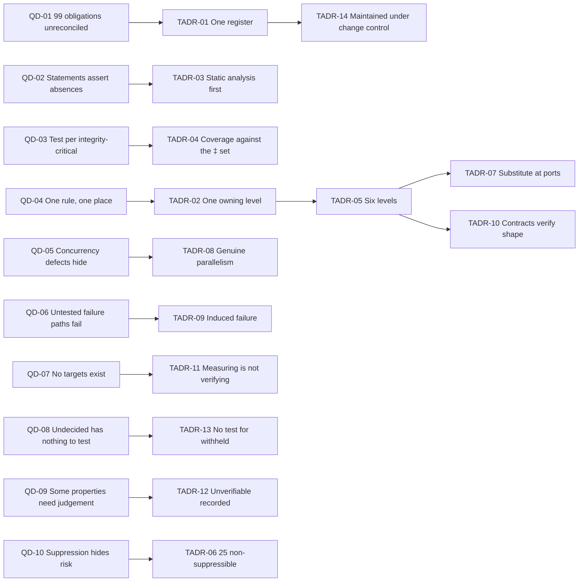
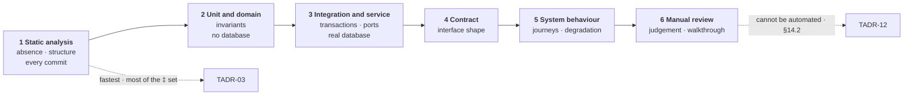

# CMP-DOC-18 — Testing & QA Documentation

**Carpool Mobility Platform (CMP)**

---

# 0. Document Control

## 0.1 Document Metadata

| Field | Value |
|---|---|
| Document ID | CMP-DOC-18 |
| Document Name | Testing & QA Documentation |
| Short Name | TESTING |
| Project Name | Carpool Mobility Platform |
| Project Code | CMP |
| Version | 0.1 |
| Status | Draft |
| Date | 2026-08-17 |
| Author | QA Analyst (AI-assisted) |
| Reviewer | [TBD] |
| Approver | Project Owner |
| Classification | Internal |
| Brand | TBD |
| Previous Version | None (initial issue) |
| Predecessor Documents | CMP-DOC-01 … CMP-DOC-17, **all Draft, none approved** (CMP-DOC-09 at v0.2, the remainder at v0.1) |
| Related Documents | `00_Project_Control/README.md`, `Documentation_Index.md`, `Documentation_Status.md`, `Document_Change_Log.md`, `Glossary.md`, `Master_Traceability_Matrix.md` |
| Successor Documents | CMP-DOC-19 (DevOps / Deployment), CMP-DOC-20 (Traceability & Release) |

## 0.2 Revision History

| Version | Date | Author | Change | Status |
|---|---|---|---|---|
| 0.1 | 2026-08-17 | QA Analyst (AI-assisted) | Initial issue. Consolidates the verification burden of the whole chain: 10 quality drivers, **14 testing decisions**, the consolidated obligation register, verification levels, static analysis and build gates, unit and domain testing, integration and contract testing, database constraint testing, security verification, client testing, concurrency and failure injection, accessibility verification, what cannot be tested, coverage and reporting, and test data. Issues 216 statements (`TC-001` … `TC-216`). | Draft |

## 0.3 Distribution List

| Role | Purpose |
|---|---|
| Project Owner | Approval authority; **the release gate in §15.4 is theirs to set** |
| **QA Analyst** | Authoring and ownership |
| **All developers** | **Primary consumers — §6 fails their builds** |
| Solution Architect | The verification method distribution (§5) |
| Backend Lead | §7 to §9, §12 |
| Software Architect — Android | §11, §13 |
| Security Analyst | §10 and the three unverifiable properties (§14.2) |
| DevOps Engineer | Build gates, environments, test data (§6, §16) |
| Product Analyst | What cannot be tested because it is undecided (§14.3) |

## 0.4 Approval

| Role | Name | Signature | Date |
|---|---|---|---|
| Author | QA Analyst (AI-assisted) | — | 2026-08-17 |
| Reviewer | [TBD] | — | — |
| Approver | Project Owner | — | — |

> **This document is NOT approved.** It is issued at version 0.1 with status `Draft`
> for Project Owner review.

## 0.5 Purpose of This Document

Seventeen documents precede this one, and nine of them end with a list of things that must
be verified. **Ninety-nine enumerated obligations exist across those nine lists**, and each
was written by a different author solving a different problem. Nobody has yet put them in
one place, checked them for overlap, or asked whether together they cover the 1,164
integrity-critical statements the chain has produced.

That consolidation is this document's principal contribution, and §4 is where it happens.

The second contribution is subtraction. CMP-DOC-06 §9.2 already warned that **74 of the 606
verifiable requirements are not executable** — 62 Inspection, 12 Analysis — because a great
many of the chain's most important statements assert an *absence*: no path exists, no rule
is duplicated, no value is embedded, no credential is received. **You cannot test an
absence by exercising it.** §6 is how most of those become build-time checks instead, and
§14 is an honest account of the ones that remain.

## 0.6 Boundaries — What This Document Does Not Specify

| Subject | Owning document |
|---|---|
| The requirements being verified | CMP-DOC-04, 05, 06 |
| The mechanisms being verified | CMP-DOC-07 … CMP-DOC-17 |
| **Build pipeline, environments, runners, provisioning** | **CMP-DOC-19** |
| Release process and sign-off records | CMP-DOC-20 |

### 0.6.1 No Target, Threshold or Coverage Figure Is Stated

**FACT.** `BAD-DEC-018` leaves 69 quality targets unset (`GAP-012`), launch scale is
unstated (`GAP-016`), and every mobile resource budget is unset (`GAP-015`).

This document states **what must be verified and how**. It states **no coverage percentage,
no performance threshold, no defect-density target, no pass rate and no test-count target**,
because each would either be an invented number or a target derived from one. §15.3 names
what cannot be measured against a target, and it is a large set.

### 0.6.2 No Tool or Product Is Named

This document specifies **the capability each verification requires** — a test that can run
under genuine parallelism, a static analysis rule that can inspect namespace dependencies,
a harness that can substitute a port adapter. It names no framework, runner or product,
because tool selection is CMP-DOC-19's and because a specification tied to a tool needs
rewriting when the tool changes.

## 0.7 Inputs to This Document

| Input | Contribution |
|---|---|
| CMP-DOC-04 | 260 functional requirements; 81 integrity-critical |
| CMP-DOC-05 | 162 quality requirements; `NFR-106` — a test per integrity-critical requirement |
| CMP-DOC-06 §9 | The 606-requirement verifiable baseline and its method distribution |
| CMP-DOC-09 §17 | 9 test obligations and 8 structural enforcement rules |
| CMP-DOC-10 §16 | 3 contract test obligations |
| CMP-DOC-11 §15 | 21 database-enforced constraints, each requiring a test |
| CMP-DOC-12 §18.7 | Four failure treatments tested distinctly; assistive-technology walkthrough |
| CMP-DOC-13 §19 | 14 automated checks and 3 properties recorded as unverifiable |
| CMP-DOC-14 §16 | 12 verification obligations |
| CMP-DOC-15 §14 | 10 verification obligations |
| CMP-DOC-16 §13 | 10 verification obligations |
| CMP-DOC-17 §16 | 12 verification obligations |

## 0.8 Qualifications on This Document

### 0.8.1 Source

Every statement derives from a predecessor statement, from a decision recorded in §3, or is
disclosed in §17.6 as originating here.

### 0.8.2 Qualification 1 — Seventeen Unapproved Predecessors

**FACT.** CMP-DOC-01 … CMP-DOC-17 are all `Draft`. None is approved.

Recorded as conflict `CC-019` and as `TC-RISK-01`. A test suite written against an
unapproved specification verifies conformance to a document that may change, which is
still worth doing and is not the same as verifying the product is right.

### 0.8.3 Qualification 2 — A Whole Class of Tests Cannot Be Written

**FACT.** Every performance, capacity, availability and resource target in the chain is
unset. `NFR-001`–`NFR-052` include bounded times, bounded rates and bounded consumption,
and **not one bound has a value**.

Performance, load, endurance and resource testing **cannot be specified as pass-or-fail**,
because there is nothing to fail against. §15.3 lists what this affects. This document
specifies the **measurements** so that targets can later be set from observation, and
states plainly that measuring is not verifying.

### 0.8.4 Qualification 3 — Undecided Behaviour Has No Tests

**FACT.** 33 use cases are Outlined, 29 functional gaps exist, and across CMP-DOC-10, 11,
12 and 17 there are 11 withheld resources, 7 withheld tables, 14 withheld screens and 5
withheld operator capabilities.

**No test is specified for any of them.** §14.3 records the consequence: a test suite that
passes completely still leaves the largest known risks in the product untouched, because
they are not defects — they are decisions nobody has taken.

## 0.9 Statement Classification Convention

As `README.md` §9.1 of the control repository. Markers: **FACT**, **ASSUMPTION**, **BUSINESS DECISION REQUIRED**,
**TECHNICAL DECISION REQUIRED**, **OPEN QUESTION**, **TBD**, **FUTURE CONSIDERATION**,
**RECOMMENDATION**.

## 0.10 Identifier Conventions

| Prefix | Element | Section |
|---|---|---|
| `TC-nnn` | **Traceable testing specification statement** | §4–§16 |
| `TADR-nn` | Testing Decision Record | §3 |
| `QD-nn` | Quality driver | §2 |
| `TC-ASM-nn` | Assumption | §18.1 |
| `TC-RISK-nn` | Risk | §18.2 |
| `TC-OQ-nn` | Open Question | §18.3 |

> **`TC-nnn` denotes a traceable testing statement, not an individual test case.** §20 of
> the Master Documentation Control Prompt allocates `TC-` to this document; the chain's
> convention throughout has been one prefix for traceable statements, and this document
> follows it. Individual test cases are identified within the obligation register (§4.2)
> by their obligation reference.

## 0.11 Table of Contents

| § | Title |
|---|---|
| 0 | Document Control |
| 1 | Executive Summary |
| 2 | Quality Drivers |
| 3 | Testing Decisions |
| 4 | The Consolidated Obligation Register |
| 5 | Verification Levels |
| 6 | Static Analysis and Build Gates |
| 7 | Unit and Domain Testing |
| 8 | Integration and Contract Testing |
| 9 | Database Constraint Testing |
| 10 | Security Verification |
| 11 | Client Testing |
| 12 | Concurrency and Failure Injection |
| 13 | Accessibility Verification |
| 14 | What Cannot Be Tested |
| 15 | Coverage and Reporting |
| 16 | Test Data |
| 17 | Traceability |
| 18 | Assumptions, Risks and Open Questions |
| 19 | Acceptance Criteria for This Document |
| 20 | Statistics and Recommendations |
| A | Appendix A — Statement Index |
| B | Appendix B — Decision Index |
| C | Appendix C — Obligation Source Reference |

---

# 1. Executive Summary

## 1.1 What This Document Delivers

| Element | Count |
|---|---|
| Quality drivers | 10 |
| **Testing Decision Records** | **14** |
| Testing specification statements | **216** (`TC-001` … `TC-216`) |
| **Verification obligations consolidated** | **99**, from 9 documents |
| Non-suppressible obligations | 25 |
| Verification levels | 6 |
| Build gates | 4 |
| Properties recorded as unverifiable | 3 |
| Verification categories that cannot be pass-or-fail | 5 |
| **Coverage, threshold or target figures stated** | **0** |
| **Tools or products named** | **0** |

## 1.2 Verification in One Paragraph

Ninety-nine obligations from nine documents are consolidated into one register, each
retaining its source, its level and whether it may be suppressed. Twenty-five may not be.
The register is checked for the thing nobody could check while the documents were being
written separately: that together the obligations reach the 1,164 integrity-critical
statements the chain produced — and §4.4 reports honestly that they do not reach all of
them. Verification happens at six levels, and the most important is the earliest: static
analysis, because the chain's most consequential statements assert absences, and an absence
is verified by inspecting for it rather than by exercising it. Four build gates fail
progressively. What cannot be tested is stated in three categories and not padded with
weak tests: three properties that need human judgement, five categories with no target to
fail against, and everything that is undecided.

## 1.3 The Four Decisions That Shape Everything Else

| TADR | Decision | Why it dominates |
|---|---|---|
| **`TADR-01`** | **One consolidated register**, each obligation retaining its source document, its level, and its suppressibility. | Nine documents each produced a list solving their own problem. Without consolidation nobody can answer "is this covered", overlap goes unnoticed, and an obligation dropped in one document's implementation is invisible to everyone else. |
| **`TADR-03`** | **Static analysis is the primary verification level, not a linting afterthought.** | CMP-DOC-06 §9.2 counted 74 of 606 verifications as non-executable, most asserting an absence. `BADR-18`'s eight rules, `ADM-002`'s prohibition and `SEC-131`'s injection rule are all absences. A test can show a path works; only inspection can show no path exists. |
| **`TADR-06`** | **Twenty-five obligations are non-suppressible**, and suppression of any other requires a recorded justification that names the risk it accepts. | Each predecessor marked its own; consolidating them makes the set visible and prevents a suppression in one document's area going unremarked in another's. |
| **`TADR-11`** | **Measuring is not verifying**, and this document says so wherever a target is missing. | Five verification categories have no target. Reporting a latency figure against no threshold is measurement dressed as a test result, and it is how an unmet requirement passes a release gate. |

## 1.4 The Verification Burden, Measured

| Measure | Value |
|---|---|
| Traceable statements across the chain | **3,114** |
| Integrity-critical statements (‡) | **1,164** |
| Verifiable requirements (CMP-DOC-06 §9.1) | 606 |
| — verified by Test | 98 |
| — verified by Inspection | 62 |
| — verified by Demonstration | 12 |
| — verified by Analysis | 12 |
| Enumerated obligations from predecessors | **99** |
| Obligations placed directly on this document | 13 |

## 1.5 What This Document Could Not Settle

| Matter | Position |
|---|---|
| Coverage targets | §15.3 — none exists to set one against |
| Performance, load, endurance thresholds | `BAD-DEC-018`, all unset |
| Penetration testing scope and cadence | `SEC-OQ-04` |
| Release gate criteria | §15.4 — the Project Owner's |
| Three unverifiable properties | §14.2 — inherited from CMP-DOC-13 |
| Test environment and data provisioning | CMP-DOC-19 |

---

# 2. Quality Drivers

| ID | Driver | Source | Consequence |
|---|---|---|---|
| `QD-01` | Ninety-nine obligations exist across nine documents and nobody has reconciled them. | §0.5 | `TADR-01`: one register. |
| `QD-02` | The chain's most important statements assert absences. | CMP-DOC-06 §9.2 | `TADR-03`: static analysis first. |
| `QD-03` | Every integrity-critical requirement needs an automated test. | `NFR-106` | `TADR-04`: coverage measured against the ‡ set, not against lines. |
| `QD-04` | A rule enforced in one place must not be re-verified in another and missed in a third. | `SRS-REQ-126` | `TADR-02`: one obligation, one owning level. |
| `QD-05` | Concurrency defects do not appear under sequential test. | `BE-208`, `PAY-208` | `TADR-08`: genuine parallelism, not simulated sequence. |
| `QD-06` | A failure path untested is a failure path that fails. | `BE-209`, `PAY-176` | `TADR-09`: induced failure is a first-class technique. |
| `QD-07` | No target exists for a whole class of requirements. | `GAP-012` | `TADR-11`: measuring is not verifying. |
| `QD-08` | Undecided behaviour has nothing to test. | §0.8.4 | `TADR-13`: no test for a withheld capability. |
| `QD-09` | Some properties need judgement, not assertion. | `SEC-233`, §19.4 of CMP-DOC-13 | `TADR-12`: unverifiable is recorded, never padded. |
| `QD-10` | A suppressed check is a silently accepted risk. | `BE-217`, `SEC-231` | `TADR-06`: 25 non-suppressible; suppression names its risk. |

---

# 3. Testing Decisions

Each decision records its context, the alternatives considered, and its consequences
**including the negative ones**, marked ✘. **No decision names a tool or states a target**
(§0.6).

## 3.1 `TADR-01` — One Consolidated Register

| | |
|---|---|
| **Context** | Nine documents end with a verification list: CMP-DOC-09 (9 + 8), CMP-DOC-10 (3), CMP-DOC-11 (21), CMP-DOC-13 (14), CMP-DOC-14 (12), CMP-DOC-15 (10), CMP-DOC-16 (10), CMP-DOC-17 (12). Each was written by a different author solving a different problem, and none could see the others. |
| **Decision** | **All 99 are consolidated into one register in §4.2, each retaining its source document, its verification level, its suppressibility and the statements it verifies. The register is the authority; the predecessor lists become references to it.** |
| **Alternatives** | *(a)* Leave each document's list as its own suite — rejected: overlap goes unmeasured, and an obligation nobody implements is invisible because no single list is incomplete. *(b)* Rewrite them into a fresh set — rejected: it would lose the traceability to the statement each protects, which is the reason each exists. |
| **Consequences** | ✔ One place answers "is this verified". ✔ Overlap and gaps become measurable, and §4.4 reports both. ✘ The register must be maintained as predecessors change, and `TC-019` makes that a change-control obligation. ✘ It is long. |

## 3.2 `TADR-02` — One Obligation, One Owning Level

| | |
|---|---|
| **Context** | The same property can often be checked at several levels — a seat oversell by a unit test on the invariant, an integration test on the service, a constraint test on the database and a contract test on the API. Verifying it four times costs four maintenance burdens and still leaves the question of which one is authoritative when they disagree. |
| **Decision** | **Each obligation names one owning level, at which it is authoritatively verified. Verification of the same property at another level is permitted where it is cheap and adds a distinct failure mode, and is recorded as secondary rather than duplicated silently.** |
| **Alternatives** | *(a)* Verify everything at every level — rejected: the maintenance cost is real and the redundancy hides which check actually protects the property. *(b)* Verify only once, never redundantly — rejected: the seat rule is deliberately defended at four layers, and each defence deserves its own check. |
| **Consequences** | ✔ Every obligation has an accountable level. ✔ Redundancy is deliberate rather than accidental. ✘ Judgement is needed about which level owns a property; §5.3 gives the rule. |

## 3.3 `TADR-03` — Static Analysis Is the Primary Level

| | |
|---|---|
| **Context** | CMP-DOC-06 §9.2 counted 62 Inspection and 12 Analysis verifications out of 606, noting that software-level requirements are substantially about *structure and absence*. `BADR-18` enforces eight structural rules; `ADM-002` forbids a Filament model binding; `SEC-131` forbids dynamic statement construction; `API-214` forbids an authoritative field in a request schema. **None of those can be verified by exercising the system**, because each asserts that something does not exist. |
| **Decision** | **Static analysis is the first and most important verification level. Every obligation expressible as a structural rule is expressed as one, runs on every commit, and fails the build. Dynamic tests verify behaviour; static analysis verifies absence.** |
| **Alternatives** | *(a)* Treat static analysis as linting — rejected: it demotes the checks protecting the highest-rated risks in the chain to style advice. *(b)* Verify absences by attempting them in tests — **partially adopted**: attempting a forbidden write and requiring refusal is a genuine test and is used where a runtime guarantee exists (`DB-121`). It does not replace inspecting for a code path that should not exist. |
| **Consequences** | ✔ The chain's most consequential rules are checked before anything runs. ✔ Feedback arrives in seconds. ✘ Static rules need writing and maintaining as the codebase evolves. ✘ A rule too broad produces false positives and gets suppressed, which is the failure mode `TADR-06` guards. |

## 3.4 `TADR-04` — Coverage Is Measured Against the ‡ Set

| | |
|---|---|
| **Context** | `NFR-106` requires an automated test for every requirement marked integrity-critical in CMP-DOC-04 — 81 of them. The chain has since produced **1,164 integrity-critical statements** in total. Line coverage measures how much code ran, which is not the same question. |
| **Decision** | **Coverage is reported as the proportion of integrity-critical statements with a verification obligation covering them, per document and in total. Line or branch coverage may be collected as diagnostic information and shall not be a release criterion.** |
| **Alternatives** | *(a)* Line coverage with a threshold — rejected: it would be an invented number (§0.6.1), and high line coverage with no assertion about the seat invariant is worse than the reverse. *(b)* Requirement coverage over all 606 — accepted as a **second** measure; the ‡ set is the one that matters. |
| **Consequences** | ✔ Coverage answers a question worth asking. ✔ `NFR-106` becomes measurable. ✘ It requires the ‡-to-obligation mapping to be maintained; §4.3 is that mapping. ✘ **§4.4 reports that coverage is not complete**, which is uncomfortable and true. |

## 3.5 `TADR-05` — Six Levels, Named and Bounded

| | |
|---|---|
| **Context** | Obligations arrive from nine documents at every scale — a static rule, a domain invariant, a database constraint, a service transaction, an API contract, an accessibility walkthrough. Without named levels, each is implemented wherever its author happens to work. |
| **Decision** | **Six levels: static analysis, unit and domain, integration and service, contract, system behaviour, and manual review. Each obligation names one. §5.2 defines what belongs at each and what does not.** |
| **Alternatives** | *(a)* The conventional unit/integration/end-to-end triple — rejected: it has no home for static analysis or for the manual reviews §14.2 requires, and those are where this chain's hardest verifications live. |
| **Consequences** | ✔ Every obligation has an unambiguous home. ✔ The two levels conventional models omit are first-class here. ✘ Six levels is more structure than a small team may want. ✘ Boundary cases need the rule in §5.3. |

## 3.6 `TADR-06` — Twenty-Five Are Non-Suppressible

| | |
|---|---|
| **Context** | `BE-218` names 3 non-suppressible structural rules, `SEC-232` names 7 checks, `PAY-204` names 3 obligations, `GPS-180` names 3, `NOTIF-186` names 4, `ADM-198` names 5, and `ADM-204` singles out 2 as the ones making `SRS-RISK-003` structural. Each document marked its own without seeing the others. |
| **Decision** | **The 25 non-suppressible obligations are consolidated in §4.5 as one list. No suppression mechanism shall exist for any of them. Suppression of any other obligation shall require a recorded justification naming the risk accepted and the person accepting it.** |
| **Alternatives** | *(a)* Allow suppression with approval — rejected for these 25: each guards an absolute rule or a zero-tolerance requirement, and an approval process is a mechanism for saying yes. *(b)* Make everything non-suppressible — rejected: a rule that cannot be waived when it is wrong gets deleted instead. |
| **Consequences** | ✔ The set is visible in one place rather than scattered across six documents. ✔ A suppression elsewhere carries a named risk and a named person. ✘ A false positive in a non-suppressible rule blocks all work until the rule is fixed, which is the intended severity and a real cost. |

## 3.7 `TADR-07` — Ports Are Substituted at the Boundary

| | |
|---|---|
| **Context** | `BE-163` requires a test adapter per port exercising every result. `MOB-151` requires fakes to substitute at the gateway and device-capability boundaries, not at internal seams. `PAY-101`, `GPS-138` and `NOTIF-127` each require the four port results exercised. `BE-152` makes `Unavailable` the result most likely to be mishandled. |
| **Decision** | **Substitution happens at ports and at the client's gateway and device boundaries, and nowhere else. Every port has a test adapter exercising all four results, and `Unavailable` is exercised for every port without exception.** |
| **Alternatives** | *(a)* Mock at internal seams for speed — rejected: `MOB-151`, and a test that substitutes an internal collaborator verifies the test's model of the code rather than the code. *(b)* Test against real providers — rejected: unreliable, costly, and cannot produce `Unavailable` on demand. |
| **Consequences** | ✔ Tests exercise real internal wiring. ✔ The four-result vocabulary is verified everywhere it exists. ✘ Test adapters must be maintained alongside real ones. ✘ Slower than seam mocking, which is the price of testing the real thing. |

## 3.8 `TADR-08` — Concurrency Under Genuine Parallelism

| | |
|---|---|
| **Context** | `BE-208` requires concurrent allocation tested under genuine parallel execution, **not simulated sequence**. `DB-092` requires the same of the `CHECK` constraint. `PAY-208` requires concurrent verification of one payment. `BAD-RULE-027` is absolute and `NFR-028` demands zero oversells. A sequential test of a locking path passes whether or not the lock exists. |
| **Decision** | **Every concurrency obligation runs genuinely in parallel against a real database, and asserts the invariant held across all outcomes rather than that a particular interleaving occurred. A test that simulates concurrency by ordering calls does not satisfy the obligation.** |
| **Alternatives** | *(a)* Simulate interleaving deterministically — rejected explicitly by `BE-208`; a deterministic simulation tests the interleaving you thought of. *(b)* Rely on the database constraint alone — rejected: the constraint is the last defence and `BE-084` says it must not be the first. |
| **Consequences** | ✔ The single most consequential rule in the platform is verified against the failure mode it exists for. ✔ `DB-083`'s constraint is proven live rather than assumed. ✘ Parallel tests are slower, need a real database, and can be flaky if written carelessly. ✘ A flaky concurrency test gets disabled; `TC-150` forbids it and requires the flakiness fixed instead. |

## 3.9 `TADR-09` — Induced Failure Is a First-Class Technique

| | |
|---|---|
| **Context** | `BE-209` requires atomicity tested by induced mid-transaction failure. `PAY-176` requires rollback on failure during confirmation. `DB-121` requires a forbidden write attempted and refused. `SEC-229`'s checks 1–4 all attempt something and require refusal. `GPS-181` exercises acquisition after process death. |
| **Decision** | **Failure is induced deliberately: a transaction interrupted mid-flight, a privilege exercised that should not exist, a provider returning `Unavailable`, a process killed, a network removed. These are specified obligations, not exploratory testing.** |
| **Alternatives** | *(a)* Trust that error paths work — rejected: the error path is the one nobody exercises in normal use and the one that runs when something is already wrong. *(b)* Test failure only at system level — rejected: `BE-209` needs a mid-transaction interruption, which is not reachable from outside. |
| **Consequences** | ✔ Rollback, refusal and degradation are proven rather than assumed. ✔ The chain's many "shall never" statements acquire evidence. ✘ Induced-failure tests need hooks that must not exist in production; `TC-155` requires them absent from the production artefact. |

## 3.10 `TADR-10` — Contract Tests Verify Shape, Not Behaviour

| | |
|---|---|
| **Context** | `API-215` requires a test per error branch asserting a condition of one branch never returns as another. `API-214` requires no request schema accepts an authoritative field. `UX-076` requires the branch-to-treatment mapping exhaustive. These are statements about the *shape* of the interface, not about business outcomes. |
| **Decision** | **Contract tests verify the interface's shape: which branches exist, which fields a schema accepts, which markings a response carries. Business outcomes are verified at the service level. A contract test that asserts a business rule is testing at the wrong level and duplicates a service test.** |
| **Alternatives** | *(a)* End-to-end tests through the API for everything — rejected: slow, brittle, and they verify business rules at the level furthest from where they live. |
| **Consequences** | ✔ Contract tests are fast and stable. ✔ The four-branch discipline gets a check that cannot pass by accident. ✘ Two levels must agree on what a scenario means; `TC-088` requires the contract test to reference the service test it pairs with. |

## 3.11 `TADR-11` — Measuring Is Not Verifying

| | |
|---|---|
| **Context** | Every performance, capacity, availability and resource target in the chain is unset (§0.8.3). `GPS-195` requires instrumentation from first release so values can be set from observation. A latency figure reported against no threshold is a measurement; presenting it in a test report makes it look like a result. |
| **Decision** | **Where no target exists, the activity is a **measurement** and is reported as such — never as a passing test, never in a pass count, and never contributing to a release gate. §15.3 names the five categories affected. When a target is set, the measurement becomes a test without further design.** |
| **Alternatives** | *(a)* Set provisional thresholds so the tests pass or fail — rejected: an invented threshold that a build passes is worse than no threshold, because it retires the question. *(b)* Omit the activity until targets exist — rejected: `GPS-195` and `GAP-015` need the data to set the targets. |
| **Consequences** | ✔ No unmet requirement passes a gate by being measured. ✔ The data to set targets accumulates from day one. ✘ **Five verification categories report numbers and no verdict**, which reads as incompleteness and is accuracy. ✘ Someone will ask why performance testing has no pass rate; §15.3 is the answer. |

## 3.12 `TADR-12` — Unverifiable Is Recorded, Never Padded

| | |
|---|---|
| **Context** | CMP-DOC-13 §19.4 recorded three properties that cannot be checked automatically — data minimisation needing judgement, provider behaviour outside observation, and a disclosure scope with no decision to check against. Each could be given a weak test that passes. |
| **Decision** | **A property that cannot be verified is recorded as unverified with the reason and a compensating control. It is not given a token test. §14.2 carries the three from CMP-DOC-13 and adds none.** |
| **Alternatives** | *(a)* Write an approximate test — rejected: it converts a known gap into an apparent pass, which is the worst outcome available. *(b)* Remove the requirement — rejected: it is a real requirement that cannot be automatically checked, which is a different thing from not being a requirement. |
| **Consequences** | ✔ The report distinguishes verified from unverifiable. ✔ Compensating controls are visible. ✘ A stakeholder reading a coverage figure sees a shortfall that will not close. |

## 3.13 `TADR-13` — No Test for a Withheld Capability

| | |
|---|---|
| **Context** | Eleven API resources, seven tables, fourteen screens and five operator capabilities are withheld across CMP-DOC-10, 11, 12 and 17, because 33 use cases are Outlined and 29 functional gaps exist. |
| **Decision** | **No test is specified for a withheld capability. Where a journey reaches one, the test asserts the platform's refusal — which is the specified behaviour — and not an invented outcome. §14.3 records what is untested and why.** |
| **Alternatives** | *(a)* Write pending or skipped tests as placeholders — rejected: a skipped test is a specification written by a QA analyst, and it encodes a guess about behaviour nobody has decided. |
| **Consequences** | ✔ Nothing is invented, and §14.3 is a legible list of what is not covered. ✔ Adding the capability later starts with no wrong tests to unpick. ✘ **A fully passing suite leaves the largest known product risks untouched**, and §14.3 says so in those words. |

## 3.14 `TADR-14` — The Register Is Maintained Under Change Control

| | |
|---|---|
| **Context** | The register consolidates 99 obligations from nine documents, all of which are Draft. Every one of them may change, and several are expected to when the open decisions are taken. |
| **Decision** | **A change to any predecessor's verification list is a change to this register. Adding an obligation to a predecessor without adding it here is a documentation defect, and §17.7 places that obligation on every document that owns a list.** |
| **Alternatives** | *(a)* Regenerate the register periodically — rejected: it drifts between regenerations, and the drift is invisible. |
| **Consequences** | ✔ The register stays authoritative. ✘ Nine documents acquire a maintenance obligation. ✘ The register cannot be baselined before its predecessors are approved. |

## 3.15 Driver to Decision Map

---

# 4. The Consolidated Obligation Register

## 4.1 Sources

| Source | Section | Obligations | Non-suppressible |
|---|---|---|---|
| CMP-DOC-09 BACKEND | §17.1 test obligations | 9 | — |
| CMP-DOC-09 BACKEND | §17.2 structural rules | 8 | 3 |
| CMP-DOC-10 API | §16 contract tests | 3 | — |
| CMP-DOC-11 DATABASE | §15 constraint register | 21 | — |
| CMP-DOC-13 SECURITY | §19.1 automated checks | 14 | 7 |
| CMP-DOC-14 PAYMENT | §16 verification obligations | 12 | 3 |
| CMP-DOC-15 GPS | §14 verification obligations | 10 | 3 |
| CMP-DOC-16 NOTIFICATION | §13 verification obligations | 10 | 4 |
| CMP-DOC-17 ADMIN | §16 verification obligations | 12 | 5 |
| | **Total** | **99** | **25** |

| ID | Statement | Src |
|---|---|---|
| `TC-001` | The 99 obligations above shall be consolidated into one register. | `TADR-01`, §0.5 |
| `TC-002` | Each shall retain its source document, its section and the statements it verifies. | `TADR-01` |
| `TC-003` | Each shall name exactly one owning verification level. | `TADR-02`, `TADR-05` |
| `TC-004` | Each shall record whether it is suppressible. | `TADR-06` |
| `TC-005` | The register shall be the authority; a predecessor's list is a reference into it. | `TADR-01` |
| `TC-006` | An obligation present in a predecessor and absent from the register shall be a documentation defect. | `TADR-14`, §17.7 |

## 4.2 Register Structure

| Field | Purpose |
|---|---|
| Obligation reference | `<source>-<n>`, e.g. `DB-15/1`, `SEC-19.1/4` |
| Source statement | The statement requiring it |
| Verified statements | The statements it protects |
| Level | One of the six in §5.1 |
| Suppressible | Yes / **No** |
| Technique | Static, assertion, induced failure, parallel execution, inspection, walkthrough |
| Status | Specified / Implemented / Passing — maintained by CMP-DOC-20 |

| ID | Statement | Src |
|---|---|---|
| `TC-007` | Every obligation shall carry the seven fields above. | `TADR-01` |
| `TC-008` | The verified-statements field shall name statement identifiers, not prose. | `TADR-04`, §4.3 |
| `TC-009` | Status shall be maintained as implementation proceeds and is CMP-DOC-20's to report. | §17.5 |
| `TC-010` | An obligation with no named verified statement shall be a defect in the register. | `TC-008` |

## 4.3 Coverage of the Integrity-Critical Set

**FACT, measured.** The chain has produced **3,114 traceable statements**, of which
**1,164 are integrity-critical**.

| Document | Statements | ‡ |
|---|---|---|
| CMP-DOC-01 BAD | 78 | 0 |
| CMP-DOC-02 BRD | 188 | 24 |
| CMP-DOC-04 FRD | 260 | 81 |
| CMP-DOC-05 NFR | 162 | 44 |
| CMP-DOC-06 SRS | 184 | 84 |
| CMP-DOC-07 SAD | 148 | 0 |
| CMP-DOC-08 MOBILE | 168 | 0 |
| CMP-DOC-09 BACKEND | 218 | 76 |
| CMP-DOC-10 API | 216 | 100 |
| CMP-DOC-11 DATABASE | 232 | 103 |
| CMP-DOC-12 UIUX | 224 | 84 |
| CMP-DOC-13 SECURITY | 240 | 135 |
| CMP-DOC-14 PAYMENT | 208 | 119 |
| CMP-DOC-15 GPS | 196 | 96 |
| CMP-DOC-16 NOTIFICATION | 188 | 100 |
| CMP-DOC-17 ADMIN | 204 | 118 |
| **Total** | **3,114** | **1,164** |

| ID | Statement | Src |
|---|---|---|
| `TC-011` | Coverage shall be reported as the proportion of integrity-critical statements with a covering obligation, per document and in total. | `TADR-04`, `NFR-106` |
| `TC-012` | Line and branch coverage may be collected as diagnostic information and shall not be a release criterion. | `TADR-04`, §0.6.1 |
| `TC-013` | Requirement coverage across the 606-requirement baseline shall be reported as a second measure. | `TADR-04`, CMP-DOC-06 §9.1 |

## 4.4 The Honest Finding

**FACT.** 99 obligations do not cover 1,164 integrity-critical statements.

| ID | Statement | Src |
|---|---|---|
| `TC-014` | **The 99 inherited obligations do not, by themselves, cover the integrity-critical set.** Each predecessor selected the obligations guarding its own most consequential statements, and none set out to be exhaustive. | `TADR-04`, §4.3 |
| `TC-015` | The shortfall is largest where a document has many ‡ statements and few obligations — CMP-DOC-13 (135 ‡, 14 checks), CMP-DOC-14 (119 ‡, 12), CMP-DOC-17 (118 ‡, 12), CMP-DOC-10 (100 ‡, 3). | §4.1, §4.3 |
| `TC-016` | Many ‡ statements are covered structurally rather than individually: one static rule covers every statement asserting the same absence, and one database constraint covers every statement depending on it. | `TADR-03`, `TADR-02` |
| `TC-017` | **The mapping in §4.3 shall be completed statement by statement before the register is baselined**, and the residue — ‡ statements with no covering obligation — shall be reported rather than closed by assertion. | `TADR-04`, `TC-011` |
| `TC-018` | Where a ‡ statement is genuinely unverifiable, it shall be recorded in §14.2's manner and not counted as covered. | `TADR-12` |
| `TC-019` | New obligations arising from `TC-017` shall be added to the register, and to the owning predecessor under change control. | `TADR-14`, §29 |
| `TC-020` | **Reporting a coverage figure before `TC-017` is complete would overstate what is verified**, and no such figure appears in this document. | `TADR-04`, §0.6.1 |

> **`TC-014` is the finding this document exists to surface.** Nine authors each protected
> what they could see. Nobody could see the whole, and the whole is 1,164 statements against
> 99 obligations. That is not a criticism of the nine lists — it is what consolidation is
> for, and `TC-017` is the work it creates.

## 4.5 The Twenty-Five Non-Suppressible

| Source | Obligations | Guards |
|---|---|---|
| CMP-DOC-09 §17.2 rules 5, 6, 8 | 3 | Admin ORM access, evidential writes, business rules outside the domain |
| CMP-DOC-13 §19.1 checks 1–7 | 7 | Evidential and ledger privileges, DDL, chain verification, injection, authoritative fields, payment credentials |
| CMP-DOC-14 §16 obligations 1, 5, 9 | 3 | Abandoned-attempt verification, `pending` never ageing, callback cannot set status |
| CMP-DOC-15 §14 obligations 1, 3, 8 | 3 | No acquisition outside a trip, no stale-as-current, one cancellation does not invalidate another |
| CMP-DOC-16 §13 obligations 1, 2, 3, 6 | 4 | No business value in a notification, safety delivered, mandatory absent from preferences, no unqualified delivery |
| CMP-DOC-17 §16 obligations 1–5 | 5 | No ORM in admin, no model binding, oversell refused, payment status refused, no role exempt |
| | **25** | |

| ID | Statement | Src |
|---|---|---|
| `TC-021` ‡ | No suppression mechanism shall exist for any of the 25. | `TADR-06`, `BE-218` |
| `TC-022` ‡ | Suppression of any other obligation shall require a recorded justification naming the risk accepted and the person accepting it. | `TADR-06`, `BE-217` |
| `TC-023` ‡ | A suppression shall be time-bounded and shall be reviewed; **the review period is `[TBD – Technical Decision Required]`**. | `TC-022` |
| `TC-024` ‡ | A non-suppressible obligation producing a false positive shall be fixed, never disabled. | `TADR-06`, `TC-150` |

---

# 5. Verification Levels

## 5.1 The Six Levels

| ID | Statement | Src |
|---|---|---|
| `TC-025` | Verification shall occur at six levels: static analysis, unit and domain, integration and service, contract, system behaviour, manual review. | `TADR-05` |
| `TC-026` | Each obligation shall name one owning level. | `TADR-02`, `TC-003` |
| `TC-027` | Verification of the same property at another level shall be recorded as secondary. | `TADR-02` |
| `TC-028` | Levels shall run in order, and a failure at an earlier level shall stop the later ones. | `TADR-03`, §6.3 |

## 5.2 What Belongs Where

| Level | Verifies | Does not verify |
|---|---|---|
| 1 Static analysis | Absence, structure, dependency direction, schema shape | Behaviour |
| 2 Unit and domain | Invariants, refusals, computations, state transitions | Persistence, transactions |
| 3 Integration and service | Transactions, locking, port results, evidencing | Interface shape |
| 4 Contract | Branch shapes, schema acceptance, response markings | Business outcomes |
| 5 System behaviour | Journeys, degradation, concurrency, recovery | Individual invariants |
| 6 Manual review | Judgement, accessibility walkthrough, classification | Anything automatable |

| ID | Statement | Src |
|---|---|---|
| `TC-029` | A domain test shall run without a database, a framework or a network. | `BE-040`, `MOB-153` |
| `TC-030` | An integration test shall run against a real database, never an in-memory substitute. | `TADR-08`, `DB-085` |
| `TC-031` | A contract test shall not assert a business rule. | `TADR-10` |
| `TC-032` | A manual review shall be specified as a procedure with a recorded outcome, not as an instruction to look. | `TADR-12`, §14.2 |

## 5.3 The Level Rule

| ID | Statement | Src |
|---|---|---|
| `TC-033` | An obligation belongs at **the earliest level that can verify it conclusively**. | `TADR-03`, `TADR-02` |
| `TC-034` | An obligation asserting an absence belongs at level 1 unless a runtime guarantee exists to attempt against. | `TADR-03`, `DB-121` |
| `TC-035` | An obligation asserting an invariant belongs at level 2 unless it depends on persistence or concurrency. | `TC-029`, `TADR-08` |
| `TC-036` | Where two levels could own an obligation, the earlier owns it and the later is secondary. | `TC-033`, `TC-027` |

---

# 6. Static Analysis and Build Gates

## 6.1 The Structural Rules

| # | Rule | Source | Suppressible |
|---|---|---|---|
| 1 | `Domain` references no framework type | `BE-002` | Yes |
| 2 | Dependencies point inward only | `BE-003` | Yes |
| 3 | No ORM type outside three permitted namespaces | `BE-087` | Yes |
| 4 | No transaction control outside `Application` | `BE-047` | Yes |
| 5 | No ORM access from the administrative namespace | `BE-075` | **No** |
| 6 | No evidential write outside the writer | `BE-105` | **No** |
| 7 | No provider type above an adapter | `BE-153` | Yes |
| 8 | No business rule in a controller, resource, model, listener or job | `BE-011` | **No** |
| 9 | No dynamic statement construction | `SEC-131` | **No** |
| 10 | No Filament resource declares an Eloquent model | `ADM-002` | **No** |
| 11 | No request schema accepts an authoritative field | `API-214` | **No** |
| 12 | No business value type reaches a notification payload | `NOTIF-187` | **No** |
| 13 | The UPI application response is absent from every code path | `PAY-205` | **No** |

| ID | Statement | Src |
|---|---|---|
| `TC-037` ‡ | The thirteen rules above shall run on every commit and shall fail the build. | `TADR-03`, `BADR-18` |
| `TC-038` ‡ | Rules 5, 6, 8, 9, 10, 11, 12 and 13 shall be non-suppressible. | `TC-021`, `ADM-204` |
| `TC-039` ‡ | Rules 5 and 10 together are what make `SRS-RISK-003` structural rather than aspirational. | `ADM-204`, `SRS-RISK-003` |
| `TC-040` ‡ | Static rules shall run in every environment, not only in a production pipeline. | `SEC-230`, `ADM-199` |
| `TC-041` | A rule shall be narrow enough to produce no false positive in correct code. | `TADR-06`, `TC-024` |
| `TC-042` | A rule producing a false positive shall be narrowed, never suppressed. | `TC-024` |
| `TC-043` | Adding a structural rule shall require adding it to this list and to its owning document. | `TADR-14`, `TC-019` |
| `TC-044` | Static analysis shall verify layer dependency direction, namespace membership and type reachability. | `BE-014`, `DB-014` |
| `TC-045` | Static analysis shall verify that no secret appears in source. | `SEC-163`, `SEC-205` |
| `TC-046` | Static analysis shall verify that every migration carries a retention classification for each new column. | `DB-177`, `SEC-238` |

## 6.2 Schema and Grant Inspection

| ID | Statement | Src |
|---|---|---|
| `TC-047` ‡ | Migration shall verify that `CHECK` constraints are enforced by the deployed server, by attempting a violating write. | `DB-086`, `DB-217` |
| `TC-048` ‡ | An automated check shall attempt an `UPDATE` on an evidential record as the application account and require server refusal. | `SEC-229`/1, `DB-121` |
| `TC-049` ‡ | An automated check shall attempt a `DELETE` on a ledger entry as the application account and require refusal. | `SEC-229`/2, `DB-094` |
| `TC-050` ‡ | An automated check shall attempt `DDL` as the application account and require refusal. | `SEC-229`/3, `DB-119` |
| `TC-051` ‡ | Checks 48 to 50 shall run in every environment. | `DB-122`, `SEC-230` |
| `TC-052` | Schema inspection shall verify that no column exists for a payment instrument credential. | `SEC-229`/7, `DB-037` |

## 6.3 Build Gates

| Gate | Runs | Fails on |
|---|---|---|
| 1 Commit | Levels 1–2 | Any static rule; any domain test |
| 2 Merge | Levels 1–4 | Any of the above; any integration, contract or constraint test |
| 3 Pre-release | Levels 1–5 | Any of the above; any system behaviour or concurrency test |
| 4 Release | Levels 1–6 | Any of the above; any outstanding manual review |

| ID | Statement | Src |
|---|---|---|
| `TC-053` ‡ | Four gates shall exist, each running every level below it. | `TADR-03`, `TC-028` |
| `TC-054` ‡ | A failure at any gate shall block progression; no gate shall be bypassable. | `TC-053`, `BE-217` |
| `TC-055` | Gate composition may change; **that a gate exists at each of the four points may not**. | `TC-053` |
| `TC-056` | Gate configuration and runner provisioning are CMP-DOC-19's. | §0.6 |

---

# 7. Unit and Domain Testing

| ID | Statement | Src |
|---|---|---|
| `TC-057` ‡ | Every domain invariant shall have a test asserting refusal of its violation. | `BE-207`, `BE-023`–`BE-033` |
| `TC-058` ‡ | Domain tests shall run without a database, a framework or a network. | `BE-040`, `TC-029` |
| `TC-059` ‡ | The seat invariant shall be tested at the aggregate before it is tested anywhere else. | `BE-024`, `TADR-02` |
| `TC-060` ‡ | The three payment states and no fourth shall be tested at the aggregate. | `BE-026`, `PAY-077` |
| `TC-061` ‡ | Booking confirmation without a verified payment shall be tested as refused. | `BE-025`, `NFR-027` |
| `TC-062` ‡ | Trip start without a confirmed booking shall be tested as refused. | `BE-028`, `GPS-001` |
| `TC-063` ‡ | Closure of a safety incident or support case without an outcome shall be tested as refused. | `BE-029`, `BE-030` |
| `TC-064` ‡ | Fare acceptance from an inbound value shall be tested as impossible. | `BE-032`, `PAY-015` |
| `TC-065` ‡ | Verification standing acceptance from an inbound value shall be tested as impossible. | `BE-033` |
| `TC-066` | State holders shall be testable without a UI framework or a device. | `MOB-152` |
| `TC-067` | Client use cases shall be testable without a network or a database. | `MOB-153` |
| `TC-068` | A domain test shall assert the refusal and its reason, not only that an exception occurred. | `BE-046`, `API-081` |
| `TC-069` | Route-overlap assessment shall be tested independently of any corridor, city or region. | `BE-035`, `DB-020` |
| `TC-070` | Every domain event shall be tested as recorded by the aggregate and dispatched only after commit. | `BE-022`, `BE-057` |
| `TC-071` | Policy-configuration-driven behaviour shall be tested against at least two configurations. | `BADR-12`, `BE-166` |
| `TC-072` ‡ | Coded invariants shall be tested to hold under a permissive state model configuration. | `BE-177`, `GPS-154` |

---

# 8. Integration and Contract Testing

## 8.1 Transactions and Services

| ID | Statement | Src |
|---|---|---|
| `TC-073` ‡ | Atomicity of the booking transaction shall be tested by induced mid-transaction failure. | `BE-209`, `TADR-09` |
| `TC-074` ‡ | Seat allocation, booking confirmation, the ledger entry, the payment status change and the evidential record shall be tested as committing together. | `BE-048`, `PAY-067` |
| `TC-075` ‡ | A failed operation shall be tested as leaving no partial effect. | `BE-053`, `PAY-176` |
| `TC-076` ‡ | No external provider call shall occur within a transactional scope; this shall be verified. | `BE-050`, `PAY-057` |
| `TC-077` ‡ | Idempotent replay shall be tested for every state-changing operation. | `BE-211`, `API-062` |
| `TC-078` ‡ | A repeated idempotency key with different content shall be tested as refused. | `API-063`, `PAY-056` |
| `TC-079` ‡ | Every operation shall be tested as refusing an unentitled caller, with absence and non-entitlement indistinguishable. | `SEC-229`/9, `API-094` |
| `TC-080` ‡ | An operator action breaching an absolute rule shall be tested as refused and recorded. | `SEC-229`/10, `ADM-074` |
| `TC-081` ‡ | Evidential chain verification shall be tested against a deliberately altered record. | `BE-212`, `SEC-229`/4 |
| `TC-082` | Projection rebuild shall be tested for equivalence with incrementally maintained state. | `BE-213`, `DB-132` |

## 8.2 Ports

| ID | Statement | Src |
|---|---|---|
| `TC-083` ‡ | Every port result — `Verified`, `Reported`, `Unavailable`, `Rejected` — shall be exercised through a test adapter. | `BE-210`, `BE-163` |
| `TC-084` ‡ | `Unavailable` shall be exercised for every port without exception, and asserted to leave the outcome undecided. | `BE-152`, `PAY-103` |
| `TC-085` ‡ | `Reported` shall be asserted never to set a payment status. | `PAY-102`, `TADR-07` |
| `TC-086` ‡ | Substitution shall occur at ports and at the client's gateway and device boundaries, and nowhere else. | `TADR-07`, `MOB-151` |
| `TC-087` ‡ | An implausible provider response shall be tested as returning `Unavailable`, never a result. | `PAY-108`, `GPS-137`, `NOTIF-126` |

## 8.3 Contract

| ID | Statement | Src |
|---|---|---|
| `TC-088` ‡ | A test shall exist for each of the four error branches, asserting that a condition of one branch never returns as another. | `API-215`, `TADR-10` |
| `TC-089` ‡ | A test shall assert that no request schema accepts an authoritative field. | `API-214`, `TC-038` |
| `TC-090` ‡ | Every ‡ statement in CMP-DOC-10 shall have a contract test. | `API-213` |
| `TC-091` | A contract test shall reference the service test it pairs with, where one exists. | `TADR-10`, `TC-031` |
| `TC-092` | Version negotiation and the version-unsupported outcome shall be tested as a distinct outcome, not a not-found. | `API-024`, `MOB-057` |

---

# 9. Database Constraint Testing

| ID | Statement | Src |
|---|---|---|
| `TC-093` ‡ | Each of the 21 constraints in CMP-DOC-11 §15 shall have a test that attempts to violate it and requires the database to refuse. | `DB-207`, `TADR-09` |
| `TC-094` ‡ | The test shall assert refusal **by the database**, not by application validation preceding it. | `DB-206`, `TADR-02` |
| `TC-095` ‡ | Application-level validation shall be disabled or bypassed for the constraint test, so that the constraint is what refuses. | `TC-094`, `DB-084` |
| `TC-096` ‡ | The seat `CHECK` constraint shall be tested by attempting `seats_confirmed > seats_offered` directly. | `DB-083`, `DB-086` |
| `TC-097` ‡ | The payment-status `CHECK` shall be tested by attempting a fourth value. | `DB-065`, `PAY-078` |
| `TC-098` ‡ | The unique constraints — one allocation per ride, external identifier, idempotency key — shall each be tested by attempting a duplicate. | `DB-079`, `DB-022`, `DB-142` |
| `TC-099` ‡ | Grant-based constraints (8, 9, 10) shall be tested by attempting the forbidden operation and requiring server refusal. | `DB-205`, `TC-048`–`TC-050` |
| `TC-100` ‡ | The append-only trigger on the evidential domain shall be tested independently of the grant. | `DB-120`, `TADR-02` |
| `TC-101` ‡ | `RESTRICT` on delete shall be tested by attempting to delete a referenced operational row. | `DB-030`, `DB-048` |
| `TC-102` ‡ | The no-foreign-key-into-projections rule shall be verified by schema inspection. | `DB-012`, `TC-044` |
| `TC-103` | A constraint added later shall be added to the register and to its test set in the same change. | `DB-208`, `TADR-14` |
| `TC-104` ‡ | Cursor stability shall be tested by inserting a row before a held cursor and asserting no page boundary moved. | `DADR-04`, `DB-026` |
| `TC-105` ‡ | Identifier non-enumerability shall be verified by inspection of the generation mechanism, not by statistical sampling. | `DB-023`, `API-014` |
| `TC-106` ‡ | Removal of a personal value shall be tested as leaving the evidential chain verifiable. | `DB-186`, `SEC-116` |
| `TC-107` ‡ | Removing position history shall be tested as leaving a completed trip's captured route intact. | `GPS-120`, `DB-174` |
| `TC-108` ‡ | Restore followed by retention reconciliation shall be tested as leaving removed data absent and the chain verifiable. | `DB-230`, `SEC-229`/14 |

---

# 10. Security Verification

| ID | Statement | Src |
|---|---|---|
| `TC-109` ‡ | The 14 checks in CMP-DOC-13 §19.1 shall run in continuous integration. | `SEC-229` |
| `TC-110` ‡ | Checks 1–7 shall be non-suppressible. | `SEC-232`, `TC-021` |
| `TC-111` ‡ | Checks 1, 2 and 3 shall run in every environment. | `SEC-230` |
| `TC-112` ‡ | Log inspection under exercise shall confirm no credential, token, position or contact detail is present. | `SEC-229`/8, `SEC-208` |
| `TC-113` ‡ | No store shall be shown to return a value presentable back to the platform as a credential. | `SEC-229`/12, `SEC-033` |
| `TC-114` ‡ | The platform shall be tested to refuse unprotected transport, in every environment. | `SEC-229`/13, `SEC-092` |
| `TC-115` ‡ | A terminated session token shall be tested as refused identically to an unknown one. | `SEC-229`/11, `SEC-048` |
| `TC-116` ‡ | Negative authorisation cases shall exist for **every** operation, not a sample. | `SEC-236` |
| `TC-117` ‡ | Injection defence shall be verified by static analysis, not by attempting payloads. | `SEC-131`, `TADR-03` |
| `TC-118` ‡ | Payment credential absence shall be verified by schema and column inspection, not by attempting to submit one. | `SEC-135`, `TC-052` |
| `TC-119` ‡ | The keyed evidential chain shall be tested by altering a record and requiring verification to report divergence at that record. | `SEC-111`, `TC-081` |
| `TC-120` ‡ | Chain verification shall be tested as reporting, never repairing. | `SEC-112` |
| `TC-121` | Penetration testing shall not be treated as a substitute for any check here. | `SEC-237` |
| `TC-122` | **Penetration testing scope and cadence are `[TBD – Business Decision Required]`** (`SEC-OQ-04`), and no claim of having been tested follows from this document. | `SEC-218`, §0.6.1 |
| `TC-123` ‡ | Every ‡ statement in CMP-DOC-13 shall be covered by a check, a database constraint, or an entry in §14.2. | `SEC-233`, `TC-017` |
| `TC-124` | Security verification shall not require a production credential in any environment. | `SEC-170`, `SEC-176` |
| `TC-125` ‡ | An operator's access to message content and to position history shall each be tested as producing its own evidential record. | `ADM-178`, `ADM-179` |
| `TC-126` ‡ | Inspection shall be tested as writing nothing to business state and exactly one evidential record. | `ADM-063`, `ADM-065` |

---

# 11. Client Testing

| ID | Statement | Src |
|---|---|---|
| `TC-127` ‡ | The four failure treatments shall be tested distinctly, never as one error path. | **CMP-DOC-12 §18.7**, `UX-053` |
| `TC-128` ‡ | Each interface branch shall be tested as producing its own treatment, per the CMP-DOC-12 §7.6 mapping. | `UX-076`, `TADR-10` |
| `TC-129` ‡ | A business refusal shall be tested as never rendering as an internal fault, and the converse. | `UX-073`, `UX-074` |
| `TC-130` ‡ | Every business value shall be tested as unrenderable without its provenance. | `UX-035`, `MOB-018` |
| `TC-131` ‡ | An `Unknown` value shall be tested as rendering an explicit unavailable indication, never a placeholder or zero. | `UX-038`, `MOB-023` |
| `TC-132` ‡ | The commit control shall be tested as unavailable while any of the six `NFR-084` values is cached or unknown. | `UX-095`, `UXDR-06` |
| `TC-133` ‡ | A position older than the configured bound shall be tested as never presented as current. | `GPS-062`, `GPS-064` |
| `TC-134` ‡ | Changing the configured staleness bound shall be tested as changing presentation without a client release. | `GPS-059`, `GPS-060` |
| `TC-135` ‡ | No position shall be tested to be extrapolated between reports. | `GPS-068`, `TADR-09` |
| `TC-136` ‡ | Location acquisition shall be tested as absent when no trip is active, across background and post-process-death states. | `GPS-181`, `GPS-021` |
| `TC-137` ‡ | An offline message shall be tested as never shown delivered before acceptance. | `NOTIF-035`, `UX-208` |
| `TC-138` ‡ | No read state or proxy for it shall be exposed to a sender; this shall be tested. | `NOTIF-029`, `NOTIF-031` |
| `TC-139` ‡ | A notification payload shall be tested as containing no fare, amount, status, standing or position. | `NOTIF-133`, `TC-038` |
| `TC-140` ‡ | A safety-category notification shall be tested as delivered to a user who has disabled everything disableable. | `NOTIF-084`, `NOTIF-088` |
| `TC-141` ‡ | The preference surface shall be tested as offering no control for safety or payment. | `NOTIF-086` |
| `TC-142` | State holders shall be tested without a UI framework or a device; client use cases without a network. | `MOB-152`, `MOB-153` |

---

# 12. Concurrency and Failure Injection

## 12.1 Concurrency

| ID | Statement | Src |
|---|---|---|
| `TC-143` ‡ | Concurrent seat allocation shall be tested under genuine parallel execution, not simulated sequence. | `BE-208`, `TADR-08` |
| `TC-144` ‡ | The test shall run against a real database with the `CHECK` constraint active. | `DB-092`, `TC-030` |
| `TC-145` ‡ | The test shall assert the invariant held across all outcomes, not that a particular interleaving occurred. | `TADR-08`, `BAD-RULE-027` |
| `TC-146` ‡ | Concurrent verification of one payment shall be tested under genuine parallelism. | `PAY-208`, `PAY-092` |
| `TC-147` ‡ | Concurrent idempotent replay shall be tested as producing one effect. | `TC-077`, `API-062` |
| `TC-148` ‡ | Concurrent operator interventions on one record shall be tested as leaving a consistent state. | `ADM-073`, `BE-053` |
| `TC-149` | Lock contention behaviour shall be **measured**, not asserted, because `DB-091`'s wait bound is unset. | `TADR-11`, `DB-091` |
| `TC-150` ‡ | A flaky concurrency test shall be fixed, never disabled or retried into passing. | `TADR-08`, `TC-024` |

## 12.2 Induced Failure

| ID | Statement | Src |
|---|---|---|
| `TC-151` ‡ | Mid-transaction failure shall be induced and rollback asserted. | `BE-209`, `TADR-09` |
| `TC-152` ‡ | Provider `Unavailable` shall be induced for every port. | `TC-084`, `BE-210` |
| `TC-153` ‡ | Process death shall be induced during an active trip and the trip asserted to survive. | `GPS-181`, `MOB-157` |
| `TC-154` ‡ | Network removal shall be induced and the outbox asserted to retain user-entered data. | `NFR-162`, `MOB-065` |
| `TC-155` ‡ | Failure-induction hooks shall be absent from the production artefact, verified by static analysis. | `TADR-09`, `TC-044` |
| `TC-156` ‡ | Safety recording shall be tested with every non-essential dependency made unavailable. | `BE-215`, `API-166` |
| `TC-157` ‡ | The safety surface shall be verified by the same test suite in both deployment forms. | `BE-197`, `BE-191` |
| `TC-158` ‡ | Trip start, run and completion shall be tested with no position available at all. | `GPS-006`, `GPS-011` |
| `TC-159` ‡ | A verified payment meeting an unavailable seat shall be tested; the payment stays `verified` and the booking is not confirmed. | `PAY-171`, `PAY-170` |
| `TC-160` | **What the passenger then receives cannot be tested**, because `GAP-009` leaves it undefined; §14.3. | `PAY-173`, `TADR-13` |

---

# 13. Accessibility Verification

| ID | Statement | Src |
|---|---|---|
| `TC-161` ‡ | An assistive-technology walkthrough shall be performed against every screen. | **CMP-DOC-12 §18.7**, `UX-201` |
| `TC-162` | The walkthrough shall be a specified procedure with a recorded outcome per screen. | `TC-032`, `UX-201` |
| `TC-163` ‡ | Every interactive element shall be verified focusable, labelled and activatable. | `UX-184`, `NFR-089` |
| `TC-164` ‡ | Every gesture shall be verified to have an equivalent control. | `UX-185`, `NFR-092` |
| `TC-165` ‡ | Every screen shall be verified legible and operable at the platform's supported text-scaling settings. | `UX-191`, `NFR-090` |
| `TC-166` ‡ | No status shall be verified as conveyed by colour alone. | `UX-193`, `NFR-091` |
| `TC-167` | Automated inspection shall cover what it can — labels, focus order, scaling — and the walkthrough shall cover the rest. | `UX-201`, `TC-032` |
| `TC-168` | **No conformance with any accessibility standard shall be claimed**, because none has been chosen. | `UX-198`, `NFR-088` |
| `TC-169` | **The accessibility standard is `[TBD – Business Decision Required]`** (`MOB-OQ-002`), and choosing it may add verifications and shall remove none. | `UX-197`, `UX-200` |
| `TC-170` | Verification shall be repeatable against the supported device range; **the range is unchosen** (`MOB-OQ-001`). | `UX-190`, `NFR-094` |
| `TC-171` ‡ | Safety controls shall be verified operable without precision. | `UX-186`, `NFR-092` |
| `TC-172` | Accessibility verification is level 6 and shall be a gate 4 obligation. | `TC-025`, `TC-053` |

---

# 14. What Cannot Be Tested

## 14.1 The Three Categories

| Category | Count | Section |
|---|---|---|
| Properties needing human judgement or outside observation | 3 | §14.2 |
| Verification categories with no target to fail against | 5 | §15.3 |
| Behaviour that is undecided | Everything withheld | §14.3 |

| ID | Statement | Src |
|---|---|---|
| `TC-173` | The three categories above shall be reported separately from verified and failed. | `TADR-12`, `TADR-11` |
| `TC-174` ‡ | None shall be given a token test to make a report look complete. | `TADR-12` |

## 14.2 Properties Needing Judgement

**Inherited unchanged from CMP-DOC-13 §19.4. This document adds none.**

| Property | Why unverifiable | Compensating control |
|---|---|---|
| `SEC-089` — personal data minimised to a stated purpose | Requires judgement about whether a purpose is legitimate | `SEC-090`: an unstated purpose is a review finding |
| `SEC-142` — the provider handles instruments correctly | Outside the platform's observation | `PAY-188`: verified per provider as a selection gate |
| `SEC-070` — disclosure scopes bounded by a business decision | The decision does not exist, so there is nothing to check against | `NFR-066` unresolved; `NOTIF-164` records the same gap |

| ID | Statement | Src |
|---|---|---|
| `TC-175` | The three above shall be recorded as unverified with their compensating controls. | `SEC-233`, `TADR-12` |
| `TC-176` | A ‡ statement found genuinely unverifiable by `TC-017` shall be added here, not counted as covered. | `TC-018`, `TC-017` |
| `TC-177` | `SEC-070` becomes verifiable when `BAD-DEC-022` is decided; the other two do not. | `NOTIF-169`, `SEC-142` |

## 14.3 Undecided Behaviour

| Withheld | Count | Source |
|---|---|---|
| API resources | 11 | CMP-DOC-10 §11.14 |
| Database tables | 7 | CMP-DOC-11 §6.11 |
| Client screens | 14 | CMP-DOC-12 §17 |
| Operator capabilities | 5 | CMP-DOC-17 §15 |
| Use cases Outlined | 33 | CMP-DOC-03 |
| Functional gaps | 29, 11 Critical | CMP-DOC-04 §9.3 |

| ID | Statement | Src |
|---|---|---|
| `TC-178` ‡ | No test shall be specified for a withheld capability. | `TADR-13` |
| `TC-179` ‡ | Where a journey reaches one, the test shall assert the platform's refusal — the specified behaviour — and not an invented outcome. | `TADR-13`, `UX-219` |
| `TC-180` | No pending or skipped test shall be created as a placeholder for undecided behaviour. | `TADR-13` |
| `TC-181` ‡ | **A fully passing suite leaves the largest known risks in this product untouched**, because they are undecided rather than defective. | `TADR-13`, §0.8.4 |
| `TC-182` | The two Critical gaps — `GAP-008` and `GAP-009` — sit on the money path and have no test because they have no behaviour. | `GAP-008`, `GAP-009` |
| `TC-183` | `GAP-013` fraud has no test, no requirement and no owner after seventeen documents. | `GAP-013`, `SEC-202` |
| `TC-184` | `GAP-017` pickup sequencing has no test and blocks `FRD-FR-159` for multi-passenger trips. | `GAP-017`, `GPS-163` |
| `TC-185` | Every item above shall appear in the release report as untested-because-undecided, distinct from untested-because-unfinished. | `TC-173`, §15.2 |
| `TC-186` ‡ | Presenting a passing suite without §14.3 alongside it would materially misrepresent the product's readiness. | `TC-181`, `TADR-11` |

---

# 15. Coverage and Reporting

## 15.1 What Is Reported

| ID | Statement | Src |
|---|---|---|
| `TC-187` | Coverage shall be reported as the proportion of integrity-critical statements with a covering obligation. | `TADR-04`, `TC-011` |
| `TC-188` | Requirement coverage across the 606-requirement baseline shall be reported as a second measure. | `TC-013` |
| `TC-189` | Obligation status — specified, implemented, passing — shall be reported per obligation. | `TC-009` |
| `TC-190` | Line and branch coverage may be reported as diagnostic and shall carry no threshold. | `TC-012`, §0.6.1 |
| `TC-191` ‡ | Verified, unverifiable, unmeasurable and untested-because-undecided shall be reported as four distinct categories. | `TC-173`, `TADR-11` |
| `TC-192` | Suppressions in force shall be reported with their justification and their accepting person. | `TC-022` |

## 15.2 The Report Shape

| Category | Meaning |
|---|---|
| **Verified** | An obligation exists, is implemented, and passes |
| **Failing** | An obligation exists, is implemented, and does not pass |
| **Not implemented** | An obligation exists and has not been built |
| **Unverifiable** | §14.2 — three properties, with compensating controls |
| **Unmeasurable** | §15.3 — measured, no target to fail against |
| **Untested because undecided** | §14.3 — no behaviour exists to test |

| ID | Statement | Src |
|---|---|---|
| `TC-193` ‡ | The six categories above shall never be collapsed into pass and fail. | `TADR-11`, `TADR-12` |
| `TC-194` ‡ | Unmeasurable results shall not contribute to any pass count. | `TADR-11` |
| `TC-195` ‡ | A release report shall carry §14.3 alongside its pass figures. | `TC-186` |

## 15.3 What Cannot Be Pass-or-Fail

**FACT.** Five categories have no target, because `BAD-DEC-018` leaves 69 quality targets
unset and launch scale is unstated.

| Category | Unset target | Measured instead |
|---|---|---|
| Performance and latency | `NFR-001`–`NFR-025` | Observed times per operation |
| Load and capacity | `NFR-041`–`NFR-052`, launch scale | Observed throughput and contention |
| Availability and recovery | `NFR-036`–`NFR-039`, RPO, RTO | Observed recovery behaviour |
| Client resource consumption | `NFR-151`–`NFR-158`, all unset | The nine measurement points of CMP-DOC-08 §13.1 |
| Third-party cost | `NFR-145`, `NFR-149` | Cost per trip, per search |

| ID | Statement | Src |
|---|---|---|
| `TC-196` ‡ | Each category above shall be **measured** and reported as measurement, never as a passing test. | `TADR-11`, `GAP-012` |
| `TC-197` | Instrumentation shall exist from first release so that targets can be set from observation. | `GPS-195`, `NFR-113` |
| `TC-198` ‡ | When a target is set, the measurement becomes a test without further design. | `TADR-11` |
| `TC-199` | **No provisional threshold shall be invented to make these categories pass or fail.** | §0.6.1, `TADR-11` |

## 15.4 The Release Gate

| ID | Statement | Src |
|---|---|---|
| `TC-200` ‡ | Gate 4 shall require every non-suppressible obligation passing, with no exception. | `TC-021`, `TC-053` |
| `TC-201` | **What else constitutes a release gate is `[TBD – Business Decision Required]`** — the Project Owner's, not this document's. | `TC-OQ-01`, §0.6.1 |
| `TC-202` | CMP-DOC-01 §9.4 recommended treating certain success criteria as release gates rather than targets; that recommendation is unresolved and is the natural input to `TC-201`. | CMP-DOC-01 §9.4 |

---

# 16. Test Data

| ID | Statement | Src |
|---|---|---|
| `TC-203` ‡ | Test data shall contain no production personal data. | `SEC-170`, `NFR-065` |
| `TC-204` ‡ | Test data shall contain no production credential, and no production secret shall exist in a test environment. | `SEC-170`, `SEC-176` |
| `TC-205` ‡ | Test data shall contain no payment instrument credential, because none can exist anywhere. | `SEC-133`, `DB-037` |
| `TC-206` | Test data shall be generated, not copied from production. | `TC-203` |
| `TC-207` ‡ | Where a test requires realistic volume, it shall be generated; **the volume is unset** because launch scale is unstated. | `GAP-016`, `TADR-11` |
| `TC-208` | Seed data shall be limited to policy configuration and reference values, and shall contain no business decision not recorded in CMP-DOC-01. | `DB-221`, §19 no-invention rule |
| `TC-209` ‡ | No seed value shall stand in for an undecided business decision — no default fare, no default retention period, no default role. | `DB-221`, `TADR-13` |
| `TC-210` | Test data shall include the boundary conditions each obligation requires, and those shall be derived from the obligation, not invented. | `TC-002`, `TADR-12` |
| `TC-211` ‡ | A test environment shall use a database whose version enforces `CHECK` constraints, or `TC-096` verifies nothing. | `DB-085`, `TC-047` |
| `TC-212` | Test environment provisioning is CMP-DOC-19's. | §0.6 |
| `TC-213` ‡ | Test data containing personal data of any kind shall be subject to the same protection and retention rules as production. | `SEC-219`, `DB-169` |
| `TC-214` | A test shall create the data it needs and shall not depend on data another test created. | `TC-150` |
| `TC-215` ‡ | A concurrency test shall create contended data deliberately, not rely on collision by chance. | `TADR-08`, `TC-145` |
| `TC-216` | Test data for a withheld capability shall not exist, because no such capability exists. | `TADR-13`, `TC-178` |

---

# 17. Traceability

## 17.1 Upward Traceability

| Source document | Basis carried into this document |
|---|---|
| CMP-DOC-04 | 260 requirements, 81 ‡; verification methods |
| CMP-DOC-05 | `NFR-106`; the unset targets in §15.3 |
| CMP-DOC-06 §9 | The 606-requirement baseline and its method distribution |
| CMP-DOC-09 §17 | 9 test obligations, 8 structural rules |
| CMP-DOC-10 §16 | 3 contract obligations |
| CMP-DOC-11 §15 | 21 constraints |
| CMP-DOC-12 §18.7 | Four treatments; accessibility walkthrough |
| CMP-DOC-13 §19 | 14 checks; 3 unverifiable properties |
| CMP-DOC-14 §16 | 12 obligations |
| CMP-DOC-15 §14 | 10 obligations |
| CMP-DOC-16 §13 | 10 obligations |
| CMP-DOC-17 §16 | 12 obligations |

## 17.2 The Thirteen Obligations Placed Directly on This Document

**FACT, measured.** Seven predecessors place obligations on this document by name: six
in their *Obligations This Document Places on Others* section, and CMP-DOC-13 in a
section of its own devoted to this document. Ten plus three is thirteen.

| # | Obligation | Source | Discharged by |
|---|---|---|---|
| 1 | Run the concurrency test under genuine parallelism | CMP-DOC-09 §18.5 | `TC-143`, `TC-145` |
| 2 | Test all four failure treatments distinctly, not as one error path | CMP-DOC-12 §18.7 | `TC-127`, `TC-128` |
| 3 | Include an assistive-technology walkthrough (`UX-201`) | CMP-DOC-12 §18.7 | `TC-161`, `TC-162` |
| 4 | Carry the fourteen checks as test obligations (`SEC-235`) | CMP-DOC-13 §19.2 | `TC-109`, `TC-110` |
| 5 | Include negative authorisation cases for every operation, not a sample (`SEC-236`) | CMP-DOC-13 §19.2 | `TC-116` |
| 6 | Not treat penetration testing as a substitute for any check (`SEC-237`) | CMP-DOC-13 §19.2 | `TC-121`, `TC-122` |
| 7 | Carry the 12 payment obligations, with 1, 5 and 9 non-suppressible | CMP-DOC-14 §17.7 | §4.1, §4.5 |
| 8 | Test concurrent verification of one payment under genuine parallelism | CMP-DOC-14 §17.7 | `TC-146` |
| 9 | Carry the 10 tracking obligations, with 1, 3 and 8 non-suppressible | CMP-DOC-15 §16.7 | §4.1, §4.5 |
| 10 | Exercise obligation 1 across background and post-process-death states | CMP-DOC-15 §16.7 | `TC-136`, `TC-153` |
| 11 | Carry the 10 communication obligations, with 1, 2, 3 and 6 non-suppressible | CMP-DOC-16 §15.7 | §4.1, §4.5 |
| 12 | Carry the 12 administrative obligations, with 1–5 non-suppressible | CMP-DOC-17 §17.7 | §4.1, `TC-038` |
| 13 | Exercise obligation 5 against the most privileged role in existence | CMP-DOC-17 §17.7 | `TC-080`, `ADM-200` |

**All thirteen are discharged.** CMP-DOC-10 and CMP-DOC-11 place no obligation on this
document by name; their contributions enter through the register in §4.1 instead.

## 17.3 Coverage of the Verification Methods

CMP-DOC-06 §9.2 distributed 606 requirements across four methods and warned that 74 are
non-executable.

| Method | Count | Handled by |
|---|---|---|
| **T** Test | 98 | Levels 2–5 |
| **I** Inspection | 62 | **Level 1 — static analysis, `TADR-03`** |
| **D** Demonstration | 12 | Level 5 and level 6 |
| **A** Analysis | 12 | Level 6, and §14.2 where no argument closes it |

| Statement | Note |
|---|---|
| CMP-DOC-06 §9.2 | *"CMP-DOC-18 should plan for 74 non-executable verifications, many of which are automatable as build-time checks."* |
| This document's answer | §6 automates the majority as 13 static rules and 6 schema and grant inspections; the residue is level 6. |

## 17.4 Downward Traceability

| Consuming document | What it must take from here |
|---|---|
| CMP-DOC-19 DevOps | The four build gates (§6.3), test environment and data provisioning, the `CHECK`-enforcing database version |
| CMP-DOC-20 Traceability & Release | Obligation status reporting (`TC-189`), the six-category report shape (§15.2), the release gate (§15.4) |

## 17.5 Statements Awaiting a Decision

| Statement | Awaiting |
|---|---|
| `TC-017`, `TC-020` | The statement-by-statement ‡ mapping — work, not a decision |
| `TC-023` | Suppression review period |
| `TC-122` | Penetration testing scope — `SEC-OQ-04` |
| `TC-168`, `TC-169`, `TC-170` | Accessibility standard and device range |
| §15.3 | Five categories with no target — `BAD-DEC-018` |
| `TC-201` | The release gate — the Project Owner's |
| `TC-207` | Realistic test volume — `GAP-016` |

## 17.6 Statements Originating in This Document

| Statement | Subject | Position |
|---|---|---|
| `TC-014` | 99 obligations do not cover 1,164 integrity-critical statements | **New, and the document's principal finding.** No predecessor could see the whole; each protected what it could. |
| `TC-033` | An obligation belongs at the earliest level that can verify it conclusively | **New.** Nine documents assigned obligations implicitly; the rule that decides between levels did not exist. |
| `TC-191` | Verified, unverifiable, unmeasurable and undecided are four categories, not two | **New.** Each predecessor recorded its own unverifiable items; nothing said how a report should distinguish them. |
| `TC-186` | A passing suite without §14.3 alongside it misrepresents readiness | **New.** Follows from `TADR-13`: the untested set is the undecided set, and it is where the largest risks are. |

## 17.7 Obligations This Document Places on Others

| Document | Obligation |
|---|---|
| **CMP-DOC-09** | Must add any obligation arising from `TC-017` to §17.1 under change control |
| **CMP-DOC-11** | Must add any new constraint to §15 and to the register in the same change |
| **CMP-DOC-13** | Must add any newly unverifiable property to §19.4, not to a weak test |
| **CMP-DOC-14** | Must confirm gate 1 before provider selection, so `SEC-142` does not become a late unverifiable |
| **CMP-DOC-19** | Must provide four build gates, a `CHECK`-enforcing database, and environments with no production secret |
| **CMP-DOC-19** | Must provide instrumentation for the five unmeasurable categories from first release |
| **CMP-DOC-20** | Must report the six categories separately and never collapse them to pass and fail |

---

# 18. Assumptions, Risks and Open Questions

## 18.1 Assumptions

| ID | Assumption | If false |
|---|---|---|
| `TC-ASM-01` | The 99 obligations, once mapped, cover most integrity-critical statements structurally. | `TC-017` reports otherwise and the register grows; the work is knowable only after the mapping. |
| `TC-ASM-02` | Static analysis can express the thirteen structural rules without unacceptable false positives. | `TADR-03` weakens and level 1's share moves to level 6 manual review, which does not scale. |
| `TC-ASM-03` | Genuine parallel testing is achievable in the build environment. | `TADR-08` cannot be satisfied and the platform's most consequential rule loses its verification. |
| `TC-ASM-04` | Targets will eventually be set for the five unmeasurable categories. | The instrumentation still has value; the categories stay unmeasurable indefinitely. |
| `TC-ASM-05` | A test environment can run a database whose version enforces `CHECK`. | `TC-211`; `TC-096` verifies nothing and `DB-083` is unproven. |
| `TC-ASM-06` | Launch scale is unknown; no obligation here depends on a figure. | — |

## 18.2 Risks

| ID | Risk | L | I | Sev | Response |
|---|---|---|---|---|---|
| `TC-RISK-01` | Seventeen unapproved predecessors; obligations may change under the register. | 5 | 3 | 15 | `CC-019`; `TADR-14` makes maintenance an obligation. |
| `TC-RISK-02` | **`TC-017` is never completed and coverage is reported from the 99 alone.** | 4 | 5 | 20 | `TC-020` forbids a figure before the mapping; §20.4 R-1. |
| `TC-RISK-03` | A non-suppressible rule produces false positives and pressure builds to add a suppression path. | 4 | 5 | 20 | `TC-024`, `TC-041`, `TC-042`: narrow the rule, never disable it. |
| `TC-RISK-04` | Concurrency tests are flaky and get disabled. | 4 | 5 | 20 | `TC-150` forbids it; `TC-215` requires deliberate contention rather than chance. |
| `TC-RISK-05` | Unmeasurable results are reported as passes. | 4 | 4 | 16 | `TC-194`, `TC-196`; the six-category report shape. |
| `TC-RISK-06` | A passing suite is read as readiness. | 5 | 4 | 20 | `TC-186`, `TC-195`: §14.3 travels with the pass figures. |
| `TC-RISK-07` | Skipped tests are created for undecided behaviour and become a de facto specification. | 3 | 4 | 12 | `TC-180`. |
| `TC-RISK-08` | The register drifts from its nine sources. | 4 | 3 | 12 | `TADR-14`, `TC-006`, and the obligation on nine documents in §17.7. |

## 18.3 Open Questions

| ID | Question | Type |
|---|---|---|
| `TC-OQ-01` | **What constitutes a release gate beyond the non-suppressible set?** | `[TBD – Business Decision Required]` |
| `TC-OQ-02` | What suppression review period applies? | `[TBD – Technical Decision Required]` |
| `TC-OQ-03` | What penetration testing scope and cadence? | `SEC-OQ-04` |
| `TC-OQ-04` | Which accessibility standard, and what device range to verify against? | `MOB-OQ-001`, `MOB-OQ-002` |
| `TC-OQ-05` | When will targets be set for the five unmeasurable categories? | `BAD-DEC-018` |
| `TC-OQ-06` | Who owns completing the `TC-017` mapping, and by when? | Work assignment |
| `TC-OQ-07` | What realistic test volume applies? | `GAP-016` |
| `TC-OQ-08` | Is manual exploratory testing required alongside the specified obligations? | `[TBD – Business Decision Required]` |

---

# 19. Acceptance Criteria for This Document

| # | Criterion | Met |
|---|---|---|
| 1 | All 99 predecessor obligations consolidated | Yes — §4.1 |
| 2 | All 25 non-suppressible obligations identified in one place | Yes — §4.5 |
| 3 | All thirteen obligations placed directly on this document discharged | Yes — §17.2 |
| 4 | The 74 non-executable verifications addressed | Yes — §17.3; the majority automated as static rules |
| 5 | **No coverage, threshold or target figure stated** | Yes — §0.6.1; 0 stated |
| 6 | **No tool or product named** | Yes — §0.6.2 |
| 7 | No test specified for undecided behaviour | Yes — `TC-178`, §14.3 |
| 8 | Unverifiable properties recorded, not padded | Yes — §14.2, three inherited, none added |
| 9 | Measurement distinguished from verification | Yes — `TADR-11`, §15.3 |
| 10 | The coverage shortfall reported rather than concealed | Yes — §4.4, `TC-014` |
| 11 | Every statement names a source, and every cited identifier resolves | Yes — 216 of 216 |
| 12 | Statement identifiers contiguous and unique | Yes — `TC-001` … `TC-216` |

---

# 20. Statistics and Recommendations

## 20.1 Document Statistics

| Measure | Value |
|---|---|
| Quality drivers | 10 (`QD-01` … `QD-10`) |
| Testing decisions | 14 (`TADR-01` … `TADR-14`) |
| Testing specification statements | 216 (`TC-001` … `TC-216`) |
| Integrity-critical statements (‡) | 129 |
| Statements naming a source | 216 of 216 |
| Diagrams | 2 |
| **Obligations consolidated** | **99**, from 9 documents |
| Non-suppressible obligations | 25 |
| Structural rules | 13 (8 non-suppressible) |
| Verification levels | 6 |
| Build gates | 4 |
| Unverifiable properties | 3 |
| Categories that cannot be pass-or-fail | 5 |
| Statements with no upstream counterpart | 4 |
| **Coverage, threshold or target figures stated** | **0** |
| **Tools or products named** | **0** |
| Assumptions / Risks / Open questions | 6 / 8 / 8 |
| `[TBD – Business Decision Required]` markers | 5 |
| `[TBD – Technical Decision Required]` markers | 2 |

### Statements by Section

| § | Section | Statements |
|---|---|---|
| 4 | The Consolidated Obligation Register | 24 |
| 5 | Verification Levels | 12 |
| 6 | Static Analysis and Build Gates | 20 |
| 7 | Unit and Domain Testing | 16 |
| 8 | Integration and Contract Testing | 20 |
| 9 | Database Constraint Testing | 16 |
| 10 | Security Verification | 18 |
| 11 | Client Testing | 16 |
| 12 | Concurrency and Failure Injection | 18 |
| 13 | Accessibility Verification | 12 |
| 14 | What Cannot Be Tested | 14 |
| 15 | Coverage and Reporting | 16 |
| 16 | Test Data | 14 |
| | **Total** | **216** |

## 20.2 What Consolidation Found

**Ninety-nine obligations against 1,164 integrity-critical statements.**

That is `TC-014`, and it is the reason this document exists. Nine authors each protected
what they could see from where they stood: CMP-DOC-11 protected its constraints, CMP-DOC-13
its mechanisms, CMP-DOC-17 the one binding it could not afford to lose. Every list is
reasonable. **Nobody was in a position to ask whether the union was sufficient**, because
until now there was no union.

The shortfall is not as stark as the raw numbers suggest — `TC-016` notes that one static
rule covers every statement asserting the same absence, and one database constraint covers
every statement depending on it. But **the mapping has not been done**, and `TC-020`
forbids reporting a coverage figure until it has. That mapping is the largest single piece
of work this document creates.

## 20.3 What Cannot Be Verified, Honestly

Three properties need human judgement. Five categories have no target to fail against.
Everything withheld across four documents has no behaviour to test.

`TC-181` states the consequence in the plainest terms available: **a fully passing suite
leaves the largest known risks in this product untouched.** `GAP-008` and `GAP-009` sit on
the money path. `GAP-013` fraud has no owner after seventeen documents. `GAP-017` blocks
`FRD-FR-159`. None will fail a test, because none has a behaviour to fail.

`TC-186` therefore requires §14.3 to travel with every pass figure. A test report that omits
it is not wrong in any particular — it is misleading in aggregate.

## 20.4 Recommendations

| # | Recommendation | Rationale |
|---|---|---|
| R-1 | **Complete the `TC-017` statement-by-statement mapping before writing tests.** | `TC-RISK-02` at severity 20. Writing the 99 first and mapping afterwards produces a suite shaped by what nine authors happened to list, and the residue is discovered last. |
| R-2 | **Build the thirteen static rules first, in this order: 10, 5, 9, 11.** | Rules 10 and 5 make `SRS-RISK-003` structural; 9 and 11 close the two requirement-chain gaps CMP-DOC-13 adopted. All four are cheap before any code exists and archaeology after. |
| R-3 | **Write the concurrency test (`TC-143`) before the booking service.** | It is the only verification of the platform's most consequential rule, and `TC-RISK-04` is that it becomes flaky and gets disabled. Written first, the service is built to be testable. |
| R-4 | **Adopt the six-category report shape from the first build.** | `TC-RISK-05` and `TC-RISK-06` are both about a report that says pass when the honest answer is more complicated. Retrofitting categories into an established report is harder than starting with them. |
| R-5 | **Confirm `TC-211` — the test database enforces `CHECK` — before anything else in §9.** | If it does not, `TC-096` silently verifies nothing and `DB-083` — the single most important statement in CMP-DOC-11 — is unproven. |
| R-6 | **Set the release gate (`TC-201`).** | `TC-200` fixes the floor at every non-suppressible obligation passing. What sits above that floor is the Project Owner's, and CMP-DOC-01 §9.4's release-gate recommendation is its natural input. |

## 20.5 Recommendation Status

| Recommendation | Status |
|---|---|
| R-1 … R-6 | Recorded. None accepted, rejected or scheduled — this document is Draft and unapproved. |

---

# Appendix A — Statement Index

| Range | Section |
|---|---|
| `TC-001` – `TC-024` | The Consolidated Obligation Register |
| `TC-025` – `TC-036` | Verification Levels |
| `TC-037` – `TC-056` | Static Analysis and Build Gates |
| `TC-057` – `TC-072` | Unit and Domain Testing |
| `TC-073` – `TC-092` | Integration and Contract Testing |
| `TC-093` – `TC-108` | Database Constraint Testing |
| `TC-109` – `TC-126` | Security Verification |
| `TC-127` – `TC-142` | Client Testing |
| `TC-143` – `TC-160` | Concurrency and Failure Injection |
| `TC-161` – `TC-172` | Accessibility Verification |
| `TC-173` – `TC-186` | What Cannot Be Tested |
| `TC-187` – `TC-202` | Coverage and Reporting |
| `TC-203` – `TC-216` | Test Data |

---

# Appendix B — Decision Index

| TADR | Decision | Section |
|---|---|---|
| `TADR-01` | One consolidated register | §3.1 |
| `TADR-02` | One obligation, one owning level | §3.2 |
| `TADR-03` | Static analysis is the primary level | §3.3 |
| `TADR-04` | Coverage measured against the ‡ set | §3.4 |
| `TADR-05` | Six levels, named and bounded | §3.5 |
| `TADR-06` | Twenty-two are non-suppressible | §3.6 |
| `TADR-07` | Ports are substituted at the boundary | §3.7 |
| `TADR-08` | Concurrency under genuine parallelism | §3.8 |
| `TADR-09` | Induced failure is a first-class technique | §3.9 |
| `TADR-10` | Contract tests verify shape, not behaviour | §3.10 |
| `TADR-11` | **Measuring is not verifying** | §3.11 |
| `TADR-12` | Unverifiable is recorded, never padded | §3.12 |
| `TADR-13` | No test for a withheld capability | §3.13 |
| `TADR-14` | The register is maintained under change control | §3.14 |

---

# Appendix C — Obligation Source Reference

| Source | Section | Count | Non-suppressible | Level |
|---|---|---|---|---|
| CMP-DOC-09 | §17.1 | 9 | 0 | 2, 3, 5 |
| CMP-DOC-09 | §17.2 | 8 | 3 | 1 |
| CMP-DOC-10 | §16 | 3 | 0 | 1, 4 |
| CMP-DOC-11 | §15 | 21 | 0 | 1, 3 |
| CMP-DOC-13 | §19.1 | 14 | 7 | 1, 3, 5 |
| CMP-DOC-14 | §16 | 12 | 3 | 2, 3, 5 |
| CMP-DOC-15 | §14 | 10 | 3 | 2, 3, 5 |
| CMP-DOC-16 | §13 | 10 | 4 | 1, 3, 5 |
| CMP-DOC-17 | §16 | 12 | 5 | 1, 3 |
| | **Total** | **99** | **25** | |

| Measured against | Value |
|---|---|
| Traceable statements in the chain | 3,114 |
| Integrity-critical statements | 1,164 |
| Verifiable requirements | 606 |
| **Mapping status** | **Not complete — `TC-017`** |

---

*End of CMP-DOC-18 Testing & QA Documentation, version 0.1, Draft.*

