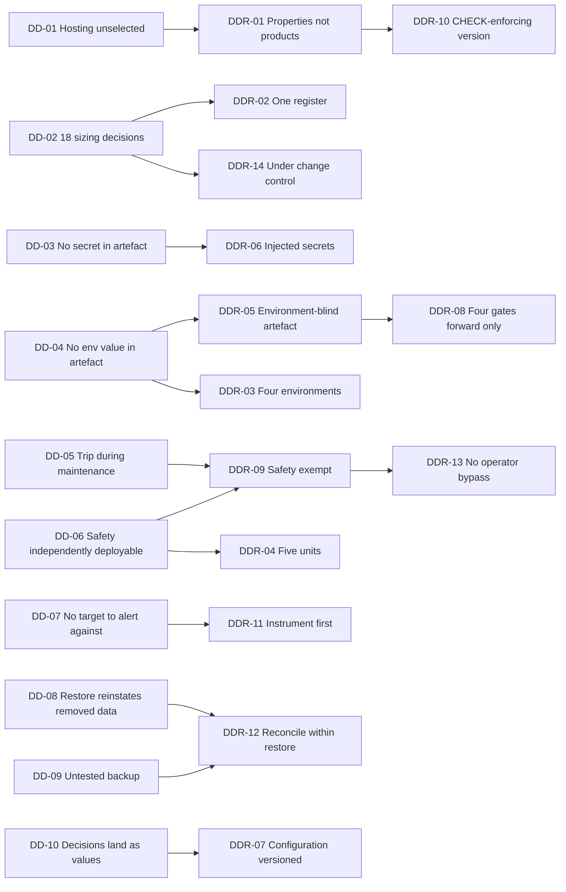
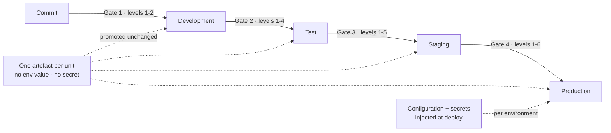
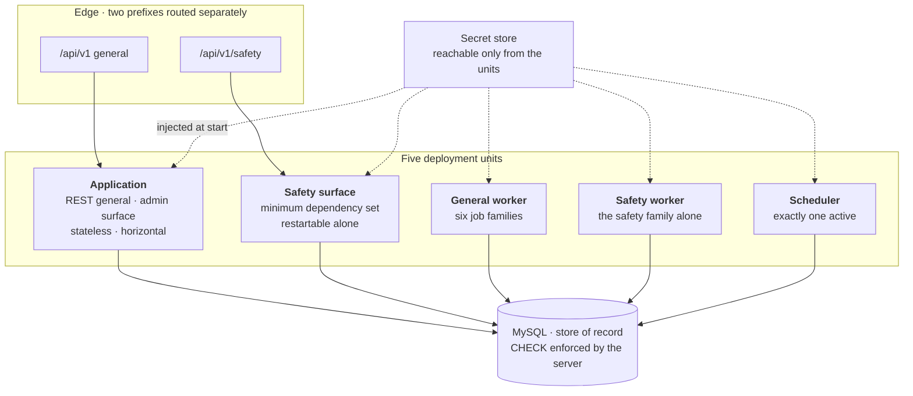

# CMP-DOC-19 — DevOps / Deployment Documentation

**Carpool Mobility Platform (CMP)**

---

# 0. Document Control

## 0.1 Document Metadata

| Field | Value |
|---|---|
| Document ID | CMP-DOC-19 |
| Document Name | DevOps / Deployment Documentation |
| Short Name | DEVOPS |
| Project Name | Carpool Mobility Platform |
| Project Code | CMP |
| Version | 0.1 |
| Status | Draft |
| Date | 2026-08-17 |
| Author | DevOps Engineer (AI-assisted) |
| Reviewer | [TBD] |
| Approver | Project Owner |
| Classification | Internal |
| Brand | TBD |
| Previous Version | None (initial issue) |
| Predecessor Documents | CMP-DOC-01 … CMP-DOC-18, **all Draft, none approved** (CMP-DOC-09 at v0.2, the remainder at v0.1) |
| Related Documents | `00_Project_Control/README.md`, `Documentation_Index.md`, `Documentation_Status.md`, `Document_Change_Log.md`, `Glossary.md`, `Master_Traceability_Matrix.md` |
| Successor Documents | CMP-DOC-20 (Traceability & Release) |

## 0.2 Revision History

| Version | Date | Author | Change | Status |
|---|---|---|---|---|
| 0.1 | 2026-08-17 | DevOps Engineer (AI-assisted) | Initial issue. Specifies deployment as **properties independent of any provider**: the consolidated sizing register, environments and promotion, deployment topology and units, configuration, secret custody, the build and release pipeline, client build and distribution, database operations, observability and alerting, availability and the safety exception, incident response, what cannot be decided, and provisioning without a provider. Issues 208 statements (`OPS-001` … `OPS-208`). | Draft |

## 0.3 Distribution List

| Role | Purpose |
|---|---|
| Project Owner | Approval authority; **the 18 sizing decisions in §4 are blocked on decisions that are theirs** |
| **DevOps Engineer** | Authoring and ownership |
| Solution Architect | The logical topology this document deploys (CMP-DOC-07 §11) |
| Backend Lead | §6, §7, §9, §12 |
| Software Architect — Android | §10 |
| Database Engineer | §11 |
| Security Analyst | §8, §14 |
| QA Analyst | §9 build gates and §5 environments |
| Support / Safety Operations | §13, §14 |

## 0.4 Approval

| Role | Name | Signature | Date |
|---|---|---|---|
| Author | DevOps Engineer (AI-assisted) | — | 2026-08-17 |
| Reviewer | [TBD] | — | — |
| Approver | Project Owner | — | — |

> **This document is NOT approved.** It is issued at version 0.1 with status `Draft`
> for Project Owner review.

## 0.5 Purpose of This Document

Eighteen documents have specified what the Carpool Mobility Platform must do and how it
must be built. **Sixteen obligations across nine of them fall due here**, and every one of
them is a thing that only exists at deploy time: a secret store, a backup regime, an
isolated worker family, a routing rule, an instrumentation point, a procedure.

This document specifies them. It also confronts the position the chain has arrived at,
which is unusual and worth stating at the outset.

**Every preceding document could specify structure without numbers.** An architecture is
still an architecture with the instance count unset; a schema is still a schema without a
partitioning boundary. Deployment is where that stops being true. Provisioning *is*
numbers — instance counts, pool sizes, backup frequencies, alert thresholds, storage
volumes — and this document has none of them:

| Blocked input | Position |
|---|---|
| 69 quality targets | Unset — `GAP-012`, pending `BAD-DEC-018` |
| Launch scale | Unstated — `GAP-016` |
| 11 sizing decisions from CMP-DOC-07 §11.2 | Deferred here — `GAP-014` |
| 7 sizing decisions from CMP-DOC-11 §14.5 | Deferred here |
| Hosting provider | **Unselected** — `BAD-DEP-009` |
| Six further suppliers | **Unselected** — `BAD-DEP-004` … `BAD-DEP-008` |

The document's answer is not to guess and not to stop. It specifies **deployment
properties that hold whatever the provider and whatever the size**, consolidates the 18
sizing decisions into one register that can be executed the day the figures arrive, and
states plainly which of its own obligations it cannot complete.

## 0.6 Boundaries — What This Document Does Not Specify

| Out of scope | Owner |
|---|---|
| Application, domain and interface design | CMP-DOC-07 … CMP-DOC-12 |
| Security controls that live in the application | CMP-DOC-13 |
| Test content, coverage and obligations | CMP-DOC-18 |
| **Release readiness reporting and traceability status** | **CMP-DOC-20** |
| Commercial terms with any supplier | Project Owner |
| Organisational structure, on-call rota, staffing | Project Owner |

### 0.6.1 No Provider Is Named

**No hosting provider, cloud platform, managed service, container runtime, orchestrator,
pipeline product, secret store product, monitoring product or alerting product is named
anywhere in this document.** `BAD-DEP-009` records hosting as unselected. Naming a
product here would take a supplier decision that is the Project Owner's, and would do it
implicitly — which is worse than doing it openly.

Every statement is therefore written as a **property the deployment must have**, verifiable
against whatever is eventually selected. Where a property cannot be stated without a
product, the statement says so.

### 0.6.2 No Figure Is Invented

**No instance count, pool size, backup frequency, retention period, alert threshold,
storage volume, cost ceiling, timeout, replica count or capacity figure appears in this
document.** Every one of them is blocked by `GAP-012` or `GAP-016`. §4 names all 18 as
decisions with their blockers; §15 names what follows from their absence.

### 0.6.3 Two Procedures This Document Owes and Cannot Complete

CMP-DOC-11 and CMP-DOC-13 place two procedures on this document. Both are specified
structurally in §11 and §14, and **neither can be completed**, because each needs a
decision that does not exist. This is stated where each appears and again in §15.

## 0.7 Inputs to This Document

| Source | What is taken |
|---|---|
| CMP-DOC-07 §11 | The logical topology and the 11 sizing decisions |
| CMP-DOC-08 §13, §14 | The client build rules and 9 measurement points |
| CMP-DOC-09 §11, §16 | The work subsystem, job families, observability |
| CMP-DOC-10 §12 | The two interface prefixes and their independence |
| CMP-DOC-11 §14.5, §16, §17 | 7 sizing decisions, grants, backup and recovery structure |
| CMP-DOC-13 §11, §13, §17 | Secret inventory, rotation, transport, incident response |
| CMP-DOC-14 §11 | Provider credential custody, verification queue |
| CMP-DOC-15 §15.3 | The four instrumentation points |
| CMP-DOC-16 §9 | Channel credentials, notification queue |
| CMP-DOC-17 §9 | The administrative surface and partial maintenance |
| CMP-DOC-18 §6.3, §16 | Four build gates, environment and data rules |
| CMP-DOC-05, CMP-DOC-06 | `NFR-023`–`NFR-039`, `NFR-107`–`NFR-124`, `SRS-REQ-173`–`SRS-REQ-184` |

## 0.8 Qualifications on This Document

### 0.8.1 Source

Every statement derives from a predecessor document, from the control repository, or is
marked as originating here (§17.6). Nothing derives from an assumption about how similar
platforms are usually deployed.

### 0.8.2 Qualification 1 — Eighteen Unapproved Predecessors

CMP-DOC-01 … CMP-DOC-18 are all at status `Draft`. Deployment specified against an
unapproved chain may need to change when the chain is baselined. Recorded as `CC-020` and
`OPS-RISK-01`.

### 0.8.3 Qualification 2 — This Document Cannot Be Executed as Written

**FACT, and the most important thing on this page.** A deployment cannot be provisioned
from properties alone. Somebody must eventually choose an instance size. This document
specifies everything that can be specified without that choice and **names the 18 places
where a number must be supplied before anything runs**. It is a complete specification of
a deployment's required properties and an incomplete specification of a deployment.

Treating it as the latter — provisioning from it directly — means the 18 decisions get
taken silently by whoever provisions first, which is exactly what `AR-07` of CMP-DOC-07
warned against.

### 0.8.4 Qualification 3 — Six Unselected Suppliers

`BAD-DEP-004` (payment), `BAD-DEP-005` (identity verification), `BAD-DEP-006` (OTP/SMS),
`BAD-DEP-007` (email), `BAD-DEP-008` (distribution) and `BAD-DEP-009` (hosting) are all
unselected. Credential custody is specified for each (§8) **without naming any of them**,
which is possible because custody is a property of the platform, not of the supplier.

## 0.9 Statement Classification Convention

As `README.md` §9.1 of the control repository. Markers: **FACT**, **ASSUMPTION**, **BUSINESS DECISION REQUIRED**,
**TECHNICAL DECISION REQUIRED**, **OPEN QUESTION**, **TBD**, **FUTURE CONSIDERATION**,
**RECOMMENDATION**.

## 0.10 Identifier Conventions

| Prefix | Element | Section |
|---|---|---|
| `OPS-nnn` | **Traceable deployment specification statement** | §4–§16 |
| `DDR-nn` | Deployment Decision Record | §3 |
| `DD-nn` | Deployment driver | §2 |
| `OPS-ASM-nn` | Assumption | §18.1 |
| `OPS-RISK-nn` | Risk | §18.2 |
| `OPS-OQ-nn` | Open Question | §18.3 |

> **§20 of the Master Documentation Control Prompt allocates no prefix to this
> document.** `OPS-` is adopted here on the same basis as `UX-` was adopted by CMP-DOC-12
> (`CC-014`): the chain's convention is one prefix per document for traceable statements,
> and this document follows it. `DEP-` was rejected because `BAD-DEP-nnn` already denotes
> a dependency in CMP-DOC-01 and the two would collide in any automated check. Recorded
> as `CC-020`.

## 0.11 Table of Contents

| § | Title |
|---|---|
| 0 | Document Control |
| 1 | Executive Summary |
| 2 | Deployment Drivers |
| 3 | Deployment Decisions |
| 4 | The Consolidated Sizing Register |
| 5 | Environments and Promotion |
| 6 | Deployment Topology and Units |
| 7 | Configuration |
| 8 | Secrets and Credential Custody |
| 9 | Build and Release Pipeline |
| 10 | Client Build and Distribution |
| 11 | Database Operations |
| 12 | Observability and Alerting |
| 13 | Availability, Maintenance and the Safety Exception |
| 14 | Incident Response |
| 15 | What This Document Cannot Decide |
| 16 | Provisioning Without a Provider |
| 17 | Traceability |
| 18 | Assumptions, Risks and Open Questions |
| 19 | Acceptance Criteria for This Document |
| 20 | Statistics and Recommendations |
| A | Appendix A — Statement Index |
| B | Appendix B — Decision Index |
| C | Appendix C — Sizing Register Source Reference |

---

# 1. Executive Summary

## 1.1 What This Document Delivers

| Element | Count |
|---|---|
| Deployment drivers | 10 |
| **Deployment Decision Records** | **14** |
| Deployment specification statements | **208** (`OPS-001` … `OPS-208`) |
| **Obligations discharged from predecessors** | **16**, from 9 documents |
| **Sizing decisions consolidated** | **18**, from 2 documents |
| Environments specified | 4 |
| Deployment units | 5 |
| Procedures specified | 6 |
| — of which cannot be completed | **2** |
| **Providers or products named** | **0** |
| **Capacity, threshold or sizing figures stated** | **0** |

## 1.2 Deployment in One Paragraph

Five deployment units — application, safety surface, general workers, safety workers,
scheduler — are provisioned into four environments, from one artefact per unit that
carries no environment value and no secret. Configuration and secrets arrive at deploy
time, from a store the platform reaches over a path nothing else can. The database is the
store of record, deployed at a version that enforces its own constraints, backed up and
restore-tested, with the restore reconciled against retention before it counts as
complete. Observability exists from first release, not because anything is being watched
against a threshold — there are no thresholds — but because the thresholds cannot be set
until something has been measured. Maintenance may suspend everything except safety.
Eighteen sizing decisions are consolidated into one register, each naming what it needs;
none is guessed. Two of the six procedures this document owes cannot be completed, and §15
says which and why.

## 1.3 The Four Decisions That Shape Everything Else

| DDR | Decision | Why it dominates |
|---|---|---|
| **`DDR-01`** | **Every statement is a property, not a product.** No provider, service or tool is named. | `BAD-DEP-009` leaves hosting unselected. A specification written around a product cannot be reviewed before the product is chosen, and choosing implicitly is still choosing. Properties survive the selection. |
| **`DDR-02`** | **One consolidated sizing register**, 18 decisions, each naming its blocking input. | CMP-DOC-07 deferred 11 and CMP-DOC-11 deferred 7. Left in two lists in two documents they get resolved by whoever provisions first, silently and differently. |
| **`DDR-05`** | **The artefact is environment-blind.** One build promotes unchanged through every environment; configuration and secrets are injected. | `NFR-108`, `MOB-013`, `SEC-163`. A rebuild per environment means the thing tested is not the thing released, and it puts a secret inside an artefact. |
| **`DDR-09`** | **Safety is exempt from every operational convenience** — maintenance, scaling policy, rate limiting, shared worker capacity. | `NFR-025`, `ADM-118`, `BE-196`, `ARCH-143`. Four documents made safety independently deployable. Deployment is the only place that independence can be lost, and it would be lost quietly. |

## 1.4 The Deployment Burden, Measured

| Measure | Value |
|---|---|
| Obligations placed on this document by predecessors | **16** |
| Sizing decisions inherited | **18** |
| — blocked by `GAP-012` (unset quality targets) | 11 |
| — blocked by `GAP-016` (unstated launch scale) | 3 |
| — blocked by `BAD-DEC-021` (unset retention periods) | 2 |
| — blocked by an open architecture question | 1 |
| — blocked by an unselected supplier | 1 |
| Secrets in the inventory (`SEC-165`) | 5 classes |
| Unselected suppliers whose credentials must be custodied | 6 |
| Job families requiring isolation (`BE-204`) | 2 |
| Instrumentation points required from first release | 4 + 9 + 5 |

## 1.5 What This Document Could Not Settle

| Matter | Position |
|---|---|
| All 18 sizing decisions | §4 — `GAP-012`, `GAP-016`, `BAD-DEP-009` |
| Alert thresholds | §12 — `BE-206`; the measurements exist, the thresholds do not |
| The restore-versus-retention procedure | §11.4 — **structure specified, cannot be completed**: retention periods are unset |
| The incident response procedure | §14 — **structure specified, cannot be completed**: no owner exists (`SEC-OQ-07`) |
| Secret rotation periods | §8.4 — `SEC-171`, `[TBD – Business Decision Required]` |
| Hosting and five other suppliers | `BAD-DEP-004` … `BAD-DEP-009` |

---

# 2. Deployment Drivers

| ID | Driver | Source | Consequence |
|---|---|---|---|
| `DD-01` | Hosting is unselected and five other suppliers with it. | `BAD-DEP-009` | `DDR-01`: properties, never products. |
| `DD-02` | Eighteen sizing decisions arrive here from two documents. | CMP-DOC-07 §11.2, CMP-DOC-11 §14.5 | `DDR-02`: one register, each naming its blocker. |
| `DD-03` | No secret may exist in source, an artefact, an image or a log. | `SEC-163` | `DDR-06`: injection at deploy time, from a store. |
| `DD-04` | Environment-varying configuration must not be in the artefact. | `NFR-108`, `SRS-REQ-184` | `DDR-05`: one environment-blind artefact. |
| `DD-05` | The platform must remain able to execute an active trip during maintenance. | `NFR-025` ‡ | `DDR-09`: safety exempt from maintenance. |
| `DD-06` | Four documents made the safety surface independently deployable. | `ARCH-143`, `BE-198`, `API-163`, `ADM-118` | `DDR-09`: the independence is realised or it is lost. |
| `DD-07` | Every quality target is unset, so nothing can be alerted against. | `GAP-012`, `BE-206` | `DDR-11`: instrument first, threshold later. |
| `DD-08` | A restore can reinstate data that retention removed. | `DB-230` ‡ | `DDR-12`: reconciliation is part of restore, not after it. |
| `DD-09` | An untested backup is not a backup. | `DB-225` | `DDR-12`: restore-testing is scheduled, not occasional. |
| `DD-10` | Business decisions will land as configuration values, not releases. | `SRS-REQ-173`, `NFR-109` | `DDR-07`: configuration is a first-class deployment object. |

---

# 3. Deployment Decisions

Each decision records its context, the alternatives considered, and its consequences —
positive (✔) and negative (✘).

## 3.1 `DDR-01` — Properties, Never Products

| Field | Content |
|---|---|
| **Context** | `BAD-DEP-009` leaves hosting unselected; `BAD-DEP-004` … `BAD-DEP-008` leave five more suppliers unselected. This document must be reviewable now. |
| **Decision** | **Every statement specifies a property the deployment must have, verifiable against any provider. No hosting platform, managed service, runtime, orchestrator, pipeline, secret store, monitoring or alerting product is named.** |
| **Alternatives** | *(a)* Name a likely provider and mark it provisional — rejected: a provisional choice in a specification is a choice, and it would be inherited by everything downstream. *(b)* Write nothing until selection — rejected: the properties are knowable now and most of them constrain the selection. |
| **Consequences** | ✔ The document is reviewable and remains valid after selection. ✔ It becomes an input to supplier selection rather than an output of it. ✘ It cannot be executed directly; a provisioning document must follow. ✘ Some statements are less precise than they would be with a product in hand. |

## 3.2 `DDR-02` — One Consolidated Sizing Register

| Field | Content |
|---|---|
| **Context** | CMP-DOC-07 §11.2 deferred 11 sizing decisions here; CMP-DOC-11 §14.5 deferred 7 more. `AR-07` warned that unless they are carried as an explicit agenda they are settled implicitly by whoever provisions first. |
| **Decision** | **All 18 are consolidated into one register in §4. Each names its blocking input, its consequence if taken wrongly, and the document it came from. None is resolved here and none is estimated.** |
| **Alternatives** | *(a)* Resolve them with provisional figures — rejected under §19 of the control prompt; a provisional capacity figure is an invented one. *(b)* Reference the two source lists without consolidating — rejected: two lists in two documents is how the agenda gets lost. |
| **Consequences** | ✔ The agenda `AR-07` asked for exists. ✔ Resolving `GAP-012` and `GAP-016` unblocks the register mechanically. ✘ The register is the largest open item in the chain and this document cannot close it. ✘ Anyone reading §4 expecting a deployment plan finds a list of what is missing. |

## 3.3 `DDR-03` — Four Environments

| Field | Content |
|---|---|
| **Context** | `NFR-108` requires environment-varying configuration outside the artefact. `SEC-170` requires distinct secrets per environment and no production secret in development or test. CMP-DOC-18 requires a `CHECK`-enforcing database in test and environments free of production secrets. `ARCH-OQ` on environment count was deferred here as sizing decision 9. |
| **Decision** | **Four environments are specified — development, test, staging, production — each with a stated purpose, a stated data rule and a stated secret rule. Environment *count* is a property of the promotion path, not of capacity, and is therefore decidable now; environment *size* is not and is sizing decision 9.** |
| **Alternatives** | *(a)* Defer environment count with the rest of the sizing — rejected: it is not blocked by scale, and CMP-DOC-18's gates need a promotion path to run against. *(b)* Three environments, merging staging into test — rejected: `DB-225` requires restore-testing against something production-shaped, and test carries no production-shaped data. |
| **Consequences** | ✔ The build gates in CMP-DOC-18 §6.3 have somewhere to run. ✔ Restore-testing has a target that is not production. ✘ Four environments is four times the configuration and secret surface. ✘ Staging cannot be production-shaped in volume until `GAP-016` is resolved, so its value is partial. |

## 3.4 `DDR-04` — Five Deployment Units

| Field | Content |
|---|---|
| **Context** | CMP-DOC-07 §11.1 gives a logical topology of application tier, safety tier, workers and scheduler. `ARCH-140` requires exactly one active scheduler. `ARCH-142` requires safety workers separable. `BE-198` leaves the safety deployment form to this document. |
| **Decision** | **Five deployment units are named: application, safety surface, general worker, safety worker, scheduler. Each is independently deployable and independently restartable. Whether the safety units occupy separate infrastructure is sizing decision 11 and is not decided here; that they are separate *units* is decided here and is not conditional on it.** |
| **Alternatives** | *(a)* Deploy safety within the application unit until scale justifies separation — rejected: it makes `ARCH-143` and `ADM-118` conditional on a decision nobody has taken, and the merge is easy to do and hard to undo. *(b)* One worker unit with internal prioritisation — rejected: `BE-204` requires per-family observability and `ARCH-142` requires separability; a single unit provides neither under load. |
| **Consequences** | ✔ `ARCH-143`, `BE-198`, `API-163` and `ADM-118` are all realisable without further decision. ✔ Safety capacity cannot be consumed by general work. ✘ Five units is five deployment paths and five sets of configuration. ✘ Two of the five may be very small; without `GAP-016` nobody knows whether that is wasteful. |

## 3.5 `DDR-05` — The Artefact Is Environment-Blind

| Field | Content |
|---|---|
| **Context** | `NFR-108` and `SRS-REQ-184` require environment configuration outside the artefact; `MOB-013` and `MOB-162` say the same for the client; `SEC-163` forbids a secret in any artefact. CMP-DOC-18's gates promote a tested artefact. |
| **Decision** | **One artefact is built per unit per commit and promoted unchanged through every environment. It contains no environment value, no endpoint, no credential and no secret. Everything that varies is injected at deploy time.** |
| **Alternatives** | *(a)* Build per environment — rejected: the artefact tested at gate 3 is then not the artefact released at gate 4, and every gate result becomes advisory. *(b)* Embed non-secret environment values only — rejected: `NFR-108` measures *any* environment value embedded, target zero, and the boundary between secret and non-secret configuration moves. |
| **Consequences** | ✔ What passed the gates is what runs. ✔ `NFR-108` is verifiable by inspecting one artefact. ✘ A deployment cannot run without its configuration source available, so that source becomes a dependency of every start-up. ✘ A configuration error is discovered at deploy time rather than build time. |

## 3.6 `DDR-06` — Secrets Are Injected, Never Stored With the Artefact

| Field | Content |
|---|---|
| **Context** | `SEC-163` ‡ forbids a secret in source, artefact, image, repository or log. `SEC-164` ‡ requires deploy-time supply readable only by the process needing it. `SEC-165` inventories five classes of secret. `SEC-168` makes the store this document's. |
| **Decision** | **Secrets are held in a store, injected into a process at start, and readable only by that process. The store is reachable only from the platform's own deployment units (`SEC-013`). No secret is written to disk in a deployment unit, passed on a command line, or included in a deployment manifest that is itself stored.** |
| **Alternatives** | *(a)* Encrypted secrets committed alongside configuration — rejected: `SEC-163` says repository, and an encrypted secret in a repository is a secret in a repository plus a key management problem. *(b)* Environment variables set by an operator at deploy — rejected: it puts the secret in an operator's shell history and makes rotation manual. |
| **Consequences** | ✔ `SEC-163`, `SEC-164`, `SEC-013` all hold structurally. ✔ Rotation becomes a store operation rather than a redeploy. ✘ The store is a hard dependency of every start-up and its own availability matters. ✘ The store must itself be provisioned before anything else, which is a bootstrapping problem this document names and does not solve (`OPS-OQ-04`). |

## 3.7 `DDR-07` — Configuration Is a Deployment Object With a History

| Field | Content |
|---|---|
| **Context** | `SRS-REQ-173` ‡ requires every undecided business value to be configuration. Seventeen business decisions are open and will land as values. `SRS-REQ-183` requires each change recorded with author, time and prior value. `SRS-REQ-182` ‡ forbids configuration altering absolute-rule behaviour. |
| **Decision** | **Configuration is versioned, changed through the same reviewed path as code, and every change carries author, time and prior value. Policy configuration bearing business values is distinguished from infrastructure configuration bearing environment values, and only the former is operator-changeable at runtime.** |
| **Alternatives** | *(a)* One configuration space — rejected: an operator able to change a database endpoint in order to change a fare parameter is an operator able to change a database endpoint. *(b)* Configuration edited directly in the running environment — rejected: `SRS-REQ-183` requires a prior value, which needs a record that a direct edit does not produce. |
| **Consequences** | ✔ A business decision lands as a reviewed configuration change, not a release. ✔ `SRS-REQ-183` holds without a bespoke mechanism. ✘ Two configuration spaces to secure. ✘ An urgent parameter change is slower than editing a value in place, which is the point and will be resented. |

## 3.8 `DDR-08` — Four Gates, Promotion Only Forward

| Field | Content |
|---|---|
| **Context** | CMP-DOC-18 §6.3 specifies four build gates — commit, merge, pre-release, release — each running every level below it, none bypassable (`TC-054`). CMP-DOC-18 places the obligation to provide them here. |
| **Decision** | **The pipeline realises the four gates exactly as CMP-DOC-18 specifies them. An artefact enters an environment only by promotion from the environment below. No deployment path exists that skips a gate, and no person holds a bypass.** |
| **Alternatives** | *(a)* An emergency path skipping gates 1–3 — rejected: `TC-054` says no gate is bypassable, and an emergency path is used in exactly the circumstances where the gates matter most. *(b)* Allow direct deployment to test — rejected: it produces a test environment whose contents nobody can account for. |
| **Consequences** | ✔ `TC-053` and `TC-054` hold. ✔ Every running artefact has a known gate history. ✘ A genuine emergency is slower. ✘ Pressure to add a bypass will recur; `OPS-RISK-03` records it and `OPS-105` refuses it in advance. |

## 3.9 `DDR-09` — Safety Is Exempt From Every Operational Convenience

| Field | Content |
|---|---|
| **Context** | `NFR-025` ‡ requires an active trip to remain executable during planned maintenance. `ADM-118` requires safety handling during maintenance of everything else. `ARCH-143` makes the safety surface restartable independently. `BE-196` and `SEC-180` exempt safety from rate limiting. `API-163` separates the safety prefix. |
| **Decision** | **No maintenance action, scaling policy, deployment freeze, rate limit, quota or shared-capacity arrangement shall apply to the safety units. Maintenance of the application unit shall not suspend the safety unit, the safety worker, or trip execution.** |
| **Alternatives** | *(a)* Coordinate maintenance windows so safety is briefly affected at low-traffic times — rejected: `NFR-025` is integrity-critical and admits no window. *(b)* Treat safety as exempt by convention — rejected: a convention is what is abandoned during the first difficult maintenance. |
| **Consequences** | ✔ Four predecessor obligations are discharged by one arrangement. ✔ `NFR-025` becomes demonstrable rather than aspirational. ✘ Every maintenance procedure is more complex, because it must be partial. ✘ A change touching shared domain code cannot be deployed to the application unit alone; §13.3 states how this is handled. |

## 3.10 `DDR-10` — The Database Version Is a Deployment Constraint, Not a Preference

| Field | Content |
|---|---|
| **Context** | `DB-085` requires a MySQL version enforcing `CHECK` constraints; CMP-DOC-11 and CMP-DOC-18 both place this obligation here. `TC-047` verifies enforcement by attempting a violating write. `TC-211` records that without it `TC-096` verifies nothing. |
| **Decision** | **Every environment, including development, deploys a database version that enforces `CHECK` constraints. This is verified at deployment by attempting a violating write, not by reading a version string.** |
| **Alternatives** | *(a)* Require it in production only — rejected: the seat invariant would then be unverifiable everywhere it is actually tested. *(b)* Assert the version from configuration — rejected: a version string is a claim and `TC-047` requires a demonstration. |
| **Consequences** | ✔ `DB-085`, `TC-047` and `TC-211` all hold in every environment. ✔ A misconfigured environment fails at deploy rather than at the first concurrency test. ✘ It constrains provider selection, which is a genuine constraint and is stated as one in §16. |

## 3.11 `DDR-11` — Instrument First, Threshold Later

| Field | Content |
|---|---|
| **Context** | `BE-206` records alert thresholds as `[TBD – Technical Decision Required]` and says the measurements exist so thresholds can later be set against real data. `NFR-113`–`NFR-115` and `GPS-195` require instrumentation from first release. `TC-196` requires the five unmeasurable categories measured, never reported as passing. |
| **Decision** | **All required instrumentation exists from first release. No alert threshold is set here, and no default threshold is adopted. An alert with no threshold is not created; the measurement is collected and reported.** |
| **Alternatives** | *(a)* Set provisional thresholds and tune them — rejected: a provisional threshold is an invented target under §19, and provisional thresholds outlive the provisional. *(b)* Defer instrumentation until targets exist — rejected: the targets are meant to be set *from* the instrumentation, so this deadlocks. |
| **Consequences** | ✔ The targets can be set from observation, which is what `NFR-113` and `GPS-195` intend. ✔ Nothing is measured against a number nobody chose. ✘ **From first release until targets are set, the platform is instrumented and unalerted.** §12.4 states this plainly and it is `OPS-RISK-05`. |

## 3.12 `DDR-12` — A Restore Is Not Complete Until Retention Has Been Re-Applied

| Field | Content |
|---|---|
| **Context** | `DB-230` ‡ requires that restoring a backup not reinstate personal data that retention removed. `SEC-224` requires the procedure and requires a restore to be incomplete until it has run. `DB-229` ‡ puts backups in scope for the same protection rules as the live database. |
| **Decision** | **The restore procedure includes retention reconciliation as a step within it, not as a follow-up task. A restored environment is not returned to service until reconciliation has run and recorded its outcome.** |
| **Alternatives** | *(a)* Reconcile after service is restored — rejected: the window between restore and reconciliation is precisely when the reinstated data is live. *(b)* Retain backups shorter than the shortest retention period — rejected: it would set a retention period by implication, and the periods are unset. |
| **Consequences** | ✔ `DB-230` and `SEC-224` hold by construction. ✔ Recovery time explicitly includes reconciliation, so `NFR-039` is measured honestly. ✘ Recovery is slower than a restore. ✘ **The procedure cannot be completed** — reconciliation needs the retention periods, which are unset; §11.4 and §15. |

## 3.13 `DDR-13` — No Operator Path Around the Application

| Field | Content |
|---|---|
| **Context** | CMP-DOC-17 places the obligation that no operator access route bypass the application layer. `BE-075` and `ADM-002` make administrative ORM access and model binding non-suppressible structural rules. `DB-119`–`DB-122` separate privileges by database account. |
| **Decision** | **No deployment provides an operator with a database client, a shell on a deployment unit, or any route to data other than the administrative surface. Break-glass database access exists as a named, evidenced procedure under §14 and confers no application capability.** |
| **Alternatives** | *(a)* Provide read-only database access for support — rejected: it reads personal data with no evidential record, which `ADM-178` and `ADM-179` require. *(b)* Provide no emergency access at all — rejected: a genuine outage may need it, and an unspecified path is used anyway when one is needed. |
| **Consequences** | ✔ CMP-DOC-17's obligation is discharged and `TB-2` remains defended in deployment. ✔ Every operator read of personal data stays evidenced. ✘ Diagnosis of a data problem is harder and slower. ✘ The break-glass procedure must be specified, exercised and audited, and §14.4 records that its authorising role does not yet exist. |

## 3.14 `DDR-14` — The Sizing Register Is Maintained Under Change Control

| Field | Content |
|---|---|
| **Context** | The 18 decisions will be resolved at different times as `GAP-012` and `GAP-016` are answered piecemeal. `DDR-02` puts them in one place; nothing yet keeps them there. |
| **Decision** | **Resolving a sizing decision requires updating §4 and the source document that deferred it, in the same change. A decision resolved in provisioning and not recorded here is a documentation defect.** |
| **Alternatives** | *(a)* Let the register go stale once provisioning begins — rejected: it then records the questions and not the answers, which is worse than nothing. *(b)* Move ownership to CMP-DOC-20 — rejected: CMP-DOC-20 reports status; it does not own deployment decisions. |
| **Consequences** | ✔ The register stays the authority. ✔ CMP-DOC-07 §11.2 and CMP-DOC-11 §14.5 cannot silently diverge from it. ✘ It is process, and process decays without an owner; `OPS-OQ-08` asks who owns it. |

## 3.15 Driver to Decision Map

---

# 4. The Consolidated Sizing Register

## 4.1 Sources

**FACT, measured.** Two documents deferred sizing decisions to this one.

| Source | Section | Decisions | Blocked by |
|---|---|---|---|
| CMP-DOC-07 SAD | §11.2 | 11 | `GAP-012`, `BAD-DEP-009` |
| CMP-DOC-11 DATABASE | §14.5 | 7 | `GAP-016` |
| | **Total** | **18** | |

| ID | Statement | Src |
|---|---|---|
| `OPS-001` | The 18 decisions above shall be consolidated into one register. | `DDR-02`, `AR-07` |
| `OPS-002` | Each shall retain its source document, its section and its blocking input. | `DDR-02` |
| `OPS-003` | Each shall record what happens if it is taken wrongly, so that its urgency is visible. | `DDR-02` |
| `OPS-004` | The register shall be the authority; the two source lists are references into it. | `DDR-02`, `DDR-14` |
| `OPS-005` | **No decision in the register shall be resolved by estimate, by convention or by a provider default.** | `DDR-02`, §0.6.2 |
| `OPS-006` | A decision resolved during provisioning and not recorded here shall be a documentation defect. | `DDR-14` |

## 4.2 The Eighteen

| # | Decision | From | Blocked by | If taken wrongly |
|---|---|---|---|---|
| 1 | Application tier instance count and scaling trigger | DOC-07/1 | `NFR-041`, `NFR-042` | Capacity that cannot be shown adequate or excessive |
| 2 | Worker pool sizes, general and safety | DOC-07/2 | `NFR-072`, `NFR-073` | Safety work delayed behind capacity it was meant to be isolated from |
| 3 | Database tier and capacity | DOC-07/3 | `NFR-041`–`NFR-050` | Contention on the locking path, which is where the seat invariant lives |
| 4 | Redundancy topology for the availability target | DOC-07/4 | `NFR-023` | An availability posture nobody can state |
| 5 | Backup frequency and retention | DOC-07/5 | `NFR-038`, `NFR-039` | Data loss beyond an objective that does not exist |
| 6 | Read-replica strategy for projections | DOC-07/6 | `NFR-048` | Read load on the write path |
| 7 | Evidential log growth provisioning | DOC-07/7 | `NFR-050` | An append-only log that fills its volume |
| 8 | Cost ceiling and alerting thresholds | DOC-07/8 | `NFR-145`, `NFR-149` | Third-party cost discovered from an invoice |
| 9 | Environment sizing and promotion cadence | DOC-07/9 | `NFR-108` | Environments too small to mean anything |
| 10 | Hosting provider | DOC-07/10 | **`BAD-DEP-009`** | Everything else in this register |
| 11 | Whether the safety surface needs separate infrastructure or only separate deployment | DOC-07/11 | `ARCH-OQ-006` | Safety isolation that is nominal |
| 12 | Partitioning of `op_trip_positions` | DOC-11/1 | `GAP-016` | A partitioning migration on a populated table |
| 13 | Archival boundary for `op_trip_positions` | DOC-11/2 | `SRS-REQ-093` unset | Unbounded growth of the largest table |
| 14 | Archival boundary for `led_ledger_entries` | DOC-11/3 | Entry volume, dispute window | Ledger scans that slow as the platform succeeds |
| 15 | Archival boundary for `ev_evidential_records` | DOC-11/4 | `BE-118` unset | Unbounded growth of the chained log |
| 16 | Whether search needs a dedicated read path | DOC-11/5 | `GAP-016` | Search degrading with corridor density |
| 17 | Read replica count and use | DOC-11/6 | Read-write mix, RTO | Duplicate of decision 6, resolved once |
| 18 | Buffer pool and connection sizing | DOC-11/7 | Instance class — decision 3 | A database tuned for a machine it is not on |

| ID | Statement | Src |
|---|---|---|
| `OPS-007` | Decisions 6 and 17 are the same decision reached from two documents and shall be resolved once. | `NFR-048`, CMP-DOC-11 §14.5 |
| `OPS-008` | Decision 18 depends on decision 3 and cannot precede it. | CMP-DOC-11 §14.5 |
| `OPS-009` | Decision 10 blocks the register; every other decision is expressed against infrastructure that has not been selected. | `BAD-DEP-009` |
| `OPS-010` ‡ | Decisions 12 to 15 govern the four tables that grow without bound, and deciding them on a populated table is a migration rather than a choice. | CMP-DOC-11 §14.5, `DB-231` |

## 4.3 What Blocks What

**FACT, measured.** Each of the 18 is attributed to exactly one blocking input; the five
blockers below account for all of them.

| Blocker | Decisions | Count | Resolvable by |
|---|---|---|---|
| `GAP-012` — 69 unset quality targets | 1, 2, 3, 4, 5, 6, 7, 8, 9, 17, 18 | 11 | `BAD-DEC-018`, Project Owner |
| `GAP-016` — launch scale unstated | 12, 14, 16 | 3 | Project Owner / Product Owner |
| `BAD-DEC-021` — retention periods unset | 13, 15 | 2 | Project Owner |
| `ARCH-OQ-006` — safety infrastructure form | 11 | 1 | Solution Architect, once 1–9 are set |
| `BAD-DEP-009` — hosting unselected | 10 | 1 | Project Owner |
| | **Total** | **18** | |

| ID | Statement | Src |
|---|---|---|
| `OPS-011` | Resolving `BAD-DEC-018` unblocks 11 of the 18; `GAP-016` unblocks 3; `BAD-DEC-021` unblocks 2; the remaining two need the safety form and the hosting selection. | `GAP-012`, `GAP-016` |
| `OPS-012` | Decisions 13 and 15 are blocked by retention periods rather than by scale, and are therefore resolvable independently of `BAD-DEC-018`. | `SRS-REQ-093`, `BE-118` |
| `OPS-013` | **No decision in the register is blocked by anything this document could have decided.** | §4.2, `DDR-02` |

## 4.4 The Position This Creates

**FACT.** Eighteen sizing decisions and no figure to take any of them with.

> Every preceding document could specify its subject without numbers, because structure
> and quantity are separable in design. **They are not separable in deployment.** An
> instance count is not a property of an architecture; it is the deployment. This document
> can specify that the application tier is stateless and horizontally scalable — that is
> `ARCH-138`, already decided — and it cannot specify how many instances there are.
>
> The consequence is not that the deployment is under-specified. It is that **the
> deployment cannot be provisioned at all** until eighteen figures exist, and that
> provisioning will happen anyway, because a platform has to run. `AR-07` foresaw this.
> The register is the mechanism for making the eighteen visible when it happens.

| ID | Statement | Src |
|---|---|---|
| `OPS-014` ‡ | **This document specifies the properties of a deployment and cannot specify a deployment**, and the gap between the two is exactly the 18 decisions in §4.2. | §0.8.3, `DDR-02` |
| `OPS-015` ‡ | Provisioning shall not proceed by taking a register decision silently; each shall be recorded as taken, by whom, and against what figure. | `DDR-14`, `OPS-006` |
| `OPS-016` | A decision taken against a figure that was estimated rather than decided shall record that, so that it can be revisited when the real figure exists. | `OPS-005` |
| `OPS-017` | The register shall be reported in every release report until it is empty. | CMP-DOC-20, `OPS-004` |

## 4.5 Sizing Decisions This Document Adds

**FACT. Three, and all three are consequences of this document's own structure.**

| # | Decision | Blocked by |
|---|---|---|
| 19 | Secret store capacity, availability posture and its own bootstrapping | `BAD-DEP-009`, `OPS-OQ-04` |
| 20 | Retention of operational logs, distinct from evidential retention | `NFR-124`, `BAD-DEC-021` |
| 21 | Restore-test frequency against the recovery objectives | `NFR-038`, `NFR-039` |

| ID | Statement | Src |
|---|---|---|
| `OPS-018` | Three further sizing decisions arise from this document and are recorded above; the register therefore holds **21**. | `DDR-02` |
| `OPS-019` | Decision 19 is a bootstrapping problem: the store must exist before anything that reads it, and nothing here specifies how it is first provisioned. | `DDR-06`, `OPS-OQ-04` |
| `OPS-020` | Decision 20 is blocked by `BAD-DEC-021`, which also blocks `NFR-124`; operational log retention is not evidential retention and the two shall not be conflated. | `NFR-124`, `BE-202` |

---

# 5. Environments and Promotion

## 5.1 The Four Environments

| Environment | Purpose | Data | Secrets |
|---|---|---|---|
| **Development** | Individual work; gate 1 | Generated only | Own, distinct |
| **Test** | Gates 2 and 3; automated suites | Generated only, `CHECK`-enforcing database | Own, distinct |
| **Staging** | Gate 4 rehearsal; restore-testing; procedure exercise | Generated, production-*shaped* | Own, distinct |
| **Production** | Live service | Live | Own, never shared |

| ID | Statement | Src |
|---|---|---|
| `OPS-021` ‡ | No production secret shall exist in development, test or staging. | `SEC-170`, `TC-204` |
| `OPS-022` ‡ | No production personal data shall be copied into any other environment. | `SEC-170`, `TC-203`, `TC-206` |
| `OPS-023` ‡ | A secret present in more than one environment shall be treated as a production secret and rotated. | `SEC-176` |
| `OPS-024` ‡ | Every environment shall deploy a database version that enforces `CHECK` constraints. | `DDR-10`, `DB-085`, `TC-211` |
| `OPS-025` | Each environment shall hold its own configuration, and no environment value shall exist in an artefact. | `DDR-05`, `NFR-108`, `SRS-REQ-184` |
| `OPS-026` | Staging shall be shaped like production in topology; **it cannot be shaped like production in volume** until `GAP-016` is resolved. | `GAP-016`, §4.2/9 |
| `OPS-027` | Environment sizing is register decision 9 and is not stated here. | §4.2, `DDR-02` |
| `OPS-028` | An environment shall be reconstructible from its recorded configuration without reference to a running instance of itself. | `DDR-05`, `SRS-REQ-184` |

## 5.2 Promotion

| ID | Statement | Src |
|---|---|---|
| `OPS-029` ‡ | An artefact shall enter an environment only by promotion from the environment below it. | `DDR-08`, `TC-053` |
| `OPS-030` ‡ | The artefact promoted shall be bit-for-bit the artefact that passed the gate below. | `DDR-05`, `TC-053` |
| `OPS-031` ‡ | **No deployment path shall exist that skips a gate, and no person shall hold a bypass.** | `DDR-08`, `TC-054` |
| `OPS-032` | Each promotion shall record the artefact identity, the gate results it carries and the person who authorised it. | `NFR-119`, `TC-189` |
| `OPS-033` | A rollback shall be a promotion of a previously passing artefact, not a rebuild. | `DDR-05`, `OPS-030` |
| `OPS-034` | A rollback shall not roll back a database migration; a destructive migration requires recorded approval and no migration rewrites an evidential record. | `DB-218`, `DB-219` |
| `OPS-035` | Promotion cadence is register decision 9 and is not stated here. | §4.2, `DDR-02` |
| `OPS-036` | **The time from commit to a verified build is `[TBD – Technical Decision Required]`** — `NFR-107` is unset. | `NFR-107`, `GAP-012` |

---

# 6. Deployment Topology and Units

## 6.1 The Five Units

| Unit | Contains | Scales | Restart affects |
|---|---|---|---|
| **Application** | REST general prefix, administrative surface | Horizontally, stateless | General API and administration |
| **Safety surface** | REST safety prefix, minimum dependency set | Independently | Safety intake only |
| **General worker** | Six job families other than `safety` | Independently | Deferred work |
| **Safety worker** | The `safety` family alone | Independently | Safety dispatch |
| **Scheduler** | Time-triggered work | **Exactly one active** | Scheduled generation |

| ID | Statement | Src |
|---|---|---|
| `OPS-037` ‡ | Five deployment units shall exist, each independently deployable and independently restartable. | `DDR-04`, `ARCH-143` |
| `OPS-038` ‡ | The application unit shall hold no session state in instance memory, so that instances are interchangeable. | `ARCH-138`, `ARCH-139` |
| `OPS-039` ‡ | Exactly one scheduler instance shall be active, to prevent duplicate triggering. | `ARCH-140` |
| `OPS-040` ‡ | The `safety` job family shall run on the safety worker and shall share no capacity with any other family. | `BE-132`, CMP-DOC-09 §18.5 |
| `OPS-041` ‡ | The safety surface shall be deployable and restartable without restarting the application unit. | `ARCH-143`, `BE-191` |
| `OPS-042` | Whether the safety units occupy separate infrastructure is register decision 11; **that they are separate units is not conditional on it**. | `BE-198`, §4.2/11 |
| `OPS-043` | Each job family shall be independently drainable and independently pausable in deployment, as `BE-133` requires in design. | `BE-133` |
| `OPS-044` | Worker pool sizes are register decision 2 and are not stated here. | §4.2, `DDR-02` |

## 6.2 Routing and the Two Prefixes

| ID | Statement | Src |
|---|---|---|
| `OPS-045` ‡ | The safety prefix shall be routable independently of the general prefix, to a different unit, under a different policy. | `API-163`, CMP-DOC-10 §17.7 |
| `OPS-046` ‡ | No rate limit, quota, throttle or shared retry policy applied to the general prefix shall apply to the safety prefix. | `SEC-180`, `BE-196`, `API-172` |
| `OPS-047` ‡ | A safety call shall not be refused by an edge policy for a reason the application would not have refused it for. | `BE-196`, `SEC-180` |
| `OPS-048` | Transport shall terminate at a point where the property in `SEC-091` holds end to end; the termination point, protocol versions and cipher selection are recorded as taken here rather than assumed. | `SEC-101`, `SEC-092` |
| `OPS-049` | **Protocol versions and cipher selection are `[TBD – Technical Decision Required]`** and depend on the selected provider's capability. | `SEC-101`, `BAD-DEP-009` |
| `OPS-050` ‡ | The administrative surface shall be reachable only over routes the deployment states, and shall never be reachable by a route that bypasses the application unit. | `DDR-13`, CMP-DOC-17 §17.7 |

## 6.3 Network Reachability

| ID | Statement | Src |
|---|---|---|
| `OPS-051` ‡ | The database shall accept connections only from the five deployment units, and from no operator workstation. | `DDR-13`, `SEC-013` |
| `OPS-052` ‡ | The secret store shall accept connections only from the platform's own processes. | `SEC-013`, `SEC-168` |
| `OPS-053` ‡ | **No deployment unit shall provide an interactive shell to an operator as a matter of routine access.** | `DDR-13`, `ADM-178` |
| `OPS-054` | Distributed denial of service is a deployment concern that CMP-DOC-13 explicitly did not address (`SEC-192`); **the posture is `[TBD – Technical Decision Required]`** and depends on the selected provider. | `SEC-192`, `BAD-DEP-009` |

---

# 7. Configuration

## 7.1 The Two Configuration Spaces

| Space | Holds | Changed by | Runtime-changeable |
|---|---|---|---|
| **Policy configuration** | Business values: fare parameters, cancellation parameters, verification levels, retention periods, policy text, thresholds, tracking interval | Reviewed change, recorded | Yes, where the value permits |
| **Infrastructure configuration** | Endpoints, pool sizes, timeouts, environment identity | Deployment change only | No |

| ID | Statement | Src |
|---|---|---|
| `OPS-055` ‡ | Two configuration spaces shall exist and shall not be merged. | `DDR-07`, `SRS-REQ-173` |
| `OPS-056` ‡ | Every currently undecided business value shall be held as policy configuration, not embedded in code. | `SRS-REQ-173`, `NFR-109` |
| `OPS-057` ‡ | **No configuration value shall alter behaviour that an absolute business rule fixes.** | `SRS-REQ-182`, `NFR-104` |
| `OPS-058` ‡ | An operator with policy configuration access shall have no infrastructure configuration access. | `DDR-07`, `DDR-13` |
| `OPS-059` | Every configuration change shall record its author, its instant and its prior value. | `SRS-REQ-183`, `NFR-119` |
| `OPS-060` | Configuration shall be versioned, and a deployment shall record which version it ran with. | `DDR-07`, `SRS-REQ-179` |
| `OPS-061` | A configuration change shall be reversible to its prior value without a release. | `SRS-REQ-183`, `OPS-059` |
| `OPS-062` | Brand-bearing strings shall be configuration, because the brand is undecided. | `NFR-110`, §0.1 |

## 7.2 What Arrives as Configuration

**FACT.** CMP-DOC-06 §8.2 names nine categories of value that must be configuration
because the decisions behind them are open.

| Category | Requirement | Blocking decision |
|---|---|---|
| Fare model parameters | `SRS-REQ-174` | `FRD-GAP-005`, `FRD-GAP-013` |
| Cancellation, no-show, refund | `SRS-REQ-175` | `FRD-GAP-006`, `012`, `014` |
| Verification levels and permissions | `SRS-REQ-176` | `FRD-GAP-002`, `004`, `023` |
| Reward and wallet parameters | `SRS-REQ-177` | `FRD-GAP-026` |
| Retention periods per data category | `SRS-REQ-178` | `FRD-GAP-028` |
| Policy-bearing text, versioned | `SRS-REQ-179` | `NFR-136` |
| Alerting thresholds | `SRS-REQ-180` | `GAP-012` |
| Tracking interval, validity periods | `SRS-REQ-181` | `NFR-147` |
| Attempt counts and backoff | `BE-139`, `NOTIF-110` | Unset |

| ID | Statement | Src |
|---|---|---|
| `OPS-063` ‡ | All nine categories above shall be deployable as configuration on the first release, whether or not their values are decided. | `SRS-REQ-173`, `DDR-07` |
| `OPS-064` ‡ | **No seed or default value shall stand in for an undecided business decision** — no default fare, no default retention period, no default threshold. | `TC-209`, `DB-221` |
| `OPS-065` | Where a category has no decided value, the platform shall be deployed with the capability absent rather than with a placeholder value. | `TC-209`, `UX-219` |
| `OPS-066` | Retention period configuration shall be per data category, because `SRS-REQ-178` requires it and because §11.4 depends on it. | `SRS-REQ-178`, `DB-230` |

## 7.3 Configuration and the Absolute Rules

> **`SRS-REQ-182` is the counterweight to everything in §7.** Configuration exists to make
> change cheap. That is exactly why it must be impossible to configure away seat
> integrity, payment authority or the evidential record. The line is stated in design; the
> deployment must not provide a way around it.

| ID | Statement | Src |
|---|---|---|
| `OPS-067` ‡ | No infrastructure configuration shall disable a database `CHECK` constraint, a grant restriction or a structural check. | `SRS-REQ-182`, `DB-121` |
| `OPS-068` ‡ | No configuration shall change which database account a deployment unit connects as. | `DB-119`, `SEC-229` |
| `OPS-069` ‡ | A configuration change shall never be a route to a capability the administrative surface withholds. | `SRS-REQ-182`, CMP-DOC-17 §15 |
| `OPS-070` | Configuration that could breach `SRS-REQ-182` shall not exist rather than be guarded by review. | `SRS-REQ-182`, `TC-057` |

---

# 8. Secrets and Credential Custody

## 8.1 The Inventory

**FACT.** `SEC-165` inventories the secrets. This document custodies them.

| Class | Instances | Source |
|---|---|---|
| Database credentials | Three application accounts plus the retention privilege | `SEC-165`, `DB-119` |
| Chain key | One, escrowed | `SEC-165`, `SEC-172` |
| Column encryption keys | Versioned, rotatable | `SEC-165`, `SEC-173` |
| Provider credentials | One per selected supplier — **six unselected** | `SEC-165`, `PAY-112`, `NOTIF-130` |
| Signing keys | Client artefact signing | `SEC-165`, `MOB-168` |

| ID | Statement | Src |
|---|---|---|
| `OPS-071` ‡ | Every secret in `SEC-165` shall be held in the store and injected at deploy time. | `DDR-06`, `SEC-164` |
| `OPS-072` ‡ | **No secret shall appear in source, in a build artefact, in an image, in a repository, in a deployment manifest or in a log.** | `SEC-163`, `TC-045` |
| `OPS-073` ‡ | A secret shall be readable only by the process that requires it, and no unit shall be able to read another unit's secrets. | `SEC-164`, `DDR-06` |
| `OPS-074` ‡ | A secret shall never be transmitted to the client. | `SEC-166` |
| `OPS-075` ‡ | A secret shall never appear in a diagnostic record, a crash report or an error payload. | `SEC-167`, `NFR-123` |
| `OPS-076` | Access to a secret shall be recorded where the store supports it. | `SEC-169` |
| `OPS-077` ‡ | The chain key shall be escrowed, because losing it makes the evidential guarantee unverifiable. | `SEC-172`, `SEC-106` |
| `OPS-078` ‡ | **No secret shall be held in a backup.** | `SEC-226`, `SEC-163` |

## 8.2 Custody for Six Unselected Suppliers

**FACT.** Six suppliers are unselected. Custody is a property of the platform, so it can
be specified without knowing which supplier it applies to.

| Dependency | Supplier | Credential custody |
|---|---|---|
| `BAD-DEP-004` | Payment / UPI PSP — **unselected** | `PAY-112`: deploy time, no artefact |
| `BAD-DEP-005` | Identity verification — **unselected** | Same rule, no statement invented for it |
| `BAD-DEP-006` | OTP / SMS — **unselected** | `NOTIF-130` |
| `BAD-DEP-007` | Email — **unselected** | `NOTIF-130` |
| `BAD-DEP-008` | Distribution platform | Signing key, §10 |
| `BAD-DEP-009` | Hosting — **unselected** | The store itself, `OPS-019` |

| ID | Statement | Src |
|---|---|---|
| `OPS-079` ‡ | Provider credentials shall be supplied at deploy time and shall appear in no artefact, for every supplier without exception. | `PAY-112`, CMP-DOC-14 §17.7 |
| `OPS-080` ‡ | Channel credentials shall be supplied at deploy time and shall appear in no artefact. | `NOTIF-130`, CMP-DOC-16 §15.7 |
| `OPS-081` | **No custody arrangement specific to any named supplier is specified**, because none is selected. | `BAD-DEP-004`–`BAD-DEP-009`, `DDR-01` |
| `OPS-082` | Selecting a supplier shall not require a change to §8.1 or §8.2, only an entry in the inventory. | `DDR-01`, `SEC-165` |

## 8.3 The Store

| ID | Statement | Src |
|---|---|---|
| `OPS-083` ‡ | The store shall accept connections only from the platform's own processes. | `SEC-013`, `SEC-168` |
| `OPS-084` ‡ | No operator shall read a production secret in the course of routine work. | `DDR-13`, `SEC-169` |
| `OPS-085` | The store's own provisioning is register decision 19 and is a bootstrapping problem this document does not solve. | `OPS-019`, `OPS-OQ-04` |
| `OPS-086` | **No store product is named**; the store is specified by the properties above. | `DDR-01`, §0.6.1 |

## 8.4 Rotation and Compromise

| ID | Statement | Src |
|---|---|---|
| `OPS-087` ‡ | Rotation shall be possible for every key in `SEC-165` without data loss; **rotation periods are `[TBD – Business Decision Required]`** and none is stated. | `SEC-171`, `GAP-012` |
| `OPS-088` ‡ | Compromise of a secret shall trigger the incident response procedure in §14, and rotation of that secret shall be part of it. | `SEC-177`, `SEC-216` |

---

# 9. Build and Release Pipeline

## 9.1 The Four Gates

**Inherited unchanged from CMP-DOC-18 §6.3. This document provides them and adds none.**

| Gate | Runs | Fails on | Promotes to |
|---|---|---|---|
| 1 Commit | Levels 1–2 | Any static rule; any domain test | Development |
| 2 Merge | Levels 1–4 | Any integration, contract or constraint test | Test |
| 3 Pre-release | Levels 1–5 | Any system behaviour or concurrency test | Staging |
| 4 Release | Levels 1–6 | Any outstanding manual review | Production |

| ID | Statement | Src |
|---|---|---|
| `OPS-089` ‡ | Four gates shall exist, each running every level below it. | `TC-053`, CMP-DOC-18 §17.7 |
| `OPS-090` ‡ | A failure at any gate shall block progression, and **no gate shall be bypassable**. | `TC-054`, `DDR-08` |
| `OPS-091` ‡ | Gate 4 shall require every non-suppressible obligation passing, with no exception. | `TC-200`, `TC-021` |
| `OPS-092` ‡ | The thirteen structural rules shall run at gate 1 and shall fail the build, not warn. | `TC-037`, `MOB-167` |
| `OPS-093` ‡ | The eight non-suppressible structural rules shall have no suppression path in the pipeline configuration. | `TC-038`, `TC-021` |
| `OPS-094` | Static rules shall run in every environment's pipeline, not only in a production pipeline. | `TC-040`, `SEC-230` |
| `OPS-095` | Gate composition may change; **that a gate exists at each of the four points may not**. | `TC-055` |
| `OPS-096` | **No pipeline product is named.** | `DDR-01`, §0.6.1 |

## 9.2 Artefacts

| ID | Statement | Src |
|---|---|---|
| `OPS-097` ‡ | One artefact shall be built per unit per commit and promoted unchanged. | `DDR-05`, `OPS-030` |
| `OPS-098` ‡ | An artefact shall contain no environment value, no endpoint and no secret. | `NFR-108`, `SEC-163` |
| `OPS-099` ‡ | Failure-induction hooks shall be absent from the production artefact, verified by static analysis. | `TC-155`, `TADR-09` |
| `OPS-100` | Every artefact shall be identifiable, and the identity shall appear in the deployment record and in operational logs. | `BE-199`, `OPS-032` |
| `OPS-101` | An artefact shall be reproducible from its recorded commit, so that what ran can be rebuilt for diagnosis. | `DDR-05`, `OPS-100` |
| `OPS-102` | Dependency currency policy is `[TBD – Technical Decision Required]`; `NFR-111` requires one to exist and none is stated. | `NFR-111`, `GAP-012` |

## 9.3 Release

| ID | Statement | Src |
|---|---|---|
| `OPS-103` ‡ | A release shall record which artefact, which configuration version, which migrations and which gate results it carries. | `OPS-032`, `OPS-060` |
| `OPS-104` ‡ | **Deployment shall not report success where a migration or a start-up check failed**; a partially deployed unit is a failed deployment. | `NFR-031`, `OPS-103` |
| `OPS-105` ‡ | **No emergency path shall exist that skips a gate**, because an emergency is when the gates matter most. | `DDR-08`, `TC-054` |
| `OPS-106` | What else constitutes a release gate beyond the non-suppressible set is `[TBD – Business Decision Required]` and is the Project Owner's, per `TC-201`. | `TC-201`, `TC-OQ-01` |

---

# 10. Client Build and Distribution

| ID | Statement | Src |
|---|---|---|
| `OPS-107` ‡ | Environment-specific values shall be supplied at client build time and shall not be embedded in source. | `MOB-162`, `MOB-013` |
| `OPS-108` ‡ | The client build shall enforce the module dependency graph and fail on a violation rather than warn. | `MOB-161`, `MOB-167` |
| `OPS-109` ‡ | Layer dependency direction shall be verified by an automated build-time check. | `MOB-158`, `MOB-007` |
| `OPS-110` ‡ | The absence of business logic in the client shall be verified by build-time inspection. | `MOB-011`, `SRS-REQ-125` |
| `OPS-111` | The build shall declare the supported Android version range and device characteristics. | `MOB-164`, `NFR-093` |
| `OPS-112` | **The supported device range is `[TBD – Technical Decision Required]`** — `MOB-OQ-001` is unresolved, so `OPS-111` declares a range nobody has chosen. | `MOB-OQ-001`, `NFR-094` |
| `OPS-113` | The build shall produce a measurable artefact size. | `MOB-165`, `NFR-156` |
| `OPS-114` | **The artefact size budget is unset** — `NFR-156` has no target. | `NFR-156`, `GAP-015` |
| `OPS-115` | Distribution-platform technical requirements applicable at release shall be verified in the build. | `MOB-168`, `NFR-096` |
| `OPS-116` ‡ | The signing key shall be held in the store and shall never appear in a repository or a build log. | `SEC-163`, `SEC-165` |
| `OPS-117` | A client release shall not require a platform change, and a platform release shall not require a client release. | `MOB-131`, `SRS-REQ-011` |
| `OPS-118` | Acquisition and refresh cadence shall be adjustable without a client release, because it is configuration. | `MOB-135`, `NFR-147` |
| `OPS-119` | The nine measurement points of CMP-DOC-08 §13.1 shall be instrumented in the first release. | CMP-DOC-08 §13.1, `GAP-015` |
| `OPS-120` | **Distribution platform obligations beyond the technical are `BAD-DEP-008`'s and are not specified here**; no policy compliance claim is made. | `BAD-DEP-008`, §0.6.1 |

---

# 11. Database Operations

## 11.1 Version and Constraints

| ID | Statement | Src |
|---|---|---|
| `OPS-121` ‡ | Every environment shall deploy a database version that enforces `CHECK` constraints. | `DDR-10`, `DB-085` |
| `OPS-122` ‡ | Enforcement shall be verified at deployment by attempting a violating write, not by reading a version string. | `DB-217`, `TC-047` |
| `OPS-123` ‡ | Binary logging shall be enabled so that point-in-time recovery is possible. | `DB-224` |
| `OPS-124` ‡ | The engine shall be crash-safe. | `DB-223`, `NFR-038` |

## 11.2 Accounts and Grants

| ID | Statement | Src |
|---|---|---|
| `OPS-125` ‡ | Each deployment unit shall connect as the application account, which holds `SELECT` and `INSERT` on the evidential domain and neither `UPDATE` nor `DELETE`. | `DB-118`, `DB-119` |
| `OPS-126` ‡ | Migrations shall run under the migration account, which is the only account holding `DDL`. | `DB-215`, `DB-119` |
| `OPS-127` ‡ | **No credential permitting alteration of the evidential domain shall be available to the application in any environment, including development.** | `DB-122` |
| `OPS-128` ‡ | Grant assertion shall run at deployment and in every environment: an update on an evidential record, a delete on a ledger entry and a `DDL` statement shall each be attempted as the application account and refused by the server. | `DB-121`, `TC-048`–`TC-050` |
| `OPS-129` ‡ | A failed grant assertion shall raise an operational condition immediately and shall block the deployment. | `SEC-214`, `OPS-104` |
| `OPS-130` | The retention privilege shall be a distinct credential and shall not be held by any deployment unit at rest. | `SEC-165`, `DB-119` |

## 11.3 Backup and Restore

| ID | Statement | Src |
|---|---|---|
| `OPS-131` ‡ | Backups shall be taken and shall be restore-tested; **an untested backup is not a backup**. | `DB-225`, `DD-09` |
| `OPS-132` ‡ | A backup contains personal data and identity evidence and is in scope for the same protection and retention rules as the live database. | `DB-229`, `SEC-219` |
| `OPS-133` ‡ | A restore shall not reinstate a terminated session; restored session records shall be treated as terminated. | `SEC-225`, `NFR-054` |
| `OPS-134` | Restore testing shall include verification that the evidential chain still verifies after restore. | `SEC-228`, `SEC-111` |
| `OPS-135` | **Backup schedule, retention, storage location and residency are not stated here**; schedule and retention are register decision 5, and residency depends on `SEC-OQ-03`. | `SEC-227`, `DB-228` |
| `OPS-136` | **The recovery point and recovery time objectives are `[TBD – Business Decision Required]`**; `NFR-038` and `NFR-039` are unset, and the data tier cannot be shown to support objectives that do not exist. | `DB-226`, `DB-227`, `DB-232` |

## 11.4 The Restore-Versus-Retention Procedure

**This is one of two procedures this document owes and cannot complete.**

| Step | Content |
|---|---|
| 1 | Restore to an isolated instance, not to a serving instance |
| 2 | Identify every retention removal effective between the backup instant and the restore instant |
| 3 | Re-apply each removal to the restored data |
| 4 | Verify the evidential chain still verifies (`SEC-228`) |
| 5 | Record the reconciliation outcome |
| 6 | **Only then** return the instance to service |

| ID | Statement | Src |
|---|---|---|
| `OPS-137` ‡ | The six steps above constitute the restore procedure; reconciliation is a step within it, not a follow-up task. | `DDR-12`, `SEC-224` |
| `OPS-138` ‡ | **A restore is not complete until step 5 has recorded an outcome**, and a restored instance shall not serve before then. | `SEC-224`, `DB-230` |

> **Step 2 cannot be executed.** Identifying removals effective in a period requires
> knowing the retention periods, and all eight are unset pending `BAD-DEC-021`
> (`DB-117`, `SRS-REQ-178`). The procedure's *structure* is specified and discharges
> `DB-230` and `SEC-224`; its *content* is blocked. This is stated again at §15.2 and
> recorded as `OPS-RISK-04`.

---

# 12. Observability and Alerting

## 12.1 What Must Exist

| ID | Statement | Src |
|---|---|---|
| `OPS-139` ‡ | Every inbound operation shall carry a correlation identity through services, jobs and adapters, and that identity shall be present in every operational record. | `BE-199`, `SEC-211` |
| `OPS-140` ‡ | Logs shall be structured and shall carry correlation identity. | `BE-200` |
| `OPS-141` ‡ | **Logs shall contain no payment credential, no precise location and no contact detail**, by construction rather than by redaction. | `BE-201`, `SEC-210` |
| `OPS-142` ‡ | Operational logging shall be deployed separately from the evidential log and shall never substitute for it. | `BE-202`, `BE-105` |
| `OPS-143` ‡ | The platform shall expose a health indication that distinguishes itself from its dependencies. | `BE-203`, `NFR-034` |
| `OPS-144` | Queue depth and oldest-item age shall be observable per job family. | `BE-204`, `NFR-121` |
| `OPS-145` | Failed-job count shall be observable per family. | `BE-205` |
| `OPS-146` | The reconciliation queue depth shall be visible continuously. | `NFR-120` |
| `OPS-147` | The safety incident queue depth and oldest-item age shall be visible continuously. | `NFR-121`, `BE-138` |

## 12.2 Instrumentation Required From First Release

**FACT, measured. Eighteen measurement points across three documents, all required at
first release so that targets can be set from observation.**

| Source | Points | What |
|---|---|---|
| CMP-DOC-05 | 5 | Search success rate, zero-result searches, third-party cost per trip, cost measurement, unavailable-not-zero |
| CMP-DOC-08 §13.1 | 9 | Battery, data, memory, cold start, outbox depth, cache hit rate |
| CMP-DOC-15 §15.3 | 4 | Position volume per trip, mapping calls per trip, device consumption during trip, position age at presentation |

| ID | Statement | Src |
|---|---|---|
| `OPS-148` ‡ | All eighteen measurement points shall be instrumented in the first release carrying real users. | `NFR-113`, `GPS-195`, `TC-197` |
| `OPS-149` ‡ | Position report volume, mapping calls per trip, device consumption during a trip and position age at presentation shall each be measurable. | `GPS-191`–`GPS-194`, CMP-DOC-15 §16.7 |
| `OPS-150` ‡ | Third-party service cost attributable to each completed trip shall be measured from first release. | `NFR-115`, `NFR-150` |
| `OPS-151` ‡ | Instrumentation shall exist for the five categories CMP-DOC-18 §15.3 records as unmeasurable, so that they can be measured even though they cannot be passed or failed. | `TC-196`, CMP-DOC-18 §17.7 |
| `OPS-152` ‡ | **A measure shall be reported as unavailable rather than as zero where the behaviour it measures is unimplemented.** | `NFR-117` |

## 12.3 What Must Not Be Confused

| ID | Statement | Src |
|---|---|---|
| `OPS-153` ‡ | **A channel reporting acceptance shall never be recorded or displayed as delivery**; `Reported` is not delivery and the deployment shall not collapse the two. | `NOTIF-123`, CMP-DOC-16 §15.7 |
| `OPS-154` ‡ | Delivery shall be an attribute of a notification in operational reporting, never its existence. | `NOTIF-106`, `NOTIF-109` |
| `OPS-155` ‡ | Chain divergence and a failed grant assertion shall each raise an operational condition immediately, regardless of any threshold. | `SEC-213`, `SEC-214` |
| `OPS-156` ‡ | A failed safety job shall raise an operational condition immediately, regardless of any threshold. | `BE-138`, `NFR-030` |

## 12.4 Alerting — The Honest Position

**FACT.** Every alert threshold in the chain is unset.

| Threshold | Position |
|---|---|
| Operational thresholds generally | `NFR-122`, `[TBD-TECH]` |
| Job and queue thresholds | `BE-206`, `[TBD-TECH]` |
| Security signal thresholds | `SEC-215`, `[TBD-TECH]` |
| Cost thresholds | `NFR-149`, register decision 8 |
| Operational record retention | `NFR-124`, `[TBD-BUS]` — `BAD-DEC-021` |

> **From first release until targets exist, the platform is instrumented and largely
> unalerted.** Four conditions alert unconditionally because they need no threshold —
> chain divergence, failed grant assertion, failed safety job, and a safety queue that is
> not being drained. Everything else is measured and reported to a human, because
> `DDR-11` refuses to invent a number to alert against. This is a real exposure and it is
> `OPS-RISK-05`; it is not a gap in this document but a consequence of `GAP-012`.

---

# 13. Availability, Maintenance and the Safety Exception

## 13.1 What Is Unset

| ID | Statement | Src |
|---|---|---|
| `OPS-157` | **The availability target is `[TBD – Business Decision Required]`**; `NFR-023` is unset and no figure is stated or implied here. | `NFR-023`, `GAP-012` |
| `OPS-158` | **Maintenance window definition and its exclusion from the availability measure are `[TBD – Business Decision Required]`**; `NFR-024` is unset. | `NFR-024` |
| `OPS-159` | **The bound on time to restore service after an unplanned interruption is unset**; `NFR-026` has no figure. | `NFR-026` |
| `OPS-160` | **The bound on time to detect that a supporting service is unavailable is unset**; `NFR-036` is `[TBD-TECH]`. | `NFR-036` |
| `OPS-161` | Redundancy topology is register decision 4 and follows from `NFR-023` once set. | §4.2/4, `NFR-023` |

## 13.2 The Safety Exception

**Four predecessor documents made the safety surface independent. Deployment is where
that independence is realised or quietly lost.**

| ID | Statement | Src |
|---|---|---|
| `OPS-162` ‡ | **The platform shall remain able to execute an active trip during a planned maintenance window.** | `NFR-025`, `DDR-09` |
| `OPS-163` ‡ | Safety incident handling shall remain available during planned maintenance of non-safety capability. | `ADM-118`, CMP-DOC-17 §17.7 |
| `OPS-164` ‡ | Maintenance of the application unit shall not stop the safety surface, the safety worker or trip execution. | `DDR-09`, `ARCH-143` |
| `OPS-165` ‡ | No deployment freeze, scaling policy, quota or shared-capacity arrangement shall apply to the safety units. | `DDR-09`, `BE-196` |
| `OPS-166` ‡ | The safety worker shall have capacity that no other family can consume, per CMP-DOC-09's obligation. | `BE-132`, CMP-DOC-09 §18.5 |
| `OPS-167` ‡ | Recording a safety incident shall succeed where any non-essential dependency is unavailable, and the deployment shall not introduce a dependency that breaks this. | `BE-194`, `NFR-030` |
| `OPS-168` | The safety surface shall be verified by the same test suite in whichever deployment form is chosen. | `BE-197`, `TC-157` |

## 13.3 Deploying a Change to Shared Code

> **`DDR-09` creates a problem worth naming.** The safety surface shares domain code with
> the application (`BE-191`). A change to shared code must reach both units, and the two
> cannot be deployed simultaneously.

| ID | Statement | Src |
|---|---|---|
| `OPS-169` ‡ | Where a change affects both units, the safety unit shall be deployed **first**, so that no interval exists in which safety runs older shared code than the application. | `BE-191`, `DDR-09` |
| `OPS-170` ‡ | A change that cannot be deployed to the safety unit shall not be deployed to the application unit either. | `OPS-169`, `BE-197` |
| `OPS-171` | The interface between the two units and the database shall tolerate one version's difference, because a simultaneous deployment is not possible. | `DB-220`, `OPS-169` |
| `OPS-172` | Whether the safety units occupy separate infrastructure remains register decision 11; §13.2 holds either way. | §4.2/11, `BE-198` |

---

# 14. Incident Response

**This is the second of two procedures this document owes and cannot complete.**

## 14.1 The Structure

| Stage | Content |
|---|---|
| 1 Detect | An operational condition, a report, or a chain divergence |
| 2 Record | An evidential record of the detection, with correlation identity |
| 3 Contain | Rotate an affected secret; withdraw an affected capability |
| 4 Assess | What was reachable, by whom, for how long |
| 5 Notify | **Blocked** — obligations, recipients and timing are undetermined |
| 6 Recover | Restore per §11.4 where data is affected |
| 7 Record outcome | Closure with a recorded outcome, never without one |

| ID | Statement | Src |
|---|---|---|
| `OPS-173` ‡ | An incident response procedure shall exist, and the seven stages above are its structure. | `SEC-216`, `SEC-177` |
| `OPS-174` ‡ | Compromise of any secret shall invoke this procedure, and stage 3 shall include rotating it. | `SEC-177`, `OPS-088` |
| `OPS-175` ‡ | Every stage shall produce an evidential record, and closure without a recorded outcome shall be refused. | `BE-029`, `BE-030` |
| `OPS-176` ‡ | Withdrawing a capability during containment shall never withdraw safety capability. | `DDR-09`, `NFR-035` |
| `OPS-177` | Detection sources shall include the four unconditional operational conditions in §12.3 and §12.4. | `SEC-213`, `BE-138` |

## 14.2 Break-Glass Access

| ID | Statement | Src |
|---|---|---|
| `OPS-178` ‡ | Direct database access outside the administrative surface shall exist only as a named break-glass procedure, and shall confer no application capability. | `DDR-13`, `ADM-178` |
| `OPS-179` ‡ | Break-glass access shall be time-bounded, individually attributed and evidenced, and its use shall itself be an incident. | `NFR-119`, `ADM-179` |
| `OPS-180` ‡ | Break-glass access shall not use the application account and shall not be able to alter an evidential record. | `DB-122`, `DB-118` |
| `OPS-181` | **The role authorised to invoke break-glass does not exist**, because the administrative role set is undecided; §15.3. | `BAD-DEC-006`, CMP-DOC-17 §15 |

## 14.3 What Blocks Completion

| ID | Statement | Src |
|---|---|---|
| `OPS-182` ‡ | **Stage 5 cannot be specified.** Breach notification obligations, recipients and timing are `[TBD – Business Decision Required]` and depend on a legal position nobody has established. | `SEC-217`, `SEC-OQ-02` |
| `OPS-183` ‡ | **No owner exists for incident response.** `SEC-OQ-07` asks who owns it and remains unanswered; a procedure with no owner is a document, not a capability. | `SEC-OQ-07`, `SEC-216` |
| `OPS-184` | Fraud has no incident path here, because after eighteen documents it has no owner, no definition and no requirement. | `GAP-013`, `SEC-202` |
| `OPS-185` | Independent security review and penetration testing scope and cadence are `[TBD – Business Decision Required]`; **no claim of having been tested follows from this document**. | `SEC-218`, `TC-122` |
| `OPS-186` ‡ | The structure above discharges `SEC-216` as far as a structure can; **it does not constitute an incident response capability**, and presenting it as one would be misleading. | `SEC-216`, `OPS-183` |

---

# 15. What This Document Cannot Decide

## 15.1 The Four Categories

| Category | Count | Where |
|---|---|---|
| Sizing decisions with no figure | 21 | §4 |
| Procedures owed but not completable | 2 | §11.4, §14 |
| Suppliers unselected | 6 | §8.2 |
| Values unset that this document would otherwise state | 12 | §15.4 |

| ID | Statement | Src |
|---|---|---|
| `OPS-187` ‡ | The four categories shall be reported separately from what is specified, and none shall be presented as settled. | `TC-173`, `TC-191` |
| `OPS-188` ‡ | **No provisional figure, default or convention shall be adopted to close any of them.** | §0.6.2, `TC-199` |

## 15.2 The Two Incomplete Procedures

| Procedure | Owed by | Structure | Blocked on |
|---|---|---|---|
| Restore-versus-retention | `DB-230`, `SEC-224` | §11.4, six steps | Eight retention periods unset — `BAD-DEC-021` |
| Incident response | `SEC-216`, `SEC-177` | §14.1, seven stages | Notification obligations (`SEC-OQ-02`) and no owner (`SEC-OQ-07`) |

| ID | Statement | Src |
|---|---|---|
| `OPS-189` ‡ | Both procedures are specified structurally and **neither can be executed**; the obligations that placed them here are discharged in structure and not in capability. | `SEC-224`, `SEC-216` |
| `OPS-190` ‡ | A restore performed before retention periods exist shall record that reconciliation could not be performed, rather than record it as done. | `OPS-138`, `NFR-117` |

## 15.3 Decisions Held Elsewhere That Block Deployment

| Held decision | Blocks |
|---|---|
| `BAD-DEC-018` — quality targets | 11 sizing decisions, every alert threshold |
| `BAD-DEC-021` — retention periods | Restore reconciliation, log retention, two archival boundaries (register 13 and 15) |
| `BAD-DEC-006` — administrative role set | Break-glass authorisation, operator access design |
| `BAD-DEP-009` — hosting | The register, transport selection, denial-of-service posture |
| `GAP-016` — launch scale | Three sizing decisions |
| `SEC-OQ-02`, `SEC-OQ-03`, `SEC-OQ-07` | Notification, residency, incident ownership |

| ID | Statement | Src |
|---|---|---|
| `OPS-191` ‡ | Six held decisions block this document, and **not one of them is a technical decision anyone on the delivery side can take**. | `BAD-DEC-018`, `BAD-DEP-009` |
| `OPS-192` | The administrative role set being undecided blocks break-glass authorisation, which is the only emergency access path this document permits. | `BAD-DEC-006`, `OPS-181` |

## 15.4 Values This Document Would State and Cannot

| # | Value | Blocked by |
|---|---|---|
| 1 | Availability target | `NFR-023` |
| 2 | Maintenance window definition | `NFR-024` |
| 3 | Time to restore after interruption | `NFR-026` |
| 4 | Dependency-unavailability detection bound | `NFR-036` |
| 5 | Recovery point objective | `NFR-038` |
| 6 | Recovery time objective | `NFR-039` |
| 7 | Commit-to-verified-build bound | `NFR-107` |
| 8 | Dependency currency policy | `NFR-111` |
| 9 | Operational threshold values | `NFR-122` |
| 10 | Operational record retention | `NFR-124` |
| 11 | Secret rotation periods | `SEC-171` |
| 12 | Cryptographic cost parameters against deployed hardware | `SEC-031`, `SEC-175` |

| ID | Statement | Src |
|---|---|---|
| `OPS-193` ‡ | Twelve values that belong in a deployment specification are unset, and **none is stated, defaulted or implied here**. | §0.6.2, `GAP-012` |
| `OPS-194` | Value 12 is different in kind: it cannot be set until hardware exists, so it is blocked by `BAD-DEP-009` rather than by a business decision. | `SEC-175`, `BAD-DEP-009` |

## 15.5 What Follows

| ID | Statement | Src |
|---|---|---|
| `OPS-195` ‡ | **A deployment built from this document alone would be unsized, unalerted, and unable to complete either of its two procedures.** | `OPS-014`, `OPS-189` |
| `OPS-196` ‡ | That is a statement about the decisions, not about the specification; every gap above names the decision that closes it. | `OPS-191`, `DDR-02` |
| `OPS-197` | Nothing in §15 is discovered here. Every item was recorded by a predecessor; this document is where they all arrive at once. | §4.1, §15.3 |
| `OPS-198` ‡ | Presenting a provisioned deployment as conforming to this document, while the 21 register decisions remain unrecorded, would misrepresent it. | `OPS-015`, `TC-186` |

---

# 16. Provisioning Without a Provider

## 16.1 Constraints on Selection

**FACT.** This document names no provider, and it does constrain which providers are
acceptable. The constraints are properties already required by predecessors.

| # | Constraint | Source |
|---|---|---|
| 1 | A MySQL version that enforces `CHECK` constraints | `DB-085`, `DDR-10` |
| 2 | Binary logging for point-in-time recovery | `DB-224` |
| 3 | Distinct database accounts with separable grants | `DB-118`, `DB-119` |
| 4 | Network reachability controllable to named processes | `SEC-013` |
| 5 | A secret store readable per-process | `SEC-164` |
| 6 | Independent deployment and restart of five units | `ARCH-143` |
| 7 | Exactly one active scheduler instance | `ARCH-140` |
| 8 | Transport where `SEC-091` holds end to end | `SEC-092` |

| ID | Statement | Src |
|---|---|---|
| `OPS-199` ‡ | The eight constraints above are requirements on provider selection, not preferences. | `DDR-01`, `DB-085` |
| `OPS-200` ‡ | A provider unable to satisfy constraint 1 or constraint 3 shall be rejected, because the seat invariant and the evidential guarantee both depend on server-side enforcement. | `DB-085`, `DB-118` |
| `OPS-201` | A provider unable to satisfy constraint 6 forces the safety surface into the application unit and makes `NFR-025` undeliverable. | `ARCH-143`, `NFR-025` |
| `OPS-202` | This document is an input to supplier selection, not an output of it. | `DDR-01`, `BAD-DEP-009` |

## 16.2 What a Provisioning Document Must Add

| ID | Statement | Src |
|---|---|---|
| `OPS-203` ‡ | A provisioning specification shall follow this document once hosting is selected, and shall record each of the 21 register decisions as taken. | `OPS-015`, `DDR-14` |
| `OPS-204` | It shall name products, and shall do so against the properties in §5 to §14 rather than in place of them. | `DDR-01` |
| `OPS-205` | It shall state the deployment mechanism, the runtime and the pipeline product, none of which is decidable here. | `BAD-DEP-009`, §0.6.1 |
| `OPS-206` | It shall not restate a property specified here; a property restated in two documents diverges. | `DDR-14`, `OPS-004` |

## 16.3 Ownership

| ID | Statement | Src |
|---|---|---|
| `OPS-207` | **No owner is named for the provisioning specification**, because organisational structure is the Project Owner's and this document does not assign work to people. | §0.6, `OPS-OQ-08` |
| `OPS-208` ‡ | Until it exists, **the platform has a specified deployment and no deployment**, and `AR-07`'s warning stands: the 21 decisions will otherwise be taken by whoever provisions first. | `AR-07`, `OPS-014` |

---

# 17. Traceability

## 17.1 Upward Traceability

| Source document | Basis carried into this document |
|---|---|
| CMP-DOC-01 | `BAD-DEP-004` … `BAD-DEP-009`, six unselected suppliers |
| CMP-DOC-05 | `NFR-023`–`NFR-039`, `NFR-107`–`NFR-124`, `NFR-145`–`NFR-150` |
| CMP-DOC-06 §8.2 | The twelve configuration requirements |
| CMP-DOC-07 §11 | The logical topology and 11 sizing decisions |
| CMP-DOC-08 §13.1, §14 | Client build rules and 9 measurement points |
| CMP-DOC-09 §11, §16 | Seven job families, observability, the safety entry point |
| CMP-DOC-10 §12 | The two prefixes and their independence |
| CMP-DOC-11 §14.5, §16, §17 | 7 sizing decisions, grants, backup and recovery |
| CMP-DOC-13 §11, §13, §17 | Secret inventory, transport, incident response, restore |
| CMP-DOC-14 §11 | Provider credential custody |
| CMP-DOC-15 §15.3 | Four instrumentation points |
| CMP-DOC-16 §11 | Channel credentials and the `Reported` distinction |
| CMP-DOC-17 §9, §12 | Partial maintenance and operator access |
| CMP-DOC-18 §6.3, §16 | Four build gates, environment and data rules |

## 17.2 The Sixteen Obligations Placed Directly on This Document

**FACT, measured.** Nine predecessors place obligations on this document by name, in their
*Obligations This Document Places on Others* sections.

| # | Obligation | Source | Discharged by |
|---|---|---|---|
| 1 | Give the `safety` family isolated capacity | CMP-DOC-09 §18.5 | `OPS-040`, `OPS-166` |
| 2 | Permit the safety prefix to be routed independently of the general prefix | CMP-DOC-10 §17.7 | `OPS-045`, `OPS-046` |
| 3 | Deploy a MySQL version that enforces `CHECK` constraints | CMP-DOC-11 §18.7 | `OPS-121`, `OPS-122` |
| 4 | Write the restore-versus-retention reconciliation procedure | CMP-DOC-11 §18.7 | §11.4, `OPS-137`, `OPS-138` |
| 5 | Resolve the seven sizing decisions in CMP-DOC-11 §14.5 once launch scale exists | CMP-DOC-11 §18.7 | §4.2 decisions 12–18 |
| 6 | Provide the secret store, the incident response procedure and the restore reconciliation procedure | CMP-DOC-13 §20.7 | §8.3, §14.1, §11.4 |
| 7 | Restrict network reachability of the store to the platform | CMP-DOC-13 §20.7 | `OPS-083`, `OPS-052` |
| 8 | Supply provider credentials at deploy time and size the verification queue | CMP-DOC-14 §17.7 | `OPS-079`; sizing is register decision 2 |
| 9 | Provide the instrumentation in CMP-DOC-15 §15.3 from first release | CMP-DOC-15 §16.7 | `OPS-148`, `OPS-149` |
| 10 | Resolve position history partitioning once launch scale exists | CMP-DOC-15 §16.7 | §4.2 decision 12 |
| 11 | Supply channel credentials at deploy time and size the notification queue | CMP-DOC-16 §15.7 | `OPS-080`; sizing is register decision 2 |
| 12 | Not treat channel delivery success as notification success | CMP-DOC-16 §15.7 | `OPS-153`, `OPS-154` |
| 13 | Permit maintenance of non-safety capability without suspending safety handling | CMP-DOC-17 §17.7 | `OPS-163`, `OPS-164` |
| 14 | Not provide an operator access route that bypasses the application layer | CMP-DOC-17 §17.7 | `OPS-050`, `OPS-053`, `OPS-178` |
| 15 | Provide four build gates, a `CHECK`-enforcing database, and environments with no production secret | CMP-DOC-18 §17.7 | `OPS-089`, `OPS-121`, `OPS-021` |
| 16 | Provide instrumentation for the five unmeasurable categories from first release | CMP-DOC-18 §17.7 | `OPS-151` |

**Fourteen are discharged in full.** Obligations 5 and 10 are discharged as far as they
can be: both are conditional on launch scale, which does not exist, so each is carried in
the register with its blocker named rather than resolved. Obligations 4 and 6 are
discharged **structurally and not operationally** — §15.2 states why.

## 17.3 Configuration Requirement Coverage

| Requirement | Discharged by |
|---|---|
| `SRS-REQ-173` … `SRS-REQ-181` | `OPS-056`, `OPS-063`, §7.2 |
| `SRS-REQ-182` | `OPS-057`, `OPS-067`–`OPS-070` |
| `SRS-REQ-183` | `OPS-059` |
| `SRS-REQ-184` | `OPS-025`, `OPS-098` |

## 17.4 Downward Traceability

| Consuming document | What it must take from here |
|---|---|
| CMP-DOC-20 Traceability & Release | The 21-item sizing register (§4), the two incomplete procedures (§15.2), the twelve unset values (§15.4), and the release record content (`OPS-103`) |
| A provisioning specification, unwritten | Everything in §16 |

## 17.5 Statements Awaiting a Decision

| Statement | Awaiting |
|---|---|
| §4 entire | `BAD-DEC-018`, `GAP-016`, `BAD-DEP-009` |
| `OPS-036`, `OPS-102` | `NFR-107`, `NFR-111` |
| `OPS-049`, `OPS-054` | Provider capability — `BAD-DEP-009` |
| `OPS-087` | Secret rotation periods — `SEC-171` |
| `OPS-112`, `OPS-114` | `MOB-OQ-001`, `NFR-156` |
| `OPS-135`, `OPS-136` | `NFR-038`, `NFR-039`, `SEC-OQ-03` |
| `OPS-157` … `OPS-160` | `NFR-023`, `NFR-024`, `NFR-026`, `NFR-036` |
| `OPS-181` | Administrative role set — `BAD-DEC-006` |
| `OPS-182`, `OPS-183` | `SEC-OQ-02`, `SEC-OQ-07` |
| `OPS-190` | Retention periods — `BAD-DEC-021` |

## 17.6 Statements Originating in This Document

| Statement | Subject | Position |
|---|---|---|
| `OPS-014` | This document specifies a deployment's properties and cannot specify a deployment | **New, and the document's principal finding.** Structure and quantity are separable in design and not in deployment; no predecessor had to confront that. |
| `OPS-018` | The register holds 21, not 18 | **New.** Three further sizing decisions follow from this document's own structure — the store, log retention, restore-test frequency — and none existed upstream. |
| `OPS-169` | On a shared-code change the safety unit deploys first | **New.** Four documents made safety independently deployable; none said what to do when a change affects both, and the wrong order leaves safety on older shared code. |
| `OPS-189` | Two owed procedures are complete in structure and empty in content | **New.** Each predecessor placed one procedure here; neither could see that both would arrive blocked on decisions nobody has taken. |

## 17.7 Obligations This Document Places on Others

| Document | Obligation |
|---|---|
| **CMP-DOC-07** | Must record any resolution of its 11 sizing decisions in §4 in the same change |
| **CMP-DOC-11** | Must record any resolution of its 7 sizing decisions in §4 in the same change |
| **CMP-DOC-13** | Must record the incident response owner in `SEC-OQ-07` when one exists, since §14 cannot operate without it |
| **CMP-DOC-18** | Must not report an environment as gate-passing where `OPS-128`'s grant assertion did not run |
| **CMP-DOC-20** | Must report the 21 register decisions, open and closed, in every release report |
| **CMP-DOC-20** | Must report the two incomplete procedures as incomplete, not as specified |
| **A provisioning specification** | Must record each register decision as taken, by whom, and against what figure |

---

# 18. Assumptions, Risks and Open Questions

## 18.1 Assumptions

| ID | Assumption | If false |
|---|---|---|
| `OPS-ASM-01` | A provider satisfying the eight constraints in §16.1 exists and is commercially acceptable. | Constraint 1 or 3 fails and the seat invariant and evidential guarantee lose server-side enforcement; `OPS-200`. |
| `OPS-ASM-02` | Five deployment units are provisionable at a cost proportionate to launch scale. | Units merge, `DDR-04` weakens, and safety isolation becomes nominal. |
| `OPS-ASM-03` | A secret store can be provisioned before the units that read it. | Register decision 19 becomes a blocking bootstrapping problem; `OPS-019`. |
| `OPS-ASM-04` | `BAD-DEC-018` and `GAP-016` will be resolved before provisioning rather than after. | The 21 register decisions are taken by whoever provisions first, which `AR-07` warned against and `OPS-208` restates. |
| `OPS-ASM-05` | Deploying the safety unit before the application unit is always possible for a shared-code change. | `OPS-169` cannot hold and an interval exists where safety runs older shared code. |
| `OPS-ASM-06` | Operational logging can be deployed such that `BE-201`'s exclusions hold by construction. | Redaction becomes the mechanism, which `SEC-210` explicitly rejects. |

## 18.2 Risks

| ID | Risk | L | I | Sev | Response |
|---|---|---|---|---|---|
| `OPS-RISK-01` | Eighteen unapproved predecessors; obligations may change. | 5 | 3 | 15 | `CC-020`; `DDR-14` makes register maintenance an obligation. |
| `OPS-RISK-02` | **The 21 register decisions are taken silently during provisioning.** | 5 | 4 | 20 | `OPS-015`, `OPS-198`; §20.4 R-1. |
| `OPS-RISK-03` | A gate bypass is added under delivery pressure. | 4 | 5 | 20 | `OPS-105` refuses it in advance; `TC-054` is non-suppressible. |
| `OPS-RISK-04` | **A restore is performed and reconciliation is recorded as done when it could not be.** | 3 | 5 | 15 | `OPS-190` requires recording that it could not be performed. |
| `OPS-RISK-05` | **Instrumented and unalerted from first release**, because no threshold exists. | 5 | 4 | 20 | Four unconditional conditions in §12.3; `DDR-11` refuses invented thresholds. |
| `OPS-RISK-06` | Safety isolation is merged away for cost during provisioning. | 3 | 5 | 15 | `DDR-09`, `OPS-165`; four predecessor obligations depend on it. |
| `OPS-RISK-07` | An operator is given database access to diagnose a production problem. | 4 | 4 | 16 | `OPS-178`–`OPS-180`; break-glass exists precisely so the ad-hoc path is not created. |
| `OPS-RISK-08` | The two incomplete procedures are treated as complete because they are written down. | 4 | 4 | 16 | `OPS-186`, `OPS-189`; the obligation on CMP-DOC-20 in §17.7. |

## 18.3 Open Questions

| ID | Question | Type |
|---|---|---|
| `OPS-OQ-01` | What are the 21 sizing figures? | `[TBD – Business Decision Required]` — `BAD-DEC-018`, `GAP-016` |
| `OPS-OQ-02` | Which hosting provider? | `BAD-DEP-009` |
| `OPS-OQ-03` | What alert thresholds, and who sets them from the instrumentation? | `[TBD – Technical Decision Required]` |
| `OPS-OQ-04` | How is the secret store itself first provisioned? | `[TBD – Technical Decision Required]` |
| `OPS-OQ-05` | Who owns incident response? | `SEC-OQ-07` |
| `OPS-OQ-06` | What retention periods, so that §11.4 step 2 becomes executable? | `BAD-DEC-021` |
| `OPS-OQ-07` | Which role may authorise break-glass access? | `BAD-DEC-006` |
| `OPS-OQ-08` | Who owns the provisioning specification and the sizing register? | Work assignment |

---

# 19. Acceptance Criteria for This Document

| # | Criterion | Met |
|---|---|---|
| 1 | All 16 obligations placed directly on this document addressed | Yes — §17.2; 14 in full, 2 structurally, with the limits stated |
| 2 | All 18 inherited sizing decisions consolidated into one register | Yes — §4.2 |
| 3 | **No provider, service or product named** | Yes — §0.6.1; 0 named |
| 4 | **No capacity, threshold, sizing or timing figure stated** | Yes — §0.6.2; 0 stated |
| 5 | The four build gates provided as CMP-DOC-18 specifies them | Yes — §9.1 |
| 6 | Secret custody specified for six unselected suppliers without naming one | Yes — §8.2 |
| 7 | The safety exception realised across maintenance, routing, capacity and deployment order | Yes — §13, `OPS-169` |
| 8 | The two owed procedures specified, and their incompleteness stated rather than concealed | Yes — §11.4, §14.3, §15.2 |
| 9 | No operator route around the application layer | Yes — `DDR-13`, §14.2 |
| 10 | What cannot be decided reported as its own section | Yes — §15 |
| 11 | Every statement names a source, and every cited identifier resolves | Yes — 208 of 208 |
| 12 | Statement identifiers contiguous and unique | Yes — `OPS-001` … `OPS-208` |

---

# 20. Statistics and Recommendations

## 20.1 Document Statistics

| Measure | Value |
|---|---|
| Deployment drivers | 10 (`DD-01` … `DD-10`) |
| Deployment decisions | 14 (`DDR-01` … `DDR-14`) |
| Deployment specification statements | 208 (`OPS-001` … `OPS-208`) |
| Integrity-critical statements (‡) | 119 |
| Statements naming a source | 208 of 208 |
| Diagrams | 3 |
| **Obligations discharged** | **16**, from 9 documents |
| **Sizing register entries** | **21** (18 inherited, 3 added) |
| Environments | 4 |
| Deployment units | 5 |
| Build gates | 4 |
| Procedures specified | 6 |
| — that cannot be completed | 2 |
| Instrumentation points required at first release | 18 |
| Provider-selection constraints | 8 |
| Unset values that would otherwise be stated | 12 |
| Statements with no upstream counterpart | 4 |
| **Providers or products named** | **0** |
| **Capacity, threshold or sizing figures stated** | **0** |
| Assumptions / Risks / Open questions | 6 / 8 / 8 |
| `[TBD – Business Decision Required]` markers | 9 |
| `[TBD – Technical Decision Required]` markers | 8 |

### Statements by Section

| § | Section | Statements |
|---|---|---|
| 4 | The Consolidated Sizing Register | 20 |
| 5 | Environments and Promotion | 16 |
| 6 | Deployment Topology and Units | 18 |
| 7 | Configuration | 16 |
| 8 | Secrets and Credential Custody | 18 |
| 9 | Build and Release Pipeline | 18 |
| 10 | Client Build and Distribution | 14 |
| 11 | Database Operations | 18 |
| 12 | Observability and Alerting | 18 |
| 13 | Availability, Maintenance and the Safety Exception | 16 |
| 14 | Incident Response | 14 |
| 15 | What This Document Cannot Decide | 12 |
| 16 | Provisioning Without a Provider | 10 |
| | **Total** | **208** |

## 20.2 What Deployment Found

**Twenty-one sizing decisions and no figure to take one with.**

> Eighteen documents specified a platform without stating a number, and that was correct
> each time: an architecture, a schema, an interface and a test suite are all specifiable
> without knowing how large the thing will be. **Deployment is the first place where that
> is not true.** An instance count is not a property of a deployment; it is the
> deployment.
>
> So this document does the only thing available to it. It specifies every property the
> deployment must have — five units, four environments, four gates, one artefact, injected
> secrets, server-enforced constraints, safety exempt from everything — and it consolidates
> the twenty-one missing figures into one register that can be executed the day they
> arrive. What it cannot do is produce a deployment, and `OPS-014` says so.
>
> **Two further things arrived here that nobody upstream could see.** Both procedures this
> document owes — restore-versus-retention and incident response — are blocked, one on
> retention periods and one on an owner nobody has appointed. Each predecessor placed one
> procedure here and each reasonably assumed it would be written. Neither can be.

## 20.3 What Cannot Be Deployed, Honestly

| Item | Position |
|---|---|
| Anything at all | 21 register decisions unresolved |
| Alerting beyond four conditions | No threshold exists anywhere |
| Restore reconciliation | Retention periods unset |
| Incident response | No owner, no notification position |
| Break-glass access | No role may authorise it |
| Denial-of-service posture | Depends on the unselected provider |

## 20.4 Recommendations

| # | Recommendation | Rationale |
|---|---|---|
| R-1 | **Resolve `BAD-DEC-018` and `GAP-016` before provisioning begins, not during.** | `OPS-RISK-02` at severity 20. Eleven and five of the register decisions respectively fall out mechanically; taken during provisioning they are taken by whoever is holding the console. |
| R-2 | **Select hosting against §16.1 rather than after it.** | Constraints 1 and 3 are not negotiable — `OPS-200`. Discovering after selection that the provider cannot enforce `CHECK` constraints or separate grants would invalidate CMP-DOC-11 and CMP-DOC-13 simultaneously. |
| R-3 | **Appoint an incident response owner before first release.** | `SEC-OQ-07` has been open since CMP-DOC-13. §14 is a structure with nobody to execute it, and `OPS-186` says so rather than implying otherwise. |
| R-4 | **Instrument all 18 points in the first release even though nothing can be alerted on them.** | It is the only route out of `GAP-012`. `DDR-11` deadlocks otherwise: targets are meant to be set from data that is not being collected. |
| R-5 | **Write the provisioning specification as a separate document, not as edits to this one.** | `OPS-206`. A property and its product realisation stated in the same place diverge, and the property is the reviewable half. |
| R-6 | **Treat the sizing register as a standing agenda item until it is empty.** | `OPS-017`, `DDR-14`. `AR-07` asked CMP-DOC-07 to carry 11 decisions here; they arrived intact because they were written down. |

## 20.5 Recommendation Status

**None of the six is adopted.** Each is a `RECOMMENDATION` under §18 of the control
prompt and awaits Project Owner direction. R-1, R-2 and R-3 are the ones that block
first release.

---

# Appendix A — Statement Index

| Range | Section |
|---|---|
| `OPS-001` – `OPS-020` | The Consolidated Sizing Register |
| `OPS-021` – `OPS-036` | Environments and Promotion |
| `OPS-037` – `OPS-054` | Deployment Topology and Units |
| `OPS-055` – `OPS-070` | Configuration |
| `OPS-071` – `OPS-088` | Secrets and Credential Custody |
| `OPS-089` – `OPS-106` | Build and Release Pipeline |
| `OPS-107` – `OPS-120` | Client Build and Distribution |
| `OPS-121` – `OPS-138` | Database Operations |
| `OPS-139` – `OPS-156` | Observability and Alerting |
| `OPS-157` – `OPS-172` | Availability, Maintenance and the Safety Exception |
| `OPS-173` – `OPS-186` | Incident Response |
| `OPS-187` – `OPS-198` | What This Document Cannot Decide |
| `OPS-199` – `OPS-208` | Provisioning Without a Provider |

---

# Appendix B — Decision Index

| ID | Decision | Section |
|---|---|---|
| `DDR-01` | Properties, never products | §3.1 |
| `DDR-02` | One consolidated sizing register | §3.2 |
| `DDR-03` | Four environments | §3.3 |
| `DDR-04` | Five deployment units | §3.4 |
| `DDR-05` | The artefact is environment-blind | §3.5 |
| `DDR-06` | Secrets are injected, never stored with the artefact | §3.6 |
| `DDR-07` | Configuration is a deployment object with a history | §3.7 |
| `DDR-08` | Four gates, promotion only forward | §3.8 |
| `DDR-09` | Safety is exempt from every operational convenience | §3.9 |
| `DDR-10` | The database version is a deployment constraint | §3.10 |
| `DDR-11` | Instrument first, threshold later | §3.11 |
| `DDR-12` | A restore is not complete until retention has been re-applied | §3.12 |
| `DDR-13` | No operator path around the application | §3.13 |
| `DDR-14` | The sizing register is maintained under change control | §3.14 |

---

# Appendix C — Sizing Register Source Reference

| Register # | Source statement or section | Blocking input |
|---|---|---|
| 1 – 11 | CMP-DOC-07 §11.2, decisions 1 – 11 | `GAP-012`; decision 10 is `BAD-DEP-009` |
| 12 – 18 | CMP-DOC-11 §14.5, decisions 1 – 7 | `GAP-016`; decision 18 is register decision 3 |
| 19 | `OPS-019`, this document | `BAD-DEP-009`, `OPS-OQ-04` |
| 20 | `OPS-020`, this document | `BAD-DEC-021`, `NFR-124` |
| 21 | `OPS-131`, this document | `NFR-038`, `NFR-039` |

**Totals: 21 register entries — 18 inherited from two documents, 3 originating here.**

---

**End of CMP-DOC-19 — DevOps / Deployment Documentation, version 0.1 (Draft).**
