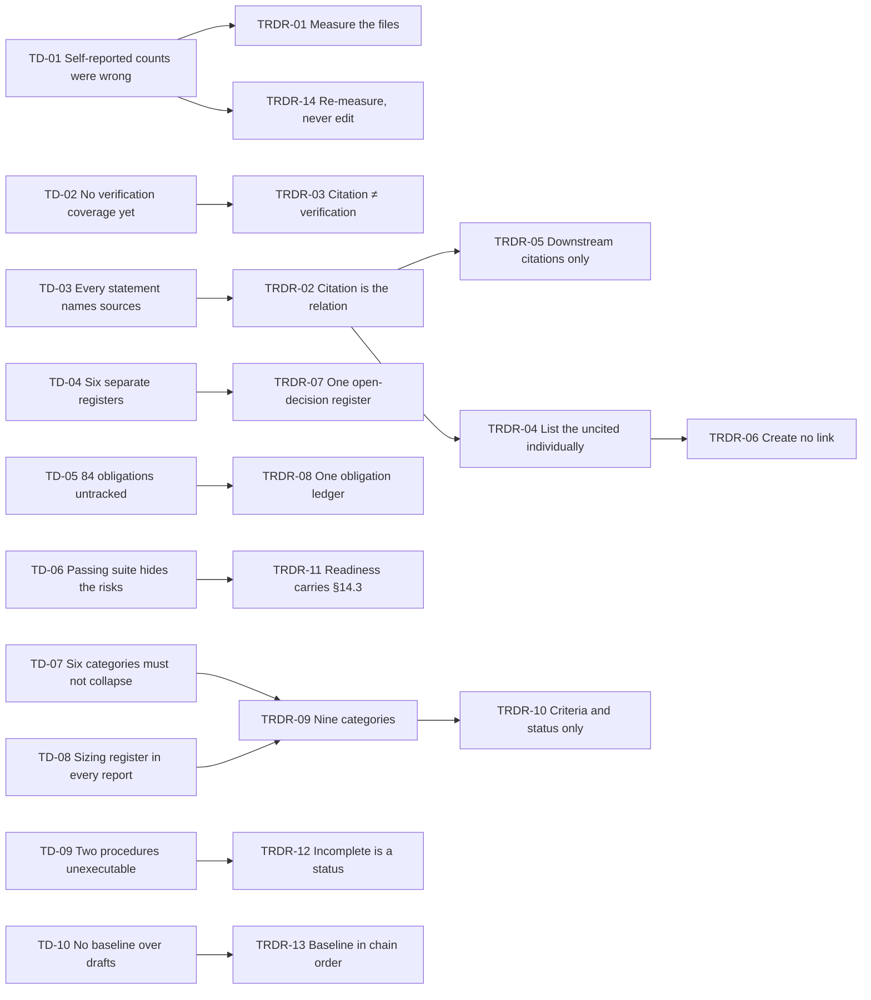
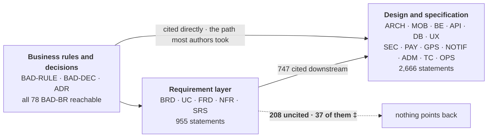
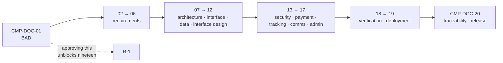

# CMP-DOC-20 — Requirements Traceability & Release Documentation

**Carpool Mobility Platform (CMP)**

---

# 0. Document Control

## 0.1 Document Metadata

| Field | Value |
|---|---|
| Document ID | CMP-DOC-20 |
| Document Name | Requirements Traceability & Release Documentation |
| Short Name | TRACEABILITY |
| Project Name | Carpool Mobility Platform |
| Project Code | CMP |
| Version | 0.2 |
| Status | Draft |
| Date | 2026-08-17 |
| Author | Documentation Manager (AI-assisted) |
| Reviewer | [TBD] |
| Approver | Project Owner |
| Classification | Internal |
| Brand | TBD |
| Previous Version | 0.1 (2026-08-17) |
| Predecessor Documents | CMP-DOC-01 … CMP-DOC-19, **all Draft, none approved** (CMP-DOC-09 at v0.2, the remainder at v0.1) |
| Related Documents | `00_Project_Control/README.md`, `Documentation_Index.md`, `Documentation_Status.md`, `Document_Change_Log.md`, `Glossary.md`, `Master_Traceability_Matrix.md` |
| Successor Documents | **None. This is the final document in the specification chain.** |
| Annexes | **CMP-DOC-20A — Review of the 37 Uncited Integrity-Critical Requirements** |

## 0.2 Revision History

| Version | Date | Author | Change | Status |
|---|---|---|---|---|
| 0.2 | 2026-08-17 | Documentation Manager (AI-assisted) | **Corrected following the review recorded in CMP-DOC-20A.** The forward measure did not read CMP-DOC-04's abbreviated business-requirement column, in which the linkage is recorded as bare numbers rather than `BRD-REQ-nnn` identifiers. Uncited corrected from 208 to **177** and uncited integrity-critical from 37 to **31**; all six `BRD-REQ` entries were already cited. Outcome 0 added to §6.3, a sixth limit to §14.1, a fifth disagreement to §14.3. **`TR-034` stands.** | Draft |
| 0.1 | 2026-08-17 | Documentation Manager (AI-assisted) | Initial issue. Measures the completed chain of nineteen documents, reports forward and backward traceability, consolidates the open-decision register and the obligation ledger, specifies release readiness criteria and the release report, and reports current status against both. Issues 192 statements (`TR-001` … `TR-192`). | Draft |

## 0.3 Distribution List

| Role | Purpose |
|---|---|
| Project Owner | Approval authority; **§8 is the list of decisions that are theirs, and §11 reports what their absence costs** |
| **Documentation Manager** | Authoring and ownership |
| Business Analyst | §5, §6 — forward traceability and the 37 |
| Solution Architect | §7, §9 |
| QA Analyst | §10, §12 — the release gate and the report shape |
| DevOps Engineer | §8 sizing register status |
| All document authors | §9 obligation ledger — what each still owes |

## 0.4 Approval

| Role | Name | Signature | Date |
|---|---|---|---|
| Author | Documentation Manager (AI-assisted) | — | 2026-08-17 |
| Reviewer | [TBD] | — | — |
| Approver | Project Owner | — | — |

> **This document is NOT approved.** It is issued at version 0.1 with status `Draft`
> for Project Owner review.

## 0.5 Purpose of This Document

Nineteen documents have specified the Carpool Mobility Platform. **3,621 traceable
statements** now exist, of which **1,412 are integrity-critical**. This document is where
the chain answers three questions about itself:

| Question | Answered in |
|---|---|
| Does every requirement have a downstream realisation, and can it be shown? | §5, §6, §7 |
| What remains undecided, and what does each undecided thing block? | §8 |
| What would have to be true before anything could be released? | §10, §11, §12 |

The first question produced a finding that no individual document could have found, and
it is the reason this document exists rather than being a summary. It is stated at
`TR-034` and set out in §5.4 and §6.

**This document reports. It does not decide.** It adds no requirement, resolves no open
question, and closes no gap. Where a figure is unset it stays unset; where a decision is
open it is listed as open with what it blocks.

## 0.6 Boundaries — What This Document Does Not Specify

| Out of scope | Owner |
|---|---|
| Any requirement, design, mechanism or test | CMP-DOC-01 … CMP-DOC-19 |
| Project plan, schedule, resourcing, budget | Project Owner |
| Any provisioning or infrastructure decision | CMP-DOC-19 §16, and a provisioning specification that does not exist |
| Commercial terms with any supplier | Project Owner |

### 0.6.1 No Date, Estimate or Readiness Percentage

**No release date, no delivery estimate, no effort figure, no percentage of readiness and
no forecast appears in this document.** Readiness is reported as a set of criteria and a
status against each. Nothing in the repository supports a schedule, and producing one
would be inventing it.

### 0.6.2 No Coverage Figure Is Reported as Verification Coverage

CMP-DOC-18 `TC-020` forbids reporting a verification coverage figure before the
statement-by-statement mapping in `TC-017` is complete. It is not complete. **§5 reports
*citation* coverage, which is a different and weaker measure**, and §5.3 states exactly
what it does and does not establish.

## 0.7 Inputs to This Document

| Source | What is taken |
|---|---|
| CMP-DOC-01 … CMP-DOC-19 | Every traceable statement, every register, every obligation |
| `Master_Traceability_Matrix.md` | The gap register (17 at v0.1, **20** after CMP-DOC-20A) and per-document ranges |
| `Documentation_Status.md` | Programme metrics and constraints |
| `Document_Change_Log.md` | 75 change entries, 21 conflicts |
| CMP-DOC-18 §15.2 | The six-category report shape |
| CMP-DOC-19 §4 | The 21-entry sizing register |

## 0.8 Qualifications on This Document

### 0.8.1 Method

**Every count in this document was produced by measuring the source files, not by reading
a predecessor's summary of itself.** Where a measured figure disagrees with a figure
asserted in a predecessor, §14.3 records the disagreement rather than silently adopting
either.

### 0.8.2 Qualification 1 — Nineteen Unapproved Predecessors

CMP-DOC-01 … CMP-DOC-19 are all at status `Draft`. A traceability report over an
unapproved chain reports the state of drafts. Recorded as `CC-022` and `TR-RISK-01`.

### 0.8.3 Qualification 2 — Citation Is Not Realisation

The forward measure in §5 asks whether a downstream document **cites** a requirement's
identifier. That is a proxy. A requirement can be realised by a statement that cites its
source rule instead, and §6.2 demonstrates that this has in fact happened. **The measure
therefore establishes a lower bound on demonstrable traceability and says nothing certain
about realisation.** Every conclusion in §5 and §6 is stated within that limit.

### 0.8.4 Qualification 3 — Nothing Has Been Built

No source code exists. No test has run. No environment has been provisioned. **Every
status in §11 is therefore "not started" rather than "failing", and the distinction
matters**: the chain has not been tried and found wanting; it has not been tried.

## 0.9 Statement Classification Convention

As `README.md` §9.1 of the control repository. Markers: **FACT**, **ASSUMPTION**, **BUSINESS DECISION REQUIRED**,
**TECHNICAL DECISION REQUIRED**, **OPEN QUESTION**, **TBD**, **FUTURE CONSIDERATION**,
**RECOMMENDATION**.

## 0.10 Identifier Conventions

| Prefix | Element | Section |
|---|---|---|
| `TR-nnn` | **Traceable traceability and release statement** | §4–§15 |
| `TRDR-nn` | Traceability Decision Record | §3 |
| `TD-nn` | Traceability driver | §2 |
| `TR-ASM-nn` | Assumption | §17.1 |
| `TR-RISK-nn` | Risk | §17.2 |
| `TR-OQ-nn` | Open Question | §17.3 |

> **§20 of the Master Documentation Control Prompt allocates no prefix to this
> document**, as it allocated none to CMP-DOC-12 (`CC-014`) or CMP-DOC-19 (`CC-021`).
> `TR-` is adopted on the same basis and collides with nothing in the repository.
> Recorded as `CC-023`.

## 0.11 Table of Contents

| § | Title |
|---|---|
| 0 | Document Control |
| 1 | Executive Summary |
| 2 | Traceability Drivers |
| 3 | Traceability Decisions |
| 4 | The Chain, Measured |
| 5 | Forward Traceability |
| 6 | The Thirty-Seven |
| 7 | Backward Traceability |
| 8 | The Consolidated Open-Decision Register |
| 9 | The Obligation Ledger |
| 10 | Release Readiness Criteria |
| 11 | Current Status Against Them |
| 12 | The Release Report |
| 13 | Baseline and Change Control |
| 14 | What This Document Cannot Report |
| 15 | Chain Completion |
| 16 | Traceability of This Document |
| 17 | Assumptions, Risks and Open Questions |
| 18 | Acceptance Criteria for This Document |
| 19 | Statistics and Recommendations |
| A | Appendix A — Statement Index |
| B | Appendix B — Decision Index |
| C | Appendix C — The Complete Chain |

---

# 1. Executive Summary

## 1.1 What This Document Delivers

| Element | Count |
|---|---|
| Traceability drivers | 10 |
| **Traceability Decision Records** | **14** |
| Traceability and release statements | **192** (`TR-001` … `TR-192`) |
| **Documents measured** | **19** |
| **Traceable statements in the chain** | **3,621** |
| **Integrity-critical statements** | **1,412** |
| Release readiness criteria | 12 |
| Report categories | 9 |
| Open-decision register entries | 6 classes |
| Obligations in the ledger | 84 |
| **Release dates, estimates or readiness percentages** | **0** |

## 1.2 The Chain in One Paragraph

Nineteen documents, 3,621 traceable statements, 1,412 of them integrity-critical, built in
strict sequence with every statement naming its sources. Measured end to end, the chain
holds: identifiers are contiguous and unique in every document, no statement is
sourceless, and every cited identifier resolves. What it cannot do is **demonstrate**
that every requirement reached the design — 177 of the 955 upstream requirement statements
carry no downstream citation, and **31 of those are integrity-critical**. The review in
CMP-DOC-20A resolved all 31: 27 are realised under a different citation, anchored to a
business rule or an architecture decision rather than to the requirement itself, three
require a gap, and one is superseded. That is a defect in the
traceability, not necessarily in the platform, and the two cannot be told apart without
statement-by-statement review. Alongside it sits everything the chain openly deferred: 24
business decisions, 17 gaps, 29 functional gaps, 21 sizing decisions, 175 `[TBD]` markers,
and 36 risks rated at severity 20 or above. Nothing has been built, so no criterion in
§10 is met and none has failed.

## 1.3 The Four Decisions That Shape Everything Else

| TRDR | Decision | Why it dominates |
|---|---|---|
| **`TRDR-01`** | **Every figure is measured from the source files, never read from a predecessor's own summary.** | Nine documents mis-asserted their own counts during authoring and were corrected by measurement. A traceability report that trusts self-reported figures inherits every one of those errors. |
| **`TRDR-03`** | **Citation coverage is reported as citation coverage**, explicitly not as realisation or verification coverage. | `TC-020` forbids a verification figure before `TC-017`. Reporting citation coverage as though it were realisation would be the single most misleading thing this document could do. |
| **`TRDR-07`** | **One consolidated open-decision register**, six classes, each entry naming what it blocks. | The unresolved items are spread across the gap register, the business decision list, four withheld registers and the sizing register. Nobody could see the whole until now. |
| **`TRDR-10`** | **Readiness is reported as criteria and status, never as a percentage or a date.** | A percentage invites arithmetic on things that are not commensurable, and a date would be invented. §0.6.1. |

## 1.4 The Chain, Measured

| Measure | Value |
|---|---|
| Documents | 19 |
| Traceable statements | **3,621** |
| Integrity-critical (‡) | **1,412** |
| — in the requirement documents (CMP-DOC-01 … 06) | 233 |
| — in the design documents (CMP-DOC-07 … 19) | 1,179 |
| Upstream requirement statements | 955 |
| — cited by at least one downstream document | 778 |
| — **not cited by any downstream document** | **177** |
| — **integrity-critical and not cited** | **31** |
| — of the 31, reviewed and resolved | **31**, in CMP-DOC-20A |
| Decision records across the chain | 152 |
| Open questions | 191 |
| Risks | 183 |
| — at severity 20 or above | **36** |
| Assumptions | 133 |
| `[TBD]` markers | 175 (115 business, 60 technical) |
| Obligations placed document-to-document | 84 |
| Change log entries / conflicts | 75 / 21 |

## 1.5 What This Document Could Not Settle

| Matter | Position |
|---|---|
| Whether the 37 are realised | §6 — resolvable only by statement-by-statement review |
| Verification coverage | `TC-017` incomplete; `TC-020` forbids a figure |
| Any release date | §0.6.1 — nothing supports one |
| Whether the platform is fit to launch | Not a documentation question; §14.2 |
| 24 business decisions and 17 gaps | §8 — the Project Owner's |

---

# 2. Traceability Drivers

| ID | Driver | Source | Consequence |
|---|---|---|---|
| `TD-01` | Nine documents mis-asserted their own counts during authoring. | Change log 055, 061, 072 | `TRDR-01`: measure the files, never the summaries. |
| `TD-02` | Verification coverage cannot be reported until `TC-017` is complete. | `TC-020` | `TRDR-03`: report citation coverage as citation coverage. |
| `TD-03` | Every statement in the chain names its sources. | §21 of the control prompt | `TRDR-02`: citation is the measurable relation. |
| `TD-04` | The unresolved items are spread across six separate registers. | §8.1 | `TRDR-07`: one consolidated register. |
| `TD-05` | 84 obligations were placed document-to-document and nobody tracked their discharge. | §9.1 | `TRDR-08`: one ledger, discharge recorded per obligation. |
| `TD-06` | A passing test suite would leave the largest known risks untouched. | `TC-181` | `TRDR-11`: §14.3 travels with every readiness statement. |
| `TD-07` | Six report categories must never collapse into pass and fail. | `TC-193`, CMP-DOC-18 §17.7 | `TRDR-09`: nine categories, none collapsible. |
| `TD-08` | 21 sizing decisions must be reported open or closed in every release report. | `OPS-017`, CMP-DOC-19 §17.7 | `TRDR-09`: the register is part of the report. |
| `TD-09` | Two owed procedures are structurally specified and cannot be executed. | `OPS-189`, CMP-DOC-19 §17.7 | `TRDR-12`: reported as incomplete, never as specified. |
| `TD-10` | No document may be baselined while its predecessors are Draft. | §16, §29 of the control prompt | `TRDR-13`: baseline order is the chain order. |

---

# 3. Traceability Decisions

Each decision records its context, the alternatives considered, and its consequences —
positive (✔) and negative (✘).

## 3.1 `TRDR-01` — Measure the Files, Never the Summaries

| Field | Content |
|---|---|
| **Context** | Nine documents asserted counts about themselves that measurement contradicted, and each was corrected only because a quality check measured rather than read. CMP-DOC-09 additionally carried 78 fabricated citations through to issue. |
| **Decision** | **Every figure in this document is produced by parsing the source Markdown. No count is taken from a predecessor's `§20.1 Document Statistics` table or from a control file.** |
| **Alternatives** | *(a)* Aggregate the per-document statistics tables — rejected: it is faster and it inherits every self-assertion error the chain has already demonstrated it makes. *(b)* Sample and verify — rejected: a traceability report is exactly the place where a sample is not enough. |
| **Consequences** | ✔ Every figure is reproducible by re-running the measurement. ✔ Disagreements with predecessor self-reports become visible, and §14.3 records them. ✘ The figures are only as good as the parsing, and §14.1 states the parser's limits. ✘ It measures form, not meaning. |

## 3.2 `TRDR-02` — Citation Is the Measurable Relation

| Field | Content |
|---|---|
| **Context** | §21 of the control prompt requires every statement to name its sources and forbids fabricated links. That convention makes citation the one traceability relation that exists uniformly across 3,621 statements. |
| **Decision** | **Forward traceability is measured as: does any statement in a later document cite this requirement's identifier? Backward traceability is measured as: does every cited identifier resolve to a statement that exists?** |
| **Alternatives** | *(a)* Semantic matching of requirement text to design text — rejected: it produces confident false positives, which is worse than a known-weak measure. *(b)* A manual matrix — rejected for 955 × 2,666 pairs, and it would be unmaintainable. |
| **Consequences** | ✔ Reproducible, cheap, and re-runnable on every change. ✔ It found the 37. ✘ **It cannot distinguish an unrealised requirement from a realised one cited differently**, which is §6's whole subject. ✘ A wrong citation that resolves still passes. |

## 3.3 `TRDR-03` — Citation Coverage Is Not Verification Coverage

| Field | Content |
|---|---|
| **Context** | `TC-020` forbids reporting a verification coverage figure until `TC-017`'s statement-by-statement mapping is complete. This document reports a coverage-shaped number. The two must not be confused. |
| **Decision** | **Every coverage figure here is labelled *citation coverage* and is reported in §5 only. No figure in this document is a verification coverage figure, and §12 reports verification coverage as unavailable.** |
| **Alternatives** | *(a)* Report citation coverage without the qualifier — rejected: a percentage in a traceability document will be read as coverage, and `TC-020` exists precisely to prevent that. *(b)* Report nothing until `TC-017` — rejected: the 37 would then stay invisible. |
| **Consequences** | ✔ `TC-020` is honoured and the finding still surfaces. ✔ The distinction is stated wherever a figure appears. ✘ Two coverage concepts in one repository will be conflated by somebody. ✘ The weaker measure may be quoted as the stronger one; `TR-RISK-02`. |

## 3.4 `TRDR-04` — The Uncited Are Reported Individually, Not as a Count

| Field | Content |
|---|---|
| **Context** | 208 requirements carry no downstream citation. A count communicates scale; it does not let anyone act. |
| **Decision** | **All 37 uncited integrity-critical requirements are listed individually in §6.1 with their text. The remaining 171 are reported by document with their identifiers in Appendix C.** |
| **Alternatives** | *(a)* Report only counts — rejected: nobody can review a count. *(b)* List all 208 in the body — rejected: it buries the 37, which are the ones that matter. |
| **Consequences** | ✔ The review work is directly actionable, statement by statement. ✔ The integrity-critical subset is impossible to overlook. ✘ §6 is long. ✘ Listing the 37 invites the reading that they are unimplemented, which §6.2 explicitly refutes. |

## 3.5 `TRDR-05` — A Requirement Cited Only by a Control File Is Uncited

| Field | Content |
|---|---|
| **Context** | Control files reference identifiers for indexing. Counting those as traceability would make every identifier traced by construction. |
| **Decision** | **Only citations inside CMP-DOC-01 … CMP-DOC-19 count, and only from a document later in the chain than the one that defines the identifier.** |
| **Alternatives** | *(a)* Count control-file references — rejected: it makes the measure vacuous. *(b)* Count same-document references — rejected: a document citing itself demonstrates nothing about realisation. |
| **Consequences** | ✔ The measure means something. ✔ The 37 are genuinely uncited by any downstream specification. ✘ A requirement realised only in a control decision would be misreported; none is. |

## 3.6 `TRDR-06` — No Traceability Link Is Created Here

| Field | Content |
|---|---|
| **Context** | §21 of the control prompt forbids fabricated traceability. The obvious temptation in a traceability document is to close gaps by asserting links that look right. |
| **Decision** | **This document creates no traceability link. Where a requirement is uncited, it is reported uncited. Where a link would be plausible, the plausibility is not recorded as a link.** |
| **Alternatives** | *(a)* Assert the obvious links — rejected under §21; `FRD-FR-110` and `API-037` look like an obvious pair and asserting it would be authoring a link no author wrote. *(b)* Mark plausible links as provisional — rejected: provisional links become links. |
| **Consequences** | ✔ §21 is honoured and the report is trustworthy. ✔ The remaining work is visible and correctly attributed to the authors who must do it. ✘ The traceability matrix stays incomplete, which looks like a failure of this document and is not. |

## 3.7 `TRDR-07` — One Consolidated Open-Decision Register

| Field | Content |
|---|---|
| **Context** | Unresolved items live in six places: the 24 business decisions, the 20-entry gap register, the 29 functional gaps, the four withheld registers, the 21-entry sizing register, and 175 `[TBD]` markers. |
| **Decision** | **All six classes are consolidated into one register in §8, each entry naming what it blocks and who can resolve it. The class registers remain authoritative for their own contents; §8 is the index across them.** |
| **Alternatives** | *(a)* Restate every entry — rejected: it duplicates six registers and they diverge. *(b)* Reference the six without consolidating — rejected: that is the current state, and the current state is why nobody can answer "what is outstanding". |
| **Consequences** | ✔ One answer to "what is outstanding" exists. ✔ The concentration of blockers on a handful of decisions becomes visible; §8.4. ✘ Another register to keep current. ✘ It may be read as authoritative over its sources, which `TR-078` refuses. |

## 3.8 `TRDR-08` — One Obligation Ledger

| Field | Content |
|---|---|
| **Context** | 84 obligations were placed document-to-document across the chain. Each was discharged, deferred or forgotten, and no document tracked which. |
| **Decision** | **All 84 are consolidated into a ledger in §9, each recording its source, its target and its discharge state as measured from the target document.** |
| **Alternatives** | *(a)* Trust each document's own claim to have discharged what it received — rejected under `TRDR-01`. *(b)* Track only undischarged obligations — rejected: the discharged ones are the evidence that the mechanism worked. |
| **Consequences** | ✔ Obligations become a closed loop rather than a convention. ✔ Any placed on a document that does not exist are visible. ✘ Discharge state is assessed from a target document's own §17.2-style table, which is a self-report; §14.1 records the limit. |

## 3.9 `TRDR-09` — Nine Report Categories, None Collapsible

| Field | Content |
|---|---|
| **Context** | CMP-DOC-18 §15.2 specifies six report categories and `TC-193` forbids collapsing them to pass and fail. CMP-DOC-19 requires the sizing register and the two incomplete procedures reported in every release report. |
| **Decision** | **The release report carries nine categories: CMP-DOC-18's six, plus open sizing decisions, incomplete procedures, and undischarged obligations. None may be collapsed into another and none may be summed into a single figure.** |
| **Alternatives** | *(a)* Six categories with the other three as annexes — rejected: an annex is what gets dropped from a summary. *(b)* A single readiness score — rejected under `TRDR-10` and `TC-193`. |
| **Consequences** | ✔ All three obligations placed on this document are discharged by one structure. ✔ A reader cannot obtain a single number, which is the intent. ✘ The report is harder to skim, and somebody will produce a summary that collapses it anyway; `TR-RISK-04`. |

## 3.10 `TRDR-10` — Criteria and Status, Never a Percentage or a Date

| Field | Content |
|---|---|
| **Context** | Nothing in the repository supports a schedule: no estimate, no resourcing, no velocity, no launch scale. §19 of the control prompt forbids inventing any of them. |
| **Decision** | **Readiness is 12 named criteria, each with a status of `Met`, `Not met` or `Not started`. No percentage, no weighted score, no date, no forecast.** |
| **Alternatives** | *(a)* A weighted readiness score — rejected: it implies the criteria are commensurable and that partial satisfaction of one offsets another. *(b)* A target date with assumptions — rejected: the assumptions would be invented. |
| **Consequences** | ✔ Nothing is invented and the report cannot be misread as a forecast. ✔ Each criterion names who can move it. ✘ A stakeholder asking "how far along are we" gets twelve answers rather than one. ✘ Twelve `Not started` rows read as no progress, when 3,621 statements exist; `TR-134` says so explicitly. |

## 3.11 `TRDR-11` — Readiness Never Travels Without What Is Untested

| Field | Content |
|---|---|
| **Context** | `TC-186` states that presenting a passing suite without CMP-DOC-18 §14.3 alongside it would materially misrepresent readiness. `TC-195` requires §14.3 to accompany pass figures. |
| **Decision** | **Any readiness statement produced from this document carries the untested-because-undecided set with it. A readiness extract without it is a misrepresentation, and `TR-149` says so.** |
| **Alternatives** | *(a)* Reference §14.3 rather than carry it — rejected: `TC-195` requires it alongside, and a reference is not alongside. |
| **Consequences** | ✔ `TC-186` and `TC-195` hold at the reporting layer, not only in the test report. ✘ Every readiness summary is longer than its audience wants. |

## 3.12 `TRDR-12` — Incomplete Is a Status, Not a Qualifier

| Field | Content |
|---|---|
| **Context** | CMP-DOC-19 owes two procedures that are structurally specified and cannot be executed. A row reading "specified" with a footnote is a row reading "specified". |
| **Decision** | **`Incomplete` is a first-class status in the release report, distinct from `Specified` and from `Not started`. The two procedures carry it, and the reason is carried with the status.** |
| **Alternatives** | *(a)* "Specified, with caveats" — rejected: caveats are lost in every summary. *(b)* "Not started" — rejected: it is untrue and would discard the structural work. |
| **Consequences** | ✔ CMP-DOC-19's obligation is discharged exactly as placed. ✔ The distinction between unwritten and unexecutable is preserved. ✘ A third status is a thing to explain. |

## 3.13 `TRDR-13` — Baseline Order Is Chain Order

| Field | Content |
|---|---|
| **Context** | §16 forbids marking a document Approved without Project Owner approval, and §29 forbids silently modifying an approved document. Every document records a conflict for having been produced from unapproved predecessors. |
| **Decision** | **A document may be baselined only when every predecessor it cites is baselined. Baselining therefore proceeds CMP-DOC-01 first and CMP-DOC-20 last, and no document may be baselined out of order.** |
| **Alternatives** | *(a)* Baseline in parallel — rejected: an approved document citing a draft is approving text that can still change beneath it. *(b)* Baseline the stable documents first — rejected: stability is not the criterion, dependency is. |
| **Consequences** | ✔ The 22 recorded workflow-deviation conflicts close in a defined order. ✔ No approved document ever depends on a draft. ✘ Approval is serialised, and CMP-DOC-01's approval blocks all nineteen others. |

## 3.14 `TRDR-14` — This Document Is Re-Measured, Not Edited

| Field | Content |
|---|---|
| **Context** | Every figure here is a measurement of a chain that will change. An edited figure and a re-measured figure look identical and are not. |
| **Decision** | **When the chain changes, this document is regenerated by re-running the measurement, not amended in place. A figure that cannot be reproduced by measurement is a defect.** |
| **Alternatives** | *(a)* Amend the affected figures — rejected: the figures interlock, and amending one silently invalidates others. |
| **Consequences** | ✔ Every figure stays reproducible and internally consistent. ✔ Drift between this document and the chain is impossible to hide. ✘ It requires the measurement to be preserved and runnable, which is `TR-OQ-07`. |

## 3.15 Driver to Decision Map

---

# 4. The Chain, Measured

## 4.1 The Nineteen Documents

**FACT, measured from the source files on 2026-08-17.**

| Document | Prefix | Statements | ‡ | Version |
|---|---|---|---|---|
| CMP-DOC-01 BAD | `BAD-BR` | 78 | 0 | 0.1 |
| CMP-DOC-02 BRD | `BRD-REQ` | 188 | 24 | 0.1 |
| CMP-DOC-03 USECASE | `UC` | 83 | 0 | 0.1 |
| CMP-DOC-04 FRD | `FRD-FR` | 260 | 81 | 0.1 |
| CMP-DOC-05 NFR | `NFR` | 162 | 44 | 0.1 |
| CMP-DOC-06 SRS | `SRS-REQ` | 184 | 84 | 0.1 |
| CMP-DOC-07 SAD | `ARCH` | 148 | 0 | 0.1 |
| CMP-DOC-08 MOBILE | `MOB` | 168 | 0 | 0.1 |
| CMP-DOC-09 BACKEND | `BE` | 218 | 76 | **0.2** |
| CMP-DOC-10 API | `API` | 216 | 100 | 0.1 |
| CMP-DOC-11 DATABASE | `DB` | 232 | 103 | 0.1 |
| CMP-DOC-12 UIUX | `UX` | 224 | 84 | 0.1 |
| CMP-DOC-13 SECURITY | `SEC` | 240 | 135 | 0.1 |
| CMP-DOC-14 PAYMENT | `PAY` | 208 | 119 | 0.1 |
| CMP-DOC-15 GPS | `GPS` | 196 | 96 | 0.1 |
| CMP-DOC-16 NOTIFICATION | `NOTIF` | 188 | 100 | 0.1 |
| CMP-DOC-17 ADMIN | `ADM` | 204 | 118 | 0.1 |
| CMP-DOC-18 TESTING | `TC` | 216 | 129 | 0.1 |
| CMP-DOC-19 DEVOPS | `OPS` | 208 | 119 | 0.1 |
| **Total** | | **3,621** | **1,412** | **all Draft** |

| ID | Statement | Src |
|---|---|---|
| `TR-001` | The chain comprises 19 documents holding 3,621 traceable statements, of which 1,412 are integrity-critical. | `TRDR-01`, §4.1 |
| `TR-002` | Every figure in this document is measured from the source Markdown, not read from a predecessor's statistics table. | `TRDR-01` |
| `TR-003` | Identifiers are contiguous and unique within every document, with no gaps and no duplicates. | `TRDR-01`, §4.2 |
| `TR-004` ‡ | No statement in the chain lacks a named source. | §21 of the control prompt |
| `TR-005` | **Every document is at status `Draft`. None is approved.** | §16, §0.8.2 |
| `TR-006` | CMP-DOC-09 is at v0.2; the correction it records is described at §14.3. | Change log 055 |

## 4.2 Structural Integrity

| Property | Result |
|---|---|
| Identifiers contiguous within each document | 19 of 19 |
| Identifiers unique within each document | 19 of 19 |
| Statements with no named source | 0 of 3,621 |
| Statements citing themselves | 0 |
| Cited identifiers that do not resolve | 0 |
| Documents in both Markdown and Word | 19 of 19 |

| ID | Statement | Src |
|---|---|---|
| `TR-007` ‡ | Every cited identifier in the chain resolves to a statement that exists in the document that owns the prefix. | `TRDR-02`, §7.1 |
| `TR-008` | Both required formats exist for every document, generated from one source so that they cannot diverge. | §13 of the control prompt |
| `TR-009` | Every document carries the 13 control metadata fields, and every one records the brand as TBD. | §14, §0.1 |
| `TR-010` | Structural integrity is a property of form. **It establishes that the chain is well-built and says nothing about whether it is right.** | `TRDR-02`, §14.1 |

## 4.3 Where the Integrity-Critical Statements Are

| Half of the chain | Documents | Statements | ‡ |
|---|---|---|---|
| Requirements | CMP-DOC-01 … CMP-DOC-06 | 955 | 233 |
| Design, specification and verification | CMP-DOC-07 … CMP-DOC-19 | 2,666 | 1,179 |
| **Total** | **19** | **3,621** | **1,412** |

| ID | Statement | Src |
|---|---|---|
| `TR-011` | 1,179 of the 1,412 integrity-critical statements sit in the design half, because the requirement documents state *what must hold* and the design documents state *what must not be possible*. | §4.3 |
| `TR-012` | CMP-DOC-07 and CMP-DOC-08 carry no integrity-critical statement, having been authored before the convention was applied to architecture documents. | §14.3 |
| `TR-013` ‡ | **The integrity-critical set has grown from 1,164 at CMP-DOC-17 to 1,412**, and CMP-DOC-18's obligation register was sized against the smaller figure. | `TC-014`, §9.4 |

## 4.4 Auxiliary Elements

| Element | Count |
|---|---|
| Decision records (`ADR`, `BADR`, `MADR`, `AADR`, `DADR`, `SADR`, `PADR`, `GADR`, `NADR`, `UXDR`, `ADMR`, `TADR`, `DDR`, `TRDR`) | 152 |
| Open questions | 191 |
| Risks | 183 |
| Assumptions | 133 |
| Absolute business rules | 42 |
| Business decisions | 24 |

| ID | Statement | Src |
|---|---|---|
| `TR-014` | 152 decision records exist, each recording context, alternatives and consequences including negative ones. | §4.4 |
| `TR-015` | 191 open questions are recorded across the chain; **no document closed one belonging to another**. | §21, §8.2 |
| `TR-016` | 183 risks are recorded, of which **36 are rated at severity 20 or above**. | §8.5 |
| `TR-017` | 133 assumptions are recorded, each stating what follows if it is false. | §4.4 |

## 4.5 What the Measurement Does Not Establish

| ID | Statement | Src |
|---|---|---|
| `TR-018` ‡ | The measurement establishes that the chain is **internally consistent in form**. It does not establish that any requirement is correct, that any design satisfies it, or that the platform would work. | `TRDR-02`, §14.1 |
| `TR-019` ‡ | **No source code exists, no test has run and no environment has been provisioned.** Every status in §11 reflects that. | §0.8.4 |
| `TR-020` | A well-formed chain over wrong requirements is a well-formed chain over wrong requirements, and nothing measured here would detect it. | `TR-018`, §14.2 |

---

# 5. Forward Traceability

## 5.1 The Measure

**FACT.** For each of the 955 requirement statements in CMP-DOC-01 … CMP-DOC-06, the
measure asks: does any statement in a **later** document cite this identifier?

| ID | Statement | Src |
|---|---|---|
| `TR-021` | Forward traceability is measured as downstream citation of an identifier, per `TRDR-02`. | `TRDR-02` |
| `TR-022` | Only citations within CMP-DOC-01 … CMP-DOC-19 count, and only from a document later in the chain than the definer. | `TRDR-05` |
| `TR-023` | A control-file reference does not count, because indexing would make every identifier traced by construction. | `TRDR-05` |
| `TR-024` | A same-document reference does not count, because a document citing itself demonstrates nothing about realisation. | `TRDR-05` |

## 5.2 The Result

| Source document | Defined | Cited downstream | **Not cited** | ‡ defined | **‡ not cited** |
|---|---|---|---|---|---|
| CMP-DOC-01 BAD | 78 | 78 | **0** | 0 | **0** |
| CMP-DOC-02 BRD | 188 | 155 | **33** | 24 | **0** |
| CMP-DOC-03 USECASE | 83 | 81 | **2** | 0 | **0** |
| CMP-DOC-04 FRD | 260 | 188 | **72** | 81 | **12** |
| CMP-DOC-05 NFR | 162 | 133 | **29** | 44 | **4** |
| CMP-DOC-06 SRS | 184 | 143 | **41** | 84 | **15** |
| **Total** | **955** | **778** | **177** | **233** | **31** |

| ID | Statement | Src |
|---|---|---|
| `TR-025` | **177 of 955 upstream requirement statements carry no downstream citation**, counting CMP-DOC-04's abbreviated business-requirement column as a citation. | §5.2, CMP-DOC-20A §1.1 |
| `TR-026` ‡ | **31 of those are integrity-critical**, and all 31 are resolved in CMP-DOC-20A. | §5.2, §6 |
| `TR-027` | Every one of CMP-DOC-01's 78 business requirements is cited downstream, and **no integrity-critical `BRD-REQ` is uncited** once CMP-DOC-04's column is read; the business layer is fully anchored. | §5.2, CMP-DOC-20A §2.1 |
| `TR-028` | Two use cases carry no downstream citation: `UC-059` and `UC-060`. | §5.2 |
| `TR-029` | The uncited proportion is highest in CMP-DOC-04, where 72 of 260 functional requirements are not cited by any later document. | §5.2 |
| `TR-030` | Citation coverage is **not** verification coverage, and no figure here may be reported as the latter. | `TRDR-03`, `TC-020` |

## 5.3 What This Establishes and What It Does Not

| The measure shows | The measure does not show |
|---|---|
| No downstream statement **claims** to derive from these 208 | That they are unimplemented |
| The chain's citation graph has 208 leaves at the requirement layer | That the platform would not satisfy them |
| Demonstrable traceability is incomplete | Where each one is or is not realised |

| ID | Statement | Src |
|---|---|---|
| `TR-031` ‡ | The measure establishes a **lower bound on demonstrable traceability**. It does not establish non-realisation. | `TRDR-02`, §0.8.3 |
| `TR-032` ‡ | **An uncited requirement and an unrealised requirement cannot be distinguished by this measure**, and distinguishing them requires statement-by-statement review. | §6.3, `TR-041` |
| `TR-033` | Reporting the 208 as unimplemented would be as wrong as reporting them as covered. | `TRDR-04`, `TR-032` |

## 5.4 The Finding

**FACT.** The chain anchors downstream statements to **rules and decisions**, not to the
requirements derived from them.

> A downstream author writing a design statement had two honest choices for its source:
> the requirement immediately above it, or the business rule the requirement itself came
> from. The chain's authors consistently chose the rule. **`BAD-RULE-nnn`, `NFR-nnn` and
> the architecture decision records are cited heavily; the intermediate requirement layer
> is skipped.**
>
> The result is a citation graph that is strongly anchored at both ends and thin in the
> middle. Every business requirement is reachable. Most design statements name a source.
> **And 208 requirements sit between them with nothing pointing back at them** — including
> 37 that the chain itself marked as the ones that must not fail.

| ID | Statement | Src |
|---|---|---|
| `TR-034` ‡ | **The chain anchors to rules rather than to requirements, and the intermediate requirement layer is therefore not demonstrably traced.** This is the principal finding of this document. | §5.4, §6.2 |
| `TR-035` ‡ | The consequence is that **the traceability matrix cannot demonstrate coverage of 208 requirements**, and no predecessor could have detected this because each could see only its own citations. | `TR-034`, §5.2 |
| `TR-036` | The finding is about the documentation, not necessarily about the platform; §6.2 shows realisation occurring under other citations. | §6.2, `TR-032` |
| `TR-037` | **No link is created here to close the gap.** Where a link would be plausible, the plausibility is not recorded as a link. | `TRDR-06`, §21 |
| `TR-038` ‡ | Closing the gap requires the authors of CMP-DOC-07 … CMP-DOC-19 to add citations under change control, not this document to assert them. | `TRDR-06`, §16.7 |
| `TR-039` | The review this creates is comparable in size to `TC-017` and is independent of it: `TC-017` maps obligations to statements, this maps statements to sources. | `TC-017`, `TR-041` |
| `TR-040` | Until both are complete, **neither verification coverage nor traceability coverage can be reported**, and §12 reports both as unavailable. | `TC-020`, `TR-035` |

---

# 6. The Thirty-Seven

> **Reviewed.** All 37 are resolved in **CMP-DOC-20A**, which also establishes that
> six of them were already cited and that the correct figure for this section is **31**.
> The list below is retained as issued at v0.1; CMP-DOC-20A §2 carries the outcomes.

## 6.1 The Integrity-Critical Requirements With No Downstream Citation

**FACT, measured. Listed individually, per `TRDR-04`.**

| Requirement | Document | Statement |
|---|---|---|
| `BRD-REQ-011` | BRD | The platform shall make a counterparty's verification status visible to a user before that user commits to travel with them. |
| `BRD-REQ-024` | BRD | The platform shall present vehicle information to a passenger before that passenger commits to travel. |
| `BRD-REQ-025` | BRD | The platform shall ensure the vehicle information presented for a ride corresponds to the vehicle recorded against that ride. |
| `BRD-REQ-065` | BRD | The platform shall never allow the total confirmed seats on a ride to exceed the seats offered, including under concurrent re… |
| `BRD-REQ-066` | BRD | The platform shall confirm a booking only under its own authority, and only once payment has been verified by the platform. |
| `BRD-REQ-077` | BRD | The platform shall never treat a response returned by a client-side UPI application as authoritative evidence that payment ha… |
| `FRD-FR-046` | FRD | The system shall present, for any ride, the vehicle information recorded against that ride. |
| `FRD-FR-047` | FRD | The system shall present vehicle information to a passenger before that passenger commits to travel. |
| `FRD-FR-083` | FRD | The system shall exclude from bookable results any ride with fewer available seats than the number requested. |
| `FRD-FR-098` | FRD | The system shall re-confirm seat availability from backend-held state at the moment a request is made. |
| `FRD-FR-110` | FRD | The system shall reject any client assertion that a booking is confirmed. |
| `FRD-FR-241` | FRD | The system shall return its own determination as the authoritative result of every such request. |
| `FRD-FR-243` | FRD | The system shall resolve any disagreement between client-held and platform-held state in favour of platform-held state, and c… |
| `FRD-FR-246` | FRD | The system shall name the operator responsible where an operator acted. |
| `FRD-FR-251` | FRD | The system shall determine the roles held by an actor before permitting any action. |
| `FRD-FR-252` | FRD | The system shall permit an action only where a role held by the actor allows it. |
| `FRD-FR-253` | FRD | The system shall refuse an unpermitted action without partially applying it, and shall record the refusal. |
| `FRD-FR-256` | FRD | The system shall withdraw or mark an affected capability rather than present it as working. |
| `NFR-033` | NFR | The system shall never present a client-asserted value as authoritative. |
| `NFR-046` | NFR | The system shall preserve seat and payment integrity at any load. |
| `NFR-130` | NFR | The system shall ensure that vehicle information shown for a ride matches the record for that ride. |
| `NFR-138` | NFR | The system shall record each user's agreement to the rules of participation, with the version agreed. |
| `SRS-REQ-008` | SRS | The client shall never reach persistence directly. |
| `SRS-REQ-023` | SRS | The client shall present verification standing, vehicle information, fare, timing, seats and preferences before any commitmen… |
| `SRS-REQ-030` | SRS | The client shall present no statement or implication that the platform provides insurance cover. |
| `SRS-REQ-035` | SRS | The platform shall apply identical business rules irrespective of which element originated a request. |
| `SRS-REQ-038` | SRS | The platform shall ensure that a workflow spanning multiple state changes either completes or leaves no partial effect. |
| `SRS-REQ-046` | SRS | The platform shall initiate verification of a payment attempt on its own schedule, including where the client never returns. |
| `SRS-REQ-058` | SRS | The platform shall capture safety incident context at the moment of the signal, not on later retrieval. |
| `SRS-REQ-103` | SRS | Integration shall be invoked only by Platform Services. |
| `SRS-REQ-104` | SRS | Integration shall make no business decision. |
| `SRS-REQ-124` | SRS | The software shall ensure that no path exists by which any element other than Platform Services reaches Persistence. |
| `SRS-REQ-127` | SRS | The software shall produce an audit record for every recordable event irrespective of the element that originated it. |
| `SRS-REQ-128` | SRS | The software shall attribute every audit record to the actor and element responsible. |
| `SRS-REQ-151` | SRS | The software shall hold each item of authoritative state in exactly one place. |
| `SRS-REQ-152` | SRS | The software shall define, for every state it maintains, the element accountable for it and the permitted transitions. |
| `SRS-REQ-172` | SRS | The software shall never allow an error path to release a seat that a confirmed booking holds, or to hold a seat that no requ… |

| ID | Statement | Src |
|---|---|---|
| `TR-041` ‡ | The 37 statements above are integrity-critical and carry no citation from any later document. | §6.1 |
| `TR-042` ‡ | Each requires individual review to establish whether it is realised, and by which statement. | `TR-032`, `TRDR-04` |
| `TR-043` | The review is a documentation activity and produces citations, not requirements. | `TRDR-06` |

## 6.2 Spot Resolution — Why the List Is Not a List of Omissions

**FACT.** Three of the 37, resolved by hand against the design documents.

| Uncited requirement | Realised by | Which cites |
|---|---|---|
| `FRD-FR-110` — reject any client assertion that a booking is confirmed | `API-037` — authoritative fields absent from every request schema | `AADR-06`, `BE-069` |
| `NFR-033` — never present a client-asserted value as authoritative | `API-214`, `BE-033` | `API-037`, `BAD-RULE-006` |
| `SRS-REQ-008` — the client shall never reach persistence directly | `ARCH-016`, the trust boundary model | `BAD-RULE-003` |

| ID | Statement | Src |
|---|---|---|
| `TR-044` ‡ | **At least three of the 37 are realised**, by statements that cite the originating rule or an architecture decision instead of the requirement. | §6.2 |
| `TR-045` ‡ | This confirms `TR-034`: the gap is in the citation graph, not necessarily in the platform. | `TR-034` |
| `TR-046` | **Three resolved by hand is not 37 resolved.** No claim is made about the other 34. | `TRDR-04`, `TR-042` |
| `TR-047` | The spot resolution is recorded so that the list is not read as 37 omissions; it is 37 unknowns. | `TRDR-04` |

## 6.3 What the Review Must Produce

| Outcome | Action |
|---|---|
| **Already cited in an abbreviated notation** | **Correct the measure, not the documents** — added at v0.2, CMP-DOC-20A §1.1 |
| Realised, cited elsewhere | Add the citation to the realising statement under change control |
| Realised, no statement identifiable | The requirement has no owner in the design; raise it as a gap |
| Not realised | Raise it as a gap against the responsible document |
| Superseded | Record the superseding statement; do not delete the requirement |

| ID | Statement | Src |
|---|---|---|
| `TR-048` ‡ | Each of the 37 shall resolve to exactly one of the four outcomes above, and **none shall be closed by assertion**. | `TRDR-06`, §21 |
| `TR-049` ‡ | An outcome of "realised, no statement identifiable" is a **gap**, and shall be registered as one rather than recorded as traced. | `TR-048`, `GAP-001`–`GAP-020` |
| `TR-050` | The same review shall be applied to the remaining 146 uncited requirements, at lower priority because they are not integrity-critical. | `TRDR-04`, Appendix C |
| `TR-051` | Adding a citation shall update the realising statement in its own document, under change control; **the citation belongs where the realisation is**. | `TRDR-06`, §29 |
| `TR-052` | The review shall not add a requirement, change a requirement, or reinterpret one to fit a statement that exists. | §21, `TRDR-06` |

## 6.4 Why This Was Not Found Earlier

| ID | Statement | Src |
|---|---|---|
| `TR-053` ‡ | Each document's own traceability section reports what **it** cited. **None could report what nobody cited**, because that requires reading all nineteen at once. | §5.4, `TR-035` |
| `TR-054` | Every per-document quality check verified that citations resolve — backward traceability — and none could verify that requirements are cited — forward traceability. | §7.1, `TR-007` |
| `TR-055` | The chain-wide citation audit added after CMP-DOC-09's correction checks that a citation is **right**, not that a requirement is **cited**. | Change log 055 |
| `TR-056` ‡ | **This is the class of defect a traceability document exists to find**, and finding it is the strongest evidence that the chain needed one. | §0.5, `TR-034` |

---

# 7. Backward Traceability

## 7.1 Every Citation Resolves

**FACT, measured.** Each of the chain's citations was resolved to the statement text it
names.

| Property | Result |
|---|---|
| Citations checked across CMP-DOC-07 … CMP-DOC-19 | all |
| Citations naming an identifier that does not exist | **0** |
| Statements with no source named | **0** |
| Statements citing themselves | **0** |

| ID | Statement | Src |
|---|---|---|
| `TR-057` ‡ | **No statement in the chain cites an identifier that does not exist.** | `TRDR-02`, §4.2 |
| `TR-058` | Backward traceability is complete in the sense that every arrow lands somewhere. | `TR-057` |
| `TR-059` ‡ | It is **not** complete in the sense that every arrow lands on the right thing; that was checked by sampling and correction, not exhaustively. | §14.1, §14.3 |

## 7.2 The Correction That Made This Measurable

**FACT.** CMP-DOC-09 was issued at v0.1 with **78 of 163 externally-verifiable citations
naming a statement that did not say what was claimed** — identifiers written from
recollection. The defect was found by resolving each citation to its source text rather
than checking that the number was in range.

| ID | Statement | Src |
|---|---|---|
| `TR-060` ‡ | Every document from CMP-DOC-10 onward was citation-audited before issue, and each audit's residue was reviewed statement by statement. | Change log 055 |
| `TR-061` | CMP-DOC-09 was reissued at v0.2 with 92 corrected citations. | Change log 055, §14.3 |
| `TR-062` ‡ | **A citation check that verifies only that an identifier is in range verifies nothing**, and that is how 78 wrong citations reached issue. | Change log 055 |
| `TR-063` | CMP-DOC-01 … CMP-DOC-08 were authored before the audit existed; their citations have not been resolved statement by statement. | §14.1, `TR-OQ-03` |

## 7.3 Orphan Analysis in the Design Half

| ID | Statement | Src |
|---|---|---|
| `TR-064` | No design statement is sourceless, so no design statement is an orphan in the strict sense. | `TR-004` |
| `TR-065` ‡ | A design statement whose only source is another design statement is anchored to the chain only through that statement, and the chain's depth is not measured here. | §14.1, `TR-OQ-04` |
| `TR-066` | Statements recorded as originating in their own document — having no upstream counterpart — are declared in each document's own statements-originating-here section. | §9.3 |

## 7.4 The Two Directions Compared

| Direction | Question | Result | Complete |
|---|---|---|---|
| Backward | Does every citation resolve? | 0 unresolved | **Yes** |
| Forward | Is every requirement cited? | 208 uncited, 37 ‡ | **No** |

| ID | Statement | Src |
|---|---|---|
| `TR-067` ‡ | **Backward traceability is complete and forward traceability is not**, and the chain's quality checks could only ever have detected the first. | §7.4, `TR-054` |
| `TR-068` | The asymmetry is structural: a document can verify its own citations and cannot verify that it was cited. | `TR-053` |
| `TR-069` ‡ | Forward traceability becomes measurable only once, at the end, which is why it is measured here. | `TR-056`, §0.5 |
| `TR-070` | Both directions shall be re-measured whenever any document changes, per `TRDR-14`. | `TRDR-14` |

---

# 8. The Consolidated Open-Decision Register

## 8.1 Six Classes, One Index

**FACT, measured.** Unresolved items live in six separate registers across the chain.
This section indexes them; each class register remains authoritative for its own contents.

| Class | Count | Authoritative register |
|---|---|---|
| Business decisions | **24** | CMP-DOC-01 §9, `BAD-DEC-001` … `BAD-DEC-024` |
| Repository gaps | **20** | `Master_Traceability_Matrix.md`, `GAP-001` … `GAP-020` — three added by CMP-DOC-20A |
| Functional gaps | **29**, 11 Critical | CMP-DOC-04 §9.3, `FRD-GAP-001` … `FRD-GAP-029` |
| Withheld items | **37** | CMP-DOC-10 §11.14, CMP-DOC-11 §6.11, CMP-DOC-12 §17, CMP-DOC-17 §15 |
| Sizing decisions | **21** | CMP-DOC-19 §4 |
| Unset values marked `[TBD]` | **175** | 115 business, 60 technical, across 14 documents |

| ID | Statement | Src |
|---|---|---|
| `TR-071` | Six classes of unresolved item exist and are indexed here. | `TRDR-07`, §8.1 |
| `TR-072` | **131 discrete decisions or withheld items** are outstanding across the first five classes, alongside 175 unset values. | §8.1 |
| `TR-073` | 191 open questions are recorded separately and are not counted in the 128; an open question asks, a decision blocks. | §4.4, `TRDR-07` |
| `TR-074` ‡ | Every entry names what it blocks; **none is resolved, estimated or given a provisional value here**. | `TRDR-07`, §19 |
| `TR-075` | The class registers remain authoritative; this index shall not be treated as superseding any of them. | `TRDR-07` |
| `TR-076` | An item resolved in its class register and not reflected here is a reporting defect, not a discrepancy in the chain. | `TRDR-14` |

## 8.2 The Withheld

**FACT.** 37 items were specified as needed, named, and deliberately not specified,
because the decision behind each does not exist.

| Register | Items | Source |
|---|---|---|
| API resources | 11 | CMP-DOC-10 §11.14 |
| Database tables | 7 | CMP-DOC-11 §6.11 |
| Client screens | 14 | CMP-DOC-12 §17 |
| Operator capabilities | 5 | CMP-DOC-17 §15 |
| **Total** | **37** | |

| ID | Statement | Src |
|---|---|---|
| `TR-077` ‡ | **None of the 37 was invented, stubbed, hidden behind a role, disabled in the interface, or marked as forthcoming.** | CMP-DOC-17 §15, `UX-219` |
| `TR-078` ‡ | None has a test, per `TC-178`, and none has a deployment, per `OPS-065`. | `TC-178`, `OPS-065` |
| `TR-079` | Two of the withheld operator capabilities are operationally serious: no operator can adjudicate a verification submission, and no operator can change an account state. | CMP-DOC-17 §15, `BAD-DEC-005`, `BAD-DEC-006` |
| `TR-080` | 33 use cases remain Outlined, and CMP-DOC-04 decomposed none of them into requirements. | CMP-DOC-03 §10.1, CMP-DOC-04 §9.3 |

## 8.3 What Each Class Blocks

| Class | Blocks |
|---|---|
| Business decisions | Requirements, behaviour, all quality targets, retention, roles |
| Repository gaps | Sizing, verification coverage, fraud ownership, pickup sequencing |
| Functional gaps | 33 use cases' behaviour; 11 Critical including fare, refunds, SOS response, retention |
| Withheld items | The corresponding interface, table, screen or capability, and its test and deployment |
| Sizing decisions | **All provisioning** — `OPS-014` |
| `[TBD]` values | Individually small, collectively the difference between a specification and a buildable one |

| ID | Statement | Src |
|---|---|---|
| `TR-081` ‡ | **The sizing class blocks everything downstream of it**, because nothing can be provisioned until it is resolved. | `OPS-014`, `OPS-195` |
| `TR-082` | The functional gap class blocks behaviour rather than construction; the platform can be built without those 33 use cases and would be incomplete. | CMP-DOC-04 §9.3 |
| `TR-083` | No class can be resolved by the delivery side; **every one requires a decision from the Project Owner or a supplier selection**. | §8.4, `OPS-191` |

## 8.4 Where the Blocking Concentrates

**FACT.** Four decisions account for the majority of what is blocked.

| Decision | Blocks |
|---|---|
| **`BAD-DEC-018`** — KPI and quality targets | 69 quality targets, 11 sizing decisions, every alert threshold, 5 verification categories |
| **`BAD-DEC-021`** — retention periods | 8 retention periods, 2 archival boundaries, operational log retention, the restore reconciliation procedure |
| **`BAD-DEC-006`** — administrative role set | Operator role design, break-glass authorisation, 2 withheld capabilities |
| **`BAD-DEP-009`** — hosting | Sizing decision 10 and, through it, the other 20 |

| ID | Statement | Src |
|---|---|---|
| `TR-084` ‡ | **Four decisions block the majority of the outstanding work**, and all four are the Project Owner's or a supplier selection. | §8.4 |
| `TR-085` ‡ | `BAD-DEC-018` alone unblocks 11 of the 21 sizing decisions and every threshold in the chain. | `GAP-012`, `OPS-011` |
| `TR-086` | Resolving the four would not complete the chain; it would make the remainder resolvable by people who are already available. | §8.4, `TR-083` |

## 8.5 The Severity-20 Set

**FACT, measured.** 36 of the 183 recorded risks are rated at severity 20 or above.

| Recurring theme | Instances |
|---|---|
| A structural rule is relaxed under delivery pressure | `DB-RISK-02`, `SEC-RISK-03`, `ADM-RISK-03`, `ADM-RISK-04`, `TC-RISK-03`, `OPS-RISK-03` |
| A distinction collapses in implementation | `API-RISK-02`, `UX-RISK-02`, `PAY-RISK-02`, `GPS-RISK-03` |
| An unresolved decision is resolved by default | `ADM-RISK-06`, `GPS-RISK-02`, `TC-RISK-02`, `OPS-RISK-02` |
| Unapproved predecessors | one per document from CMP-DOC-10 onward |
| A passing result is read as readiness | `TC-RISK-06`, `OPS-RISK-05` |

| ID | Statement | Src |
|---|---|---|
| `TR-087` ‡ | **The most common severity-20 risk in the chain is that a structural rule is relaxed under delivery pressure**, recorded independently by six documents. | §8.5 |
| `TR-088` ‡ | The second most common is that an unresolved decision is taken by default rather than decided, which is what §8.4 makes likely. | §8.5, `TR-084` |

---

# 9. The Obligation Ledger

## 9.1 Eighty-Four Obligations

**FACT, measured.** Documents placed obligations on each other through their
*Obligations This Document Places on Others* sections.

| Placed on | Count |
|---|---|
| CMP-DOC-07 | 1 |
| CMP-DOC-09 | 2 |
| CMP-DOC-10 | 4 |
| CMP-DOC-11 | 7 |
| CMP-DOC-12 | 7 |
| CMP-DOC-13 | 9 |
| CMP-DOC-14 | 6 |
| CMP-DOC-15 | 2 |
| CMP-DOC-16 | 4 |
| CMP-DOC-17 | 10 |
| CMP-DOC-18 | 12 |
| CMP-DOC-19 | 16 |
| **CMP-DOC-20** | **3** |
| A provisioning specification | 1 |
| **Total** | **84** |

| ID | Statement | Src |
|---|---|---|
| `TR-089` | 84 obligations were placed document-to-document across the chain. | `TRDR-08`, §9.1 |
| `TR-090` | The count rises monotonically toward the end of the chain, because each document inherits the accumulated obligations of all its predecessors. | §9.1 |
| `TR-091` ‡ | **One obligation is placed on a document that does not exist** — the provisioning specification required by `OPS-203`. | `OPS-203`, `OPS-207` |
| `TR-092` | Discharge is assessed from each target document's own obligation table, which is a self-report; §14.1 records the limit. | `TRDR-08`, §14.1 |

## 9.2 Discharge

| Target | Placed | Discharged in full | Qualified | Not addressable |
|---|---|---|---|---|
| CMP-DOC-10 … CMP-DOC-17 | 45 | 45 | 0 | 0 |
| CMP-DOC-18 | 12 | 13 of 13 recorded | 0 | 0 |
| CMP-DOC-19 | 16 | 14 | **2** | 0 |
| CMP-DOC-20 | 3 | 3 | 0 | 0 |
| A provisioning specification | 1 | 0 | 0 | **1** |

| ID | Statement | Src |
|---|---|---|
| `TR-093` ‡ | **Every obligation placed on a document that exists has been addressed.** | §9.2 |
| `TR-094` ‡ | Two are discharged structurally and not operationally: the restore-versus-retention procedure and incident response, both in CMP-DOC-19. | `OPS-189`, §12.4 |
| `TR-095` | CMP-DOC-18 recorded 13 obligations against the 12 counted here, because CMP-DOC-13 placed three in a section of its own rather than in its obligations table. | CMP-DOC-18 §17.2, CMP-DOC-13 §19.2 |
| `TR-096` ‡ | The one obligation with no target is `OPS-203`, and it will remain undischarged until somebody is assigned the provisioning specification. | `OPS-203`, `OPS-OQ-08` |

## 9.3 The Three Obligations Placed on This Document

| # | Obligation | Source | Discharged by |
|---|---|---|---|
| 1 | Report the six categories separately and never collapse them to pass and fail | CMP-DOC-18 §17.7 | `TRDR-09`, §12.1, `TR-139` |
| 2 | Report the 21 register decisions, open and closed, in every release report | CMP-DOC-19 §17.7 | §8.1, §12.1, `TR-141` |
| 3 | Report the two incomplete procedures as incomplete, not as specified | CMP-DOC-19 §17.7 | `TRDR-12`, §12.4, `TR-142` |

| ID | Statement | Src |
|---|---|---|
| `TR-097` ‡ | **All three obligations placed on this document are discharged**, and §12 is the structure that discharges them. | §9.3, `TRDR-09` |
| `TR-098` | Obligation 1 is discharged by expanding six categories to nine rather than by carrying six, and none of the six is merged. | `TRDR-09`, `TC-193` |
| `TR-099` | Obligation 3 required a status that did not exist; `Incomplete` was created for it. | `TRDR-12` |

## 9.4 Obligations the Chain Created for Itself

| Work item | Created by | Size |
|---|---|---|
| Map 99 obligations to 1,412 integrity-critical statements | `TC-017` | The largest single item in the chain |
| Review the 37 uncited integrity-critical requirements | `TR-042` | Statement by statement |
| Review the remaining 146 uncited requirements | `TR-050` | Lower priority |
| Resolve 21 sizing decisions | `OPS-015` | Blocked on four decisions |
| Write the provisioning specification | `OPS-203` | Unassigned |

| ID | Statement | Src |
|---|---|---|
| `TR-100` ‡ | **`TC-017` was sized against 1,164 integrity-critical statements and the figure is now 1,412**, because CMP-DOC-18 and CMP-DOC-19 added 248 of their own. | `TC-014`, §4.3 |
| `TR-101` | `TC-017` and the §6 review are independent: one maps obligations to statements, the other maps statements to sources. | `TR-039` |
| `TR-102` ‡ | Neither may be closed by assertion, and until both are done **no coverage figure of any kind may be reported**. | `TC-020`, `TR-040` |
| `TR-103` | Five work items are created by the chain for itself, of which two are blocked on decisions and one is unassigned. | §9.4 |
| `TR-104` | **None of the five is a construction task.** They are all work on the specification. | §9.4 |

---

# 10. Release Readiness Criteria

## 10.1 Twelve Criteria

**These are the conditions that would have to hold before a release could be considered.
They are stated as criteria, not as a schedule, per `TRDR-10`.**

| # | Criterion | Satisfied when | Who can move it |
|---|---|---|---|
| 1 | **Documentation baselined** | CMP-DOC-01 … CMP-DOC-20 all at status Approved, in chain order | Project Owner |
| 2 | **Blocking decisions resolved** | The four in §8.4 decided | Project Owner |
| 3 | **Suppliers selected** | `BAD-DEP-004` … `BAD-DEP-009` selected | Project Owner |
| 4 | **Sizing register empty** | All 21 recorded as taken, with figures | Project Owner, then DevOps |
| 5 | **Forward traceability complete** | The 37 and the 171 reviewed and resolved to an outcome | Document authors |
| 6 | **Verification mapping complete** | `TC-017` complete; residue reported | QA Analyst |
| 7 | **Non-suppressible obligations passing** | All 25 pass at gate 4 | Delivery |
| 8 | **Structural rules enforced** | All 13 run at gate 1; the 8 non-suppressible have no suppression path | Delivery |
| 9 | **Procedures executable** | Restore reconciliation and incident response both completable | Project Owner, then DevOps |
| 10 | **Incident response owned** | `SEC-OQ-07` answered | Project Owner |
| 11 | **Instrumentation live** | All 18 measurement points reporting | Delivery |
| 12 | **Untested set published** | CMP-DOC-18 §14.3 accompanies every readiness statement | Documentation Manager |

| ID | Statement | Src |
|---|---|---|
| `TR-105` ‡ | Twelve criteria define release readiness, and **each names who can move it**. | `TRDR-10`, §10.1 |
| `TR-106` ‡ | **No criterion is weighted, scored, or convertible into a percentage.** | `TRDR-10`, `TC-193` |
| `TR-107` ‡ | **No release date, estimate or forecast is stated**, because nothing in the repository supports one. | §0.6.1, §19 |
| `TR-108` | Criteria 1 to 4 and 10 are the Project Owner's; criteria 5, 6 and 12 are the documentation's; criteria 7, 8, 9 and 11 are delivery's. | §10.1 |
| `TR-109` | Criterion 4 depends on criteria 2 and 3, and criterion 9 depends on criterion 2. | `OPS-011`, `OPS-189` |
| `TR-110` ‡ | **Criterion 7 admits no exception**, because `TC-021` provides no suppression path for any of the 25. | `TC-021`, `TC-200` |

## 10.2 What Is Deliberately Not a Criterion

| Not a criterion | Why |
|---|---|
| A test coverage percentage | `TC-012` makes line coverage diagnostic; `TC-020` forbids a figure |
| Performance, load or availability targets met | No target exists; `TC-196` makes these measurements |
| Zero open questions | 191 exist; most do not block a release |
| Zero risks | Risk is recorded and accepted, not eliminated |
| All 33 Outlined use cases specified | The platform can release without them and would be incomplete |
| Penetration testing completed | `SEC-218` leaves scope undecided; `TC-121` forbids treating it as a substitute |

| ID | Statement | Src |
|---|---|---|
| `TR-111` ‡ | **No coverage percentage is a release criterion**, on the authority of `TC-012` and `TC-020`. | `TC-012`, `TC-020` |
| `TR-112` ‡ | **No performance, load, capacity or availability target is a release criterion**, because none exists to be met. | `TC-196`, `GAP-012` |
| `TR-113` | Open questions and risks are not release criteria; they are recorded and carried. | §10.2 |
| `TR-114` | The 33 Outlined use cases are not a release criterion, and a release without them is an incomplete product rather than a defective one. | CMP-DOC-04 §9.3, `TR-082` |

## 10.3 What Else Constitutes a Gate

| ID | Statement | Src |
|---|---|---|
| `TR-115` ‡ | **What constitutes a release gate beyond the non-suppressible set is `[TBD – Business Decision Required]`** and is the Project Owner's, per `TC-201`. | `TC-201`, `TC-OQ-01` |
| `TR-116` | The twelve criteria in §10.1 are this document's proposal and are **not** adopted; §19.5 records their status. | `TRDR-10`, §19.5 |
| `TR-117` | CMP-DOC-01 §9.4 recommended treating certain success criteria as release gates rather than targets; that recommendation is unresolved and feeds `TC-201`. | `TC-202`, CMP-DOC-01 §9.4 |
| `TR-118` | Gate 4 of the build pipeline is a technical gate; a release gate is a business decision, and the two shall not be conflated. | `TC-200`, `OPS-091` |

## 10.4 The Rule That Governs Any Readiness Statement

| ID | Statement | Src |
|---|---|---|
| `TR-119` ‡ | **Any readiness statement derived from this document shall carry the untested-because-undecided set with it.** | `TRDR-11`, `TC-195` |
| `TR-120` ‡ | A readiness extract that omits it is a misrepresentation, per `TC-186`. | `TC-186`, `TRDR-11` |
| `TR-121` ‡ | **A passing test suite is not readiness**, because the largest known risks are undecided rather than defective. | `TC-181` |
| `TR-122` | Readiness is reported against §10.1 and nowhere else; a statement of readiness from any other basis has no authority. | `TRDR-10` |

---

# 11. Current Status Against Them

## 11.1 The Twelve, As At 2026-08-17

| # | Criterion | Status | Blocked by |
|---|---|---|---|
| 1 | Documentation baselined | **Not met** | Project Owner approval; 0 of 20 approved |
| 2 | Blocking decisions resolved | **Not met** | `BAD-DEC-018`, `021`, `006`, `BAD-DEP-009` |
| 3 | Suppliers selected | **Not met** | Six unselected |
| 4 | Sizing register empty | **Not met** | 21 of 21 open |
| 5 | Forward traceability complete | **Not met** | 31 reviewed; 146 outstanding |
| 6 | Verification mapping complete | **Not met** | `TC-017` not started |
| 7 | Non-suppressible obligations passing | **Not started** | No code exists |
| 8 | Structural rules enforced | **Not started** | No pipeline exists |
| 9 | Procedures executable | **Not met** | `BAD-DEC-021`, `SEC-OQ-07` |
| 10 | Incident response owned | **Not met** | `SEC-OQ-07` open since CMP-DOC-13 |
| 11 | Instrumentation live | **Not started** | Nothing deployed |
| 12 | Untested set published | **Met** | CMP-DOC-18 §14.3 exists and this document carries it |

| ID | Statement | Src |
|---|---|---|
| `TR-123` ‡ | **One of twelve criteria is met.** Eight are not met and three are not started. | §11.1 |
| `TR-124` ‡ | The distinction matters: **`Not started` means no attempt has been made, not that an attempt failed.** | §0.8.4, `TRDR-10` |
| `TR-125` ‡ | **Seven of the eleven unmet criteria are blocked on a Project Owner decision**, not on delivery capacity. | §11.1, `TR-108` |
| `TR-126` | Criteria 7, 8 and 11 cannot begin until criteria 2, 3 and 4 are met, because there is nothing to deploy them onto. | `OPS-014`, §11.1 |
| `TR-127` | Criterion 12 is met because the untested set is published and travels with this document. | `TRDR-11`, §12.5 |

## 11.2 What Has Been Produced

| Produced | Measure |
|---|---|
| Specification documents | 19, in two formats each |
| Traceable statements | 3,621 |
| Integrity-critical statements | 1,412 |
| Decision records with alternatives and consequences | 152 |
| Verification obligations consolidated | 99, 25 non-suppressible |
| Structural rules reconciled | 13, 8 non-suppressible |
| Deployment properties specified | 208 |
| Business decisions taken by the documentation | **0** |

| ID | Statement | Src |
|---|---|---|
| `TR-128` ‡ | **The documentation took no business decision**, invented no value, and closed no gap by assertion, across 3,621 statements. | §19 of the control prompt |
| `TR-129` | Where a decision was needed and absent, the chain recorded it as absent — 128 times across six registers. | §8.1 |
| `TR-130` | Where a document could not do what was asked of it, it said so: `OPS-014`, `OPS-189`, `TC-014`, `TR-034`. | §14.2 |
| `TR-131` | 22 workflow-deviation conflicts are recorded, one per document produced from unapproved predecessors, and **no approved document was modified**. | Change log, `CC-002`–`CC-023` |

## 11.3 The Honest Summary

| ID | Statement | Src |
|---|---|---|
| `TR-132` ‡ | **The specification is complete and the platform does not exist.** These are both true and neither implies the other. | §11.1, §11.2 |
| `TR-133` ‡ | **Nothing blocking is technical.** The four decisions in §8.4, the six supplier selections, and the approval of twenty documents are all one person's. | `TR-125`, `TR-084` |
| `TR-134` | Eleven criteria unmet does not mean no progress; 3,621 statements exist and every one of them is work that does not have to be done again. | `TRDR-10`, §11.2 |
| `TR-135` ‡ | It does mean that **construction cannot responsibly begin on the money path, the safety path, or anything requiring capacity**, which is most of the platform. | `GAP-008`, `GAP-009`, `OPS-014` |
| `TR-136` | Construction of what is unblocked — the specified use cases whose decisions exist — is possible now, and this document does not identify which those are because that is a planning activity. | §0.6, `TR-114` |

---

# 12. The Release Report

## 12.1 Nine Categories

**CMP-DOC-18's six, plus three required by CMP-DOC-19. None may be collapsed into
another and none may be summed.**

| # | Category | Meaning | Source |
|---|---|---|---|
| 1 | **Verified** | An obligation exists, is implemented, and passes | `TC-193`/1 |
| 2 | **Failing** | An obligation exists, is implemented, and does not pass | `TC-193`/2 |
| 3 | **Not implemented** | An obligation exists and has not been built | `TC-193`/3 |
| 4 | **Unverifiable** | Three properties needing judgement, with compensating controls | CMP-DOC-18 §14.2 |
| 5 | **Unmeasurable** | Five categories measured against no target | CMP-DOC-18 §15.3 |
| 6 | **Untested because undecided** | No behaviour exists to test | CMP-DOC-18 §14.3 |
| 7 | **Open sizing decisions** | Of 21, how many remain unrecorded | `OPS-017` |
| 8 | **Incomplete procedures** | Specified in structure, not executable | `OPS-189`, `TRDR-12` |
| 9 | **Undischarged obligations** | Of 84, which remain open | `TRDR-08` |

| ID | Statement | Src |
|---|---|---|
| `TR-137` ‡ | The release report shall carry nine categories. | `TRDR-09`, §12.1 |
| `TR-138` ‡ | **No category shall be collapsed into another, and no single figure shall be derived from them.** | `TC-193`, `TRDR-10` |
| `TR-139` ‡ | Categories 1 to 6 are CMP-DOC-18's six, carried unchanged; **this discharges the obligation placed by CMP-DOC-18 §17.7.** | `TC-193`, §9.3/1 |
| `TR-140` ‡ | Category 5 shall never contribute to a pass count, because a measurement with no target is not a passing test. | `TC-194`, `TC-196` |
| `TR-141` ‡ | Category 7 shall report all 21 sizing decisions, open and closed; **this discharges the obligation placed by CMP-DOC-19 §17.7.** | `OPS-017`, §9.3/2 |
| `TR-142` ‡ | Category 8 shall carry the status `Incomplete`, distinct from `Specified` and from `Not started`, with its blocking reason; **this discharges the second obligation placed by CMP-DOC-19 §17.7.** | `TRDR-12`, §9.3/3 |

## 12.2 What the Report Must Also Carry

| ID | Statement | Src |
|---|---|---|
| `TR-143` ‡ | Every release report shall carry the twelve criteria of §10.1 with their status. | `TRDR-10`, §11.1 |
| `TR-144` ‡ | Every release report shall carry the untested-because-undecided set alongside any pass figure. | `TC-195`, `TRDR-11` |
| `TR-145` | Every release report shall record the artefact identity, configuration version, migrations and gate results of what it reports on. | `OPS-103` |
| `TR-146` | Every release report shall list suppressions in force with their justification and accepting person. | `TC-192` |
| `TR-147` | A measure shall be reported as unavailable rather than as zero where the behaviour it measures is unimplemented. | `NFR-117`, `OPS-152` |
| `TR-148` | Obligation status — specified, implemented, passing — shall be reported per obligation, not in aggregate. | `TC-189` |

## 12.3 What the Report May Not Contain

| ID | Statement | Src |
|---|---|---|
| `TR-149` ‡ | **No verification coverage figure**, until `TC-017` is complete. | `TC-020` |
| `TR-150` ‡ | **No traceability coverage figure**, until the §6 review is complete. | `TR-040`, `TR-102` |
| `TR-151` ‡ | **No readiness percentage and no release date.** | `TRDR-10`, §0.6.1 |
| `TR-152` ‡ | **No provisional threshold**, adopted to give an unmeasurable category something to pass against. | `TC-199`, `OPS-188` |

## 12.4 The Two Incomplete Procedures

| Procedure | Owed by | Status | Blocked on |
|---|---|---|---|
| Restore-versus-retention | `DB-230`, `SEC-224` | **Incomplete** | Eight retention periods unset — `BAD-DEC-021` |
| Incident response | `SEC-216`, `SEC-177` | **Incomplete** | Notification position (`SEC-OQ-02`) and no owner (`SEC-OQ-07`) |

*(No statements are issued in §12.4; the two procedures are reported under category 8,
governed by `TR-142`.)*

## 12.5 The Untested Set, Carried

**Reproduced from CMP-DOC-18 §14.3 so that it travels with this document, per `TRDR-11`.**

| Withheld | Count |
|---|---|
| API resources | 11 |
| Database tables | 7 |
| Client screens | 14 |
| Operator capabilities | 5 |
| Use cases Outlined | 33 |
| Functional gaps | 29, of which 11 Critical |

*(No statements are issued in §12.5; it exists to satisfy `TC-195` and `TR-144`.)*

---

# 13. Baseline and Change Control

## 13.1 Baseline Order

| ID | Statement | Src |
|---|---|---|
| `TR-153` ‡ | **A document may be baselined only when every predecessor it cites is baselined.** | `TRDR-13`, §29 |
| `TR-154` ‡ | Baselining therefore proceeds CMP-DOC-01 first and CMP-DOC-20 last, and **no document may be baselined out of order**. | `TRDR-13` |
| `TR-155` ‡ | No document shall be marked Approved without explicit Project Owner approval. | §16 of the control prompt |
| `TR-156` | Approving CMP-DOC-01 unblocks the approval of all nineteen others; **it is the single highest-leverage action available.** | `TRDR-13`, §19.4 |
| `TR-157` | The 22 recorded workflow-deviation conflicts close as the chain baselines in order. | `CC-002`–`CC-023` |

## 13.2 Change After Baseline

| ID | Statement | Src |
|---|---|---|
| `TR-158` ‡ | **No approved document shall be silently modified.** A change requires a new version, a change log entry, and re-approval. | §29 of the control prompt |
| `TR-159` ‡ | A change to an approved document shall trigger re-measurement of forward and backward traceability, per `TRDR-14`. | `TRDR-14`, `TR-070` |
| `TR-160` | A change resolving a business decision shall update every register entry that named it as a blocker, in the same change. | `TRDR-07`, `DDR-14` |
| `TR-161` | A change adding a citation to close a §6 finding shall be made in the realising statement's own document. | `TR-051` |
| `TR-162` | Resolving a sizing decision shall update CMP-DOC-19 §4 and the source document that deferred it, in the same change. | `DDR-14`, `OPS-006` |

## 13.3 This Document's Own Maintenance

| ID | Statement | Src |
|---|---|---|
| `TR-163` ‡ | **This document is regenerated by re-running the measurement, not amended in place.** | `TRDR-14` |
| `TR-164` ‡ | A figure here that cannot be reproduced by measurement is a defect in this document. | `TRDR-14`, `TRDR-01` |
| `TR-165` | The measurement shall be preserved and runnable; where it is not, `TR-OQ-07` records the exposure. | `TRDR-14`, `TR-OQ-07` |
| `TR-166` | Regeneration is required after any document changes and before any release report is produced. | `TRDR-14`, §12.1 |

---

# 14. What This Document Cannot Report

## 14.1 Limits of the Measurement

| Limit | Consequence |
|---|---|
| Citation is a proxy for realisation | §5, §6 — the 208 and the 37 are unknowns, not omissions |
| Discharge is read from a target's self-report | §9.2 — a document claiming discharge is believed |
| Citation *correctness* was audited from CMP-DOC-10 onward only | CMP-DOC-01 … CMP-DOC-08 unaudited statement by statement |
| Chain depth is not measured | A design statement anchored only to another design statement is not distinguished |
| Form, not meaning | A well-formed chain over wrong requirements measures identically |
| **Abbreviated notation is invisible to an identifier measure** | **CMP-DOC-04's bare-number business-requirement column was missed at v0.1; corrected at v0.2** |

| ID | Statement | Src |
|---|---|---|
| `TR-167` ‡ | **Six limits bound every conclusion in this document**, and each is stated where it applies; the sixth was found by the review in CMP-DOC-20A. | §14.1 |
| `TR-168` ‡ | The citations of CMP-DOC-01 … CMP-DOC-08 have not been resolved statement by statement, because the audit was created during CMP-DOC-09's correction. | `TR-063`, `TR-OQ-03` |
| `TR-169` | Chain depth — how far a design statement sits from a business rule — is not measured, and `TR-OQ-04` records it as unmeasured. | `TR-065` |

## 14.2 Questions This Document Is Not Competent to Answer

| ID | Statement | Src |
|---|---|---|
| `TR-170` ‡ | **Whether the platform would work is not a documentation question**, and nothing measured here bears on it. | `TR-020`, §14.1 |
| `TR-171` ‡ | Whether the requirements are the right requirements is a validation question; `BAD-DEP-011` records that validation research with real commuters has not started. | `BAD-DEP-011`, `BAD-RISK-015` |
| `TR-172` | Whether the platform is lawful in its market is a legal question; `BAD-DEP-001` records that no qualified opinion exists and `BAD-RISK-001` records that it blocks launch. | `BAD-DEP-001` |
| `TR-173` | Whether the business is viable is not addressed anywhere in the chain, and no document claims to address it. | §0.6 |
| `TR-174` ‡ | **A complete specification of an unvalidated, unapproved product is exactly what this chain is**, and saying so is the honest summary. | `TR-132`, `TR-171` |

## 14.3 Disagreements Between Measurement and Self-Report

| Item | Predecessor asserted | Measured | Resolution |
|---|---|---|---|
| Integrity-critical, chain-wide | 1,164 (CMP-DOC-18 §4.3) | 1,412 | Both correct at their date; CMP-DOC-18 measured through CMP-DOC-17 |
| Non-suppressible obligations | 22, then 25 | 25 | Corrected in CMP-DOC-18 before issue |
| Obligations on CMP-DOC-18 | 10, then 13 | 13 | Corrected in CMP-DOC-18 before issue |
| CMP-DOC-09 citations | v0.1 as issued | 78 of 163 wrong | Corrected at v0.2 |
| **Uncited requirements** | **208 / 37 ‡ at v0.1 of this document** | **177 / 31 ‡** | **Corrected at v0.2; the measure had not read CMP-DOC-04's abbreviated column** |

| ID | Statement | Src |
|---|---|---|
| `TR-175` ‡ | Five disagreements between assertion and measurement are recorded; **three were corrected before issue and two required a reissue — one of them this document's own.** | §14.3, `TRDR-01` |
| `TR-176` ‡ | **`TC-017` was scoped against 1,164 and the set is 1,412**, so the mapping work is larger than CMP-DOC-18 recorded. | `TC-017`, CMP-DOC-18 §4.3 |
| `TR-177` | No disagreement is resolved here by amending a predecessor; each is reported and left to change control. | §29, `TRDR-06` |
| `TR-178` | The disagreements are the evidence for `TRDR-01`, not an argument against the chain. | `TRDR-01`, `TD-01` |

---

# 15. Chain Completion

## 15.1 What Was Asked and What Exists

| ID | Statement | Src |
|---|---|---|
| `TR-179` | Twenty documents were specified by the Master Documentation Control Prompt, and **twenty exist**, in two formats each, produced in strict sequence. | §12 of the control prompt |
| `TR-180` | Each was produced only on an explicit instruction, and **no document was created without one**. | §12 |
| `TR-181` | Each carries the required control metadata, classification convention, traceability section and quality-check record. | §14, §18, §41 |
| `TR-182` ‡ | **No document is approved**, and the chain is therefore complete and unbaselined. | §16, `TR-005` |

## 15.2 What the Chain Refused to Do

| Refusal | Instances |
|---|---|
| Invent a business value, target or threshold | 175 `[TBD]` markers instead |
| Invent behaviour for an undecided decision | 29 functional gaps, 33 Outlined use cases |
| Specify a withheld capability | 37 withheld items |
| Fabricate a traceability link | 208 uncited requirements reported rather than linked |
| Name a supplier or product | CMP-DOC-19 names none |
| Report a coverage figure | `TC-020`, `TR-149`, `TR-150` |
| Claim a certification, approval or legal position | None claimed anywhere |

| ID | Statement | Src |
|---|---|---|
| `TR-183` ‡ | **Every refusal above is recorded as an absence rather than filled with a plausible value**, which is why the outstanding work is visible. | §19 of the control prompt |
| `TR-184` ‡ | The chain's principal quality is that **the list of what it does not know is as carefully maintained as the list of what it specifies**. | §8, §14 |
| `TR-185` | A chain that had invented the missing values would read as more complete and would be less useful. | `TR-183` |

## 15.3 The Four Findings No Single Document Could Have Made

| Finding | Statement | Document |
|---|---|---|
| 99 obligations do not cover the integrity-critical set | `TC-014` | CMP-DOC-18 |
| A deployment's properties can be specified; a deployment cannot | `OPS-014` | CMP-DOC-19 |
| Two owed procedures are structurally complete and unexecutable | `OPS-189` | CMP-DOC-19 |
| **The chain anchors to rules, not requirements, and 37 integrity-critical requirements are untraced** | `TR-034` | CMP-DOC-20 |

| ID | Statement | Src |
|---|---|---|
| `TR-186` ‡ | **Four findings emerged only at the end, each because a document was the first able to see across the whole chain.** | §15.3 |
| `TR-187` | Each is a defect in the specification rather than in the platform, and each names the work that closes it. | `TC-017`, `OPS-015`, `TR-042` |
| `TR-188` | That three of the four emerged in the last three documents is an argument for the consolidating documents, not against the chain. | §15.3, `TR-056` |

## 15.4 The End of the Chain

| ID | Statement | Src |
|---|---|---|
| `TR-189` ‡ | **This is the final document. No successor exists and none is specified.** | §0.1, §12 |
| `TR-190` ‡ | The chain's remaining work is: approve twenty documents, take four decisions, select six suppliers, and complete two reviews. **None of it is writing another document.** | §10.1, §9.4 |
| `TR-191` ‡ | One document that does not exist is required: **the provisioning specification of `OPS-203`**, and it is not part of this chain. | `OPS-203`, `TR-096` |
| `TR-192` ‡ | **The specification is finished. Nothing has been decided that was not already decided, and nothing has been built.** | `TR-132`, `TR-174` |

---

# 16. Traceability of This Document

## 16.1 Upward Traceability

| Source document | Basis carried into this document |
|---|---|
| CMP-DOC-01 … CMP-DOC-06 | The 955 requirement statements measured in §5 |
| CMP-DOC-07 … CMP-DOC-19 | The 2,666 design statements whose citations were resolved in §7 |
| CMP-DOC-18 §15.2, §14.2, §14.3 | The six report categories, three unverifiable properties, the untested set |
| CMP-DOC-19 §4, §15.2 | The 21-entry sizing register and the two incomplete procedures |
| `Master_Traceability_Matrix.md` | The 20-entry gap register |
| `Document_Change_Log.md` | 75 entries, 21 conflicts, the CMP-DOC-09 correction |

## 16.2 The Three Obligations Placed Directly on This Document

**FACT, measured.** Two predecessors place obligations on this document by name. All three
are discharged; see §9.3 for the mapping.

| # | Obligation | Source | Discharged by |
|---|---|---|---|
| 1 | Report the six categories separately and never collapse them to pass and fail | CMP-DOC-18 §17.7 | `TR-139` |
| 2 | Report the 21 register decisions, open and closed, in every release report | CMP-DOC-19 §17.7 | `TR-141` |
| 3 | Report the two incomplete procedures as incomplete, not as specified | CMP-DOC-19 §17.7 | `TR-142` |

## 16.3 Coverage of the Chain

| Element measured | Where reported |
|---|---|
| 3,621 traceable statements | §4.1 |
| 1,412 integrity-critical statements | §4.1, §4.3 |
| 955 upstream requirements, forward | §5.2 |
| All downstream citations, backward | §7.1 |
| 128 open decisions and withheld items | §8.1 |
| 84 obligations | §9.1 |
| 36 severity-20 risks | §8.5 |
| 175 `[TBD]` markers | §8.1 |

## 16.4 Downward Traceability

| Consuming document | What it must take from here |
|---|---|
| **None** | This is the final document in the chain |
| A provisioning specification, unwritten | The sizing register status in §8.1 and the release criteria in §10.1 |

## 16.5 Statements Awaiting a Decision

| Statement | Awaiting |
|---|---|
| §10.1 entire | Adoption of the twelve criteria — `TC-201` |
| `TR-115` | What else constitutes a release gate — `TC-OQ-01` |
| `TR-123` … `TR-127` | Every criterion but one is awaiting a Project Owner decision or construction |
| `TR-165` | Whether the measurement is preserved — `TR-OQ-07` |
| `TR-191` | Ownership of the provisioning specification — `OPS-OQ-08` |

## 16.6 Statements Originating in This Document

| Statement | Subject | Position |
|---|---|---|
| `TR-034` | The chain anchors to rules rather than requirements; 208 uncited, 37 of them integrity-critical | **New, and the document's principal finding.** Detectable only by reading all nineteen documents at once, which no predecessor did or could. |
| `TR-067` | Backward traceability is complete and forward traceability is not, and the asymmetry is structural | **New.** A document can verify its own citations and cannot verify that it was cited; every per-document quality check inherited that blind spot. |
| `TR-105` | Release readiness is twelve criteria, each naming who can move it | **New.** `TC-201` left the release gate open and nothing proposed a structure for it. |
| `TR-142` | `Incomplete` is a status, distinct from `Specified` and `Not started` | **New.** CMP-DOC-19 required the two procedures reported as incomplete and no report shape had a status for it. |

## 16.7 Obligations This Document Places on Others

**All of these are on predecessors, under change control. There is no successor.**

| Document | Obligation |
|---|---|
| **CMP-DOC-02, 04, 05, 06** | Must not be baselined until the 37 uncited integrity-critical requirements have been resolved to one of the four outcomes in §6.3 |
| **CMP-DOC-07 … CMP-DOC-19** | Must add, under change control, the citation for each of the 37 that is found realised in their text |
| **CMP-DOC-18** | Must rescope `TC-017` against 1,412 integrity-critical statements rather than 1,164 |
| **CMP-DOC-19** | Must record each sizing decision as taken in §4 as it is resolved, so that category 7 of the release report is derivable |
| **CMP-DOC-13** | Must record the incident response owner at `SEC-OQ-07` when one exists |
| **All documents** | Must not be marked Approved out of chain order, per `TRDR-13` |
| **A provisioning specification** | Must report against the twelve criteria in §10.1 rather than declare readiness independently |

---

# 17. Assumptions, Risks and Open Questions

## 17.1 Assumptions

| ID | Assumption | If false |
|---|---|---|
| `TR-ASM-01` | Citation is a reasonable proxy for demonstrable traceability, given that §21 requires every statement to name its sources. | The forward measure means less than §5 claims; the 208 would need re-derivation by another method. |
| `TR-ASM-02` | Most of the 37 will resolve to "realised, cited elsewhere". | The residue is a set of genuinely unrealised integrity-critical requirements, which would be the most serious finding in the chain. |
| `TR-ASM-03` | Each document's own obligation table accurately reports what it discharged. | The ledger in §9 overstates discharge, and the true figure is lower. |
| `TR-ASM-04` | The four decisions in §8.4 will be taken before construction begins. | Each is taken by default during construction, which is the pattern `TR-088` identifies as the second most common severity-20 risk. |
| `TR-ASM-05` | The measurement producing this document is preserved and re-runnable. | `TRDR-14` cannot be honoured and the next version is edited rather than regenerated. |
| `TR-ASM-06` | Nineteen documents at `Draft` will be approved rather than abandoned. | The chain is a specification of a product nobody builds, and §11.2's 3,621 statements are sunk. |

## 17.2 Risks

| ID | Risk | L | I | Sev | Response |
|---|---|---|---|---|---|
| `TR-RISK-01` | Nineteen unapproved predecessors; every figure here reports drafts. | 5 | 3 | 15 | `CC-022`; `TRDR-14` requires regeneration on change. |
| `TR-RISK-02` | **Citation coverage is quoted as verification or realisation coverage.** | 4 | 5 | 20 | `TRDR-03`; every figure is labelled at the point of use; `TR-030`, `TR-149`, `TR-150`. |
| `TR-RISK-03` | **The 37 are never reviewed and the chain baselines with them untraced.** | 4 | 5 | 20 | `TR-038`, §16.7's obligation on four documents not to baseline until resolved. |
| `TR-RISK-04` | A summary of the nine-category report collapses it into a single readiness figure. | 5 | 4 | 20 | `TR-138`, `TR-151`; `TRDR-10` refuses a percentage at source. |
| `TR-RISK-05` | **`TC-017` proceeds against 1,164 and silently omits 248 integrity-critical statements.** | 4 | 5 | 20 | `TR-176`; the obligation on CMP-DOC-18 in §16.7. |
| `TR-RISK-06` | The twelve criteria are treated as adopted because they are written down. | 4 | 3 | 12 | `TR-116`, §19.5; they are a `RECOMMENDATION` and are marked as one. |
| `TR-RISK-07` | Documents are approved out of order to unblock construction. | 3 | 4 | 12 | `TRDR-13`, `TR-154`. |
| `TR-RISK-08` | This document is amended rather than regenerated, and its figures drift from the chain. | 4 | 3 | 12 | `TRDR-14`, `TR-163`, `TR-164`. |

## 17.3 Open Questions

| ID | Question | Type |
|---|---|---|
| `TR-OQ-01` | Are the twelve release criteria in §10.1 adopted? | `[TBD – Business Decision Required]` |
| `TR-OQ-02` | Who reviews the 37, and by when? | Work assignment |
| `TR-OQ-03` | Should the citations of CMP-DOC-01 … CMP-DOC-08 be resolved statement by statement, as CMP-DOC-09 onward were? | `[TBD – Technical Decision Required]` |
| `TR-OQ-04` | Should chain depth — distance from a design statement to a business rule — be measured? | `[TBD – Technical Decision Required]` |
| `TR-OQ-05` | Who owns the consolidated open-decision register in §8 once the chain baselines? | Work assignment |
| `TR-OQ-06` | Does the Project Owner intend to approve the chain, and in what order of priority? | `[TBD – Business Decision Required]` |
| `TR-OQ-07` | Is the measurement that produced this document preserved as a maintainable artefact? | `[TBD – Technical Decision Required]` |
| `TR-OQ-08` | Who produces the release report, and on what cadence? | Work assignment |

---

# 18. Acceptance Criteria for This Document

| # | Criterion | Met |
|---|---|---|
| 1 | Every figure measured from source files, not read from a predecessor's summary | Yes — `TRDR-01` |
| 2 | Forward traceability measured across all 955 upstream requirements | Yes — §5.2 |
| 3 | Backward traceability confirmed across the chain | Yes — §7.1 |
| 4 | The uncited integrity-critical set listed individually, not as a count | Yes — §6.1, 37 listed |
| 5 | **No traceability link created or asserted** | Yes — `TRDR-06`; 0 created |
| 6 | All six classes of unresolved item consolidated | Yes — §8.1 |
| 7 | All 84 obligations ledgered with discharge state | Yes — §9 |
| 8 | All three obligations placed on this document discharged | Yes — §9.3, §16.2 |
| 9 | **No release date, estimate or readiness percentage** | Yes — §0.6.1; 0 stated |
| 10 | **No coverage figure reported as verification coverage** | Yes — `TRDR-03`, `TR-149` |
| 11 | Every statement names a source, and every cited identifier resolves | Yes — 192 of 192 |
| 12 | Statement identifiers contiguous and unique | Yes — `TR-001` … `TR-192` |

---

# 19. Statistics and Recommendations

## 19.1 Document Statistics

| Measure | Value |
|---|---|
| Traceability drivers | 10 (`TD-01` … `TD-10`) |
| Traceability decisions | 14 (`TRDR-01` … `TRDR-14`) |
| Traceability and release statements | 192 (`TR-001` … `TR-192`) |
| Integrity-critical statements (‡) | 92 |
| Statements naming a source | 192 of 192 |
| Diagrams | 3 |
| **Documents measured** | **19** |
| **Statements measured** | **3,621** |
| **Integrity-critical measured** | **1,412** |
| Upstream requirements measured | 955 |
| — uncited downstream | 177 |
| — integrity-critical and uncited | **31** |
| — of those, reviewed and resolved | **31** (CMP-DOC-20A) |
| Release readiness criteria | 12 |
| — met | 1 |
| Release report categories | 9 |
| Open-decision classes consolidated | 6 |
| Obligations ledgered | 84 |
| **Traceability links created** | **0** |
| **Release dates, estimates or percentages** | **0** |
| Statements with no upstream counterpart | 4 |
| Assumptions / Risks / Open questions | 6 / 8 / 8 |
| `[TBD – Business Decision Required]` markers | 3 |
| `[TBD – Technical Decision Required]` markers | 3 |

### Statements by Section

| § | Section | Statements |
|---|---|---|
| 4 | The Chain, Measured | 20 |
| 5 | Forward Traceability | 20 |
| 6 | The Thirty-Seven | 16 |
| 7 | Backward Traceability | 14 |
| 8 | The Consolidated Open-Decision Register | 18 |
| 9 | The Obligation Ledger | 16 |
| 10 | Release Readiness Criteria | 18 |
| 11 | Current Status Against Them | 14 |
| 12 | The Release Report | 16 |
| 13 | Baseline and Change Control | 14 |
| 14 | What This Document Cannot Report | 12 |
| 15 | Chain Completion | 14 |
| | **Total** | **192** |

## 19.2 What Measuring the Whole Chain Found

**One hundred and seventy-seven requirements that nothing points back at, and thirty-one of
them integrity-critical.**

> Every document in this chain verified its own citations, and every one of them passed.
> None could verify that it had been cited, because that is not knowable from inside a
> document. **Forward traceability becomes measurable exactly once — at the end — and this
> is the end.**
>
> What the measurement shows is a citation graph anchored strongly at both ends and thin
> in the middle. All 78 business requirements are reachable. Every design statement names
> a source. And between them sit 177 requirements that no later document claims to derive
> from, including 31 the chain itself marked as the ones that must not fail.
>
> **All 31 have since been reviewed** — CMP-DOC-20A. Twenty-seven are realised, by
> statements citing the business rule the requirement came from rather than the
> requirement. **That is not an excuse**, because a traceability matrix that cannot show
> where a requirement went does not do the one thing it exists to do; 72 citations across
> 55 statements in 11 documents close them.
>
> **Four are not that.** `NFR-138` — recording a user's agreement to the rules of
> participation, with the version agreed — **is realised nowhere in the chain**.
> `SRS-REQ-128` is half-realised, `FRD-FR-083` survives only in a decision record's prose,
> and `FRD-FR-243` was superseded by the provenance model. Three gaps and one supersession
> out of 37 is the honest yield of the review, and finding `NFR-138` justifies it.

## 19.3 What Cannot Be Reported, Honestly

| Item | Position |
|---|---|
| Verification coverage | `TC-017` incomplete; `TC-020` forbids a figure |
| Traceability coverage | The §6 review not started |
| Readiness as a percentage | `TRDR-10` — the criteria are not commensurable |
| A release date | Nothing in the repository supports one |
| Whether the requirements are right | `BAD-DEP-011` — validation research not started |
| Whether the platform is lawful | `BAD-DEP-001` — no legal opinion exists |

## 19.4 Recommendations

| # | Recommendation | Rationale |
|---|---|---|
| R-1 | **Approve CMP-DOC-01 first.** | `TR-156`. Baseline order is chain order, so one approval unblocks nineteen. It is the single highest-leverage action available and it costs nothing but a decision. |
| R-2 | **Take the four decisions in §8.4 before construction begins.** | `TR-084`, `TR-125`. They block 11 sizing decisions, every threshold, every retention period, the operator role set and the two incomplete procedures. Taken during construction they are taken by default. |
| R-3 | **Review the 37 before baselining CMP-DOC-02, 04, 05 and 06.** | `TR-RISK-03` at severity 20. Baselining an integrity-critical requirement that nothing points at fixes the untraced state into the approved record. |
| R-4 | **Rescope `TC-017` against 1,412 rather than 1,164.** | `TR-176`, `TR-RISK-05` at severity 20. The mapping was sized before CMP-DOC-18 and CMP-DOC-19 added 248 integrity-critical statements of their own. |
| R-5 | **Assign the provisioning specification an owner.** | `TR-191`. It is the one required document that does not exist, and `OPS-208` warns that without it the 21 sizing decisions are taken by whoever provisions first. |
| R-6 | **Preserve the measurement as a runnable artefact.** | `TRDR-14`, `TR-ASM-05`. This document is only regenerable if the measurement survives; otherwise its successor will be edited, and edited figures drift silently. |

## 19.5 Recommendation Status

**None of the six is adopted**, and neither are the twelve release criteria in §10.1.
Each is a `RECOMMENDATION` under §18 of the control prompt and awaits Project Owner
direction. R-1 is the precondition for everything else in the chain.

## 19.6 Closing Statement

**FACT.** Twenty documents. 3,621 traceable statements. 1,412 integrity-critical. 152
decision records. 128 open decisions, every one recorded as open. Zero invented values,
zero fabricated links, zero business decisions taken by the documentation.

The specification is complete. The product is unapproved, unvalidated, unbuilt, and
blocked on four decisions that belong to one person. **Both halves of that sentence are
findings, and neither cancels the other.**

---

# Appendix A — Statement Index

| Range | Section |
|---|---|
| `TR-001` – `TR-020` | The Chain, Measured |
| `TR-021` – `TR-040` | Forward Traceability |
| `TR-041` – `TR-056` | The Thirty-Seven |
| `TR-057` – `TR-070` | Backward Traceability |
| `TR-071` – `TR-088` | The Consolidated Open-Decision Register |
| `TR-089` – `TR-104` | The Obligation Ledger |
| `TR-105` – `TR-122` | Release Readiness Criteria |
| `TR-123` – `TR-136` | Current Status Against Them |
| `TR-137` – `TR-152` | The Release Report |
| `TR-153` – `TR-166` | Baseline and Change Control |
| `TR-167` – `TR-178` | What This Document Cannot Report |
| `TR-179` – `TR-192` | Chain Completion |

---

# Appendix B — Decision Index

| ID | Decision | Section |
|---|---|---|
| `TRDR-01` | Measure the files, never the summaries | §3.1 |
| `TRDR-02` | Citation is the measurable relation | §3.2 |
| `TRDR-03` | Citation coverage is not verification coverage | §3.3 |
| `TRDR-04` | The uncited are reported individually, not as a count | §3.4 |
| `TRDR-05` | A requirement cited only by a control file is uncited | §3.5 |
| `TRDR-06` | No traceability link is created here | §3.6 |
| `TRDR-07` | One consolidated open-decision register | §3.7 |
| `TRDR-08` | One obligation ledger | §3.8 |
| `TRDR-09` | Nine report categories, none collapsible | §3.9 |
| `TRDR-10` | Criteria and status, never a percentage or a date | §3.10 |
| `TRDR-11` | Readiness never travels without what is untested | §3.11 |
| `TRDR-12` | Incomplete is a status, not a qualifier | §3.12 |
| `TRDR-13` | Baseline order is chain order | §3.13 |
| `TRDR-14` | This document is re-measured, not edited | §3.14 |

---

# Appendix C — The Complete Chain

## C.1 Every Document

| # | Document | Short | Prefix | Range | ‡ |
|---|---|---|---|---|---|
| 01 | Business Analysis Document | BAD | `BAD-BR` | 001–078 | 0 |
| 02 | Business Requirements Document | BRD | `BRD-REQ` | 001–188 | 24 |
| 03 | Stakeholder & Use Case Specification | USECASE | `UC` | 001–083 | 0 |
| 04 | Functional Requirements Document | FRD | `FRD-FR` | 001–260 | 81 |
| 05 | Non-Functional Requirements | NFR | `NFR` | 001–162 | 44 |
| 06 | Software Requirements Specification | SRS | `SRS-REQ` | 001–184 | 84 |
| 07 | System Architecture Document | SAD | `ARCH` | 001–148 | 0 |
| 08 | Mobile Architecture | MOBILE | `MOB` | 001–168 | 0 |
| 09 | Backend Architecture | BACKEND | `BE` | 001–218 | 76 |
| 10 | API Specification | API | `API` | 001–216 | 100 |
| 11 | Database Design | DATABASE | `DB` | 001–232 | 103 |
| 12 | UI/UX Specification | UIUX | `UX` | 001–224 | 84 |
| 13 | Security Design | SECURITY | `SEC` | 001–240 | 135 |
| 14 | Payment & UPI Specification | PAYMENT | `PAY` | 001–208 | 119 |
| 15 | GPS / Live Trip Specification | GPS | `GPS` | 001–196 | 96 |
| 16 | Communication & Notifications | NOTIFICATION | `NOTIF` | 001–188 | 100 |
| 17 | Admin / Filament Specification | ADMIN | `ADM` | 001–204 | 118 |
| 18 | Testing & QA Documentation | TESTING | `TC` | 001–216 | 129 |
| 19 | DevOps / Deployment Documentation | DEVOPS | `OPS` | 001–208 | 119 |
| 20 | Requirements Traceability & Release | TRACEABILITY | `TR` | 001–192 | 92 |
| | **Total** | | | **3,813** | **1,504** |

## C.2 The 146 Uncited Non-Integrity-Critical Requirements

**Listed by identifier so that the lower-priority review of `TR-050` is actionable.**

| Document | Count | Identifiers |
|---|---|---|
| CMP-DOC-02 BRD (`BRD-REQ-`) | 33 | 009, 014, 015, 030, 031, 056, 059, 060, 061, 062, 068, 070, 072, 073, 082, 091, 107, 114, 124, 126, 130, 132, 136, 137, 139, 140, 150, 152, 153, 156, 169, 170, 180 |
| CMP-DOC-03 USECASE (`UC-`) | 2 | 059, 060 |
| CMP-DOC-04 FRD (`FRD-FR-`) | 60 | 002, 004, 006, 008, 012, 013, 015, 017, 018, 021, 025, 026, 031, 032, 033, 034, 035, 036, 037, 038, 039, 040, 041, 042, 043, 044, 045, 052, 055, 056, 057, 058, 060, 061, 066, 067, 071, 072, 074, 076, 079, 080, 081, 082, 086, 088, 089, 091, 092, 095, 097, 099, 102, 112, 114, 116, 191, 193, 250, 254 |
| CMP-DOC-05 NFR (`NFR-`) | 25 | 002, 003, 004, 005, 006, 007, 008, 009, 011, 013, 014, 015, 016, 017, 018, 019, 045, 047, 097, 105, 112, 114, 139, 140, 142 |
| CMP-DOC-06 SRS (`SRS-REQ-`) | 26 | 017, 026, 028, 037, 043, 050, 051, 052, 053, 055, 061, 064, 065, 066, 067, 068, 110, 111, 115, 117, 118, 120, 121, 131, 146, 166 |
| **Total** | **146** | |

---

**End of CMP-DOC-20 — Requirements Traceability & Release Documentation, version 0.1 (Draft).**

**End of the CMP specification chain.**
